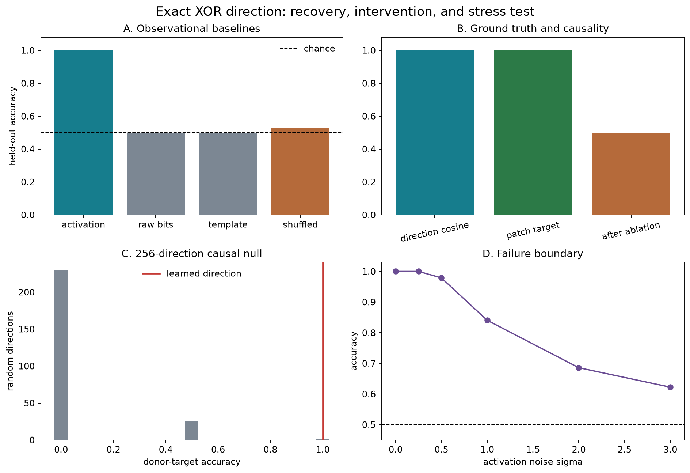
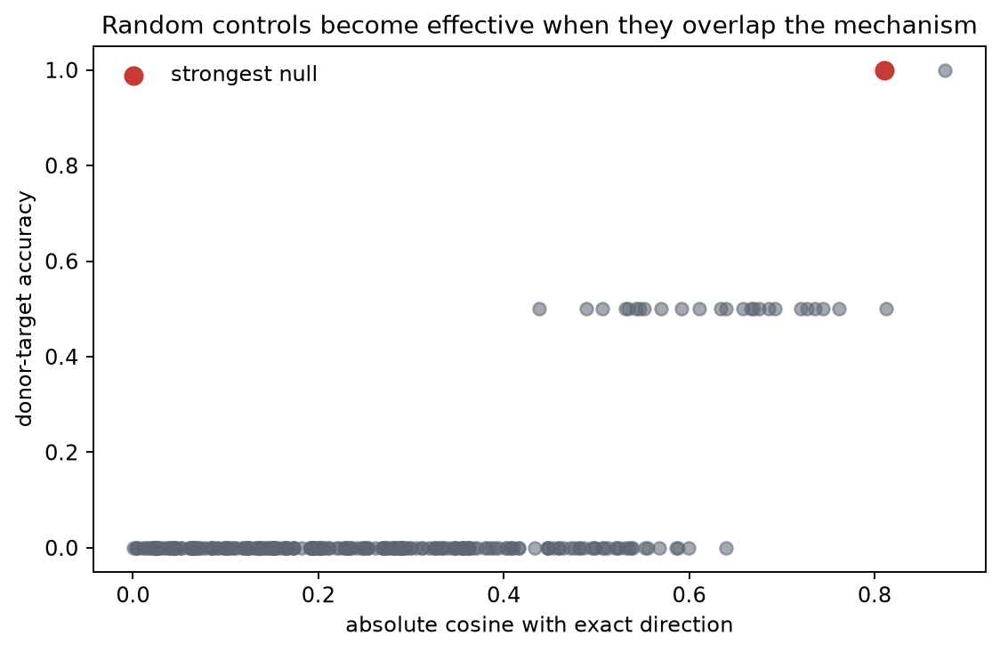

# [10.1] Capstone Research Sprint

> **Notebooks: [exercises](../../exercises/part1_capstone_research_sprint/10.1_Capstone_Research_Sprint_exercises.ipynb) | [solutions](../../exercises/part1_capstone_research_sprint/10.1_Capstone_Research_Sprint_solutions.ipynb)**

This page mirrors the exercise notebook. The solution dropdowns contain the
reference implementations, while every reported metric is produced by runnable
cells in the notebook.


**Claim.** A ridge direction learned from the hidden activations of an exact
parity model recovers its known distributed XOR mediator and supports causal
intervention on held-out templates.

By the end of this notebook, you will have run a complete small research
project: preregistration, exact ground truth, baselines, implementation,
held-out evaluation, causal controls, failure analysis, and a compact write-up.

## Core Question

The core question is:

> Can we identify a distributed XOR direction from observational data, then
> show that changing only this direction changes the model's answer?

This is a CPU-first exact model organism. It downloads no weights and uses no
cached scientific result.

```python
GT_TIER = "GT-4"
EXERCISE_ID = "10_1_capstone_research_sprint"
DIFFICULTY = 5
IMPORTANCE = 5
EXPECTED_RUNTIME = "45-70 minutes; under 10 seconds for the reference CPU run"
REQUIRES_GPU = True
```

## Learning Objectives

- Turn one mechanistic question into numerical pass/fail criteria before seeing results.
- Recover a hidden direction and compare it with exact ground truth.
- Keep train templates separate from a 32-example held-out template split.
- Distinguish decodability from causality with counterfactual activation patching.
- Use matched baselines, a random-direction distribution, and a stress test.
- Report both the successful result and the strongest anomaly in the controls.

## Cold open

Consider two signed bits. The model predicts `same` when their product is
positive and `different` when it is negative. A linear classifier on the two
raw bits cannot solve XOR. Inside the model, however, the parity feature is
computed and mixed across eight activation coordinates.

We know the exact causal direction because we built the organism. The research
challenge is to recover it without using that answer, then intervene on it.

```python
from __future__ import annotations

import sys
from dataclasses import dataclass
from pathlib import Path
from typing import Iterable

import matplotlib.pyplot as plt
import torch as t
from IPython.display import Markdown, display
from torch import Tensor

chapter = "chapter10_capstone_research_sprint"
root_dir = next(
    path for path in [Path.cwd(), *Path.cwd().parents] if (path / chapter).is_dir()
)
exercises_dir = root_dir / chapter / "exercises"
section_dir = exercises_dir / "part1_capstone_research_sprint"
assets_dir = root_dir / chapter / "instructions" / "assets"
if str(exercises_dir) not in sys.path:
    sys.path.append(str(exercises_dir))

import part1_capstone_research_sprint.tests as tests

D_MODEL = 8
ROTATION_SEED = 7
TRAIN_TEMPLATES = tuple(range(12))
HELDOUT_TEMPLATES = tuple(range(12, 20))
```

## Preregistered claim

We commit to the following claim and thresholds before fitting the probe:

> A ridge direction fitted on 48 balanced examples from templates `0..11`
> will recover the exact XOR direction with absolute cosine at least `0.98`,
> score at least `0.95` on 32 examples from unseen templates `12..19`, and
> reach at least `0.90` donor-target accuracy under counterfactual patching.

The claim fails if either raw bits or template features exceed `0.60`, or if
the learned patch does not beat the mean of 256 isotropic random directions
by at least `0.70`.

These criteria separate three questions: is XOR decodable, is the recovered
direction the known mechanism, and does intervening on it change behavior?

## Exact ground truth

For bits $a,b\in\{-1,+1\}$ and template $t$, define the latent vector

$$z=[a, b, ab, n_1(t),\ldots,n_5(t)].$$

The hidden activation is $h=zR^T$, where $R$ is a fixed orthogonal matrix.
The model's signed logit is $h\cdot R_{{:,2}}=ab$. Therefore
$R_{{:,2}}$ is the exact distributed XOR direction. Template features change
the activation but are balanced within every template and never set the label.

```python
@dataclass(frozen=True)
class ParityBatch:
    """Inputs, exact latent features, hidden activations, and XOR labels."""

    bits: Tensor
    template_ids: Tensor
    latent_features: Tensor
    activations: Tensor
    labels: Tensor

def make_rotation(seed: int = ROTATION_SEED, device: str | t.device = "cpu") -> Tensor:
    """Create the fixed orthogonal mixing matrix on CPU, then move it to device."""

    generator = t.Generator(device="cpu").manual_seed(seed)
    raw = t.randn(D_MODEL, D_MODEL, generator=generator, dtype=t.float64)
    q, r = t.linalg.qr(raw)
    signs = t.sign(t.diag(r))
    signs[signs == 0] = 1
    return (q * signs.unsqueeze(0)).to(device)

def template_nuisance(template_ids: Tensor) -> Tensor:
    """Five deterministic template features that never determine the label."""

    ids = template_ids.to(dtype=t.float64)
    scaled = (ids - 9.5) / 9.5
    alternating = t.where(template_ids.remainder(2) == 0, 1.0, -1.0).to(ids)
    return t.stack(
        [ids.sin(), ids.cos(), scaled, alternating, (2 * ids + 1).sin()],
        dim=-1,
    )

def predict_from_direction(activations: Tensor, direction: Tensor) -> Tensor:
    """Apply the model organism's binary linear readout convention."""

    scores = activations @ direction
    scores = t.where(scores.abs() < 1e-10, t.zeros_like(scores), scores)
    return (scores >= 0).long()
```

### Exercise 1 - build the balanced model-organism dataset

> **Difficulty:** 2/5 &nbsp;&nbsp; **Importance:** 5/5 &nbsp;&nbsp; **Time:** 10 minutes

Implement `make_parity_batch`. Each template must contain all four bit pairs.
Construct the exact parity feature, append five template nuisance features,
rotate the latent vector into activation space, and derive the label from parity.

```python
def make_parity_batch(template_ids: Iterable[int], rotation: Tensor) -> ParityBatch:
    '''Enumerate all bit pairs and run the exact hidden-state encoder.'''
    raise NotImplementedError("TODO: build the balanced exact model organism")

tests.test_make_parity_batch_has_exact_ground_truth(make_parity_batch, make_rotation)
```

<details>
    <summary>Expected output</summary>

    ```text
    All tests in `test_make_parity_batch_has_exact_ground_truth` passed!
    ```

    </details>

    <details>
    <summary>Help - common bug</summary>

    Start from the four rows `(-1,-1), (-1,+1), (+1,-1), (+1,+1)`. Repeat that block once per template. The parity column is the elementwise product of the two bit columns.

    </details>

    <details>
    <summary>Interpretation</summary>

    The test checks more than shapes: every template is balanced, the rotation is orthogonal, and projection onto the exact direction equals the signed label. This is the ground-truth anchor for every later claim.

    </details>

    <details>
    <summary>Solution</summary>

    ```python
    def make_parity_batch(template_ids: Iterable[int], rotation: Tensor) -> ParityBatch:
"""Enumerate all four bit pairs for each template and run the exact encoder."""

template_ids = tuple(int(template_id) for template_id in template_ids)
if not template_ids:
    raise ValueError("template_ids must contain at least one template")
device = rotation.device
bit_block = t.tensor(
    [[-1.0, -1.0], [-1.0, 1.0], [1.0, -1.0], [1.0, 1.0]],
    dtype=t.float64,
    device=device,
)
bits = bit_block.repeat(len(template_ids), 1)
ids = t.tensor(template_ids, dtype=t.long, device=device).repeat_interleave(4)
parity = bits[:, 0] * bits[:, 1]
nuisance = template_nuisance(ids)
latent_features = t.cat([bits, parity[:, None], nuisance], dim=1)
activations = latent_features @ rotation.T
labels = (parity > 0).long()
return ParityBatch(bits, ids, latent_features, activations, labels)
    ```

    </details>

```python
rotation = make_rotation()
exact_direction = rotation[:, 2]
train = make_parity_batch(TRAIN_TEMPLATES, rotation)
heldout = make_parity_batch(HELDOUT_TEMPLATES, rotation)

print(f"train examples: {len(train.labels)} across {len(TRAIN_TEMPLATES)} templates")
print(f"held-out examples: {len(heldout.labels)} across {len(HELDOUT_TEMPLATES)} templates")
print("first held-out rows: template, bits, label, exact logit")
for row in range(4):
    print(
        int(heldout.template_ids[row]),
        heldout.bits[row].tolist(),
        int(heldout.labels[row]),
        round(float(heldout.activations[row] @ exact_direction), 3),
    )
```

<details>
<summary>Expected output</summary>

```text
train examples: 48 across 12 templates
held-out examples: 32 across 8 templates
first held-out rows: template, bits, label, exact logit
12 [-1.0, -1.0] 1 1.0
12 [-1.0, 1.0] 0 -1.0
12 [1.0, -1.0] 0 -1.0
12 [1.0, 1.0] 1 1.0
```

</details>

Notice that the test split changes only the nuisance templates. It preserves
all four bit combinations, so accuracy cannot be inflated by class imbalance.

## Baselines and observational recovery

The main method is a closed-form ridge probe on hidden activations. We compare
it with the same estimator on the raw bits, the five template features, and
shuffled training labels. The raw-bit baseline is essential: if it solved XOR,
hidden-state recovery would be uninteresting.

### Exercise 2 - fit a ridge direction

> **Difficulty:** 2/5 &nbsp;&nbsp; **Importance:** 5/5 &nbsp;&nbsp; **Time:** 10 minutes

Map labels from `{0,1}` to `{-1,+1}` and solve
$(X^TX+\lambda I)w=X^Ty$. Keep the implementation in PyTorch so the same
research code can be repeated on another device.

```python
def fit_ridge_direction(features: Tensor, labels: Tensor, ridge: float = 1e-3) -> Tensor:
    '''Fit a linear direction to signed binary labels.'''
    raise NotImplementedError("TODO: solve the ridge normal equations")

def direction_accuracy(features: Tensor, labels: Tensor, direction: Tensor) -> float:
    """Return binary classification accuracy for a direction."""

    return float((predict_from_direction(features, direction) == labels).double().mean())

tests.test_ridge_probe_recovers_exact_direction_and_rejects_raw_baseline(
                    make_parity_batch,
                    make_rotation,
                    fit_ridge_direction,
                    direction_accuracy,
                )
```

<details>
    <summary>Expected output</summary>

    ```text
    All tests in `test_ridge_probe_recovers_exact_direction_and_rejects_raw_baseline` passed!
    ```

    </details>

    <details>
    <summary>Help - common bug</summary>

    Create an identity matrix with the same width, dtype, and device as `features`. Use `torch.linalg.solve`; do not form a matrix inverse.

    </details>

    <details>
    <summary>Interpretation</summary>

    Perfect held-out accuracy is not yet causal evidence. The exact-direction cosine is available only because this organism has known internals; on a real model, intervention evidence has to carry more weight.

    </details>

    <details>
    <summary>Solution</summary>

    ```python
    def fit_ridge_direction(features: Tensor, labels: Tensor, ridge: float = 1e-3) -> Tensor:
"""Fit a linear direction to signed binary labels with a closed-form ridge solve."""

if features.ndim != 2 or labels.shape != (features.shape[0],):
    raise ValueError("expected features [batch, d] and labels [batch]")
if ridge < 0:
    raise ValueError("ridge must be non-negative")
target = labels.to(features.dtype) * 2 - 1
identity = t.eye(features.shape[1], dtype=features.dtype, device=features.device)
return t.linalg.solve(features.T @ features + ridge * identity, features.T @ target)
    ```

    </details>

```python
def shuffled_label_baseline(
    train_features: Tensor,
    train_labels: Tensor,
    test_features: Tensor,
    test_labels: Tensor,
    *,
    n_shuffles: int = 128,
    seed: int = 11,
) -> Tensor:
    """Fit probes to permuted train labels and return held-out accuracies."""

    generator = t.Generator(device="cpu").manual_seed(seed)
    scores = []
    for _ in range(n_shuffles):
        permutation = t.randperm(len(train_labels), generator=generator).to(train_labels.device)
        direction = fit_ridge_direction(train_features, train_labels[permutation])
        scores.append(direction_accuracy(test_features, test_labels, direction))
    return t.tensor(scores, dtype=t.float64)

learned_direction = fit_ridge_direction(train.activations, train.labels)
raw_direction = fit_ridge_direction(train.bits, train.labels)
template_direction = fit_ridge_direction(train.latent_features[:, 3:], train.labels)

heldout_accuracy = direction_accuracy(
    heldout.activations, heldout.labels, learned_direction
)
raw_accuracy = direction_accuracy(heldout.bits, heldout.labels, raw_direction)
template_accuracy = direction_accuracy(
    heldout.latent_features[:, 3:], heldout.labels, template_direction
)
direction_cosine = float(
    t.nn.functional.cosine_similarity(
        learned_direction, exact_direction, dim=0
    ).abs()
)
shuffle_scores = shuffled_label_baseline(
    train.activations,
    train.labels,
    heldout.activations,
    heldout.labels,
)
print(f"held-out activation probe: {heldout_accuracy:.3f}")
print(f"raw-bit linear baseline: {raw_accuracy:.3f}")
print(f"template-only baseline: {template_accuracy:.3f}")
print(f"shuffled-label mean: {float(shuffle_scores.mean()):.3f}")
print(f"absolute cosine with exact direction: {direction_cosine:.6f}")
```

<details>
<summary>Expected output</summary>

```text
held-out activation probe: 1.000
raw-bit linear baseline: 0.500
template-only baseline: 0.500
shuffled-label mean: 0.525
absolute cosine with exact direction: 1.000000
```

</details>

<details>
<summary>Interpretation</summary>

The activation probe generalizes across nuisance templates and recovers the
known direction. Raw inputs remain at chance because XOR is not linearly
separable. Shuffled labels average near chance, though individual shuffles can
look much better; we return to that anomaly below.

</details>

## Held-out estimate

Accuracy differences must be paired because every method sees the same 32
held-out examples. Resampling the two accuracy numbers independently would
throw away that pairing.

### Exercise 3 - paired bootstrap interval

> **Difficulty:** 3/5 &nbsp;&nbsp; **Importance:** 4/5 &nbsp;&nbsp; **Time:** 10 minutes

Bootstrap the per-example correctness difference and return the observed
mean plus the 2.5% and 97.5% quantiles.

```python
def paired_bootstrap_delta_ci(
    method_correct: Tensor,
    baseline_correct: Tensor,
    *,
    n_resamples: int = 2_000,
    seed: int = 0,
) -> tuple[float, float, float]:
    '''Bootstrap a paired accuracy difference and return estimate, 95% interval.'''
    raise NotImplementedError("TODO: resample aligned example differences")

tests.test_paired_bootstrap_uses_example_pairs(paired_bootstrap_delta_ci)
```

<details>
        <summary>Expected output</summary>

        ```text
        All tests in `test_paired_bootstrap_uses_example_pairs` passed!
        ```

        </details>

        <details>
        <summary>Help - common bug</summary>

        Subtract the correctness vectors first. Draw one integer index matrix of shape `[n_resamples, n_examples]`, then average `delta[indices]` along the example axis.

        </details>

        <details>
        <summary>Interpretation</summary>

        A confidence interval quantifies finite-example uncertainty. It does not protect against a bad split, label leakage, or trying many hypotheses and reporting one.

        </details>

        <details>
        <summary>Solution</summary>

        ```python
        def paired_bootstrap_delta_ci(
    method_correct: Tensor,
    baseline_correct: Tensor,
    *,
    n_resamples: int = 2_000,
    seed: int = 0,
) -> tuple[float, float, float]:
    """Bootstrap a paired accuracy difference and return estimate, 95% interval."""

    if method_correct.shape != baseline_correct.shape or method_correct.ndim != 1:
        raise ValueError("correctness tensors must be one-dimensional and equally sized")
    delta = method_correct.to(t.float64) - baseline_correct.to(t.float64)
    generator = t.Generator(device="cpu").manual_seed(seed)
    sample_indices = t.randint(
        len(delta),
        (n_resamples, len(delta)),
        generator=generator,
        device="cpu",
    ).to(delta.device)
    bootstrap = delta[sample_indices].mean(dim=1).cpu()
    low, high = t.quantile(bootstrap, t.tensor([0.025, 0.975], dtype=t.float64))
    return float(delta.mean()), float(low), float(high)
        ```

        </details>

```python
activation_correct = (
    predict_from_direction(heldout.activations, learned_direction) == heldout.labels
)
raw_correct = predict_from_direction(heldout.bits, raw_direction) == heldout.labels
delta, delta_low, delta_high = paired_bootstrap_delta_ci(
    activation_correct, raw_correct
)
print(f"paired accuracy delta: {delta:+.3f}")
print(f"95% bootstrap interval: [{delta_low:+.3f}, {delta_high:+.3f}]")
```

<details>
<summary>Expected output</summary>

```text
paired accuracy delta: +0.500
95% bootstrap interval: [+0.312, +0.688]
```

</details>

The interval excludes zero, but the exact model structure and balanced split
are stronger evidence here than a p-value would be.

## Causal test

Decoding does not prove that the model uses a direction. For each held-out
recipient, we choose a donor with the same template and first bit but the
opposite second bit. This flips XOR while holding the nuisance template fixed.

A directional patch must replace only the scalar projection onto the tested
direction. The orthogonal residual must remain the recipient's.

### Exercise 4 - counterfactual directional patching

> **Difficulty:** 3/5 &nbsp;&nbsp; **Importance:** 5/5 &nbsp;&nbsp; **Time:** 15 minutes

Implement the projection replacement in `patch_along_direction`.

```python
def patch_along_direction(
    recipient_activations: Tensor,
    donor_activations: Tensor,
    direction: Tensor,
) -> Tensor:
    '''Replace only the recipient projection along direction.'''
    raise NotImplementedError("TODO: replace the scalar projection")

tests.test_directional_patch_replaces_only_the_named_projection(patch_along_direction)
```

<details>
        <summary>Expected output</summary>

        ```text
        All tests in `test_directional_patch_replaces_only_the_named_projection` passed!
        ```

        </details>

        <details>
        <summary>Help - common bug</summary>

        Normalize the direction. Add `((donor - recipient) @ unit_direction) * unit_direction` to each recipient row.

        </details>

        <details>
        <summary>Interpretation</summary>

        The semantic test separately checks the changed projection and the preserved orthogonal residual. A function that copies the entire donor activation will fail.

        </details>

        <details>
        <summary>Solution</summary>

        ```python
        def patch_along_direction(
    recipient_activations: Tensor,
    donor_activations: Tensor,
    direction: Tensor,
) -> Tensor:
    """Replace the recipient's projection along direction with the donor's projection."""

    unit = direction / direction.norm()
    coefficient_delta = (donor_activations - recipient_activations) @ unit
    return recipient_activations + coefficient_delta[:, None] * unit
        ```

        </details>

```python
def counterfactual_donor_indices(batch: ParityBatch) -> Tensor:
    """Pair each example with the same template and first bit, but flipped second bit."""

    indices = []
    for row in range(len(batch.labels)):
        matches = (
            (batch.template_ids == batch.template_ids[row])
            & (batch.bits[:, 0] == batch.bits[row, 0])
            & (batch.bits[:, 1] == -batch.bits[row, 1])
        )
        found = t.nonzero(matches, as_tuple=False).flatten()
        if len(found) != 1:
            raise RuntimeError("each recipient must have exactly one counterfactual donor")
        indices.append(found[0])
    return t.stack(indices)

def patch_target_accuracy(
    batch: ParityBatch,
    donor_indices: Tensor,
    patch_direction: Tensor,
    readout_direction: Tensor,
) -> float:
    """Measure whether a patch makes the model match the donor's answer."""

    patched = patch_along_direction(
        batch.activations,
        batch.activations[donor_indices],
        patch_direction,
    )
    predictions = predict_from_direction(patched, readout_direction)
    return float((predictions == batch.labels[donor_indices]).double().mean())

def random_direction_controls(
    batch: ParityBatch,
    donor_indices: Tensor,
    readout_direction: Tensor,
    *,
    n_directions: int = 256,
    seed: int = 13,
) -> tuple[Tensor, Tensor]:
    """Return patch scores and exact-direction alignments for isotropic controls."""

    generator = t.Generator(device="cpu").manual_seed(seed)
    directions = t.randn(
        n_directions,
        batch.activations.shape[1],
        generator=generator,
        dtype=t.float64,
    )
    directions = directions / directions.norm(dim=1, keepdim=True)
    directions = directions.to(batch.activations.device)
    exact_unit = readout_direction / readout_direction.norm()
    scores = t.tensor(
        [
            patch_target_accuracy(batch, donor_indices, direction, readout_direction)
            for direction in directions
        ],
        dtype=t.float64,
    )
    alignments = (directions @ exact_unit).abs().cpu()
    return scores, alignments

donor_indices = counterfactual_donor_indices(heldout)
learned_patch_accuracy = patch_target_accuracy(
    heldout, donor_indices, learned_direction, exact_direction
)
exact_patch_accuracy = patch_target_accuracy(
    heldout, donor_indices, exact_direction, exact_direction
)
random_patch_scores, random_alignments = random_direction_controls(
    heldout, donor_indices, exact_direction
)
learned_unit = learned_direction / learned_direction.norm()
ablated = heldout.activations - (
    heldout.activations @ learned_unit
)[:, None] * learned_unit
ablation_accuracy = direction_accuracy(
    ablated, heldout.labels, exact_direction
)
print(f"learned-direction donor-target accuracy: {learned_patch_accuracy:.3f}")
print(f"exact-direction donor-target accuracy: {exact_patch_accuracy:.3f}")
print(f"random-direction mean: {float(random_patch_scores.mean()):.3f}")
print(f"random-direction 95th percentile: {float(t.quantile(random_patch_scores, 0.95)):.3f}")
print(f"accuracy after learned-direction ablation: {ablation_accuracy:.3f}")
```

<details>
<summary>Expected output</summary>

```text
learned-direction donor-target accuracy: 1.000
exact-direction donor-target accuracy: 1.000
random-direction mean: 0.057
random-direction 95th percentile: 0.500
accuracy after learned-direction ablation: 0.500
```

</details>

<details>
<summary>Interpretation</summary>

The learned patch reaches the donor answer on all held-out pairs and matches
the intervention along the exact direction. Ablation drops behavior to chance.
Random directions usually do nothing, but their upper tail matters because a
random vector can accidentally overlap the mechanism.

</details>

## Failure analysis

A successful clean result can still be brittle. We now add isotropic
measurement noise to held-out activations. The same sampled noise vector is
scaled at each level, which makes the stress trajectory easy to interpret.

### Exercise 5 - find the noise failure boundary

> **Difficulty:** 3/5 &nbsp;&nbsp; **Importance:** 4/5 &nbsp;&nbsp; **Time:** 10 minutes

Repeat each held-out activation, sample standard Gaussian noise once, scale it
by each sigma, and measure probe accuracy.

```python
def noise_sweep_accuracy(
    activations: Tensor,
    labels: Tensor,
    direction: Tensor,
    sigmas: Tensor,
    *,
    repeats: int = 128,
    seed: int = 123,
) -> Tensor:
    '''Measure accuracy under progressively stronger activation noise.'''
    raise NotImplementedError("TODO: reuse one sampled noise tensor across sigmas")

tests.test_noise_sweep_is_reproducible_and_exposes_failure(noise_sweep_accuracy)
```

<details>
        <summary>Expected output</summary>

        ```text
        All tests in `test_noise_sweep_is_reproducible_and_exposes_failure` passed!
        ```

        </details>

        <details>
        <summary>Help - common bug</summary>

        Use `repeat_interleave` for activations and labels. Sample one standard-noise tensor with a CPU generator, move it to the activation device, then reuse it for every sigma.

        </details>

        <details>
        <summary>Interpretation</summary>

        This test estimates robustness to activation measurement noise. It does not simulate every kind of representation shift in a real transformer.

        </details>

        <details>
        <summary>Solution</summary>

        ```python
        def noise_sweep_accuracy(
    activations: Tensor,
    labels: Tensor,
    direction: Tensor,
    sigmas: Tensor,
    *,
    repeats: int = 128,
    seed: int = 123,
) -> Tensor:
    """Measure probe accuracy as isotropic activation noise increases."""

    generator = t.Generator(device="cpu").manual_seed(seed)
    expanded = activations.repeat_interleave(repeats, dim=0)
    expanded_labels = labels.repeat_interleave(repeats)
    standard_noise = t.randn(
        expanded.shape,
        generator=generator,
        dtype=activations.dtype,
        device="cpu",
    ).to(activations.device)
    accuracies = []
    for sigma in sigmas:
        noisy = expanded + float(sigma) * standard_noise
        accuracies.append(direction_accuracy(noisy, expanded_labels, direction))
    return t.tensor(accuracies, dtype=t.float64)
        ```

        </details>

```python
sigmas = t.tensor([0.0, 0.25, 0.5, 1.0, 2.0, 3.0], dtype=t.float64)
noise_accuracies = noise_sweep_accuracy(
    heldout.activations,
    heldout.labels,
    learned_direction,
    sigmas,
)
for sigma, accuracy in zip(sigmas, noise_accuracies):
    print(f"sigma={float(sigma):>4.2f}  accuracy={float(accuracy):.3f}")
```

<details>
<summary>Expected output</summary>

```text
sigma=0.00  accuracy=1.000
sigma=0.25  accuracy=1.000
sigma=0.50  accuracy=0.979
sigma=1.00  accuracy=0.841
sigma=2.00  accuracy=0.686
sigma=3.00  accuracy=0.622
```

</details>

# Signature Result

The next cell builds the result from the arrays computed above. The static
image beneath it is the same figure for the instruction page; it is not loaded
as experimental evidence by the notebook.

```python
baseline_names = ["activation", "raw bits", "template", "shuffled"]
baseline_values = [
    heldout_accuracy,
    raw_accuracy,
    template_accuracy,
    float(shuffle_scores.mean()),
]

fig, axes = plt.subplots(2, 2, figsize=(11, 7.5), constrained_layout=True)
colors = ["#167D8D", "#7C8793", "#7C8793", "#B56A3A"]
axes[0, 0].bar(baseline_names, baseline_values, color=colors)
axes[0, 0].axhline(0.5, color="black", linestyle="--", linewidth=1, label="chance")
axes[0, 0].set_ylim(0, 1.08)
axes[0, 0].set_ylabel("held-out accuracy")
axes[0, 0].set_title("A. Observational baselines")
axes[0, 0].legend(frameon=False)

axes[0, 1].bar(
    ["direction cosine", "patch target", "after ablation"],
    [direction_cosine, learned_patch_accuracy, ablation_accuracy],
    color=["#167D8D", "#2C7A47", "#B56A3A"],
)
axes[0, 1].set_ylim(0, 1.08)
axes[0, 1].set_title("B. Ground truth and causality")
axes[0, 1].tick_params(axis="x", rotation=12)

bins = t.linspace(-0.025, 1.025, 22).numpy()
axes[1, 0].hist(random_patch_scores.numpy(), bins=bins, color="#7C8793")
axes[1, 0].axvline(
    learned_patch_accuracy,
    color="#C53B36",
    linewidth=2,
    label="learned direction",
)
axes[1, 0].set_xlabel("donor-target accuracy")
axes[1, 0].set_ylabel("random directions")
axes[1, 0].set_title("C. 256-direction causal null")
axes[1, 0].legend(frameon=False)

axes[1, 1].plot(sigmas.numpy(), noise_accuracies.numpy(), marker="o", color="#6A4C93")
axes[1, 1].axhline(0.5, color="black", linestyle="--", linewidth=1)
axes[1, 1].set_ylim(0.45, 1.03)
axes[1, 1].set_xlabel("activation noise sigma")
axes[1, 1].set_ylabel("accuracy")
axes[1, 1].set_title("D. Failure boundary")

fig.suptitle("Exact XOR direction: recovery, intervention, and stress test", fontsize=15)
figure_path = assets_dir / "capstone_parity_signature_result.png"
fig.savefig(figure_path, dpi=170, bbox_inches="tight")
plt.show()
```



<details>
<summary>Interpreting the result</summary>

Panel A establishes that the effect is in the hidden representation rather
than a linear shortcut in raw bits or templates. Panel B connects the learned
direction to exact ground truth and behavior. Panel C shows the full matched
random-direction null. Panel D states where the clean result stops being robust.

</details>

```python
preregistered_results = {
    "held-out accuracy >= 0.95": heldout_accuracy >= 0.95,
    "direction cosine >= 0.98": direction_cosine >= 0.98,
    "raw and template baselines <= 0.60": max(raw_accuracy, template_accuracy) <= 0.60,
    "patch target accuracy >= 0.90": learned_patch_accuracy >= 0.90,
    "patch advantage over random mean >= 0.70": (
        learned_patch_accuracy - float(random_patch_scores.mean()) >= 0.70
    ),
}
print("Preregistered decision table")
for criterion, passed in preregistered_results.items():
    print(f"  {'PASS' if passed else 'FAIL'}  {criterion}")
assert all(preregistered_results.values())
```

<details>
<summary>Expected output</summary>

All five preregistered rows print `PASS`.

</details>

## Anomaly Hunting

The mean random-direction result is low, but the maximum is not. Find the
strongest null direction and ask whether it is genuinely unrelated to the
mechanism.

```python
best_random_index = int(random_patch_scores.argmax())
best_random_score = float(random_patch_scores[best_random_index])
best_random_alignment = float(random_alignments[best_random_index])
correlation = float(t.corrcoef(t.stack([random_alignments, random_patch_scores]))[0, 1])
print(f"best random-direction patch score: {best_random_score:.3f}")
print(f"its absolute alignment with the exact mechanism: {best_random_alignment:.3f}")
print(f"alignment/effect correlation across controls: {correlation:.3f}")

fig, ax = plt.subplots(figsize=(6.5, 4.2), constrained_layout=True)
ax.scatter(random_alignments.numpy(), random_patch_scores.numpy(), alpha=0.55, color="#5B6573")
ax.scatter(
    [best_random_alignment],
    [best_random_score],
    color="#C53B36",
    s=70,
    label="strongest null",
)
ax.set(xlabel="absolute cosine with exact direction", ylabel="donor-target accuracy")
ax.set_title("Random controls become effective when they overlap the mechanism")
ax.legend(frameon=False)
anomaly_path = assets_dir / "capstone_random_direction_anomaly.png"
fig.savefig(anomaly_path, dpi=170, bbox_inches="tight")
plt.show()
```



<details>
<summary>Interpretation</summary>

One isotropic direction reaches perfect donor-target accuracy because its
absolute cosine with the exact mechanism is about `0.81`. Calling it a
"random control" does not make it orthogonal. Reporting only that one draw
could falsely suggest the control succeeds. The distribution and alignment
explain the anomaly.

</details>

## Compact Write-up

A capstone result should fit into a reviewer-readable paragraph before it
expands into a full report.

```python
writeup = f'''### Result

On 32 balanced examples from eight held-out nuisance templates, a ridge probe
trained on hidden activations achieved **{heldout_accuracy:.3f}** accuracy,
compared with **{raw_accuracy:.3f}** for raw bits and **{template_accuracy:.3f}**
for template features (paired delta **{delta:+.3f}**, 95% bootstrap interval
**[{delta_low:+.3f}, {delta_high:+.3f}]**). Its absolute cosine with the exact
distributed XOR direction was **{direction_cosine:.3f}**. Replacing only this
projection from counterfactual donors produced the donor answer on
**{learned_patch_accuracy:.3f}** of pairs; the mean over 256 isotropic random
directions was **{float(random_patch_scores.mean()):.3f}**, while ablation
reduced accuracy to **{ablation_accuracy:.3f}**. The claim is limited to this
exact model organism: under activation noise sigma 1.0, accuracy fell to
**{float(noise_accuracies[3]):.3f}**.
'''
display(Markdown(writeup))
```

## Try It Yourself

Choose one play mode and rerun the cell. Each choice changes a scientific
decision rather than formatting:

- `noise`: move the stress-test sigma and inspect the failure boundary.
- `null_size`: change how many random directions you sample and watch the maximum.
- `unbalanced_train`: remove one bit combination and measure confounding.

```python
PLAY_MODE = "noise"  # choose: "noise", "null_size", "unbalanced_train"

if PLAY_MODE == "noise":
    play_sigmas = t.tensor([0.0, 0.75, 1.25, 1.75, 2.5], dtype=t.float64)
    play_scores = noise_sweep_accuracy(
        heldout.activations, heldout.labels, learned_direction, play_sigmas
    )
    print(list(zip(play_sigmas.tolist(), play_scores.tolist())))
elif PLAY_MODE == "null_size":
    for count in [16, 64, 512]:
        scores, _ = random_direction_controls(
            heldout, donor_indices, exact_direction, n_directions=count
        )
        print(count, "directions; mean/max =", float(scores.mean()), float(scores.max()))
elif PLAY_MODE == "unbalanced_train":
    keep = ~((train.bits[:, 0] == 1) & (train.bits[:, 1] == 1))
    biased_direction = fit_ridge_direction(train.activations[keep], train.labels[keep])
    biased_accuracy = direction_accuracy(
        heldout.activations, heldout.labels, biased_direction
    )
    biased_cosine = float(
        t.nn.functional.cosine_similarity(
            biased_direction, exact_direction, dim=0
        ).abs()
    )
    print(f"held-out accuracy={biased_accuracy:.3f}; exact cosine={biased_cosine:.3f}")
else:
    raise ValueError(f"unknown PLAY_MODE={PLAY_MODE!r}")
```

## Limitations

- The parity feature is constructed exactly and mixed by an orthogonal matrix;
  a transformer representation will be learned, noisy, contextual, and may not
  contain a single stable direction.
- Train and held-out splits differ in nuisance templates, not in the XOR rule.
  This tests one kind of generalization and should not be called broad OOD evidence.
- Ridge regression is adequate because the model already linearizes XOR. It says
  nothing about recovering a nonlinear mechanism that remains entangled.
- Counterfactual donors stay on the model organism's activation manifold before
  one projection is replaced. Real-model activation patches can still create
  off-manifold states.
- The strongest random direction reaches `1.000` patch accuracy by overlapping
  the true mechanism. A null distribution needs both effect sizes and alignments.

## Reading links

- [Toy Models of Superposition](https://transformer-circuits.pub/2022/toy_model/index.html)
  for exact model organisms and known features.
- [Causal Scrubbing](https://www.alignmentforum.org/posts/JvZhhzycHu2Yd57RN/causal-scrubbing-a-method-for-rigorously-testing)
  for turning interpretability stories into causal tests.
- [Probing Classifiers: Promises, Shortcomings, and Advances](https://aclanthology.org/J21-2007/)
  for why decodability alone is weak evidence.
- [Activation Patching in TransformerLens](https://transformerlensorg.github.io/TransformerLens/generated/code/transformer_lens.patching.html)
  for the real-model version of the intervention pattern.

## Optional serialized GPU contract

The scientific result above was generated live on CPU. The extension's
serialized runner can repeat the same exact operations on CUDA; this notebook
does not load `verification_report.json` as evidence.

```python
def run_capstone_study(device: str | t.device = "cpu") -> dict[str, object]:
    rotation_device = make_rotation(device=device)
    exact_device = rotation_device[:, 2]
    train_device = make_parity_batch(TRAIN_TEMPLATES, rotation_device)
    heldout_device = make_parity_batch(HELDOUT_TEMPLATES, rotation_device)
    learned_device = fit_ridge_direction(
        train_device.activations, train_device.labels
    )
    heldout_acc = direction_accuracy(
        heldout_device.activations, heldout_device.labels, learned_device
    )
    cosine = float(
        t.nn.functional.cosine_similarity(
            learned_device, exact_device, dim=0
        ).abs()
    )
    donors_device = counterfactual_donor_indices(heldout_device)
    patch_acc = patch_target_accuracy(
        heldout_device, donors_device, learned_device, exact_device
    )
    random_scores_device, _ = random_direction_controls(
        heldout_device, donors_device, exact_device
    )
    return {
        "heldout_accuracy": heldout_acc,
        "direction_cosine": cosine,
        "learned_patch_target_accuracy": patch_acc,
        "random_patch_target_accuracy_mean": float(random_scores_device.mean()),
        "contract_passed": bool(
            heldout_acc >= 0.95
            and cosine >= 0.98
            and patch_acc >= 0.90
            and patch_acc - float(random_scores_device.mean()) >= 0.70
        ),
    }


def run_gpu_test(max_vram_gb: float = 24.0):
    if not t.cuda.is_available():
        raise RuntimeError("CUDA is unavailable")
    t.cuda.reset_peak_memory_stats()
    result = run_capstone_study(device="cuda")
    t.cuda.synchronize()
    peak_vram_gb = t.cuda.max_memory_allocated() / 1024**3
    return {
        **result,
        "cuda_available": True,
        "peak_vram_gb": peak_vram_gb,
        "within_vram_budget": peak_vram_gb <= max_vram_gb,
    }


def run_full_experiment(max_vram_gb: float = 24.0):
    return run_gpu_test(max_vram_gb=max_vram_gb)
```
