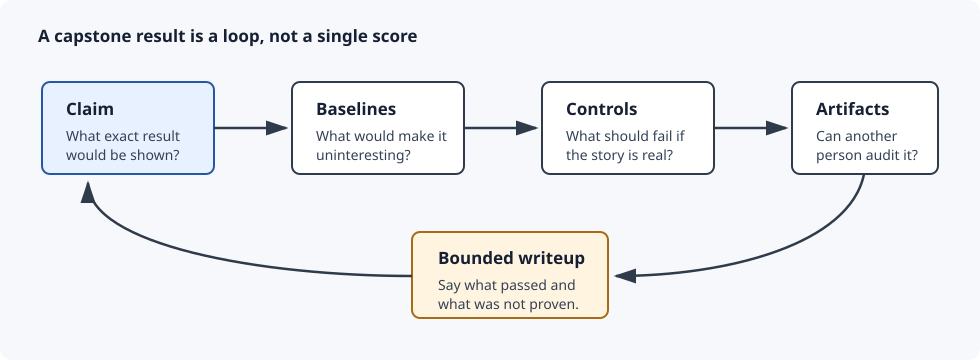
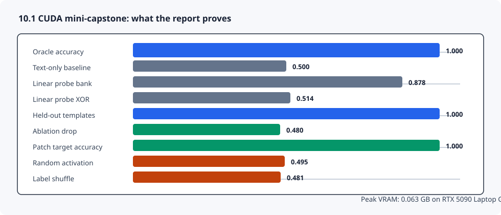

# [10.1] Capstone Research Sprint

> **Notebooks: [exercises](../../exercises/part1_capstone_research_sprint/10.1_Capstone_Research_Sprint_exercises.ipynb) | [solutions](../../exercises/part1_capstone_research_sprint/10.1_Capstone_Research_Sprint_solutions.ipynb)**

```python
GT_TIER = "GT-4"
EXERCISE_ID = "10_1_capstone_research_sprint"
DIFFICULTY = 5
IMPORTANCE = 3
EXPECTED_RUNTIME = "35-50 minutes for exercises; seconds for the CUDA mini-capstone report"
REQUIRES_GPU = True  # visible tests are CPU; the committed verification report uses CUDA
```

> **Local-first extension.** This section turns the extension into a
> paper-style research sprint. You will build the planning gate, then audit a
> real CUDA mini-capstone with baselines, held-out templates, causal
> interventions, negative controls, failure-case artifacts, and a bounded
> writeup.

Please send any problems / bugs on the `#errata` channel in the [Slack group](https://info-arena.github.io/ARENA_img/slack.html), and ask any questions on the dedicated channels for this chapter of material.

If you want to change to dark mode, you can do this by clicking the three horizontal lines in the top-right, then navigating to Settings -> Theme.

Links to earlier chapters: [(0) Fundamentals](https://arena-chapter0-fundamentals.streamlit.app/), [(1) Transformer Interpretability](https://arena-chapter1-transformer-interp.streamlit.app/), [(2) RL](https://arena-chapter2-rl.streamlit.app/), [(3) LLM Evaluations](https://arena-chapter3-llm-evals.streamlit.app/), [(4) Alignment Science](https://arena-chapter4-alignment-science.streamlit.app/).


# Introduction

Most capstone failures are not caused by a missing model call. They are caused
by a missing claim boundary.

An interpretability project can have a good idea, a plausible chart, and a nice
demo, while still failing as evidence because it never answers:

```text
what exact claim is being tested?
which baseline would make the result uninteresting?
which held-out split tests generalization?
which intervention tests causality?
which negative control should fail?
which artifacts let another person rerun or audit the result?
```

This section is the bridge between single-method notebooks and an ARENA-style
research project. You will implement a small readiness contract, then inspect a
CUDA report whose claim is deliberately narrow:

```text
a question-conditioned MLP activation oracle solves a generated latent-state
benchmark, including a nonlinear XOR question, and passes the listed controls.
```

It is not a released-model mechanistic discovery. Treat it as a model organism
for capstone discipline: baselines, OOD evidence, causal checks, reproducible
scripts, artifact hashes, and a writeup that says exactly what was and was not
shown.



The core question is:

```text
Can a vague interpretability idea be turned into a falsifiable, rerunnable
capstone plan, then judged against the evidence actually produced?
```


## Reading Material

The useful mental model is the same one used throughout the extension:

```text
implementation tells you the experiment ran;
baselines tell you whether it was interesting;
controls tell you whether the story survives;
the writeup tells you what claim you are allowed to make.
```

The report-backed result in this section is best described as:

```text
GT-4 generated latent-state activation-oracle capstone preflight.
```

Do not describe it as:

```text
a broad Activation Oracle replication;
a released-model mechanistic discovery;
evidence that all nonlinear latent facts are easy to decode;
a capstone paper with human-reviewed external validity.
```


## Content & Learning Objectives

### 1. Capstone plan

You will turn a vague project idea into a normalized contract.

> ##### Learning Objectives
>
> * Keep the research question, benchmark, claim, scripts, and writeup path explicit.
> * Strip copied-note whitespace and blank fields.
> * Preserve declared order for baselines and validations.

### 2. Baseline suite

You will reject projects that omit required comparisons.

> ##### Learning Objectives
>
> * Require text-only, probe, and random-control baselines.
> * Reject duplicate or undeclared baselines instead of silently passing them.
> * Report the missing baseline names.

### 3. Causal and OOD validation

You will separate correlation from evidence that the latent state matters.

> ##### Learning Objectives
>
> * Require ablation and counterfactual patching.
> * Require random controls.
> * Require an OOD or held-out-template split.

### 4. Reproducibility gate

You will keep result evidence separate from readiness metadata.

> ##### Learning Objectives
>
> * Record repo-relative script and artifact paths.
> * Require explicit integer seeds with no duplicates.
> * Fail readiness if paths exist only as prose.

### 5. CUDA evidence audit

You will inspect the committed mini-capstone report.

> ##### Learning Objectives
>
> * Read a multi-seed CUDA report without inflating its claim.
> * Compare oracle, text-only, linear-probe, OOD, patching, and negative-control results.
> * Identify what would falsify the result.


## Setup Code

```python
import json
import sys
from dataclasses import dataclass
from pathlib import Path

import torch as t

chapter = "chapter10_capstone_research_sprint"
section = "part1_capstone_research_sprint"
root_dir = next(p for p in [Path.cwd(), *Path.cwd().parents] if (p / chapter).exists())
exercises_dir = root_dir / chapter / "exercises"
section_dir = exercises_dir / section

if str(root_dir) not in sys.path:
    sys.path.append(str(root_dir))
if str(exercises_dir) not in sys.path:
    sys.path.append(str(exercises_dir))

import part1_capstone_research_sprint.tests as tests
import part1_capstone_research_sprint.utils as utils
```

```python
@dataclass(frozen=True)
class CapstonePlan:
    research_question: str
    benchmark: str
    baselines: tuple[str, ...]
    mechanistic_claim: str
    causal_validations: tuple[str, ...]
    reproducible_scripts: tuple[str, ...]
    writeup_path: str


@dataclass(frozen=True)
class BaselineSuiteReport:
    required_baselines: tuple[str, ...]
    present_baselines: tuple[str, ...]
    missing_baselines: tuple[str, ...]
    complete: bool


@dataclass(frozen=True)
class CausalValidationSuiteReport:
    validations: tuple[str, ...]
    has_ablation: bool
    has_patching: bool
    has_random_control: bool
    has_ood: bool
    complete: bool


@dataclass(frozen=True)
class ReproducibilityReport:
    script_paths: tuple[str, ...]
    seeds: tuple[int, ...]
    artifact_paths: tuple[str, ...]
    reproducible: bool


@dataclass(frozen=True)
class CapstoneReadinessReport:
    has_research_question: bool
    has_benchmark: bool
    has_mechanistic_claim: bool
    baseline_suite_complete: bool
    causal_validation_complete: bool
    reproducibility_complete: bool
    has_writeup_path: bool
    ready: bool
```


# Capstone Plan

### Exercise 1 - build a paper-style capstone plan

> Difficulty: easy
> Importance: high
>
> You should spend 10 minutes on this exercise.

Strip blank strings, keep the declared order of nonblank entries, and freeze the
plan into tuples. A capstone plan should be explicit before any experiment is
run.

```python
def build_capstone_plan(
    *,
    research_question: str,
    benchmark: str,
    baselines: list[str],
    mechanistic_claim: str,
    causal_validations: list[str],
    reproducible_scripts: list[str],
    writeup_path: str,
) -> CapstonePlan:
    raise NotImplementedError()


tests.test_build_capstone_plan_normalizes_blank_fields(build_capstone_plan)
```

<details>
<summary>Expected output</summary>

```text
All tests in `test_build_capstone_plan_normalizes_blank_fields` passed!
```

</details>

<details>
<summary>Help - what should this function do?</summary>

This function should not decide whether the plan is good. It only cleans and
stores the plan. Later gates will decide whether the baseline suite,
validations, and reproducibility metadata are strong enough.

</details>

<details>
<summary>Common bugs</summary>

- Keeping empty strings from copied project notes.
- Returning lists instead of tuples, which makes later contract comparisons less stable.
- Stripping the top-level strings but forgetting to strip the list elements.

</details>

<details>
<summary>Solution</summary>

```python
def build_capstone_plan(
    *,
    research_question: str,
    benchmark: str,
    baselines: list[str],
    mechanistic_claim: str,
    causal_validations: list[str],
    reproducible_scripts: list[str],
    writeup_path: str,
) -> CapstonePlan:
    return CapstonePlan(
        research_question=research_question.strip(),
        benchmark=benchmark.strip(),
        baselines=tuple(baseline.strip() for baseline in baselines if baseline.strip()),
        mechanistic_claim=mechanistic_claim.strip(),
        causal_validations=tuple(
            validation.strip()
            for validation in causal_validations
            if validation.strip()
        ),
        reproducible_scripts=tuple(
            script.strip()
            for script in reproducible_scripts
            if script.strip()
        ),
        writeup_path=writeup_path.strip(),
    )
```

</details>

```python
def _example_plan() -> CapstonePlan:
    return build_capstone_plan(
        research_question="Do mini Activation Oracles beat probes?",
        benchmark="held-out activation questions",
        baselines=["probe", "text_only", "random_control"],
        mechanistic_claim="question conditioning uses latent state features",
        causal_validations=["ablation", "patching", "random_control", "ood"],
        reproducible_scripts=["scripts/run_capstone.py"],
        writeup_path="reports/capstone.md",
    )


def plan_smoke_test() -> dict:
    return _example_plan().__dict__
```


# Baseline Suite

### Exercise 2 - reject capstones with weak baselines

> Difficulty: easy
> Importance: high
>
> You should spend 10 minutes on this exercise.

The default baseline contract requires a probe baseline, a text-only baseline,
and a random-control baseline. The suite should fail if a required baseline is
missing, if a baseline is duplicated, or if an undeclared baseline sneaks into
the fixed contract.

```python
def baseline_suite_report(
    present_baselines: list[str],
    *,
    required_baselines: tuple[str, ...] = ("probe", "text_only", "random_control"),
) -> BaselineSuiteReport:
    raise NotImplementedError()


tests.test_baseline_suite_report_identifies_missing_required_baseline(
    baseline_suite_report,
)
```

<details>
<summary>Expected output</summary>

```text
All tests in `test_baseline_suite_report_identifies_missing_required_baseline` passed!
```

</details>

<details>
<summary>Help - why reject duplicate or unknown baselines?</summary>

The point is not to count how many baselines were mentioned. The point is to
verify a specific comparison set exactly once. If a duplicated baseline passes,
three reported baselines could really mean two comparisons. If an unknown
baseline passes, the learner can accidentally move the goalposts.

</details>

<details>
<summary>Common bugs</summary>

- Treating any one baseline as enough for a paper-style comparison.
- Reporting completeness but not the missing baseline names.
- Checking substrings such as `"control"` instead of exact baseline ids.
- Using a set for completeness and forgetting that duplicates should fail.

</details>

<details>
<summary>Solution</summary>

```python
def baseline_suite_report(
    present_baselines: list[str],
    *,
    required_baselines: tuple[str, ...] = ("probe", "text_only", "random_control"),
) -> BaselineSuiteReport:
    present = tuple(baseline.strip() for baseline in present_baselines if baseline.strip())
    present_set = set(present)
    required_set = set(required_baselines)
    missing = tuple(
        baseline
        for baseline in required_baselines
        if baseline not in present_set
    )
    has_duplicates = len(present_set) != len(present)
    has_unknown = not present_set <= required_set
    return BaselineSuiteReport(
        required_baselines=required_baselines,
        present_baselines=present,
        missing_baselines=missing,
        complete=len(missing) == 0 and not has_duplicates and not has_unknown,
    )
```

</details>

```python
def baseline_smoke_test() -> dict:
    plan = _example_plan()
    return baseline_suite_report(list(plan.baselines)).__dict__


tests.test_baseline_smoke_test_has_required_controls(baseline_smoke_test)
```

<details>
<summary>Expected output</summary>

```text
All tests in `test_baseline_smoke_test_has_required_controls` passed!
```

</details>


# Causal Validation Suite

### Exercise 3 - require causal and OOD checks

> Difficulty: easy
> Importance: high
>
> You should spend 10 minutes on this exercise.

A capstone should not pass on correlation alone. Require ablation, patching,
random controls, and an OOD or held-out-template check.

```python
def causal_validation_suite_report(
    validations: list[str],
) -> CausalValidationSuiteReport:
    raise NotImplementedError()


tests.test_causal_validation_suite_report_accepts_equivalent_names(
    causal_validation_suite_report,
)
```

<details>
<summary>Expected output</summary>

```text
All tests in `test_causal_validation_suite_report_accepts_equivalent_names` passed!
```

</details>

<details>
<summary>Help - what counts as causal here?</summary>

Ablation asks whether removing the proposed latent evidence hurts the oracle.
Counterfactual patching asks whether inserting donor latent evidence changes
the answer in the donor direction. OOD asks whether the result survives a
template family that was not used during training.

</details>

<details>
<summary>Common bugs</summary>

- Forgetting to lowercase validation names.
- Keeping blank validation strings from a planning document.
- Requiring only patching while omitting random controls.
- Treating train/test splits as OOD without recording an explicit OOD or held-out-template check.

</details>

<details>
<summary>Solution</summary>

```python
def causal_validation_suite_report(
    validations: list[str],
) -> CausalValidationSuiteReport:
    normalized = tuple(
        validation.strip().lower()
        for validation in validations
        if validation.strip()
    )
    validation_set = set(normalized)
    has_ablation = "ablation" in validation_set
    has_patching = "patching" in validation_set or "counterfactual_patching" in validation_set
    has_random_control = "random_control" in validation_set
    has_ood = "ood" in validation_set or "heldout_templates" in validation_set
    complete = has_ablation and has_patching and has_random_control and has_ood
    return CausalValidationSuiteReport(
        validations=normalized,
        has_ablation=has_ablation,
        has_patching=has_patching,
        has_random_control=has_random_control,
        has_ood=has_ood,
        complete=complete,
    )
```

</details>

```python
def validation_smoke_test() -> dict:
    plan = _example_plan()
    return causal_validation_suite_report(list(plan.causal_validations)).__dict__
```


# Reproducibility Gate

### Exercise 4 - record scripts, seeds, and artifacts

> Difficulty: easy
> Importance: high
>
> You should spend 10 minutes on this exercise.

The readiness gate should fail unless the project records at least one script,
one seed, and one output artifact path. Paths should be repo-relative, not
absolute paths from one machine.

```python
def reproducibility_report(
    *,
    script_paths: list[str],
    seeds: list[int],
    artifact_paths: list[str],
    root: str | Path | None = None,
) -> ReproducibilityReport:
    raise NotImplementedError()


tests.test_reproducibility_report_requires_scripts_seeds_and_artifacts(
    reproducibility_report,
)
```

<details>
<summary>Expected output</summary>

```text
All tests in `test_reproducibility_report_requires_scripts_seeds_and_artifacts` passed!
```

</details>

<details>
<summary>Help - why are seeds part of reproducibility?</summary>

For this capstone, multi-seed evidence is part of the claim. A single seed may
still be useful for debugging, but the final report should say which seeds were
run and should not count repeated seeds as independent evidence.

</details>

<details>
<summary>Common bugs</summary>

- Recording a script without recording the output artifact it produces.
- Treating `seed=True`, `seed=None`, or duplicated seeds as independent runs.
- Forgetting to strip path strings before saving the contract.
- Using absolute local paths that another reviewer cannot reproduce.

</details>

<details>
<summary>Solution</summary>

```python
def reproducibility_report(
    *,
    script_paths: list[str],
    seeds: list[int],
    artifact_paths: list[str],
    root: str | Path | None = None,
) -> ReproducibilityReport:
    scripts = tuple(path.strip() for path in script_paths if path.strip())
    artifacts = tuple(path.strip() for path in artifact_paths if path.strip())
    seed_tuple = tuple(seed for seed in seeds if isinstance(seed, int) and not isinstance(seed, bool))
    seeds_valid = len(seed_tuple) == len(seeds) and len(set(seed_tuple)) == len(seed_tuple)
    root_path = Path.cwd() if root is None else Path(root)
    paths_are_relative = all(
        not Path(path).is_absolute() and ".." not in Path(path).parts
        for path in (*scripts, *artifacts)
    )
    scripts_exist = paths_are_relative and all((root_path / script).is_file() for script in scripts)
    artifacts_exist = paths_are_relative and all((root_path / artifact).is_file() for artifact in artifacts)
    return ReproducibilityReport(
        script_paths=scripts,
        seeds=seed_tuple,
        artifact_paths=artifacts,
        reproducible=bool(
            scripts
            and seed_tuple
            and artifacts
            and seeds_valid
            and scripts_exist
            and artifacts_exist
        ),
    )
```

</details>

```python
def reproducibility_smoke_test() -> dict:
    plan = _example_plan()
    return reproducibility_report(
        script_paths=list(plan.reproducible_scripts),
        seeds=[0, 1, 2],
        artifact_paths=["results/metrics.json"],
        root=section_dir,
    ).__dict__
```


# Readiness Gate

### Exercise 5 - combine the capstone gates

> Difficulty: medium
> Importance: high
>
> You should spend 10 minutes on this exercise.

A capstone is ready only if the plan is nonempty, baselines are complete,
validations are complete, reproducibility metadata is present, and the writeup
path is declared.

```python
def capstone_readiness_report(
    plan: CapstonePlan,
    baselines: BaselineSuiteReport,
    validations: CausalValidationSuiteReport,
    reproducibility: ReproducibilityReport,
) -> CapstoneReadinessReport:
    raise NotImplementedError()


tests.test_capstone_readiness_report_requires_every_gate(
    build_capstone_plan,
    baseline_suite_report,
    causal_validation_suite_report,
    reproducibility_report,
    capstone_readiness_report,
)
```

<details>
<summary>Expected output</summary>

```text
All tests in `test_capstone_readiness_report_requires_every_gate` passed!
```

</details>

<details>
<summary>Help - why readiness is not a result</summary>

Readiness means the project is shaped like an auditable experiment. It does not
mean the experiment passed. A ready capstone can still fail if the oracle does
not beat baselines, if OOD accuracy collapses, or if controls also pass.

</details>

<details>
<summary>Common bugs</summary>

- Marking readiness true when one sub-report is incomplete.
- Forgetting that the writeup path is part of the capstone contract.
- Letting a plan with an empty mechanistic claim pass.

</details>

<details>
<summary>Solution</summary>

```python
def capstone_readiness_report(
    plan: CapstonePlan,
    baselines: BaselineSuiteReport,
    validations: CausalValidationSuiteReport,
    reproducibility: ReproducibilityReport,
) -> CapstoneReadinessReport:
    has_question = bool(plan.research_question)
    has_benchmark = bool(plan.benchmark)
    has_claim = bool(plan.mechanistic_claim)
    has_writeup = bool(plan.writeup_path)
    ready = (
        has_question
        and has_benchmark
        and has_claim
        and baselines.complete
        and validations.complete
        and reproducibility.reproducible
        and has_writeup
    )
    return CapstoneReadinessReport(
        has_research_question=has_question,
        has_benchmark=has_benchmark,
        has_mechanistic_claim=has_claim,
        baseline_suite_complete=baselines.complete,
        causal_validation_complete=validations.complete,
        reproducibility_complete=reproducibility.reproducible,
        has_writeup_path=has_writeup,
        ready=ready,
    )
```

</details>

```python
def readiness_smoke_test() -> dict:
    plan = _example_plan()
    baselines = baseline_suite_report(list(plan.baselines))
    validations = causal_validation_suite_report(list(plan.causal_validations))
    reproducibility = reproducibility_report(
        script_paths=list(plan.reproducible_scripts),
        seeds=[0, 1, 2],
        artifact_paths=["results/metrics.json"],
        root=section_dir,
    )
    return capstone_readiness_report(
        plan,
        baselines,
        validations,
        reproducibility,
    ).__dict__
```


# Notebook Contract

### Exercise 6 - expose the section smoke contract

> Difficulty: easy
> Importance: medium
>
> You should spend 5 minutes on this exercise.

The verification script expects one notebook-level smoke contract with the same
keys as the committed report. This is the cheap path used by hosted CPU checks.

```python
def run_smoke_test(cpu: bool = True) -> dict:
    _ = cpu
    return {
        "plan": plan_smoke_test(),
        "baselines": baseline_smoke_test(),
        "validations": validation_smoke_test(),
        "reproducibility": reproducibility_smoke_test(),
        "readiness": readiness_smoke_test(),
    }


tests.test_notebook_contract(run_smoke_test)
```

<details>
<summary>Expected output</summary>

```text
All tests in `test_notebook_contract` passed!
```

</details>

<details>
<summary>Help - what does the smoke contract prove?</summary>

It proves the learner-facing planning gates are wired together. It does not
prove that the CUDA experiment was rerun. The live CUDA proof is the verification
report path below.

</details>

<details>
<summary>Common bugs</summary>

- Renaming contract keys, which breaks the verification report.
- Returning dataclass objects where the report expects plain dictionaries.
- Letting the notebook contract drift from the solution module.

</details>


# Signature Result

The CUDA mini-capstone result is intentionally narrow but useful. A
question-conditioned activation oracle solves all four generated latent-state
questions, including the nonlinear XOR question, and the baselines/controls
make the result hard to explain away as question priors, simple linear probing,
template memorization, random patching, or label leakage.



| Field | Value |
|---|---:|
| Device | `NVIDIA GeForce RTX 5090 Laptop GPU` |
| Torch / CUDA | `2.12.1+cu132 / 13.2` |
| Seeds | `0, 1, 2` |
| Train / IID / held-out-template examples | `576 / 576 / 384` |
| Questions | `color_bit`, `shape_bit`, `material_bit`, `color_xor_shape` |
| Oracle accuracy mean / min | `1.000 / 1.000` |
| Text-only accuracy | `0.500` |
| Linear-probe bank accuracy | `0.878` |
| Linear-probe XOR accuracy | `0.514` |
| Oracle XOR accuracy | `1.000` |
| Held-out-template accuracy | `1.000` |
| Ablation drop | `0.480` |
| Counterfactual patch target accuracy | `1.000` |
| Random patch change rate | `0.000` |
| Random activation accuracy | `0.495` |
| Label-shuffle accuracy | `0.481` |
| Peak VRAM | `0.063 GB` |

<details>
<summary>Interpreting the result</summary>

The most important comparison is not oracle accuracy in isolation. The report
shows that text-only question priors are chance-level, a bank of linear probes
does worse overall and fails the XOR question, held-out templates still pass,
and targeted causal interventions behave differently from random controls.

</details>

<details>
<summary>What would falsify this claim?</summary>

The claim should fail if the oracle does not beat text-only and linear-probe
baselines, if the XOR question can be solved by the compositional linear probe,
if held-out templates collapse, if ablation and counterfactual patching do not
move the oracle in the expected direction, if random patching works about as
well as targeted patching, or if random-activation / label-shuffle controls
also solve the benchmark.

</details>


# Full CUDA Verification Path

The committed report for this section checks the full local path:

1. Generate balanced latent-bit activations with template nuisance dimensions.
2. Train a question-conditioned MLP activation oracle on CUDA for seeds `0, 1, 2`.
3. Train text-only, linear-probe-bank, compositional-probe, random-activation,
   and label-shuffle baselines.
4. Evaluate IID and held-out-template splits.
5. Run relevant-dimension ablation, counterfactual latent patching, and
   random-dimension patch controls.
6. Write `results/metrics.json`, `results/metrics_by_seed.json`,
   `results/failure_cases.jsonl`, and `reports/capstone.md`.
7. Validate the artifact lock thresholds and input hashes.

```python
def run_gpu_test(max_vram_gb: float = 24.0) -> dict:
    from part1_capstone_research_sprint.solutions import run_gpu_test

    return run_gpu_test(max_vram_gb=max_vram_gb)


def run_full_experiment(max_vram_gb: float = 24.0) -> dict:
    return run_gpu_test(max_vram_gb=max_vram_gb)
```

```python
report = json.loads((section_dir / "verification_report.json").read_text())
gpu = report["metrics"]["gpu_test"]

tests.test_committed_gpu_report_matches_artifact_contract()

utils.print_report(
    "10.1 CUDA mini-capstone report",
    {key: gpu[key] for key in [
        "device",
        "seed_count",
        "oracle_accuracy_mean",
        "text_only_accuracy_mean",
        "linear_probe_bank_accuracy_mean",
        "linear_probe_compositional_accuracy_mean",
        "heldout_template_accuracy_mean",
        "ablation_drop_mean",
        "counterfactual_patch_target_accuracy_mean",
        "random_patch_change_rate_mean",
        "random_activation_accuracy_mean",
        "label_shuffle_accuracy_mean",
        "preflight_passed",
        "peak_vram_gb",
    ]},
)
```

<details>
<summary>Expected output</summary>

```text
All tests in `test_committed_gpu_report_matches_artifact_contract` passed!

10.1 CUDA mini-capstone report
  device                                  : NVIDIA GeForce RTX 5090 Laptop GPU
  seed_count                              : 3
  oracle_accuracy_mean                    : 1.0
  text_only_accuracy_mean                 : 0.5
  linear_probe_bank_accuracy_mean         : 0.8784722288449606
  linear_probe_compositional_accuracy_mean: 0.5138888955116272
  heldout_template_accuracy_mean          : 1.0
  ablation_drop_mean                      : 0.48032404979070026
  counterfactual_patch_target_accuracy_mean: 1.0
  random_patch_change_rate_mean           : 0.0
  random_activation_accuracy_mean         : 0.4947916666666667
  label_shuffle_accuracy_mean             : 0.48148147265116376
  preflight_passed                        : True
  peak_vram_gb                            : 0.0634922981262207
```

</details>

You can regenerate the report locally with:

```bash
BNB_CUDA_VERSION=130 uv run python scripts/run_extension_verification_reports.py --section 10.1 --max-vram-gb 24.0
```


# Limitations

This section does not prove a real transformer mechanistic discovery. The
activation vectors are generated, the latent bits are deliberately encoded in a
small `d_model=12` space, and the oracle is a two-layer MLP trained for this
course benchmark.

The report also does not prove that full-scale Activation Oracles are cheap,
robust, or available for arbitrary frontier models. It proves a narrower
research-sprint pattern: specify the claim, run baselines, require causal and
OOD checks, keep artifacts rerunnable, and write down the boundary.

One remaining caution from the report is calibration: the random-activation
control stays near chance accuracy, but its confidence can still be high. That
is a reminder that accuracy, confidence, and mechanistic validity are different
claims.


# Further Research

- Replace the generated latent-state benchmark with a pinned small transformer
  activation dataset and keep the same capstone contract.
- Add a stronger nonlinear activation-only baseline and ask whether question
  conditioning still adds value.
- Turn failure cases into a reviewer table instead of only a JSONL artifact.
- Add calibration metrics for the oracle and the random-activation control.
- Use the same readiness gate for a full capstone proposal before running any
  expensive model work.
