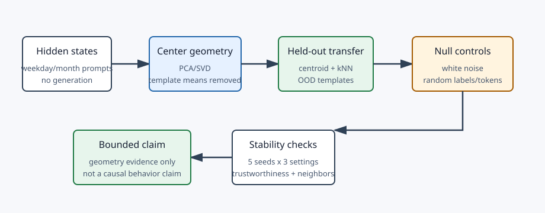
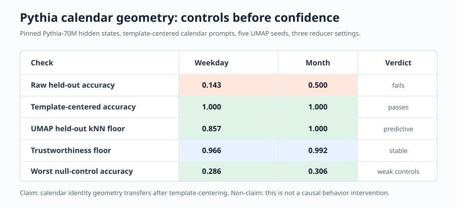

# [11.1] PCA, SVD, and Geometry Controls

> **Notebooks: [exercises](../../exercises/part1_pca_svd_geometry_controls/11.1_PCA_SVD_and_Geometry_Controls_exercises.ipynb) | [solutions](../../exercises/part1_pca_svd_geometry_controls/11.1_PCA_SVD_and_Geometry_Controls_solutions.ipynb)**

> **Local-first extension.** A PCA, UMAP, or t-SNE plot is not evidence by
> itself. In this section, you build the local checks that decide whether a
> representation-geometry result predicts held-out labels, survives controls,
> stays stable across seeds or prompts, and supports a causal-direction claim.

```python
GT_TIER = "GT-0"
EXERCISE_ID = "11_1_pca_svd_and_geometry_controls"
DIFFICULTY = 3
IMPORTANCE = 4
EXPECTED_RUNTIME = "35-45 minutes for exercises; about 1 minute for the CUDA preflight"
REQUIRES_GPU = True
```

Please send any problems / bugs on the `#errata` channel in the [Slack group](https://info-arena.github.io/ARENA_img/slack.html), and ask any questions on the dedicated channels for this chapter of material.

If you want to change to dark mode, you can do this by clicking the three horizontal lines in the top-right, then navigating to Settings -> Theme.

Links to earlier chapters: [(0) Fundamentals](https://arena-chapter0-fundamentals.streamlit.app/), [(1) Transformer Interpretability](https://arena-chapter1-transformer-interp.streamlit.app/), [(2) RL](https://arena-chapter2-rl.streamlit.app/), [(3) LLM Evaluations](https://arena-chapter3-llm-evals.streamlit.app/), [(4) Alignment Science](https://arena-chapter4-alignment-science.streamlit.app/).


## Core Question

What would make a representation-geometry claim more than a nice-looking plot?

For this section, the answer is deliberately narrow:

- compute the geometry with centered PCA/SVD rather than an ad hoc projection;
- predict held-out labels from the geometry, not from the training labels alone;
- compare the claimed signal against white-noise and random-label controls;
- check seed or prompt stability;
- require causal-direction effects to beat a random-direction control;
- remove prompt-template mean directions before claiming cross-template identity transfer;
- treat UMAP/t-SNE-style plots as evidence only when held-out kNN, trustworthiness,
  neighborhood preservation, seed sweeps, hyperparameter sweeps, random-label
  controls, and random-token controls all pass.

The release report for this section is GT-0. It validates the toy contract below
and runs a pinned Pythia-70M-deduped hidden-state calendar preflight over weekday
and month prompt splits. The report includes five UMAP seeds, three reducer
settings, held-out kNN, trustworthiness, neighborhood preservation, random-label
controls, and matched random-token controls. It does not claim a causal
space/time intervention.



## Learning Objectives

- Implement centered PCA with `torch.linalg.svd`.
- Use nearest-centroid held-out prediction as a simple geometry test.
- Reject geometry that white noise can match.
- Quantify neighbor-set stability across seeds.
- Test representation directions against random controls.
- Remove prompt-template mean directions before comparing label identities.
- Audit UMAP-style visualizations with held-out kNN, trustworthiness, neighborhood
  preservation, and random-token controls.

# Setup Code

```python
import json
import sys
from dataclasses import dataclass
from pathlib import Path
from typing import Literal

import torch as t

chapter = "chapter11_representation_geometry"
section = "part1_pca_svd_geometry_controls"
root_dir = next(p for p in [Path.cwd(), *Path.cwd().parents] if (p / chapter).exists())
exercises_dir = root_dir / chapter / "exercises"
section_dir = exercises_dir / section

if str(root_dir) not in sys.path:
    sys.path.append(str(root_dir))
if str(exercises_dir) not in sys.path:
    sys.path.append(str(exercises_dir))

import part1_pca_svd_geometry_controls.tests as tests
import part1_pca_svd_geometry_controls.utils as utils

CausalDirection = Literal["increase", "decrease"]
```

Use small report objects. They are intentionally boring: the useful part is that
they force each claim to carry the metric that made it pass or fail.

```python
@dataclass(frozen=True)
class PCAProjection:
    projected: t.Tensor
    components: t.Tensor
    explained_variance_ratio: t.Tensor


@dataclass(frozen=True)
class GeometryLabelPredictionReport:
    heldout_accuracy: float
    predicts_heldout_labels: bool


@dataclass(frozen=True)
class WhiteNoiseControlReport:
    real_accuracy: float
    noise_accuracy: float
    margin: float
    survives_white_noise_control: bool


@dataclass(frozen=True)
class GeometryStabilityReport:
    neighbor_sets: tuple[tuple[int, ...], ...]
    mean_pairwise_jaccard: float
    stable_across_seeds: bool


@dataclass(frozen=True)
class DirectionCausalEffectReport:
    baseline_mean: float
    intervened_mean: float
    random_control_mean: float
    observed_delta: float
    random_delta: float
    has_causal_effect: bool


@dataclass(frozen=True)
class KNNLabelPredictionReport:
    k: int
    heldout_accuracy: float
    predicts_heldout_labels: bool


@dataclass(frozen=True)
class NeighborhoodPreservationReport:
    k: int
    mean_neighbor_overlap: float
    preserves_neighborhoods: bool


@dataclass(frozen=True)
class VisualizationSweepReport:
    seed_count: int
    setting_count: int
    run_count: int
    min_heldout_knn_accuracy: float
    mean_heldout_knn_accuracy: float
    min_trustworthiness: float
    mean_trustworthiness: float
    min_neighborhood_preservation: float
    mean_neighborhood_preservation: float
    random_label_accuracy_max: float
    random_token_accuracy_max: float
    passes_visualization_controls: bool
```

# PCA via SVD

### Exercise - compute a centered PCA projection

> Difficulty: medium
> Importance: high
>
> You should spend 10 minutes on this exercise.

Center the activation matrix, run SVD, keep the requested right-singular
vectors as components, and report explained-variance ratios from the squared
singular values.

```python
def pca_svd_projection(
    activations: t.Tensor,
    *,
    n_components: int = 2,
) -> PCAProjection:
    raise NotImplementedError()


tests.test_pca_svd_projection_centers_and_reports_variance(pca_svd_projection)
```

<details>
<summary>Expected output</summary>

```text
All tests in `test_pca_svd_projection_centers_and_reports_variance` passed!
```

</details>

<details>
<summary>Help - why center before SVD?</summary>

Without centering, PC1 can become "the mean activation vector" rather than the
direction along which examples differ. Geometry claims are usually about
variation between examples, so the first move is to subtract the batch mean.
The zero-variance test is there because real activation slices can be constant
after filtering or template-centering.

</details>

<details>
<summary>Common bugs</summary>

- Running SVD on uncentered activations.
- Treating singular values, rather than squared singular values, as variance.
- Returning a NaN explained-variance ratio for zero-variance inputs.
- Forgetting that SVD components are sign-ambiguous.

</details>

<details>
<summary>Solution</summary>

```python
def pca_svd_projection(
    activations: t.Tensor,
    *,
    n_components: int = 2,
) -> PCAProjection:
    if activations.ndim != 2:
        raise ValueError("activations must have shape (examples, d_model).")
    if n_components <= 0:
        raise ValueError("n_components must be positive.")
    if n_components > min(activations.shape):
        raise ValueError("n_components cannot exceed min(examples, d_model).")

    activations_float = activations.float()
    centered = activations_float - activations_float.mean(dim=0, keepdim=True)
    _, singular_values, vh = t.linalg.svd(centered, full_matrices=False)
    components = vh[:n_components]
    projected = centered @ components.T
    variance = singular_values.pow(2)
    total_variance = variance.sum()
    if total_variance.item() == 0:
        explained = t.zeros(
            n_components,
            dtype=activations_float.dtype,
            device=activations.device,
        )
    else:
        explained = variance[:n_components] / total_variance
    return PCAProjection(
        projected=projected,
        components=components,
        explained_variance_ratio=explained,
    )
```

</details>

# Held-Out Prediction

### Exercise - predict held-out labels from geometry

> Difficulty: medium
> Importance: high
>
> You should spend 10 minutes on this exercise.

Fit class centroids on training points only, classify held-out points by nearest
centroid, and report whether the held-out accuracy clears the threshold.

```python
def nearest_centroid_predictions(
    train_points: t.Tensor,
    train_labels: t.Tensor,
    heldout_points: t.Tensor,
) -> t.Tensor:
    raise NotImplementedError()


def geometry_label_prediction_report(
    train_points: t.Tensor,
    train_labels: t.Tensor,
    heldout_points: t.Tensor,
    heldout_labels: t.Tensor,
    *,
    min_accuracy: float = 0.8,
) -> GeometryLabelPredictionReport:
    raise NotImplementedError()


tests.test_geometry_label_prediction_report_uses_heldout_centroids(
    geometry_label_prediction_report,
)
```

<details>
<summary>Expected output</summary>

```text
All tests in `test_geometry_label_prediction_report_uses_heldout_centroids` passed!
```

</details>

<details>
<summary>Help - why held-out labels?</summary>

A geometry plot can look clustered because you arranged the training examples
nicely. Held-out prediction asks a stricter question: if I only fit centroids on
one set of prompts, do new prompts land near the matching labels? If not, the
plot may be decorative rather than evidence.

</details>

<details>
<summary>Common bugs</summary>

- Building centroids from held-out points, which leaks the evaluation labels.
- Assuming labels are contiguous or ordered by first appearance.
- Forgetting to check that each training point has one label.
- Reporting training accuracy instead of held-out accuracy.

</details>

<details>
<summary>Solution</summary>

```python
def nearest_centroid_predictions(
    train_points: t.Tensor,
    train_labels: t.Tensor,
    heldout_points: t.Tensor,
) -> t.Tensor:
    if train_points.ndim != 2 or heldout_points.ndim != 2:
        raise ValueError("points must have shape (examples, dimensions).")
    if train_points.shape[-1] != heldout_points.shape[-1]:
        raise ValueError("train and heldout point dimensions must match.")
    labels = train_labels.flatten().long()
    if labels.numel() != train_points.shape[0]:
        raise ValueError("train_labels must have one label per train point.")

    unique_labels = labels.unique(sorted=True)
    centroids = []
    for label in unique_labels:
        centroids.append(train_points[labels.eq(label)].float().mean(dim=0))
    centroid_tensor = t.stack(centroids)
    distances = t.cdist(heldout_points.float(), centroid_tensor)
    predicted_indices = distances.argmin(dim=-1)
    return unique_labels[predicted_indices]


def geometry_label_prediction_report(
    train_points: t.Tensor,
    train_labels: t.Tensor,
    heldout_points: t.Tensor,
    heldout_labels: t.Tensor,
    *,
    min_accuracy: float = 0.8,
) -> GeometryLabelPredictionReport:
    predictions = nearest_centroid_predictions(train_points, train_labels, heldout_points)
    labels = heldout_labels.flatten().long()
    if predictions.shape != labels.shape:
        raise ValueError("heldout_labels must have one label per heldout point.")
    accuracy = predictions.eq(labels).float().mean().item()
    return GeometryLabelPredictionReport(
        heldout_accuracy=accuracy,
        predicts_heldout_labels=accuracy >= min_accuracy,
    )
```

</details>

# Negative Controls

### Exercise - compare against a white-noise control

> Difficulty: easy
> Importance: high
>
> You should spend 5 minutes on this exercise.

A geometry result should beat a noise baseline by a declared margin.

```python
def white_noise_control_report(
    *,
    real_accuracy: float,
    noise_accuracy: float,
    min_margin: float = 0.2,
) -> WhiteNoiseControlReport:
    raise NotImplementedError()


tests.test_white_noise_control_report_requires_margin(white_noise_control_report)
```

<details>
<summary>Expected output</summary>

```text
All tests in `test_white_noise_control_report_requires_margin` passed!
```

</details>

<details>
<summary>Help - what does the noise baseline protect against?</summary>

High accuracy is not meaningful if a random geometry with the same evaluation
protocol also gets high accuracy. The margin forces you to compare the claimed
representation against a null geometry before you call the result interpretable.

</details>

<details>
<summary>Common bugs</summary>

- Checking only that real accuracy is high, without comparing against noise.
- Using `abs(real - noise)`, which would let noise beat the real geometry.
- Hard-coding the threshold instead of using `min_margin`.

</details>

<details>
<summary>Solution</summary>

```python
def white_noise_control_report(
    *,
    real_accuracy: float,
    noise_accuracy: float,
    min_margin: float = 0.2,
) -> WhiteNoiseControlReport:
    margin = real_accuracy - noise_accuracy
    return WhiteNoiseControlReport(
        real_accuracy=real_accuracy,
        noise_accuracy=noise_accuracy,
        margin=margin,
        survives_white_noise_control=margin >= min_margin,
    )
```

</details>

### Exercise - check neighbor-set stability

> Difficulty: medium
> Importance: high
>
> You should spend 10 minutes on this exercise.

Represent each seed's nearest-neighbor result as a set of indices. Average all
pairwise Jaccard overlaps and require the mean to clear the threshold.

```python
def geometry_stability_report(
    neighbor_sets: list[list[int]],
    *,
    min_jaccard: float = 0.5,
) -> GeometryStabilityReport:
    raise NotImplementedError()


tests.test_geometry_stability_report_averages_pairwise_jaccard(
    geometry_stability_report,
)
```

<details>
<summary>Expected output</summary>

```text
All tests in `test_geometry_stability_report_averages_pairwise_jaccard` passed!
```

</details>

<details>
<summary>Help - why average all seed pairs?</summary>

If a visualization only survives one random seed, it is a visualization setting,
not a representation fact. Averaging all pairwise overlaps makes the stability
claim symmetric and prevents one lucky adjacent-seed comparison from carrying
the whole result.

</details>

<details>
<summary>Common bugs</summary>

- Comparing only adjacent seeds instead of all seed pairs.
- Using union size for the denominator when the intended contract uses the
  larger set size.
- Accepting an empty stability input.

</details>

<details>
<summary>Solution</summary>

```python
def geometry_stability_report(
    neighbor_sets: list[list[int]],
    *,
    min_jaccard: float = 0.5,
) -> GeometryStabilityReport:
    if not neighbor_sets:
        raise ValueError("neighbor_sets must be nonempty.")
    normalized = tuple(tuple(int(index) for index in neighbors) for neighbors in neighbor_sets)
    overlaps = []
    for i, left in enumerate(normalized):
        for right in normalized[i + 1 :]:
            left_set = set(left)
            right_set = set(right)
            if not left_set and not right_set:
                overlaps.append(1.0)
            else:
                overlaps.append(len(left_set & right_set) / max(len(left_set), len(right_set)))
    mean_jaccard = sum(overlaps) / len(overlaps) if overlaps else 1.0
    return GeometryStabilityReport(
        neighbor_sets=normalized,
        mean_pairwise_jaccard=mean_jaccard,
        stable_across_seeds=mean_jaccard >= min_jaccard,
    )
```

</details>

# Visualization Controls

### Exercise - audit a low-dimensional visualization

> Difficulty: medium
> Importance: high
>
> You should spend 15 minutes on this exercise.

A low-dimensional plot counts only if it still predicts held-out labels, keeps
high-dimensional neighbors nearby, and fails random-label plus random-token
controls. Implement a small kNN classifier, a neighborhood-preservation report,
and a sweep aggregator that records the worst acceptable run rather than the
best-looking run.

```python
def knn_label_predictions(
    train_points: t.Tensor,
    train_labels: t.Tensor,
    heldout_points: t.Tensor,
    *,
    k: int = 1,
) -> t.Tensor:
    raise NotImplementedError()


def heldout_knn_accuracy_report(
    train_points: t.Tensor,
    train_labels: t.Tensor,
    heldout_points: t.Tensor,
    heldout_labels: t.Tensor,
    *,
    k: int = 1,
    min_accuracy: float = 0.8,
) -> KNNLabelPredictionReport:
    raise NotImplementedError()


def neighborhood_preservation_report(
    high_dim_points: t.Tensor,
    low_dim_points: t.Tensor,
    *,
    k: int = 3,
    min_overlap: float = 0.5,
) -> NeighborhoodPreservationReport:
    raise NotImplementedError()


def visualization_sweep_report(
    *,
    seed_count: int,
    setting_count: int,
    heldout_knn_accuracies: list[float],
    trustworthiness_scores: list[float],
    neighborhood_preservation_scores: list[float],
    random_label_accuracies: list[float],
    random_token_accuracies: list[float],
    min_seed_count: int = 5,
    min_setting_count: int = 3,
    min_heldout_accuracy: float = 0.8,
    min_trustworthiness: float = 0.8,
    min_neighborhood_preservation: float = 0.5,
    max_random_label_accuracy: float = 0.3,
    max_random_token_accuracy: float = 0.3,
) -> VisualizationSweepReport:
    raise NotImplementedError()


tests.test_knn_label_prediction_report_uses_heldout_points(
    heldout_knn_accuracy_report,
)
tests.test_neighborhood_preservation_report_compares_neighbor_sets(
    neighborhood_preservation_report,
)
tests.test_visualization_sweep_report_requires_controls(visualization_sweep_report)
```

<details>
<summary>Expected output</summary>

```text
All tests in `test_knn_label_prediction_report_uses_heldout_points` passed!
All tests in `test_neighborhood_preservation_report_compares_neighbor_sets` passed!
All tests in `test_visualization_sweep_report_requires_controls` passed!
```

</details>

<details>
<summary>Help - why use minima and control maxima?</summary>

The easiest way to fool yourself with a reducer is to show the best seed. The
course contract does the opposite: it asks whether the worst held-out kNN,
trustworthiness, and neighborhood-preservation scores are still acceptable, and
whether the strongest random-label or random-token control is still weak.

</details>

<details>
<summary>Common bugs</summary>

- Measuring kNN on the same examples used to fit the projection.
- Including each point as its own nearest neighbor.
- Averaging random-control accuracies instead of checking their maximum.
- Accepting a sweep with one seed or one reducer setting.
- Letting metric lists have different lengths.

</details>

<details>
<summary>Solution</summary>

```python
def knn_label_predictions(
    train_points: t.Tensor,
    train_labels: t.Tensor,
    heldout_points: t.Tensor,
    *,
    k: int = 1,
) -> t.Tensor:
    if k <= 0:
        raise ValueError("k must be positive.")
    if train_points.ndim != 2 or heldout_points.ndim != 2:
        raise ValueError("points must have shape (examples, dimensions).")
    if train_points.shape[-1] != heldout_points.shape[-1]:
        raise ValueError("train and heldout point dimensions must match.")
    labels = train_labels.flatten().long()
    if labels.numel() != train_points.shape[0]:
        raise ValueError("train_labels must have one label per train point.")
    if k > train_points.shape[0]:
        raise ValueError("k cannot exceed the number of train points.")

    distances = t.cdist(heldout_points.float(), train_points.float())
    nearest = distances.topk(k, largest=False).indices
    nearest_labels = labels[nearest]
    unique_labels = labels.unique(sorted=True)
    predictions = []
    for row in nearest_labels:
        votes = t.stack([(row == label).sum() for label in unique_labels])
        predictions.append(unique_labels[votes.argmax()])
    return t.stack(predictions)


def heldout_knn_accuracy_report(
    train_points: t.Tensor,
    train_labels: t.Tensor,
    heldout_points: t.Tensor,
    heldout_labels: t.Tensor,
    *,
    k: int = 1,
    min_accuracy: float = 0.8,
) -> KNNLabelPredictionReport:
    predictions = knn_label_predictions(train_points, train_labels, heldout_points, k=k)
    labels = heldout_labels.flatten().long()
    if predictions.shape != labels.shape:
        raise ValueError("heldout_labels must have one label per heldout point.")
    accuracy = predictions.eq(labels).float().mean().item()
    return KNNLabelPredictionReport(
        k=k,
        heldout_accuracy=accuracy,
        predicts_heldout_labels=accuracy >= min_accuracy,
    )


def neighborhood_preservation_report(
    high_dim_points: t.Tensor,
    low_dim_points: t.Tensor,
    *,
    k: int = 3,
    min_overlap: float = 0.5,
) -> NeighborhoodPreservationReport:
    if k <= 0:
        raise ValueError("k must be positive.")
    if high_dim_points.ndim != 2 or low_dim_points.ndim != 2:
        raise ValueError("points must have shape (examples, dimensions).")
    if high_dim_points.shape[0] != low_dim_points.shape[0]:
        raise ValueError("high_dim_points and low_dim_points must have the same examples.")
    if k >= high_dim_points.shape[0]:
        raise ValueError("k must be smaller than the number of examples.")

    high_distances = t.cdist(high_dim_points.float(), high_dim_points.float())
    low_distances = t.cdist(low_dim_points.float(), low_dim_points.float())
    high_neighbors = high_distances.topk(k + 1, largest=False).indices[:, 1:]
    low_neighbors = low_distances.topk(k + 1, largest=False).indices[:, 1:]
    overlaps = []
    for high_row, low_row in zip(high_neighbors, low_neighbors, strict=True):
        high_set = set(int(index) for index in high_row.tolist())
        low_set = set(int(index) for index in low_row.tolist())
        overlaps.append(len(high_set & low_set) / k)
    mean_overlap = sum(overlaps) / len(overlaps)
    return NeighborhoodPreservationReport(
        k=k,
        mean_neighbor_overlap=mean_overlap,
        preserves_neighborhoods=mean_overlap >= min_overlap,
    )


def visualization_sweep_report(
    *,
    seed_count: int,
    setting_count: int,
    heldout_knn_accuracies: list[float],
    trustworthiness_scores: list[float],
    neighborhood_preservation_scores: list[float],
    random_label_accuracies: list[float],
    random_token_accuracies: list[float],
    min_seed_count: int = 5,
    min_setting_count: int = 3,
    min_heldout_accuracy: float = 0.8,
    min_trustworthiness: float = 0.8,
    min_neighborhood_preservation: float = 0.5,
    max_random_label_accuracy: float = 0.3,
    max_random_token_accuracy: float = 0.3,
) -> VisualizationSweepReport:
    run_count = len(heldout_knn_accuracies)
    if run_count == 0:
        raise ValueError("visualization sweeps must include at least one run.")
    metric_lists = (
        trustworthiness_scores,
        neighborhood_preservation_scores,
        random_label_accuracies,
        random_token_accuracies,
    )
    if not all(len(values) == run_count for values in metric_lists):
        raise ValueError("all visualization metric lists must have the same length.")

    min_accuracy = min(heldout_knn_accuracies)
    mean_accuracy = sum(heldout_knn_accuracies) / run_count
    min_trust = min(trustworthiness_scores)
    mean_trust = sum(trustworthiness_scores) / run_count
    min_preservation = min(neighborhood_preservation_scores)
    mean_preservation = sum(neighborhood_preservation_scores) / run_count
    random_label_max = max(random_label_accuracies)
    random_token_max = max(random_token_accuracies)
    passes = (
        seed_count >= min_seed_count
        and setting_count >= min_setting_count
        and min_accuracy >= min_heldout_accuracy
        and min_trust >= min_trustworthiness
        and min_preservation >= min_neighborhood_preservation
        and random_label_max <= max_random_label_accuracy
        and random_token_max <= max_random_token_accuracy
    )
    return VisualizationSweepReport(
        seed_count=seed_count,
        setting_count=setting_count,
        run_count=run_count,
        min_heldout_knn_accuracy=min_accuracy,
        mean_heldout_knn_accuracy=mean_accuracy,
        min_trustworthiness=min_trust,
        mean_trustworthiness=mean_trust,
        min_neighborhood_preservation=min_preservation,
        mean_neighborhood_preservation=mean_preservation,
        random_label_accuracy_max=random_label_max,
        random_token_accuracy_max=random_token_max,
        passes_visualization_controls=passes,
    )
```

</details>

# Causal Direction Checks

### Exercise - require a direction to beat a random control

> Difficulty: medium
> Importance: high
>
> You should spend 10 minutes on this exercise.

The claimed direction must move the target score in the expected direction and
by more than the random control direction.

```python
def direction_causal_effect_report(
    baseline_scores: t.Tensor,
    intervened_scores: t.Tensor,
    random_control_scores: t.Tensor,
    *,
    expected_direction: CausalDirection = "increase",
    min_effect: float = 0.2,
    min_random_margin: float = 0.1,
) -> DirectionCausalEffectReport:
    raise NotImplementedError()


tests.test_direction_causal_effect_report_beats_random_control(
    direction_causal_effect_report,
)
```

<details>
<summary>Expected output</summary>

```text
All tests in `test_direction_causal_effect_report_beats_random_control` passed!
```

</details>

<details>
<summary>Help - why compare against a random direction?</summary>

A direction can move a score just because the score is sensitive to any large
perturbation. The random-control margin asks whether the named direction does
something more specific than a matched but meaningless direction.

</details>

<details>
<summary>Common bugs</summary>

- Accepting a direction just because the observed delta is nonzero.
- Ignoring the expected sign of the intervention.
- Comparing against random controls with the wrong tensor shape.
- Forgetting that a decrease is also a valid causal-direction claim.

</details>

<details>
<summary>Solution</summary>

```python
def direction_causal_effect_report(
    baseline_scores: t.Tensor,
    intervened_scores: t.Tensor,
    random_control_scores: t.Tensor,
    *,
    expected_direction: CausalDirection = "increase",
    min_effect: float = 0.2,
    min_random_margin: float = 0.1,
) -> DirectionCausalEffectReport:
    if baseline_scores.shape != intervened_scores.shape:
        raise ValueError("baseline and intervened scores must match.")
    if baseline_scores.shape != random_control_scores.shape:
        raise ValueError("baseline and random control scores must match.")
    baseline_mean = baseline_scores.float().mean().item()
    intervened_mean = intervened_scores.float().mean().item()
    random_control_mean = random_control_scores.float().mean().item()
    observed_delta = intervened_mean - baseline_mean
    random_delta = random_control_mean - baseline_mean
    if expected_direction == "increase":
        directional_effect = observed_delta >= min_effect
    elif expected_direction == "decrease":
        directional_effect = -observed_delta >= min_effect
    else:
        raise ValueError("expected_direction must be 'increase' or 'decrease'.")
    has_causal_effect = directional_effect and abs(observed_delta) > (
        abs(random_delta) + min_random_margin
    )
    return DirectionCausalEffectReport(
        baseline_mean=baseline_mean,
        intervened_mean=intervened_mean,
        random_control_mean=random_control_mean,
        observed_delta=observed_delta,
        random_delta=random_delta,
        has_causal_effect=has_causal_effect,
    )
```

</details>

# Template Controls

### Exercise - remove prompt-template mean directions

> Difficulty: medium
> Importance: high
>
> You should spend 10 minutes on this exercise.

Prompt templates can dominate the representation geometry. Subtract each
template's mean activation across examples before comparing identities across
templates.

```python
def template_center_activations(
    activations_by_template: t.Tensor,
) -> t.Tensor:
    raise NotImplementedError()


tests.test_template_center_activations_removes_each_template_mean(
    template_center_activations,
)
```

<details>
<summary>Expected output</summary>

```text
All tests in `test_template_center_activations_removes_each_template_mean` passed!
```

</details>

<details>
<summary>Help - why template-center?</summary>

Calendar prompts often separate by phrasing before they separate by weekday or
month identity. Template-centering removes each prompt family mean, then asks
whether the identity geometry remains. This is why raw transfer can fail while
template-centered transfer succeeds.

</details>

<details>
<summary>Common bugs</summary>

- Centering across all templates at once instead of within each template.
- Centering across the hidden dimension rather than across examples.
- Returning a tensor with a changed shape.

</details>

<details>
<summary>Solution</summary>

```python
def template_center_activations(
    activations_by_template: t.Tensor,
) -> t.Tensor:
    if activations_by_template.ndim != 3:
        raise ValueError(
            "activations_by_template must have shape (templates, examples, d_model)."
        )
    activations_float = activations_by_template.float()
    return activations_float - activations_float.mean(dim=1, keepdim=True)
```

</details>

# Notebook Contract

### Exercise - assemble the smoke-test contract

> Difficulty: easy
> Importance: high
>
> You should spend 5 minutes on this exercise.

The notebook should expose a compact contract that the verification report can
compare against.

```python
def pca_smoke_test() -> dict:
    activations = t.tensor(
        [
            [2.0, 0.0],
            [1.0, 0.0],
            [-1.0, 0.0],
            [-2.0, 0.0],
        ]
    )
    projection = pca_svd_projection(activations, n_components=1)
    return {
        "projected_shape": list(projection.projected.shape),
        "components_shape": list(projection.components.shape),
        "explained_variance_ratio": [
            round(value, 6)
            for value in projection.explained_variance_ratio.tolist()
        ],
    }


def prediction_smoke_test() -> dict:
    train_points = t.tensor([[0.0, 0.0], [0.2, 0.0], [2.0, 0.0], [2.2, 0.0]])
    train_labels = t.tensor([0, 0, 1, 1])
    heldout_points = t.tensor([[0.1, 0.0], [2.1, 0.0]])
    heldout_labels = t.tensor([0, 1])
    return geometry_label_prediction_report(
        train_points,
        train_labels,
        heldout_points,
        heldout_labels,
        min_accuracy=1.0,
    ).__dict__


def noise_control_smoke_test() -> dict:
    return white_noise_control_report(
        real_accuracy=0.9,
        noise_accuracy=0.5,
        min_margin=0.2,
    ).__dict__


def stability_smoke_test() -> dict:
    return geometry_stability_report(
        [[1, 2, 3], [1, 2, 4], [1, 2, 3]],
        min_jaccard=0.5,
    ).__dict__


def causal_direction_smoke_test() -> dict:
    baseline = t.tensor([0.2, 0.3])
    intervened = t.tensor([0.8, 0.7])
    random_control = t.tensor([0.35, 0.25])
    return direction_causal_effect_report(
        baseline,
        intervened,
        random_control,
        expected_direction="increase",
        min_effect=0.4,
        min_random_margin=0.2,
    ).__dict__


def template_centering_smoke_test() -> dict:
    activations = t.tensor(
        [
            [[10.0, 1.0], [12.0, 3.0]],
            [[-5.0, 2.0], [-1.0, 4.0]],
        ]
    )
    centered = template_center_activations(activations)
    return {
        "shape": list(centered.shape),
        "max_template_mean_abs": centered.mean(dim=1).abs().max().item(),
        "first_template_centered": centered[0].tolist(),
    }


def run_smoke_test(cpu: bool = True) -> dict:
    _ = cpu
    return {
        "pca": pca_smoke_test(),
        "prediction": prediction_smoke_test(),
        "noise_control": noise_control_smoke_test(),
        "stability": stability_smoke_test(),
        "causal_direction": causal_direction_smoke_test(),
        "template_centering": template_centering_smoke_test(),
    }


tests.test_notebook_contract(run_smoke_test)
```

<details>
<summary>Expected output</summary>

```text
All tests in `test_notebook_contract` passed!
```

</details>

<details>
<summary>Help - why expose a smoke contract?</summary>

The smoke contract is not the scientific result. It is a compact audit that the
learner implementation still exposes the same local checks as the verification
report: projection, held-out prediction, controls, stability, causal-direction
tests, and template-centering.

</details>

<details>
<summary>Common bugs</summary>

- Returning dataclass objects instead of plain dictionaries from smoke helpers.
- Omitting one of the controls from `run_smoke_test`.
- Letting the `cpu` argument change the toy contract.

</details>

<details>
<summary>Solution</summary>

The code block above is the intended smoke-contract assembly once the exercises
above have been implemented.

</details>

# CUDA Verification Path

### Exercise - inspect the committed Pythia geometry report

> Difficulty: easy
> Importance: high
>
> You should spend 5 minutes on this exercise.

The committed verification report for this section checks the same local
contract and a pinned Pythia-70M-deduped hidden-state preflight. It uses
generated weekday and month prompt templates, performs no text generation, and
requires template-centered label identity to transfer while raw
template-dominated geometry fails. It also runs a five-seed, three-setting UMAP
sweep on template-centered train/held-out calendar activations and rejects
random-label plus matched random-token controls.

```python
def run_gpu_test(max_vram_gb: float = 24.0) -> dict:
    report = json.loads((section_dir / "verification_report.json").read_text())
    tests.test_committed_verification_report_has_visualization_sweep_controls()
    gpu = report["metrics"]["gpu_test"]
    assert report["accepted"] is True
    assert report["tests_passed"] is True
    assert report["gt_tier"] == "GT-0"
    assert gpu["cuda_available"] is True
    assert gpu["pythia_calendar_preflight_passed"] is True
    assert gpu["pythia_calendar_task_count"] == 2
    assert gpu["pythia_weekday_generation_used"] is False
    assert gpu["pythia_weekday_raw_heldout_accuracy"] <= 0.2
    assert gpu["pythia_weekday_centered_heldout_accuracy"] == 1.0
    assert gpu["pythia_weekday_permuted_label_accuracy"] == 0.0
    assert gpu["pythia_weekday_noise_accuracy"] <= 0.2
    assert gpu["pythia_weekday_matched_pair_accuracy"] == 1.0
    assert gpu["pythia_month_raw_heldout_accuracy"] <= 0.75
    assert gpu["pythia_month_centered_heldout_accuracy"] == 1.0
    assert gpu["pythia_month_permuted_label_accuracy"] == 0.0
    assert gpu["pythia_month_noise_accuracy"] <= 0.1
    assert gpu["pythia_month_matched_pair_accuracy"] == 1.0
    assert gpu["pythia_visualization_seed_count"] >= 5
    assert gpu["pythia_visualization_setting_count"] >= 3
    assert gpu["pythia_weekday_visualization_passed"] is True
    assert gpu["pythia_month_visualization_passed"] is True
    assert gpu["pythia_weekday_umap_min_heldout_knn_accuracy"] >= 0.8
    assert gpu["pythia_month_umap_min_heldout_knn_accuracy"] >= 0.8
    assert gpu["pythia_weekday_umap_min_trustworthiness"] >= 0.9
    assert gpu["pythia_month_umap_min_trustworthiness"] >= 0.9
    assert gpu["pythia_weekday_umap_random_label_accuracy_max"] <= 0.35
    assert gpu["pythia_month_umap_random_label_accuracy_max"] <= 0.35
    assert gpu["pythia_weekday_umap_random_token_accuracy_max"] <= 0.35
    assert gpu["pythia_month_umap_random_token_accuracy_max"] <= 0.35
    assert gpu["peak_vram_gb"] <= max_vram_gb
    assert gpu["within_vram_budget"] is True
    return gpu


def run_full_experiment(max_vram_gb: float = 24.0) -> dict:
    return run_gpu_test(max_vram_gb=max_vram_gb)


gpu = run_gpu_test(max_vram_gb=24.0)
{key: gpu[key] for key in [
    "pythia_weekday_centered_heldout_accuracy",
    "pythia_month_centered_heldout_accuracy",
    "pythia_weekday_umap_min_heldout_knn_accuracy",
    "pythia_month_umap_min_heldout_knn_accuracy",
    "pythia_weekday_umap_min_trustworthiness",
    "pythia_month_umap_min_trustworthiness",
    "pythia_weekday_umap_random_label_accuracy_max",
    "pythia_month_umap_random_label_accuracy_max",
    "pythia_weekday_umap_random_token_accuracy_max",
    "pythia_month_umap_random_token_accuracy_max",
    "peak_vram_gb",
]}
```

<details>
<summary>Expected output</summary>

```text
No assertion error.
```

</details>

<details>
<summary>Help - what is this checking?</summary>

This cell is deliberately an artifact audit rather than a live model run. The
report was generated by the CUDA verifier, and this notebook checks the exact
properties that make the geometry result non-decorative: raw template transfer
fails, template-centered identity transfer succeeds, random labels fail,
matched random tokens fail, and UMAP-style plots predict held-out labels while
preserving local neighborhoods.

</details>

<details>
<summary>Common bugs</summary>

- Treating the Pythia preflight as a causal intervention claim.
- Treating a UMAP plot as evidence without checking held-out kNN and random-token
  controls.
- Accepting raw template-dominated transfer as the final geometry result.
- Forgetting the permuted-label and white-noise controls.
- Regenerating text instead of using hidden states only.

</details>

To regenerate the section report, run:

```bash
uv run python scripts/run_extension_verification_reports.py --section 11.1 --max-vram-gb 24.0
```

# Signature Result

The signature result is not "the UMAP looked nice." It is the table below:
template-centered calendar identity is recoverable from a pinned Pythia hidden
state, while raw template transfer and null controls fail.



| Check | Weekday | Month | Interpretation |
| --- | ---: | ---: | --- |
| Raw held-out accuracy | `0.143` | `0.500` | prompt wording dominates before centering |
| Template-centered held-out accuracy | `1.000` | `1.000` | identity geometry transfers across templates |
| Held-out UMAP kNN floor | `0.857` | `1.000` | plotted geometry predicts held-out labels |
| Trustworthiness floor | `0.966` | `0.992` | local neighborhoods are preserved |
| Random-label accuracy ceiling | `0.286` | `0.306` | shuffled labels cannot explain the plot |
| Random-token accuracy ceiling | `0.190` | `0.056` | matched non-calendar tokens fail |
| Peak VRAM | `0.345 GB` | `0.345 GB` | fits comfortably inside the 24GB budget |

<details>
<summary>Interpreting the result</summary>

The result says that, for this pinned Pythia-70M hidden-state slice, weekday and
month names share a template-independent geometry after subtracting each prompt
template's mean direction. The random-label and random-token controls matter
because otherwise a clean-looking 2D projection could be an artifact of UMAP,
class imbalance, or the prompt family.

</details>

<details>
<summary>What would falsify this claim?</summary>

This claim would fail if raw and centered transfer were equally good, if
template-centered held-out accuracy dropped below threshold, if random labels or
matched random tokens predicted the labels nearly as well as the calendar
tokens, or if the UMAP sweep stopped preserving neighborhoods across seeds and
hyperparameters.

</details>

# Limitations

- This is a hidden-state geometry preflight, not a causal intervention on a
  language model behavior.
- The model is `EleutherAI/pythia-70m-deduped`; the report does not claim the
  same geometry for larger models or instruction-tuned models.
- UMAP is only used after held-out kNN, trustworthiness, neighborhood
  preservation, random-label, and random-token controls pass.
- Calendar tokens are a deliberately clean model organism; messy semantic
  concepts need stronger controls and likely a causal downstream task.

# Further Research

- Repeat the same template-centering test for spatial prepositions, years,
  country/capital pairs, or refusal/safety labels.
- Replace nearest-centroid prediction with a linear probe and compare whether
  the same controls still pass.
- Turn the geometry into a causal direction intervention and check whether it
  changes answer logits more than matched random directions.
