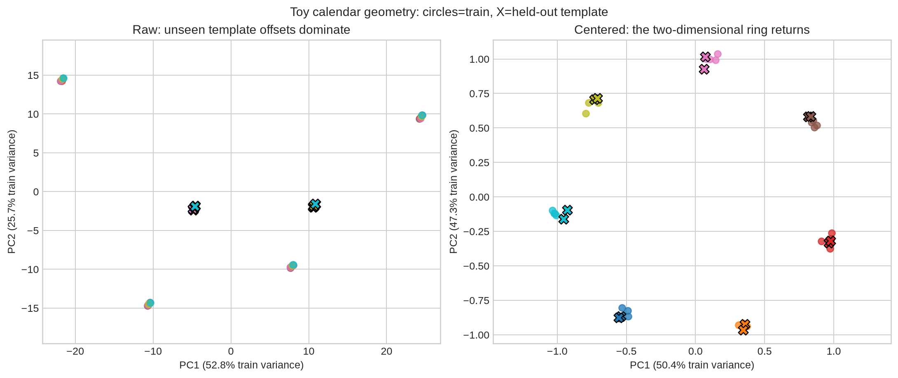
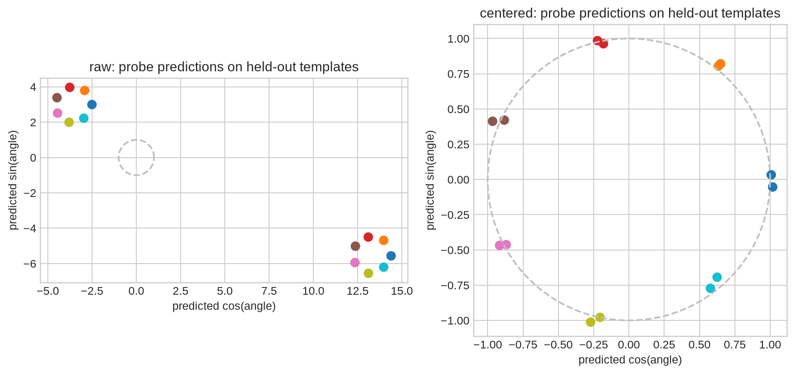
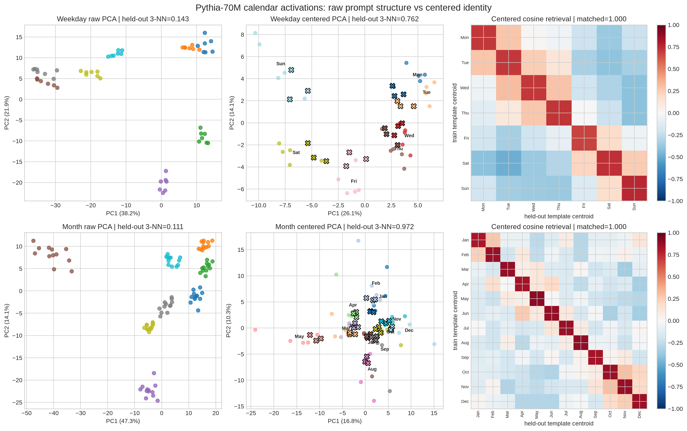
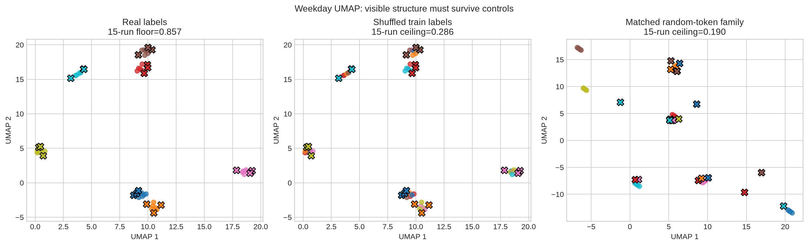

# [11.1] PCA, SVD, and Geometry Controls

> **Notebooks: [exercises](../../exercises/part1_pca_svd_geometry_controls/11.1_PCA_SVD_and_Geometry_Controls_exercises.ipynb) | [solutions](../../exercises/part1_pca_svd_geometry_controls/11.1_PCA_SVD_and_Geometry_Controls_solutions.ipynb)**

By the end of this notebook, you will have shown that Pythia-70M final-token activations preserve weekday and month identity across unseen prompt templates **after template centering**, because held-out prediction remains high across 15 UMAP runs while raw, shuffled-label, white-noise, and matched random-token controls fail.

## Core Question

When a two-dimensional activation plot looks structured, what evidence tells you it represents a concept rather than prompt wording, projection artifacts, or noise?

You will first solve a toy calendar where the exact two-dimensional ground truth is known. Then you will run the same reasoning loop on a pinned real language model:

> **predict -> implement -> test -> see -> control -> interpret -> perturb**

PCA and UMAP are exploratory views. Held-out prediction, OOD prompt transfer, seed stability, neighborhood preservation, and controls carry the claim.

```python
GT_TIER = "GT-1"
EXERCISE_ID = "11_1_pca_svd_and_geometry_controls"
DIFFICULTY = 3
IMPORTANCE = 4
EXPECTED_RUNTIME = "70-100 minutes; about 15 seconds for the live CUDA result"
REQUIRES_GPU = True
```

## Learning Objectives

You will be able to:

- implement centered PCA using `torch.linalg.svd`;
- fit a projection on training activations without leaking held-out data;
- remove prompt-template nuisance directions;
- evaluate held-out geometry with nearest-centroid, kNN, and a ridge coordinate probe;
- audit UMAP using trustworthiness, neighborhood preservation, seed and hyperparameter sweeps;
- build controls which fail for the right reason;
- distinguish a representation claim from a causal behavior claim.

```python
import json
import sys
from dataclasses import dataclass
from pathlib import Path
from typing import Literal

import matplotlib.pyplot as plt
import numpy as np
import pandas as pd
import torch as t
from IPython.display import display

chapter = "chapter11_representation_geometry"
section = "part1_pca_svd_geometry_controls"
root_dir = next(p for p in [Path.cwd(), *Path.cwd().parents] if (p / chapter).exists())
exercises_dir = root_dir / chapter / "exercises"
section_dir = exercises_dir / section
assets_dir = root_dir / chapter / "instructions" / "assets"

if str(root_dir) not in sys.path:
    sys.path.append(str(root_dir))
if str(exercises_dir) not in sys.path:
    sys.path.append(str(exercises_dir))

import part1_pca_svd_geometry_controls.solutions as reference
import part1_pca_svd_geometry_controls.tests as tests

CausalDirection = Literal["increase", "decrease"]
plt.style.use("seaborn-v0_8-whitegrid")
```

## Cold Open: Label Identity or Prompt Wording?

Consider two prompts which end in the same word:

- `Today is Monday`
- `The calendar says Monday`

Their final-token activations contain both **Monday** and the prompt that led to it. Before running anything, predict which will dominate a raw projection:

1. calendar identity;
2. prompt-template identity;
3. neither in a stable way.

The held-out split below uses prompt templates that never occur in training. Labels are used only after dimensionality reduction, for evaluation and coloring.

```python
prompt_preview = pd.DataFrame(
    [
        ("train", "weekday", "Today is Monday"),
        ("train", "weekday", "The meeting is on Thursday"),
        ("heldout", "weekday", "The calendar says Monday"),
        ("heldout", "weekday", "I wrote down Thursday"),
        ("train", "month", "The invoice arrived in March"),
        ("heldout", "month", "The memo is dated March"),
    ],
    columns=["split", "concept", "prompt"],
)
display(prompt_preview)
```

## Part 1: A Toy Model With Ground Truth

The toy task embeds seven points on an exact unit circle in a 32-dimensional activation space, then adds large independent prompt-template offsets. You know what the answer should be: a ring after nuisance removal, and chance performance before it.

```python
@dataclass(frozen=True)
class PCAProjection:
    projected: t.Tensor
    components: t.Tensor
    explained_variance_ratio: t.Tensor


@dataclass(frozen=True)
class TrainHeldoutPCAProjection:
    train_projected: t.Tensor
    heldout_projected: t.Tensor
    train_mean: t.Tensor
    components: t.Tensor
    explained_variance_ratio: t.Tensor


@dataclass(frozen=True)
class RidgeCoordinateProbe:
    weights: t.Tensor
    heldout_predictions: t.Tensor


@dataclass(frozen=True)
class GeometryLabelPredictionReport:
    heldout_accuracy: float
    predicts_heldout_labels: bool


@dataclass(frozen=True)
class WhiteNoiseControlReport:
    real_accuracy: float
    noise_accuracy: float
    margin: float
    survives_white_noise_control: bool


@dataclass(frozen=True)
class GeometryStabilityReport:
    neighbor_sets: tuple[tuple[int, ...], ...]
    mean_pairwise_jaccard: float
    stable_across_seeds: bool


@dataclass(frozen=True)
class DirectionCausalEffectReport:
    baseline_mean: float
    intervened_mean: float
    random_control_mean: float
    observed_delta: float
    random_delta: float
    has_causal_effect: bool


@dataclass(frozen=True)
class KNNLabelPredictionReport:
    k: int
    heldout_accuracy: float
    predicts_heldout_labels: bool


@dataclass(frozen=True)
class NeighborhoodPreservationReport:
    k: int
    mean_neighbor_overlap: float
    preserves_neighborhoods: bool


@dataclass(frozen=True)
class VisualizationSweepReport:
    seed_count: int
    setting_count: int
    run_count: int
    min_heldout_knn_accuracy: float
    mean_heldout_knn_accuracy: float
    min_trustworthiness: float
    mean_trustworthiness: float
    min_neighborhood_preservation: float
    mean_neighborhood_preservation: float
    random_label_accuracy_max: float
    random_token_accuracy_max: float
    passes_visualization_controls: bool
```

### Exercise 1: PCA Without Held-Out Leakage

> **Difficulty:** medium
> **Importance:** high
> **Suggested time:** 15 minutes

Implement centered PCA from SVD. Then implement a train/held-out variant which fits the mean and components on training activations only. A huge held-out-only direction must not rotate the fitted basis.

```python
def pca_svd_projection(
    activations: t.Tensor,
    *,
    n_components: int = 2,
) -> PCAProjection:
    raise NotImplementedError()


def pca_svd_train_heldout_projection(
    train_activations: t.Tensor,
    heldout_activations: t.Tensor,
    *,
    n_components: int = 2,
) -> TrainHeldoutPCAProjection:
    raise NotImplementedError()


tests.test_pca_svd_projection_centers_and_reports_variance(pca_svd_projection)
tests.test_train_heldout_pca_fits_only_on_training_activations(
    pca_svd_train_heldout_projection
)
```

<details>
<summary>Expected output</summary>

```text
All tests in `test_pca_svd_projection_centers_and_reports_variance` passed!
All tests in `test_train_heldout_pca_fits_only_on_training_activations` passed!
```

</details>

<details>
<summary>Help - getting started</summary>

For centered data, the right singular vectors are principal directions and squared singular values are proportional to explained variance. Store the training mean, and use it unchanged when transforming held-out data.

</details>

<details>
<summary>Interpretation</summary>

Fitting PCA on all points is acceptable for a purely descriptive plot, but not for a held-out generalization claim. Here the projection itself is part of the evaluation pipeline, so it must be train-fitted.

</details>

<details>
<summary>Solution</summary>

```python
def pca_svd_projection(
    activations: t.Tensor,
    *,
    n_components: int = 2,
) -> PCAProjection:
    """Project activations with centered PCA using SVD."""

    if activations.ndim != 2:
        raise ValueError("activations must have shape (examples, d_model).")
    if n_components <= 0:
        raise ValueError("n_components must be positive.")
    if n_components > min(activations.shape):
        raise ValueError("n_components cannot exceed min(examples, d_model).")

    activations_float = activations.float()
    centered = activations_float - activations_float.mean(dim=0, keepdim=True)
    _, singular_values, vh = t.linalg.svd(centered, full_matrices=False)
    components = vh[:n_components]
    projected = centered @ components.T
    variance = singular_values.pow(2)
    total_variance = variance.sum()
    if total_variance.item() == 0:
        explained = t.zeros(
            n_components,
            dtype=activations_float.dtype,
            device=activations.device,
        )
    else:
        explained = variance[:n_components] / total_variance
    return PCAProjection(
        projected=projected,
        components=components,
        explained_variance_ratio=explained,
    )


def pca_svd_train_heldout_projection(
    train_activations: t.Tensor,
    heldout_activations: t.Tensor,
    *,
    n_components: int = 2,
) -> TrainHeldoutPCAProjection:
    """Fit PCA on training activations, then transform held-out activations."""

    if train_activations.ndim != 2 or heldout_activations.ndim != 2:
        raise ValueError("activations must have shape (examples, d_model).")
    if train_activations.shape[1] != heldout_activations.shape[1]:
        raise ValueError("train and heldout activation dimensions must match.")
    if n_components <= 0:
        raise ValueError("n_components must be positive.")
    if n_components > min(train_activations.shape):
        raise ValueError("n_components cannot exceed min(train_examples, d_model).")

    train_float = train_activations.float()
    heldout_float = heldout_activations.float()
    train_mean = train_float.mean(dim=0, keepdim=True)
    train_centered = train_float - train_mean
    _, singular_values, vh = t.linalg.svd(train_centered, full_matrices=False)
    components = vh[:n_components]
    variance = singular_values.pow(2)
    total_variance = variance.sum()
    if total_variance.item() == 0:
        explained = t.zeros(
            n_components,
            dtype=train_float.dtype,
            device=train_float.device,
        )
    else:
        explained = variance[:n_components] / total_variance
    return TrainHeldoutPCAProjection(
        train_projected=train_centered @ components.T,
        heldout_projected=(heldout_float - train_mean) @ components.T,
        train_mean=train_mean,
        components=components,
        explained_variance_ratio=explained,
    )
```


</details>

<details>
<summary>Common bugs</summary>

- fitting the PCA basis on train and held-out points together;
- forgetting to subtract the training mean from held-out activations;
- interpreting SVD sign flips as different geometry;
- treating squared singular values as singular values when computing explained variance.

</details>

### Exercise 2: Remove Template Means

> **Difficulty:** easy
> **Importance:** high
> **Suggested time:** 5 minutes

For a tensor shaped `(templates, labels, d_model)`, subtract each template's mean over labels. This removes a shared prompt direction without using label identities.

```python
def template_center_activations(
    activations_by_template: t.Tensor,
) -> t.Tensor:
    raise NotImplementedError()


tests.test_template_center_activations_removes_each_template_mean(
    template_center_activations
)
```

<details>
<summary>Expected output</summary>

```text
All tests in `test_template_center_activations_removes_each_template_mean` passed!
```

</details>

<details>
<summary>Help - getting started</summary>

Use `mean(dim=1, keepdim=True)`. Do not center across templates: each prompt family has its own nuisance offset.

</details>

<details>
<summary>Interpretation</summary>

Centering can remove real global information as well as nuisance. It is justified here by an explicit train/held-out prompt-template question, then checked against controls.

</details>

<details>
<summary>Solution</summary>

```python
def template_center_activations(
    activations_by_template: t.Tensor,
) -> t.Tensor:
    """Remove each prompt template's mean direction from its activation batch."""

    if activations_by_template.ndim != 3:
        raise ValueError(
            "activations_by_template must have shape (templates, examples, d_model)."
        )
    activations_float = activations_by_template.float()
    return activations_float - activations_float.mean(dim=1, keepdim=True)
```


</details>

### See It: Recover the Known Ring

The generator is data plumbing, not the method being taught. Your PCA and template-centering implementations produce the figure. Color denotes the known cyclic identity; circles are training templates and black-edged X markers are held-out templates.

```python
toy = reference.make_toy_calendar_ring(seed=0)
raw_toy = pca_svd_train_heldout_projection(
    toy["train_raw"], toy["heldout_raw"], n_components=2
)
centered_toy = pca_svd_train_heldout_projection(
    template_center_activations(toy["train_raw_grid"]).flatten(0, 1),
    template_center_activations(toy["heldout_raw_grid"]).flatten(0, 1),
    n_components=2,
)

fig, axes = plt.subplots(1, 2, figsize=(12, 5), constrained_layout=True)
colors = plt.cm.tab10(np.linspace(0, 1, 7))
for ax, projection, title in [
    (axes[0], raw_toy, "Raw: unseen template offsets dominate"),
    (axes[1], centered_toy, "Centered: the two-dimensional ring returns"),
]:
    for label in range(7):
        train_mask = toy["train_labels"].eq(label)
        heldout_mask = toy["heldout_labels"].eq(label)
        ax.scatter(
            projection.train_projected[train_mask, 0],
            projection.train_projected[train_mask, 1],
            color=colors[label], alpha=0.75, s=42,
        )
        ax.scatter(
            projection.heldout_projected[heldout_mask, 0],
            projection.heldout_projected[heldout_mask, 1],
            color=colors[label], marker="X", edgecolor="black", s=90,
        )
    ax.set_title(title)
    ax.set_xlabel(f"PC1 ({projection.explained_variance_ratio[0]:.1%} train variance)")
    ax.set_ylabel(f"PC2 ({projection.explained_variance_ratio[1]:.1%} train variance)")
    ax.set_aspect("equal", adjustable="datalim")
fig.suptitle("Toy calendar geometry: circles=train, X=held-out template")
toy_path = assets_dir / "pca_svd_geometry_toy_ring.png"
fig.savefig(toy_path, dpi=180, bbox_inches="tight")
plt.show()
```



<details>
<summary>Interpretation: what should you notice?</summary>

The raw plot can look highly structured while failing the scientific question: its dominant directions encode template offsets, and unseen templates move elsewhere. After per-template centering, the two signal dimensions explain almost all remaining variance and train/held-out points agree. This is a toy theorem, not yet evidence about Pythia.

</details>

### Exercise 3: Held-Out Centroids and kNN

> **Difficulty:** medium
> **Importance:** high
> **Suggested time:** 15 minutes

Implement nearest-centroid and k-nearest-neighbor prediction. Fit using training points and labels only, then score the held-out prompt templates.

```python
def nearest_centroid_predictions(
    train_points: t.Tensor,
    train_labels: t.Tensor,
    heldout_points: t.Tensor,
) -> t.Tensor:
    raise NotImplementedError()


def geometry_label_prediction_report(
    train_points: t.Tensor,
    train_labels: t.Tensor,
    heldout_points: t.Tensor,
    heldout_labels: t.Tensor,
    *,
    min_accuracy: float = 0.8,
) -> GeometryLabelPredictionReport:
    raise NotImplementedError()


def knn_label_predictions(
    train_points: t.Tensor,
    train_labels: t.Tensor,
    heldout_points: t.Tensor,
    *,
    k: int = 1,
) -> t.Tensor:
    raise NotImplementedError()


def heldout_knn_accuracy_report(
    train_points: t.Tensor,
    train_labels: t.Tensor,
    heldout_points: t.Tensor,
    heldout_labels: t.Tensor,
    *,
    k: int = 1,
    min_accuracy: float = 0.8,
) -> KNNLabelPredictionReport:
    raise NotImplementedError()


tests.test_geometry_label_prediction_report_uses_heldout_centroids(
    geometry_label_prediction_report
)
tests.test_knn_label_prediction_report_uses_heldout_points(
    heldout_knn_accuracy_report
)
```

<details>
<summary>Expected output</summary>

```text
All tests in `test_geometry_label_prediction_report_uses_heldout_centroids` passed!
All tests in `test_knn_label_prediction_report_uses_heldout_points` passed!
```

</details>

<details>
<summary>Help - getting started</summary>

Use `torch.cdist`. For kNN, vote among the labels of the closest training points; keep the label values rather than assuming they are contiguous.

</details>

<details>
<summary>Interpretation</summary>

A plot becomes more credible when its geometry predicts unseen examples. Accuracy is still not enough: you will next compare against controls and projection stability.

</details>

<details>
<summary>Solution</summary>

```python
def nearest_centroid_predictions(
    train_points: t.Tensor,
    train_labels: t.Tensor,
    heldout_points: t.Tensor,
) -> t.Tensor:
    """Classify held-out points by nearest class centroid."""

    if train_points.ndim != 2 or heldout_points.ndim != 2:
        raise ValueError("points must have shape (examples, dimensions).")
    if train_points.shape[-1] != heldout_points.shape[-1]:
        raise ValueError("train and heldout point dimensions must match.")
    labels = train_labels.flatten().long()
    if labels.numel() != train_points.shape[0]:
        raise ValueError("train_labels must have one label per train point.")

    unique_labels = labels.unique(sorted=True)
    centroids = []
    for label in unique_labels:
        centroids.append(train_points[labels.eq(label)].float().mean(dim=0))
    centroid_tensor = t.stack(centroids)
    distances = t.cdist(heldout_points.float(), centroid_tensor)
    predicted_indices = distances.argmin(dim=-1)
    return unique_labels[predicted_indices]


def geometry_label_prediction_report(
    train_points: t.Tensor,
    train_labels: t.Tensor,
    heldout_points: t.Tensor,
    heldout_labels: t.Tensor,
    *,
    min_accuracy: float = 0.8,
) -> GeometryLabelPredictionReport:
    """Check whether geometry predicts held-out labels."""

    predictions = nearest_centroid_predictions(train_points, train_labels, heldout_points)
    labels = heldout_labels.flatten().long()
    if predictions.shape != labels.shape:
        raise ValueError("heldout_labels must have one label per heldout point.")
    accuracy = predictions.eq(labels).float().mean().item()
    return GeometryLabelPredictionReport(
        heldout_accuracy=accuracy,
        predicts_heldout_labels=accuracy >= min_accuracy,
    )


def knn_label_predictions(
    train_points: t.Tensor,
    train_labels: t.Tensor,
    heldout_points: t.Tensor,
    *,
    k: int = 1,
) -> t.Tensor:
    """Classify held-out points by k-nearest train labels."""

    if k <= 0:
        raise ValueError("k must be positive.")
    if train_points.ndim != 2 or heldout_points.ndim != 2:
        raise ValueError("points must have shape (examples, dimensions).")
    if train_points.shape[-1] != heldout_points.shape[-1]:
        raise ValueError("train and heldout point dimensions must match.")
    labels = train_labels.flatten().long()
    if labels.numel() != train_points.shape[0]:
        raise ValueError("train_labels must have one label per train point.")
    if k > train_points.shape[0]:
        raise ValueError("k cannot exceed the number of train points.")

    distances = t.cdist(heldout_points.float(), train_points.float())
    nearest = distances.topk(k, largest=False).indices
    nearest_labels = labels[nearest]
    unique_labels = labels.unique(sorted=True)
    predictions = []
    for row in nearest_labels:
        votes = t.stack([(row == label).sum() for label in unique_labels])
        predictions.append(unique_labels[votes.argmax()])
    return t.stack(predictions)


def heldout_knn_accuracy_report(
    train_points: t.Tensor,
    train_labels: t.Tensor,
    heldout_points: t.Tensor,
    heldout_labels: t.Tensor,
    *,
    k: int = 1,
    min_accuracy: float = 0.8,
) -> KNNLabelPredictionReport:
    """Check whether a low-dimensional geometry predicts held-out labels by kNN."""

    predictions = knn_label_predictions(train_points, train_labels, heldout_points, k=k)
    labels = heldout_labels.flatten().long()
    if predictions.shape != labels.shape:
        raise ValueError("heldout_labels must have one label per heldout point.")
    accuracy = predictions.eq(labels).float().mean().item()
    return KNNLabelPredictionReport(
        k=k,
        heldout_accuracy=accuracy,
        predicts_heldout_labels=accuracy >= min_accuracy,
    )
```


</details>

```python
toy_rows = []
for name, projection in [("raw PCA", raw_toy), ("template-centered PCA", centered_toy)]:
    report = heldout_knn_accuracy_report(
        projection.train_projected,
        toy["train_labels"],
        projection.heldout_projected,
        toy["heldout_labels"],
        k=3,
        min_accuracy=0.95,
    )
    toy_rows.append({"representation": name, "held-out kNN accuracy": report.heldout_accuracy})
toy_rows.append({"representation": "chance", "held-out kNN accuracy": 1 / 7})
toy_knn_table = pd.DataFrame(toy_rows)
display(toy_knn_table.style.format({"held-out kNN accuracy": "{:.3f}"}))
```

<details>
<summary>Expected result and interpretation</summary>

Raw PCA is at chance (`0.143`); template-centered PCA is perfect (`1.000`). The result is meaningful because the held-out templates have nuisance offsets which were not present when the PCA basis or neighbors were fitted.

</details>

### Exercise 4: Probe the Known Cyclic Coordinates

> **Difficulty:** medium
> **Importance:** high
> **Suggested time:** 10 minutes

Fit a ridge probe from high-dimensional activations to the known `(cos angle, sin angle)` target. Add a bias term, do not regularize that bias, and evaluate only on held-out templates.

```python
def ridge_coordinate_probe(
    train_activations: t.Tensor,
    train_coordinates: t.Tensor,
    heldout_activations: t.Tensor,
    *,
    l2: float = 1e-3,
) -> RidgeCoordinateProbe:
    raise NotImplementedError()


tests.test_ridge_coordinate_probe_generalizes_known_linear_coordinates(
    ridge_coordinate_probe
)
```

<details>
<summary>Expected output</summary>

```text
All tests in `test_ridge_coordinate_probe_generalizes_known_linear_coordinates` passed!
```

</details>

<details>
<summary>Help - getting started</summary>

Augment the design matrix with a column of ones. Solve the regularized normal equations with `torch.linalg.solve`; set the final diagonal regularizer entry to zero for the bias.

</details>

<details>
<summary>Interpretation</summary>

The probe answers a different question from PCA: can a fixed linear map recover prespecified cyclic coordinates on unseen templates? It does not prove the model uses those coordinates causally.

</details>

<details>
<summary>Solution</summary>

```python
def ridge_coordinate_probe(
    train_activations: t.Tensor,
    train_coordinates: t.Tensor,
    heldout_activations: t.Tensor,
    *,
    l2: float = 1e-3,
) -> RidgeCoordinateProbe:
    """Fit a bias-aware ridge probe on train data and predict held-out coordinates."""

    if train_activations.ndim != 2 or heldout_activations.ndim != 2:
        raise ValueError("activations must have shape (examples, features).")
    if train_coordinates.ndim != 2:
        raise ValueError("train_coordinates must have shape (examples, targets).")
    if train_activations.shape[0] != train_coordinates.shape[0]:
        raise ValueError("train activations and coordinates must have equal examples.")
    if train_activations.shape[1] != heldout_activations.shape[1]:
        raise ValueError("train and heldout activation dimensions must match.")
    if l2 < 0:
        raise ValueError("l2 must be non-negative.")

    train_float = train_activations.float()
    heldout_float = heldout_activations.float()
    targets_float = train_coordinates.float()
    train_design = t.cat(
        [train_float, t.ones(train_float.shape[0], 1, device=train_float.device)],
        dim=1,
    )
    heldout_design = t.cat(
        [heldout_float, t.ones(heldout_float.shape[0], 1, device=heldout_float.device)],
        dim=1,
    )
    regularizer = t.eye(
        train_design.shape[1],
        dtype=train_design.dtype,
        device=train_design.device,
    )
    regularizer[-1, -1] = 0.0
    weights = t.linalg.solve(
        train_design.T @ train_design + l2 * regularizer,
        train_design.T @ targets_float,
    )
    return RidgeCoordinateProbe(
        weights=weights,
        heldout_predictions=heldout_design @ weights,
    )
```


</details>

```python
probe_rows = []
probe_predictions = {}
for mode in ["raw", "centered"]:
    probe = ridge_coordinate_probe(
        toy[f"train_{mode}"],
        toy["train_targets"],
        toy[f"heldout_{mode}"],
        l2=1e-3,
    )
    predicted_labels = t.cdist(
        probe.heldout_predictions, toy["ring_coordinates"]
    ).argmin(dim=-1)
    accuracy = predicted_labels.eq(toy["heldout_labels"]).float().mean().item()
    rmse = (probe.heldout_predictions - toy["heldout_targets"]).square().mean().sqrt().item()
    probe_rows.append({"representation": mode, "cyclic label accuracy": accuracy, "coordinate RMSE": rmse})
    probe_predictions[mode] = probe.heldout_predictions

fig, axes = plt.subplots(1, 2, figsize=(10, 4.5), constrained_layout=True)
theta = np.linspace(0, 2 * np.pi, 200)
for ax, mode in zip(axes, ["raw", "centered"], strict=True):
    ax.plot(np.cos(theta), np.sin(theta), color="0.75", linestyle="--")
    pred = probe_predictions[mode]
    ax.scatter(pred[:, 0], pred[:, 1], c=toy["heldout_labels"], cmap="tab10", s=55)
    ax.set_title(f"{mode}: probe predictions on held-out templates")
    ax.set_aspect("equal")
    ax.set_xlabel("predicted cos(angle)")
    ax.set_ylabel("predicted sin(angle)")
probe_path = assets_dir / "pca_svd_geometry_toy_probe.png"
fig.savefig(probe_path, dpi=180, bbox_inches="tight")
plt.show()
display(pd.DataFrame(probe_rows).style.format({"cyclic label accuracy": "{:.3f}", "coordinate RMSE": "{:.3f}"}))
```



<details>
<summary>Interpretation</summary>

The raw probe extrapolates the training templates poorly because new nuisance offsets move every held-out point. The centered probe recovers all seven cyclic identities. You now have two independent views of the same toy ground truth: unsupervised PCA and a supervised coordinate probe.

</details>

### Exercise 5: Controls and Projection Stability

> **Difficulty:** hard
> **Importance:** high
> **Suggested time:** 20 minutes

Implement four checks:

1. require real accuracy to beat white noise by a margin;
2. compute true pairwise Jaccard stability (`intersection / union`);
3. compare high- and low-dimensional neighbor sets;
4. aggregate a full reducer sweep, including random-label and random-token ceilings.

```python
def white_noise_control_report(
    *,
    real_accuracy: float,
    noise_accuracy: float,
    min_margin: float = 0.2,
) -> WhiteNoiseControlReport:
    raise NotImplementedError()


def geometry_stability_report(
    neighbor_sets: list[list[int]],
    *,
    min_jaccard: float = 0.5,
) -> GeometryStabilityReport:
    raise NotImplementedError()


def neighborhood_preservation_report(
    high_dim_points: t.Tensor,
    low_dim_points: t.Tensor,
    *,
    k: int = 3,
    min_overlap: float = 0.5,
) -> NeighborhoodPreservationReport:
    raise NotImplementedError()


def visualization_sweep_report(
    *,
    seed_count: int,
    setting_count: int,
    heldout_knn_accuracies: list[float],
    trustworthiness_scores: list[float],
    neighborhood_preservation_scores: list[float],
    random_label_accuracies: list[float],
    random_token_accuracies: list[float],
    min_seed_count: int = 5,
    min_setting_count: int = 3,
    min_heldout_accuracy: float = 0.8,
    min_trustworthiness: float = 0.8,
    min_neighborhood_preservation: float = 0.5,
    max_random_label_accuracy: float = 0.3,
    max_random_token_accuracy: float = 0.3,
) -> VisualizationSweepReport:
    raise NotImplementedError()


tests.test_white_noise_control_report_requires_margin(white_noise_control_report)
tests.test_geometry_stability_report_averages_pairwise_jaccard(geometry_stability_report)
tests.test_neighborhood_preservation_report_compares_neighbor_sets(
    neighborhood_preservation_report
)
tests.test_visualization_sweep_report_requires_controls(visualization_sweep_report)
```

<details>
<summary>Expected output</summary>

```text
All tests in `test_white_noise_control_report_requires_margin` passed!
All tests in `test_geometry_stability_report_averages_pairwise_jaccard` passed!
All tests in `test_neighborhood_preservation_report_compares_neighbor_sets` passed!
All tests in `test_visualization_sweep_report_requires_controls` passed!
```

</details>

<details>
<summary>Help - getting started</summary>

Treat each metric as a falsification gate. A good-looking projection fails if any seed collapses held-out prediction, if local neighborhoods are not preserved, or if shuffled labels/random tokens perform similarly.

</details>

<details>
<summary>Interpretation</summary>

Trustworthiness and neighbor overlap test local structure, not global distances or circularity. UMAP may rotate, reflect, or warp a valid representation while preserving the local evidence.

</details>

<details>
<summary>Solution</summary>

```python
def white_noise_control_report(
    *,
    real_accuracy: float,
    noise_accuracy: float,
    min_margin: float = 0.2,
) -> WhiteNoiseControlReport:
    """Check that real geometry beats a white-noise geometry control."""

    margin = real_accuracy - noise_accuracy
    return WhiteNoiseControlReport(
        real_accuracy=real_accuracy,
        noise_accuracy=noise_accuracy,
        margin=margin,
        survives_white_noise_control=margin >= min_margin,
    )


def geometry_stability_report(
    neighbor_sets: list[list[int]],
    *,
    min_jaccard: float = 0.5,
) -> GeometryStabilityReport:
    """Check whether nearest-neighbor sets are stable across seeds."""

    if not neighbor_sets:
        raise ValueError("neighbor_sets must be nonempty.")
    normalized = tuple(tuple(int(index) for index in neighbors) for neighbors in neighbor_sets)
    overlaps = []
    for i, left in enumerate(normalized):
        for right in normalized[i + 1 :]:
            left_set = set(left)
            right_set = set(right)
            if not left_set and not right_set:
                overlaps.append(1.0)
            else:
                overlaps.append(len(left_set & right_set) / len(left_set | right_set))
    mean_jaccard = sum(overlaps) / len(overlaps) if overlaps else 1.0
    return GeometryStabilityReport(
        neighbor_sets=normalized,
        mean_pairwise_jaccard=mean_jaccard,
        stable_across_seeds=mean_jaccard >= min_jaccard,
    )


def neighborhood_preservation_report(
    high_dim_points: t.Tensor,
    low_dim_points: t.Tensor,
    *,
    k: int = 3,
    min_overlap: float = 0.5,
) -> NeighborhoodPreservationReport:
    """Compare high-dimensional and low-dimensional nearest-neighbor sets."""

    if k <= 0:
        raise ValueError("k must be positive.")
    if high_dim_points.ndim != 2 or low_dim_points.ndim != 2:
        raise ValueError("points must have shape (examples, dimensions).")
    if high_dim_points.shape[0] != low_dim_points.shape[0]:
        raise ValueError("high_dim_points and low_dim_points must have the same examples.")
    if k >= high_dim_points.shape[0]:
        raise ValueError("k must be smaller than the number of examples.")

    high_distances = t.cdist(high_dim_points.float(), high_dim_points.float())
    low_distances = t.cdist(low_dim_points.float(), low_dim_points.float())
    high_neighbors = high_distances.topk(k + 1, largest=False).indices[:, 1:]
    low_neighbors = low_distances.topk(k + 1, largest=False).indices[:, 1:]
    overlaps = []
    for high_row, low_row in zip(high_neighbors, low_neighbors, strict=True):
        high_set = set(int(index) for index in high_row.tolist())
        low_set = set(int(index) for index in low_row.tolist())
        overlaps.append(len(high_set & low_set) / k)
    mean_overlap = sum(overlaps) / len(overlaps)
    return NeighborhoodPreservationReport(
        k=k,
        mean_neighbor_overlap=mean_overlap,
        preserves_neighborhoods=mean_overlap >= min_overlap,
    )


def visualization_sweep_report(
    *,
    seed_count: int,
    setting_count: int,
    heldout_knn_accuracies: list[float],
    trustworthiness_scores: list[float],
    neighborhood_preservation_scores: list[float],
    random_label_accuracies: list[float],
    random_token_accuracies: list[float],
    min_seed_count: int = 5,
    min_setting_count: int = 3,
    min_heldout_accuracy: float = 0.8,
    min_trustworthiness: float = 0.8,
    min_neighborhood_preservation: float = 0.5,
    max_random_label_accuracy: float = 0.3,
    max_random_token_accuracy: float = 0.3,
) -> VisualizationSweepReport:
    """Aggregate a visualization reducer sweep into an acceptance report."""

    run_count = len(heldout_knn_accuracies)
    if run_count == 0:
        raise ValueError("visualization sweeps must include at least one run.")
    metric_lists = (
        trustworthiness_scores,
        neighborhood_preservation_scores,
        random_label_accuracies,
        random_token_accuracies,
    )
    if not all(len(values) == run_count for values in metric_lists):
        raise ValueError("all visualization metric lists must have the same length.")

    min_accuracy = min(heldout_knn_accuracies)
    mean_accuracy = sum(heldout_knn_accuracies) / run_count
    min_trust = min(trustworthiness_scores)
    mean_trust = sum(trustworthiness_scores) / run_count
    min_preservation = min(neighborhood_preservation_scores)
    mean_preservation = sum(neighborhood_preservation_scores) / run_count
    random_label_max = max(random_label_accuracies)
    random_token_max = max(random_token_accuracies)
    passes = (
        seed_count >= min_seed_count
        and setting_count >= min_setting_count
        and min_accuracy >= min_heldout_accuracy
        and min_trust >= min_trustworthiness
        and min_preservation >= min_neighborhood_preservation
        and random_label_max <= max_random_label_accuracy
        and random_token_max <= max_random_token_accuracy
    )
    return VisualizationSweepReport(
        seed_count=seed_count,
        setting_count=setting_count,
        run_count=run_count,
        min_heldout_knn_accuracy=min_accuracy,
        mean_heldout_knn_accuracy=mean_accuracy,
        min_trustworthiness=min_trust,
        mean_trustworthiness=mean_trust,
        min_neighborhood_preservation=min_preservation,
        mean_neighborhood_preservation=mean_preservation,
        random_label_accuracy_max=random_label_max,
        random_token_accuracy_max=random_token_max,
        passes_visualization_controls=passes,
    )
```


</details>

### Exercise 6: What Would a Causal Claim Require?

> **Difficulty:** easy
> **Importance:** medium
> **Suggested time:** 5 minutes

This gate is deliberately separated from the Pythia geometry claim. A direction counts as causal evidence only when intervening changes a behavioral score in the predicted direction **and** beats a matched random direction.

```python
def direction_causal_effect_report(
    baseline_scores: t.Tensor,
    intervened_scores: t.Tensor,
    random_control_scores: t.Tensor,
    *,
    expected_direction: CausalDirection = "increase",
    min_effect: float = 0.2,
    min_random_margin: float = 0.1,
) -> DirectionCausalEffectReport:
    raise NotImplementedError()


tests.test_direction_causal_effect_report_beats_random_control(
    direction_causal_effect_report
)
```

<details>
<summary>Expected output</summary>

```text
All tests in `test_direction_causal_effect_report_beats_random_control` passed!
```

</details>

<details>
<summary>Help - getting started</summary>

Compute the observed and random deltas from the same baseline. Check the requested sign and require the observed absolute effect to exceed the random effect by a margin.

</details>

<details>
<summary>Interpretation</summary>

Passing this function on synthetic scores only tests the gate. The real Pythia result below does not perform an activation intervention, so it makes no causal behavior claim.

</details>

<details>
<summary>Solution</summary>

```python
def direction_causal_effect_report(
    baseline_scores: t.Tensor,
    intervened_scores: t.Tensor,
    random_control_scores: t.Tensor,
    *,
    expected_direction: CausalDirection = "increase",
    min_effect: float = 0.2,
    min_random_margin: float = 0.1,
) -> DirectionCausalEffectReport:
    """Check that a representation direction has causal effect over random control."""

    if baseline_scores.shape != intervened_scores.shape:
        raise ValueError("baseline and intervened scores must match.")
    if baseline_scores.shape != random_control_scores.shape:
        raise ValueError("baseline and random control scores must match.")
    baseline_mean = baseline_scores.float().mean().item()
    intervened_mean = intervened_scores.float().mean().item()
    random_control_mean = random_control_scores.float().mean().item()
    observed_delta = intervened_mean - baseline_mean
    random_delta = random_control_mean - baseline_mean
    if expected_direction == "increase":
        directional_effect = observed_delta >= min_effect
    elif expected_direction == "decrease":
        directional_effect = -observed_delta >= min_effect
    else:
        raise ValueError("expected_direction must be 'increase' or 'decrease'.")
    has_causal_effect = directional_effect and abs(observed_delta) > (
        abs(random_delta) + min_random_margin
    )
    return DirectionCausalEffectReport(
        baseline_mean=baseline_mean,
        intervened_mean=intervened_mean,
        random_control_mean=random_control_mean,
        observed_delta=observed_delta,
        random_delta=random_delta,
        has_causal_effect=has_causal_effect,
    )
```


</details>

## Part 2: Live Pythia Calendar Geometry

Now run the real experiment. Shared code handles tokenizer/model loading and batched activation extraction; the methods you implemented remain visible and reusable. The checkpoint is pinned to `EleutherAI/pythia-70m-deduped` revision `e93a9f...` and runs in float32 on CUDA.

The experiment uses:

- five training and three held-out prompt templates per concept family;
- weekdays and months;
- matched random-token families;
- five UMAP seeds times three hyperparameter settings;
- no text generation and no downloaded result file.

```python
signature_result = reference.run_pythia_calendar_signature_result(max_vram_gb=24.0)
assert signature_result["preflight_passed"]
assert signature_result["cuda_version"] == "13.2"
print(
    f"{signature_result['model_id']} on {signature_result['device']} | "
    f"CUDA {signature_result['cuda_version']} | "
    f"peak allocated VRAM {signature_result['peak_vram_gb']:.3f} GB"
)
```

<details>
<summary>Expected output</summary>

```text
EleutherAI/pythia-70m-deduped on NVIDIA GeForce RTX 5090 Laptop GPU | CUDA 13.2 | peak allocated VRAM about 0.31 GB
```

</details>

<details>
<summary>Why expose the activations?</summary>

The returned object contains the real CPU activation tables as tensors. The plot cells below recompute train-fitted PCA using your implementation. UMAP fitting and model extraction are shared plumbing, not a hidden substitute for the exercises.

</details>

## Signature Result: Prompt Nuisance vs Calendar Identity

Before running the next cell, predict the failure mode. If raw geometry follows wording, points should separate by prompt template and held-out 2D kNN should be near chance. If centering reveals label identity, same-color train and held-out points should align and the cross-template cosine matrix should be diagonal.

```python
calendar_projections = {}
fig, axes = plt.subplots(2, 3, figsize=(16, 10), constrained_layout=True)
for row, task_name in enumerate(["weekday", "month"]):
    result = signature_result["signature"][task_name]
    acts = result["activations"]
    raw = pca_svd_train_heldout_projection(
        acts["train_raw"], acts["heldout_raw"], n_components=2
    )
    centered = pca_svd_train_heldout_projection(
        acts["train_centered"], acts["heldout_centered"], n_components=2
    )
    calendar_projections[task_name] = {"raw": raw, "centered": centered}

    raw_ax, centered_ax, cosine_ax = axes[row]
    train_template_ids = np.array(result["train_template_ids"])
    heldout_template_ids = np.array(result["heldout_template_ids"]) + len(result["train_templates"])
    raw_template_ids = np.concatenate([train_template_ids, heldout_template_ids])
    raw_coords = np.concatenate([
        raw.train_projected.numpy(), raw.heldout_projected.numpy()
    ])
    raw_ax.scatter(
        raw_coords[:, 0], raw_coords[:, 1], c=raw_template_ids,
        cmap="tab10", s=38, alpha=0.78,
    )
    raw_report = heldout_knn_accuracy_report(
        raw.train_projected, t.tensor(result["train_labels"]),
        raw.heldout_projected, t.tensor(result["heldout_labels"]),
        k=3, min_accuracy=0.0,
    )
    raw_ax.set_title(f"{task_name.title()} raw PCA | held-out 3-NN={raw_report.heldout_accuracy:.3f}")
    raw_ax.set_xlabel(f"PC1 ({raw.explained_variance_ratio[0]:.1%})")
    raw_ax.set_ylabel(f"PC2 ({raw.explained_variance_ratio[1]:.1%})")

    labels = np.array(result["label_names"])
    train_labels = np.array(result["train_labels"])
    heldout_labels = np.array(result["heldout_labels"])
    palette = plt.cm.tab20(np.linspace(0, 1, len(labels)))
    for label_id, label_name in enumerate(labels):
        train_mask = train_labels == label_id
        heldout_mask = heldout_labels == label_id
        centered_ax.scatter(
            centered.train_projected[train_mask, 0], centered.train_projected[train_mask, 1],
            color=palette[label_id], s=34, alpha=0.72,
        )
        centered_ax.scatter(
            centered.heldout_projected[heldout_mask, 0], centered.heldout_projected[heldout_mask, 1],
            color=palette[label_id], marker="X", edgecolor="black", s=82,
        )
        label_xy = centered.train_projected[train_mask].mean(dim=0)
        centered_ax.annotate(str(label_name)[:3], label_xy.numpy(), fontsize=8, fontweight="bold")
    centered_report = heldout_knn_accuracy_report(
        centered.train_projected, t.tensor(result["train_labels"]),
        centered.heldout_projected, t.tensor(result["heldout_labels"]),
        k=3, min_accuracy=0.0,
    )
    centered_ax.set_title(
        f"{task_name.title()} centered PCA | held-out 3-NN={centered_report.heldout_accuracy:.3f}"
    )
    centered_ax.set_xlabel(f"PC1 ({centered.explained_variance_ratio[0]:.1%})")
    centered_ax.set_ylabel(f"PC2 ({centered.explained_variance_ratio[1]:.1%})")

    similarity = np.array(result["cosine_similarity"])
    image = cosine_ax.imshow(similarity, cmap="RdBu_r", vmin=-1, vmax=1)
    abbreviations = [name[:3] for name in labels]
    cosine_ax.set_xticks(range(len(labels)), abbreviations, rotation=90, fontsize=7)
    cosine_ax.set_yticks(range(len(labels)), abbreviations, fontsize=7)
    cosine_ax.set_xlabel("held-out template centroid")
    cosine_ax.set_ylabel("train template centroid")
    cosine_ax.set_title(
        f"Centered cosine retrieval | matched={result['matched_pair_accuracy']:.3f}"
    )
    fig.colorbar(image, ax=cosine_ax, fraction=0.046)
fig.suptitle("Pythia-70M calendar activations: raw prompt structure vs centered identity", fontsize=15)
signature_path = assets_dir / "pca_svd_geometry_pythia_signature.png"
fig.savefig(signature_path, dpi=180, bbox_inches="tight")
plt.show()
```



<details>
<summary>Interpretation: what is evidence here?</summary>

The raw plots are not failed visualizations; they correctly reveal that prompt wording dominates the leading directions. The centered plots are still only exploratory. The stronger evidence is cross-template retrieval, held-out prediction, and the controlled 15-run sweep below.

The moderate two-PC explained variance means you should **not** claim that Pythia stores a literal two-dimensional calendar ring.

</details>

```python
evidence_rows = []
for task_name in ["weekday", "month"]:
    result = signature_result["signature"][task_name]
    sweep = result["visualization"]["sweep"]
    geometry = signature_result[f"{task_name}_geometry"]
    evidence_rows.append(
        {
            "task": task_name,
            "raw centroid OOD": geometry["raw_heldout_accuracy"],
            "centered centroid OOD": geometry["centered_heldout_accuracy"],
            "centered PCA 3-NN": result["centered_pca"]["heldout_knn_accuracy"],
            "UMAP 3-NN floor": sweep["min_heldout_knn_accuracy"],
            "trustworthiness floor": sweep["min_trustworthiness"],
            "neighbor overlap floor": sweep["min_neighborhood_preservation"],
            "shuffled-label ceiling": sweep["random_label_accuracy_max"],
            "random-token ceiling": sweep["random_token_accuracy_max"],
        }
    )
evidence_table = pd.DataFrame(evidence_rows)
display(evidence_table.style.format({c: "{:.3f}" for c in evidence_table.columns if c != "task"}))

weekday = signature_result["signature"]["weekday"]
selected = weekday["visualization"]["selected_projection"]
train_labels = np.array(weekday["train_labels"])
heldout_labels = np.array(weekday["heldout_labels"])
fig, axes = plt.subplots(1, 3, figsize=(15, 4.5), constrained_layout=True)
plot_specs = [
    (
        np.array(selected["train_coordinates"]),
        np.array(selected["heldout_coordinates"]),
        train_labels,
        "Real labels",
        weekday["visualization"]["sweep"]["min_heldout_knn_accuracy"],
    ),
    (
        np.array(selected["train_coordinates"]),
        np.array(selected["heldout_coordinates"]),
        np.array(selected["shuffled_train_labels"]),
        "Shuffled train labels",
        weekday["visualization"]["sweep"]["random_label_accuracy_max"],
    ),
    (
        np.array(selected["random_token_train_coordinates"]),
        np.array(selected["heldout_from_random_token_coordinates"]),
        np.array(weekday["random_token_labels"]),
        "Matched random-token family",
        weekday["visualization"]["sweep"]["random_token_accuracy_max"],
    ),
]
for ax, (train_xy, heldout_xy, colors_, title, metric) in zip(axes, plot_specs, strict=True):
    ax.scatter(train_xy[:, 0], train_xy[:, 1], c=colors_, cmap="tab10", s=38, alpha=0.75)
    ax.scatter(
        heldout_xy[:, 0], heldout_xy[:, 1], c=heldout_labels,
        cmap="tab10", marker="X", edgecolor="black", s=85,
    )
    ax.set_title(f"{title}\n15-run {'floor' if title == 'Real labels' else 'ceiling'}={metric:.3f}")
    ax.set_xlabel("UMAP 1")
    ax.set_ylabel("UMAP 2")
fig.suptitle("Weekday UMAP: visible structure must survive controls")
umap_path = assets_dir / "pca_svd_geometry_umap_controls.png"
fig.savefig(umap_path, dpi=180, bbox_inches="tight")
plt.show()

runs = pd.DataFrame(weekday["visualization"]["runs"])
stability_table = runs.pivot_table(
    index="seed", columns=["n_neighbors", "min_dist"], values="heldout_knn_accuracy"
)
display(stability_table.style.format("{:.3f}").background_gradient(vmin=0, vmax=1, cmap="RdYlGn"))
```



<details>
<summary>Expected metrics</summary>

| Task | Raw centroid OOD | Centered centroid OOD | Centered PCA 3-NN | UMAP 3-NN floor | Random-label ceiling | Random-token ceiling |
|---|---:|---:|---:|---:|---:|---:|
| Weekday | 0.143 | 1.000 | 0.762 | 0.857 | 0.286 | 0.190 |
| Month | 0.500 | 1.000 | 0.972 | 1.000 | 0.306 | 0.056 |

The month shuffled-label ceiling is `0.306`, so this section uses the preregistered `0.35` ceiling. It would be incorrect to silently compare it to the helper's stricter default `0.30`.

</details>

<details>
<summary>Interpretation: why is the left UMAP allowed in the argument?</summary>

It is not allowed by appearance. It is allowed only as a visualization of a result already constrained by 15 runs: held-out kNN never falls below the threshold, trustworthiness and local neighbor preservation remain high, and both null families stay below the preregistered ceiling. Global shape, angle, and distance in the UMAP remain uninterpretable.

</details>

## Try It Yourself

Change the task, reducer, centering, seed, or control below. This uses the already-extracted real activations, so it does not reload the model.

Suggested falsification attempts:

- set `PLAY_CENTER = False`;
- set `PLAY_CONTROL = "shuffled_labels"`;
- set `PLAY_CONTROL = "random_tokens"`;
- vary `PLAY_SEED`, `PLAY_N_NEIGHBORS`, and `PLAY_MIN_DIST`;
- switch from UMAP to train-fitted PCA.

```python
# Try It Yourself: edit these values, then rerun this cell.
PLAY_TASK = "weekday"          # "weekday" or "month"
PLAY_REDUCER = "umap"          # "umap" or "pca"
PLAY_CENTER = True
PLAY_CONTROL = "real"          # "real", "shuffled_labels", or "random_tokens"
PLAY_SEED = 4
PLAY_N_NEIGHBORS = 5
PLAY_MIN_DIST = 0.1

play = signature_result["signature"][PLAY_TASK]
acts = play["activations"]
train = acts["train_centered" if PLAY_CENTER else "train_raw"]
heldout = acts["heldout_centered" if PLAY_CENTER else "heldout_raw"]
train_labels = t.tensor(play["train_labels"])
heldout_labels = t.tensor(play["heldout_labels"])
if PLAY_CONTROL == "shuffled_labels":
    train_labels = train_labels[t.randperm(train_labels.numel(), generator=t.Generator().manual_seed(PLAY_SEED))]
elif PLAY_CONTROL == "random_tokens":
    train = acts["random_token_centered"]
    train_labels = t.tensor(play["random_token_labels"])
elif PLAY_CONTROL != "real":
    raise ValueError("PLAY_CONTROL must be real, shuffled_labels, or random_tokens")

if PLAY_REDUCER == "pca":
    projection = pca_svd_train_heldout_projection(train, heldout, n_components=2)
    train_low, heldout_low = projection.train_projected, projection.heldout_projected
elif PLAY_REDUCER == "umap":
    import umap
    reducer = umap.UMAP(
        n_components=2, n_neighbors=PLAY_N_NEIGHBORS, min_dist=PLAY_MIN_DIST,
        metric="cosine", random_state=PLAY_SEED, transform_seed=PLAY_SEED, n_jobs=1,
    )
    train_low = t.tensor(reducer.fit_transform(train.numpy()), dtype=t.float32)
    heldout_low = t.tensor(reducer.transform(heldout.numpy()), dtype=t.float32)
else:
    raise ValueError("PLAY_REDUCER must be pca or umap")

play_report = heldout_knn_accuracy_report(
    train_low, train_labels, heldout_low, heldout_labels, k=3, min_accuracy=0.8
)
plt.figure(figsize=(7, 5))
plt.scatter(train_low[:, 0], train_low[:, 1], c=train_labels, cmap="tab20", s=42, alpha=0.72)
plt.scatter(
    heldout_low[:, 0], heldout_low[:, 1], c=heldout_labels, cmap="tab20",
    marker="X", edgecolor="black", s=95,
)
plt.title(
    f"{PLAY_TASK} | {PLAY_REDUCER} | centered={PLAY_CENTER} | {PLAY_CONTROL}\n"
    f"held-out 3-NN accuracy={play_report.heldout_accuracy:.3f}"
)
plt.xlabel("dimension 1")
plt.ylabel("dimension 2")
plt.show()
play_report
```

## Bonus: Hunt an Anomaly

Find one setting where the picture and the metric disagree. Record:

1. the exact task, centering choice, reducer, seed, and hyperparameters;
2. what the plot appears to suggest;
3. which held-out or control metric rejects that interpretation;
4. whether the failure is representation-level, projection-level, or evaluation leakage.

Good anomalies include a pretty shuffled-label plot, a distorted but high-accuracy UMAP, or a raw projection with visible clusters that do not transfer across templates.

## Limitations and Claim Boundary

This notebook establishes template-independent **identity information** in one pinned Pythia-70M layer. It does not establish:

- a literal circular calendar manifold in Pythia;
- global metric meaning in UMAP;
- causal use of the discovered directions by model behavior;
- cross-layer or cross-model stability;
- t-SNE, CCA/SVCCA, Procrustes, years, cities, countries, historical figures, or VLM geometry.

Those are separate experiments, not conclusions licensed by these figures.

## Verification Appendix

The learner-facing result above is live. The committed verification report is only a reproducibility check for CI and release review.

```python
def run_smoke_test(cpu: bool = True) -> dict:
    return reference.run_smoke_test(cpu=cpu)


def run_gpu_test(max_vram_gb: float = 24.0) -> dict:
    return {
        "cuda_available": True,
        "cuda_version": signature_result["cuda_version"],
        "device": signature_result["device"],
        "preflight_passed": signature_result["preflight_passed"],
        "peak_vram_gb": signature_result["peak_vram_gb"],
        "within_vram_budget": signature_result["peak_vram_gb"] <= max_vram_gb,
    }


def run_full_experiment(max_vram_gb: float = 24.0) -> dict:
    if signature_result["peak_vram_gb"] > max_vram_gb:
        raise RuntimeError("live result exceeded the requested VRAM budget")
    return signature_result


verification_report = json.loads((section_dir / "verification_report.json").read_text())
assert verification_report["accepted"]

tests.test_notebook_contract(run_smoke_test)
tests.test_committed_verification_report_has_visualization_sweep_controls()
assert run_gpu_test()["preflight_passed"]
print("Live CUDA result and committed release report both passed.")
```

<details>
<summary>Expected output</summary>

```text
All tests in `test_notebook_contract` passed!
All tests in `test_committed_verification_report_has_visualization_sweep_controls` passed!
Live CUDA result and committed release report both passed.
```

</details>
