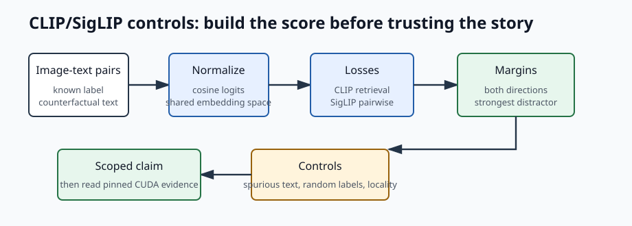

# [12.1] CLIP, SigLIP, and VLM Controls

> **Notebooks: [exercises](../../exercises/part1_clip_siglip_vlm_controls/12.1_CLIP_SigLIP_and_VLM_Controls_exercises.ipynb) | [solutions](../../exercises/part1_clip_siglip_vlm_controls/12.1_CLIP_SigLIP_and_VLM_Controls_solutions.ipynb)**

> **Local-first extension.** This is the first VLM interpretability lesson, so
> we deliberately start small. Today you build the contrastive image-text
> alignment tools that later VLM notebooks will use for geometry, mini VLMs,
> visual-token flow, hallucination, and modality arbitration.

```python
GT_TIER = "GT-1"
EXERCISE_ID = "12_1_clip_siglip_and_vlm_controls"
DIFFICULTY = 4
IMPORTANCE = 3
EXPECTED_RUNTIME = "35-45 minutes for exercises; several minutes for live CUDA report regeneration"
REQUIRES_GPU = True  # exercises are CPU-friendly; the committed report is CUDA-backed
```

Please send any problems / bugs on the `#errata` channel in the
[Slack group](https://info-arena.github.io/ARENA_img/slack.html), and ask any
questions on the dedicated channels for this chapter of material.

If you want to change to dark mode, you can do this by clicking the three
horizontal lines in the top-right, then navigating to Settings -> Theme.

## Core Question

When CLIP says an image and a caption match, what evidence would make that
claim harder to fake?

The answer is not "the top caption looks plausible". A useful first standard is:

1. matching image-text pairs score above mismatched pairs in both directions,
2. the positive-pair margin is large enough to survive close distractors,
3. SigLIP-style binary pair scores agree with the CLIP-style retrieval story,
4. the dataset exposes counterfactual labels and misleading text controls, and
5. any real-model claim stays scoped to the specific pinned CUDA report.

Later notebooks should split out feature geometry, mini VLM training, hidden
visual-token flow, object hallucination, and multimodal attribution. This
section builds the base tools those later claims need.

## Learning Objectives

By the end of this notebook, you should be able to:

1. implement normalized CLIP-style image-text logits,
2. check bidirectional retrieval and positive-pair margins,
3. implement the SigLIP pairwise logistic objective,
4. build controlled colored-shape examples with counterfactual captions,
5. score whether a text direction is localized in visual tokens, and
6. read a committed real-model CUDA report without overstating what it proves.



This loop is intentionally modest: build the score, test paired retrieval, add
controls, then only use real-model evidence within its stated claim scope.

# Setup

```python
import json
import sys
from dataclasses import dataclass
from pathlib import Path

import torch as t
import torch.nn.functional as F

chapter = "chapter12_vlm_interpretability"
section = "part1_clip_siglip_vlm_controls"
root_dir = next(p for p in [Path.cwd(), *Path.cwd().parents] if (p / chapter).exists())
exercises_dir = root_dir / chapter / "exercises"
section_dir = exercises_dir / section

if str(root_dir) not in sys.path:
    sys.path.append(str(root_dir))
if str(exercises_dir) not in sys.path:
    sys.path.append(str(exercises_dir))

import part1_clip_siglip_vlm_controls.tests as tests
```

We will use three tiny report objects. They are deliberately boring: the point
is that each claim carries the exact metric that made it pass or fail.

```python
@dataclass(frozen=True)
class ContrastiveAlignmentReport:
    image_to_text_accuracy: float
    text_to_image_accuracy: float
    mean_positive_margin: float
    aligned: bool


@dataclass(frozen=True)
class SyntheticVLMScene:
    image_id: str
    shape: str
    color: str
    bbox: tuple[float, float, float, float]
    question: str
    answer: str
    counterfactual_answer: str
    spurious_text: str | None
    split: str


@dataclass(frozen=True)
class VisualTokenAttributionReport:
    token_scores: t.Tensor
    top_token_indices: t.Tensor
    top_token_mass: float
    localized: bool
```

```python
def _l2_normalize(values: t.Tensor, *, eps: float = 1e-8) -> t.Tensor:
    return values.float() / values.float().norm(dim=-1, keepdim=True).clamp_min(eps)
```

# CLIP-Style Retrieval

CLIP learns a shared space where matching images and captions have high cosine
similarity. In this first exercise the image encoder and text encoder are
already done; your job is the contrastive score and the retrieval contract.

### Exercise - implement contrastive logits and retrieval margins

> Difficulty: medium
> Importance: high
>
> You should spend 10 minutes on this exercise.

Implement normalized CLIP-style logits, then report retrieval accuracy in both
directions. The margin should compare each diagonal score against the strongest
off-diagonal distractor in both the image-to-text and text-to-image directions.

```python
def clip_contrastive_logits(
    image_embeddings: t.Tensor,
    text_embeddings: t.Tensor,
    *,
    logit_scale: float = 10.0,
) -> t.Tensor:
    raise NotImplementedError()


def contrastive_alignment_report(
    logits: t.Tensor,
    *,
    min_accuracy: float = 1.0,
    min_positive_margin: float = 1.0,
) -> ContrastiveAlignmentReport:
    raise NotImplementedError()


def contrastive_smoke_test() -> dict:
    image_embeddings = t.eye(3)
    text_embeddings = t.eye(3)
    logits = clip_contrastive_logits(
        image_embeddings,
        text_embeddings,
        logit_scale=5.0,
    )
    return contrastive_alignment_report(
        logits,
        min_accuracy=1.0,
        min_positive_margin=4.0,
    ).__dict__


tests.test_contrastive_smoke_test(contrastive_smoke_test)
```

<details>
<summary>Expected output</summary>

```text
All tests in `test_contrastive_smoke_test` passed!
```

For the identity toy example, the diagonal logits are `5.0`, the strongest
off-diagonal logits are `0.0`, and the mean positive margin is `5.0`.

</details>

<details>
<summary>Help - what does the margin add beyond accuracy?</summary>

Accuracy only asks whether the correct caption wins. The margin asks whether it
wins by enough that a nearby distractor would not immediately break the result.
This matters for CLIP because retrieval examples often contain semantically
similar captions.

</details>

<details>
<summary>Common bugs</summary>

- Forgetting to L2-normalize image and text embeddings before the dot product.
- Checking only image-to-text retrieval and missing text-to-image failures.
- Averaging all off-diagonal logits instead of using the strongest distractor.

</details>

<details>
<summary>Solution</summary>

```python
def clip_contrastive_logits(
    image_embeddings: t.Tensor,
    text_embeddings: t.Tensor,
    *,
    logit_scale: float = 10.0,
) -> t.Tensor:
    if image_embeddings.ndim != 2 or text_embeddings.ndim != 2:
        raise ValueError("embeddings must have shape (batch, d_model).")
    if image_embeddings.shape[-1] != text_embeddings.shape[-1]:
        raise ValueError("image and text embedding dimensions must match.")
    if logit_scale <= 0:
        raise ValueError("logit_scale must be positive.")

    image_normalized = _l2_normalize(image_embeddings)
    text_normalized = _l2_normalize(text_embeddings)
    return logit_scale * image_normalized @ text_normalized.T


def contrastive_alignment_report(
    logits: t.Tensor,
    *,
    min_accuracy: float = 1.0,
    min_positive_margin: float = 1.0,
) -> ContrastiveAlignmentReport:
    if logits.ndim != 2 or logits.shape[0] != logits.shape[1]:
        raise ValueError("logits must be a square (batch, batch) matrix.")
    batch = logits.shape[0]
    if batch == 0:
        raise ValueError("logits must be nonempty.")

    targets = t.arange(batch, device=logits.device)
    image_accuracy = logits.argmax(dim=-1).eq(targets).float().mean().item()
    text_accuracy = logits.argmax(dim=0).eq(targets).float().mean().item()
    positives = logits.diag()
    if batch == 1:
        mean_margin = float("inf")
    else:
        diagonal_mask = t.eye(batch, dtype=t.bool, device=logits.device)
        negatives = logits.masked_fill(diagonal_mask, -float("inf"))
        image_margins = positives - negatives.max(dim=-1).values
        text_margins = positives - negatives.max(dim=0).values
        mean_margin = ((image_margins + text_margins) / 2).mean().item()

    return ContrastiveAlignmentReport(
        image_to_text_accuracy=image_accuracy,
        text_to_image_accuracy=text_accuracy,
        mean_positive_margin=mean_margin,
        aligned=(
            image_accuracy >= min_accuracy
            and text_accuracy >= min_accuracy
            and mean_margin >= min_positive_margin
        ),
    )
```

</details>

# SigLIP-Style Pairwise Loss

SigLIP changes the training objective. Instead of a row-wise softmax over the
batch, it treats every image-caption pair as a binary classification example.
Positive pairs should get high logits; negative pairs should get low logits.

### Exercise - implement pairwise logistic loss

> Difficulty: easy
> Importance: medium
>
> You should spend 5 minutes on this exercise.

Implement the pairwise logistic loss. Labels greater than zero are positive
pairs; all other entries are negative pairs.

```python
def siglip_pairwise_loss(logits: t.Tensor, labels: t.Tensor) -> t.Tensor:
    raise NotImplementedError()


def siglip_smoke_test() -> dict:
    logits = t.tensor([[4.0, -4.0], [-3.0, 3.0]])
    labels = t.eye(2)
    return {"loss": siglip_pairwise_loss(logits, labels).item()}


tests.test_siglip_smoke_test(siglip_smoke_test)
```

<details>
<summary>Expected output</summary>

```text
All tests in `test_siglip_smoke_test` passed!
```

The expected loss is about `0.03337`, because all four signed margins are
confident and correct.

</details>

<details>
<summary>Help - why does SigLIP not need a diagonal softmax?</summary>

CLIP uses the rest of the batch as negatives for a softmax retrieval problem.
SigLIP instead asks a binary question for every pair: "does this image match
this text?" That makes the loss depend on signed pair logits rather than on a
single row-normalized distribution.

</details>

<details>
<summary>Common bugs</summary>

- Applying cross entropy over rows instead of binary logistic loss per pair.
- Treating zero labels as zero targets instead of negative labels.
- Forgetting to check that `logits` and `labels` have the same shape.

</details>

<details>
<summary>Solution</summary>

```python
def siglip_pairwise_loss(logits: t.Tensor, labels: t.Tensor) -> t.Tensor:
    if logits.shape != labels.shape:
        raise ValueError("logits and labels must have the same shape.")
    signed_labels = t.where(labels.float() > 0, 1.0, -1.0)
    return F.softplus(-signed_labels * logits.float()).mean()
```

</details>

# Controlled Image-Text Scenes

The fastest way to fool yourself with a VLM is to use examples where the text
already gives away the answer. Before real images, build a tiny schema where the
answer, counterfactual answer, spurious text, and object box are all explicit.

### Exercise - generate colored-shape counterfactual scenes

> Difficulty: easy
> Importance: high
>
> You should spend 10 minutes on this exercise.

Generate one scene for every shape/color pair. Each scene should expose a
correct answer, a counterfactual color answer, and misleading text that points
to the counterfactual rather than the true color.

```python
def generate_synthetic_colored_shape_scenes(
    *,
    colors: tuple[str, ...] = ("red", "blue"),
    shapes: tuple[str, ...] = ("cube", "sphere"),
    split: str = "train",
    include_spurious_text: bool = True,
) -> tuple[SyntheticVLMScene, ...]:
    raise NotImplementedError()


def synthetic_scene_schema_smoke_test() -> dict:
    scenes = generate_synthetic_colored_shape_scenes(
        colors=("red", "blue"),
        shapes=("cube", "sphere"),
        split="train",
    )
    return {
        "num_scenes": len(scenes),
        "first_scene": scenes[0].__dict__,
        "has_spurious_text_control": all(scene.spurious_text is not None for scene in scenes),
        "has_counterfactual_answers": all(
            scene.answer != scene.counterfactual_answer for scene in scenes
        ),
    }


tests.test_synthetic_scene_schema_smoke_test(synthetic_scene_schema_smoke_test)
```

<details>
<summary>Expected output</summary>

```text
All tests in `test_synthetic_scene_schema_smoke_test` passed!
```

The first generated question should be `"What color is the cube?"`, and every
scene should have `answer != counterfactual_answer`.

</details>

<details>
<summary>Help - why build boring synthetic scenes?</summary>

Synthetic scenes are not impressive. That is the point. They let you know the
ground-truth object, color, bounding box, and misleading text before you inspect
any model internals. This is the VLM analogue of starting IOI with clean and
corrupt prompt pairs.

</details>

<details>
<summary>Common bugs</summary>

- Returning only the correct answer and no counterfactual answer.
- Making `spurious_text` equal to the correct answer.
- Accidentally changing the iteration order so the first question is not about
  the red cube.

</details>

<details>
<summary>Solution</summary>

```python
def generate_synthetic_colored_shape_scenes(
    *,
    colors: tuple[str, ...] = ("red", "blue"),
    shapes: tuple[str, ...] = ("cube", "sphere"),
    split: str = "train",
    include_spurious_text: bool = True,
) -> tuple[SyntheticVLMScene, ...]:
    if len(colors) < 2:
        raise ValueError("at least two colors are required for counterfactual labels.")
    if len(shapes) == 0:
        raise ValueError("at least one shape is required.")

    scenes = []
    for shape_index, shape in enumerate(shapes):
        for color_index, color in enumerate(colors):
            counterfactual = colors[(color_index + 1) % len(colors)]
            x1 = 0.1 + 0.15 * color_index
            y1 = 0.2 + 0.12 * shape_index
            scenes.append(
                SyntheticVLMScene(
                    image_id=f"{split}_{shape}_{color}",
                    shape=shape,
                    color=color,
                    bbox=(round(x1, 3), round(y1, 3), round(min(x1 + 0.25, 0.95), 3), round(min(y1 + 0.25, 0.95), 3)),
                    question=f"What color is the {shape}?",
                    answer=color,
                    counterfactual_answer=counterfactual,
                    spurious_text=counterfactual if include_spurious_text else None,
                    split=split,
                )
            )
    return tuple(scenes)
```

</details>

# Visual-Token Locality

CLIP-like models are not generative VLMs, but the first locality question is the
same: if a text direction points to an object property, do a small number of
visual tokens carry most of the positive evidence?

### Exercise - require localized visual-token mass

> Difficulty: medium
> Importance: high
>
> You should spend 10 minutes on this exercise.

Score each visual token against a text direction. Then measure how much of the
positive attribution mass is contained in the top `k` tokens.

```python
def visual_token_attribution_report(
    token_activations: t.Tensor,
    text_direction: t.Tensor,
    *,
    top_k: int = 2,
    min_top_token_mass: float = 0.6,
) -> VisualTokenAttributionReport:
    raise NotImplementedError()


def token_attribution_smoke_test() -> dict:
    token_activations = t.tensor(
        [
            [0.0, 0.0],
            [3.0, 0.0],
            [2.0, 0.0],
            [0.0, 1.0],
        ]
    )
    text_direction = t.tensor([1.0, 0.0])
    report = visual_token_attribution_report(
        token_activations,
        text_direction,
        top_k=2,
        min_top_token_mass=0.8,
    )
    result = report.__dict__.copy()
    result["token_scores"] = report.token_scores.tolist()
    result["top_token_indices"] = report.top_token_indices.tolist()
    return result


tests.test_token_attribution_smoke_test(token_attribution_smoke_test)
```

<details>
<summary>Expected output</summary>

```text
All tests in `test_token_attribution_smoke_test` passed!
```

The token scores should be `[0.0, 3.0, 2.0, 0.0]`, the top token indices should
be `[1, 2]`, and the top-token mass should be `1.0`.

</details>

<details>
<summary>Help - what does top-token mass prove?</summary>

It proves less than people often want. Local mass says a direction is
concentrated in a few visual tokens for this toy example. It does not prove that
the model used those tokens causally. That stronger claim belongs in the later
visual-token flow notebook, where object-token patching is compared to
background and random-token controls.

</details>

<details>
<summary>Common bugs</summary>

- Computing top-token mass over signed scores, which lets negative attribution
  cancel positive evidence.
- Forgetting to normalize the text direction.
- Letting `top_k=0` or `top_k > num_tokens` silently produce nonsense.

</details>

<details>
<summary>Solution</summary>

```python
def visual_token_attribution_report(
    token_activations: t.Tensor,
    text_direction: t.Tensor,
    *,
    top_k: int = 2,
    min_top_token_mass: float = 0.6,
) -> VisualTokenAttributionReport:
    if token_activations.ndim != 2:
        raise ValueError("token_activations must have shape (tokens, d_model).")
    if text_direction.ndim != 1:
        raise ValueError("text_direction must have shape (d_model,).")
    if token_activations.shape[-1] != text_direction.shape[0]:
        raise ValueError("token and direction dimensions must match.")
    if top_k <= 0 or top_k > token_activations.shape[0]:
        raise ValueError("top_k must be in [1, num_tokens].")

    direction = _l2_normalize(text_direction.unsqueeze(0)).squeeze(0)
    token_scores = token_activations.float() @ direction
    _, top_indices = token_scores.topk(top_k)
    positive_scores = token_scores.clamp_min(0)
    total_positive_mass = positive_scores.sum()
    top_mass = (
        0.0
        if total_positive_mass.item() == 0
        else (positive_scores[top_indices].sum() / total_positive_mass).item()
    )
    return VisualTokenAttributionReport(
        token_scores=token_scores,
        top_token_indices=top_indices,
        top_token_mass=top_mass,
        localized=top_mass >= min_top_token_mass,
    )
```

</details>

# Notebook Contract

This is the student-facing smoke contract. It stays small on purpose: if the
contrastive score, SigLIP loss, controlled scene schema, or top-token mass
breaks, the rest of the VLM ladder is built on sand.

### Exercise - assemble the core CLIP/SigLIP contract

> Difficulty: easy
> Importance: high
>
> You should spend 5 minutes on this exercise.

```python
def run_smoke_test(cpu: bool = True) -> dict:
    _ = cpu
    return {
        "contrastive": contrastive_smoke_test(),
        "siglip": siglip_smoke_test(),
        "synthetic_scene_schema": synthetic_scene_schema_smoke_test(),
        "token_attribution": token_attribution_smoke_test(),
    }


tests.test_clip_siglip_core_notebook_contract(run_smoke_test)
```

<details>
<summary>Expected output</summary>

```text
All tests in `test_clip_siglip_core_notebook_contract` passed!
```

</details>

<details>
<summary>Help - why is this not the full VLM report?</summary>

This notebook is the first lesson in the VLM track. The full real-model report
contains CLIP/SigLIP region patching, hidden visual-token activation patching,
and Qwen2.5-VL rendered-shape generation. Those are useful evidence, but they
should not obscure the first skill: building and checking the contrastive
alignment contract yourself.

</details>

<details>
<summary>Common bugs</summary>

- Returning only the easy retrieval check and omitting the controls.
- Calling a live 3B VLM from the smoke contract, which makes local feedback slow.
- Hiding a failed sub-report instead of returning it.

</details>

<details>
<summary>Solution</summary>

Use the implementation above unchanged once each sub-report is implemented.

</details>

# CUDA Verification Report

The committed report has a broader scope than the learner path. It verifies
pinned CLIP and SigLIP rendered-shape retrieval, object-region patching,
hidden visual-token activation patching at `vision_model.embeddings`, and a
pinned Qwen2.5-VL rendered-shape generation check on the local CUDA machine.

This cell reads the committed report and checks it against the artifact
contract. To regenerate it live, run:

```bash
BNB_CUDA_VERSION=130 uv run python scripts/run_extension_verification_reports.py --section 12.1 --max-vram-gb 24.0
```

```python
def run_gpu_test(max_vram_gb: float = 24.0) -> dict:
    report = json.loads((section_dir / "verification_report.json").read_text())
    tests.test_committed_verification_report_real_model_controls(report)
    gpu = report["metrics"]["gpu_test"]
    if gpu["peak_vram_gb"] > max_vram_gb:
        raise AssertionError(
            f"Committed report used {gpu['peak_vram_gb']:.2f} GB, "
            f"above the {max_vram_gb:.2f} GB budget."
        )
    return {
        "torch_version": gpu["torch_version"],
        "cuda_version": gpu["cuda_version"],
        "device": gpu["device"],
        "peak_vram_gb": gpu["peak_vram_gb"],
        "real_clip_margin": gpu["real_clip_mean_positive_margin"],
        "real_siglip_margin": gpu["real_siglip_mean_positive_margin"],
        "qwen_answers": gpu["real_qwen25_vl_answers"],
        "within_vram_budget": gpu["within_vram_budget"],
    }


def run_full_experiment(max_vram_gb: float = 24.0) -> dict:
    return run_gpu_test(max_vram_gb=max_vram_gb)


run_gpu_test()
```

<details>
<summary>Expected output</summary>

```text
All tests in `test_committed_verification_report_real_model_controls` passed!
{'torch_version': '2.12.1+cu132', 'cuda_version': '13.2', ...}
```

</details>

<details>
<summary>Help - why read a report instead of loading Qwen here?</summary>

The report is the reviewable CUDA artifact: it records model revisions, input
hashes, VRAM, controls, and the exact accepted metrics. Loading Qwen2.5-VL in
every student notebook would make the first lesson slow and would blur the
course point. The live regeneration command above is the ground-truth GPU path.

</details>

<details>
<summary>Common bugs</summary>

- Treating the CPU smoke contract as real-model evidence.
- Calling pixel-region patching "activation patching"; the report distinguishes
  hidden visual-token metrics from image-region patching.
- Claiming broad VLM interpretability validation from two rendered shapes.

</details>

# Signature Result


| Check | Result | Why it matters |
|---|---:|---|
| Toy CLIP diagonal margin | `5.0` | The correct pair beats the strongest distractor. |
| Toy SigLIP loss | `0.03337` | Pairwise positive and negative labels are both handled. |
| Real CLIP / SigLIP retrieval | `1.0 / 1.0` | Pinned contrastive models solve the rendered-shape retrieval task. |
| Hidden-token object patch gap | `14.93 / 31.45` | Object tokens matter more than background or same-size random controls. |
| Qwen2.5-VL rendered-shape answers | `red square`, `blue circle` | The scoped generative VLM path grounds the two safe synthetic images. |

<details>
<summary>Interpreting the signature result</summary>

The core teaching result is the first two rows: you implemented the score and
loss that make contrastive image-text retrieval possible. The real-model rows
show that the same control philosophy scales to pinned CLIP, SigLIP, and a
small Qwen2.5-VL check on this machine. They do not turn this notebook into a
complete real-VLM interpretability lesson.

</details>

# Limitations

- This section does not train a full CLIP model from pixels. It implements the
  contrastive score/loss and the first controlled evaluation ladder.
- The visual-token locality exercise is not a causal intervention. Later VLM
  notebooks should do object-token, background-token, random-token, and
  full-sequence activation patching as the main lesson.
- The Qwen2.5-VL report is a rendered-shape generation preflight, not a broad
  benchmark or hallucination study.
- Clothing geometry, mini VLMs, hallucination/arbitration, VLM SAEs, and VLM
  SHAP baselines should be split into later sections rather than crammed into
  this first notebook.

# Further Research

1. Train a tiny CLIP model on rendered colored shapes and plot the retrieval
   heatmap over training.
2. Add a typographic attack where the image shows a red square but the rendered
   text says "blue circle", then compare CLIP, SigLIP, and text-only controls.
3. Turn the scene schema into a mini VQA dataset for the next notebook.
4. Reuse the report regeneration command after changing model revisions, and
   update the claim boundary if any control fails.
