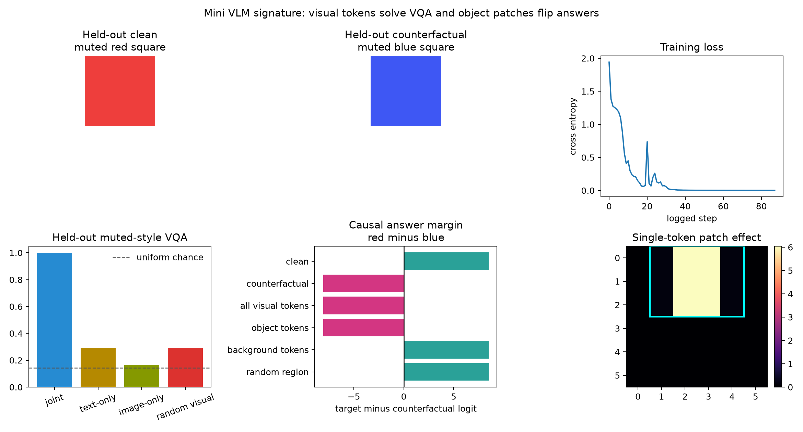
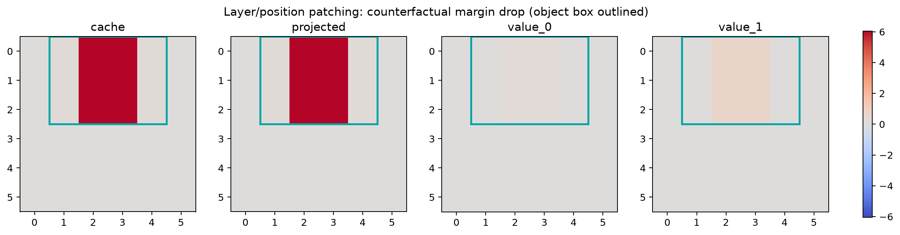

# [12.3] Mini VLM from Scratch

> **ARENA extension note.** Original ARENA content is unchanged. This appended section builds the smallest controlled VLM step before escalating to real checkpoints.

By the end of this notebook, you will have shown that a frozen patch encoder plus a learned projector and tiny cross-attention decoder can answer visual questions in a disjoint muted rendering style, because joint VQA succeeds while text-only, image-only, random-visual, background-region, and same-size random-region controls fail, and counterfactual object-token patching flips the answer.

## Core Question

Can a tiny VLM learn to use the relevant visual tokens for its answer, rather than memorizing the question or exploiting a modality prior?

**Notebooks: [exercises](../../exercises/part3_mini_vlm_from_scratch/12.3_Mini_VLM_from_Scratch_exercises.ipynb) | [solutions](../../exercises/part3_mini_vlm_from_scratch/12.3_Mini_VLM_from_Scratch_solutions.ipynb)**

```python
GT_TIER = "GT-0 controlled model organism"
EXERCISE_ID = "12_3_mini_vlm_from_scratch"
DIFFICULTY = 4
IMPORTANCE = 5
EXPECTED_RUNTIME = "60-90 minutes; solved CPU notebook takes a few minutes"
REQUIRES_GPU = False  # the parent release job performs serialized CUDA verification
```

## Learning Objectives

You will learn to:

- render a finite VQA world with explicit object boxes and counterfactual answers;
- cache frozen visual patch tokens and build the multimodal token sequence;
- implement exact-match VQA accuracy and a signed answer margin;
- map an object box to the visual tokens that overlap it;
- patch object, background, random-region, and full visual-token sequences;
- train a real multi-head cross-attention decoder on solid scenes;
- test generalization on a disjoint muted visual style; and
- distinguish a causal object-token result from attention-map or accuracy-only evidence.

## Cold Open

The clean scene is a muted red square and the counterfactual is the same square rendered blue. The question remains *What color is the object?* If the model really uses visual evidence, replacing only the visual tokens overlapping the square should change the answer from red to blue. Replacing equally many white-background tokens should not.

## Exact Ground Truth

Before training, the notebook builds an additive visual-token game with known answer evidence. Its object rows contain all red-vs-blue evidence; background rows contain none. The exact oracle therefore predicts a positive clean margin, a negative corrupt margin, an answer flip under object patching, and no flip under background or same-size random-region patching.

## Expected Outputs

<details><summary>Expected output</summary>The exact oracle flips only for object rows. The trained run reaches `1.0` held-out muted-style accuracy, all modality baselines stay below `0.30`, the red-to-blue object patch changes the signed margin from about `+8.51` to `-8.08`, and full visual-sequence patching matches the corrupt run numerically.</details>

## Exercises

### Exercise - build the visual-token cache

Run the frozen patch encoder once, move images to the requested device, and detach the resulting `[batch, patch, feature]` tensor.

<details><summary>Solution sketch</summary>Use `torch.no_grad()`, call the encoder on the target device, and return `cache.detach()`.</details>

### Exercise - assemble visual tokens and a question token

Project the frozen visual rows and append the embedded question as the final token.

<details><summary>Solution sketch</summary>Concatenate the projected visual tensor with `question_embed(question_ids).unsqueeze(1)` along the sequence dimension.</details>

### Exercise - write the VQA metric and answer margin

Implement exact-match accuracy and `target_logit - counterfactual_logit` for each example.

<details><summary>Solution sketch</summary>Use `argmax` for accuracy and `gather` for both label-indexed logits; keep the margin as a tensor.</details>

### Exercise - map a bounding box to visual-token indices

Return every patch-grid row whose pixel rectangle has non-empty overlap with the object box.

<details><summary>Solution sketch</summary>Enumerate patch rectangles and test strict interval overlap in both axes.</details>

### Exercise - patch visual-token rows

Clone the clean cache and replace exactly the selected token rows with counterfactual rows.

<details><summary>Solution sketch</summary>Validate shapes, bounds, and unique indices before indexed assignment into a clone.</details>

### Exercise - exact toy object patching

Use the known additive token game to establish the expected object/background/random intervention behavior before trusting a trained network.

<details><summary>Solution sketch</summary>Put signed answer evidence only in object rows, patch each region, sum over rows, and compare target-vs-counterfactual margins.</details>

### Exercise - train and evaluate the MiniVLM

Train the learned projector and two-layer multi-head cross-attention decoder on solid scenes, then evaluate on muted scenes with the same balanced colors, shapes, positions, and questions.

<details><summary>Solution sketch</summary>Cache each split once, optimize cross entropy on the solid split, then run joint, zero-visual, zero-question, and shuffled-visual evaluation on the muted split.</details>

### Exercise - patch object tokens in the trained MiniVLM

Patch counterfactual rows at the raw cache, projected-token, and per-layer value stages; compare object rows against background, same-size random regions, and the full visual sequence.

<details><summary>Solution sketch</summary>Cache the corrupt activation at the chosen stage, replace the matching clean rows during the forward pass, and score the signed answer-margin change.</details>

Every exercise has an immediate semantic test plus expected-output, help, interpretation, and full solution dropdowns in the notebook.

## Signature Result



The accepted deterministic CPU run trains on `120` solid examples and evaluates on `120` muted-style examples. Train and held-out accuracy are both `1.0`; text-only is `0.292`, image-only is `0.167`, and shuffled visual tokens score `0.292`.

For the held-out muted red-vs-blue pair, the clean margin is about `+8.51`. Patching the counterfactual object rows moves it to about `-8.08`, while background and same-size random-region patches leave it at `+8.51`. Patching every visual row exactly matches the corrupt forward pass.



The heatmap is a causal margin-drop sweep, not an attention visualization. The high-effect positions coincide with the rendered object box at the raw cache, projected-token, and both value stages.

## Controls and Baselines

- **Text only:** zero visual tokens; cannot identify image-dependent answers.
- **Image only:** zero question state; cannot choose whether the requested attribute is color or shape.
- **Random visual:** permute held-out image caches across questions and labels.
- **Background region:** patch the same counterfactual image into equally many non-object rows.
- **Same-size random region:** repeat the region control with a separately seeded non-object set.
- **Counterfactual image:** change exactly the answer-bearing color or shape while preserving the question.
- **Full visual sequence:** replace all visual rows and require numerical parity with the corrupt run.

## Try It Yourself

Change the clean and corrupt color, shape, position, question type, and patch stage (`cache`, `projected`, `value_0`, or `value_1`). A meaningful perturbation changes one answer-bearing attribute at a time while keeping the question and unrelated attribute fixed.

## Bonus: Hunt an Anomaly

Try an unseen color-shape composition split instead of the muted-style split. The reference architecture does **not** reliably solve the stricter version: one six-pair split reached perfect training accuracy but only about `48%` held-out accuracy. Diagnose whether the failure comes from pair correlations, the frozen visual features, or the tiny decoder, then propose a control that distinguishes these explanations.

## Limitations

This is a controlled model organism, not evidence about PaliGemma, Qwen-VL, LLaVA, Molmo, or any frontier VLM. The frozen encoder exposes mean RGB and foreground occupancy, the questions are limited to one object and two attribute types, and the accepted claim is visual-style generalization rather than compositional generalization. The negative composition result is reported rather than promoted into a flagship figure.

A real-model escalation must pin the model revision, use at least 20 controlled counterfactual examples, preserve object-vs-background and modality controls, and use a signed causal metric.

## Reading Links

- [Flamingo: a Visual Language Model for Few-Shot Learning](https://arxiv.org/abs/2204.14198)
- [BLIP-2: Bootstrapping Language-Image Pre-training with Frozen Image Encoders and Large Language Models](https://arxiv.org/abs/2301.12597)
- [Visual Instruction Tuning / LLaVA](https://arxiv.org/abs/2304.08485)
- [Transformer Circuits activation patching](https://transformer-circuits.pub/2021/framework/index.html)
