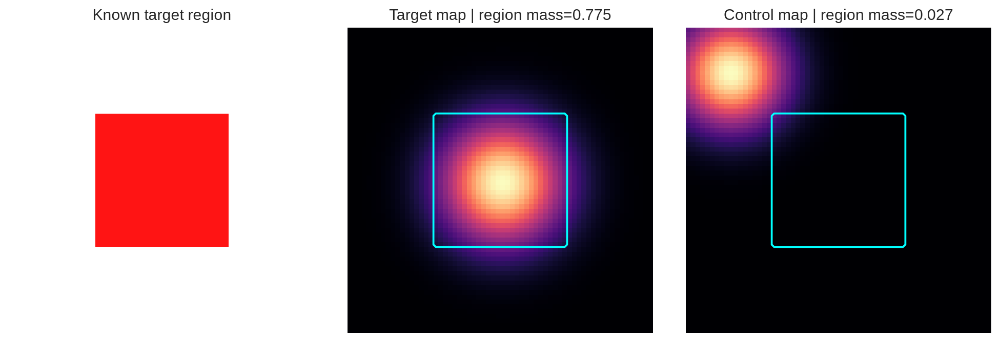
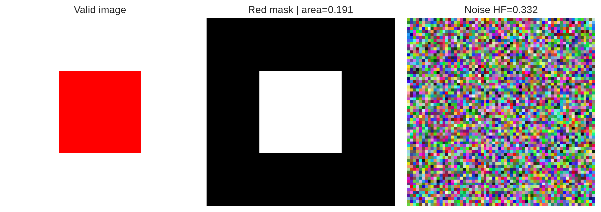
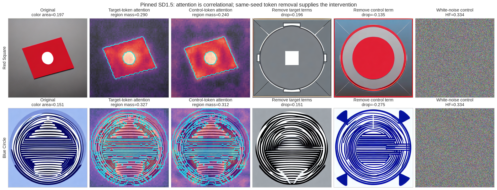
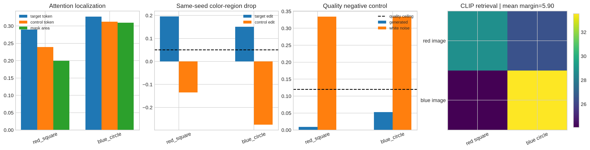

# [13.1] Diffusion and Image-Generation Controls

> **Notebooks: [exercises](../../exercises/part1_diffusion_image_controls/13.1_Diffusion_and_Image_Generation_Controls_exercises.ipynb) | [solutions](../../exercises/part1_diffusion_image_controls/13.1_Diffusion_and_Image_Generation_Controls_solutions.ipynb)**

By the end of this notebook, you will have shown that, for two pinned Stable Diffusion 1.5 shape prompts, target color/shape tokens localize to the generated object and causally control its color region: their same-seed removal erases the target color while a control-token edit does not, the images remain CLIP-aligned and non-noisy, and white noise fails the same quality gate.

## Core Question

When an image-generation explanation shows a persuasive heatmap or edit, what would make the claimed token-to-region mechanism hard to fake?

You will build a chain of evidence:

> **known region -> measured attention -> matched edit -> quality control -> live image -> falsification attempt**

A pretty image is not enough. An attention heatmap is not enough. Even a damaging edit is not enough unless it beats a same-seed control edit and the output remains meaningful.

```python
import json
import sys
from dataclasses import dataclass
from pathlib import Path
from typing import Literal

import matplotlib.pyplot as plt
import numpy as np
import pandas as pd
import torch as t
from IPython.display import display

GT_TIER = "GT-1"
EXERCISE_ID = "13_1_diffusion_and_image_generation_controls"
DIFFICULTY = 4
IMPORTANCE = 4
EXPECTED_RUNTIME = "75-105 minutes; about 15 seconds for the live CUDA result"
REQUIRES_GPU = True

chapter = "chapter13_image_generation_interpretability"
section = "part1_diffusion_image_controls"
root_dir = next(p for p in [Path.cwd(), *Path.cwd().parents] if (p / chapter).exists())
exercises_dir = root_dir / chapter / "exercises"
section_dir = exercises_dir / section
assets_dir = root_dir / chapter / "instructions" / "assets"

if str(root_dir) not in sys.path:
    sys.path.append(str(root_dir))
if str(exercises_dir) not in sys.path:
    sys.path.append(str(exercises_dir))

import part1_diffusion_image_controls.solutions as reference
import part1_diffusion_image_controls.tests as tests
plt.style.use("seaborn-v0_8-whitegrid")
```

## Learning Objectives

You will be able to:

- normalize an attention map and measure mass inside a ground-truth region;
- distinguish a specific ablation from generic model damage;
- gate latent directions against paired random directions;
- test prompt-token edits against same-seed control edits;
- build color-region, image-quality, and white-noise controls;
- interpret real SD1.5 cross-attention without treating attention as a causal explanation;
- state exactly what two controlled prompts do and do not establish.

## Cold Open: Which Panel Would Convince You?

Suppose the prompt is `a single centered solid red square`.

- Panel A shows a red square.
- Panel B shows a heatmap over the square.
- Panel C removes `red square` and the red region disappears.
- Panel D removes an unrelated token with the same seed and the red region remains.

Before continuing, write down the weakest subset of panels you would accept as evidence. This notebook argues that C without D only proves that changing a prompt changes an image, while B without C is correlational.

```python
ImageDirection = Literal["increase", "decrease"]


@dataclass(frozen=True)
class AttentionRegionReport:
    region_mass: float
    off_region_mass: float
    region_selective: bool


@dataclass(frozen=True)
class DenoisingCircuitReport:
    baseline_loss: float
    ablated_loss: float
    random_control_loss: float
    ablation_delta: float
    random_delta: float
    circuit_specific: bool


@dataclass(frozen=True)
class LatentDirectionReport:
    baseline_mean: float
    steered_mean: float
    random_control_mean: float
    observed_delta: float
    random_delta: float
    has_directional_effect: bool


@dataclass(frozen=True)
class PromptRegionCausalReport:
    original_region_score: float
    ablated_region_score: float
    control_region_score: float
    target_drop: float
    control_drop: float
    prompt_region_causal: bool


@dataclass(frozen=True)
class DAAMRegionReport:
    target_region_mass: float
    control_region_mass: float
    mask_fraction: float
    captured_map_count: int
    target_control_gap: float
    target_lift_over_mask_fraction: float
    daam_localized: bool


@dataclass(frozen=True)
class TokenAblationReport:
    original_region_score: float
    target_ablated_region_score: float
    random_control_region_score: float
    target_drop: float
    random_control_drop: float
    target_ablation_passed: bool
    random_token_ablation_weaker: bool


@dataclass(frozen=True)
class ImageQualityReport:
    target_region_fraction: float
    rgb_std: float
    high_frequency_energy: float
    saturation_fraction: float
    image_quality_preserved: bool


@dataclass(frozen=True)
class WhiteNoiseImageReport:
    real_high_frequency_energy: float
    white_noise_high_frequency_energy: float
    white_noise_rejected: bool


@dataclass(frozen=True)
class SD15StrictReport:
    daam_passed: bool
    token_ablation_passed: bool
    random_token_ablation_weaker: bool
    image_quality_preserved: bool
    white_noise_rejected: bool
    sd15_strict_experiment_passed: bool
```

## Part 1: Toy Ground Truth

### Exercise 1: Measure Attention in a Named Region

> **Difficulty:** easy
> **Importance:** high
> **Suggested time:** 10 minutes

Clamp negative attention, normalize the map to unit mass, and report how much falls inside a nonempty boolean mask.

```python
def attention_region_report(
    attention_map: t.Tensor,
    region_mask: t.Tensor,
    *,
    min_region_mass: float = 0.6,
) -> AttentionRegionReport:
    raise NotImplementedError()


tests.test_attention_region_report_measures_mass_and_rejects_bad_masks(
    attention_region_report
)
```

<details>
<summary>Expected output</summary>

```text
All tests in `test_attention_region_report_measures_mass_and_rejects_bad_masks` passed!
```

</details>

<details>
<summary>Help - getting started</summary>

After clamping to nonnegative values, divide the selected mass by total mass. Reject empty masks and zero-mass maps instead of returning a plausible zero.

</details>

<details>
<summary>Common bugs</summary>

- measuring a screenshot rather than the tensor;
- forgetting to renormalize;
- accepting an empty mask;
- interpreting high mass without a control token.

</details>

<details>
<summary>Interpretation</summary>

Region mass asks a concrete spatial question, but it remains correlational. It becomes stronger only when the region is independently defined and an intervention changes it selectively.

</details>

<details>
<summary>Solution</summary>

```python
def attention_region_report(
    attention_map: t.Tensor,
    region_mask: t.Tensor,
    *,
    min_region_mass: float = 0.6,
) -> AttentionRegionReport:
    """Check whether an attention map concentrates mass in a target image region."""

    if attention_map.ndim != 2:
        raise ValueError("attention_map must have shape (height, width).")
    if region_mask.shape != attention_map.shape:
        raise ValueError("region_mask must match attention_map shape.")
    mask = region_mask.bool()
    if not mask.any():
        raise ValueError("region_mask must select at least one position.")

    attention = attention_map.float().clamp_min(0)
    total_mass = attention.sum()
    if total_mass.item() == 0:
        raise ValueError("attention_map must have positive mass.")
    region_mass = (attention[mask].sum() / total_mass).item()
    off_region_mass = 1.0 - region_mass
    return AttentionRegionReport(
        region_mass=region_mass,
        off_region_mass=off_region_mass,
        region_selective=region_mass >= min_region_mass,
    )
```

</details>

```python
size = 64
y, x = t.meshgrid(t.arange(size), t.arange(size), indexing="ij")
toy_mask = (x >= 18) & (x < 46) & (y >= 18) & (y < 46)
toy_image = t.ones(size, size, 3)
toy_image[toy_mask] = t.tensor([1.0, 0.08, 0.08])
target_attention = t.exp(-((x - 32) ** 2 + (y - 32) ** 2) / (2 * 9**2))
control_attention = t.exp(-((x - 9) ** 2 + (y - 9) ** 2) / (2 * 8**2))
target_report = attention_region_report(target_attention, toy_mask, min_region_mass=0.6)
control_report = attention_region_report(control_attention, toy_mask, min_region_mass=0.6)

fig, axes = plt.subplots(1, 3, figsize=(11, 3.6), constrained_layout=True)
axes[0].imshow(toy_image); axes[0].set_title("Known target region")
axes[1].imshow(target_attention, cmap="magma"); axes[1].contour(toy_mask, colors="cyan")
axes[1].set_title(f"Target map | region mass={target_report.region_mass:.3f}")
axes[2].imshow(control_attention, cmap="magma"); axes[2].contour(toy_mask, colors="cyan")
axes[2].set_title(f"Control map | region mass={control_report.region_mass:.3f}")
for ax in axes: ax.axis("off")
toy_attention_path = assets_dir / "diffusion_image_generation_toy_attention.png"
fig.savefig(toy_attention_path, dpi=180, bbox_inches="tight")
plt.show()
```



<details>
<summary>Interpretation - why this is ground truth</summary>

The cyan boundary is specified before looking at attention. The target map is deliberately centered on it and the control map is not. This verifies your measurement code on a case where the right answer is known; it does not validate a diffusion model.

</details>

### Exercise 2: Require a Specific Denoising Circuit

> **Difficulty:** easy
> **Importance:** high
> **Suggested time:** 5 minutes

Ablating any large set of denoising components may hurt loss. Require the proposed circuit's loss increase to exceed both an absolute threshold and a same-size random ablation.

```python
def denoising_circuit_report(
    *,
    baseline_loss: float,
    ablated_loss: float,
    random_control_loss: float,
    min_loss_increase: float = 0.1,
    min_control_gap: float = 0.05,
) -> DenoisingCircuitReport:
    raise NotImplementedError()


tests.test_denoising_circuit_report_requires_specificity(denoising_circuit_report)
```

<details>
<summary>Expected output</summary>

```text
All tests in `test_denoising_circuit_report_requires_specificity` passed!
```

</details>

<details>
<summary>Help - getting started</summary>

Compute both deltas from the same baseline. The target delta must clear `min_loss_increase` and exceed the random delta by `min_control_gap`.

</details>

<details>
<summary>Common bugs</summary>

- comparing raw losses instead of deltas;
- using a smaller random ablation;
- accepting any loss increase as circuit specificity.

</details>

<details>
<summary>Interpretation</summary>

This is a contract for a future denoising-circuit experiment. The real result in this notebook studies prompt-token attention and prompt ablation, not an internal denoising circuit.

</details>

<details>
<summary>Solution</summary>

```python
def denoising_circuit_report(
    *,
    baseline_loss: float,
    ablated_loss: float,
    random_control_loss: float,
    min_loss_increase: float = 0.1,
    min_control_gap: float = 0.05,
) -> DenoisingCircuitReport:
    """Check that ablating a proposed denoising circuit matters over random control."""

    ablation_delta = ablated_loss - baseline_loss
    random_delta = random_control_loss - baseline_loss
    circuit_specific = (
        ablation_delta >= min_loss_increase
        and ablation_delta >= random_delta + min_control_gap
    )
    return DenoisingCircuitReport(
        baseline_loss=baseline_loss,
        ablated_loss=ablated_loss,
        random_control_loss=random_control_loss,
        ablation_delta=ablation_delta,
        random_delta=random_delta,
        circuit_specific=circuit_specific,
    )
```

</details>

### Exercise 3: Gate a Latent Direction Against Random Directions

> **Difficulty:** medium
> **Importance:** medium
> **Suggested time:** 10 minutes

Use paired examples and require the effect to have the requested sign, sufficient magnitude, and a margin over a matched random direction.

```python
def latent_direction_effect_report(
    baseline_scores: t.Tensor,
    steered_scores: t.Tensor,
    random_control_scores: t.Tensor,
    *,
    expected_direction: ImageDirection = "increase",
    min_effect: float = 0.2,
    min_random_margin: float = 0.1,
) -> LatentDirectionReport:
    raise NotImplementedError()


tests.test_latent_direction_report_requires_random_margin(latent_direction_effect_report)
```

<details>
<summary>Expected output</summary>

```text
All tests in `test_latent_direction_report_requires_random_margin` passed!
```

</details>

<details>
<summary>Help - getting started</summary>

Average paired baseline, steered, and random-control scores. Check the signed target effect, then compare absolute target and random deltas.

</details>

<details>
<summary>Common bugs</summary>

- mixing unpaired generations;
- ignoring the requested sign;
- reporting a target effect a random direction can match.

</details>

<details>
<summary>Interpretation</summary>

This function tests the logic of a latent steering claim. No real latent steering claim is made below; do not let a passing toy contract silently expand the model claim.

</details>

<details>
<summary>Solution</summary>

```python
def latent_direction_effect_report(
    baseline_scores: t.Tensor,
    steered_scores: t.Tensor,
    random_control_scores: t.Tensor,
    *,
    expected_direction: ImageDirection = "increase",
    min_effect: float = 0.2,
    min_random_margin: float = 0.1,
) -> LatentDirectionReport:
    """Check whether a latent image direction changes a score over random control."""

    if baseline_scores.shape != steered_scores.shape:
        raise ValueError("baseline and steered scores must match.")
    if baseline_scores.shape != random_control_scores.shape:
        raise ValueError("baseline and random control scores must match.")

    baseline_mean = baseline_scores.float().mean().item()
    steered_mean = steered_scores.float().mean().item()
    random_control_mean = random_control_scores.float().mean().item()
    observed_delta = steered_mean - baseline_mean
    random_delta = random_control_mean - baseline_mean
    if expected_direction == "increase":
        directional_effect = observed_delta >= min_effect
    elif expected_direction == "decrease":
        directional_effect = -observed_delta >= min_effect
    else:
        raise ValueError("expected_direction must be 'increase' or 'decrease'.")
    has_directional_effect = directional_effect and abs(observed_delta) > (
        abs(random_delta) + min_random_margin
    )
    return LatentDirectionReport(
        baseline_mean=baseline_mean,
        steered_mean=steered_mean,
        random_control_mean=random_control_mean,
        observed_delta=observed_delta,
        random_delta=random_delta,
        has_directional_effect=has_directional_effect,
    )
```

</details>

### Exercise 4: Prompt-Region Causality Needs a Control Edit

> **Difficulty:** medium
> **Importance:** high
> **Suggested time:** 10 minutes

Measure target-region scores for the original image, a target-token ablation, and an unrelated-token ablation, all with the same seed.

```python
def prompt_region_causal_report(
    *,
    original_region_score: float,
    ablated_region_score: float,
    control_region_score: float,
    min_target_drop: float = 0.2,
    min_control_margin: float = 0.1,
) -> PromptRegionCausalReport:
    raise NotImplementedError()


tests.test_prompt_region_report_requires_target_drop(prompt_region_causal_report)
```

<details>
<summary>Expected output</summary>

```text
All tests in `test_prompt_region_report_requires_target_drop` passed!
```

</details>

<details>
<summary>Help - getting started</summary>

Both drops start from the original score. Require the target drop to clear an absolute threshold and exceed the control drop by a margin.

</details>

<details>
<summary>Common bugs</summary>

- reversing the subtraction;
- changing the random seed between edits;
- calling a single edited image causal without a control edit.

</details>

<details>
<summary>Interpretation</summary>

The control edit tells you whether the measured region is specifically tied to the target term or merely unstable under prompt changes.

</details>

<details>
<summary>Solution</summary>

```python
def prompt_region_causal_report(
    *,
    original_region_score: float,
    ablated_region_score: float,
    control_region_score: float,
    min_target_drop: float = 0.2,
    min_control_margin: float = 0.1,
) -> PromptRegionCausalReport:
    """Check whether ablating a prompt token causally changes its target region."""

    target_drop = original_region_score - ablated_region_score
    control_drop = original_region_score - control_region_score
    prompt_region_causal = (
        target_drop >= min_target_drop
        and target_drop >= control_drop + min_control_margin
    )
    return PromptRegionCausalReport(
        original_region_score=original_region_score,
        ablated_region_score=ablated_region_score,
        control_region_score=control_region_score,
        target_drop=target_drop,
        control_drop=control_drop,
        prompt_region_causal=prompt_region_causal,
    )
```

</details>

```python
toy_prompt_report = prompt_region_causal_report(
    original_region_score=0.42,
    ablated_region_score=0.03,
    control_region_score=0.40,
    min_target_drop=0.2,
    min_control_margin=0.1,
)
pd.DataFrame(
    {
        "edit": ["target token", "control token"],
        "region-score drop": [toy_prompt_report.target_drop, toy_prompt_report.control_drop],
    }
).plot.bar(x="edit", y="region-score drop", color=["#d1495b", "#6c757d"], legend=False)
plt.axhline(0.2, color="black", linestyle="--", label="minimum target drop")
plt.ylabel("drop from same baseline")
plt.title("Toy intervention: the matched control is the claim")
plt.legend(); plt.show()
```

### Exercise 5: Build the Strict Image Controls

> **Difficulty:** hard
> **Importance:** high
> **Suggested time:** 25 minutes

Implement the report stack used by the real model:

1. a strict red/blue color mask;
2. DAAM-style target-vs-control attention localization;
3. target-token vs control-token ablation;
4. nonblank and high-frequency image-quality checks;
5. a white-noise negative control;
6. an aggregate which passes only when every case passes every gate.

```python
def _as_hwc_rgb(image: t.Tensor) -> t.Tensor:
    raise NotImplementedError()


def color_region_mask(
    image: t.Tensor,
    target_color: Literal["red", "blue"],
) -> t.Tensor:
    raise NotImplementedError()


def daam_region_report(
    *,
    target_region_mass: float,
    control_region_mass: float,
    mask_fraction: float,
    captured_map_count: int,
    min_target_control_gap: float = 0.005,
    min_lift_over_mask_fraction: float = 0.01,
    min_captured_map_count: int = 16,
) -> DAAMRegionReport:
    raise NotImplementedError()


def token_ablation_region_report(
    *,
    original_region_score: float,
    target_ablated_region_score: float,
    random_control_region_score: float,
    min_target_drop: float = 0.05,
    min_random_margin: float = 0.05,
) -> TokenAblationReport:
    raise NotImplementedError()


def image_quality_report(
    image: t.Tensor,
    *,
    target_color: Literal["red", "blue"],
    min_target_region_fraction: float = 0.02,
    min_rgb_std: float = 0.05,
    max_high_frequency_energy: float = 0.12,
) -> ImageQualityReport:
    raise NotImplementedError()


def white_noise_image_control_report(
    real_quality: ImageQualityReport,
    white_noise_image: t.Tensor,
    *,
    target_color: Literal["red", "blue"],
    max_high_frequency_energy: float = 0.12,
    min_noise_gap: float = 0.12,
) -> WhiteNoiseImageReport:
    raise NotImplementedError()


def sd15_strict_acceptance_report(
    *,
    daam_reports: list[DAAMRegionReport],
    token_ablation_reports: list[TokenAblationReport],
    image_quality_reports: list[ImageQualityReport],
    white_noise_reports: list[WhiteNoiseImageReport],
) -> SD15StrictReport:
    raise NotImplementedError()


tests.test_sd15_toy_control_reports(
    daam_region_report,
    token_ablation_region_report,
    image_quality_report,
    white_noise_image_control_report,
    sd15_strict_acceptance_report,
)
```

<details>
<summary>Expected output</summary>

```text
All tests in `test_sd15_toy_control_reports` passed!
```

</details>

<details>
<summary>Help - getting started</summary>

Keep each failure mode separate. The color mask defines the region; attention must beat both a control token and mask area; the target edit must beat the control edit; white noise must fail the same quality statistic.

</details>

<details>
<summary>Common bugs</summary>

- choosing the mask after seeing attention;
- using `any` instead of `all`;
- calling a blank image low-noise;
- letting the control edit damage the target just as much.

</details>

<details>
<summary>Interpretation</summary>

No single scalar certifies image quality or mechanism. The strict aggregate is intentionally conjunctive because each component blocks a different easy-to-fake story.

</details>

<details>
<summary>Solution</summary>

```python
def _as_hwc_rgb(image: t.Tensor) -> t.Tensor:
    if image.ndim != 3:
        raise ValueError("image must have shape (height, width, 3) or (3, height, width).")
    if image.shape[-1] == 3:
        rgb = image.float()
    elif image.shape[0] == 3:
        rgb = image.permute(1, 2, 0).float()
    else:
        raise ValueError("image must have three RGB channels.")
    if not t.isfinite(rgb).all():
        raise ValueError("image must contain only finite values.")
    if rgb.max().item() <= 1.0:
        rgb = rgb * 255.0
    return rgb.clamp(0, 255)


def color_region_mask(image: t.Tensor, target_color: Literal["red", "blue"]) -> t.Tensor:
    """Return a strict chroma mask for red or blue generated objects."""

    rgb = _as_hwc_rgb(image)
    red, green, blue = rgb[..., 0], rgb[..., 1], rgb[..., 2]
    if target_color == "red":
        return (red > 140) & (green < 120) & (blue < 120) & (red > green * 1.3) & (
            red > blue * 1.3
        )
    if target_color == "blue":
        return (blue > 130) & (red < 140) & (green < 180) & (blue > red * 1.25) & (
            blue > green * 1.05
        )
    raise ValueError("target_color must be 'red' or 'blue'.")


def daam_region_report(
    *,
    target_region_mass: float,
    control_region_mass: float,
    mask_fraction: float,
    captured_map_count: int,
    min_target_control_gap: float = 0.005,
    min_lift_over_mask_fraction: float = 0.01,
    min_captured_map_count: int = 16,
) -> DAAMRegionReport:
    """Check DAAM-style target-token attention over a generated image region."""

    if not 0.0 <= target_region_mass <= 1.0:
        raise ValueError("target_region_mass must be in [0, 1].")
    if not 0.0 <= control_region_mass <= 1.0:
        raise ValueError("control_region_mass must be in [0, 1].")
    if not 0.0 < mask_fraction < 1.0:
        raise ValueError("mask_fraction must be in (0, 1).")
    if captured_map_count <= 0:
        raise ValueError("captured_map_count must be positive.")

    target_control_gap = target_region_mass - control_region_mass
    target_lift = target_region_mass - mask_fraction
    localized = (
        target_control_gap >= min_target_control_gap
        and target_lift >= min_lift_over_mask_fraction
        and captured_map_count >= min_captured_map_count
    )
    return DAAMRegionReport(
        target_region_mass=target_region_mass,
        control_region_mass=control_region_mass,
        mask_fraction=mask_fraction,
        captured_map_count=captured_map_count,
        target_control_gap=target_control_gap,
        target_lift_over_mask_fraction=target_lift,
        daam_localized=localized,
    )


def token_ablation_region_report(
    *,
    original_region_score: float,
    target_ablated_region_score: float,
    random_control_region_score: float,
    min_target_drop: float = 0.05,
    min_random_margin: float = 0.05,
) -> TokenAblationReport:
    """Check whether target-token ablation drops the target region over controls."""

    for name, value in {
        "original_region_score": original_region_score,
        "target_ablated_region_score": target_ablated_region_score,
        "random_control_region_score": random_control_region_score,
    }.items():
        if not 0.0 <= value <= 1.0:
            raise ValueError(f"{name} must be in [0, 1].")

    target_drop = original_region_score - target_ablated_region_score
    random_drop = original_region_score - random_control_region_score
    target_passed = target_drop >= min_target_drop
    random_weaker = target_drop >= random_drop + min_random_margin
    return TokenAblationReport(
        original_region_score=original_region_score,
        target_ablated_region_score=target_ablated_region_score,
        random_control_region_score=random_control_region_score,
        target_drop=target_drop,
        random_control_drop=random_drop,
        target_ablation_passed=target_passed,
        random_token_ablation_weaker=random_weaker,
    )


def image_quality_report(
    image: t.Tensor,
    *,
    target_color: Literal["red", "blue"],
    min_target_region_fraction: float = 0.02,
    min_rgb_std: float = 0.05,
    max_high_frequency_energy: float = 0.12,
) -> ImageQualityReport:
    """Reject blank/collapsed/high-noise generated images using simple statistics."""

    rgb = _as_hwc_rgb(image)
    mask = color_region_mask(rgb, target_color)
    target_region_fraction = mask.float().mean().item()
    rgb_std = (rgb.std() / 255.0).item()
    high_frequency = (
        (rgb[:, 1:] - rgb[:, :-1]).abs().mean()
        + (rgb[1:] - rgb[:-1]).abs().mean()
    ) / (2 * 255.0)
    high_frequency_value = high_frequency.item()
    saturation_fraction = ((rgb < 3) | (rgb > 252)).float().mean().item()
    preserved = (
        target_region_fraction >= min_target_region_fraction
        and rgb_std >= min_rgb_std
        and high_frequency_value <= max_high_frequency_energy
    )
    return ImageQualityReport(
        target_region_fraction=target_region_fraction,
        rgb_std=rgb_std,
        high_frequency_energy=high_frequency_value,
        saturation_fraction=saturation_fraction,
        image_quality_preserved=preserved,
    )


def white_noise_image_control_report(
    real_quality: ImageQualityReport,
    white_noise_image: t.Tensor,
    *,
    target_color: Literal["red", "blue"],
    max_high_frequency_energy: float = 0.12,
    min_noise_gap: float = 0.12,
) -> WhiteNoiseImageReport:
    """Check that a white-noise image fails the same quality gate."""

    noise_quality = image_quality_report(
        white_noise_image,
        target_color=target_color,
        max_high_frequency_energy=max_high_frequency_energy,
    )
    rejected = (
        noise_quality.high_frequency_energy > max_high_frequency_energy
        and noise_quality.high_frequency_energy
        >= real_quality.high_frequency_energy + min_noise_gap
    )
    return WhiteNoiseImageReport(
        real_high_frequency_energy=real_quality.high_frequency_energy,
        white_noise_high_frequency_energy=noise_quality.high_frequency_energy,
        white_noise_rejected=rejected,
    )


def sd15_strict_acceptance_report(
    *,
    daam_reports: tuple[DAAMRegionReport, ...] | list[DAAMRegionReport],
    token_ablation_reports: tuple[TokenAblationReport, ...] | list[TokenAblationReport],
    image_quality_reports: tuple[ImageQualityReport, ...] | list[ImageQualityReport],
    white_noise_reports: tuple[WhiteNoiseImageReport, ...] | list[WhiteNoiseImageReport],
) -> SD15StrictReport:
    """Combine SD1.5 DAAM, ablation, quality, and white-noise controls."""

    if not daam_reports or not token_ablation_reports or not image_quality_reports:
        raise ValueError("strict SD1.5 reports must be nonempty.")
    if len(daam_reports) != len(token_ablation_reports) or len(daam_reports) != len(
        image_quality_reports
    ):
        raise ValueError("strict SD1.5 report lists must have matching lengths.")
    if len(white_noise_reports) != len(image_quality_reports):
        raise ValueError("white-noise report count must match image-quality report count.")

    daam_passed = all(report.daam_localized for report in daam_reports)
    token_ablation_passed = all(
        report.target_ablation_passed for report in token_ablation_reports
    )
    random_weaker = all(
        report.random_token_ablation_weaker for report in token_ablation_reports
    )
    quality_passed = all(
        report.image_quality_preserved for report in image_quality_reports
    )
    noise_rejected = all(report.white_noise_rejected for report in white_noise_reports)
    return SD15StrictReport(
        daam_passed=daam_passed,
        token_ablation_passed=token_ablation_passed,
        random_token_ablation_weaker=random_weaker,
        image_quality_preserved=quality_passed,
        white_noise_rejected=noise_rejected,
        sd15_strict_experiment_passed=(
            daam_passed
            and token_ablation_passed
            and random_weaker
            and quality_passed
            and noise_rejected
        ),
    )
```

</details>

```python
toy_red = t.ones(64, 64, 3)
toy_red[18:46, 18:46] = t.tensor([1.0, 0.0, 0.0])
toy_region = color_region_mask(toy_red, "red")
toy_quality = image_quality_report(
    toy_red, target_color="red", min_target_region_fraction=0.05
)
white_noise = t.rand(64, 64, 3, generator=t.Generator().manual_seed(0))
toy_noise = white_noise_image_control_report(
    toy_quality, white_noise, target_color="red"
)
fig, axes = plt.subplots(1, 3, figsize=(10, 3.4), constrained_layout=True)
axes[0].imshow(toy_red); axes[0].set_title("Valid image")
axes[1].imshow(toy_region, cmap="gray"); axes[1].set_title(f"Red mask | area={toy_region.float().mean():.3f}")
axes[2].imshow(white_noise); axes[2].set_title(f"Noise HF={toy_noise.white_noise_high_frequency_energy:.3f}")
for ax in axes: ax.axis("off")
toy_quality_path = assets_dir / "diffusion_image_generation_toy_quality.png"
fig.savefig(toy_quality_path, dpi=180, bbox_inches="tight")
plt.show()
assert toy_quality.image_quality_preserved and toy_noise.white_noise_rejected
```



<details>
<summary>Interpretation</summary>

The color mask is a transparent measurement rule, not a learned segmenter. The white-noise image may contain many red pixels by chance, but it fails the high-frequency gate. This is why every headline visual result below carries both semantic and image-quality controls.

</details>

## Part 2: Live Stable Diffusion 1.5 Evidence

The next cell performs the experiment rather than replaying a report. It loads a pinned fp16 SD1.5 checkpoint, captures 1,008 cross-attention maps per case, generates original/target-ablated/control-ablated images with identical seeds, scores target-color regions, runs CLIP retrieval, and measures allocated VRAM.

The two preregistered benign prompts are a red square and a blue circle. This narrow task makes the region definition and counterfactual observable.

```python
signature_result = reference.run_sd15_image_generation_signature_result(
    max_vram_gb=24.0
)
tests.validate_sd15_signature_visual_payload(signature_result)
print(
    f"{signature_result['model_id']} | {t.cuda.get_device_name(0)} | "
    f"CUDA {t.version.cuda} | peak allocated VRAM "
    f"{signature_result['peak_vram_gb']:.3f} GB"
)
```

<details>
<summary>Expected output</summary>

```text
All tests in `validate_sd15_signature_visual_payload` passed!
stable-diffusion-v1-5/stable-diffusion-v1-5 | NVIDIA GeForce RTX 5090 Laptop GPU | CUDA 13.2 | peak allocated VRAM about 3.10 GB
```

</details>

<details>
<summary>Help - what is shared plumbing?</summary>

Model loading, Diffusers attention hooks, and fixed-seed generation live in `solutions.py`. The measurement functions and plots remain visible here. This keeps the exercise focused on the method while exposing every image and map supporting the claim.

</details>

## Signature Result: Token, Region, and Counterfactual

Read each row left to right. A target heatmap should concentrate on the independently detected color region. Removing the target terms should erase target-color pixels. Removing `geometric` with the same seed should not.

```python
case_reports = {case["case_id"]: case for case in signature_result["case_reports"]}
fig, axes = plt.subplots(2, 6, figsize=(19, 7.2), constrained_layout=True)
for row, visual in enumerate(signature_result["visual_cases"]):
    report = case_reports[visual["case_id"]]
    original = np.asarray(visual["original_image"])
    target_attention_np = visual["target_attention"].numpy()
    control_attention_np = visual["control_attention"].numpy()
    mask_np = visual["region_mask"].numpy()
    extent = (0, original.shape[1], original.shape[0], 0)
    contour_axis = np.linspace(0, original.shape[0], mask_np.shape[0])

    axes[row, 0].imshow(original)
    axes[row, 0].set_title(
        f"Original\ncolor area={report['original_region_score']:.3f}"
    )
    for col, attention, title, mass in [
        (1, target_attention_np, "Target-token attention", report["target_region_mass"]),
        (2, control_attention_np, "Control-token attention", report["control_region_mass"]),
    ]:
        axes[row, col].imshow(original)
        axes[row, col].imshow(attention, cmap="magma", alpha=0.58, extent=extent)
        axes[row, col].contour(
            contour_axis, contour_axis, mask_np, levels=[0.5], colors="cyan", linewidths=1.5
        )
        axes[row, col].set_title(f"{title}\nregion mass={mass:.3f}")
    axes[row, 3].imshow(visual["target_ablated_image"])
    axes[row, 3].set_title(f"Remove target terms\ndrop={report['target_drop']:.3f}")
    axes[row, 4].imshow(visual["control_ablated_image"])
    axes[row, 4].set_title(f"Remove control term\ndrop={report['random_control_drop']:.3f}")
    axes[row, 5].imshow(visual["white_noise"].numpy())
    axes[row, 5].set_title(
        f"White-noise control\nHF={report['white_noise_high_frequency_energy']:.3f}"
    )
    axes[row, 0].set_ylabel(visual["case_id"].replace("_", " ").title(), fontsize=12)
    for ax in axes[row]: ax.set_xticks([]); ax.set_yticks([])
fig.suptitle("Pinned SD1.5: attention is correlational; same-seed token removal supplies the intervention", fontsize=15)
signature_path = assets_dir / "diffusion_image_generation_signature.png"
fig.savefig(signature_path, dpi=140, bbox_inches="tight")
plt.show()
```



<details>
<summary>Interpretation - what is genuinely convincing?</summary>

The target-token attention gap is positive for both cases, but attention alone is not the causal claim. The same-seed target-term edit removes nearly all detected target color, while deleting the control term does not. The output is not blank or white noise, and CLIP retrieves both prompts correctly.

The blue-circle attention gap is smaller than the red-square gap. That is visible evidence of heterogeneity, not a reason to average the cases into a cleaner story.

</details>

```python
metrics_rows = []
for report in signature_result["case_reports"]:
    metrics_rows.append(
        {
            "case": report["case_id"],
            "target attention": report["target_region_mass"],
            "control attention": report["control_region_mass"],
            "mask fraction": report["mask_fraction"],
            "target edit drop": report["target_drop"],
            "control edit drop": report["random_control_drop"],
            "real high frequency": report["high_frequency_energy"],
            "noise high frequency": report["white_noise_high_frequency_energy"],
        }
    )
metrics_table = pd.DataFrame(metrics_rows)
display(metrics_table.style.format({c: "{:.3f}" for c in metrics_table.columns if c != "case"}))

fig, axes = plt.subplots(1, 4, figsize=(16, 4), constrained_layout=True)
x = np.arange(len(metrics_table)); width = 0.25
axes[0].bar(x-width, metrics_table["target attention"], width, label="target token")
axes[0].bar(x, metrics_table["control attention"], width, label="control token")
axes[0].bar(x+width, metrics_table["mask fraction"], width, label="mask area")
axes[0].set_title("Attention localization")
axes[0].legend(fontsize=8)
axes[1].bar(x-width/2, metrics_table["target edit drop"], width, label="target edit")
axes[1].bar(x+width/2, metrics_table["control edit drop"], width, label="control edit")
axes[1].axhline(0.05, color="black", linestyle="--")
axes[1].set_title("Same-seed color-region drop")
axes[1].legend(fontsize=8)
axes[2].bar(x-width/2, metrics_table["real high frequency"], width, label="generated")
axes[2].bar(x+width/2, metrics_table["noise high frequency"], width, label="white noise")
axes[2].axhline(0.12, color="black", linestyle="--", label="quality ceiling")
axes[2].set_title("Quality negative control")
axes[2].legend(fontsize=8)
clip_logits = np.array(signature_result["clip_logits"])
im = axes[3].imshow(clip_logits, cmap="viridis")
axes[3].set_xticks([0,1], ["red square", "blue circle"], rotation=25)
axes[3].set_yticks([0,1], ["red image", "blue image"])
axes[3].set_title(f"CLIP retrieval | mean margin={signature_result['clip_mean_positive_margin']:.2f}")
fig.colorbar(im, ax=axes[3], fraction=0.046)
for ax in axes[:3]:
    ax.set_xticks(x, metrics_table["case"], rotation=20)
evidence_path = assets_dir / "diffusion_image_generation_evidence_metrics.png"
fig.savefig(evidence_path, dpi=180, bbox_inches="tight")
plt.show()
```



<details>
<summary>Expected metrics</summary>

- target-control attention gap: at least `0.0147` in both cases;
- target-token color-region drop: at least `0.1507`;
- control-token drop: at most `-0.1346` (the target color increases rather than disappears);
- generated-image high-frequency energy: at most `0.0526`;
- white-noise high-frequency energy: about `0.334`;
- CLIP image-to-text and text-to-image retrieval: `1.0 / 1.0`;
- CLIP mean positive margin: about `5.90`.

</details>

## Try It Yourself

The next cell uses the real maps and images already generated. Change the case, inspect target versus control attention, shift the preregistered region mask, or swap the displayed counterfactual. A convincing interpretation should collapse under the wrong token group or a badly shifted mask.

```python
# Try It Yourself: edit these values, then rerun this cell.
PLAY_CASE = "red_square"       # "red_square" or "blue_circle"
PLAY_MAP = "target"            # "target" or "control"
PLAY_MASK_SHIFT = (0, 0)        # (rows, columns) on the 64x64 map
PLAY_COUNTERFACTUAL = "target" # "target" or "control"
PLAY_MIN_REGION_MASS = 0.20

visual = next(v for v in signature_result["visual_cases"] if v["case_id"] == PLAY_CASE)
attention = visual[f"{PLAY_MAP}_attention"]
mask = t.roll(visual["region_mask"], shifts=PLAY_MASK_SHIFT, dims=(0, 1))
play_report = attention_region_report(
    attention, mask, min_region_mass=PLAY_MIN_REGION_MASS
)
edit_image = visual[f"{PLAY_COUNTERFACTUAL}_ablated_image"]

fig, axes = plt.subplots(1, 3, figsize=(11, 3.8), constrained_layout=True)
axes[0].imshow(visual["original_image"]); axes[0].set_title("Original")
axes[1].imshow(attention, cmap="magma"); axes[1].contour(mask, colors="cyan")
axes[1].set_title(f"{PLAY_MAP} map | shifted-mask mass={play_report.region_mass:.3f}")
axes[2].imshow(edit_image); axes[2].set_title(f"{PLAY_COUNTERFACTUAL} counterfactual")
for ax in axes: ax.axis("off")
plt.show()
play_report
```

## Bonus: Hunt an Anomaly

Find a setting where the visual impression and a metric disagree. Useful searches include:

- shift the mask until a diffuse map appears selective;
- compare target and control attention with identical color scales;
- inspect why the control edit increases the measured target-color area;
- tighten the attention-gap or image-quality threshold until one case fails;
- rerun a benign shape prompt with a new fixed seed and check whether the claim survives.

Write down whether the failure is in region definition, attention localization, intervention specificity, image quality, or external semantic scoring.

## Limitations and Claim Boundary

Supported: two pinned benign SD1.5 prompts, real fp16 generation, captured cross-attention, independently defined color masks, same-seed target/control prompt edits, CLIP retrieval, image-quality metrics, white-noise rejection, and measured CUDA VRAM.

Not supported: a full DAAM replication, denoising-step activation patching, a discovered internal circuit, latent steering, SDXL, video diffusion, autoregressive image tokens, multi-object scenes, human perceptual evaluation, or broad claims about all prompts. Exercises 2 and 3 teach the contracts those future experiments must satisfy; they are not counted as real-model evidence here.

## Verification Appendix

The live figures are the lesson. The committed report is a separately regenerated release artifact which protects the pinned checkpoint, thresholds, CUDA path, and VRAM budget.

```python
def run_smoke_test(cpu: bool = True) -> dict:
    _ = cpu
    return {
        "attention_region": attention_region_report(
            t.tensor([[0.1, 0.1], [0.2, 0.6]]),
            t.tensor([[False, False], [False, True]]),
            min_region_mass=0.5,
        ).__dict__,
        "denoising_circuit": denoising_circuit_report(
            baseline_loss=0.2, ablated_loss=0.7, random_control_loss=0.35,
            min_loss_increase=0.3, min_control_gap=0.2,
        ).__dict__,
        "latent_direction": latent_direction_effect_report(
            t.tensor([0.1, 0.2]), t.tensor([0.7, 0.8]), t.tensor([0.25, 0.15]),
            expected_direction="increase", min_effect=0.5, min_random_margin=0.2,
        ).__dict__,
        "prompt_region": prompt_region_causal_report(
            original_region_score=0.85, ablated_region_score=0.25,
            control_region_score=0.7, min_target_drop=0.4, min_control_margin=0.2,
        ).__dict__,
    }


def run_gpu_test(max_vram_gb: float = 24.0) -> dict:
    if signature_result["peak_vram_gb"] > max_vram_gb:
        raise RuntimeError("live SD1.5 result exceeded the requested VRAM budget")
    return signature_result


def run_full_experiment(max_vram_gb: float = 24.0) -> dict:
    return run_gpu_test(max_vram_gb=max_vram_gb)


verification_report = json.loads((section_dir / "verification_report.json").read_text())
tests.test_notebook_contract(run_smoke_test)
tests.test_committed_gpu_report_requires_sd15_strict_controls(verification_report)
assert run_gpu_test()["preflight_passed"]
print("Live SD1.5 evidence and committed CUDA report both passed.")
```

<details>
<summary>Expected output</summary>

```text
All tests in `test_notebook_contract` passed!
All tests in `test_committed_gpu_report_requires_sd15_strict_controls` passed!
Live SD1.5 evidence and committed CUDA report both passed.
```

</details>
