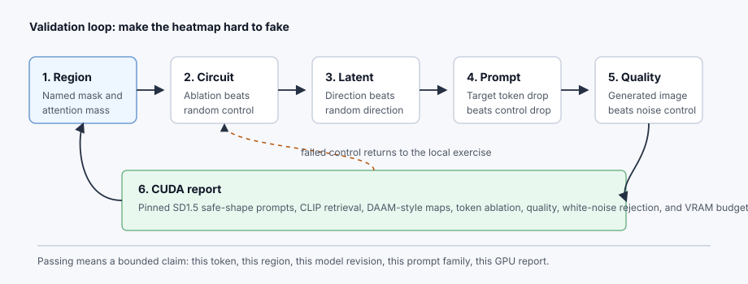
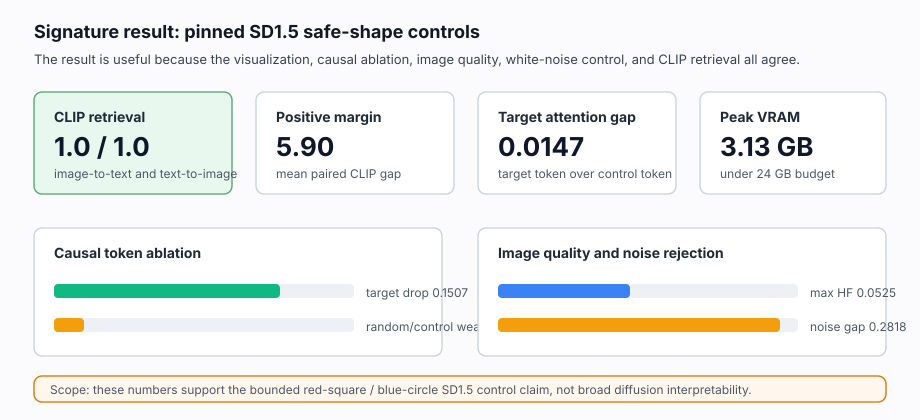

# [13.1] Diffusion and Image-Generation Controls

> **Notebooks: [exercises](../../exercises/part1_diffusion_image_controls/13.1_Diffusion_and_Image_Generation_Controls_exercises.ipynb) | [solutions](../../exercises/part1_diffusion_image_controls/13.1_Diffusion_and_Image_Generation_Controls_solutions.ipynb)**

> **Local-first extension.** This section starts the image-generation
> interpretability track. The visible exercises use exact toy tensors, then the
> committed report checks pinned Stable Diffusion 1.5 safe-shape generations,
> CLIP alignment, DAAM-style attention localization, target-token ablation,
> image-quality controls, and white-noise rejection on CUDA.

```python
GT_TIER = "GT-1"
EXERCISE_ID = "13_1_diffusion_and_image_generation_controls"
DIFFICULTY = 4
IMPORTANCE = 3
EXPECTED_RUNTIME = "seconds on toy contract; minutes on local real-model path"
REQUIRES_GPU = True  # full acceptance uses pinned SD1.5 and CLIP on CUDA
```

Please send any problems / bugs on the `#errata` channel in the
[Slack group](https://info-arena.github.io/ARENA_img/slack.html), and ask any
questions on the dedicated channels for this chapter of material.

If you want to change to dark mode, you can do this by clicking the three
horizontal lines in the top-right, then navigating to Settings -> Theme.

Links to earlier chapters: [(0) Fundamentals](https://arena-chapter0-fundamentals.streamlit.app/),
[(1) Transformer Interpretability](https://arena-chapter1-transformer-interp.streamlit.app/),
[(2) RL](https://arena-chapter2-rl.streamlit.app/),
[(3) LLM Evaluations](https://arena-chapter3-llm-evals.streamlit.app/),
[(4) Alignment Science](https://arena-chapter4-alignment-science.streamlit.app/).

## Core Question

When an image-generation explanation shows a plausible heatmap or edited image,
what would make the claim hard to fake?

The answer is not "the picture looks right". A useful first standard is:

1. attention mass is measured inside a named target region,
2. proposed denoising circuits beat same-size random ablations,
3. latent directions beat random directions on paired scores,
4. prompt-token ablations change the claimed region more than unrelated-token
   controls,
5. generated images pass simple quality checks while white-noise controls fail,
   and
6. real-model evidence is scoped to pinned safe-shape prompts and recorded in a
   reviewable CUDA report.

This section is deliberately a controls lesson, not a full Stable Diffusion
interpretability replication. Later notebooks can build diffusion LoRA,
denoising-circuit, AR image-token, and image-feature circuit work on top of
these checks.

## Learning Objectives

By the end of this notebook, you should be able to:

1. turn a prompt-to-region attention map into a quantitative report,
2. reject denoising-circuit claims that do not beat random ablations,
3. evaluate latent steering against random-direction controls,
4. test prompt-to-region causality with target-token ablation,
5. combine DAAM-style localization, token ablation, image quality, and
   white-noise controls into one strict acceptance report, and
6. read a pinned SD1.5/CLIP CUDA report without claiming broad image-generation
   interpretability.



The loop is the main lesson: screenshots are not evidence until you have
region masks, causal drops, random controls, and a bounded claim.

# Setup

```python
import json
import sys
from dataclasses import dataclass
from pathlib import Path
from typing import Literal

import torch as t

chapter = "chapter13_image_generation_interpretability"
section = "part1_diffusion_image_controls"
root_dir = next(p for p in [Path.cwd(), *Path.cwd().parents] if (p / chapter).exists())
exercises_dir = root_dir / chapter / "exercises"
section_dir = exercises_dir / section

if str(root_dir) not in sys.path:
    sys.path.append(str(root_dir))
if str(exercises_dir) not in sys.path:
    sys.path.append(str(exercises_dir))

import part1_diffusion_image_controls.tests as tests
```

We will use compact report objects. They look verbose, but they make the
passing condition inspectable: each boolean comes with the numbers that made it
true or false.

```python
ImageDirection = Literal["increase", "decrease"]


@dataclass(frozen=True)
class AttentionRegionReport:
    region_mass: float
    off_region_mass: float
    region_selective: bool


@dataclass(frozen=True)
class DenoisingCircuitReport:
    baseline_loss: float
    ablated_loss: float
    random_control_loss: float
    ablation_delta: float
    random_delta: float
    circuit_specific: bool


@dataclass(frozen=True)
class LatentDirectionReport:
    baseline_mean: float
    steered_mean: float
    random_control_mean: float
    observed_delta: float
    random_delta: float
    has_directional_effect: bool


@dataclass(frozen=True)
class PromptRegionCausalReport:
    original_region_score: float
    ablated_region_score: float
    control_region_score: float
    target_drop: float
    control_drop: float
    prompt_region_causal: bool


@dataclass(frozen=True)
class DAAMRegionReport:
    target_region_mass: float
    control_region_mass: float
    mask_fraction: float
    captured_map_count: int
    target_control_gap: float
    target_lift_over_mask_fraction: float
    daam_localized: bool


@dataclass(frozen=True)
class TokenAblationReport:
    original_region_score: float
    target_ablated_region_score: float
    random_control_region_score: float
    target_drop: float
    random_control_drop: float
    target_ablation_passed: bool
    random_token_ablation_weaker: bool


@dataclass(frozen=True)
class ImageQualityReport:
    target_region_fraction: float
    rgb_std: float
    high_frequency_energy: float
    saturation_fraction: float
    image_quality_preserved: bool


@dataclass(frozen=True)
class WhiteNoiseImageReport:
    real_high_frequency_energy: float
    white_noise_high_frequency_energy: float
    white_noise_rejected: bool


@dataclass(frozen=True)
class SD15StrictReport:
    daam_passed: bool
    token_ablation_passed: bool
    random_token_ablation_weaker: bool
    image_quality_preserved: bool
    white_noise_rejected: bool
    sd15_strict_experiment_passed: bool
```

# Attention Region Maps

An attention map is not a result by itself. The result is a measured claim:
"this token puts enough mass inside this target region, and not just anywhere
in the image".

### Exercise - measure target-region attention mass

> Difficulty: easy
> Importance: high
>
> You should spend up to 5 minutes on this exercise.

Implement the report below. The attention map should be nonnegative and
renormalized by its total mass before measuring the region.

```python
def attention_region_report(
    attention_map: t.Tensor,
    region_mask: t.Tensor,
    *,
    min_region_mass: float = 0.6,
) -> AttentionRegionReport:
    raise NotImplementedError()


tests.test_attention_region_report_measures_mass_and_rejects_bad_masks(
    attention_region_report
)
```

<details>
<summary>Expected output</summary>

```text
All tests in `test_attention_region_report_measures_mass_and_rejects_bad_masks` passed!
```

The toy fixture has `region_mass = 0.6` and `off_region_mass = 0.4`.

</details>

<details>
<summary>Help - what should count as off-region mass?</summary>

Everything not selected by the target mask. If the target token assigns 60% of
its mass to the region, then 40% is still outside the region and should be
visible in the report.

</details>

<details>
<summary>Common bugs</summary>

- Treating a heatmap screenshot as evidence without measuring mass.
- Forgetting to normalize the attention map after clamping negative values.
- Accepting an empty target mask.

</details>

<details>
<summary>Solution</summary>

```python
def attention_region_report(
    attention_map: t.Tensor,
    region_mask: t.Tensor,
    *,
    min_region_mass: float = 0.6,
) -> AttentionRegionReport:
    if attention_map.ndim != 2:
        raise ValueError("attention_map must have shape (height, width).")
    if region_mask.shape != attention_map.shape:
        raise ValueError("region_mask must match attention_map shape.")
    mask = region_mask.bool()
    if not mask.any():
        raise ValueError("region_mask must select at least one position.")
    attention = attention_map.float().clamp_min(0)
    total_mass = attention.sum()
    if total_mass.item() == 0:
        raise ValueError("attention_map must have positive mass.")
    region_mass = (attention[mask].sum() / total_mass).item()
    return AttentionRegionReport(
        region_mass=region_mass,
        off_region_mass=1.0 - region_mass,
        region_selective=region_mass >= min_region_mass,
    )
```

</details>

# Denoising Circuit Ablations

A proposed denoising circuit should be specific. If ablating a random component
of similar size damages the model just as much, you have found generic damage,
not a circuit.

### Exercise - require ablation specificity

> Difficulty: medium
> Importance: high
>
> You should spend up to 10 minutes on this exercise.

```python
def denoising_circuit_report(
    *,
    baseline_loss: float,
    ablated_loss: float,
    random_control_loss: float,
    min_loss_increase: float = 0.1,
    min_control_gap: float = 0.05,
) -> DenoisingCircuitReport:
    raise NotImplementedError()


tests.test_denoising_circuit_report_requires_specificity(denoising_circuit_report)
```

<details>
<summary>Expected output</summary>

```text
All tests in `test_denoising_circuit_report_requires_specificity` passed!
```

The positive fixture has `ablation_delta = 0.5`, `random_delta = 0.15`, and a
control gap of `0.35`.

</details>

<details>
<summary>Help - why compare deltas instead of raw losses?</summary>

The baseline loss sets the scale. The question is how much the proposed
ablation changes the loss relative to baseline, and whether that change is
larger than the random-control change.

</details>

<details>
<summary>Common bugs</summary>

- Measuring loss increase but forgetting the same-size random control.
- Calling generic model damage a denoising circuit.
- Comparing raw ablated loss instead of baseline-to-ablated delta.

</details>

<details>
<summary>Solution</summary>

```python
def denoising_circuit_report(
    *,
    baseline_loss: float,
    ablated_loss: float,
    random_control_loss: float,
    min_loss_increase: float = 0.1,
    min_control_gap: float = 0.05,
) -> DenoisingCircuitReport:
    ablation_delta = ablated_loss - baseline_loss
    random_delta = random_control_loss - baseline_loss
    circuit_specific = (
        ablation_delta >= min_loss_increase
        and ablation_delta >= random_delta + min_control_gap
    )
    return DenoisingCircuitReport(
        baseline_loss=baseline_loss,
        ablated_loss=ablated_loss,
        random_control_loss=random_control_loss,
        ablation_delta=ablation_delta,
        random_delta=random_delta,
        circuit_specific=circuit_specific,
    )
```

</details>

# Latent Directions

Latent directions are easy to over-believe because the images often change.
The control question is whether the target score changes more than a random
direction on paired examples.

### Exercise - compare latent steering against random controls

> Difficulty: medium
> Importance: high
>
> You should spend up to 10 minutes on this exercise.

```python
def latent_direction_effect_report(
    baseline_scores: t.Tensor,
    steered_scores: t.Tensor,
    random_control_scores: t.Tensor,
    *,
    expected_direction: ImageDirection = "increase",
    min_effect: float = 0.2,
    min_random_margin: float = 0.1,
) -> LatentDirectionReport:
    raise NotImplementedError()


tests.test_latent_direction_report_requires_random_margin(latent_direction_effect_report)
```

<details>
<summary>Expected output</summary>

```text
All tests in `test_latent_direction_report_requires_random_margin` passed!
```

The positive fixture has `observed_delta = 0.6` and `random_delta = 0.05`.
The tests also include a decrease-direction case and a mismatched-shape error.

</details>

<details>
<summary>Help - why paired scores?</summary>

The baseline, steered, and random-control score tensors should refer to the
same prompts or seeds. Otherwise sample composition can create an apparent
latent-direction effect.

</details>

<details>
<summary>Common bugs</summary>

- Accepting visually pleasing latent edits without a random-direction baseline.
- Mixing up expected increase versus decrease.
- Averaging unpaired before/after scores and hiding sample-level failures.

</details>

<details>
<summary>Solution</summary>

```python
def latent_direction_effect_report(
    baseline_scores: t.Tensor,
    steered_scores: t.Tensor,
    random_control_scores: t.Tensor,
    *,
    expected_direction: ImageDirection = "increase",
    min_effect: float = 0.2,
    min_random_margin: float = 0.1,
) -> LatentDirectionReport:
    if baseline_scores.shape != steered_scores.shape:
        raise ValueError("baseline and steered scores must match.")
    if baseline_scores.shape != random_control_scores.shape:
        raise ValueError("baseline and random control scores must match.")
    baseline_mean = baseline_scores.float().mean().item()
    steered_mean = steered_scores.float().mean().item()
    random_control_mean = random_control_scores.float().mean().item()
    observed_delta = steered_mean - baseline_mean
    random_delta = random_control_mean - baseline_mean
    if expected_direction == "increase":
        directional_effect = observed_delta >= min_effect
    elif expected_direction == "decrease":
        directional_effect = -observed_delta >= min_effect
    else:
        raise ValueError("expected_direction must be 'increase' or 'decrease'.")
    has_directional_effect = directional_effect and abs(observed_delta) > (
        abs(random_delta) + min_random_margin
    )
    return LatentDirectionReport(
        baseline_mean=baseline_mean,
        steered_mean=steered_mean,
        random_control_mean=random_control_mean,
        observed_delta=observed_delta,
        random_delta=random_delta,
        has_directional_effect=has_directional_effect,
    )
```

</details>

# Prompt-To-Region Causality

The target prompt token should matter more for its claimed region than an
unrelated prompt token does.

### Exercise - require target-region drop over control

> Difficulty: medium
> Importance: high
>
> You should spend up to 10 minutes on this exercise.

```python
def prompt_region_causal_report(
    *,
    original_region_score: float,
    ablated_region_score: float,
    control_region_score: float,
    min_target_drop: float = 0.2,
    min_control_margin: float = 0.1,
) -> PromptRegionCausalReport:
    raise NotImplementedError()


tests.test_prompt_region_report_requires_target_drop(prompt_region_causal_report)
```

<details>
<summary>Expected output</summary>

```text
All tests in `test_prompt_region_report_requires_target_drop` passed!
```

The positive fixture has `target_drop = 0.6` and `control_drop = 0.15`.

</details>

<details>
<summary>Help - what is the control token?</summary>

It is a prompt token that should not define the target region. In the SD1.5
report, removing the color token should reduce the target color region more
than changing an unrelated word such as `background` or `geometric`.

</details>

<details>
<summary>Common bugs</summary>

- Removing a prompt token but not checking an unrelated-token control.
- Reporting total image change instead of target-region score drop.
- Letting a target-region claim pass when the control token has the same effect.

</details>

<details>
<summary>Solution</summary>

```python
def prompt_region_causal_report(
    *,
    original_region_score: float,
    ablated_region_score: float,
    control_region_score: float,
    min_target_drop: float = 0.2,
    min_control_margin: float = 0.1,
) -> PromptRegionCausalReport:
    target_drop = original_region_score - ablated_region_score
    control_drop = original_region_score - control_region_score
    prompt_region_causal = (
        target_drop >= min_target_drop
        and target_drop >= control_drop + min_control_margin
    )
    return PromptRegionCausalReport(
        original_region_score=original_region_score,
        ablated_region_score=ablated_region_score,
        control_region_score=control_region_score,
        target_drop=target_drop,
        control_drop=control_drop,
        prompt_region_causal=prompt_region_causal,
    )
```

</details>

# SD1.5 Control Reports

The real report combines several controls. We will implement the small
acceptance reports on toy numbers so you can read the CUDA metrics later.

### Exercise - combine DAAM, token-ablation, quality, and noise controls

> Difficulty: medium
> Importance: high
>
> You should spend up to 15 minutes on this exercise.

```python
def daam_region_report(
    *,
    target_region_mass: float,
    control_region_mass: float,
    mask_fraction: float,
    captured_map_count: int,
    min_target_control_gap: float = 0.005,
    min_lift_over_mask_fraction: float = 0.01,
    min_captured_map_count: int = 16,
) -> DAAMRegionReport:
    raise NotImplementedError()


def token_ablation_region_report(
    *,
    original_region_score: float,
    target_ablated_region_score: float,
    random_control_region_score: float,
    min_target_drop: float = 0.05,
    min_random_margin: float = 0.05,
) -> TokenAblationReport:
    raise NotImplementedError()


def image_quality_report(
    image: t.Tensor,
    *,
    target_color: Literal["red", "blue"],
    min_target_region_fraction: float = 0.02,
    min_rgb_std: float = 0.05,
    max_high_frequency_energy: float = 0.12,
) -> ImageQualityReport:
    raise NotImplementedError()


def white_noise_image_control_report(
    real_quality: ImageQualityReport,
    white_noise_image: t.Tensor,
    *,
    target_color: Literal["red", "blue"],
    max_high_frequency_energy: float = 0.12,
    min_noise_gap: float = 0.12,
) -> WhiteNoiseImageReport:
    raise NotImplementedError()


def sd15_strict_acceptance_report(
    *,
    daam_reports: list[DAAMRegionReport],
    token_ablation_reports: list[TokenAblationReport],
    image_quality_reports: list[ImageQualityReport],
    white_noise_reports: list[WhiteNoiseImageReport],
) -> SD15StrictReport:
    raise NotImplementedError()


tests.test_sd15_toy_control_reports(
    daam_region_report,
    token_ablation_region_report,
    image_quality_report,
    white_noise_image_control_report,
    sd15_strict_acceptance_report,
)
```

<details>
<summary>Expected output</summary>

```text
All tests in `test_sd15_toy_control_reports` passed!
```

The toy DAAM report has target-control gap `0.07` and target lift over mask
fraction `0.11`. The token-ablation report has target drop `0.22` and random
control drop `0.04`.

</details>

<details>
<summary>Help - why do we need image quality and white-noise controls?</summary>

A target-token ablation can look strong if the generator collapses or if the
region mask fires on noisy pixels. A simple quality gate plus a white-noise
negative control prevents the report from accepting broken images as
interpretable generations.

</details>

<details>
<summary>Common bugs</summary>

- Accepting a DAAM map whose target mass is no higher than the mask fraction.
- Checking target-token ablation without an unrelated-token ablation.
- Letting white noise pass the same image-quality gate as the generated image.
- Combining reports without checking all report lists have the same length.

</details>

<details>
<summary>Solution</summary>

The solution notebook implements this exactly. The key pattern is: validate
inputs, compute the numeric gaps, then make the final boolean a conjunction of
all required controls.

</details>

# Notebook Contract

This is the student-facing smoke contract. It should stay small, exact, and
serializable.

### Exercise - assemble the image-generation controls contract

> Difficulty: easy
> Importance: high
>
> You should spend up to 5 minutes on this exercise.

```python
def attention_region_smoke_test() -> dict:
    attention_map = t.tensor([[0.1, 0.1], [0.2, 0.6]])
    region_mask = t.tensor([[False, False], [False, True]])
    return attention_region_report(
        attention_map,
        region_mask,
        min_region_mass=0.5,
    ).__dict__


def denoising_circuit_smoke_test() -> dict:
    return denoising_circuit_report(
        baseline_loss=0.2,
        ablated_loss=0.7,
        random_control_loss=0.35,
        min_loss_increase=0.3,
        min_control_gap=0.2,
    ).__dict__


def latent_direction_smoke_test() -> dict:
    baseline = t.tensor([0.1, 0.2])
    steered = t.tensor([0.7, 0.8])
    random_control = t.tensor([0.25, 0.15])
    return latent_direction_effect_report(
        baseline,
        steered,
        random_control,
        expected_direction="increase",
        min_effect=0.5,
        min_random_margin=0.2,
    ).__dict__


def prompt_region_smoke_test() -> dict:
    return prompt_region_causal_report(
        original_region_score=0.9,
        ablated_region_score=0.3,
        control_region_score=0.75,
        min_target_drop=0.4,
        min_control_margin=0.2,
    ).__dict__


def run_smoke_test(cpu: bool = True) -> dict:
    _ = cpu
    return {
        "attention_region": attention_region_smoke_test(),
        "denoising_circuit": denoising_circuit_smoke_test(),
        "latent_direction": latent_direction_smoke_test(),
        "prompt_region": prompt_region_smoke_test(),
    }


tests.test_attention_region_smoke_test(attention_region_smoke_test)
tests.test_denoising_circuit_smoke_test(denoising_circuit_smoke_test)
tests.test_latent_direction_smoke_test(latent_direction_smoke_test)
tests.test_prompt_region_smoke_test(prompt_region_smoke_test)
tests.test_notebook_contract(run_smoke_test)
```

<details>
<summary>Expected output</summary>

```text
All tests in `test_notebook_contract` passed!
```

</details>

<details>
<summary>Help - why does the smoke contract omit SD1.5 generation?</summary>

The smoke contract is for fast local feedback on the controls. The SD1.5 path
is real CUDA evidence and is regenerated by the report runner; putting it in
every notebook execution would make the first lesson slow and expensive.

</details>

<details>
<summary>Common bugs</summary>

- Returning dataclass objects instead of dictionaries.
- Omitting a random-control check from the contract.
- Treating toy tensor checks as a substitute for the CUDA report.

</details>

<details>
<summary>Solution</summary>

Use the implementation above unchanged once each helper has been implemented.

</details>

# CUDA Verification Report

The full report is produced by:

```bash
BNB_CUDA_VERSION=130 uv run python scripts/run_extension_verification_reports.py --section 13.1 --max-vram-gb 24.0
```

It runs two pinned image-generation paths:

- required Stable Diffusion 1.5 safe-shape generation with DAAM-style
  cross-attention capture, target-token ablation, image-quality checks, and
  white-noise controls;
- supplemental SD-Turbo safe-shape generation with CLIP alignment and
  cross-attention localization.

```python
def run_gpu_test(max_vram_gb: float = 24.0) -> dict:
    report = json.loads((section_dir / "verification_report.json").read_text())
    tests.test_committed_gpu_report_requires_sd15_strict_controls(report)
    gpu = report["metrics"]["gpu_test"]
    if gpu["peak_vram_gb"] > max_vram_gb:
        raise AssertionError(
            f"Committed report used {gpu['peak_vram_gb']:.2f} GB, "
            f"above the {max_vram_gb:.2f} GB budget."
        )
    return {
        "torch_version": gpu["torch_version"],
        "cuda_version": gpu["cuda_version"],
        "device": gpu["device"],
        "sd15_clip_margin": gpu["sd15_clip_mean_positive_margin"],
        "sd15_target_attention_gap": gpu["sd15_min_target_control_attention_gap"],
        "sd15_target_ablation_drop": gpu["sd15_min_target_ablation_drop"],
        "sd15_max_random_control_drop": gpu["sd15_max_random_control_drop"],
        "sd15_white_noise_gap": gpu["sd15_min_white_noise_high_frequency_gap"],
        "sd15_peak_vram_gb": gpu["sd15_peak_vram_gb"],
        "within_vram_budget": gpu["within_vram_budget"],
    }


def run_full_experiment(max_vram_gb: float = 24.0) -> dict:
    return run_gpu_test(max_vram_gb=max_vram_gb)


run_gpu_test()
```

<details>
<summary>Expected output</summary>

```text
All tests in `test_committed_gpu_report_requires_sd15_strict_controls` passed!
{'torch_version': '2.12.1+cu132', 'cuda_version': '13.2', ...}
```

The committed run should show SD1.5 CLIP retrieval accuracy `1.0 / 1.0`, mean
positive margin about `5.90`, minimum target-control attention gap about
`0.0147`, minimum target-token ablation drop about `0.1507`, maximum
random/control ablation drop below `0.0`, white-noise high-frequency gap about
`0.2818`, and peak VRAM about `3.13 GB`.

</details>

<details>
<summary>Help - what exactly is the real-model claim?</summary>

The claim is that the pinned SD1.5 safe-shape report passes this control stack
on two deterministic prompts: generated red square and blue circle. It is not a
claim that all SD1.5 attention maps are causal explanations, or that the course
has replicated full DAAM or denoising-circuit interpretability.

</details>

<details>
<summary>Common bugs</summary>

- Treating SD-Turbo as the acceptance fallback. It is supplemental; SD1.5 is
  the required path.
- Calling a target-token attention map causal without the ablation result.
- Claiming a complete denoising-circuit analysis from prompt-token controls.

</details>

# Signature Result



| Check | Result | Why it matters |
|---|---:|---|
| Toy attention region mass | `0.60` | The target mask captures most toy attention mass. |
| Toy denoising ablation gap | `0.50 vs 0.15` | Proposed circuit damage beats random-control damage. |
| Toy latent direction gap | `0.60 vs 0.05` | Target direction beats random direction on paired scores. |
| SD1.5 CLIP retrieval | `1.0 / 1.0` | Generated images match the intended shape prompts. |
| SD1.5 target-control attention gap | `>= 0.0147` | Target color/shape tokens beat unrelated-token controls. |
| SD1.5 target ablation drop | `>= 0.1507` | Removing target tokens reduces the target color region. |
| SD1.5 white-noise gap | `>= 0.2818` | The quality gate rejects high-frequency noise controls. |
| Peak CUDA VRAM | `3.13 GB` | The full report fits inside the 24 GB local budget. |

<details>
<summary>Interpreting the signature result</summary>

The course result is a control stack, not a beautiful image. The important
point is that attention localization, prompt-token ablation, quality checks,
and negative controls all point in the same direction on safe generated shape
prompts.

</details>

# Limitations

Supported:

- exact toy attention, ablation, latent-direction, and prompt-region controls;
- pinned SD1.5 safe-shape generation with CLIP scoring;
- DAAM-style cross-attention localization over target-region masks;
- target-token ablation over unrelated-token controls;
- simple generated-image quality checks and white-noise rejection.

Not supported:

- broad Stable Diffusion interpretability claims;
- full DAAM replication;
- full denoising-circuit causal tracing;
- unsafe prompt or NSFW generation studies;
- diffusion LoRA interpretability;
- SDXL or video diffusion claims.

Deferred:

- denoising-step activation patching,
- diffusion LoRA feature analysis,
- AR image-token model controls,
- multi-object compositional image circuits,
- human perceptual evaluation beyond the simple safe-shape checks.

# Further Research

1. Add a third safe prompt with a green triangle and test whether the region
   mask/control logic scales.
2. Replace the simple color mask with a segmentation model and compare failure
   cases.
3. Patch attention maps across denoising timesteps and test whether early or
   late steps are more causally important.
4. Repeat the exact report after changing model revisions; do not keep the old
   claim boundary if a control fails.
