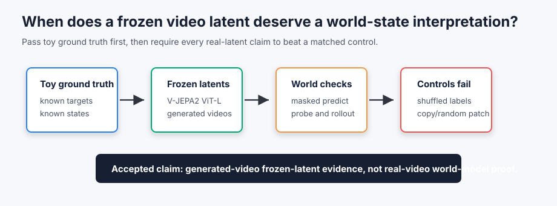
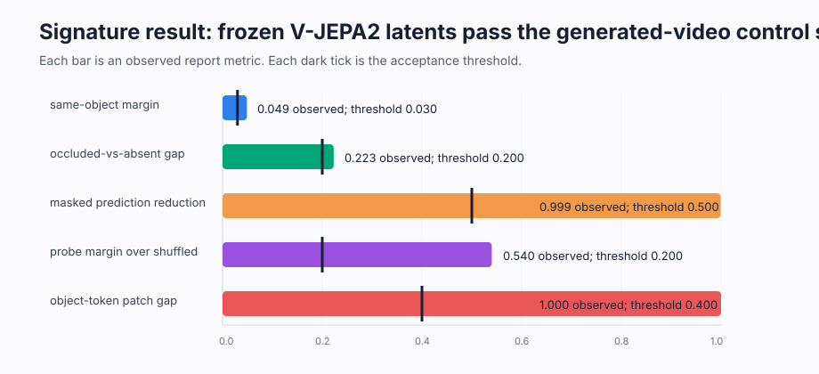

# [14.1] JEPA and World-Model Controls

> **Notebooks: [exercises](../../exercises/part1_jepa_world_model_controls/14.1_JEPA_and_World_Model_Controls_exercises.ipynb) | [solutions](../../exercises/part1_jepa_world_model_controls/14.1_JEPA_and_World_Model_Controls_solutions.ipynb)**

> **Local-first extension.** This section asks when a frozen JEPA/video latent is
> strong enough to call it a world-state representation. You will start from
> exact toy tensors, then inspect a pinned V-JEPA 2 ViT-L generated-video report
> with matched failure controls.

```python
GT_TIER = "GT-1"
EXERCISE_ID = "14_1_jepa_and_world_model_controls"
DIFFICULTY = 4
IMPORTANCE = 4
EXPECTED_RUNTIME = "seconds for toy contracts; minutes for the CUDA V-JEPA 2 latent-control preflight"
REQUIRES_GPU = True
```

Please send any problems / bugs on the `#errata` channel in the [Slack group](https://info-arena.github.io/ARENA_img/slack.html), and ask any questions on the dedicated channels for this chapter of material.

Links to earlier chapters: [(0) Fundamentals](https://arena-chapter0-fundamentals.streamlit.app/), [(1) Transformer Interpretability](https://arena-chapter1-transformer-interp.streamlit.app/), [(2) RL](https://arena-chapter2-rl.streamlit.app/), [(3) LLM Evaluations](https://arena-chapter3-llm-evals.streamlit.app/), [(4) Alignment Science](https://arena-chapter4-alignment-science.streamlit.app/).



## Core Question

When does a frozen video latent deserve a world-state interpretation?

The answer in this notebook is deliberately narrow. A latent must predict a
held-out target embedding, stay non-collapsed, expose held-out state variables
above a shuffled-label control, update under actions better than copy or
shuffled-action baselines, and preserve occluded-object evidence above absent
and different-object controls. The final V-JEPA 2 path applies the same logic to
deterministic generated videos; it is not a broad benchmark claim.

<details>
<summary>Help - why is this not just a reconstruction test?</summary>

JEPA-style systems predict latent targets rather than pixels. A good
reconstruction can come from texture or decoder priors. Here the first question
is whether predicted target embeddings line up with held-out target embeddings,
and later questions ask whether those embeddings carry falsifiable state and
transition information.

</details>

<details>
<summary>Help - what counts as a world-state claim?</summary>

In this section a world-state claim needs a variable, a transition, and a
control. "The latent has object information" is not enough. We require an
object/state probe, an action-conditioned next-latent check, and controls that
fail when labels, actions, object identity, or token patches are randomized.

</details>

## Learning Objectives

- Implement paired cosine similarity for embedding-level target checks.
- Diagnose target-prediction success and collapsed-feature failure modes.
- Test held-out state probes against shuffled-label controls.
- Test action-conditioned latent rollout against copy and shuffled-action
  baselines.
- Test object permanence against absent-object and different-object controls.
- Read a pinned V-JEPA 2 generated-video verification report as a bounded claim.
- State what toy and generated-video evidence does not prove.

## Reading

- JEPA and V-JEPA papers for the target-prediction framing.
- V-JEPA 2 model card for the pinned frozen video encoder used in the CUDA path.
- Earlier ARENA material on probes, baselines, and causal intervention checks.

# Setup Code

```python
import json
import sys
from pathlib import Path

import torch as t
import torch.nn.functional as F

chapter = "chapter14_jepa_world_models"
section = "part1_jepa_world_model_controls"
root_dir = next(p for p in [Path.cwd(), *Path.cwd().parents] if (p / chapter).exists())
exercises_dir = root_dir / chapter / "exercises"
section_dir = exercises_dir / section

if str(root_dir) not in sys.path:
    sys.path.append(str(root_dir))
if str(exercises_dir) not in sys.path:
    sys.path.append(str(exercises_dir))

import part1_jepa_world_model_controls.tests as tests
import part1_jepa_world_model_controls.utils as utils

from arena_ext.jepa_world_models import (
    collapse_diagnostics_report,
    jepa_prediction_report,
    latent_rollout_report,
    object_permanence_report,
    transition_consistency_report,
    world_state_probe_report,
)

MAIN = __name__ == "__main__"
```

# Exercise 1 - Paired Cosine

> ```yaml
> Difficulty: medium
> Importance: high
>
> You should spend 5-10 minutes on this exercise.
> ```

Implement `paired_cosine`. This is the smallest target-prediction primitive:
one predicted embedding is compared with one held-out target embedding, row by
row. Later controls use the same idea on pooled V-JEPA 2 latents.

```python
def paired_cosine(left: t.Tensor, right: t.Tensor, *, eps: float = 1e-8) -> t.Tensor:
    """
    Return row-wise cosine similarities.

    Inputs:
        left: shape [..., d_model]
        right: shape [..., d_model]
    Returns:
        cosine: shape [...]
    """
    # EXERCISE
    # YOUR CODE HERE
    raise NotImplementedError()
    # END EXERCISE


if MAIN:
    tests.test_paired_cosine_toy_oracle(paired_cosine)
    tests.test_paired_cosine_rejects_shape_mismatch(paired_cosine)
```

<details>
<summary>Expected output</summary>

```text
All tests in `test_paired_cosine_toy_oracle` passed!
All tests in `test_paired_cosine_rejects_shape_mismatch` passed!
```

</details>

<details>
<summary>Help - why shape errors matter</summary>

Broadcasting a target tensor can make a collapsed predictor look surprisingly
reasonable. Reject shape mismatches before computing a metric.

</details>

<details>
<summary>Solution</summary>

```python
def paired_cosine(left: t.Tensor, right: t.Tensor, *, eps: float = 1e-8) -> t.Tensor:
    if left.shape != right.shape:
        raise ValueError("left and right must have the same shape.")
    if left.ndim < 2:
        raise ValueError("left and right must have shape (..., d_model).")
    left_float = left.float()
    right_float = right.float()
    numerator = (left_float * right_float).sum(dim=-1)
    denominator = left_float.norm(dim=-1) * right_float.norm(dim=-1)
    return numerator / denominator.clamp_min(eps)
```

</details>

# Exercise 2 - JEPA Target Prediction and Collapse

> ```yaml
> Difficulty: medium
> Importance: high
>
> You should spend 10-15 minutes on this exercise.
> ```

Use the report helper to turn cosine and MSE into a pass/fail target check, then
verify that a collapsed representation fails a separate non-collapse diagnostic.

```python
def jepa_prediction_smoke_test() -> dict:
    # EXERCISE
    # YOUR CODE HERE
    raise NotImplementedError()
    # END EXERCISE


def collapse_diagnostics_smoke_test() -> dict:
    # EXERCISE
    # YOUR CODE HERE
    raise NotImplementedError()
    # END EXERCISE


if MAIN:
    tests.test_jepa_prediction_smoke_test(jepa_prediction_smoke_test)
    tests.test_jepa_prediction_report_rejects_collapse_and_bad_mse()
    tests.test_collapse_diagnostics_smoke_test(collapse_diagnostics_smoke_test)
    tests.test_collapse_diagnostics_rejects_identical_features()
```

<details>
<summary>Expected output</summary>

```text
mean_cosine: 1.0
mse: 0.0
collapsed_control_rejected: True
```

</details>

<details>
<summary>Help - why use both cosine and MSE?</summary>

Cosine ignores vector length. If the predicted target points in the right
direction but has the wrong scale, cosine alone can pass. The MSE threshold
catches that case in this toy oracle.

</details>

<details>
<summary>Solution</summary>

```python
def jepa_prediction_smoke_test() -> dict:
    target_embeddings = t.tensor([[1.0, 0.0], [0.0, 1.0]])
    predicted_targets = target_embeddings.clone()
    return jepa_prediction_report(
        predicted_targets,
        target_embeddings,
        min_cosine=0.99,
        max_mse=0.01,
    ).__dict__


def collapse_diagnostics_smoke_test() -> dict:
    structured_features = t.tensor(
        [
            [1.0, 0.0, 0.0, 0.0],
            [0.0, 1.0, 0.0, 0.0],
            [0.0, 0.0, 1.0, 0.0],
            [0.0, 0.0, 0.0, 1.0],
            [1.0, 1.0, 0.0, 0.0],
            [0.0, 1.0, 1.0, 0.0],
        ]
    )
    collapsed_features = t.ones(6, 4)
    structured = collapse_diagnostics_report(
        structured_features,
        min_feature_std=0.1,
        min_effective_rank=2.0,
    )
    collapsed = collapse_diagnostics_report(
        collapsed_features,
        min_feature_std=0.1,
        min_effective_rank=2.0,
    )
    return {
        "structured": structured.__dict__,
        "collapsed": collapsed.__dict__,
        "collapsed_control_rejected": not collapsed.non_collapsed,
    }
```

</details>

# Exercise 3 - Held-Out State Probes

> ```yaml
> Difficulty: medium
> Importance: high
>
> You should spend 10 minutes on this exercise.
> ```

A state probe is not meaningful unless a matched negative control fails. Here
the same logits should succeed for aligned labels and fail for shuffled labels.

```python
def state_probe_smoke_test() -> dict:
    # EXERCISE
    # YOUR CODE HERE
    raise NotImplementedError()
    # END EXERCISE


def state_probe_control_smoke_test() -> dict:
    # EXERCISE
    # YOUR CODE HERE
    raise NotImplementedError()
    # END EXERCISE


if MAIN:
    tests.test_state_probe_smoke_test(state_probe_smoke_test)
    tests.test_state_probe_control_smoke_test(state_probe_control_smoke_test)
    tests.test_state_probe_report_rejects_shuffled_labels()
```

<details>
<summary>Expected output</summary>

```text
accuracy: 1.0
shuffled_control_rejected: True
accuracy_margin: 1.0
```

</details>

<details>
<summary>Help - what this probe does not prove</summary>

A high probe score shows decodable state information, not causal use of that
state by the model. That is why later exercises require transition and patching
controls.

</details>

<details>
<summary>Solution</summary>

```python
def state_probe_smoke_test() -> dict:
    probe_logits = t.tensor([[3.0, 0.0], [0.0, 4.0], [2.0, 1.0]])
    labels = t.tensor([0, 1, 0])
    return world_state_probe_report(probe_logits, labels, min_accuracy=1.0).__dict__


def state_probe_control_smoke_test() -> dict:
    probe_logits = t.tensor([[4.0, 0.0], [3.0, 0.0], [0.0, 4.0], [0.0, 3.0]])
    labels = t.tensor([0, 0, 1, 1])
    shuffled_labels = t.tensor([1, 1, 0, 0])
    probe = world_state_probe_report(probe_logits, labels, min_accuracy=0.9)
    shuffled = world_state_probe_report(probe_logits, shuffled_labels, min_accuracy=0.9)
    return {
        "probe": probe.__dict__,
        "shuffled": shuffled.__dict__,
        "shuffled_control_rejected": not shuffled.predicts_state,
        "accuracy_margin": probe.accuracy - shuffled.accuracy,
    }
```

</details>

# Exercise 4 - Transition and Rollout Controls

> ```yaml
> Difficulty: medium
> Importance: high
>
> You should spend 10-15 minutes on this exercise.
> ```

World models should update state. First test the exact tensor identity
`state + action_delta = next_state`. Then use scalar losses to require an
action-conditioned rollout to beat copy and shuffled-action baselines.

```python
def transition_smoke_test() -> dict:
    # EXERCISE
    # YOUR CODE HERE
    raise NotImplementedError()
    # END EXERCISE


def rollout_control_smoke_test() -> dict:
    # EXERCISE
    # YOUR CODE HERE
    raise NotImplementedError()
    # END EXERCISE


if MAIN:
    tests.test_transition_smoke_test(transition_smoke_test)
    tests.test_transition_report_rejects_missing_action_delta()
    tests.test_rollout_control_smoke_test(rollout_control_smoke_test)
    tests.test_latent_rollout_report_rejects_copy_and_shuffled_controls()
```

<details>
<summary>Expected output</summary>

```text
mean_cosine: 1.0
rollout_passes: True
copy_and_shuffled_controls_rejected: True
```

</details>

<details>
<summary>Help - why copy is a strong baseline</summary>

If the next state is often close to the current state, a model can look good by
copying. The rollout head only earns credit when it improves over copy and when
shuffling the action removes the advantage.

</details>

<details>
<summary>Solution</summary>

```python
def transition_smoke_test() -> dict:
    state_embeddings = t.tensor([[0.0, 0.0], [1.0, 1.0]])
    action_deltas = t.tensor([[1.0, 0.0], [0.0, 1.0]])
    next_state_embeddings = t.tensor([[1.0, 0.0], [1.0, 2.0]])
    return transition_consistency_report(
        state_embeddings,
        action_deltas,
        next_state_embeddings,
        min_cosine=0.99,
    ).__dict__


def rollout_control_smoke_test() -> dict:
    rollout = latent_rollout_report(
        rollout_loss=0.10,
        copy_baseline_loss=1.00,
        shuffled_action_loss=0.90,
        max_rollout_to_copy=0.8,
        max_rollout_to_shuffled=0.8,
    )
    failed = latent_rollout_report(
        rollout_loss=0.75,
        copy_baseline_loss=0.80,
        shuffled_action_loss=0.70,
        max_rollout_to_copy=0.8,
        max_rollout_to_shuffled=0.8,
    )
    return {
        "rollout": rollout.__dict__,
        "failed_control": failed.__dict__,
        "copy_and_shuffled_controls_rejected": not failed.rollout_passes,
    }
```

</details>

# Exercise 5 - Object Permanence Controls

> ```yaml
> Difficulty: medium
> Importance: high
>
> You should spend 10 minutes on this exercise.
> ```

Object permanence is not "the occluded video has a high score". It must remain
above absent-object controls, and a different object should not count as the
same hidden object.

```python
def object_permanence_smoke_test() -> dict:
    # EXERCISE
    # YOUR CODE HERE
    raise NotImplementedError()
    # END EXERCISE


def object_permanence_control_smoke_test() -> dict:
    # EXERCISE
    # YOUR CODE HERE
    raise NotImplementedError()
    # END EXERCISE


if MAIN:
    tests.test_object_permanence_smoke_test(object_permanence_smoke_test)
    tests.test_object_permanence_control_smoke_test(object_permanence_control_smoke_test)
    tests.test_object_permanence_report_rejects_absent_and_different_object_controls()
```

<details>
<summary>Expected output</summary>

```text
occluded_absent_gap: 0.575
absent_like_rejected: True
different_object_rejected: True
```

</details>

<details>
<summary>Help - what the absent control catches</summary>

An occluder can make videos look similar even when the object is gone. The
absent-object control asks whether the representation is about the object, not
just the occluder or background.

</details>

<details>
<summary>Solution</summary>

```python
def object_permanence_smoke_test() -> dict:
    return object_permanence_report(
        visible_scores=t.tensor([0.9, 0.8]),
        occluded_scores=t.tensor([0.75, 0.7]),
        absent_scores=t.tensor([0.1, 0.2]),
        min_occluded_score=0.6,
        min_absent_gap=0.4,
    ).__dict__


def object_permanence_control_smoke_test() -> dict:
    preserved = object_permanence_report(
        visible_scores=t.tensor([0.95, 0.9]),
        occluded_scores=t.tensor([0.8, 0.75]),
        absent_scores=t.tensor([0.15, 0.2]),
        min_occluded_score=0.6,
        min_absent_gap=0.4,
    )
    absent_like = object_permanence_report(
        visible_scores=t.tensor([0.95, 0.9]),
        occluded_scores=t.tensor([0.52, 0.48]),
        absent_scores=t.tensor([0.46, 0.44]),
        min_occluded_score=0.6,
        min_absent_gap=0.4,
    )
    different_object = object_permanence_report(
        visible_scores=t.tensor([0.95, 0.9]),
        occluded_scores=t.tensor([0.78, 0.76]),
        absent_scores=t.tensor([0.72, 0.7]),
        min_occluded_score=0.6,
        min_absent_gap=0.4,
    )
    return {
        "preserved": preserved.__dict__,
        "absent_like": absent_like.__dict__,
        "different_object": different_object.__dict__,
        "absent_like_rejected": not absent_like.preserves_occluded_object,
        "different_object_rejected": not different_object.preserves_occluded_object,
    }
```

</details>

# Exercise 6 - Assemble the Notebook Contract

> ```yaml
> Difficulty: medium
> Importance: high
>
> You should spend 5-10 minutes on this exercise.
> ```

Collect the toy checks into one JSON-serializable contract. This is the local
CPU path. The accepted section still requires the CUDA report below.

```python
def run_smoke_test(cpu: bool = True) -> dict:
    # EXERCISE
    # YOUR CODE HERE
    raise NotImplementedError()
    # END EXERCISE


if MAIN:
    tests.test_notebook_contract(run_smoke_test)
```

<details>
<summary>Expected output</summary>

```text
All tests in `test_notebook_contract` passed!
```

</details>

<details>
<summary>Solution</summary>

```python
def run_smoke_test(cpu: bool = True) -> dict:
    _ = cpu
    return {
        "jepa_prediction": jepa_prediction_smoke_test(),
        "collapse": collapse_diagnostics_smoke_test(),
        "state_probe": state_probe_smoke_test(),
        "state_probe_control": state_probe_control_smoke_test(),
        "transition": transition_smoke_test(),
        "rollout_control": rollout_control_smoke_test(),
        "object_permanence": object_permanence_smoke_test(),
        "object_permanence_control": object_permanence_control_smoke_test(),
    }
```

</details>

# CUDA Verification Path

The committed report reruns the full local path via:

```bash
BNB_CUDA_VERSION=130 uv run python scripts/ci_quality_gate.py --mode gpu --section 14.1
```

The report loads `facebook/vjepa2-vitl-fpc64-256` at revision
`b3c1679b7c34d3255ef3547f27c7b226aefab26f`, extracts frozen video latents on
CUDA, and trains only small heads on those frozen latents.

```python
def run_gpu_test(max_vram_gb: float = 24.0) -> dict:
    report = json.loads((section_dir / "verification_report.json").read_text())
    gpu = report["metrics"]["gpu_test"]
    assert report["accepted"]
    assert gpu["cuda_available"]
    assert gpu["vjepa2_preflight_passed"]
    assert gpu["vjepa2_world_model_controls_passed"]
    assert gpu["peak_vram_gb"] <= max_vram_gb
    return gpu


def run_full_experiment(max_vram_gb: float = 24.0) -> dict:
    return run_gpu_test(max_vram_gb=max_vram_gb)


if MAIN:
    tests.test_committed_verification_report_vjepa_world_controls()
    tests.test_exercise_notebook_declares_full_verification_contract()
```

<details>
<summary>Expected output</summary>

```text
vjepa2_feature_shape: [5, 144, 1024]
vjepa2_world_feature_shape: [200, 1024]
masked_prediction_loss_reduction: 0.999
state_probe_margin_over_random: 0.540
latent_rollout_passed: True
causal_latent_patch_random_gap: 1.000
peak_vram_gb: 0.741
```

</details>

<details>
<summary>Help - why read a committed report in the notebook?</summary>

The notebook is written for students who may not have the exact CUDA hardware or
cached V-JEPA 2 weights. The acceptance gate for this repository still reruns
the real CUDA path; the notebook makes the observed report interpretable and
checks that its required controls are present.

</details>

# Signature Result



The pinned CUDA run produced the following central result:

| Check | Observed | Required | Interpretation |
|---|---:|---:|---|
| Same-object over different-object cosine margin | `0.0488` | `>= 0.030` | V-JEPA 2 frozen latents separate the matched red-square video from the blue-circle control. |
| Late-occluded over absent-object gap | `0.2230` | `>= 0.200` | The synthetic occluded object remains closer than an absent-object occluder video. |
| Masked latent prediction loss reduction | `0.9992` | `>= 0.500` | A small head predicts visible latents from occluded latents better than copy. |
| State-probe margin over shuffled labels | `0.5400` | `>= 0.200` | Held-out object labels are decodable above a shuffled-label control. |
| Object-token patch gap over random-token patch | `0.99997` | `>= 0.400` | Object-token patches move a position probe more than same-size random patches. |

<details>
<summary>Interpretation - what makes this result meaningful?</summary>

The result is meaningful because every bar has a matched control: different
object, absent object, copy baseline, shuffled label, shuffled action, or
random-token patch. Without those controls this would only be a pretty latent
similarity demo.

</details>

# What This Section Shows

- A JEPA target-prediction check should use paired target embeddings, not pixel
  reconstruction.
- A world-state interpretation needs non-collapse, state decoding, transition
  consistency, and object-permanence controls.
- On this machine, pinned V-JEPA 2 ViT-L frozen latents pass a deterministic
  generated-video control suite under a 24GB VRAM budget.

# Common Bugs

- Treating a high pooled-latent cosine as a world-state claim without checking a
  different-object or absent-object control.
- Letting a rollout pass because it copies the current latent instead of using
  the action.
- Calling a probe result "mechanistic" when the shuffled-label control has not
  failed.

# Limitations

## What This Does Not Show

- It does not prove real-video object permanence.
- It does not benchmark V-JEPA 2 against human perception or robotics data.
- It does not fine-tune V-JEPA 2.
- It does not cover I-JEPA, VL-JEPA, Othello-GPT, maze, Sudoku, or RL
  world-model replications; those need separate sections with their own toy
  ground truth and signature results.

# Bonus - Anomaly Hunting

- Change the occluder position. Does the absent-object control become too easy?
- Add a third object class. Does the probe margin survive label balance changes?
- Shuffle actions only within the same displacement magnitude. Does the rollout
  head still beat the control?
- Patch background tokens instead of object tokens. Does the position probe move?
- Try an OOD layout with unseen object positions and record whether the accepted
  claim should be narrowed.
