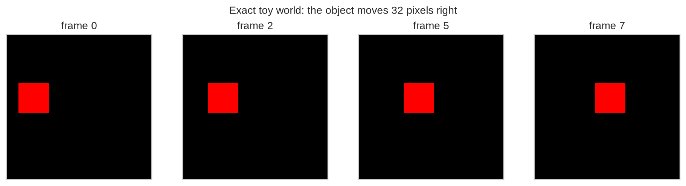
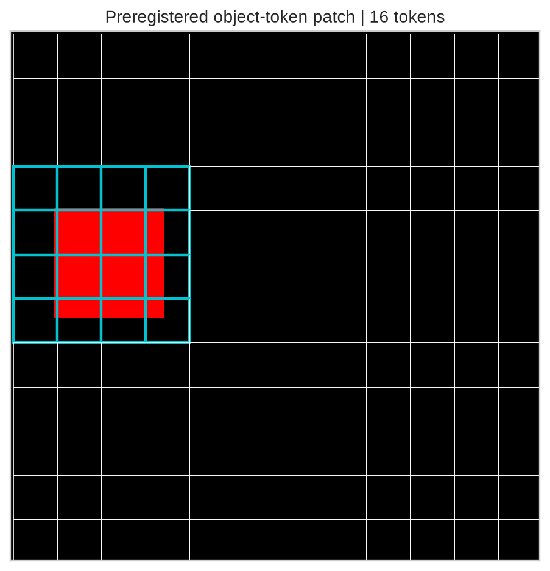
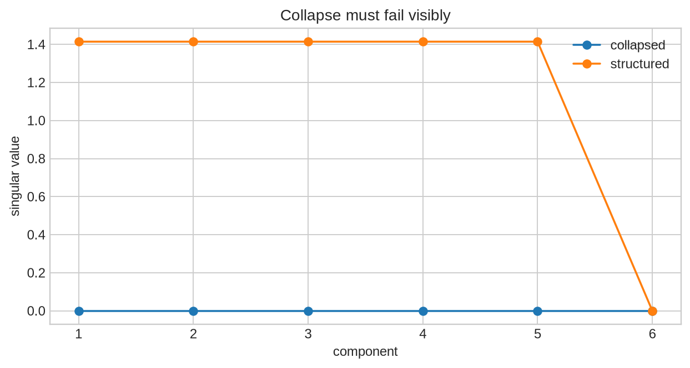
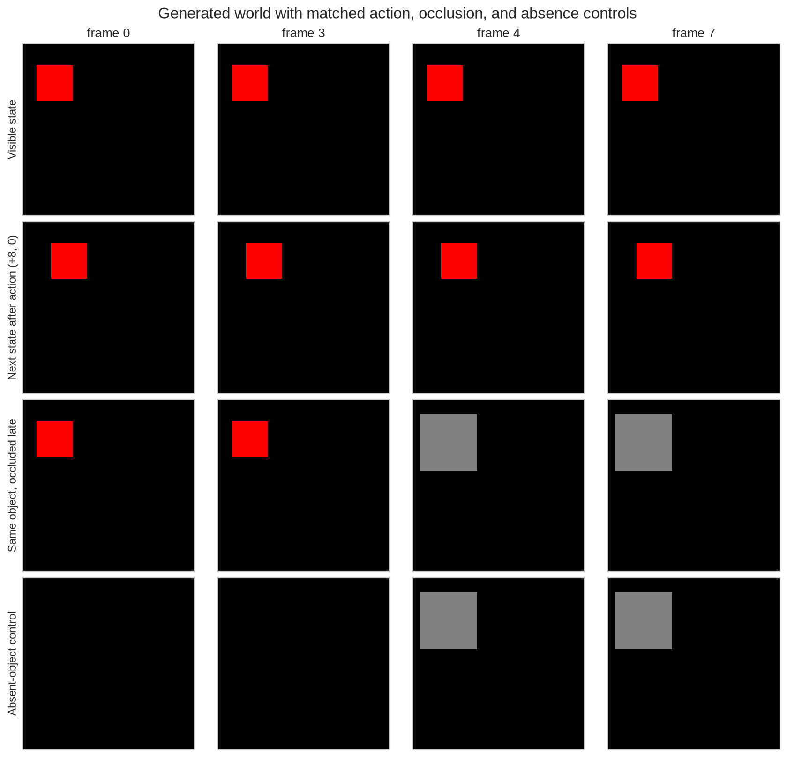
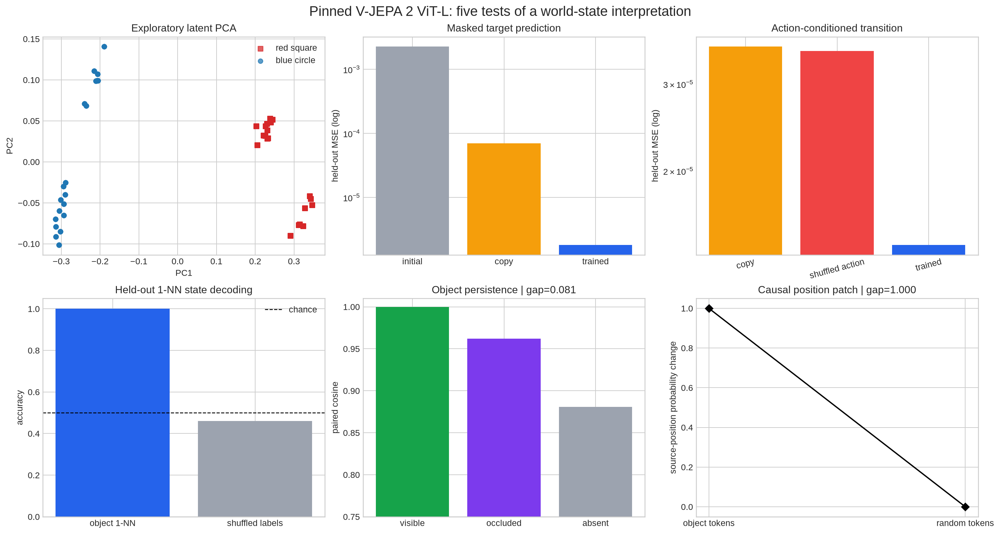

# [14.1] JEPA and World-Model Controls

> **Notebooks: [exercises](../../exercises/part1_jepa_world_model_controls/14.1_JEPA_and_World_Model_Controls_exercises.ipynb) | [solutions](../../exercises/part1_jepa_world_model_controls/14.1_JEPA_and_World_Model_Controls_solutions.ipynb)**

By the end of this notebook, you will have shown that frozen V-JEPA 2 latents on a controlled 200-video world carry usable state: they support masked-target prediction, held-out object and position probes, action-conditioned next-state prediction, identity through occlusion, and object-token interventions that beat same-size random patches.

## Core Question

When does a video latent deserve a **world-state** interpretation rather than the weaker statement “nearby clips have similar embeddings”? You will require five independent pieces of evidence:

> **predict -> decode -> transition -> persist -> intervene**

The same generated world supplies exact object, position, action, occlusion, and absence labels. That makes every claim falsifiable before we look at a real model.

```python
import json
import sys
from pathlib import Path

import matplotlib.pyplot as plt
import numpy as np
import pandas as pd
import torch as t
import torch.nn.functional as F
from IPython.display import display
from matplotlib.patches import Rectangle

GT_TIER = "GT-1"
EXERCISE_ID = "14_1_jepa_and_world_model_controls"
DIFFICULTY = 4
IMPORTANCE = 4
EXPECTED_RUNTIME = "90-120 minutes; about one minute for the live CUDA result"
REQUIRES_GPU = True

chapter = "chapter14_jepa_world_models"
section = "part1_jepa_world_model_controls"
root_dir = next(p for p in [Path.cwd(), *Path.cwd().parents] if (p / chapter).exists())
exercises_dir = root_dir / chapter / "exercises"
section_dir = exercises_dir / section
assets_dir = root_dir / chapter / "instructions" / "assets"

if str(root_dir) not in sys.path:
    sys.path.append(str(root_dir))
if str(exercises_dir) not in sys.path:
    sys.path.append(str(exercises_dir))

import part1_jepa_world_model_controls.solutions as reference
import part1_jepa_world_model_controls.tests as tests
from arena_ext.jepa_world_models import (
    CausalLatentPatchReport,
    CollapseDiagnosticsReport,
    LatentRolloutReport,
    ObjectPermanenceReport,
    WorldStateProbeReport,
)

plt.style.use("seaborn-v0_8-whitegrid")
```

## Learning Objectives

You will be able to:

- generate a deterministic video world with exact state and action labels;
- map an image-space object box to the model's 12 by 12 token grid;
- implement paired latent similarity and reject collapse;
- evaluate held-out state decoding against shuffled labels;
- evaluate an action-conditioned transition head against copy and shuffled-action controls;
- distinguish occluded-object persistence from an absent-object shortcut;
- test targeted latent-token patches against same-size random patches;
- state exactly what these generated-video results do and do not establish.

## Cold Open: Similarity Is Not Yet a World Model

Imagine that a visible red square, an occluded red square, and an empty scene all receive cosine similarity above `0.9`. Is that object permanence, or just background similarity?

Before running the model, predict which comparison is decisive:

1. visible versus occluded;
2. occluded versus absent;
3. visible versus itself.

The answer is **2**. A useful representation must preserve the hidden object *more than it preserves an otherwise matched scene where no object exists*.

## Part 1: Construct the Falsifiable World

### Exercise 1: Build a World With Exact State

        Implement a video generator for a red square or blue circle. The action `(dx, dy)` is integrated smoothly over eight frames; `occlude_late` and `absent` create matched counterfactuals.

        <details>
        <summary>Expected output</summary>

        ```text
        All tests in `test_make_world_video_ground_truth` passed!
        ```

        </details>

        <details>
        <summary>Help - getting started</summary>

        Build each frame in pixel space, draw the object at its interpolated position, optionally overwrite the late object region with gray, then normalize `[0, 1]` pixels to `[-1, 1]`.

        </details>

        <details>
        <summary>Common bugs</summary>

        - moving by `dx` every frame instead of over the full clip;
- drawing the object in the absent control;
- applying the occluder before the halfway point;
- returning channels last instead of `(frames, channels, height, width)`.

        </details>

        <details>
        <summary>Interpretation</summary>

        This is not synthetic filler: it is a finite world with exact object, position, action, occlusion, and absence ground truth. Later claims are scoped to this world.

        </details>

        <details>
        <summary>Solution</summary>

        ```python
        def make_world_video(
    object_kind: str,
    x: int,
    y: int,
    *,
    dx: int = 0,
    dy: int = 0,
    frames: int = 8,
    size: int = 96,
    occlude_late: bool = False,
    absent: bool = False,
) -> t.Tensor:
    """Create a deterministic video for one labeled object/action state."""

    yy, xx = t.meshgrid(t.arange(size), t.arange(size), indexing="ij")
    video_frames = []
    for frame_index in range(frames):
        image = t.zeros(3, size, size)
        if not absent:
            progress = frame_index / max(frames - 1, 1)
            x0 = int(x + dx * progress)
            y0 = int(y + dy * progress)
            if object_kind == "red_square":
                image[0, y0 : y0 + 20, x0 : x0 + 20] = 1.0
            elif object_kind == "blue_circle":
                center_x = x0 + 10
                center_y = y0 + 10
                mask = (xx - center_x).pow(2) + (yy - center_y).pow(2) <= 10**2
                image[2, mask] = 1.0
            else:
                raise ValueError(f"Unknown object kind: {object_kind}")
        if occlude_late and frame_index >= frames // 2:
            image[:, max(0, y - 4) : min(size, y + 28), max(0, x - 4) : min(size, x + 28)] = 0.5
        video_frames.append((image - 0.5) / 0.5)
    return t.stack(video_frames)
        ```

        </details>

```python
def make_world_video(
                object_kind: str,
                x: int,
                y: int,
                *,
                dx: int = 0,
                dy: int = 0,
                frames: int = 8,
                size: int = 96,
                occlude_late: bool = False,
                absent: bool = False,
            ) -> t.Tensor:
                """Return a normalized video with shape (frames, channels, height, width)."""
                # YOUR CODE HERE
                raise NotImplementedError()


tests.test_make_world_video_ground_truth(make_world_video)
```

```python
toy_video = make_world_video("red_square", 8, 32, dx=32, frames=8, size=96)
frame_slots = [0, 2, 5, 7]
fig, axes = plt.subplots(1, 4, figsize=(11, 2.8), constrained_layout=True)
for axis, frame_slot in zip(axes, frame_slots):
    rgb = ((toy_video[frame_slot].permute(1, 2, 0) + 1.0) / 2.0).clamp(0, 1)
    axis.imshow(rgb)
    axis.set_title(f"frame {frame_slot}")
    axis.set_xticks([]); axis.set_yticks([])
fig.suptitle("Exact toy world: the object moves 32 pixels right")
toy_video_path = assets_dir / "jepa_world_model_toy_video.png"
fig.savefig(toy_video_path, dpi=170, bbox_inches="tight")
plt.show()
```



### Exercise 2: Map Object Boxes to V-JEPA Tokens

        Implement the image-to-token geometry used by the causal intervention. Select every token whose cell center falls inside the padded object box.

        <details>
        <summary>Expected output</summary>

        ```text
        All tests in `test_bbox_to_vjepa_tokens_ground_truth` passed!
        ```

        </details>

        <details>
        <summary>Help - getting started</summary>

        A 96-pixel image and a 12-token grid give 8-pixel cells. Test cell centers, not top-left corners, against the padded box.

        </details>

        <details>
        <summary>Common bugs</summary>

        - transposing x and y;
- using row indices without flattening;
- selecting only the unpadded object interior;
- returning duplicate token indices.

        </details>

        <details>
        <summary>Interpretation</summary>

        The patch has a preregistered spatial target. Selecting tokens after observing the intervention would make the causal result circular.

        </details>

        <details>
        <summary>Solution</summary>

        ```python
        def bbox_to_vjepa_tokens(
    bbox: tuple[int, int, int, int],
    *,
    image_size: int = 96,
    token_grid: int = 12,
    pad: int = 4,
) -> list[int]:
    """Map an image-space object box to the corresponding 12x12 V-JEPA token grid."""

    x0, y0, x1, y1 = bbox
    cell = image_size / token_grid
    tokens = []
    for gy in range(token_grid):
        for gx in range(token_grid):
            cx = (gx + 0.5) * cell
            cy = (gy + 0.5) * cell
            if x0 - pad <= cx <= x1 + pad and y0 - pad <= cy <= y1 + pad:
                tokens.append(gy * token_grid + gx)
    return tokens or [token_grid * token_grid // 2]
        ```

        </details>

```python
def bbox_to_vjepa_tokens(
                bbox: tuple[int, int, int, int],
                *,
                image_size: int = 96,
                token_grid: int = 12,
                pad: int = 4,
            ) -> list[int]:
                """Map an image-space box to flattened token-grid indices."""
                # YOUR CODE HERE
                raise NotImplementedError()


tests.test_bbox_to_vjepa_tokens_ground_truth(bbox_to_vjepa_tokens)
```

```python
box = (8, 32, 28, 52)
selected_tokens = bbox_to_vjepa_tokens(box)
frame = ((toy_video[0].permute(1, 2, 0) + 1.0) / 2.0).clamp(0, 1)
fig, axis = plt.subplots(figsize=(5.4, 5.4), constrained_layout=True)
axis.imshow(frame)
for token in range(12 * 12):
    row, col = divmod(token, 12)
    color = "#00c2d1" if token in selected_tokens else "#ffffff"
    width = 1.8 if token in selected_tokens else 0.35
    axis.add_patch(Rectangle((col * 8, row * 8), 8, 8, fill=False, edgecolor=color, linewidth=width))
axis.set_title(f"Preregistered object-token patch | {len(selected_tokens)} tokens")
axis.set_xticks([]); axis.set_yticks([])
token_grid_path = assets_dir / "jepa_world_model_token_grid.png"
fig.savefig(token_grid_path, dpi=170, bbox_inches="tight")
plt.show()
```



### Exercise 3: Measure Paired Latent Similarity

        Implement row-wise cosine similarity. Pairing matters: each predicted latent is compared with its own target, not every target in the batch.

        <details>
        <summary>Expected output</summary>

        ```text
        All tests in `test_paired_cosine_toy_oracle` passed!
All tests in `test_paired_cosine_rejects_shape_mismatch` passed!
        ```

        </details>

        <details>
        <summary>Help - getting started</summary>

        Multiply paired rows, sum over the final dimension, and divide by the product of row norms. Reject shape mismatch before arithmetic.

        </details>

        <details>
        <summary>Common bugs</summary>

        - computing a full similarity matrix;
- allowing broadcasting;
- omitting the norm clamp;
- leaving integer inputs uncast.

        </details>

        <details>
        <summary>Interpretation</summary>

        Cosine measures direction but ignores scale. The live masked-prediction gate therefore also uses MSE and a copy baseline.

        </details>

        <details>
        <summary>Solution</summary>

        ```python
        def paired_cosine(left: t.Tensor, right: t.Tensor, *, eps: float = 1e-8) -> t.Tensor:
    """Return row-wise cosine similarities for two equally-shaped embedding batches."""

    if left.shape != right.shape:
        raise ValueError("left and right must have the same shape.")
    if left.ndim < 2:
        raise ValueError("left and right must have shape (..., d_model).")
    left_float = left.float()
    right_float = right.float()
    numerator = (left_float * right_float).sum(dim=-1)
    denominator = left_float.norm(dim=-1) * right_float.norm(dim=-1)
    return numerator / denominator.clamp_min(eps)
        ```

        </details>

```python
def paired_cosine(left: t.Tensor, right: t.Tensor, *, eps: float = 1e-8) -> t.Tensor:
                """Return one cosine similarity for each paired row."""
                # YOUR CODE HERE
                raise NotImplementedError()


tests.test_paired_cosine_toy_oracle(paired_cosine)
tests.test_paired_cosine_rejects_shape_mismatch(paired_cosine)
```

### Exercise 4: Reject Representation Collapse

        Implement a collapse diagnostic using feature variance and the entropy-based effective rank of the centered singular-value spectrum.

        <details>
        <summary>Expected output</summary>

        ```text
        All tests in `test_collapse_diagnostics_rejects_identical_features` passed!
        ```

        </details>

        <details>
        <summary>Help - getting started</summary>

        Flatten all non-example dimensions, center over examples, square singular values into a spectrum, normalize to probabilities, and exponentiate spectral entropy.

        </details>

        <details>
        <summary>Common bugs</summary>

        - measuring variance before converting to float;
- forgetting to center;
- using raw singular values instead of squared energy;
- allowing NaNs to pass.

        </details>

        <details>
        <summary>Interpretation</summary>

        A low prediction loss can be trivial if every target collapses to one vector. Non-collapse is necessary, though not sufficient, for world-state evidence.

        </details>

        <details>
        <summary>Solution</summary>

        ```python
        def collapse_diagnostics_report(
    features: t.Tensor,
    *,
    min_feature_std: float = 0.1,
    min_effective_rank: float = 3.0,
) -> CollapseDiagnosticsReport:
    """Check that a latent representation is finite and not collapsed to one direction."""

    if features.ndim < 2:
        raise ValueError("features must have at least example and feature dimensions.")
    flat = features.float().reshape(features.shape[0], -1)
    finite_features = bool(t.isfinite(flat).all().item())
    feature_std = flat.std().item()
    centered = flat - flat.mean(dim=0, keepdim=True)
    singular_values = t.linalg.svdvals(centered)
    spectrum = singular_values.pow(2)
    probabilities = spectrum / spectrum.sum().clamp_min(1e-12)
    entropy = -(probabilities * probabilities.clamp_min(1e-12).log()).sum()
    effective_rank = entropy.exp().item()
    return CollapseDiagnosticsReport(
        finite_features=finite_features,
        feature_std=feature_std,
        effective_rank=effective_rank,
        non_collapsed=(
            finite_features
            and feature_std >= min_feature_std
            and effective_rank >= min_effective_rank
        ),
    )
        ```

        </details>

```python
def collapse_diagnostics_report(
                features: t.Tensor,
                *,
                min_feature_std: float = 0.1,
                min_effective_rank: float = 3.0,
            ) -> CollapseDiagnosticsReport:
                """Measure finite variance and spectral effective rank."""
                # YOUR CODE HERE
                raise NotImplementedError()


tests.test_collapse_diagnostics_rejects_identical_features(collapse_diagnostics_report)
```

```python
structured = t.cat([t.eye(6), t.eye(6)], dim=0)
collapsed = t.ones_like(structured)
structured_report = collapse_diagnostics_report(structured, min_effective_rank=3.0)
collapsed_report = collapse_diagnostics_report(collapsed, min_effective_rank=3.0)
spectrum_rows = []
for name, values in [("structured", structured), ("collapsed", collapsed)]:
    singular = t.linalg.svdvals(values - values.mean(dim=0, keepdim=True))
    for index, value in enumerate(singular):
        spectrum_rows.append((name, index + 1, float(value)))
spectrum = pd.DataFrame(spectrum_rows, columns=["representation", "component", "singular_value"])
fig, axis = plt.subplots(figsize=(7.2, 3.8), constrained_layout=True)
for name, group in spectrum.groupby("representation"):
    axis.plot(group.component, group.singular_value, marker="o", label=name)
axis.set(xlabel="component", ylabel="singular value", title="Collapse must fail visibly")
axis.legend()
collapse_path = assets_dir / "jepa_world_model_collapse_control.png"
fig.savefig(collapse_path, dpi=170, bbox_inches="tight")
plt.show()
structured_report, collapsed_report
```



### Exercise 5: Grade Held-Out State Probes

        Implement the report that converts held-out probe logits into accuracy. The live probe is trained on 150 clips and evaluated on 50 held-out clips; shuffled labels are the matched control.

        <details>
        <summary>Expected output</summary>

        ```text
        All tests in `test_state_probe_report_rejects_shuffled_labels` passed!
        ```

        </details>

        <details>
        <summary>Help - getting started</summary>

        Take `argmax` over classes, flatten labels, check one label per row, then compare accuracy with the declared threshold.

        </details>

        <details>
        <summary>Common bugs</summary>

        - reporting training accuracy;
- fitting preprocessing on held-out rows;
- comparing logits directly to integer labels;
- accepting a score that survives label shuffling.

        </details>

        <details>
        <summary>Interpretation</summary>

        Probe success establishes decodability. It becomes stronger only when an intervention later moves the decoded state selectively.

        </details>

        <details>
        <summary>Solution</summary>

        ```python
        def world_state_probe_report(
    probe_logits: t.Tensor,
    labels: t.Tensor,
    *,
    min_accuracy: float = 0.9,
) -> WorldStateProbeReport:
    """Check whether a latent world-model state predicts held-out labels."""

    if probe_logits.ndim != 2:
        raise ValueError("probe_logits must have shape (examples, classes).")
    flattened_labels = labels.flatten().long()
    if flattened_labels.numel() != probe_logits.shape[0]:
        raise ValueError("labels must have one value per example.")

    predictions = probe_logits.argmax(dim=-1)
    accuracy = predictions.eq(flattened_labels).float().mean().item()
    return WorldStateProbeReport(
        accuracy=accuracy,
        predicts_state=accuracy >= min_accuracy,
    )
        ```

        </details>

```python
def world_state_probe_report(
                probe_logits: t.Tensor,
                labels: t.Tensor,
                *,
                min_accuracy: float = 0.9,
            ) -> WorldStateProbeReport:
                """Report held-out state-decoding accuracy."""
                # YOUR CODE HERE
                raise NotImplementedError()


tests.test_state_probe_report_rejects_shuffled_labels(world_state_probe_report)
```

### Exercise 6: Demand Action-Conditioned Prediction

        Implement a rollout gate. A learned transition only passes when its held-out loss beats both copying the current latent and supplying a shuffled action.

        <details>
        <summary>Expected output</summary>

        ```text
        All tests in `test_latent_rollout_report_rejects_copy_and_shuffled_controls` passed!
        ```

        </details>

        <details>
        <summary>Help - getting started</summary>

        Compute two independent ratios: trained loss over copy loss, and trained loss over shuffled-action loss. Both must pass.

        </details>

        <details>
        <summary>Common bugs</summary>

        - comparing training losses;
- using an easier shuffled batch;
- accepting improvement over copy but not shuffled action;
- hiding very small losses without a log scale.

        </details>

        <details>
        <summary>Interpretation</summary>

        If shuffling actions does not hurt, the predictor has learned temporal similarity rather than an action-conditioned transition.

        </details>

        <details>
        <summary>Solution</summary>

        ```python
        def latent_rollout_report(
    rollout_loss: float,
    copy_baseline_loss: float,
    shuffled_action_loss: float,
    *,
    max_rollout_to_copy: float = 0.8,
    max_rollout_to_shuffled: float = 0.8,
) -> LatentRolloutReport:
    """Check that an action-conditioned latent rollout beats copy and shuffled-action baselines."""

    rollout = float(rollout_loss)
    copy = float(copy_baseline_loss)
    shuffled = float(shuffled_action_loss)
    beats_copy = rollout <= copy * max_rollout_to_copy
    shuffled_fails = rollout <= shuffled * max_rollout_to_shuffled
    return LatentRolloutReport(
        rollout_loss=rollout,
        copy_baseline_loss=copy,
        shuffled_action_loss=shuffled,
        beats_copy_baseline=beats_copy,
        shuffled_action_fails=shuffled_fails,
        rollout_passes=beats_copy and shuffled_fails,
    )
        ```

        </details>

```python
def latent_rollout_report(
                rollout_loss: float,
                copy_baseline_loss: float,
                shuffled_action_loss: float,
                *,
                max_rollout_to_copy: float = 0.8,
                max_rollout_to_shuffled: float = 0.8,
            ) -> LatentRolloutReport:
                """Require an action-conditioned predictor to beat both controls."""
                # YOUR CODE HERE
                raise NotImplementedError()


tests.test_latent_rollout_report_rejects_copy_and_shuffled_controls(latent_rollout_report)
```

### Exercise 7: Separate Occlusion From Absence

        Implement the object-permanence gate. The occluded latent must remain similar to the visible latent and beat an otherwise matched absent-object video by a declared margin.

        <details>
        <summary>Expected output</summary>

        ```text
        All tests in `test_object_permanence_report_rejects_absent_and_different_object_controls` passed!
        ```

        </details>

        <details>
        <summary>Help - getting started</summary>

        Average each paired score family and require both an absolute occluded score and an occluded-minus-absent gap.

        </details>

        <details>
        <summary>Common bugs</summary>

        - checking visible versus occluded only;
- using an absent video with a different background;
- reporting a high score without its gap;
- treating different-object similarity as permanence.

        </details>

        <details>
        <summary>Interpretation</summary>

        The absent control is intentionally hard: V-JEPA latents are globally similar, so the claim rests on the *gap*, not on an impressive-looking cosine alone.

        </details>

        <details>
        <summary>Solution</summary>

        ```python
        def object_permanence_report(
    visible_scores: t.Tensor,
    occluded_scores: t.Tensor,
    absent_scores: t.Tensor,
    *,
    min_occluded_score: float = 0.6,
    min_absent_gap: float = 0.3,
) -> ObjectPermanenceReport:
    """Check whether occluded objects stay represented more than absent objects."""

    visible_mean = visible_scores.float().mean().item()
    occluded_mean = occluded_scores.float().mean().item()
    absent_mean = absent_scores.float().mean().item()
    occluded_absent_gap = occluded_mean - absent_mean
    preserves_occluded_object = (
        occluded_mean >= min_occluded_score
        and occluded_absent_gap >= min_absent_gap
    )
    return ObjectPermanenceReport(
        visible_mean=visible_mean,
        occluded_mean=occluded_mean,
        absent_mean=absent_mean,
        occluded_absent_gap=occluded_absent_gap,
        preserves_occluded_object=preserves_occluded_object,
    )
        ```

        </details>

```python
def object_permanence_report(
                visible_scores: t.Tensor,
                occluded_scores: t.Tensor,
                absent_scores: t.Tensor,
                *,
                min_occluded_score: float = 0.6,
                min_absent_gap: float = 0.3,
            ) -> ObjectPermanenceReport:
                """Require occluded-object evidence over an absent-object control."""
                # YOUR CODE HERE
                raise NotImplementedError()


tests.test_object_permanence_report_rejects_absent_and_different_object_controls(object_permanence_report)
```

### Exercise 8: Make the State Causal

        Implement the patch gate. Patching tokens from a right-position object into a left-position object should move a held-out position probe; the same number of random source and target tokens should not.

        <details>
        <summary>Expected output</summary>

        ```text
        All tests in `test_causal_latent_patch_report_rejects_random_control` passed!
        ```

        </details>

        <details>
        <summary>Help - getting started</summary>

        Average targeted and random effects, subtract to get the specificity gap, and require both a minimum targeted effect and minimum gap.

        </details>

        <details>
        <summary>Common bugs</summary>

        - comparing different patch sizes;
- selecting object tokens after seeing the effect;
- reporting only the targeted effect;
- patching the pooled latent instead of local tokens.

        </details>

        <details>
        <summary>Interpretation</summary>

        The intervention is narrow: it changes a position-probe readout of frozen latent tokens. It does not prove V-JEPA uses that state for planning or control.

        </details>

        <details>
        <summary>Solution</summary>

        ```python
        def causal_latent_patch_report(
    object_patch_effects: t.Tensor,
    random_patch_effects: t.Tensor,
    *,
    min_object_patch_effect: float = 0.2,
    min_patch_random_gap: float = 0.1,
) -> CausalLatentPatchReport:
    """Compare targeted latent-token patches against same-size random-token patches."""

    if object_patch_effects.numel() == 0 or random_patch_effects.numel() == 0:
        raise ValueError("patch effect tensors must be non-empty.")
    object_effect = object_patch_effects.float().mean().item()
    random_effect = random_patch_effects.float().mean().item()
    gap = object_effect - random_effect
    return CausalLatentPatchReport(
        object_patch_effect=object_effect,
        random_patch_effect=random_effect,
        patch_random_gap=gap,
        causal_patch_passes=(
            object_effect >= min_object_patch_effect and gap >= min_patch_random_gap
        ),
    )
        ```

        </details>

```python
def causal_latent_patch_report(
                object_patch_effects: t.Tensor,
                random_patch_effects: t.Tensor,
                *,
                min_object_patch_effect: float = 0.2,
                min_patch_random_gap: float = 0.1,
            ) -> CausalLatentPatchReport:
                """Compare targeted object-token patches with same-size random patches."""
                # YOUR CODE HERE
                raise NotImplementedError()


tests.test_causal_latent_patch_report_rejects_random_control(causal_latent_patch_report)
```

## Part 2: Run the Pinned V-JEPA 2 Experiment

The expensive plumbing below is deliberately shared: loading the pinned `facebook/vjepa2-vitl-fpc64-256` checkpoint, batching 800 video variants through CUDA, and training the small held-out heads. The experiment returns every learner-facing video, latent, label, baseline, and patch effect used in the figures.

The core reasoning remains visible: you wrote the world, token mapping, metrics, and control gates yourself.

```python
signature_result = reference.run_vjepa2_world_model_signature_result(max_vram_gb=24.0)
tests.validate_vjepa2_signature_visual_payload(signature_result)
print(
    signature_result["model_id"], "|",
    t.cuda.get_device_name(0), "| CUDA", t.version.cuda, "|",
    f"peak allocated VRAM {signature_result['peak_vram_gb']:.3f} GB",
)
```

<details>
<summary>Expected output</summary>

```text
All tests in `validate_vjepa2_signature_visual_payload` passed!
facebook/vjepa2-vitl-fpc64-256 | NVIDIA GeForce RTX 5090 Laptop GPU | CUDA 13.2 | peak allocated VRAM about 0.75 GB
```

</details>

<details>
<summary>Help - what remains hidden?</summary>

Only checkpoint loading, batched feature extraction, and repetitive training loops. The inputs, labels, learned-latent outputs, baselines, and interventions are returned and visualized below.

</details>

## Signature Result: See the World, Then Test the Latent

First inspect the actual finite world. Each row uses the same initial red-square state. The next-state row moves right by the declared action; the occluded row hides an existing object; the absent row shows the same occluder with no object behind it.

```python
def video_frames_to_rgb(frames: t.Tensor) -> t.Tensor:
    return ((frames.permute(0, 2, 3, 1).float() + 1.0) / 2.0).clamp(0, 1)

display_case = signature_result["visual_payload"]["cases"][0]
conditions = [
    ("visible_frames", "Visible state"),
    ("next_frames", "Next state after action (+8, 0)"),
    ("occluded_frames", "Same object, occluded late"),
    ("absent_frames", "Absent-object control"),
]
fig, axes = plt.subplots(4, 4, figsize=(10.5, 10), constrained_layout=True)
for row, (key, label) in enumerate(conditions):
    frames = video_frames_to_rgb(display_case[key])
    for col, (frame_index, frame) in enumerate(zip(display_case["frame_indices"], frames)):
        axes[row, col].imshow(frame)
        axes[row, col].set_xticks([]); axes[row, col].set_yticks([])
        if row == 0:
            axes[row, col].set_title(f"frame {frame_index}")
        if col == 0:
            axes[row, col].set_ylabel(label, fontsize=11)
fig.suptitle("Generated world with matched action, occlusion, and absence controls", fontsize=15)
live_video_path = assets_dir / "jepa_world_model_live_video_strip.png"
fig.savefig(live_video_path, dpi=160, bbox_inches="tight")
plt.show()
```



```python
payload = signature_result["visual_payload"]
features = payload["pooled_features"].float()
centered = features - features.mean(dim=0, keepdim=True)
t.manual_seed(0)
_, _, components = t.pca_lowrank(centered, q=2, center=False, niter=4)
coordinates = centered @ components

permanence = signature_result["object_permanence"]
evidence_table = pd.DataFrame(
    [
        ("masked prediction", signature_result["masked_prediction_final_loss"], signature_result["masked_prediction_copy_baseline_loss"], "lower is better"),
        ("action rollout", signature_result["latent_rollout_final_loss"], signature_result["latent_rollout_shuffled_action_loss"], "lower is better"),
        ("object 1-NN", signature_result["state_probe_knn_accuracy"], signature_result["state_probe_shuffled_knn_accuracy"], "higher is better"),
        ("occlusion", permanence["occluded_mean"], permanence["absent_mean"], "higher is better"),
        ("token patch", signature_result["causal_latent_patching"]["object_patch_effect"], signature_result["causal_latent_patching"]["random_patch_effect"], "higher is better"),
    ],
    columns=["claim", "target", "matched control", "direction"],
)
display(evidence_table.style.format({"target": "{:.6f}", "matched control": "{:.6f}"}))

fig, axes = plt.subplots(2, 3, figsize=(16, 8.5), constrained_layout=True)
labels = payload["labels"]
for label, name, color, marker in [(0, "red square", "#d62728", "s"), (1, "blue circle", "#1f77b4", "o")]:
    selected = labels == label
    axes[0, 0].scatter(coordinates[selected, 0], coordinates[selected, 1], s=28, alpha=0.72, label=name, color=color, marker=marker)
axes[0, 0].set(title="Exploratory latent PCA", xlabel="PC1", ylabel="PC2")
axes[0, 0].legend()

masked_values = [
    signature_result["masked_prediction"]["initial_loss"],
    signature_result["masked_prediction_copy_baseline_loss"],
    signature_result["masked_prediction_final_loss"],
]
axes[0, 1].bar(["initial", "copy", "trained"], masked_values, color=["#9ca3af", "#f59e0b", "#2563eb"])
axes[0, 1].set_yscale("log")
axes[0, 1].set(title="Masked target prediction", ylabel="held-out MSE (log)")

rollout_values = [
    signature_result["latent_rollout_copy_baseline_loss"],
    signature_result["latent_rollout_shuffled_action_loss"],
    signature_result["latent_rollout_final_loss"],
]
axes[0, 2].bar(["copy", "shuffled action", "trained"], rollout_values, color=["#f59e0b", "#ef4444", "#2563eb"])
axes[0, 2].set_yscale("log")
axes[0, 2].tick_params(axis="x", rotation=15)
axes[0, 2].set(title="Action-conditioned transition", ylabel="held-out MSE (log)")

probe_values = [signature_result["state_probe_knn_accuracy"], signature_result["state_probe_shuffled_knn_accuracy"]]
axes[1, 0].bar(["object 1-NN", "shuffled labels"], probe_values, color=["#2563eb", "#9ca3af"])
axes[1, 0].axhline(0.5, color="black", linestyle="--", linewidth=1, label="chance")
axes[1, 0].set_ylim(0, 1.05)
axes[1, 0].set(title="Held-out 1-NN state decoding", ylabel="accuracy")
axes[1, 0].legend()

axes[1, 1].bar(
    ["visible", "occluded", "absent"],
    [permanence["visible_mean"], permanence["occluded_mean"], permanence["absent_mean"]],
    color=["#16a34a", "#7c3aed", "#9ca3af"],
)
axes[1, 1].set_ylim(0.75, 1.01)
axes[1, 1].set(title=f"Object persistence | gap={permanence['occluded_absent_gap']:.3f}", ylabel="paired cosine")

object_effects = payload["object_patch_effects"].numpy()
random_effects = payload["random_patch_effects"].numpy()
axes[1, 2].scatter(np.zeros_like(object_effects), object_effects, color="#2563eb", alpha=0.7, label="object tokens")
axes[1, 2].scatter(np.ones_like(random_effects), random_effects, color="#9ca3af", alpha=0.7, label="same-size random")
axes[1, 2].plot([0, 1], [object_effects.mean(), random_effects.mean()], color="black", marker="D", linewidth=1.5)
axes[1, 2].set_xticks([0, 1], ["object tokens", "random tokens"])
axes[1, 2].set(title=f"Causal position patch | gap={object_effects.mean() - random_effects.mean():.3f}", ylabel="source-position probability change")

fig.suptitle("Pinned V-JEPA 2 ViT-L: five tests of a world-state interpretation", fontsize=16)
live_signature_path = assets_dir / "jepa_world_model_live_signature.png"
fig.savefig(live_signature_path, dpi=180, bbox_inches="tight")
plt.show()
```



<details>
<summary>Interpretation</summary>

The five panels answer different failure modes. PCA is exploratory only. Held-out probes reject non-decoding; copy and shuffled-action losses reject static similarity; the absent video rejects occluder/background shortcuts; and the same-size random patch rejects generic token corruption. The targeted patch is the causal evidence, but only for a position-probe readout in this controlled world.

</details>

## Try It Yourself

Change `play_case`, `play_condition`, `play_frame_slot`, or `play_pad`. The cell redraws a real input from the CUDA run and overlays the exact tokens your patch rule would select. A useful perturbation is to increase `play_pad` until background tokens dominate; the patch result should then be treated as less specific.

```python
play_case = "blue_circle_right"  # red_square_right | blue_circle_right
play_condition = "occluded_frames"  # visible_frames | next_frames | occluded_frames | absent_frames
play_frame_slot = 3  # 0..3 indexes the retained frames [0, 3, 4, 7]
play_pad = 4

case = next(item for item in payload["cases"] if item["case_id"] == play_case)
bbox = tuple(case["bbox"])
if play_condition == "next_frames":
    dx, dy = case["action"]
    bbox = (bbox[0] + dx, bbox[1] + dy, bbox[2] + dx, bbox[3] + dy)
play_tokens = bbox_to_vjepa_tokens(bbox, pad=play_pad)
frame = video_frames_to_rgb(case[play_condition])[play_frame_slot]
fig, axis = plt.subplots(figsize=(5.8, 5.8), constrained_layout=True)
axis.imshow(frame)
for token in play_tokens:
    row, col = divmod(token, 12)
    axis.add_patch(Rectangle((col * 8, row * 8), 8, 8, fill=False, edgecolor="#00c2d1", linewidth=1.8))
axis.set_title(f"{play_case} | {play_condition} | frame {case['frame_indices'][play_frame_slot]} | {len(play_tokens)} tokens")
axis.set_xticks([]); axis.set_yticks([])
plt.show()
```

## Bonus: Hunt an Anomaly

Find a case where one piece of evidence succeeds and another fails:

- an occluded clip with high cosine but a small occluded-minus-absent gap;
- a position probe that decodes well but cannot be moved by object-token patching;
- a transition predictor that beats copy but not shuffled actions;
- a large token padding that makes random/background patches competitive;
- a PCA view that looks separated while shuffled-label held-out accuracy remains near chance.

Report which claim survives. Do not average incompatible failures into one “world-model score.”

## Limitations: What this does not show

This section supports a scoped claim about frozen V-JEPA 2 ViT-L latents on deterministic generated shape videos. It does **not** establish planning, reward prediction, real-video object permanence, V-JEPA fine-tuning, V-JEPA 2-AC action tokens, dense V-JEPA 2.1 features, or superiority to VideoMAE, DINO, CLIP, diffusion, or autoregressive world models. The transition head is trained on frozen features; V-JEPA itself is not retrained here.

## Reading

- Meta FAIR, **V-JEPA 2** model and paper materials.
- Assran et al., **V-JEPA: Latent Feature Prediction for Self-Supervised Learning in Video**.
- Li et al., **Emergent World Representations: Exploring a Sequence Model Trained on a Synthetic Task**.

## Verification Appendix

```python
def run_smoke_test(cpu: bool = True) -> dict:
    return reference.run_smoke_test(cpu=cpu)


def run_gpu_test(max_vram_gb: float = 24.0) -> dict:
    assert signature_result["peak_vram_gb"] <= max_vram_gb
    return signature_result


def run_full_experiment(max_vram_gb: float = 24.0) -> dict:
    return run_gpu_test(max_vram_gb=max_vram_gb)


tests.test_notebook_contract(run_smoke_test)
tests.test_committed_verification_report_vjepa_world_controls()
tests.test_exercise_notebook_declares_full_verification_contract()
print("Live V-JEPA 2 evidence and the committed CUDA report both passed.")
```

<details>
<summary>Expected output</summary>

```text
All tests in `test_notebook_contract` passed!
All tests in `test_committed_verification_report_vjepa_world_controls` passed!
All tests in `test_exercise_notebook_declares_full_verification_contract` passed!
Live V-JEPA 2 evidence and the committed CUDA report both passed.
```

</details>
