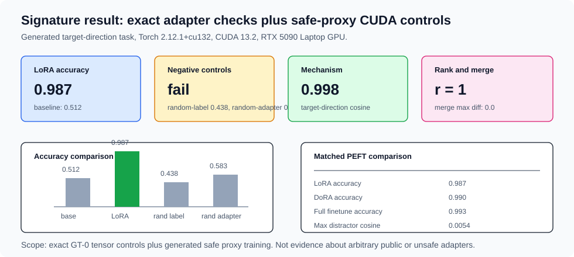

# [15.1] LoRA, DoRA, and Adapter Controls

> **Notebooks: [exercises](../../exercises/part1_lora_dora_adapter_controls/15.1_LoRA_DoRA_and_Adapter_Controls_exercises.ipynb) | [solutions](../../exercises/part1_lora_dora_adapter_controls/15.1_LoRA_DoRA_and_Adapter_Controls_solutions.ipynb)**

> **Local-first extension.** This section introduces PEFT interpretability with
> exact GT-0 tensor checks, then reads a CUDA report that trains a generated
> safe proxy LoRA/DoRA/full-finetune comparison. The evidence here is not a
> claim about public unsafe adapters; it is a controlled adapter-mechanics
> lesson.

```python
GT_TIER = "GT-0"
EXERCISE_ID = "15_1_lora_dora_and_adapter_controls"
DIFFICULTY = 4
IMPORTANCE = 4
EXPECTED_RUNTIME = "45-60 minutes for exercises; under a minute for live CUDA report regeneration on an RTX 5090 Laptop GPU"
REQUIRES_GPU = True  # visible tensor checks are CPU-friendly; the committed report is CUDA-backed
```

Please send any problems / bugs on the `#errata` channel in the
[Slack group](https://info-arena.github.io/ARENA_img/slack.html), and ask any
questions on the dedicated channels for this chapter of material.

If you want to change to dark mode, you can do this by clicking the three
horizontal lines in the top-right, then navigating to Settings -> Theme.

Links to earlier chapters: [(0) Fundamentals](https://arena-chapter0-fundamentals.streamlit.app/),
[(1) Transformer Interpretability](https://arena-chapter1-transformer-interp.streamlit.app/),
[(2) RL](https://arena-chapter2-rl.streamlit.app/),
[(3) LLM Evaluations](https://arena-chapter3-llm-evals.streamlit.app/),
[(4) Alignment Science](https://arena-chapter4-alignment-science.streamlit.app/).

## Core Question

When a small adapter changes a frozen model, what evidence tells you whether
the mechanism changed in the intended way?

The answer is not "task accuracy went up". In this notebook, you will build a
minimal PEFT audit loop:

1. compute the exact LoRA update and prove its rank bound,
2. check merged and unmerged logits agree,
3. recompose a DoRA weight while preserving learned row magnitudes,
4. measure whether the update projects onto a monitored direction,
5. reject adapters whose task accuracy improves while the measured mechanism
   degrades, and
6. inspect a CUDA report with random-label and same-norm random-adapter
   controls.

The notebook uses toy matrices for the visible exercises because those are the
only place where every number can be inspected by hand. The CUDA report then
trains a generated Gaussian binary-classification proxy where the correct
mechanism is known: feature 0 is the planted target direction and the frozen
baseline follows feature 1. This gives real adapter training evidence without
training or distributing unsafe adapters.

## Learning Objectives

By the end of this notebook, you should be able to:

1. compute `delta_W = (alpha / rank) * (B @ A)` for LoRA factors,
2. explain why `rank(delta_W) <= rank`,
3. test merge/unmerge parity for a LoRA adapter,
4. recompose DoRA weights and check target row norms,
5. quantify projection onto a monitored target/protected direction,
6. combine task accuracy and mechanism preservation into one acceptance gate,
7. read a CUDA adapter-control report without overstating its claim scope.


This loop is intentionally narrow. LoRA, DoRA, and full finetuning are useful
only after you can connect a metric improvement to a checked weight-space or
direction-space mechanism.

# Setup

```python
import json
import sys
from dataclasses import dataclass
from pathlib import Path

import torch as t

chapter = "chapter15_peft_misalignment"
section = "part1_lora_dora_adapter_controls"
root_dir = next(p for p in [Path.cwd(), *Path.cwd().parents] if (p / chapter).exists())
exercises_dir = root_dir / chapter / "exercises"
section_dir = exercises_dir / section

if str(root_dir) not in sys.path:
    sys.path.append(str(root_dir))
if str(exercises_dir) not in sys.path:
    sys.path.append(str(exercises_dir))

import part1_lora_dora_adapter_controls.tests as tests
```

We will pass around four tiny report objects. They are deliberately simple:
each one exposes the metric that made the adapter pass or fail.

```python
@dataclass(frozen=True)
class AdapterDeltaReport:
    rank: int
    alpha: float
    update_norm: float
    nonzero_update: bool


@dataclass(frozen=True)
class DoRAWeightReport:
    target_norms: t.Tensor
    row_norms: t.Tensor
    max_norm_error: float
    norm_preserved: bool


@dataclass(frozen=True)
class IntruderDimensionReport:
    projection_fraction: float
    intruder_detected: bool


@dataclass(frozen=True)
class AdapterMechanismReport:
    accuracy_delta: float
    mechanism_delta: float
    accuracy_improved: bool
    mechanism_preserved: bool
    adapter_acceptable: bool
```

# LoRA Deltas

LoRA represents a weight update as two small matrices. If `A` has shape
`(rank, in_features)` and `B` has shape `(out_features, rank)`, then `B @ A`
has the same shape as the frozen weight matrix.

### Exercise - compute the low-rank adapter update

> Difficulty: easy
> Importance: high
>
> You should spend up to 5 minutes on this exercise.

Implement the update directly. Check shapes before multiplying, because a
transposed implementation can silently produce a tensor with the wrong meaning.

```python
def lora_delta(lora_a: t.Tensor, lora_b: t.Tensor, *, alpha: float = 1.0) -> t.Tensor:
    raise NotImplementedError()


tests.test_lora_delta_uses_scaled_b_matrix_times_a_matrix(lora_delta)
```

<details>
<summary>Expected output</summary>

```text
All tests in `test_lora_delta_uses_scaled_b_matrix_times_a_matrix` passed!
```

For the one-rank fixture, `A = [[1, 2]]`, `B = [[3], [4]]`, and `alpha = 2`.
The exact visible update is:

```text
[[6.0, 12.0],
 [8.0, 16.0]]
```

</details>

<details>
<summary>Help - why is the product B @ A?</summary>

The frozen weight maps an input vector of size `in_features` to an output
vector of size `out_features`. The LoRA update must have the same shape:
`(out_features, in_features)`. Multiplying `B @ A` contracts over the rank
dimension and gives that shape.

</details>

<details>
<summary>Common bugs</summary>

- Using `A @ B`, which gives a rank-space matrix or a shape error.
- Forgetting the `alpha / rank` scaling.
- Accepting vectors instead of matrices, which makes shape mistakes harder to
  diagnose.

</details>

<details>
<summary>Solution</summary>

```python
def lora_delta(lora_a: t.Tensor, lora_b: t.Tensor, *, alpha: float = 1.0) -> t.Tensor:
    if lora_a.ndim != 2 or lora_b.ndim != 2:
        raise ValueError("lora_a and lora_b must both be matrices.")
    rank = lora_a.shape[0]
    if rank == 0:
        raise ValueError("LoRA rank must be positive.")
    if lora_b.shape[1] != rank:
        raise ValueError("lora_b second dimension must match LoRA rank.")
    return (alpha / rank) * (lora_b.float() @ lora_a.float())
```

</details>

### Exercise - summarize rank, norm, and SVD spectrum

> Difficulty: medium
> Importance: high
>
> You should spend up to 10 minutes on this exercise.

A PEFT artifact should expose enough metadata to catch a zero update and enough
linear algebra to catch an impossible rank claim. Implement the report, then
inspect the singular values of a rank-2 update.

```python
def adapter_delta_report(
    lora_a: t.Tensor,
    lora_b: t.Tensor,
    *,
    alpha: float = 1.0,
    min_update_norm: float = 1e-6,
) -> AdapterDeltaReport:
    raise NotImplementedError()


tests.test_adapter_delta_report_records_rank_alpha_and_nonzero_update(adapter_delta_report)
tests.test_lora_delta_rank_bound_and_svd_spectrum(lora_delta)
```

<details>
<summary>Expected output</summary>

```text
All tests in `test_adapter_delta_report_records_rank_alpha_and_nonzero_update` passed!
All tests in `test_lora_delta_rank_bound_and_svd_spectrum` passed!
```

The rank-2 fixture has only two non-negligible singular values even though the
matrix is `4 x 3`. A degenerate factor fixture has declared rank 2 but
numerical rank 1, which is allowed; the rank can go down, not up.

</details>

<details>
<summary>Help - what should the SVD prove?</summary>

`B @ A` is a product through a rank-sized bottleneck. Its numerical rank cannot
exceed the LoRA rank. The SVD is a useful sanity check because it shows whether
the learned update is really using the available rank or has collapsed to a
lower-dimensional direction.

</details>

<details>
<summary>Common bugs</summary>

- Checking only the declared rank and never checking that the update is
  nonzero.
- Treating a collapsed numerical rank as a failure. It may be a useful result:
  the adapter only needed one direction.
- Computing the rank on `A` or `B` rather than on the actual weight update.

</details>

<details>
<summary>Solution</summary>

```python
def adapter_delta_report(
    lora_a: t.Tensor,
    lora_b: t.Tensor,
    *,
    alpha: float = 1.0,
    min_update_norm: float = 1e-6,
) -> AdapterDeltaReport:
    delta = lora_delta(lora_a, lora_b, alpha=alpha)
    update_norm = float(delta.norm().item())
    return AdapterDeltaReport(
        rank=lora_a.shape[0],
        alpha=alpha,
        update_norm=update_norm,
        nonzero_update=update_norm >= min_update_norm,
    )
```

</details>

### Exercise - test merge and unmerge parity

> Difficulty: medium
> Importance: high
>
> You should spend up to 10 minutes on this exercise.

LoRA can be evaluated as a separate adapter path or merged into the frozen
weight. These two paths should produce the same logits up to numerical
precision.

```python
def lora_merge_max_abs_diff(
    inputs: t.Tensor,
    base_weight: t.Tensor,
    lora_a: t.Tensor,
    lora_b: t.Tensor,
    *,
    alpha: float = 1.0,
) -> float:
    raise NotImplementedError()


tests.test_lora_merge_unmerge_parity_is_independent_of_report(lora_merge_max_abs_diff)
```

<details>
<summary>Expected output</summary>

```text
All tests in `test_lora_merge_unmerge_parity_is_independent_of_report` passed!
```

The deterministic fixture should report a maximum absolute logit difference
below `1e-6`.

</details>

<details>
<summary>Help - what are the two paths?</summary>

The unmerged path is:

```python
base_logits = inputs @ base_weight.T
adapter_logits = inputs @ delta_W.T
```

The merged path is:

```python
merged_logits = inputs @ (base_weight + delta_W).T
```

These should agree because matrix multiplication distributes over addition.

</details>

<details>
<summary>Common bugs</summary>

- Adding `delta_W` to `inputs` instead of to the weight matrix.
- Using `A @ B` in the adapter path but `B @ A` in the merged path.
- Mutating `base_weight` in-place, which makes repeated checks meaningless.

</details>

<details>
<summary>Solution</summary>

```python
def lora_merge_max_abs_diff(
    inputs: t.Tensor,
    base_weight: t.Tensor,
    lora_a: t.Tensor,
    lora_b: t.Tensor,
    *,
    alpha: float = 1.0,
) -> float:
    delta = lora_delta(lora_a, lora_b, alpha=alpha)
    unmerged_logits = inputs.float() @ base_weight.float().T + inputs.float() @ delta.T
    merged_logits = inputs.float() @ (base_weight.float() + delta).T
    return float((unmerged_logits - merged_logits).abs().max().item())
```

</details>

# DoRA Magnitude Controls

DoRA separates direction from magnitude. Instead of only adding a low-rank
delta, it normalizes the updated row direction and applies learned row
magnitudes.

### Exercise - preserve learned row magnitudes

> Difficulty: medium
> Importance: high
>
> You should spend up to 10 minutes on this exercise.

Recompose each row by normalizing the updated direction and multiplying by its
target magnitude. The tests include both a zero-delta case and a nonzero-delta
case, because the zero-delta case is too easy to pass accidentally.

```python
def dora_recompose_weight(
    base_weight: t.Tensor,
    adapter_delta: t.Tensor,
    magnitude: t.Tensor,
    *,
    eps: float = 1e-8,
) -> t.Tensor:
    raise NotImplementedError()


def dora_weight_report(
    base_weight: t.Tensor,
    adapter_delta: t.Tensor,
    magnitude: t.Tensor,
    *,
    max_allowed_norm_error: float = 1e-5,
) -> DoRAWeightReport:
    raise NotImplementedError()


tests.test_dora_recompose_weight_preserves_target_row_magnitudes(
    dora_recompose_weight,
    dora_weight_report,
)
tests.test_dora_recomposition_handles_nonzero_delta_direction(dora_recompose_weight)
```

<details>
<summary>Expected output</summary>

```text
All tests in `test_dora_recompose_weight_preserves_target_row_magnitudes` passed!
All tests in `test_dora_recomposition_handles_nonzero_delta_direction` passed!
```

The visible zero-delta fixture returns row norms `[10.0, 5.0]`. The nonzero
fixture preserves the target row norms while keeping the recomposed row aligned
with `base_weight + adapter_delta`.

</details>

<details>
<summary>Help - why normalize before applying magnitude?</summary>

The direction encodes where the row points; the magnitude encodes how large the
row should be. If you multiply the raw direction by the learned magnitude, the
old row norm leaks back in and the target magnitude is no longer respected.

</details>

<details>
<summary>Common bugs</summary>

- Multiplying the unnormalized direction by `magnitude`.
- Normalizing across the whole matrix instead of row-by-row.
- Forgetting to guard against zero-norm rows with `eps`.

</details>

<details>
<summary>Solution</summary>

```python
def dora_recompose_weight(
    base_weight: t.Tensor,
    adapter_delta: t.Tensor,
    magnitude: t.Tensor,
    *,
    eps: float = 1e-8,
) -> t.Tensor:
    if base_weight.shape != adapter_delta.shape:
        raise ValueError("base_weight and adapter_delta must match.")
    if magnitude.ndim != 1 or magnitude.shape[0] != base_weight.shape[0]:
        raise ValueError("magnitude must have shape (out_features,).")
    direction = base_weight.float() + adapter_delta.float()
    unit_direction = direction / direction.norm(dim=-1, keepdim=True).clamp_min(eps)
    return unit_direction * magnitude.float().unsqueeze(-1)


def dora_weight_report(
    base_weight: t.Tensor,
    adapter_delta: t.Tensor,
    magnitude: t.Tensor,
    *,
    max_allowed_norm_error: float = 1e-5,
) -> DoRAWeightReport:
    recomposed = dora_recompose_weight(base_weight, adapter_delta, magnitude)
    row_norms = recomposed.norm(dim=-1)
    target_norms = magnitude.float()
    max_norm_error = float((row_norms - target_norms).abs().max().item())
    return DoRAWeightReport(
        target_norms=target_norms,
        row_norms=row_norms,
        max_norm_error=max_norm_error,
        norm_preserved=max_norm_error <= max_allowed_norm_error,
    )
```

</details>

# Direction and Mechanism Controls

The next two exercises move from "the tensor math is correct" to "the adapter
changed the model in the intended direction".

### Exercise - flag projection onto a monitored direction

> Difficulty: medium
> Importance: high
>
> You should spend up to 10 minutes on this exercise.

If an adapter update moves strongly in a monitored direction, it needs a closer
audit before deployment. Compute the fraction of the update norm that lies in
the monitored direction.

```python
def intruder_dimension_report(
    adapter_delta: t.Tensor,
    protected_direction: t.Tensor,
    *,
    max_projection_fraction: float = 0.2,
) -> IntruderDimensionReport:
    raise NotImplementedError()


tests.test_intruder_dimension_report_measures_projection_fraction(intruder_dimension_report)
```

<details>
<summary>Expected output</summary>

```text
All tests in `test_intruder_dimension_report_measures_projection_fraction` passed!
```

The controlled positive fixture has projection fraction `1.0`. An orthogonal
direction is the negative control and should not be flagged.

</details>

<details>
<summary>Help - why use projection norm instead of signed projection?</summary>

A large negative projection is still a large movement along the monitored
axis. If the question is "did the adapter move along this direction?", the sign
is secondary; the projection norm is the safer diagnostic.

</details>

<details>
<summary>Common bugs</summary>

- Comparing a signed projection and missing large negative movement.
- Forgetting to normalize the monitored direction.
- Dividing by the number of output rows instead of by the adapter update norm.

</details>

<details>
<summary>Solution</summary>

```python
def intruder_dimension_report(
    adapter_delta: t.Tensor,
    protected_direction: t.Tensor,
    *,
    max_projection_fraction: float = 0.2,
) -> IntruderDimensionReport:
    if adapter_delta.ndim != 2:
        raise ValueError("adapter_delta must have shape (out_features, in_features).")
    if protected_direction.ndim != 1:
        raise ValueError("protected_direction must have shape (in_features,).")
    if adapter_delta.shape[-1] != protected_direction.shape[0]:
        raise ValueError("adapter and protected direction dimensions must match.")
    direction = protected_direction.float()
    direction = direction / direction.norm().clamp_min(1e-8)
    projected = adapter_delta.float() @ direction
    adapter_norm = float(adapter_delta.float().norm().clamp_min(1e-8).item())
    projection_fraction = float(projected.norm().item() / adapter_norm)
    return IntruderDimensionReport(
        projection_fraction=projection_fraction,
        intruder_detected=projection_fraction > max_projection_fraction,
    )
```

</details>

### Exercise - require accuracy and mechanism preservation

> Difficulty: medium
> Importance: high
>
> You should spend up to 10 minutes on this exercise.

An adapter that improves a task metric while destroying the measured mechanism
is not a mechanistic success. Implement a report that requires both gates.

```python
def adapter_mechanism_report(
    *,
    adapter_accuracy: float,
    baseline_accuracy: float,
    adapter_mechanism_score: float,
    baseline_mechanism_score: float,
    min_accuracy_gain: float = 0.05,
    min_mechanism_delta: float = -0.02,
) -> AdapterMechanismReport:
    raise NotImplementedError()


tests.test_adapter_mechanism_report_requires_accuracy_and_mechanism(adapter_mechanism_report)
```

<details>
<summary>Expected output</summary>

```text
All tests in `test_adapter_mechanism_report_requires_accuracy_and_mechanism` passed!
```

The positive fixture improves accuracy by `0.2` and improves the mechanism
score by `0.05`. The negative fixture keeps high accuracy but damages the
mechanism score and must fail.

</details>

<details>
<summary>Help - what is a mechanism score here?</summary>

In the visible toy exercise it is just a scalar. In the CUDA proxy report it is
the cosine between the learned decision direction and the planted target
direction. The important habit is the same: name the mechanism metric before
you use task accuracy as evidence.

</details>

<details>
<summary>Common bugs</summary>

- Accepting the adapter on task accuracy alone.
- Using absolute mechanism score but forgetting to compare it to the baseline.
- Requiring mechanism improvement when the intended gate is "do not degrade by
  more than this tolerance".

</details>

<details>
<summary>Solution</summary>

```python
def adapter_mechanism_report(
    *,
    adapter_accuracy: float,
    baseline_accuracy: float,
    adapter_mechanism_score: float,
    baseline_mechanism_score: float,
    min_accuracy_gain: float = 0.05,
    min_mechanism_delta: float = -0.02,
) -> AdapterMechanismReport:
    accuracy_delta = adapter_accuracy - baseline_accuracy
    mechanism_delta = adapter_mechanism_score - baseline_mechanism_score
    accuracy_improved = accuracy_delta >= min_accuracy_gain
    mechanism_preserved = mechanism_delta >= min_mechanism_delta
    return AdapterMechanismReport(
        accuracy_delta=accuracy_delta,
        mechanism_delta=mechanism_delta,
        accuracy_improved=accuracy_improved,
        mechanism_preserved=mechanism_preserved,
        adapter_acceptable=accuracy_improved and mechanism_preserved,
    )
```

</details>

# Notebook Contract

The visible contract is small, exact, and serializable. It gives the notebook,
tests, and report runner the same core checks.

### Exercise - expose the visible smoke-test contract

> Difficulty: easy
> Importance: medium
>
> You should spend up to 5 minutes on this exercise.

```python
def lora_smoke_test() -> dict:
    lora_a = t.tensor([[1.0, 2.0]])
    lora_b = t.tensor([[3.0], [4.0]])
    delta = lora_delta(lora_a, lora_b, alpha=2.0)
    return {
        "delta": delta.tolist(),
        "report": adapter_delta_report(lora_a, lora_b, alpha=2.0).__dict__,
    }


def dora_smoke_test() -> dict:
    base_weight = t.tensor([[3.0, 4.0], [0.0, 2.0]])
    adapter_delta = t.zeros_like(base_weight)
    magnitude = t.tensor([10.0, 5.0])
    report = dora_weight_report(base_weight, adapter_delta, magnitude)
    return {
        "row_norms": [round(value, 6) for value in report.row_norms.tolist()],
        "max_norm_error": report.max_norm_error,
        "norm_preserved": report.norm_preserved,
    }


def intruder_smoke_test() -> dict:
    adapter_delta = t.tensor([[1.0, 0.0], [1.0, 0.0]])
    protected_direction = t.tensor([1.0, 0.0])
    return intruder_dimension_report(
        adapter_delta,
        protected_direction,
        max_projection_fraction=0.5,
    ).__dict__


def mechanism_smoke_test() -> dict:
    return adapter_mechanism_report(
        adapter_accuracy=0.9,
        baseline_accuracy=0.7,
        adapter_mechanism_score=0.8,
        baseline_mechanism_score=0.75,
        min_accuracy_gain=0.1,
        min_mechanism_delta=-0.02,
    ).__dict__


def run_smoke_test(cpu: bool = True) -> dict:
    _ = cpu
    return {
        "lora": lora_smoke_test(),
        "dora": dora_smoke_test(),
        "intruder": intruder_smoke_test(),
        "mechanism": mechanism_smoke_test(),
    }


tests.test_smoke_wrappers_match_the_visible_contract(
    lora_smoke_test,
    dora_smoke_test,
    intruder_smoke_test,
    mechanism_smoke_test,
)
tests.test_notebook_contract(run_smoke_test)
```

<details>
<summary>Expected output</summary>

```text
All tests in `test_smoke_wrappers_match_the_visible_contract` passed!
All tests in `test_notebook_contract` passed!
```

</details>

<details>
<summary>Help - why not run CUDA training in the smoke contract?</summary>

The smoke contract is for tight student feedback. It proves the exact LoRA,
DoRA, projection, and mechanism-gate primitives before touching a slower report
path. The real CUDA path is still required for release evidence, but it should
not make every small edit expensive.

</details>

<details>
<summary>Common bugs</summary>

- Returning dataclass objects from the smoke test instead of JSON-like dicts.
- Omitting one of the negative controls from the smoke contract.
- Treating this CPU-safe contract as evidence that CUDA training has run.

</details>

<details>
<summary>Solution</summary>

Use the implementation above unchanged once each helper has been implemented.

</details>

# CUDA Verification Report

The full report is produced by:

```bash
BNB_CUDA_VERSION=130 uv run python scripts/run_extension_verification_reports.py --section 15.1 --max-vram-gb 24.0
```

The report trains a generated safe-proxy rank-1 LoRA adapter, a matched rank-1
DoRA adapter, and a full-finetune linear baseline on the planted target
direction task. It also trains a random-label LoRA control and evaluates a
same-norm random adapter.

```python
def run_gpu_test(max_vram_gb: float = 24.0) -> dict:
    report = json.loads((section_dir / "verification_report.json").read_text())
    tests.test_committed_verification_report_trained_peft_controls(report)
    gpu = report["metrics"]["gpu_test"]
    if gpu["peak_vram_gb"] > max_vram_gb:
        raise AssertionError(
            f"Committed report used {gpu['peak_vram_gb']:.2f} GB, "
            f"above the {max_vram_gb:.2f} GB budget."
        )
    return {
        "torch_version": gpu["torch_version"],
        "cuda_version": gpu["cuda_version"],
        "device": gpu["device"],
        "baseline_accuracy": gpu["trained_lora_baseline_accuracy"],
        "lora_accuracy": gpu["trained_lora_adapter_accuracy"],
        "random_label_accuracy": gpu["trained_lora_random_label_accuracy"],
        "random_adapter_accuracy": gpu["trained_lora_random_adapter_accuracy"],
        "merge_max_abs_diff": gpu["trained_lora_merge_max_abs_diff"],
        "adapter_rank": gpu["trained_lora_adapter_rank"],
        "target_direction_cosine": gpu["trained_lora_target_direction_cosine"],
        "peak_vram_gb": gpu["peak_vram_gb"],
        "within_vram_budget": gpu["within_vram_budget"],
    }


def run_full_experiment(max_vram_gb: float = 24.0) -> dict:
    return run_gpu_test(max_vram_gb=max_vram_gb)


run_gpu_test()
```

<details>
<summary>Expected output</summary>

```text
All tests in `test_committed_verification_report_trained_peft_controls` passed!
{'torch_version': '2.12.1+cu132', 'cuda_version': '13.2', ...}
```

The committed run should show LoRA accuracy about `0.987`, frozen-baseline
accuracy about `0.512`, random-label accuracy about `0.438`, random-adapter
accuracy about `0.583`, rank `1`, merge diff `0.0`, target cosine about
`0.998`, and peak VRAM about `0.063 GB`.

</details>

<details>
<summary>Help - why read a report instead of training in this cell?</summary>

The report is the reviewable artifact. It records source hashes, input hashes,
GPU device, VRAM, declared controls, and accepted metrics. The command above is
the live CUDA regeneration path; the notebook cell keeps the learner surface
fast while still checking that the committed report satisfies the contract.

</details>

<details>
<summary>Common bugs</summary>

- Claiming the random-label control "fails" just because it is below the LoRA
  result. The threshold is explicit: it must stay below the report gate.
- Treating merge parity as optional. If merged and unmerged logits disagree,
  the adapter implementation is not trustworthy.
- Treating the safe proxy as evidence about arbitrary public adapters.

</details>

# Signature Result



| Check | Result | Why it matters |
|---|---:|---|
| LoRA visible delta | `[[6, 12], [8, 16]]` | The update is exactly `(alpha / rank) * (B @ A)`. |
| Rank/SVD bound | `rank <= r` | The adapter cannot secretly exceed its declared bottleneck rank. |
| Merge/unmerge parity | `0.0` max diff | The adapter path and merged-weight path compute the same logits. |
| DoRA row norms | `[10.0, 5.0]` | Direction and magnitude are separated correctly. |
| Frozen baseline / LoRA accuracy | `0.512 / 0.987` | The generated target-direction task is not already solved by the baseline. |
| Random-label / random-adapter accuracy | `0.438 / 0.583` | Negative controls fail instead of imitating the trained adapter. |
| Target cosine / distractor cosine | `0.998 / <= 0.006` | The learned decision direction follows the planted feature, not the distractor. |
| Peak CUDA VRAM | `0.063 GB` | The release evidence fits comfortably on the 24 GB local GPU. |

<details>
<summary>Interpreting the signature result</summary>

The course result is not "LoRA is safe" or "adapters are interpretable by
default". The result is narrower and more useful: on an exact toy surface you
can prove the LoRA/DoRA tensor contracts, and on a generated CUDA proxy the
trained rank-1 adapter solves the target-direction task while random-label and
same-norm random-adapter controls fail.

</details>

<details>
<summary>Interpreting failure cases</summary>

Fail this notebook if any of these happen:

- the LoRA update has rank above the declared bottleneck,
- merged and unmerged logits disagree beyond numerical tolerance,
- DoRA row norms do not match the learned magnitudes,
- the random-label or random-adapter controls pass the task,
- the learned direction aligns with the distractor instead of the planted target,
- the report claims evidence about public unsafe adapters or refusal suppression.

</details>

# Limitations

Supported:

- exact LoRA/DoRA tensor checks,
- merge/unmerge parity checks,
- monitored-direction projection checks,
- a generated safe-proxy CUDA report with random-label and same-norm
  random-adapter controls.

Not supported:

- claims about arbitrary public adapters,
- unsafe or refusal-suppression adapters,
- broad claims about adapter side effects in real LLMs,
- VLM or diffusion LoRAs,
- OOD behavior beyond the generated Gaussian proxy.

Deferred:

- a larger LoRA-vs-full-finetuning OOD notebook,
- activation-level adapter-induced directions in transformer blocks,
- projection-out behavior reduction on a real model,
- adapter arithmetic and composition across multiple behaviors.

# Further Research

1. Train the same rank-1 LoRA proxy with different planted target directions
   and plot target cosine versus task accuracy.
2. Add an OOD split where the distractor feature is anti-correlated with the
   target feature, then compare LoRA, DoRA, and full finetuning.
3. Extend the merge-parity test to a multi-layer MLP with one LoRA module per
   linear layer.
4. Replace the generated proxy with a small public model only after defining a
   safe, reviewable behavior and a non-harmful intervention target.
