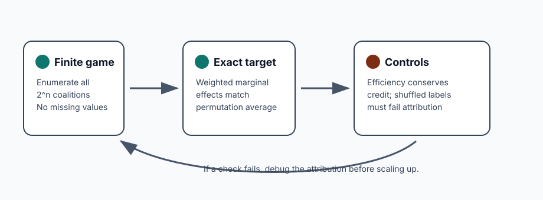
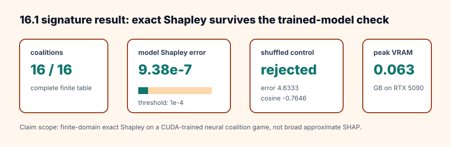

# [16.1] Exact Shapley on Ground-Truth Games

> **Notebooks: [exercises](../../exercises/part1_exact_shapley_ground_truth_games/16.1_Exact_Shapley_on_Ground_Truth_Games_exercises.ipynb) | [solutions](../../exercises/part1_exact_shapley_ground_truth_games/16.1_Exact_Shapley_on_Ground_Truth_Games_solutions.ipynb)**

> **Local-first extension.** This section starts the SHAP/Shapley attribution
> baseline track from the amended roadmap. It is deliberately GT-0: every
> coalition value is known exactly, so your implementation can be checked
> against additive ground truth, permutation averaging, efficiency, and an
> interaction-heavy negative control.

```python
GT_TIER = "GT-0"
EXERCISE_ID = "16_1_exact_shapley_on_ground_truth_games"
DIFFICULTY = 4
IMPORTANCE = 5
EXPECTED_RUNTIME = "seconds on toy contract; minutes on local real-model path"
REQUIRES_GPU = True
```

Please send any problems / bugs on the `#errata` channel in the [Slack group](https://info-arena.github.io/ARENA_img/slack.html), and ask any questions on the dedicated channels for this chapter of material.

Links to earlier chapters: [(0) Fundamentals](https://arena-chapter0-fundamentals.streamlit.app/), [(1) Transformer Interpretability](https://arena-chapter1-transformer-interp.streamlit.app/), [(2) RL](https://arena-chapter2-rl.streamlit.app/), [(3) LLM Evaluations](https://arena-chapter3-llm-evals.streamlit.app/), [(4) Alignment Science](https://arena-chapter4-alignment-science.streamlit.app/).



## Core Question

When is a Shapley attribution result actually known to be correct?

For this first section, the answer is intentionally narrow: use a complete
finite game where every coalition value is available, then compute exact
Shapley values directly. This gives you a ground-truth attribution baseline for
later approximate SHAP, TokenSHAP, Shapley interactions, and SHAP-vs-patching
comparisons.

The release report also trains a small CUDA MLP on a complete four-feature
binary coalition game. The report computes exact Shapley values from real model
ablations, checks them against the analytic data-generating game, verifies
efficiency, and rejects a shuffled-label trained-model control. It does not
claim anything about approximate SHAP on large language models.

<details>
<summary>Help - why start with a complete finite game?</summary>

If every coalition is known, then the Shapley target is not estimated from a
sampling scheme, a perturbation heuristic, or a model explanation interface. It
is the object being tested. That makes this notebook a calibration point for the
rest of the Shapley chapter: later approximations should be compared to this
exact reference before their failures are blamed on the model.

</details>

## Learning Objectives

- Enumerate complete coalition tables for small games.
- Implement the exact weighted marginal-effect Shapley formula.
- Verify that additive games recover the original feature weights.
- Check the efficiency axiom against `v(full) - v(empty)`.
- Compare the closed-form Shapley formula to permutation averaging.
- Use interaction games to show why leave-one-out attributions can overcount.
- Read the CUDA verification report without widening the claim beyond the finite model organism.

# Setup Code

```python
from collections.abc import Callable, Mapping
from dataclasses import dataclass
import itertools
import math
import sys
from pathlib import Path

import torch as t

chapter = "chapter16_shapley_attribution_baselines"
section = "part1_exact_shapley_ground_truth_games"
root_dir = next(p for p in [Path.cwd(), *Path.cwd().parents] if (p / chapter).exists())
exercises_dir = root_dir / chapter / "exercises"
section_dir = exercises_dir / section

if str(root_dir) not in sys.path:
    sys.path.append(str(root_dir))
if str(exercises_dir) not in sys.path:
    sys.path.append(str(exercises_dir))

import part1_exact_shapley_ground_truth_games.tests as tests
import part1_exact_shapley_ground_truth_games.utils as utils

Coalition = frozenset[int]
```

Use small report objects. The fields are deliberately plain, because later
notebooks will reuse the same pattern: an attribution claim should carry the
metric that made it pass or fail.

```python
@dataclass(frozen=True)
class ShapleyEfficiencyReport:
    shapley_sum: float
    total_value_delta: float
    efficiency_error: float
    satisfies_efficiency: bool


@dataclass(frozen=True)
class PermutationParityReport:
    max_abs_error: float
    matches_exact: bool


@dataclass(frozen=True)
class InteractionGapReport:
    shapley_total: float
    leave_one_out_total: float
    overcount: float
    detects_interaction_overcount: bool
```

# Coalition Tables

### Exercise - enumerate every coalition

> Difficulty: medium
> Importance: high
>
> You should spend 10 minutes on this exercise.

Write the utility functions that make every later exact-Shapley check possible.
`all_coalitions(3)` should return eight frozensets, including the empty set and
the full set. `normalize_coalition_values` should reject incomplete tables
rather than silently assigning zeroes.

<details>
<summary>Help - what counts as a complete coalition table?</summary>

For `n` players, you need exactly `2**n` values: one for the empty coalition,
one for the full coalition, and one for every intermediate subset. Missing
entries should fail loudly. Filling missing coalitions with zero changes the
game and can make a broken attribution look exactly right.

</details>

```python
def all_coalitions(num_players: int) -> tuple[Coalition, ...]:
    raise NotImplementedError()


def normalize_coalition_values(
    coalition_values: Mapping[Coalition | tuple[int, ...], float],
    *,
    num_players: int,
) -> dict[Coalition, float]:
    raise NotImplementedError()


def coalition_values_from_function(
    num_players: int,
    value_fn: Callable[[Coalition], float],
) -> dict[Coalition, float]:
    raise NotImplementedError()


tests.test_all_coalitions_enumerates_the_power_set(all_coalitions)
```

<details>
<summary>Expected output</summary>

```text
All tests in `test_all_coalitions_enumerates_the_power_set` passed!
```

</details>

<details>
<summary>Common bugs</summary>

- Returning mutable `set` keys, which cannot be used in dictionaries.
- Omitting the empty coalition.
- Omitting the full coalition.
- Accepting incomplete coalition-value tables.

</details>

<details>
<summary>Solution</summary>

```python
def all_coalitions(num_players: int) -> tuple[Coalition, ...]:
    if num_players <= 0:
        raise ValueError("num_players must be positive.")
    players = range(num_players)
    coalitions = []
    for size in range(num_players + 1):
        coalitions.extend(frozenset(group) for group in itertools.combinations(players, size))
    return tuple(coalitions)


def normalize_coalition_values(
    coalition_values: Mapping[Coalition | tuple[int, ...], float],
    *,
    num_players: int,
) -> dict[Coalition, float]:
    values = {frozenset(key): float(value) for key, value in coalition_values.items()}
    expected = set(all_coalitions(num_players))
    missing = expected - set(values)
    if missing:
        raise ValueError(f"coalition value table is missing {len(missing)} coalitions.")
    return values


def coalition_values_from_function(
    num_players: int,
    value_fn: Callable[[Coalition], float],
) -> dict[Coalition, float]:
    return {coalition: float(value_fn(coalition)) for coalition in all_coalitions(num_players)}
```

</details>

# Exact Shapley Values

### Exercise - recover additive feature weights

> Difficulty: medium
> Importance: high
>
> You should spend 15 minutes on this exercise.

For a player `i`, sum the marginal effect of adding `i` to every coalition that
does not already contain `i`. The weight for a coalition of size `s` is:

```python
math.factorial(s) * math.factorial(num_players - s - 1) / math.factorial(num_players)
```

In an additive game, exact Shapley values must recover the original weights.

<details>
<summary>Help - where do the factorial weights come from?</summary>

The closed-form formula averages over all player orderings. A coalition of size
`s` appears before player `i` in `s! * (n - s - 1)!` permutations, and there are
`n!` total permutations. The weight is just that fraction written directly.

</details>

```python
def exact_shapley_values(
    coalition_values: Mapping[Coalition | tuple[int, ...], float],
    *,
    num_players: int,
) -> t.Tensor:
    raise NotImplementedError()


def additive_game(weights: t.Tensor) -> dict[Coalition, float]:
    raise NotImplementedError()


tests.test_additive_game_and_exact_shapley_recover_weights(
    additive_game,
    exact_shapley_values,
)
tests.test_exact_shapley_requires_a_complete_coalition_table(exact_shapley_values)
```

<details>
<summary>Expected output</summary>

```text
All tests in `test_additive_game_and_exact_shapley_recover_weights` passed!
All tests in `test_exact_shapley_requires_a_complete_coalition_table` passed!
```

</details>

<details>
<summary>Common bugs</summary>

- Forgetting to skip coalitions that already contain the player.
- Dividing by `2 ** num_players` instead of `num_players!`.
- Computing all tensors in `float32`, which can hide exact parity failures.
- Treating missing coalition values as zero.

</details>

<details>
<summary>Solution</summary>

```python
def exact_shapley_values(
    coalition_values: Mapping[Coalition | tuple[int, ...], float],
    *,
    num_players: int,
) -> t.Tensor:
    values = normalize_coalition_values(coalition_values, num_players=num_players)
    factorial = math.factorial
    denominator = factorial(num_players)
    shapley = t.zeros(num_players, dtype=t.float64)
    for player in range(num_players):
        others = [item for item in range(num_players) if item != player]
        for size in range(num_players):
            weight = factorial(size) * factorial(num_players - size - 1) / denominator
            for group in itertools.combinations(others, size):
                coalition = frozenset(group)
                with_player = coalition | {player}
                shapley[player] += weight * (values[with_player] - values[coalition])
    return shapley


def additive_game(weights: t.Tensor) -> dict[Coalition, float]:
    weights = weights.flatten().double()
    return coalition_values_from_function(
        int(weights.numel()),
        lambda coalition: weights[list(coalition)].sum().item() if coalition else 0.0,
    )
```

</details>

# Efficiency

### Exercise - split credit in an AND game

> Difficulty: easy
> Importance: high
>
> You should spend 10 minutes on this exercise.

In a three-player conjunction game, only the full coalition has value one.
Symmetry says exact Shapley should split that value equally, and efficiency says
the attribution sum should equal `v(full) - v(empty)`.

<details>
<summary>Help - why is efficiency a hard sanity check?</summary>

Efficiency is the conservation law for exact Shapley values. The total assigned
credit must equal the value gained by moving from the baseline coalition to the
full coalition. If this fails on a complete table, the implementation is not an
exact Shapley implementation.

</details>

```python
def conjunction_game(num_players: int) -> dict[Coalition, float]:
    raise NotImplementedError()


def shapley_efficiency_report(
    coalition_values: Mapping[Coalition | tuple[int, ...], float],
    *,
    num_players: int,
    tolerance: float = 1e-9,
) -> ShapleyEfficiencyReport:
    raise NotImplementedError()


tests.test_conjunction_game_splits_symmetric_credit_and_checks_efficiency(
    conjunction_game,
    exact_shapley_values,
    shapley_efficiency_report,
)
```

<details>
<summary>Expected output</summary>

```text
All tests in `test_conjunction_game_splits_symmetric_credit_and_checks_efficiency` passed!
```

</details>

<details>
<summary>Common bugs</summary>

- Returning one only when any player is present, rather than only for the full coalition.
- Comparing Shapley sums to `v(full)` when `v(empty)` is nonzero.
- Using exact equality for all floating-point checks instead of a tolerance.

</details>

<details>
<summary>Solution</summary>

```python
def conjunction_game(num_players: int) -> dict[Coalition, float]:
    full = frozenset(range(num_players))
    return coalition_values_from_function(num_players, lambda coalition: coalition == full)


def shapley_efficiency_report(
    coalition_values: Mapping[Coalition | tuple[int, ...], float],
    *,
    num_players: int,
    tolerance: float = 1e-9,
) -> ShapleyEfficiencyReport:
    values = normalize_coalition_values(coalition_values, num_players=num_players)
    shapley = exact_shapley_values(values, num_players=num_players)
    full = frozenset(range(num_players))
    empty = frozenset()
    shapley_sum = float(shapley.sum().item())
    total_delta = values[full] - values[empty]
    error = abs(shapley_sum - total_delta)
    return ShapleyEfficiencyReport(
        shapley_sum=shapley_sum,
        total_value_delta=total_delta,
        efficiency_error=error,
        satisfies_efficiency=error <= tolerance,
    )
```

</details>

# Permutation Parity

### Exercise - compare exact formula with permutation averaging

> Difficulty: medium
> Importance: high
>
> You should spend 10 minutes on this exercise.

Shapley values can also be viewed as expected marginal contribution over
feature orderings. For a tiny complete game, averaging over every permutation is
a useful independent check on the closed-form weights.

<details>
<summary>Help - why compare two exact methods?</summary>

The permutation view and the weighted-coalition formula are mathematically
equivalent, but they fail for different coding reasons. Matching them on a
complete table catches many indexing, ordering, and weighting mistakes before
you move to sampled SHAP estimators.

</details>

```python
def permutation_shapley_values(
    coalition_values: Mapping[Coalition | tuple[int, ...], float],
    *,
    num_players: int,
) -> t.Tensor:
    raise NotImplementedError()


def permutation_parity_report(
    coalition_values: Mapping[Coalition | tuple[int, ...], float],
    *,
    num_players: int,
    tolerance: float = 1e-9,
) -> PermutationParityReport:
    raise NotImplementedError()


tests.test_permutation_parity_report_matches_exact_formula(
    conjunction_game,
    permutation_parity_report,
)
```

<details>
<summary>Expected output</summary>

```text
All tests in `test_permutation_parity_report_matches_exact_formula` passed!
```

</details>

<details>
<summary>Common bugs</summary>

- Updating the coalition before measuring the marginal contribution.
- Dividing by the number of coalitions instead of the number of permutations.
- Sampling permutations here; this exercise is the exact reference, not Monte Carlo SHAP.

</details>

<details>
<summary>Solution</summary>

```python
def permutation_shapley_values(
    coalition_values: Mapping[Coalition | tuple[int, ...], float],
    *,
    num_players: int,
) -> t.Tensor:
    values = normalize_coalition_values(coalition_values, num_players=num_players)
    totals = t.zeros(num_players, dtype=t.float64)
    permutations = tuple(itertools.permutations(range(num_players)))
    for ordering in permutations:
        coalition: Coalition = frozenset()
        for player in ordering:
            with_player = coalition | {player}
            totals[player] += values[with_player] - values[coalition]
            coalition = with_player
    return totals / len(permutations)


def permutation_parity_report(
    coalition_values: Mapping[Coalition | tuple[int, ...], float],
    *,
    num_players: int,
    tolerance: float = 1e-9,
) -> PermutationParityReport:
    exact = exact_shapley_values(coalition_values, num_players=num_players)
    permutation = permutation_shapley_values(coalition_values, num_players=num_players)
    max_error = float((exact - permutation).abs().max().item())
    return PermutationParityReport(
        max_abs_error=max_error,
        matches_exact=max_error <= tolerance,
    )
```

</details>

# Interaction Failures

### Exercise - show leave-one-out overcounting

> Difficulty: medium
> Importance: high
>
> You should spend 10 minutes on this exercise.

Leave-one-out scores can overcount when value comes from an interaction. In a
two-player AND game, dropping either player destroys the value, so leave-one-out
assigns one point to each player even though the total game value is one.

<details>
<summary>Help - what failure is leave-one-out showing here?</summary>

Leave-one-out answers a different question: how much value disappears when one
feature is removed from the full coalition. In an AND game, either player is
individually necessary, so leave-one-out gives both players full credit. Shapley
instead averages across contexts and splits the interaction credit.

</details>

```python
def leave_one_out_values(
    coalition_values: Mapping[Coalition | tuple[int, ...], float],
    *,
    num_players: int,
) -> t.Tensor:
    raise NotImplementedError()


def interaction_gap_report(
    coalition_values: Mapping[Coalition | tuple[int, ...], float],
    *,
    num_players: int,
    min_overcount: float = 0.5,
) -> InteractionGapReport:
    raise NotImplementedError()


tests.test_interaction_gap_report_catches_leave_one_out_overcount(
    conjunction_game,
    interaction_gap_report,
)
```

<details>
<summary>Expected output</summary>

```text
All tests in `test_interaction_gap_report_catches_leave_one_out_overcount` passed!
```

</details>

<details>
<summary>Common bugs</summary>

- Computing leave-one-out from the empty coalition instead of the full coalition.
- Treating overcounting as a Shapley failure rather than a simpler-baseline failure.
- Forgetting that negative interactions can make other perturbation scores undercount.

</details>

<details>
<summary>Solution</summary>

```python
def leave_one_out_values(
    coalition_values: Mapping[Coalition | tuple[int, ...], float],
    *,
    num_players: int,
) -> t.Tensor:
    values = normalize_coalition_values(coalition_values, num_players=num_players)
    full = frozenset(range(num_players))
    return t.tensor(
        [values[full] - values[full - {player}] for player in range(num_players)],
        dtype=t.float64,
    )


def interaction_gap_report(
    coalition_values: Mapping[Coalition | tuple[int, ...], float],
    *,
    num_players: int,
    min_overcount: float = 0.5,
) -> InteractionGapReport:
    shapley_total = float(exact_shapley_values(coalition_values, num_players=num_players).sum())
    loo_total = float(leave_one_out_values(coalition_values, num_players=num_players).sum())
    overcount = loo_total - shapley_total
    return InteractionGapReport(
        shapley_total=shapley_total,
        leave_one_out_total=loo_total,
        overcount=overcount,
        detects_interaction_overcount=overcount >= min_overcount,
    )
```

</details>

# Notebook Contract

### Exercise - assemble the visible smoke contract

> Difficulty: easy
> Importance: medium
>
> You should spend 5 minutes on this exercise.

The smoke contract is what the verification script records under
`metrics.notebook_contract`. It should be fast, deterministic, and exact.

<details>
<summary>Help - why keep this separate from the CUDA preflight?</summary>

The notebook contract should isolate the mathematical objects learners are
implementing. The CUDA report then asks a different question: after training a
small model on the complete game, do ablation-derived coalition values recover
the same exact Shapley vector and reject a shuffled-label control?

</details>

```python
def additive_smoke_test() -> dict:
    weights = t.tensor([1.0, 2.0, -0.5])
    values = additive_game(weights)
    shapley = exact_shapley_values(values, num_players=3)
    return {
        "shapley": shapley.tolist(),
        "efficiency": shapley_efficiency_report(values, num_players=3).__dict__,
    }


def conjunction_smoke_test() -> dict:
    values = conjunction_game(3)
    shapley = exact_shapley_values(values, num_players=3)
    return {
        "shapley": shapley.tolist(),
        "efficiency": shapley_efficiency_report(values, num_players=3).__dict__,
    }


def permutation_parity_smoke_test() -> dict:
    values = conjunction_game(3)
    return permutation_parity_report(values, num_players=3).__dict__


def interaction_failure_smoke_test() -> dict:
    values = conjunction_game(2)
    return interaction_gap_report(values, num_players=2, min_overcount=0.5).__dict__


def run_smoke_test(cpu: bool = True) -> dict:
    _ = cpu
    return {
        "additive": additive_smoke_test(),
        "conjunction": conjunction_smoke_test(),
        "permutation_parity": permutation_parity_smoke_test(),
        "interaction_failure": interaction_failure_smoke_test(),
    }


tests.test_additive_smoke_test(additive_smoke_test)
tests.test_conjunction_smoke_test(conjunction_smoke_test)
tests.test_permutation_parity_smoke_test(permutation_parity_smoke_test)
tests.test_interaction_failure_smoke_test(interaction_failure_smoke_test)
tests.test_notebook_contract(run_smoke_test)
```

<details>
<summary>Expected output</summary>

```text
All tests in `test_additive_smoke_test` passed!
All tests in `test_conjunction_smoke_test` passed!
All tests in `test_permutation_parity_smoke_test` passed!
All tests in `test_interaction_failure_smoke_test` passed!
All tests in `test_notebook_contract` passed!
```

</details>

<details>
<summary>Common bugs</summary>

- Adding random sampling to the smoke contract.
- Returning tensors directly instead of JSON-serializable values.
- Making the notebook contract depend on CUDA; the CUDA path is a separate verification report.

</details>

<details>
<summary>Solution</summary>

```python
def run_full_experiment(max_vram_gb: float = 24.0) -> dict:
    return run_gpu_test(max_vram_gb=max_vram_gb)
```

The implementation in `solutions.py` keeps `run_gpu_test` as the real CUDA
preflight. It trains the four-feature neural coalition game, builds a coalition
table from model ablations, computes exact Shapley values, and rejects the
shuffled-label trained-model control.

</details>

## CUDA Verification Path

Run this section report from the repository root:

```bash
uv run python scripts/run_extension_verification_reports.py --section 16.1 --max-vram-gb 24.0
```

<details>
<summary>Expected output</summary>

```text
PASS 16.1 Exact Shapley on Ground-Truth Games
Wrote 1 verification reports; 1 accepted.
```

</details>

The committed report should show:

```python
import json

report = json.loads((section_dir / "verification_report.json").read_text())
gpu = report["metrics"]["gpu_test"]

assert report["accepted"]
assert gpu["cuda_available"]
assert gpu["preflight_passed"]
assert gpu["model_family"] == "cuda_trained_neural_coalition_game_mlp"
assert gpu["num_players"] == 4
assert gpu["coalition_count"] == 16
assert gpu["training_example_count"] == 16
assert gpu["training_steps"] == 1200
assert gpu["fit_mse"] <= 1e-8
assert gpu["neural_shapley_max_abs_error"] <= 1e-4
assert gpu["satisfies_efficiency"]
assert gpu["shuffled_control_error"] >= 1.0
assert gpu["shuffled_control_cosine"] <= 0.25
assert gpu["shuffled_control_rejected"]
assert gpu["within_vram_budget"]
```

<details>
<summary>Common bugs</summary>

- Treating the toy notebook contract as the GPU evidence.
- Accepting CPU execution for this section's release report.
- Claiming KernelSHAP, TokenSHAP, or large-model attribution from this finite exact-Shapley preflight.

</details>

<details>
<summary>Help - why is the OOD claim scoped away?</summary>

This is a complete finite-domain section. The CUDA path trains and evaluates on
all 16 binary inputs for the four-feature game, then computes exact Shapley
from all coalitions. That gives finite-domain coverage, not OOD extrapolation.
The right honest claim is that the local exact-Shapley workflow works on a fully
enumerated model organism.

</details>

## Signature Result



| Check | Expected | Observed |
| --- | ---: | ---: |
| Complete coalition table | 16 | 16 |
| Neural-game fit MSE | <= 1e-8 | 1.102e-12 |
| Model Shapley max error | <= 1e-4 | 9.38e-7 |
| Efficiency error | <= 1e-8 | 0.0 |
| Shuffled-control error | >= 1.0 | 4.6333 |
| Shuffled-control cosine | <= 0.25 | -0.7646 |
| Peak VRAM | <= 1.0 GB | 0.063 GB |

The section-level result is not just that exact Shapley can be computed on a toy
dictionary. The CUDA report trains a real MLP on the complete binary feature
game, rebuilds the coalition table from model ablations, recovers the analytic
Shapley vector, and rejects a shuffled-label model that still fits its shuffled
table.

## Limitations

- This is a GT-0 model-organism section, not evidence about approximate SHAP on
  large language, vision, or multimodal models.
- The finite binary feature table is fully enumerated, so the result is
  finite-domain coverage rather than OOD generalization.
- Exact Shapley grows exponentially in the number of players; later sections
  introduce approximations and grouping controls precisely because complete
  enumeration stops being practical.
- The shuffled-label control rejects one important failure mode, but it does not
  prove that every future attribution baseline is robust.

## Further Research

- Replace the four-feature neural game with a small sparse feature circuit and
  compare exact Shapley to activation patching.
- Stress-test how quickly sampled KernelSHAP converges to this exact reference
  as the number of players grows.
- Use the leave-one-out counterexample as a fixture for reviewing future
  attribution papers: does the method conserve total credit on interactions?
