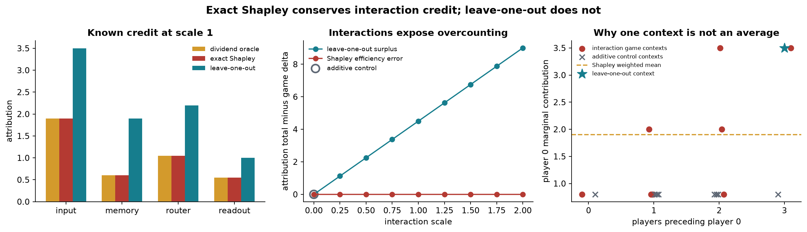

# [16.1] Exact Shapley on Ground-Truth Games

> **Notebooks: [exercises](../../exercises/part1_exact_shapley_ground_truth_games/16.1_Exact_Shapley_on_Ground_Truth_Games_exercises.ipynb) | [solutions](../../exercises/part1_exact_shapley_ground_truth_games/16.1_Exact_Shapley_on_Ground_Truth_Games_solutions.ipynb)**

## Core Question

When interactions make a player's contribution depend on context, does exact Shapley recover the known dividend allocation while leave-one-out fails conservation?

**Claim:** on the four-player game in this notebook, exact Shapley matches an independent analytic oracle and permutation averaging to numerical precision for every tested interaction strength; leave-one-out agrees only in the additive control and overcounts by `4.5 * interaction_scale`.



```python
GT_TIER = "GT-0"
EXERCISE_ID = "16_1_exact_shapley_on_ground_truth_games"
EXPECTED_RUNTIME = "seconds for the exact notebook; minutes for CUDA verification"
REQUIRES_GPU = True
```

The notebook's exact finite game runs on CPU. The release gate calls
`run_gpu_test(max_vram_gb=24.0)` through `run_full_experiment` and records its
CUDA-trained neural-game result in `verification_report.json`; that report is
supporting evidence, not the lesson's signature result.

## Learning Objectives

You will:

- enumerate and validate complete coalition tables;
- build a game from explicit Harsanyi dividends;
- implement exact Shapley as a weighted average of marginal contributions;
- derive an independent dividend-splitting oracle;
- test efficiency, symmetry, and the dummy-player property;
- reproduce the result by averaging over every player permutation;
- expose leave-one-out overcounting with an interaction-strength sweep.

Every scientific result below is generated from the visible finite game. No verification report is used as lesson evidence.

```python
from collections.abc import Callable, Mapping
from dataclasses import dataclass
import itertools
import math
import sys
from pathlib import Path

import matplotlib.pyplot as plt
import numpy as np
import torch as t

chapter = "chapter16_shapley_attribution_baselines"
section = "part1_exact_shapley_ground_truth_games"
root_dir = next(p for p in [Path.cwd(), *Path.cwd().parents] if (p / chapter).exists())
exercises_dir = root_dir / chapter / "exercises"
assets_dir = root_dir / chapter / "instructions" / "assets"
for path in (root_dir, exercises_dir):
    if str(path) not in sys.path:
        sys.path.append(str(path))

import part1_exact_shapley_ground_truth_games.tests as tests

Coalition = frozenset[int]
t.set_grad_enabled(False)
plt.rcParams.update({
    "figure.dpi": 120,
    "axes.spines.top": False,
    "axes.spines.right": False,
    "axes.titleweight": "bold",
    "font.size": 10,
})
EXACT = "#B43A32"
ORACLE = "#D39A2C"
BASELINE = "#167D8D"
CONTROL = "#5F6875"


@dataclass(frozen=True)
class ShapleyEfficiencyReport:
    shapley_sum: float
    total_value_delta: float
    efficiency_error: float
    satisfies_efficiency: bool


@dataclass(frozen=True)
class PermutationParityReport:
    max_abs_error: float
    matches_exact: bool


@dataclass(frozen=True)
class InteractionGapReport:
    shapley_total: float
    leave_one_out_total: float
    overcount: float
    detects_interaction_overcount: bool
```

## Cold open: one player, four answers

Player `1` has direct dividend `-0.2`. It also participates in a positive pair interaction, a negative pair interaction, and a positive three-way interaction. Which number is its contribution?

- direct effect only: `-0.2`;
- leave-one-out from the full coalition: `1.9`;
- exact Shapley: `0.6`;
- a marginal contribution in one particular context: anything from `-0.8` to `1.9`.

The disagreement is the lesson. Shapley does not ask for one privileged context. It averages a player's marginal contribution over every possible predecessor coalition with the weights induced by random player orderings.

<details><summary>Interpretation - what can be exactly true here?</summary>

Because every coalition value and every dividend is declared, both the attribution target and the counterexamples are exact. This organism tests Shapley mathematics. It is not evidence about the faithfulness of masking tokens or ablating model components.

</details>

### Exercise - enumerate a complete game

> Difficulty: medium
> Importance: high
>
> You should spend 10 minutes on this exercise.

A game with `n` players needs `2**n` coalition values, including the empty and full coalitions. Implement enumeration, normalization, and table construction. Missing entries must fail loudly.

<details><summary>Help - common bug: incomplete coalition table</summary>

Loop over subset sizes and use `itertools.combinations`. Store coalitions as `frozenset` so they can be dictionary keys. During normalization, compare the actual key set with the complete power set.

</details>

<details><summary>Solution</summary>

```python
def all_coalitions(num_players):
    if num_players <= 0:
        raise ValueError("num_players must be positive.")
    return tuple(
        frozenset(group)
        for size in range(num_players + 1)
        for group in itertools.combinations(range(num_players), size)
    )

def normalize_coalition_values(values, *, num_players):
    normalized = {frozenset(key): float(value) for key, value in values.items()}
    expected = set(all_coalitions(num_players))
    missing = expected - set(normalized)
    extra = set(normalized) - expected
    if missing or extra:
        raise ValueError(f"coalition table has missing coalitions={len(missing)} and extra coalitions={len(extra)}")
    return {coalition: normalized[coalition] for coalition in all_coalitions(num_players)}

def coalition_values_from_function(num_players, value_fn):
    return {coalition: float(value_fn(coalition)) for coalition in all_coalitions(num_players)}
```

</details>

<details><summary>Expected output</summary>

```text
All tests in `test_all_coalitions_enumerates_the_power_set` passed!
All tests in `test_complete_table_normalization` passed!
```

</details>

<details><summary>Interpretation</summary>

Rejecting an incomplete table protects the definition of the game. Treating an unmeasured coalition as zero silently changes both the baseline and interaction structure.

</details>

```python
def all_coalitions(num_players: int) -> tuple[Coalition, ...]:
    raise NotImplementedError()


def normalize_coalition_values(
    coalition_values: Mapping[Coalition | tuple[int, ...], float],
    *,
    num_players: int,
) -> dict[Coalition, float]:
    raise NotImplementedError()


def coalition_values_from_function(
    num_players: int,
    value_fn: Callable[[Coalition], float],
) -> dict[Coalition, float]:
    raise NotImplementedError()
tests.test_all_coalitions_enumerates_the_power_set(all_coalitions)
tests.test_complete_table_normalization(
    all_coalitions,
    normalize_coalition_values,
    coalition_values_from_function,
)
```

### Exercise - build an exact dividend game

> Difficulty: medium
> Importance: high
>
> You should spend 10 minutes on this exercise.

A dividend assigns value to a specific interaction term. Coalition `S` receives every dividend whose player set is contained in `S`, plus the empty-coalition baseline. Implement this exact organism and the independent oracle that divides each dividend equally among its members.

<details><summary>Help</summary>

For each coalition, sum `dividend` whenever `term.issubset(coalition)`. For the oracle, add `dividend / len(term)` to every player in that term. Reject empty terms because the baseline is a separate argument.

</details>

<details><summary>Solution</summary>

```python
def game_from_dividends(num_players, dividends, baseline=0.0):
    normalized = {frozenset(term): float(value) for term, value in dividends.items()}
    if any(not term for term in normalized):
        raise ValueError("Use baseline for the empty dividend.")
    return coalition_values_from_function(
        num_players,
        lambda coalition: baseline + sum(value for term, value in normalized.items() if term <= coalition),
    )

def shapley_from_dividends(num_players, dividends):
    result = t.zeros(num_players, dtype=t.float64)
    for term, dividend in dividends.items():
        for player in term:
            result[player] += float(dividend) / len(term)
    return result
```

</details>

<details><summary>Expected output</summary>

```text
All tests in `test_dividend_game_and_analytic_oracle` passed!
Empty value = 0.300; full value = 4.400; total delta = 4.100
Analytic oracle = [1.900, 0.600, 1.050, 0.550]
```

</details>

<details><summary>Interpretation</summary>

The dividend oracle is independent of the weighted-marginal implementation you will write next. Agreement between them is therefore meaningful parity, not the same algorithm called twice.

</details>

```python
PLAYER_NAMES = ("input", "memory", "router", "readout")
DIRECT_DIVIDENDS = {
    frozenset({0}): 0.8,
    frozenset({1}): -0.2,
    frozenset({2}): 0.4,
    frozenset({3}): 0.1,
}
INTERACTION_DIVIDENDS = {
    frozenset({0, 1}): 1.2,
    frozenset({1, 2}): -0.6,
    frozenset({2, 3}): 0.9,
    frozenset({0, 1, 2}): 1.5,
}
BASELINE_VALUE = 0.3

def scaled_dividends(interaction_scale: float = 1.0) -> dict[Coalition, float]:
    return DIRECT_DIVIDENDS | {
        term: float(interaction_scale) * value
        for term, value in INTERACTION_DIVIDENDS.items()
    }
def game_from_dividends(
    num_players: int,
    dividends: Mapping[Coalition | tuple[int, ...], float],
    baseline: float = 0.0,
) -> dict[Coalition, float]:
    raise NotImplementedError()


def shapley_from_dividends(
    num_players: int,
    dividends: Mapping[Coalition | tuple[int, ...], float],
) -> t.Tensor:
    raise NotImplementedError()
tests.test_dividend_game_and_analytic_oracle(
    game_from_dividends,
    shapley_from_dividends,
)
organism_dividends = scaled_dividends(1.0)
organism_values = game_from_dividends(
    4, organism_dividends, baseline=BASELINE_VALUE
)
analytic_oracle = shapley_from_dividends(4, organism_dividends)
full_coalition = frozenset(range(4))
print(
    f"Empty value = {organism_values[frozenset()]:.3f}; "
    f"full value = {organism_values[full_coalition]:.3f}; "
    f"total delta = {organism_values[full_coalition] - organism_values[frozenset()]:.3f}"
)
print("Analytic oracle =", [round(value, 3) for value in analytic_oracle.tolist()])
print("\nComplete coalition table:")
for coalition, value in organism_values.items():
    names = ", ".join(PLAYER_NAMES[player] for player in sorted(coalition)) or "empty"
    print(f"  {str(sorted(coalition)):<14} {names:<31} value={value:5.2f}")
```

### Exercise - implement weighted marginal Shapley

> Difficulty: medium
> Importance: high
>
> You should spend 15 minutes on this exercise.

For player `i`, enumerate every coalition `S` that excludes `i`. Record the marginal `v(S union {i}) - v(S)` and its permutation weight:

$$w(S)=rac{{|S|!(n-|S|-1)!}}{{n!}}.$$

Implement the context table first, then compute exact Shapley as its weighted sum.

<details><summary>Help</summary>

There are `2**(n-1)` rows for each player. The weights across those rows sum to one. Do not average the rows uniformly: coalition sizes occur with different multiplicities in permutations.

</details>

<details><summary>Solution</summary>

```python
def marginal_contribution_rows(values, *, num_players, player):
    values = normalize_coalition_values(values, num_players=num_players)
    rows = []
    for coalition in all_coalitions(num_players):
        if player in coalition:
            continue
        size = len(coalition)
        weight = math.factorial(size) * math.factorial(num_players-size-1) / math.factorial(num_players)
        marginal = values[coalition | {player}] - values[coalition]
        rows.append((coalition, marginal, weight))
    return tuple(rows)

def exact_shapley_values(values, *, num_players):
    return t.tensor([
        sum(marginal * weight for _, marginal, weight in marginal_contribution_rows(values, num_players=num_players, player=player))
        for player in range(num_players)
    ], dtype=t.float64)
```

</details>

<details><summary>Expected output</summary>

```text
All tests in `test_weighted_marginal_rows` passed!
All tests in `test_additive_game_and_exact_shapley_recover_weights` passed!
All tests in `test_exact_shapley_requires_a_complete_coalition_table` passed!
Exact Shapley = [1.900, 0.600, 1.050, 0.550]
```

</details>

<details><summary>Interpretation</summary>

The marginal rows make context dependence visible. Shapley is the expectation over random predecessor coalitions, not the marginal in the empty or full context alone.

</details>

```python
def marginal_contribution_rows(
    coalition_values: Mapping[Coalition | tuple[int, ...], float],
    *,
    num_players: int,
    player: int,
) -> tuple[tuple[Coalition, float, float], ...]:
    raise NotImplementedError()


def exact_shapley_values(
    coalition_values: Mapping[Coalition | tuple[int, ...], float],
    *,
    num_players: int,
) -> t.Tensor:
    raise NotImplementedError()


def additive_game(weights: t.Tensor) -> dict[Coalition, float]:
    raise NotImplementedError()
tests.test_weighted_marginal_rows(marginal_contribution_rows)
tests.test_additive_game_and_exact_shapley_recover_weights(
    additive_game,
    exact_shapley_values,
)
tests.test_exact_shapley_requires_a_complete_coalition_table(
    exact_shapley_values
)
exact_values = exact_shapley_values(organism_values, num_players=4)
print("Exact Shapley =", [round(value, 3) for value in exact_values.tolist()])
```

```python
player_one_rows = marginal_contribution_rows(
    organism_values, num_players=4, player=1
)
print("Player 1 marginal contributions by predecessor context:")
print("  coalition        marginal   weight   weighted")
for coalition, marginal, weight in player_one_rows:
    print(
        f"  {str(sorted(coalition)):<16} {marginal:>7.2f}   "
        f"{weight:>6.3f}   {marginal * weight:>8.3f}"
    )
print("  weighted sum:", round(sum(m * w for _, m, w in player_one_rows), 3))
```

### Exercise - test the axioms against independent controls

> Difficulty: medium
> Importance: high
>
> You should spend 10 minutes on this exercise.

Implement efficiency, then test three exact controls: a symmetric three-player conjunction splits `1/3` each; a fifth player absent from every dividend receives zero; and the four-player result matches the dividend oracle.

<details><summary>Help</summary>

Efficiency compares `sum(phi)` with `v(full)-v(empty)`. The empty value matters because the organism baseline is `0.3`. For the dummy control, build a five-player table from the same dividends without adding player `4` to any term.

</details>

<details><summary>Solution</summary>

```python
def conjunction_game(num_players):
    full = frozenset(range(num_players))
    return coalition_values_from_function(num_players, lambda coalition: coalition == full)

def shapley_efficiency_report(values, *, num_players, tolerance=1e-9):
    values = normalize_coalition_values(values, num_players=num_players)
    shapley_sum = exact_shapley_values(values, num_players=num_players).sum().item()
    delta = values[frozenset(range(num_players))] - values[frozenset()]
    error = abs(shapley_sum - delta)
    return ShapleyEfficiencyReport(shapley_sum, delta, error, error <= tolerance)
```

</details>

<details><summary>Expected output</summary>

```text
All tests in `test_conjunction_game_splits_symmetric_credit_and_checks_efficiency` passed!
Oracle max error: < 1e-12
Dummy player attribution: 0.000
Efficiency error: < 1e-12
```

</details>

<details><summary>Interpretation</summary>

These controls test different failure modes: symmetry catches player-order bias, the dummy player catches leaked credit, and efficiency catches failure to conserve total game value.

</details>

```python
def conjunction_game(num_players: int) -> dict[Coalition, float]:
    raise NotImplementedError()


def shapley_efficiency_report(
    coalition_values: Mapping[Coalition | tuple[int, ...], float],
    *,
    num_players: int,
    tolerance: float = 1e-9,
) -> ShapleyEfficiencyReport:
    raise NotImplementedError()
tests.test_conjunction_game_splits_symmetric_credit_and_checks_efficiency(
    conjunction_game,
    exact_shapley_values,
    shapley_efficiency_report,
)
efficiency = shapley_efficiency_report(organism_values, num_players=4)
oracle_error = (exact_values - analytic_oracle).abs().max().item()
dummy_values = game_from_dividends(
    5, organism_dividends, baseline=BASELINE_VALUE
)
dummy_attribution = exact_shapley_values(dummy_values, num_players=5)[4].item()
assert oracle_error < 1e-12
assert abs(dummy_attribution) < 1e-12
print(f"Oracle max error: {oracle_error:.2e}")
print(f"Dummy player attribution: {dummy_attribution:.3f}")
print(f"Efficiency error: {efficiency.efficiency_error:.2e}")
```

### Exercise - reproduce Shapley by permutation averaging

> Difficulty: medium
> Importance: high
>
> You should spend 10 minutes on this exercise.

Implement a second exact algorithm. For every permutation, start from the empty coalition and record each player's marginal contribution when it enters. Average over all `n!` permutations.

<details><summary>Help</summary>

Measure the marginal before updating the predecessor coalition, then add the player. Divide the accumulated contributions by `math.factorial(num_players)`.

</details>

<details><summary>Solution</summary>

```python
def permutation_shapley_values(values, *, num_players):
    values = normalize_coalition_values(values, num_players=num_players)
    result = t.zeros(num_players, dtype=t.float64)
    for ordering in itertools.permutations(range(num_players)):
        before = frozenset()
        for player in ordering:
            result[player] += values[before | {player}] - values[before]
            before = before | {player}
    return result / math.factorial(num_players)
```

</details>

<details><summary>Expected output</summary>

```text
All tests in `test_permutation_parity_report_matches_exact_formula` passed!
Permutation max error: < 1e-12 across 24 orderings
```

</details>

<details><summary>Interpretation</summary>

The coalition formula and permutation algorithm are mathematically equivalent but fail through different implementation mistakes. Their agreement is a reference-parity control.

</details>

```python
def permutation_shapley_values(
    coalition_values: Mapping[Coalition | tuple[int, ...], float],
    *,
    num_players: int,
) -> t.Tensor:
    raise NotImplementedError()


def permutation_parity_report(
    coalition_values: Mapping[Coalition | tuple[int, ...], float],
    *,
    num_players: int,
    tolerance: float = 1e-9,
) -> PermutationParityReport:
    raise NotImplementedError()
tests.test_permutation_parity_report_matches_exact_formula(
    conjunction_game,
    permutation_parity_report,
)
permutation_values = permutation_shapley_values(
    organism_values, num_players=4
)
permutation_error = (permutation_values - exact_values).abs().max().item()
print(
    f"Permutation max error: {permutation_error:.2e} "
    f"across {math.factorial(4)} orderings"
)
```

### Exercise - expose the leave-one-out failure

> Difficulty: medium
> Importance: high
>
> You should spend 10 minutes on this exercise.

Leave-one-out uses only the full-coalition context: `v(N)-v(N minus {i})`. Implement it, then compare its total credit with Shapley's conserved total.

<details><summary>Help</summary>

For each player, remove that player from the full coalition. The interaction gap is `sum(leave_one_out) - sum(shapley)`. In a two-player AND game, this equals `1.0` because each player receives the full interaction value.

</details>

<details><summary>Solution</summary>

```python
def leave_one_out_values(values, *, num_players):
    values = normalize_coalition_values(values, num_players=num_players)
    full = frozenset(range(num_players))
    return t.tensor([values[full] - values[full - {player}] for player in range(num_players)], dtype=t.float64)

def interaction_gap_report(values, *, num_players, min_overcount=0.5):
    shapley_total = exact_shapley_values(values, num_players=num_players).sum().item()
    loo_total = leave_one_out_values(values, num_players=num_players).sum().item()
    overcount = loo_total - shapley_total
    return InteractionGapReport(shapley_total, loo_total, overcount, overcount >= min_overcount)
```

</details>

<details><summary>Expected output</summary>

```text
All tests in `test_interaction_gap_report_catches_leave_one_out_overcount` passed!
Leave-one-out = [3.500, 1.900, 2.200, 1.000]
Shapley total = 4.100; leave-one-out total = 8.600; overcount = 4.500
```

</details>

<details><summary>Interpretation</summary>

Leave-one-out is not merely noisy here. It answers a different question and counts each positive interaction once for every participating player. Negative interactions can instead cause undercounting.

</details>

```python
def leave_one_out_values(
    coalition_values: Mapping[Coalition | tuple[int, ...], float],
    *,
    num_players: int,
) -> t.Tensor:
    raise NotImplementedError()


def interaction_gap_report(
    coalition_values: Mapping[Coalition | tuple[int, ...], float],
    *,
    num_players: int,
    min_overcount: float = 0.5,
) -> InteractionGapReport:
    raise NotImplementedError()
tests.test_interaction_gap_report_catches_leave_one_out_overcount(
    conjunction_game,
    interaction_gap_report,
)
leave_one_out = leave_one_out_values(organism_values, num_players=4)
interaction_gap = interaction_gap_report(organism_values, num_players=4)
print("Leave-one-out =", [round(value, 3) for value in leave_one_out.tolist()])
print(
    f"Shapley total = {interaction_gap.shapley_total:.3f}; "
    f"leave-one-out total = {interaction_gap.leave_one_out_total:.3f}; "
    f"overcount = {interaction_gap.overcount:.3f}"
)
```

### Exercise - sweep interaction strength

> Difficulty: hard
> Importance: high
>
> You should spend 15 minutes on this exercise.

Hold direct dividends fixed and multiply every pair and triple dividend by a common scale. Return the exact efficiency error, oracle error, and leave-one-out overcount at each scale.

<details><summary>Help</summary>

Rebuild the entire coalition table for every scale. At scale `0`, the game is additive and leave-one-out must match Shapley. At scale `1`, the known overcount is `4.5`; at scale `2`, it is `9.0`.

</details>

<details><summary>Solution</summary>

```python
def interaction_scale_sweep(scales):
    efficiency_errors, oracle_errors, overcounts = [], [], []
    for scale in scales.tolist():
        dividends = scaled_dividends(scale)
        values = game_from_dividends(4, dividends, baseline=BASELINE_VALUE)
        exact = exact_shapley_values(values, num_players=4)
        oracle = shapley_from_dividends(4, dividends)
        efficiency_errors.append(shapley_efficiency_report(values, num_players=4).efficiency_error)
        oracle_errors.append((exact-oracle).abs().max().item())
        overcounts.append(leave_one_out_values(values, num_players=4).sum().item() - exact.sum().item())
    return {"shapley_efficiency_error": t.tensor(efficiency_errors, dtype=t.float64), "oracle_max_error": t.tensor(oracle_errors, dtype=t.float64), "leave_one_out_overcount": t.tensor(overcounts, dtype=t.float64)}
```

</details>

<details><summary>Expected output</summary>

```text
All tests in `test_interaction_scale_sweep` passed!
Additive control overcount = 0.000
Scale-1 overcount = 4.500
Scale-2 overcount = 9.000
```

</details>

<details><summary>Interpretation</summary>

Exact Shapley stays efficient because the weighting rule allocates every interaction once. Leave-one-out's error grows with interaction strength because it reuses the full-context interaction in multiple player scores.

</details>

```python
def interaction_scale_sweep(scales: t.Tensor) -> dict[str, t.Tensor]:
    raise NotImplementedError()
tests.test_interaction_scale_sweep(interaction_scale_sweep)
sweep_scales = t.linspace(0.0, 2.0, 9, dtype=t.float64)
sweep = interaction_scale_sweep(sweep_scales)
print(f"Additive control overcount = {sweep['leave_one_out_overcount'][0]:.3f}")
print(f"Scale-1 overcount = {sweep['leave_one_out_overcount'][4]:.3f}")
print(f"Scale-2 overcount = {sweep['leave_one_out_overcount'][-1]:.3f}")
```

## Signature Result

Generate all three panels from your implementations. The analytic dividend oracle and permutation result are independent parity controls. The additive game at interaction scale `0` is the negative control for leave-one-out failure.

```python
player_zero_rows = marginal_contribution_rows(
    organism_values, num_players=4, player=0
)
additive_values = game_from_dividends(
    4, DIRECT_DIVIDENDS, baseline=BASELINE_VALUE
)
additive_player_zero_rows = marginal_contribution_rows(
    additive_values, num_players=4, player=0
)

assert oracle_error < 1e-12
assert permutation_error < 1e-12
assert efficiency.efficiency_error < 1e-12
assert abs(interaction_gap.overcount - 4.5) < 1e-12
assert abs(sweep["leave_one_out_overcount"][-1].item() - 9.0) < 1e-12

fig, axes = plt.subplots(1, 3, figsize=(14.2, 4.1))
x = np.arange(len(PLAYER_NAMES))
width = 0.24
axes[0].bar(x - width, analytic_oracle, width, color=ORACLE, label="dividend oracle")
axes[0].bar(x, exact_values, width, color=EXACT, label="exact Shapley")
axes[0].bar(x + width, leave_one_out, width, color=BASELINE, label="leave-one-out")
axes[0].axhline(0, color="#B8BDC5", linewidth=1)
axes[0].set_xticks(x, PLAYER_NAMES)
axes[0].set_ylabel("attribution")
axes[0].set_title("Known credit at scale 1")
axes[0].legend(frameon=False, fontsize=8)

axes[1].plot(
    sweep_scales,
    sweep["leave_one_out_overcount"],
    marker="o",
    color=BASELINE,
    label="leave-one-out surplus",
)
axes[1].plot(
    sweep_scales,
    sweep["shapley_efficiency_error"],
    marker="o",
    color=EXACT,
    label="Shapley efficiency error",
)
axes[1].scatter([0], [0], s=100, facecolors="none", edgecolors=CONTROL, linewidths=2, label="additive control")
axes[1].set_xlabel("interaction scale")
axes[1].set_ylabel("attribution total minus game delta")
axes[1].set_title("Interactions expose overcounting")
axes[1].legend(frameon=False, fontsize=8)

context_sizes = [len(coalition) for coalition, _, _ in player_zero_rows]
marginals = [marginal for _, marginal, _ in player_zero_rows]
additive_marginals = [marginal for _, marginal, _ in additive_player_zero_rows]
offsets = np.linspace(-0.10, 0.10, len(context_sizes))
axes[2].scatter(
    np.array(context_sizes) + offsets,
    marginals,
    color=EXACT,
    s=45,
    label="interaction game contexts",
)
axes[2].scatter(
    np.array(context_sizes) - offsets,
    additive_marginals,
    color=CONTROL,
    marker="x",
    s=45,
    label="additive control contexts",
)
axes[2].axhline(exact_values[0].item(), color=ORACLE, linestyle="--", label="Shapley weighted mean")
axes[2].scatter([3], [leave_one_out[0].item()], color=BASELINE, marker="*", s=160, label="leave-one-out context")
axes[2].set_xticks([0, 1, 2, 3])
axes[2].set_xlabel("players preceding player 0")
axes[2].set_ylabel("player 0 marginal contribution")
axes[2].set_title("Why one context is not an average")
axes[2].legend(frameon=False, fontsize=7)

fig.suptitle(
    "Exact Shapley conserves interaction credit; leave-one-out does not",
    fontsize=13,
    fontweight="bold",
)
fig.tight_layout()
signature_path = assets_dir / "exact_shapley_ground_truth_signature.png"
fig.savefig(signature_path, dpi=170, bbox_inches="tight")
plt.show()

print(
    f"Signature metrics: oracle_error={oracle_error:.2e}, "
    f"permutation_error={permutation_error:.2e}, "
    f"efficiency_error={efficiency.efficiency_error:.2e}, "
    f"leave_one_out_overcount={interaction_gap.overcount:.3f}, "
    f"player0_marginal_range=[{min(marginals):.3f}, {max(marginals):.3f}]"
)
```

<details><summary>Interpreting the signature result</summary>

The oracle and exact bars coincide, including negative credit. Leave-one-out uses the largest-context marginal and therefore inflates every positive interaction. The middle panel shows the falsifiable law for this organism: Shapley efficiency error remains numerical zero while leave-one-out surplus grows from `0` to `9`. The context panel explains the mechanism: player `0` contributes between `0.8` and `3.5` depending on which players arrived first, and Shapley's weighted average is `1.9`.

</details>

### Try It Yourself - change the organism

Change `PLAY_INTERACTION_SCALE` and `PLAY_PLAYER`. Negative scales turn positive synergy into redundancy and can make leave-one-out undercount. Keep the analytic oracle and efficiency checks active when you modify dividends.

```python
PLAY_INTERACTION_SCALE = 0.5
PLAY_PLAYER = 1

play_dividends = scaled_dividends(PLAY_INTERACTION_SCALE)
play_values = game_from_dividends(4, play_dividends, baseline=BASELINE_VALUE)
play_shapley = exact_shapley_values(play_values, num_players=4)
play_oracle = shapley_from_dividends(4, play_dividends)
play_loo = leave_one_out_values(play_values, num_players=4)
play_rows = marginal_contribution_rows(
    play_values, num_players=4, player=PLAY_PLAYER
)
t.testing.assert_close(play_shapley, play_oracle, atol=1e-12, rtol=0)
print(f"Interaction scale: {PLAY_INTERACTION_SCALE:.2f}")
print(f"Player: {PLAY_PLAYER} ({PLAYER_NAMES[PLAY_PLAYER]})")
print(f"Shapley: {play_shapley[PLAY_PLAYER]:.3f}")
print(f"Leave-one-out: {play_loo[PLAY_PLAYER]:.3f}")
print(
    "Context marginals:",
    [round(marginal, 3) for _, marginal, _ in play_rows],
)
```

## Bonus anomaly hunt

Player `1` starts with a negative direct dividend but receives positive Shapley credit once interactions are strong enough. Find the exact interaction scale where its attribution changes sign, then verify the crossing numerically without changing any other dividend. Next, set the scale negative and explain why the leave-one-out "overcount" becomes an undercount.

A strong anomaly report includes the derived crossing, the two neighboring numerical values, and the marginal contexts responsible for the sign change.

## Limitations

- This is an exact four-player cooperative game, not an attribution result for a trained neural network.
- The dividend decomposition is supplied as ground truth. Real model components rarely arrive with known interaction terms.
- Complete exact Shapley requires all `2**n` coalition values and all permutation parity checks require `n!` orderings.
- The result says nothing about whether a masking or ablation operator creates in-distribution model inputs.
- Leave-one-out can overcount or undercount depending on interaction signs; this notebook's linear law is specific to its declared dividends.

## Reading links

- [A Unified Approach to Interpreting Model Predictions](https://arxiv.org/abs/1705.07874)
- [Interpretable Machine Learning: Shapley Values](https://christophm.github.io/interpretable-ml-book/shapley.html)
- [The Shapley Value and Harsanyi Dividends](https://doi.org/10.1016/0022-0531(88)90049-6)
- [Original ARENA toy-model exercises](../../../chapter1_transformer_interp/exercises/part54_toy_models_of_superposition_and_saes/1.5.4_Toy_Models_of_Superposition_&_SAEs_exercises.ipynb)
