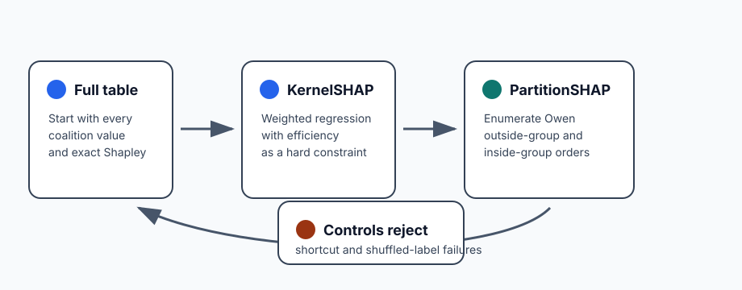
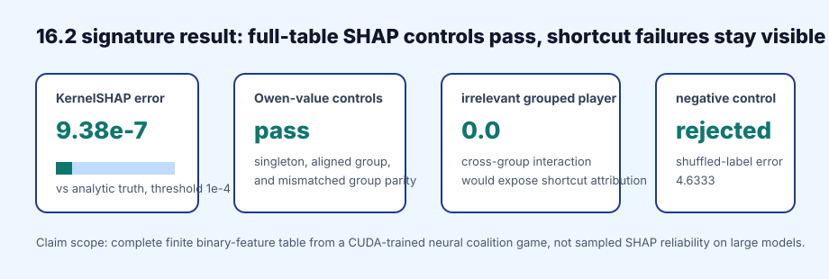

# [16.2] KernelSHAP and PartitionSHAP Controls

> **Notebooks: [exercises](../../exercises/part2_kernelshap_partition_shap_controls/16.2_KernelSHAP_and_PartitionSHAP_Controls_exercises.ipynb) | [solutions](../../exercises/part2_kernelshap_partition_shap_controls/16.2_KernelSHAP_and_PartitionSHAP_Controls_solutions.ipynb)**

> **Local-first extension.** This section continues the Shapley attribution
> baseline track. You will treat KernelSHAP as a weighted-regression solver on
> a complete coalition table, then treat PartitionSHAP as exact Owen values for
> a declared partition. Both methods are checked against exact Shapley before
> the CUDA report touches a trained neural game.

```python
GT_TIER = "GT-0"
EXERCISE_ID = "16_2_kernelshap_and_partitionshap_controls"
DIFFICULTY = 4
IMPORTANCE = 4
EXPECTED_RUNTIME = "seconds on toy contract; minutes on local real-model path"
REQUIRES_GPU = True
```

Please send any problems / bugs on the `#errata` channel in the [Slack group](https://info-arena.github.io/ARENA_img/slack.html), and ask any questions on the dedicated channels for this chapter of material.

Links to earlier chapters: [(0) Fundamentals](https://arena-chapter0-fundamentals.streamlit.app/), [(1) Transformer Interpretability](https://arena-chapter1-transformer-interp.streamlit.app/), [(2) RL](https://arena-chapter2-rl.streamlit.app/), [(3) LLM Evaluations](https://arena-chapter3-llm-evals.streamlit.app/), [(4) Alignment Science](https://arena-chapter4-alignment-science.streamlit.app/).



## Core Question

When can an approximate SHAP method be trusted on a finite model organism?

For this section, the answer is deliberately narrow. KernelSHAP is only allowed
to claim success after it matches exact Shapley on a complete coalition table.
PartitionSHAP is only allowed to claim success after the grouping assumption is
made explicit and exact Owen values recover the expected player-level credit.
The final CUDA result trains a small neural coalition game, builds real model
ablation values, and checks these same controls against analytic ground truth.

<details>
<summary>Help - why keep the complete coalition table?</summary>

KernelSHAP is often introduced as a sampling approximation, but sampling error
is not the first thing you should debug. First make the regression target
finite and known. If full-table KernelSHAP does not match exact Shapley, the
problem is the solver, the kernel weights, the baseline convention, or the
efficiency constraint, not the sample count.

</details>

<details>
<summary>Help - why is PartitionSHAP not just Shapley inside each group?</summary>

The partition changes the averaging process. Owen values average over group
orderings and within-group orderings. If you first assign credit to groups and
then split credit using only within-group coalitions, you can give credit to a
player that never participates in the true interaction. This section includes
that failure as an anomaly-hunting exercise.

</details>

## Learning Objectives

- Implement the finite KernelSHAP kernel and reject empty/full finite rows.
- Solve KernelSHAP as constrained weighted least squares.
- Check KernelSHAP parity on additive and interaction games.
- Collapse player coalitions into group coalitions without losing player identity.
- Implement exact Owen values for a declared feature partition.
- Use a cross-group interaction to reject a tempting PartitionSHAP shortcut.
- Interpret the CUDA report without widening the claim beyond complete finite tables.

# Setup Code

```python
from collections.abc import Callable, Mapping
from dataclasses import dataclass
import itertools
import math
import sys
from pathlib import Path

import torch as t

chapter = "chapter16_shapley_attribution_baselines"
section = "part2_kernelshap_partition_shap_controls"
root_dir = next(p for p in [Path.cwd(), *Path.cwd().parents] if (p / chapter).exists())
exercises_dir = root_dir / chapter / "exercises"
section_dir = exercises_dir / section

if str(root_dir) not in sys.path:
    sys.path.append(str(root_dir))
if str(exercises_dir) not in sys.path:
    sys.path.append(str(exercises_dir))

import part2_kernelshap_partition_shap_controls.tests as tests
import part2_kernelshap_partition_shap_controls.utils as utils

Coalition = frozenset[int]
MAIN = __name__ == "__main__"
```

The two report classes are intentionally small. They force each exercise to say
which values were computed, what the exact target was, and whether the check
actually passed.

```python
@dataclass(frozen=True)
class KernelSHAPApproximationReport:
    shapley_values: t.Tensor
    exact_values: t.Tensor
    max_abs_error: float
    approximates_exact: bool


@dataclass(frozen=True)
class PartitionSHAPReport:
    group_values: t.Tensor
    player_values: t.Tensor
    exact_values: t.Tensor
    max_abs_error: float
    recovers_exact: bool
```

Use the same exact-game primitives as 16.1. They are repeated here so this
notebook can be run independently.

```python
def all_coalitions(num_players: int) -> tuple[Coalition, ...]:
    if num_players <= 0:
        raise ValueError("num_players must be positive.")
    players = range(num_players)
    coalitions = []
    for size in range(num_players + 1):
        coalitions.extend(frozenset(group) for group in itertools.combinations(players, size))
    return tuple(coalitions)


def normalize_coalition_values(
    coalition_values: Mapping[Coalition | tuple[int, ...], float],
    *,
    num_players: int,
) -> dict[Coalition, float]:
    values = {frozenset(key): float(value) for key, value in coalition_values.items()}
    expected = set(all_coalitions(num_players))
    missing = expected - set(values)
    if missing:
        raise ValueError(f"coalition value table is missing {len(missing)} coalitions.")
    return values


def coalition_values_from_function(
    num_players: int,
    value_fn: Callable[[Coalition], float],
) -> dict[Coalition, float]:
    return {coalition: float(value_fn(coalition)) for coalition in all_coalitions(num_players)}


def exact_shapley_values(
    coalition_values: Mapping[Coalition | tuple[int, ...], float],
    *,
    num_players: int,
) -> t.Tensor:
    values = normalize_coalition_values(coalition_values, num_players=num_players)
    denominator = math.factorial(num_players)
    shapley = t.zeros(num_players, dtype=t.float64)
    for player in range(num_players):
        others = [item for item in range(num_players) if item != player]
        for size in range(num_players):
            weight = (
                math.factorial(size)
                * math.factorial(num_players - size - 1)
                / denominator
            )
            for group in itertools.combinations(others, size):
                coalition = frozenset(group)
                shapley[player] += weight * (
                    values[coalition | {player}] - values[coalition]
                )
    return shapley


def additive_game(weights: t.Tensor) -> dict[Coalition, float]:
    weights = weights.flatten().double()
    return coalition_values_from_function(
        int(weights.numel()),
        lambda coalition: weights[list(coalition)].sum().item() if coalition else 0.0,
    )


def conjunction_game(num_players: int) -> dict[Coalition, float]:
    full = frozenset(range(num_players))
    return coalition_values_from_function(num_players, lambda coalition: coalition == full)
```

# KernelSHAP Weights

### Exercise - implement the finite KernelSHAP weight

> Difficulty: medium
> Importance: high
>
> You should spend 10 minutes on this exercise.

For a coalition of size `s` among `n` players, the finite KernelSHAP row weight
is:

```text
(n - 1) / (binom(n, s) * s * (n - s))
```

This weight is only defined for non-empty, non-full coalitions. The empty and
full coalitions are handled by the baseline and efficiency constraint.

<details>
<summary>Help - why reject empty and full coalitions?</summary>

The empty coalition fixes the intercept/baseline, and the full coalition fixes
the total attribution sum. Giving either one a finite regression weight usually
hides a broken efficiency constraint. Raise an error instead of adding a row
with an arbitrary large weight.

</details>

```python
def kernelshap_kernel_weight(coalition_size: int, num_players: int) -> float:
    raise NotImplementedError()


tests.test_kernelshap_kernel_weight_uses_finite_coalition_formula(
    kernelshap_kernel_weight,
)
```

<details>
<summary>Expected output</summary>

```text
All tests in `test_kernelshap_kernel_weight_uses_finite_coalition_formula` passed!
```

</details>

<details>
<summary>Common bugs</summary>

- Forgetting the `math.comb(num_players, coalition_size)` denominator.
- Returning a weight for `coalition_size == 0`.
- Returning a weight for `coalition_size == num_players`.
- Using uniform weights, which makes the next exercise pass only by accident on easy games.

</details>

<details>
<summary>Solution</summary>

```python
def kernelshap_kernel_weight(coalition_size: int, num_players: int) -> float:
    if coalition_size <= 0 or coalition_size >= num_players:
        raise ValueError("KernelSHAP finite weights require 0 < coalition_size < num_players.")
    return (num_players - 1) / (
        math.comb(num_players, coalition_size)
        * coalition_size
        * (num_players - coalition_size)
    )
```

</details>

# KernelSHAP Weighted Regression

### Exercise - solve full-table KernelSHAP

> Difficulty: hard
> Importance: high
>
> You should spend 20 minutes on this exercise.

Build a binary design matrix with one row for each non-empty, non-full
coalition. The target for row `S` is `v(S) - v(empty)`. The equality constraint
is:

```text
sum_i phi_i = v(full) - v(empty)
```

Solve the resulting KKT system rather than hoping unconstrained least squares
will preserve efficiency.

<details>
<summary>Help - what should the KKT system look like?</summary>

Let `X` be the coalition mask matrix, `W` the diagonal weight matrix, and `y`
the centered coalition values. The weighted normal equation is
`X.T @ W @ X @ phi = X.T @ W @ y`. Add one Lagrange multiplier row/column for
`ones @ phi = total_delta`.

</details>

```python
def kernelshap_values(
    coalition_values: Mapping[Coalition | tuple[int, ...], float],
    *,
    num_players: int,
) -> t.Tensor:
    raise NotImplementedError()


def kernelshap_approximation_report(
    coalition_values: Mapping[Coalition | tuple[int, ...], float],
    *,
    num_players: int,
    tolerance: float = 1e-9,
) -> KernelSHAPApproximationReport:
    raise NotImplementedError()


tests.test_kernelshap_approximation_report_matches_exact_additive_game(
    kernelshap_approximation_report,
    additive_game,
)
```

<details>
<summary>Expected output</summary>

```text
All tests in `test_kernelshap_approximation_report_matches_exact_additive_game` passed!
```

</details>

<details>
<summary>Common bugs</summary>

- Solving an unconstrained regression and forgetting efficiency.
- Including the full coalition as a normal finite row.
- Regressing on `v(S)` rather than `v(S) - v(empty)`.
- Building the mask rows in a different player order than the output tensor.

</details>

<details>
<summary>Solution</summary>

```python
def kernelshap_values(
    coalition_values: Mapping[Coalition | tuple[int, ...], float],
    *,
    num_players: int,
) -> t.Tensor:
    if num_players < 2:
        raise ValueError("KernelSHAP needs at least two players for finite weights.")
    values = normalize_coalition_values(coalition_values, num_players=num_players)
    empty = frozenset()
    full = frozenset(range(num_players))
    baseline = values[empty]
    total_delta = values[full] - baseline

    rows = []
    targets = []
    weights = []
    for coalition in all_coalitions(num_players):
        size = len(coalition)
        if size == 0 or size == num_players:
            continue
        rows.append([1.0 if player in coalition else 0.0 for player in range(num_players)])
        targets.append(values[coalition] - baseline)
        weights.append(kernelshap_kernel_weight(size, num_players))

    design = t.tensor(rows, dtype=t.float64)
    target = t.tensor(targets, dtype=t.float64)
    weight_vector = t.tensor(weights, dtype=t.float64)
    hessian = design.T @ (design * weight_vector.unsqueeze(-1))
    rhs = design.T @ (target * weight_vector)
    constraint = t.ones((1, num_players), dtype=t.float64)
    kkt = t.cat(
        [
            t.cat([hessian, constraint.T], dim=1),
            t.cat([constraint, t.zeros((1, 1), dtype=t.float64)], dim=1),
        ],
        dim=0,
    )
    constrained_rhs = t.cat([rhs, t.tensor([total_delta], dtype=t.float64)])
    return t.linalg.solve(kkt, constrained_rhs)[:num_players]


def kernelshap_approximation_report(
    coalition_values: Mapping[Coalition | tuple[int, ...], float],
    *,
    num_players: int,
    tolerance: float = 1e-9,
) -> KernelSHAPApproximationReport:
    kernel_values = kernelshap_values(coalition_values, num_players=num_players)
    exact = exact_shapley_values(coalition_values, num_players=num_players)
    max_error = float((kernel_values - exact).abs().max().item())
    return KernelSHAPApproximationReport(
        shapley_values=kernel_values,
        exact_values=exact,
        max_abs_error=max_error,
        approximates_exact=max_error <= tolerance,
    )
```

</details>

### Exercise - split credit in an interaction game

> Difficulty: medium
> Importance: high
>
> You should spend 10 minutes on this exercise.

The three-player conjunction game has no single-feature main effect, but exact
Shapley assigns one third of the full value to each player. Full-table
KernelSHAP should recover the same result.

```python
tests.test_kernelshap_interaction_report_splits_conjunction_credit(
    kernelshap_approximation_report,
    conjunction_game,
)
```

<details>
<summary>Expected output</summary>

```text
All tests in `test_kernelshap_interaction_report_splits_conjunction_credit` passed!
```

</details>

<details>
<summary>Interpreting the result</summary>

This is the first place where a leave-one-out explanation would mislead you.
Each player is necessary for the full conjunction, but the value should still
be split symmetrically. KernelSHAP only gets this right here because the full
coalition table is available and the regression is constrained.

</details>

# PartitionSHAP / Owen Values

### Exercise - collapse player coalitions into group coalitions

> Difficulty: medium
> Importance: high
>
> You should spend 10 minutes on this exercise.

PartitionSHAP starts by declaring groups. A group coalition is converted back
into the union of its original players before reading the player-level value
table. For weights `[1, 2, 3, 4]` and groups `((0, 1), (2, 3))`, the group
values for singleton group coalitions should be `[3.0, 7.0]`.

<details>
<summary>Help - why not use group indices as player indices?</summary>

Group index `1` is not player `1`. In `groups=((0, 1), (2, 3))`, group `1`
contains players `2` and `3`. If you forget this expansion, the grouped game
quietly reads the wrong coalitions and the final attribution can still have
the right shape while explaining a different game.

</details>

```python
def grouped_coalition_values(
    coalition_values: Mapping[Coalition | tuple[int, ...], float],
    *,
    groups: tuple[tuple[int, ...], ...],
) -> dict[Coalition, float]:
    raise NotImplementedError()


tests.test_grouped_coalition_values_expand_groups_before_lookup(
    grouped_coalition_values,
    additive_game,
)
```

<details>
<summary>Expected output</summary>

```text
All tests in `test_grouped_coalition_values_expand_groups_before_lookup` passed!
```

</details>

<details>
<summary>Solution</summary>

```python
def grouped_coalition_values(
    coalition_values: Mapping[Coalition | tuple[int, ...], float],
    *,
    groups: tuple[tuple[int, ...], ...],
) -> dict[Coalition, float]:
    group_count = len(groups)
    player_count = sum(len(group) for group in groups)
    values = normalize_coalition_values(coalition_values, num_players=player_count)
    group_values = {}
    for group_coalition in all_coalitions(group_count):
        players: set[int] = set()
        for group_index in group_coalition:
            players.update(groups[group_index])
        group_values[group_coalition] = values[frozenset(players)]
    return group_values
```

</details>

### Exercise - compute exact PartitionSHAP player values

> Difficulty: hard
> Importance: high
>
> You should spend 25 minutes on this exercise.

Compute exact Owen values for a fixed partition. For each player, average their
marginal contribution over two nested choices:

- the groups that appear before this player's group;
- the players inside this player's group that appear before this player.

This is deliberately more explicit than the tempting group-then-split shortcut.

<details>
<summary>Help - what loops are required?</summary>

For player `i` inside group `G`, enumerate every subset of other groups and
every subset of the other players inside `G`. The marginal contribution is
`v(outside_players union inside_players union {i}) - v(outside_players union inside_players)`.
Weight the outside subset by the group-order Shapley coefficient and the inside
subset by the within-group Shapley coefficient.

</details>

```python
def partition_shap_values(
    coalition_values: Mapping[Coalition | tuple[int, ...], float],
    *,
    groups: tuple[tuple[int, ...], ...],
) -> t.Tensor:
    raise NotImplementedError()


def partition_shap_report(
    coalition_values: Mapping[Coalition | tuple[int, ...], float],
    *,
    groups: tuple[tuple[int, ...], ...],
    tolerance: float = 1e-9,
) -> PartitionSHAPReport:
    raise NotImplementedError()


tests.test_partition_shap_report_recovers_additive_groups(
    partition_shap_report,
    additive_game,
)
tests.test_partition_shap_report_rejects_invalid_grouping(
    partition_shap_report,
    additive_game,
)
```

<details>
<summary>Expected output</summary>

```text
All tests in `test_partition_shap_report_recovers_additive_groups` passed!
All tests in `test_partition_shap_report_rejects_invalid_grouping` passed!
```

</details>

<details>
<summary>Common bugs</summary>

- Allowing overlapping groups.
- Forgetting to require that groups cover players `0..n-1` exactly once.
- Computing group Shapley and then splitting by within-group totals only.
- Comparing Owen values to exact Shapley without recording the grouping assumption.

</details>

<details>
<summary>Solution</summary>

```python
def partition_shap_values(
    coalition_values: Mapping[Coalition | tuple[int, ...], float],
    *,
    groups: tuple[tuple[int, ...], ...],
) -> t.Tensor:
    if not groups:
        raise ValueError("groups must be nonempty.")
    flattened = [player for group in groups for player in group]
    if sorted(flattened) != list(range(len(flattened))):
        raise ValueError("groups must partition players 0..n-1 exactly once.")

    values = normalize_coalition_values(coalition_values, num_players=len(flattened))
    group_count = len(groups)
    player_values = t.zeros(len(flattened), dtype=t.float64)
    for group_index, group in enumerate(groups):
        outside_group_indices = [idx for idx in range(group_count) if idx != group_index]
        group_denominator = math.factorial(group_count)
        local_denominator = math.factorial(len(group))
        for local_index, player in enumerate(group):
            others_in_group = [
                candidate
                for idx, candidate in enumerate(group)
                if idx != local_index
            ]
            for outside_size in range(group_count):
                outside_weight = (
                    math.factorial(outside_size)
                    * math.factorial(group_count - outside_size - 1)
                    / group_denominator
                )
                for outside_groups in itertools.combinations(outside_group_indices, outside_size):
                    outside_players: set[int] = set()
                    for outside_group in outside_groups:
                        outside_players.update(groups[outside_group])
                    for inside_size in range(len(group)):
                        inside_weight = (
                            math.factorial(inside_size)
                            * math.factorial(len(group) - inside_size - 1)
                            / local_denominator
                        )
                        for inside_players in itertools.combinations(
                            others_in_group,
                            inside_size,
                        ):
                            coalition = frozenset(outside_players | set(inside_players))
                            player_values[player] += outside_weight * inside_weight * (
                                values[coalition | {player}] - values[coalition]
                            )
    return player_values


def partition_shap_report(
    coalition_values: Mapping[Coalition | tuple[int, ...], float],
    *,
    groups: tuple[tuple[int, ...], ...],
    tolerance: float = 1e-9,
) -> PartitionSHAPReport:
    num_players = sum(len(group) for group in groups)
    player_values = partition_shap_values(coalition_values, groups=groups)
    exact = exact_shapley_values(coalition_values, num_players=num_players)
    group_values = exact_shapley_values(
        grouped_coalition_values(coalition_values, groups=groups),
        num_players=len(groups),
    )
    max_error = float((player_values - exact).abs().max().item())
    return PartitionSHAPReport(
        group_values=group_values,
        player_values=player_values,
        exact_values=exact,
        max_abs_error=max_error,
        recovers_exact=max_error <= tolerance,
    )
```

</details>

### Exercise - split a pure interaction group symmetrically

> Difficulty: medium
> Importance: high
>
> You should spend 10 minutes on this exercise.

If both players in a two-player conjunction are inside the same group,
PartitionSHAP should split the group value equally.

```python
tests.test_partition_shap_report_splits_interaction_group_symmetrically(
    partition_shap_report,
    conjunction_game,
)
```

<details>
<summary>Expected output</summary>

```text
All tests in `test_partition_shap_report_splits_interaction_group_symmetrically` passed!
```

</details>

<details>
<summary>Interpreting the result</summary>

This is the easy interaction case for PartitionSHAP: the interacting players
are inside one group, so the within-group ordering is enough to split credit.
The next exercise is harder because the true interaction crosses the group
boundary.

</details>

### Exercise - anomaly hunt: reject the within-group shortcut

> Difficulty: hard
> Importance: high
>
> You should spend 15 minutes on this exercise.

Use the three-player game `v(S) = 1` if players `0` and `2` are both present,
and zero otherwise. Now group players as `((0, 1), (2,))`. Player `1` is in the
same group as player `0`, but is irrelevant to the true interaction. Exact
Owen values should assign player `1` zero credit.

```python
tests.test_partition_shap_report_handles_cross_group_interaction_without_irrelevant_credit(
    partition_shap_report,
    coalition_values_from_function,
)
```

<details>
<summary>Expected output</summary>

```text
All tests in `test_partition_shap_report_handles_cross_group_interaction_without_irrelevant_credit` passed!
```

</details>

<details>
<summary>Help - what failure should you look for?</summary>

A shortcut that computes group-level Shapley values and then splits the first
group uniformly will report `[0.25, 0.25, 0.5]`. That looks normalized and
plausible, but player `1` did nothing. The correct exact Owen result is
`[0.5, 0.0, 0.5]`.

</details>

# Notebook Contract

The smoke test bundles the small deterministic results that the verification
runner records in `expected_outputs/smoke_test.json`.

```python
def _tensor_report(report: object) -> dict:
    result = report.__dict__.copy()
    for key, value in list(result.items()):
        if hasattr(value, "tolist"):
            result[key] = value.tolist()
    return result


def kernel_additive_smoke_test() -> dict:
    values = additive_game(t.tensor([1.0, -2.0, 0.5]))
    return _tensor_report(kernelshap_approximation_report(values, num_players=3))


def kernel_interaction_smoke_test() -> dict:
    values = conjunction_game(3)
    return _tensor_report(kernelshap_approximation_report(values, num_players=3))


def partition_additive_smoke_test() -> dict:
    values = additive_game(t.tensor([1.0, 2.0, 3.0, 4.0]))
    return _tensor_report(partition_shap_report(values, groups=((0, 1), (2, 3))))


def partition_interaction_smoke_test() -> dict:
    values = conjunction_game(2)
    return _tensor_report(partition_shap_report(values, groups=((0, 1),)))


def partition_cross_group_interaction_smoke_test() -> dict:
    values = coalition_values_from_function(
        3,
        lambda coalition: {0, 2}.issubset(coalition),
    )
    return _tensor_report(partition_shap_report(values, groups=((0, 1), (2,))))


def run_smoke_test(cpu: bool = True) -> dict:
    _ = cpu
    return {
        "kernel_additive": kernel_additive_smoke_test(),
        "kernel_interaction": kernel_interaction_smoke_test(),
        "partition_additive": partition_additive_smoke_test(),
        "partition_interaction": partition_interaction_smoke_test(),
        "partition_cross_group_interaction": partition_cross_group_interaction_smoke_test(),
    }


tests.test_notebook_contract(run_smoke_test)
```

<details>
<summary>Expected output</summary>

```text
All tests in `test_notebook_contract` passed!
```

</details>

<details>
<summary>Common bugs</summary>

- Returning tensors directly from the smoke test instead of JSON-ready lists.
- Omitting the cross-group interaction control.
- Treating the smoke test as a GPU result. It is a toy finite-table contract;
  the real trained-model path is the next section.

</details>

# CUDA Verification Report

The committed report is the signature result for this section. It trains a
small CUDA MLP on all 16 examples in a four-feature binary game, builds a
coalition table from real model ablations, then runs the KernelSHAP and
PartitionSHAP controls above.

```python
import json

report = json.loads((section_dir / "verification_report.json").read_text())
gpu = report["metrics"]["gpu_test"]

assert report["accepted"] is True
assert gpu["cuda_available"] is True
assert gpu["preflight_passed"] is True
assert gpu["fit_mse"] <= 1e-8
assert gpu["kernel_approximates_exact"] is True
assert gpu["kernel_vs_true_max_abs_error"] <= 1e-4
assert gpu["partition_recovers_exact"] is True
assert gpu["aligned_partition_recovers_exact"] is True
assert gpu["mismatched_partition_recovers_exact"] is True
assert gpu["cross_group_partition_recovers_exact"] is True
assert gpu["cross_group_irrelevant_credit"] <= 1e-8
assert gpu["shuffled_control_rejected"] is True
assert gpu["within_vram_budget"] is True
```

<details>
<summary>Expected output</summary>

```text
device: NVIDIA GeForce RTX 5090 Laptop GPU
torch: 2.12.1+cu132
cuda: 13.2
coalitions: 16
KernelSHAP vs analytic ground truth max abs error: 9.375e-7
cross-group irrelevant-player credit: 0.0
shuffled-label control error: 4.6333, rejected
peak VRAM: 0.063 GB
```

</details>

<details>
<summary>Interpreting the result</summary>

The positive result is not "SHAP works on large models." It is narrower and
stronger: on a complete finite table produced by a CUDA-trained neural model,
full-table KernelSHAP matches exact Shapley and analytic ground truth, exact
Owen values pass grouping controls, the cross-group shortcut failure stays
detectable, and the shuffled-label trained model is rejected.

</details>

## Signature Result



| Check | Result | Why it matters |
| --- | ---: | --- |
| Complete coalition table | 16 coalitions | No sampled approximation is needed for the core claim |
| Neural fit MSE | `1.102e-12` | The trained model organism learned the finite target |
| KernelSHAP vs exact on model table | `4.441e-16` | The weighted-regression implementation matches exact Shapley |
| KernelSHAP vs analytic truth | `9.375e-7` | Real model ablation values recover the known data-generating game |
| Singleton PartitionSHAP error | `0.0` | Singleton groups reduce to ordinary exact Shapley |
| Cross-group irrelevant credit | `0.0` | The grouped shortcut failure is rejected |
| Shuffled-label true error | `4.6333` | A meaningless trained-model attribution is not accepted |
| Peak VRAM | `0.063 GB` | The full report is lightweight on the 24GB CUDA machine |

## Limitations

- This section proves full-table finite SHAP controls, not sampled SHAP
  convergence on high-dimensional feature spaces.
- The CUDA model organism has four binary features and 16 training examples.
  That is useful ground truth, not a benchmark for deployed attribution tools.
- The PartitionSHAP result depends on the declared partition. A different
  grouping is a different attribution question.
- The exact Owen-value implementation is exponential in the number of groups
  and group sizes. Later sections can discuss approximation, but this section
  keeps the oracle small and exact.

## Further Research

- Stress-test sampled KernelSHAP against this full-table reference as coalition
  sampling becomes sparse.
- Compare exact Owen values with the approximation strategy used by production
  explainability libraries on the cross-group anomaly game.
- Add a TreeSHAP section only after building a tree model with known finite
  feature interactions and the same negative controls.
- Try partitions suggested by correlations or learned features, then check
  whether the grouping improves explanation stability without hiding
  cross-group interactions.
