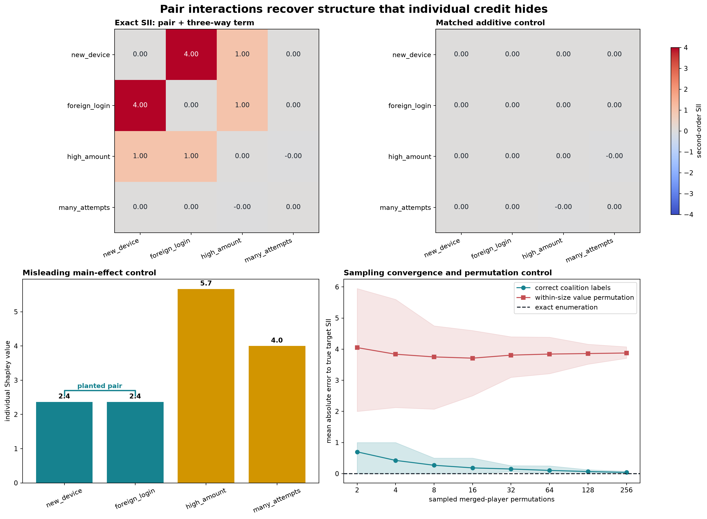

# [16.3] Shapley Interactions with shapiq

> **Notebooks: [exercises](../../exercises/part3_shapley_interactions_shapiq/16.3_Shapley_Interactions_with_shapiq_exercises.ipynb) | [solutions](../../exercises/part3_shapley_interactions_shapiq/16.3_Shapley_Interactions_with_shapiq_solutions.ipynb)**

> **Claim.** By the end of this notebook, you will have shown that exact second-order Shapley interaction indices recover a planted pair that individual Shapley rankings miss, expose how a three-way dividend enters pairwise scores, return zero for a matched additive game, converge under permutation sampling, and match pinned `shapiq` on the same complete coalition table.

```yaml
GT_TIER = "GT-0"
EXERCISE_ID = "16_3_shapley_interactions_with_shapiq"
expected_runtime: 75-105 minutes on CPU
requires_gpu: false for the lesson; true only for the separate release preflight
```

## Core Question

Can pairwise SII recover a planted synergy that individual Shapley rankings miss, while matched additive and permuted-value controls fail?

## Cold open

Consider a controlled fraud score with four binary features. `high_amount` contributes `5.0` alone and `many_attempts` contributes `4.0`. `new_device` and `foreign_login` contribute only `0.2` each, but together receive an extra `3.0`; when `high_amount` is also present, the triple receives another `2.0`.

| question | answer known before coding |
|---|---:|
| Largest individual Shapley value | `high_amount = 5.667` |
| Strongest pairwise SII | `new_device x foreign_login` |
| Exact target-pair SII | `4.0 = 3.0 pair + 1.0 from the triple` |
| Largest interaction in the matched additive control | `0.0` |

The falsifiable question is: **can pairwise SII recover the planted pair despite larger additive decoys, while revealing rather than hiding the contribution of a known three-way term?**

## Learning Objectives

- Enumerate a complete finite coalition game from transparent polynomial terms.
- Implement the discrete second difference that removes additive contributions.
- Derive and implement exact pairwise Shapley interaction indices.
- Compare interaction structure with individual Shapley main effects.
- Estimate pair interactions from random merged-player permutations.
- Build a within-size coalition-value permutation control.
- Match the complete-table result against pinned `shapiq` SII.
- Quantify target rank, off-target interactions, and matrix error.


```python
import itertools
import math
import random
import sys
from collections.abc import Mapping
from dataclasses import dataclass
from pathlib import Path

import matplotlib.pyplot as plt
import numpy as np
import pandas as pd
import torch as t

chapter = "chapter16_shapley_attribution_baselines"
section = "part3_shapley_interactions_shapiq"
root_dir = next(p for p in [Path.cwd(), *Path.cwd().parents] if (p / chapter).exists())
exercises_dir = root_dir / chapter / "exercises"
section_dir = exercises_dir / section
assets_dir = root_dir / chapter / "instructions" / "assets"
if str(root_dir) not in sys.path:
    sys.path.append(str(root_dir))
if str(exercises_dir) not in sys.path:
    sys.path.append(str(exercises_dir))

import part3_shapley_interactions_shapiq.tests as tests

Coalition = frozenset[int]


@dataclass(frozen=True)
class InteractionRecoveryReport:
    predicted_pair: tuple[int, int]
    target_rank: int
    target_value: float
    max_off_target_interaction: float
    mean_abs_error: float


PLAYER_NAMES = ["new_device", "foreign_login", "high_amount", "many_attempts"]
NUM_PLAYERS = len(PLAYER_NAMES)
TARGET_PAIR = (0, 1)
ADDITIVE_WEIGHTS = t.tensor([0.2, 0.2, 5.0, 4.0], dtype=t.float64)
PAIR_WEIGHT = 3.0
TRIPLE = (0, 1, 2)
TRIPLE_WEIGHT = 2.0
```


## The exact game

For binary coalition indicators $x_i \in \{0,1\}$, the primary game is

$$v(x)=0.2x_0+0.2x_1+5x_2+4x_3+3x_0x_1+2x_0x_1x_2.$$

Every one of the $2^4=16$ coalition values is enumerable. We know before computing anything that the literal pair contributes `3.0`, while the three-way dividend contributes another `1.0` to each of `(0,1)`, `(0,2)`, and `(1,2)` under second-order SII. Therefore the exact target matrix has `I(0,1)=4.0`, `I(0,2)=I(1,2)=1.0`, and zero elsewhere. The matched additive control removes both interaction terms while preserving the large individual effects.

This is the ground truth used throughout the lesson and in the later `shapiq` comparison.


### Exercise 1 - implement `all_coalitions and polynomial_game`

> ```yaml
> Difficulty: 2/5
> Importance: 5/5
> Suggested time: 12 minutes
> ```

Enumerate every subset of the player set, normalize coalition keys, and evaluate additive plus higher-order terms on each coalition.

**Common bug:** Omitting the empty coalition, or adding an interaction term only when the coalition equals the term rather than contains it.

<details>
<summary>Expected output</summary>

```text
coalitions: 16; v({0,1}) = 3.4; v({0,1,2}) = 10.4; v(full) = 14.4
All tests in `test_polynomial_game_enumerates_exact_ground_truth` passed!
```

</details>

<details>
<summary>Help - derive the contract before coding</summary>

Iterate coalition sizes from zero through `num_players`. A polynomial term contributes whenever its player set is a subset of the current coalition.

</details>

<details>
<summary>Interpretation</summary>

The empty coalition fixes the baseline. The full table includes a literal pair term and a known three-way term, so later pairwise scores have an exact contextual interpretation rather than a post-hoc story.

</details>

<details>
<summary>Solution</summary>

```python
def all_coalitions(num_players: int) -> tuple[Coalition, ...]:
    if num_players <= 0:
        raise ValueError("num_players must be positive.")
    return tuple(
        frozenset(group)
        for size in range(num_players + 1)
        for group in itertools.combinations(range(num_players), size)
    )


def normalize_coalition_values(
    coalition_values: Mapping[Coalition | tuple[int, ...], float],
    *,
    num_players: int,
) -> dict[Coalition, float]:
    values = {frozenset(key): float(value) for key, value in coalition_values.items()}
    missing = set(all_coalitions(num_players)) - set(values)
    if missing:
        raise ValueError(f"coalition table is missing {len(missing)} coalitions.")
    return values


def polynomial_game(
    additive_weights: t.Tensor,
    interaction_terms: Mapping[Coalition | tuple[int, ...], float],
) -> dict[Coalition, float]:
    weights = additive_weights.flatten().double()
    num_players = int(weights.numel())
    if num_players <= 0:
        raise ValueError("additive_weights must contain at least one player.")
    terms = {frozenset(term): float(value) for term, value in interaction_terms.items()}
    for term in terms:
        if len(term) < 2:
            raise ValueError("interaction terms must contain at least two players.")
        if min(term) < 0 or max(term) >= num_players:
            raise ValueError("interaction term contains an invalid player index.")

    values: dict[Coalition, float] = {}
    for coalition in all_coalitions(num_players):
        additive = weights[list(coalition)].sum().item() if coalition else 0.0
        interaction = sum(value for term, value in terms.items() if term <= coalition)
        values[coalition] = additive + interaction
    return values
```

</details>


```python
def all_coalitions(num_players: int) -> tuple[Coalition, ...]:
    raise NotImplementedError()


def normalize_coalition_values(
    coalition_values: Mapping[Coalition | tuple[int, ...], float],
    *,
    num_players: int,
) -> dict[Coalition, float]:
    raise NotImplementedError()


def polynomial_game(
    additive_weights: t.Tensor,
    interaction_terms: Mapping[Coalition | tuple[int, ...], float],
) -> dict[Coalition, float]:
    raise NotImplementedError()


tests.test_polynomial_game_enumerates_exact_ground_truth(polynomial_game)
```


### Exercise 2 - implement `discrete_second_difference`

> ```yaml
> Difficulty: 2/5
> Importance: 5/5
> Suggested time: 10 minutes
> ```

For pair $(i,j)$ in context $S$, compute $v(S\cup\{i,j\})-v(S\cup\{i\})-v(S\cup\{j\})+v(S)$.

**Common bug:** Using only `v(S+i+j) - v(S)`, which includes both individual effects and badly overstates interaction.

<details>
<summary>Expected output</summary>

```text
target-pair delta: 3.0 without high_amount, 5.0 with high_amount
matched additive-control delta: 0.0 in every context
All tests in `test_discrete_second_difference_isolates_synergy_from_additive_effects` passed!
```

</details>

<details>
<summary>Help - derive the contract before coding</summary>

Write the four coalition lookups explicitly. Require the context to exclude both players, otherwise the subtraction no longer isolates joint contribution.

</details>

<details>
<summary>Interpretation</summary>

Additive terms cancel exactly. The jump from `3.0` to `5.0` when player 2 enters the context is direct evidence of the planted three-way term. SII will average these context-specific joint contributions.

</details>

<details>
<summary>Solution</summary>

```python
def discrete_second_difference(
    coalition_values: Mapping[Coalition | tuple[int, ...], float],
    coalition: Coalition | tuple[int, ...],
    pair: tuple[int, int],
    *,
    num_players: int,
) -> float:
    values = normalize_coalition_values(coalition_values, num_players=num_players)
    context = frozenset(coalition)
    first, second = pair
    if first == second:
        raise ValueError("pair must contain two different players.")
    if not (0 <= first < num_players and 0 <= second < num_players):
        raise ValueError("pair contains an invalid player index.")
    if first in context or second in context:
        raise ValueError("coalition context must exclude both players in pair.")
    return (
        values[context | {first, second}]
        - values[context | {first}]
        - values[context | {second}]
        + values[context]
    )
```

</details>


```python
def discrete_second_difference(
    coalition_values: Mapping[Coalition | tuple[int, ...], float],
    coalition: Coalition | tuple[int, ...],
    pair: tuple[int, int],
    *,
    num_players: int,
) -> float:
    raise NotImplementedError()


tests.test_discrete_second_difference_isolates_synergy_from_additive_effects(
    polynomial_game,
    discrete_second_difference,
)
```


For $n$ players, pairwise SII averages this second difference with

$$I_{ij}=\sum_{S\subseteq N\setminus\{i,j\}}\frac{|S|!(n-|S|-2)!}{(n-1)!}\Delta_{ij}v(S).$$

The weights are exactly the probabilities that $S$ appears before a merged $(i,j)$ player in a uniformly random permutation.


### Exercise 3 - implement `pairwise_shapley_interactions`

> ```yaml
> Difficulty: 4/5
> Importance: 5/5
> Suggested time: 20 minutes
> ```

Loop over unordered pairs and valid context sizes, apply the factorial weight, and return a symmetric matrix with a zero diagonal.

**Common bug:** Using the ordinary Shapley denominator `n!`; the merged pair creates a game with `n-1` units, so the denominator is `(n-1)!`.

<details>
<summary>Expected output</summary>

```text
I(new_device, foreign_login) = 4.0; I(new_device, high_amount) = I(foreign_login, high_amount) = 1.0
All tests in `test_pairwise_sii_recovers_pair_hidden_by_large_additive_effects` passed!
```

</details>

<details>
<summary>Help - derive the contract before coding</summary>

For each pair there are `n-2` remaining players. Context sizes therefore run from zero through `n-2`, implemented as `range(n-1)`.

</details>

<details>
<summary>Interpretation</summary>

The target is strongest at `4.0`: its literal pair dividend contributes `3.0`, and half of the `2.0` triple dividend contributes `1.0`. The two other pairs inside the triple receive `1.0`; pairs involving only the additive player remain zero.

</details>

<details>
<summary>Solution</summary>

```python
def pairwise_shapley_interactions(
    coalition_values: Mapping[Coalition | tuple[int, ...], float],
    *,
    num_players: int,
) -> t.Tensor:
    values = normalize_coalition_values(coalition_values, num_players=num_players)
    interactions = t.zeros((num_players, num_players), dtype=t.float64)
    denominator = math.factorial(num_players - 1)
    for first, second in itertools.combinations(range(num_players), 2):
        others = [player for player in range(num_players) if player not in (first, second)]
        score = 0.0
        for size in range(num_players - 1):
            weight = (
                math.factorial(size)
                * math.factorial(num_players - size - 2)
                / denominator
            )
            for group in itertools.combinations(others, size):
                score += weight * discrete_second_difference(
                    values,
                    frozenset(group),
                    (first, second),
                    num_players=num_players,
                )
        interactions[first, second] = score
        interactions[second, first] = score
    return interactions
```

</details>


```python
def pairwise_shapley_interactions(
    coalition_values: Mapping[Coalition | tuple[int, ...], float],
    *,
    num_players: int,
) -> t.Tensor:
    raise NotImplementedError()


tests.test_pairwise_sii_recovers_pair_hidden_by_large_additive_effects(
    polynomial_game,
    pairwise_shapley_interactions,
)
```


### Exercise 4 - implement `exact_shapley_values`

> ```yaml
> Difficulty: 3/5
> Importance: 5/5
> Suggested time: 15 minutes
> ```

Implement exact first-order Shapley values on the same complete table, then compare their ranking with the pairwise interaction matrix.

**Common bug:** Calling the two largest individual Shapley values the strongest interaction. That inference is false in this exact game.

<details>
<summary>Expected output</summary>

```text
individual values: [2.3667, 2.3667, 5.6667, 4.0]; top two players: [2, 3]
All tests in `test_exact_shapley_values_make_main_effect_ranking_misleading` passed!
```

</details>

<details>
<summary>Help - derive the contract before coding</summary>

For one player, average its marginal contribution across predecessor coalitions using the ordinary `n!` Shapley weights.

</details>

<details>
<summary>Interpretation</summary>

Individual credit is not pair identification. The pair and triple dividends are divided among their members, yet players 0 and 1 still rank below the two additive decoys. Individual credit and interaction structure answer different questions.

</details>

<details>
<summary>Solution</summary>

```python
def exact_shapley_values(
    coalition_values: Mapping[Coalition | tuple[int, ...], float],
    *,
    num_players: int,
) -> t.Tensor:
    values = normalize_coalition_values(coalition_values, num_players=num_players)
    result = t.zeros(num_players, dtype=t.float64)
    denominator = math.factorial(num_players)
    for player in range(num_players):
        others = [other for other in range(num_players) if other != player]
        for size in range(num_players):
            weight = (
                math.factorial(size)
                * math.factorial(num_players - size - 1)
                / denominator
            )
            for group in itertools.combinations(others, size):
                coalition = frozenset(group)
                result[player] += weight * (
                    values[coalition | {player}] - values[coalition]
                )
    return result
```

</details>


```python
def exact_shapley_values(
    coalition_values: Mapping[Coalition | tuple[int, ...], float],
    *,
    num_players: int,
) -> t.Tensor:
    raise NotImplementedError()


tests.test_exact_shapley_values_make_main_effect_ranking_misleading(
    polynomial_game,
    exact_shapley_values,
)
```


### Exercise 5 - implement `sampled_pair_interaction and permutation control`

> ```yaml
> Difficulty: 4/5
> Importance: 5/5
> Suggested time: 20 minutes
> ```

Estimate SII by sampling random permutations of the `n-2` other players plus one merged pair marker. Also shuffle values only within coalition sizes to preserve easy marginals while destroying player identity.

**Common bug:** Sampling subsets uniformly. SII contexts are not uniform over subsets; merged-player permutations induce the factorial weights.

<details>
<summary>Expected output</summary>

```text
contextual exact target SII: 4.0; budget-4096 seed-0 estimate within 0.02
permuted target SII: 0.1
Both sampling and permutation-control tests passed!
```

</details>

<details>
<summary>Help - derive the contract before coding</summary>

The predecessor set is everything before the merged marker. Average one exact second difference per sampled permutation. Use a local seeded RNG.

</details>

<details>
<summary>Interpretation</summary>

Sampling error should shrink with budget. A within-size permutation keeps the distribution of scores by coalition size but breaks which players caused them.

</details>

<details>
<summary>Solution</summary>

```python
def sampled_pair_interaction(
    coalition_values: Mapping[Coalition | tuple[int, ...], float],
    *,
    num_players: int,
    pair: tuple[int, int],
    budget: int,
    seed: int,
) -> float:
    if budget <= 0:
        raise ValueError("budget must be positive.")
    values = normalize_coalition_values(coalition_values, num_players=num_players)
    first, second = pair
    if first == second or not (0 <= first < num_players and 0 <= second < num_players):
        raise ValueError("pair must contain two different valid players.")
    others = [player for player in range(num_players) if player not in pair]
    marker = object()
    rng = random.Random(seed)
    deltas: list[float] = []
    for _ in range(budget):
        units: list[int | object] = [*others, marker]
        rng.shuffle(units)
        predecessor = frozenset(
            int(player)
            for player in units[: units.index(marker)]
            if player is not marker
        )
        deltas.append(
            discrete_second_difference(
                values,
                predecessor,
                pair,
                num_players=num_players,
            )
        )
    return sum(deltas) / budget


def permute_coalition_values_within_sizes(
    coalition_values: Mapping[Coalition | tuple[int, ...], float],
    *,
    num_players: int,
    seed: int,
) -> dict[Coalition, float]:
    values = normalize_coalition_values(coalition_values, num_players=num_players)
    rng = random.Random(seed)
    permuted: dict[Coalition, float] = {}
    for size in range(num_players + 1):
        coalitions = sorted(
            (coalition for coalition in values if len(coalition) == size),
            key=lambda coalition: tuple(sorted(coalition)),
        )
        observed = [values[coalition] for coalition in coalitions]
        rng.shuffle(observed)
        permuted.update(zip(coalitions, observed, strict=True))
    return permuted
```

</details>


```python
def sampled_pair_interaction(
    coalition_values: Mapping[Coalition | tuple[int, ...], float],
    *,
    num_players: int,
    pair: tuple[int, int],
    budget: int,
    seed: int,
) -> float:
    raise NotImplementedError()


def permute_coalition_values_within_sizes(
    coalition_values: Mapping[Coalition | tuple[int, ...], float],
    *,
    num_players: int,
    seed: int,
) -> dict[Coalition, float]:
    raise NotImplementedError()


tests.test_permutation_sampling_is_reproducible_and_converges(
    polynomial_game,
    pairwise_shapley_interactions,
    sampled_pair_interaction,
)
tests.test_within_size_value_permutation_breaks_target_semantics(
    polynomial_game,
    pairwise_shapley_interactions,
    permute_coalition_values_within_sizes,
)
```


### Exercise 6 - implement `shapiq_pairwise_interactions`

> ```yaml
> Difficulty: 3/5
> Importance: 5/5
> Suggested time: 15 minutes
> ```

Only now, after deriving the pair-plus-three-way oracle yourself, wrap the same complete value table as a Boolean-mask game, ask pinned `shapiq` for second-order SII with the full `2**n` budget, and extract all pair entries into a matrix.

**Common bug:** Comparing a sampled library estimate to exact code without matching the index, maximum order, and coalition budget.

<details>
<summary>Expected output</summary>

```text
maximum absolute difference from student exact SII < 1e-6
All tests in `test_shapiq_pairwise_matrix_matches_student_exact_sii` passed!
```

</details>

<details>
<summary>Help - derive the contract before coding</summary>

`AgnosticExplainer` passes one or more Boolean coalition rows. Convert each row back to a `frozenset`, then use `interaction_lookup` for each unordered pair.

</details>

<details>
<summary>Interpretation</summary>

Library parity checks the implementation and index convention on this finite table. It does not establish correctness on a different index, budget, or game.

</details>

<details>
<summary>Solution</summary>

```python
def shapiq_pairwise_interactions(
    coalition_values: Mapping[Coalition | tuple[int, ...], float],
    *,
    num_players: int,
    index: str = "SII",
) -> t.Tensor:
    import shapiq

    values = normalize_coalition_values(coalition_values, num_players=num_players)

    def game(coalitions):
        array = np.asarray(coalitions, dtype=bool)
        if array.ndim == 1:
            array = array[None, :]
        outputs = []
        for row in array:
            coalition = frozenset(
                player for player, present in enumerate(row.tolist()) if present
            )
            outputs.append(values[coalition])
        return np.asarray(outputs, dtype=float)

    explainer = shapiq.AgnosticExplainer(
        game,
        n_players=num_players,
        index=index,
        max_order=2,
        random_state=0,
    )
    result = explainer.explain(budget=2**num_players, random_state=0)
    matrix = t.zeros((num_players, num_players), dtype=t.float64)
    for first, second in itertools.combinations(range(num_players), 2):
        key = (first, second)
        reverse = (second, first)
        value_index = (
            result.interaction_lookup[key]
            if key in result.interaction_lookup
            else result.interaction_lookup[reverse]
        )
        matrix[first, second] = float(result.values[value_index])
        matrix[second, first] = matrix[first, second]
    return matrix
```

</details>


```python
def shapiq_pairwise_interactions(
    coalition_values: Mapping[Coalition | tuple[int, ...], float],
    *,
    num_players: int,
    index: str = "SII",
) -> t.Tensor:
    raise NotImplementedError()


tests.test_shapiq_pairwise_matrix_matches_student_exact_sii(
    polynomial_game,
    pairwise_shapley_interactions,
    shapiq_pairwise_interactions,
)
```


### Exercise 7 - implement `interaction_recovery_report`

> ```yaml
> Difficulty: 2/5
> Importance: 5/5
> Suggested time: 10 minutes
> ```

Summarize the strongest pair, planted-pair rank, planted value, largest off-target magnitude, and mean absolute error over unique pairs.

**Common bug:** Averaging the full matrix, which counts every pair twice and includes the structurally zero diagonal.

<details>
<summary>Expected output</summary>

```text
predicted pair: (0, 1); target rank: 1; max off-target: 0.25; MAE: 0.041667
All tests in `test_interaction_recovery_report_tracks_rank_spurious_terms_and_error` passed!
```

</details>

<details>
<summary>Help - derive the contract before coding</summary>

Use only the upper triangle so symmetric entries are not double-counted. Rank by absolute interaction magnitude so negative synergy can also be strongest.

</details>

<details>
<summary>Interpretation</summary>

A target value alone is insufficient. Rank and off-target magnitude reveal whether the method isolated the interaction or lit up many pairs.

</details>

<details>
<summary>Solution</summary>

```python
def interaction_recovery_report(
    observed: t.Tensor,
    expected: t.Tensor,
    *,
    target_pair: tuple[int, int],
) -> InteractionRecoveryReport:
    if observed.ndim != 2 or observed.shape[0] != observed.shape[1]:
        raise ValueError("observed must be a square interaction matrix.")
    if expected.shape != observed.shape:
        raise ValueError("expected must have the same shape as observed.")
    first, second = target_pair
    if first == second or not (0 <= first < observed.shape[0] and 0 <= second < observed.shape[0]):
        raise ValueError("target_pair must contain two different valid players.")

    pairs = list(itertools.combinations(range(observed.shape[0]), 2))
    ranked = sorted(pairs, key=lambda pair: abs(float(observed[pair].item())), reverse=True)
    off_target = [
        abs(float(observed[pair].item()))
        for pair in pairs
        if frozenset(pair) != frozenset(target_pair)
    ]
    upper = t.triu_indices(observed.shape[0], observed.shape[1], offset=1)
    mean_abs_error = float(
        (observed[upper[0], upper[1]] - expected[upper[0], upper[1]]).abs().mean().item()
    )
    canonical_target = tuple(sorted(target_pair))
    return InteractionRecoveryReport(
        predicted_pair=ranked[0],
        target_rank=ranked.index(canonical_target) + 1,
        target_value=float(observed[target_pair].item()),
        max_off_target_interaction=max(off_target, default=0.0),
        mean_abs_error=mean_abs_error,
    )
```

</details>


```python
def interaction_recovery_report(
    observed: t.Tensor,
    expected: t.Tensor,
    *,
    target_pair: tuple[int, int],
) -> InteractionRecoveryReport:
    raise NotImplementedError()


tests.test_interaction_recovery_report_tracks_rank_spurious_terms_and_error(
    interaction_recovery_report
)
```


## Signature result

The top row compares the exact pair-plus-three-way interaction matrix with its matched additive control. The lower-left panel shows why individual Shapley values are a misleading pair detector. The lower-right panel reports mean absolute target-pair error across 40 seeds, with 10th-90th percentile bands, exact enumeration, and a within-size value permutation control.




```python
planted_values = polynomial_game(
    ADDITIVE_WEIGHTS,
    {TARGET_PAIR: PAIR_WEIGHT, TRIPLE: TRIPLE_WEIGHT},
)
additive_values = polynomial_game(ADDITIVE_WEIGHTS, {})

planted_sii = pairwise_shapley_interactions(planted_values, num_players=NUM_PLAYERS)
additive_sii = pairwise_shapley_interactions(additive_values, num_players=NUM_PLAYERS)
main_effects = exact_shapley_values(planted_values, num_players=NUM_PLAYERS)
shapiq_sii = shapiq_pairwise_interactions(planted_values, num_players=NUM_PLAYERS)
shapiq_max_error = float((shapiq_sii - planted_sii).abs().max().item())
recovery = interaction_recovery_report(
    planted_sii,
    planted_sii,
    target_pair=TARGET_PAIR,
)

permuted_values = permute_coalition_values_within_sizes(
    planted_values,
    num_players=NUM_PLAYERS,
    seed=0,
)
permuted_sii = pairwise_shapley_interactions(permuted_values, num_players=NUM_PLAYERS)
budgets = np.array([2, 4, 8, 16, 32, 64, 128, 256])
seeds = range(40)
true_exact_target = float(
    pairwise_shapley_interactions(planted_values, num_players=NUM_PLAYERS)[TARGET_PAIR]
)


def sampling_error_band(values):
    errors = np.array(
        [
            [
                abs(
                    sampled_pair_interaction(
                        values,
                        num_players=NUM_PLAYERS,
                        pair=TARGET_PAIR,
                        budget=int(budget),
                        seed=seed,
                    )
                    - true_exact_target
                )
                for seed in seeds
            ]
            for budget in budgets
        ]
    )
    return errors.mean(axis=1), np.quantile(errors, 0.1, axis=1), np.quantile(errors, 0.9, axis=1)


sample_mean, sample_low, sample_high = sampling_error_band(planted_values)
control_mean, control_low, control_high = sampling_error_band(permuted_values)

summary = pd.DataFrame(
    [
        {
            "condition": "exact pair + three-way game",
            "target SII": float(planted_sii[TARGET_PAIR]),
            "largest other |SII|": recovery.max_off_target_interaction,
            "target rank": recovery.target_rank,
        },
        {
            "condition": "matched additive control",
            "target SII": float(additive_sii[TARGET_PAIR]),
            "largest other |SII|": float(additive_sii.abs().max()),
            "target rank": "tie",
        },
        {
            "condition": "within-size value permutation",
            "target SII": float(permuted_sii[TARGET_PAIR]),
            "largest other |SII|": float(
                permuted_sii[t.triu_indices(NUM_PLAYERS, NUM_PLAYERS, offset=1).unbind()].abs().max()
            ),
            "target rank": "control",
        },
    ]
)
display(summary)
display(
    pd.DataFrame(
        {
            "player": PLAYER_NAMES,
            "individual Shapley value": main_effects.tolist(),
            "member of planted pair": [True, True, False, False],
        }
    )
)

fig, axes = plt.subplots(2, 2, figsize=(15, 11), constrained_layout=True)
matrix_limit = 4.0
for ax, matrix, title in [
    (axes[0, 0], planted_sii, "Exact SII: pair + three-way term"),
    (axes[0, 1], additive_sii, "Matched additive control"),
]:
    image = ax.imshow(matrix.numpy(), cmap="coolwarm", vmin=-matrix_limit, vmax=matrix_limit)
    ax.set_xticks(range(NUM_PLAYERS), PLAYER_NAMES, rotation=24, ha="right")
    ax.set_yticks(range(NUM_PLAYERS), PLAYER_NAMES)
    ax.set_title(title, loc="left", fontweight="bold")
    for row in range(NUM_PLAYERS):
        for column in range(NUM_PLAYERS):
            value = matrix[row, column].item()
            ax.text(
                column,
                row,
                f"{value:.2f}",
                ha="center",
                va="center",
                color="white" if abs(value) > 1.5 else "#17202a",
            )
fig.colorbar(image, ax=axes[0, :], shrink=0.82, label="second-order SII")

colors = ["#16828f", "#16828f", "#d29500", "#d29500"]
axes[1, 0].bar(PLAYER_NAMES, main_effects.numpy(), color=colors)
axes[1, 0].set_ylabel("individual Shapley value")
axes[1, 0].set_title("Misleading main-effect control", loc="left", fontweight="bold")
axes[1, 0].tick_params(axis="x", rotation=24)
for index, value in enumerate(main_effects.tolist()):
    axes[1, 0].text(index, value + 0.10, f"{value:.1f}", ha="center", fontweight="bold")
axes[1, 0].plot([0, 0, 1, 1], [2.55, 2.70, 2.70, 2.55], color="#16828f", linewidth=2)
axes[1, 0].text(0.5, 2.77, "planted pair", ha="center", color="#16828f", fontweight="bold")

axes[1, 1].plot(budgets, sample_mean, marker="o", color="#16828f", label="correct coalition labels")
axes[1, 1].fill_between(budgets, sample_low, sample_high, color="#16828f", alpha=0.18)
axes[1, 1].plot(budgets, control_mean, marker="s", color="#c44e52", label="within-size value permutation")
axes[1, 1].fill_between(budgets, control_low, control_high, color="#c44e52", alpha=0.14)
axes[1, 1].axhline(0.0, color="#17202a", linestyle="--", label="exact enumeration")
axes[1, 1].set_xscale("log", base=2)
axes[1, 1].set_xticks(budgets, [str(value) for value in budgets])
axes[1, 1].set_xlabel("sampled merged-player permutations")
axes[1, 1].set_ylabel("mean absolute error to true target SII")
axes[1, 1].set_title("Sampling convergence and permutation control", loc="left", fontweight="bold")
axes[1, 1].legend(loc="upper right")

fig.suptitle(
    "Pair interactions recover structure that individual credit hides",
    fontsize=17,
    fontweight="bold",
)
signature_path = assets_dir / "shapley_interactions_exact_signature.png"
fig.savefig(signature_path, dpi=170, bbox_inches="tight")
plt.close(fig)

assert recovery.predicted_pair == TARGET_PAIR and recovery.target_rank == 1
assert abs(recovery.target_value - 4.0) < 1e-9
assert abs(recovery.max_off_target_interaction - 1.0) < 1e-9
assert abs(float(planted_sii[0, 2]) - 1.0) < 1e-9
assert abs(float(planted_sii[1, 2]) - 1.0) < 1e-9
assert float(additive_sii.abs().max()) < 1e-9
assert set(main_effects.topk(2).indices.tolist()) == {2, 3}
assert shapiq_max_error < 1e-6
assert sample_mean[-1] < 0.06
assert control_mean[-1] > 3.5

print(f"shapiq max |error|: {shapiq_max_error:.3e}")
print(f"sampling MAE at budget 256: {sample_mean[-1]:.6f}")
print(f"permuted-control MAE at budget 256: {control_mean[-1]:.6f}")
```


<details>
<summary>Interpretation - what the four panels establish</summary>

Exact SII puts `4.0` on `new_device x foreign_login`: `3.0` comes from the literal pair dividend and `1.0` from averaging the three-way dividend across contexts. The same higher-order term gives `1.0` to the two other pairs inside the triple. The matched additive game is zero everywhere, so large standalone contributions do not create interaction artifacts. Individual Shapley values still rank `high_amount` and `many_attempts` first.

Sampling MAE falls from about `0.70` at budget 2 to about `0.039` at budget 256. The within-size permutation remains near `3.88` error because it preserves coalition-size statistics while severing player identity. Pinned `shapiq` agrees with the student exact matrix to below `1e-6` on this same pair-plus-three-way game.

</details>


## Try It Yourself

Change the pair, pair weight, additive weights, triple interaction, sampling budget, and seed. Predict the main-effect ranking and strongest interaction before running the cell. A nonzero triple term should make several pairwise indices move.


```python
PLAY_ADDITIVE_WEIGHTS = t.tensor([0.2, 0.2, 5.0, 4.0], dtype=t.float64)
PLAY_PAIR = (0, 1)
PLAY_PAIR_WEIGHT = 3.0
PLAY_TRIPLE = (0, 1, 2)
PLAY_TRIPLE_WEIGHT = 2.0
PLAY_BUDGET = 32
PLAY_SEED = 7

play_terms = {PLAY_PAIR: PLAY_PAIR_WEIGHT}
if PLAY_TRIPLE_WEIGHT != 0.0:
    play_terms[PLAY_TRIPLE] = PLAY_TRIPLE_WEIGHT
play_values = polynomial_game(PLAY_ADDITIVE_WEIGHTS, play_terms)
play_sii = pairwise_shapley_interactions(play_values, num_players=NUM_PLAYERS)
play_main = exact_shapley_values(play_values, num_players=NUM_PLAYERS)
play_sample = sampled_pair_interaction(
    play_values,
    num_players=NUM_PLAYERS,
    pair=PLAY_PAIR,
    budget=PLAY_BUDGET,
    seed=PLAY_SEED,
)
display(
    pd.DataFrame(
        [
            {
                "pair": f"{PLAYER_NAMES[first]} x {PLAYER_NAMES[second]}",
                "exact SII": float(play_sii[first, second]),
            }
            for first, second in itertools.combinations(range(NUM_PLAYERS), 2)
        ]
    )
)
print("individual Shapley values:", dict(zip(PLAYER_NAMES, play_main.tolist(), strict=True)))
print(f"sampled target-pair SII ({PLAY_BUDGET=}): {play_sample:.4f}")
```


## Anomaly hunt - when a pairwise index contains higher-order structure

The primary game includes `2 * x0 * x1 * x2`. No explicit `(0,2)` or `(1,2)` pair term exists, yet their pairwise SII values become `1.0`. Inspect local second differences to see why: the apparent pair interaction switches on only when the third feature is present.


```python
planted_sii = pairwise_shapley_interactions(planted_values, num_players=NUM_PLAYERS)
anomaly_rows = []
for pair in [(0, 1), (0, 2), (1, 2)]:
    remaining = [player for player in range(NUM_PLAYERS) if player not in pair]
    empty_delta = discrete_second_difference(
        planted_values,
        frozenset(),
        pair,
        num_players=NUM_PLAYERS,
    )
    revealing_context = frozenset((next((p for p in (0, 1, 2) if p not in pair), remaining[0]),))
    context_delta = discrete_second_difference(
        planted_values,
        revealing_context,
        pair,
        num_players=NUM_PLAYERS,
    )
    anomaly_rows.append(
        {
            "pair": f"{PLAYER_NAMES[pair[0]]} x {PLAYER_NAMES[pair[1]]}",
            "empty-context delta": empty_delta,
            "revealing-context delta": context_delta,
            "pairwise SII": float(planted_sii[pair]),
        }
    )
display(pd.DataFrame(anomaly_rows))
```


<details>
<summary>Help - how should this anomaly change the claim?</summary>

Second-order SII summarizes how two players interact after averaging over contexts. It does not promise that the data-generating rule contains a literal pair-only term. Follow a surprising pair with context-specific second differences or a higher-order index before naming a pairwise mechanism.

</details>


## Connection to the pinned neural game

The release preflight trains a four-input MLP on all 16 binary rows of a different exact rule. Its planted interactions are `+2.2` for `(0,2)` and `-1.5` for `(1,3)`. The learner code below computes the target matrix directly; the serialized CUDA job separately checks that ablations of the trained model recover it.


```python
neural_target_values = polynomial_game(
    t.tensor([1.2, -0.7, 1.6, 0.9], dtype=t.float64),
    {(0, 2): 2.2, (1, 3): -1.5},
)
neural_target_sii = pairwise_shapley_interactions(
    neural_target_values,
    num_players=4,
)
display(
    pd.DataFrame(
        [
            {
                "pair": pair,
                "exact target SII": float(neural_target_sii[pair]),
            }
            for pair in itertools.combinations(range(4), 2)
        ]
    )
)
```


The existing pinned CUDA evidence reports fit MSE `1.102e-12`, interaction-matrix maximum error `4.520e-7`, largest spurious interaction `6.606e-7`, `shapiq` parity error `1.180e-8`, and shuffled-label interaction error `4.383`. These values support only this complete four-feature model organism. They are not the notebook's signature result.


## Release verification appendix

The learner result above is complete without a release report. Course release tooling separately imports the section's serialized CUDA entrypoints to check that a trained four-input MLP reproduces another exact interaction game. These definitions preserve that interface; they are supporting verification, not an exercise, implementation shortcut, or signature result.


```python
# Supporting release interface only. Do not run these functions in the CPU lesson.
verification_report_path = section_dir / "verification_report.json"


def run_gpu_test(max_vram_gb: float = 24.0) -> dict:
    from part3_shapley_interactions_shapiq.solutions import run_gpu_test as run

    return run(max_vram_gb=max_vram_gb)


def run_full_experiment(max_vram_gb: float = 24.0) -> dict:
    return run_gpu_test(max_vram_gb=max_vram_gb)
```


## Limitations

- Exact enumeration costs `2**n` game evaluations and stops being practical quickly.
- Pairwise SII can contain contributions from higher-order interactions, as the anomaly hunt demonstrates.
- Permutation sampling is unbiased for the chosen SII estimator, but small budgets have visible seed variance.
- `shapiq` parity proves agreement on one complete table with index `SII` and maximum order 2; it does not validate every index or approximation policy.
- Coalition values depend on the baseline, masking semantics, and feature definition. This lab fixes all three explicitly.
- The pinned MLP is a finite model organism, not evidence about token, SAE, image-region, or large-model interactions.

## Paper connection and reading

- [Grabisch & Roubens (1999), the axiomatic Shapley interaction index](https://link.springer.com/article/10.1007/s001820050125)
- [shapiq: Shapley Interactions for Machine Learning](https://arxiv.org/abs/2410.01649)
- [shapiq documentation](https://shapiq.readthedocs.io/en/latest/)
- [shapiq source and benchmark suite](https://github.com/mmschlk/shapiq)

Next, test whether a discovered pair remains strong across baselines and feature groupings, then inspect its context-specific second differences before interpreting it as a mechanism.
