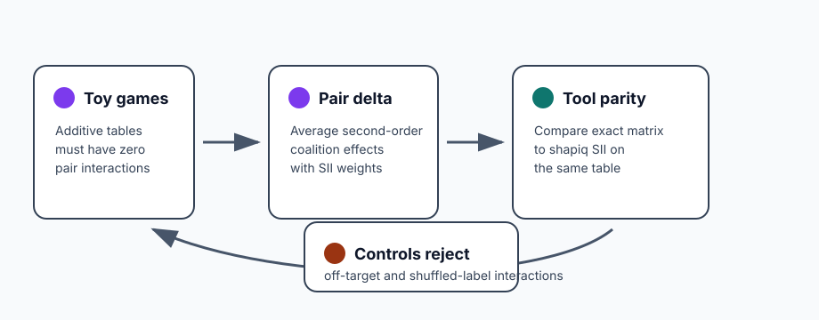
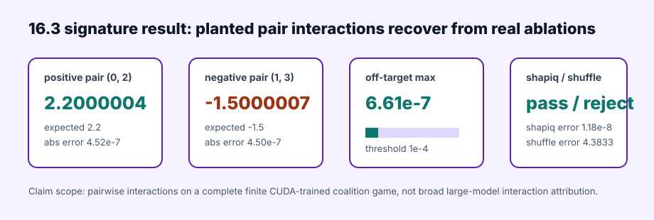

# [16.3] Shapley Interactions with shapiq

> **Notebooks: [exercises](../../exercises/part3_shapley_interactions_shapiq/16.3_Shapley_Interactions_with_shapiq_exercises.ipynb) | [solutions](../../exercises/part3_shapley_interactions_shapiq/16.3_Shapley_Interactions_with_shapiq_solutions.ipynb)**

> **Local-first extension.** This section extends the Shapley attribution track
> from single-feature credit to pairwise interaction credit. You will implement
> exact second-order Shapley interaction indices on complete coalition tables,
> compare them to `shapiq` SII on the same finite games, then inspect a CUDA
> report that recovers planted positive and negative interactions from real
> model ablations.

```python
GT_TIER = "GT-0"
EXERCISE_ID = "16_3_shapley_interactions_with_shapiq"
DIFFICULTY = 4
IMPORTANCE = 4
EXPECTED_RUNTIME = "seconds for visible tests; minutes for the CUDA verification report"
REQUIRES_GPU = True
```

Please send any problems / bugs on the `#errata` channel in the [Slack group](https://info-arena.github.io/ARENA_img/slack.html), and ask any questions on the dedicated channels for this chapter of material.

Links to earlier chapters: [(0) Fundamentals](https://arena-chapter0-fundamentals.streamlit.app/), [(1) Transformer Interpretability](https://arena-chapter1-transformer-interp.streamlit.app/), [(2) RL](https://arena-chapter2-rl.streamlit.app/), [(3) LLM Evaluations](https://arena-chapter3-llm-evals.streamlit.app/), [(4) Alignment Science](https://arena-chapter4-alignment-science.streamlit.app/).



## Core Question

When is an attribution result hiding an interaction?

Single-feature Shapley values can tell you how much total credit each player
gets, but they do not tell you whether value came from a player alone or from a
pair. Pairwise Shapley interaction indices make the second-order structure
visible by averaging the delta:

```text
v(S union {i, j}) - v(S union {i}) - v(S union {j}) + v(S)
```

over background coalitions `S` that contain neither `i` nor `j`. This section
keeps the table complete and finite so the interaction target is exact before
`shapiq` or a trained model enters the story.

<details>
<summary>Help - why not start by calling shapiq?</summary>

`shapiq` is useful, but this is an ARENA notebook: you should first build the
object being checked. Once your exact finite-table interaction matrix works on
additive and planted-interaction games, `shapiq` becomes an independent parity
check rather than an unexplained black box.

</details>

<details>
<summary>Help - what does a negative interaction mean?</summary>

A positive pair interaction means the two players together add more value than
their separate effects. A negative pair interaction means the joint effect is
less than the sum of the separate effects. The CUDA model organism deliberately
contains both: a positive `(0, 2)` interaction and a negative `(1, 3)`
interaction.

</details>

## Learning Objectives

- Build complete additive and planted-interaction coalition tables.
- Implement exact pairwise Shapley interaction indices.
- Verify that additive games have zero pair interactions.
- Recover a target pair while bounding off-target pairs.
- Compare your exact matrix to `shapiq` SII on the same complete table.
- Interpret the CUDA report without claiming broad large-model interaction attribution.

# Setup Code

```python
from collections.abc import Callable, Mapping
from dataclasses import dataclass
import itertools
import json
import math
import sys
from pathlib import Path

import torch as t

chapter = "chapter16_shapley_attribution_baselines"
section = "part3_shapley_interactions_shapiq"
root_dir = next(p for p in [Path.cwd(), *Path.cwd().parents] if (p / chapter).exists())
exercises_dir = root_dir / chapter / "exercises"
section_dir = exercises_dir / section

if str(root_dir) not in sys.path:
    sys.path.append(str(root_dir))
if str(exercises_dir) not in sys.path:
    sys.path.append(str(exercises_dir))

import part3_shapley_interactions_shapiq.tests as tests
import part3_shapley_interactions_shapiq.utils as utils

Coalition = frozenset[int]
MAIN = __name__ == "__main__"
```

Use compact report classes. The key invariant is that a successful interaction
claim reports both the target pair and the strongest off-target pair.

```python
@dataclass(frozen=True)
class PairwiseInteractionReport:
    pair_interactions: t.Tensor
    target_pair: tuple[int, int]
    target_interaction: float
    max_spurious_interaction: float
    recovers_interaction: bool


@dataclass(frozen=True)
class ShapiqInteractionParityReport:
    exact_pair_interactions: t.Tensor
    shapiq_pair_interactions: t.Tensor
    max_abs_error: float
    matches_shapiq: bool
    shapiq_available: bool
```

# Complete Coalition Tables

### Exercise - additive and interaction games

> Difficulty: easy
> Importance: high
>
> You should spend 10 minutes on this exercise.

Implement complete value tables for two tiny games. `additive_game` should
assign each coalition the sum of selected weights. `interaction_game` should
add one extra pair bonus only when both players in `pair` are present.

<details>
<summary>Help - why start with additive games?</summary>

An additive game is the zero-interaction control. If your pairwise interaction
matrix finds a nonzero pair in a purely additive table, the method is detecting
structure that is not there.

</details>

```python
def all_coalitions(num_players: int) -> tuple[Coalition, ...]:
    raise NotImplementedError()


def normalize_coalition_values(
    coalition_values: Mapping[Coalition | tuple[int, ...], float],
    *,
    num_players: int,
) -> dict[Coalition, float]:
    raise NotImplementedError()


def coalition_values_from_function(
    num_players: int,
    value_fn: Callable[[Coalition], float],
) -> dict[Coalition, float]:
    raise NotImplementedError()


def additive_game(weights: t.Tensor) -> dict[Coalition, float]:
    raise NotImplementedError()


def interaction_game(
    num_players: int,
    *,
    pair: tuple[int, int] = (0, 1),
    pair_weight: float = 1.0,
    additive_weights: t.Tensor | None = None,
) -> dict[Coalition, float]:
    raise NotImplementedError()


tests.test_additive_game_enumerates_complete_zero_interaction_table(
    additive_game,
    pairwise_shapley_interactions=lambda values, num_players: t.zeros(
        (num_players, num_players),
        dtype=t.float64,
    ),
)
```

<details>
<summary>Expected output</summary>

```text
All tests in `test_additive_game_enumerates_complete_zero_interaction_table` passed!
```

</details>

<details>
<summary>Common bugs</summary>

- Returning only nonempty coalitions.
- Forgetting the empty coalition.
- Letting `pair=(0, 0)` define a self-interaction.
- Mixing additive weights into the pair bonus.

</details>

<details>
<summary>Solution</summary>

```python
def all_coalitions(num_players: int) -> tuple[Coalition, ...]:
    if num_players <= 0:
        raise ValueError("num_players must be positive.")
    players = range(num_players)
    coalitions = []
    for size in range(num_players + 1):
        coalitions.extend(frozenset(group) for group in itertools.combinations(players, size))
    return tuple(coalitions)


def normalize_coalition_values(
    coalition_values: Mapping[Coalition | tuple[int, ...], float],
    *,
    num_players: int,
) -> dict[Coalition, float]:
    values = {frozenset(key): float(value) for key, value in coalition_values.items()}
    expected = set(all_coalitions(num_players))
    missing = expected - set(values)
    if missing:
        raise ValueError(f"coalition value table is missing {len(missing)} coalitions.")
    return values


def coalition_values_from_function(
    num_players: int,
    value_fn: Callable[[Coalition], float],
) -> dict[Coalition, float]:
    return {coalition: float(value_fn(coalition)) for coalition in all_coalitions(num_players)}


def additive_game(weights: t.Tensor) -> dict[Coalition, float]:
    weights = weights.flatten().double()
    return coalition_values_from_function(
        int(weights.numel()),
        lambda coalition: weights[list(coalition)].sum().item() if coalition else 0.0,
    )


def interaction_game(
    num_players: int,
    *,
    pair: tuple[int, int] = (0, 1),
    pair_weight: float = 1.0,
    additive_weights: t.Tensor | None = None,
) -> dict[Coalition, float]:
    if num_players < 2:
        raise ValueError("interaction_game requires at least two players.")
    first, second = pair
    if first == second:
        raise ValueError("pair must contain two different players.")
    if not (0 <= first < num_players and 0 <= second < num_players):
        raise ValueError("pair players must be valid player indices.")
    if additive_weights is None:
        weights = t.zeros(num_players, dtype=t.float64)
    else:
        weights = additive_weights.flatten().double()
        if int(weights.numel()) != num_players:
            raise ValueError("additive_weights must have one weight per player.")

    def value_fn(coalition: Coalition) -> float:
        additive = weights[list(coalition)].sum().item() if coalition else 0.0
        interaction = pair_weight if first in coalition and second in coalition else 0.0
        return additive + interaction

    return coalition_values_from_function(num_players, value_fn)
```

</details>

# Pairwise Shapley Interactions

### Exercise - exact second-order interaction matrix

> Difficulty: medium
> Importance: high
>
> You should spend 20 minutes on this exercise.

For each unordered pair `(i, j)`, average the second-order delta over
background coalitions excluding both players. The weight for a background
coalition of size `k` is:

```text
k! * (n - k - 2)! / (n - 1)!
```

The output should be a symmetric `num_players x num_players` matrix with zero
diagonal.

<details>
<summary>Help - why is the denominator different from ordinary Shapley?</summary>

Ordinary Shapley averages one player entering an ordering of `n` players.
Second-order interactions average a pair entering relative to the other
players, so the normalization is `(n - 1)!`, not `n!`.

</details>

```python
def pairwise_shapley_interactions(
    coalition_values: Mapping[Coalition | tuple[int, ...], float],
    *,
    num_players: int,
) -> t.Tensor:
    raise NotImplementedError()


tests.test_additive_game_enumerates_complete_zero_interaction_table(
    additive_game,
    pairwise_shapley_interactions,
)
tests.test_interaction_game_recovers_target_pair_delta(
    interaction_game,
    pairwise_shapley_interactions,
)
```

<details>
<summary>Expected output</summary>

```text
All tests in `test_additive_game_enumerates_complete_zero_interaction_table` passed!
All tests in `test_interaction_game_recovers_target_pair_delta` passed!
```

</details>

<details>
<summary>Common bugs</summary>

- Using ordinary Shapley weights.
- Filling only `matrix[i, j]` but not `matrix[j, i]`.
- Including background coalitions that already contain one of the pair players.
- Forgetting that additive terms should cancel in the second-order delta.

</details>

<details>
<summary>Solution</summary>

```python
def pairwise_shapley_interactions(
    coalition_values: Mapping[Coalition | tuple[int, ...], float],
    *,
    num_players: int,
) -> t.Tensor:
    if num_players < 2:
        raise ValueError("pairwise interactions require at least two players.")
    values = normalize_coalition_values(coalition_values, num_players=num_players)
    interactions = t.zeros((num_players, num_players), dtype=t.float64)
    denominator = math.factorial(num_players - 1)
    for first, second in itertools.combinations(range(num_players), 2):
        others = [player for player in range(num_players) if player not in (first, second)]
        score = 0.0
        for size in range(num_players - 1):
            weight = (
                math.factorial(size)
                * math.factorial(num_players - size - 2)
                / denominator
            )
            for group in itertools.combinations(others, size):
                coalition = frozenset(group)
                delta = (
                    values[coalition | {first, second}]
                    - values[coalition | {first}]
                    - values[coalition | {second}]
                    + values[coalition]
                )
                score += weight * delta
        interactions[first, second] = score
        interactions[second, first] = score
    return interactions
```

</details>

# Interaction Reports

### Exercise - target-pair and off-target controls

> Difficulty: medium
> Importance: high
>
> You should spend 15 minutes on this exercise.

Wrap the interaction matrix in a report that checks one target pair and rejects
spurious off-target pairs. Checking only the target pair is not enough; a
broken method can recover `(0, 1)` while hallucinating interactions elsewhere.

```python
def pairwise_interaction_report(
    coalition_values: Mapping[Coalition | tuple[int, ...], float],
    *,
    num_players: int,
    target_pair: tuple[int, int] = (0, 1),
    expected_target: float = 1.0,
    tolerance: float = 1e-9,
) -> PairwiseInteractionReport:
    raise NotImplementedError()


tests.test_pairwise_interaction_report_matches_reference_and_rejects_spurious_pairs(
    pairwise_interaction_report,
)
```

<details>
<summary>Expected output</summary>

```text
All tests in `test_pairwise_interaction_report_matches_reference_and_rejects_spurious_pairs` passed!
```

</details>

<details>
<summary>Common bugs</summary>

- Comparing only one target pair and ignoring off-target pairs.
- Treating `(i, j)` and `(j, i)` as different claims.
- Returning a pass even when the target pair sign is wrong.

</details>

<details>
<summary>Solution</summary>

```python
def pairwise_interaction_report(
    coalition_values: Mapping[Coalition | tuple[int, ...], float],
    *,
    num_players: int,
    target_pair: tuple[int, int] = (0, 1),
    expected_target: float = 1.0,
    tolerance: float = 1e-9,
) -> PairwiseInteractionReport:
    first, second = target_pair
    if first == second:
        raise ValueError("target_pair must contain two different players.")
    if not (0 <= first < num_players and 0 <= second < num_players):
        raise ValueError("target_pair players must be valid player indices.")

    interactions = pairwise_shapley_interactions(coalition_values, num_players=num_players)
    target_value = float(interactions[first, second].item())
    spurious = [
        abs(float(interactions[row, col].item()))
        for row, col in itertools.combinations(range(num_players), 2)
        if frozenset((row, col)) != frozenset(target_pair)
    ]
    max_spurious = max(spurious, default=0.0)
    return PairwiseInteractionReport(
        pair_interactions=interactions,
        target_pair=target_pair,
        target_interaction=target_value,
        max_spurious_interaction=max_spurious,
        recovers_interaction=(
            abs(target_value - expected_target) <= tolerance
            and max_spurious <= tolerance
        ),
    )
```

</details>

# shapiq Parity

### Exercise - compare exact interactions to shapiq SII

> Difficulty: medium
> Importance: high
>
> You should spend 20 minutes on this exercise.

`shapiq` exposes several interaction indices. In this exercise, compare your
exact pairwise formula to `shapiq`'s SII implementation on the same complete
table. Treat a missing `shapiq` install as a real environment failure, not as a
skipped check.

<details>
<summary>Help - how does shapiq call the game?</summary>

`shapiq` calls a game function with boolean coalition arrays. Convert each row
back into a `frozenset` of player indices before reading your complete value
table.

</details>

```python
def shapiq_pairwise_interactions(
    coalition_values: Mapping[Coalition | tuple[int, ...], float],
    *,
    num_players: int,
    index: str = "SII",
) -> t.Tensor:
    raise NotImplementedError()


def shapiq_interaction_parity_report(
    coalition_values: Mapping[Coalition | tuple[int, ...], float],
    *,
    num_players: int,
    index: str = "SII",
    tolerance: float = 1e-6,
) -> ShapiqInteractionParityReport:
    raise NotImplementedError()


tests.test_shapiq_interaction_parity_report_matches_exact_sii(
    shapiq_interaction_parity_report,
)
```

<details>
<summary>Expected output</summary>

```text
All tests in `test_shapiq_interaction_parity_report_matches_exact_sii` passed!
```

</details>

<details>
<summary>Common bugs</summary>

- Passing coalition tuples directly to `shapiq` instead of a callable game.
- Comparing against a different interaction index than SII.
- Treating `shapiq` as proof of correctness without the exact toy controls.

</details>

<details>
<summary>Solution</summary>

```python
def shapiq_pairwise_interactions(
    coalition_values: Mapping[Coalition | tuple[int, ...], float],
    *,
    num_players: int,
    index: str = "SII",
) -> t.Tensor:
    values = normalize_coalition_values(coalition_values, num_players=num_players)
    import numpy as np
    import shapiq

    def game(coalitions):
        array = np.asarray(coalitions, dtype=bool)
        if array.ndim == 1:
            array = array[None, :]
        outputs = []
        for row in array:
            coalition = frozenset(
                player for player, present in enumerate(row.tolist()) if present
            )
            outputs.append(values[coalition])
        return np.asarray(outputs, dtype=float)

    explainer = shapiq.AgnosticExplainer(
        game,
        n_players=num_players,
        index=index,
        max_order=2,
        random_state=0,
    )
    interaction_values = explainer.explain(budget=2**num_players, random_state=0)
    matrix = t.zeros((num_players, num_players), dtype=t.float64)
    for first, second in itertools.combinations(range(num_players), 2):
        lookup = interaction_values.interaction_lookup
        lookup_key = (first, second)
        reverse_key = (second, first)
        value_index = lookup[lookup_key] if lookup_key in lookup else lookup[reverse_key]
        value = float(interaction_values.values[value_index])
        matrix[first, second] = value
        matrix[second, first] = value
    return matrix


def shapiq_interaction_parity_report(
    coalition_values: Mapping[Coalition | tuple[int, ...], float],
    *,
    num_players: int,
    index: str = "SII",
    tolerance: float = 1e-6,
) -> ShapiqInteractionParityReport:
    exact = pairwise_shapley_interactions(coalition_values, num_players=num_players)
    observed = shapiq_pairwise_interactions(
        coalition_values,
        num_players=num_players,
        index=index,
    )
    max_error = float((exact - observed).abs().max().item())
    return ShapiqInteractionParityReport(
        exact_pair_interactions=exact,
        shapiq_pair_interactions=observed,
        max_abs_error=max_error,
        matches_shapiq=max_error <= tolerance,
        shapiq_available=True,
    )
```

</details>

# Neural-Game Sanity Check

### Exercise - inspect the planted interaction target

> Difficulty: easy
> Importance: high
>
> You should spend 5 minutes on this exercise.

Before trusting the trained-model report, inspect the analytic four-feature
game used by the CUDA path. Its value rule has a positive `(0, 2)` interaction
and a negative `(1, 3)` interaction.

```python
tests.test_neural_game_value_table_contains_planted_interactions()
```

<details>
<summary>Expected output</summary>

```text
All tests in `test_neural_game_value_table_contains_planted_interactions` passed!
```

</details>

<details>
<summary>Interpreting the result</summary>

This is the toy ground truth before the real model claim. The trained CUDA MLP
is only meaningful because the analytic game tells us exactly which pair
interactions should appear and which off-target pairs should stay near zero.

</details>

# Notebook Contract

The smoke contract exposes the deterministic toy checks that the verification
runner records in `expected_outputs/smoke_test.json`.

```python
def _tensor_report(report) -> dict:
    result = report.__dict__.copy()
    for key, value in list(result.items()):
        if hasattr(value, "tolist"):
            result[key] = value.tolist()
    return result


def additive_interaction_smoke_test() -> dict:
    values = additive_game(t.tensor([1.0, -2.0, 0.5]))
    interactions = pairwise_shapley_interactions(values, num_players=3)
    return {
        "pair_interactions": interactions.tolist(),
        "max_abs_interaction": float(interactions.abs().max().item()),
    }


def target_pair_interaction_smoke_test() -> dict:
    values = interaction_game(
        3,
        pair=(0, 1),
        pair_weight=1.0,
        additive_weights=t.tensor([0.5, -1.0, 2.0]),
    )
    return _tensor_report(pairwise_interaction_report(values, num_players=3))


def shapiq_parity_smoke_test() -> dict:
    values = interaction_game(
        3,
        pair=(0, 1),
        pair_weight=1.0,
        additive_weights=t.tensor([0.5, -1.0, 2.0]),
    )
    return _tensor_report(shapiq_interaction_parity_report(values, num_players=3))


def run_smoke_test(cpu: bool = True) -> dict:
    _ = cpu
    return {
        "additive_interactions": additive_interaction_smoke_test(),
        "target_pair": target_pair_interaction_smoke_test(),
        "shapiq_parity": shapiq_parity_smoke_test(),
    }


tests.test_notebook_contract(run_smoke_test)
```

<details>
<summary>Expected output</summary>

```text
All tests in `test_notebook_contract` passed!
```

</details>

<details>
<summary>Common bugs</summary>

- Returning tensors directly from the smoke contract.
- Omitting the additive zero-interaction control.
- Treating toy `shapiq` parity as a trained-model interaction claim.

</details>

# CUDA Verification Report

The committed verification report is the signature result for this section. It
trains a small CUDA MLP on all 16 examples in the four-feature binary game,
builds a coalition table from real model ablations, then recovers the planted
positive and negative pair interactions.

```python
report = json.loads((section_dir / "verification_report.json").read_text())
gpu = report["metrics"]["gpu_test"]

assert report["accepted"] and report["tests_passed"]
assert report["gt_tier"] == "GT-0"
assert gpu["cuda_available"] and gpu["preflight_passed"]
assert gpu["model_family"] == "cuda_trained_neural_coalition_game_mlp"
assert gpu["positive_interaction_pair"] == [0, 2]
assert gpu["negative_interaction_pair"] == [1, 3]
assert gpu["interaction_max_abs_error"] <= 1e-4
assert gpu["max_spurious_interaction"] <= 1e-4
assert gpu["shapiq_matches"]
assert gpu["shuffled_control_rejected"]

tests.test_committed_gpu_report_matches_shapley_interaction_contract(gpu)
```

<details>
<summary>Expected output</summary>

```text
device: NVIDIA GeForce RTX 5090 Laptop GPU
torch: 2.12.1+cu132
cuda: 13.2
positive pair (0, 2): 2.2000004, abs error 4.52e-7
negative pair (1, 3): -1.5000007, abs error 4.50e-7
max spurious interaction: 6.61e-7
shapiq max abs error: 1.18e-8
shuffled-label interaction error: 4.3833, rejected
```

</details>

<details>
<summary>Interpreting the result</summary>

The positive result is not "pairwise interaction attribution works on every
large model." It is narrower and stronger: on a complete finite table produced
by a CUDA-trained neural model, exact pairwise interactions recover both
planted signs, off-target interactions stay near zero, `shapiq` agrees on the
same table, and the shuffled-label trained model is rejected.

</details>

## Signature Result



| Check | Result | Why it matters |
| --- | ---: | --- |
| Complete coalition table | 16 coalitions | No sampled approximation is needed for the core claim |
| Neural fit MSE | `1.102e-12` | The trained model organism learned the finite target |
| Positive pair `(0, 2)` | `2.2000004` | Recovers the planted positive interaction |
| Negative pair `(1, 3)` | `-1.5000007` | Recovers the planted negative interaction |
| Max interaction error | `4.52e-7` | Real model ablation values match analytic pair interactions |
| Max off-target interaction | `6.61e-7` | Unplanted pairs are not hallucinated |
| `shapiq` parity error | `1.18e-8` | Independent SII implementation agrees on the trained-model table |
| Shuffled-label error | `4.3833` | A meaningless trained-model interaction map is rejected |
| Peak VRAM | `0.063 GB` | The report is lightweight on the 24GB CUDA machine |

## Limitations

- This section proves pairwise interactions on complete finite tables, not
  high-dimensional sampled interaction attribution.
- The CUDA model organism has four binary features and two planted pair
  interactions. That is ground truth for this lesson, not a benchmark for every
  interaction method.
- Pairwise indices do not capture higher-order interactions. A three-way XOR
  can still look different under second-order summaries.
- `shapiq` parity only proves agreement with SII on the same finite table. It
  does not prove a different index, budget, or sampling policy.

## Further Research

- Add a three-way interaction game and compare pairwise SII against higher-order
  indices.
- Measure how sampled interaction estimates degrade as coalition budgets fall
  below the complete-table budget.
- Compare pairwise Shapley interactions with activation patching on the same
  planted model organism.
- Test whether learned sparse features make the interaction matrix more stable
  than raw input features.
