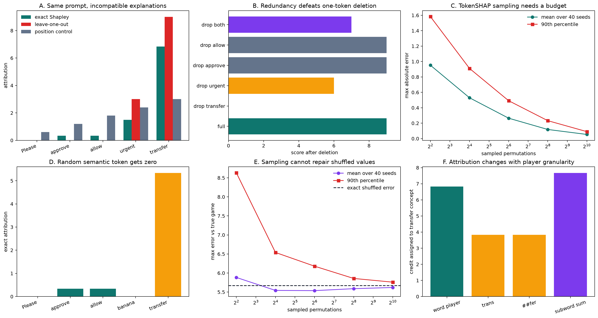

# [16.4] TokenSHAP and TokenShapley

> **Notebooks: [exercises](../../exercises/part4_tokenshap_token_shapley/16.4_TokenSHAP_and_TokenShapley_exercises.ipynb) | [solutions](../../exercises/part4_tokenshap_token_shapley/16.4_TokenSHAP_and_TokenShapley_solutions.ipynb)**

```python
GT_TIER = "GT-0"
EXERCISE_ID = "16_4_tokenshap_and_tokenshapley"
DIFFICULTY = 4
IMPORTANCE = 5
EXPECTED_RUNTIME = "2-3 hours"
REQUIRES_GPU = False  # learner lab; release verification is separate
```

Please send problems or bugs on the `#errata` channel in the
[ARENA Slack group](https://info-arena.github.io/ARENA_img/slack.html).


## Core Question

> **Claim.** By the end of this notebook, you will have shown that exact token-position
> Shapley values recover a necessary token, share credit across a redundant pair, and split
> a context interaction fairly, while deletion, random-token, position-only, and shuffled-value
> controls fail; you will also exhibit exact cases where tokenization and masking change the answer.

A score of `9` is attached to the prompt:

```text
Please approve allow urgent transfer
```

The word `transfer` is necessary. `approve` and `allow` are redundant: either one unlocks
the same two points. `urgent` contributes three points only together with `transfer`.
`Please` is a distractor. Before calculating anything, predict which method will notice that
deleting either redundant word from the full prompt changes nothing.

The exact game is

$$v(S)=x_T\left(4 + 2\,\mathbb{1}[x_A \lor x_L] + 3x_U\right).$$

We can evaluate all `2**5 = 32` coalitions, so every approximation and baseline has an exact
oracle.

## Learning Objectives

- define the player set and position-preserving masking intervention;
- implement exact and permutation-sampled token Shapley values;
- compare global Shapley credit with local leave-one-out and a position-only control;
- diagnose redundancy and synergy with finite second differences;
- change the player grouping when one concept is split into subword tokens;
- show why perfectly correlated tokens do not identify off-manifold attribution;
- quantify Monte Carlo error over budgets and seeds.

```python
import itertools
import math
import random
import sys
from collections.abc import Callable, Mapping, Sequence
from dataclasses import dataclass
from pathlib import Path

import matplotlib.pyplot as plt
import pandas as pd
import torch as t

chapter = "chapter16_shapley_attribution_baselines"
section = "part4_tokenshap_token_shapley"
root_dir = next(p for p in [Path.cwd(), *Path.cwd().parents] if (p / chapter).exists())
exercises_dir = root_dir / chapter / "exercises"
section_dir = exercises_dir / section
figure_path = root_dir / chapter / "instructions/assets/tokenshap_exact_signature.png"

for path in (root_dir, exercises_dir):
    if str(path) not in sys.path:
        sys.path.append(str(path))

import part4_tokenshap_token_shapley.tests as tests

Coalition = frozenset[int]
MASK_TOKEN = "[MASK]"
TOKENS = ("Please", "approve", "allow", "urgent", "transfer")
RANDOM_CONTROL_TOKENS = ("Please", "approve", "allow", "banana", "transfer")
SPLIT_TOKENS = ("Please", "approve", "allow", "urgent", "trans", "##fer")

@dataclass(frozen=True)
class CorrelatedPairAudit:
    observed_max_abs_difference: float
    off_manifold_max_abs_difference: float
    redundancy_shapley: t.Tensor
    synergy_shapley: t.Tensor
    attribution_max_abs_difference: float
    identified_from_observed_support: bool
```

### Exercise 1 - build the masked token game

> ```yaml
> Difficulty: 2/5
> Importance: 5/5
> Suggested time: 15 minutes
> ```

Implement coalition enumeration, position-preserving masking, the exact score, and the complete value table. The full prompt scores `9`; every coalition without `transfer` scores `0`.

<details>
<summary>Help - derive the invariant</summary>

Build one masked tuple first. Then loop over the powerset and call the score on each tuple. The empty coalition is the fully masked baseline.

</details>

<details>
<summary>Common bug</summary>

Deleting tokens shifts later positions and changes the game. Replace absent positions with the declared mask token.

</details>

<details>
<summary>Expected output</summary>

```text
All tests in `test_mask_tokens_and_coalition_values_preserve_positions` passed!
```

</details>

<details>
<summary>Interpretation</summary>

The score function is the ground truth. Masking defines what an absent player means, so it is part of the scientific claim.

</details>

<details>
<summary>Solution</summary>

```python
def all_coalitions(num_players: int) -> tuple[Coalition, ...]:
    if num_players <= 0:
        raise ValueError("num_players must be positive.")
    players = range(num_players)
    return tuple(
        frozenset(group)
        for size in range(num_players + 1)
        for group in itertools.combinations(players, size)
    )

def mask_tokens(tokens, coalition, *, mask_token=MASK_TOKEN):
    token_tuple = tuple(tokens)
    if not token_tuple:
        raise ValueError("tokens must be nonempty.")
    keep = frozenset(coalition)
    if not keep.issubset(range(len(token_tuple))):
        raise ValueError("coalition contains an out-of-range token position.")
    return tuple(token if i in keep else mask_token for i, token in enumerate(token_tuple))

def structured_token_score(tokens, *, redundant_mode="or") -> float:
    if redundant_mode not in {"or", "and"}:
        raise ValueError("redundant_mode must be 'or' or 'and'.")
    present = set(tokens)
    transfer = "transfer" in present
    approve, allow = "approve" in present, "allow" in present
    gate = (approve or allow) if redundant_mode == "or" else (approve and allow)
    return float(transfer * (4.0 + 2.0 * gate + 3.0 * ("urgent" in present)))

def token_coalition_values(tokens, score_fn, *, mask_token=MASK_TOKEN):
    token_tuple = tuple(tokens)
    if not token_tuple:
        raise ValueError("tokens must be nonempty.")
    return {
        coalition: float(score_fn(mask_tokens(token_tuple, coalition, mask_token=mask_token)))
        for coalition in all_coalitions(len(token_tuple))
    }
```

</details>

```python
def all_coalitions(num_players: int) -> tuple[Coalition, ...]:
    raise NotImplementedError()

def mask_tokens(tokens, coalition, *, mask_token=MASK_TOKEN):
    raise NotImplementedError()

def structured_token_score(tokens, *, redundant_mode="or") -> float:
    raise NotImplementedError()

def token_coalition_values(tokens, score_fn, *, mask_token=MASK_TOKEN):
    raise NotImplementedError()

tests.test_mask_tokens_and_coalition_values_preserve_positions(
    mask_tokens, token_coalition_values, structured_token_score
)
```

### Exercise 2 - compute exact token Shapley values

> ```yaml
> Difficulty: 4/5
> Importance: 5/5
> Suggested time: 25 minutes
> ```

Implement the factorial-weighted marginal-contribution formula. Validate table completeness first so a missing counterfactual cannot silently become zero.

<details>
<summary>Help - derive the invariant</summary>

For player i and coalition S not containing i, weight v(S union {i}) - v(S) by |S|!(n-|S|-1)!/n!.

</details>

<details>
<summary>Common bug</summary>

Averaging coalition sizes uniformly uses the wrong weights. Shapley averages marginal effects over player orderings.

</details>

<details>
<summary>Expected output</summary>

```text
All tests in `test_exact_shapley_recovers_known_token_roles` passed!
```

</details>

<details>
<summary>Interpretation</summary>

The expected vector is `[0, 1/3, 1/3, 1.5, 41/6]`. The redundant pair gets credit because each word matters in coalitions where its substitute is absent.

</details>

<details>
<summary>Solution</summary>

```python
def normalize_coalition_values(coalition_values, *, num_players):
    values = {frozenset(key): float(value) for key, value in coalition_values.items()}
    expected = set(all_coalitions(num_players))
    missing, extra = expected - set(values), set(values) - expected
    if missing or extra:
        raise ValueError(
            f"coalition table must be complete: missing={len(missing)}, extra={len(extra)}."
        )
    return values

def exact_shapley_values(coalition_values, *, num_players):
    values = normalize_coalition_values(coalition_values, num_players=num_players)
    result = t.zeros(num_players, dtype=t.float64)
    denominator = math.factorial(num_players)
    for player in range(num_players):
        others = [i for i in range(num_players) if i != player]
        for size in range(num_players):
            weight = math.factorial(size) * math.factorial(num_players-size-1) / denominator
            for members in itertools.combinations(others, size):
                coalition = frozenset(members)
                result[player] += weight * (
                    values[coalition | {player}] - values[coalition]
                )
    return result

def exact_token_shapley_values(tokens, score_fn, *, mask_token=MASK_TOKEN):
    token_tuple = tuple(tokens)
    values = token_coalition_values(token_tuple, score_fn, mask_token=mask_token)
    return exact_shapley_values(values, num_players=len(token_tuple))
```

</details>

```python
def normalize_coalition_values(coalition_values, *, num_players):
    raise NotImplementedError()

def exact_shapley_values(coalition_values, *, num_players):
    raise NotImplementedError()

def exact_token_shapley_values(tokens, score_fn, *, mask_token=MASK_TOKEN):
    raise NotImplementedError()

tests.test_exact_shapley_recovers_known_token_roles(
    exact_shapley_values, token_coalition_values, structured_token_score
)
```

### Exercise 3 - estimate TokenSHAP from random orderings

> ```yaml
> Difficulty: 3/5
> Importance: 5/5
> Suggested time: 20 minutes
> ```

Sample player permutations, record each token's marginal contribution when it enters, and average. Every ordering must telescope from the masked score to the full score.

<details>
<summary>Help - derive the invariant</summary>

Walk through one random ordering from the empty coalition. Each player receives the score jump at the moment it enters.

</details>

<details>
<summary>Common bug</summary>

Resampling a fresh coalition for each player destroys the telescoping path and can violate efficiency.

</details>

<details>
<summary>Expected output</summary>

```text
All tests in `test_sampled_shapley_matches_exact_and_is_seeded` passed!
```

</details>

<details>
<summary>Interpretation</summary>

Monte Carlo sampling is unbiased for this estimator, but a single seed can still be visibly wrong at a small budget.

</details>

<details>
<summary>Solution</summary>

```python
def sampled_permutation_shapley_values(
    coalition_values, *, num_players, num_samples, seed=0
):
    if num_samples <= 0:
        raise ValueError("num_samples must be positive.")
    values = normalize_coalition_values(coalition_values, num_players=num_players)
    rng = random.Random(seed)
    totals = t.zeros(num_players, dtype=t.float64)
    players = tuple(range(num_players))
    for _ in range(num_samples):
        coalition = frozenset()
        for player in rng.sample(players, k=num_players):
            with_player = coalition | {player}
            totals[player] += values[with_player] - values[coalition]
            coalition = with_player
    return totals / num_samples
```

</details>

```python
def sampled_permutation_shapley_values(
    coalition_values, *, num_players, num_samples, seed=0
):
    raise NotImplementedError()

tests.test_sampled_shapley_matches_exact_and_is_seeded(
    sampled_permutation_shapley_values, token_coalition_values, structured_token_score
)
```

### Exercise 4 - construct local and position controls

> ```yaml
> Difficulty: 2/5
> Importance: 5/5
> Suggested time: 15 minutes
> ```

Implement full-prompt leave-one-out and a recency-only attribution normalized to the same total score. A useful control may satisfy a superficial metric while failing semantics.

<details>
<summary>Help - derive the invariant</summary>

Leave-one-out is v(N)-v(N without {i}). The position control can use weights 1,...,n and normalize them to the full-minus-mask delta.

</details>

<details>
<summary>Common bug</summary>

Treating leave-one-out values as an additive decomposition hides that their sum is 12 while the score delta is 9.

</details>

<details>
<summary>Expected output</summary>

```text
All tests in `test_local_and_position_controls_fail_semantically` passed!
```

</details>

<details>
<summary>Interpretation</summary>

Leave-one-out assigns both redundant words zero and double-counts interactions. The recency control satisfies efficiency yet credits the distractor.

</details>

<details>
<summary>Solution</summary>

```python
def leave_one_out_values(tokens, score_fn, *, mask_token=MASK_TOKEN):
    token_tuple = tuple(tokens)
    full_score = float(score_fn(token_tuple))
    result = []
    for player in range(len(token_tuple)):
        kept = frozenset(i for i in range(len(token_tuple)) if i != player)
        result.append(full_score - score_fn(mask_tokens(token_tuple, kept, mask_token=mask_token)))
    return t.tensor(result, dtype=t.float64)

def recency_position_control(total_delta, num_players):
    if num_players <= 0:
        raise ValueError("num_players must be positive.")
    weights = t.arange(1, num_players + 1, dtype=t.float64)
    return float(total_delta) * weights / weights.sum()
```

</details>

```python
def leave_one_out_values(tokens, score_fn, *, mask_token=MASK_TOKEN):
    raise NotImplementedError()

def recency_position_control(total_delta, num_players):
    raise NotImplementedError()

tests.test_local_and_position_controls_fail_semantically(
    leave_one_out_values, recency_position_control, structured_token_score
)
```

### Exercise 5 - separate redundancy from synergy

> ```yaml
> Difficulty: 3/5
> Importance: 5/5
> Suggested time: 15 minutes
> ```

Implement a context-specific finite second difference. The approve/allow pair has `-2` redundancy when transfer and urgency are present; urgent/transfer has `+3` synergy from the empty context.

<details>
<summary>Help - derive the invariant</summary>

Use v(S union {i,j}) - v(S union {i}) - v(S union {j}) + v(S). The sign distinguishes local synergy from redundancy.

</details>

<details>
<summary>Common bug</summary>

Computing v(S+i+j)-v(S) mixes main effects into the interaction.

</details>

<details>
<summary>Expected output</summary>

```text
All tests in `test_pair_differences_reveal_redundancy_and_synergy` passed!
```

</details>

<details>
<summary>Interpretation</summary>

A token's first-order credit can contain both main effects and shared interaction credit. Pair diagnostics explain why the methods disagree.

</details>

<details>
<summary>Solution</summary>

```python
def discrete_pair_interaction(
    coalition_values, pair, *, context=frozenset(), num_players
):
    i, j = pair
    if i == j or not {i, j}.issubset(range(num_players)):
        raise ValueError("pair must contain two distinct valid players.")
    base = frozenset(context)
    if base & {i, j}:
        raise ValueError("context must exclude both members of the pair.")
    values = normalize_coalition_values(coalition_values, num_players=num_players)
    return (
        values[base | {i, j}] - values[base | {i}]
        - values[base | {j}] + values[base]
    )
```

</details>

```python
def discrete_pair_interaction(
    coalition_values, pair, *, context=frozenset(), num_players
):
    raise NotImplementedError()

tests.test_pair_differences_reveal_redundancy_and_synergy(
    discrete_pair_interaction, token_coalition_values, structured_token_score
)
```

### Exercise 6 - change the player set for subword tokens

> ```yaml
> Difficulty: 4/5
> Importance: 5/5
> Suggested time: 25 minutes
> ```

Split `transfer` into `trans` and `##fer`, requiring both pieces. Then implement grouped coalitions so the two pieces can act as one semantic player.

<details>
<summary>Help - derive the invariant</summary>

A grouped coalition keeps either every position in a group or none of them. Validate that groups partition all positions exactly once.

</details>

<details>
<summary>Common bug</summary>

Summing subword attributions after the fact is not generally equal to making the whole word one player.

</details>

<details>
<summary>Expected output</summary>

```text
All tests in `test_grouped_players_expose_tokenization_dependence` passed!
```

</details>

<details>
<summary>Interpretation</summary>

The two subword credits sum to `46/6`, while the grouped concept receives `41/6`. Shapley grouping need not equal post-hoc summation when interactions are present.

</details>

<details>
<summary>Solution</summary>

```python
def split_token_score(tokens, *, redundant_mode="or"):
    present = set(tokens)
    rebuilt = list(tokens)
    if "trans" in present and "##fer" in present:
        rebuilt.append("transfer")
    return structured_token_score(rebuilt, redundant_mode=redundant_mode)

def grouped_coalition_values(tokens, groups, score_fn, *, mask_token=MASK_TOKEN):
    token_tuple = tuple(tokens)
    normalized = tuple(frozenset(group) for group in groups)
    flattened = [position for group in normalized for position in group]
    if sorted(flattened) != list(range(len(token_tuple))):
        raise ValueError("groups must partition every token position exactly once.")
    values = {}
    for coalition in all_coalitions(len(normalized)):
        kept = (
            frozenset().union(*(normalized[i] for i in coalition))
            if coalition else frozenset()
        )
        values[coalition] = float(score_fn(mask_tokens(token_tuple, kept, mask_token=mask_token)))
    return values
```

</details>

```python
def split_token_score(tokens, *, redundant_mode="or"):
    raise NotImplementedError()

def grouped_coalition_values(tokens, groups, score_fn, *, mask_token=MASK_TOKEN):
    raise NotImplementedError()

tests.test_grouped_players_expose_tokenization_dependence(
    grouped_coalition_values,
    exact_shapley_values,
    token_coalition_values,
    split_token_score,
)
```

### Exercise 7 - audit a perfectly correlated token pair

> ```yaml
> Difficulty: 4/5
> Importance: 5/5
> Suggested time: 25 minutes
> ```

Compare an OR redundancy game with an AND synergy game when `approve` and `allow` are observed only together. Measure agreement on support, disagreement off manifold, and attribution disagreement.

<details>
<summary>Help - derive the invariant</summary>

Observed support contains coalitions where the pair is jointly present or jointly absent. Single-member coalitions are off manifold.

</details>

<details>
<summary>Common bug</summary>

Agreement on correlated observations does not imply agreement on masked single-token counterfactuals.

</details>

<details>
<summary>Expected output</summary>

```text
All tests in `test_correlated_support_does_not_identify_attribution` passed!
```

</details>

<details>
<summary>Interpretation</summary>

Identical observed behavior can support different Shapley explanations because coalition masking queries counterfactuals absent from the data.

</details>

<details>
<summary>Solution</summary>

```python
def correlated_pair_audit(
    tokens, redundancy_score_fn, synergy_score_fn, *, pair, mask_token=MASK_TOKEN
):
    token_tuple = tuple(tokens)
    red = token_coalition_values(token_tuple, redundancy_score_fn, mask_token=mask_token)
    syn = token_coalition_values(token_tuple, synergy_score_fn, mask_token=mask_token)
    i, j = pair
    observed = [c for c in all_coalitions(len(token_tuple)) if (i in c) == (j in c)]
    off_manifold = [c for c in all_coalitions(len(token_tuple)) if (i in c) != (j in c)]
    observed_diff = max(abs(red[c] - syn[c]) for c in observed)
    off_diff = max(abs(red[c] - syn[c]) for c in off_manifold)
    red_phi = exact_shapley_values(red, num_players=len(token_tuple))
    syn_phi = exact_shapley_values(syn, num_players=len(token_tuple))
    attr_diff = float((red_phi - syn_phi).abs().max())
    return CorrelatedPairAudit(
        observed_diff, off_diff, red_phi, syn_phi, attr_diff,
        observed_diff > 0.0 or attr_diff == 0.0,
    )
```

</details>

```python
def correlated_pair_audit(
    tokens, redundancy_score_fn, synergy_score_fn, *, pair, mask_token=MASK_TOKEN
):
    raise NotImplementedError()

tests.test_correlated_support_does_not_identify_attribution(
    correlated_pair_audit, structured_token_score
)
```

### Exercise 8 - measure convergence over budgets and seeds

> ```yaml
> Difficulty: 3/5
> Importance: 5/5
> Suggested time: 20 minutes
> ```

Return mean and 90th-percentile maximum absolute error for each permutation budget. Then shuffle values within equal-size mask buckets: this preserves both endpoints and each bucket's score distribution while destroying token semantics.

<details>
<summary>Help - derive the invariant</summary>

For each budget, run all seeds against the exact vector. Aggregate maximum absolute error, not just the top-token identity.

</details>

<details>
<summary>Common bug</summary>

Reporting one seed can turn a lucky estimate into a false convergence claim.

</details>

<details>
<summary>Expected output</summary>

```text
All tests in `test_sampling_convergence_reports_seed_distribution` passed!
All tests in `test_random_token_and_shuffled_value_controls_fail` passed!
```

</details>

<details>
<summary>Interpretation</summary>

At 1024 samples the mean maximum error is about `0.0539`; at 4 samples it is about `0.9521`. The random token receives zero, while the shuffled game stays semantically wrong even with 4096 samples.

</details>

<details>
<summary>Solution</summary>

```python
def shuffle_coalition_values_within_sizes(
    coalition_values, *, num_players, seed=0
):
    values = normalize_coalition_values(coalition_values, num_players=num_players)
    rng = random.Random(seed)
    shuffled = {}
    for size in range(num_players + 1):
        coalitions = [c for c in all_coalitions(num_players) if len(c) == size]
        bucket = [values[c] for c in coalitions]
        rng.shuffle(bucket)
        shuffled.update(zip(coalitions, bucket, strict=True))
    return shuffled

def sampling_convergence(
    coalition_values, *, num_players, budgets, seeds, reference_values=None
):
    if not budgets or not seeds:
        raise ValueError("budgets and seeds must be nonempty.")
    exact = (
        exact_shapley_values(coalition_values, num_players=num_players)
        if reference_values is None
        else t.as_tensor(reference_values, dtype=t.float64)
    )
    if exact.shape != (num_players,):
        raise ValueError(f"reference_values must have shape ({num_players},).")
    rows = []
    for budget in budgets:
        errors = t.tensor([
            float((sampled_permutation_shapley_values(
                coalition_values,
                num_players=num_players,
                num_samples=int(budget),
                seed=int(seed),
            ) - exact).abs().max())
            for seed in seeds
        ], dtype=t.float64)
        rows.append({
            "budget": int(budget),
            "mean_max_abs_error": float(errors.mean()),
            "p90_max_abs_error": float(t.quantile(errors, 0.9)),
        })
    return rows
```

</details>

```python
def shuffle_coalition_values_within_sizes(
    coalition_values, *, num_players, seed=0
):
    raise NotImplementedError()

def sampling_convergence(
    coalition_values, *, num_players, budgets, seeds, reference_values=None
):
    raise NotImplementedError()

tests.test_sampling_convergence_reports_seed_distribution(
    sampling_convergence, token_coalition_values, structured_token_score
)
tests.test_random_token_and_shuffled_value_controls_fail(
    shuffle_coalition_values_within_sizes,
    exact_shapley_values,
    exact_token_shapley_values,
    sampling_convergence,
    token_coalition_values,
    structured_token_score,
)
```

## Signature result - fair global credit and visibly failing controls

The first panel compares three explanations of the same score. Exact Shapley is the only one
that gives both redundant words nonzero credit without double-counting the total. The deletion
panel makes the failure concrete. The remaining panels show convergence to the exact oracle,
a random-token negative control, a value-shuffling negative control, and player-definition
dependence.

```python
values = token_coalition_values(TOKENS, structured_token_score)
exact = exact_shapley_values(values, num_players=len(TOKENS))
loo = leave_one_out_values(TOKENS, structured_token_score)
position = recency_position_control(9.0, len(TOKENS))
convergence = pd.DataFrame(sampling_convergence(
    values,
    num_players=len(TOKENS),
    budgets=(4, 16, 64, 256, 1024),
    seeds=tuple(range(40)),
))
random_exact = exact_token_shapley_values(RANDOM_CONTROL_TOKENS, structured_token_score)
shuffled_values = shuffle_coalition_values_within_sizes(
    values, num_players=len(TOKENS), seed=11
)
shuffled_exact = exact_shapley_values(shuffled_values, num_players=len(TOKENS))
shuffled_convergence = pd.DataFrame(sampling_convergence(
    shuffled_values,
    num_players=len(TOKENS),
    budgets=(4, 16, 64, 256, 1024),
    seeds=tuple(range(40)),
    reference_values=exact,
))

deletions = {
    "full": structured_token_score(TOKENS),
    "drop transfer": structured_token_score(mask_tokens(TOKENS, {0, 1, 2, 3})),
    "drop urgent": structured_token_score(mask_tokens(TOKENS, {0, 1, 2, 4})),
    "drop approve": structured_token_score(mask_tokens(TOKENS, {0, 2, 3, 4})),
    "drop allow": structured_token_score(mask_tokens(TOKENS, {0, 1, 3, 4})),
    "drop both": structured_token_score(mask_tokens(TOKENS, {0, 3, 4})),
}

split_values = token_coalition_values(SPLIT_TOKENS, split_token_score)
split_phi = exact_shapley_values(split_values, num_players=len(SPLIT_TOKENS))
groups = ((0,), (1,), (2,), (3,), (4, 5))
grouped_values = grouped_coalition_values(SPLIT_TOKENS, groups, split_token_score)
grouped_phi = exact_shapley_values(grouped_values, num_players=len(groups))

fig, axes = plt.subplots(2, 3, figsize=(17, 9), constrained_layout=True)
x = t.arange(len(TOKENS)).numpy()
width = 0.25
axes[0, 0].bar(x-width, exact.numpy(), width, label="exact Shapley", color="#0f766e")
axes[0, 0].bar(x, loo.numpy(), width, label="leave-one-out", color="#dc2626")
axes[0, 0].bar(x+width, position.numpy(), width, label="position control", color="#64748b")
axes[0, 0].axhline(0, color="black", linewidth=0.8)
axes[0, 0].set_xticks(x, TOKENS, rotation=22, ha="right")
axes[0, 0].set_ylabel("attribution")
axes[0, 0].set_title("A. Same prompt, incompatible explanations")
axes[0, 0].legend(frameon=False)

axes[0, 1].barh(list(deletions), list(deletions.values()), color=[
    "#0f766e", "#dc2626", "#f59e0b", "#64748b", "#64748b", "#7c3aed"
])
axes[0, 1].set_xlabel("score after deletion")
axes[0, 1].set_title("B. Redundancy defeats one-token deletion")
axes[0, 1].set_xlim(0, 9.8)

axes[0, 2].plot(
    convergence["budget"], convergence["mean_max_abs_error"],
    marker="o", label="mean over 40 seeds", color="#0f766e"
)
axes[0, 2].plot(
    convergence["budget"], convergence["p90_max_abs_error"],
    marker="s", label="90th percentile", color="#dc2626"
)
axes[0, 2].set_xscale("log", base=2)
axes[0, 2].set_xlabel("sampled permutations")
axes[0, 2].set_ylabel("max absolute error")
axes[0, 2].set_title("C. TokenSHAP sampling needs a budget")
axes[0, 2].legend(frameon=False)

random_x = t.arange(len(RANDOM_CONTROL_TOKENS)).numpy()
axes[1, 0].bar(random_x, random_exact.numpy(), color=[
    "#64748b", "#0f766e", "#0f766e", "#64748b", "#f59e0b"
])
axes[1, 0].set_xticks(random_x, RANDOM_CONTROL_TOKENS, rotation=22, ha="right")
axes[1, 0].set_ylabel("exact attribution")
axes[1, 0].set_title("D. Random semantic token gets zero")

axes[1, 1].plot(
    shuffled_convergence["budget"], shuffled_convergence["mean_max_abs_error"],
    marker="o", label="mean over 40 seeds", color="#7c3aed"
)
axes[1, 1].plot(
    shuffled_convergence["budget"], shuffled_convergence["p90_max_abs_error"],
    marker="s", label="90th percentile", color="#dc2626"
)
axes[1, 1].axhline(
    float((shuffled_exact-exact).abs().max()), color="#111827", linestyle="--",
    label="exact shuffled error"
)
axes[1, 1].set_xscale("log", base=2)
axes[1, 1].set_xlabel("sampled permutations")
axes[1, 1].set_ylabel("max error vs true game")
axes[1, 1].set_title("E. Sampling cannot repair shuffled values")
axes[1, 1].legend(frameon=False)

tokenization_rows = {
    "word player": float(grouped_phi[-1]),
    "trans": float(split_phi[-2]),
    "##fer": float(split_phi[-1]),
    "subword sum": float(split_phi[-2:].sum()),
}
axes[1, 2].bar(list(tokenization_rows), list(tokenization_rows.values()), color=[
    "#0f766e", "#f59e0b", "#f59e0b", "#7c3aed"
])
axes[1, 2].set_ylabel("credit assigned to transfer concept")
axes[1, 2].set_title("F. Attribution changes with player granularity")
axes[1, 2].tick_params(axis="x", rotation=18)

figure_path.parent.mkdir(parents=True, exist_ok=True)
fig.savefig(figure_path, dpi=180, bbox_inches="tight")
plt.show()

display(pd.DataFrame({
    "token": TOKENS,
    "exact_shapley": exact.tolist(),
    "leave_one_out": loo.tolist(),
    "position_control": position.tolist(),
}).round(4))
print(f"Full-minus-mask score: 9.0 | Shapley sum: {exact.sum():.1f} | LOO sum: {loo.sum():.1f}")
print(convergence.round(4).to_string(index=False))
print(
    "Random-token vector:", random_exact.tolist(),
    "\nShuffled exact vector:", shuffled_exact.tolist(),
    "\nShuffled semantic max error:", float((shuffled_exact-exact).abs().max()),
)
```

<details>
<summary>Interpretation - what is established?</summary>



Exact Shapley assigns `0` to `Please`, `0.3333` to each redundant word, `1.5` to
`urgent`, and `6.8333` to the necessary `transfer` token, summing exactly to `9`.
Leave-one-out misses both redundant words and sums to `12`, because it double-counts the
transfer interactions. The position control sums to `9` but invents `0.6` credit for the
distractor. At 1024 permutations the mean maximum error over 40 seeds is about `0.0539` and
the 90th percentile is about `0.0904`. These are properties of this declared masked game,
not intrinsic facts about the words.

Replacing `urgent` by random token `banana` gives it exactly `0` credit and lowers the score
from `9` to `6`. Shuffling values within coalition sizes preserves the empty/full endpoints
but moves the exact attribution to `[2.0833, 2.4167, 1.5, 1.8333, 1.1667]`, a maximum semantic
error of `5.6667`. Sampling converges to that wrong vector, not to the true game.

</details>

## Try It Yourself

Change the three payoff terms, sampling budget, or seed. Before running the cell, predict
which tokens move and whether leave-one-out still violates efficiency. Setting the redundant
payoff to zero should make `approve` and `allow` disappear from exact Shapley.

```python
PLAY_BASE = 4.0
PLAY_REDUNDANT = 2.0
PLAY_URGENCY = 3.0
PLAY_SAMPLES = 128
PLAY_SEED = 11

def play_score(tokens):
    present = set(tokens)
    return float(("transfer" in present) * (
        PLAY_BASE
        + PLAY_REDUNDANT * (("approve" in present) or ("allow" in present))
        + PLAY_URGENCY * ("urgent" in present)
    ))

play_values = token_coalition_values(TOKENS, play_score)
play_exact = exact_shapley_values(play_values, num_players=len(TOKENS))
play_sampled = sampled_permutation_shapley_values(
    play_values,
    num_players=len(TOKENS),
    num_samples=PLAY_SAMPLES,
    seed=PLAY_SEED,
)
display(pd.DataFrame({
    "token": TOKENS,
    "exact": play_exact.tolist(),
    "sampled": play_sampled.tolist(),
    "absolute_error": (play_exact-play_sampled).abs().tolist(),
}).round(4))
```

## Bonus anomaly hunt - identical observations, different explanations

Suppose `approve` and `allow` are perfectly correlated in the data: they are always both
present or both absent. An OR game (redundancy) and an AND game (synergy) then agree on every
observed coalition. They disagree only on single-word coalitions created by masking. If the
resulting Shapley vectors differ, the data did not identify the explanation; the masking rule
supplied the answer.

```python
correlation_audit = correlated_pair_audit(
    TOKENS,
    lambda tokens: structured_token_score(tokens, redundant_mode="or"),
    lambda tokens: structured_token_score(tokens, redundant_mode="and"),
    pair=(1, 2),
)
display(pd.DataFrame({
    "token": TOKENS,
    "OR redundancy": correlation_audit.redundancy_shapley.tolist(),
    "AND synergy": correlation_audit.synergy_shapley.tolist(),
    "difference": (
        correlation_audit.synergy_shapley-correlation_audit.redundancy_shapley
    ).tolist(),
}).round(4))
print(
    "max difference on observed support:", correlation_audit.observed_max_abs_difference,
    "\nmax difference off manifold:", correlation_audit.off_manifold_max_abs_difference,
    "\nmax attribution difference:", correlation_audit.attribution_max_abs_difference,
    "\nidentified from observed support:", correlation_audit.identified_from_observed_support,
)
```

<details>
<summary>Interpretation - why this is not a Shapley bug</summary>

The two games differ by `0` on every observed coalition but by as much as `2` off manifold.
Their token attributions differ by `2/3`. Shapley is exact for whichever value function you
provide; it cannot decide whether a masked, grammatically damaged prompt should behave like
OR or AND. For real models, report the masking operator, score, tokenizer, grouping, and
sensitivity to plausible alternatives.

</details>

## Release verification boundary

The CPU learner result above is complete without a trained model. Course release tooling also
retains a separate CUDA preflight that trains a tiny scorer on all 16 coalitions of the older
four-token compatibility game. The definitions below do not execute it or read its report.
That preflight checks implementation plumbing only and is not evidence that token attribution
is faithful for a language model.

```python
verification_report_path = section_dir / "verification_report.json"

def run_gpu_test(max_vram_gb: float = 24.0) -> dict:
    from part4_tokenshap_token_shapley.solutions import run_gpu_test as run
    return run(max_vram_gb=max_vram_gb)

def run_full_experiment(max_vram_gb: float = 24.0) -> dict:
    from part4_tokenshap_token_shapley.solutions import run_full_experiment as run
    return run(max_vram_gb=max_vram_gb)
```

## From this exact game to TokenSHAP

[TokenSHAP (Horovicz and Goldshmidt, NLP4Science 2024)](https://aclanthology.org/2024.nlp4science-1.1/)
adapts Shapley attribution to prompt tokens or substrings and uses Monte Carlo sampling because
exact enumeration is exponential. The original
[SHAP paper (Lundberg and Lee, NeurIPS 2017)](https://proceedings.neurips.cc/paper/2017/hash/8a20a8621978632d76c43dfd28b67767-Abstract.html)
explains the broader additive feature-attribution framework.

This notebook deliberately fixes a scalar score and an exact masking game. A real LLM study
must additionally justify whether it attributes a target-token logit, sequence log-probability,
task reward, response similarity, or another quantity. Those choices define different games.

## Limitations

- Exact enumeration costs `2**n` score evaluations; permutation sampling reduces cost but adds
  variance, as the seed distribution shows.
- Mask tokens, deletion, infilling, and conditional sampling define different counterfactuals.
- Subword tokenization changes the player set; grouping is a scientific choice, not formatting.
- Perfectly correlated tokens leave off-manifold coalition values unidentified.
- The finite release-only CUDA preflight in `solutions.py` validates implementation plumbing only. It does
  not establish faithful explanations for an LLM, generation behavior, or human reasoning.

A defensible real-model follow-up should preregister the score and masking rule, repeat the
analysis across tokenizers and groupings, include deletion/insertion faithfulness curves, and
audit whether sampled coalitions remain linguistically meaningful.
