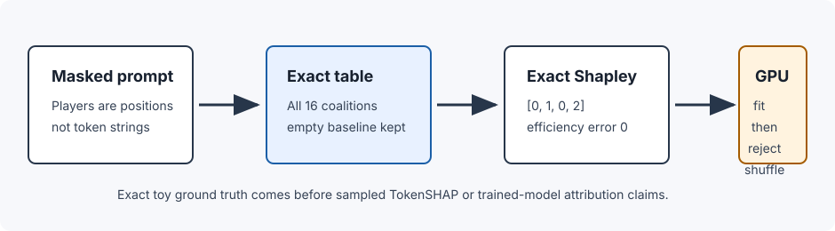
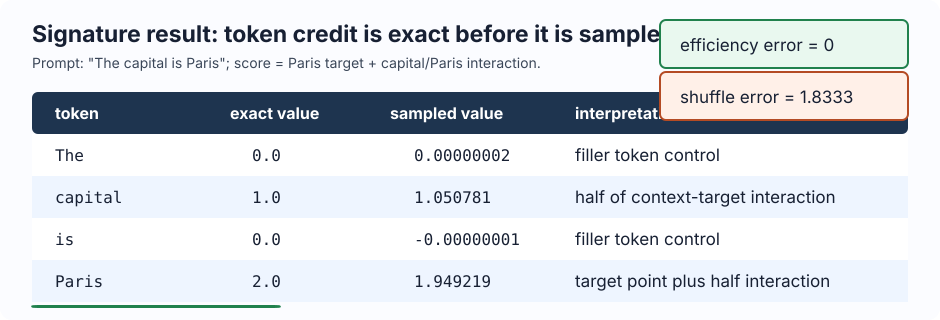

# [16.4] TokenSHAP and TokenShapley

> **Notebooks: [exercises](../../exercises/part4_tokenshap_token_shapley/16.4_TokenSHAP_and_TokenShapley_exercises.ipynb) | [solutions](../../exercises/part4_tokenshap_token_shapley/16.4_TokenSHAP_and_TokenShapley_solutions.ipynb)**

> **Local-first extension.** This section treats token positions as Shapley
> players. You will build the complete masked-token coalition table, compute
> exact token Shapley values, compare sampled permutation TokenSHAP against the
> exact values, and then inspect a CUDA report from a trained finite token
> scorer. The report is a GT-0 model-organism check, not a claim about
> arbitrary large-language-model prompt attribution.

```python
GT_TIER = "GT-0"
EXERCISE_ID = "16_4_tokenshap_and_tokenshapley"
DIFFICULTY = 4
IMPORTANCE = 4
EXPECTED_RUNTIME = "seconds for visible tests; minutes for the CUDA verification report"
REQUIRES_GPU = True
```

Please send any problems / bugs on the `#errata` channel in the [Slack group](https://info-arena.github.io/ARENA_img/slack.html), and ask any questions on the dedicated channels for this chapter of material.

Links to earlier chapters: [(0) Fundamentals](https://arena-chapter0-fundamentals.streamlit.app/), [(1) Transformer Interpretability](https://arena-chapter1-transformer-interp.streamlit.app/), [(2) RL](https://arena-chapter2-rl.streamlit.app/), [(3) LLM Evaluations](https://arena-chapter3-llm-evals.streamlit.app/), [(4) Alignment Science](https://arena-chapter4-alignment-science.streamlit.app/).



## Core Question

If a prompt score depends on both a target token and a context token, can we
assign token-position credit in a way that respects the masked baseline, splits
interaction credit fairly, and rejects a trained-model attribution that only
fits shuffled labels?

The toy prompt is:

```text
The capital is Paris
```

The scoring rule gives `Paris` one target point and gives the pair
`capital`/`Paris` two extra interaction points. The exact answer is therefore
not "Paris gets everything". The context token `capital` should get one point,
and `Paris` should get two points. The filler tokens should get zero.

<details>
<summary>Help - why are players token positions instead of token strings?</summary>

Shapley players need identities. If the prompt contains repeated tokens, token
strings are not stable identities. TokenSHAP-style attribution should first
choose a player set, and here the cleanest finite player set is prompt
positions.

</details>

<details>
<summary>Help - why start from exact masked coalitions?</summary>

Sampling makes sense only after you know what it is approximating. On four
tokens we can enumerate all 16 masked prompts, compute exact Shapley values,
and then check whether sampled TokenSHAP and a trained CUDA scorer recover the
same result.

</details>

## Learning Objectives

- Enumerate complete token-position coalitions.
- Convert coalitions into masked prompts before scoring.
- Compute exact Shapley values from weighted marginal effects.
- Check token Shapley efficiency against full and masked prompt scores.
- Estimate TokenSHAP with sampled random orderings.
- Compare sampled values against exact values and a shuffled-label control.
- Interpret the CUDA report without overclaiming beyond the finite token-scorer preflight.

# Setup Code

```python
from collections.abc import Callable, Mapping, Sequence
from dataclasses import dataclass
import itertools
import json
import math
import random
import sys
from pathlib import Path

import torch as t

chapter = "chapter16_shapley_attribution_baselines"
section = "part4_tokenshap_token_shapley"
root_dir = next(p for p in [Path.cwd(), *Path.cwd().parents] if (p / chapter).exists())
exercises_dir = root_dir / chapter / "exercises"
section_dir = exercises_dir / section

if str(root_dir) not in sys.path:
    sys.path.append(str(root_dir))
if str(exercises_dir) not in sys.path:
    sys.path.append(str(exercises_dir))

import part4_tokenshap_token_shapley.tests as tests

Coalition = frozenset[int]
MAIN = __name__ == "__main__"
TOKENS = ("The", "capital", "is", "Paris")
MASK_TOKEN = "[MASK]"
```

The report classes keep the diagnostics visible. The important result is not
just a vector of scores; it is the vector plus its efficiency and sampling
controls.

```python
@dataclass(frozen=True)
class TokenShapleySamplingReport:
    tokens: tuple[str, ...]
    exact_values: t.Tensor
    sampled_values: t.Tensor
    max_abs_error: float
    top_token: str
    sampled_top_token: str
    rank_matches: bool
    approximates_exact: bool


@dataclass(frozen=True)
class TokenBaselineReport:
    full_score: float
    baseline_score: float
    total_delta: float
    shapley_sum: float
    efficiency_error: float
    satisfies_efficiency: bool
```

# Complete Masked Prompt Tables

### Exercise - enumerate the token-position powerset

> Difficulty: easy
> Importance: high
>
> You should spend 5 minutes on this exercise.

TokenSHAP starts from the same finite object as ordinary Shapley values: every
subset of players. Here the players are prompt positions, not vocabulary types.

<details>
<summary>Help - what should the empty coalition mean?</summary>

The empty coalition is the fully masked prompt. Removing it changes the
baseline, so the efficiency check later no longer means
`score(full prompt) - score(masked prompt)`.

</details>

```python
def all_coalitions(num_players: int) -> tuple[Coalition, ...]:
    raise NotImplementedError()


if MAIN:
    tests.test_all_coalitions_enumerates_complete_powerset(all_coalitions)
```

<details>
<summary>Expected output</summary>

```text
All tests in `test_all_coalitions_enumerates_complete_powerset` passed!
```

</details>

<details>
<summary>Common bugs</summary>

- Returning only nonempty coalitions and dropping the masked baseline.
- Producing duplicate coalitions.
- Accepting `num_players=0`, which makes the section's token game ill-defined.

</details>

<details>
<summary>Solution</summary>

```python
def all_coalitions(num_players: int) -> tuple[Coalition, ...]:
    if num_players <= 0:
        raise ValueError("num_players must be positive.")
    players = range(num_players)
    coalitions = []
    for size in range(num_players + 1):
        coalitions.extend(frozenset(group) for group in itertools.combinations(players, size))
    return tuple(coalitions)
```

</details>

### Exercise - implement the context-target score

> Difficulty: easy
> Importance: high
>
> You should spend 5 minutes on this exercise.

The toy score gives one point for `Paris` and two extra points when both
`capital` and `Paris` are present. This creates an interaction whose credit
should be split across the context and target positions.

<details>
<summary>Help - why not just score the target token?</summary>

If `Paris` only matters when the prompt says it is a capital, then the context
token carries real explanatory work. This toy rule makes that interaction
exact, so you can see whether the attribution method splits it fairly.

</details>

```python
def keyword_interaction_token_score(
    tokens: Sequence[str],
    *,
    target_token: str = "Paris",
    context_token: str = "capital",
    target_weight: float = 1.0,
    interaction_weight: float = 2.0,
) -> float:
    raise NotImplementedError()


if MAIN:
    tests.test_keyword_interaction_token_score_is_target_context_game(
        keyword_interaction_token_score,
    )
```

<details>
<summary>Expected output</summary>

```text
All tests in `test_keyword_interaction_token_score_is_target_context_game` passed!
```

</details>

<details>
<summary>Common bugs</summary>

- Giving the context token credit even when the target token is absent.
- Checking token positions rather than token presence in the masked prompt.
- Adding the interaction weight twice when both tokens are present.

</details>

<details>
<summary>Solution</summary>

```python
def keyword_interaction_token_score(
    tokens: Sequence[str],
    *,
    target_token: str = "Paris",
    context_token: str = "capital",
    target_weight: float = 1.0,
    interaction_weight: float = 2.0,
) -> float:
    token_set = set(tokens)
    target_present = target_token in token_set
    context_present = context_token in token_set
    score = target_weight if target_present else 0.0
    if target_present and context_present:
        score += interaction_weight
    return score
```

</details>

### Exercise - build masked token coalition values

> Difficulty: medium
> Importance: high
>
> You should spend 10 minutes on this exercise.

For each coalition, keep the selected token positions and replace all other
positions with the mask token before calling the score function.

<details>
<summary>Help - why mask instead of deleting absent tokens?</summary>

Deletion changes positions. Token-position attribution should preserve the
prompt length and ask what happens when a position is present versus replaced
by the baseline token.

</details>

```python
def token_coalition_values(
    tokens: Sequence[str],
    score_fn: Callable[[tuple[str, ...]], float],
    *,
    mask_token: str = MASK_TOKEN,
) -> dict[Coalition, float]:
    raise NotImplementedError()


if MAIN:
    tests.test_token_coalition_values_masks_absent_positions(token_coalition_values)
```

<details>
<summary>Expected output</summary>

```text
All tests in `test_token_coalition_values_masks_absent_positions` passed!
```

</details>

<details>
<summary>What you should see</summary>

The full four-token prompt scores `3.0`. The `Paris`-only coalition scores
`1.0`. The `capital` + `Paris` coalition scores `3.0`. The fully masked
coalition scores `0.0`.

</details>

<details>
<summary>Common bugs</summary>

- Treating absent tokens as deleted rather than masked.
- Using token strings as players, which merges repeated tokens.
- Forgetting the empty coalition, so there is no masked baseline.

</details>

<details>
<summary>Solution</summary>

```python
def token_coalition_values(
    tokens: Sequence[str],
    score_fn: Callable[[tuple[str, ...]], float],
    *,
    mask_token: str = MASK_TOKEN,
) -> dict[Coalition, float]:
    token_tuple = tuple(tokens)
    if not token_tuple:
        raise ValueError("tokens must be nonempty.")
    values = {}
    for coalition in all_coalitions(len(token_tuple)):
        masked_tokens = tuple(
            token if index in coalition else mask_token
            for index, token in enumerate(token_tuple)
        )
        values[coalition] = float(score_fn(masked_tokens))
    return values
```

</details>

# Exact Token Shapley

### Exercise - split context-target interaction credit

> Difficulty: medium
> Importance: high
>
> You should spend 15 minutes on this exercise.

Exact Shapley values sum weighted marginal contributions over all coalitions
that do not already contain the player. In this toy game, `Paris` gets its
additive point plus half the interaction; `capital` gets the other half.

<details>
<summary>Help - why does Paris get 2 instead of 3?</summary>

The two-point interaction is not owned only by `Paris`. Across random player
orderings, `capital` sometimes arrives before `Paris` and makes the target
valuable; other times `Paris` arrives first and the later context token creates
the interaction. Shapley splits that pair bonus evenly.

</details>

```python
def normalize_coalition_values(
    coalition_values: Mapping[Coalition | tuple[int, ...], float],
    *,
    num_players: int,
) -> dict[Coalition, float]:
    values = {frozenset(key): float(value) for key, value in coalition_values.items()}
    expected = set(all_coalitions(num_players))
    missing = expected - set(values)
    if missing:
        raise ValueError(f"coalition value table is missing {len(missing)} coalitions.")
    return values


def exact_shapley_values(
    coalition_values: Mapping[Coalition | tuple[int, ...], float],
    *,
    num_players: int,
) -> t.Tensor:
    raise NotImplementedError()


def exact_token_shapley_values(
    tokens: Sequence[str],
    score_fn: Callable[[tuple[str, ...]], float],
    *,
    mask_token: str = MASK_TOKEN,
) -> t.Tensor:
    raise NotImplementedError()


if MAIN:
    tests.test_exact_token_shapley_values_splits_context_target_interaction(
        exact_token_shapley_values,
    )
```

<details>
<summary>Expected output</summary>

```text
All tests in `test_exact_token_shapley_values_splits_context_target_interaction` passed!
```

</details>

<details>
<summary>What you should see</summary>

```text
The      0.0
capital  1.0
is       0.0
Paris    2.0
```

This is the section's toy ground truth.

</details>

<details>
<summary>Common bugs</summary>

- Forgetting the Shapley weight `|S|! (n-|S|-1)! / n!`.
- Summing coalitions that already contain the player.
- Computing leave-one-out effects instead of average marginal effects.

</details>

<details>
<summary>Solution</summary>

```python
def exact_shapley_values(
    coalition_values: Mapping[Coalition | tuple[int, ...], float],
    *,
    num_players: int,
) -> t.Tensor:
    values = normalize_coalition_values(coalition_values, num_players=num_players)
    shapley = t.zeros(num_players, dtype=t.float64)
    denominator = math.factorial(num_players)
    for player in range(num_players):
        other_players = [index for index in range(num_players) if index != player]
        for coalition_size in range(num_players):
            weight = (
                math.factorial(coalition_size)
                * math.factorial(num_players - coalition_size - 1)
                / denominator
            )
            for group in itertools.combinations(other_players, coalition_size):
                coalition = frozenset(group)
                shapley[player] += weight * (
                    values[coalition | {player}] - values[coalition]
                )
    return shapley


def exact_token_shapley_values(
    tokens: Sequence[str],
    score_fn: Callable[[tuple[str, ...]], float],
    *,
    mask_token: str = MASK_TOKEN,
) -> t.Tensor:
    token_tuple = tuple(tokens)
    values = token_coalition_values(token_tuple, score_fn, mask_token=mask_token)
    return exact_shapley_values(values, num_players=len(token_tuple))
```

</details>

### Exercise - check masked-baseline efficiency

> Difficulty: medium
> Importance: high
>
> You should spend 10 minutes on this exercise.

Efficiency says the attributions should sum to `score(full prompt) -
score(masked baseline)`. This is the first check to run before interpreting
token scores.

<details>
<summary>Help - what does efficiency catch?</summary>

Efficiency catches baseline mistakes. If the attributions do not sum to the
full-minus-baseline score, then either the coalition table is incomplete, the
masking baseline changed, or the marginal-effect loop is wrong.

</details>

```python
def token_baseline_report(
    tokens: Sequence[str],
    score_fn: Callable[[tuple[str, ...]], float],
    *,
    mask_token: str = MASK_TOKEN,
    tolerance: float = 1e-9,
) -> TokenBaselineReport:
    raise NotImplementedError()


if MAIN:
    tests.test_token_baseline_report_checks_efficiency(token_baseline_report)
```

<details>
<summary>Expected output</summary>

```text
All tests in `test_token_baseline_report_checks_efficiency` passed!
```

</details>

<details>
<summary>Common bugs</summary>

- Comparing the Shapley sum to the full score instead of full-minus-baseline.
- Reusing exact values from a different mask token.
- Returning only the boolean check and losing the diagnostic scores.

</details>

<details>
<summary>Solution</summary>

```python
def token_baseline_report(
    tokens: Sequence[str],
    score_fn: Callable[[tuple[str, ...]], float],
    *,
    mask_token: str = MASK_TOKEN,
    tolerance: float = 1e-9,
) -> TokenBaselineReport:
    token_tuple = tuple(tokens)
    baseline_tokens = tuple(mask_token for _ in token_tuple)
    exact = exact_token_shapley_values(token_tuple, score_fn, mask_token=mask_token)
    full_score = float(score_fn(token_tuple))
    baseline_score = float(score_fn(baseline_tokens))
    total_delta = full_score - baseline_score
    shapley_sum = float(exact.sum().item())
    efficiency_error = abs(shapley_sum - total_delta)
    return TokenBaselineReport(
        full_score=full_score,
        baseline_score=baseline_score,
        total_delta=total_delta,
        shapley_sum=shapley_sum,
        efficiency_error=efficiency_error,
        satisfies_efficiency=efficiency_error <= tolerance,
    )
```

</details>

# Sampled TokenSHAP

### Exercise - estimate token Shapley with sampled orderings

> Difficulty: medium
> Importance: high
>
> You should spend 15 minutes on this exercise.

Sampled TokenSHAP averages marginal token contributions over random
permutations. On this four-token game we can compare it directly against exact
values, which is the useful debugging mode before using it on larger prompts.

<details>
<summary>Help - why sample orderings instead of coalitions uniformly?</summary>

The Shapley value is the average marginal contribution over player orderings.
Uniform coalition sampling uses a different weighting scheme unless you correct
the weights. Random orderings are the simplest approximation to the exact
quantity you implemented above.

</details>

```python
def sampled_permutation_shapley_values(
    coalition_values: Mapping[Coalition | tuple[int, ...], float],
    *,
    num_players: int,
    num_samples: int,
    seed: int = 0,
) -> t.Tensor:
    raise NotImplementedError()


def sampled_token_shapley_values(
    tokens: Sequence[str],
    score_fn: Callable[[tuple[str, ...]], float],
    *,
    mask_token: str = MASK_TOKEN,
    num_samples: int = 256,
    seed: int = 0,
) -> t.Tensor:
    token_tuple = tuple(tokens)
    values = token_coalition_values(token_tuple, score_fn, mask_token=mask_token)
    return sampled_permutation_shapley_values(
        values,
        num_players=len(token_tuple),
        num_samples=num_samples,
        seed=seed,
    )


def token_shapley_sampling_report(
    tokens: Sequence[str],
    score_fn: Callable[[tuple[str, ...]], float],
    *,
    mask_token: str = MASK_TOKEN,
    num_samples: int = 256,
    seed: int = 0,
    tolerance: float = 0.15,
) -> TokenShapleySamplingReport:
    raise NotImplementedError()


if MAIN:
    tests.test_token_shapley_sampling_report_matches_exact_ranking(
        token_shapley_sampling_report,
    )
```

<details>
<summary>Expected output</summary>

```text
All tests in `test_token_shapley_sampling_report_matches_exact_ranking` passed!
```

</details>

<details>
<summary>What you should see</summary>

The sampled estimate is close but not exact:

```text
exact   = [0.0, 1.0, 0.0, 2.0]
sampled = [0.0, 1.05078125, 0.0, 1.94921875]
top token = Paris
```

Sampling noise is acceptable here because the exact comparison and the top-token
ranking both pass.

</details>

<details>
<summary>Common bugs</summary>

- Sampling coalitions uniformly instead of sampling token orderings.
- Forgetting to update the coalition after each marginal contribution.
- Treating a top-token match as sufficient while ignoring numeric error.

</details>

<details>
<summary>Solution</summary>

```python
def sampled_permutation_shapley_values(
    coalition_values: Mapping[Coalition | tuple[int, ...], float],
    *,
    num_players: int,
    num_samples: int,
    seed: int = 0,
) -> t.Tensor:
    if num_samples <= 0:
        raise ValueError("num_samples must be positive.")
    values = normalize_coalition_values(coalition_values, num_players=num_players)
    rng = random.Random(seed)
    players = tuple(range(num_players))
    totals = t.zeros(num_players, dtype=t.float64)
    for _ in range(num_samples):
        coalition = frozenset()
        for player in rng.sample(players, k=num_players):
            with_player = coalition | {player}
            totals[player] += values[with_player] - values[coalition]
            coalition = with_player
    return totals / num_samples


def token_shapley_sampling_report(
    tokens: Sequence[str],
    score_fn: Callable[[tuple[str, ...]], float],
    *,
    mask_token: str = MASK_TOKEN,
    num_samples: int = 256,
    seed: int = 0,
    tolerance: float = 0.15,
) -> TokenShapleySamplingReport:
    token_tuple = tuple(tokens)
    exact = exact_token_shapley_values(token_tuple, score_fn, mask_token=mask_token)
    sampled = sampled_token_shapley_values(
        token_tuple,
        score_fn,
        mask_token=mask_token,
        num_samples=num_samples,
        seed=seed,
    )
    max_abs_error = float((exact - sampled).abs().max().item())
    top_index = int(exact.argmax().item())
    sampled_top_index = int(sampled.argmax().item())
    return TokenShapleySamplingReport(
        tokens=token_tuple,
        exact_values=exact,
        sampled_values=sampled,
        max_abs_error=max_abs_error,
        top_token=token_tuple[top_index],
        sampled_top_token=token_tuple[sampled_top_index],
        rank_matches=top_index == sampled_top_index,
        approximates_exact=max_abs_error <= tolerance,
    )
```

</details>

# Notebook Contract

### Exercise - bundle the visible checks

> Difficulty: medium
> Importance: high
>
> You should spend 10 minutes on this exercise.

The report runner uses the same core objects as the notebook. Bundle them into
a JSON-like smoke contract so a reader can inspect the exact values, efficiency
check, and sampled approximation without opening a separate report.

<details>
<summary>Help - why return dictionaries instead of tensors?</summary>

The verification report is JSON. Returning plain Python numbers and lists keeps
the notebook contract close to the committed artifact and makes stale report
hashes easier to catch.

</details>

```python
def _tensor_report(report) -> dict:
    result = report.__dict__.copy()
    for key, value in list(result.items()):
        if hasattr(value, "tolist"):
            result[key] = value.tolist()
    return result


def token_coalition_smoke_test() -> dict:
    values = token_coalition_values(TOKENS, keyword_interaction_token_score)
    return {
        "empty": values[frozenset()],
        "target_only": values[frozenset({3})],
        "context_and_target": values[frozenset({1, 3})],
    }


def exact_token_shapley_smoke_test() -> dict:
    exact = exact_token_shapley_values(TOKENS, keyword_interaction_token_score)
    return {
        "tokens": list(TOKENS),
        "exact_values": exact.tolist(),
        "baseline": token_baseline_report(
            TOKENS,
            keyword_interaction_token_score,
        ).__dict__,
    }


def sampled_tokenshap_smoke_test() -> dict:
    report = token_shapley_sampling_report(
        TOKENS,
        keyword_interaction_token_score,
        num_samples=512,
        seed=0,
        tolerance=0.1,
    )
    return _tensor_report(report)


def run_smoke_test(cpu: bool = True) -> dict:
    raise NotImplementedError()


if MAIN:
    tests.test_notebook_contract(run_smoke_test)
```

<details>
<summary>Expected output</summary>

```text
All tests in `test_notebook_contract` passed!
```

</details>

<details>
<summary>Solution</summary>

```python
def run_smoke_test(cpu: bool = True) -> dict:
    _ = cpu
    return {
        "coalitions": token_coalition_smoke_test(),
        "exact": exact_token_shapley_smoke_test(),
        "sampled": sampled_tokenshap_smoke_test(),
    }
```

</details>

# Full CUDA Verification Path

The committed report for this section checks the full local path:

1. Train a CUDA token-position scorer on all 16 masked coalitions.
2. Compute exact TokenShapley from real trained-model outputs.
3. Compare exact values with analytic ground truth `[0.0, 1.0, 0.0, 2.0]`.
4. Compute sampled TokenSHAP from the same trained model.
5. Require efficiency, top-token ranking, low sampled error, and a rejected
   shuffled-label trained-scorer control.

```python
def load_committed_gpu_report() -> dict:
    report = json.loads((section_dir / "verification_report.json").read_text())
    gpu = report["metrics"]["gpu_test"]
    assert report["accepted"] is True and report["tests_passed"] is True
    assert gpu["cuda_available"] is True and gpu["preflight_passed"] is True
    assert gpu["true_exact_values"] == [0.0, 1.0, 0.0, 2.0]
    assert gpu["top_token"] == "Paris"
    assert gpu["sampled_top_token"] == "Paris"
    assert gpu["shuffled_control_rejected"] is True
    tests.test_committed_gpu_report_matches_token_shapley_contract(gpu)
    return report


def run_gpu_test(max_vram_gb: float = 24.0) -> dict:
    _ = max_vram_gb
    return load_committed_gpu_report()["metrics"]["gpu_test"]


def run_full_experiment(max_vram_gb: float = 24.0) -> dict:
    return run_gpu_test(max_vram_gb=max_vram_gb)
```

<details>
<summary>Expected output</summary>

```text
preflight_passed: true
model_family: cuda_trained_tiny_token_scorer_mlp
token_count: 4
coalition_count: 16
training_example_count: 16
training_steps: 1200
fit_mse: <= 1e-10
exact_shapley_max_abs_error: <= 1e-5
sampled_max_abs_error: <= 0.1
sampled_rank_matches: true
top_token: Paris
sampled_top_token: Paris
satisfies_efficiency: true
shuffled_control_error: >= 1.0
shuffled_control_rejected: true
peak_vram_gb: < 1.0
```

</details>

<details>
<summary>Interpreting the CUDA result</summary>

The trained model is not an LLM. It is a tiny CUDA MLP trained on every masked
coalition in the finite token game. This is useful because it checks that the
Shapley code still recovers the analytic answer when values come from real
model forward passes instead of a handwritten score function. The shuffled
control shows that fitting a table is not enough: if the labels are shuffled,
the resulting attributions no longer match the analytic game and must be
rejected.

</details>

## Signature Result



The visible result should be:

| token | exact value | sampled value | interpretation |
| --- | ---: | ---: | --- |
| `The` | `0.0` | approximately `0.0` | filler-token control |
| `capital` | `1.0` | approximately `1.05` | half of context-target interaction |
| `is` | `0.0` | approximately `0.0` | filler-token control |
| `Paris` | `2.0` | approximately `1.95` | target point plus half the interaction |

The CUDA report repeats this result with real model outputs and rejects a
shuffled-label scorer. That makes the positive result more than a pretty table:
it has an exact oracle, a sampled approximation check, an efficiency check, and
a negative control.

## What This Section Shows

- Exact token-position Shapley values recover the analytic attribution vector
  `[0.0, 1.0, 0.0, 2.0]` on the complete masked-token game.
- Sampled permutation TokenSHAP approximates exact values and preserves `Paris`
  as the top-attributed token under the declared tolerance.
- A trained CUDA token scorer reproduces the finite-game attributions from real
  model outputs.
- A shuffled-label trained scorer is rejected because its attribution vector no
  longer matches the toy ground truth.

## Limitations and Unsupported Claims

- This does not prove TokenSHAP is reliable on arbitrary LLM prompts.
- This does not prove that `[MASK]` is the correct baseline for every tokenizer
  or language model.
- This does not prove that input-token attribution is a causal circuit
  explanation.
- This does not compare TokenSHAP with activation patching or path patching on a
  real transformer. Later sections are responsible for that comparison.

## Bonus / Exploring Anomalies

- Change the mask token and measure how the exact values move.
- Add a repeated token and verify that position players still behave correctly.
- Increase prompt length and plot sampled error as a function of sample count.
- Replace the toy score with a real transformer logit score, then treat the
  result as exploratory until it survives controls.
