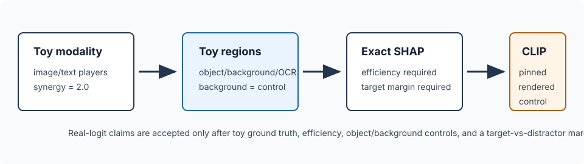
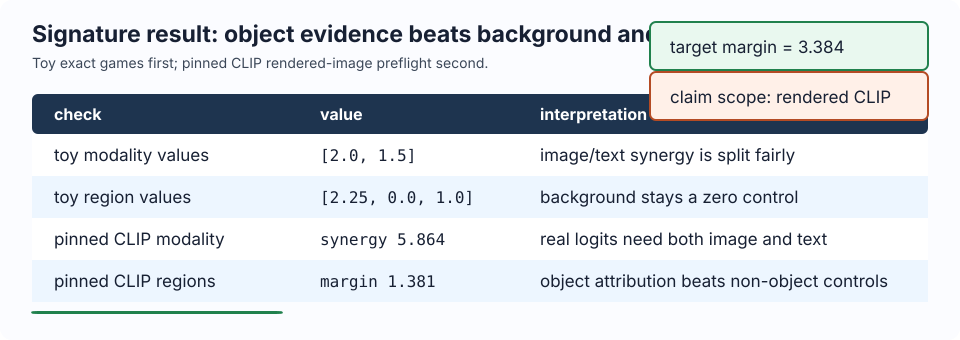

# [16.5] VLM Modality and Region SHAP

> **Notebooks: [exercises](../../exercises/part5_vlm_modality_region_shap/16.5_VLM_Modality_and_Region_SHAP_exercises.ipynb) | [solutions](../../exercises/part5_vlm_modality_region_shap/16.5_VLM_Modality_and_Region_SHAP_solutions.ipynb)**

> **Local-first extension.** This section connects exact Shapley attribution to
> multimodal audits. You will first solve deterministic image/text and
> object/OCR/background games, then verify the same controls on pinned CLIP
> logits from rendered images.

```python
EXERCISE_ID = "16_5_vlm_modality_and_region_shap"
GT_TIER = "GT-0"
DIFFICULTY = 4
IMPORTANCE = 4
EXPECTED_RUNTIME = "seconds for toy contracts; minutes for the pinned CLIP CUDA report"
REQUIRES_GPU = True
```

Please send any problems / bugs on the `#errata` channel in the [Slack group](https://info-arena.github.io/ARENA_img/slack.html), and ask any questions on the dedicated channels for this chapter of material.

Links to earlier chapters: [(0) Fundamentals](https://arena-chapter0-fundamentals.streamlit.app/), [(1) Transformer Interpretability](https://arena-chapter1-transformer-interp.streamlit.app/), [(2) RL](https://arena-chapter2-rl.streamlit.app/), [(3) LLM Evaluations](https://arena-chapter3-llm-evals.streamlit.app/), [(4) Alignment Science](https://arena-chapter4-alignment-science.streamlit.app/).



## Core Question

When a VLM score improves, did the useful evidence come from the image, the
text, the target object, an OCR-like region, or background leakage?

This notebook deliberately starts with exact toy games. The modality game has
two players: image evidence and text evidence. The region game has three
players: object, background, and OCR text. Only after those exact controls work
do we read a pinned CLIP report on deterministic rendered images.

<details>
<summary>Help - why not start with a real image heatmap?</summary>

Pretty heatmaps are easy to overread. A VLM attribution result is only useful
if it survives controls: exact toy ground truth, efficiency, object-vs-background
comparisons, and a target-vs-distractor margin. The CLIP run is intentionally a
small rendered-control preflight, not a broad vision benchmark.

</details>

<details>
<summary>Help - what is the negative control?</summary>

In the toy region game, the background player has value `0.0`. In the CLIP
report, the object-region attribution must beat the strongest non-object
attribution by a margin. If background or OCR wins, the result should be treated
as a failed localization result.

</details>

## Learning Objectives

- Compute exact Shapley values from complete finite coalition tables.
- Use efficiency as a hard invariant before interpreting modality or region scores.
- Detect image/text synergy in a two-player VLM-style game.
- Treat object, background, and OCR as structured region players.
- Keep background as an explicit negative control.
- Interpret a pinned CLIP rendered-image report without claiming broad VLM attribution.

# Setup Code

```python
from collections.abc import Callable, Mapping
from dataclasses import dataclass
import itertools
import json
import math
import sys
from pathlib import Path

import torch as t

chapter = "chapter16_shapley_attribution_baselines"
section = "part5_vlm_modality_region_shap"
root_dir = next(p for p in [Path.cwd(), *Path.cwd().parents] if (p / chapter).exists())
exercises_dir = root_dir / chapter / "exercises"
section_dir = exercises_dir / section

if str(root_dir) not in sys.path:
    sys.path.append(str(root_dir))
if str(exercises_dir) not in sys.path:
    sys.path.append(str(exercises_dir))

import part5_vlm_modality_region_shap.tests as tests

Coalition = frozenset[int]
MAIN = __name__ == "__main__"
```

```python
@dataclass(frozen=True)
class ShapleyEfficiencyReport:
    shapley_sum: float
    total_value_delta: float
    efficiency_error: float
    satisfies_efficiency: bool


@dataclass(frozen=True)
class VLMModalitySHAPReport:
    modality_values: t.Tensor
    baseline_score: float
    image_only_score: float
    text_only_score: float
    full_score: float
    synergy: float
    detects_synergy: bool
    satisfies_efficiency: bool


@dataclass(frozen=True)
class VLMRegionSHAPReport:
    region_values: t.Tensor
    region_names: tuple[str, ...]
    target_region: str
    target_value: float
    max_background_value: float
    localizes_target: bool
    satisfies_efficiency: bool
```

# Exact Shapley Values

### Exercise - compute exact Shapley values

> Difficulty: medium
> Importance: high
>
> You should spend 15 minutes on this exercise.

Implement exact Shapley values for a complete coalition table. The toy modality
game below has image-only score `1.0`, text-only score `0.5`, and full
image-plus-text score `3.5`. The two-point synergy should be split equally, so
the final values should be `[2.0, 1.5]`.

<details>
<summary>Help - what does the efficiency report catch?</summary>

Efficiency says the sum of Shapley values must equal full coalition value minus
empty coalition value. If this fails, either the coalition table is incomplete,
the baseline is wrong, or the weighting loop is wrong.

</details>

```python
def all_coalitions(num_players: int) -> tuple[Coalition, ...]:
    raise NotImplementedError()


def normalize_coalition_values(
    coalition_values: Mapping[Coalition | tuple[int, ...], float],
    *,
    num_players: int,
) -> dict[Coalition, float]:
    raise NotImplementedError()


def exact_shapley_values(
    coalition_values: Mapping[Coalition | tuple[int, ...], float],
    *,
    num_players: int,
) -> t.Tensor:
    raise NotImplementedError()


def shapley_efficiency_report(
    coalition_values: Mapping[Coalition | tuple[int, ...], float],
    *,
    num_players: int,
    tolerance: float = 1e-9,
) -> ShapleyEfficiencyReport:
    raise NotImplementedError()


if MAIN:
    tests.test_exact_shapley_values_splits_two_player_synergy(exact_shapley_values)
    tests.test_shapley_efficiency_report_requires_complete_coalition_table(
        shapley_efficiency_report
    )
```

<details>
<summary>Expected output</summary>

```text
All tests in `test_exact_shapley_values_splits_two_player_synergy` passed!
All tests in `test_shapley_efficiency_report_requires_complete_coalition_table` passed!
```

</details>

<details>
<summary>Common bugs</summary>

- Using unweighted leave-one-out deltas.
- Forgetting the empty coalition.
- Letting incomplete coalition tables silently pass.

</details>

<details>
<summary>Solution</summary>

Use `all_coalitions`, normalize keys to `frozenset`, require the complete table,
then sum weighted marginal effects with the usual Shapley factorial weight.
The efficiency report should compare `sum(phi_i)` to `v(N) - v(empty)`.

</details>

# Modality SHAP

### Exercise - detect image/text synergy

> Difficulty: medium
> Importance: high
>
> You should spend 10 minutes on this exercise.

Build a two-player game where player `0` is image evidence and player `1` is
text evidence. The full image+text coalition receives an extra synergy term.

<details>
<summary>Help - what should the exact values be?</summary>

The image player gets its additive `1.0` plus half of the synergy `2.0`, for
`2.0`. The text player gets its additive `0.5` plus the other half, for `1.5`.

</details>

```python
def coalition_values_from_function(
    num_players: int,
    value_fn: Callable[[Coalition], float],
) -> dict[Coalition, float]:
    raise NotImplementedError()


def vlm_modality_game(
    *,
    image_weight: float = 1.0,
    text_weight: float = 0.5,
    synergy_weight: float = 2.0,
) -> dict[Coalition, float]:
    raise NotImplementedError()


def vlm_modality_shap_report(
    *,
    image_weight: float = 1.0,
    text_weight: float = 0.5,
    synergy_weight: float = 2.0,
    min_synergy: float = 1.0,
    tolerance: float = 1e-9,
) -> VLMModalitySHAPReport:
    raise NotImplementedError()


if MAIN:
    tests.test_vlm_modality_game_contains_expected_image_text_coalitions(
        vlm_modality_game
    )
    tests.test_vlm_modality_shap_report_detects_synergy_and_efficiency(
        vlm_modality_shap_report
    )
```

<details>
<summary>Expected output</summary>

```text
All tests in `test_vlm_modality_game_contains_expected_image_text_coalitions` passed!
All tests in `test_vlm_modality_shap_report_detects_synergy_and_efficiency` passed!
```

</details>

<details>
<summary>What you should see</summary>

```text
baseline = 0.0
image_only = 1.0
text_only = 0.5
full = 3.5
synergy = 2.0
modality_values = [2.0, 1.5]
```

</details>

<details>
<summary>Common bugs</summary>

- Treating synergy as if it belonged entirely to the image.
- Forgetting to expose the raw coalition scores.
- Passing a weak synergy result as a positive multimodal result.

</details>

<details>
<summary>Solution</summary>

Construct the complete two-player table from a `value_fn`, compute exact
Shapley values, measure `full - image_only - text_only + baseline`, and require
both synergy and efficiency to pass.

</details>

# Region SHAP

### Exercise - localize object evidence over background

> Difficulty: medium
> Importance: high
>
> You should spend 10 minutes on this exercise.

Now make the players structured regions: object, background, and OCR text. The
background-only coalition should add no score. The object attribution should
beat every non-object region.

<details>
<summary>Help - why include OCR if object is the target?</summary>

OCR is a plausible shortcut. If OCR receives most of the credit, the model may
be reading text rather than using visual object evidence. The toy game gives OCR
some value but still requires the object region to win.

</details>

```python
def vlm_region_game(
    *,
    object_weight: float = 2.0,
    ocr_weight: float = 0.75,
    object_ocr_interaction: float = 0.5,
) -> dict[Coalition, float]:
    raise NotImplementedError()


def vlm_region_shap_report(
    *,
    region_names: tuple[str, ...] = ("object", "background", "ocr_text"),
    target_region: str = "object",
    min_margin: float = 0.5,
    tolerance: float = 1e-9,
) -> VLMRegionSHAPReport:
    raise NotImplementedError()


if MAIN:
    tests.test_vlm_region_game_keeps_background_as_negative_control(
        vlm_region_game
    )
    tests.test_vlm_region_shap_report_localizes_object_region(
        vlm_region_shap_report
    )
```

<details>
<summary>Expected output</summary>

```text
All tests in `test_vlm_region_game_keeps_background_as_negative_control` passed!
All tests in `test_vlm_region_shap_report_localizes_object_region` passed!
```

</details>

<details>
<summary>What you should see</summary>

```text
object      2.25
background  0.0
ocr_text    1.0
```

The object region should clear the non-object attribution by at least the
declared margin.

</details>

<details>
<summary>Common bugs</summary>

- Letting background pick up object credit.
- Misaligning `region_names` with the attribution vector order.
- Checking only positive object value instead of object-over-control margin.

</details>

<details>
<summary>Solution</summary>

Make a complete three-player table. Player `0` contributes object evidence,
player `1` is the zero-valued background control, and player `2` contributes
OCR evidence plus half the object/OCR interaction. Compute exact values and
compare the target object value against the strongest non-target region.

</details>

# Notebook Contract

### Exercise - expose JSON-style smoke tests

> Difficulty: medium
> Importance: high
>
> You should spend 5 minutes on this exercise.

Bundle the toy modality and region reports into a JSON-like dictionary. This is
the learner-visible counterpart of the committed verification report.

```python
def _tensor_report(report) -> dict:
    result = report.__dict__.copy()
    for key, value in list(result.items()):
        if hasattr(value, "tolist"):
            result[key] = value.tolist()
    return result


def modality_shap_smoke_test() -> dict:
    return _tensor_report(vlm_modality_shap_report())


def region_shap_smoke_test() -> dict:
    return _tensor_report(vlm_region_shap_report())


def run_smoke_test(cpu: bool = True) -> dict:
    raise NotImplementedError()


if MAIN:
    tests.test_modality_shap_smoke_test(modality_shap_smoke_test)
    tests.test_region_shap_smoke_test(region_shap_smoke_test)
    tests.test_notebook_contract(run_smoke_test)
```

<details>
<summary>Expected output</summary>

```text
All tests in `test_modality_shap_smoke_test` passed!
All tests in `test_region_shap_smoke_test` passed!
All tests in `test_notebook_contract` passed!
```

</details>

<details>
<summary>Solution</summary>

Return `{"modality": modality_shap_smoke_test(), "region": region_shap_smoke_test()}`.

</details>

# Pinned CLIP Verification Path

The committed report applies the same controls to real CLIP logits:

1. Load pinned `openai/clip-vit-base-patch32` at revision
   `3d74acf9a28c67741b2f4f2ea7635f0aaf6f0268`.
2. Render deterministic red-square and blue-circle images.
3. Build image/text modality coalitions and object/background/OCR region coalitions.
4. Compute exact Shapley values from the resulting CLIP logit tables.
5. Require modality synergy, region efficiency, object-over-control margin,
   target-over-distractor margin, CUDA evidence, and VRAM evidence.

```python
def load_committed_gpu_report() -> dict:
    report = json.loads((section_dir / "verification_report.json").read_text())
    gpu = report["metrics"]["gpu_test"]
    assert report["accepted"] is True and report["tests_passed"] is True
    assert gpu["cuda_available"] is True and gpu["preflight_passed"] is True
    tests.test_committed_gpu_report_records_real_clip_controls()
    return report


def run_gpu_test(max_vram_gb: float = 24.0) -> dict:
    gpu = load_committed_gpu_report()["metrics"]["gpu_test"]
    assert gpu["peak_vram_gb"] <= max_vram_gb
    return gpu


def run_full_experiment(max_vram_gb: float = 24.0) -> dict:
    return run_gpu_test(max_vram_gb=max_vram_gb)
```

<details>
<summary>Expected output</summary>

```text
preflight_passed: true
model_id: openai/clip-vit-base-patch32
revision: 3d74acf9a28c67741b2f4f2ea7635f0aaf6f0268
modality_synergy: >= 2.0
modality_satisfies_efficiency: true
object_margin: >= 1.0
target_distractor_margin: >= 2.0
region_satisfies_efficiency: true
peak_vram_gb: < 1.0
```

</details>

<details>
<summary>Interpreting the CLIP result</summary>

This is a real model-output check, but it is still deliberately narrow. The
images are rendered controls, the text prompts are fixed, and the model is
pinned. The result supports the mechanics of VLM modality/region SHAP under
these controls. It does not support broad claims about arbitrary images,
generative VLM answers, or pixel-level saliency.

</details>

## Signature Result



The expected visible result is:

| check | value | interpretation |
| --- | ---: | --- |
| toy modality Shapley | `[2.0, 1.5]` | image/text synergy is split fairly |
| toy region Shapley | `[2.25, 0.0, 1.0]` | background remains a zero-valued control |
| pinned CLIP modality synergy | `5.864` | real CLIP logits require image+text together |
| pinned CLIP object margin | `1.381` | object attribution beats non-object controls |
| pinned CLIP target margin | `3.384` | red-square image scores target caption above distractor |

## What This Section Shows

- Exact Shapley values split a two-player image/text synergy fairly.
- Structured region Shapley can keep background as a negative control.
- Pinned CLIP logits on deterministic rendered images reproduce the modality and
  region-control pattern with CUDA and VRAM evidence.

## Limitations and Unsupported Claims

- This does not prove VLM region SHAP on natural images.
- This does not prove pixel-level saliency or segmentation quality.
- This does not prove causal visual-token flow inside a generative VLM.
- This does not prove OCR is absent as a shortcut in real datasets.
- This does not compare region SHAP against activation patching or attention rollout.

## Bonus / Exploring Anomalies

- Add a misleading OCR label and check whether OCR beats object evidence.
- Add random background texture and see whether the background control remains low.
- Swap the target/distractor captions and inspect which coalition table entries move.
- Replace CLIP with SigLIP and compare the same rendered-control margins.
