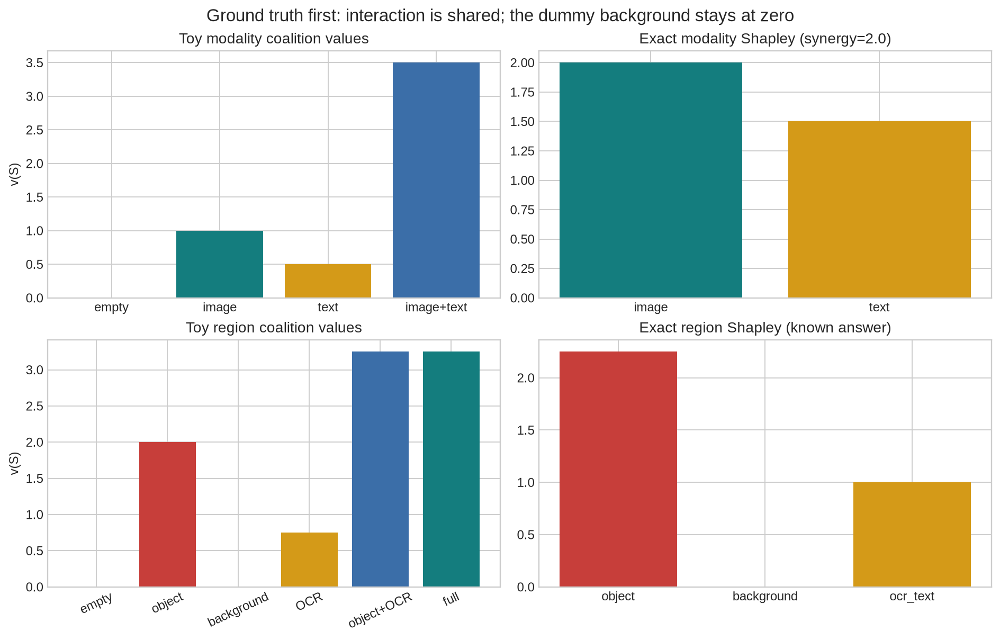
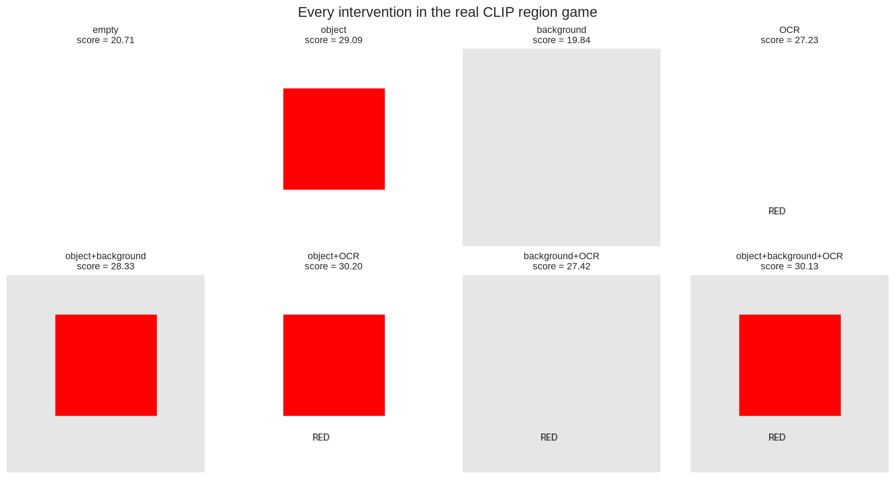
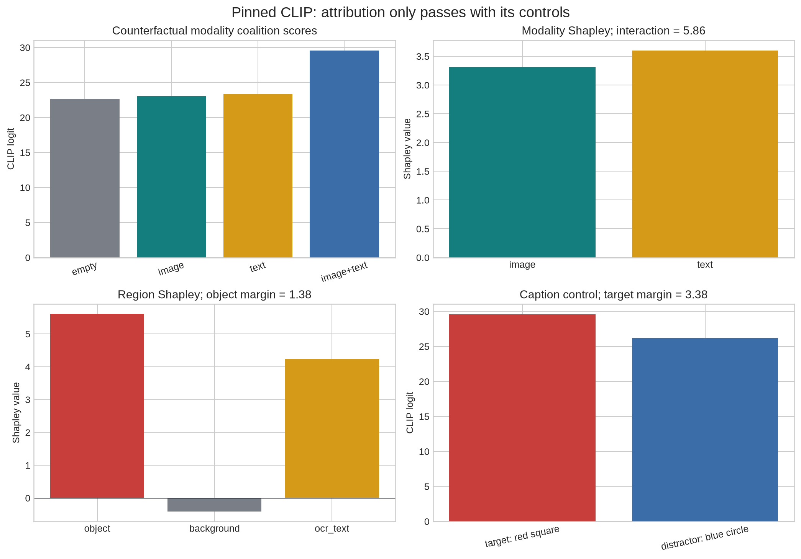

# [16.5] VLM Modality and Region SHAP


> **Notebooks: [exercises](../../exercises/part5_vlm_modality_region_shap/16.5_VLM_Modality_and_Region_SHAP_exercises.ipynb) | [solutions](../../exercises/part5_vlm_modality_region_shap/16.5_VLM_Modality_and_Region_SHAP_solutions.ipynb)**

> **Local-first extension.** Exact ground truth comes first; the signature result then scores every deterministic intervention with a pinned CLIP checkpoint on CUDA.

## Core Question

When the CLIP score for "a red square" rises, which counterfactual replacement supplied the evidence?

**By the end of this notebook, you will have shown that exact Shapley attribution on a pinned CLIP red-square score assigns more value to the target object than to background or OCR controls, while a positive image-text interaction survives an explicit target-vs-distractor check.**

You will answer it twice: first on games where the answer is known exactly, then on all rendered coalitions scored by a real pinned CLIP checkpoint.

```python
EXERCISE_ID = "16_5_vlm_modality_and_region_shap"
GT_TIER = "GT-0"
DIFFICULTY = 3
IMPORTANCE = 4
EXPECTED_RUNTIME = "about 20 minutes for exercises; under a minute for cached CLIP on CUDA"
REQUIRES_GPU = True
```

## Learning Objectives

You will:

- enumerate and validate complete finite coalition games;
- derive exact Shapley values from weighted marginal contributions;
- separate additive modality evidence from image-text interaction;
- render object, background, and OCR interventions you can inspect pixel by pixel;
- require efficiency, object-vs-control margin, and target-vs-distractor margin before accepting a result;
- state exactly what input-level Shapley does and does not reveal about a VLM mechanism.

## Cold Open: one score, several explanations

A high score for “a red square” might come from the red object, the word `RED`, a background artifact, the caption, or an interaction among them. A heatmap cannot distinguish these stories by appearance alone. We will define the players and every counterfactual image first, then let exact Shapley average each player’s marginal effect over every context.

## Setup

```python
from collections.abc import Callable, Mapping
from dataclasses import dataclass
from pathlib import Path
import itertools
import math
import sys

import matplotlib.pyplot as plt
import numpy as np
import pandas as pd
import torch as t
from IPython.display import display

chapter = "chapter16_shapley_attribution_baselines"
root_dir = next(path for path in [Path.cwd(), *Path.cwd().parents] if (path / chapter).exists())
if str(root_dir) not in sys.path:
    sys.path.append(str(root_dir))

from chapter16_shapley_attribution_baselines.exercises.part5_vlm_modality_region_shap import tests
from chapter16_shapley_attribution_baselines.exercises.part5_vlm_modality_region_shap import solutions as reference

assets_dir = root_dir / chapter / "instructions" / "assets"
assets_dir.mkdir(parents=True, exist_ok=True)
Coalition = frozenset[int]
MAIN = __name__ == "__main__"

plt.style.use("seaborn-v0_8-whitegrid")
COLORS = {
    "red": "#C73E3A",
    "teal": "#147D7E",
    "gold": "#D49A18",
    "blue": "#3B6EA8",
    "gray": "#7A7F87",
    "ink": "#20242A",
}
```

```python
@dataclass(frozen=True)
class ShapleyEfficiencyReport:
    shapley_sum: float
    total_value_delta: float
    efficiency_error: float
    satisfies_efficiency: bool


@dataclass(frozen=True)
class VLMModalitySHAPReport:
    modality_values: t.Tensor
    baseline_score: float
    image_only_score: float
    text_only_score: float
    full_score: float
    synergy: float
    detects_synergy: bool
    satisfies_efficiency: bool


@dataclass(frozen=True)
class VLMRegionSHAPReport:
    region_values: t.Tensor
    region_names: tuple[str, ...]
    target_region: str
    target_value: float
    max_background_value: float
    localizes_target: bool
    satisfies_efficiency: bool
```

## 1. Exact finite games

For players $N=\{0,\ldots,n-1\}$, a game assigns a value $v(S)$ to every coalition $S\subseteq N$. Exact Shapley attribution is only meaningful here if the table really contains all $2^n$ coalitions. This gives us a cheap first checkpoint before any model is loaded.

### Exercise - enumerate and validate every coalition

> **Difficulty:** medium
> **Importance:** high
> **Suggested time:** 10 minutes

Implement `all_coalitions` and `normalize_coalition_values`. The latter must reject incomplete games instead of silently turning a missing intervention into a zero.

<details>
<summary>Expected output</summary>

```text
All tests in `test_all_coalitions_and_normalization` passed!
```

</details>

<details>
<summary>Help - common bug</summary>

Iterate subset sizes from `0` through `num_players`; `itertools.combinations` gives each subset once. Normalize keys to `frozenset` before comparing with the expected set.

</details>

<details>
<summary>Common bugs</summary>

- Starting at subset size one and losing the baseline.
- Stopping before the full coalition.
- Checking only the number of entries, which misses duplicated or invalid keys.

</details>

<details>
<summary>Interpretation</summary>

This is a scientific guardrail, not bookkeeping. Every omitted coalition changes which contexts a player is averaged over.

</details>

<details>
<summary>Solution</summary>

```python
        def all_coalitions(num_players: int) -> tuple[Coalition, ...]:
    if num_players <= 0:
        raise ValueError("num_players must be positive.")
    players = range(num_players)
    coalitions: list[Coalition] = []
    for size in range(num_players + 1):
        coalitions.extend(
            frozenset(group) for group in itertools.combinations(players, size)
        )
    return tuple(coalitions)


def normalize_coalition_values(
    coalition_values: Mapping[Coalition | tuple[int, ...], float],
    *,
    num_players: int,
) -> dict[Coalition, float]:
    values = {frozenset(key): float(value) for key, value in coalition_values.items()}
    missing = set(all_coalitions(num_players)) - set(values)
    if missing:
        raise ValueError(f"coalition value table is missing {len(missing)} coalitions.")
    return values
```

</details>

```python
def all_coalitions(num_players: int) -> tuple[Coalition, ...]:
    raise NotImplementedError()


def normalize_coalition_values(
    coalition_values: Mapping[Coalition | tuple[int, ...], float],
    *,
    num_players: int,
) -> dict[Coalition, float]:
    raise NotImplementedError()


if MAIN:
    tests.test_all_coalitions_and_normalization(all_coalitions, normalize_coalition_values)
```

### Exercise - compute exact Shapley values and verify efficiency

> **Difficulty:** hard
> **Importance:** high
> **Suggested time:** 20 minutes

Implement the factorial-weighted marginal-contribution sum. Then verify $\sum_i \phi_i=v(N)-v(\varnothing)$ on the same complete table.

<details>
<summary>Expected output</summary>

```text
All tests in `test_exact_shapley_values_splits_two_player_synergy` passed!
All tests in `test_shapley_efficiency_report_requires_complete_coalition_table` passed!
```

</details>

<details>
<summary>Help - common bug</summary>

For player $i$ and coalition $S$ not containing it, use weight $|S|!(n-|S|-1)!/n!$ and marginal value $v(S\cup\{i\})-v(S)$.

</details>

<details>
<summary>Common bugs</summary>

- Averaging leave-one-out effects uniformly.
- Including the player inside `S` before computing the marginal.
- Comparing the attribution sum to `v(N)` instead of `v(N)-v(empty)`.

</details>

<details>
<summary>Interpretation</summary>

Efficiency catches many implementation errors, but it does not prove that your player definition or intervention is scientifically appropriate. We will test those separately.

</details>

<details>
<summary>Solution</summary>

```python
        def exact_shapley_values(
    coalition_values: Mapping[Coalition | tuple[int, ...], float],
    *,
    num_players: int,
) -> t.Tensor:
    values = normalize_coalition_values(coalition_values, num_players=num_players)
    shapley = t.zeros(num_players, dtype=t.float64)
    denominator = math.factorial(num_players)
    for player in range(num_players):
        others = [candidate for candidate in range(num_players) if candidate != player]
        for size in range(num_players):
            weight = (
                math.factorial(size)
                * math.factorial(num_players - size - 1)
                / denominator
            )
            for group in itertools.combinations(others, size):
                coalition = frozenset(group)
                shapley[player] += weight * (
                    values[coalition | {player}] - values[coalition]
                )
    return shapley


def shapley_efficiency_report(
    coalition_values: Mapping[Coalition | tuple[int, ...], float],
    *,
    num_players: int,
    tolerance: float = 1e-9,
) -> ShapleyEfficiencyReport:
    values = normalize_coalition_values(coalition_values, num_players=num_players)
    shapley = exact_shapley_values(values, num_players=num_players)
    total_delta = values[frozenset(range(num_players))] - values[frozenset()]
    shapley_sum = float(shapley.sum().item())
    efficiency_error = abs(shapley_sum - total_delta)
    return ShapleyEfficiencyReport(
        shapley_sum=shapley_sum,
        total_value_delta=total_delta,
        efficiency_error=efficiency_error,
        satisfies_efficiency=efficiency_error <= tolerance,
    )
```

</details>

```python
def exact_shapley_values(
    coalition_values: Mapping[Coalition | tuple[int, ...], float],
    *,
    num_players: int,
) -> t.Tensor:
    raise NotImplementedError()


def shapley_efficiency_report(
    coalition_values: Mapping[Coalition | tuple[int, ...], float],
    *,
    num_players: int,
    tolerance: float = 1e-9,
) -> ShapleyEfficiencyReport:
    raise NotImplementedError()


if MAIN:
    tests.test_exact_shapley_values_splits_two_player_synergy(exact_shapley_values)
    tests.test_shapley_efficiency_report_requires_complete_coalition_table(shapley_efficiency_report)
```

## 2. Toy modality game: can two weak cues become strong together?

Player `0` is an image replacement and player `1` is a text replacement. On the toy game, image evidence contributes `1.0`, text evidence contributes `0.5`, and their joint presence contributes another `2.0`. Because Shapley averages over orderings, each modality receives half of this interaction.

### Exercise - build the image-text coalition table

> **Difficulty:** medium
> **Importance:** high
> **Suggested time:** 10 minutes

Implement a reusable `coalition_values_from_function`, then construct the complete two-player modality game. Keep the raw four scores visible: they are the evidence from which attribution is derived.

<details>
<summary>Expected output</summary>

```text
All tests in `test_vlm_modality_game_contains_expected_image_text_coalitions` passed!
```

</details>

<details>
<summary>Help - common bug</summary>

Write one small value function that checks whether player `0` and player `1` are present. Add the interaction only when both are present.

</details>

<details>
<summary>Common bugs</summary>

- Adding synergy to an individual player.
- Returning only the three non-empty coalitions.
- Confusing player identity with subset position.

</details>

<details>
<summary>Interpretation</summary>

The coalition table separates the observable score function from the attribution rule. This makes it possible to inspect whether a surprising attribution comes from Shapley or from the intervention design.

</details>

<details>
<summary>Solution</summary>

```python
        def coalition_values_from_function(
    num_players: int,
    value_fn: Callable[[Coalition], float],
) -> dict[Coalition, float]:
    return {
        coalition: float(value_fn(coalition))
        for coalition in all_coalitions(num_players)
    }


def vlm_modality_game(
    *,
    image_weight: float = 1.0,
    text_weight: float = 0.5,
    synergy_weight: float = 2.0,
) -> dict[Coalition, float]:
    def value_fn(coalition: Coalition) -> float:
        score = 0.0
        if 0 in coalition:
            score += image_weight
        if 1 in coalition:
            score += text_weight
        if 0 in coalition and 1 in coalition:
            score += synergy_weight
        return score

    return coalition_values_from_function(2, value_fn)
```

</details>

```python
def coalition_values_from_function(
    num_players: int,
    value_fn: Callable[[Coalition], float],
) -> dict[Coalition, float]:
    raise NotImplementedError()


def vlm_modality_game(
    *,
    image_weight: float = 1.0,
    text_weight: float = 0.5,
    synergy_weight: float = 2.0,
) -> dict[Coalition, float]:
    raise NotImplementedError()


if MAIN:
    tests.test_vlm_modality_game_contains_expected_image_text_coalitions(vlm_modality_game)
```

### Exercise - measure synergy without breaking efficiency

> **Difficulty:** medium
> **Importance:** high
> **Suggested time:** 10 minutes

Compute modality Shapley values, the four coalition scores, and the interaction contrast `full - image_only - text_only + baseline`. A positive result must pass both the synergy threshold and efficiency.

<details>
<summary>Expected output</summary>

```text
All tests in `test_vlm_modality_shap_report_detects_synergy_and_efficiency` passed!
modality_values = [2.0, 1.5]; synergy = 2.0
```

</details>

<details>
<summary>Help - common bug</summary>

Read each named score from the coalition table rather than reconstructing it from the Shapley values. The interaction contrast and efficiency answer different questions.

</details>

<details>
<summary>Common bugs</summary>

- Calling `full - image_only` the interaction.
- Declaring multimodal synergy from a full score alone.
- Ignoring a failed efficiency invariant.

</details>

<details>
<summary>Interpretation</summary>

Shapley splits interaction credit; it does not make the interaction disappear. Reporting the separate synergy contrast prevents a large shared effect from being mistaken for two independent modality effects.

</details>

<details>
<summary>Solution</summary>

```python
        def vlm_modality_shap_report(
    *,
    image_weight: float = 1.0,
    text_weight: float = 0.5,
    synergy_weight: float = 2.0,
    min_synergy: float = 1.0,
    tolerance: float = 1e-9,
) -> VLMModalitySHAPReport:
    values = vlm_modality_game(
        image_weight=image_weight,
        text_weight=text_weight,
        synergy_weight=synergy_weight,
    )
    modality_values = exact_shapley_values(values, num_players=2)
    baseline = values[frozenset()]
    image_only = values[frozenset({0})]
    text_only = values[frozenset({1})]
    full = values[frozenset({0, 1})]
    synergy = full - image_only - text_only + baseline
    efficiency_error = abs(float(modality_values.sum().item()) - (full - baseline))
    return VLMModalitySHAPReport(
        modality_values=modality_values,
        baseline_score=baseline,
        image_only_score=image_only,
        text_only_score=text_only,
        full_score=full,
        synergy=synergy,
        detects_synergy=synergy >= min_synergy,
        satisfies_efficiency=efficiency_error <= tolerance,
    )
```

</details>

```python
def vlm_modality_shap_report(
    *,
    image_weight: float = 1.0,
    text_weight: float = 0.5,
    synergy_weight: float = 2.0,
    min_synergy: float = 1.0,
    tolerance: float = 1e-9,
) -> VLMModalitySHAPReport:
    raise NotImplementedError()


if MAIN:
    tests.test_vlm_modality_shap_report_detects_synergy_and_efficiency(vlm_modality_shap_report)
```

## 3. Region game: make the interventions inspectable

We now use three players with fixed semantic roles:

| player | intervention | role |
|---:|---|---|
| 0 | red square | target object evidence |
| 1 | gray background | negative control |
| 2 | text `RED` | OCR-like shortcut |

The background is deliberately uninformative in the toy oracle. The OCR cue is useful but not the target region. This lets us distinguish object localization from shortcut use before asking CLIP.

### Exercise - render all eight region interventions

> **Difficulty:** medium
> **Importance:** high
> **Suggested time:** 10 minutes

Implement the deterministic 224x224 renderer. The test inspects exact pixels and requires all eight object/background/OCR coalitions to be visually distinct.

<details>
<summary>Expected output</summary>

```text
All tests in `test_render_region_clip_image_has_exact_components` passed!
```

</details>

<details>
<summary>Help - common bug</summary>

Create the background first, then add the red rectangle and OCR text conditionally. Use fixed coordinates so the interventions are reproducible.

</details>

<details>
<summary>Common bugs</summary>

- Drawing the background after the object and erasing it.
- Reusing one mutable image for several coalitions.
- Rendering an OCR flag that does not change any pixels.

</details>

<details>
<summary>Interpretation</summary>

A region player is not an abstract label: it is a specific image-generating intervention. Seeing every coalition is necessary for judging whether the attribution game is well posed.

</details>

<details>
<summary>Solution</summary>

```python
        def render_region_clip_image(
    *,
    object_present: bool,
    background_present: bool,
    ocr_present: bool,
):
    from PIL import Image, ImageDraw

    background = (230, 230, 230) if background_present else "white"
    image = Image.new("RGB", (224, 224), background)
    draw = ImageDraw.Draw(image)
    if object_present:
        draw.rectangle([55, 45, 169, 159], fill="red")
    if ocr_present:
        draw.text((88, 178), "RED", fill="black")
    return image
```

</details>

```python
def render_region_clip_image(
    *,
    object_present: bool,
    background_present: bool,
    ocr_present: bool,
):
    raise NotImplementedError()


if MAIN:
    tests.test_render_region_clip_image_has_exact_components(render_region_clip_image)
```

### Exercise - encode the object/OCR ground-truth game

> **Difficulty:** medium
> **Importance:** high
> **Suggested time:** 10 minutes

Build the complete three-player toy game. The object contributes `2.0`, OCR contributes `0.75`, their interaction contributes `0.5`, and the background contributes exactly zero.

<details>
<summary>Expected output</summary>

```text
All tests in `test_vlm_region_game_keeps_background_as_negative_control` passed!
```

</details>

<details>
<summary>Help - common bug</summary>

Player `1` never changes the toy value. Keep it in the coalition table anyway: a dummy player should receive exactly zero Shapley attribution.

</details>

<details>
<summary>Common bugs</summary>

- Dropping the control player and reducing the game to two players.
- Adding the interaction when only one of object/OCR is present.
- Treating background absence as missing data rather than an intervention.

</details>

<details>
<summary>Interpretation</summary>

The zero-valued background tests the Shapley dummy axiom and gives a ground-truth negative control for the later learned model.

</details>

<details>
<summary>Solution</summary>

```python
        def vlm_region_game(
    *,
    object_weight: float = 2.0,
    ocr_weight: float = 0.75,
    object_ocr_interaction: float = 0.5,
) -> dict[Coalition, float]:
    def value_fn(coalition: Coalition) -> float:
        score = 0.0
        if 0 in coalition:
            score += object_weight
        if 2 in coalition:
            score += ocr_weight
        if 0 in coalition and 2 in coalition:
            score += object_ocr_interaction
        return score

    return coalition_values_from_function(3, value_fn)
```

</details>

```python
def vlm_region_game(
    *,
    object_weight: float = 2.0,
    ocr_weight: float = 0.75,
    object_ocr_interaction: float = 0.5,
) -> dict[Coalition, float]:
    raise NotImplementedError()


if MAIN:
    tests.test_vlm_region_game_keeps_background_as_negative_control(vlm_region_game)
```

### Exercise - localize the target region with a margin

> **Difficulty:** medium
> **Importance:** high
> **Suggested time:** 10 minutes

Compute exact region Shapley values and require the object attribution to exceed the largest absolute non-object attribution by `min_margin`. Also retain the region names and efficiency result.

<details>
<summary>Expected output</summary>

```text
All tests in `test_vlm_region_shap_report_localizes_object_region` passed!
region_values = [2.25, 0.0, 1.0]; localizes_target = True
```

</details>

<details>
<summary>Help - common bug</summary>

Find the target index from `region_names`; compare its signed value with the maximum absolute control value. This makes a large negative control attribution visible rather than harmless-looking.

</details>

<details>
<summary>Common bugs</summary>

- Comparing only with background while ignoring OCR.
- Taking the absolute value of the target attribution.
- Losing the semantic order between labels and values.

</details>

<details>
<summary>Interpretation</summary>

The margin is a falsifiable localization criterion. The object can still win while OCR matters; the question is whether it wins by enough to support the stated claim.

</details>

<details>
<summary>Solution</summary>

```python
        def vlm_region_shap_report(
    *,
    region_names: tuple[str, ...] = ("object", "background", "ocr_text"),
    target_region: str = "object",
    min_margin: float = 0.5,
    tolerance: float = 1e-9,
) -> VLMRegionSHAPReport:
    if len(region_names) != 3:
        raise ValueError("region_names must name object, background, and OCR regions.")
    if target_region not in region_names:
        raise ValueError("target_region must be one of region_names.")

    values = vlm_region_game()
    region_values = exact_shapley_values(values, num_players=3)
    target_index = region_names.index(target_region)
    target_value = float(region_values[target_index].item())
    max_background = max(
        abs(float(value.item()))
        for index, value in enumerate(region_values)
        if index != target_index
    )
    efficiency = shapley_efficiency_report(values, num_players=3, tolerance=tolerance)
    return VLMRegionSHAPReport(
        region_values=region_values,
        region_names=region_names,
        target_region=target_region,
        target_value=target_value,
        max_background_value=max_background,
        localizes_target=target_value >= max_background + min_margin,
        satisfies_efficiency=efficiency.satisfies_efficiency,
    )
```

</details>

```python
def vlm_region_shap_report(
    *,
    region_names: tuple[str, ...] = ("object", "background", "ocr_text"),
    target_region: str = "object",
    min_margin: float = 0.5,
    tolerance: float = 1e-9,
) -> VLMRegionSHAPReport:
    raise NotImplementedError()


if MAIN:
    tests.test_vlm_region_shap_report_localizes_object_region(vlm_region_shap_report)
```

## Toy Ground Truth - inspect the oracle before the model

```python
toy_modality = vlm_modality_shap_report()
toy_region = vlm_region_shap_report()
toy_modality_game_values = vlm_modality_game()
toy_region_game_values = vlm_region_game()

fig, axes = plt.subplots(2, 2, figsize=(11, 7), constrained_layout=True)
modality_labels = ["empty", "image", "text", "image+text"]
modality_scores = [
    toy_modality_game_values[frozenset()],
    toy_modality_game_values[frozenset({0})],
    toy_modality_game_values[frozenset({1})],
    toy_modality_game_values[frozenset({0, 1})],
]
axes[0, 0].bar(modality_labels, modality_scores, color=[COLORS["gray"], COLORS["teal"], COLORS["gold"], COLORS["blue"]])
axes[0, 0].set_title("Toy modality coalition values")
axes[0, 0].set_ylabel("v(S)")
axes[0, 1].bar(["image", "text"], toy_modality.modality_values.tolist(), color=[COLORS["teal"], COLORS["gold"]])
axes[0, 1].set_title(f"Exact modality Shapley (synergy={toy_modality.synergy:.1f})")

region_labels = ["empty", "object", "background", "OCR", "object+OCR", "full"]
region_keys = [frozenset(), frozenset({0}), frozenset({1}), frozenset({2}), frozenset({0, 2}), frozenset({0, 1, 2})]
axes[1, 0].bar(region_labels, [toy_region_game_values[key] for key in region_keys], color=[COLORS["gray"], COLORS["red"], COLORS["gray"], COLORS["gold"], COLORS["blue"], COLORS["teal"]])
axes[1, 0].tick_params(axis="x", rotation=25)
axes[1, 0].set_title("Toy region coalition values")
axes[1, 0].set_ylabel("v(S)")
axes[1, 1].bar(toy_region.region_names, toy_region.region_values.tolist(), color=[COLORS["red"], COLORS["gray"], COLORS["gold"]])
axes[1, 1].axhline(0, color=COLORS["ink"], linewidth=0.8)
axes[1, 1].set_title("Exact region Shapley (known answer)")
fig.suptitle("Ground truth first: interaction is shared; the dummy background stays at zero", fontsize=14)
toy_asset = assets_dir / "vlm_modality_region_toy_ground_truth.png"
fig.savefig(toy_asset, dpi=170, bbox_inches="tight")
plt.show()
```



<details>
<summary>Interpretation</summary>

The modality interaction of `2.0` is split equally, producing image/text values `[2.0, 1.5]`. In the region game, the object/OCR interaction of `0.5` is also split, producing `[2.25, 0.0, 1.0]`. The background receives exactly zero even though it appears in half the coalitions. This is the behavior we expect before accepting any learned-model result.

</details>

## 4. Signature Result - score every rendered coalition with pinned CLIP

We now run `openai/clip-vit-base-patch32` at pinned revision `3d74acf9a28c67741b2f4f2ea7635f0aaf6f0268` on CUDA. There is **no CPU or synthetic-score fallback**.

The modality game uses counterfactual replacements, not literal absence:

- image player absent/present means **blue circle / red square**;
- text player absent/present means **neutral “a photo” / target “a red square”**.

The region game renders all eight combinations of object, gray background, and OCR text, always scored against “a red square”. The target-vs-distractor control separately checks that the full red-square image scores above “a blue circle”.

```python
signature_result = reference.run_real_clip_vlm_shap_signature_result(max_vram_gb=24.0)
tests.validate_real_clip_vlm_shap_visual_payload(signature_result)
payload = signature_result["visual_payload"]

print(f"device: {signature_result['device']}")
print(f"model: {signature_result['model_id']} @ {signature_result['revision'][:10]}...")
print(f"peak VRAM: {signature_result['peak_vram_gb']:.3f} GB")
```

```python
def coalition_label(coalition: Coalition, names: tuple[str, ...]) -> str:
    return "+".join(names[index] for index in sorted(coalition)) or "empty"


region_rows = [
    {
        "coalition": coalition_label(coalition, ("object", "background", "OCR")),
        "object": 0 in coalition,
        "background": 1 in coalition,
        "OCR": 2 in coalition,
        "CLIP target score": score,
    }
    for coalition, score in zip(
        payload["region_coalitions"], payload["region_scores"]
    )
]
display(pd.DataFrame(region_rows).round(3))
```

```python
fig, axes = plt.subplots(2, 4, figsize=(13.5, 7), constrained_layout=True)
for ax, coalition, image, score in zip(
    axes.flat,
    payload["region_coalitions"],
    payload["region_images"],
    payload["region_scores"],
):
    ax.imshow(image)
    ax.set_title(
        f"{coalition_label(coalition, ('object', 'background', 'OCR'))}\nscore = {score:.2f}",
        fontsize=10,
    )
    ax.axis("off")
fig.suptitle("Every intervention in the real CLIP region game", fontsize=15)
coalition_asset = assets_dir / "vlm_region_clip_coalitions.png"
fig.savefig(coalition_asset, dpi=180, bbox_inches="tight")
plt.show()
```



```python
modality_labels = [
    coalition_label(coalition, ("image", "text"))
    for coalition in payload["modality_coalitions"]
]
target_score, distractor_score = payload["target_and_distractor_scores"]

fig, axes = plt.subplots(2, 2, figsize=(11.5, 8), constrained_layout=True)
axes[0, 0].bar(modality_labels, payload["modality_scores"], color=[COLORS["gray"], COLORS["teal"], COLORS["gold"], COLORS["blue"]])
axes[0, 0].set_title("Counterfactual modality coalition scores")
axes[0, 0].set_ylabel("CLIP logit")
axes[0, 0].tick_params(axis="x", rotation=18)

axes[0, 1].bar(["image", "text"], signature_result["modality_values"], color=[COLORS["teal"], COLORS["gold"]])
axes[0, 1].set_title(f"Modality Shapley; interaction = {signature_result['modality_synergy']:.2f}")
axes[0, 1].set_ylabel("Shapley value")

axes[1, 0].bar(signature_result["region_names"], signature_result["region_values"], color=[COLORS["red"], COLORS["gray"], COLORS["gold"]])
axes[1, 0].axhline(0, color=COLORS["ink"], linewidth=0.8)
axes[1, 0].set_title(f"Region Shapley; object margin = {signature_result['object_margin']:.2f}")
axes[1, 0].set_ylabel("Shapley value")

axes[1, 1].bar(["target: red square", "distractor: blue circle"], [target_score, distractor_score], color=[COLORS["red"], COLORS["blue"]])
axes[1, 1].set_title(f"Caption control; target margin = {signature_result['target_distractor_margin']:.2f}")
axes[1, 1].set_ylabel("CLIP logit")
axes[1, 1].tick_params(axis="x", rotation=12)

fig.suptitle("Pinned CLIP: attribution only passes with its controls", fontsize=15)
signature_asset = assets_dir / "vlm_modality_region_live_signature.png"
fig.savefig(signature_asset, dpi=180, bbox_inches="tight")
plt.show()
```



<details open>
<summary>What the result says</summary>

On the pinned run, the modality coalition scores are approximately `22.65`, `23.03`, `23.32`, and `29.56`. Their interaction contrast is about `5.86`, while exact Shapley assigns about `3.31` to the image replacement and `3.60` to the text replacement. In the region game, object/background/OCR values are approximately `5.61`, `-0.41`, and `4.23`; the object wins by about `1.38`. The full red-square image also scores its target caption above the blue-circle distractor by about `3.38`.

The result therefore supports the narrow claim: **for this finite rendered game and pinned score, the target object has the largest region attribution, the background control does not explain the result, and image/text evidence interacts positively.**

</details>

<details>
<summary>Why the negative background value is not a bug</summary>

Replacing white with gray slightly lowers the target score on average, so its Shapley value is negative. We compare the object against the **absolute** non-object attribution when applying the localization margin; a strong suppressive confound should not be ignored merely because its sign is negative.

</details>

## Try It Yourself

```python
# Change these values, rerun the cell, and predict which control fails first.
PLAY_IMAGE_WEIGHT = 1.0
PLAY_TEXT_WEIGHT = 0.5
PLAY_SYNERGY = 2.0
PLAY_OBJECT_WEIGHT = 2.0
PLAY_OCR_WEIGHT = 0.75
PLAY_OBJECT_OCR_INTERACTION = 0.5
PLAY_COALITION_INDEX = 7  # 0..7, indexes the real rendered coalitions above

play_modality_values = vlm_modality_game(
    image_weight=PLAY_IMAGE_WEIGHT,
    text_weight=PLAY_TEXT_WEIGHT,
    synergy_weight=PLAY_SYNERGY,
)
play_modality_shap = exact_shapley_values(play_modality_values, num_players=2)
play_region_values = vlm_region_game(
    object_weight=PLAY_OBJECT_WEIGHT,
    ocr_weight=PLAY_OCR_WEIGHT,
    object_ocr_interaction=PLAY_OBJECT_OCR_INTERACTION,
)
play_region_shap = exact_shapley_values(play_region_values, num_players=3)

fig, axes = plt.subplots(1, 2, figsize=(9, 3.5), constrained_layout=True)
axes[0].bar(["image", "text"], play_modality_shap.tolist(), color=[COLORS["teal"], COLORS["gold"]])
axes[0].set_title("Your modality game")
axes[1].bar(["object", "background", "OCR"], play_region_shap.tolist(), color=[COLORS["red"], COLORS["gray"], COLORS["gold"]])
axes[1].axhline(0, color=COLORS["ink"], linewidth=0.8)
axes[1].set_title("Your region game")
plt.show()

chosen = PLAY_COALITION_INDEX % len(payload["region_images"])
display(payload["region_images"][chosen])
print(
    coalition_label(payload["region_coalitions"][chosen], ("object", "background", "OCR")),
    f"CLIP target score={payload['region_scores'][chosen]:.3f}",
)
```

<details>
<summary>Experiments worth trying</summary>

1. Set `PLAY_SYNERGY = 0`. The Shapley values should become purely additive.
2. Increase `PLAY_OCR_WEIGHT` beyond the object weight. The localization claim should fail even though efficiency still passes.
3. Make `PLAY_OBJECT_OCR_INTERACTION` negative. Check how shared suppressive credit is divided.
4. Step through all eight real coalitions and ask whether the numeric ordering matches what you would have guessed from the images alone.

</details>

## Bonus: Hunt an Anomaly

The object wins this game, but OCR still receives a large positive value. Design a new *pre-registered* intervention family that can distinguish color evidence from shape evidence and genuine object evidence from typography. Before running CLIP, write down:

- the new players and exact render operation for each;
- which coalition is the negative control;
- the minimum margin that would count as a positive result;
- one outcome that would make you reject your preferred story.

Good anomaly targets include changing `RED` to a conflicting color word, moving text inside the object, varying font size, swapping gray for textured backgrounds, and holding color fixed while changing only shape. Run every coalition, not just the examples that look persuasive.

## Limitations and Claim Boundary

**Supported:** exact Shapley is correct on finite games with known answers; the pinned CLIP checkpoint passes efficiency, image/text interaction, object-vs-non-object, and target-vs-distractor controls on this deterministic rendered family.

**Not supported:** these values are not a segmentation map, do not identify internal visual tokens or circuits, do not establish causal mediation inside CLIP, and do not generalize to natural images or generative VLM answers. “Absent” modalities are explicit counterfactual replacements, so a different baseline defines a different game.

A next mechanistic step is to patch visual-token or residual activations for the same controlled pairs and compare input-level Shapley with an internal causal metric. Section 16.8 makes that comparison explicit.

## Reading

- Lundberg & Lee, [A Unified Approach to Interpreting Model Predictions](https://arxiv.org/abs/1705.07874)
- Radford et al., [Learning Transferable Visual Models From Natural Language Supervision](https://arxiv.org/abs/2103.00020)
- Castro, Gómez & Tejada, [Polynomial calculation of the Shapley value based on sampling](https://doi.org/10.1016/j.cor.2008.04.004)

## Verification Appendix

```python
def _tensor_report(report) -> dict:
    result = report.__dict__.copy()
    for key, value in list(result.items()):
        if hasattr(value, "tolist"):
            result[key] = value.tolist()
    return result


def run_smoke_test(cpu: bool = True) -> dict:
    _ = cpu
    return {
        "modality": _tensor_report(vlm_modality_shap_report()),
        "region": _tensor_report(vlm_region_shap_report()),
    }


def run_gpu_test(max_vram_gb: float = 24.0) -> dict:
    return reference.run_real_clip_vlm_shap_preflight(max_vram_gb=max_vram_gb)


def run_full_experiment(max_vram_gb: float = 24.0) -> dict:
    return run_gpu_test(max_vram_gb=max_vram_gb)


if MAIN:
    tests.test_notebook_contract(run_smoke_test)
```

The committed `verification_report.json` records the same pinned CUDA run for automated regression checks. It is supporting evidence; the images, coalition table, controls, and interpretation above are the lesson.
