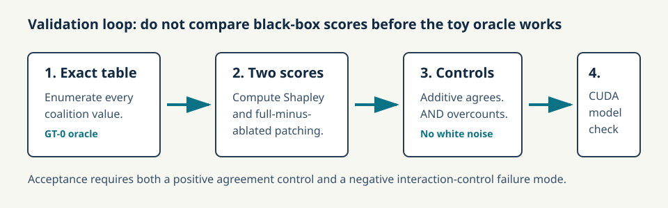
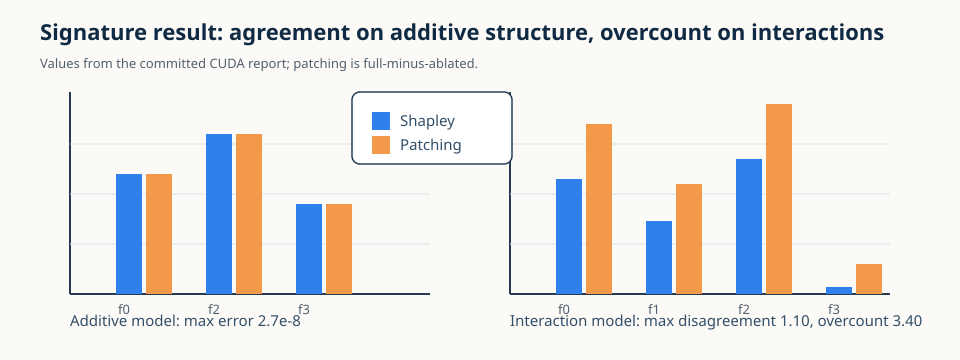

# [16.6] SHAP vs Activation Patching

> **Notebooks: [exercises](../../exercises/part6_shap_vs_activation_patching/16.6_SHAP_vs_Activation_Patching_exercises.ipynb) | [solutions](../../exercises/part6_shap_vs_activation_patching/16.6_SHAP_vs_Activation_Patching_solutions.ipynb)**

> **Local-first extension.** This section compares two attribution questions
> that are often accidentally conflated: exact Shapley credit and
> full-minus-ablated activation patching effects.

```python
EXERCISE_ID = "16_6_shap_vs_activation_patching"
GT_TIER = "GT-0"
DIFFICULTY = 3
IMPORTANCE = 4
EXPECTED_RUNTIME = "seconds for exact games; minutes for CUDA model organisms"
REQUIRES_GPU = True
```

Please send any problems / bugs on the `#errata` channel in the [Slack group](https://info-arena.github.io/ARENA_img/slack.html), and ask any questions on the dedicated channels for this chapter of material.

Links to earlier chapters: [(0) Fundamentals](https://arena-chapter0-fundamentals.streamlit.app/), [(1) Transformer Interpretability](https://arena-chapter1-transformer-interp.streamlit.app/), [(2) RL](https://arena-chapter2-rl.streamlit.app/), [(3) LLM Evaluations](https://arena-chapter3-llm-evals.streamlit.app/), [(4) Alignment Science](https://arena-chapter4-alignment-science.streamlit.app/).



## Core Question

When do Shapley values and activation patching effects tell the same story, and
when does patching overcount interaction credit?

You will start with complete finite coalition games. In an additive game,
Shapley values and full-minus-ablated patching effects agree exactly. In an AND
interaction game, every necessary feature gets the full patching effect, while
Shapley splits credit fairly. Only after both toy oracles work do we inspect the
CUDA model-organism report.

<details>
<summary>Help - what exactly is patching here?</summary>

This notebook models activation patching as the full coalition value minus the
value when one feature is ablated: `v(N) - v(N \ {i})`. That is the right toy
analogue for a single-component patching effect, but it is not the same
quantity as average marginal contribution across all coalitions.

</details>

<details>
<summary>Help - why is the AND game a negative control?</summary>

In a two-feature AND game, both features are necessary. Ablating either feature
destroys the full effect, so patching gives both features credit for the whole
outcome. Shapley instead averages over all feature orderings and splits the
interaction evenly. The disagreement is the lesson, not a bug to hide.

</details>

## Learning Objectives

- Enumerate complete coalition tables for small finite games.
- Compute exact Shapley values from weighted marginal contributions.
- Compute full-minus-ablated patching effects from the same table.
- Verify exact agreement on an additive positive control.
- Detect and document interaction overcount on an AND negative control.
- Interpret a CUDA model-organism report without claiming method equivalence.

# Setup Code

```python
from collections.abc import Callable, Mapping
import itertools
import json
import math
import sys
from pathlib import Path

import torch as t

chapter = "chapter16_shapley_attribution_baselines"
section = "part6_shap_vs_activation_patching"
root_dir = next(p for p in [Path.cwd(), *Path.cwd().parents] if (p / chapter).exists())
exercises_dir = root_dir / chapter / "exercises"
section_dir = exercises_dir / section

if str(root_dir) not in sys.path:
    sys.path.append(str(root_dir))
if str(exercises_dir) not in sys.path:
    sys.path.append(str(exercises_dir))

import part6_shap_vs_activation_patching.tests as tests

Coalition = frozenset[int]
MAIN = __name__ == "__main__"
```

# Exact Coalition Tables

### Exercise - enumerate finite games

> ```yaml
> Difficulty: 🔵⚪⚪⚪⚪
> Importance: 🔵🔵🔵⚪⚪
>
> You should spend 5-10 minutes on this exercise.
> ```

Implement `all_coalitions`. This is the foundation for the rest of the
notebook: if the table is incomplete, any attribution comparison is suspect.

```python
def all_coalitions(num_players: int) -> tuple[Coalition, ...]:
    raise NotImplementedError()


if MAIN:
    tests.test_all_coalitions_contract(all_coalitions)
```

<details>
<summary>Expected output</summary>

```text
All tests in `test_all_coalitions_contract` passed!
```

</details>

<details>
<summary>Common bugs</summary>

- Returning only non-empty coalitions.
- Returning lists instead of hashable `frozenset` keys.
- Missing the full coalition.

</details>

<details>
<summary>Solution</summary>

Loop over coalition sizes from `0` to `num_players`, then use
`itertools.combinations` to build every `frozenset`.

</details>

# Exact Shapley Values

### Exercise - implement weighted marginal credit

> ```yaml
> Difficulty: 🔴🔴🔴⚪⚪
> Importance: 🔵🔵🔵🔵⚪
>
> You should spend 15-20 minutes on this exercise.
> ```

Implement exact Shapley values for a complete coalition table. The additive
oracle has weights `[1.0, 2.0, 0.5]`, so exact Shapley must return those values
with no approximation.

```python
def normalize_coalition_values(
    coalition_values: Mapping[Coalition | tuple[int, ...], float],
    *,
    num_players: int,
) -> dict[Coalition, float]:
    raise NotImplementedError()


def exact_shapley_values(
    coalition_values: Mapping[Coalition | tuple[int, ...], float],
    *,
    num_players: int,
) -> t.Tensor:
    raise NotImplementedError()


if MAIN:
    tests.test_exact_shapley_values_additive_toy(exact_shapley_values)
```

<details>
<summary>Expected output</summary>

```text
All tests in `test_exact_shapley_values_additive_toy` passed!
```

</details>

<details>
<summary>Help - what should the weighting loop do?</summary>

For player `i`, iterate over every coalition not containing `i`, compute
`v(S union {i}) - v(S)`, and weight it by
`|S|! (n-|S|-1)! / n!`. This averages marginal contributions across all player
orderings.

</details>

<details>
<summary>Common bugs</summary>

- Using leave-one-out deltas instead of weighted marginal contributions.
- Forgetting to normalize tuple keys to `frozenset`.
- Allowing incomplete coalition tables to pass silently.

</details>

<details>
<summary>Solution</summary>

Normalize all coalition keys, compare against `set(all_coalitions(n))`, then
sum the weighted marginal effects for each player in `float64`.

</details>

# Activation Patching Effects

### Exercise - implement full-minus-ablated effects

> ```yaml
> Difficulty: 🔴🔴⚪⚪⚪
> Importance: 🔵🔵🔵🔵⚪
>
> You should spend 10 minutes on this exercise.
> ```

Implement the patching analogue used in this section:

```text
patch_effect_i = v(N) - v(N without i)
```

This should agree with Shapley in an additive game, but not in the interaction
control.

```python
def activation_patching_effects(
    coalition_values: Mapping[Coalition | tuple[int, ...], float],
    *,
    num_players: int,
) -> t.Tensor:
    raise NotImplementedError()


if MAIN:
    tests.test_activation_patching_effects_full_minus_ablated(
        activation_patching_effects
    )
```

<details>
<summary>Expected output</summary>

```text
All tests in `test_activation_patching_effects_full_minus_ablated` passed!
```

</details>

<details>
<summary>What you should see</summary>

On additive weights `[1.0, 2.0, 0.5]`, patching gives `[1.0, 2.0, 0.5]`.
On a two-feature AND game, patching gives `[1.0, 1.0]`.

</details>

<details>
<summary>Solution</summary>

Read the full coalition value once, then subtract the value of the coalition
where each player is removed.

</details>

# Agreement Control

### Exercise - compare both methods on an additive game

> ```yaml
> Difficulty: 🔴🔴⚪⚪⚪
> Importance: 🔵🔵🔵🔵🔵
>
> You should spend 10 minutes on this exercise.
> ```

Build a report that compares exact Shapley values and patching effects. In the
additive game, the maximum absolute disagreement should be zero.

```python
def shapley_patching_comparison_report(
    coalition_values: Mapping[Coalition | tuple[int, ...], float],
    *,
    num_players: int,
    tolerance: float = 1e-9,
) -> dict:
    raise NotImplementedError()


def additive_agreement_smoke_test() -> dict:
    raise NotImplementedError()


if MAIN:
    tests.test_shapley_patching_comparison_report_additive(
        shapley_patching_comparison_report
    )
    tests.test_additive_agreement_smoke_test(additive_agreement_smoke_test)
```

<details>
<summary>Expected output</summary>

```text
All tests in `test_shapley_patching_comparison_report_additive` passed!
All tests in `test_additive_agreement_smoke_test` passed!
```

</details>

<details>
<summary>What you should see</summary>

```text
shapley_values: [1.0, 2.0, 0.5]
patching_effects: [1.0, 2.0, 0.5]
max_abs_error: 0.0
top_feature_agrees: True
```

</details>

<details>
<summary>Common bugs</summary>

- Checking only the top feature and ignoring magnitude agreement.
- Comparing Shapley values to raw ablated values instead of patching effects.
- Treating the additive control as optional.

</details>

<details>
<summary>Solution</summary>

Compute both vectors, compare their maximum absolute difference, and report
whether the top feature index agrees.

</details>

# Interaction Overcount

### Exercise - document the AND-game failure mode

> ```yaml
> Difficulty: 🔴🔴🔴⚪⚪
> Importance: 🔵🔵🔵🔵🔵
>
> You should spend 10-15 minutes on this exercise.
> ```

Now run the same comparison on the two-feature AND game. This is the signature
toy result: Shapley splits the interaction `[0.5, 0.5]`, while patching assigns
the full effect to both features `[1.0, 1.0]`.

```python
def interaction_patching_failure_report(
    coalition_values: Mapping[Coalition | tuple[int, ...], float],
    *,
    num_players: int,
    min_overcount: float = 0.5,
) -> dict:
    raise NotImplementedError()


def interaction_failure_smoke_test() -> dict:
    raise NotImplementedError()


if MAIN:
    tests.test_interaction_patching_failure_report_and_control(
        interaction_patching_failure_report
    )
    tests.test_interaction_failure_smoke_test(interaction_failure_smoke_test)
```

<details>
<summary>Expected output</summary>

```text
All tests in `test_interaction_patching_failure_report_and_control` passed!
All tests in `test_interaction_failure_smoke_test` passed!
```

</details>

<details>
<summary>What you should see</summary>

```text
shapley_values: [0.5, 0.5]
patching_effects: [1.0, 1.0]
shapley_total: 1.0
patching_total: 2.0
overcount: 1.0
```

</details>

<details>
<summary>Interpretation</summary>

Both features are necessary, so either single-feature ablation kills the whole
effect. Patching is answering “what happens if I remove this component from the
full system?” Shapley is answering “how much marginal credit does this player
receive across all arrival orders?”

</details>

<details>
<summary>Solution</summary>

Reuse exact Shapley and patching effects, then compare the summed patching
credit to the summed Shapley credit. The additive control should not trigger
the overcount detector.

</details>

# Notebook Contract

### Exercise - package the local evidence

> ```yaml
> Difficulty: 🔴⚪⚪⚪⚪
> Importance: 🔵🔵🔵⚪⚪
>
> You should spend 5 minutes on this exercise.
> ```

Package the additive agreement and interaction failure reports into a single
JSON-serializable contract.

```python
def run_smoke_test(cpu: bool = True) -> dict:
    raise NotImplementedError()


if MAIN:
    tests.test_notebook_contract(run_smoke_test)
```

<details>
<summary>Expected output</summary>

```text
All tests in `test_notebook_contract` passed!
```

</details>

<details>
<summary>Common bugs</summary>

- Returning tensors instead of JSON-serializable lists.
- Including only the positive additive control.
- Treating local exact tests as a replacement for the CUDA report.

</details>

<details>
<summary>Solution</summary>

Return a dictionary with `additive_agreement` and `interaction_failure`.

</details>

# CUDA Verification Path

The committed report repeats the same comparison on trained finite CUDA model
organisms. The positive control is a trained additive linear model. The
negative control is a trained nonlinear coalition-game MLP.

```python
def load_committed_gpu_report() -> dict:
    report = json.loads((section_dir / "verification_report.json").read_text())
    return report["metrics"]["gpu_test"]


if MAIN:
    gpu_report = load_committed_gpu_report()
    tests.test_committed_gpu_report_records_agreement_and_disagreement_controls()
```

<details>
<summary>Expected output</summary>

```text
All tests in `test_committed_gpu_report_records_agreement_and_disagreement_controls` passed!
```

</details>

<details>
<summary>Help - what does the report prove?</summary>

It proves that the same agreement/disagreement pattern holds when the coalition
table comes from real CUDA model outputs on complete finite domains. It still
does not prove that either method is reliable on arbitrary transformer circuits.

</details>

## Signature Result



| Setting | Shapley values | Patching effects | Conclusion |
|---|---:|---:|---|
| Additive toy | `[1.0, 2.0, 0.5]` | `[1.0, 2.0, 0.5]` | Exact agreement |
| AND toy | `[0.5, 0.5]` | `[1.0, 1.0]` | Patching overcounts |
| CUDA additive model | max error `2.73e-8` | same top feature | Positive control passes |
| CUDA interaction model | max disagreement `1.10` | overcount `3.40` | Interaction failure preserved |

## What This Section Shows

- Shapley and full-minus-ablated patching agree on additive finite games.
- Patching can overcount interaction credit even when it identifies the same
  top feature.
- The CUDA report preserves both the positive agreement control and the
  interaction disagreement control on trained finite model organisms.

## Limitations

## What This Section Does Not Show

- It does not show that Shapley is generally better than activation patching.
- It does not show that activation patching is unreliable in transformer
  circuits.
- It does not claim scalable attribution for arbitrary language or vision
  models.
- It does not replace prompt-level clean/corrupt activation-patching studies.

## Bonus / Anomaly Hunting

- Try a three-way interaction game and measure how patching overcount scales.
- Add redundant features and check whether the top feature still agrees.
- Compare leave-one-out patching with patching from multiple baselines.
- Run the same comparison on a tiny clean/corrupt residual-stream toy model.
