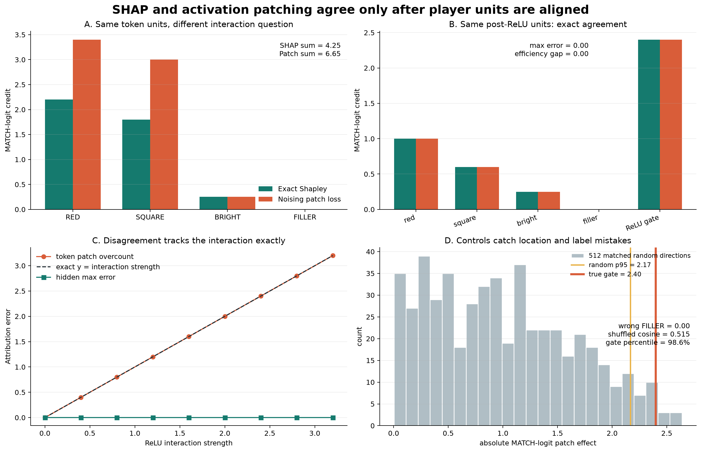

# [16.6] SHAP vs Activation Patching

> **Falsifiable claim.** By the end of this notebook, you will have shown that, in an exact ReLU token model, token-location noising patching overcounts the clean-minus-corrupt effect by exactly the `2.4` interaction contribution, while exact Shapley remains efficient; when both methods instead use the same five post-ReLU hidden units, they agree exactly, and wrong-location, shuffled-label, and matched-random controls fail visibly.

## Core Question

When SHAP and activation patching disagree, is one method wrong, or did we ask two different causal questions about different units?

## Cold open: one prompt, two stories

Our model reads four visible token locations:

```text
[RED] [SQUARE] [BRIGHT] [FILLER]  ->  MATCH logit 4.25
[---] [------] [------] [------]  ->  MATCH logit 0.00
```

`RED`, `SQUARE`, and `BRIGHT` contribute `1.00`, `0.60`, and `0.25` directly. A real ReLU unit detects `RED AND SQUARE` and contributes another `2.40`. `FILLER` is known to do nothing. We know every causal term, so disagreement cannot hide behind model uncertainty.

Before calculating anything, predict: if you remove `RED` from the full prompt, should the lost `2.40` interaction belong entirely to `RED`, or be shared with `SQUARE`?

## Learning Objectives

- Implement and inspect a nonlinear model with named token and hidden activations.
- Build complete clean/corrupt coalition tables at a chosen activation level.
- Implement exact Shapley values from weighted marginal contributions.
- Implement activation patching as an actual cached-activation intervention.
- Align attribution units before comparing magnitudes, rankings, or cosine similarity.
- Falsify weak agreement claims with wrong-location, shuffled-label, and matched-random controls.
- Explain why interaction credit depends on the causal question, not only the model output.

> Difficulty: 3/5
> Importance: 4/5

## Setup

The primary result is generated from the code in this notebook. No verification report is loaded. The optional repository CUDA preflight is supporting release evidence, not part of the learner argument.

<details><summary>Expected output</summary>

Imports complete without output. All model and attribution tensors use float64 so the exact oracle can be checked to `1e-12`.

</details>

```python
import itertools
import math
import sys
from collections.abc import Callable, Mapping, Sequence
from pathlib import Path

import matplotlib.pyplot as plt
import numpy as np
import torch as t

chapter = "chapter16_shapley_attribution_baselines"
section = "part6_shap_vs_activation_patching"
root_dir = next(p for p in [Path.cwd(), *Path.cwd().parents] if (p / chapter).exists())
exercises_dir = root_dir / chapter / "exercises"
section_dir = exercises_dir / section
asset_path = root_dir / chapter / "instructions" / "assets" / "shap_vs_activation_patching_exact_signature.png"

if str(root_dir) not in sys.path:
    sys.path.append(str(root_dir))
if str(exercises_dir) not in sys.path:
    sys.path.append(str(exercises_dir))

import part6_shap_vs_activation_patching.tests as tests

t.set_default_dtype(t.float64)
TOKEN_LABELS = ("RED", "SQUARE", "BRIGHT", "FILLER")
HIDDEN_LABELS = (
    "red_direct",
    "square_direct",
    "bright_direct",
    "filler_direct",
    "red_x_square_gate",
)
DIRECT_WEIGHTS = (1.0, 0.6, 0.25, 0.0)
DEFAULT_INTERACTION_STRENGTH = 2.4
GATE_THRESHOLD = 1.0
EXERCISE_ID = "16_6_shap_vs_activation_patching"
GT_TIER = "GT-0"
EXPECTED_RUNTIME = "45-75 minutes on CPU; optional release preflight uses CUDA"
REQUIRES_GPU = True
MAIN = True
```

### Exercise 1 - build the exact ReLU model

> ```yaml
> Difficulty: 🔴🔴⚪⚪⚪
> Importance: 🔵🔵🔵🔵🔵
> You should spend 10-15 minutes on this exercise.
> ```

Implement the encoder, readout, and cached forward pass. The fifth hidden unit must be `ReLU(RED + SQUARE - 1)`, not a precomputed interaction label.

<details><summary>Expected output</summary>

`MATCH logit: 0.00 -> 4.25` and `post-ReLU hidden: [1, 1, 1, 1, 1]`. Removing `SQUARE` switches off the gate and gives `1.25`.

</details>

<details><summary>Help - what should I reason about first?</summary>

Track shapes first. The input ends in four token locations; the encoder appends one scalar gate; the readout has five weights. Preserve any leading batch axes.

</details>

<details><summary>Interpretation</summary>

This is an actual nonlinear computation with an inspectable internal activation. We are not inventing coalition scores by hand.

</details>

<details><summary>Common bugs</summary>

Hard-coding the interaction score instead of producing it with `torch.relu`; returning only a score so there is no activation to patch.

</details>

<details><summary>Solution</summary>

```python
def encode_tokens(
    token_activations: t.Tensor,
    *,
    gate_threshold: float = GATE_THRESHOLD,
) -> t.Tensor:
    if token_activations.shape[-1] != len(TOKEN_LABELS):
        raise ValueError(f"Expected {len(TOKEN_LABELS)} token locations.")
    gate = t.relu(token_activations[..., 0] + token_activations[..., 1] - gate_threshold)
    return t.cat((token_activations, gate.unsqueeze(-1)), dim=-1)


def score_from_hidden(
    hidden: t.Tensor,
    *,
    interaction_strength: float = DEFAULT_INTERACTION_STRENGTH,
) -> t.Tensor:
    if hidden.shape[-1] != len(HIDDEN_LABELS):
        raise ValueError(f"Expected {len(HIDDEN_LABELS)} hidden units.")
    weights = hidden.new_tensor((*DIRECT_WEIGHTS, interaction_strength))
    return hidden @ weights


def exact_model(
    token_activations: t.Tensor,
    *,
    interaction_strength: float = DEFAULT_INTERACTION_STRENGTH,
    gate_threshold: float = GATE_THRESHOLD,
    return_cache: bool = False,
) -> t.Tensor | tuple[t.Tensor, dict[str, t.Tensor]]:
    hidden = encode_tokens(token_activations, gate_threshold=gate_threshold)
    score = score_from_hidden(hidden, interaction_strength=interaction_strength)
    if not return_cache:
        return score
    return score, {
        "token_activations": token_activations.detach().clone(),
        "post_relu_hidden": hidden.detach().clone(),
    }
```

</details>

```python
def encode_tokens(
    token_activations: t.Tensor,
    *,
    gate_threshold: float = GATE_THRESHOLD,
) -> t.Tensor:
    """Expose four direct channels and one ReLU interaction unit."""
    # EXERCISE
    # YOUR CODE HERE
    raise NotImplementedError()
    # END EXERCISE


def score_from_hidden(
    hidden: t.Tensor,
    *,
    interaction_strength: float = DEFAULT_INTERACTION_STRENGTH,
) -> t.Tensor:
    """Read out the five hidden units into one MATCH logit."""
    # EXERCISE
    # YOUR CODE HERE
    raise NotImplementedError()
    # END EXERCISE


def exact_model(
    token_activations: t.Tensor,
    *,
    interaction_strength: float = DEFAULT_INTERACTION_STRENGTH,
    gate_threshold: float = GATE_THRESHOLD,
    return_cache: bool = False,
) -> t.Tensor | tuple[t.Tensor, dict[str, t.Tensor]]:
    """Run the model and optionally return named token and hidden activations."""
    # EXERCISE
    # YOUR CODE HERE
    raise NotImplementedError()
    # END EXERCISE


if MAIN:
    tests.test_exact_model_oracle(encode_tokens, score_from_hidden, exact_model)
    clean_tokens = t.ones(4)
    corrupt_tokens = t.zeros(4)
    clean_score, clean_cache = exact_model(clean_tokens, return_cache=True)
    print("Clean prompt:   [RED] [SQUARE] [BRIGHT] [FILLER]")
    print("Corrupt prompt: [---] [------] [------] [------]")
    print(f"MATCH logit: {exact_model(corrupt_tokens).item():.2f} -> {clean_score.item():.2f}")
    print("post-ReLU hidden:", clean_cache["post_relu_hidden"].tolist())
```

### Exercise 2 - construct a coalition table from interventions

> ```yaml
> Difficulty: 🔴🔴⚪⚪⚪
> Importance: 🔵🔵🔵🔵🔵
> You should spend 10-15 minutes on this exercise.
> ```

A player is meaningful only relative to an activation level. Write one routine which mixes clean and corrupt activations, then really runs the supplied downstream function for all coalitions.

<details><summary>Expected output</summary>

There are 16 token coalitions. `RED+SQUARE -> 4.00`, `RED+BRIGHT -> 1.25`, and the full prompt gives `4.25`.

</details>

<details><summary>Help - what should I reason about first?</summary>

For each subset, clone the corrupt vector and copy only the selected clean coordinates. Never mutate either source cache.

</details>

<details><summary>Interpretation</summary>

At the token level, coalition membership changes both direct evidence and whether the downstream ReLU fires. Later, at the hidden level, the gate itself becomes a player.

</details>

<details><summary>Common bugs</summary>

Treating coalition membership as a label lookup instead of rerunning the downstream function; mutating the clean or corrupt source vector in place.

</details>

<details><summary>Solution</summary>

```python
def all_coalitions(num_players: int) -> tuple[frozenset[int], ...]:
    if num_players <= 0:
        raise ValueError("num_players must be positive.")
    coalitions = []
    for size in range(num_players + 1):
        coalitions.extend(
            frozenset(group)
            for group in itertools.combinations(range(num_players), size)
        )
    return tuple(coalitions)


def coalition_value_table(
    clean_activation: t.Tensor,
    corrupt_activation: t.Tensor,
    value_fn: Callable[[t.Tensor], t.Tensor],
) -> dict[frozenset[int], float]:
    if clean_activation.ndim != 1 or clean_activation.shape != corrupt_activation.shape:
        raise ValueError("clean and corrupt activations must be same-shape vectors.")
    values = {}
    for coalition in all_coalitions(clean_activation.numel()):
        mixed = corrupt_activation.clone()
        if coalition:
            index = t.tensor(sorted(coalition), device=mixed.device)
            mixed[index] = clean_activation[index]
        value = value_fn(mixed)
        if value.numel() != 1:
            raise ValueError("value_fn must return one scalar.")
        values[coalition] = float(value.item())
    return values
```

</details>

```python
def all_coalitions(num_players: int) -> tuple[frozenset[int], ...]:
    """Return every player subset, including empty and full coalitions."""
    # EXERCISE
    # YOUR CODE HERE
    raise NotImplementedError()
    # END EXERCISE


def coalition_value_table(
    clean_activation: t.Tensor,
    corrupt_activation: t.Tensor,
    value_fn: Callable[[t.Tensor], t.Tensor],
) -> dict[frozenset[int], float]:
    """Run all mixed clean/corrupt coalitions at one activation level."""
    # EXERCISE
    # YOUR CODE HERE
    raise NotImplementedError()
    # END EXERCISE


if MAIN:
    tests.test_coalition_value_table_oracle(all_coalitions, coalition_value_table, exact_model)
    token_values = coalition_value_table(clean_tokens, corrupt_tokens, exact_model)
    for coalition in [frozenset(), frozenset({0}), frozenset({0, 1}), frozenset(range(4))]:
        names = [TOKEN_LABELS[index] for index in sorted(coalition)] or ["baseline"]
        print(f"{'+'.join(names):28s} -> {token_values[coalition]:.2f}")
```

### Exercise 3 - implement exact Shapley values

> ```yaml
> Difficulty: 🔴🔴🔴⚪⚪
> Importance: 🔵🔵🔵🔵🔵
> You should spend 15-20 minutes on this exercise.
> ```

Average each player's marginal contribution over every possible predecessor coalition, using the factorial Shapley weight. Reject incomplete tables.

<details><summary>Expected output</summary>

Token Shapley is `RED=2.20, SQUARE=1.80, BRIGHT=0.25, FILLER=0.00`; the values sum exactly to the `4.25` output difference.

</details>

<details><summary>Help - what should I reason about first?</summary>

For player `i` and coalition size `s`, the weight is `s! (n-s-1)! / n!`. Iterate only over coalitions which exclude `i`.

</details>

<details><summary>Interpretation</summary>

The ReLU contribution is symmetric in `RED` and `SQUARE`, so Shapley gives each half of `2.40`, on top of their direct terms.

</details>

<details><summary>Common bugs</summary>

Using leave-one-out deltas instead of factorial-weighted marginal contributions; silently accepting a missing coalition.

</details>

<details><summary>Solution</summary>

```python
def normalize_coalition_values(
    coalition_values: Mapping[frozenset[int] | tuple[int, ...], float],
    *,
    num_players: int,
) -> dict[frozenset[int], float]:
    values = {frozenset(key): float(value) for key, value in coalition_values.items()}
    expected = set(all_coalitions(num_players))
    if set(values) != expected:
        missing = expected - set(values)
        extra = set(values) - expected
        raise ValueError(
            f"Coalition table must be complete (missing={len(missing)}, extra={len(extra)})."
        )
    return values


def exact_shapley_values(
    coalition_values: Mapping[frozenset[int] | tuple[int, ...], float],
    *,
    num_players: int,
) -> t.Tensor:
    values = normalize_coalition_values(coalition_values, num_players=num_players)
    result = t.zeros(num_players, dtype=t.float64)
    denominator = math.factorial(num_players)
    for player in range(num_players):
        others = [candidate for candidate in range(num_players) if candidate != player]
        for size in range(num_players):
            weight = (
                math.factorial(size)
                * math.factorial(num_players - size - 1)
                / denominator
            )
            for group in itertools.combinations(others, size):
                coalition = frozenset(group)
                result[player] += weight * (
                    values[coalition | {player}] - values[coalition]
                )
    return result
```

</details>

```python
def normalize_coalition_values(
    coalition_values: Mapping[frozenset[int] | tuple[int, ...], float],
    *,
    num_players: int,
) -> dict[frozenset[int], float]:
    """Normalize keys and reject incomplete finite games."""
    # EXERCISE
    # YOUR CODE HERE
    raise NotImplementedError()
    # END EXERCISE


def exact_shapley_values(
    coalition_values: Mapping[frozenset[int] | tuple[int, ...], float],
    *,
    num_players: int,
) -> t.Tensor:
    """Average each player's marginal effect over all arrival contexts."""
    # EXERCISE
    # YOUR CODE HERE
    raise NotImplementedError()
    # END EXERCISE


if MAIN:
    tests.test_exact_shapley_token_ground_truth(
        coalition_value_table, exact_shapley_values, exact_model
    )
    token_shapley = exact_shapley_values(token_values, num_players=4)
    print(dict(zip(TOKEN_LABELS, token_shapley.tolist(), strict=True)))
    print(f"sum(phi) = {token_shapley.sum().item():.2f} = clean-corrupt output")
```

### Exercise 4 - patch one activation location

> ```yaml
> Difficulty: 🔴🔴⚪⚪⚪
> Importance: 🔵🔵🔵🔵🔵
> You should spend 10-15 minutes on this exercise.
> ```

Implement noising patching: start from the clean cache, replace one location with its corrupt value, continue the forward computation, and record the clean-score loss.

<details><summary>Expected output</summary>

Token patch losses are `[3.40, 3.00, 0.25, 0.00]`. They sum to `6.65`, exceeding the output delta by exactly `2.40`.

</details>

<details><summary>Help - what should I reason about first?</summary>

Compute the clean score once. For each location, clone clean activation, copy one corrupt scalar, and rerun `value_fn`. Return `clean_score - patched_score`.

</details>

<details><summary>Interpretation</summary>

Removing either necessary token kills the complete gate contribution. Full-context patching therefore assigns `2.40` to both tokens; this is a different estimand from Shapley's average marginal credit.

</details>

<details><summary>Common bugs</summary>

Patching into the corrupt run while reporting a noising score; replacing every location at once; measuring the patched score rather than clean minus patched.

</details>

<details><summary>Solution</summary>

```python
def activation_patching_effects(
    clean_activation: t.Tensor,
    corrupt_activation: t.Tensor,
    value_fn: Callable[[t.Tensor], t.Tensor],
) -> t.Tensor:
    if clean_activation.ndim != 1 or clean_activation.shape != corrupt_activation.shape:
        raise ValueError("clean and corrupt activations must be same-shape vectors.")
    clean_value = value_fn(clean_activation)
    if clean_value.numel() != 1:
        raise ValueError("value_fn must return one scalar.")
    effects = []
    for location in range(clean_activation.numel()):
        patched = clean_activation.clone()
        patched[location] = corrupt_activation[location]
        effects.append(clean_value - value_fn(patched))
    return t.stack(effects).to(dtype=t.float64)
```

</details>

```python
def activation_patching_effects(
    clean_activation: t.Tensor,
    corrupt_activation: t.Tensor,
    value_fn: Callable[[t.Tensor], t.Tensor],
) -> t.Tensor:
    """Patch one corrupt activation into the clean run and measure score loss."""
    # EXERCISE
    # YOUR CODE HERE
    raise NotImplementedError()
    # END EXERCISE


if MAIN:
    tests.test_token_activation_patching_ground_truth(activation_patching_effects, exact_model)
    token_patching = activation_patching_effects(clean_tokens, corrupt_tokens, exact_model)
    print("location        SHAP    patch loss")
    for label, shapley, patch in zip(TOKEN_LABELS, token_shapley, token_patching, strict=True):
        print(f"{label:10s} {shapley.item():7.2f} {patch.item():11.2f}")
    print(f"patching credit = {token_patching.sum().item():.2f}; output delta = 4.25")
```

### Exercise 5 - align attribution units before comparing

> ```yaml
> Difficulty: 🔴🔴🔴⚪⚪
> Importance: 🔵🔵🔵🔵🔵
> You should spend 15-20 minutes on this exercise.
> ```

Implement strict name-based alignment and report magnitude error, cosine similarity, top unit, and each method's efficiency gap. Then repeat both methods over the five post-ReLU hidden units.

<details><summary>Expected output</summary>

Token max error is `1.20` and patching efficiency gap is `2.40`, despite top-unit agreement. Hidden Shapley and hidden patching both equal `[1.00, 0.60, 0.25, 0.00, 2.40]` with zero error.

</details>

<details><summary>Help - what should I reason about first?</summary>

Never correlate a four-token vector with a five-hidden-unit vector. Require identical label sets, reorder by name, and only then calculate metrics.

</details>

<details><summary>Interpretation</summary>

The hidden readout is additive in its five units, so patching the explicit gate and assigning Shapley credit to that same gate asks the same question. The model stayed nonlinear; the player definition changed.

</details>

<details><summary>Common bugs</summary>

Correlating token values with hidden-unit values because their lengths happen to be close; reporting only top-1 agreement or cosine and ignoring efficiency.

</details>

<details><summary>Solution</summary>

```python
def align_named_attributions(
    reference_labels: Sequence[str],
    reference_values: t.Tensor,
    candidate_labels: Sequence[str],
    candidate_values: t.Tensor,
) -> tuple[tuple[str, ...], t.Tensor, t.Tensor]:
    if len(set(reference_labels)) != len(reference_labels):
        raise ValueError("reference labels must be unique.")
    if len(set(candidate_labels)) != len(candidate_labels):
        raise ValueError("candidate labels must be unique.")
    if reference_values.numel() != len(reference_labels):
        raise ValueError("reference values and labels have different lengths.")
    if candidate_values.numel() != len(candidate_labels):
        raise ValueError("candidate values and labels have different lengths.")
    if set(reference_labels) != set(candidate_labels):
        raise ValueError("Attributions describe different player sets; do not correlate them.")
    candidate_index = {label: index for index, label in enumerate(candidate_labels)}
    order = t.tensor(
        [candidate_index[label] for label in reference_labels],
        device=candidate_values.device,
    )
    return (
        tuple(reference_labels),
        reference_values.to(dtype=t.float64),
        candidate_values[order].to(dtype=t.float64),
    )


def attribution_comparison(
    reference_labels: Sequence[str],
    reference_values: t.Tensor,
    candidate_labels: Sequence[str],
    candidate_values: t.Tensor,
    *,
    output_delta: float,
) -> dict[str, float | str | bool]:
    labels, reference, candidate = align_named_attributions(
        reference_labels, reference_values, candidate_labels, candidate_values
    )
    cosine = t.nn.functional.cosine_similarity(reference, candidate, dim=0)
    return {
        "max_abs_error": float((reference - candidate).abs().max().item()),
        "mean_abs_error": float((reference - candidate).abs().mean().item()),
        "cosine_similarity": float(cosine.item()),
        "reference_efficiency_gap": float(reference.sum().item() - output_delta),
        "candidate_efficiency_gap": float(candidate.sum().item() - output_delta),
        "top_reference": labels[int(reference.argmax().item())],
        "top_candidate": labels[int(candidate.argmax().item())],
        "top_agrees": int(reference.argmax().item()) == int(candidate.argmax().item()),
    }
```

</details>

```python
def align_named_attributions(
    reference_labels: Sequence[str],
    reference_values: t.Tensor,
    candidate_labels: Sequence[str],
    candidate_values: t.Tensor,
) -> tuple[tuple[str, ...], t.Tensor, t.Tensor]:
    """Align by player name and reject incomparable token/hidden units."""
    # EXERCISE
    # YOUR CODE HERE
    raise NotImplementedError()
    # END EXERCISE


def attribution_comparison(
    reference_labels: Sequence[str],
    reference_values: t.Tensor,
    candidate_labels: Sequence[str],
    candidate_values: t.Tensor,
    *,
    output_delta: float,
) -> dict[str, float | str | bool]:
    """Report magnitude, angle, top unit, and efficiency after alignment."""
    # EXERCISE
    # YOUR CODE HERE
    raise NotImplementedError()
    # END EXERCISE


if MAIN:
    tests.test_alignment_reorders_and_rejects_mismatched_units(align_named_attributions)
    tests.test_aligned_token_disagreement_and_hidden_agreement(
        coalition_value_table,
        exact_shapley_values,
        activation_patching_effects,
        attribution_comparison,
        encode_tokens,
        score_from_hidden,
        exact_model,
    )
    clean_hidden = encode_tokens(clean_tokens)
    corrupt_hidden = encode_tokens(corrupt_tokens)
    hidden_values = coalition_value_table(clean_hidden, corrupt_hidden, score_from_hidden)
    hidden_shapley = exact_shapley_values(hidden_values, num_players=5)
    hidden_patching = activation_patching_effects(clean_hidden, corrupt_hidden, score_from_hidden)
    token_comparison = attribution_comparison(
        TOKEN_LABELS, token_shapley, TOKEN_LABELS, token_patching, output_delta=4.25
    )
    hidden_comparison = attribution_comparison(
        HIDDEN_LABELS, hidden_shapley, HIDDEN_LABELS, hidden_patching, output_delta=4.25
    )
    print("token level:", token_comparison)
    print("hidden level:", hidden_comparison)
```

### Exercise 6 - make the controls fail

> ```yaml
> Difficulty: 🔴🔴🔴⚪⚪
> Importance: 🔵🔵🔵🔵🔵
> You should spend 15-20 minutes on this exercise.
> ```

Build a fixed label-shuffle control and 512 matched-L2 random hidden interventions. Keep the known `FILLER` token as a wrong-location control.

<details><summary>Expected output</summary>

Wrong-location effect `0.00`; shuffled-label cosine `0.515`; random-direction p95 `2.166`; true gate effect `2.400` at the `98.6%` random percentile.

</details>

<details><summary>Help - what should I reason about first?</summary>

For random controls, sample Gaussian vectors, normalize each row, match the true gate-delta norm, and measure the same score loss used for the target intervention.

</details>

<details><summary>Interpretation</summary>

A large patch effect is not persuasive without a location control and a matched intervention distribution. A high cosine is not persuasive if labels can be shuffled without much penalty.

</details>

<details><summary>Common bugs</summary>

Sampling unmatched random-vector norms; shuffling both labels and values together, which leaves the attribution mapping unchanged.

</details>

<details><summary>Solution</summary>

```python
def shuffled_label_control(values: t.Tensor, permutation: Sequence[int]) -> t.Tensor:
    if sorted(permutation) != list(range(values.numel())):
        raise ValueError("permutation must contain each value index exactly once.")
    return values[t.tensor(permutation, device=values.device)]


def random_direction_patching_effects(
    clean_hidden: t.Tensor,
    readout_weights: t.Tensor,
    *,
    target_delta_norm: float,
    num_samples: int = 512,
    seed: int = 1666,
) -> t.Tensor:
    if clean_hidden.ndim != 1 or clean_hidden.shape != readout_weights.shape:
        raise ValueError("clean_hidden and readout_weights must be same-shape vectors.")
    if num_samples <= 0 or target_delta_norm <= 0:
        raise ValueError("num_samples and target_delta_norm must be positive.")
    generator = t.Generator(device=clean_hidden.device).manual_seed(seed)
    directions = t.randn(
        num_samples,
        clean_hidden.numel(),
        generator=generator,
        device=clean_hidden.device,
        dtype=clean_hidden.dtype,
    )
    directions = directions / directions.norm(dim=1, keepdim=True)
    directions = directions * target_delta_norm
    patched = clean_hidden.unsqueeze(0) - directions
    clean_score = clean_hidden @ readout_weights
    return clean_score - patched @ readout_weights
```

</details>

```python
def shuffled_label_control(values: t.Tensor, permutation: Sequence[int]) -> t.Tensor:
    """Keep labels fixed while shuffling the values assigned to them."""
    # EXERCISE
    # YOUR CODE HERE
    raise NotImplementedError()
    # END EXERCISE


def random_direction_patching_effects(
    clean_hidden: t.Tensor,
    readout_weights: t.Tensor,
    *,
    target_delta_norm: float,
    num_samples: int = 512,
    seed: int = 1666,
) -> t.Tensor:
    """Patch matched-norm random directions into the hidden state."""
    # EXERCISE
    # YOUR CODE HERE
    raise NotImplementedError()
    # END EXERCISE


if MAIN:
    tests.test_shuffled_and_random_controls(
        shuffled_label_control, random_direction_patching_effects
    )
    shuffled = shuffled_label_control(token_patching, (2, 0, 3, 1))
    shuffled_cosine = t.nn.functional.cosine_similarity(token_shapley, shuffled, dim=0).item()
    readout_weights = t.tensor((*DIRECT_WEIGHTS, DEFAULT_INTERACTION_STRENGTH))
    random_effects = random_direction_patching_effects(
        clean_hidden, readout_weights, target_delta_norm=1.0
    ).abs()
    random_p95 = t.quantile(random_effects, 0.95).item()
    gate_effect = hidden_patching[-1].item()
    gate_percentile = (random_effects < gate_effect).double().mean().item()
    print(f"wrong-location FILLER patch: {token_patching[-1].item():.2f}")
    print(f"label-shuffled cosine:       {shuffled_cosine:.3f}")
    print(f"random direction p95:        {random_p95:.3f}")
    print(f"gate patch effect:           {gate_effect:.3f} ({gate_percentile:.1%} percentile)")
```

### Exercise 7 - sweep the interaction strength

> ```yaml
> Difficulty: 🔴🔴🔴🔴⚪
> Importance: 🔵🔵🔵🔵🔵
> You should spend 20-25 minutes on this exercise.
> ```

Turn the single example into a falsification curve. For each gate readout strength, recompute token and hidden coalition tables, Shapley values, patch effects, and agreement metrics.

<details><summary>Expected output</summary>

Token credit overcount equals `alpha`; token max error equals `alpha / 2`; hidden max error stays `0.0` across the sweep.

</details>

<details><summary>Help - what should I reason about first?</summary>

Do not scale a cached result. Recompute coalition outputs for every strength so the exercise matches how a model experiment would be rerun.

</details>

<details><summary>Interpretation</summary>

At `alpha=0` the token game is additive and both methods agree. Disagreement grows exactly with the nonlinear interaction term, while post-ReLU hidden-unit agreement remains exact.

</details>

<details><summary>Common bugs</summary>

Rescaling one cached attribution vector instead of rebuilding coalition tables at each interaction strength; hiding numerical error with loose tolerances.

</details>

<details><summary>Solution</summary>

```python
def interaction_sweep(interaction_strengths: t.Tensor) -> dict[str, t.Tensor]:
    strengths = interaction_strengths.to(dtype=t.float64)
    clean_tokens = t.ones(len(TOKEN_LABELS), dtype=t.float64)
    corrupt_tokens = t.zeros_like(clean_tokens)
    token_overcount, token_max_error, hidden_max_error = [], [], []

    for strength in strengths:
        alpha = float(strength.item())
        token_value_fn = lambda x, alpha=alpha: exact_model(x, interaction_strength=alpha)
        token_values = coalition_value_table(clean_tokens, corrupt_tokens, token_value_fn)
        token_shapley = exact_shapley_values(token_values, num_players=4)
        token_patching = activation_patching_effects(clean_tokens, corrupt_tokens, token_value_fn)
        output_delta = token_values[frozenset(range(4))] - token_values[frozenset()]
        token_overcount.append(token_patching.sum() - output_delta)
        token_max_error.append((token_patching - token_shapley).abs().max())

        clean_hidden = encode_tokens(clean_tokens)
        corrupt_hidden = encode_tokens(corrupt_tokens)
        hidden_value_fn = lambda h, alpha=alpha: score_from_hidden(h, interaction_strength=alpha)
        hidden_values = coalition_value_table(clean_hidden, corrupt_hidden, hidden_value_fn)
        hidden_shapley = exact_shapley_values(hidden_values, num_players=5)
        hidden_patching = activation_patching_effects(clean_hidden, corrupt_hidden, hidden_value_fn)
        hidden_max_error.append((hidden_patching - hidden_shapley).abs().max())

    return {
        "interaction_strength": strengths,
        "token_credit_overcount": t.stack(token_overcount),
        "token_max_abs_error": t.stack(token_max_error),
        "hidden_max_abs_error": t.stack(hidden_max_error),
    }
```

</details>

```python
def interaction_sweep(interaction_strengths: t.Tensor) -> dict[str, t.Tensor]:
    """Compare token and hidden agreement as the ReLU gate readout changes."""
    # EXERCISE
    # YOUR CODE HERE
    raise NotImplementedError()
    # END EXERCISE


if MAIN:
    tests.test_interaction_sweep_exact_oracle(interaction_sweep)
    strengths = t.linspace(0.0, 3.2, 9)
    sweep = interaction_sweep(strengths)
    print("alpha  token overcount  token max error  hidden max error")
    for row in zip(
        sweep["interaction_strength"],
        sweep["token_credit_overcount"],
        sweep["token_max_abs_error"],
        sweep["hidden_max_abs_error"],
        strict=True,
    ):
        print(f"{row[0].item():4.1f} {row[1].item():16.2f} {row[2].item():16.2f} {row[3].item():17.1e}")
```

## Signature Result

The four panels below are one argument, not four decorative plots:

1. the same token units disagree in magnitude and efficiency;
2. the same hidden units agree exactly;
3. disagreement scales with the planted nonlinear contribution;
4. wrong-location, shuffled-label, and matched-random controls fail.

The plot is generated from your implementations in this notebook and saved as the section's learner-facing bitmap.



```python
colors = {"shapley": "#157A6E", "patching": "#D95D39", "control": "#E9B44C", "ink": "#263238"}
fig, axes = plt.subplots(2, 2, figsize=(14, 9), constrained_layout=True)

x = np.arange(len(TOKEN_LABELS))
width = 0.36
axes[0, 0].bar(x - width / 2, token_shapley.numpy(), width, label="Exact Shapley", color=colors["shapley"])
axes[0, 0].bar(x + width / 2, token_patching.numpy(), width, label="Noising patch loss", color=colors["patching"])
axes[0, 0].set_xticks(x, TOKEN_LABELS)
axes[0, 0].set_ylabel("MATCH-logit credit")
axes[0, 0].set_title("A. Same token units, different interaction question")
axes[0, 0].legend(frameon=False)
axes[0, 0].text(0.98, 0.94, "SHAP sum = 4.25\nPatch sum = 6.65", transform=axes[0, 0].transAxes, ha="right", va="top")

xh = np.arange(len(HIDDEN_LABELS))
short_hidden = ("red", "square", "bright", "filler", "ReLU gate")
axes[0, 1].bar(xh - width / 2, hidden_shapley.numpy(), width, label="Exact Shapley", color=colors["shapley"])
axes[0, 1].bar(xh + width / 2, hidden_patching.numpy(), width, label="Hidden-unit patch", color=colors["patching"])
axes[0, 1].set_xticks(xh, short_hidden, rotation=20, ha="right")
axes[0, 1].set_ylabel("MATCH-logit credit")
axes[0, 1].set_title("B. Same post-ReLU units: exact agreement")
axes[0, 1].text(0.66, 0.94, "max error = 0.00\nefficiency gap = 0.00", transform=axes[0, 1].transAxes, ha="right", va="top")

alpha = sweep["interaction_strength"].numpy()
axes[1, 0].plot(alpha, sweep["token_credit_overcount"].numpy(), "o-", color=colors["patching"], label="token patch overcount")
axes[1, 0].plot(alpha, alpha, "--", color=colors["ink"], label="exact y = interaction strength")
axes[1, 0].plot(alpha, sweep["hidden_max_abs_error"].numpy(), "s-", color=colors["shapley"], label="hidden max error")
axes[1, 0].set_xlabel("ReLU interaction strength")
axes[1, 0].set_ylabel("Attribution error")
axes[1, 0].set_title("C. Disagreement tracks the interaction exactly")
axes[1, 0].legend(frameon=False)

axes[1, 1].hist(random_effects.numpy(), bins=24, color="#B0BEC5", edgecolor="white", label="512 matched random directions")
axes[1, 1].axvline(random_p95, color=colors["control"], linewidth=2, label=f"random p95 = {random_p95:.2f}")
axes[1, 1].axvline(gate_effect, color=colors["patching"], linewidth=3, label=f"true gate = {gate_effect:.2f}")
axes[1, 1].set_xlabel("absolute MATCH-logit patch effect")
axes[1, 1].set_ylabel("count")
axes[1, 1].set_title("D. Controls catch location and label mistakes")
axes[1, 1].legend(frameon=False, fontsize=9)
axes[1, 1].text(0.98, 0.58, f"wrong FILLER = {token_patching[-1].item():.2f}\nshuffled cosine = {shuffled_cosine:.3f}\ngate percentile = {gate_percentile:.1%}", transform=axes[1, 1].transAxes, ha="right", va="top")

for ax in axes.flat:
    ax.spines[["top", "right"]].set_visible(False)
    ax.grid(axis="y", alpha=0.22)

fig.suptitle("SHAP and activation patching agree only after player units are aligned", fontsize=17, weight="bold")
fig.savefig(asset_path, dpi=180, bbox_inches="tight")
plt.show()
print(f"Saved signature result to {asset_path}")
print("CLAIM CHECK: token overcount = 2.40; hidden max error = 0.00; all three controls fail as expected.")
```

## Interpreting the result

SHAP and activation patching are not interchangeable names for “importance.” Exact Shapley asks for an average marginal contribution over all clean/corrupt contexts. The noising patch used here asks how much the full clean computation loses when one activation is replaced. With an interaction, removing either parent destroys the same gate, so full-context patching counts that loss once per necessary parent.

The hidden-unit comparison is the key control on this explanation. Once the ReLU gate is an explicit player and both methods operate on those same five post-ReLU units, the downstream readout is additive and agreement is exact. This is why alignment must include the intervention site, granularity, baseline, and score, not just vector length.

Notice the anomaly: both token methods name `RED` as the top feature and have cosine similarity near one, yet patching allocates `6.65` units of credit to a `4.25` change. Rank agreement alone would have hidden the failure.

## Try It Yourself

Change `play_interaction_strength`, `play_gate_threshold`, and `play_patch_location`. Predict the plot before running it. In particular, set the interaction strength to zero, then raise it above four. Which metric reveals disagreement first: top-1, cosine, maximum error, or efficiency?

```python
# Change these, then rerun this cell.
play_interaction_strength = 1.6
play_gate_threshold = 1.0
play_patch_location = "RED"

play_value_fn = lambda x: exact_model(
    x,
    interaction_strength=play_interaction_strength,
    gate_threshold=play_gate_threshold,
)
play_values = coalition_value_table(clean_tokens, corrupt_tokens, play_value_fn)
play_shapley = exact_shapley_values(play_values, num_players=4)
play_patching = activation_patching_effects(clean_tokens, corrupt_tokens, play_value_fn)
play_index = TOKEN_LABELS.index(play_patch_location)

fig, ax = plt.subplots(figsize=(8, 3.6))
ax.bar(x - width / 2, play_shapley.numpy(), width, label="Shapley", color=colors["shapley"])
ax.bar(x + width / 2, play_patching.numpy(), width, label="patch loss", color=colors["patching"])
ax.set_xticks(x, TOKEN_LABELS)
ax.set_ylabel("MATCH-logit credit")
ax.set_title(f"alpha={play_interaction_strength}, threshold={play_gate_threshold}; inspect {play_patch_location}")
ax.legend(frameon=False)
ax.spines[["top", "right"]].set_visible(False)
plt.show()
print(f"{play_patch_location} patch effect = {play_patching[play_index].item():.3f}")
print(f"total patch overcount = {play_patching.sum().item() - (play_values[frozenset(range(4))] - play_values[frozenset()]):.3f}")
```

## Bonus: anomaly hunting

1. Find the smallest positive interaction strength for which token patching overcounts by more than half the output delta while top-1 still agrees.
2. Raise the gate threshold above `1.0`. The ReLU can now be partially active or inactive for coalitions; derive the new token Shapley oracle before trusting the plot.
3. Replace `FILLER` with a weak negative direct term. Does a zero-effect wrong-location test still make sense, or should the control become a deliberately unrelated location with a known nonzero effect?
4. Compare noising (`clean -> one corrupt activation`) with denoising (`corrupt -> one clean activation`). For the AND gate, explain why neither single-site denoising intervention recovers the interaction.

## Paper and real-method connection

- [A Unified Approach to Interpreting Model Predictions (SHAP)](https://arxiv.org/abs/1705.07874) defines Shapley-style feature attribution for model predictions.
- [Locating and Editing Factual Associations in GPT (ROME / causal tracing)](https://rome.baulab.info/) uses clean/corrupt activation interventions in transformers.
- [How to use and interpret activation patching](https://arxiv.org/abs/2309.16042) emphasizes corruption choices, metrics, and what patching results do and do not establish.
- Original ARENA's IOI chapter implements activation patching with hooks and normalized clean/corrupt metrics; this section isolates the interaction-credit issue before returning to large models.

## Limitations

- This exact model proves a mechanism-level distinction; it does not estimate which attribution is more useful on arbitrary transformers.
- Binary token activations and a zero baseline avoid the baseline ambiguity present in language-model embeddings and residual streams.
- Exact enumeration costs `2^n`, so practical SHAP methods use approximations whose sampling error is not studied here.
- The matched-random distribution is five-dimensional and seeded; real activation spaces require more seeds, task examples, and distribution-preserving corruptions.
- The repository's CUDA model-organism preflight is supporting release evidence. It is not the notebook's signature result and does not upgrade this exact toy claim into a large-model claim. The parent release runner owns its refresh; the notebook neither loads nor summarizes `verification_report.json`.

## Optional CUDA supporting path

The section-local reference module retains the existing finite-model preflight:
an additive trained model as the agreement control and a nonlinear trained model
as the interaction-disagreement case. It requires CUDA and has no CPU fallback.
The parent runner owns any refresh; this notebook only exposes the entry point.

```python
from part6_shap_vs_activation_patching import solutions as reference


def run_gpu_test(max_vram_gb: float = 24.0):
    """Parent-owned optional CUDA path; never called by this CPU notebook."""
    return reference.run_gpu_test(max_vram_gb=max_vram_gb)


def run_full_experiment(max_vram_gb: float = 24.0):
    return run_gpu_test(max_vram_gb=max_vram_gb)


print({
    "method": "trained additive and nonlinear finite neural games",
    "requires_cuda": True,
    "executed_in_this_notebook": False,
    "large_transformer_claimed": False,
})
```
