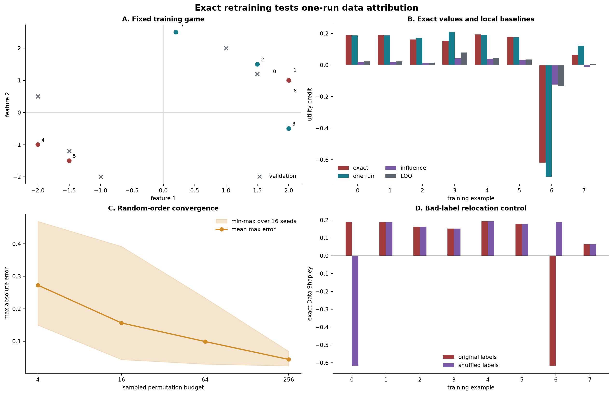

# [16.7] Data Shapley in One Training Run - Exercises

> **Notebooks: [exercises](../../exercises/part7_data_shapley_in_one_training_run/16.7_Data_Shapley_in_One_Training_Run_exercises.ipynb) | [solutions](../../exercises/part7_data_shapley_in_one_training_run/16.7_Data_Shapley_in_One_Training_Run_solutions.ipynb)**

## Core Question

### The one precise claim

**For this fixed eight-example logistic-regression game, the checkpoint gradient estimator accumulated during one 40-step training run identifies the deliberately mislabeled example and correlates `r = 0.995472` with exact Data Shapley from 256 real subset-training runs.**

You will try to falsify that claim. Exact retraining is the ground truth, not a loaded report. The organism contains an exact duplicate pair, a mislabeled duplicate, and a less typical positive example, so symmetry, harmfulness, and ranking errors are all observable.

By the end of this notebook, you will have tested the one-run claim against exact retraining, approximation baselines, and causal controls.

## Learning Objectives

- establish exact Data Shapley on a four-example toy game by averaging all 24 orderings;
- train the same classifier from the same initialization on arbitrary coalitions;
- compute exact Data Shapley over all `2**8 = 256` trained subsets;
- expose fixed-order bias and measure random-order Monte Carlo convergence;
- implement checkpoint gradient accumulation from a single full-data run;
- compare exact values with leave-one-out and damped influence baselines;
- use matched deletion and shuffled-label controls to test causal interpretation;
- hunt anomalies rather than treating a high correlation as proof.

The run is deterministic, uses `float64`, and is intentionally CPU-sized.

## Setup

```python
from collections.abc import Mapping, Sequence
import itertools
import math
import random
import sys
from pathlib import Path

import matplotlib.pyplot as plt
import numpy as np
import torch as t

%matplotlib inline

chapter = "chapter16_shapley_attribution_baselines"
root_dir = next(p for p in [Path.cwd(), *Path.cwd().parents] if (p / chapter).exists())
exercises_dir = root_dir / chapter / "exercises"
assets_dir = root_dir / chapter / "instructions" / "assets"
for path in (root_dir, exercises_dir):
    if str(path) not in sys.path:
        sys.path.append(str(path))

import part7_data_shapley_in_one_training_run.tests as tests

Coalition = frozenset[int]
EXERCISE_ID = "16_7_data_shapley_in_one_training_run"
GT_TIER = "GT-0"
DIFFICULTY = 4
IMPORTANCE = 4
EXPECTED_RUNTIME = "seconds on toy contract; minutes on local real-model path"
REQUIRES_GPU = True
TRAINING_RUN_LR = 0.2
TRAINING_RUN_STEPS = 40
TRAINING_RUN_PERMUTATION_BUDGETS = (4, 16, 64, 256)
TRAINING_RUN_BUDGET_SEEDS = 16
TRAINING_RUN_LABEL_PERMUTATION = (6, 1, 2, 3, 4, 5, 0, 7)
SAVE_SIGNATURE = False
EXAMPLE_NAMES = (
    "duplicate A", "duplicate A copy", "positive diagonal", "positive low-y",
    "negative A", "negative diagonal", "MISLABELED duplicate", "rare positive",
)
plt.rcParams.update({
    "figure.dpi": 120,
    "axes.spines.top": False,
    "axes.spines.right": False,
    "font.size": 9,
    "axes.titleweight": "bold",
})
EXACT_COLOR = "#A23B3B"
ONE_RUN_COLOR = "#167D8D"
MC_COLOR = "#D18B24"
BASELINE_COLOR = "#5D6670"
CONTROL_COLOR = "#7A5AA6"
```

## Toy exact ground truth first

Start with a game small enough to inspect without trusting any attribution library. All four training inputs are `x = 1`; three labels are `+1` and one is the planted flipped label `-1`. A coalition takes one full-batch gradient step from weight zero with learning rate `0.5`, and utility is the reduction in squared error on the clean validation point `(x=1, y=1)`.

The code below implements the game directly and averages each example's marginal contribution over **all 24 orderings**. This permutation definition is an independent exact oracle for the weighted-coalition implementation you will write later.

<details><summary>Expected output</summary>

```text
exact toy values = [0.641204, 0.641204, 0.641204, -1.173611]
sum(phi)=0.750000, v(all)=0.750000
delete planted error = +0.250000
```

</details>

<details><summary>Interpretation</summary>

Symmetric clean examples receive equal credit, the planted error receives negative credit, and efficiency makes the values sum to the full-coalition utility. Deleting the exact-bottom example improves held-out utility, giving the attribution a causal check before any proxy appears.

</details>

```python
TOY_LABELS = t.tensor([1.0, 1.0, 1.0, -1.0], dtype=t.float64)
TOY_LEARNING_RATE = 0.5

def toy_one_step_utility(coalition: frozenset[int]) -> float:
    if not coalition:
        return 0.0
    selected = TOY_LABELS[list(sorted(coalition))]
    updated_weight = 2 * TOY_LEARNING_RATE * selected.mean()
    return float(1.0 - (updated_weight - 1.0).square().item())

toy_exact = t.zeros(4, dtype=t.float64)
for order in itertools.permutations(range(4)):
    coalition = frozenset()
    for example in order:
        with_example = coalition | {example}
        toy_exact[example] += (
            toy_one_step_utility(with_example) - toy_one_step_utility(coalition)
        )
        coalition = with_example
toy_exact /= math.factorial(4)

toy_full = frozenset(range(4))
expected_toy = t.tensor(
    [0.6412037037037037, 0.6412037037037037, 0.6412037037037037, -1.173611111111111],
    dtype=t.float64,
)
t.testing.assert_close(toy_exact, expected_toy, atol=1e-12, rtol=0.0)
t.testing.assert_close(
    toy_exact.sum(), t.tensor(toy_one_step_utility(toy_full), dtype=t.float64),
    atol=1e-12, rtol=0.0,
)
toy_deletion_gain = (
    toy_one_step_utility(toy_full - {3}) - toy_one_step_utility(toy_full)
)
assert toy_deletion_gain > 0

print("exact toy values =", [round(value, 6) for value in toy_exact.tolist()])
print(f"sum(phi)={toy_exact.sum().item():.6f}, v(all)={toy_one_step_utility(toy_full):.6f}")
print(f"delete planted error = {toy_deletion_gain:+.6f}")
```

## The training organism

The model is logistic regression with two input features and a learned bias. Every coalition starts at the same zero parameters and takes 40 full-batch gradient steps. Utility is held-out binary-cross-entropy improvement:

$$v(S) = L_{val}(\theta_0) - L_{val}(\theta_S).$$

Positive utility means training on coalition $S$ helps the fixed clean validation set. Rows 0 and 1 are exact duplicates. Row 6 has the same features but the opposite label, so its harmfulness is known before attribution. Row 7 is deliberately less typical, which gives approximation baselines somewhere to disagree.

**Common bug:** changing initialization, optimizer steps, or utility between coalitions silently changes the cooperative game. Keep them fixed unless the experiment explicitly sweeps them.

```python
def training_run_data_shapley_problem(
    train_labels: Sequence[float] | None = None,
) -> tuple[t.Tensor, t.Tensor, t.Tensor, t.Tensor]:
    """Return an eight-example binary-classification game with known anomalies."""

    train_x = t.tensor(
        [
            [2.0, 1.0],
            [2.0, 1.0],
            [1.5, 1.5],
            [2.0, -0.5],
            [-2.0, -1.0],
            [-1.5, -1.5],
            [2.0, 1.0],
            [0.2, 2.5],
        ],
        dtype=t.float64,
    )
    default_labels = (1.0, 1.0, 1.0, 1.0, 0.0, 0.0, 0.0, 1.0)
    labels = default_labels if train_labels is None else tuple(train_labels)
    if len(labels) != len(train_x):
        raise ValueError("The training-run organism requires exactly eight labels.")
    train_y = t.tensor(labels, dtype=t.float64)
    val_x = t.tensor(
        [
            [2.0, 1.0],
            [1.5, 1.2],
            [2.0, -0.5],
            [1.0, 2.0],
            [-2.0, -1.0],
            [-1.5, -1.2],
            [-2.0, 0.5],
            [-1.0, -2.0],
        ],
        dtype=t.float64,
    )
    val_y = t.tensor((1.0, 1.0, 1.0, 1.0, 0.0, 0.0, 0.0, 0.0), dtype=t.float64)
    return train_x, train_y, val_x, val_y
train_x, train_y, val_x, val_y = training_run_data_shapley_problem()
print("index | name                  | x              | label")
print("------|-----------------------|----------------|------")
for index, (name, point, label) in enumerate(zip(EXAMPLE_NAMES, train_x, train_y)):
    print(f"{index:>5} | {name:<21} | {str(point.tolist()):<14} | {int(label.item())}")
```

### Exercise 1 - train one coalition

Implement bias augmentation, binary logistic loss, fixed-initialization subset training, and held-out utility. Do not cache a score or special-case any example: the same optimizer must run for every coalition.

<details><summary>Expected output</summary>

        ```text
        All tests in `test_training_run_subset_training_oracle` passed!
        v(empty)=0.000000
        v({0})=0.610296
        v({6})=-2.070779
        v(all)=0.508212
        ```

        </details>

        <details><summary>Help - implementation hint</summary>

        For each step, use `sigmoid(X_aug @ parameters) - labels` as the logit derivative. Average `X_aug.T @ errors` over selected examples, then subtract `learning_rate * gradient`.

        </details>

        <details><summary>Interpretation</summary>

        The harmful singleton is causally damaging: training on it drives held-out loss upward. Identical rows 0 and 1 must produce exactly equal utilities, a stronger test than checking shapes.

        </details>

        <details><summary>Solution</summary>

        ```python
        def add_bias_column(inputs: t.Tensor) -> t.Tensor:
    """Append a constant feature so the linear classifier learns an intercept."""

    if inputs.ndim != 2:
        raise ValueError("inputs must have shape (examples, features).")
    ones = t.ones((inputs.shape[0], 1), dtype=inputs.dtype, device=inputs.device)
    return t.cat((inputs, ones), dim=1)

def binary_logistic_loss(
    parameters: t.Tensor,
    inputs: t.Tensor,
    labels: t.Tensor,
) -> t.Tensor:
    """Mean binary cross-entropy for a bias-augmented linear classifier."""

    augmented = add_bias_column(inputs.double())
    labels = labels.double()
    if labels.shape != (inputs.shape[0],):
        raise ValueError("labels must have one value per input row.")
    return t.nn.functional.binary_cross_entropy_with_logits(
        augmented @ parameters.double(), labels
    )

def train_logistic_subset(
    train_x: t.Tensor,
    train_y: t.Tensor,
    coalition: Coalition,
    *,
    steps: int = TRAINING_RUN_STEPS,
    learning_rate: float = TRAINING_RUN_LR,
) -> t.Tensor:
    """Train logistic regression from a fixed zero initialization on one subset."""

    if steps < 0:
        raise ValueError("steps must be non-negative.")
    num_examples = int(train_x.shape[0])
    if train_y.shape != (num_examples,):
        raise ValueError("train_y must have one label per example.")
    if coalition and (min(coalition) < 0 or max(coalition) >= num_examples):
        raise ValueError("coalition contains an invalid training-example index.")
    augmented = add_bias_column(train_x.double())
    parameters = t.zeros(
        augmented.shape[1], dtype=t.float64, device=train_x.device
    )
    if not coalition:
        return parameters
    indices = t.tensor(sorted(coalition), dtype=t.long, device=train_x.device)
    selected_x = augmented[indices]
    selected_y = train_y.double()[indices]
    for _ in range(steps):
        errors = t.sigmoid(selected_x @ parameters) - selected_y
        gradient = selected_x.T @ errors / len(indices)
        parameters = parameters - learning_rate * gradient
    return parameters

def training_run_utility(
    train_x: t.Tensor,
    train_y: t.Tensor,
    val_x: t.Tensor,
    val_y: t.Tensor,
    coalition: Coalition,
    *,
    steps: int = TRAINING_RUN_STEPS,
    learning_rate: float = TRAINING_RUN_LR,
) -> float:
    """Held-out loss improvement after genuinely training on one coalition."""

    zero = t.zeros(train_x.shape[1] + 1, dtype=t.float64, device=train_x.device)
    baseline_loss = binary_logistic_loss(zero, val_x, val_y)
    parameters = train_logistic_subset(
        train_x,
        train_y,
        coalition,
        steps=steps,
        learning_rate=learning_rate,
    )
    trained_loss = binary_logistic_loss(parameters, val_x, val_y)
    return float((baseline_loss - trained_loss).item())
        ```

        </details>

```python
def add_bias_column(inputs: t.Tensor) -> t.Tensor:
    raise NotImplementedError()

def binary_logistic_loss(parameters: t.Tensor, inputs: t.Tensor, labels: t.Tensor) -> t.Tensor:
    raise NotImplementedError()

def train_logistic_subset(
    train_x: t.Tensor, train_y: t.Tensor, coalition: Coalition, *,
    steps: int = TRAINING_RUN_STEPS, learning_rate: float = TRAINING_RUN_LR,
) -> t.Tensor:
    raise NotImplementedError()

def training_run_utility(
    train_x: t.Tensor, train_y: t.Tensor, val_x: t.Tensor, val_y: t.Tensor,
    coalition: Coalition, *, steps: int = TRAINING_RUN_STEPS,
    learning_rate: float = TRAINING_RUN_LR,
) -> float:
    raise NotImplementedError()
```

```python
tests.test_training_run_subset_training_oracle(train_logistic_subset, training_run_utility)
full = frozenset(range(len(train_y)))
for name, coalition in {
    "empty": frozenset(), "{0}": frozenset({0}), "{6}": frozenset({6}), "all": full,
}.items():
    value = training_run_utility(train_x, train_y, val_x, val_y, coalition)
    print(f"v({name})={value:.6f}")
```

## Exact retraining ground truth

### Exercise 2 - train all subsets and compute exact Shapley

Enumerate the full power set and genuinely retrain the classifier on each coalition. Then implement

$$\phi_i = \sum_{S \subseteq N \setminus \{i\}}
\frac{|S|!(n-|S|-1)!}{n!}[v(S\cup\{i\}) - v(S)].$$

This is 256 real subset-training runs, not 256 lookups from a fixture.


<details><summary>Expected output</summary>

        ```text
        All tests in `test_training_run_exact_ground_truth` passed!
        exact = [0.188307, 0.188307, 0.161739, 0.151848, 0.192813, 0.178383, -0.618051, 0.064866]
        sum(phi)=0.508212, v(all)=0.508212
        exact-bottom example = 6
        ```

        </details>

        <details><summary>Help - implementation hint</summary>

        Enumerate combinations separately for every coalition size. For player `i`, average `v(S | {i}) - v(S)` with the factorial Shapley weight for every predecessor set `S`.

        </details>

        <details><summary>Interpretation</summary>

        Efficiency checks the complete calculation, and symmetry checks semantics: duplicates 0 and 1 receive equal value. Example 6 is strongly negative across coalition contexts.

        </details>

        <details><summary>Solution</summary>

        ```python
        def all_coalitions(num_players: int) -> tuple[Coalition, ...]:
    """Enumerate the complete power set in increasing coalition-size order."""

    if num_players <= 0:
        raise ValueError("num_players must be positive.")
    return tuple(
        frozenset(group)
        for size in range(num_players + 1)
        for group in itertools.combinations(range(num_players), size)
    )

def normalize_coalition_values(
    coalition_values: Mapping[Coalition | tuple[int, ...], float],
    *,
    num_players: int,
) -> dict[Coalition, float]:
    """Normalize keys and reject incomplete or out-of-range coalition tables."""

    values = {frozenset(key): float(value) for key, value in coalition_values.items()}
    expected = set(all_coalitions(num_players))
    missing = expected - set(values)
    extra = set(values) - expected
    if missing or extra:
        raise ValueError(
            f"coalition table has {len(missing)} missing and {len(extra)} extra coalitions."
        )
    return values

def training_run_coalition_values(
    train_x: t.Tensor,
    train_y: t.Tensor,
    val_x: t.Tensor,
    val_y: t.Tensor,
    *,
    steps: int = TRAINING_RUN_STEPS,
    learning_rate: float = TRAINING_RUN_LR,
) -> dict[Coalition, float]:
    """Retrain all subsets to create exact held-out utility ground truth."""

    return {
        coalition: training_run_utility(
            train_x,
            train_y,
            val_x,
            val_y,
            coalition,
            steps=steps,
            learning_rate=learning_rate,
        )
        for coalition in all_coalitions(int(train_x.shape[0]))
    }

def exact_shapley_values(
    coalition_values: Mapping[Coalition | tuple[int, ...], float],
    *,
    num_players: int,
) -> t.Tensor:
    """Compute weighted marginal contributions over every predecessor coalition."""

    values = normalize_coalition_values(coalition_values, num_players=num_players)
    result = t.zeros(num_players, dtype=t.float64)
    denominator = math.factorial(num_players)
    for player in range(num_players):
        others = [candidate for candidate in range(num_players) if candidate != player]
        for size in range(num_players):
            weight = (
                math.factorial(size)
                * math.factorial(num_players - size - 1)
                / denominator
            )
            for group in itertools.combinations(others, size):
                coalition = frozenset(group)
                result[player] += weight * (
                    values[coalition | {player}] - values[coalition]
                )
    return result
        ```

        </details>

```python
def all_coalitions(num_players: int) -> tuple[Coalition, ...]:
    raise NotImplementedError()

def normalize_coalition_values(
    coalition_values: Mapping[Coalition | tuple[int, ...], float], *, num_players: int,
) -> dict[Coalition, float]:
    raise NotImplementedError()

def training_run_coalition_values(
    train_x: t.Tensor, train_y: t.Tensor, val_x: t.Tensor, val_y: t.Tensor, *,
    steps: int = TRAINING_RUN_STEPS, learning_rate: float = TRAINING_RUN_LR,
) -> dict[Coalition, float]:
    raise NotImplementedError()

def exact_shapley_values(
    coalition_values: Mapping[Coalition | tuple[int, ...], float], *, num_players: int,
) -> t.Tensor:
    raise NotImplementedError()
```

```python
tests.test_training_run_exact_ground_truth(training_run_coalition_values, exact_shapley_values)
coalition_values = training_run_coalition_values(train_x, train_y, val_x, val_y)
exact = exact_shapley_values(coalition_values, num_players=8)
print("exact =", [round(value, 6) for value in exact.tolist()])
print(f"sum(phi)={exact.sum().item():.6f}, v(all)={coalition_values[full]:.6f}")
print(f"exact-bottom example = {int(exact.argmin().item())}")
```

### Exercise 3 - random-order estimation and budget controls

A single ordering assigns path-dependent marginal credit. Implement that intentionally biased control, then estimate Shapley by averaging random orderings. Sweep sampling budgets over 16 seeds and record maximum absolute error.

<details><summary>Expected output</summary>

        ```text
        All tests in `test_random_order_and_budget_controls` passed!
        fixed-order disagreement = 1.464688
        budget | mean max error | worst max error | harmful hit rate
             4 |       0.272753 |        0.469395 |            1.000
            16 |       0.156164 |        0.392050 |            1.000
            64 |       0.098944 |        0.233412 |            1.000
           256 |       0.043709 |        0.068687 |            1.000
        ```

        </details>

        <details><summary>Help - implementation hint</summary>

        For each permutation, begin empty. Give a player the utility jump when it enters, then continue from the enlarged coalition. A fixed-order control does this once without averaging.

        </details>

        <details><summary>Interpretation</summary>

        Even four permutations find the harmful row across these seeds, but value magnitudes are noisy. The 16-seed band makes Monte Carlo uncertainty visible.

        </details>

        <details><summary>Solution</summary>

        ```python
        def sampled_permutation_shapley_values(
    coalition_values: Mapping[Coalition | tuple[int, ...], float],
    *,
    num_players: int,
    num_samples: int,
    seed: int = 0,
) -> t.Tensor:
    """Estimate Shapley values from sampled random example orderings."""

    if num_samples <= 0:
        raise ValueError("num_samples must be positive.")
    values = normalize_coalition_values(coalition_values, num_players=num_players)
    rng = random.Random(seed)
    totals = t.zeros(num_players, dtype=t.float64)
    players = tuple(range(num_players))
    for _ in range(num_samples):
        coalition: Coalition = frozenset()
        for player in rng.sample(players, k=num_players):
            with_player = coalition | {player}
            totals[player] += values[with_player] - values[coalition]
            coalition = with_player
    return totals / num_samples

def fixed_order_marginal_values(
    coalition_values: Mapping[Coalition | tuple[int, ...], float],
    order: Sequence[int],
) -> t.Tensor:
    """Assign marginal utility along one fixed ordering as a bias control."""

    num_players = len(order)
    if sorted(order) != list(range(num_players)):
        raise ValueError("order must be a permutation of every player index.")
    values = normalize_coalition_values(coalition_values, num_players=num_players)
    result = t.zeros(num_players, dtype=t.float64)
    coalition: Coalition = frozenset()
    for player in order:
        with_player = coalition | {player}
        result[player] = values[with_player] - values[coalition]
        coalition = with_player
    return result

def permutation_budget_sweep(
    coalition_values: Mapping[Coalition | tuple[int, ...], float],
    exact_values: t.Tensor,
    *,
    budgets: Sequence[int] = TRAINING_RUN_PERMUTATION_BUDGETS,
    num_seeds: int = TRAINING_RUN_BUDGET_SEEDS,
) -> dict[str, t.Tensor]:
    """Measure random-order estimator error across budgets and independent seeds."""

    if not budgets or any(budget <= 0 for budget in budgets):
        raise ValueError("budgets must contain positive sample counts.")
    if num_seeds <= 0:
        raise ValueError("num_seeds must be positive.")
    exact_values = exact_values.double()
    num_players = int(exact_values.numel())
    errors = t.empty((len(budgets), num_seeds), dtype=t.float64)
    harmful_hits = t.empty((len(budgets), num_seeds), dtype=t.float64)
    exact_harmful = int(exact_values.argmin().item())
    for budget_index, budget in enumerate(budgets):
        for seed in range(num_seeds):
            sampled = sampled_permutation_shapley_values(
                coalition_values,
                num_players=num_players,
                num_samples=int(budget),
                seed=seed,
            )
            errors[budget_index, seed] = (sampled - exact_values).abs().max()
            harmful_hits[budget_index, seed] = float(
                int(sampled.argmin().item()) == exact_harmful
            )
    return {
        "budgets": t.tensor(tuple(budgets), dtype=t.long),
        "mean_max_error": errors.mean(dim=1),
        "min_max_error": errors.min(dim=1).values,
        "max_max_error": errors.max(dim=1).values,
        "harmful_hit_rate": harmful_hits.mean(dim=1),
    }
        ```

        </details>

```python
def sampled_permutation_shapley_values(
    coalition_values: Mapping[Coalition | tuple[int, ...], float], *,
    num_players: int, num_samples: int, seed: int = 0,
) -> t.Tensor:
    raise NotImplementedError()

def fixed_order_marginal_values(
    coalition_values: Mapping[Coalition | tuple[int, ...], float], order: Sequence[int],
) -> t.Tensor:
    raise NotImplementedError()

def permutation_budget_sweep(
    coalition_values: Mapping[Coalition | tuple[int, ...], float], exact_values: t.Tensor, *,
    budgets: Sequence[int] = TRAINING_RUN_PERMUTATION_BUDGETS,
    num_seeds: int = TRAINING_RUN_BUDGET_SEEDS,
) -> dict[str, t.Tensor]:
    raise NotImplementedError()
```

```python
tests.test_random_order_and_budget_controls(
    sampled_permutation_shapley_values, fixed_order_marginal_values, permutation_budget_sweep
)
sampled_256 = sampled_permutation_shapley_values(
    coalition_values, num_players=8, num_samples=256, seed=0
)
ascending = fixed_order_marginal_values(coalition_values, tuple(range(8)))
descending = fixed_order_marginal_values(coalition_values, tuple(reversed(range(8))))
budget_sweep = permutation_budget_sweep(coalition_values, exact)
print(f"fixed-order disagreement = {(ascending - descending).abs().max().item():.6f}")
print("budget | mean max error | worst max error | harmful hit rate")
for budget, mean, worst, hit in zip(
    budget_sweep["budgets"], budget_sweep["mean_max_error"],
    budget_sweep["max_max_error"], budget_sweep["harmful_hit_rate"],
):
    print(f"{int(budget):>6} | {mean.item():>14.6f} | {worst.item():>15.6f} | {hit.item():>16.3f}")
```

### Exercise 4 - estimate value during one training run

At each checkpoint of the single full-data trajectory, compute validation and per-example training gradients. Accumulate

$$\hat\phi_i = \sum_t \frac{\eta}{n}\nabla L_i(\theta_t)^T\nabla L_{val}(\theta_t),$$

then take the ordinary full-batch update. This is a first-order estimator, not an identity.


<details><summary>Expected output</summary>

        ```text
        All tests in `test_checkpoint_one_run_estimator` passed!
        one-run = [0.187550, 0.187550, 0.170596, 0.208022, 0.192122, 0.175087, -0.708449, 0.120898]
        correlation(exact, one-run) = 0.995472
        exact bottom / one-run bottom = 6 / 6
        ```

        </details>

        <details><summary>Help - implementation hint</summary>

        Before each update, form the validation gradient and per-example training gradients. Add `learning_rate / n * (train_grads @ val_grad)` to the scores, then update with the mean training gradient.

        </details>

        <details><summary>Interpretation</summary>

        The claim survives: the estimator finds the harmful point and tracks exact values. Mismatch on rows 3 and 7 shows that high correlation does not imply calibrated values.

        </details>

        <details><summary>Solution</summary>

        ```python
        def checkpoint_gradient_data_scores(
    train_x: t.Tensor,
    train_y: t.Tensor,
    val_x: t.Tensor,
    val_y: t.Tensor,
    *,
    steps: int = TRAINING_RUN_STEPS,
    learning_rate: float = TRAINING_RUN_LR,
) -> t.Tensor:
    """Accumulate per-example train/validation gradient alignment during one run."""

    train_augmented = add_bias_column(train_x.double())
    val_augmented = add_bias_column(val_x.double())
    train_y = train_y.double()
    val_y = val_y.double()
    num_examples = int(train_x.shape[0])
    parameters = t.zeros(
        train_augmented.shape[1], dtype=t.float64, device=train_x.device
    )
    scores = t.zeros(num_examples, dtype=t.float64, device=train_x.device)
    for _ in range(steps):
        val_errors = t.sigmoid(val_augmented @ parameters) - val_y
        val_gradient = val_augmented.T @ val_errors / len(val_y)
        train_errors = t.sigmoid(train_augmented @ parameters) - train_y
        per_example_gradients = train_errors.unsqueeze(1) * train_augmented
        scores += learning_rate * (per_example_gradients @ val_gradient) / num_examples
        parameters -= learning_rate * per_example_gradients.mean(dim=0)
    return scores

def pearson_correlation(first: t.Tensor, second: t.Tensor) -> float:
    """Return Pearson correlation, or NaN when either vector is constant."""

    first = first.double().flatten()
    second = second.double().flatten()
    if first.shape != second.shape or first.numel() < 2:
        raise ValueError("Pearson correlation needs equal vectors with at least two entries.")
    first = first - first.mean()
    second = second - second.mean()
    denominator = first.norm() * second.norm()
    if float(denominator.item()) == 0.0:
        return float("nan")
    return float((first @ second / denominator).item())
        ```

        </details>

```python
def checkpoint_gradient_data_scores(
    train_x: t.Tensor, train_y: t.Tensor, val_x: t.Tensor, val_y: t.Tensor, *,
    steps: int = TRAINING_RUN_STEPS, learning_rate: float = TRAINING_RUN_LR,
) -> t.Tensor:
    raise NotImplementedError()

def pearson_correlation(first: t.Tensor, second: t.Tensor) -> float:
    raise NotImplementedError()
```

```python
tests.test_checkpoint_one_run_estimator(checkpoint_gradient_data_scores, pearson_correlation)
one_run = checkpoint_gradient_data_scores(train_x, train_y, val_x, val_y)
one_run_correlation = pearson_correlation(exact, one_run)
print("one-run =", [round(value, 6) for value in one_run.tolist()])
print(f"correlation(exact, one-run) = {one_run_correlation:.6f}")
print(f"exact bottom / one-run bottom = {exact.argmin().item()} / {one_run.argmin().item()}")
```

### Exercise 5 - influence and leave-one-out baselines

Leave-one-out only asks what each point contributes in the full-set context. Influence linearizes that same local question using a damped logistic-loss Hessian. Implement both and compare their rankings with coalition-averaged exact Shapley.

<details><summary>Expected output</summary>

        ```text
        All tests in `test_influence_loo_and_matched_deletion_controls` passed!
        correlation(exact, influence) = 0.972290
        correlation(exact, LOO)       = 0.938329
        influence score for rare point 7 = -0.012016
        exact value for rare point 7     = 0.064866
        ```

        </details>

        <details><summary>Help - implementation hint</summary>

        For influence, train the full model, build `H = X.T @ diag(p*(1-p)) @ X / n + ridge*I`, solve `H z = grad_val`, and return `grad_i @ z / n`. LOO is `v(N) - v(N minus i)`.

        </details>

        <details><summary>Interpretation</summary>

        Both baselines find the gross corruption, but neither asks the Shapley question. Influence gives rare row 7 the wrong sign while exact coalition averaging finds it helpful overall.

        </details>

        <details><summary>Solution</summary>

        ```python
        def leave_one_out_values(
    coalition_values: Mapping[Coalition | tuple[int, ...], float],
    *,
    num_players: int,
) -> t.Tensor:
    """Measure each example only in the context of the full training set."""

    values = normalize_coalition_values(coalition_values, num_players=num_players)
    full = frozenset(range(num_players))
    return t.tensor(
        [values[full] - values[full - {player}] for player in range(num_players)],
        dtype=t.float64,
    )

def influence_function_scores(
    train_x: t.Tensor,
    train_y: t.Tensor,
    val_x: t.Tensor,
    val_y: t.Tensor,
    *,
    steps: int = TRAINING_RUN_STEPS,
    learning_rate: float = TRAINING_RUN_LR,
    ridge: float = 1e-3,
) -> t.Tensor:
    """Approximate full-data utility credit with a damped inverse Hessian."""

    if ridge < 0:
        raise ValueError("ridge must be non-negative.")
    full = frozenset(range(int(train_x.shape[0])))
    parameters = train_logistic_subset(
        train_x,
        train_y,
        full,
        steps=steps,
        learning_rate=learning_rate,
    )
    train_augmented = add_bias_column(train_x.double())
    val_augmented = add_bias_column(val_x.double())
    train_probabilities = t.sigmoid(train_augmented @ parameters)
    train_weights = train_probabilities * (1.0 - train_probabilities)
    hessian = (
        train_augmented.T @ (train_weights.unsqueeze(1) * train_augmented)
        / len(train_y)
    )
    hessian += ridge * t.eye(
        hessian.shape[0], dtype=hessian.dtype, device=hessian.device
    )
    val_errors = t.sigmoid(val_augmented @ parameters) - val_y.double()
    val_gradient = val_augmented.T @ val_errors / len(val_y)
    train_errors = train_probabilities - train_y.double()
    per_example_gradients = train_errors.unsqueeze(1) * train_augmented
    inverse_hessian_val_gradient = t.linalg.solve(hessian, val_gradient)
    return per_example_gradients @ inverse_hessian_val_gradient / len(train_y)
        ```

        </details>

```python
def leave_one_out_values(
    coalition_values: Mapping[Coalition | tuple[int, ...], float], *, num_players: int,
) -> t.Tensor:
    raise NotImplementedError()

def influence_function_scores(
    train_x: t.Tensor, train_y: t.Tensor, val_x: t.Tensor, val_y: t.Tensor, *,
    steps: int = TRAINING_RUN_STEPS, learning_rate: float = TRAINING_RUN_LR,
    ridge: float = 1e-3,
) -> t.Tensor:
    raise NotImplementedError()
```

```python
tests.test_influence_loo_and_matched_deletion_controls(
    influence_function_scores, leave_one_out_values
)
leave_one_out = leave_one_out_values(coalition_values, num_players=8)
influence = influence_function_scores(train_x, train_y, val_x, val_y)
print(f"correlation(exact, influence) = {pearson_correlation(exact, influence):.6f}")
print(f"correlation(exact, LOO)       = {pearson_correlation(exact, leave_one_out):.6f}")
print(f"influence score for rare point 7 = {influence[7].item():.6f}")
print(f"exact value for rare point 7     = {exact[7].item():.6f}")
```

### Exercise 6 - matched intervention and shuffled-label controls

Compare equal-budget deletions: remove harmful row 6 or helpful duplicate row 0. Then move the zero label from row 6 to feature-identical row 0 while holding all features fixed, and recompute exact values.

<details><summary>Expected output</summary>

        ```text
        All tests in `test_shuffled_label_control_relocates_harm` passed!
        intervention           | held-out utility delta
        remove harmful row 6   | +0.132776
        remove duplicate row 0 | -0.022480
        shuffled-label bottom = 0
        corr(original, shuffled) = -0.197350
        ```

        </details>

        <details><summary>Help - implementation hint</summary>

        Index `train_y` by the permutation, retrain all 256 coalitions, and run the same exact Shapley function. For deletion, compare `v(N minus i) - v(N)`, so positive means the intervention helped.

        </details>

        <details><summary>Interpretation</summary>

        Removing the harmful row helps while the matched helpful-row deletion hurts. When the bad label moves, negative attribution follows it rather than staying attached to feature location 6.

        </details>

        <details><summary>Solution</summary>

        ```python
        def shuffled_label_exact_values(
    train_x: t.Tensor,
    train_y: t.Tensor,
    val_x: t.Tensor,
    val_y: t.Tensor,
    permutation: Sequence[int],
) -> tuple[t.Tensor, t.Tensor]:
    """Recompute exact values after permuting labels while fixing all inputs."""

    num_examples = int(train_x.shape[0])
    if sorted(permutation) != list(range(num_examples)):
        raise ValueError("permutation must contain every training index exactly once.")
    indices = t.tensor(permutation, dtype=t.long, device=train_y.device)
    shuffled_labels = train_y[indices]
    coalition_values = training_run_coalition_values(
        train_x, shuffled_labels, val_x, val_y
    )
    exact = exact_shapley_values(coalition_values, num_players=num_examples)
    return shuffled_labels, exact
        ```

        </details>

```python
def shuffled_label_exact_values(
    train_x: t.Tensor, train_y: t.Tensor, val_x: t.Tensor, val_y: t.Tensor,
    permutation: Sequence[int],
) -> tuple[t.Tensor, t.Tensor]:
    raise NotImplementedError()
```

```python
tests.test_shuffled_label_control_relocates_harm(shuffled_label_exact_values)
shuffled_labels, shuffled_exact = shuffled_label_exact_values(
    train_x, train_y, val_x, val_y, TRAINING_RUN_LABEL_PERMUTATION
)
harmful_removal = coalition_values[full - {6}] - coalition_values[full]
matched_removal = coalition_values[full - {0}] - coalition_values[full]
print("intervention           | held-out utility delta")
print(f"remove harmful row 6   | {harmful_removal:+.6f}")
print(f"remove duplicate row 0 | {matched_removal:+.6f}")
print(f"shuffled-label bottom = {int(shuffled_exact.argmin().item())}")
print(f"corr(original, shuffled) = {pearson_correlation(exact, shuffled_exact):.6f}")
```

## Anomaly hunt

Before looking at the figure, predict and then check: duplicates 0 and 1 should tie; influence should disagree in sign with exact Shapley on rare row 7; and fixed ordering should move more credit than the full-set utility, exposing path dependence.

```python
print("index | exact     | one-run   | influence | LOO       | one-run error")
print("------|-----------|-----------|-----------|-----------|--------------")
for index in range(8):
    print(
        f"{index:>5} | {exact[index].item():>+9.6f} | {one_run[index].item():>+9.6f} | "
        f"{influence[index].item():>+9.6f} | {leave_one_out[index].item():>+9.6f} | "
        f"{(one_run[index] - exact[index]).item():>+12.6f}"
    )
print(f"\nduplicate exact gap = {abs((exact[0] - exact[1]).item()):.6f}")
print(f"rare-point sign mismatch = {bool(t.sign(exact[7]) != t.sign(influence[7]))}")
largest_order_error = max(
    (ascending - exact).abs().max(), (descending - exact).abs().max()
)
print(f"largest fixed-order error = {largest_order_error.item():.6f}")
```

## Signature result

```python
figure, axes = plt.subplots(2, 2, figsize=(14, 9), constrained_layout=True)
positions = np.arange(8)

ax = axes[0, 0]
colors = [EXACT_COLOR if int(label) == 0 else ONE_RUN_COLOR for label in train_y]
ax.scatter(train_x[:, 0], train_x[:, 1], c=colors, s=72, edgecolor="white", linewidth=0.8, zorder=3)
ax.scatter(val_x[:, 0], val_x[:, 1], marker="x", color=BASELINE_COLOR, s=40, label="validation", zorder=2)
offsets = {0: (-26, 12), 1: (8, 14), 6: (8, -20), 7: (8, 8)}
for index, point in enumerate(train_x):
    ax.annotate(str(index), point.tolist(), xytext=offsets.get(index, (6, 5)), textcoords="offset points", fontsize=8)
ax.axhline(0, color="#D7DADF", linewidth=0.7)
ax.axvline(0, color="#D7DADF", linewidth=0.7)
ax.set(title="A. Fixed training game", xlabel="feature 1", ylabel="feature 2")
ax.legend(frameon=False, loc="lower right")

ax = axes[0, 1]
width = 0.19
ax.bar(positions - 1.5*width, exact.numpy(), width, color=EXACT_COLOR, label="exact")
ax.bar(positions - 0.5*width, one_run.numpy(), width, color=ONE_RUN_COLOR, label="one run")
ax.bar(positions + 0.5*width, influence.numpy(), width, color=CONTROL_COLOR, label="influence")
ax.bar(positions + 1.5*width, leave_one_out.numpy(), width, color=BASELINE_COLOR, label="LOO")
ax.axhline(0, color="black", linewidth=0.7)
ax.set_xticks(positions, [str(index) for index in range(8)])
ax.set(title="B. Exact values and local baselines", xlabel="training example", ylabel="utility credit")
ax.legend(frameon=False, ncols=2)

ax = axes[1, 0]
budgets = budget_sweep["budgets"].numpy()
ax.fill_between(
    budgets, budget_sweep["min_max_error"].numpy(),
    budget_sweep["max_max_error"].numpy(), color=MC_COLOR, alpha=0.22,
    label="min-max over 16 seeds",
)
ax.plot(budgets, budget_sweep["mean_max_error"].numpy(), marker="o", color=MC_COLOR, linewidth=2, label="mean max error")
ax.set_xscale("log", base=2)
ax.set_xticks(budgets, [str(int(value)) for value in budgets])
ax.set(title="C. Random-order convergence", xlabel="sampled permutation budget", ylabel="max absolute error")
ax.legend(frameon=False)

ax = axes[1, 1]
ax.bar(positions - width/2, exact.numpy(), width, color=EXACT_COLOR, label="original labels")
ax.bar(positions + width/2, shuffled_exact.numpy(), width, color=CONTROL_COLOR, label="shuffled labels")
ax.axhline(0, color="black", linewidth=0.7)
ax.set_xticks(positions, [str(index) for index in range(8)])
ax.set(title="D. Bad-label relocation control", xlabel="training example", ylabel="exact Data Shapley")
ax.legend(frameon=False)

figure.suptitle("Exact retraining tests one-run data attribution", fontsize=14, fontweight="bold")
if SAVE_SIGNATURE:
    signature_path = assets_dir / "data_shapley_training_run_signature.png"
    figure.savefig(signature_path, dpi=180, bbox_inches="tight")
    print(f"saved {signature_path.name}")
plt.close(figure)
```



<details><summary>Expected output</summary>

The signature has four linked panels: the eight-point organism, exact versus approximate values, a decreasing random-order error curve with a 16-seed band, and a shuffled-label control where the negative value moves from row 6 to row 0.

</details>

<details><summary>Interpretation</summary>

The one-run result is convincing here because it clears independent tests: exact correlation, harmful rank, duplicate symmetry, matched deletion, and failure to preserve attribution when the bad label moves. The row-7 influence sign error and Monte Carlo band prevent overclaiming.

</details>

## Try It Yourself

Change one parameter at a time: move the zero label, reduce checkpoints, increase learning rate, or lower the random-order budget. The cell recomputes exact ground truth, so the comparison stays falsifiable.

```python
TRY_LABELS = (1.0, 1.0, 1.0, 1.0, 0.0, 0.0, 0.0, 1.0)
TRY_STEPS = 24
TRY_LEARNING_RATE = 0.2
TRY_PERMUTATION_BUDGET = 64
TRY_SEED = 3

try_problem = training_run_data_shapley_problem(TRY_LABELS)
try_values = training_run_coalition_values(
    *try_problem, steps=TRY_STEPS, learning_rate=TRY_LEARNING_RATE
)
try_exact = exact_shapley_values(try_values, num_players=8)
try_one_run = checkpoint_gradient_data_scores(
    *try_problem, steps=TRY_STEPS, learning_rate=TRY_LEARNING_RATE
)
try_sampled = sampled_permutation_shapley_values(
    try_values, num_players=8, num_samples=TRY_PERMUTATION_BUDGET, seed=TRY_SEED
)
print(f"exact bottom = {int(try_exact.argmin().item())}")
print(f"one-run bottom = {int(try_one_run.argmin().item())}")
print(f"one-run correlation = {pearson_correlation(try_exact, try_one_run):.6f}")
print(f"sampled max error = {(try_sampled - try_exact).abs().max().item():.6f}")
```

## Real paper connection

- [Data Shapley in One Training Run (Wang et al., 2024)](https://arxiv.org/abs/2406.11011) develops scalable estimators from information recorded along a single training trajectory. This lab isolates the central empirical question against exact retraining ground truth, but its checkpoint gradient score is a compact first-order estimator rather than a reproduction of every estimator in the paper.
- [Data Shapley: Equitable Valuation of Data for Machine Learning (Ghorbani and Zou, 2019)](https://proceedings.mlr.press/v97/ghorbani19c.html) defines the coalition-averaged target used here.

## Limitations

- The dataset is synthetic, two-dimensional, and only eight rows; exact enumeration is exponential.
- The model is convex logistic regression with fixed initialization. Neural networks add minibatch order, optimizer state, stochasticity, and multiple basins.
- The held-out set and utility definition determine every value; another population or metric can change rankings.
- Pearson correlation is dominated by the large negative outlier. Calibration errors remain visible on rows 3 and 7.
- Influence and LOO are local full-dataset questions, not replacements for coalition averaging.
- The shuffled-label control relocates one known corruption; it does not model realistic correlated noise.
- The learner result is intentionally CPU-sized. The release contract below reruns an independent one-step training organism on CUDA; it does not turn this into a large-dataset valuation claim.

## GPU verification contract

The notebook result above is computed live and does not depend on a report. For release verification, these wrappers run the locked CUDA experiment from `solutions.py`; `verification_report.json` records the resulting device, runtime, peak VRAM, controls, and acceptance checks. This is supporting evidence, not the lesson or its signature result.

```python
gpu_metrics = run_gpu_test(max_vram_gb=24.0)
full_metrics = run_full_experiment(max_vram_gb=24.0)
```

```python
def run_gpu_test(max_vram_gb: float = 24.0):
    from part7_data_shapley_in_one_training_run.solutions import (
        run_gpu_test as _run_gpu_test,
    )
    return _run_gpu_test(max_vram_gb=max_vram_gb)


def run_full_experiment(max_vram_gb: float = 24.0):
    from part7_data_shapley_in_one_training_run.solutions import (
        run_full_experiment as _run_full_experiment,
    )
    return _run_full_experiment(max_vram_gb=max_vram_gb)
```
