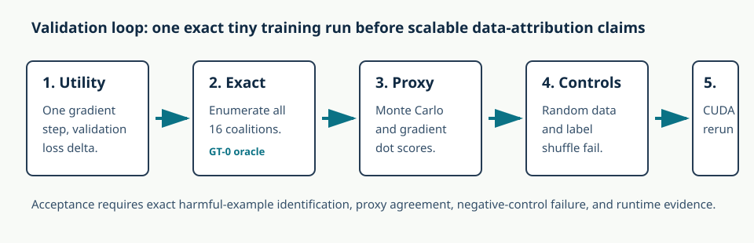
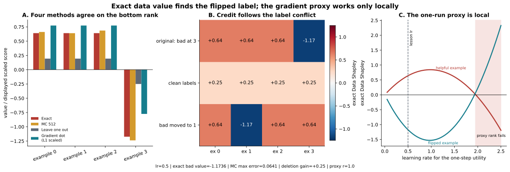

# [16.7] Data Shapley in One Training Run

> **Notebooks: [exercises](../../exercises/part7_data_shapley_in_one_training_run/16.7_Data_Shapley_in_One_Training_Run_exercises.ipynb) | [solutions](../../exercises/part7_data_shapley_in_one_training_run/16.7_Data_Shapley_in_One_Training_Run_solutions.ipynb)**

> **Local-first extension.** This section turns Data Shapley into a tiny
> one-step training lab. You will compute exact training-example credit, compare
> sampled permutations, and test whether one-run gradient-dot scores preserve
> the harmful-example signal.

```python
GT_TIER = "GT-0"
EXERCISE_ID = "16_7_data_shapley_in_one_training_run"
DIFFICULTY = 4
IMPORTANCE = 4
EXPECTED_RUNTIME = "seconds for toy contracts; minutes for the CUDA one-step training preflight"
REQUIRES_GPU = True
```

Please send any problems / bugs on the `#errata` channel in the [Slack group](https://info-arena.github.io/ARENA_img/slack.html), and ask any questions on the dedicated channels for this chapter of material.

Links to earlier chapters: [(0) Fundamentals](https://arena-chapter0-fundamentals.streamlit.app/), [(1) Transformer Interpretability](https://arena-chapter1-transformer-interp.streamlit.app/), [(2) RL](https://arena-chapter2-rl.streamlit.app/), [(3) LLM Evaluations](https://arena-chapter3-llm-evals.streamlit.app/), [(4) Alignment Science](https://arena-chapter4-alignment-science.streamlit.app/).



## Core Question

Can exact Data Shapley, sampled permutation Data Shapley, and a one-run
gradient-dot proxy all identify the same harmful training example?

The toy problem is deliberately small. A one-dimensional linear model takes one
gradient step. Three training examples match the validation target. One example
has a flipped label. Exact Data Shapley should assign that fourth example
negative value, and deleting it should improve validation utility.

<details>
<summary>Help - why not use a real dataset first?</summary>

Data attribution can look convincing even when it is just measuring label
leakage, random correlations, or optimizer quirks. This section starts with a
complete 4-example finite game, where all 16 coalitions can be enumerated and
the harmful example is known.

</details>

<details>
<summary>Help - what is the in-run proxy?</summary>

The proxy computes a gradient-dot score between each per-example training
gradient and the validation gradient at initialization. On this toy problem it
correlates with exact Data Shapley, but the notebook treats that as a checked
special case, not a general theorem.

</details>

## Learning Objectives

- Define training-example utility as validation-loss improvement after one step.
- Enumerate complete training-example coalition tables.
- Compute exact Data Shapley values for a tiny training run.
- Approximate Data Shapley with sampled training-example permutations.
- Compare exact values with one-run gradient-dot scores.
- Reject random-data and label-shuffled controls.
- Interpret the CUDA report without claiming production-scale data valuation.

# Setup Code

```python
from collections.abc import Callable, Mapping
import itertools
import json
import random
import sys
import time
from pathlib import Path

import torch as t

chapter = "chapter16_shapley_attribution_baselines"
section = "part7_data_shapley_in_one_training_run"
root_dir = next(p for p in [Path.cwd(), *Path.cwd().parents] if (p / chapter).exists())
exercises_dir = root_dir / chapter / "exercises"
section_dir = exercises_dir / section

if str(root_dir) not in sys.path:
    sys.path.append(str(root_dir))
if str(exercises_dir) not in sys.path:
    sys.path.append(str(exercises_dir))

import part7_data_shapley_in_one_training_run.tests as tests

Coalition = frozenset[int]
MAIN = __name__ == "__main__"
```

```python
def toy_data_shapley_problem() -> tuple[t.Tensor, t.Tensor, t.Tensor, t.Tensor]:
    train_x = t.ones(4, 1, dtype=t.float64)
    train_y = t.tensor([1.0, 1.0, 1.0, -1.0], dtype=t.float64)
    val_x = t.ones(1, 1, dtype=t.float64)
    val_y = t.ones(1, dtype=t.float64)
    return train_x, train_y, val_x, val_y
```

# One-Step Utility

### Exercise - implement `one_step_linear_utility`

> ```yaml
> Difficulty: 🔴🔴⚪⚪⚪
> Importance: 🔵🔵🔵🔵⚪
>
> You should spend 10-15 minutes on this exercise.
> ```

Utility is validation-loss improvement after one full-batch gradient step on
the chosen coalition. The empty coalition has utility zero. The flipped-label
example alone has negative utility.

```python
def one_step_linear_utility(
    train_x: t.Tensor,
    train_y: t.Tensor,
    val_x: t.Tensor,
    val_y: t.Tensor,
    coalition: Coalition,
    *,
    learning_rate: float = 0.5,
) -> float:
    raise NotImplementedError()


if MAIN:
    tests.test_one_step_linear_utility_toy_oracle(one_step_linear_utility)
```

<details>
<summary>Expected output</summary>

```text
All tests in `test_one_step_linear_utility_toy_oracle` passed!
```

</details>

<details>
<summary>What you should see</summary>

```text
v(empty) = 0.0
v({helpful}) = 1.0
v({flipped}) = -3.0
v(all) = 0.75
```

</details>

<details>
<summary>Common bugs</summary>

- Using training loss instead of validation-loss improvement.
- Updating on the validation example.
- Forgetting that an empty coalition should not train.

</details>

<details>
<summary>Solution</summary>

Start from zero weight, compute baseline validation loss, take one analytic
gradient step on the selected training examples, and return baseline loss minus
updated validation loss.

</details>

# Exact Data Shapley

### Exercise - enumerate coalitions and compute exact values

> ```yaml
> Difficulty: 🔴🔴🔴⚪⚪
> Importance: 🔵🔵🔵🔵🔵
>
> You should spend 20 minutes on this exercise.
> ```

Treat training examples as players. Build the complete utility table, then run
exact Shapley over all four examples.

```python
def data_coalition_values(
    train_x: t.Tensor,
    train_y: t.Tensor,
    val_x: t.Tensor,
    val_y: t.Tensor,
    *,
    learning_rate: float = 0.5,
) -> dict[Coalition, float]:
    raise NotImplementedError()


def exact_data_shapley_values(
    train_x: t.Tensor,
    train_y: t.Tensor,
    val_x: t.Tensor,
    val_y: t.Tensor,
    *,
    learning_rate: float = 0.5,
) -> t.Tensor:
    raise NotImplementedError()


if MAIN:
    tests.test_data_coalition_values_complete_table(data_coalition_values)
    tests.test_exact_data_shapley_values_matches_hand_checked_result(
        exact_data_shapley_values
    )
```

<details>
<summary>Expected output</summary>

```text
All tests in `test_data_coalition_values_complete_table` passed!
All tests in `test_exact_data_shapley_values_matches_hand_checked_result` passed!
```

</details>

<details>
<summary>What you should see</summary>

```text
exact_values = [0.6412, 0.6412, 0.6412, -1.1736]
harmful_index = 3
```

</details>

<details>
<summary>Solution</summary>

Evaluate every coalition with `one_step_linear_utility`, then apply exact
Shapley's weighted marginal-contribution formula.

</details>

# Sampled Data Shapley

### Exercise - sample training-example permutations

> ```yaml
> Difficulty: 🔴🔴🔴⚪⚪
> Importance: 🔵🔵🔵🔵⚪
>
> You should spend 15 minutes on this exercise.
> ```

Monte Carlo Data Shapley samples example orderings. Each example receives the
utility jump from the moment it enters the running coalition.

```python
def sampled_permutation_shapley_values(
    coalition_values: Mapping[Coalition | tuple[int, ...], float],
    *,
    num_players: int,
    num_samples: int,
    seed: int = 0,
) -> t.Tensor:
    raise NotImplementedError()


if MAIN:
    tests.test_sampled_permutation_data_shapley_approximates_exact(
        sampled_permutation_shapley_values
    )
```

<details>
<summary>Expected output</summary>

```text
All tests in `test_sampled_permutation_data_shapley_approximates_exact` passed!
```

</details>

<details>
<summary>Common bugs</summary>

- Sampling arbitrary coalitions instead of permutations.
- Forgetting to update the running coalition after each marginal.
- Using too few samples and losing the harmful-example ranking.

</details>

# In-Run Scores

### Exercise - compute one-run gradient-dot scores

> ```yaml
> Difficulty: 🔴🔴🔴⚪⚪
> Importance: 🔵🔵🔵🔵⚪
>
> You should spend 15 minutes on this exercise.
> ```

Compute each training example's gradient at initialization, compute the
validation gradient, and use their dot product as the in-run proxy.

```python
def in_run_first_order_data_scores(
    train_x: t.Tensor,
    train_y: t.Tensor,
    val_x: t.Tensor,
    val_y: t.Tensor,
) -> t.Tensor:
    raise NotImplementedError()


if MAIN:
    tests.test_in_run_first_order_scores_toy_oracle(
        in_run_first_order_data_scores
    )
```

<details>
<summary>Expected output</summary>

```text
All tests in `test_in_run_first_order_scores_toy_oracle` passed!
```

</details>

<details>
<summary>What you should see</summary>

```text
gradient_scores = [4.0, 4.0, 4.0, -4.0]
```

</details>

# Reports And Controls

### Exercise - package exact, sampled, in-run, and control reports

> ```yaml
> Difficulty: 🔴🔴⚪⚪⚪
> Importance: 🔵🔵🔵🔵🔵
>
> You should spend 15 minutes on this exercise.
> ```

The exact report should identify the harmful example. The random-data and
label-shuffled controls should fail to preserve the planted signal.

```python
def exact_data_shapley_smoke_test() -> dict:
    raise NotImplementedError()


def monte_carlo_data_shapley_smoke_test() -> dict:
    raise NotImplementedError()


def in_run_data_shapley_smoke_test() -> dict:
    raise NotImplementedError()


def random_data_attribution_failure_smoke_test() -> dict:
    raise NotImplementedError()


def label_shuffled_attribution_failure_smoke_test() -> dict:
    raise NotImplementedError()


if MAIN:
    tests.test_exact_data_shapley_smoke_test(exact_data_shapley_smoke_test)
    tests.test_monte_carlo_data_shapley_smoke_test(monte_carlo_data_shapley_smoke_test)
    tests.test_in_run_data_shapley_smoke_test(in_run_data_shapley_smoke_test)
    tests.test_random_data_attribution_failure_smoke_test(
        random_data_attribution_failure_smoke_test
    )
    tests.test_label_shuffled_attribution_failure_smoke_test(
        label_shuffled_attribution_failure_smoke_test
    )
```

<details>
<summary>Expected output</summary>

```text
All tests in `test_exact_data_shapley_smoke_test` passed!
All tests in `test_monte_carlo_data_shapley_smoke_test` passed!
All tests in `test_in_run_data_shapley_smoke_test` passed!
All tests in `test_random_data_attribution_failure_smoke_test` passed!
All tests in `test_label_shuffled_attribution_failure_smoke_test` passed!
```

</details>

<details>
<summary>Help - why do controls need to fail?</summary>

If random labels or random data still recover the planted harmful example, the
attribution method is not tracking the real training signal. A negative control
that fails is part of the positive result.

</details>

# Notebook Contract And CUDA Report

```python
def run_smoke_test(cpu: bool = True) -> dict:
    raise NotImplementedError()


if MAIN:
    tests.test_notebook_contract(run_smoke_test)
    tests.test_committed_gpu_report_records_exact_proxy_and_controls()
```

<details>
<summary>Expected output</summary>

```text
All tests in `test_notebook_contract` passed!
All tests in `test_committed_gpu_report_records_exact_proxy_and_controls` passed!
```

</details>

## Signature Result



| Example | Exact Data Shapley | Sampled estimate | In-run score | Interpretation |
|---:|---:|---:|---:|---|
| 0 | `0.6412` | `0.6613` | `4.0` | helpful |
| 1 | `0.6412` | `0.6403` | `4.0` | helpful |
| 2 | `0.6412` | `0.6861` | `4.0` | helpful |
| 3 | `-1.1736` | `-1.2377` | `-4.0` | flipped label, harmful |

## What This Section Shows

- Exact Data Shapley identifies the flipped-label example as harmful.
- Sampled permutation Data Shapley preserves the harmful-example ranking.
- The one-run gradient-dot proxy correlates with exact values on this toy task.
- Random-data and label-shuffled controls fail, as they should.

## Limitations

- This is a four-example one-step model organism, not production data valuation.
- The in-run proxy is not exact for arbitrary long training runs or optimizers.
- The section does not claim TracIn or influence-function parity.
- The runtime result is a local finite-domain measurement, not a scaling law.

## Bonus / Anomaly Hunting

- Increase the number of flipped labels and watch exact values shift.
- Add duplicated helpful examples and inspect how Shapley splits credit.
- Change the learning rate until the first-order proxy breaks.
- Replace squared loss with logistic loss and rerun the exact finite game.
