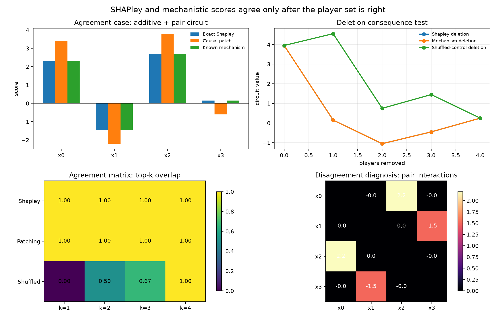

# [16.8] Do SHAPley and Mechanistic Interpretability Agree?

> **Notebooks: [exercises](../../exercises/part8_shapley_mechinterp_agreement/16.8_Do_SHAPley_and_Mechanistic_Interpretability_Agree_exercises.ipynb) | [solutions](../../exercises/part8_shapley_mechinterp_agreement/16.8_Do_SHAPley_and_Mechanistic_Interpretability_Agree_solutions.ipynb)**

By the end of this notebook, you will have shown that SHAP-style input attribution and mechanistic causal interventions agree on a planted additive mechanism, disagree on XOR when the player set is wrong, and that the disagreement becomes useful once you test consequences and pair interactions.

## Core Question

When two attribution methods say "this was important", are they pointing to the same causal story, or just assigning credit to different kinds of players?

The claim here is intentionally narrow. We start with exact finite games where the ground truth is known, then treat a tiny trained finite model report as supporting evidence. The signature result is a visible agreement matrix plus deletion/insertion and pair-interaction plots, not a report dictionary.

```python
EXERCISE_ID = "16_8_do_shapley_and_mechanistic_interpretability_agree"
GT_TIER = "GT-0"
DIFFICULTY = 4
IMPORTANCE = 4
EXPECTED_RUNTIME = "seconds on toy contract; minutes on local real-model path"
REQUIRES_GPU = True
```

## Learning Objectives

1. Build complete coalition tables for a finite causal circuit.
2. Implement exact Shapley values from the weighted marginal-effect formula.
3. Implement causal feature patching as a full-minus-ablated intervention on the same task.
4. Compare methods with Spearman rank correlation, top-k overlap, and deletion/insertion curves.
5. Diagnose an XOR disagreement where ordinary single-feature Shapley is not the right player set.
6. Add matched shuffled/random controls that fail visibly.
7. Connect input-level, data-level, activation-level, and circuit-level attribution without pretending they are the same object.

## Cold Open: The Smallest Useful Failure

In an additive game, Shapley, feature ablation, and the known mechanism all rank the same features. In XOR, individual features average to zero, while the pair is causal. That is the whole lesson in miniature: disagreement is not automatically a bug, but it must be tested rather than explained away.

This mirrors the original ARENA activation-patching progression: first define a calibrated metric, then intervene on a clean/corrupted system, then inspect a plot, then ask what the plot actually licenses you to claim.

## Real Paper and Model Connection

SHAP-style methods estimate cooperative-game credit over an explicit player set. Mechanistic interpretability methods such as activation patching, causal tracing, path patching, EAP, and circuit discovery intervene on model internals. These are related but not identical: tokens, features, activations, edges, and training examples are different kinds of players.

Useful anchors are SHAP for feature attribution, causal tracing / activation patching for intervention-based localization, ACDC/EAP-style circuit discovery for edge-level mechanisms, and In-Run Data Shapley for training-example credit. The notebook keeps those links honest by using an exact model organism before making any real-model claims.

## Setup

The only imports are plotting, PyTorch tensors, and the local tests. The method implementations below are notebook-visible; shared helpers are only used for printing and grading.

```python
import csv
import itertools
import math
import sys
from pathlib import Path
from types import SimpleNamespace
from typing import Mapping

import matplotlib
matplotlib.use("Agg", force=True)
import matplotlib.pyplot as plt
import torch as t
from IPython.display import Image, display

chapter = "chapter16_shapley_attribution_baselines"
section = "part8_shapley_mechinterp_agreement"
root_dir = next(p for p in [Path.cwd(), *Path.cwd().parents] if (p / chapter).exists())
exercises_dir = root_dir / chapter / "exercises"
section_dir = exercises_dir / section
artifact_dir = section_dir / "artifacts"
asset_dir = root_dir / chapter / "instructions" / "assets"

if str(root_dir) not in sys.path:
    sys.path.append(str(root_dir))
if str(exercises_dir) not in sys.path:
    sys.path.append(str(exercises_dir))

import part8_shapley_mechinterp_agreement.tests as tests
import part8_shapley_mechinterp_agreement.utils as utils

Coalition = frozenset[int]
TOY_FEATURE_NAMES = ("subject-token", "distractor-token", "answer-slot", "style-prior")
TOY_LINEAR_WEIGHTS = t.tensor([1.2, -0.7, 1.6, 0.9], dtype=t.float64)
TOY_PAIR_WEIGHTS = {(0, 2): 2.2, (1, 3): -1.5}
TOY_INTERCEPT = 0.25
NEURAL_GAME_NUM_PLAYERS = 4
NEURAL_AGREEMENT_MIN_CORRELATION = 0.99
MAIN = __name__ == "__main__"
```

## Exercise - Enumerate Coalitions

Start by making the finite player set explicit. Every later Shapley or patching calculation assumes this table is complete.

```python
def enumerate_coalitions(num_players: int) -> tuple[Coalition, ...]:
    """Return every coalition in size-then-lexicographic order."""
    # EXERCISE
    # YOUR CODE HERE
    raise NotImplementedError()
    # END EXERCISE


if MAIN:
    tests.test_enumerate_coalitions_toy_oracle(enumerate_coalitions)
```

<details>
<summary>Expected output</summary>

`test_enumerate_coalitions_toy_oracle` passes and `enumerate_coalitions(3)` has 8 unique entries.

</details>

<details>
<summary>Help - common bug</summary>

Use `itertools.combinations` for each coalition size from 0 to `num_players`.

</details>

<details>
<summary>Interpreting the result</summary>

This is the GT-0 guardrail. If your coalition table is incomplete, every later attribution number can look plausible while being wrong.

</details>
<details>
<summary>Common bugs</summary>

Returning only non-empty coalitions breaks the efficiency check. Returning lists instead of `frozenset`s makes dictionary lookup brittle.

</details>

<details>
<summary>Solution</summary>

```python
def enumerate_coalitions(num_players: int) -> tuple[Coalition, ...]:
    """Return every coalition in size-then-lexicographic order."""
    if num_players <= 0:
        raise ValueError("num_players must be positive.")
    coalitions: list[Coalition] = []
    for size in range(num_players + 1):
        coalitions.extend(
            frozenset(group) for group in itertools.combinations(range(num_players), size)
        )
    return tuple(coalitions)


if MAIN:
    tests.test_enumerate_coalitions_toy_oracle(enumerate_coalitions)
```

</details>

## Exercise - Build the Ground-Truth Circuit

Implement the finite circuit `0.25 + 1.2*x0 - 0.7*x1 + 1.6*x2 + 0.9*x3 + 2.2*x0*x2 - 1.5*x1*x3`, then write the endpoint and pair-edge ground truth.

```python
def finite_circuit_value(
    coalition: Coalition | tuple[int, ...],
    *,
    linear_weights: t.Tensor = TOY_LINEAR_WEIGHTS,
    pair_weights: Mapping[tuple[int, int], float] = TOY_PAIR_WEIGHTS,
    intercept: float = TOY_INTERCEPT,
) -> float:
    """Evaluate the planted finite circuit on a coalition of present features."""
    # EXERCISE
    # YOUR CODE HERE
    raise NotImplementedError()
    # END EXERCISE


def finite_circuit_table(
    *,
    num_players: int = NEURAL_GAME_NUM_PLAYERS,
    linear_weights: t.Tensor = TOY_LINEAR_WEIGHTS,
    pair_weights: Mapping[tuple[int, int], float] = TOY_PAIR_WEIGHTS,
    intercept: float = TOY_INTERCEPT,
) -> dict[Coalition, float]:
    """Return the complete coalition table for the planted finite circuit."""
    # EXERCISE
    # YOUR CODE HERE
    raise NotImplementedError()
    # END EXERCISE


def mechanistic_endpoint_scores(
    *,
    linear_weights: t.Tensor = TOY_LINEAR_WEIGHTS,
    pair_weights: Mapping[tuple[int, int], float] = TOY_PAIR_WEIGHTS,
) -> t.Tensor:
    """Allocate each planted pair edge equally to its two endpoint features."""
    # EXERCISE
    # YOUR CODE HERE
    raise NotImplementedError()
    # END EXERCISE


def mechanistic_pair_matrix(
    *,
    num_players: int = NEURAL_GAME_NUM_PLAYERS,
    pair_weights: Mapping[tuple[int, int], float] = TOY_PAIR_WEIGHTS,
) -> t.Tensor:
    """Return the known pair-edge mechanism as a symmetric matrix."""
    # EXERCISE
    # YOUR CODE HERE
    raise NotImplementedError()
    # END EXERCISE


if MAIN:
    tests.test_finite_circuit_table_toy_oracle(
        finite_circuit_table,
        mechanistic_endpoint_scores,
        mechanistic_pair_matrix,
    )
```

<details>
<summary>Expected output</summary>

The full table has 16 coalitions. Endpoint scores are `[2.3, -1.45, 2.7, 0.15]`; pair edges are `(0,2)=2.2` and `(1,3)=-1.5`.

</details>

<details>
<summary>Help - common bug</summary>

Treat a coalition as the set of present input features. A pair term only fires when both endpoints are present.

</details>

<details>
<summary>Interpreting the result</summary>

This is the known mechanism. Later, agreement means recovering this ranking or these pair edges from attribution or intervention, not admiring a plot.

</details>
<details>
<summary>Common bugs</summary>

Do not add half the pair edge to the coalition value. Half-edge allocation belongs only in the endpoint mechanistic score.

</details>

<details>
<summary>Solution</summary>

```python
def finite_circuit_value(
    coalition: Coalition | tuple[int, ...],
    *,
    linear_weights: t.Tensor = TOY_LINEAR_WEIGHTS,
    pair_weights: Mapping[tuple[int, int], float] = TOY_PAIR_WEIGHTS,
    intercept: float = TOY_INTERCEPT,
) -> float:
    """Evaluate the planted finite circuit on a coalition of present features."""
    active = set(coalition)
    value = float(intercept)
    for player, weight in enumerate(linear_weights.double().tolist()):
        if player in active:
            value += float(weight)
    for (first, second), weight in pair_weights.items():
        if first in active and second in active:
            value += float(weight)
    return value


def finite_circuit_table(
    *,
    num_players: int = NEURAL_GAME_NUM_PLAYERS,
    linear_weights: t.Tensor = TOY_LINEAR_WEIGHTS,
    pair_weights: Mapping[tuple[int, int], float] = TOY_PAIR_WEIGHTS,
    intercept: float = TOY_INTERCEPT,
) -> dict[Coalition, float]:
    """Return the complete coalition table for the planted finite circuit."""
    return {
        coalition: finite_circuit_value(
            coalition,
            linear_weights=linear_weights,
            pair_weights=pair_weights,
            intercept=intercept,
        )
        for coalition in enumerate_coalitions(num_players)
    }


def mechanistic_endpoint_scores(
    *,
    linear_weights: t.Tensor = TOY_LINEAR_WEIGHTS,
    pair_weights: Mapping[tuple[int, int], float] = TOY_PAIR_WEIGHTS,
) -> t.Tensor:
    """Allocate each planted pair edge equally to its two endpoint features."""
    scores = linear_weights.double().clone()
    for (first, second), weight in pair_weights.items():
        scores[first] += float(weight) / 2
        scores[second] += float(weight) / 2
    return scores


def mechanistic_pair_matrix(
    *,
    num_players: int = NEURAL_GAME_NUM_PLAYERS,
    pair_weights: Mapping[tuple[int, int], float] = TOY_PAIR_WEIGHTS,
) -> t.Tensor:
    """Return the known pair-edge mechanism as a symmetric matrix."""
    matrix = t.zeros((num_players, num_players), dtype=t.float64)
    for (first, second), weight in pair_weights.items():
        matrix[first, second] = float(weight)
        matrix[second, first] = float(weight)
    return matrix


if MAIN:
    tests.test_finite_circuit_table_toy_oracle(
        finite_circuit_table,
        mechanistic_endpoint_scores,
        mechanistic_pair_matrix,
    )

values = finite_circuit_table()
print("Full coalition value:", values[frozenset(range(NEURAL_GAME_NUM_PLAYERS))])
print("Mechanistic endpoint scores:", mechanistic_endpoint_scores().tolist())
print("Known pair-edge matrix:")
print(mechanistic_pair_matrix())
```

</details>

## Exercise - Exact Shapley from Weighted Marginals

Implement the exact Shapley formula directly. Do not call a SHAP package; the point is to understand the weighted marginal average.

```python
def exact_shapley_from_table(
    coalition_values: Mapping[Coalition | tuple[int, ...], float],
    *,
    num_players: int,
) -> t.Tensor:
    """Compute exact Shapley values from first principles."""
    # EXERCISE
    # YOUR CODE HERE
    raise NotImplementedError()
    # END EXERCISE


if MAIN:
    tests.test_exact_shapley_from_table_additive_oracle(exact_shapley_from_table)
    tests.test_finite_circuit_agreement_case_matches_ground_truth(
        finite_circuit_table,
        exact_shapley_from_table,
        mechanistic_endpoint_scores,
    )
```

<details>
<summary>Expected output</summary>

The additive oracle returns its weights exactly. On the planted finite circuit, exact Shapley equals the endpoint mechanistic scores.

</details>

<details>
<summary>Help - common bug</summary>

For player `i`, loop over coalitions not containing `i`; the weight is `|S|! (n-|S|-1)! / n!`.

</details>

<details>
<summary>Interpreting the result</summary>

Agreement is now a theorem for this player set: the pair edge is split evenly across its endpoints, so single-feature Shapley recovers the endpoint attribution.

</details>
<details>
<summary>Common bugs</summary>

Forgetting the empty coalition or using an unweighted mean gives the right answer on some tiny cases and fails on others.

</details>

<details>
<summary>Solution</summary>

```python
def exact_shapley_from_table(
    coalition_values: Mapping[Coalition | tuple[int, ...], float],
    *,
    num_players: int,
) -> t.Tensor:
    """Compute exact Shapley values from first principles."""
    values = {frozenset(key): float(value) for key, value in coalition_values.items()}
    expected = set(enumerate_coalitions(num_players))
    missing = expected - set(values)
    if missing:
        raise ValueError(f"coalition value table is missing {len(missing)} coalitions.")

    shapley = t.zeros(num_players, dtype=t.float64)
    denominator = math.factorial(num_players)
    for player in range(num_players):
        others = [candidate for candidate in range(num_players) if candidate != player]
        for size in range(num_players):
            weight = math.factorial(size) * math.factorial(num_players - size - 1) / denominator
            for group in itertools.combinations(others, size):
                coalition = frozenset(group)
                shapley[player] += weight * (
                    values[coalition | {player}] - values[coalition]
                )
    return shapley


if MAIN:
    tests.test_exact_shapley_from_table_additive_oracle(exact_shapley_from_table)
    tests.test_finite_circuit_agreement_case_matches_ground_truth(
        finite_circuit_table,
        exact_shapley_from_table,
        mechanistic_endpoint_scores,
    )

values = finite_circuit_table()
print("Exact Shapley values:", exact_shapley_from_table(values, num_players=NEURAL_GAME_NUM_PLAYERS).tolist())
print("Known mechanism:     ", mechanistic_endpoint_scores().tolist())
```

</details>

## Exercise - Causal Patching and Agreement Metrics

Now compute a causal intervention on the same task: remove one feature from the full circuit and measure the value drop. Then compare rankings.

```python
def causal_patching_effects(
    coalition_values: Mapping[Coalition | tuple[int, ...], float],
    *,
    num_players: int,
) -> t.Tensor:
    """Return full-minus-ablated causal effects for each feature player."""
    # EXERCISE
    # YOUR CODE HERE
    raise NotImplementedError()
    # END EXERCISE


def _rank_desc(scores: t.Tensor) -> list[int]:
    """Return indices sorted by descending score."""
    # EXERCISE
    # YOUR CODE HERE
    raise NotImplementedError()
    # END EXERCISE


def _average_ranks(scores: t.Tensor) -> t.Tensor:
    # EXERCISE
    # YOUR CODE HERE
    raise NotImplementedError()
    # END EXERCISE


def _pearson_correlation(first: t.Tensor, second: t.Tensor) -> float:
    # EXERCISE
    # YOUR CODE HERE
    raise NotImplementedError()
    # END EXERCISE


def spearman_rank_correlation(first: t.Tensor, second: t.Tensor) -> float:
    # EXERCISE
    # YOUR CODE HERE
    raise NotImplementedError()
    # END EXERCISE


def topk_overlap_fraction(first: t.Tensor, second: t.Tensor, *, k: int) -> float:
    # EXERCISE
    # YOUR CODE HERE
    raise NotImplementedError()
    # END EXERCISE


def agreement_summary(
    coalition_values: Mapping[Coalition | tuple[int, ...], float],
    *,
    mechanistic_scores: t.Tensor,
    num_players: int,
    topk: int = 2,
) -> dict:
    """Compare Shapley, causal patching, and known mechanistic scores."""
    # EXERCISE
    # YOUR CODE HERE
    raise NotImplementedError()
    # END EXERCISE


if MAIN:
    tests.test_rank_desc_toy_oracle(_rank_desc)
    tests.test_causal_patching_effects_expose_interaction_consequences(causal_patching_effects)
```

<details>
<summary>Expected output</summary>

The top feature is `x2` for Shapley, patching, and the known mechanism. Patching effects are larger than Shapley on interaction endpoints because full-minus-ablated includes downstream pair consequences.

</details>

<details>
<summary>Help - common bug</summary>

Rank correlation checks the full ordering; top-k overlap checks the scientific claim you actually care about.

</details>

<details>
<summary>Interpreting the result</summary>

This is an agreement case with a caveat. The rankings agree, but the raw causal effect and Shapley value are not numerically identical once interactions exist.

</details>
<details>
<summary>Common bugs</summary>

A common mistake is treating full-minus-ablated values as Shapley values. They are both useful, but they answer different marginal questions.

</details>

<details>
<summary>Solution</summary>

```python
def causal_patching_effects(
    coalition_values: Mapping[Coalition | tuple[int, ...], float],
    *,
    num_players: int,
) -> t.Tensor:
    """Return full-minus-ablated causal effects for each feature player."""
    values = {frozenset(key): float(value) for key, value in coalition_values.items()}
    full = frozenset(range(num_players))
    if full not in values:
        raise ValueError("coalition value table must contain the full coalition.")
    return t.tensor(
        [values[full] - values[full - {player}] for player in range(num_players)],
        dtype=t.float64,
    )


def _rank_desc(scores: t.Tensor) -> list[int]:
    """Return indices sorted by descending score."""
    return [int(item) for item in t.argsort(scores.detach().double().cpu(), descending=True)]


def _average_ranks(scores: t.Tensor) -> t.Tensor:
    scores = scores.double().flatten()
    ranks = t.empty_like(scores)
    sorted_indices = t.argsort(scores, stable=True)
    sorted_scores = scores[sorted_indices]
    start = 0
    while start < int(scores.numel()):
        end = start + 1
        while end < int(scores.numel()) and sorted_scores[end] == sorted_scores[start]:
            end += 1
        ranks[sorted_indices[start:end]] = (start + end - 1) / 2
        start = end
    return ranks


def _pearson_correlation(first: t.Tensor, second: t.Tensor) -> float:
    first = first.double().flatten()
    second = second.double().flatten()
    first_centered = first - first.mean()
    second_centered = second - second.mean()
    denominator = first_centered.norm() * second_centered.norm()
    if float(denominator.item()) == 0.0:
        return 0.0
    return float((first_centered @ second_centered / denominator).item())


def spearman_rank_correlation(first: t.Tensor, second: t.Tensor) -> float:
    return _pearson_correlation(_average_ranks(first), _average_ranks(second))


def topk_overlap_fraction(first: t.Tensor, second: t.Tensor, *, k: int) -> float:
    if k <= 0:
        raise ValueError("k must be positive.")
    k = min(k, int(first.numel()), int(second.numel()))
    first_top = set(t.topk(first.double().flatten(), k=k).indices.tolist())
    second_top = set(t.topk(second.double().flatten(), k=k).indices.tolist())
    return len(first_top & second_top) / k


def agreement_summary(
    coalition_values: Mapping[Coalition | tuple[int, ...], float],
    *,
    mechanistic_scores: t.Tensor,
    num_players: int,
    topk: int = 2,
) -> dict:
    """Compare Shapley, causal patching, and known mechanistic scores."""
    values = {frozenset(key): float(value) for key, value in coalition_values.items()}
    shapley = exact_shapley_from_table(values, num_players=num_players)
    patching = causal_patching_effects(values, num_players=num_players)
    mech = mechanistic_scores.double().flatten()
    full = frozenset(range(num_players))
    top_player = int(shapley.argmax().item())
    non_top = [player for player in range(num_players) if player != top_player]
    deletion_drop = values[full] - values[full - {top_player}]
    matched_random_drop = sum(values[full] - values[full - {player}] for player in non_top) / len(non_top)
    return {
        "shapley_values": shapley,
        "patching_effects": patching,
        "mechanistic_scores": mech,
        "spearman_correlation": spearman_rank_correlation(shapley, mech),
        "topk_overlap": topk_overlap_fraction(shapley, mech, k=topk),
        "patching_topk_overlap": topk_overlap_fraction(patching, mech, k=topk),
        "shapley_top_feature": top_player,
        "mechanistic_top_feature": int(mech.argmax().item()),
        "patching_top_feature": int(patching.argmax().item()),
        "deletion_drop": deletion_drop,
        "matched_random_drop": matched_random_drop,
        "random_baseline_drop": matched_random_drop,
        "agrees_with_mechanistic": spearman_rank_correlation(shapley, mech) >= 0.99 and topk_overlap_fraction(shapley, mech, k=topk) == 1.0,
    }


if MAIN:
    tests.test_rank_desc_toy_oracle(_rank_desc)
    tests.test_causal_patching_effects_expose_interaction_consequences(causal_patching_effects)

summary = agreement_summary(
    finite_circuit_table(),
    mechanistic_scores=mechanistic_endpoint_scores(),
    num_players=NEURAL_GAME_NUM_PLAYERS,
)
utils.print_report(
    "Finite-circuit agreement summary",
    {key: value.tolist() if hasattr(value, "tolist") else value for key, value in summary.items()},
)
```

</details>

## Exercise - Deletion and Insertion Curves

Convert a ranking into consequences. If the top-ranked feature is meaningful, deleting it should hurt faster than a shuffled or weak ranking.

```python
def _curve_from_rank(values: dict[Coalition, float], rank: list[int], mode: str) -> list[dict]:
    """Build deletion or insertion curve points from a ranked player list."""
    # EXERCISE
    # YOUR CODE HERE
    raise NotImplementedError()
    # END EXERCISE


if MAIN:
    tests.test_curve_from_rank_deletion_and_insertion(_curve_from_rank)
```

<details>
<summary>Expected output</summary>

`test_curve_from_rank_deletion_and_insertion` passes. The generated deletion curve shows the Shapley/mechanistic ranking damaging the circuit much faster than the shuffled control.

</details>

<details>
<summary>Help - common bug</summary>

Deletion starts from the full coalition; insertion starts from the empty coalition. Record the value after each intervention.

</details>

<details>
<summary>Interpreting the result</summary>

This is the same move as activation patching in ARENA IOI: the score matters because an intervention changed behavior on the same task.

</details>
<details>
<summary>Common bugs</summary>

If your deletion curve starts from the empty coalition, you built insertion by accident.

</details>

<details>
<summary>Solution</summary>

```python
def _curve_from_rank(values: dict[Coalition, float], rank: list[int], mode: str) -> list[dict]:
    """Build deletion or insertion curve points from a ranked player list."""
    if mode not in {"deletion", "insertion"}:
        raise ValueError("mode must be 'deletion' or 'insertion'.")
    active: set[int] = set(range(NEURAL_GAME_NUM_PLAYERS)) if mode == "deletion" else set()
    points = [{"step": 0, "player": "start", "value": values[frozenset(active)]}]
    for step, player in enumerate(rank, start=1):
        if mode == "deletion":
            active.remove(player)
        else:
            active.add(player)
        points.append({"step": step, "player": player, "value": values[frozenset(active)]})
    return points


if MAIN:
    tests.test_curve_from_rank_deletion_and_insertion(_curve_from_rank)

values = finite_circuit_table()
summary = agreement_summary(values, mechanistic_scores=mechanistic_endpoint_scores(), num_players=NEURAL_GAME_NUM_PLAYERS)
shapley_rank = _rank_desc(summary["shapley_values"])
mechanistic_rank = _rank_desc(summary["mechanistic_scores"])
shuffled_rank = _rank_desc(summary["mechanistic_scores"][t.tensor([1, 3, 0, 2])])
curves = {
    "Shapley": _curve_from_rank(values, shapley_rank, "deletion"),
    "Mechanistic": _curve_from_rank(values, mechanistic_rank, "deletion"),
    "Shuffled control": _curve_from_rank(values, shuffled_rank, "deletion"),
}

fig, ax = plt.subplots(figsize=(7.5, 4.2), dpi=140)
for label, points in curves.items():
    ax.plot([p["step"] for p in points], [p["value"] for p in points], marker="o", linewidth=2, label=label)
ax.set_title("Deletion curve: does the ranking have causal consequences?")
ax.set_xlabel("players removed")
ax.set_ylabel("finite-circuit value")
ax.grid(alpha=0.25)
ax.legend(frameon=False)
fig.tight_layout()
curve_path = artifact_dir / "deletion_curves.png"
fig.savefig(curve_path)
plt.close(fig)
display(Image(filename=str(curve_path)))
```

</details>

## Exercise - Diagnose XOR with Pair Interactions

Ordinary Shapley gives zero single-feature credit on XOR. Implement pairwise Shapley interactions to recover the real causal player.

```python
def pairwise_interactions_from_table(
    coalition_values: Mapping[Coalition | tuple[int, ...], float],
    *,
    num_players: int,
) -> t.Tensor:
    """Compute second-order Shapley interaction indices from first principles."""
    # EXERCISE
    # YOUR CODE HERE
    raise NotImplementedError()
    # END EXERCISE


def xor_game() -> dict[Coalition, float]:
    """Return a two-player XOR/parity value table."""
    # EXERCISE
    # YOUR CODE HERE
    raise NotImplementedError()
    # END EXERCISE


def xor_disagreement_smoke_test() -> dict:
    """Return ordinary Shapley and pair-interaction metrics for the XOR control."""
    # EXERCISE
    # YOUR CODE HERE
    raise NotImplementedError()
    # END EXERCISE


if MAIN:
    tests.test_pairwise_interactions_recover_planted_edges(pairwise_interactions_from_table)
    tests.test_xor_disagreement_smoke_test(xor_disagreement_smoke_test)
```

<details>
<summary>Expected output</summary>

Single-feature Shapley has max absolute value `0.0`; pair interaction recovers absolute value `2.0` for the XOR pair.

</details>

<details>
<summary>Help - common bug</summary>

Use the second-order difference `v(S+i+j)-v(S+i)-v(S+j)+v(S)` and weight it over coalitions of the other players.

</details>

<details>
<summary>Interpreting the result</summary>

The single-feature method is not hallucinating. It is using the wrong player set for a pure interaction. The repair is a pair player, not a prettier heatmap.

</details>
<details>
<summary>Common bugs</summary>

Taking absolute values too early hides the sign of an inhibitory interaction. Preserve signs, then use absolute values only for ranking magnitudes.

</details>

<details>
<summary>Solution</summary>

```python
def pairwise_interactions_from_table(
    coalition_values: Mapping[Coalition | tuple[int, ...], float],
    *,
    num_players: int,
) -> t.Tensor:
    """Compute second-order Shapley interaction indices from first principles."""
    if num_players < 2:
        raise ValueError("pairwise interactions require at least two players.")
    values = {frozenset(key): float(value) for key, value in coalition_values.items()}
    expected = set(enumerate_coalitions(num_players))
    missing = expected - set(values)
    if missing:
        raise ValueError(f"coalition value table is missing {len(missing)} coalitions.")

    interactions = t.zeros((num_players, num_players), dtype=t.float64)
    denominator = math.factorial(num_players - 1)
    for first, second in itertools.combinations(range(num_players), 2):
        others = [player for player in range(num_players) if player not in (first, second)]
        score = 0.0
        for size in range(num_players - 1):
            weight = math.factorial(size) * math.factorial(num_players - size - 2) / denominator
            for group in itertools.combinations(others, size):
                coalition = frozenset(group)
                score += weight * (
                    values[coalition | {first, second}]
                    - values[coalition | {first}]
                    - values[coalition | {second}]
                    + values[coalition]
                )
        interactions[first, second] = score
        interactions[second, first] = score
    return interactions


def xor_game() -> dict[Coalition, float]:
    """Return a two-player XOR/parity value table."""
    return {coalition: float(len(coalition) == 1) for coalition in enumerate_coalitions(2)}


def xor_disagreement_smoke_test() -> dict:
    """Return ordinary Shapley and pair-interaction metrics for the XOR control."""
    values = xor_game()
    shapley = exact_shapley_from_table(values, num_players=2)
    patching = causal_patching_effects(values, num_players=2)
    interactions = pairwise_interactions_from_table(values, num_players=2)
    return {
        "shapley_values": shapley.tolist(),
        "patching_effects": patching.tolist(),
        "pair_interactions": interactions.tolist(),
        "max_single_feature_value": float(shapley.abs().max().item()),
        "recovered_pair_interaction": float(abs(interactions[0, 1].item())),
        "ordinary_shapley_misses": float(shapley.abs().max().item()) <= 1e-9,
        "interaction_recovers_pair": float(abs(interactions[0, 1].item())) >= 1.0,
    }


if MAIN:
    tests.test_pairwise_interactions_recover_planted_edges(pairwise_interactions_from_table)
    tests.test_xor_disagreement_smoke_test(xor_disagreement_smoke_test)

utils.print_report("XOR disagreement diagnosis", xor_disagreement_smoke_test())
```

</details>

## Exercise - Controls and the Agreement Matrix

Write the artifact bundle required by the roadmap: agreement matrix, deletion/insertion curves, top-k heatmap, and disagreement notes.

```python
def additive_values(weights: t.Tensor) -> dict[Coalition, float]:
    """Return a complete additive value table."""
    # EXERCISE
    # YOUR CODE HERE
    raise NotImplementedError()
    # END EXERCISE


def additive_agreement_smoke_test() -> dict:
    """Return rank, top-k, and deletion metrics for the additive positive control."""
    # EXERCISE
    # YOUR CODE HERE
    raise NotImplementedError()
    # END EXERCISE


def shuffled_mechanistic_control() -> dict:
    """Compare the same Shapley values against a shuffled mechanism-label control."""
    # EXERCISE
    # YOUR CODE HERE
    raise NotImplementedError()
    # END EXERCISE


def write_agreement_artifacts(
    *,
    output_dir: Path,
    model_values: dict[Coalition, float],
    true_values: dict[Coalition, float],
    shuffled_values: dict[Coalition, float],
    agreement,
    shuffled_agreement,
    model_interactions: t.Tensor,
    true_interactions: t.Tensor,
) -> dict:
    """Write the agreement matrix, consequence plots, heatmap, and disagreement notes."""
    # EXERCISE
    # YOUR CODE HERE
    raise NotImplementedError()
    # END EXERCISE


if MAIN:
    tests.test_additive_agreement_smoke_test(additive_agreement_smoke_test)
    tests.test_shuffled_mechanistic_control_rejected(shuffled_mechanistic_control)
    tests.test_write_agreement_artifacts_contract(write_agreement_artifacts=write_agreement_artifacts)
```

<details>
<summary>Expected output</summary>

The artifact writer creates `agreement_matrix.csv`, `deletion_curves.png`, `insertion_curves.png`, `topk_overlap_heatmap.png`, and `method_disagreement_examples.md`.

</details>

<details>
<summary>Help - common bug</summary>

Include at least one positive agreement row, one deletion-consequence row, one interaction row, one shuffled-control row, and one disagreement row.

</details>

<details>
<summary>Interpreting the result</summary>

The matrix is a compact scientific claim: what agreed, what failed, which player sets were compared, and what consequence test backed the comparison.

</details>
<details>
<summary>Common bugs</summary>

Do not manually type the result numbers into the artifact. Generate them from the same values used by the tests.

</details>

<details>
<summary>Solution</summary>

```python
def additive_values(weights: t.Tensor) -> dict[Coalition, float]:
    """Return a complete additive value table."""
    return {
        coalition: float(sum(float(weights[player].item()) for player in coalition))
        for coalition in enumerate_coalitions(int(weights.numel()))
    }


def additive_agreement_smoke_test() -> dict:
    """Return rank, top-k, and deletion metrics for the additive positive control."""
    mechanistic_scores = t.tensor([1.0, 2.0, 0.5], dtype=t.float64)
    report = agreement_summary(
        additive_values(mechanistic_scores),
        mechanistic_scores=mechanistic_scores,
        num_players=3,
        topk=2,
    )
    return {key: value.tolist() if hasattr(value, "tolist") else value for key, value in report.items()}


def shuffled_mechanistic_control() -> dict:
    """Compare the same Shapley values against a shuffled mechanism-label control."""
    values = finite_circuit_table()
    shapley = exact_shapley_from_table(values, num_players=NEURAL_GAME_NUM_PLAYERS)
    mechanistic = mechanistic_endpoint_scores()
    shuffled = mechanistic[t.tensor([1, 3, 0, 2])]
    return {
        "shapley_values": shapley.tolist(),
        "true_mechanistic_scores": mechanistic.tolist(),
        "shuffled_mechanistic_scores": shuffled.tolist(),
        "true_spearman": spearman_rank_correlation(shapley, mechanistic),
        "shuffled_spearman": spearman_rank_correlation(shapley, shuffled),
        "true_top2_overlap": topk_overlap_fraction(shapley, mechanistic, k=2),
        "shuffled_top2_overlap": topk_overlap_fraction(shapley, shuffled, k=2),
        "control_rejected": topk_overlap_fraction(shapley, shuffled, k=2) < 1.0,
    }


def _artifact_display_path(path: Path) -> str:
    try:
        return str(path.relative_to(root_dir))
    except ValueError:
        return str(path)


def _write_curve_plot(path: Path, title: str, ylabel: str, curves: dict[str, list[dict]]) -> None:
    fig, ax = plt.subplots(figsize=(7.5, 4.5), dpi=160)
    styles = {
        "trained_shapley_rank": ("#1f77b4", "o", "-"),
        "mechanistic_rank": ("#2ca02c", "s", "--"),
        "shuffled_control_rank": ("#d62728", "^", "-"),
    }
    for label in ("mechanistic_rank", "trained_shapley_rank", "shuffled_control_rank"):
        color, marker, linestyle = styles[label]
        points = curves[label]
        ax.plot(
            [point["step"] for point in points],
            [point["value"] for point in points],
            marker=marker,
            linestyle=linestyle,
            linewidth=2.3,
            markersize=5,
            color=color,
            label=label,
        )
    ax.set_title(title)
    ax.set_xlabel("players removed" if "Deletion" in title else "players inserted")
    ax.set_ylabel(ylabel)
    ax.set_xticks(range(NEURAL_GAME_NUM_PLAYERS + 1))
    ax.grid(True, alpha=0.28)
    ax.legend(frameon=False)
    fig.tight_layout()
    fig.savefig(path)
    plt.close(fig)


def _write_heatmap(path: Path, rows: list[str], columns: list[str], values: list[list[float]]) -> None:
    fig, ax = plt.subplots(figsize=(7.5, 3.7), dpi=160)
    image = ax.imshow(values, cmap="viridis", vmin=0.0, vmax=1.0)
    ax.set_xticks(range(len(columns)), labels=columns)
    ax.set_yticks(range(len(rows)), labels=rows)
    ax.set_title("Top-k overlap with analytic mechanism")
    for row_idx, row_values in enumerate(values):
        for col_idx, value in enumerate(row_values):
            ax.text(col_idx, row_idx, f"{value:.2f}", ha="center", va="center", color="black" if value > 0.7 else "white")
    fig.colorbar(image, ax=ax, shrink=0.85, label="overlap")
    fig.tight_layout()
    fig.savefig(path)
    plt.close(fig)


def write_agreement_artifacts(
    *,
    output_dir: Path,
    model_values: dict[Coalition, float],
    true_values: dict[Coalition, float],
    shuffled_values: dict[Coalition, float],
    agreement,
    shuffled_agreement,
    model_interactions: t.Tensor,
    true_interactions: t.Tensor,
) -> dict:
    """Write the agreement matrix, consequence plots, heatmap, and disagreement notes."""
    output_dir.mkdir(parents=True, exist_ok=True)
    interaction_error = float((model_interactions - true_interactions).abs().max().item())
    additive = additive_agreement_smoke_test()
    xor = xor_disagreement_smoke_test()
    matrix_rows = [
        {"task": "additive_control", "method_a": "ExactShapley", "method_b": "MechanisticScores", "player_type_a": "feature", "player_type_b": "feature", "metric": "spearman_rank_correlation", "value": f"{additive['spearman_correlation']:.6g}", "interpretation": "Additive ground truth gives full rank agreement."},
        {"task": "finite_circuit", "method_a": "ExactShapley", "method_b": "AnalyticMechanisticScores", "player_type_a": "feature", "player_type_b": "feature", "metric": "spearman_rank_correlation", "value": f"{agreement.spearman_correlation:.6g}", "interpretation": "Feature Shapley recovers the analytic endpoint ranking."},
        {"task": "finite_circuit", "method_a": "ExactShapley", "method_b": "AnalyticMechanisticScores", "player_type_a": "feature", "player_type_b": "feature", "metric": "top2_overlap", "value": f"{agreement.topk_overlap:.6g}", "interpretation": "Top causal features match the analytic mechanism."},
        {"task": "finite_circuit", "method_a": "ExactShapley", "method_b": "FeatureDeletion", "player_type_a": "feature", "player_type_b": "behavior", "metric": "deletion_drop_minus_baseline", "value": f"{agreement.deletion_drop - agreement.random_baseline_drop:.6g}", "interpretation": "Deleting the top Shapley feature hurts more than deleting non-top features."},
        {"task": "finite_circuit", "method_a": "ShapleyInteractions", "method_b": "AnalyticPairInteractions", "player_type_a": "feature_pair", "player_type_b": "feature_pair", "metric": "max_abs_error", "value": f"{interaction_error:.6g}", "interpretation": "Pair interactions recover the planted positive and negative edges."},
        {"task": "shuffled_mechanism_control", "method_a": "ExactShapley", "method_b": "ShuffledMechanisticScores", "player_type_a": "feature", "player_type_b": "feature", "metric": "top2_overlap", "value": f"{shuffled_agreement.topk_overlap:.6g}", "interpretation": "A shuffled mechanism-label control fails the top-k agreement test."},
        {"task": "xor_control", "method_a": "OrdinaryShapley", "method_b": "ShapleyInteractions", "player_type_a": "feature", "player_type_b": "feature_pair", "metric": "disagreement_detected", "value": "1", "interpretation": "Single-feature Shapley misses XOR while pair interactions recover it."},
    ]
    matrix_path = output_dir / "agreement_matrix.csv"
    with matrix_path.open("w", newline="") as handle:
        writer = csv.DictWriter(handle, fieldnames=list(matrix_rows[0]), lineterminator="\n")
        writer.writeheader()
        writer.writerows(matrix_rows)

    shapley_rank = _rank_desc(agreement.shapley_values)
    mechanistic_rank = _rank_desc(agreement.mechanistic_scores)
    shuffled_rank = _rank_desc(shuffled_agreement.shapley_values)
    deletion_curves = {
        "trained_shapley_rank": _curve_from_rank(model_values, shapley_rank, "deletion"),
        "mechanistic_rank": _curve_from_rank(model_values, mechanistic_rank, "deletion"),
        "shuffled_control_rank": _curve_from_rank(model_values, shuffled_rank, "deletion"),
    }
    insertion_curves = {
        "trained_shapley_rank": _curve_from_rank(model_values, shapley_rank, "insertion"),
        "mechanistic_rank": _curve_from_rank(model_values, mechanistic_rank, "insertion"),
        "shuffled_control_rank": _curve_from_rank(model_values, shuffled_rank, "insertion"),
    }
    _write_curve_plot(output_dir / "deletion_curves.png", "Deletion Consequences", "model value after deletion", deletion_curves)
    _write_curve_plot(output_dir / "insertion_curves.png", "Insertion Consequences", "model value after insertion", insertion_curves)

    columns = [f"k={k}" for k in range(1, NEURAL_GAME_NUM_PLAYERS + 1)]
    heatmap_rows = ["trained_shapley", "trained_patching", "shuffled_shapley", "shuffled_patching"]
    heatmap_values = [
        [topk_overlap_fraction(agreement.shapley_values, agreement.mechanistic_scores, k=k) for k in range(1, NEURAL_GAME_NUM_PLAYERS + 1)],
        [topk_overlap_fraction(agreement.patching_effects, agreement.mechanistic_scores, k=k) for k in range(1, NEURAL_GAME_NUM_PLAYERS + 1)],
        [topk_overlap_fraction(shuffled_agreement.shapley_values, agreement.mechanistic_scores, k=k) for k in range(1, NEURAL_GAME_NUM_PLAYERS + 1)],
        [topk_overlap_fraction(shuffled_agreement.patching_effects, agreement.mechanistic_scores, k=k) for k in range(1, NEURAL_GAME_NUM_PLAYERS + 1)],
    ]
    _write_heatmap(output_dir / "topk_overlap_heatmap.png", heatmap_rows, columns, heatmap_values)

    disagreement_path = output_dir / "method_disagreement_examples.md"
    disagreement_path.write_text(
        "\n".join([
            "# Method Disagreement Examples",
            "",
            "## Agreement case: finite additive-plus-interaction circuit",
            f"Exact Shapley and analytic endpoint scores agree: Spearman={agreement.spearman_correlation:.3f}, top-2 overlap={agreement.topk_overlap:.3f}.",
            f"Deleting the top Shapley feature drops value by {agreement.deletion_drop:.3f}, above the matched non-top baseline {agreement.random_baseline_drop:.3f}.",
            "",
            "## Disagreement case: XOR interaction",
            f"Ordinary single-feature Shapley has max absolute value {xor['max_single_feature_value']:.3f}; the player set is wrong for this mechanism.",
            f"Pairwise Shapley interaction recovers the causal pair with absolute value {xor['recovered_pair_interaction']:.3f}.",
            "",
            "## Negative control: shuffled mechanism labels",
            f"The shuffled control fails top-2 overlap: {shuffled_agreement.topk_overlap:.3f}.",
            "",
        ]),
        encoding="utf-8",
    )
    paths = [matrix_path, output_dir / "deletion_curves.png", output_dir / "insertion_curves.png", output_dir / "topk_overlap_heatmap.png", disagreement_path]
    return {
        "agreement_artifacts_written": all(path.exists() and path.stat().st_size > 0 for path in paths),
        "agreement_artifact_count": len(paths),
        "agreement_matrix_rows": len(matrix_rows),
        "agreement_case_count": 2,
        "disagreement_case_count": 1,
        "deletion_curve_points": len(next(iter(deletion_curves.values()))),
        "insertion_curve_points": len(next(iter(insertion_curves.values()))),
        "topk_heatmap_rows": len(heatmap_rows),
        "topk_heatmap_cols": len(columns),
        "agreement_artifact_paths": [_artifact_display_path(path) for path in paths],
    }


if MAIN:
    tests.test_additive_agreement_smoke_test(additive_agreement_smoke_test)
    tests.test_shuffled_mechanistic_control_rejected(shuffled_mechanistic_control)
    tests.test_write_agreement_artifacts_contract(write_agreement_artifacts=write_agreement_artifacts)

values = finite_circuit_table()
agreement = SimpleNamespace(**agreement_summary(values, mechanistic_scores=mechanistic_endpoint_scores(), num_players=NEURAL_GAME_NUM_PLAYERS))
shuffled_scores = agreement.mechanistic_scores[t.tensor([1, 3, 0, 2])]
shuffled_agreement = SimpleNamespace(**agreement_summary(values, mechanistic_scores=shuffled_scores, num_players=NEURAL_GAME_NUM_PLAYERS))
interactions = pairwise_interactions_from_table(values, num_players=NEURAL_GAME_NUM_PLAYERS)
artifact_summary = write_agreement_artifacts(
    output_dir=artifact_dir,
    model_values=values,
    true_values=values,
    shuffled_values=values,
    agreement=agreement,
    shuffled_agreement=shuffled_agreement,
    model_interactions=interactions,
    true_interactions=mechanistic_pair_matrix(),
)
utils.print_report("Agreement artifact bundle", artifact_summary)
display(Image(filename=str(artifact_dir / "topk_overlap_heatmap.png")))
```

</details>

## Exercise - Bridge to Data Players

The roadmap asks whether data-level attribution and mechanistic methods are comparable. Implement a one-step linear training run where exact Data Shapley can be checked against a one-run gradient-dot proxy.

```python
def one_step_data_utility(
    coalition: Coalition | tuple[int, ...],
    *,
    train_labels: t.Tensor | None = None,
    validation_label: float = 1.0,
    learning_rate: float = 0.5,
) -> float:
    """Utility from one gradient step on selected scalar training examples."""
    # EXERCISE
    # YOUR CODE HERE
    raise NotImplementedError()
    # END EXERCISE


def one_step_data_value_table(
    *,
    num_examples: int = 4,
    train_labels: t.Tensor | None = None,
) -> dict[Coalition, float]:
    """Return the complete training-example coalition table for the data bridge."""
    # EXERCISE
    # YOUR CODE HERE
    raise NotImplementedError()
    # END EXERCISE


def data_gradient_dot_scores(
    *,
    train_labels: t.Tensor | None = None,
    validation_label: float = 1.0,
) -> t.Tensor:
    """Return one-run gradient-dot scores from initialization."""
    # EXERCISE
    # YOUR CODE HERE
    raise NotImplementedError()
    # END EXERCISE


def data_player_bridge_report() -> dict:
    """Compare exact Data Shapley with a one-run gradient-dot proxy."""
    # EXERCISE
    # YOUR CODE HERE
    raise NotImplementedError()
    # END EXERCISE


if MAIN:
    tests.test_data_player_bridge_matches_exact_data_shapley(data_player_bridge_report)
```

<details>
<summary>Expected output</summary>

The gradient-dot proxy has Pearson correlation above `0.99` with exact Data Shapley on this one-step problem and identifies the harmful mislabeled example.

</details>

<details>
<summary>Help - common bug</summary>

At initialization, the validation gradient and each training-example gradient are scalar. Their dot product is the simplest in-run attribution proxy.

</details>

<details>
<summary>Interpreting the result</summary>

This does not turn data examples into circuit nodes. It shows how a data-player method can be checked against exact retraining utility before being compared through consequences.

</details>
<details>
<summary>Common bugs</summary>

Ties among the three helpful examples are real. Do not make the test depend on an arbitrary helpful-example index.

</details>

<details>
<summary>Solution</summary>

```python
def one_step_data_utility(
    coalition: Coalition | tuple[int, ...],
    *,
    train_labels: t.Tensor | None = None,
    validation_label: float = 1.0,
    learning_rate: float = 0.5,
) -> float:
    """Utility from one gradient step on selected scalar training examples."""
    labels = t.tensor([1.0, 1.0, 1.0, -1.0], dtype=t.float64) if train_labels is None else train_labels.double()
    active = sorted(coalition)
    baseline_loss = validation_label**2
    if not active:
        return 0.0
    selected = labels[t.tensor(active, dtype=t.long)]
    gradient = -2.0 * selected.mean()
    updated_weight = -learning_rate * gradient
    updated_loss = (updated_weight - validation_label) ** 2
    return float(baseline_loss - updated_loss)


def one_step_data_value_table(
    *,
    num_examples: int = 4,
    train_labels: t.Tensor | None = None,
) -> dict[Coalition, float]:
    """Return the complete training-example coalition table for the data bridge."""
    return {
        coalition: one_step_data_utility(coalition, train_labels=train_labels)
        for coalition in enumerate_coalitions(num_examples)
    }


def data_gradient_dot_scores(
    *,
    train_labels: t.Tensor | None = None,
    validation_label: float = 1.0,
) -> t.Tensor:
    """Return one-run gradient-dot scores from initialization."""
    labels = t.tensor([1.0, 1.0, 1.0, -1.0], dtype=t.float64) if train_labels is None else train_labels.double()
    validation_gradient = -2.0 * validation_label
    train_gradients = -2.0 * labels
    return train_gradients * validation_gradient


def data_player_bridge_report() -> dict:
    """Compare exact Data Shapley with a one-run gradient-dot proxy."""
    values = one_step_data_value_table()
    exact = exact_shapley_from_table(values, num_players=4)
    proxy = data_gradient_dot_scores()
    harmful = int(exact.argmin().item())
    helpful = int(exact.argmax().item())
    return {
        "exact_data_shapley": exact.tolist(),
        "gradient_dot_scores": proxy.tolist(),
        "pearson_correlation": _pearson_correlation(exact, proxy),
        "helpful_example": helpful,
        "harmful_example": harmful,
        "identifies_harmful": harmful == int(proxy.argmin().item()),
        "identifies_helpful_tie": float(proxy[helpful].item()) == float(proxy.max().item()),
    }


if MAIN:
    tests.test_data_player_bridge_matches_exact_data_shapley(data_player_bridge_report)

utils.print_report("Data-player bridge", data_player_bridge_report())
```

</details>

## Exercise - Build the Signature Result

Combine the agreement case, deletion consequence test, top-k matrix, and pair-interaction diagnosis into one visible result panel.

```python
def write_signature_panel(path: Path, *, values: Mapping[Coalition | tuple[int, ...], float] | None = None) -> dict:
    """Write the learner-facing 16.8 signature result panel."""
    # EXERCISE
    # YOUR CODE HERE
    raise NotImplementedError()
    # END EXERCISE


if MAIN:
    tests.test_write_signature_panel_contract(write_signature_panel=write_signature_panel)
```

<details>
<summary>Expected output</summary>

`test_write_signature_panel_contract` passes and `shapley_mech_agreement_signature_result.png` is non-empty.

</details>

<details>
<summary>Help - common bug</summary>

The figure should be generated from the exact finite game values, not from hand-drawn labels.

</details>

<details>
<summary>Interpreting the result</summary>

A good result panel lets a reviewer see both the agreement and the diagnosed disagreement before reading the appendix report.

</details>
<details>
<summary>Common bugs</summary>

A signature plot that only visualizes the positive case hides the main lesson of this notebook.

</details>

<details>
<summary>Solution</summary>

```python
def write_signature_panel(path: Path, *, values: Mapping[Coalition | tuple[int, ...], float] | None = None) -> dict:
    """Write the learner-facing 16.8 signature result panel."""
    values = finite_circuit_table() if values is None else dict(values)
    mech = mechanistic_endpoint_scores()
    summary = agreement_summary(values, mechanistic_scores=mech, num_players=NEURAL_GAME_NUM_PLAYERS)
    shapley = summary["shapley_values"]
    patching = summary["patching_effects"]
    pair_mech = mechanistic_pair_matrix()
    pair_shap = pairwise_interactions_from_table(values, num_players=NEURAL_GAME_NUM_PLAYERS)
    shap_rank = _rank_desc(shapley)
    mech_rank = _rank_desc(mech)
    shuffled_rank = _rank_desc(mech[t.tensor([1, 3, 0, 2])])
    curves = {
        "Shapley deletion": _curve_from_rank(values, shap_rank, "deletion"),
        "Mechanism deletion": _curve_from_rank(values, mech_rank, "deletion"),
        "Shuffled-control deletion": _curve_from_rank(values, shuffled_rank, "deletion"),
    }

    path.parent.mkdir(parents=True, exist_ok=True)
    fig, axes = plt.subplots(2, 2, figsize=(12.5, 8.0), dpi=160)
    feature_labels = [f"x{i}" for i in range(NEURAL_GAME_NUM_PLAYERS)]
    width = 0.23
    x_positions = t.arange(NEURAL_GAME_NUM_PLAYERS).double().tolist()

    axes[0, 0].bar([x - width for x in x_positions], shapley.tolist(), width=width, label="Exact Shapley")
    axes[0, 0].bar(x_positions, patching.tolist(), width=width, label="Causal patch")
    axes[0, 0].bar([x + width for x in x_positions], mech.tolist(), width=width, label="Known mechanism")
    axes[0, 0].axhline(0.0, color="black", linewidth=0.8)
    axes[0, 0].set_xticks(x_positions, feature_labels)
    axes[0, 0].set_title("Agreement case: additive + pair circuit")
    axes[0, 0].set_ylabel("score")
    axes[0, 0].legend(frameon=False, fontsize=8)

    for label, points in curves.items():
        axes[0, 1].plot([point["step"] for point in points], [point["value"] for point in points], marker="o", linewidth=2, label=label)
    axes[0, 1].set_title("Deletion consequence test")
    axes[0, 1].set_xlabel("players removed")
    axes[0, 1].set_ylabel("circuit value")
    axes[0, 1].grid(alpha=0.25)
    axes[0, 1].legend(frameon=False, fontsize=8)

    overlap = [
        [topk_overlap_fraction(shapley, mech, k=k) for k in range(1, NEURAL_GAME_NUM_PLAYERS + 1)],
        [topk_overlap_fraction(patching, mech, k=k) for k in range(1, NEURAL_GAME_NUM_PLAYERS + 1)],
        [topk_overlap_fraction(shapley, mech[t.tensor([1, 3, 0, 2])], k=k) for k in range(1, NEURAL_GAME_NUM_PLAYERS + 1)],
    ]
    image = axes[1, 0].imshow(overlap, cmap="viridis", vmin=0, vmax=1)
    axes[1, 0].set_title("Agreement matrix: top-k overlap")
    axes[1, 0].set_xticks(range(NEURAL_GAME_NUM_PLAYERS), [f"k={k}" for k in range(1, 5)])
    axes[1, 0].set_yticks(range(3), ["Shapley", "Patching", "Shuffled"])
    for row_idx, row_values in enumerate(overlap):
        for col_idx, value in enumerate(row_values):
            axes[1, 0].text(col_idx, row_idx, f"{value:.2f}", ha="center", va="center")
    fig.colorbar(image, ax=axes[1, 0], shrink=0.82)

    im = axes[1, 1].imshow(pair_shap.abs(), cmap="magma", vmin=0)
    axes[1, 1].set_title("Disagreement diagnosis: pair interactions")
    axes[1, 1].set_xticks(range(NEURAL_GAME_NUM_PLAYERS), feature_labels)
    axes[1, 1].set_yticks(range(NEURAL_GAME_NUM_PLAYERS), feature_labels)
    for row in range(NEURAL_GAME_NUM_PLAYERS):
        for col in range(NEURAL_GAME_NUM_PLAYERS):
            label = "" if row == col else f"{float(pair_shap[row, col].item()):.1f}"
            axes[1, 1].text(col, row, label, ha="center", va="center", color="white")
    fig.colorbar(im, ax=axes[1, 1], shrink=0.82)

    fig.suptitle("SHAPley and mechanistic scores agree only after the player set is right", fontsize=14)
    fig.tight_layout()
    fig.savefig(path)
    plt.close(fig)
    return {
        "signature_panel_written": path.exists() and path.stat().st_size > 0,
        "signature_panel_path": _artifact_display_path(path),
        "spearman_correlation": summary["spearman_correlation"],
        "top2_overlap": summary["topk_overlap"],
        "patching_top2_overlap": summary["patching_topk_overlap"],
        "xor_pair_interaction_abs": xor_disagreement_smoke_test()["recovered_pair_interaction"],
    }


if MAIN:
    tests.test_write_signature_panel_contract(write_signature_panel=write_signature_panel)

signature_path = asset_dir / "shapley_mech_agreement_signature_result.png"
signature_summary = write_signature_panel(signature_path)
utils.print_report("Signature panel", signature_summary)
display(Image(filename=str(signature_path)))
```

</details>

## Signature Result

This is the result you should be able to explain without opening any report file: exact feature Shapley and causal patching agree with the known endpoint mechanism on the planted circuit, the shuffled control fails top-k agreement, and the XOR disagreement is repaired by pair interactions.



<details>
<summary>Interpreting the result</summary>

The top-left panel is the agreement case: Shapley and the known endpoint mechanism are identical, while full-minus-ablated patching has the same top players but different magnitudes because it includes downstream pair consequences. The top-right panel turns the ranking into a deletion consequence. The bottom-left matrix shows that a shuffled mechanism label fails the same top-k test. The bottom-right panel shows the pair edges, which is the player set needed to diagnose interaction-only mechanisms.

</details>

## Try It Yourself

Change the positive and negative pair strengths below. Watch for the failure mode: as interactions dominate, raw patching effects can diverge from endpoint Shapley values even when the top-ranked bottleneck still agrees.

```python
# Try It Yourself: change these values and rerun from here.
custom_linear = t.tensor([1.2, -0.7, 1.6, 0.9], dtype=t.float64)
positive_pair_strength = 2.2
negative_pair_strength = -1.5
custom_pairs = {(0, 2): positive_pair_strength, (1, 3): negative_pair_strength}

custom_values = finite_circuit_table(linear_weights=custom_linear, pair_weights=custom_pairs)
custom_summary = agreement_summary(
    custom_values,
    mechanistic_scores=mechanistic_endpoint_scores(linear_weights=custom_linear, pair_weights=custom_pairs),
    num_players=NEURAL_GAME_NUM_PLAYERS,
)
custom_interactions = pairwise_interactions_from_table(custom_values, num_players=NEURAL_GAME_NUM_PLAYERS)
utils.print_report(
    "Custom agreement check",
    {key: value.tolist() if hasattr(value, "tolist") else value for key, value in custom_summary.items()},
)
print("Pair interaction matrix:")
print(custom_interactions)
```

## Limitations

This notebook proves an agreement protocol on exact finite games and a tiny data-player bridge. It does not prove that SHAP, TokenSHAP, activation patching, EAP, SAE feature circuits, or Data Shapley agree on arbitrary transformers or VLMs. Large models add distribution shift, non-comparable player sets, correlated features, layer norm effects, and intervention artifacts.

The later CUDA report for this section trains a finite neural coalition game and checks the same metrics on all 16 binary inputs, but that remains a controlled model organism. A real TransformerLens IOI or subject-verb agreement replication would need token-level attribution, activation/path patching over named components, and faithfulness/minimality/completeness checks in the same player-space bridge.

## Bonus Anomaly Hunt

1. Create a three-way parity game and show that pair interactions are no longer enough.
2. Make features strongly correlated by forbidding some coalitions, then compare exact Shapley to observational ablations.
3. Add an inhibitory edge with a large negative value and check whether top-k overlap by signed score hides it.
4. Replace the finite circuit with a tiny trained MLP and compare feature ablation with hidden-unit ablation.
5. Use a small TransformerLens task and build an agreement matrix where TokenSHAP players are input tokens and mechanistic players are heads or edges.

## Appendix: Report Boundary

The committed `verification_report.json` is supporting evidence only. It records the earlier CUDA finite-game preflight so the parent task can serialize GPU reruns later; it is not the signature result of this notebook.

```python
def run_smoke_test(cpu: bool = True) -> dict:
    """Return the fast CPU contract for this notebook."""
    _ = cpu
    # EXERCISE
    # YOUR CODE HERE
    raise NotImplementedError()
    # END EXERCISE


if MAIN:
    tests.test_notebook_contract(run_smoke_test)
```
