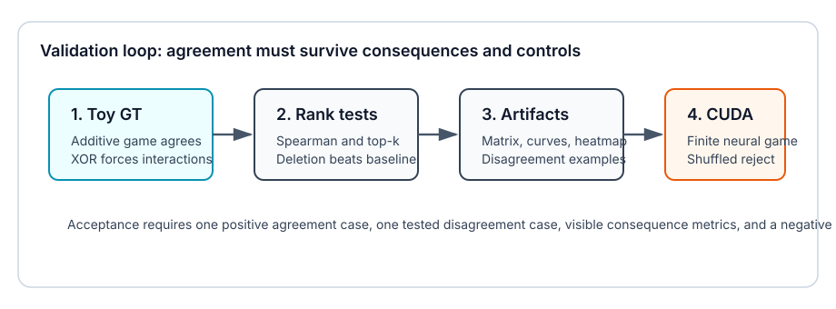
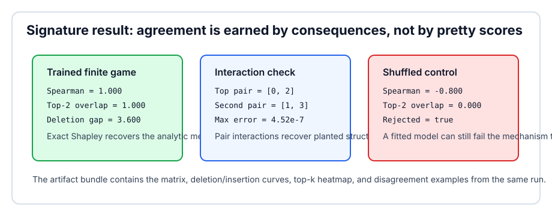

# [16.8] Do SHAPley and Mechanistic Interpretability Agree?

> **Notebooks: [exercises](../../exercises/part8_shapley_mechinterp_agreement/16.8_Do_SHAPley_and_Mechanistic_Interpretability_Agree_exercises.ipynb) | [solutions](../../exercises/part8_shapley_mechinterp_agreement/16.8_Do_SHAPley_and_Mechanistic_Interpretability_Agree_solutions.ipynb)**

> **Local-first extension.** This section turns "method agreement" into a
> consequence test. You will compare exact Shapley values, full-minus-ablated
> patching effects, mechanistic ground-truth scores, interaction values, and a
> shuffled-label control on finite games where the right answer is known.

```python
GT_TIER = "GT-0"
EXERCISE_ID = "16_8_do_shapley_and_mechanistic_interpretability_agree"
DIFFICULTY = 4
IMPORTANCE = 4
EXPECTED_RUNTIME = "seconds for toy contracts; minutes for the CUDA agreement-artifact preflight"
REQUIRES_GPU = True
```

Please send any problems / bugs on the `#errata` channel in the [Slack group](https://info-arena.github.io/ARENA_img/slack.html), and ask any questions on the dedicated channels for this chapter of material.

Links to earlier chapters: [(0) Fundamentals](https://arena-chapter0-fundamentals.streamlit.app/), [(1) Transformer Interpretability](https://arena-chapter1-transformer-interp.streamlit.app/), [(2) RL](https://arena-chapter2-rl.streamlit.app/), [(3) LLM Evaluations](https://arena-chapter3-llm-evals.streamlit.app/), [(4) Alignment Science](https://arena-chapter4-alignment-science.streamlit.app/).



## Core Question

When SHAPley-style attribution and mechanistic interpretability disagree, is
one method wrong, or are they scoring different player sets?

The answer in this section is deliberately narrow: on a finite additive game,
single-feature Shapley agrees with the known mechanism. On an XOR game,
single-feature Shapley correctly averages to zero, but the pair interaction is
the mechanism. On a trained CUDA finite game, exact Shapley from model ablations
recovers the analytic feature ranking, while a shuffled-label trained model
fails the same agreement test.

<details>
<summary>Help - what counts as agreement?</summary>

Agreement is not "the heatmaps look similar". In this notebook, agreement means
the methods identify the same important players and their consequences match:
rank correlation is high, top-k overlap is exact, deleting the top player hurts
more than a non-top baseline, and interaction values recover the planted pair.

</details>

<details>
<summary>Help - why start with games instead of a transformer?</summary>

Large-model attribution disagreements are hard to interpret because the player
sets differ: tokens, heads, activations, features, edges, examples, and
directions are not the same kind of object. Finite games let you see the failure
mode before adding model complexity.

</details>

## Learning Objectives

- Rank attribution scores and compare them against mechanistic ground truth.
- Build deletion and insertion consequence curves from a ranking.
- Verify positive agreement on an additive finite game.
- Show a tested disagreement case where XOR needs pair interactions.
- Write an agreement matrix and visible consequence artifacts.
- Inspect a CUDA trained finite-game report with shuffled-label rejection.
- State what this agreement protocol does not prove about large models.

## Reading

- Shapley values and the efficiency axiom from the previous sections in this
  chapter.
- Pairwise Shapley interactions from `[16.3] Shapley Interactions with shapiq`.
- Activation patching and consequence tests from `[16.6] SHAP vs Activation
  Patching`.

# Setup Code

```python
import csv
import json
import sys
from pathlib import Path

import torch as t

chapter = "chapter16_shapley_attribution_baselines"
section = "part8_shapley_mechinterp_agreement"
root_dir = next(p for p in [Path.cwd(), *Path.cwd().parents] if (p / chapter).exists())
exercises_dir = root_dir / chapter / "exercises"
section_dir = exercises_dir / section

if str(root_dir) not in sys.path:
    sys.path.append(str(root_dir))
if str(exercises_dir) not in sys.path:
    sys.path.append(str(exercises_dir))

import part8_shapley_mechinterp_agreement.tests as tests
import part8_shapley_mechinterp_agreement.utils as utils

from arena_ext.shapley_attribution import (
    additive_game,
    attribution_agreement_report,
    exact_shapley_values,
    interaction_agreement_report,
    pairwise_shapley_interactions,
    topk_overlap_fraction,
    xor_game,
)
from arena_ext.shapley_neural_game import (
    NEURAL_GAME_NUM_PLAYERS,
    coalition_table_from_true_game,
)

MAIN = __name__ == "__main__"
```

# Exercise 1 - Rank Attribution Scores

> ```yaml
> Difficulty: medium
> Importance: high
>
> You should spend 5-10 minutes on this exercise.
> ```

Implement `_rank_desc`. It should return player indices sorted from highest
score to lowest score. This is the tiny helper that every later consequence
curve depends on.

```python
def _rank_desc(scores: t.Tensor) -> list[int]:
    """
    Return indices sorted by descending score.

    Inputs:
        scores: shape [num_players]
    Returns:
        Python list of player indices.
    """
    # EXERCISE
    # YOUR CODE HERE
    raise NotImplementedError()
    # END EXERCISE


if MAIN:
    tests.test_rank_desc_toy_oracle(_rank_desc)
```

<details>
<summary>Expected output</summary>

```text
All tests in `test_rank_desc_toy_oracle` passed!
```

</details>

<details>
<summary>Help - why test ties?</summary>

Exact games often produce tied values. A deterministic ranking makes plots and
top-k comparisons reproducible, but you should not overinterpret arbitrary
tie-breaking.

</details>

<details>
<summary>Solution</summary>

```python
def _rank_desc(scores: t.Tensor) -> list[int]:
    return [int(item) for item in t.argsort(scores.detach().double().cpu(), descending=True)]
```

</details>

# Exercise 2 - Turn a Ranking into Consequences

> ```yaml
> Difficulty: medium
> Importance: high
>
> You should spend 10-15 minutes on this exercise.
> ```

Implement `_curve_from_rank`. For deletion, start from the full coalition and
remove ranked players. For insertion, start from the empty coalition and add
ranked players. This is the difference between a score list and a causal
consequence test.

```python
def _curve_from_rank(values: dict[frozenset[int], float], rank: list[int], mode: str) -> list[dict]:
    """
    Build deletion or insertion curve points from a ranked player list.

    Inputs:
        values: complete coalition value table.
        rank: player indices sorted by decreasing importance.
        mode: either "deletion" or "insertion".
    Returns:
        A list of dictionaries with step, player, and value fields.
    """
    # EXERCISE
    # YOUR CODE HERE
    raise NotImplementedError()
    # END EXERCISE


if MAIN:
    tests.test_curve_from_rank_deletion_and_insertion(_curve_from_rank)
```

<details>
<summary>Expected output</summary>

For the toy additive scores `[1.0, 2.0, 0.5, -0.25]`, deletion should start at
`3.25` and insertion should start at `0.0`.

```text
All tests in `test_curve_from_rank_deletion_and_insertion` passed!
```

</details>

<details>
<summary>Help - what does a deletion curve show?</summary>

If a method has found a real bottleneck, deleting its top-ranked players should
damage the value faster than deleting a weak or shuffled ranking. A curve makes
the score meaningful.

</details>

<details>
<summary>Solution</summary>

```python
def _curve_from_rank(values: dict[frozenset[int], float], rank: list[int], mode: str) -> list[dict]:
    if mode not in {"deletion", "insertion"}:
        raise ValueError("mode must be 'deletion' or 'insertion'.")
    active = set(range(NEURAL_GAME_NUM_PLAYERS)) if mode == "deletion" else set()
    points = [{"step": 0, "player": "start", "value": values[frozenset(active)]}]
    for step, player in enumerate(rank, start=1):
        if mode == "deletion":
            active.remove(player)
        else:
            active.add(player)
        points.append({"step": step, "player": player, "value": values[frozenset(active)]})
    return points
```

</details>

# Exercise 3 - Positive Control: Additive Agreement

> ```yaml
> Difficulty: medium
> Importance: high
>
> You should spend 10 minutes on this exercise.
> ```

The mechanistic ground truth is additive: feature 1 matters most, then feature
0, then feature 2. Exact Shapley, patching effects, and mechanistic scores
should agree.

```python
def additive_agreement_smoke_test() -> dict:
    """
    Return rank, top-k, and deletion metrics for the additive positive control.
    """
    # EXERCISE
    # YOUR CODE HERE
    raise NotImplementedError()
    # END EXERCISE


if MAIN:
    tests.test_additive_agreement_smoke_test(additive_agreement_smoke_test)
```

<details>
<summary>Expected output</summary>

```text
topk_overlap: 1.0
spearman_correlation: 1.0
deletion_drop > random_baseline_drop
All tests in `test_additive_agreement_smoke_test` passed!
```

</details>

<details>
<summary>Interpreting the result</summary>

This is the sanity check. It proves the comparison code can recover agreement
when the player set is correct and the mechanism is additive. It does not prove
ordinary Shapley will be sufficient when the behavior is interaction-heavy.

</details>

<details>
<summary>Solution</summary>

```python
def additive_agreement_smoke_test() -> dict:
    mechanistic_scores = t.tensor([1.0, 2.0, 0.5])
    values = additive_game(mechanistic_scores)
    result = attribution_agreement_report(
        values,
        mechanistic_scores=mechanistic_scores,
        num_players=3,
    ).__dict__.copy()
    result["shapley_values"] = result["shapley_values"].tolist()
    result["patching_effects"] = result["patching_effects"].tolist()
    result["mechanistic_scores"] = result["mechanistic_scores"].tolist()
    return result
```

</details>

# Exercise 4 - Disagreement Control: XOR Needs Interactions

> ```yaml
> Difficulty: medium
> Importance: high
>
> You should spend 10 minutes on this exercise.
> ```

In XOR, individual features have zero ordinary Shapley value. The causal player
is the pair. This is the central disagreement case: the single-feature method is
not "bad"; it is answering a different player-set question.

```python
def xor_disagreement_smoke_test() -> dict:
    """
    Return ordinary Shapley and pair-interaction metrics for the XOR control.
    """
    # EXERCISE
    # YOUR CODE HERE
    raise NotImplementedError()
    # END EXERCISE


if MAIN:
    tests.test_xor_disagreement_smoke_test(xor_disagreement_smoke_test)
```

<details>
<summary>Expected output</summary>

```text
ordinary_shapley_misses: true
interaction_recovers_pair: true
recovered_pair_interaction: 2.0
All tests in `test_xor_disagreement_smoke_test` passed!
```

</details>

<details>
<summary>Help - why is zero Shapley not a bug?</summary>

The single feature has no average marginal effect in XOR. The pair does. This
is exactly why a mechanistic study must ask what the players are before it asks
which method "wins".

</details>

<details>
<summary>Solution</summary>

```python
def xor_disagreement_smoke_test() -> dict:
    result = interaction_agreement_report(xor_game()).__dict__.copy()
    result["shapley_values"] = result["shapley_values"].tolist()
    result["pair_interactions"] = result["pair_interactions"].tolist()
    return result
```

</details>

# Exercise 5 - Write the Agreement Artifact Bundle

> ```yaml
> Difficulty: hard
> Importance: high
>
> You should spend 15-25 minutes on this exercise.
> ```

The roadmap requires a durable `agreement_matrix.csv`, deletion/insertion
curves, a top-k heatmap, and examples of method disagreement. These artifacts
must be generated from the same values as the report, not manually curated.

```python
def write_agreement_artifacts(
    *,
    output_dir: Path,
    model_values: dict[frozenset[int], float],
    true_values: dict[frozenset[int], float],
    shuffled_values: dict[frozenset[int], float],
    agreement,
    shuffled_agreement,
    model_interactions: t.Tensor,
    true_interactions: t.Tensor,
) -> dict:
    """
    Write the agreement matrix, consequence plots, heatmap, and disagreement notes.
    """
    # EXERCISE
    # YOUR CODE HERE
    raise NotImplementedError()
    # END EXERCISE


if MAIN:
    tests.test_write_agreement_artifacts_contract()
```

<details>
<summary>Expected output</summary>

```text
agreement_matrix.csv has seven rows
deletion_curves.png exists and is non-empty
insertion_curves.png exists and is non-empty
topk_overlap_heatmap.png exists and is non-empty
method_disagreement_examples.md exists and is non-empty
All tests in `test_write_agreement_artifacts_contract` passed!
```

</details>

<details>
<summary>Help - what belongs in the matrix?</summary>

Include at least one positive agreement row, one deletion-consequence row, one
interaction row, one shuffled-control row, and one disagreement row. This makes
the artifact a compact scientific claim rather than a loose plot folder.

</details>

<details>
<summary>Common bugs</summary>

- Writing the artifact files from hand-typed numbers instead of the report
  values.
- Including only positive agreement cases and omitting the XOR disagreement.
- Letting the shuffled-label control fit its labels, then forgetting to check
  that it fails mechanistic agreement.

</details>

<details>
<summary>Solution</summary>

See the solution notebook for the full artifact writer. It writes the matrix
with `csv.DictWriter`, produces three plots with Matplotlib, and writes a
short Markdown file explaining the additive, XOR, and shuffled-control cases.

</details>

# Exercise 6 - Package the Notebook Contract

> ```yaml
> Difficulty: medium
> Importance: medium
>
> You should spend 5-10 minutes on this exercise.
> ```

Return both the positive agreement control and the tested disagreement control.

```python
def run_smoke_test(cpu: bool = True) -> dict:
    _ = cpu
    # EXERCISE
    # YOUR CODE HERE
    raise NotImplementedError()
    # END EXERCISE


if MAIN:
    tests.test_notebook_contract(run_smoke_test)
```

<details>
<summary>Expected output</summary>

```text
All tests in `test_notebook_contract` passed!
```

</details>

<details>
<summary>Solution</summary>

```python
def run_smoke_test(cpu: bool = True) -> dict:
    _ = cpu
    return {
        "additive_agreement": additive_agreement_smoke_test(),
        "xor_disagreement": xor_disagreement_smoke_test(),
    }
```

</details>

# Exercise 7 - Inspect the Committed CUDA Report

> ```yaml
> Difficulty: medium
> Importance: high
>
> You should spend 10 minutes on this exercise.
> ```

The CUDA report trains a nonlinear finite neural coalition game on all 16
binary feature examples. It compares exact Shapley values from model ablations
against the analytic mechanistic values, checks pair interactions, and rejects
a shuffled-label trained model.

```python
if MAIN:
    tests.test_committed_gpu_report_records_agreement_and_controls()
```

<details>
<summary>Expected output</summary>

```text
All tests in `test_committed_gpu_report_records_agreement_and_controls` passed!
```

</details>

<details>
<summary>Interpreting the CUDA report</summary>

The model is real but finite: it is trained on a complete generated binary
feature table, then exhaustively ablated. This supports claims about the
agreement protocol on a controlled model organism, not broad claims about
arbitrary transformer circuits.

</details>

# Signature Result



| Case | Metric | Result | Interpretation |
| --- | ---: | ---: | --- |
| Additive toy | Spearman | `1.0` | Shapley agrees when players match the mechanism. |
| XOR toy | max single value | `0.0` | Ordinary Shapley misses the pair mechanism. |
| CUDA finite game | Spearman | `0.9999999999999998` | Model ablation Shapley recovers analytic feature ranking. |
| CUDA finite game | deletion gap | `3.600001` | Top Shapley deletion beats non-top baseline. |
| CUDA interaction check | max error | `4.52e-7` | Pair interactions recover planted structure. |
| Shuffled control | top-2 overlap | `0.0` | A fitted control can still fail mechanism agreement. |

<details>
<summary>What you should see</summary>

The positive cases agree in rank, top-k overlap, and consequences. The XOR case
shows why ordinary single-feature Shapley can miss a mechanism. The shuffled
control shows why a good-looking trained model is not enough.

</details>

# What This Section Shows

- Exact Shapley agrees with mechanistic scores on additive finite games.
- Pairwise Shapley interactions recover an XOR-style mechanism that ordinary
  single-feature Shapley misses.
- On a trained CUDA finite game, exact Shapley from model ablations recovers
  the analytic feature ranking and deletion consequence.
- A shuffled-label trained model is rejected by the same agreement tests.
- The artifact bundle makes the agreement and disagreement cases inspectable.

# Limitations

## What This Section Does Not Show

- It does not prove that SHAP, Shapley interactions, or patching agree on large
  transformer circuits.
- It does not prove that a high rank correlation is sufficient for mechanistic
  understanding.
- It does not compare every possible player set. Tokens, heads, SAE features,
  edges, examples, and directions need separate consequence tests.
- It does not replace task-specific circuit validation.

# Bonus / Exploring Anomalies

1. Build a three-way interaction game where pair interactions are also
   insufficient.
2. Replace the additive toy with a sparse-feature graph and compare node-level
   Shapley to edge-level path patching.
3. Add seed sweeps for the CUDA neural game and check whether the shuffled
   control ever appears spuriously aligned.
4. Try the same agreement matrix on one small TransformerLens task, but keep
   the finite-game controls as the acceptance gate.
