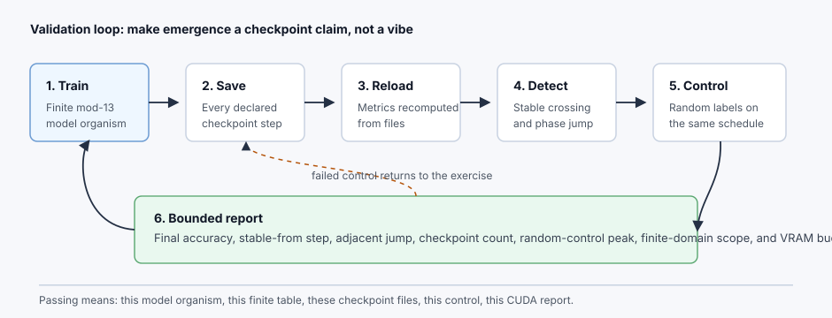
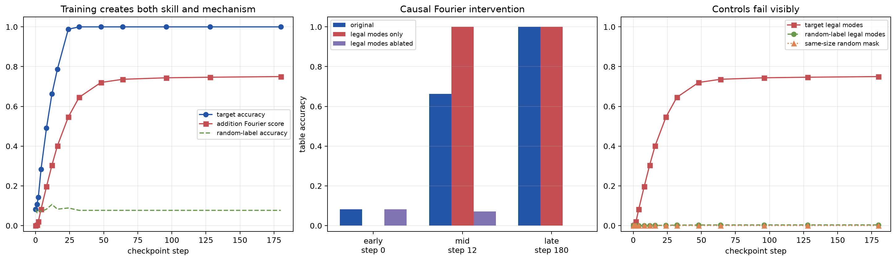

# [17.1] Checkpoint Archaeology and Mechanism Emergence

> **Notebooks: [exercises](../../exercises/part1_checkpoint_archaeology/17.1_Checkpoint_Archaeology_and_Mechanism_Emergence_exercises.ipynb) | [solutions](../../exercises/part1_checkpoint_archaeology/17.1_Checkpoint_Archaeology_and_Mechanism_Emergence_solutions.ipynb)**

By the end of this notebook, you will have shown that a tiny checkpointed model develops a measurable modular-addition mechanism during training, because a Fourier legality metric rises with task performance while random-label and random-mechanism controls fail.

The point is not to stare at a loss curve and narrate a story. The point is to build a finite model organism where you can save checkpoints, reload them, measure a mathematically meaningful mechanism, and perform an intervention that makes the mechanism necessary.

The model organism is deliberately small: a two-token MLP trained on the complete mod-13 addition table. That keeps the evidence exact enough for a notebook, while still giving you a real train/save/reload loop and a real Fourier mechanism metric inspired by the original ARENA modular arithmetic section.

## Core Question

When does a pattern in training curves count as the emergence of a specific mechanism rather than a transient threshold crossing or an artifact of the metric?

**Common bug:** measuring the live in-memory model instead of the reloaded checkpoint, or reporting the first threshold crossing without requiring it to remain stable. This lesson reloads every checkpoint and compares legal Fourier modes against random-label and same-size random-mode controls.

```python
GT_TIER = "GT-0"
EXERCISE_ID = "17_1_checkpoint_archaeology_and_mechanism_emergence"
DIFFICULTY = 4
IMPORTANCE = 3
EXPECTED_RUNTIME = "seconds for exact Fourier oracles; about 30 seconds for the CPU train/save/reload notebook contract; parent runner handles CUDA validation"
REQUIRES_GPU = True
```

## Learning Objectives

By the end, you should be able to:

- construct the complete finite mod-13 addition domain and a noiseless ground-truth logit table;
- identify the Fourier modes that exactly encode the addition rule;
- distinguish a real mechanism score from a same-size random Fourier mask;
- train a tiny checkpointed model and recompute every metric only after checkpoint reload;
- compare early, mid, and late checkpoint interventions by keeping or ablating legal Fourier modes;
- reject random-label and random-mechanism controls without weakening the claim into a vague training-curve story.



```python
from __future__ import annotations

import json
import sys
import tempfile
from pathlib import Path
from typing import Iterable

import matplotlib.pyplot as plt
import torch as t
import torch.nn.functional as F
from IPython.display import Markdown, display

chapter = "chapter17_training_dynamics"
section = "part1_checkpoint_archaeology"
root_dir = next(p for p in [Path.cwd(), *Path.cwd().parents] if (p / chapter).exists())
exercises_dir = root_dir / chapter / "exercises"
section_dir = exercises_dir / section
assets_dir = root_dir / chapter / "instructions" / "assets"

if str(root_dir) not in sys.path:
    sys.path.append(str(root_dir))
if str(exercises_dir) not in sys.path:
    sys.path.append(str(exercises_dir))

import part1_checkpoint_archaeology.tests as tests

from arena_ext.training_dynamics import (
    developmental_comparison_report,
    first_threshold_crossing,
    mechanism_emergence_report,
    monotonicity_violations,
    phase_transition_report,
    random_control_report,
    stable_threshold_step,
    toy_training_trajectories,
)

MODULAR_ARCHAEOLOGY_MODULUS = 13
MODULAR_ARCHAEOLOGY_EMBED_DIM = 32
MODULAR_ARCHAEOLOGY_HIDDEN_DIM = 96
MODULAR_ARCHAEOLOGY_LR = 5e-3
MODULAR_ARCHAEOLOGY_STEPS = 180
MODULAR_ARCHAEOLOGY_CHECKPOINT_STEPS = [0, 1, 2, 4, 8, 12, 16, 24, 32, 48, 64, 96, 128, 180]
MODULAR_ARCHAEOLOGY_ACCURACY_THRESHOLD = 0.90
MODULAR_ARCHAEOLOGY_MECHANISM_THRESHOLD = 0.50
MODULAR_ARCHAEOLOGY_MIN_CONSECUTIVE = 2

t.manual_seed(0)
```

## Cold Open: What Would Count As Emergence?

For modular addition, the correct logit table is not arbitrary. If the output token is `c`, then the exact rule is high when `c = a + b mod p`. In a 3D Fourier basis over `(a, b, c)`, this rule lives on a tiny set of legal frequencies:

`k_a = k_b = -k_c mod p`.

That gives us a mechanism metric before we train anything: what fraction of centered logit-table Fourier power lies in those legal modes? A useful checkpoint archaeology claim should show that this fraction rises, that it tracks performance, and that ablating those modes causally damages the trained checkpoint.

### Exercise 1 - Build the Finite Model Organism

> ```yaml
> Difficulty: medium
> Importance: high
> Expected time: 10 minutes
> ```

Implement the complete mod-addition dataset and a noiseless exact logit table. This is the ground truth you will use to check the mechanism metric before trusting it on a trained model.

```python
def make_modular_addition_dataset(
    *,
    modulus: int = MODULAR_ARCHAEOLOGY_MODULUS,
    device: str | t.device = "cpu",
) -> tuple[t.Tensor, t.Tensor]:
    # Return every pair (a, b), then label each row with (a + b) mod p.
    raise NotImplementedError()


def exact_addition_logits(
    *,
    modulus: int = MODULAR_ARCHAEOLOGY_MODULUS,
    correct_logit: float = 5.0,
    incorrect_logit: float = -5.0,
    device: str | t.device = "cpu",
) -> t.Tensor:
    # Build a noiseless logit table whose argmax is the exact addition rule.
    raise NotImplementedError()


tests.test_make_modular_addition_dataset_has_exact_finite_table(make_modular_addition_dataset)
```

<details>
<summary>Expected output</summary>

```text
All tests in `test_make_modular_addition_dataset_has_exact_finite_table` passed!
Example: (7 + 11) mod 13 = 5
```

</details>

<details>
<summary>Help - check the reasoning before opening the solution</summary>

Enumerate all pairs in row-major order: for each `a`, loop over every `b`. The labels are `(pairs[:, 0] + pairs[:, 1]) % modulus`.

</details>

<details>
<summary>Interpretation</summary>

This exact table is your toy ground truth. Any later claim about emergence is scoped to these 169 inputs; it is not an OOD generalization claim.

</details>

<details>
<summary>Solution</summary>

```python
def make_modular_addition_dataset(
    *,
    modulus: int = MODULAR_ARCHAEOLOGY_MODULUS,
    device: str | t.device = "cpu",
) -> tuple[t.Tensor, t.Tensor]:
    """Return every pair (a, b) and the label (a + b) mod p."""

    device = t.device(device)
    pairs = t.tensor(
        [[left, right] for left in range(modulus) for right in range(modulus)],
        dtype=t.long,
        device=device,
    )
    labels = (pairs[:, 0] + pairs[:, 1]) % modulus
    return pairs, labels

def exact_addition_logits(
    *,
    modulus: int = MODULAR_ARCHAEOLOGY_MODULUS,
    correct_logit: float = 5.0,
    incorrect_logit: float = -5.0,
    device: str | t.device = "cpu",
) -> t.Tensor:
    """A noiseless finite-table logit tensor for the exact addition rule."""

    _, labels = make_modular_addition_dataset(modulus=modulus, device=device)
    logits = t.full((modulus * modulus, modulus), incorrect_logit, device=t.device(device))
    logits[t.arange(labels.numel(), device=labels.device), labels] = correct_logit
    return logits
```

</details>

```python
pairs, labels = make_modular_addition_dataset(modulus=MODULAR_ARCHAEOLOGY_MODULUS, device="cpu")
addition_table = labels.reshape(MODULAR_ARCHAEOLOGY_MODULUS, MODULAR_ARCHAEOLOGY_MODULUS)
fig, ax = plt.subplots(figsize=(5, 4))
im = ax.imshow(addition_table, cmap="viridis")
ax.set_title("Exact target: (a + b) mod 13")
ax.set_xlabel("b")
ax.set_ylabel("a")
fig.colorbar(im, ax=ax, fraction=0.046, pad=0.04)
plt.show()
print("Example: (7 + 11) mod 13 =", int(addition_table[7, 11].item()))
```

### Exercise 2 - Define the Fourier Mechanism Metric

> ```yaml
> Difficulty: hard
> Importance: high
> Expected time: 25 minutes
> ```

The exact rule `c = a + b mod p` has a sparse Fourier signature over the logit cube indexed by `(a, b, c)`. Build the legal-mode mask, a same-size random mask, and a power-fraction metric.

```python
def addition_fourier_mask(
    *,
    modulus: int = MODULAR_ARCHAEOLOGY_MODULUS,
    device: str | t.device = "cpu",
) -> t.Tensor:
    # Legal modes satisfy k_a = k_b = -k_c mod p. Exclude the all-zero DC mode.
    raise NotImplementedError()


def random_fourier_mask(
    *,
    modulus: int = MODULAR_ARCHAEOLOGY_MODULUS,
    seed: int = 0,
    device: str | t.device = "cpu",
) -> t.Tensor:
    # Same number of modes as the legal mask, but no legal addition modes.
    raise NotImplementedError()


def _logits_to_centered_cube(logits: t.Tensor, *, modulus: int) -> tuple[t.Tensor, t.Tensor]:
    # Reshape [p*p, p] logits into [a, b, c] and remove per-input output mean.
    raise NotImplementedError()


def fourier_power_fraction(
    logits: t.Tensor,
    mask: t.Tensor,
    *,
    modulus: int = MODULAR_ARCHAEOLOGY_MODULUS,
) -> float:
    # Compute the fraction of centered Fourier power inside mask.
    raise NotImplementedError()


def addition_mechanism_score(
    logits: t.Tensor,
    *,
    modulus: int = MODULAR_ARCHAEOLOGY_MODULUS,
) -> float:
    # Convenience wrapper around fourier_power_fraction using the legal mask.
    raise NotImplementedError()


tests.test_addition_fourier_mask_identifies_exact_addition_rule(
    addition_fourier_mask,
    random_fourier_mask,
    fourier_power_fraction,
    exact_addition_logits,
)
```

<details>
<summary>Expected output</summary>

```text
All tests in `test_addition_fourier_mask_identifies_exact_addition_rule` passed!
legal addition Fourier score: 1.0
same-size random Fourier score: near 0.0
```

</details>

<details>
<summary>Help - check the reasoning before opening the solution</summary>

For every nonzero output frequency `k_c`, the legal input frequencies are both `(-k_c) % p`. Remove the per-input output mean before taking the FFT, because adding the same scalar to every output logit cannot change the predicted class.

</details>

<details>
<summary>Interpretation</summary>

A high score means the logit table is using frequencies compatible with addition. The same-size random mask is the first control: if it also scores high, your metric is too broad.

</details>

<details>
<summary>Solution</summary>

```python
def addition_fourier_mask(
    *,
    modulus: int = MODULAR_ARCHAEOLOGY_MODULUS,
    device: str | t.device = "cpu",
) -> t.Tensor:
    """Mask Fourier modes satisfying k_a = k_b = -k_c mod p, excluding DC."""

    mask = t.zeros((modulus, modulus, modulus), dtype=t.bool, device=t.device(device))
    for output_frequency in range(1, modulus):
        input_frequency = (-output_frequency) % modulus
        mask[input_frequency, input_frequency, output_frequency] = True
    return mask

def random_fourier_mask(
    *,
    modulus: int = MODULAR_ARCHAEOLOGY_MODULUS,
    seed: int = 0,
    device: str | t.device = "cpu",
) -> t.Tensor:
    """Sample a same-size conjugate-symmetric mask that is not the addition mask."""

    device = t.device(device)
    legal = addition_fourier_mask(modulus=modulus, device="cpu")
    target_count = int(legal.sum().item())
    if target_count % 2 != 0:
        raise ValueError("random mask construction expects an even non-DC mode count.")

    generator = t.Generator(device="cpu").manual_seed(seed)
    mask = t.zeros_like(legal)
    attempts = 0
    while int(mask.sum().item()) < target_count:
        attempts += 1
        if attempts > 10_000:
            raise RuntimeError("could not sample a valid random Fourier mask.")
        triple = t.randint(0, modulus, (3,), generator=generator).tolist()
        conj = [(-value) % modulus for value in triple]
        if triple == [0, 0, 0]:
            continue
        if legal[triple[0], triple[1], triple[2]] or legal[conj[0], conj[1], conj[2]]:
            continue
        if mask[triple[0], triple[1], triple[2]] or mask[conj[0], conj[1], conj[2]]:
            continue
        mask[triple[0], triple[1], triple[2]] = True
        mask[conj[0], conj[1], conj[2]] = True
    return mask.to(device)

def _logits_to_centered_cube(logits: t.Tensor, *, modulus: int) -> tuple[t.Tensor, t.Tensor]:
    logits = t.as_tensor(logits).float()
    expected_shape = (modulus * modulus, modulus)
    if tuple(logits.shape) != expected_shape:
        raise ValueError(f"logits must have shape {expected_shape}, got {tuple(logits.shape)}.")
    cube = logits.reshape(modulus, modulus, modulus)
    output_mean = cube.mean(dim=-1, keepdim=True)
    return cube - output_mean, output_mean

def fourier_power_fraction(
    logits: t.Tensor,
    mask: t.Tensor,
    *,
    modulus: int = MODULAR_ARCHAEOLOGY_MODULUS,
) -> float:
    """Return the fraction of centered logit-table Fourier power inside mask."""

    centered, _ = _logits_to_centered_cube(logits, modulus=modulus)
    mask = t.as_tensor(mask, dtype=t.bool, device=centered.device)
    if tuple(mask.shape) != (modulus, modulus, modulus):
        raise ValueError("mask must have shape (modulus, modulus, modulus).")
    coeffs = t.fft.fftn(centered, dim=(0, 1, 2))
    power = coeffs.abs().square()
    total_power = power.sum()
    if float(total_power.item()) == 0.0:
        return 0.0
    return float((power[mask].sum() / total_power).item())

def addition_mechanism_score(
    logits: t.Tensor,
    *,
    modulus: int = MODULAR_ARCHAEOLOGY_MODULUS,
) -> float:
    """Fourier score for the legal mod-addition modes of a logit table."""

    return fourier_power_fraction(
        logits,
        addition_fourier_mask(modulus=modulus, device=logits.device),
        modulus=modulus,
    )
```

</details>

```python
exact_logits = exact_addition_logits(modulus=MODULAR_ARCHAEOLOGY_MODULUS, device="cpu")
legal_mask = addition_fourier_mask(modulus=MODULAR_ARCHAEOLOGY_MODULUS, device="cpu")
random_mask = random_fourier_mask(modulus=MODULAR_ARCHAEOLOGY_MODULUS, seed=17, device="cpu")
print("legal addition Fourier score:", round(fourier_power_fraction(exact_logits, legal_mask), 4))
print("same-size random Fourier score:", round(fourier_power_fraction(exact_logits, random_mask), 4))
```

### Exercise 3 - Make the Mechanism Causal on Exact Ground Truth

> ```yaml
> Difficulty: hard
> Importance: high
> Expected time: 20 minutes
> ```

Now turn the metric into an intervention. Keep only legal Fourier modes, or ablate legal Fourier modes, then invert the FFT and measure table accuracy.

```python
def project_logits_to_fourier_mask(
    logits: t.Tensor,
    mask: t.Tensor,
    *,
    modulus: int = MODULAR_ARCHAEOLOGY_MODULUS,
    keep: bool = True,
) -> t.Tensor:
    # Fourier-transform the centered table, keep or ablate mask, then invert.
    raise NotImplementedError()


def accuracy_from_logits(logits: t.Tensor, labels: t.Tensor) -> float:
    raise NotImplementedError()


def fourier_intervention_report(
    logits: t.Tensor,
    labels: t.Tensor,
    *,
    modulus: int = MODULAR_ARCHAEOLOGY_MODULUS,
    random_seed: int = 0,
) -> dict[str, float]:
    # Compare legal modes with a same-size random Fourier mask.
    raise NotImplementedError()


tests.test_fourier_intervention_report_is_causal_on_exact_table(
    fourier_intervention_report,
    exact_addition_logits,
    make_modular_addition_dataset,
)
```

<details>
<summary>Expected output</summary>

```text
All tests in `test_fourier_intervention_report_is_causal_on_exact_table` passed!
legal_only_accuracy: 1.0000
legal_ablated_accuracy: <= 0.1000
random_only_accuracy: near chance
```

</details>

<details>
<summary>Help - check the reasoning before opening the solution</summary>

Use `torch.fft.fftn` on the centered cube. For a keep intervention, zero every coefficient outside the mask. For an ablation intervention, zero every coefficient inside the mask.

</details>

<details>
<summary>Interpretation</summary>

On exact ground truth, legal modes are sufficient and necessary. This gives you a toy oracle before you inspect learned checkpoints.

</details>

<details>
<summary>Solution</summary>

```python
def project_logits_to_fourier_mask(
    logits: t.Tensor,
    mask: t.Tensor,
    *,
    modulus: int = MODULAR_ARCHAEOLOGY_MODULUS,
    keep: bool = True,
) -> t.Tensor:
    """Keep or ablate selected Fourier modes, then invert back to logits."""

    centered, output_mean = _logits_to_centered_cube(logits, modulus=modulus)
    mask = t.as_tensor(mask, dtype=t.bool, device=centered.device)
    coeffs = t.fft.fftn(centered, dim=(0, 1, 2))
    filtered = t.where(mask, coeffs, t.zeros_like(coeffs)) if keep else t.where(
        mask,
        t.zeros_like(coeffs),
        coeffs,
    )
    intervened = t.fft.ifftn(filtered, dim=(0, 1, 2)).real + output_mean
    return intervened.reshape(modulus * modulus, modulus)

def accuracy_from_logits(logits: t.Tensor, labels: t.Tensor) -> float:
    labels = t.as_tensor(labels, device=logits.device)
    return float(logits.argmax(dim=-1).eq(labels).float().mean().item())

def fourier_intervention_report(
    logits: t.Tensor,
    labels: t.Tensor,
    *,
    modulus: int = MODULAR_ARCHAEOLOGY_MODULUS,
    random_seed: int = 0,
) -> dict[str, float]:
    """Compare legal addition modes with a same-size random Fourier mask."""

    legal = addition_fourier_mask(modulus=modulus, device=logits.device)
    random_mask = random_fourier_mask(modulus=modulus, seed=random_seed, device=logits.device)
    legal_only = project_logits_to_fourier_mask(logits, legal, modulus=modulus, keep=True)
    legal_ablated = project_logits_to_fourier_mask(logits, legal, modulus=modulus, keep=False)
    random_only = project_logits_to_fourier_mask(logits, random_mask, modulus=modulus, keep=True)
    random_ablated = project_logits_to_fourier_mask(
        logits,
        random_mask,
        modulus=modulus,
        keep=False,
    )
    original_accuracy = accuracy_from_logits(logits, labels)
    legal_ablated_accuracy = accuracy_from_logits(legal_ablated, labels)
    random_ablated_accuracy = accuracy_from_logits(random_ablated, labels)
    return {
        "original_accuracy": original_accuracy,
        "addition_fourier_score": fourier_power_fraction(logits, legal, modulus=modulus),
        "random_fourier_score": fourier_power_fraction(logits, random_mask, modulus=modulus),
        "legal_only_accuracy": accuracy_from_logits(legal_only, labels),
        "legal_ablated_accuracy": legal_ablated_accuracy,
        "random_only_accuracy": accuracy_from_logits(random_only, labels),
        "random_ablated_accuracy": random_ablated_accuracy,
        "legal_ablation_drop": original_accuracy - legal_ablated_accuracy,
        "random_ablation_drop": original_accuracy - random_ablated_accuracy,
    }
```

</details>

```python
_, labels = make_modular_addition_dataset(modulus=MODULAR_ARCHAEOLOGY_MODULUS, device="cpu")
exact_report = fourier_intervention_report(exact_logits, labels, random_seed=3)
for key, value in exact_report.items():
    print(f"{key:>28}: {value:.4f}")
```

## The Tiny Checkpointed Model

We will use a small MLP with learned token embeddings for `a` and `b`. This is intentionally simpler than the one-layer transformer in the original grokking notebook; the mechanism evidence comes from the finite logit table and Fourier interventions, not from claiming a full transformer circuit.

```python
class TinyModularAdditionMLP(t.nn.Module):
    """Tiny finite-table model organism for checkpoint archaeology."""

    def __init__(
        self,
        *,
        modulus: int = MODULAR_ARCHAEOLOGY_MODULUS,
        embed_dim: int = MODULAR_ARCHAEOLOGY_EMBED_DIM,
        hidden_dim: int = MODULAR_ARCHAEOLOGY_HIDDEN_DIM,
    ):
        super().__init__()
        self.modulus = modulus
        self.embed = t.nn.Embedding(modulus, embed_dim)
        self.mlp = t.nn.Sequential(
            t.nn.Linear(2 * embed_dim, hidden_dim),
            t.nn.GELU(),
            t.nn.Linear(hidden_dim, modulus),
        )

    def forward(self, input_pairs: t.Tensor) -> t.Tensor:
        embedded = self.embed(input_pairs)
        return self.mlp(embedded.flatten(start_dim=1))
```

### Exercise 4 - Train, Save, Reload, Then Measure

> ```yaml
> Difficulty: hard
> Importance: high
> Expected time: 30 minutes
> ```

Implement the archaeology loop. You must save real checkpoint files, reload each file into a fresh model, and compute accuracy, loss, the legal Fourier score, and the random-mask Fourier score from the reloaded model.

```python
def checkpoint_logits_from_file(
    checkpoint_path: Path,
    *,
    device: str | t.device,
    input_pairs: t.Tensor,
    modulus: int = MODULAR_ARCHAEOLOGY_MODULUS,
) -> t.Tensor:
    # Load a checkpoint into a fresh model and return logits on input_pairs.
    raise NotImplementedError()


def train_save_reload_modular_checkpoints(
    *,
    checkpoint_dir: Path,
    device: str | t.device = "cpu",
    seed: int = 0,
    random_labels: bool = False,
    modulus: int = MODULAR_ARCHAEOLOGY_MODULUS,
    steps: int = MODULAR_ARCHAEOLOGY_STEPS,
    checkpoint_steps: Iterable[int] = MODULAR_ARCHAEOLOGY_CHECKPOINT_STEPS,
) -> dict:
    # Train, save checkpoints to disk, reload each checkpoint, and compute metrics.
    raise NotImplementedError()


tests.test_train_save_reload_modular_checkpoints_writes_real_files(
    train_save_reload_modular_checkpoints
)
```

<details>
<summary>Expected output</summary>

```text
All tests in `test_train_save_reload_modular_checkpoints_writes_real_files` passed!
accuracy: rises to 1.0 by the short run
addition Fourier score: rises strongly
random Fourier score: stays near zero
```

</details>

<details>
<summary>Help - check the reasoning before opening the solution</summary>

Save a dictionary containing `model_state`, `step`, `random_labels`, `modulus`, and `seed`. The test checks file size and reload semantics because metrics kept only in memory are not checkpoint archaeology.

</details>

<details>
<summary>Interpretation</summary>

The metric is only trusted after reload. That is the habit you want before scaling to messy real training runs.

</details>

<details>
<summary>Solution</summary>

```python
def checkpoint_logits_from_file(
    checkpoint_path: Path,
    *,
    device: str | t.device,
    input_pairs: t.Tensor,
    modulus: int = MODULAR_ARCHAEOLOGY_MODULUS,
) -> t.Tensor:
    """Load one checkpoint file into a fresh model and return logits."""

    device = t.device(device)
    model = TinyModularAdditionMLP(modulus=modulus).to(device)
    checkpoint = t.load(checkpoint_path, map_location=device, weights_only=True)
    model.load_state_dict(checkpoint["model_state"])
    model.eval()
    with t.inference_mode():
        return model(input_pairs)

def train_save_reload_modular_checkpoints(
    *,
    checkpoint_dir: Path,
    device: str | t.device = "cpu",
    seed: int = 0,
    random_labels: bool = False,
    modulus: int = MODULAR_ARCHAEOLOGY_MODULUS,
    steps: int = MODULAR_ARCHAEOLOGY_STEPS,
    checkpoint_steps: Iterable[int] = MODULAR_ARCHAEOLOGY_CHECKPOINT_STEPS,
) -> dict:
    """Train, save real checkpoints, reload each one, and compute metrics."""

    device = t.device(device)
    checkpoint_steps = sorted(set(int(step) for step in checkpoint_steps))
    if checkpoint_steps[0] != 0 or checkpoint_steps[-1] != steps:
        raise ValueError("checkpoint_steps must include 0 and steps.")
    t.manual_seed(seed)
    if device.type == "cuda":
        t.cuda.manual_seed_all(seed)

    input_pairs, true_labels = make_modular_addition_dataset(modulus=modulus, device=device)
    train_labels = true_labels
    if random_labels:
        generator = t.Generator(device=device).manual_seed(seed + 1000)
        train_labels = t.randint(
            0,
            modulus,
            true_labels.shape,
            generator=generator,
            device=device,
        )

    model = TinyModularAdditionMLP(modulus=modulus).to(device)
    optimizer = t.optim.AdamW(model.parameters(), lr=MODULAR_ARCHAEOLOGY_LR, weight_decay=1e-3)
    checkpoint_dir.mkdir(parents=True, exist_ok=True)
    checkpoint_paths: list[Path] = []
    checkpoint_step_set = set(checkpoint_steps)

    for step in range(steps + 1):
        if step in checkpoint_step_set:
            path = checkpoint_dir / f"step_{step:04d}.pt"
            t.save(
                {
                    "step": step,
                    "model_state": model.state_dict(),
                    "random_labels": random_labels,
                    "modulus": modulus,
                    "seed": seed,
                },
                path,
            )
            checkpoint_paths.append(path)
        if step == steps:
            break
        optimizer.zero_grad(set_to_none=True)
        loss = F.cross_entropy(model(input_pairs), train_labels)
        loss.backward()
        optimizer.step()

    accuracies: list[float] = []
    losses: list[float] = []
    mechanism_scores: list[float] = []
    random_mechanism_scores: list[float] = []
    random_mask = random_fourier_mask(modulus=modulus, seed=seed + 7, device=device)
    for path in checkpoint_paths:
        logits = checkpoint_logits_from_file(
            path,
            device=device,
            input_pairs=input_pairs,
            modulus=modulus,
        )
        accuracies.append(accuracy_from_logits(logits, true_labels))
        losses.append(float(F.cross_entropy(logits, true_labels).item()))
        mechanism_scores.append(addition_mechanism_score(logits, modulus=modulus))
        random_mechanism_scores.append(
            fourier_power_fraction(logits, random_mask, modulus=modulus)
        )

    return {
        "steps": t.tensor(checkpoint_steps, dtype=t.long, device=device),
        "accuracies": t.tensor(accuracies, dtype=t.float32, device=device),
        "losses": t.tensor(losses, dtype=t.float32, device=device),
        "mechanism_scores": t.tensor(mechanism_scores, dtype=t.float32, device=device),
        "random_mechanism_scores": t.tensor(
            random_mechanism_scores,
            dtype=t.float32,
            device=device,
        ),
        "checkpoint_paths": checkpoint_paths,
        "checkpoint_count": len(checkpoint_paths),
        "checkpoint_total_bytes": sum(path.stat().st_size for path in checkpoint_paths),
        "random_labels": random_labels,
        "real_checkpoints_reloaded": True,
    }
```

</details>

```python
with tempfile.TemporaryDirectory(prefix="arena17_small_reload_") as tmp:
    small_run = train_save_reload_modular_checkpoints(
        checkpoint_dir=Path(tmp),
        device="cpu",
        seed=0,
        steps=32,
        checkpoint_steps=[0, 4, 8, 16, 32],
    )
print("steps:", small_run["steps"].tolist())
print("accuracy:", [round(x, 3) for x in small_run["accuracies"].tolist()])
print("addition Fourier score:", [round(x, 3) for x in small_run["mechanism_scores"].tolist()])
print("random Fourier score:", [round(x, 4) for x in small_run["random_mechanism_scores"].tolist()])
```

### Exercise 5 - Assemble the Signature Experiment

> ```yaml
> Difficulty: hard
> Importance: high
> Expected time: 35 minutes
> ```

Run the target-label model and the random-label control on the same checkpoint schedule. Summarize the accuracy emergence, Fourier mechanism emergence, random-label failure, same-size random Fourier failure, and early/mid/late interventions.

```python
def _report_dict(report) -> dict:
    raise NotImplementedError()


def _tensor_to_list(tensor: t.Tensor) -> list[float] | list[int]:
    raise NotImplementedError()


def _select_early_mid_late_steps(steps: t.Tensor, accuracies: t.Tensor) -> dict[str, int]:
    raise NotImplementedError()


def checkpoint_archaeology_signature_result(
    checkpoint_root: Path | None = None,
    *,
    device: str | t.device = "cpu",
    seed: int = 0,
    include_figure: bool = False,
    figure_path: Path | None = None,
) -> dict:
    # Run target-label and random-label training, summarize trajectories and interventions.
    raise NotImplementedError()


with tempfile.TemporaryDirectory(prefix="arena17_notebook_signature_") as tmp:
    signature_result = checkpoint_archaeology_signature_result(
        checkpoint_root=Path(tmp),
        device="cpu",
        seed=0,
        include_figure=False,
    )

assert signature_result["preflight_passed"]
assert signature_result["final_accuracy"] == 1.0
assert signature_result["final_addition_fourier_score"] >= 0.70
assert signature_result["random_label_peak_accuracy"] <= 0.20
assert signature_result["random_mechanism_peak_score"] <= 0.05
print("Signature result accepted: checkpointed training, Fourier metric, interventions, and controls all passed.")
```

<details>
<summary>Expected output</summary>

```text
Signature result accepted: checkpointed training, Fourier metric, interventions, and controls all passed.
final_accuracy = 1.0
final_addition_fourier_score roughly 0.75
random_label_peak_accuracy roughly 0.11
late legal-mode ablation drop = 1.0
```

</details>

<details>
<summary>Help - check the reasoning before opening the solution</summary>

Select early as the first checkpoint, mid as the first checkpoint with accuracy at least 0.60, and late as the final checkpoint. The random-label control is trained on shuffled labels but always evaluated against true addition.

</details>

<details>
<summary>Interpretation</summary>

The strongest evidence is the conjunction: performance rises, legal Fourier power rises, legal-only modes solve late, legal ablation destroys late, and two controls fail.

</details>

<details>
<summary>Solution</summary>

```python
def _report_dict(report) -> dict:
    return report.__dict__.copy()

def _tensor_to_list(tensor: t.Tensor) -> list[float] | list[int]:
    values = tensor.detach().cpu().tolist()
    return values if isinstance(values, list) else [values]

def _select_early_mid_late_steps(steps: t.Tensor, accuracies: t.Tensor) -> dict[str, int]:
    early = int(steps[0].item())
    mid_candidates = t.nonzero(accuracies >= 0.60, as_tuple=False)
    if mid_candidates.numel():
        mid = int(steps[int(mid_candidates[0].item())].item())
    else:
        mid = int(steps[len(steps) // 2].item())
    late = int(steps[-1].item())
    return {"early": early, "mid": mid, "late": late}

def checkpoint_archaeology_signature_result(
    checkpoint_root: Path | None = None,
    *,
    device: str | t.device = "cpu",
    seed: int = 0,
    include_figure: bool = False,
    figure_path: Path | None = None,
) -> dict:
    """Run the full finite model-organism experiment and return JSON-safe evidence."""

    device = t.device(device)
    if device.type == "cuda" and not t.cuda.is_available():
        raise RuntimeError("CUDA device requested, but CUDA is not available.")

    def _run(root: Path) -> dict:
        target = train_save_reload_modular_checkpoints(
            checkpoint_dir=root / "target_labels",
            device=device,
            seed=seed,
            random_labels=False,
        )
        random_label = train_save_reload_modular_checkpoints(
            checkpoint_dir=root / "random_labels",
            device=device,
            seed=seed,
            random_labels=True,
        )
        input_pairs, labels = make_modular_addition_dataset(device=device)

        accuracy_emergence = mechanism_emergence_report(
            target["steps"],
            target["accuracies"],
            metric_name="modular_addition_table_accuracy",
            threshold=MODULAR_ARCHAEOLOGY_ACCURACY_THRESHOLD,
            min_consecutive=MODULAR_ARCHAEOLOGY_MIN_CONSECUTIVE,
        )
        mechanism_emergence = mechanism_emergence_report(
            target["steps"],
            target["mechanism_scores"],
            metric_name="addition_fourier_power_fraction",
            threshold=MODULAR_ARCHAEOLOGY_MECHANISM_THRESHOLD,
            min_consecutive=MODULAR_ARCHAEOLOGY_MIN_CONSECUTIVE,
        )
        phase = phase_transition_report(
            target["steps"],
            target["mechanism_scores"],
            metric_name="addition_fourier_power_fraction",
            min_jump=0.10,
        )
        random_label_accuracy_report = random_control_report(
            random_label["accuracies"],
            metric_name="random_label_true_table_accuracy",
            max_allowed_value=0.20,
        )
        random_label_mechanism_report = random_control_report(
            random_label["mechanism_scores"],
            metric_name="random_label_addition_fourier_score",
            max_allowed_value=0.05,
        )
        random_mechanism_report = random_control_report(
            target["random_mechanism_scores"],
            metric_name="same_size_random_fourier_mask_score",
            max_allowed_value=0.05,
        )

        chosen_steps = _select_early_mid_late_steps(target["steps"], target["accuracies"])
        path_by_step = {
            int(step.item()): path
            for step, path in zip(target["steps"], target["checkpoint_paths"], strict=True)
        }
        intervention_rows: list[dict] = []
        for phase_name, step in chosen_steps.items():
            logits = checkpoint_logits_from_file(
                path_by_step[step],
                device=device,
                input_pairs=input_pairs,
            )
            report = fourier_intervention_report(logits, labels, random_seed=seed + 7)
            intervention_rows.append({"phase": phase_name, "step": step, **report})

        late_intervention = intervention_rows[-1]
        checkpoint_files = sorted(root.glob("*/*.pt"))
        checkpoint_count = target["checkpoint_count"] + random_label["checkpoint_count"]
        final_accuracy = float(target["accuracies"][-1].item())
        final_mechanism_score = float(target["mechanism_scores"][-1].item())
        preflight_passed = (
            accuracy_emergence.emerged
            and mechanism_emergence.emerged
            and final_accuracy >= 0.99
            and final_mechanism_score >= 0.65
            and late_intervention["legal_only_accuracy"] >= 0.99
            and late_intervention["legal_ablation_drop"] >= 0.90
            and late_intervention["random_only_accuracy"] <= 0.20
            and random_label_accuracy_report.control_passed
            and random_label_mechanism_report.control_passed
            and random_mechanism_report.control_passed
            and len(checkpoint_files) == checkpoint_count
            and checkpoint_count == 2 * len(MODULAR_ARCHAEOLOGY_CHECKPOINT_STEPS)
        )

        metrics_table = [
            {
                "quantity": "final target accuracy",
                "value": final_accuracy,
                "control_or_threshold": ">= 0.99",
                "passed": final_accuracy >= 0.99,
            },
            {
                "quantity": "final addition Fourier score",
                "value": final_mechanism_score,
                "control_or_threshold": ">= 0.65",
                "passed": final_mechanism_score >= 0.65,
            },
            {
                "quantity": "late legal-only accuracy",
                "value": late_intervention["legal_only_accuracy"],
                "control_or_threshold": ">= 0.99",
                "passed": late_intervention["legal_only_accuracy"] >= 0.99,
            },
            {
                "quantity": "late legal-mode ablation drop",
                "value": late_intervention["legal_ablation_drop"],
                "control_or_threshold": ">= 0.90",
                "passed": late_intervention["legal_ablation_drop"] >= 0.90,
            },
            {
                "quantity": "random-label peak true accuracy",
                "value": random_label_accuracy_report.peak_value,
                "control_or_threshold": "<= 0.20",
                "passed": random_label_accuracy_report.control_passed,
            },
            {
                "quantity": "random-label peak Fourier score",
                "value": random_label_mechanism_report.peak_value,
                "control_or_threshold": "<= 0.05",
                "passed": random_label_mechanism_report.control_passed,
            },
            {
                "quantity": "same-size random Fourier peak",
                "value": random_mechanism_report.peak_value,
                "control_or_threshold": "<= 0.05",
                "passed": random_mechanism_report.control_passed,
            },
        ]

        result = {
            "preflight_passed": preflight_passed,
            "device": str(device),
            "model_family": "tiny_modular_addition_mlp",
            "modulus": MODULAR_ARCHAEOLOGY_MODULUS,
            "table_example_count": MODULAR_ARCHAEOLOGY_MODULUS**2,
            "complete_finite_domain_evaluated": True,
            "ood_generalization_claimed": False,
            "generalization_scope": (
                "Complete finite mod-13 addition table (169/169 input pairs); "
                "no held-out OOD extrapolation is claimed."
            ),
            "checkpoint_steps": _tensor_to_list(target["steps"]),
            "checkpoint_count": checkpoint_count,
            "checkpoint_files_written": len(checkpoint_files),
            "checkpoint_total_bytes": (
                target["checkpoint_total_bytes"] + random_label["checkpoint_total_bytes"]
            ),
            "target_accuracy_trajectory": _tensor_to_list(target["accuracies"]),
            "target_loss_trajectory": _tensor_to_list(target["losses"]),
            "target_addition_fourier_score_trajectory": _tensor_to_list(
                target["mechanism_scores"]
            ),
            "target_random_fourier_score_trajectory": _tensor_to_list(
                target["random_mechanism_scores"]
            ),
            "random_label_accuracy_trajectory": _tensor_to_list(random_label["accuracies"]),
            "random_label_addition_fourier_score_trajectory": _tensor_to_list(
                random_label["mechanism_scores"]
            ),
            "accuracy_first_crossing_step": accuracy_emergence.first_crossing_step,
            "accuracy_stable_from_step": accuracy_emergence.stable_from_step,
            "mechanism_first_crossing_step": mechanism_emergence.first_crossing_step,
            "mechanism_stable_from_step": mechanism_emergence.stable_from_step,
            "final_accuracy": final_accuracy,
            "final_addition_fourier_score": final_mechanism_score,
            "phase_transition_step": phase.transition_step,
            "phase_transition_jump": phase.jump,
            "phase_transition_detected": phase.phase_transition_detected,
            "random_label_peak_accuracy": random_label_accuracy_report.peak_value,
            "random_label_accuracy_control_passed": random_label_accuracy_report.control_passed,
            "random_label_peak_fourier_score": random_label_mechanism_report.peak_value,
            "random_label_mechanism_control_passed": random_label_mechanism_report.control_passed,
            "random_mechanism_peak_score": random_mechanism_report.peak_value,
            "random_mechanism_control_passed": random_mechanism_report.control_passed,
            "intervention_rows": intervention_rows,
            "metrics_table": metrics_table,
            "real_checkpoints_reloaded": True,
            "full_path": (
                "Train a tiny modular-addition model organism, save and reload real "
                "checkpoints, measure legal Fourier power in the finite logit table, "
                "causally keep or ablate those modes at early/mid/late checkpoints, "
                "and reject random-label plus random-mechanism controls."
            ),
        }
        if include_figure:
            plot_checkpoint_archaeology_signature(result, save_path=figure_path)
        return result

    if checkpoint_root is not None:
        root = Path(checkpoint_root)
        root.mkdir(parents=True, exist_ok=True)
        return _run(root)

    with tempfile.TemporaryDirectory(prefix="arena17_checkpoint_archaeology_") as tmp:
        return _run(Path(tmp))
```

</details>

### Exercise 6 - Produce the Three-Panel Signature Figure

> ```yaml
> Difficulty: medium
> Importance: high
> Expected time: 15 minutes
> ```

Make the result visible. Your final figure should show training/mechanism trajectories, early/mid/late interventions, and controls. Your metrics table should state thresholds and pass/fail status.

```python
def plot_checkpoint_archaeology_signature(result: dict, *, save_path: Path | None = None):
    # Make a three-panel figure: trajectories, early/mid/late interventions, controls.
    raise NotImplementedError()


def metrics_table_markdown(metrics_table: list[dict]) -> str:
    raise NotImplementedError()


def checkpoint_emergence_smoke_test() -> dict:
    raise NotImplementedError()


def phase_transition_smoke_test() -> dict:
    raise NotImplementedError()


def random_control_smoke_test() -> dict:
    raise NotImplementedError()


def developmental_comparison_smoke_test() -> dict:
    raise NotImplementedError()


def live_checkpoint_archaeology_smoke_test(
    checkpoint_root: Path | None = None,
    *,
    device: str | t.device = "cpu",
    seed: int = 0,
) -> dict:
    raise NotImplementedError()


def run_smoke_test(cpu: bool = True) -> dict:
    raise NotImplementedError()


def run_modular_addition_checkpoint_archaeology_preflight(max_vram_gb: float = 24.0) -> dict:
    # CUDA wrapper for the parent serial validation path. Do not run it in this child task.
    raise NotImplementedError()


def run_gpu_test(max_vram_gb: float = 24.0) -> dict:
    raise NotImplementedError()


def run_full_experiment(max_vram_gb: float = 24.0) -> dict:
    raise NotImplementedError()


figure_path = assets_dir / "checkpoint_archaeology_signature_result.png"
fig = plot_checkpoint_archaeology_signature(signature_result, save_path=figure_path)
display(Markdown(metrics_table_markdown(signature_result["metrics_table"])))
assert figure_path.exists() and figure_path.stat().st_size > 20_000
print(f"Wrote notebook-generated signature figure to {figure_path}")
```

<details>
<summary>Expected output</summary>

```text
Wrote notebook-generated signature figure to .../checkpoint_archaeology_signature_result.png
```



</details>

<details>
<summary>Help - check the reasoning before opening the solution</summary>

Do not load a figure from `verification_report.json`. Plot directly from `signature_result`: checkpoint trajectories in panel 1, intervention bars in panel 2, and random-label/random-mask control curves in panel 3.

</details>

<details>
<summary>Interpretation</summary>

This is the notebook signature result. A reviewer should be able to understand the claim from this figure and the metrics table without reading any appendix report.

</details>

<details>
<summary>Solution</summary>

```python
def plot_checkpoint_archaeology_signature(result: dict, *, save_path: Path | None = None):
    """Create the three-panel learner-facing signature figure."""

    import matplotlib.pyplot as plt

    steps = result["checkpoint_steps"]
    target_acc = result["target_accuracy_trajectory"]
    target_fourier = result["target_addition_fourier_score_trajectory"]
    random_label_acc = result["random_label_accuracy_trajectory"]
    random_label_fourier = result["random_label_addition_fourier_score_trajectory"]
    random_mask_score = result["target_random_fourier_score_trajectory"]
    intervention_rows = result["intervention_rows"]

    fig, axes = plt.subplots(1, 3, figsize=(16, 4.6), constrained_layout=True)

    axes[0].plot(steps, target_acc, marker="o", label="target accuracy", color="#2454a6")
    axes[0].plot(steps, target_fourier, marker="s", label="addition Fourier score", color="#c44e52")
    axes[0].plot(steps, random_label_acc, linestyle="--", label="random-label accuracy", color="#6a994e")
    axes[0].set_title("Training creates both skill and mechanism")
    axes[0].set_xlabel("checkpoint step")
    axes[0].set_ylim(-0.03, 1.05)
    axes[0].grid(alpha=0.25)
    axes[0].legend(fontsize=8)

    labels = [row["phase"] for row in intervention_rows]
    x = list(range(len(labels)))
    width = 0.25
    axes[1].bar(
        [value - width for value in x],
        [row["original_accuracy"] for row in intervention_rows],
        width=width,
        label="original",
        color="#2454a6",
    )
    axes[1].bar(
        x,
        [row["legal_only_accuracy"] for row in intervention_rows],
        width=width,
        label="legal modes only",
        color="#c44e52",
    )
    axes[1].bar(
        [value + width for value in x],
        [row["legal_ablated_accuracy"] for row in intervention_rows],
        width=width,
        label="legal modes ablated",
        color="#8172b2",
    )
    axes[1].set_title("Causal Fourier intervention")
    axes[1].set_xticks(x)
    axes[1].set_xticklabels([f"{row['phase']}\nstep {row['step']}" for row in intervention_rows])
    axes[1].set_ylim(-0.03, 1.05)
    axes[1].set_ylabel("table accuracy")
    axes[1].grid(axis="y", alpha=0.25)
    axes[1].legend(fontsize=8)

    axes[2].plot(steps, target_fourier, marker="s", label="target legal modes", color="#c44e52")
    axes[2].plot(
        steps,
        random_label_fourier,
        marker="o",
        linestyle="--",
        label="random-label legal modes",
        color="#6a994e",
    )
    axes[2].plot(
        steps,
        random_mask_score,
        marker="^",
        linestyle=":",
        label="same-size random mask",
        color="#dd8452",
    )
    axes[2].set_title("Controls fail visibly")
    axes[2].set_xlabel("checkpoint step")
    axes[2].set_ylim(-0.03, 1.05)
    axes[2].grid(alpha=0.25)
    axes[2].legend(fontsize=8)

    if save_path is not None:
        save_path = Path(save_path)
        save_path.parent.mkdir(parents=True, exist_ok=True)
        fig.savefig(save_path, dpi=180, bbox_inches="tight")
    return fig

def metrics_table_markdown(metrics_table: list[dict]) -> str:
    rows = ["| quantity | value | control / threshold | pass |", "|---|---:|---|---|"]
    for row in metrics_table:
        rows.append(
            f"| {row['quantity']} | {row['value']:.4f} | {row['control_or_threshold']} | "
            f"{'yes' if row['passed'] else 'no'} |"
        )
    return "\n".join(rows)

def checkpoint_emergence_smoke_test() -> dict:
    steps, trajectories = toy_training_trajectories()
    return _report_dict(
        mechanism_emergence_report(
            steps,
            trajectories["autoregressive"],
            metric_name="induction_probe_accuracy",
            threshold=0.6,
            min_consecutive=2,
        )
    )

def phase_transition_smoke_test() -> dict:
    steps, trajectories = toy_training_trajectories()
    return _report_dict(
        phase_transition_report(
            steps,
            trajectories["autoregressive"],
            metric_name="induction_probe_accuracy",
            min_jump=0.3,
        )
    )

def random_control_smoke_test() -> dict:
    _, trajectories = toy_training_trajectories()
    return _report_dict(
        random_control_report(
            trajectories["random_control"],
            metric_name="label_shuffled_probe",
            max_allowed_value=0.2,
        )
    )

def developmental_comparison_smoke_test() -> dict:
    steps, trajectories = toy_training_trajectories()
    return _report_dict(
        developmental_comparison_report(
            steps,
            trajectories,
            threshold=0.6,
            min_consecutive=2,
        )
    )

def live_checkpoint_archaeology_smoke_test(
    checkpoint_root: Path | None = None,
    *,
    device: str | t.device = "cpu",
    seed: int = 0,
) -> dict:
    return checkpoint_archaeology_signature_result(
        checkpoint_root=checkpoint_root,
        device=device,
        seed=seed,
        include_figure=False,
    )

def run_smoke_test(cpu: bool = True) -> dict:
    _ = cpu
    return {
        "checkpoint_emergence": checkpoint_emergence_smoke_test(),
        "phase_transition": phase_transition_smoke_test(),
        "random_control": random_control_smoke_test(),
        "developmental_comparison": developmental_comparison_smoke_test(),
        "live_checkpoint_archaeology": live_checkpoint_archaeology_smoke_test(device="cpu"),
    }

def run_modular_addition_checkpoint_archaeology_preflight(
    max_vram_gb: float = 24.0,
) -> dict:
    """CUDA wrapper used by the parent serial validation path."""

    if not t.cuda.is_available():
        raise RuntimeError("Checkpoint archaeology GPU verification requires CUDA.")

    t.cuda.reset_peak_memory_stats()
    result = checkpoint_archaeology_signature_result(device="cuda", include_figure=False)
    t.cuda.synchronize()
    peak_vram_gb = t.cuda.max_memory_allocated() / 1024**3
    result.update(
        {
            "cuda_available": True,
            "device": t.cuda.get_device_name(0),
            "torch_version": t.__version__,
            "cuda_version": t.version.cuda,
            "gpu_total_memory_gb": t.cuda.get_device_properties(0).total_memory / 1024**3,
            "peak_vram_gb": peak_vram_gb,
            "within_vram_budget": peak_vram_gb <= max_vram_gb,
        }
    )
    result["preflight_passed"] = bool(result["preflight_passed"] and result["within_vram_budget"])
    return result

def run_gpu_test(max_vram_gb: float = 24.0) -> dict:
    return run_modular_addition_checkpoint_archaeology_preflight(max_vram_gb=max_vram_gb)

def run_full_experiment(max_vram_gb: float = 24.0) -> dict:
    return run_gpu_test(max_vram_gb=max_vram_gb)
```

</details>

## Try It Yourself

Change `PLAY_SEED`, the random-mask seed, or the mechanism threshold. The expected qualitative result is not that every seed has the identical curve; it is that target training solves the finite table, the legal Fourier score becomes large, and the controls remain weak.

```python
PLAY_SEED = 1
PLAY_RANDOM_MASK_SEED = 19
PLAY_THRESHOLD = 0.55

with tempfile.TemporaryDirectory(prefix="arena17_play_") as tmp:
    play_result = checkpoint_archaeology_signature_result(
        checkpoint_root=Path(tmp),
        device="cpu",
        seed=PLAY_SEED,
        include_figure=False,
    )

print("final accuracy:", round(play_result["final_accuracy"], 4))
print("final addition Fourier score:", round(play_result["final_addition_fourier_score"], 4))
print("mechanism stable from:", play_result["mechanism_stable_from_step"])
print("random-label peak accuracy:", round(play_result["random_label_peak_accuracy"], 4))
print("late intervention:")
for key, value in play_result["intervention_rows"][-1].items():
    print(f"  {key}: {value}")
```

## Anomaly Hunting

Try to find a seed where accuracy reaches 1.0 but the final addition Fourier score is unusually low. If you find one, inspect the late intervention table before changing the claim. A perfect classifier can contain extra non-mechanism logit power; the causal question is whether the legal modes are sufficient and whether ablating them destroys the rule.

Other useful attacks:

- lower the hidden dimension and see whether the mechanism score becomes less stable;
- increase the random-label training steps and confirm it still fails on the true table;
- loosen the mechanism threshold and check whether random masks start passing;
- compare the first accuracy crossing with the first mechanism crossing.

## Limitations

This notebook proves a bounded model-organism claim. It exhaustively evaluates the finite mod-13 table, but it does not claim OOD arithmetic generalization, large-model checkpoint archaeology, or that every learned algorithm must be Fourier sparse. The intervention is causal in logit-table Fourier space, not an activation patch in a transformer block.

That scope is intentional. The value of 17.1 is the discipline: state a concrete mechanism metric, validate it on exact ground truth, save and reload checkpoints, run negative controls, and only then narrate emergence.

## Reading Links

- Original ARENA [1.5.2] Grokking and Modular Arithmetic, for the deeper transformer/Fourier reverse-engineering arc.
- Nanda et al., Progress measures for grokking via mechanistic interpretability.
- Toy-model checkpoint studies are useful when the mechanism metric has an exact oracle and a failing control.

## Appendix: Verification Report Is Support, Not The Lesson

The parent validation runner can execute `run_gpu_test(max_vram_gb=24.0)` serially. This notebook does not need CUDA to teach the core mechanism, and this child task intentionally does not launch GPU jobs.

```python
tests.test_notebook_contract(run_smoke_test)
# Parent serial validation may run this later on CUDA:
# cuda_result = run_gpu_test(max_vram_gb=24.0)
```
