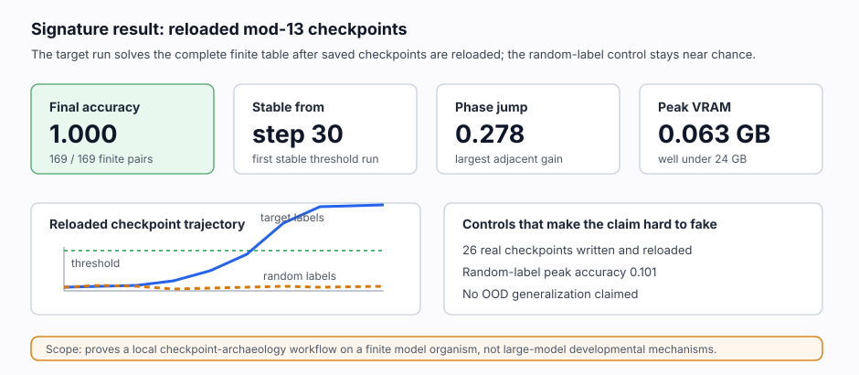

# [17.1] Checkpoint Archaeology and Mechanism Emergence

> **Notebooks: [exercises](../../exercises/part1_checkpoint_archaeology/17.1_Checkpoint_Archaeology_and_Mechanism_Emergence_exercises.ipynb) | [solutions](../../exercises/part1_checkpoint_archaeology/17.1_Checkpoint_Archaeology_and_Mechanism_Emergence_solutions.ipynb)**

> **Local-first extension.** This section implements the roadmap item on
> training dynamics and developmental interpretability. It is GT-0: the learner
> exercises use deterministic toy checkpoint trajectories, and the release
> report runs a real CUDA modular-addition checkpoint preflight with saved and
> reloaded checkpoint files.

```python
GT_TIER = "GT-0"
EXERCISE_ID = "17_1_checkpoint_archaeology_and_mechanism_emergence"
DIFFICULTY = 4
IMPORTANCE = 3
EXPECTED_RUNTIME = "seconds on toy contract; minutes on local real-model path"
REQUIRES_GPU = True
```

Please send any problems / bugs on the `#errata` channel in the [Slack group](https://info-arena.github.io/ARENA_img/slack.html), and ask any questions on the dedicated channels for this chapter of material.

If you want to change to dark mode, you can do this by clicking the three horizontal lines in the top-right, then navigating to Settings -> Theme.

Links to earlier chapters: [(0) Fundamentals](https://arena-chapter0-fundamentals.streamlit.app/), [(1) Transformer Interpretability](https://arena-chapter1-transformer-interp.streamlit.app/), [(2) RL](https://arena-chapter2-rl.streamlit.app/), [(3) LLM Evaluations](https://arena-chapter3-llm-evals.streamlit.app/), [(4) Alignment Science](https://arena-chapter4-alignment-science.streamlit.app/).

## Core Question

When can we say a mechanism emerged during training?

This section treats emergence as a measured checkpoint claim, not a visual
impression. A valid claim needs a threshold, a stable run above that threshold,
a phase-transition or timing report, and a negative control that fails to look
like the same mechanism.

The notebook first uses toy trajectories so every answer is checkable. The
release report then trains a tiny mod-13 addition MLP on CUDA, saves real
checkpoint files, reloads every checkpoint, recomputes table accuracy and loss,
and rejects a random-label checkpoint control evaluated against the true table.

This is a finite model-organism preflight. It proves the checkpoint-archaeology
workflow locally; it does not claim anything about large-model developmental
mechanisms.


## Learning Objectives

- Detect first threshold crossing and stable threshold crossing separately.
- Count monotonicity violations instead of smoothing away bad checkpoints.
- Locate the largest adjacent metric jump as a phase-transition warning.
- Reject random or label-shuffled controls that look too strong.
- Compare model-family toy trajectories without ranking the random control.
- Read a CUDA verification report without widening the claim beyond its finite model organism.


The loop is the main lesson: an emergence claim becomes reviewable only after
the checkpoint states are saved, reloaded, measured against a stable threshold,
compared to a phase-transition warning, and checked against a same-schedule
random-label control.


## Setup Code

```python
from __future__ import annotations

from dataclasses import dataclass
import sys
import tempfile
from pathlib import Path

import torch as t

chapter = "chapter17_training_dynamics"
section = "part1_checkpoint_archaeology"
root_dir = next(p for p in [Path.cwd(), *Path.cwd().parents] if (p / chapter).exists())
exercises_dir = root_dir / chapter / "exercises"
section_dir = exercises_dir / section

if str(root_dir) not in sys.path:
    sys.path.append(str(root_dir))
if str(exercises_dir) not in sys.path:
    sys.path.append(str(exercises_dir))

import part1_checkpoint_archaeology.tests as tests
import part1_checkpoint_archaeology.utils as utils

from arena_ext.training_dynamics import (
    DevelopmentalComparisonReport,
    MechanismEmergenceReport,
    PhaseTransitionReport,
    RandomControlReport,
    toy_training_trajectories,
)

MAIN = __name__ == "__main__"
```


# Checkpoint Series Helpers

### Exercise - find first and stable crossings

> ```yaml
> Difficulty: medium
> Importance: high
>
> You should spend 10-15 minutes on this exercise.
> ```

Implement the smallest useful checkpoint-archaeology primitive: validate a
checkpoint series, then report the first checkpoint step whose metric crosses a
threshold and the first checkpoint step whose next `min_consecutive` values all
stay above threshold.

```python
def _validate_checkpoint_series(
    steps: t.Tensor,
    values: t.Tensor,
) -> tuple[t.Tensor, t.Tensor]:
    steps = t.as_tensor(steps).flatten().long()
    values = t.as_tensor(values).flatten().float()
    raise NotImplementedError()


def first_threshold_crossing(
    steps: t.Tensor,
    values: t.Tensor,
    *,
    threshold: float,
) -> int | None:
    raise NotImplementedError()


def stable_threshold_step(
    steps: t.Tensor,
    values: t.Tensor,
    *,
    threshold: float,
    min_consecutive: int = 2,
) -> int | None:
    raise NotImplementedError()


tests.test_first_threshold_crossing_finds_first_crossing_and_validates_inputs(
    first_threshold_crossing
)
tests.test_stable_threshold_step_requires_consecutive_checkpoints(
    stable_threshold_step
)
```

<details>
<summary>Expected output</summary>

```text
All tests in `test_first_threshold_crossing_finds_first_crossing_and_validates_inputs` passed!
All tests in `test_stable_threshold_step_requires_consecutive_checkpoints` passed!
```

</details>

<details>
<summary>Help - how do first and stable crossings differ?</summary>

The first crossing is the first checkpoint whose metric reaches the threshold.
The stable crossing is the first checkpoint where a whole window stays above
threshold. A single spike can be interesting, but it is not a stable mechanism
emergence claim.

</details>

<details>
<summary>Common bugs</summary>

- Returning the tensor index rather than the checkpoint step.
- Using strict `>` and missing a value exactly equal to threshold.
- Sorting non-monotone checkpoints instead of rejecting them.
- Treating one lucky spike above threshold as stable emergence.

</details>

<details>
<summary>Solution</summary>

```python
def _validate_checkpoint_series(
    steps: t.Tensor,
    values: t.Tensor,
) -> tuple[t.Tensor, t.Tensor]:
    steps = t.as_tensor(steps).flatten().long()
    values = t.as_tensor(values).flatten().float()
    if steps.numel() == 0:
        raise ValueError("checkpoint series must be nonempty.")
    if steps.numel() != values.numel():
        raise ValueError("steps and values must have the same length.")
    if steps.numel() > 1 and not bool((steps[1:] > steps[:-1]).all().item()):
        raise ValueError("checkpoint steps must be strictly increasing.")
    if not bool(t.isfinite(values).all().item()):
        raise ValueError("checkpoint values must be finite.")
    return steps, values


def first_threshold_crossing(
    steps: t.Tensor,
    values: t.Tensor,
    *,
    threshold: float,
) -> int | None:
    steps, values = _validate_checkpoint_series(steps, values)
    crossed = values >= threshold
    if not bool(crossed.any().item()):
        return None
    index = int(t.nonzero(crossed, as_tuple=False)[0].item())
    return int(steps[index].item())


def stable_threshold_step(
    steps: t.Tensor,
    values: t.Tensor,
    *,
    threshold: float,
    min_consecutive: int = 2,
) -> int | None:
    if min_consecutive <= 0:
        raise ValueError("min_consecutive must be positive.")
    steps, values = _validate_checkpoint_series(steps, values)
    if values.numel() < min_consecutive:
        return None
    for index in range(values.numel() - min_consecutive + 1):
        window = values[index : index + min_consecutive]
        if bool((window >= threshold).all().item()):
            return int(steps[index].item())
    return None
```

</details>


# Emergence Reports

### Exercise - summarize a mechanism-emergence claim

> ```yaml
> Difficulty: medium
> Importance: high
>
> You should spend 10-15 minutes on this exercise.
> ```

A useful report should make the evidence auditable. Store the metric name,
threshold, first crossing, stable crossing, peak step, peak value, and
monotonicity violations.

```python
def monotonicity_violations(values: t.Tensor, *, tolerance: float = 0.0) -> int:
    raise NotImplementedError()


def mechanism_emergence_report(
    steps: t.Tensor,
    values: t.Tensor,
    *,
    metric_name: str = "mechanism_metric",
    threshold: float = 0.6,
    min_consecutive: int = 2,
    max_monotonicity_violations: int = 1,
) -> MechanismEmergenceReport:
    raise NotImplementedError()


steps, trajectories = toy_training_trajectories()
tests.test_mechanism_emergence_report_tracks_peak_and_monotonicity(
    mechanism_emergence_report
)
```

<details>
<summary>Expected output</summary>

```text
All tests in `test_mechanism_emergence_report_tracks_peak_and_monotonicity` passed!
```

</details>

<details>
<summary>Help - what should the report make auditable?</summary>

Do not hide the trajectory behind one boolean. The report should preserve the
threshold, both crossing times, the peak checkpoint, the peak metric, and the
number of monotonicity violations so a reviewer can tell whether the claim is
stable or just lucky.

</details>

<details>
<summary>Common bugs</summary>

- Reporting only the first threshold crossing and hiding whether it stayed above threshold.
- Ignoring finite-value checks, which lets NaNs pass as evidence.
- Computing the peak index on unsorted or mismatched checkpoint arrays.
- Counting small tolerated numerical noise as a real monotonicity failure.

</details>

<details>
<summary>Solution</summary>

```python
def monotonicity_violations(values: t.Tensor, *, tolerance: float = 0.0) -> int:
    values = t.as_tensor(values).flatten().float()
    if values.numel() == 0:
        raise ValueError("values must be nonempty.")
    if not bool(t.isfinite(values).all().item()):
        raise ValueError("values must be finite.")
    if values.numel() == 1:
        return 0
    decreases = values[:-1] - values[1:]
    return int((decreases > tolerance).sum().item())


def mechanism_emergence_report(
    steps: t.Tensor,
    values: t.Tensor,
    *,
    metric_name: str = "mechanism_metric",
    threshold: float = 0.6,
    min_consecutive: int = 2,
    max_monotonicity_violations: int = 1,
) -> MechanismEmergenceReport:
    steps, values = _validate_checkpoint_series(steps, values)
    first_crossing = first_threshold_crossing(steps, values, threshold=threshold)
    stable_from = stable_threshold_step(
        steps,
        values,
        threshold=threshold,
        min_consecutive=min_consecutive,
    )
    peak_index = int(t.argmax(values).item())
    violations = monotonicity_violations(values)
    return MechanismEmergenceReport(
        metric_name=metric_name,
        threshold=threshold,
        first_crossing_step=first_crossing,
        stable_from_step=stable_from,
        peak_step=int(steps[peak_index].item()),
        peak_value=float(values[peak_index].item()),
        monotonicity_violations=violations,
        emerged=stable_from is not None and violations <= max_monotonicity_violations,
    )
```

</details>


# Phase Transitions and Controls

### Exercise - detect adjacent jumps and reject random controls

> ```yaml
> Difficulty: medium
> Importance: high
>
> You should spend 10 minutes on this exercise.
> ```

The largest adjacent jump is not proof of a mechanism, but it is a useful
developmental warning. The random-control report is the opposite: it prevents a
mechanism story when the control trajectory also looks strong.

```python
def phase_transition_report(
    steps: t.Tensor,
    values: t.Tensor,
    *,
    metric_name: str = "mechanism_metric",
    min_jump: float = 0.25,
) -> PhaseTransitionReport:
    raise NotImplementedError()


def random_control_report(
    values: t.Tensor,
    *,
    metric_name: str = "random_control",
    max_allowed_value: float = 0.3,
) -> RandomControlReport:
    raise NotImplementedError()


tests.test_phase_transition_report_detects_largest_adjacent_jump(
    phase_transition_report
)
tests.test_random_control_report_rejects_overstrong_control(
    random_control_report
)
```

<details>
<summary>Expected output</summary>

```text
All tests in `test_phase_transition_report_detects_largest_adjacent_jump` passed!
All tests in `test_random_control_report_rejects_overstrong_control` passed!
```

</details>

<details>
<summary>Help - why is a phase jump not enough?</summary>

A large adjacent jump tells you where to inspect the trajectory, but it does not
prove the mechanism. The random-control report is what prevents you from telling
the same emergence story about a control run.

</details>

<details>
<summary>Common bugs</summary>

- Returning the pre-jump checkpoint instead of the post-jump checkpoint.
- Comparing every checkpoint to step zero rather than adjacent checkpoints.
- Looking only at the final control value instead of the control peak.
- Letting a strong random-label control pass because the target run also passed.

</details>

<details>
<summary>Solution</summary>

```python
def phase_transition_report(
    steps: t.Tensor,
    values: t.Tensor,
    *,
    metric_name: str = "mechanism_metric",
    min_jump: float = 0.25,
) -> PhaseTransitionReport:
    steps, values = _validate_checkpoint_series(steps, values)
    if values.numel() < 2:
        raise ValueError("at least two checkpoints are required.")
    jumps = values[1:] - values[:-1]
    transition_index = int(t.argmax(jumps).item())
    jump = float(jumps[transition_index].item())
    return PhaseTransitionReport(
        metric_name=metric_name,
        transition_step=int(steps[transition_index + 1].item()),
        pre_value=float(values[transition_index].item()),
        post_value=float(values[transition_index + 1].item()),
        jump=jump,
        phase_transition_detected=jump >= min_jump,
    )


def random_control_report(
    values: t.Tensor,
    *,
    metric_name: str = "random_control",
    max_allowed_value: float = 0.3,
) -> RandomControlReport:
    values = t.as_tensor(values).flatten().float()
    if values.numel() == 0:
        raise ValueError("control values must be nonempty.")
    if not bool(t.isfinite(values).all().item()):
        raise ValueError("control values must be finite.")
    peak_value = float(values.max().item())
    return RandomControlReport(
        metric_name=metric_name,
        peak_value=peak_value,
        max_allowed_value=max_allowed_value,
        control_passed=peak_value <= max_allowed_value,
    )
```

</details>


# Developmental Comparisons

### Exercise - compare toy model-family timing

> ```yaml
> Difficulty: medium
> Importance: medium
>
> You should spend 10 minutes on this exercise.
> ```

The toy trajectories include AR, JEPA, diffusion, Mamba-style curves, and a
random control. The random control should stay in the report, but it should not
be ranked as a model family.

```python
def developmental_comparison_report(
    steps: t.Tensor,
    family_values: dict[str, t.Tensor],
    *,
    threshold: float = 0.6,
    min_consecutive: int = 2,
    control_name: str = "random_control",
) -> DevelopmentalComparisonReport:
    raise NotImplementedError()


tests.test_developmental_comparison_excludes_random_control_from_ordering(
    developmental_comparison_report
)
```

<details>
<summary>Expected output</summary>

```text
All tests in `test_developmental_comparison_excludes_random_control_from_ordering` passed!
```

</details>

<details>
<summary>Help - why keep the random control in the report?</summary>

Dropping the control makes the comparison look cleaner, but it also hides the
main falsification check. Keep the random-control emergence step visible, while
excluding it from earliest/latest model-family ordering.

</details>

<details>
<summary>Common bugs</summary>

- Dropping the random control from the report entirely, making the control invisible.
- Including the random control in earliest/latest family ordering.
- Treating a missing stable step as zero and accidentally ranking a failed family first.
- Reporting a comparison even when no non-control family emerged.

</details>

<details>
<summary>Solution</summary>

```python
def developmental_comparison_report(
    steps: t.Tensor,
    family_values: dict[str, t.Tensor],
    *,
    threshold: float = 0.6,
    min_consecutive: int = 2,
    control_name: str = "random_control",
) -> DevelopmentalComparisonReport:
    if not family_values:
        raise ValueError("family_values must contain at least one trajectory.")
    emergence_steps: dict[str, int | None] = {}
    for family, values in family_values.items():
        emergence_steps[family] = stable_threshold_step(
            steps,
            values,
            threshold=threshold,
            min_consecutive=min_consecutive,
        )

    non_control_steps = {
        family: step
        for family, step in emergence_steps.items()
        if family != control_name and step is not None
    }
    if non_control_steps:
        earliest_family = min(non_control_steps, key=lambda item: (non_control_steps[item], item))
        latest_family = max(non_control_steps, key=lambda item: (non_control_steps[item], item))
    else:
        earliest_family = None
        latest_family = None

    non_control_count = sum(family != control_name for family in family_values)
    random_control_passed = True
    if control_name in family_values:
        random_control_passed = random_control_report(
            family_values[control_name],
            max_allowed_value=threshold,
        ).control_passed

    return DevelopmentalComparisonReport(
        threshold=threshold,
        emergence_steps=emergence_steps,
        earliest_family=earliest_family,
        latest_family=latest_family,
        random_control_passed=random_control_passed,
        all_non_control_emerged=len(non_control_steps) == non_control_count,
    )
```

</details>


# Live Checkpoint Archaeology

### Exercise - train, save, reload, analyze, and control a tiny run

> ```yaml
> Difficulty: medium
> Importance: high
>
> You should spend 15-20 minutes on this exercise.
> ```

The toy trajectories above are useful for learning the report logic, but
checkpoint archaeology is about saved training states. Implement a CPU-feasible
live smoke path on a tiny mod-13 addition model organism:

- train on the complete finite table of all `13 * 13 = 169` input pairs;
- save checkpoints on the declared schedule;
- reload each checkpoint before computing accuracy and loss;
- repeat the same schedule with random labels as a negative control;
- analyze the reloaded trajectories with your emergence, phase-transition, and
  control helpers.

This is not an OOD generalization benchmark. For mod-13 addition, the input
domain is finite and exhausted by the table; the claim is complete finite-domain
coverage, not extrapolation to unseen domains.

```python
def _train_save_reload_modular_run(
    checkpoint_dir: Path,
    *,
    device: t.device,
    seed: int,
    random_labels: bool = False,
) -> dict:
    t.manual_seed(seed)
    input_pairs, true_labels = utils.modular_addition_table(device=device)
    generator = t.Generator(device=device).manual_seed(seed + 1000)
    train_labels = true_labels
    if random_labels:
        train_labels = t.randint(
            0,
            utils.LIVE_MODULAR_ARCHAEOLOGY_MODULUS,
            true_labels.shape,
            generator=generator,
            device=device,
        )

    model = utils.TinyModularAdditionMLP().to(device)
    optimizer = t.optim.AdamW(
        model.parameters(),
        lr=utils.LIVE_MODULAR_ARCHAEOLOGY_LR,
        weight_decay=1e-3,
    )

    checkpoint_dir.mkdir(parents=True, exist_ok=True)
    checkpoint_paths: list[Path] = []
    checkpoint_steps = set(utils.LIVE_MODULAR_ARCHAEOLOGY_CHECKPOINT_STEPS)
    for step in range(utils.LIVE_MODULAR_ARCHAEOLOGY_STEPS + 1):
        if step in checkpoint_steps:
            raise NotImplementedError("save this checkpoint and record its path")
        if step == utils.LIVE_MODULAR_ARCHAEOLOGY_STEPS:
            break
        optimizer.zero_grad(set_to_none=True)
        loss = t.nn.functional.cross_entropy(model(input_pairs), train_labels)
        loss.backward()
        optimizer.step()

    reloaded_accuracies: list[float] = []
    reloaded_losses: list[float] = []
    for path in checkpoint_paths:
        raise NotImplementedError("reload this checkpoint and append accuracy/loss")

    return {
        "steps": t.tensor(utils.LIVE_MODULAR_ARCHAEOLOGY_CHECKPOINT_STEPS, device=device),
        "accuracies": t.tensor(reloaded_accuracies, device=device),
        "losses": t.tensor(reloaded_losses, device=device),
        "checkpoint_count": len(checkpoint_paths),
        "checkpoint_total_bytes": sum(path.stat().st_size for path in checkpoint_paths),
    }


def live_checkpoint_archaeology_smoke_test(
    checkpoint_root: Path | None = None,
    *,
    device: str | t.device = "cpu",
    seed: int = 0,
) -> dict:
    raise NotImplementedError()


tests.test_live_checkpoint_archaeology_smoke_test_trains_saves_reloads_and_controls(
    live_checkpoint_archaeology_smoke_test
)
```

<details>
<summary>Expected output</summary>

```text
All tests in `test_live_checkpoint_archaeology_smoke_test_trains_saves_reloads_and_controls` passed!
```

</details>

<details>
<summary>Help - why reload the checkpoint files?</summary>

Checkpoint archaeology is about historical training states, not the current
in-memory model. Reloading every saved file proves that the reported trajectory
could be reconstructed from artifacts rather than from a mutable live object.

</details>

<details>
<summary>Common bugs</summary>

- Measuring the in-memory model instead of reloading the saved checkpoint files.
- Saving only the final checkpoint, which hides emergence timing.
- Training the random-label control on a different schedule than the target run.
- Treating the complete mod-13 table as OOD evidence. It is exhaustive finite-domain evidence.

</details>

<details>
<summary>Solution</summary>

```python
def _train_save_reload_modular_run(
    checkpoint_dir: Path,
    *,
    device: t.device,
    seed: int,
    random_labels: bool = False,
) -> dict:
    t.manual_seed(seed)
    input_pairs, true_labels = utils.modular_addition_table(device=device)
    generator = t.Generator(device=device).manual_seed(seed + 1000)
    train_labels = true_labels
    if random_labels:
        train_labels = t.randint(
            0,
            utils.LIVE_MODULAR_ARCHAEOLOGY_MODULUS,
            true_labels.shape,
            generator=generator,
            device=device,
        )

    model = utils.TinyModularAdditionMLP().to(device)
    optimizer = t.optim.AdamW(
        model.parameters(),
        lr=utils.LIVE_MODULAR_ARCHAEOLOGY_LR,
        weight_decay=1e-3,
    )

    checkpoint_dir.mkdir(parents=True, exist_ok=True)
    checkpoint_paths: list[Path] = []
    checkpoint_steps = set(utils.LIVE_MODULAR_ARCHAEOLOGY_CHECKPOINT_STEPS)
    for step in range(utils.LIVE_MODULAR_ARCHAEOLOGY_STEPS + 1):
        if step in checkpoint_steps:
            path = checkpoint_dir / f"step_{step:04d}.pt"
            t.save(model.state_dict(), path)
            checkpoint_paths.append(path)
        if step == utils.LIVE_MODULAR_ARCHAEOLOGY_STEPS:
            break
        optimizer.zero_grad(set_to_none=True)
        loss = t.nn.functional.cross_entropy(model(input_pairs), train_labels)
        loss.backward()
        optimizer.step()

    reloaded_accuracies: list[float] = []
    reloaded_losses: list[float] = []
    for path in checkpoint_paths:
        accuracy, loss = utils.checkpoint_metrics_from_file(
            path,
            device=device,
            input_pairs=input_pairs,
            true_labels=true_labels,
        )
        reloaded_accuracies.append(accuracy)
        reloaded_losses.append(loss)

    return {
        "steps": t.tensor(utils.LIVE_MODULAR_ARCHAEOLOGY_CHECKPOINT_STEPS, device=device),
        "accuracies": t.tensor(reloaded_accuracies, device=device),
        "losses": t.tensor(reloaded_losses, device=device),
        "checkpoint_count": len(checkpoint_paths),
        "checkpoint_total_bytes": sum(path.stat().st_size for path in checkpoint_paths),
    }


def live_checkpoint_archaeology_smoke_test(
    checkpoint_root: Path | None = None,
    *,
    device: str | t.device = "cpu",
    seed: int = 0,
) -> dict:
    device = t.device(device)

    def _run(root: Path) -> dict:
        target = _train_save_reload_modular_run(
            root / "target_labels",
            device=device,
            seed=seed,
            random_labels=False,
        )
        random_control = _train_save_reload_modular_run(
            root / "random_labels",
            device=device,
            seed=seed,
            random_labels=True,
        )
        checkpoint_files = sorted(root.glob("*/*.pt"))
        target_emergence = mechanism_emergence_report(
            target["steps"],
            target["accuracies"],
            metric_name="modular_addition_table_accuracy",
            threshold=utils.LIVE_MODULAR_ARCHAEOLOGY_THRESHOLD,
            min_consecutive=utils.LIVE_MODULAR_ARCHAEOLOGY_MIN_CONSECUTIVE,
        )
        target_phase = phase_transition_report(
            target["steps"],
            target["accuracies"],
            metric_name="modular_addition_table_accuracy",
            min_jump=0.2,
        )
        random_report = random_control_report(
            random_control["accuracies"],
            metric_name="random_label_true_table_accuracy",
            max_allowed_value=0.2,
        )
        checkpoint_count = target["checkpoint_count"] + random_control["checkpoint_count"]
        final_accuracy = float(target["accuracies"][-1].item())
        random_control_peak = float(random_control["accuracies"].max().item())

        return {
            "preflight_passed": (
                target_emergence.emerged
                and final_accuracy >= 0.99
                and target_phase.phase_transition_detected
                and random_report.control_passed
                and random_control_peak <= 0.2
                and len(checkpoint_files) == checkpoint_count
            ),
            "device": str(device),
            "model_family": "tiny_modular_addition_mlp",
            "modulus": utils.LIVE_MODULAR_ARCHAEOLOGY_MODULUS,
            "table_example_count": utils.LIVE_MODULAR_ARCHAEOLOGY_MODULUS**2,
            "complete_finite_domain_evaluated": True,
            "ood_generalization_claimed": False,
            "generalization_scope": (
                "Complete finite mod-13 addition table (169/169 input pairs); "
                "no held-out OOD extrapolation is claimed."
            ),
            "checkpoint_steps": utils.LIVE_MODULAR_ARCHAEOLOGY_CHECKPOINT_STEPS,
            "checkpoint_count": checkpoint_count,
            "checkpoint_files_written": len(checkpoint_files),
            "checkpoint_total_bytes": (
                target["checkpoint_total_bytes"] + random_control["checkpoint_total_bytes"]
            ),
            "target_accuracy_trajectory": target["accuracies"].detach().cpu().tolist(),
            "target_loss_trajectory": target["losses"].detach().cpu().tolist(),
            "random_control_accuracy_trajectory": random_control["accuracies"]
            .detach()
            .cpu()
            .tolist(),
            "first_crossing_step": target_emergence.first_crossing_step,
            "stable_from_step": target_emergence.stable_from_step,
            "final_accuracy": final_accuracy,
            "phase_transition_step": target_phase.transition_step,
            "phase_transition_jump": target_phase.jump,
            "phase_transition_detected": target_phase.phase_transition_detected,
            "random_control_peak_accuracy": random_report.peak_value,
            "random_control_passed": random_report.control_passed,
            "real_checkpoints_reloaded": True,
        }

    if checkpoint_root is not None:
        root = Path(checkpoint_root)
        root.mkdir(parents=True, exist_ok=True)
        return _run(root)

    with tempfile.TemporaryDirectory(prefix="arena17_live_checkpoint_archaeology_") as tmp:
        return _run(Path(tmp))
```

</details>


# Notebook Contract

### Exercise - expose a smoke-test contract

> ```yaml
> Difficulty: medium
> Importance: high
>
> You should spend 10 minutes on this exercise.
> ```

The notebook contract should be JSON-serializable and should include the target
toy checks, the random-control gate, the family comparison, and the live
checkpoint smoke path.

```python
def checkpoint_emergence_smoke_test() -> dict:
    steps, trajectories = toy_training_trajectories()
    return mechanism_emergence_report(
        steps,
        trajectories["autoregressive"],
        metric_name="induction_probe_accuracy",
        threshold=0.6,
        min_consecutive=2,
    ).__dict__.copy()


def phase_transition_smoke_test() -> dict:
    steps, trajectories = toy_training_trajectories()
    return phase_transition_report(
        steps,
        trajectories["autoregressive"],
        metric_name="induction_probe_accuracy",
        min_jump=0.3,
    ).__dict__.copy()


def random_control_smoke_test() -> dict:
    _, trajectories = toy_training_trajectories()
    return random_control_report(
        trajectories["random_control"],
        metric_name="label_shuffled_probe",
        max_allowed_value=0.2,
    ).__dict__.copy()


def developmental_comparison_smoke_test() -> dict:
    steps, trajectories = toy_training_trajectories()
    return developmental_comparison_report(
        steps,
        trajectories,
        threshold=0.6,
        min_consecutive=2,
    ).__dict__.copy()


def run_smoke_test(cpu: bool = True) -> dict:
    _ = cpu
    return {
        "checkpoint_emergence": checkpoint_emergence_smoke_test(),
        "phase_transition": phase_transition_smoke_test(),
        "random_control": random_control_smoke_test(),
        "developmental_comparison": developmental_comparison_smoke_test(),
        "live_checkpoint_archaeology": live_checkpoint_archaeology_smoke_test(device="cpu"),
    }


tests.test_checkpoint_emergence_smoke_test(checkpoint_emergence_smoke_test)
tests.test_phase_transition_smoke_test(phase_transition_smoke_test)
tests.test_random_control_smoke_test(random_control_smoke_test)
tests.test_developmental_comparison_smoke_test(developmental_comparison_smoke_test)
tests.test_live_checkpoint_archaeology_smoke_test_trains_saves_reloads_and_controls(
    live_checkpoint_archaeology_smoke_test
)
tests.test_notebook_contract(run_smoke_test)
```

<details>
<summary>Expected output</summary>

```text
All tests in `test_checkpoint_emergence_smoke_test` passed!
All tests in `test_phase_transition_smoke_test` passed!
All tests in `test_random_control_smoke_test` passed!
All tests in `test_developmental_comparison_smoke_test` passed!
All tests in `test_live_checkpoint_archaeology_smoke_test_trains_saves_reloads_and_controls` passed!
All tests in `test_notebook_contract` passed!
```

</details>

<details>
<summary>Help - what belongs in the notebook contract?</summary>

The contract should include the toy threshold checks, random-control gate,
developmental comparison, and live train/save/reload path. A narrow final
boolean is not enough because it hides which part of the archaeology workflow
failed.

</details>

<details>
<summary>Common bugs</summary>

- Returning dataclass objects directly instead of JSON-serializable dictionaries.
- Dropping the random-control result from the notebook contract.
- Dropping the live checkpoint path, which leaves section tests dependent on checked-in JSON only.
- Renaming contract keys, which breaks the verification report runner.
- Treating the `cpu` argument as permission to fake GPU acceptance. It only keeps the learner smoke path CPU-feasible.

</details>

<details>
<summary>Solution</summary>

The code above is the intended solution once your helper functions are correct.
The full reference implementation is also available in
`chapter17_training_dynamics/exercises/part1_checkpoint_archaeology/solutions.py`.

</details>


# CUDA Checkpoint Preflight

The checked-in real path lives in `solutions.py` as `run_gpu_test`. It is not a
CPU fallback and it is not mocked:

```text
model: tiny modular-addition MLP
dataset: complete finite mod-13 addition table
checkpoints: 0, 2, 4, 6, 8, 10, 12, 15, 20, 30, 40, 60, 80
evidence source: metrics recomputed after reloading checkpoint files
target metric: exact table accuracy
negative control: same architecture trained on random labels, evaluated on the true table
generalization scope: exhaustive finite-domain coverage of 169/169 mod-13 pairs; no OOD claim
acceptance: stable emergence, phase jump, perfect final accuracy, random-control rejection, VRAM budget
```

The committed verification report records this fresh CUDA evidence:

```python
tests.test_committed_gpu_report_records_real_checkpoint_preflight()
```

<details>
<summary>Expected output</summary>

```text
All tests in `test_committed_gpu_report_records_real_checkpoint_preflight` passed!
```

</details>

<details>
<summary>CUDA evidence summary</summary>

From the checked report:

```text
gpu_name: NVIDIA GeForce RTX 5090 Laptop GPU
model_family: tiny_modular_addition_mlp
modulus: 13
table_example_count: 169
complete_finite_domain_evaluated: true
ood_generalization_claimed: false
checkpoint_count: 26
real_checkpoints_reloaded: true
first_crossing_step: 30
stable_from_step: 30
final_accuracy: 1.0
phase_transition_step: 30
phase_transition_jump: 0.2781065106391907
random_control_peak_accuracy: 0.10059171915054321
peak_vram_gb: 0.06275796890258789
within_vram_budget: true
```

</details>

<details>
<summary>Common bugs</summary>

- Reporting metrics from in-memory training instead of reloaded checkpoint files.
- Accepting a CPU path for `run_gpu_test`.
- Forgetting to train the random-label control on the same checkpoint schedule.
- Measuring only target accuracy and omitting the random-control peak.
- Committing persistent checkpoint files instead of using temporary training artifacts.
- Describing exhaustive mod-13 table coverage as OOD generalization.

</details>

## Signature Result



The accepted CUDA report is intentionally narrow:

| Check | Passing result |
|---|---:|
| Complete finite table evaluated | `169 / 169` mod-13 pairs |
| Real checkpoints written and reloaded | `26` |
| First threshold crossing | step `30` |
| Stable threshold crossing | step `30` |
| Final target accuracy | `1.0` |
| Largest adjacent phase jump | `0.2781` |
| Random-label peak true-table accuracy | `0.1006` |
| Peak VRAM | `0.063 GB` |

<details>
<summary>Interpreting the result</summary>

This supports one bounded claim: for this generated finite mod-13 model
organism, saved and reloaded checkpoints show stable table-accuracy emergence
at step 30, a real adjacent jump at the same step, and a random-label control
that does not look emergent. It does not rank real model families or claim
large-model developmental mechanisms.

</details>

## Limitations

Supported: deterministic toy checkpoint trajectories, stable-threshold and
phase-transition reports, same-schedule random-label controls, CPU-feasible
live checkpoint archaeology, and a CUDA finite-table mod-13 preflight with real
checkpoint save/reload evidence.

Not supported: large-model checkpoint archaeology, induction-head discovery in
released LLM checkpoints, grokking claims beyond this generated model organism,
OOD generalization, causal mechanism localization inside the trained MLP, or
comparisons between real AR/JEPA/diffusion/Mamba training runs.

Deferred: real transformer checkpoint archaeology, activation-level mechanism
localization across checkpoints, grokking curve replication with held-out
structure, model-family developmental timing on matched real tasks, and
checkpoint-difference circuit tracing.

## Further Research

Natural follow-up projects are to replace table accuracy with an actual
mechanistic probe, trace which weights or activations changed across the stable
crossing, compare checkpoint differences with activation patching, and test
whether the same archaeology workflow survives a held-out compositional task.
Those are deliberately not claimed by this first finite-table section.


## What Would Make This Result Bogus?

- The random-label checkpoint control also crossed the emergence threshold.
- The report used hand-written trajectories instead of saved and reloaded checkpoints.
- Stable emergence was claimed from a single threshold spike.
- The GPU report lacked CUDA device, peak VRAM, checkpoint count, and control metrics.
- The claim was presented as OOD evidence or as evidence about large models rather than this finite mod-13 model organism.
