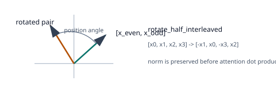
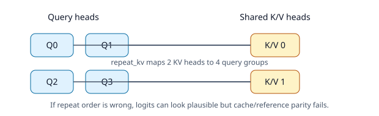
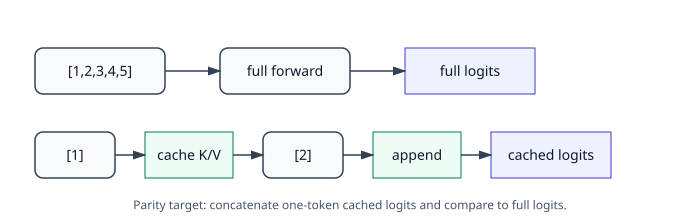

# [5.1] Gemma from Scratch


> **Local-first extension.** This section starts the modern architecture track. You will implement the core parts of a Gemma-style decoder, run tiny CPU smoke tests, and set up the parity checks that later exercises use for real Hugging Face checkpoints.

Please send any problems / bugs on the `#errata` channel in the [Slack group](https://info-arena.github.io/ARENA_img/slack.html), and ask any questions on the dedicated channels for this chapter of material.

If you want to change to dark mode, you can do this by clicking the three horizontal lines in the top-right, then navigating to Settings -> Theme.

Links to earlier chapters: [(0) Fundamentals](https://arena-chapter0-fundamentals.streamlit.app/), [(1) Transformer Interpretability](https://arena-chapter1-transformer-interp.streamlit.app/), [(2) RL](https://arena-chapter2-rl.streamlit.app/), [(3) LLM Evaluations](https://arena-chapter3-llm-evals.streamlit.app/), [(4) Alignment Science](https://arena-chapter4-alignment-science.streamlit.app/).


## Notebook metadata

```yaml
gt_tier: GT-0
exercise_id: 5_1_gemma_from_scratch
expected_runtime: seconds on toy contract; minutes on local real-model path
requires_gpu: true for the Hugging Face reference-parity block; false for the component exercises
```


# Reading Material

You should already be comfortable with the transformer-from-scratch material from Chapter 1. For this section, skim the Gemma technical report's architecture sections and the Hugging Face `GemmaForCausalLM` implementation enough to know which conventions must match exactly: RMSNorm offset weights, embedding scaling, RoPE layout, grouped-query attention, SwiGLU, and KV-cache behavior.


# Introduction


In Chapter 1, you built a GPT-style transformer from scratch and used TransformerLens to inspect GPT-2. This section updates that architecture literacy for modern open-weight models. Gemma-style decoders keep the same residual-stream backbone, but they add details which matter for both performance and interpretability:

* RMSNorm rather than LayerNorm.
* RoPE rather than learned absolute position embeddings.
* Grouped-query attention rather than one key/value head per query head.
* SwiGLU MLPs rather than vanilla GELU MLPs.
* Sliding-window/local attention in some configurations.
* KV caches as a first-class correctness surface.
* Gemma's embedding normalizer: token embeddings are scaled by
  `sqrt(hidden_size)` before the decoder stack.

The rule for this chapter is the rule from the roadmap: **an architecture implementation is not done until it is verified**. For this first pass, the notebook uses a tiny synthetic Gemma-style model so every learner can run the tests quickly. The same module names and parity helpers are designed to support later checkpoint loading and HF logit comparisons.

The checked GPU preflight also instantiates Hugging Face's
`transformers.GemmaForCausalLM` with a deterministic tiny config, copies its
matched random weights into the local implementation, and compares CUDA logits
and cache behavior. This verifies architecture parity without relying on gated
pretrained Gemma weights.

Here is the computation you are building. The diagram is deliberately small:
the point of this notebook is to make every arrow in the block feel boringly
concrete before you scale up to released checkpoints.


## Content & Learning Objectives

### 1. RMSNorm and RoPE

You will implement Gemma-style RMSNorm and rotary position embeddings. These are small components, but if either one is wrong, every downstream logit comparison will fail.



> ##### Learning Objectives
>
> * Understand Gemma's RMSNorm convention as a learned offset from unit scale.
> * Apply RoPE to even/odd feature pairs.
> * Verify that RoPE preserves per-token vector norms.

### 2. Grouped-query attention

You will implement attention where query heads outnumber key/value heads. This is the standard place for off-by-one and reshape bugs, so you will test the key/value repeat operation directly.



> ##### Learning Objectives
>
> * Reshape Q, K, and V tensors into head format.
> * Repeat key/value heads for grouped-query attention.
> * Keep the implementation compatible with KV-cache concatenation.

### 3. Local and global causal masking

Gemma-family models use attention patterns that may mix local and global behavior depending on the model. This section implements the local-window mask as a parameter of the tiny model, while keeping global attention as the default.

> ##### Learning Objectives
>
> * Build causal masks from absolute query/key positions.
> * Verify that future tokens and old out-of-window tokens are blocked.
> * Understand why cache-aware masks must account for `past_length`.

### 4. SwiGLU, decoder blocks, and KV-cache parity

You will assemble the decoder block and test that cached one-token-at-a-time logits match full-context logits.



> ##### Learning Objectives
>
> * Build a SwiGLU MLP.
> * Assemble pre-norm decoder layers.
> * Verify KV-cache parity, which is a required correctness check for later model-family notebooks.

### 5. Hugging Face reference parity

The verification path compares the from-scratch implementation against the real
Transformers Gemma reference architecture on CUDA.

> ##### Learning Objectives
>
> * Load a matched reference state dict into the local implementation.
> * Catch architecture-convention bugs such as missing embedding scaling.
> * Distinguish architecture parity from gated pretrained-weight validation.


## Setup code


```python
import sys
from dataclasses import dataclass
from pathlib import Path

import torch as t
import torch.nn as nn
import torch.nn.functional as F

chapter = "chapter5_modern_architectures"
section = "part1_gemma_from_scratch"
root_dir = next(p for p in [Path.cwd(), *Path.cwd().parents] if (p / chapter).exists())
exercises_dir = root_dir / chapter / "exercises"
section_dir = exercises_dir / section

if str(root_dir) not in sys.path:
    sys.path.append(str(root_dir))
if str(exercises_dir) not in sys.path:
    sys.path.append(str(exercises_dir))

import part1_gemma_from_scratch.tests as tests
import part1_gemma_from_scratch.utils as utils

from arena_ext import compare_logits, estimate_inference_memory
from arena_ext.gemma import GemmaConfig, load_matching_state_dict

MAIN = __name__ == "__main__"
PastKeyValue = tuple[t.Tensor, t.Tensor]
```


# RMSNorm and RoPE


### Exercise - implement Gemma RMSNorm

> ```yaml
> Difficulty: medium
> Importance: high
>
> You should spend up to 10-15 mins on this exercise.
> ```

Gemma-style RMSNorm normalizes by root mean square and multiplies by `1 + weight`, where the learned weight starts at zero. This means the initial layer is exactly unit-scale RMSNorm.

Fill in the implementation, then run the test immediately. This is not LayerNorm: there is no mean subtraction, and the learned scale is stored as an offset from one.

```python
class GemmaRMSNorm(nn.Module):
    def __init__(self, hidden_size: int, eps: float = 1e-6):
        super().__init__()
        self.weight = nn.Parameter(t.zeros(hidden_size))
        self.eps = eps

    def forward(self, x: t.Tensor) -> t.Tensor:
        raise NotImplementedError()


tests.test_gemma_rms_norm(GemmaRMSNorm)
```

<details><summary>Solution</summary>

```python
class GemmaRMSNorm(nn.Module):
    def __init__(self, hidden_size: int, eps: float = 1e-6):
        super().__init__()
        self.weight = nn.Parameter(t.zeros(hidden_size))
        self.eps = eps

    def forward(self, x: t.Tensor) -> t.Tensor:
        dtype = x.dtype
        x_float = x.float()
        rms = x_float.pow(2).mean(dim=-1, keepdim=True)
        normalized = x_float * t.rsqrt(rms + self.eps)
        return (normalized * (1.0 + self.weight.float())).to(dtype)
```
</details>

<details><summary>Expected output</summary>

```text
All tests in `test_gemma_rms_norm` passed!
```
</details>

<details><summary>Help - I implemented LayerNorm and parity fails</summary>

LayerNorm subtracts the mean; RMSNorm does not. Gemma's convention is also easy
to miss: the learned parameter is an offset, so the multiplier is `1 + weight`
rather than just `weight`. If this is wrong, shape tests can still pass, but
reference-logit parity will drift because every residual direction has been
slightly changed.

</details>

Common bug: implementing ordinary LayerNorm here will pass some shape checks but fail logit parity, because subtracting the mean changes the residual-stream direction.


### Exercise - implement RoPE

> ```yaml
> Difficulty: hard
> Importance: high
>
> You should spend up to 20-30 mins on this exercise.
> ```

RoPE rotates even/odd feature pairs. Implement the pair rotation, build interleaved cos/sin caches, and apply them using absolute `position_ids`. A rotation should preserve vector norm; this is the quickest sanity check before you try to match reference logits.

```python
def rotate_half_interleaved(x: t.Tensor) -> t.Tensor:
    raise NotImplementedError()


def build_rope_cache(
    seq_len: int,
    head_dim: int,
    *,
    base: float,
    device: t.device,
    dtype: t.dtype,
) -> tuple[t.Tensor, t.Tensor]:
    raise NotImplementedError()


def apply_rope(x: t.Tensor, cos: t.Tensor, sin: t.Tensor, position_ids: t.Tensor) -> t.Tensor:
    raise NotImplementedError()


tests.test_rotate_half_interleaved(rotate_half_interleaved)
tests.test_build_rope_cache(build_rope_cache)
tests.test_apply_rope(apply_rope, build_rope_cache)
```

<details><summary>Solution</summary>

```python
def rotate_half_interleaved(x: t.Tensor) -> t.Tensor:
    x_even = x[..., 0::2]
    x_odd = x[..., 1::2]
    return t.stack((-x_odd, x_even), dim=-1).flatten(start_dim=-2)


def build_rope_cache(
    seq_len: int,
    head_dim: int,
    *,
    base: float,
    device: t.device,
    dtype: t.dtype,
) -> tuple[t.Tensor, t.Tensor]:
    inv_freq = 1.0 / (base ** (t.arange(0, head_dim, 2, device=device).float() / head_dim))
    positions = t.arange(seq_len, device=device).float()
    freqs = t.outer(positions, inv_freq)
    angles = t.repeat_interleave(freqs, repeats=2, dim=-1)
    return angles.cos().to(dtype), angles.sin().to(dtype)


def apply_rope(x: t.Tensor, cos: t.Tensor, sin: t.Tensor, position_ids: t.Tensor) -> t.Tensor:
    cos = cos[position_ids].unsqueeze(1)
    sin = sin[position_ids].unsqueeze(1)
    return (x * cos) + (rotate_half_interleaved(x) * sin)
```
</details>

<details><summary>Expected output</summary>

```text
All tests in `test_rotate_half_interleaved` passed!
All tests in `test_build_rope_cache` passed!
All tests in `test_apply_rope` passed!
```
</details>

<details><summary>Help - my RoPE shapes broadcast incorrectly</summary>

Track the intended shape at each step. Your activation is shaped like
`[batch, heads, seq, head_dim]`; the cos/sin cache starts as
`[max_seq, head_dim]`; indexing with `position_ids` gives `[batch, seq,
head_dim]`; and the attention-head axis is restored with `unsqueeze(1)`.
If you accidentally unsqueeze the sequence axis, the code may broadcast while
rotating the wrong positions.

</details>

Common bug: many RoPE implementations rotate the first half against the second half. Gemma's HF implementation uses interleaved even/odd pairs in this tiny parity path.


# Attention masks


### Exercise - implement grouped-query head repetition and sliding-window causal masking

> ```yaml
> Difficulty: medium
> Importance: high
>
> You should spend up to 10-15 mins on this exercise.
> ```

In a cached generation step, the query positions are absolute positions in the full sequence, not positions starting at zero. The mask below has two query tokens at absolute positions 3 and 4, five key tokens at positions 0-4, and a window of 3 tokens.

```python
def repeat_kv(hidden_states: t.Tensor, repeats: int) -> t.Tensor:
    raise NotImplementedError()


def build_causal_attention_mask(
    *,
    query_length: int,
    key_length: int,
    past_length: int,
    sliding_window: int | None,
    device: t.device,
) -> t.Tensor:
    raise NotImplementedError()


tests.test_repeat_kv(repeat_kv)
tests.test_sliding_window_mask(build_causal_attention_mask)
```

<details><summary>Solution</summary>

```python
def repeat_kv(hidden_states: t.Tensor, repeats: int) -> t.Tensor:
    if repeats == 1:
        return hidden_states
    batch, kv_heads, seq_len, head_dim = hidden_states.shape
    hidden_states = hidden_states[:, :, None, :, :].expand(
        batch, kv_heads, repeats, seq_len, head_dim
    )
    return hidden_states.reshape(batch, kv_heads * repeats, seq_len, head_dim)


def build_causal_attention_mask(
    *,
    query_length: int,
    key_length: int,
    past_length: int,
    sliding_window: int | None,
    device: t.device,
) -> t.Tensor:
    query_positions = t.arange(past_length, past_length + query_length, device=device)[:, None]
    key_positions = t.arange(key_length, device=device)[None, :]
    allowed = key_positions <= query_positions
    if sliding_window is not None:
        allowed = allowed & (key_positions >= query_positions - sliding_window + 1)
    return allowed[None, None, :, :]
```
</details>

<details><summary>Expected output</summary>

```text
All tests in `test_repeat_kv` passed!
All tests in `test_sliding_window_mask` passed!
```
</details>

<details><summary>Help - my cache parity fails only after the first token</summary>

That usually means the cached step is treating its query as position zero.
During generation, the first new query after a prompt of length `n` is at
absolute position `n`, and it can attend to keys `0..n`. Build masks from
absolute query/key positions, and apply RoPE with those same absolute
`position_ids`.

</details>

Common bug: when using a cache, the first query token in the current forward pass is not position zero. It is position `past_length`, and the mask must be built from absolute query positions.


# Tiny Gemma model


### Exercise - build a tiny Gemma-style decoder

> ```yaml
> Difficulty: hard
> Importance: high
>
> You should spend up to 20-40 mins on this exercise.
> ```

The tiny config is deliberately small enough to run as a smoke test. It has the same structural features as a larger Gemma-style model: RMSNorm, RoPE, grouped-query attention, SwiGLU, tied embedding/lm-head weights, and optional sliding-window attention.

```python
@dataclass(frozen=True)
class GemmaCausalLMOutput:
    logits: t.Tensor
    past_key_values: tuple[PastKeyValue, ...] | None = None


class GemmaMLP(nn.Module):
    def __init__(self, config: GemmaConfig):
        super().__init__()
        self.gate_proj = nn.Linear(config.hidden_size, config.intermediate_size, bias=False)
        self.up_proj = nn.Linear(config.hidden_size, config.intermediate_size, bias=False)
        self.down_proj = nn.Linear(config.intermediate_size, config.hidden_size, bias=False)

    def forward(self, x: t.Tensor) -> t.Tensor:
        raise NotImplementedError()


class GemmaAttention(nn.Module):
    def __init__(self, config: GemmaConfig, layer_idx: int):
        super().__init__()
        self.config = config
        self.layer_idx = layer_idx
        self.num_heads = config.num_attention_heads
        self.num_key_value_heads = config.num_key_value_heads
        self.head_dim = config.head_dim
        self.num_key_value_groups = self.num_heads // self.num_key_value_heads
        self.q_proj = nn.Linear(config.hidden_size, self.num_heads * self.head_dim, bias=config.attention_bias)
        self.k_proj = nn.Linear(config.hidden_size, self.num_key_value_heads * self.head_dim, bias=config.attention_bias)
        self.v_proj = nn.Linear(config.hidden_size, self.num_key_value_heads * self.head_dim, bias=config.attention_bias)
        self.o_proj = nn.Linear(self.num_heads * self.head_dim, config.hidden_size, bias=config.attention_bias)

    def _shape(self, x: t.Tensor, heads: int) -> t.Tensor:
        raise NotImplementedError()

    def forward(
        self,
        hidden_states: t.Tensor,
        *,
        position_ids: t.Tensor,
        cos: t.Tensor,
        sin: t.Tensor,
        attention_mask: t.Tensor | None = None,
        past_key_value: PastKeyValue | None = None,
        use_cache: bool = False,
    ) -> tuple[t.Tensor, PastKeyValue | None]:
        raise NotImplementedError()


class GemmaDecoderLayer(nn.Module):
    def __init__(self, config: GemmaConfig, layer_idx: int):
        super().__init__()
        self.self_attn = GemmaAttention(config, layer_idx=layer_idx)
        self.mlp = GemmaMLP(config)
        self.input_layernorm = GemmaRMSNorm(config.hidden_size, eps=config.rms_norm_eps)
        self.post_attention_layernorm = GemmaRMSNorm(config.hidden_size, eps=config.rms_norm_eps)

    def forward(
        self,
        hidden_states: t.Tensor,
        *,
        position_ids: t.Tensor,
        cos: t.Tensor,
        sin: t.Tensor,
        attention_mask: t.Tensor | None = None,
        past_key_value: PastKeyValue | None = None,
        use_cache: bool = False,
    ) -> tuple[t.Tensor, PastKeyValue | None]:
        raise NotImplementedError()


class GemmaModel(nn.Module):
    def __init__(self, config: GemmaConfig):
        super().__init__()
        self.config = config
        self.embed_tokens = nn.Embedding(config.vocab_size, config.hidden_size)
        self.layers = nn.ModuleList([GemmaDecoderLayer(config, i) for i in range(config.num_hidden_layers)])
        self.norm = GemmaRMSNorm(config.hidden_size, eps=config.rms_norm_eps)

    def forward(
        self,
        input_ids: t.Tensor,
        *,
        attention_mask: t.Tensor | None = None,
        past_key_values: tuple[PastKeyValue, ...] | None = None,
        use_cache: bool = False,
    ) -> tuple[t.Tensor, tuple[PastKeyValue, ...] | None]:
        raise NotImplementedError()


class GemmaForCausalLM(nn.Module):
    def __init__(self, config: GemmaConfig):
        super().__init__()
        self.config = config
        self.model = GemmaModel(config)
        self.lm_head = nn.Linear(config.hidden_size, config.vocab_size, bias=False)
        if config.tie_word_embeddings:
            self.lm_head.weight = self.model.embed_tokens.weight

    def forward(
        self,
        input_ids: t.Tensor,
        *,
        attention_mask: t.Tensor | None = None,
        past_key_values: tuple[PastKeyValue, ...] | None = None,
        use_cache: bool = False,
    ) -> GemmaCausalLMOutput:
        raise NotImplementedError()


def cache_parity_report(model: GemmaForCausalLM, input_ids: t.Tensor, *, atol: float = 1e-5) -> dict:
    raise NotImplementedError()


def make_tiny_gemma_config(sliding_window: int | None = None) -> GemmaConfig:
    return GemmaConfig(
        vocab_size=31,
        hidden_size=16,
        intermediate_size=32,
        num_hidden_layers=2,
        num_attention_heads=4,
        num_key_value_heads=2,
        max_position_embeddings=64,
        sliding_window=sliding_window,
    )


def make_tiny_gemma(seed: int = 0, sliding_window: int | None = None) -> GemmaForCausalLM:
    t.manual_seed(seed)
    return GemmaForCausalLM(make_tiny_gemma_config(sliding_window=sliding_window))


model = make_tiny_gemma()
input_ids = t.tensor([[1, 2, 3, 4]])
logits = model(input_ids).logits
tests.test_gemma_mlp_matches_swiglu_formula(GemmaMLP)
tests.test_tiny_gemma_forward_shape(make_tiny_gemma)
tests.test_tiny_gemma_matches_reference_decoder(GemmaForCausalLM)
```

<details><summary>Solution</summary>

The full decoder solution is longer than the component snippets above. Open
`chapter5_modern_architectures/exercises/part1_gemma_from_scratch/solutions.py`
or the paired solution notebook and compare your implementation against:

```python
GemmaMLP
GemmaAttention
GemmaDecoderLayer
GemmaModel
GemmaForCausalLM
cache_parity_report
```

</details>

<details><summary>Expected output</summary>

```text
All tests in `test_gemma_mlp_matches_swiglu_formula` passed!
All tests in `test_tiny_gemma_forward_shape` passed!
All tests in `test_tiny_gemma_matches_reference_decoder` passed!
```
</details>

<details><summary>Help - what does HF parity prove, and what does it not prove?</summary>

It proves that this implementation matches the public `transformers`
Gemma architecture on a deterministic tiny config with copied random weights.
That catches architecture-convention bugs: embedding scaling, RMSNorm offsets,
RoPE layout, grouped-query repetition, cache concatenation, masks, and tied
weights. It does not prove that a gated pretrained Gemma checkpoint has been
loaded, that real-token generation quality is good, or that a mechanistic
claim about a pretrained Gemma circuit is true.

</details>

Common bug: if the reference-decoder test fails after loading an identical state dict, check embedding scaling by `sqrt(hidden_size)`, RoPE position IDs during cached generation, tied embedding weights, and whether `attention_mask` is extended when `past_key_values` is non-empty.


### Exercise - verify KV-cache parity

> ```yaml
> Difficulty: hard
> Importance: high
>
> You should spend up to 15-25 mins on this exercise.
> ```

This is the most important test in the section. Full-context logits and one-token-at-a-time cached logits should match. If this fails, common culprits are RoPE position IDs, cache concatenation order, or causal masks that forgot `past_length`.

```python
model = make_tiny_gemma(seed=0)
input_ids = t.tensor([[1, 2, 3, 4, 5]])
report = cache_parity_report(model, input_ids, atol=1e-5)
utils.print_report("KV-cache parity", report)
assert report["passed"], report

tests.test_tiny_gemma_cache_parity(make_tiny_gemma)
```


# HF parity path


### Exercise - synthetic checkpoint parity

> ```yaml
> Difficulty: medium
> Importance: high
>
> You should spend up to 10-15 mins on this exercise.
> ```

Before loading a real checkpoint, test the parity harness on an exact clone. This proves that the metric path is wired correctly.

```python
model = make_tiny_gemma(seed=1)
clone = make_tiny_gemma(seed=999)
clone.load_state_dict(model.state_dict())

input_ids = t.tensor([[1, 5, 8, 13]])
parity = compare_logits(model(input_ids).logits, clone(input_ids).logits, k=5)
utils.print_report("Clone parity", parity.__dict__)

assert parity.passed(max_abs_diff=0.0, mse=0.0, kl_divergence=0.0, topk_agreement=1.0)
```


### Bonus - real Hugging Face checkpoint parity

The full exercise path is to load a small Gemma-family checkpoint with Hugging Face, copy matching weights into this implementation, and compare logits on fixed prompts. The helper `load_matching_state_dict` reports exactly which keys loaded, which were missing, and which were skipped because their shape did not match.

For a full pass, record:

```text
checkpoint id
tokenizer id and chat template
dtype
device
prompt set
max absolute logit difference
MSE
KL divergence
top-k agreement
greedy generation equality where deterministic
KV-cache parity
peak VRAM
```

Do not accept a checkpoint implementation without this evidence.


# Memory budget


### Exercise - estimate local Gemma inference memory

> ```yaml
> Difficulty: medium
> Importance: high
>
> You should spend up to 10 mins on this exercise.
> ```

Use the Phase 1 memory estimator before loading a checkpoint.

```python
budget = estimate_inference_memory(
    num_parameters=1_000_000_000,
    dtype="bfloat16",
    batch_size=1,
    context_length=2048,
    hidden_size=2048,
    num_layers=18,
    num_key_value_heads=8,
    head_dim=256,
    overhead_gb=1.5,
)

utils.print_report("Estimated memory", budget.as_dict())
assert budget.fits(24.0)
```


# Signature result

The committed CUDA report for this section was regenerated on an RTX 5090 Laptop
GPU with `torch 2.12.1+cu132`. It uses deterministic tiny weights copied from
`transformers.GemmaForCausalLM`, so the numbers below are architecture-parity
evidence, not a claim about gated pretrained Gemma weights.

| Check | Observed result |
| --- | ---: |
| HF tiny-reference max absolute logit diff | `6.8769e-05` |
| HF tiny-reference MSE | `5.3475e-10` |
| HF tiny-reference KL divergence | `1.4670e-08` |
| HF tiny-reference top-k agreement | `1.0000` |
| Local cache max absolute diff | `1.9073e-06` |
| HF-reference cache max absolute diff | `4.4703e-08` |
| Parameter memory estimate | `1.8626 GB` |
| KV-cache memory estimate | `0.2813 GB` |
| Activation memory estimate | `0.0156 GB` |
| Overhead estimate | `1.5000 GB` |
| Total memory estimate | `3.6595 GB` |
| Measured peak VRAM | `0.0313 GB` |

The deterministic generation check is deliberately tiny and inspectable:

```text
prompt:       [1, 5, 8, 13]
local:        [1, 5, 8, 13, 13, 13, 13, 13]
HF reference: [1, 5, 8, 13, 13, 13, 13, 13]
```

<details><summary>Interpreting this result</summary>

The exciting part is not that token `13` repeats. The exciting part is that the
from-scratch model, the cached generation path, and the independent Hugging Face
reference all agree under a configuration with RMSNorm, RoPE, grouped-query
attention, SwiGLU, tied embeddings, and the Gemma embedding scale. This is the
architecture contract later sections need before they can make stronger claims
about real checkpoints.

</details>

<details><summary>Limitations</summary>

This is a GT-0 architecture contract. It does not load gated pretrained Gemma
weights, evaluate natural-language quality, or validate a real Gemma
mechanistic-interpretability claim. Those require an authenticated checkpoint
path, fixed prompt suite, tokenizer parity, generation parity on real prompts,
and the same kind of causal controls used elsewhere in ARENA.

</details>


# Notebook contract


This section exposes the standard extension entry points:

```python
def run_smoke_test(cpu: bool = True) -> dict:
    ...

def run_gpu_test(max_vram_gb: float = 24.0) -> dict:
    ...

def run_full_experiment():
    ...
```

The smoke test passes only if:

```text
RMSNorm matches the manual formula
RoPE preserves vector norms
sliding-window causal masking matches expected positions
tiny-model forward shape is correct
full-context logits and cached logits match within tolerance
clone parity is exact
memory budget is printed
```

The next section should build on this by doing real checkpoint parity and then using Gemma Scope features rather than training large SAEs from scratch.
