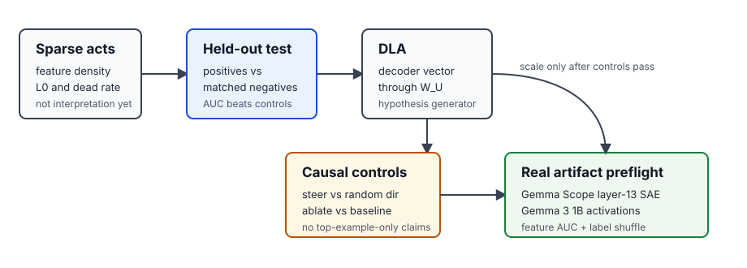

# [5.2] Gemma Scope and Feature Steering


> **Local-first extension.** This section uses released Gemma Scope-style sparse features as the bridge from modern architectures to frontier interpretability. You will implement the validation machinery locally, then use the GPU path to verify a pinned Gemma Scope SAE artifact.

Please send any problems / bugs on the `#errata` channel in the [Slack group](https://info-arena.github.io/ARENA_img/slack.html), and ask any questions on the dedicated channels for this chapter of material.

If you want to change to dark mode, you can do this by clicking the three horizontal lines in the top-right, then navigating to Settings -> Theme.

Links to earlier chapters: [(0) Fundamentals](https://arena-chapter0-fundamentals.streamlit.app/), [(1) Transformer Interpretability](https://arena-chapter1-transformer-interp.streamlit.app/), [(2) RL](https://arena-chapter2-rl.streamlit.app/), [(3) LLM Evaluations](https://arena-chapter3-llm-evals.streamlit.app/), [(4) Alignment Science](https://arena-chapter4-alignment-science.streamlit.app/).


## Notebook Metadata

```yaml
gt_tier: GT-3
exercise_id: 5_2_gemma_scope_and_feature_steering
expected_runtime: 45-75 minutes for CPU exercises; a few minutes for the CUDA artifact preflight
requires_gpu: true for the Gemma Scope artifact preflight; false for the implementation exercises
```


# Reading Material

You should already be comfortable with the toy-superposition and SAE material from Chapter 1. For this section, skim the Gemma Scope release notes and the sparse feature circuits reading enough to understand the basic experimental contract: sparse reconstruction metrics, top-activating examples, held-out validation, direct logit attribution, steering, ablation, and random controls.


# Introduction


In the previous section, you implemented a Gemma-style decoder. The next question is: how do we interpret a modern Gemma-family model without training a huge sparse autoencoder ourselves?

The practical answer is to use released sparse feature artifacts, but a feature interpretation is not accepted because a few max-activating examples look plausible. A real claim should survive held-out positives, matched negatives, random controls, steering, ablation, and a simple baseline.

This page is deliberately split into two levels:

* **Visible exercise ladder:** synthetic tensors, exact tests, and local implementations of the metrics and interventions.
* **GPU verification path:** pinned `google/gemma-scope-2-1b-it` layer-13 residual JumpReLU SAE artifact at revision `b0fa29457c3601df0a70c48a15534c738d7c10e0`, with shape/finiteness checks, JumpReLU encode/decode on CUDA, and authenticated `google/gemma-3-1b-it` residual activations scored through the SAE.

The current report records authenticated Gemma 3 1B IT access and validates a semantic feature hypothesis on real Gemma activations against random-feature and label-shuffle controls. It still keeps steering and ablation claims scoped to the controlled course ladder rather than claiming a broad Gemma Scope replication.

The ladder below is the key idea for this notebook. Top examples are allowed to
suggest a feature hypothesis, but they do not validate it. A feature claim only
starts to become course evidence after held-out positives, matched negatives,
random controls, steering or ablation controls, and a real-artifact preflight.




## Content & Learning Objectives

### 1. SAE reconstruction and sparsity metrics

> ##### Learning Objectives
>
> * Compute L0, feature density, dead-feature fraction, MSE, KL, and loss recovered.
> * Distinguish reconstruction quality from feature interpretability.
> * Understand which metrics should be logged in a reproducibility footer.

### 2. Direct logit attribution

> ##### Learning Objectives
>
> * Project decoder vectors through the unembedding matrix.
> * Use DLA as a hypothesis generator.
> * Avoid treating direct logit effects as full causal evidence.

### 3. Held-out feature validation

> ##### Learning Objectives
>
> * Use positives and matched negatives instead of top examples alone.
> * Compute AUC with tied scores.
> * Set a transparent threshold and report held-out accuracy.

### 4. Steering and ablation controls

> ##### Learning Objectives
>
> * Add decoder-vector directions to the residual stream.
> * Compare target-score changes against random matched directions.
> * Ablate features and check whether the target metric falls.


## Setup Code


```python
import sys
from dataclasses import dataclass
from pathlib import Path
from typing import Literal

import torch as t
import torch.nn.functional as F

chapter = "chapter5_modern_architectures"
section = "part2_gemma_scope_feature_steering"
root_dir = next(p for p in [Path.cwd(), *Path.cwd().parents] if (p / chapter).exists())
exercises_dir = root_dir / chapter / "exercises"
section_dir = exercises_dir / section

if str(root_dir) not in sys.path:
    sys.path.append(str(root_dir))
if str(exercises_dir) not in sys.path:
    sys.path.append(str(exercises_dir))

import part2_gemma_scope_feature_steering.tests as tests
import part2_gemma_scope_feature_steering.utils as utils

from arena_ext.gemma_scope import gemma_scope_artifact_preflight

MAIN = __name__ == "__main__"


@dataclass(frozen=True)
class SAEReconstructionMetrics:
    l0: float
    feature_density_mean: float
    dead_feature_fraction: float
    reconstruction_mse: float
    reconstruction_kl: float | None = None
    loss_recovered: float | None = None


@dataclass(frozen=True)
class FeatureDetectionReport:
    auc: float
    positive_mean: float
    negative_mean: float
    separation: float
    threshold_accuracy: float


@dataclass(frozen=True)
class SteeringComparisonReport:
    baseline_mean: float
    steered_mean: float
    random_mean: float
    steered_delta: float
    random_delta: float
    passes_control: bool
```


# SAE Metrics


### Exercise - compute feature density, L0, and dead-feature fraction

> ```yaml
> Difficulty: medium
> Importance: high
>
> You should spend up to 10-15 mins on this exercise.
> ```

Start with sparse feature activations of shape `(..., features)`. A feature fires when its activation is above `threshold`.

```python
def feature_density(feature_acts: t.Tensor, threshold: float = 0.0) -> t.Tensor:
    raise NotImplementedError()


def l0(feature_acts: t.Tensor, threshold: float = 0.0) -> float:
    raise NotImplementedError()


def dead_feature_fraction(feature_acts: t.Tensor, threshold: float = 0.0) -> float:
    raise NotImplementedError()


tests.test_feature_density_l0_and_dead_fraction_match_reference(
    feature_density,
    l0,
    dead_feature_fraction,
)
```

<details><summary>Solution</summary>

```python
def feature_density(feature_acts: t.Tensor, threshold: float = 0.0) -> t.Tensor:
    if feature_acts.ndim < 2:
        raise ValueError("feature_acts must have at least batch and feature dimensions.")
    fired = feature_acts > threshold
    reduce_dims = tuple(range(feature_acts.ndim - 1))
    return fired.float().mean(dim=reduce_dims)


def l0(feature_acts: t.Tensor, threshold: float = 0.0) -> float:
    return (feature_acts > threshold).float().sum(dim=-1).mean().item()


def dead_feature_fraction(feature_acts: t.Tensor, threshold: float = 0.0) -> float:
    return feature_density(feature_acts, threshold=threshold).eq(0).float().mean().item()
```
</details>

<details><summary>Expected output</summary>

```text
All tests in `test_feature_density_l0_and_dead_fraction_match_reference` passed!
```
</details>

Common bug: reducing over the feature dimension when computing density. Density should return one value per feature.

<details><summary>Help - why not just report the biggest activations?</summary>

Top activations are a search tool, not a validation set. A feature can have
beautiful max-activating examples and still fire for unrelated prompts, token
frequency, punctuation, or dataset artifacts. Density and L0 tell you whether
the sparse code is usable, but they do not tell you what a feature means.

</details>


### Exercise - compute reconstruction, KL, and loss-recovered metrics

> ```yaml
> Difficulty: medium
> Importance: high
>
> You should spend up to 15-20 mins on this exercise.
> ```

In a real Gemma Scope run, `activations` come from a model hook, `reconstructed_activations` from the SAE decoder, and `feature_acts` from the sparse encoder. The same metric function should also support optional logit KL and loss recovered.

```python
def mean_kl_divergence(reference_logits: t.Tensor, reconstructed_logits: t.Tensor) -> float:
    raise NotImplementedError()


def loss_recovered(
    *,
    clean_loss: float,
    reconstructed_loss: float,
    zero_ablation_loss: float,
) -> float:
    raise NotImplementedError()


def compute_sae_reconstruction_metrics(
    *,
    activations: t.Tensor,
    reconstructed_activations: t.Tensor,
    feature_acts: t.Tensor,
    threshold: float = 0.0,
    reference_logits: t.Tensor | None = None,
    reconstructed_logits: t.Tensor | None = None,
    clean_loss: float | None = None,
    reconstructed_loss: float | None = None,
    zero_ablation_loss: float | None = None,
) -> SAEReconstructionMetrics:
    raise NotImplementedError()


tests.test_compute_sae_reconstruction_metrics_matches_manual_and_reference(
    compute_sae_reconstruction_metrics,
)
```

<details><summary>Solution</summary>

```python
def mean_kl_divergence(reference_logits: t.Tensor, reconstructed_logits: t.Tensor) -> float:
    if reference_logits.shape != reconstructed_logits.shape:
        raise ValueError("reference_logits and reconstructed_logits must match.")
    ref_log_probs = F.log_softmax(reference_logits.float(), dim=-1)
    recon_log_probs = F.log_softmax(reconstructed_logits.float(), dim=-1)
    ref_probs = ref_log_probs.exp()
    return (ref_probs * (ref_log_probs - recon_log_probs)).sum(dim=-1).mean().item()


def loss_recovered(*, clean_loss: float, reconstructed_loss: float, zero_ablation_loss: float) -> float:
    denominator = zero_ablation_loss - clean_loss
    if denominator == 0:
        raise ValueError("zero_ablation_loss and clean_loss must differ.")
    return (zero_ablation_loss - reconstructed_loss) / denominator


def compute_sae_reconstruction_metrics(...):
    if activations.shape != reconstructed_activations.shape:
        raise ValueError("activations and reconstructed_activations must match.")
    reconstruction_kl = None
    if reference_logits is not None or reconstructed_logits is not None:
        if reference_logits is None or reconstructed_logits is None:
            raise ValueError("Provide both logits tensors, or neither.")
        reconstruction_kl = mean_kl_divergence(reference_logits, reconstructed_logits)
    recovered = None
    if clean_loss is not None or reconstructed_loss is not None or zero_ablation_loss is not None:
        if clean_loss is None or reconstructed_loss is None or zero_ablation_loss is None:
            raise ValueError("Provide clean, reconstructed, and zero-ablation losses together.")
        recovered = loss_recovered(
            clean_loss=clean_loss,
            reconstructed_loss=reconstructed_loss,
            zero_ablation_loss=zero_ablation_loss,
        )
    return SAEReconstructionMetrics(
        l0=l0(feature_acts, threshold=threshold),
        feature_density_mean=feature_density(feature_acts, threshold=threshold).mean().item(),
        dead_feature_fraction=dead_feature_fraction(feature_acts, threshold=threshold),
        reconstruction_mse=F.mse_loss(reconstructed_activations.float(), activations.float()).item(),
        reconstruction_kl=reconstruction_kl,
        loss_recovered=recovered,
    )
```
</details>

<details><summary>Expected output</summary>

```text
All tests in `test_compute_sae_reconstruction_metrics_matches_manual_and_reference` passed!
```
</details>

Common bug: computing `KL(reconstructed || clean)` instead of `KL(clean || reconstructed)`. State the direction and keep it consistent across reports.

<details><summary>Help - interpreting loss recovered</summary>

Loss recovered compares the SAE reconstruction against two baselines: the clean
activation and a destructive zero ablation. A score near one means the
reconstruction preserves most of the loss-relevant information under this
metric. It still does not mean every individual feature is interpretable.

</details>


# Direct Logit Attribution


### Exercise - project feature directions into vocabulary space

> ```yaml
> Difficulty: medium
> Importance: high
>
> You should spend up to 10 mins on this exercise.
> ```

Direct logit attribution projects a feature decoder vector through the unembedding. This is useful for discovering candidate features; it is not by itself a causal validation.

```python
def direct_logit_attribution(
    decoder_vectors: t.Tensor,
    unembedding: t.Tensor,
    token_ids: t.Tensor | list[int] | None = None,
) -> t.Tensor:
    raise NotImplementedError()


tests.test_direct_logit_attribution_projects_decoder_vectors(direct_logit_attribution)
```

<details><summary>Solution</summary>

```python
def direct_logit_attribution(decoder_vectors, unembedding, token_ids=None):
    if decoder_vectors.ndim != 2 or unembedding.ndim != 2:
        raise ValueError("decoder_vectors and unembedding must both be rank-2.")
    if decoder_vectors.shape[-1] != unembedding.shape[0]:
        raise ValueError("decoder width must match unembedding residual dimension.")
    effects = decoder_vectors.float() @ unembedding.float()
    if token_ids is None:
        return effects
    return effects[:, t.as_tensor(token_ids, device=effects.device)]
```
</details>

<details><summary>Expected output</summary>

```text
All tests in `test_direct_logit_attribution_projects_decoder_vectors` passed!
```
</details>

Common bug: multiplying by `W_U.T` because it feels like a projection. Check the matrix shapes: feature decoder vectors are `(features, d_model)` and the unembedding is `(d_model, vocab)`.

<details><summary>Help - why DLA is not causal evidence</summary>

Direct logit attribution asks where the decoder vector points in vocabulary
space. This is useful for naming a candidate feature, but it ignores nonlinear
downstream computation and interactions with other features. Treat DLA as a
hypothesis generator; steering, ablation, and held-out controls decide whether
the hypothesis survives.

</details>


# Feature Validation


### Exercise - validate a feature on positives and matched negatives

> ```yaml
> Difficulty: medium
> Importance: high
>
> You should spend up to 15-20 mins on this exercise.
> ```

Top activations are good for forming a hypothesis. The validation set should include held-out positives and matched negatives where the proposed interpretation should not apply.

```python
def roc_auc_binary(scores: t.Tensor, labels: t.Tensor) -> float:
    raise NotImplementedError()


def feature_detection_report(
    scores: t.Tensor,
    labels: t.Tensor,
    threshold: float | None = None,
) -> FeatureDetectionReport:
    raise NotImplementedError()


tests.test_feature_detection_report_handles_heldout_controls(
    feature_detection_report,
    roc_auc_binary,
)
```

<details><summary>Solution</summary>

```python
def roc_auc_binary(scores: t.Tensor, labels: t.Tensor) -> float:
    scores = scores.detach().flatten().float()
    labels = labels.detach().flatten().bool()
    n_pos = int(labels.sum().item())
    n_neg = int((~labels).sum().item())
    order = scores.argsort()
    sorted_scores = scores[order]
    ranks_sorted = t.empty_like(sorted_scores)
    _, counts = t.unique_consecutive(sorted_scores, return_counts=True)
    start = 0
    for count in counts.tolist():
        end = start + count
        average_rank = (start + 1 + end) / 2
        ranks_sorted[start:end] = average_rank
        start = end
    ranks = t.empty_like(scores)
    ranks[order] = ranks_sorted
    pos_rank_sum = ranks[labels].sum()
    auc = (pos_rank_sum - n_pos * (n_pos + 1) / 2) / (n_pos * n_neg)
    return float(auc.item())


def feature_detection_report(scores, labels, threshold=None):
    scores = scores.detach().flatten().float()
    labels = labels.detach().flatten().bool()
    positives = scores[labels]
    negatives = scores[~labels]
    if threshold is None:
        threshold = 0.5 * (positives.mean().item() + negatives.mean().item())
    predictions = scores >= threshold
    positive_mean = positives.mean().item()
    negative_mean = negatives.mean().item()
    return FeatureDetectionReport(
        auc=roc_auc_binary(scores, labels),
        positive_mean=positive_mean,
        negative_mean=negative_mean,
        separation=positive_mean - negative_mean,
        threshold_accuracy=predictions.eq(labels).float().mean().item(),
    )
```
</details>

<details><summary>Expected output</summary>

```text
All tests in `test_feature_detection_report_handles_heldout_controls` passed!
```
</details>

Common bug: treating tied scores as arbitrary rank order. Use average ranks, or AUC will be unstable for small validation sets.

<details><summary>Interpreting feature validation</summary>

The important comparison is not "do the top examples look related?" It is
"does the feature separate held-out positives from matched negatives that were
not used to invent the interpretation?" In the real preflight, the selected
feature reaches AUC 1.0 on a benign technical-vs-narrative split, while the
matched random feature is at chance and the label-shuffle control fails.

</details>


### Exercise - inspect top activations and ablate features

> ```yaml
> Difficulty: medium
> Importance: high
>
> You should spend up to 10-15 mins on this exercise.
> ```

Top activations help form hypotheses. Ablation tests whether the sparse feature is causally involved in a metric.

```python
def top_activating_examples(
    feature_acts: t.Tensor,
    feature_id: int,
    k: int = 10,
) -> tuple[t.Tensor, t.Tensor]:
    raise NotImplementedError()


def ablate_features(
    feature_acts: t.Tensor,
    feature_ids: t.Tensor | list[int],
    replacement: Literal["zero", "mean"] = "zero",
) -> t.Tensor:
    raise NotImplementedError()


tests.test_top_activating_examples_and_ablation_match_reference(
    top_activating_examples,
    ablate_features,
)
```

<details><summary>Solution</summary>

```python
def top_activating_examples(feature_acts: t.Tensor, feature_id: int, k: int = 10):
    if feature_id < 0 or feature_id >= feature_acts.shape[-1]:
        raise IndexError("feature_id is out of range.")
    scores = feature_acts[..., feature_id].flatten()
    values, indices = scores.topk(min(k, scores.numel()))
    return indices, values


def ablate_features(feature_acts, feature_ids, replacement="zero"):
    feature_ids_tensor = t.as_tensor(feature_ids, device=feature_acts.device, dtype=t.long)
    ablated = feature_acts.clone()
    if replacement == "zero":
        ablated[..., feature_ids_tensor] = 0
    elif replacement == "mean":
        means = feature_acts[..., feature_ids_tensor].mean(
            dim=tuple(range(feature_acts.ndim - 1)),
            keepdim=True,
        )
        ablated[..., feature_ids_tensor] = means
    else:
        raise ValueError("replacement must be 'zero' or 'mean'.")
    return ablated
```
</details>

<details><summary>Expected output</summary>

```text
All tests in `test_top_activating_examples_and_ablation_match_reference` passed!
```
</details>

Common bug: flattening all features before `topk`. You only want the selected feature's activation surface.


# Steering Controls


### Exercise - steer with decoder vectors and compare against random controls

> ```yaml
> Difficulty: medium
> Importance: high
>
> You should spend up to 10-15 mins on this exercise.
> ```

Feature steering adds a decoder direction to the residual stream. You should compare it against a random matched direction before treating the effect as meaningful.

```python
def apply_decoder_steering(
    activations: t.Tensor,
    decoder_vectors: t.Tensor,
    feature_ids: t.Tensor | list[int],
    coefficients: t.Tensor | list[float] | float,
    *,
    positions: Literal["all", "last"] = "last",
) -> t.Tensor:
    raise NotImplementedError()


def steering_comparison_report(
    baseline_scores: t.Tensor,
    steered_scores: t.Tensor,
    random_control_scores: t.Tensor,
) -> SteeringComparisonReport:
    raise NotImplementedError()


tests.test_decoder_steering_and_random_control_report(
    apply_decoder_steering,
    steering_comparison_report,
)
```

<details><summary>Solution</summary>

```python
def apply_decoder_steering(activations, decoder_vectors, feature_ids, coefficients, *, positions="last"):
    feature_ids_tensor = t.as_tensor(feature_ids, device=activations.device, dtype=t.long)
    selected = decoder_vectors.to(device=activations.device, dtype=activations.dtype)[feature_ids_tensor]
    coeffs = t.as_tensor(coefficients, device=activations.device, dtype=activations.dtype)
    if coeffs.ndim == 0:
        coeffs = coeffs.expand(selected.shape[0])
    if coeffs.numel() != selected.shape[0]:
        raise ValueError("coefficients must be scalar or match feature_ids.")
    steering_vector = (coeffs[:, None] * selected).sum(dim=0)
    steered = activations.clone()
    if positions == "all":
        steered = steered + steering_vector
    elif positions == "last":
        steered[..., -1, :] = steered[..., -1, :] + steering_vector
    else:
        raise ValueError("positions must be 'all' or 'last'.")
    return steered


def steering_comparison_report(baseline_scores, steered_scores, random_control_scores):
    baseline_mean = baseline_scores.float().mean().item()
    steered_mean = steered_scores.float().mean().item()
    random_mean = random_control_scores.float().mean().item()
    steered_delta = steered_mean - baseline_mean
    random_delta = random_mean - baseline_mean
    return SteeringComparisonReport(
        baseline_mean=baseline_mean,
        steered_mean=steered_mean,
        random_mean=random_mean,
        steered_delta=steered_delta,
        random_delta=random_delta,
        passes_control=abs(steered_delta) > abs(random_delta),
    )
```
</details>

<details><summary>Expected output</summary>

```text
All tests in `test_decoder_steering_and_random_control_report` passed!
```
</details>

Common bug: mutating the original activation tensor in place. Steering experiments usually need clean, steered, and random-control runs from the same clean baseline.

<details><summary>Help - what makes steering evidence meaningful?</summary>

A steering result is meaningful only relative to a matched control. Adding a
large vector to the residual stream can move many scores. The question is
whether the decoder direction for this feature moves the target score more than
a random direction with comparable scale. This is why the report stores both
`steered_delta` and `random_delta`.

</details>


# GPU Verification and Full Experiment Path


The section's `run_gpu_test` performs two honest checks:

1. It reruns the control ladder on CUDA tensors: reconstruction metrics, held-out feature AUC, and feature steering versus random control.
2. It loads the pinned Gemma Scope 2 1B-IT layer-13 residual JumpReLU SAE artifact, checks config and tensor shapes, verifies finiteness, and executes encode/decode on CUDA.

The full semantic feature-steering experiment uses authenticated access to `google/gemma-3-1b-it`, real activations at the SAE hook point, held-out feature labels, random feature controls, label-shuffle controls, steering and ablation checks, and saved artifact hashes. This section does not substitute another base model for the gated target.

<details><summary>Expected GPU report highlights</summary>

```text
gemma_scope_artifact_preflight_passed: true
gemma_scope_forward_passed: true
gemma_scope_width: 16384
gemma_scope_d_model: 1152
gemma_scope_w_enc_shape: [1152, 16384]
gemma_scope_w_dec_shape: [16384, 1152]
gemma_scope_semantic_feature_claimed: true
gemma_scope_real_activation_preflight_passed: true
gemma_scope_real_activation_feature_auc: at least 0.95
gemma_scope_real_activation_baseline_auc: near chance
gemma_scope_real_activation_label_shuffle_control_passed: true
gemma3_base_ready_for_real_activations: true
peak_vram_gb: below the declared 24GB budget
```
</details>

## Signature Result

The current accepted report was produced on the managed CUDA 13.2 `uv`
environment. The numbers below are deliberately small enough to inspect: they
show that the released Gemma Scope artifact loads and runs, and that the real
Gemma activation validation beats the negative controls.

| Check | Current result | Acceptance rule |
| --- | ---: | --- |
| Gemma Scope artifact preflight | `true` | must pass |
| Gemma Scope forward pass | `true` | must pass |
| SAE width | `16384` | matches artifact lock |
| SAE residual width | `1152` | matches artifact lock |
| Real Gemma activation feature AUC | `1.000` | at least `0.95` |
| Random-feature baseline AUC | `0.500` | near chance |
| Label-shuffle control passed | `true` | must pass |
| Peak VRAM | `2.236 GB` | below `24 GB` |

<details><summary>Interpreting the signature result</summary>

The signature result does not say "Gemma Scope features are solved." It says
the course ladder is working on a real released artifact: the SAE tensors have
the expected shapes, encode/decode runs on CUDA, a selected feature separates a
held-out benign semantic split, and two simple negative controls do not support
the same claim. That is enough for this section's local learning objective.

</details>

## Limitations

This section validates one controlled semantic feature hypothesis and the local
feature-steering machinery. It does not claim a broad audit of Gemma Scope, a
complete taxonomy of layer-13 features, or safety-relevant steering behavior.
The steering and ablation exercises are intentionally course-scale controls;
larger claims need larger prompt suites, stronger baselines, and manual
inspection of feature examples.


# Notebook Contract


This section exposes the standard extension entry points:

```python
def run_smoke_test(cpu: bool = True) -> dict:
    ...


def run_gpu_test(max_vram_gb: float = 24.0) -> dict:
    ...


def run_full_experiment(max_vram_gb: float = 24.0) -> dict:
    ...
```

The smoke test passes only if:

```text
SAE metrics are finite
feature validation AUC is correct on synthetic data
direct logit attribution returns expected selected token effects
steering beats the random control
ablation zeros the selected feature
```

The next architecture section moves to Mamba from scratch, while later sparse-feature sections reuse these validation utilities for transcoders, crosscoders, and attribution graphs.
