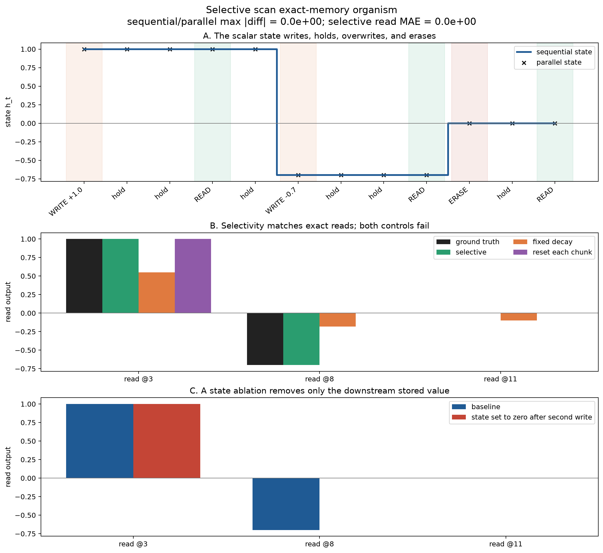

# [5.3] Mamba from Scratch

## Core Question

How can a Mamba-style selective state-space layer remember one input, ignore distractors, expose the memory only when asked, and still give the same states under sequential, parallel, and chunked execution?

**Claim.** By the end of this notebook, you will have implemented every recurrence operation needed to show that an exact selective-memory organism has zero read error, while fixed dynamics and broken chunk state visibly fail.


The lesson is CPU-first. It isolates the selective recurrence that Mamba uses, makes every state value interpretable, and tests execution-path parity before discussing optimized kernels.

## Section Metadata

| Release field | Value |
| --- | --- |
| Exercise | `EXERCISE_ID = "5_3_mamba_from_scratch"` |
| Ground-truth tier | `GT_TIER = "GT-1"` |
| Difficulty | `DIFFICULTY = 4` |
| Importance | `IMPORTANCE = 5` |
| Expected runtime | `EXPECTED_RUNTIME = "seconds on toy contract; minutes on local real-model path"` |
| GPU Contract | `REQUIRES_GPU = True` for the optional official-checkpoint verification; the selective-scan learner path runs on CPU. |

## Learning Objectives

You will:

- discretize stable continuous-time SSM parameters into affine updates;
- implement a sequential recurrence as a hand-checkable reference;
- derive and implement an associative parallel prefix scan;
- carry recurrent state correctly across chunks;
- use input-dependent update and read gates on an exact ground-truth task;
- intervene on recurrent state and measure the downstream causal effect;
- compare the selective model with fixed-decay and chunk-reset controls.

## Setup

```python
import sys
from dataclasses import dataclass
from pathlib import Path

import matplotlib.pyplot as plt
import torch as t

chapter = "chapter5_modern_architectures"
section = "part3_mamba_from_scratch"
root_dir = next(p for p in [Path.cwd(), *Path.cwd().parents] if (p / chapter).exists())
exercises_dir = root_dir / chapter / "exercises"
if str(exercises_dir) not in sys.path:
    sys.path.append(str(exercises_dir))

import part3_mamba_from_scratch.tests as tests
```

## Cold open: one scalar of memory

We start with a deliberately exact model organism. It has one scalar recurrent state and four event types:

| Event | Affine update | Meaning |
| --- | --- | --- |
| `WRITE v` | `h <- 0 * h + v` | replace memory with `v` |
| `hold` | `h <- 1 * h + 0` | ignore the current distractor |
| `READ` | state unchanged, `C=1` | expose memory |
| `ERASE` | `h <- 0 * h + 0` | clear memory |

The concrete sequence writes `+1.0`, reads it after two distractors, overwrites it with `-0.7`, reads again, erases, and finally reads `0.0`. The expected read vector is therefore exactly `[1.0, -0.7, 0.0]`.

This organism supplies ground truth rather than a scientific fake. Its hard 0/1 gates are clearly labeled limiting cases. Real Mamba layers learn finite, approximate gates from token representations.

## From an SSM to an affine scan

A diagonal state-space recurrence can be written elementwise as

$$
h_t = a_t \odot h_{t-1} + b_t, \qquad y_t = C_t h_t.
$$

In Mamba, the token stream produces input-dependent $\Delta_t$, $B_t$, and $C_t$. With stable $A=-\exp(A_{\log})$, the discretization used here is

$$
a_t = \exp(\Delta_t A), \qquad b_t = \Delta_t B_t u_t.
$$

Once `a` and `b` exist, the scan can run sequentially, in chunks, or with an associative prefix schedule. All paths must implement the same ordered recurrence.

### Exercise 1 - discretize stable SSM parameters

> ```yaml
> Difficulty: medium
> Importance: high
> Suggested time: 10 minutes
> ```

Implement `_expand_bc` and `discretize_selective_scan`. The result has shape `(batch, sequence, d_inner, d_state)`. Because `A` is negative and `delta` is positive, every discrete decay coefficient must be in `(0, 1]`.

```python
def _expand_bc(param: t.Tensor, d_inner: int) -> t.Tensor:
    """Expand B from (batch, seq, d_state) across d_inner when needed."""
    raise NotImplementedError()


def discretize_selective_scan(
    u: t.Tensor,
    delta: t.Tensor,
    A_log: t.Tensor,
    B: t.Tensor,
) -> tuple[t.Tensor, t.Tensor]:
    """Return a_t and b_t for h_t = a_t * h_(t-1) + b_t."""
    raise NotImplementedError()


tests.test_discretize_selective_scan_shapes_and_stability(discretize_selective_scan)
```

<details><summary>Expected output</summary>

```text
All tests in `test_discretize_selective_scan_shapes_and_stability` passed!
```

</details>

<details><summary>Help - common bug: dropping the state axis during discretization</summary>

Expand rank-3 `B` with a new `d_inner` axis. Form `A = -exp(A_log)`, then broadcast `delta` and `u` over `d_state`.

</details>

<details><summary>Solution</summary>

```python
def _expand_bc(param: t.Tensor, d_inner: int) -> t.Tensor:
    if param.ndim == 3:
        return param[:, :, None, :].expand(-1, -1, d_inner, -1)
    if param.ndim == 4 and param.shape[2] == d_inner:
        return param
    raise ValueError("B must have shape (batch, seq, d_state) or include d_inner.")


def discretize_selective_scan(u, delta, A_log, B):
    A = -t.exp(A_log).to(dtype=u.dtype, device=u.device)
    B_expanded = _expand_bc(B.to(dtype=u.dtype, device=u.device), u.shape[-1])
    a = t.exp(delta.unsqueeze(-1) * A[None, None, :, :])
    b = delta.unsqueeze(-1) * u.unsqueeze(-1) * B_expanded
    return a, b
```

</details>

### Exercise 2 - write the sequential reference

> ```yaml
> Difficulty: easy
> Importance: very high
> Suggested time: 10 minutes
> ```

Implement the recurrence literally and return every post-update state. The first semantic test is hand-checkable: starting from `2.0`, three updates must produce `[2.0, -0.5, 2.5]`.

```python
def sequential_affine_scan(
    a: t.Tensor,
    b: t.Tensor,
    initial_state: t.Tensor | None = None,
) -> t.Tensor:
    raise NotImplementedError()


tests.test_sequential_affine_scan_manual(sequential_affine_scan)
```

<details><summary>Expected output</summary>

```text
All tests in `test_sequential_affine_scan_manual` passed!
```

</details>

<details><summary>Help - common bug: stacking states on the batch axis</summary>

Sequence is axis 1. Initialize a state shaped like `b[:, 0]`, update once per position, append each new state, then stack on axis 1.

</details>

<details><summary>Solution</summary>

```python
state = t.zeros_like(b[:, 0]) if initial_state is None else initial_state.to(b)
states = []
for position in range(a.shape[1]):
    state = a[:, position] * state + b[:, position]
    states.append(state)
return t.stack(states, dim=1)
```

</details>

### Exercise 3 - compose updates and scan in parallel

> ```yaml
> Difficulty: hard
> Importance: very high
> Suggested time: 25 minutes
> ```

Each token represents an affine map `(a, b)`. Applying the right map after the left map gives

$$
(a_R,b_R) \circ (a_L,b_L) = (a_Ra_L,\ a_Rb_L+b_R).
$$

Implement this composition, then use offsets `1, 2, 4, ...` for an inclusive Hillis-Steele scan. The test compares all states from the sequential and parallel paths on random float64 recurrences with a nonzero initial state.

```python
def compose_affine_updates(a_left, b_left, a_right, b_right):
    raise NotImplementedError()


def parallel_affine_scan(a, b, initial_state=None):
    raise NotImplementedError()


tests.test_compose_affine_updates(compose_affine_updates)
tests.test_parallel_affine_scan_parity(sequential_affine_scan, parallel_affine_scan)
```

<details><summary>Expected output</summary>

```text
All tests in `test_compose_affine_updates` passed!
All tests in `test_parallel_affine_scan_parity` passed!
```

Maximum sequential-versus-parallel error must be at most `1e-12`.

</details>

<details><summary>Help - common bug: composing partially updated prefixes</summary>

Clone both prefix tensors at each offset. Compose `old[:, :-offset]` on the left with `old[:, offset:]` on the right. Reading from partially updated prefixes changes the computation.

</details>

<details><summary>Solution</summary>

```python
def compose_affine_updates(a_left, b_left, a_right, b_right):
    return a_right * a_left, a_right * b_left + b_right


a_prefix, b_prefix = a.clone(), b.clone()
offset = 1
while offset < a.shape[1]:
    old_a, old_b = a_prefix.clone(), b_prefix.clone()
    a_prefix[:, offset:], b_prefix[:, offset:] = compose_affine_updates(
        old_a[:, :-offset], old_b[:, :-offset],
        old_a[:, offset:], old_b[:, offset:],
    )
    offset *= 2
```

</details>

### Exercise 4 - carry state across chunks

> ```yaml
> Difficulty: medium
> Importance: high
> Suggested time: 15 minutes
> ```

Chunking should change memory use without changing behavior. Implement chunked sequential execution and pass the final state from one chunk into the next.

```python
def chunked_affine_scan(
    a: t.Tensor,
    b: t.Tensor,
    chunk_size: int,
    initial_state: t.Tensor | None = None,
    *,
    reset_each_chunk: bool = False,
) -> t.Tensor:
    raise NotImplementedError()


tests.test_chunked_affine_scan_state_carry(sequential_affine_scan, chunked_affine_scan)
```

<details><summary>Expected output</summary>

```text
All tests in `test_chunked_affine_scan_state_carry` passed!
```

Chunk sizes `1`, `4`, `7`, and a chunk larger than the sequence all match bit-for-bit.

</details>

<details><summary>Help - common bug: resetting state at every chunk</summary>

After scanning one slice, set `state = chunk_states[:, -1]`. The `reset_each_chunk` branch will become a deliberately broken control in the signature result.

</details>

<details><summary>Solution</summary>

```python
for start in range(0, a.shape[1], chunk_size):
    stop = min(start + chunk_size, a.shape[1])
    if reset_each_chunk and start > 0:
        state = t.zeros_like(state)
    chunk_states = sequential_affine_scan(a[:, start:stop], b[:, start:stop], state)
    chunks.append(chunk_states)
    state = chunk_states[:, -1]
return t.cat(chunks, dim=1)
```

</details>

### Exercise 5 - make the scan selective

> ```yaml
> Difficulty: medium
> Importance: very high
> Suggested time: 15 minutes
> ```

Map the exact events to `a`, `b`, and `C`. A write uses `(a, b) = (0, value)`, hold and read use `(1, 0)`, erase uses `(0, 0)`, and `C=1` only at read positions.

```python
def build_event_coefficients(event_ids, values):
    raise NotImplementedError()


def selective_readout(states, c):
    raise NotImplementedError()


tests.test_selective_copy_ground_truth(
    build_event_coefficients,
    sequential_affine_scan,
    selective_readout,
)
```

<details><summary>Expected output</summary>

```text
All tests in `test_selective_copy_ground_truth` passed!
```

The exact state trajectory is `[1, 1, 1, 1, 1, -0.7, -0.7, -0.7, -0.7, 0, 0, 0]`.

</details>

<details><summary>Help - common bug: applying one gate to every event</summary>

Start with `a=1`, `b=0`, and `c=0`. Boolean masks for event IDs should modify only the corresponding scalar entries.

</details>

<details><summary>Solution</summary>

```python
write = event_ids.eq(EVENT_WRITE)
erase = event_ids.eq(EVENT_ERASE)
read = event_ids.eq(EVENT_READ)
a[..., 0][write | erase] = 0.0
b[..., 0][write] = values[write]
c[..., 0][read] = 1.0
return a, b, c
```

</details>

### Exercise 6 - intervene on the recurrent state

> ```yaml
> Difficulty: medium
> Importance: high
> Suggested time: 15 minutes
> ```

Set the state to zero after position 6, then continue the original recurrence. Earlier reads must remain fixed. The downstream read that depends on the second write must change from `-0.7` to `0.0`.

```python
def intervene_on_state(a, b, position, replacement=0.0, initial_state=None):
    raise NotImplementedError()


tests.test_state_ablation_is_causal(intervene_on_state)
```

<details><summary>Expected output</summary>

```text
All tests in `test_state_ablation_is_causal` passed!
```

</details>

<details><summary>Help - common bug: editing the state without carrying it forward</summary>

Scan through the intervention position, replace that post-update state, and use the replacement as the initial state for the untouched suffix recurrence.

</details>

<details><summary>Solution</summary>

```python
states = sequential_affine_scan(a[:, : position + 1], b[:, : position + 1], initial_state)
state = t.broadcast_to(t.as_tensor(replacement, dtype=b.dtype), states[:, -1].shape).clone()
states[:, -1] = state
suffix = []
for index in range(position + 1, a.shape[1]):
    state = a[:, index] * state + b[:, index]
    suffix.append(state)
return t.cat([states, t.stack(suffix, dim=1)], dim=1) if suffix else states
```

</details>

## Signature Result: exact memory, failing controls, causal state

The signature image below is generated by the solution notebook from the implementations above. Panel A exposes the full state trajectory. Panel B compares the three exact reads against two controls. Panel C shows the causal state ablation.



| Metric | Result | Interpretation |
| --- | ---: | --- |
| Sequential vs parallel max absolute difference | `0.000e+00` | associative execution preserves the exact recurrence |
| Sequential vs chunked max absolute difference | `0.000e+00` | correct state carry preserves every state |
| Selective read MAE | `0.000` | all three ground-truth reads are exact |
| Fixed-decay control MAE | `0.356` | constant dynamics forget and mix writes |
| Chunk-reset control MAE | `0.233` | resetting state loses a value across a boundary |
| Second-read ablation effect | `0.700` | stored state causally supplies the second answer |

### Controls and interpretation

The **fixed-decay control** keeps the same write impulses and read locations but replaces every input-conditioned transition with `a_t=0.82`. It returns approximately `[0.551, -0.182, -0.100]`, so the result is neither correct nor collapsed.

The **chunk-reset control** uses the correct selective updates but resets state at each four-token chunk boundary. It returns `[1.0, 0.0, 0.0]`: the first read remains correct, while the second write cannot cross the next boundary.

The intervention leaves the first read at `1.0` because it occurred before the ablation. Setting the post-update state to zero after the second write changes only the downstream second read from `-0.7` to `0.0`. The later erase already makes the final read zero in both runs.

## Try It Yourself

Change the write values, delay lengths, fixed decay, chunk size, and ablation position. Before running, predict which bars should move.

```python
play_case = make_selective_copy_case(
    first_value=1.6,
    second_value=-1.1,
    first_delay=4,
    second_delay=5,
    final_delay=2,
)
second_write = play_case.event_ids[0].eq(EVENT_WRITE).nonzero(as_tuple=False).flatten()[1].item()
play_result = run_selective_copy_experiment(
    case=play_case,
    fixed_decay=0.90,
    chunk_size=5,
    ablate_position=second_write + 2,
)
render_signature_figure(play_result)
```

A correct selective scan keeps zero read error at every delay. The fixed-decay control gets worse as a required memory travels farther. The reset control fails only when the needed state crosses a chunk boundary.

## Bonus anomaly hunt

Associativity is exact algebraically, but floating-point operations depend on evaluation order. Sweep sequence length in float32 and float64, then move `a` closer to one or increase the scale of `b`.

```python
def parity_error_at_length(length: int, dtype: t.dtype) -> float:
    generator = t.Generator().manual_seed(length)
    a = 0.90 + 0.099 * t.rand((1, length, 2), generator=generator, dtype=dtype)
    b = 0.05 * t.randn((1, length, 2), generator=generator, dtype=dtype)
    sequential = sequential_affine_scan(a, b)
    parallel = parallel_affine_scan(a, b)
    return (sequential - parallel).abs().max().item()


for dtype in (t.float32, t.float64):
    print(dtype, {n: parity_error_at_length(n, dtype) for n in (16, 64, 256, 1024)})
```

Find the smallest setup where float32 error exceeds `1e-5`. Check whether the error follows a large state excursion, then rerun in float64 before treating it as a semantic mismatch.

## Connection to Mamba

The [Mamba paper](https://arxiv.org/abs/2312.00752) makes SSM parameters input-dependent and uses a hardware-aware parallel scan during training. The [official implementation](https://github.com/state-spaces/mamba) contains optimized kernels for the same recurrence family. Our semantic event labels are exact coefficient choices; a released model receives no labels and learns approximate coefficients from hidden representations.

The transferable contract is precise: discretization produces affine updates, associative composition preserves their order, recurrent inference carries state, and intervening on that state can alter later outputs.

## Limitations

- The organism has one scalar state and hand-specified exact gates; it is not a trained language model.
- Finite Mamba parameters cannot produce exact `a=0` or `a=1`; these are clean limiting cases used to expose the recurrence.
- The Python Hillis-Steele scan demonstrates semantics, not kernel speed or memory efficiency.
- The intervention establishes causality for this known state variable, not a general method for interpreting distributed states in a large Mamba model.
- CPU parity at these lengths does not validate CUDA fused kernels or released-checkpoint weight mapping.

## Reading links

- [Mamba: Linear-Time Sequence Modeling with Selective State Spaces](https://arxiv.org/abs/2312.00752)
- [The Annotated S4](https://srush.github.io/annotated-s4/), for continuous-to-discrete SSM background
- [state-spaces/mamba](https://github.com/state-spaces/mamba), for the optimized reference implementation
