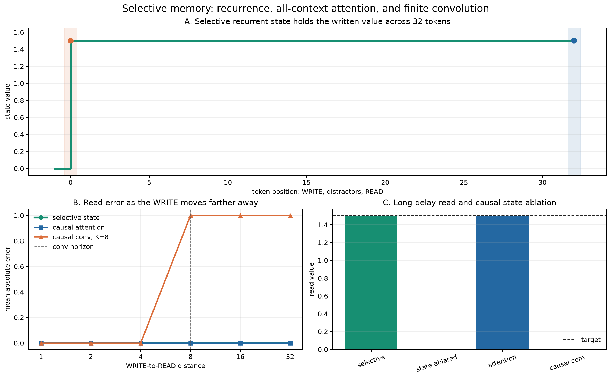

# [5.3] Mamba from Scratch

## Core Question

How does Mamba turn token-dependent state-space parameters into a causal language model that can remember selectively, run recurrently, and reproduce a released checkpoint?

**Claim.** By the end of this notebook, you will have built the Mamba-1 computation from continuous-time dynamics through a stacked LM, mapped every tensor from pinned `state-spaces/mamba-130m-hf`, and shown that selective state preserves information beyond a finite convolutional horizon while matching official hidden states, logits, cache behavior, and greedy tokens.



## Section Metadata

| Field | Value |
| --- | --- |
| `EXERCISE_ID` | `5_3_mamba_from_scratch` |
| `GT_TIER` | `GT-1` |
| `DIFFICULTY` | `4` |
| `IMPORTANCE` | `5` |
| `EXPECTED_RUNTIME` | `about 3 minutes CPU including cached Mamba-130M parity` |
| `REQUIRES_GPU` | `True` for release evidence; this notebook executes its complete scientific path on CPU. |

## Learning Objectives

You will:

- derive an exact zero-order-hold discretization of a stable continuous SSM;
- implement sequential and associative scans from the same affine recurrence;
- implement causal depthwise convolution and verify that future inputs cannot leak;
- make `delta`, `B`, and `C` depend on each token;
- compose projection, convolution, selective scan, SiLU gate, RMSNorm, and residual path into a Mamba block;
- implement one-token recurrent inference with convolution and SSM caches;
- stack blocks into a tied-embedding causal LM;
- map all weights from a pinned real Mamba-130M checkpoint and test hidden-state, logits, cache, and generation parity;
- distinguish recurrent selective memory from finite convolution and all-context attention.

## Roadmap

The notebook follows the same compositional pattern as ARENA's Transformer from Scratch: derive one operation, implement it, test it immediately, then make it a component of the next operation. The final real-model parity test is the architectural equivalent of loading GPT-2 weights into the model you built.

The exact toy recurrence is ground truth, not a claim about trained language-model behavior. The real checkpoint parity later proves that your full implementation computes the released architecture.

```python
import gc
import sys
import time
from dataclasses import dataclass
from pathlib import Path
from typing import Any

import matplotlib.pyplot as plt
import torch as t
import torch.nn as nn
import torch.nn.functional as F

chapter = "chapter5_modern_architectures"
section = "part3_mamba_from_scratch"
root_dir = next(p for p in [Path.cwd(), *Path.cwd().parents] if (p / chapter).exists())
exercises_dir = root_dir / chapter / "exercises"
if str(root_dir) not in sys.path:
    sys.path.append(str(root_dir))
if str(exercises_dir) not in sys.path:
    sys.path.append(str(exercises_dir))

import part3_mamba_from_scratch.tests as tests

EXERCISE_ID = "5_3_mamba_from_scratch"
GT_TIER = "GT-1"
DIFFICULTY = 4
IMPORTANCE = 5
EXPECTED_RUNTIME = "about 3 minutes CPU including cached Mamba-130M parity"
REQUIRES_GPU = True

REAL_MAMBA_MODEL_ID = "state-spaces/mamba-130m-hf"
REAL_MAMBA_REVISION = "1e76775f628fbf1350fbe4dbb3d971ba64af25a1"

EVENT_HOLD = 0
EVENT_WRITE = 1
EVENT_READ = 2
EVENT_ERASE = 3

t.set_grad_enabled(True)
print(f"PyTorch {t.__version__}; learner device = CPU")
```

## Cold open: a memory cell you can solve by hand

Consider `dh/dt = A h + B u` with `A=-2`, `B=3`, and a half-second step. For constant `u`, the exact update is affine: `h_next = a_bar*h + b_bar*u`. Before coding, predict whether `a_bar` is between zero and one, and why making `A=-exp(A_log)` guarantees stability.

### Exercise 1 - discretize a stable continuous SSM

        > ```yaml
        > Difficulty: 🔴🔴⚪⚪⚪
        > Importance: 🔵🔵🔵🔵⚪
        > Suggested time: 12 minutes
        > ```

        Implement the stable parameterization and exact scalar zero-order-hold coefficients. This is the continuous-time anchor; Mamba's later selective input update uses a simplified `delta * B * u` term.

        <details><summary>Expected output</summary>

        ```text
        All tests in `test_continuous_discretization_exact` passed!
        ```

        </details>

        <details><summary>Help - common bug</summary>

        The transition is `A=-exp(A_log)`. Integrate the scalar ODE over one constant-input interval; use `expm1(delta*A)` for numerical stability.

        </details>

        <details><summary>Solution</summary>

        ```python
        def stable_continuous_A(A_log: t.Tensor) -> t.Tensor:
    """Parameterize a diagonal continuous-time transition with negative entries."""

    return -t.exp(A_log.float())


def discretize_scalar_ssm_exact(
    A: t.Tensor,
    B: t.Tensor,
    delta: t.Tensor,
) -> tuple[t.Tensor, t.Tensor]:
    """Exact zero-order-hold discretization for dh/dt = A h + B u."""

    if bool((A == 0).any()):
        raise ValueError("A must be nonzero for this closed form.")
    a_bar = t.exp(delta * A)
    b_bar = t.expm1(delta * A) / A * B
    return a_bar, b_bar

        ```

        </details>

```python
def stable_continuous_A(A_log: t.Tensor) -> t.Tensor:
    """Return a stable diagonal continuous-time transition."""
    raise NotImplementedError()


def discretize_scalar_ssm_exact(
    A: t.Tensor,
    B: t.Tensor,
    delta: t.Tensor,
) -> tuple[t.Tensor, t.Tensor]:
    """Exact zero-order-hold discretization of dh/dt = A h + B u."""
    raise NotImplementedError()


tests.test_continuous_discretization_exact(stable_continuous_A, discretize_scalar_ssm_exact)
```

### Exercise 2 - write the sequential affine oracle

        > ```yaml
        > Difficulty: 🔴🔴⚪⚪⚪
        > Importance: 🔵🔵🔵🔵🔵
        > Suggested time: 10 minutes
        > ```

        Implement the recurrence literally and retain every post-update state. A hand-computed three-step fixture prevents a vectorized implementation from hiding an ordering error.

        <details><summary>Expected output</summary>

        ```text
        All tests in `test_sequential_affine_scan_manual` passed!
        ```

        </details>

        <details><summary>Help - common bug</summary>

        Sequence is axis 1. Initialize with `b[:, 0]`'s shape, update once per position, append the new state, then stack along axis 1.

        </details>

        <details><summary>Solution</summary>

        ```python
        def sequential_affine_scan(
    a: t.Tensor,
    b: t.Tensor,
    initial_state: t.Tensor | None = None,
) -> t.Tensor:
    """Apply h_t = a_t * h_(t-1) + b_t from left to right."""

    if a.shape != b.shape or a.ndim < 2:
        raise ValueError("a and b must have the same shape with sequence on axis 1.")
    state = t.zeros_like(b[:, 0]) if initial_state is None else initial_state.to(b)
    states = []
    for position in range(a.shape[1]):
        state = a[:, position] * state + b[:, position]
        states.append(state)
    return t.stack(states, dim=1)

        ```

        </details>

```python
def sequential_affine_scan(a, b, initial_state=None):
    """Return every state from h_t = a_t*h_(t-1) + b_t."""
    raise NotImplementedError()


tests.test_sequential_affine_scan_manual(sequential_affine_scan)
```

### Exercise 3 - parallelize the recurrence with associative composition

        > ```yaml
        > Difficulty: 🔴🔴🔴🔴⚪
        > Importance: 🔵🔵🔵🔵🔵
        > Suggested time: 25 minutes
        > ```

        Derive `(a_R,b_R) o (a_L,b_L)` and implement an inclusive Hillis-Steele scan. The tests check the sub-function, all intermediate states, a nonzero initial state, float64 tolerance, and gradients.

        <details><summary>Expected output</summary>

        ```text
        All tests in `test_compose_affine_updates` passed!
All tests in `test_parallel_affine_scan_parity` passed!
All tests in `test_parallel_scan_gradients` passed!
        ```

        </details>

        <details><summary>Help - common bug</summary>

        Clone the whole prefix pair before each offset. The right transform acts after the left, so the composed bias is `a_right*b_left + b_right`.

        </details>

        <details><summary>Solution</summary>

        ```python
        def compose_affine_updates(
    a_left: t.Tensor,
    b_left: t.Tensor,
    a_right: t.Tensor,
    b_right: t.Tensor,
) -> tuple[t.Tensor, t.Tensor]:
    """Compose the right affine update after the left affine update."""

    return a_right * a_left, a_right * b_left + b_right


def parallel_affine_scan(
    a: t.Tensor,
    b: t.Tensor,
    initial_state: t.Tensor | None = None,
) -> t.Tensor:
    """Inclusive Hillis-Steele scan over affine recurrence updates."""

    if a.shape != b.shape or a.ndim < 2:
        raise ValueError("a and b must have the same shape with sequence on axis 1.")
    a_prefix, b_prefix = a.clone(), b.clone()
    offset = 1
    while offset < a.shape[1]:
        old_a, old_b = a_prefix, b_prefix
        next_a, next_b = old_a.clone(), old_b.clone()
        next_a[:, offset:], next_b[:, offset:] = compose_affine_updates(
            old_a[:, :-offset],
            old_b[:, :-offset],
            old_a[:, offset:],
            old_b[:, offset:],
        )
        a_prefix, b_prefix = next_a, next_b
        offset *= 2
    state0 = t.zeros_like(b[:, 0]) if initial_state is None else initial_state.to(b)
    return a_prefix * state0[:, None] + b_prefix

        ```

        </details>

```python
def compose_affine_updates(a_left, b_left, a_right, b_right):
    raise NotImplementedError()


def parallel_affine_scan(a, b, initial_state=None):
    """Inclusive associative prefix scan over affine updates."""
    raise NotImplementedError()


tests.test_compose_affine_updates(compose_affine_updates)
tests.test_parallel_affine_scan_parity(sequential_affine_scan, parallel_affine_scan)
tests.test_parallel_scan_gradients(parallel_affine_scan)
```

## The local path: causal depthwise convolution

Mamba first gives each expanded channel a short local receptive field. PyTorch `conv1d` is cross-correlation: left-pad by `kernel-1`, use `groups=channels`, then crop the right tail. The no-future test is as important as the numerical fixture.

### Exercise 4 - implement causal depthwise convolution

        > ```yaml
        > Difficulty: 🔴🔴🔴⚪⚪
        > Importance: 🔵🔵🔵🔵🔵
        > Suggested time: 15 minutes
        > ```

        Implement the exact operation used by the Mamba mixer. The test checks two channels against a loop oracle and perturbs the final token by 10,000 to detect future leakage.

        <details><summary>Expected output</summary>

        ```text
        All tests in `test_causal_depthwise_conv_manual_and_no_future` passed!
        ```

        </details>

        <details><summary>Help - common bug</summary>

        Transpose to `(batch, channels, seq)`, use `groups=x.shape[-1]`, pad only the effective left context, crop to the original length, then transpose back.

        </details>

        <details><summary>Solution</summary>

        ```python
        def causal_depthwise_conv1d(
    x: t.Tensor,
    weight: t.Tensor,
    bias: t.Tensor | None = None,
) -> t.Tensor:
    """Depthwise causal cross-correlation for x shaped (batch, seq, channels)."""

    if weight.ndim != 3 or weight.shape[1] != 1 or weight.shape[0] != x.shape[-1]:
        raise ValueError("weight must have shape (channels, 1, kernel).")
    seq_len = x.shape[1]
    y = F.conv1d(
        x.transpose(1, 2),
        weight,
        bias,
        padding=weight.shape[-1] - 1,
        groups=x.shape[-1],
    )[..., :seq_len]
    return y.transpose(1, 2)

        ```

        </details>

```python
def causal_depthwise_conv1d(x, weight, bias=None):
    """Causal depthwise convolution for x shaped (batch, seq, channels)."""
    raise NotImplementedError()


tests.test_causal_depthwise_conv_manual_and_no_future(causal_depthwise_conv1d)
```

### Exercise 5 - make delta, B, and C token-dependent

        > ```yaml
        > Difficulty: 🔴🔴⚪⚪⚪
        > Importance: 🔵🔵🔵🔵🔵
        > Suggested time: 12 minutes
        > ```

        Project each convolved token into a low-rank time-step representation and two state vectors. Apply `softplus` only after `dt_proj`. The test perturbs one token and requires all three selective parameters at that token to change.

        <details><summary>Expected output</summary>

        ```text
        All tests in `test_project_selective_parameters_is_input_dependent` passed!
        ```

        </details>

        <details><summary>Help - common bug</summary>

        Split `x_proj(x)` into sizes `[dt_proj.in_features, d_state, d_state]`; only the first part goes through `dt_proj` and `softplus`.

        </details>

        <details><summary>Solution</summary>

        ```python
        def project_selective_parameters(
    x: t.Tensor,
    x_proj: nn.Linear,
    dt_proj: nn.Linear,
    d_state: int,
) -> tuple[t.Tensor, t.Tensor, t.Tensor]:
    """Project each token into positive delta_t and input-dependent B_t, C_t."""

    parameters = x_proj(x)
    dt_raw, B, C = t.split(
        parameters,
        [dt_proj.in_features, d_state, d_state],
        dim=-1,
    )
    delta = F.softplus(dt_proj(dt_raw))
    return delta, B, C

        ```

        </details>

```python
def project_selective_parameters(x, x_proj, dt_proj, d_state):
    """Return positive delta_t and input-dependent B_t, C_t."""
    raise NotImplementedError()


tests.test_project_selective_parameters_is_input_dependent(project_selective_parameters)
```

## The selective state-space path

Mamba keeps `A` and `D` fixed per channel but lets every token choose `delta_t`, `B_t`, and `C_t`. In the readable PyTorch path, the state is float32 and has shape `(batch, d_inner, d_state)`. The output contracts that state with `C_t`, adds the skip `D*u_t`, and multiplies by `SiLU(gate_t)`.

### Exercise 6 - discretize and run the recurrent selective scan

        > ```yaml
        > Difficulty: 🔴🔴🔴🔴⚪
        > Importance: 🔵🔵🔵🔵🔵
        > Suggested time: 30 minutes
        > ```

        Implement `a_t=exp(delta_t*A)` and `b_t=delta_t*B_t*u_t`, then the explicit recurrent scan. The one-step oracle checks state update, readout, `D` skip, and SiLU gate separately from random parity.

        <details><summary>Expected output</summary>

        ```text
        All tests in `test_selective_discretization_shapes_and_stability` passed!
All tests in `test_selective_scan_single_step_manual` passed!
        ```

        </details>

        <details><summary>Help - common bug</summary>

        Expand rank-3 B across `d_inner`. Keep the recurrent state in float32. For rank-3 C, use a batched matrix-vector product at each token.

        </details>

        <details><summary>Solution</summary>

        ```python
        def _expand_bc(param: t.Tensor, d_inner: int) -> t.Tensor:
    if param.ndim == 3:
        return param[:, :, None, :].expand(-1, -1, d_inner, -1)
    if param.ndim == 4 and param.shape[2] == d_inner:
        return param
    raise ValueError(
        "B/C must have shape (batch, seq, d_state) or "
        "(batch, seq, d_inner, d_state)."
    )


def discretize_selective_scan(
    u: t.Tensor,
    delta: t.Tensor,
    A_log: t.Tensor,
    B: t.Tensor,
) -> tuple[t.Tensor, t.Tensor]:
    """Build Mamba recurrence coefficients a_t and deltaB_t u_t."""

    if u.shape != delta.shape:
        raise ValueError("u and delta must both have shape (batch, seq, d_inner).")
    if A_log.ndim != 2 or A_log.shape[0] != u.shape[-1]:
        raise ValueError("A_log must have shape (d_inner, d_state).")
    A = stable_continuous_A(A_log).to(device=u.device)
    delta_f = delta.float()
    B_f = _expand_bc(B.float().to(u.device), u.shape[-1])
    a = t.exp(delta_f.unsqueeze(-1) * A[None, None])
    delta_B = delta_f.unsqueeze(-1) * B_f
    b = delta_B * u.float().unsqueeze(-1)
    return a, b


def selective_scan_recurrent(
    u: t.Tensor,
    delta: t.Tensor,
    A_log: t.Tensor,
    B: t.Tensor,
    C: t.Tensor,
    D: t.Tensor | None = None,
    z: t.Tensor | None = None,
    initial_state: t.Tensor | None = None,
    *,
    return_last_state: bool = False,
) -> t.Tensor | tuple[t.Tensor, t.Tensor]:
    """Readable sequential selective scan used as the semantic reference."""

    a, b = discretize_selective_scan(u, delta, A_log, B)
    state = (
        t.zeros(a.shape[0], a.shape[2], a.shape[3], device=u.device, dtype=t.float32)
        if initial_state is None
        else initial_state.float().to(u.device)
    )
    C_f = C.float().to(u.device)
    outputs = []
    for position in range(u.shape[1]):
        state = a[:, position] * state + b[:, position]
        if C_f.ndim == 3:
            read = t.matmul(
                state.to(u.dtype),
                C_f[:, position].to(u.dtype).unsqueeze(-1),
            ).squeeze(-1)
        else:
            read = (
                state.to(u.dtype) * C_f[:, position].to(u.dtype)
            ).sum(dim=-1)
        outputs.append(read)
    y = t.stack(outputs, dim=1)
    if D is not None:
        y = y + u * D.to(device=u.device, dtype=u.dtype)
    if z is not None:
        y = y * F.silu(z)
    return (y, state) if return_last_state else y

        ```

        </details>

```python
def _expand_bc(param, d_inner):
    raise NotImplementedError()


def discretize_selective_scan(u, delta, A_log, B):
    """Return a_t and deltaB_t*u_t."""
    raise NotImplementedError()


def selective_scan_recurrent(
    u, delta, A_log, B, C, D=None, z=None, initial_state=None, *, return_last_state=False
):
    raise NotImplementedError()


tests.test_selective_discretization_shapes_and_stability(discretize_selective_scan)
tests.test_selective_scan_single_step_manual(selective_scan_recurrent)
```

### Exercise 7 - run the same selective scan in parallel

        > ```yaml
        > Difficulty: 🔴🔴🔴⚪⚪
        > Importance: 🔵🔵🔵🔵⚪
        > Suggested time: 15 minutes
        > ```

        Reuse your affine prefix scan over the discretized tensors, then apply `C`, `D`, and the gate. This path represents parallel training semantics; the recurrent path represents token-by-token inference semantics.

        <details><summary>Expected output</summary>

        ```text
        All tests in `test_recurrent_parallel_selective_scan_parity` passed!
        ```

        </details>

        <details><summary>Help - common bug</summary>

        The associative scan returns all states. Apply the readout only after scanning; `C_t` does not belong in the recurrence composition.

        </details>

        <details><summary>Solution</summary>

        ```python
        def selective_scan_parallel(
    u: t.Tensor,
    delta: t.Tensor,
    A_log: t.Tensor,
    B: t.Tensor,
    C: t.Tensor,
    D: t.Tensor | None = None,
    z: t.Tensor | None = None,
    initial_state: t.Tensor | None = None,
    *,
    return_last_state: bool = False,
) -> t.Tensor | tuple[t.Tensor, t.Tensor]:
    """Associative selective scan with the same ordered affine transforms."""

    a, b = discretize_selective_scan(u, delta, A_log, B)
    states = parallel_affine_scan(a, b, initial_state)
    C_f = _expand_bc(C.float().to(u.device), u.shape[-1])
    y = (states.to(u.dtype) * C_f.to(u.dtype)).sum(dim=-1)
    if D is not None:
        y = y + u * D.to(device=u.device, dtype=u.dtype)
    if z is not None:
        y = y * F.silu(z)
    return (y, states[:, -1]) if return_last_state else y

        ```

        </details>

```python
def selective_scan_parallel(
    u, delta, A_log, B, C, D=None, z=None, initial_state=None, *, return_last_state=False
):
    raise NotImplementedError()


tests.test_recurrent_parallel_selective_scan_parity(
    selective_scan_recurrent, selective_scan_parallel
)
```

## Assemble a genuine Mamba block

The mixer is not the block. A Mamba-1 block is pre-normalized and residual: `x + mixer(RMSNorm(x))`. Inside the mixer, `in_proj` creates an `x` stream and a gate stream; the `x` stream passes through depthwise causal convolution and the selective SSM before `SiLU(gate)` and `out_proj`.

```python
@dataclass(frozen=True)
class MambaConfig:
    vocab_size: int = 32_000
    d_model: int = 768
    d_inner: int = 1_536
    d_state: int = 16
    d_conv: int = 4
    dt_rank: int = 48
    num_layers: int = 24
    rms_norm_eps: float = 1e-5
    tie_word_embeddings: bool = True
    residual_in_fp32: bool = True
    use_bias: bool = False
    use_conv_bias: bool = True

    @classmethod
    def from_hf_config(cls, config: Any) -> "MambaConfig":
        return cls(
            vocab_size=int(config.vocab_size),
            d_model=int(config.hidden_size),
            d_inner=int(config.intermediate_size),
            d_state=int(config.state_size),
            d_conv=int(config.conv_kernel),
            dt_rank=int(config.time_step_rank),
            num_layers=int(config.num_hidden_layers),
            rms_norm_eps=float(config.layer_norm_epsilon),
            tie_word_embeddings=bool(config.tie_word_embeddings),
            residual_in_fp32=bool(config.residual_in_fp32),
            use_bias=bool(config.use_bias),
            use_conv_bias=bool(config.use_conv_bias),
        )


@dataclass(frozen=True)
class MambaInferenceState:
    conv_state: t.Tensor
    ssm_state: t.Tensor


@dataclass(frozen=True)
class MambaCausalLMOutput:
    logits: t.Tensor
    states: tuple[MambaInferenceState, ...] | None = None
    hidden_states: tuple[t.Tensor, ...] | None = None
```

### Exercise 8 - implement RMSNorm, gated mixer, and residual block

        > ```yaml
        > Difficulty: 🔴🔴🔴🔴🔴
        > Importance: 🔵🔵🔵🔵🔵
        > Suggested time: 40 minutes
        > ```

        Fill in RMSNorm, the full-sequence mixer forward pass, and the residual block. Parameter construction is provided so the exercise stays on the computation. The semantic test zeros `out_proj` and requires an exact residual identity.

        <details><summary>Expected output</summary>

        ```text
        All tests in `test_mamba_block_has_norm_residual_and_gate` passed!
        ```

        </details>

        <details><summary>Help - common bug</summary>

        Project and split first; convolve only `x`; derive selective parameters from the activated convolution; gate the SSM readout before `out_proj`; add the untouched residual in the block.

        </details>

        <details><summary>Solution</summary>

        ```python

class MambaRMSNorm(nn.Module):
    def __init__(self, d_model: int, eps: float = 1e-5):
        super().__init__()
        self.weight = nn.Parameter(t.ones(d_model))
        self.eps = eps

    def forward(self, x):
        dtype = x.dtype
        normalized = x.float() * t.rsqrt(x.float().pow(2).mean(-1, keepdim=True) + self.eps)
        return self.weight * normalized.to(dtype)


class MambaMixerFromScratch(nn.Module):
    def __init__(self, config: MambaConfig):
        super().__init__()
        self.config = config
        self.in_proj = nn.Linear(config.d_model, 2 * config.d_inner, bias=config.use_bias)
        self.conv1d = nn.Conv1d(
            config.d_inner, config.d_inner, config.d_conv,
            groups=config.d_inner, padding=config.d_conv - 1,
            bias=config.use_conv_bias,
        )
        self.x_proj = nn.Linear(config.d_inner, config.dt_rank + 2 * config.d_state, bias=False)
        self.dt_proj = nn.Linear(config.dt_rank, config.d_inner, bias=True)
        A = t.arange(1, config.d_state + 1, dtype=t.float32).repeat(config.d_inner, 1)
        self.A_log = nn.Parameter(t.log(A))
        self.D = nn.Parameter(t.ones(config.d_inner))
        self.out_proj = nn.Linear(config.d_inner, config.d_model, bias=config.use_bias)

    def initial_state(self, batch, device, dtype):
        return MambaInferenceState(
            t.zeros(batch, self.config.d_inner, self.config.d_conv, device=device, dtype=dtype),
            t.zeros(batch, self.config.d_inner, self.config.d_state, device=device, dtype=t.float32),
        )

    def _full_conv_state(self, x):
        channels = x.transpose(1, 2)
        if channels.shape[-1] < self.config.d_conv:
            channels = F.pad(channels, (self.config.d_conv - channels.shape[-1], 0))
        return channels[..., -self.config.d_conv:].contiguous()

    def forward(self, hidden_states, *, inference_state=None, use_cache=False):
        if inference_state is not None and hidden_states.shape[1] == 1:
            return self.step(hidden_states, inference_state)
        x, gate = self.in_proj(hidden_states).chunk(2, dim=-1)
        x_conv = F.silu(causal_depthwise_conv1d(x, self.conv1d.weight, self.conv1d.bias))
        delta, B, C = project_selective_parameters(x_conv, self.x_proj, self.dt_proj, self.config.d_state)
        y, last_state = selective_scan_recurrent(
            x_conv, delta, self.A_log, B, C, self.D, gate,
            None if inference_state is None else inference_state.ssm_state,
            return_last_state=True,
        )
        state = MambaInferenceState(self._full_conv_state(x), last_state) if use_cache else None
        return self.out_proj(y), state

    def step(self, hidden_states, inference_state):
        raise NotImplementedError("Implement this in Exercise 9.")


class MambaBlockFromScratch(nn.Module):
    def __init__(self, config: MambaConfig):
        super().__init__()
        self.config = config
        self.norm = MambaRMSNorm(config.d_model, config.rms_norm_eps)
        self.mixer = MambaMixerFromScratch(config)

    def forward(self, hidden_states, *, inference_state=None, use_cache=False):
        residual = hidden_states.float() if self.config.residual_in_fp32 else hidden_states
        normalized = self.norm(hidden_states.to(self.norm.weight.dtype))
        mixed, state = self.mixer(normalized, inference_state=inference_state, use_cache=use_cache)
        return residual + mixed, state


tests.test_mamba_block_has_norm_residual_and_gate(MambaBlockFromScratch)

        ```

        </details>

```python
class MambaRMSNorm(nn.Module):
    def __init__(self, d_model: int, eps: float = 1e-5):
        super().__init__()
        self.weight = nn.Parameter(t.ones(d_model))
        self.eps = eps

    def forward(self, x):
        raise NotImplementedError()


class MambaMixerFromScratch(nn.Module):
    def __init__(self, config: MambaConfig):
        super().__init__()
        self.config = config
        self.in_proj = nn.Linear(config.d_model, 2 * config.d_inner, bias=config.use_bias)
        self.conv1d = nn.Conv1d(
            config.d_inner, config.d_inner, config.d_conv,
            groups=config.d_inner, padding=config.d_conv - 1,
            bias=config.use_conv_bias,
        )
        self.x_proj = nn.Linear(config.d_inner, config.dt_rank + 2 * config.d_state, bias=False)
        self.dt_proj = nn.Linear(config.dt_rank, config.d_inner, bias=True)
        A = t.arange(1, config.d_state + 1, dtype=t.float32).repeat(config.d_inner, 1)
        self.A_log = nn.Parameter(t.log(A))
        self.D = nn.Parameter(t.ones(config.d_inner))
        self.out_proj = nn.Linear(config.d_inner, config.d_model, bias=config.use_bias)

    def initial_state(self, batch, device, dtype):
        return MambaInferenceState(
            t.zeros(batch, self.config.d_inner, self.config.d_conv, device=device, dtype=dtype),
            t.zeros(batch, self.config.d_inner, self.config.d_state, device=device, dtype=t.float32),
        )

    def _full_conv_state(self, x):
        channels = x.transpose(1, 2)
        if channels.shape[-1] < self.config.d_conv:
            channels = F.pad(channels, (self.config.d_conv - channels.shape[-1], 0))
        return channels[..., -self.config.d_conv:].contiguous()

    def forward(self, hidden_states, *, inference_state=None, use_cache=False):
        if inference_state is not None and hidden_states.shape[1] == 1:
            return self.step(hidden_states, inference_state)
        raise NotImplementedError()

    def step(self, hidden_states, inference_state):
        raise NotImplementedError("Implement this in Exercise 9.")


class MambaBlockFromScratch(nn.Module):
    def __init__(self, config: MambaConfig):
        super().__init__()
        self.config = config
        self.norm = MambaRMSNorm(config.d_model, config.rms_norm_eps)
        self.mixer = MambaMixerFromScratch(config)

    def forward(self, hidden_states, *, inference_state=None, use_cache=False):
        raise NotImplementedError()


tests.test_mamba_block_has_norm_residual_and_gate(MambaBlockFromScratch)
```

### Exercise 9 - implement one-token recurrent inference

        > ```yaml
        > Difficulty: 🔴🔴🔴🔴⚪
        > Importance: 🔵🔵🔵🔵🔵
        > Suggested time: 25 minutes
        > ```

        Advance the length-`d_conv` convolution window and the `(d_inner,d_state)` SSM state without recomputing the prefix. The test compares every output of six one-token steps against one full causal block pass.

        <details><summary>Expected output</summary>

        ```text
        All tests in `test_mamba_block_recurrent_step_parity` passed!
        ```

        </details>

        <details><summary>Help - common bug</summary>

        Roll the convolution state left, write the new projected `x` at the final slot, contract it with the depthwise kernel, then call the same one-step selective scan with the previous SSM state.

        </details>

        <details><summary>Solution</summary>

        ```python

def mamba_recurrent_step(self, hidden_states, inference_state):
    if hidden_states.shape[1] != 1:
        raise ValueError("step expects exactly one token")
    x, gate = self.in_proj(hidden_states).chunk(2, dim=-1)
    conv_state = t.roll(inference_state.conv_state, shifts=-1, dims=-1)
    conv_state[..., -1] = x[:, 0]
    x_conv = (conv_state * self.conv1d.weight[:, 0][None]).sum(dim=-1)
    if self.conv1d.bias is not None:
        x_conv = x_conv + self.conv1d.bias
    x_conv = F.silu(x_conv).unsqueeze(1)
    delta, B, C = project_selective_parameters(x_conv, self.x_proj, self.dt_proj, self.config.d_state)
    y, ssm_state = selective_scan_recurrent(
        x_conv, delta, self.A_log, B, C, self.D, gate,
        inference_state.ssm_state, return_last_state=True,
    )
    return self.out_proj(y), MambaInferenceState(conv_state, ssm_state)


MambaMixerFromScratch.step = mamba_recurrent_step
tests.test_mamba_block_recurrent_step_parity(MambaBlockFromScratch)

        ```

        </details>

```python
def mamba_recurrent_step(self, hidden_states, inference_state):
    """Advance convolution and SSM state by one token."""
    raise NotImplementedError()


MambaMixerFromScratch.step = mamba_recurrent_step
tests.test_mamba_block_recurrent_step_parity(MambaBlockFromScratch)
```

### Exercise 10 - stack blocks into a tiny causal LM

        > ```yaml
        > Difficulty: 🔴🔴🔴🔴⚪
        > Importance: 🔵🔵🔵🔵🔵
        > Suggested time: 30 minutes
        > ```

        Build token embeddings, a `ModuleList` of Mamba blocks, final RMSNorm, and a tied LM head. Thread one cache object per layer. Your greedy generator must consume the whole prompt once, then one token at a time.

        <details><summary>Expected output</summary>

        ```text
        All tests in `test_tiny_stacked_mamba_lm_and_cache` passed!
        ```

        </details>

        <details><summary>Help - common bug</summary>

        Collect post-block hidden states before final RMSNorm. When decoding the first token with no cache, initialize every layer's convolution and SSM state. Tie weights by assigning the Parameter object, not by copying data.

        </details>

        <details><summary>Solution</summary>

        ```python
        class MambaModelFromScratch(nn.Module):
    def __init__(self, config: MambaConfig):
        super().__init__()
        self.config = config
        self.embeddings = nn.Embedding(config.vocab_size, config.d_model)
        self.layers = nn.ModuleList(
            [MambaBlockFromScratch(config) for _ in range(config.num_layers)]
        )
        self.norm_f = MambaRMSNorm(config.d_model, config.rms_norm_eps)

    def initial_states(
        self,
        batch: int,
        device: t.device,
        dtype: t.dtype,
    ) -> tuple[MambaInferenceState, ...]:
        return tuple(layer.mixer.initial_state(batch, device, dtype) for layer in self.layers)

    def forward(
        self,
        input_ids: t.Tensor,
        *,
        states: tuple[MambaInferenceState, ...] | None = None,
        use_cache: bool = False,
        output_hidden_states: bool = False,
    ) -> tuple[
        t.Tensor,
        tuple[MambaInferenceState, ...] | None,
        tuple[t.Tensor, ...] | None,
    ]:
        hidden = self.embeddings(input_ids)
        if states is None and input_ids.shape[1] == 1 and use_cache:
            states = self.initial_states(input_ids.shape[0], input_ids.device, hidden.dtype)
        next_states = [] if use_cache else None
        hidden_trace = [] if output_hidden_states else None
        for index, layer in enumerate(self.layers):
            hidden, next_state = layer(
                hidden,
                inference_state=None if states is None else states[index],
                use_cache=use_cache,
            )
            if next_states is not None:
                if next_state is None:
                    raise RuntimeError("use_cache=True requires every block to return state.")
                next_states.append(next_state)
            if hidden_trace is not None:
                hidden_trace.append(hidden)
        hidden = self.norm_f(hidden)
        if hidden_trace is not None:
            hidden_trace.append(hidden)
        return (
            hidden,
            None if next_states is None else tuple(next_states),
            None if hidden_trace is None else tuple(hidden_trace),
        )


class MambaForCausalLMFromScratch(nn.Module):
    def __init__(self, config: MambaConfig):
        super().__init__()
        self.config = config
        self.backbone = MambaModelFromScratch(config)
        self.lm_head = nn.Linear(config.d_model, config.vocab_size, bias=False)
        if config.tie_word_embeddings:
            self.lm_head.weight = self.backbone.embeddings.weight

    def forward(
        self,
        input_ids: t.Tensor,
        *,
        states: tuple[MambaInferenceState, ...] | None = None,
        use_cache: bool = False,
        output_hidden_states: bool = False,
    ) -> MambaCausalLMOutput:
        hidden, next_states, hidden_trace = self.backbone(
            input_ids,
            states=states,
            use_cache=use_cache,
            output_hidden_states=output_hidden_states,
        )
        return MambaCausalLMOutput(
            self.lm_head(hidden).float(),
            next_states,
            hidden_trace,
        )

    @t.inference_mode()
    def greedy_generate(self, input_ids: t.Tensor, max_new_tokens: int) -> t.Tensor:
        generated = input_ids
        states = None
        next_input = input_ids
        for _ in range(max_new_tokens):
            output = self(next_input, states=states, use_cache=True)
            states = output.states
            next_input = output.logits[:, -1].argmax(dim=-1, keepdim=True)
            generated = t.cat([generated, next_input], dim=-1)
        return generated


tests.test_tiny_stacked_mamba_lm_and_cache(MambaForCausalLMFromScratch)

        ```

        </details>

```python
class MambaModelFromScratch(nn.Module):
    def __init__(self, config):
        super().__init__()
        raise NotImplementedError()

    def forward(self, input_ids, *, states=None, use_cache=False, output_hidden_states=False):
        raise NotImplementedError()


class MambaForCausalLMFromScratch(nn.Module):
    def __init__(self, config):
        super().__init__()
        raise NotImplementedError()

    def forward(self, input_ids, *, states=None, use_cache=False, output_hidden_states=False):
        raise NotImplementedError()

    @t.inference_mode()
    def greedy_generate(self, input_ids, max_new_tokens):
        raise NotImplementedError()


tests.test_tiny_stacked_mamba_lm_and_cache(MambaForCausalLMFromScratch)
```

## Real checkpoint: map all 243 tensors

The checkpoint `state-spaces/mamba-130m-hf` is already cached and pinned to revision `1e76775...`. It has 24 layers, width 768, inner width 1536, state size 16, and a 4-token depthwise convolution. The final exercise runs entirely on CPU and uses `local_files_only=True`; it neither downloads a substitute nor silently changes the revision.

PyTorch reductions can differ slightly across equivalent operation schedules. The acceptance bounds are explicit: hidden-state max absolute error `<=3e-3`, logits `<=5e-4`, local cache logits `<=1e-3`, plus exact greedy-token agreement.

### Exercise 11 - load Mamba-130M and prove output parity

        > ```yaml
        > Difficulty: 🔴🔴🔴🔴🔴
        > Importance: 🔵🔵🔵🔵🔵
        > Suggested time: 35 minutes plus CPU run
        > ```

        Write a strict key mapper, load every tensor into your implementation, then compare 25 hidden-state checkpoints, final logits, recurrent cache logits, and three generated tokens against Hugging Face.

        <details><summary>Expected output</summary>

        ```text
        Mapped tensors:       243
Hidden max |diff|:    <= 3.000e-03
Hidden mean |diff|:   <= 1.000e-04
Logits max |diff|:    <= 5.000e-04
Logits mean |diff|:   <= 3.000e-05
Logits top-1 agree:   1.000
Cache max |diff|:     <= 1.000e-03
Greedy tokens match:  True
        ```

        </details>

        <details><summary>Help - common bug</summary>

        Mirror the public checkpoint tree exactly: embeddings, `layers.i.norm`, all `layers.i.mixer` tensors, final norm, and LM head. Use `strict=True`; any missing key is an architecture bug, not an invitation to relax loading.

        </details>

        <details><summary>Solution</summary>

        ```python
        def hf_to_local_key(hf_key: str) -> str:
    """Map one public Transformers Mamba key to the from-scratch module tree."""

    if hf_key in {"backbone.embeddings.weight", "backbone.norm_f.weight", "lm_head.weight"}:
        return hf_key
    if hf_key.startswith("backbone.layers."):
        return hf_key
    raise KeyError(f"Unexpected Mamba checkpoint key: {hf_key}")


def load_hf_mamba_weights(
    local_model: MambaForCausalLMFromScratch,
    hf_state_dict: dict[str, t.Tensor],
) -> dict[str, Any]:
    """Copy every checkpoint tensor through a visible one-key-at-a-time mapping."""

    mapped = {hf_to_local_key(key): value for key, value in hf_state_dict.items()}
    incompatible = local_model.load_state_dict(mapped, strict=True)
    return {
        "mapped_tensor_count": len(mapped),
        "missing_keys": list(incompatible.missing_keys),
        "unexpected_keys": list(incompatible.unexpected_keys),
    }


def load_pinned_mamba_130m_cpu(
) -> tuple[Any, MambaForCausalLMFromScratch, dict[str, Any]]:
    """Load the cached pinned 130M reference and its weight-mapped local twin on CPU."""

    from transformers import MambaForCausalLM

    official = MambaForCausalLM.from_pretrained(
        REAL_MAMBA_MODEL_ID,
        revision=REAL_MAMBA_REVISION,
        local_files_only=True,
        dtype=t.float32,
    ).cpu().eval()
    local = MambaForCausalLMFromScratch(
        MambaConfig.from_hf_config(official.config)
    ).cpu().eval()
    mapping = load_hf_mamba_weights(local, official.state_dict())
    return official, local, mapping


@t.inference_mode()
def pinned_mamba_cpu_parity() -> dict[str, Any]:
    """Check every hidden state, final logits, cache behavior, and greedy tokens."""

    official, local, mapping = load_pinned_mamba_130m_cpu()
    input_ids = t.tensor([[10, 314, 2718, 11]], dtype=t.long)
    official_out = official(
        input_ids,
        attention_mask=t.ones_like(input_ids),
        output_hidden_states=True,
        use_cache=False,
        return_dict=True,
    )
    local_out = local(input_ids, output_hidden_states=True, use_cache=False)
    if local_out.hidden_states is None or official_out.hidden_states is None:
        raise RuntimeError("Both implementations must return hidden-state traces.")
    hidden_diffs = [
        (left.float() - right.float()).abs().max().item()
        for left, right in zip(
            local_out.hidden_states,
            official_out.hidden_states,
            strict=True,
        )
    ]
    hidden_mean_diffs = [
        (left.float() - right.float()).abs().mean().item()
        for left, right in zip(
            local_out.hidden_states,
            official_out.hidden_states,
            strict=True,
        )
    ]
    logits_diff = (local_out.logits - official_out.logits.float()).abs().max().item()
    logits_mean_diff = (
        local_out.logits - official_out.logits.float()
    ).abs().mean().item()
    logits_top1_agreement = (
        local_out.logits.argmax(dim=-1)
        == official_out.logits.argmax(dim=-1)
    ).float().mean().item()

    states = None
    cached_logits = []
    for position in range(input_ids.shape[1]):
        step = local(
            input_ids[:, position : position + 1],
            states=states,
            use_cache=True,
        )
        states = step.states
        cached_logits.append(step.logits)
    cache_diff = (
        local_out.logits - t.cat(cached_logits, dim=1)
    ).abs().max().item()

    local_tokens = local.greedy_generate(input_ids, max_new_tokens=3)
    official_tokens = official.generate(
        input_ids,
        attention_mask=t.ones_like(input_ids),
        max_new_tokens=3,
        do_sample=False,
        pad_token_id=0,
    )
    result = {
        **mapping,
        "model_id": REAL_MAMBA_MODEL_ID,
        "revision": REAL_MAMBA_REVISION,
        "hidden_state_count": len(hidden_diffs),
        "hidden_max_abs_diff": max(hidden_diffs),
        "hidden_max_mean_abs_diff": max(hidden_mean_diffs),
        "hidden_worst_layer": hidden_diffs.index(max(hidden_diffs)),
        "logits_max_abs_diff": logits_diff,
        "logits_mean_abs_diff": logits_mean_diff,
        "logits_top1_agreement": logits_top1_agreement,
        "cache_max_abs_diff": cache_diff,
        "greedy_tokens_match": bool(t.equal(local_tokens, official_tokens)),
        "generated_tokens": local_tokens[0].tolist(),
    }
    del official, local
    return result


parity_start = time.perf_counter()
parity_report = pinned_mamba_cpu_parity()
tests.test_pinned_mamba_130m_weight_and_output_parity(lambda: parity_report)
print(f"Mapped tensors:       {parity_report['mapped_tensor_count']}")
print(f"Hidden max |diff|:    {parity_report['hidden_max_abs_diff']:.3e}")
print(f"Hidden mean |diff|:   {parity_report['hidden_max_mean_abs_diff']:.3e}")
print(f"Logits max |diff|:    {parity_report['logits_max_abs_diff']:.3e}")
print(f"Logits mean |diff|:   {parity_report['logits_mean_abs_diff']:.3e}")
print(f"Logits top-1 agree:   {parity_report['logits_top1_agreement']:.3f}")
print(f"Cache max |diff|:     {parity_report['cache_max_abs_diff']:.3e}")
print(f"Greedy tokens match:  {parity_report['greedy_tokens_match']}")
print(f"CPU parity time:      {time.perf_counter() - parity_start:.1f}s")
gc.collect()

        ```

        </details>

```python
def hf_to_local_key(hf_key: str) -> str:
    """Map one Transformers checkpoint key to your module tree."""
    raise NotImplementedError()


def load_hf_mamba_weights(local_model, hf_state_dict):
    """Strictly map and copy every checkpoint tensor."""
    raise NotImplementedError()


def load_pinned_mamba_130m_cpu():
    from transformers import MambaForCausalLM
    official = MambaForCausalLM.from_pretrained(
        REAL_MAMBA_MODEL_ID, revision=REAL_MAMBA_REVISION,
        local_files_only=True, dtype=t.float32,
    ).cpu().eval()
    local = MambaForCausalLMFromScratch(MambaConfig.from_hf_config(official.config)).cpu().eval()
    mapping = load_hf_mamba_weights(local, official.state_dict())
    return official, local, mapping


@t.inference_mode()
def pinned_mamba_cpu_parity():
    raise NotImplementedError()


tests.test_pinned_mamba_130m_weight_and_output_parity(pinned_mamba_cpu_parity)
```

## Signature Result: what does selective memory buy?

We now return to exact ground truth and vary the distance from one `WRITE` to one `READ`. Three genuine computations receive the same write impulse:

- the selective recurrence writes once and holds its state;
- a causal self-attention head assigns its read query to the unique earlier `WRITE`, an all-context ceiling;
- an actual width-8 depthwise causal convolution propagates the write only while it remains in the finite receptive field.

The result is deliberately diagnostic. It does not claim a randomly initialized or pretrained language model learned this task. It demonstrates the architectural memory mechanisms whose real implementation you just matched.

<details><summary>Expected output</summary>

```text
Selective max MAE:             0.000
Causal-attention max MAE:      0.000
K=8 conv MAE at distance 32:  1.000
```

</details>

<details><summary>Interpretation - why the controls matter</summary>

All-context attention succeeding rules out the task itself being impossible. The finite convolution succeeds at distances 1, 2, and 4, then fails exactly when the write leaves its receptive field. The selective state remains exact through distance 32, and ablating that state immediately after `WRITE` removes the long-delay answer. Together these isolate persistent recurrent state, rather than a plotting artifact or lucky short-context filter, as the mechanism.

</details>

```python
@dataclass(frozen=True)
class SelectiveCopyCase:
    event_ids: t.Tensor
    values: t.Tensor
    labels: tuple[str, ...]
    read_positions: t.Tensor
    read_targets: t.Tensor


@dataclass(frozen=True)
class MemoryBenchmarkResult:
    distances: t.Tensor
    selective_error: t.Tensor
    attention_error: t.Tensor
    convolution_error: t.Tensor
    trace_labels: tuple[str, ...]
    trace_state: t.Tensor
    conv_kernel: int


def sequential_affine_scan(
    a: t.Tensor,
    b: t.Tensor,
    initial_state: t.Tensor | None = None,
) -> t.Tensor:
    """Apply h_t = a_t * h_(t-1) + b_t from left to right."""

    if a.shape != b.shape or a.ndim < 2:
        raise ValueError("a and b must have the same shape with sequence on axis 1.")
    state = t.zeros_like(b[:, 0]) if initial_state is None else initial_state.to(b)
    states = []
    for position in range(a.shape[1]):
        state = a[:, position] * state + b[:, position]
        states.append(state)
    return t.stack(states, dim=1)


def build_event_coefficients(
    event_ids: t.Tensor,
    values: t.Tensor,
) -> tuple[t.Tensor, t.Tensor, t.Tensor]:
    """Exact limiting-case coefficients for WRITE/HOLD/READ/ERASE."""

    a = t.ones((*values.shape, 1), dtype=values.dtype, device=values.device)
    b, c = t.zeros_like(a), t.zeros_like(a)
    write = event_ids.eq(EVENT_WRITE)
    read = event_ids.eq(EVENT_READ)
    erase = event_ids.eq(EVENT_ERASE)
    a[..., 0][write | erase] = 0
    b[..., 0][write] = values[write]
    c[..., 0][read] = 1
    return a, b, c


def selective_readout(states: t.Tensor, c: t.Tensor) -> t.Tensor:
    return (states * c).sum(dim=-1)


def intervene_on_state(
    a: t.Tensor,
    b: t.Tensor,
    position: int,
    replacement: t.Tensor | float = 0.0,
    initial_state: t.Tensor | None = None,
) -> t.Tensor:
    if not 0 <= position < a.shape[1]:
        raise IndexError("position is outside the sequence.")
    prefix = sequential_affine_scan(
        a[:, : position + 1],
        b[:, : position + 1],
        initial_state,
    )
    state = t.broadcast_to(
        t.as_tensor(replacement, dtype=b.dtype, device=b.device),
        prefix[:, -1].shape,
    ).clone()
    prefix = prefix.clone()
    prefix[:, -1] = state
    suffix = []
    for index in range(position + 1, a.shape[1]):
        state = a[:, index] * state + b[:, index]
        suffix.append(state)
    return prefix if not suffix else t.cat([prefix, t.stack(suffix, dim=1)], dim=1)


def causal_attention_memory(
    event_ids: t.Tensor,
    values: t.Tensor,
    read_position: int,
    logit_gap: float = 30.0,
) -> t.Tensor:
    """One causal attention head whose query selects prior WRITE keys."""

    positions = t.arange(event_ids.shape[1], device=event_ids.device)
    scores = t.full(
        event_ids.shape,
        -logit_gap,
        dtype=values.dtype,
        device=values.device,
    )
    scores[event_ids.eq(EVENT_WRITE)] = logit_gap
    scores[:, positions > read_position] = -t.inf
    weights = scores.softmax(dim=-1)
    write_values = t.where(event_ids.eq(EVENT_WRITE), values, t.zeros_like(values))
    return (weights * write_values).sum(dim=-1)


def finite_causal_conv_memory(
    event_ids: t.Tensor,
    values: t.Tensor,
    kernel_size: int,
) -> t.Tensor:
    """Propagate write impulses through a finite depthwise causal convolution."""

    impulses = t.where(
        event_ids.eq(EVENT_WRITE),
        values,
        t.zeros_like(values),
    ).unsqueeze(-1)
    weight = t.ones(1, 1, kernel_size, dtype=values.dtype, device=values.device)
    return causal_depthwise_conv1d(impulses, weight)[..., 0]


def run_memory_delay_benchmark(
    distances: tuple[int, ...] = (1, 2, 4, 8, 16, 32),
    conv_kernel: int = 8,
    values: tuple[float, ...] = (-1.25, -0.5, 0.75, 1.5),
) -> MemoryBenchmarkResult:
    selective_error, attention_error, convolution_error = [], [], []
    trace_labels: tuple[str, ...] = ()
    trace_state = t.empty(0)
    for distance in distances:
        method_outputs: list[list[t.Tensor]] = [[], [], []]
        for value in values:
            event_ids = t.tensor(
                [[EVENT_WRITE] + [EVENT_HOLD] * (distance - 1) + [EVENT_READ]]
            )
            inputs = t.zeros_like(event_ids, dtype=t.float64)
            inputs[0, 0] = value
            a, b, c = build_event_coefficients(event_ids, inputs)
            states = sequential_affine_scan(a, b)
            method_outputs[0].append(selective_readout(states, c)[0, -1])
            method_outputs[1].append(
                causal_attention_memory(event_ids, inputs, distance)[0]
            )
            method_outputs[2].append(
                finite_causal_conv_memory(event_ids, inputs, conv_kernel)[0, -1]
            )
            if distance == max(distances) and value == values[-1]:
                trace_labels = tuple(
                    [f"WRITE {value:+.2f}"]
                    + ["hold"] * (distance - 1)
                    + ["READ"]
                )
                trace_state = states[0, :, 0]
        target = t.tensor(values, dtype=t.float64)
        selective_error.append((t.stack(method_outputs[0]) - target).abs().mean())
        attention_error.append((t.stack(method_outputs[1]) - target).abs().mean())
        convolution_error.append((t.stack(method_outputs[2]) - target).abs().mean())
    return MemoryBenchmarkResult(
        distances=t.tensor(distances),
        selective_error=t.stack(selective_error),
        attention_error=t.stack(attention_error),
        convolution_error=t.stack(convolution_error),
        trace_labels=trace_labels,
        trace_state=trace_state,
        conv_kernel=conv_kernel,
    )


def render_memory_signature(result, save_path=None):
    colors = {"mamba": "#178f72", "attention": "#2468a2", "conv": "#db6d3a", "ablation": "#bd3c45"}
    fig = plt.figure(figsize=(13, 8), constrained_layout=True)
    grid = fig.add_gridspec(2, 2, height_ratios=(1.05, 1))
    ax_state = fig.add_subplot(grid[0, :])
    ax_error = fig.add_subplot(grid[1, 0])
    ax_causal = fig.add_subplot(grid[1, 1])

    positions = t.arange(result.trace_state.numel())
    trace_positions = t.cat([t.tensor([-1]), positions])
    trace_values = t.cat([t.zeros(1, dtype=result.trace_state.dtype), result.trace_state])
    ax_state.step(trace_positions, trace_values, where="post", lw=2.8, color=colors["mamba"])
    ax_state.scatter([0, positions[-1]], result.trace_state[[0, -1]], s=65, color=["#db6d3a", "#2468a2"], zorder=3)
    ax_state.axvspan(-0.4, 0.4, color="#db6d3a", alpha=0.12)
    ax_state.axvspan(float(positions[-1]) - 0.4, float(positions[-1]) + 0.4, color="#2468a2", alpha=0.12)
    ax_state.set_title("A. Selective recurrent state holds the written value across 32 tokens")
    ax_state.set_ylabel("state value")
    ax_state.set_xlabel("token position: WRITE, distractors, READ")
    ax_state.set_ylim(-0.08, 1.65)
    ax_state.grid(axis="y", alpha=0.2)

    ax_error.plot(result.distances, result.selective_error, "o-", lw=2.5, color=colors["mamba"], label="selective state")
    ax_error.plot(result.distances, result.attention_error, "s-", lw=2.2, color=colors["attention"], label="causal attention")
    ax_error.plot(result.distances, result.convolution_error, "^-", lw=2.2, color=colors["conv"], label=f"causal conv, K={result.conv_kernel}")
    ax_error.axvline(result.conv_kernel, color="#555555", ls="--", lw=1, label="conv horizon")
    ax_error.set_xscale("log", base=2)
    ax_error.set_xticks(result.distances.tolist(), [str(x) for x in result.distances.tolist()])
    ax_error.set_title("B. Read error as the WRITE moves farther away")
    ax_error.set_xlabel("WRITE-to-READ distance")
    ax_error.set_ylabel("mean absolute error")
    ax_error.legend(frameon=False)
    ax_error.grid(alpha=0.2)

    value = 1.5
    distance = int(result.distances[-1])
    events = t.tensor([[EVENT_WRITE] + [EVENT_HOLD] * (distance - 1) + [EVENT_READ]])
    inputs = t.zeros_like(events, dtype=t.float64)
    inputs[0, 0] = value
    a, b, c = build_event_coefficients(events, inputs)
    baseline = selective_readout(sequential_affine_scan(a, b), c)[0, -1]
    ablated = selective_readout(intervene_on_state(a, b, 0), c)[0, -1]
    attn = causal_attention_memory(events, inputs, distance)[0]
    conv = finite_causal_conv_memory(events, inputs, result.conv_kernel)[0, -1]
    labels = ["selective", "state ablated", "attention", "causal conv"]
    values = [baseline.item(), ablated.item(), attn.item(), conv.item()]
    ax_causal.bar(labels, values, color=[colors["mamba"], colors["ablation"], colors["attention"], colors["conv"]])
    ax_causal.axhline(value, color="#222222", ls="--", lw=1.2, label="target")
    ax_causal.set_title("C. Long-delay read and causal state ablation")
    ax_causal.set_ylabel("read value")
    ax_causal.tick_params(axis="x", rotation=18)
    ax_causal.legend(frameon=False)
    ax_causal.grid(axis="y", alpha=0.2)

    fig.suptitle("Selective memory: recurrence, all-context attention, and finite convolution", fontsize=15)
    if save_path is not None:
        save_path = Path(save_path)
        save_path.parent.mkdir(parents=True, exist_ok=True)
        fig.savefig(save_path, dpi=180, bbox_inches="tight")
    plt.show()
    return fig


benchmark = run_memory_delay_benchmark()
tests.test_selective_memory_signature_has_transformer_and_conv_controls(
    lambda: benchmark
)
tests.test_state_intervention_is_causal(intervene_on_state)
print(f"Selective max MAE:             {benchmark.selective_error.max().item():.3f}")
print(f"Causal-attention max MAE:      {benchmark.attention_error.max().item():.3f}")
print(f"K=8 conv MAE at distance 32:  {benchmark.convolution_error[-1].item():.3f}")
asset_path = root_dir / "chapter5_modern_architectures/instructions/assets/mamba_from_scratch_signature.png"
render_memory_signature(benchmark, asset_path)
```

## Try It Yourself

Change `PLAY_DISTANCES` and `PLAY_CONV_KERNEL` before running. Predict the first distance at which the convolution fails. Then edit `causal_attention_memory`'s `logit_gap`: as the score gap shrinks and the number of distractors grows, attention begins to dilute even though its receptive field is global.

```python
# Try a longer horizon, a wider convolution, and a weaker attention score gap.
PLAY_DISTANCES = (1, 4, 8, 16, 32, 64)
PLAY_CONV_KERNEL = 16
play = run_memory_delay_benchmark(PLAY_DISTANCES, conv_kernel=PLAY_CONV_KERNEL)
render_memory_signature(play)
```

## Bonus anomaly hunt: associative does not mean bitwise identical

The sequential and Hillis-Steele schedules are algebraically equivalent, but floating-point addition and multiplication are not associative. Sweep sequence length, dtype, transition values near one, and update scale. Find the first case above `1e-5`, locate the largest state excursion, and rerun in float64 before calling it a semantic bug.

```python
# Floating-point associativity is mathematical, not bitwise. Find when order matters.
def parity_error(length: int, dtype: t.dtype) -> float:
    generator = t.Generator().manual_seed(length)
    a = 0.98 + 0.019 * t.rand(1, length, 4, generator=generator, dtype=dtype)
    b = 0.1 * t.randn(1, length, 4, generator=generator, dtype=dtype)
    return (sequential_affine_scan(a, b) - parallel_affine_scan(a, b)).abs().max().item()


for dtype in (t.float32, t.float64):
    print(dtype, {n: f"{parity_error(n, dtype):.2e}" for n in (32, 128, 512, 2048)})
```

## What you proved

1. Stable continuous modes discretize into bounded decays.
2. Sequential and parallel scans implement the same ordered recurrence and both differentiate.
3. The local convolution is causal and channel-wise.
4. `delta`, `B`, and `C` are selected by each token.
5. Full-sequence and recurrent-cache Mamba blocks agree.
6. A stacked tied-embedding LM can be reconstructed from all 243 tensors of the pinned 130M checkpoint.
7. That reconstruction matches official hidden states, logits, and greedy tokens on CPU.
8. Exact selective state carries information beyond a finite convolutional horizon; a causal intervention removes it.

## Limitations

- The signature task is an exact model organism with analytically specified event gates. It proves mechanism semantics, not that Mamba-130M learned symbolic `WRITE` and `READ` events.
- The all-context attention control is an analytic single-head retrieval ceiling, not a trained Transformer benchmark.
- The readable prefix scan is `O(L log L)` work and the recurrent reference is `O(L)` serial depth. Neither reproduces the official fused kernel's hardware efficiency.
- CPU parity validates architecture and weight mapping. This run does not refresh CUDA kernel, throughput, or VRAM evidence; the repository's separate release harness owns those claims.
- Mamba-2's SSD formulation and Mamba-3 state-tracking changes belong to later sections.

## Reading

- [Mamba: Linear-Time Sequence Modeling with Selective State Spaces](https://arxiv.org/abs/2312.00752)
- [Official state-spaces/mamba implementation](https://github.com/state-spaces/mamba)
- [Hugging Face Mamba documentation](https://huggingface.co/docs/transformers/model_doc/mamba)
- [The Annotated S4](https://srush.github.io/annotated-s4/)

## Release Verification Surface

The CPU notebook above is complete and does not call CUDA. The checked-in `verification_report.json` records the repository's separate post-rewrite CUDA 13.2 release verification. These stable entry points remain for reproducing that evidence. Calling them is an explicit GPU action and is outside this notebook execution.

```python
import importlib


def _release_solution_module():
    return importlib.import_module(
        "chapter5_modern_architectures.exercises.part3_mamba_from_scratch.solutions"
    )


def run_gpu_test(max_vram_gb: float = 24.0) -> dict:
    """Run the separately maintained CUDA release contract; never called here."""
    return _release_solution_module().run_gpu_test(max_vram_gb=max_vram_gb)


def run_full_experiment(max_vram_gb: float = 24.0) -> dict:
    return _release_solution_module().run_full_experiment(max_vram_gb=max_vram_gb)
```
