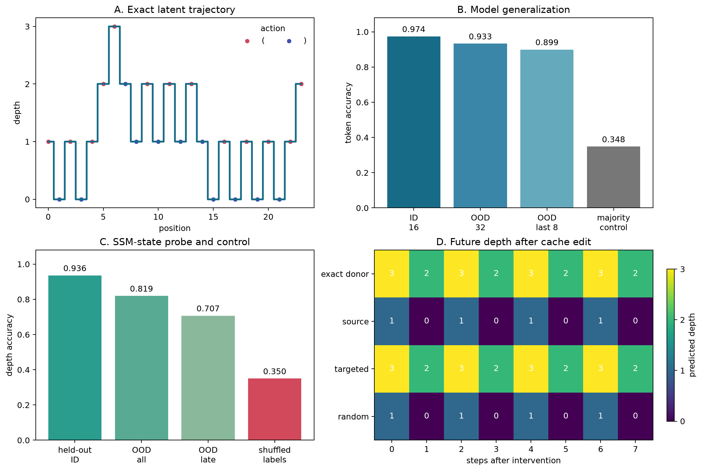
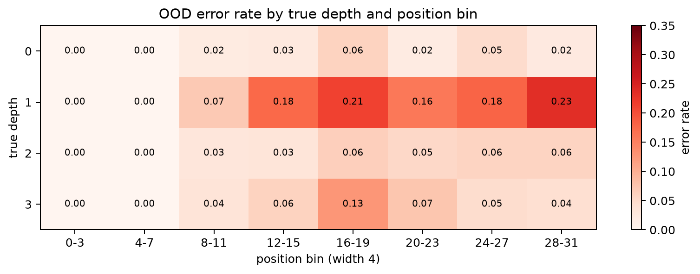

# [5.4] Mamba State Tracking

## Core Question

When a recurrent model solves bracket-depth tracking, does its recurrent SSM cache carry
the exact latent depth, and does editing that cache change its future predictions?

**Claim.** On a bounded bracket-depth model organism with exact labels, a tiny Mamba
trained on length-16 sequences decodes depth on length-32 sequences, and an exact
donor-state transplant reproduces the donor's future trajectory while a matched-norm
random edit fails.



## Section Metadata

| Release field | Value |
| --- | --- |
| Exercise | `EXERCISE_ID = "5_4_mamba_state_tracking"` |
| Ground-truth tier | `GT_TIER = "GT-1"` |
| Difficulty | `DIFFICULTY = 4` |
| Importance | `IMPORTANCE = 4` |
| Expected runtime | `EXPECTED_RUNTIME = "seconds on toy contract; minutes on local real-model path"` |
| GPU Contract | `REQUIRES_GPU = True` for the optional release verification; the learner training, probing, and signature result run on CPU. |

The learner task uses a one-layer `TinyMambaModel` from section 5.3, trains on length 16,
and evaluates out of distribution on length 32. Allow 60-90 minutes for the exercises.

## Learning Objectives

By the end of this notebook, you will be able to:

- generate exact per-token latent-state labels;
- train the existing tiny Mamba path to track them;
- decode depth from the recurrent SSM cache on held-out and longer sequences;
- build majority, shuffled-label, and matched-random controls;
- perform a targeted recurrent-state transplant;
- inspect confident OOD errors and position-by-state heatmaps.

## Cold open: the answer is known before the model runs

Token `1` is `(` and token `0` is `)`. The depth after position $t$ is

$$d_t = \sum_{i=0}^{t} (2x_i - 1).$$

Actions are sampled randomly, with opens forced at depth zero and closes forced at the
maximum. This makes every prefix valid and gives exact ground truth at every token. The
first notebook figure shows actions and depth as a visible trajectory.

### Exercise - generate valid actions and exact depth

```yaml
Difficulty: easy
Importance: high
Suggested time: 10 minutes
```

Implement `generate_bracket_depth_task`, update depth after every valid action, and run the
immediate recurrence and bound tests.

<details><summary>Expected output</summary>

```text
All tests in `test_generate_bracket_depth_task_is_bounded_and_consistent` passed!
exact recurrence: True; bounds: [0, 3]
```
</details>

<details><summary>Help - common bug: clipping depth after an invalid action</summary>

Override invalid boundary actions before updating depth. Clipping afterward breaks the
exact relationship between the visible token and the state transition.
</details>

<details><summary>Interpretation</summary>

The trajectory is exact task ground truth. It is independent of model predictions and
probes, so later failures remain measurable rather than becoming matters of interpretation.
</details>

<details><summary>Solution</summary>

```python
        def generate_bracket_depth_task(
    batch: int,
    seq_len: int,
    *,
    max_depth: int = 4,
    seed: int = 0,
) -> StateTrackingBatch:
    """Generate bracket actions labelled by the bounded nonnegative stack depth."""

    generator = t.Generator().manual_seed(seed)
    tokens = t.zeros(batch, seq_len, dtype=t.long)
    states = t.zeros(batch, seq_len, dtype=t.long)
    depth = t.zeros(batch, dtype=t.long)

    for pos in range(seq_len):
        proposed_open = t.randint(0, 2, (batch,), generator=generator).bool()
        must_open = depth == 0
        must_close = depth == max_depth
        open_token = (proposed_open | must_open) & ~must_close
        depth = depth + t.where(open_token, t.ones_like(depth), -t.ones_like(depth))
        tokens[:, pos] = open_token.long()
        states[:, pos] = depth

    return StateTrackingBatch(
        tokens=tokens,
        states=states,
        task="bracket_depth",
        vocab={0: ")", 1: "("},
    )

```
</details>

## Train the existing Mamba path

`TinyMambaStateClassifier` uses `MambaConfig` and `TinyMambaModel` from section 5.3 and
adds a token-level four-class head. The student implements both the wrapper and CPU
training loop; the recurrence itself remains the already-tested 5.3 implementation.

### Exercise - expose token states and train on all positions

```yaml
Difficulty: medium
Importance: high
Suggested time: 15-20 minutes
```

<details><summary>Expected output</summary>

```text
All tests in `test_mamba_state_tracker_shapes` passed!
All tests in `test_cpu_training_reduces_loss` passed!
ID length 16 accuracy: 0.974
OOD length 32 accuracy: 0.933
OOD final-8 accuracy: 0.899
majority-depth baseline: 0.348
```
</details>

<details><summary>Help - common bug: training only the final token</summary>

Apply the head to every hidden vector and flatten batch and sequence axes for
cross-entropy. Keep execution on CPU.
</details>

<details><summary>Interpretation</summary>

Length 32 is twice the training length. The gap above the majority baseline shows real
tracking behavior, while the small late-position decline motivates inspecting the cache.
</details>

<details><summary>Solution</summary>

```python
        class TinyMambaStateClassifier(nn.Module):
    """Tiny supervised Mamba organism for bracket-depth state tracking."""

    def __init__(self, num_states: int = 4):
        super().__init__()
        config = MambaConfig(
            vocab_size=2,
            d_model=32,
            d_inner=64,
            d_state=8,
            d_conv=3,
            dt_rank=4,
            num_layers=1,
            tie_word_embeddings=False,
        )
        self.backbone = TinyMambaModel(config)
        self.head = nn.Linear(config.d_model, num_states)

    def encode(self, input_ids: t.Tensor) -> t.Tensor:
        hidden_states, _ = self.backbone(input_ids)
        return hidden_states

    def forward(
        self,
        input_ids: t.Tensor,
        *,
        return_hidden_states: bool = False,
    ) -> t.Tensor | tuple[t.Tensor, t.Tensor]:
        hidden_states = self.encode(input_ids)
        logits = self.head(hidden_states)
        if return_hidden_states:
            return logits, hidden_states
        return logits

def train_state_tracker_cpu(
    *,
    steps: int = 160,
    batch_size: int = 64,
    seq_len: int = 16,
    max_depth: int = 3,
    seed: int = 0,
) -> tuple[TinyMambaStateClassifier, list[float]]:
    """Train the section 5.3 tiny Mamba path on exact bracket-depth labels."""

    t.manual_seed(seed)
    model = TinyMambaStateClassifier(num_states=max_depth + 1).cpu()
    optimizer = t.optim.AdamW(model.parameters(), lr=3e-3, weight_decay=1e-3)
    losses: list[float] = []

    model.train()
    for step in range(steps):
        batch = generate_bracket_depth_task(
            batch=batch_size,
            seq_len=seq_len,
            max_depth=max_depth,
            seed=seed + step,
        )
        logits = model(batch.tokens)
        loss = F.cross_entropy(
            logits.flatten(0, 1),
            batch.states.flatten(),
        )
        optimizer.zero_grad(set_to_none=True)
        loss.backward()
        optimizer.step()
        losses.append(float(loss.detach().item()))

    return model.eval(), losses

```
</details>

## Decode the recurrent SSM cache

Cached one-token inference exposes the convolutional history and recurrent SSM state. The
learner collects the first-layer SSM tensor after each token, flattens it, and fits a
standardized ridge probe on independent length-16 sequences. Evaluation uses held-out
length-16 sequences, all length-32 positions, and the last 16 length-32 positions.

### Exercise - collect recurrent states and fit a controlled probe

```yaml
Difficulty: hard
Importance: high
Suggested time: 20-25 minutes
```

<details><summary>Expected output</summary>

```text
held-out ID probe accuracy: 0.936
OOD probe accuracy: 0.819
late-OOD probe accuracy: 0.707
shuffled-label OOD accuracy: 0.350
```
</details>

<details><summary>Help - common bug: fitting and evaluating the probe on the same positions</summary>

Use `use_cache=True`, carry the returned cache into the next token, and flatten
`(d_inner, d_state)`. Standardize features before solving the ridge normal equation.
</details>

<details><summary>Interpretation</summary>

The probe beats shuffled labels on held-out and OOD data, so depth is linearly accessible.
Its late-OOD decline prevents the stronger claim that the code is perfectly stable.
</details>

<details><summary>Solution</summary>

```python
        @dataclass(frozen=True)
class StateProbe:
    """Standardized linear probe over flattened recurrent SSM states."""

    mean: t.Tensor
    scale: t.Tensor
    weight: t.Tensor
    bias: t.Tensor

@t.inference_mode()
def collect_recurrent_states(
    model: TinyMambaStateClassifier,
    tokens: t.Tensor,
) -> tuple[t.Tensor, t.Tensor]:
    """Run cached one-token steps and collect logits plus the first-layer SSM state."""

    cache = None
    logits_by_position: list[t.Tensor] = []
    states_by_position: list[t.Tensor] = []
    for position in range(tokens.shape[1]):
        hidden, cache = model.backbone(
            tokens[:, position : position + 1],
            states=cache,
            use_cache=True,
        )
        assert cache is not None and len(cache) == 1
        logits_by_position.append(model.head(hidden))
        states_by_position.append(cache[0].ssm_state.flatten(start_dim=1))

    return t.cat(logits_by_position, dim=1), t.stack(states_by_position, dim=1)

def fit_state_probe(
    recurrent_states: t.Tensor,
    labels: t.Tensor,
    *,
    num_classes: int | None = None,
    ridge: float = 1e-2,
    shuffle_labels: bool = False,
    seed: int = 0,
) -> StateProbe:
    """Fit a standardized closed-form ridge probe to recurrent SSM states."""

    if recurrent_states.shape[:-1] != labels.shape:
        raise ValueError("recurrent state leading dimensions must match labels")
    x = recurrent_states.flatten(0, -2).float()
    y = labels.flatten().long()
    if num_classes is None:
        num_classes = int(labels.max().item()) + 1
    if shuffle_labels:
        generator = t.Generator(device=y.device).manual_seed(seed)
        y = y[t.randperm(y.numel(), generator=generator, device=y.device)]

    mean = x.mean(dim=0)
    scale = x.std(dim=0, unbiased=False).clamp_min(1e-4)
    standardized = (x - mean) / scale
    design = t.cat([standardized, t.ones(x.shape[0], 1, device=x.device)], dim=-1)
    targets = F.one_hot(y, num_classes=num_classes).float()
    penalty = t.eye(design.shape[-1], device=x.device, dtype=x.dtype)
    penalty[-1, -1] = 0.0
    solution = t.linalg.solve(
        design.T @ design + ridge * penalty,
        design.T @ targets,
    )
    return StateProbe(
        mean=mean,
        scale=scale,
        weight=solution[:-1],
        bias=solution[-1],
    )

def state_probe_logits(recurrent_states: t.Tensor, probe: StateProbe) -> t.Tensor:
    standardized = (recurrent_states.float() - probe.mean) / probe.scale
    return standardized @ probe.weight + probe.bias

def state_probe_accuracy(
    recurrent_states: t.Tensor,
    labels: t.Tensor,
    probe: StateProbe,
    mask: t.Tensor | None = None,
) -> float:
    predictions = state_probe_logits(recurrent_states, probe).argmax(dim=-1)
    if mask is not None:
        predictions = predictions[mask]
        labels = labels[mask]
    return float(predictions.eq(labels).float().mean().item())

```
</details>

## Causal state edit

The source and donor prefixes differ in depth at position 5 but share their last two
actions and all future actions. Because `d_conv=3`, the local convolutional histories
match. Copying only the donor SSM tensor therefore isolates the long-running recurrent
state. A random state delta with the same norm is the headline control.

### Exercise - transplant a targeted recurrent state

```yaml
Difficulty: hard
Importance: high
Suggested time: 20-25 minutes
```

<details><summary>Expected output</summary>

```text
targeted transplant donor-trajectory match: 1.000
targeted mean donor-state probability: 0.897
matched random donor-trajectory match: 0.000
matched random mean donor-state probability: 0.000096
```
</details>

<details><summary>Help - common bug: replacing the convolutional history with the donor's</summary>

Preserve the source convolutional cache and replace its SSM cache with the donor's. For
the control, normalize a seeded random tensor to the exact donor-minus-source delta norm.
</details>

<details><summary>Interpreting the result</summary>

The exact donor continuation follows from deterministic cache semantics, and the trained
model maps that continuation to the correct counterfactual depth sequence. The random edit
demonstrates that edit magnitude alone does not explain the result.
</details>

<details><summary>Solution</summary>

```python
        @t.inference_mode()
def cache_after_position(
    model: TinyMambaStateClassifier,
    tokens: t.Tensor,
    position: int,
):
    """Return the recurrent cache after consuming tokens through `position`."""

    if not 0 <= position < tokens.shape[1]:
        raise ValueError("position is outside the sequence")
    cache = None
    for index in range(position + 1):
        _, cache = model.backbone(
            tokens[:, index : index + 1],
            states=cache,
            use_cache=True,
        )
    assert cache is not None
    return cache

def transplant_ssm_state(source_cache, donor_cache):
    """Copy only the donor SSM state, preserving the source convolutional history."""

    if len(source_cache) != 1 or len(donor_cache) != 1:
        raise ValueError("this lesson expects a one-layer tiny Mamba")
    state_type = type(source_cache[0])
    return (
        state_type(
            conv_state=source_cache[0].conv_state,
            ssm_state=donor_cache[0].ssm_state,
        ),
    )

def matched_random_state_edit(source_cache, donor_cache, *, seed: int = 0):
    """Add a random SSM-state delta with the transplant delta's exact norm."""

    source_state = source_cache[0]
    target_delta = donor_cache[0].ssm_state - source_state.ssm_state
    generator = t.Generator(device=target_delta.device).manual_seed(seed)
    random_delta = t.randn(
        target_delta.shape,
        generator=generator,
        device=target_delta.device,
        dtype=target_delta.dtype,
    )
    random_delta = random_delta / random_delta.norm().clamp_min(1e-8)
    random_delta = random_delta * target_delta.norm()
    state_type = type(source_state)
    return (
        state_type(
            conv_state=source_state.conv_state,
            ssm_state=source_state.ssm_state + random_delta,
        ),
    )

@t.inference_mode()
def continue_from_cache(
    model: TinyMambaStateClassifier,
    suffix_tokens: t.Tensor,
    cache,
) -> t.Tensor:
    """Continue cached Mamba inference and return one logit vector per suffix token."""

    outputs: list[t.Tensor] = []
    for position in range(suffix_tokens.shape[1]):
        hidden, cache = model.backbone(
            suffix_tokens[:, position : position + 1],
            states=cache,
            use_cache=True,
        )
        outputs.append(model.head(hidden))
    return t.cat(outputs, dim=1)

def make_matched_state_pair() -> tuple[t.Tensor, t.Tensor, int]:
    """Return prefixes with different depths but identical local history and suffix."""

    source = t.tensor([[1, 0, 1, 0, 1, 0, 1, 0, 1, 0, 1, 0, 1, 0]])
    donor = t.tensor([[1, 1, 0, 1, 1, 0, 1, 0, 1, 0, 1, 0, 1, 0]])
    return source, donor, 5

@t.inference_mode()
def run_state_transplant(
    model: TinyMambaStateClassifier,
    source_tokens: t.Tensor,
    donor_tokens: t.Tensor,
    edit_position: int,
    *,
    random_seed: int = 0,
) -> dict[str, t.Tensor | float]:
    """Compare an exact donor-state transplant with a matched random SSM edit."""

    conv_width = model.backbone.config.d_conv - 1
    local_start = max(0, edit_position - conv_width + 1)
    if not t.equal(
        source_tokens[:, local_start : edit_position + 1],
        donor_tokens[:, local_start : edit_position + 1],
    ):
        raise ValueError("source and donor must share the convolutional history at the edit")
    if not t.equal(source_tokens[:, edit_position + 1 :], donor_tokens[:, edit_position + 1 :]):
        raise ValueError("source and donor must share the suffix after the edit")

    source_cache = cache_after_position(model, source_tokens, edit_position)
    donor_cache = cache_after_position(model, donor_tokens, edit_position)
    suffix = source_tokens[:, edit_position + 1 :]
    patched_cache = transplant_ssm_state(source_cache, donor_cache)
    random_cache = matched_random_state_edit(
        source_cache,
        donor_cache,
        seed=random_seed,
    )

    source_logits = model(source_tokens)[:, edit_position + 1 :]
    donor_logits = model(donor_tokens)[:, edit_position + 1 :]
    patched_logits = continue_from_cache(model, suffix, patched_cache)
    random_logits = continue_from_cache(model, suffix, random_cache)
    donor_states = t.where(donor_tokens.bool(), 1, -1).cumsum(dim=-1)[:, edit_position + 1 :]

    def score(logits: t.Tensor) -> tuple[float, float]:
        probabilities = logits.softmax(dim=-1)
        predictions = probabilities.argmax(dim=-1)
        accuracy = predictions.eq(donor_states).float().mean().item()
        target_probability = probabilities.gather(-1, donor_states[..., None]).mean().item()
        return float(accuracy), float(target_probability)

    source_match, source_probability = score(source_logits)
    patched_match, patched_probability = score(patched_logits)
    random_match, random_probability = score(random_logits)
    return {
        "source_logits": source_logits,
        "donor_logits": donor_logits,
        "patched_logits": patched_logits,
        "random_logits": random_logits,
        "donor_states": donor_states,
        "source_match": source_match,
        "source_target_probability": source_probability,
        "patched_match": patched_match,
        "patched_target_probability": patched_probability,
        "random_match": random_match,
        "random_target_probability": random_probability,
    }

```
</details>

## Signature Result

The signature figure is produced directly by the CPU notebook. It combines the exact
latent trajectory, ID/OOD model metrics with a majority baseline, recurrent-state probe
metrics with shuffled labels, and the future predictions for source, donor, targeted, and
matched-random caches. No verification JSON is used as lesson evidence.

## Try It Yourself

Change the play cell's sequence length to `48` or `64` and its seed. Find the first
position below `0.8` accuracy. Then alter the matched source and donor prefixes while
preserving the final two prefix tokens and suffix, and rerun the state transplant.

## Bonus - anomaly hunting

Implement `find_confident_errors` to rank wrong OOD predictions by confidence and retain
their exact prefixes. The notebook then draws this heatmap:



<details><summary>Expected output</summary>

The top errors are real late-sequence, high-confidence, off-by-one mistakes. The heatmap
shows which true depths and position bins carry the failures.
</details>

<details><summary>Help - common bug: ranking correct predictions as anomalies</summary>

Compute softmax confidence, mask wrong predictions, sort descending, and reconstruct the
exact prefix from token IDs.
</details>

<details><summary>Interpretation</summary>

Concentrated off-by-one errors are consistent with accumulated state drift. This is an
anomaly to investigate, not proof of a particular internal failure mechanism.
</details>

<details><summary>Solution</summary>

```python
        def find_confident_errors(
    tokens: t.Tensor,
    labels: t.Tensor,
    logits: t.Tensor,
    *,
    k: int = 8,
) -> list[dict[str, object]]:
    """Return the most confident wrong OOD predictions with their exact prefixes."""

    probabilities = logits.softmax(dim=-1)
    confidence, predictions = probabilities.max(dim=-1)
    wrong = predictions.ne(labels)
    candidates = wrong.nonzero(as_tuple=False)
    if candidates.numel() == 0:
        return []
    scores = confidence[wrong]
    order = scores.argsort(descending=True)[:k]
    records: list[dict[str, object]] = []
    for candidate_index in order:
        batch_index, position = candidates[int(candidate_index)]
        prefix = "".join(
            "(" if int(token) == 1 else ")"
            for token in tokens[batch_index, : position + 1]
        )
        records.append(
            {
                "sequence": int(batch_index),
                "position": int(position),
                "prefix": prefix,
                "true_depth": int(labels[batch_index, position]),
                "predicted_depth": int(predictions[batch_index, position]),
                "confidence": float(confidence[batch_index, position]),
            }
        )
    return records

```
</details>

## Limitations

This is an exact generated task and a one-layer model organism. It does not establish that
a pretrained Mamba language model tracks bracket depth. The probe drops from `0.936` ID to
`0.707` on late OOD positions. The intervention copies the full SSM tensor, so it proves
causal sufficiency under a controlled matched pair but does not identify a sparse feature.
Results use one initialization and should be repeated across seeds and task distributions
before making broader architecture claims.

## Reading links

- [Mamba: Linear-Time Sequence Modeling with Selective State Spaces](https://arxiv.org/abs/2312.00752)
- [Emergent World Representations](https://arxiv.org/abs/2210.13382)
- [ARENA OthelloGPT exercises](../../../chapter1_transformer_interp/exercises/part53_othellogpt/1.5.3_OthelloGPT_exercises.ipynb)
- [Section 5.3 Mamba from Scratch](../../exercises/part3_mamba_from_scratch/5.3_Mamba_from_Scratch_exercises.ipynb)
