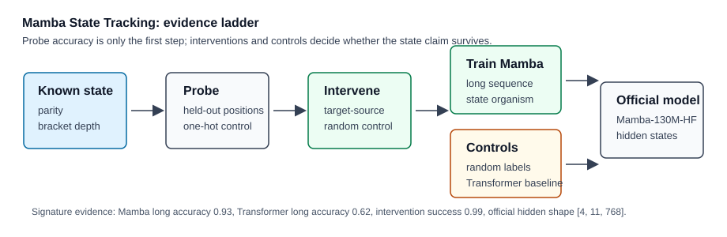

# [5.4] Mamba State Tracking


> **Local-first extension.** This section turns the Mamba recurrence into a model-organism lab. You will build synthetic latent-state tasks, fit probes to hidden states, test held-out positions, and perform causal interventions.

Please send any problems / bugs on the `#errata` channel in the [Slack group](https://info-arena.github.io/ARENA_img/slack.html), and ask any questions on the dedicated channels for this chapter of material.

If you want to change to dark mode, you can do this by clicking the three horizontal lines in the top-right, then navigating to Settings -> Theme.

Links to earlier chapters: [(0) Fundamentals](https://arena-chapter0-fundamentals.streamlit.app/), [(1) Transformer Interpretability](https://arena-chapter1-transformer-interp.streamlit.app/), [(2) RL](https://arena-chapter2-rl.streamlit.app/), [(3) LLM Evaluations](https://arena-chapter3-llm-evals.streamlit.app/), [(4) Alignment Science](https://arena-chapter4-alignment-science.streamlit.app/).


## Notebook Metadata

```yaml
gt_tier: GT-1
exercise_id: 5_4_mamba_state_tracking
expected_runtime: 60-90 minutes for CPU exercises; 5-10 minutes for CUDA verification
requires_gpu: true for trained model-organism verification; false for the probe exercises
```


# Reading Material

You should already understand the selective-scan implementation from [5.3]. For this
section, review the ARENA linear-probe and OthelloGPT material from Chapter 1, then skim
the Mamba paper's discussion of hidden state and recurrent inference. The important
conceptual shift is that Mamba has two state-like objects: the learned residual stream
you can probe at every token, and the recurrent SSM state used internally for fast
generation.


# Introduction


The previous section verified that a tiny Mamba-style block has the right recurrence mechanics. This section asks a mechanistic question: when a sequence model solves a task that requires a latent state, where is that state represented, and can we control it?

The roadmap suggests tasks like bracket depth, parity, key-value updates, and maze-room tracking. We start with two robust local model organisms:

* **Parity tracking:** the latent state is cumulative XOR of binary tokens.
* **Bracket-depth tracking:** the latent state is the current stack depth after each bracket action.

The first exercises use synthetic one-hot hidden states. This keeps the probe and
intervention machinery testable before you train a model. The release verification then
trains a tiny Mamba bracket-depth classifier on GPU, checks longer-sequence
generalization, verifies that a random-label training control fails, compares against a
trained tiny causal Transformer baseline, performs learned Mamba hidden-state
interventions with matched random-direction controls, and loads a pinned official
Mamba-130M-HF checkpoint for real hidden-state extraction.

The ladder below is the evidence standard for this section. A probe is only the
first diagnostic. The state-tracking claim becomes meaningful after held-out
positions, causal interventions, random controls, trained model organisms, and
a scoped official-checkpoint hidden-state preflight.




## Content & Learning Objectives

### 1. Synthetic state-tracking tasks

You will generate sequences where the true latent state is known at every position.

> ##### Learning Objectives
>
> * Build parity and bracket-depth datasets with exact labels.
> * Distinguish observable tokens from latent states.
> * Create held-out later-position splits for OOD-style checks.

### 2. Linear probes over latent states

You will fit closed-form ridge probes to hidden states and report train/test accuracy.

> ##### Learning Objectives
>
> * Fit a linear probe without a training loop.
> * Evaluate generalization to held-out later positions.
> * Treat high probe accuracy as evidence of accessibility, not causality.

### 3. Causal interventions

You will move a hidden state along a probe-derived target-minus-source direction and check whether the predicted latent state flips.

> ##### Learning Objectives
>
> * Construct a state intervention direction from probe weights.
> * Verify target logit movement.
> * Compare against a random-direction control.

### 4. Full model-organism path

The smoke tests prove the analysis pipeline. The GPU verification proves a trained tiny
Mamba can learn bracket-depth state tracking and generalize beyond the training sequence
length under a fixed seed, while a random-label control does not. It also trains a tiny
causal Transformer baseline and records the measured long-sequence gap, then intervenes
on learned Mamba hidden states and checks that a matched random direction does not
explain the effect.


## Setup Code


```python
import sys
from dataclasses import dataclass
from pathlib import Path

import torch as t
from torch import nn
import torch.nn.functional as F

chapter = "chapter5_modern_architectures"
section = "part4_mamba_state_tracking"
root_dir = next(p for p in [Path.cwd(), *Path.cwd().parents] if (p / chapter).exists())
exercises_dir = root_dir / chapter / "exercises"
section_dir = exercises_dir / section

if str(root_dir) not in sys.path:
    sys.path.append(str(root_dir))
if str(exercises_dir) not in sys.path:
    sys.path.append(str(exercises_dir))

import part4_mamba_state_tracking.tests as tests
import part4_mamba_state_tracking.utils as utils

from arena_ext.mamba import MambaConfig, TinyMambaModel

MAIN = __name__ == "__main__"


@dataclass(frozen=True)
class StateTrackingBatch:
    tokens: t.Tensor
    states: t.Tensor
    task: str
    vocab: dict[int, str]


@dataclass(frozen=True)
class LinearProbe:
    weight: t.Tensor
    bias: t.Tensor


@dataclass(frozen=True)
class ProbeReport:
    train_accuracy: float
    test_accuracy: float
    num_train: int
    num_test: int


@dataclass(frozen=True)
class InterventionReport:
    source_prediction: int
    target_prediction: int
    intervened_prediction: int
    target_logit_delta: float
    passed: bool
```


# Synthetic Tasks


### Exercise - generate a parity tracking task

> ```yaml
> Difficulty: easy
> Importance: high
>
> You should spend up to 5-10 mins on this exercise.
> ```

The parity state is the cumulative XOR of all tokens seen so far. The input tokens are observable; the parity labels are the latent state you will later try to decode from hidden states.

```python
def generate_parity_task(batch: int, seq_len: int, seed: int = 0) -> StateTrackingBatch:
    raise NotImplementedError()


tests.test_generate_parity_task_matches_cumulative_xor(generate_parity_task)
```

<details><summary>Solution</summary>

```python
def generate_parity_task(batch: int, seq_len: int, seed: int = 0) -> StateTrackingBatch:
    generator = t.Generator().manual_seed(seed)
    tokens = t.randint(0, 2, (batch, seq_len), generator=generator)
    states = tokens.cumsum(dim=-1) % 2
    return StateTrackingBatch(tokens=tokens, states=states, task="parity", vocab={0: "0", 1: "1"})
```
</details>

<details><summary>Expected output</summary>

```text
All tests in `test_generate_parity_task_matches_cumulative_xor` passed!
```
</details>

Common bug: using `tokens.sum()` over the whole sequence gives one label per sequence. You need a state at every position.

<details><summary>Help - tokens are not states</summary>

In these tasks the input token is observable, but the model has to maintain a
running latent variable. A parity label at position `t` depends on every earlier
token, and a bracket-depth label depends on the whole prefix of open/close
actions. This is why the labels have shape `(batch, seq)`, not `(batch,)`.

</details>


### Exercise - generate a bounded bracket-depth task

> ```yaml
> Difficulty: medium
> Importance: high
>
> You should spend up to 10-15 mins on this exercise.
> ```

Token `1` means `"("`; token `0` means `")"`. Your generator should keep the stack depth nonnegative and no larger than `max_depth`, while still producing a random-looking sequence of opens and closes.

```python
def generate_bracket_depth_task(
    batch: int,
    seq_len: int,
    *,
    max_depth: int = 4,
    seed: int = 0,
) -> StateTrackingBatch:
    raise NotImplementedError()


tests.test_generate_bracket_depth_task_is_bounded_and_consistent(generate_bracket_depth_task)
```

<details><summary>Solution</summary>

```python
def generate_bracket_depth_task(
    batch: int,
    seq_len: int,
    *,
    max_depth: int = 4,
    seed: int = 0,
) -> StateTrackingBatch:
    generator = t.Generator().manual_seed(seed)
    tokens = t.zeros(batch, seq_len, dtype=t.long)
    states = t.zeros(batch, seq_len, dtype=t.long)
    depth = t.zeros(batch, dtype=t.long)

    for pos in range(seq_len):
        proposed_open = t.randint(0, 2, (batch,), generator=generator).bool()
        must_open = depth == 0
        must_close = depth == max_depth
        open_token = (proposed_open | must_open) & ~must_close
        depth = depth + t.where(open_token, t.ones_like(depth), -t.ones_like(depth))
        tokens[:, pos] = open_token.long()
        states[:, pos] = depth

    return StateTrackingBatch(
        tokens=tokens,
        states=states,
        task="bracket_depth",
        vocab={0: ")", 1: "("},
    )
```
</details>

<details><summary>Expected output</summary>

```text
All tests in `test_generate_bracket_depth_task_is_bounded_and_consistent` passed!
```
</details>

Common bug: clipping the depth after sampling a close at zero breaks the relationship between token deltas and labels. Force the action before updating the state.

<details><summary>Help - why force the action before updating?</summary>

If you sample a close at depth zero and then clip the depth back to zero, the
token says `")"` but the state transition says "no close happened." The tests
check that states equal the cumulative sum of the actual token deltas, so choose
a valid action before the update.

</details>


# Linear Probes


### Exercise - construct synthetic hidden states and held-out positions

> ```yaml
> Difficulty: medium
> Importance: high
>
> You should spend up to 10-15 mins on this exercise.
> ```

Before training Mamba, build a control setting where the hidden state literally contains the latent state as a one-hot vector. This lets you debug the probe math without wondering whether the model learned the task.

```python
def one_hot_state_features(
    states: t.Tensor,
    num_states: int | None = None,
    *,
    noise_scale: float = 0.0,
    seed: int = 0,
) -> t.Tensor:
    raise NotImplementedError()


def make_position_split(
    states: t.Tensor,
    *,
    train_fraction: float = 0.5,
) -> tuple[t.Tensor, t.Tensor]:
    raise NotImplementedError()


tests.test_one_hot_state_features_shape_noise_and_reference(one_hot_state_features)
tests.test_make_position_split_masks_are_ordered_and_disjoint(make_position_split)
```

<details><summary>Solution</summary>

```python
def one_hot_state_features(
    states: t.Tensor,
    num_states: int | None = None,
    *,
    noise_scale: float = 0.0,
    seed: int = 0,
) -> t.Tensor:
    if num_states is None:
        num_states = int(states.max().item()) + 1
    features = F.one_hot(states.long(), num_classes=num_states).float()
    if noise_scale > 0:
        generator = t.Generator(device=features.device).manual_seed(seed)
        noise = t.randn(features.shape, generator=generator, device=features.device)
        features = features + noise_scale * noise
    return features


def make_position_split(
    states: t.Tensor,
    *,
    train_fraction: float = 0.5,
) -> tuple[t.Tensor, t.Tensor]:
    if not 0 < train_fraction < 1:
        raise ValueError("train_fraction must be between 0 and 1.")
    seq_len = states.shape[-1]
    split = max(1, min(seq_len - 1, int(seq_len * train_fraction)))
    position = t.arange(seq_len, device=states.device)
    train_mask = position[None, :] < split
    test_mask = ~train_mask
    return train_mask.expand_as(states), test_mask.expand_as(states)
```
</details>

<details><summary>Expected output</summary>

```text
All tests in `test_one_hot_state_features_shape_noise_and_reference` passed!
All tests in `test_make_position_split_masks_are_ordered_and_disjoint` passed!
```
</details>

Common bug: randomly splitting individual tokens makes train and test distributions identical. Here we want a harder later-position split.

<details><summary>Help - why held-out positions matter</summary>

A probe can overfit position-specific shortcuts. Training on early positions and
testing on later positions asks whether the same state variable is linearly
available across the sequence, not just whether the probe memorized a local
position pattern.

</details>


### Exercise - fit a closed-form linear probe

> ```yaml
> Difficulty: medium
> Importance: high
>
> You should spend up to 15-20 mins on this exercise.
> ```

Fit a ridge-regression classifier from hidden states to latent-state labels. The probe should train on early positions and generalize to later positions in the synthetic one-hot control.

```python
def _flatten_masked(
    hidden_states: t.Tensor,
    labels: t.Tensor,
    mask: t.Tensor | None,
) -> tuple[t.Tensor, t.Tensor]:
    raise NotImplementedError()


def fit_linear_probe(
    hidden_states: t.Tensor,
    labels: t.Tensor,
    *,
    num_classes: int | None = None,
    train_mask: t.Tensor | None = None,
    ridge: float = 1e-3,
) -> LinearProbe:
    raise NotImplementedError()


def probe_logits(hidden_states: t.Tensor, probe: LinearProbe) -> t.Tensor:
    raise NotImplementedError()


def probe_predictions(hidden_states: t.Tensor, probe: LinearProbe) -> t.Tensor:
    raise NotImplementedError()


def probe_accuracy(
    hidden_states: t.Tensor,
    labels: t.Tensor,
    probe: LinearProbe,
    mask: t.Tensor | None = None,
) -> float:
    raise NotImplementedError()


def evaluate_probe_generalization(
    hidden_states: t.Tensor,
    labels: t.Tensor,
    probe: LinearProbe,
    train_mask: t.Tensor,
    test_mask: t.Tensor,
) -> ProbeReport:
    raise NotImplementedError()


tests.test_fit_linear_probe_recovers_held_out_one_hot_states(
    fit_linear_probe,
    one_hot_state_features,
    make_position_split,
    evaluate_probe_generalization,
    probe_predictions,
)
```

<details><summary>Solution</summary>

```python
def _flatten_masked(hidden_states: t.Tensor, labels: t.Tensor, mask: t.Tensor | None):
    if hidden_states.shape[:-1] != labels.shape:
        raise ValueError("hidden_states leading dimensions must match labels.")
    flat_x = hidden_states.reshape(-1, hidden_states.shape[-1]).float()
    flat_y = labels.reshape(-1).long()
    if mask is None:
        return flat_x, flat_y
    flat_mask = mask.reshape(-1).bool()
    return flat_x[flat_mask], flat_y[flat_mask]


def fit_linear_probe(
    hidden_states: t.Tensor,
    labels: t.Tensor,
    *,
    num_classes: int | None = None,
    train_mask: t.Tensor | None = None,
    ridge: float = 1e-3,
) -> LinearProbe:
    x, y = _flatten_masked(hidden_states, labels, train_mask)
    if num_classes is None:
        num_classes = int(labels.max().item()) + 1
    y_one_hot = F.one_hot(y, num_classes=num_classes).float()
    ones = t.ones(x.shape[0], 1, device=x.device, dtype=x.dtype)
    x_aug = t.cat([x, ones], dim=-1)
    eye = t.eye(x_aug.shape[-1], device=x.device, dtype=x.dtype)
    eye[-1, -1] = 0.0
    solution = t.linalg.solve(x_aug.T @ x_aug + ridge * eye, x_aug.T @ y_one_hot)
    return LinearProbe(weight=solution[:-1], bias=solution[-1])


def probe_logits(hidden_states: t.Tensor, probe: LinearProbe) -> t.Tensor:
    return hidden_states.float() @ probe.weight + probe.bias


def probe_predictions(hidden_states: t.Tensor, probe: LinearProbe) -> t.Tensor:
    return probe_logits(hidden_states, probe).argmax(dim=-1)


def probe_accuracy(hidden_states: t.Tensor, labels: t.Tensor, probe: LinearProbe, mask=None) -> float:
    predictions = probe_predictions(hidden_states, probe)
    if mask is not None:
        predictions = predictions[mask.bool()]
        labels = labels[mask.bool()]
    return predictions.eq(labels).float().mean().item()


def evaluate_probe_generalization(
    hidden_states: t.Tensor,
    labels: t.Tensor,
    probe: LinearProbe,
    train_mask: t.Tensor,
    test_mask: t.Tensor,
) -> ProbeReport:
    return ProbeReport(
        train_accuracy=probe_accuracy(hidden_states, labels, probe, train_mask),
        test_accuracy=probe_accuracy(hidden_states, labels, probe, test_mask),
        num_train=int(train_mask.sum().item()),
        num_test=int(test_mask.sum().item()),
    )
```
</details>

<details><summary>Expected output</summary>

```text
All tests in `test_fit_linear_probe_recovers_held_out_one_hot_states` passed!
```
</details>

Common bug: fitting without a bias term can make the one-hot control look worse than it is, especially after you add noise.

<details><summary>Help - interpreting high probe accuracy</summary>

High probe accuracy means the state is easy to decode from the representation.
It does not prove the model uses that direction to compute its output. The next
exercise adds an intervention because accessibility and causality are different
claims.

</details>


# Causal Interventions


### Exercise - flip a latent state with a probe direction

> ```yaml
> Difficulty: medium
> Importance: high
>
> You should spend up to 10-15 mins on this exercise.
> ```

Probe accuracy is not causality. A stronger test is to intervene on a hidden state and check whether the decoded latent variable changes as predicted.

```python
def state_intervention_direction(
    probe: LinearProbe,
    source_state: int,
    target_state: int,
) -> t.Tensor:
    raise NotImplementedError()


def apply_state_intervention(
    hidden_state: t.Tensor,
    probe: LinearProbe,
    *,
    source_state: int,
    target_state: int,
    coefficient: float = 1.0,
) -> t.Tensor:
    raise NotImplementedError()


def intervention_report(
    hidden_state: t.Tensor,
    probe: LinearProbe,
    *,
    source_state: int,
    target_state: int,
    coefficient: float = 1.0,
) -> InterventionReport:
    raise NotImplementedError()


def random_direction_control(
    hidden_state: t.Tensor,
    probe: LinearProbe,
    *,
    target_state: int,
    coefficient: float = 1.0,
    seed: int = 0,
) -> int:
    raise NotImplementedError()


tests.test_probe_intervention_flips_decoded_state_with_random_control(
    intervention_report,
    random_direction_control,
)
```

<details><summary>Solution</summary>

```python
def state_intervention_direction(probe: LinearProbe, source_state: int, target_state: int) -> t.Tensor:
    if source_state == target_state:
        raise ValueError("source_state and target_state must differ.")
    return probe.weight[:, target_state] - probe.weight[:, source_state]


def apply_state_intervention(
    hidden_state: t.Tensor,
    probe: LinearProbe,
    *,
    source_state: int,
    target_state: int,
    coefficient: float = 1.0,
) -> t.Tensor:
    direction = state_intervention_direction(probe, source_state, target_state)
    direction = direction.to(device=hidden_state.device, dtype=hidden_state.dtype)
    return hidden_state + coefficient * direction


def intervention_report(
    hidden_state: t.Tensor,
    probe: LinearProbe,
    *,
    source_state: int,
    target_state: int,
    coefficient: float = 1.0,
) -> InterventionReport:
    logits_before = probe_logits(hidden_state, probe)
    intervened = apply_state_intervention(
        hidden_state,
        probe,
        source_state=source_state,
        target_state=target_state,
        coefficient=coefficient,
    )
    logits_after = probe_logits(intervened, probe)
    source_prediction = int(logits_before.argmax(dim=-1).item())
    intervened_prediction = int(logits_after.argmax(dim=-1).item())
    target_delta = (logits_after[..., target_state] - logits_before[..., target_state]).item()
    return InterventionReport(
        source_prediction=source_prediction,
        target_prediction=target_state,
        intervened_prediction=intervened_prediction,
        target_logit_delta=float(target_delta),
        passed=intervened_prediction == target_state,
    )


def random_direction_control(
    hidden_state: t.Tensor,
    probe: LinearProbe,
    *,
    target_state: int,
    coefficient: float = 1.0,
    seed: int = 0,
) -> int:
    generator = t.Generator(device=hidden_state.device).manual_seed(seed)
    random_dir = t.randn(hidden_state.shape, generator=generator, device=hidden_state.device)
    target_dir = probe.weight[:, target_state].to(device=hidden_state.device)
    random_dir = random_dir / random_dir.norm().clamp_min(1e-8) * target_dir.norm()
    logits = probe_logits(hidden_state + coefficient * random_dir, probe)
    return int(logits.argmax(dim=-1).item())
```
</details>

<details><summary>Expected output</summary>

```text
All tests in `test_probe_intervention_flips_decoded_state_with_random_control` passed!
```
</details>

Common bug: adding the target class vector alone is weaker than adding the target-minus-source direction; the intervention should raise the target logit relative to the source logit.

<details><summary>Help - what the random direction controls</summary>

Large hidden-state edits can change predictions for uninteresting reasons. The
random control uses a matched-norm direction, so the evidence is not just that
"any big vector moves the classifier"; it is that the probe-derived direction
moves the decoded state more specifically.

</details>


# Tiny Mamba Classifier


### Exercise - wrap the 5.3 Mamba block as a state classifier

> ```yaml
> Difficulty: medium
> Importance: medium
>
> You should spend up to 10-15 mins on this exercise.
> ```

The full verification trains this classifier on bracket-depth sequences. For the notebook exercise, first make sure your wrapper exposes token-level logits and optionally returns hidden states for probing.

```python
class TinyMambaStateClassifier(nn.Module):
    def __init__(self, num_states: int = 4):
        super().__init__()
        config = MambaConfig(
            vocab_size=2,
            d_model=32,
            d_inner=64,
            d_state=8,
            d_conv=3,
            dt_rank=4,
            num_layers=1,
            tie_word_embeddings=False,
        )
        self.backbone = TinyMambaModel(config)
        self.head = nn.Linear(config.d_model, num_states)

    def encode(self, input_ids: t.Tensor) -> t.Tensor:
        raise NotImplementedError()

    def forward(
        self,
        input_ids: t.Tensor,
        *,
        return_hidden_states: bool = False,
    ) -> t.Tensor | tuple[t.Tensor, t.Tensor]:
        raise NotImplementedError()


tests.test_tiny_mamba_state_classifier_forward_shapes(TinyMambaStateClassifier)
```

<details><summary>Solution</summary>

```python
class TinyMambaStateClassifier(nn.Module):
    def __init__(self, num_states: int = 4):
        super().__init__()
        config = MambaConfig(
            vocab_size=2,
            d_model=32,
            d_inner=64,
            d_state=8,
            d_conv=3,
            dt_rank=4,
            num_layers=1,
            tie_word_embeddings=False,
        )
        self.backbone = TinyMambaModel(config)
        self.head = nn.Linear(config.d_model, num_states)

    def encode(self, input_ids: t.Tensor) -> t.Tensor:
        hidden_states, _ = self.backbone(input_ids)
        return hidden_states

    def forward(
        self,
        input_ids: t.Tensor,
        *,
        return_hidden_states: bool = False,
    ) -> t.Tensor | tuple[t.Tensor, t.Tensor]:
        hidden_states = self.encode(input_ids)
        logits = self.head(hidden_states)
        if return_hidden_states:
            return logits, hidden_states
        return logits
```
</details>

<details><summary>Expected output</summary>

```text
All tests in `test_tiny_mamba_state_classifier_forward_shapes` passed!
```
</details>

Common bug: returning only the final token hidden state makes a classifier, but not a state-tracking probe surface. You need one hidden state and one prediction per token.

<details><summary>Help - why return hidden states?</summary>

The classifier logits tell you whether the model predicts the state. The hidden
states let you ask a different question: where is the state represented, and can
an intervention on that representation change the decoded state?

</details>


# GPU Verification and Full Experiment Path


The section's `run_gpu_test` performs four non-toy checks:

1. It trains a tiny Mamba state classifier on generated bracket-depth sequences, evaluates it on longer held-out sequences, and compares it to a random-label training control.
2. It trains a tiny causal Transformer baseline on the same generated task and records the held-out longer-sequence gap.
3. It intervenes on learned Mamba hidden states using the trained readout direction and compares against matched random directions.
4. It loads `state-spaces/mamba-130m-hf` at revision `1e76775f628fbf1350fbe4dbb3d971ba64af25a1` and verifies real hidden-state extraction on CUDA.

This is deliberately scoped. The official checkpoint path is a hidden-state extraction preflight, not a claim that the pretrained model solves the synthetic state-tracking task. The Mamba-vs-Transformer comparison is a generated-task model-organism result, not a claim about pretrained long-context behavior.

The minimum acceptance criteria are:

```text
current release verification:
  tiny Mamba short-sequence accuracy >= 90%
  tiny Mamba longer-sequence accuracy >= 85%
  tiny Mamba late-position longer-sequence accuracy >= 80%
  random-label trained Mamba longer-sequence accuracy <= 55%
  tiny Transformer learns the short training regime >= 95%
  Mamba beats the tiny Transformer on longer sequences by >= 20 percentage points
  learned Mamba hidden-state intervention target success >= 90%
  matched random-direction intervention target rate <= 50%
  official Mamba-130M-HF hidden states are finite and nondegenerate
  peak VRAM is within the declared 24GB budget
```

<details><summary>Expected GPU report highlights</summary>

```text
tiny_mamba_preflight_passed: true
tiny_mamba_long_accuracy: about 0.93
tiny_mamba_random_label_long_accuracy: about 0.36
tiny_transformer_long_accuracy: about 0.62
learned_state_intervention_success_rate: about 0.99
official_mamba_hidden_shape: [4, 11, 768]
official_mamba_fast_kernel_available: true
peak_vram_gb: below 1GB for this verification path
```
</details>

## Signature Result

The current accepted report was produced in the managed CUDA 13.2 `uv`
environment. It verifies the generated-task state-tracking ladder and the
official Mamba hidden-state extraction path.

| Check | Current result | Acceptance rule |
| --- | ---: | --- |
| Tiny Mamba short accuracy | `0.974` | at least `0.90` |
| Tiny Mamba long accuracy | `0.932` | at least `0.85` |
| Tiny Mamba long late-position accuracy | `0.899` | at least `0.80` |
| Random-label Mamba long accuracy | `0.355` | at most `0.55` |
| Tiny Transformer long accuracy | `0.622` | Mamba beats by at least `0.20` |
| Learned intervention success rate | `0.989` | at least `0.90` |
| Random-direction target rate | `0.063` | at most `0.50` |
| Learned hidden probe test accuracy | `0.850` | at least `0.80` |
| Official Mamba hidden shape | `[4, 11, 768]` | exact shape |
| Peak VRAM | `0.324 GB` | below `24 GB` |

<details><summary>Interpreting the signature result</summary>

The result supports a local model-organism claim: a tiny Mamba learns the
generated bracket-depth state, generalizes to longer sequences better than the
tiny Transformer baseline under this setup, fails under random labels, and has
learned hidden-state directions that beat matched random-direction controls. The
official Mamba-130M-HF path verifies hidden-state extraction; it is not a claim
that the pretrained model solves this generated task.

</details>

## Limitations

This section is a generated-task model-organism lab. It does not claim broad
Mamba state-tracking ability, pretrained bracket-depth behavior, or universal
Mamba-over-Transformer superiority. The comparison is scoped to this generated
training setup, fixed seeds, and declared controls. Broader claims need more
tasks, more seeds, more baselines, and stronger held-out distributions.


# Notebook Contract


This section exposes the standard extension entry points:

```python
def run_smoke_test(cpu: bool = True) -> dict:
    ...


def run_gpu_test(max_vram_gb: float = 24.0) -> dict:
    ...


def run_full_experiment(max_vram_gb: float = 24.0) -> dict:
    ...
```

The smoke test passes only if:

```text
parity states match cumulative XOR
bracket-depth states are bounded and consistent
linear probe train/test accuracy is high on synthetic features
probe-derived intervention flips the decoded state
random-direction control does not flip the decoded state
```

The GPU report additionally records the trained tiny Mamba accuracies, random-label control accuracy, trained Transformer baseline accuracy, learned-intervention success rate, official Mamba hidden-state shape/std, fast-kernel status, pinned model revision, and peak VRAM.

The next architecture section moves to diffusion language models: noising schedules, denoising objectives, sampler behavior, and denoising-step activation analysis.
