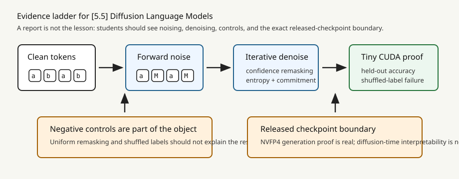
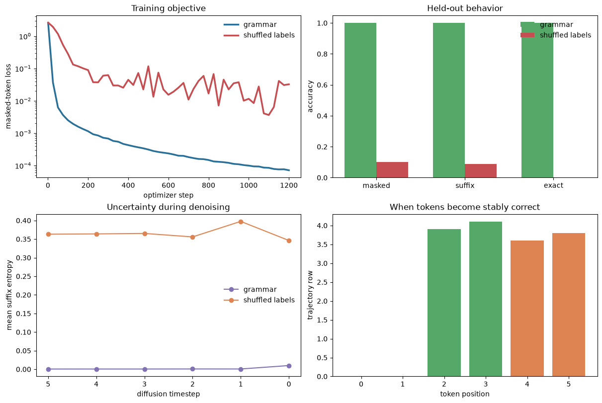
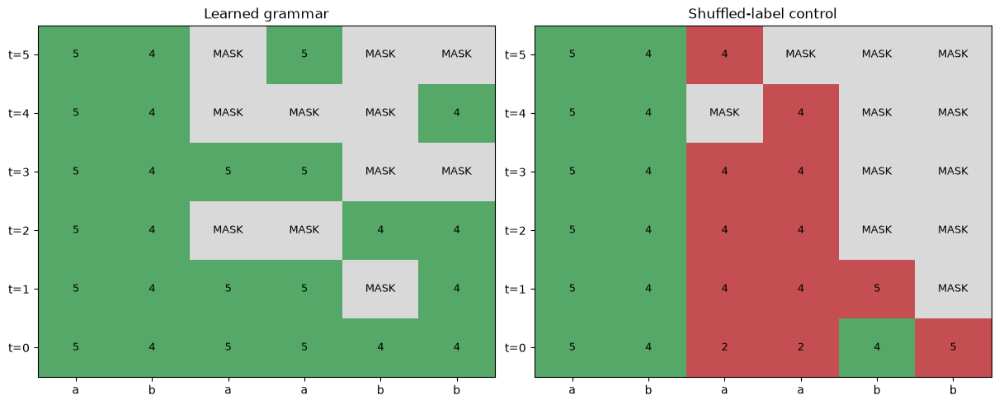

# [5.5] Toy Discrete Diffusion Language Models and Local DiffusionGemma Proof

## Watching Tokens Commit

> **Local-first extension.** You will implement discrete noising, masked denoising, confidence remasking, CUDA training, trajectory capture, and stable commitment analysis. The main result is generated in the notebook from your own functions.

Please send any problems / bugs on the `#errata` channel in the [Slack group](https://info-arena.github.io/ARENA_img/slack.html), and ask any questions on the dedicated channels for this chapter of material.

If you want to change to dark mode, click the three horizontal lines in the top-right, then navigate to Settings -> Theme.

Links to earlier chapters: [(0) Fundamentals](https://arena-chapter0-fundamentals.streamlit.app/), [(1) Transformer Interpretability](https://arena-chapter1-transformer-interp.streamlit.app/), [(2) RL](https://arena-chapter2-rl.streamlit.app/), [(3) LLM Evaluations](https://arena-chapter3-llm-evals.streamlit.app/), [(4) Alignment Science](https://arena-chapter4-alignment-science.streamlit.app/).


## Notebook Metadata

```yaml
gt_tier: GT-0
exercise_id: 5_5_diffusion_language_models
expected_runtime: 75-100 minutes; about 15 seconds for the CUDA signature run
requires_gpu: true for the trained result
```

## Reading Material

You should already understand masked-language-model cross entropy and Transformer encoder blocks. The first half of the section builds exact toy ground truth. The second half trains a tiny model, tests held-out iterative reconstruction, and examines when each token becomes a stable decision.

The released DiffusionGemma checkpoint appears only at the end. The included NVFP4 artifact proves one real local generation on this machine. It is not evidence for denoising-step activation capture or diffusion patching.




By the end of this notebook, you will have shown that a tiny CUDA-trained bidirectional denoiser reconstructs the held-out grammar `[a, b] -> [a, b, a, a, b, b]`, because iterative sampling reaches the exact target while an identically trained shuffled-label control fails.

## Core Question

**When does each token become a stable decision during iterative denoising?**

## Learning Objectives

- derive and test a discrete masking schedule;
- implement forward noising and a masked-token objective;
- implement confidence remasking and an exact oracle sampler;
- build and train a tiny bidirectional denoiser on generated ground truth;
- save token and activation trajectories across denoising steps;
- compare the trained model with a separately trained shuffled-label control;
- interpret entropy and stable commitment time without treating a plot as proof by itself.

The tiny model is the teaching result. The final DiffusionGemma cell is a narrowly scoped released-checkpoint runtime proof.


## Setup Code

```python
from __future__ import annotations

import json
import sys
from dataclasses import dataclass
from pathlib import Path

import matplotlib.pyplot as plt
from matplotlib.colors import ListedColormap
import numpy as np
import pandas as pd
import torch as t
import torch.nn as nn
import torch.nn.functional as F
from IPython.display import display

chapter = "chapter5_modern_architectures"
root_dir = next(p for p in [Path.cwd(), *Path.cwd().parents] if (p / chapter).exists())
chapter_dir = root_dir / chapter
section_dir = chapter_dir / "exercises" / "part5_diffusion_language_models"
for path in [root_dir, chapter_dir / "exercises"]:
    if str(path) not in sys.path:
        sys.path.append(str(path))

import part5_diffusion_language_models.tests as tests

assert t.cuda.is_available(), "This notebook's trained experiment requires CUDA."
device = t.device("cuda")
print(f"torch={t.__version__} | CUDA={t.version.cuda} | GPU={t.cuda.get_device_name(0)}")

@dataclass(frozen=True)
class DiscreteDiffusionSchedule:
    mask_probs: t.Tensor
    mask_token_id: int

    @property
    def num_steps(self) -> int:
        return int(self.mask_probs.numel())

@dataclass(frozen=True)
class NoisingResult:
    noisy_tokens: t.Tensor
    mask: t.Tensor
    timesteps: t.Tensor

@dataclass(frozen=True)
class DenoisingStepStats:
    step: int
    mask_fraction: float
    mean_entropy: float
    committed_fraction: float
```


## Cold open: the phenomenon

For prefix `[3, 7]`, the exact target is `[3, 7, 3, 3, 7, 7]`. A diffusion LM begins with an intact condition and a masked suffix. Each reverse step predicts every suffix position, keeps the most confident guesses, and remasks the rest.

The challenge is not producing one plausible final row. We need to show that the model learned the rule on held-out prefixes, that its decisions evolve coherently, and that a matched shuffled-label model fails.


```python
cold_open = pd.DataFrame({
    "stage": ["condition", "high noise", "partial commitment", "target"],
    "tokens": [
        [3, 7, "MASK", "MASK", "MASK", "MASK"],
        [3, 7, "MASK", "MASK", "MASK", "MASK"],
        [3, 7, 3, 3, "MASK", "MASK"],
        [3, 7, 3, 3, 7, 7],
    ],
})
display(cold_open)
```


### Exercise - build the masking schedule

> ```yaml
> Difficulty: easy
> Importance: high
> Suggested time: 5-10 minutes
> ```

At timestep `t`, each token is independently replaced by `MASK` with probability `p_t`. Implement the schedule before touching a model.

<details><summary>Help - reveal a hint</summary>

`torch.linspace` gives the exact schedule. Index it with the batch timesteps, then average the selected probabilities.

</details>

<details><summary>Expected output</summary>

```text
All tests in `test_linear_mask_schedule_and_expected_fraction` passed!
```

</details>


```python
def linear_mask_schedule(
    num_steps: int,
    *,
    mask_token_id: int,
    min_mask_prob: float = 0.0,
    max_mask_prob: float = 1.0,
) -> DiscreteDiffusionSchedule:
    raise NotImplementedError()


def expected_mask_fraction(schedule: DiscreteDiffusionSchedule, timesteps: t.Tensor) -> float:
    raise NotImplementedError()

tests.test_linear_mask_schedule_and_expected_fraction(linear_mask_schedule, expected_mask_fraction)
```


<details><summary>Solution</summary>

```python
def linear_mask_schedule(
    num_steps: int,
    *,
    mask_token_id: int,
    min_mask_prob: float = 0.0,
    max_mask_prob: float = 1.0,
) -> DiscreteDiffusionSchedule:
    if num_steps <= 0:
        raise ValueError("num_steps must be positive.")
    if not 0 <= min_mask_prob <= max_mask_prob <= 1:
        raise ValueError("mask probabilities must satisfy 0 <= min <= max <= 1.")
    return DiscreteDiffusionSchedule(
        mask_probs=t.linspace(min_mask_prob, max_mask_prob, num_steps),
        mask_token_id=mask_token_id,
    )


def expected_mask_fraction(schedule: DiscreteDiffusionSchedule, timesteps: t.Tensor) -> float:
    probs = schedule.mask_probs.to(device=timesteps.device, dtype=t.float32)[timesteps]
    return probs.mean().item()
```

</details>


```python
schedule_preview = linear_mask_schedule(6, mask_token_id=10, min_mask_prob=0.25, max_mask_prob=1.0)
plt.figure(figsize=(6.5, 3.2))
plt.plot(range(schedule_preview.num_steps), schedule_preview.mask_probs, marker="o", color="#2a6f97", lw=2.5)
plt.ylim(0, 1.05)
plt.xlabel("forward timestep")
plt.ylabel("mask probability")
plt.title("Noise increases toward the all-mask state")
plt.grid(alpha=0.2)
plt.show()
```


### Exercise - apply forward noising

> ```yaml
> Difficulty: medium
> Importance: high
> Suggested time: 10 minutes
> ```

Draw one Bernoulli decision per token. The test includes the exact zero-noise and all-noise endpoints and a seeded mixed case.

Common bug: drawing one random value per sequence produces all-clean or all-masked rows instead of mixed corruption patterns.

<details><summary>Help - reveal a hint</summary>

Broadcast one probability per batch item over the sequence dimension. Do not draw one mask decision for the whole sequence.

</details>

<details><summary>Expected output</summary>

```text
All tests in `test_forward_noising_extremes_and_seeded_masks` passed!
```

</details>


```python
def apply_forward_noising(
    input_ids: t.Tensor,
    timesteps: t.Tensor,
    schedule: DiscreteDiffusionSchedule,
    *,
    generator: t.Generator | None = None,
) -> NoisingResult:
    raise NotImplementedError()

tests.test_forward_noising_extremes_and_seeded_masks(apply_forward_noising, linear_mask_schedule)
```


<details><summary>Solution</summary>

```python
def apply_forward_noising(
    input_ids: t.Tensor,
    timesteps: t.Tensor,
    schedule: DiscreteDiffusionSchedule,
    *,
    generator: t.Generator | None = None,
) -> NoisingResult:
    if input_ids.ndim != 2:
        raise ValueError("input_ids must have shape (batch, seq).")
    if timesteps.shape != (input_ids.shape[0],):
        raise ValueError("timesteps must have shape (batch,).")
    if timesteps.min() < 0 or timesteps.max() >= schedule.num_steps:
        raise ValueError("timesteps are out of range for schedule.")
    probs = schedule.mask_probs.to(device=input_ids.device, dtype=t.float32)[timesteps]
    random_values = t.rand(input_ids.shape, generator=generator, device=input_ids.device)
    mask = random_values < probs[:, None]
    noisy = input_ids.clone()
    noisy[mask] = schedule.mask_token_id
    return NoisingResult(noisy_tokens=noisy, mask=mask, timesteps=timesteps)
```

</details>


```python
probe_tokens = t.arange(6).repeat(2000, 1)
empirical = []
for timestep in range(schedule_preview.num_steps):
    ts = t.full((len(probe_tokens),), timestep)
    gen = t.Generator().manual_seed(100 + timestep)
    empirical.append(apply_forward_noising(probe_tokens, ts, schedule_preview, generator=gen).mask.float().mean().item())
plt.figure(figsize=(6.5, 3.2))
plt.plot(schedule_preview.mask_probs, label="analytic", marker="o", color="#2a6f97")
plt.plot(empirical, label="empirical over 12,000 tokens", marker="x", color="#dd8452")
plt.xlabel("forward timestep")
plt.ylabel("masked fraction")
plt.title("Forward noising matches the analytic schedule")
plt.legend(frameon=False)
plt.grid(alpha=0.2)
plt.show()
```


### Exercise - compute masked denoising loss

> ```yaml
> Difficulty: medium
> Importance: high
> Suggested time: 10 minutes
> ```

Only corrupted positions contribute to the objective. Visible tokens are context; rewarding the model for copying them would inflate performance.

<details><summary>Help - reveal a hint</summary>

Boolean-index all three tensors with `mask`, then call cross entropy on the selected logits and targets.

</details>

<details><summary>Expected output</summary>

```text
All tests in `test_masked_denoising_loss_uses_only_masked_positions` passed!
```

</details>


```python
def masked_denoising_loss(logits: t.Tensor, target_ids: t.Tensor, mask: t.Tensor) -> t.Tensor:
    raise NotImplementedError()

tests.test_masked_denoising_loss_uses_only_masked_positions(masked_denoising_loss)
```


<details><summary>Solution</summary>

```python
def masked_denoising_loss(logits: t.Tensor, target_ids: t.Tensor, mask: t.Tensor) -> t.Tensor:
    if logits.shape[:-1] != target_ids.shape or target_ids.shape != mask.shape:
        raise ValueError("logits, target_ids, and mask shapes are incompatible.")
    if not mask.any():
        raise ValueError("masked_denoising_loss requires at least one masked token.")
    return F.cross_entropy(logits[mask.bool()].float(), target_ids[mask.bool()].long())
```

</details>


### Exercise - remask low-confidence tokens

> ```yaml
> Difficulty: medium
> Importance: high
> Suggested time: 10-15 minutes
> ```

Predict every position, rank positions by confidence, and remask the least confident fraction. Implement uniform remasking as a matched mask-budget baseline.

<details><summary>Help - reveal a hint</summary>

Use `softmax(...).max(-1)` for confidence and `topk(..., largest=False)` for the positions to remask.

</details>

<details><summary>Expected output</summary>

```text
All tests in `test_confidence_remask_entropy_and_uniform_control` passed!
```

</details>


```python
def token_entropy(logits: t.Tensor) -> t.Tensor:
    raise NotImplementedError()


def confidence_remask(
    logits: t.Tensor,
    current_tokens: t.Tensor,
    *,
    mask_token_id: int,
    next_mask_fraction: float,
) -> t.Tensor:
    raise NotImplementedError()


def uniform_remask(
    tokens: t.Tensor,
    *,
    mask_token_id: int,
    next_mask_fraction: float,
    generator: t.Generator | None = None,
) -> t.Tensor:
    raise NotImplementedError()

tests.test_confidence_remask_entropy_and_uniform_control(confidence_remask, token_entropy, uniform_remask)
```


<details><summary>Solution</summary>

```python
def token_entropy(logits: t.Tensor) -> t.Tensor:
    log_probs = F.log_softmax(logits.float(), dim=-1)
    probs = log_probs.exp()
    return -(probs * log_probs).sum(dim=-1)


def confidence_remask(
    logits: t.Tensor,
    current_tokens: t.Tensor,
    *,
    mask_token_id: int,
    next_mask_fraction: float,
) -> t.Tensor:
    if not 0 <= next_mask_fraction <= 1:
        raise ValueError("next_mask_fraction must be in [0, 1].")
    probs = F.softmax(logits.float(), dim=-1)
    confidence, predictions = probs.max(dim=-1)
    new_tokens = predictions.to(dtype=current_tokens.dtype)
    num_to_mask = int(round(next_mask_fraction * current_tokens.shape[1]))
    if num_to_mask == 0:
        return new_tokens
    low_conf = confidence.topk(k=num_to_mask, dim=-1, largest=False).indices
    new_tokens.scatter_(1, low_conf, mask_token_id)
    return new_tokens


def uniform_remask(
    tokens: t.Tensor,
    *,
    mask_token_id: int,
    next_mask_fraction: float,
    generator: t.Generator | None = None,
) -> t.Tensor:
    if not 0 <= next_mask_fraction <= 1:
        raise ValueError("next_mask_fraction must be in [0, 1].")
    num_to_mask = int(round(next_mask_fraction * tokens.shape[1]))
    if num_to_mask == 0:
        return tokens.clone()
    scores = t.rand(tokens.shape, generator=generator, device=tokens.device)
    chosen = scores.topk(k=num_to_mask, dim=-1, largest=False).indices
    remasked = tokens.clone()
    remasked.scatter_(1, chosen, mask_token_id)
    return remasked
```

</details>


### Exercise - make an oracle sampler work first

> ```yaml
> Difficulty: hard
> Importance: high
> Suggested time: 15-20 minutes
> ```

Before training, use an oracle denoiser with a known target. This isolates reverse-process bugs from learning failures.

<details><summary>Help - reveal a hint</summary>

Iterate through the schedule in reverse. At each non-final step, predict all tokens and remask according to the next lower noise fraction.

</details>

<details><summary>Expected output</summary>

```text
All tests in `test_oracle_diffusion_sampler_recovers_target` passed!
```

</details>


```python
def diffusion_sampler(
    model_fn,
    *,
    shape: tuple[int, int],
    schedule: DiscreteDiffusionSchedule,
    temperature: float = 0.0,
    remask: str = "confidence",
    generator: t.Generator | None = None,
    device: t.device | None = None,
) -> tuple[t.Tensor, list[DenoisingStepStats]]:
    raise NotImplementedError()

tests.test_oracle_diffusion_sampler_recovers_target(diffusion_sampler, linear_mask_schedule)
```


<details><summary>Solution</summary>

```python
def diffusion_sampler(
    model_fn,
    *,
    shape: tuple[int, int],
    schedule: DiscreteDiffusionSchedule,
    temperature: float = 0.0,
    remask: str = "confidence",
    generator: t.Generator | None = None,
    device: t.device | None = None,
) -> tuple[t.Tensor, list[DenoisingStepStats]]:
    if device is None:
        device = schedule.mask_probs.device
    tokens = t.full(shape, schedule.mask_token_id, dtype=t.long, device=device)
    stats = []
    for step in reversed(range(schedule.num_steps)):
        logits = model_fn(tokens, step)
        if temperature == 0.0:
            predictions = logits.argmax(dim=-1)
        else:
            probs = F.softmax(logits.float() / temperature, dim=-1)
            samples = t.multinomial(probs.reshape(-1, probs.shape[-1]), 1, generator=generator)
            predictions = samples.reshape(tokens.shape)
        if step == 0:
            tokens = predictions.to(dtype=tokens.dtype)
        else:
            next_fraction = float(schedule.mask_probs[step - 1].item())
            if remask == "confidence":
                tokens = confidence_remask(
                    logits,
                    predictions,
                    mask_token_id=schedule.mask_token_id,
                    next_mask_fraction=next_fraction,
                )
            elif remask == "uniform":
                tokens = uniform_remask(
                    predictions,
                    mask_token_id=schedule.mask_token_id,
                    next_mask_fraction=next_fraction,
                    generator=generator,
                )
            else:
                raise ValueError("remask must be 'confidence' or 'uniform'.")
        mask_fraction = tokens.eq(schedule.mask_token_id).float().mean().item()
        stats.append(DenoisingStepStats(
            step=step,
            mask_fraction=mask_fraction,
            mean_entropy=token_entropy(logits).mean().item(),
            committed_fraction=1.0 - mask_fraction,
        ))
    return tokens, stats
```

</details>


### Exercise - measure stable commitment

> ```yaml
> Difficulty: hard
> Importance: high
> Suggested time: 15 minutes
> ```

The first visible guess can later be changed. Stable commitment is the earliest row after which a token remains visible and correct for every later row.

<details><summary>Help - reveal a hint</summary>

Compute correctness at every row, reverse the time axis, take a cumulative AND, then reverse again.

</details>

<details><summary>Expected output</summary>

```text
All tests in `test_commitment_edit_distance_and_activation_trajectory` passed!
```

</details>


```python
def commitment_times(tokens_over_steps: t.Tensor, mask_token_id: int) -> t.Tensor:
    raise NotImplementedError()


def stable_commitment_times(
    tokens_over_steps: t.Tensor,
    target_tokens: t.Tensor,
    mask_token_id: int,
) -> t.Tensor:
    raise NotImplementedError()


def edit_distance(a: list[int], b: list[int]) -> int:
    raise NotImplementedError()


def validate_activation_trajectory(
    activations: list[t.Tensor], *, expected_steps: int, batch: int, seq_len: int
) -> bool:
    raise NotImplementedError()

tests.test_commitment_edit_distance_and_activation_trajectory(commitment_times, stable_commitment_times, edit_distance, validate_activation_trajectory)
```


<details><summary>Solution</summary>

```python
def commitment_times(tokens_over_steps: t.Tensor, mask_token_id: int) -> t.Tensor:
    if tokens_over_steps.ndim != 3:
        raise ValueError("tokens_over_steps must have shape (steps, batch, seq).")
    unmasked = tokens_over_steps.ne(mask_token_id)
    any_unmasked = unmasked.any(dim=0)
    first = unmasked.float().argmax(dim=0).long()
    return t.where(any_unmasked, first, t.full_like(first, -1))


def stable_commitment_times(
    tokens_over_steps: t.Tensor,
    target_tokens: t.Tensor,
    mask_token_id: int,
) -> t.Tensor:
    if tokens_over_steps.ndim != 3:
        raise ValueError("tokens_over_steps must have shape (steps, batch, seq).")
    if target_tokens.shape != tokens_over_steps.shape[1:]:
        raise ValueError("target_tokens must have shape (batch, seq).")
    correct_and_visible = tokens_over_steps.eq(target_tokens.unsqueeze(0)) & tokens_over_steps.ne(mask_token_id)
    stable = correct_and_visible.flip(0).cumprod(dim=0).bool().flip(0)
    ever_stable = stable.any(dim=0)
    first_stable = stable.float().argmax(dim=0).long()
    return t.where(ever_stable, first_stable, t.full_like(first_stable, -1))


def edit_distance(a: list[int], b: list[int]) -> int:
    prev = list(range(len(b) + 1))
    for i, token_a in enumerate(a, start=1):
        cur = [i]
        for j, token_b in enumerate(b, start=1):
            cur.append(min(prev[j] + 1, cur[j - 1] + 1, prev[j - 1] + int(token_a != token_b)))
        prev = cur
    return prev[-1]


def validate_activation_trajectory(
    activations: list[t.Tensor], *, expected_steps: int, batch: int, seq_len: int
) -> bool:
    if len(activations) != expected_steps:
        return False
    return all(act.shape[0] == batch and act.shape[1] == seq_len for act in activations)
```

</details>


### Exercise - construct exact ground truth and protect the condition

> ```yaml
> Difficulty: medium
> Importance: high
> Suggested time: 10-15 minutes
> ```

Enumerate all 100 digit pairs. The first two tokens are always visible conditions; only the four-token suffix is noised and scored.

<details><summary>Help - reveal a hint</summary>

Generate `[a, b, a, a, b, b]` for every `a, b` in `range(10)`. Restore the first two tokens after general noising and clear their loss mask.

</details>

<details><summary>Expected output</summary>

```text
All tests in `test_copy_pair_dataset_and_conditional_suffix_noising` passed!
```

</details>


```python
def copy_pair_dataset(device: t.device) -> t.Tensor:
    raise NotImplementedError()


def conditional_suffix_noising(
    clean_tokens: t.Tensor,
    schedule: DiscreteDiffusionSchedule,
) -> tuple[t.Tensor, t.Tensor, t.Tensor]:
    raise NotImplementedError()

tests.test_copy_pair_dataset_and_conditional_suffix_noising(copy_pair_dataset, conditional_suffix_noising, linear_mask_schedule)
```


<details><summary>Solution</summary>

```python
def copy_pair_dataset(device: t.device) -> t.Tensor:
    rows = []
    for first in range(10):
        for second in range(10):
            rows.append([first, second, first, first, second, second])
    return t.tensor(rows, dtype=t.long, device=device)


def conditional_suffix_noising(
    clean_tokens: t.Tensor,
    schedule: DiscreteDiffusionSchedule,
) -> tuple[t.Tensor, t.Tensor, t.Tensor]:
    timesteps = t.randint(1, schedule.num_steps, (clean_tokens.shape[0],), device=clean_tokens.device)
    noising = apply_forward_noising(clean_tokens, timesteps, schedule)
    noisy = noising.noisy_tokens.clone()
    mask = noising.mask.clone()
    noisy[:, :2] = clean_tokens[:, :2]
    mask[:, :2] = False
    no_suffix_mask = mask[:, 2:].sum(dim=1).eq(0)
    if no_suffix_mask.any():
        row_ids = no_suffix_mask.nonzero().flatten()
        suffix_cols = t.randint(2, clean_tokens.shape[1], (row_ids.numel(),), device=clean_tokens.device)
        noisy[row_ids, suffix_cols] = schedule.mask_token_id
        mask[row_ids, suffix_cols] = True
    return noisy, mask, timesteps
```

</details>


### Exercise - build the bidirectional denoiser

> ```yaml
> Difficulty: medium
> Importance: high
> Suggested time: 10 minutes
> ```

Add token, position, and timestep embeddings, pass the full corrupted sequence through a Transformer encoder, and unembed every position.

<details><summary>Help - reveal a hint</summary>

There is no causal mask. Information hiding comes from `MASK` tokens, while bidirectional attention lets visible context inform every missing position.

</details>

<details><summary>Expected output</summary>

```text
All tests in `test_tiny_conditional_diffusion_lm_forward_shape` passed!
```

</details>


```python
class TinyConditionalDiffusionLM(nn.Module):
    def __init__(
        self,
        *,
        vocab_size: int = 11,
        seq_len: int = 6,
        num_steps: int = 6,
        d_model: int = 96,
    ) -> None:
        super().__init__()
        self.seq_len = seq_len
        self.token_embed = nn.Embedding(vocab_size, d_model)
        self.position_embed = nn.Embedding(seq_len, d_model)
        self.time_embed = nn.Embedding(num_steps, d_model)
        layer = nn.TransformerEncoderLayer(
            d_model=d_model,
            nhead=4,
            dim_feedforward=2 * d_model,
            batch_first=True,
            activation="gelu",
        )
        self.transformer = nn.TransformerEncoder(layer, num_layers=2)
        self.unembed = nn.Linear(d_model, vocab_size)

    def forward(self, input_ids: t.Tensor, timesteps: t.Tensor) -> t.Tensor:
        raise NotImplementedError()

tests.test_tiny_conditional_diffusion_lm_forward_shape(TinyConditionalDiffusionLM)
```


<details><summary>Solution</summary>

```python
class TinyConditionalDiffusionLM(nn.Module):
    def __init__(
        self,
        *,
        vocab_size: int = 11,
        seq_len: int = 6,
        num_steps: int = 6,
        d_model: int = 96,
    ) -> None:
        super().__init__()
        self.seq_len = seq_len
        self.token_embed = nn.Embedding(vocab_size, d_model)
        self.position_embed = nn.Embedding(seq_len, d_model)
        self.time_embed = nn.Embedding(num_steps, d_model)
        layer = nn.TransformerEncoderLayer(
            d_model=d_model,
            nhead=4,
            dim_feedforward=2 * d_model,
            batch_first=True,
            activation="gelu",
        )
        self.transformer = nn.TransformerEncoder(layer, num_layers=2)
        self.unembed = nn.Linear(d_model, vocab_size)

    def forward(self, input_ids: t.Tensor, timesteps: t.Tensor) -> t.Tensor:
        positions = t.arange(self.seq_len, device=input_ids.device)
        hidden = (
            self.token_embed(input_ids)
            + self.position_embed(positions)[None, :, :]
            + self.time_embed(timesteps)[:, None, :]
        )
        return self.unembed(self.transformer(hidden))
```

</details>


### Exercise - train the denoiser on CUDA

> ```yaml
> Difficulty: hard
> Importance: high
> Suggested time: 20 minutes
> ```

Implement the optimizer loop using suffix-only noising and masked loss. Record a compact loss curve so learning is visible rather than inferred from a final scalar.

<details><summary>Help - reveal a hint</summary>

Use a fresh corruption each step, clear gradients before backward, and record detached scalar losses. The 32-example test batch should fall below 0.10 loss in 120 CUDA steps.

</details>

<details><summary>Expected output</summary>

```text
All tests in `test_tiny_training_loop_learns_copy_pair_batch` passed!
```

</details>


```python
def train_tiny_diffusion_model(
    model: TinyConditionalDiffusionLM,
    train_tokens: t.Tensor,
    schedule: DiscreteDiffusionSchedule,
    *,
    steps: int = 1200,
    learning_rate: float = 2e-3,
    seed: int = 5505,
    record_every: int = 25,
) -> dict[str, list[float] | list[int]]:
    raise NotImplementedError()

tests.test_tiny_training_loop_learns_copy_pair_batch(train_tiny_diffusion_model, TinyConditionalDiffusionLM, copy_pair_dataset, linear_mask_schedule)
```


<details><summary>Solution</summary>

```python
def train_tiny_diffusion_model(
    model: TinyConditionalDiffusionLM,
    train_tokens: t.Tensor,
    schedule: DiscreteDiffusionSchedule,
    *,
    steps: int = 1200,
    learning_rate: float = 2e-3,
    seed: int = 5505,
    record_every: int = 25,
) -> dict[str, list[float] | list[int]]:
    t.manual_seed(seed)
    t.cuda.manual_seed_all(seed)
    model.train()
    optimizer = t.optim.AdamW(model.parameters(), lr=learning_rate, weight_decay=1e-4)
    recorded_steps, losses = [], []
    for step in range(steps):
        noisy, mask, timesteps = conditional_suffix_noising(train_tokens, schedule)
        loss = masked_denoising_loss(model(noisy, timesteps), train_tokens, mask)
        optimizer.zero_grad(set_to_none=True)
        loss.backward()
        optimizer.step()
        if step == 0 or (step + 1) % record_every == 0 or step + 1 == steps:
            recorded_steps.append(step + 1)
            losses.append(float(loss.detach().item()))
    model.eval()
    return {"steps": recorded_steps, "losses": losses}
```

</details>


### Exercise - save the conditional denoising trajectory

> ```yaml
> Difficulty: hard
> Importance: high
> Suggested time: 20-25 minutes
> ```

Implement the sampler used for the signature result. Preserve the two-token prefix, save every suffix state, record entropy, and retain hidden activations for shape checks.

<details><summary>Help - reveal a hint</summary>

Build logits explicitly from the model components so you can retain the Transformer output at every reverse step. Replace only the suffix after remasking.

</details>

<details><summary>Expected output</summary>

```text
All tests in `test_conditional_diffusion_sample_preserves_prefix_and_records_steps` passed!
```

</details>


```python
def conditional_diffusion_sample(
    model: TinyConditionalDiffusionLM,
    prefixes_and_targets: t.Tensor,
    schedule: DiscreteDiffusionSchedule,
    *,
    remask: str = "confidence",
    generator: t.Generator | None = None,
) -> tuple[t.Tensor, t.Tensor, list[float], list[t.Tensor]]:
    raise NotImplementedError()

tests.test_conditional_diffusion_sample_preserves_prefix_and_records_steps(conditional_diffusion_sample, TinyConditionalDiffusionLM, copy_pair_dataset, linear_mask_schedule)
```


<details><summary>Solution</summary>

```python
def conditional_diffusion_sample(
    model: TinyConditionalDiffusionLM,
    prefixes_and_targets: t.Tensor,
    schedule: DiscreteDiffusionSchedule,
    *,
    remask: str = "confidence",
    generator: t.Generator | None = None,
) -> tuple[t.Tensor, t.Tensor, list[float], list[t.Tensor]]:
    current = t.full_like(prefixes_and_targets, schedule.mask_token_id)
    current[:, :2] = prefixes_and_targets[:, :2]
    trajectory, entropy_by_step, activations = [], [], []
    for step in reversed(range(schedule.num_steps)):
        timesteps = t.full((current.shape[0],), step, device=current.device, dtype=t.long)
        hidden = (
            model.token_embed(current)
            + model.position_embed(t.arange(model.seq_len, device=current.device))[None, :, :]
            + model.time_embed(timesteps)[:, None, :]
        )
        denoised_hidden = model.transformer(hidden)
        logits = model.unembed(denoised_hidden)
        activations.append(denoised_hidden.detach())
        entropy_by_step.append(token_entropy(logits[:, 2:]).mean().item())
        predictions = logits.argmax(dim=-1)
        predictions[:, :2] = prefixes_and_targets[:, :2]
        if step == 0:
            current = predictions
        else:
            next_fraction = float(schedule.mask_probs[step - 1].item())
            if remask == "confidence":
                suffix = confidence_remask(
                    logits[:, 2:], predictions[:, 2:],
                    mask_token_id=schedule.mask_token_id,
                    next_mask_fraction=next_fraction,
                )
            elif remask == "uniform":
                suffix = uniform_remask(
                    predictions[:, 2:],
                    mask_token_id=schedule.mask_token_id,
                    next_mask_fraction=next_fraction,
                    generator=generator,
                )
            else:
                raise ValueError("remask must be 'confidence' or 'uniform'.")
            current = t.cat([prefixes_and_targets[:, :2], suffix], dim=1)
        trajectory.append(current.clone())
    return current, t.stack(trajectory), entropy_by_step, activations
```

</details>


## Signature result: learned structure versus shuffled supervision

Now run the complete experiment from the functions you implemented above. Both models use the same architecture, optimizer, number of examples, and training budget. The control receives randomly permuted suffix labels for each prefix.

A convincing result needs all three pieces at once:

1. low held-out denoising loss is not enough;
2. iterative sampling must exactly reconstruct held-out sequences;
3. the separately trained shuffled-label model must fail on those same examples.

<details><summary>Expected output</summary>

The grammar model should reach at least `0.95` held-out masked accuracy, suffix accuracy, and exact match. The shuffled-label sampler should stay below `0.25` suffix accuracy and `0.10` exact match. Peak VRAM should remain below 1 GB on this model.

</details>


### Expected result from the executed solution notebook

The left panels show the trained objective, held-out controls, entropy, and stable commitment. The trajectory panel marks masked cells gray, wrong visible tokens red, and correct tokens green.






```python
def evaluate_model(model, heldout_tokens, schedule):
    fully_masked = heldout_tokens.clone()
    fully_masked[:, 2:] = schedule.mask_token_id
    timesteps = t.full((heldout_tokens.shape[0],), schedule.num_steps - 1, device=device, dtype=t.long)
    suffix_mask = t.zeros_like(heldout_tokens, dtype=t.bool)
    suffix_mask[:, 2:] = True
    with t.inference_mode():
        logits = model(fully_masked, timesteps)
        heldout_loss = masked_denoising_loss(logits, heldout_tokens, suffix_mask).item()
        heldout_accuracy = logits.argmax(-1)[suffix_mask].eq(heldout_tokens[suffix_mask]).float().mean().item()
        sampled, trajectory, entropy, activations = conditional_diffusion_sample(model, heldout_tokens, schedule)
    return {
        "heldout_loss": heldout_loss,
        "heldout_accuracy": heldout_accuracy,
        "suffix_accuracy": sampled[:, 2:].eq(heldout_tokens[:, 2:]).float().mean().item(),
        "exact_match": sampled.eq(heldout_tokens).all(1).float().mean().item(),
        "sampled": sampled,
        "trajectory": trajectory,
        "entropy": entropy,
        "suffix_accuracy_by_step": trajectory[:, :, 2:].eq(heldout_tokens[None, :, 2:]).float().mean((1, 2)).tolist(),
        "mask_fraction_by_step": trajectory[:, :, 2:].eq(schedule.mask_token_id).float().mean((1, 2)).tolist(),
        "stable_commitment": stable_commitment_times(trajectory, heldout_tokens, schedule.mask_token_id),
        "activation_shape_ok": validate_activation_trajectory(
            activations, expected_steps=schedule.num_steps, batch=heldout_tokens.shape[0], seq_len=6
        ),
    }

# Exact split, full-batch training, and fixed seeds make this result reproducible.
t.cuda.reset_peak_memory_stats()
t.manual_seed(5505)
t.cuda.manual_seed_all(5505)
all_tokens = copy_pair_dataset(device)
split = t.randperm(len(all_tokens), device=device)
train_tokens, heldout_tokens = all_tokens[split[:80]], all_tokens[split[80:]]
schedule = linear_mask_schedule(6, mask_token_id=10, min_mask_prob=0.25, max_mask_prob=1.0)

main_model = TinyConditionalDiffusionLM().to(device)
main_curve = train_tiny_diffusion_model(main_model, train_tokens, schedule, seed=5505)

# Matched negative control: same architecture and optimizer, but suffix labels are permuted.
t.manual_seed(5506)
shuffled_train = train_tokens.clone()
shuffled_train[:, 2:] = train_tokens[t.randperm(len(train_tokens), device=device), 2:]
shuffled_model = TinyConditionalDiffusionLM().to(device)
shuffled_curve = train_tiny_diffusion_model(shuffled_model, shuffled_train, schedule, seed=5506)

main_result = evaluate_model(main_model, heldout_tokens, schedule)
shuffled_result = evaluate_model(shuffled_model, heldout_tokens, schedule)
t.cuda.synchronize()
peak_vram_gb = t.cuda.max_memory_allocated() / 1024**3

assert main_result["exact_match"] >= 0.95
assert shuffled_result["suffix_accuracy"] <= 0.25
assert main_result["activation_shape_ok"] and shuffled_result["activation_shape_ok"]
assert peak_vram_gb <= 24.0

metrics = pd.DataFrame({
    "metric": ["held-out masked accuracy", "sampler suffix accuracy", "sampler exact match"],
    "trained grammar": [main_result["heldout_accuracy"], main_result["suffix_accuracy"], main_result["exact_match"]],
    "shuffled-label training": [shuffled_result["heldout_accuracy"], shuffled_result["suffix_accuracy"], shuffled_result["exact_match"]],
})
display(metrics.style.format({"trained grammar": "{:.3f}", "shuffled-label training": "{:.3f}"}))
print(f"peak VRAM: {peak_vram_gb:.3f} GB")
```


```python
timesteps = list(reversed(range(schedule.num_steps)))
fig, axes = plt.subplots(2, 2, figsize=(12, 8), constrained_layout=True)

axes[0, 0].plot(main_curve["steps"], main_curve["losses"], color="#2a6f97", lw=2.5, label="grammar")
axes[0, 0].plot(shuffled_curve["steps"], shuffled_curve["losses"], color="#c44e52", lw=2.5, label="shuffled labels")
axes[0, 0].set_yscale("log")
axes[0, 0].set(title="Training objective", xlabel="optimizer step", ylabel="masked-token loss")
axes[0, 0].legend(frameon=False)

x = np.arange(len(metrics))
axes[0, 1].bar(x - 0.18, metrics["trained grammar"], 0.36, color="#55a868", label="grammar")
axes[0, 1].bar(x + 0.18, metrics["shuffled-label training"], 0.36, color="#c44e52", label="shuffled labels")
axes[0, 1].set_ylim(0, 1.05)
axes[0, 1].set_xticks(x, ["masked", "suffix", "exact"])
axes[0, 1].set(title="Held-out behavior", ylabel="accuracy")
axes[0, 1].legend(frameon=False)

axes[1, 0].plot(timesteps, main_result["entropy"], marker="o", color="#8172b2", label="grammar")
axes[1, 0].plot(timesteps, shuffled_result["entropy"], marker="o", color="#dd8452", label="shuffled labels")
axes[1, 0].invert_xaxis()
axes[1, 0].set(title="Uncertainty during denoising", xlabel="diffusion timestep", ylabel="mean suffix entropy")
axes[1, 0].legend(frameon=False)

positions = np.arange(6)
commitment = main_result["stable_commitment"].float().mean(0).cpu()
axes[1, 1].bar(positions, commitment, color=["#4c72b0", "#4c72b0", "#55a868", "#55a868", "#dd8452", "#dd8452"])
axes[1, 1].set_xticks(positions)
axes[1, 1].set(title="When tokens become stably correct", xlabel="token position", ylabel="trajectory row")
plt.show()


def trajectory_panel(ax, trajectory, target, title):
    target = target.cpu()
    trajectory = trajectory.cpu()
    state = t.where(
        trajectory.eq(schedule.mask_token_id),
        0,
        t.where(trajectory.eq(target[None, :]), 2, 1),
    )
    ax.imshow(state, cmap=ListedColormap(["#d9d9d9", "#c44e52", "#55a868"]), vmin=0, vmax=2, aspect="auto")
    for row in range(trajectory.shape[0]):
        for col in range(trajectory.shape[1]):
            token = "MASK" if trajectory[row, col] == schedule.mask_token_id else str(int(trajectory[row, col]))
            ax.text(col, row, token, ha="center", va="center", fontsize=9)
    ax.set_xticks(range(6), ["a", "b", "a", "a", "b", "b"])
    ax.set_yticks(range(6), [f"t={x}" for x in timesteps])
    ax.set_title(title)

example = 0
fig, axes = plt.subplots(1, 2, figsize=(12, 4.8), constrained_layout=True)
trajectory_panel(axes[0], main_result["trajectory"][:, example], heldout_tokens[example], "Learned grammar")
trajectory_panel(axes[1], shuffled_result["trajectory"][:, example], heldout_tokens[example], "Shuffled-label control")
plt.show()

rows = []
for row, timestep in enumerate(timesteps):
    rows.append({
        "timestep": timestep,
        "grammar trajectory": ["MASK" if x == 10 else int(x) for x in main_result["trajectory"][row, example].tolist()],
        "shuffled trajectory": ["MASK" if x == 10 else int(x) for x in shuffled_result["trajectory"][row, example].tolist()],
    })
display(pd.DataFrame(rows))
print("target:", heldout_tokens[example].tolist())
```


<details><summary>Interpretation</summary>

The main model reaches exact held-out reconstruction because the suffix is a deterministic function of the visible prefix.
Its loss curve alone does not establish this: the shuffled-label model can also reduce its training objective by memorizing arbitrary training associations.
The decisive evidence is held-out iterative sampling, where the real grammar generalizes and the shuffled control does not.

The trajectory heatmaps add mechanism-level intuition. Gray cells are still masked, red cells are visible but wrong, and green cells equal the ground-truth token. Stable commitment is measured only when a token remains correct for all later rows, so temporary guesses do not count.

</details>


## Try It Yourself

Change the prefix, remasking rule, or seed. Predict which suffix positions will stabilize first, then rerun the cell. Uniform remasking has the same mask budget but ignores confidence; treat its result as a baseline and only call it a failed control if the measured metrics actually deteriorate.


```python
# Try It Yourself: change these values, then rerun this cell.
play_a, play_b = 8, 1
play_remask = "confidence"  # compare with "uniform"
play_seed = 17
play_target = t.tensor([[play_a, play_b, play_a, play_a, play_b, play_b]], device=device)
play_generator = t.Generator(device=device).manual_seed(play_seed)
with t.inference_mode():
    play_output, play_trajectory, play_entropy, _ = conditional_diffusion_sample(
        main_model,
        play_target,
        schedule,
        remask=play_remask,
        generator=play_generator,
    )
play_rows = []
for row, timestep in enumerate(timesteps):
    play_rows.append({
        "timestep": timestep,
        "tokens": ["MASK" if x == 10 else int(x) for x in play_trajectory[row, 0].tolist()],
        "mean suffix entropy": play_entropy[row],
    })
display(pd.DataFrame(play_rows).style.format({"mean suffix entropy": "{:.4f}"}))
print("target:", play_target[0].tolist())
print("output:", play_output[0].tolist())
```


<details><summary>Bonus: anomaly hunting</summary>

- Search all 100 prefixes for the latest stable commitment time.
- Compare confidence and uniform remasking over ten seeds with the same mask budget.
- Increase the number of reverse steps while keeping the trained model fixed.
- Find prefixes where a token becomes correct, is remasked, and later recommits.
- Replace stable commitment with first-visible time and quantify how often the simpler metric lies.

A useful anomaly is reproducible and changes a stated interpretation. A colorful trajectory with no metric or control is not evidence.

</details>


## Real-model connection: DiffusionGemma NVFP4

This final cell displays the committed, real local generation artifact for the pinned NVIDIA NVFP4 checkpoint. It proves one released-checkpoint prompt generated on the RTX 5090 Laptop GPU. It does not prove denoising-step activation access, diffusion patching, quality parity, throughput, or BF16 loading on 24 GB.

The isolated vLLM runtime uses its own torch/CUDA stack because the available vLLM build is incompatible with the main `torch 2.12.1+cu132` environment.


```python
proof = json.loads((section_dir / "artifacts" / "diffusiongemma_vllm_probe.json").read_text())
proof_table = pd.DataFrame([
    {"field": "model revision", "value": Path(proof["model"]).name},
    {"field": "runtime", "value": f"vLLM {proof['vllm_version']} / torch {proof['torch_version']} / CUDA {proof['torch_cuda_version']}"},
    {"field": "GPU", "value": proof["gpu_name"]},
    {"field": "load time", "value": f"{proof['load_seconds']:.2f} s"},
    {"field": "generation time", "value": f"{proof['generate_seconds']:.2f} s"},
])
display(proof_table)
print("Prompt:", proof["prompt"])
print("Output:", proof["output"])
assert proof["output"].strip() and proof["cuda_available"]
```


## Verification Appendix

The generated `verification_report.json` is supporting evidence for CI freshness, the live CUDA experiment, and the pinned DiffusionGemma artifact. It is not used to generate the signature plots above. These functions rerun the trusted section implementation when a reviewer wants the complete report contract.

```python
def run_gpu_test(max_vram_gb: float = 24.0):
    from part5_diffusion_language_models.solutions import run_gpu_test as run_verified_gpu_test
    return run_verified_gpu_test(max_vram_gb=max_vram_gb)


def run_full_experiment(max_vram_gb: float = 24.0):
    return run_gpu_test(max_vram_gb=max_vram_gb)
```

## Limitations

The learner result uses one exact generated grammar, one tiny Transformer architecture, and one fixed train/held-out split. It establishes the mechanics of discrete noising, iterative denoising, trajectory analysis, and matched shuffled-label control. It does not establish natural-language quality, autoregressive speed parity, block-generation advantages, or DiffusionGemma internals.

The Google BF16 checkpoint requires about 51.6 GB of weights and is deferred on this 24 GB machine. The available NVFP4 path supports a real one-prompt generation proof through isolated vLLM, but the runtime used here does not expose the denoising-step hidden states required for the roadmap's DiffusionGemma activation capture and patching exercises.
