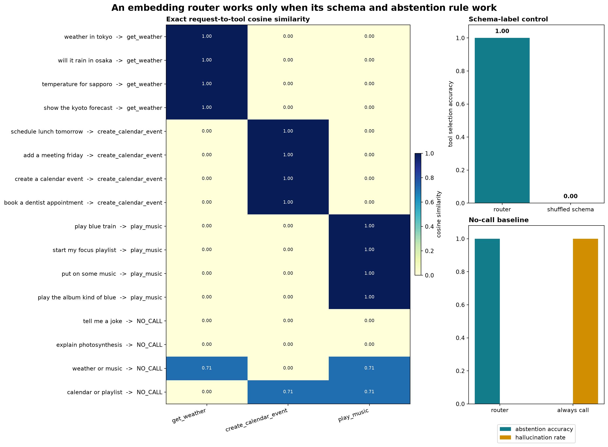

# [5.6] Embedding Retrieval and Function-Calling Controls

> **Claim.** By the end of this section, you will have shown that a normalized embedding router selects the correct tool on exact English toy requests and abstains on irrelevant or ambiguous requests, while shuffled schema labels and an always-call baseline fail visibly.

```yaml
GT_TIER = "GT-1"
EXERCISE_ID = "5_6_multimodal_embedding_and_function_calling_models"
expected_runtime: 60-90 minutes on CPU; optional pinned BGE run takes under a minute when cached
requires_gpu: false for the lesson; true only for the separate release verification path
```

## Core Question

Given a user request and several tool schemas, **when is nearest-schema retrieval strong enough to justify a function call?**

`weather in Tokyo` should route to `get_weather`. `tell me a joke` should call nothing because no schema has evidence. `weather or music` should also call nothing because the top two tools tie. These are different abstention cases, and a single nearest-neighbor prediction cannot distinguish them.

| request | weather | calendar | music | desired action |
|---|---:|---:|---:|---|
| `weather in Tokyo` | 1.00 | 0.00 | 0.00 | `get_weather` |
| `tell me a joke` | 0.00 | 0.00 | 0.00 | `NO_CALL` |
| `weather or music` | 0.71 | 0.00 | 0.71 | `NO_CALL` |

## Content & Learning Objectives

- Implement padding-safe mean pooling over token embeddings.
- Compute normalized request-to-schema cosine similarity and target ranks.
- Implement abstention using both absolute confidence and the top-two margin.
- Enforce per-request tool availability before routing.
- Measure tool selection, abstention, and hallucination separately.
- Diagnose schema-order, always-call, lexical, and multi-intent failures.

## Setup

```python
import re
import sys
from dataclasses import dataclass
from pathlib import Path

import matplotlib.pyplot as plt
import pandas as pd
import torch as t

chapter = "chapter5_modern_architectures"
section = "part6_multimodal_embedding_function_models"
root_dir = next(p for p in [Path.cwd(), *Path.cwd().parents] if (p / chapter).exists())
exercises_dir = root_dir / chapter / "exercises"
if str(exercises_dir) not in sys.path:
    sys.path.append(str(exercises_dir))

import part6_multimodal_embedding_function_models.tests as tests


@dataclass(frozen=True)
class EmbeddingRetrievalReport:
    top1_accuracy: float
    mean_reciprocal_rank: float
    mean_positive_similarity: float
    mean_hard_negative_similarity: float
    mean_margin: float


@dataclass(frozen=True)
class RouterReport:
    overall_accuracy: float
    tool_accuracy: float
    abstention_accuracy: float
    hallucination_rate: float
```

## Exact Ground Truth

The toy encoder has three named coordinates: weather, calendar, and music. Each tool schema is one basis vector. Declared trigger words point exactly along one axis; all other words contribute zero. This makes each expected score derivable by hand. It is a transparent semantic model used to test routing logic, not evidence that a hand-built lexicon understands natural language.

```python
TOOL_NAMES = ["get_weather", "create_calendar_event", "play_music"]
NO_CALL_ID = len(TOOL_NAMES)
LABEL_NAMES = TOOL_NAMES + ["NO_CALL"]
TOOL_EMBEDDINGS = t.eye(3)

TOKEN_VECTORS = {
    "weather": [1.0, 0.0, 0.0], "forecast": [1.0, 0.0, 0.0],
    "temperature": [1.0, 0.0, 0.0], "rain": [1.0, 0.0, 0.0],
    "calendar": [0.0, 1.0, 0.0], "meeting": [0.0, 1.0, 0.0],
    "schedule": [0.0, 1.0, 0.0], "appointment": [0.0, 1.0, 0.0],
    "event": [0.0, 1.0, 0.0], "music": [0.0, 0.0, 1.0],
    "song": [0.0, 0.0, 1.0], "playlist": [0.0, 0.0, 1.0],
    "album": [0.0, 0.0, 1.0], "play": [0.0, 0.0, 1.0],
}


def token_vectors_for_requests(requests):
    tokenized = [re.findall(r"[a-z]+", request.lower()) for request in requests]
    max_length = max(map(len, tokenized))
    embeddings = t.zeros((len(requests), max_length, 3))
    attention_mask = t.zeros((len(requests), max_length), dtype=t.long)
    for row, tokens in enumerate(tokenized):
        attention_mask[row, : len(tokens)] = 1
        for column, token in enumerate(tokens):
            embeddings[row, column] = t.tensor(
                TOKEN_VECTORS.get(token, [0.0, 0.0, 0.0])
            )
    return embeddings, attention_mask
```

The evaluation contains 12 unambiguous tool requests, two irrelevant requests, and two equal-evidence multi-tool requests. The latter four have ground-truth label `NO_CALL`.

## Exercise - 1: implement `mean_pool_embeddings`

> ```yaml
> Difficulty: 2/5
> Importance: 5/5
> Suggested time: 8 minutes
> ```

Token embeddings have shape `(batch, sequence, 3)`. Pool only positions whose attention mask is one. Reject incompatible shapes.

Common bug: dividing by sequence length after zeroing padding. That still changes the vector norm as padding grows and can distort later calculations that are not normalized.

```python
def mean_pool_embeddings(token_embeddings: t.Tensor, attention_mask: t.Tensor) -> t.Tensor:
    raise NotImplementedError()


tests.test_mean_pool_embeddings_ignores_padding_and_matches_reference(mean_pool_embeddings)
```

<details>
<summary>Expected output</summary>

```text
pooled embeddings: [[2.0, 1.0], [4.0, 6.0]]
All tests in `test_mean_pool_embeddings_ignores_padding_and_matches_reference` passed!
```

</details>

<details>
<summary>Help - why the sentinel matters</summary>

The test places `[100, 100]` in a padded position. If that vector changes the answer, sequence length and batching details leak into every routing score.

</details>

<details>
<summary>Solution</summary>

```python
def mean_pool_embeddings(token_embeddings, attention_mask):
    mask = attention_mask.to(device=token_embeddings.device, dtype=token_embeddings.dtype)
    weighted = token_embeddings * mask.unsqueeze(-1)
    return weighted.sum(dim=1) / mask.sum(dim=-1, keepdim=True).clamp_min(1)
```

</details>

## Exercise - 2: implement cosine retrieval and ranks

> ```yaml
> Difficulty: 3/5
> Importance: 5/5
> Suggested time: 15 minutes
> ```

For request embedding $q_i$ and schema embedding $s_j$, compute

$$S_{ij} = \frac{q_i^T s_j}{\lVert q_i \rVert_2\lVert s_j \rVert_2}.$$

Then return one-indexed target ranks and report top-1 accuracy, mean reciprocal rank, and the margin between the paired target and strongest negative.

Common bug: using a raw dot product, which lets vector norm act as an unrelated ranking feature.

```python
def l2_normalize(x, eps=1e-12):
    raise NotImplementedError()


def cosine_similarity_matrix(query_embeddings, candidate_embeddings):
    raise NotImplementedError()


def retrieval_ranks(similarity, target_indices):
    raise NotImplementedError()


def embedding_retrieval_report(query_embeddings, candidate_embeddings, target_indices):
    raise NotImplementedError()


tests.test_retrieval_metrics_rank_pairs_and_hard_negative_margin(
    cosine_similarity_matrix,
    retrieval_ranks,
    embedding_retrieval_report,
)
```

<details>
<summary>Expected output</summary>

```text
target ranks: [1, 2, 1]
top-1 accuracy: 0.667
All tests in `test_retrieval_metrics_rank_pairs_and_hard_negative_margin` passed!
```

</details>

<details>
<summary>Help - find the hard negative</summary>

Sort each row in descending order to get rank. To get the strongest negative, mask only the paired candidate and take the maximum remaining score.

</details>

<details>
<summary>Solution</summary>

```python
def l2_normalize(x, eps=1e-12):
    return x / x.norm(dim=-1, keepdim=True).clamp_min(eps)


def cosine_similarity_matrix(query_embeddings, candidate_embeddings):
    return l2_normalize(query_embeddings) @ l2_normalize(candidate_embeddings).T


def retrieval_ranks(similarity, target_indices):
    order = similarity.argsort(dim=-1, descending=True)
    return order.eq(target_indices[:, None]).float().argmax(dim=-1).long() + 1


def embedding_retrieval_report(query_embeddings, candidate_embeddings, target_indices):
    similarity = cosine_similarity_matrix(query_embeddings, candidate_embeddings)
    ranks = retrieval_ranks(similarity, target_indices)
    row = t.arange(similarity.shape[0])
    positive = similarity[row, target_indices]
    masked = similarity.clone()
    masked[row, target_indices] = -t.inf
    hard_negative = masked.max(dim=-1).values
    return EmbeddingRetrievalReport(
        top1_accuracy=ranks.eq(1).float().mean().item(),
        mean_reciprocal_rank=(1.0 / ranks.float()).mean().item(),
        mean_positive_similarity=positive.mean().item(),
        mean_hard_negative_similarity=hard_negative.mean().item(),
        mean_margin=(positive - hard_negative).mean().item(),
    )
```

</details>

## Exercise - 3: implement `route_with_abstention`

> ```yaml
> Difficulty: 3/5
> Importance: 5/5
> Suggested time: 15 minutes
> ```

Call a tool only when its best score reaches `threshold` and its lead over the runner-up reaches `min_margin`. Mask unavailable tools before finding the top two.

Common bug: checking tool availability after `argmax`. That turns an invalid high score into a failed call instead of letting the best valid tool compete.

```python
def route_with_abstention(
    similarity,
    *,
    threshold,
    min_margin,
    no_call_id,
    allowed_tools=None,
):
    raise NotImplementedError()


tests.test_route_with_abstention_uses_confidence_margin_and_availability(route_with_abstention)
```

<details>
<summary>Expected output</summary>

```text
predictions: [0, 3, 3, 2]
All tests in `test_route_with_abstention_uses_confidence_margin_and_availability` passed!
```

</details>

<details>
<summary>Help - two rejection mechanisms</summary>

The confidence threshold catches no-evidence rows. The margin catches conflicted rows. Use a cloned score matrix because the test also checks that routing does not mutate its input.

</details>

<details>
<summary>Solution</summary>

```python
def route_with_abstention(
    similarity,
    *,
    threshold,
    min_margin,
    no_call_id,
    allowed_tools=None,
):
    scores = similarity.clone()
    if allowed_tools is not None:
        if allowed_tools.shape == (scores.shape[1],):
            allowed = allowed_tools.to(dtype=t.bool).expand_as(scores)
        else:
            allowed = allowed_tools.to(dtype=t.bool)
        scores.masked_fill_(~allowed, -t.inf)
    top_values, top_indices = scores.topk(k=2, dim=-1)
    accept = (top_values[:, 0] >= threshold) & (
        top_values[:, 0] - top_values[:, 1] >= min_margin
    )
    no_call = t.full_like(top_indices[:, 0], no_call_id)
    return t.where(accept, top_indices[:, 0], no_call)
```

</details>

## Exercise - 4: implement `routing_report`

> ```yaml
> Difficulty: 2/5
> Importance: 5/5
> Suggested time: 10 minutes
> ```

Separate tool-required and no-call examples. Report overall accuracy, tool accuracy, abstention accuracy, and hallucination rate.

Common bug: deriving slices from predictions. A router that never predicts `NO_CALL` can then make its no-call failures disappear. Build masks from ground-truth labels.

```python
def routing_report(predictions, labels, *, no_call_id):
    raise NotImplementedError()


tests.test_routing_report_separates_selection_and_abstention(routing_report)
```

<details>
<summary>Expected output</summary>

```text
overall: 0.667
tool accuracy: 0.667
abstention accuracy: 0.667
hallucination rate: 0.333
All tests in `test_routing_report_separates_selection_and_abstention` passed!
```

</details>

<details>
<summary>Help - interpret the two slices</summary>

Tool accuracy asks whether a required call chooses the right function. Abstention accuracy asks whether a no-call request remains a no-call. Neither substitutes for the other.

</details>

<details>
<summary>Solution</summary>

```python
tool_mask = labels.ne(no_call_id)
no_call_mask = labels.eq(no_call_id)
correct = predictions.eq(labels)
return RouterReport(
    overall_accuracy=correct.float().mean().item(),
    tool_accuracy=correct[tool_mask].float().mean().item(),
    abstention_accuracy=correct[no_call_mask].float().mean().item(),
    hallucination_rate=predictions[no_call_mask].ne(no_call_id).float().mean().item(),
)
```

</details>

## Signature Result



The heatmap is generated from the 16 requests in the notebook. The router reaches tool accuracy `1.00`, abstention accuracy `1.00`, and hallucination rate `0.00`. Rotating the schema embeddings while keeping their tool names fixed drives tool accuracy to `0.00`. The always-call baseline hallucinates on every no-call example, for hallucination rate `1.00`.

<details>
<summary>Interpreting the signature result</summary>

The block diagonal establishes that the exact embedding geometry contains the intended tool identity. The shuffled-schema control establishes that labels and schema order are aligned. The no-call rows establish two different rejection mechanisms: low absolute evidence and a zero top-two margin.

</details>

## Try It Yourself

Change `PLAY_REQUESTS`, `PLAY_THRESHOLD`, `PLAY_MIN_MARGIN`, and `PLAY_ALLOWED_TOOLS`. Predict the outcome first. Try an unknown synonym, a multi-intent request, and a request for a disabled tool.

```python
PLAY_REQUESTS = ["weather in nagoya", "calendar or music", "translate this paragraph"]
PLAY_THRESHOLD = 0.60
PLAY_MIN_MARGIN = 0.15
PLAY_ALLOWED_TOOLS = t.tensor([True, True, False])

play_token_embeddings, play_attention_mask = token_vectors_for_requests(PLAY_REQUESTS)
play_embeddings = mean_pool_embeddings(play_token_embeddings, play_attention_mask)
play_similarity = cosine_similarity_matrix(play_embeddings, TOOL_EMBEDDINGS)
play_predictions = route_with_abstention(
    play_similarity,
    threshold=PLAY_THRESHOLD,
    min_margin=PLAY_MIN_MARGIN,
    no_call_id=NO_CALL_ID,
    allowed_tools=PLAY_ALLOWED_TOOLS,
)
display(pd.DataFrame({
    "request": PLAY_REQUESTS,
    "prediction": [LABEL_NAMES[index] for index in play_predictions.tolist()],
}))
```

## Anomaly Hunting

Start with `umbrella conditions in Kobe`, `play music and check weather`, and `reserve time for a concert`. The first exposes missing vocabulary, the second exposes repeated-word domination in a multi-intent request, and the third exposes an implicit calendar request with no listed trigger.

Record false abstention and unsupported-call rates while changing thresholds. A lower threshold cannot repair vocabulary coverage, and it can increase hallucinated calls.

## Real-Model Connection

The notebook replaces the exact encoder with pinned `BAAI/bge-small-en-v1.5` embeddings on four real query-document pairs while keeping the student-written cosine and rank code. On CPU, paired top-1 is `1.00`, permuted-target top-1 is `0.00`, and the measured mean hard-negative margin is about `0.183` for revision `5c38ec7c405ec4b44b94cc5a9bb96e735b38267a`.

FunctionGemma is downstream: it consumes selected schemas and generates a
function name plus arguments. The existing serialized CUDA path in
`solutions.py` evaluates revision
`e2226c1def35c5443942ebdb90a1da2a9eda836a` on 32 held-out
`google/mobile-actions` rows. Its committed evidence reports parse accuracy
`1.00`, function-name accuracy `1.00`, and exact argument accuracy `0.875`.
The slice contains calls that should occur, so it cannot estimate no-call
hallucination.

```python
def run_gpu_test(max_vram_gb: float = 24.0):
    from part6_multimodal_embedding_function_models.solutions import run_gpu_test as run
    return run(max_vram_gb=max_vram_gb)


def run_full_experiment(max_vram_gb: float = 24.0):
    return run_gpu_test(max_vram_gb=max_vram_gb)
```

The CUDA functions write supporting `verification_report.json` evidence. The notebook-generated heatmap and controls remain the lesson result.

## Limitations

- The exact encoder recognizes only a declared lexicon and has no compositional language understanding.
- The three-axis geometry makes tool identity easy; real schemas are numerous, correlated, and versioned.
- Thresholds require held-out calibration under realistic class frequencies and error costs.
- Routing does not validate arguments, side effects, permissions, or execution results.
- The 32-row FunctionGemma slice provides no real-model abstention estimate.

## Reading

- [Sentence Transformers semantic search](https://www.sbert.net/examples/sentence_transformer/applications/semantic-search/README.html)
- [BGE small English model card](https://huggingface.co/BAAI/bge-small-en-v1.5)
- [EmbeddingGemma model card](https://huggingface.co/google/embeddinggemma-300m)
- [FunctionGemma model card](https://huggingface.co/google/functiongemma-270m-it)
- [Mobile Actions dataset card](https://huggingface.co/datasets/google/mobile-actions)
