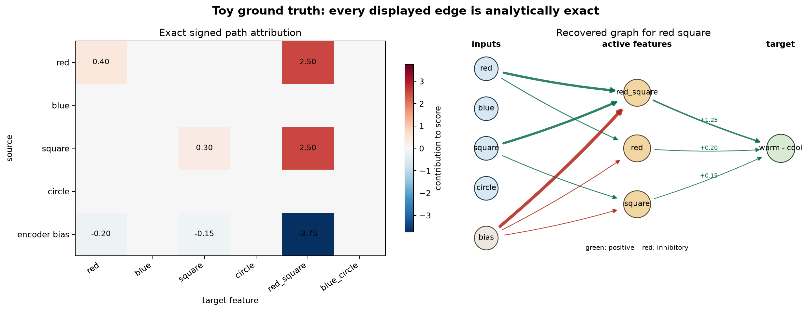
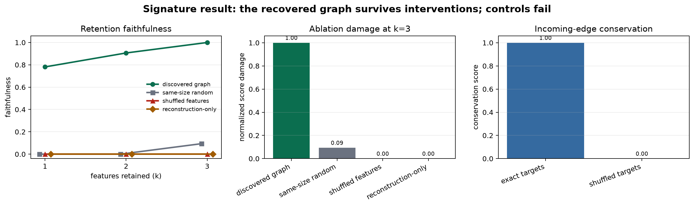

# [6.3] Transcoders and Attribution Graphs

**By the end of this notebook, you will have shown that a sparse ReLU transcoder exactly replaces a known colored-shape MLP, recovers its signed attribution graph, and survives feature interventions while same-size random, shuffled-edge, shuffled-feature, and reconstruction-only controls fail.**

## Core Question

Can we recover the exact signed computation graph for one MLP decision, then show through interventions that the recovered nodes are sufficient and necessary?

## Cold open: why did the model choose warm square?

The input is the exact residual vector `[red=1, blue=0, square=1, circle=0]`. The MLP emits `[1.35, -0.25, 0.10]`, so the target score `warm_square - cool_circle` is `1.60`.

| stage | exact value |
|---|---|
| active features | `red=0.5`, `square=0.5`, `red_square=0.5` |
| feature score contributions | `0.20`, `0.15`, `1.25` |
| target score | `1.60` |
| graph to recover | 3 feature nodes, 10 signed edges |

**Core question:** can you recover that graph from the weights, then prove it matters by rerunning the decoder after interventions?

This is an **exact model organism**, not evidence about a language model. Its purpose is to make every feature, edge, and intervention checkable against ground truth before you move to real transcoders.

```yaml
gt_tier: GT-0 exact model organism; committed GT-1 GELU-1L evidence is supporting context only
exercise_id: 6_3_transcoders_and_attribution_graphs
expected_runtime: 75-100 minutes on CPU
requires_gpu: false for this notebook
```

## Learning Objectives

- Implement the encoder, ReLU feature activation, decoder, and full transcoder forward path.
- Decompose an MLP reconstruction into feature vectors and a decoder-bias term.
- Derive signed input-to-feature and feature-to-score edge attributions.
- Extract the known sparse graph while preserving inhibitory bias edges.
- Validate graph sufficiency and necessity with retention and ablation interventions.
- Diagnose same-size random, shuffled-edge, shuffled-feature, and reconstruction-only controls.
- Hunt a deliberately dropped edge using a local conservation invariant.


```python
import json
import sys
from dataclasses import dataclass
from pathlib import Path

import matplotlib.pyplot as plt
import torch as t
import torch.nn.functional as F

chapter = "chapter6_sparse_feature_methods"
section = "part3_transcoders_attribution_graphs"
root_dir = next(p for p in [Path.cwd(), *Path.cwd().parents] if (p / chapter).exists())
exercises_dir = root_dir / chapter / "exercises"
section_dir = exercises_dir / section
assets_dir = root_dir / chapter / "instructions" / "assets"
if str(root_dir) not in sys.path:
    sys.path.append(str(root_dir))
if str(exercises_dir) not in sys.path:
    sys.path.append(str(exercises_dir))

import part3_transcoders_attribution_graphs.tests as tests

GT_TIER = "GT-0"
EXERCISE_ID = "6_3_transcoders_and_attribution_graphs"

@dataclass(frozen=True)
class ToyOrganism:
    input_names: tuple[str, ...]
    feature_names: tuple[str, ...]
    output_names: tuple[str, ...]
    encoder_weight: t.Tensor
    encoder_bias: t.Tensor
    decoder_weight: t.Tensor
    decoder_bias: t.Tensor
    readout: t.Tensor


@dataclass(frozen=True)
class TranscoderOutput:
    pre_acts: t.Tensor
    feature_acts: t.Tensor
    reconstructed_activations: t.Tensor


@dataclass(frozen=True)
class ReconstructionDecomposition:
    feature_components: t.Tensor
    bias_component: t.Tensor
    reconstructed_activations: t.Tensor


@dataclass(frozen=True)
class EdgeAttributions:
    input_to_feature: t.Tensor
    feature_to_score: t.Tensor
    downstream_effects: t.Tensor


@dataclass(frozen=True)
class AttributionEdge:
    source_type: str
    source_id: int
    target_type: str
    target_id: int
    weight: float


@dataclass(frozen=True)
class AttributionGraph:
    feature_ids: tuple[int, ...]
    edges: tuple[AttributionEdge, ...]


@dataclass(frozen=True)
class CausalValidation:
    clean_score: float
    zero_score: float
    retained_score: float
    ablated_score: float
    faithfulness: float
    normalized_damage: float

def make_toy_organism() -> ToyOrganism:
    """Return the exact colored-shape MLP used throughout the section."""

    encoder_weight = t.tensor(
        [
            [1.0, 0.0, 0.0, 0.0],  # red
            [0.0, 1.0, 0.0, 0.0],  # blue
            [0.0, 0.0, 1.0, 0.0],  # square
            [0.0, 0.0, 0.0, 1.0],  # circle
            [1.0, 0.0, 1.0, 0.0],  # red AND square
            [0.0, 1.0, 0.0, 1.0],  # blue AND circle
        ]
    )
    encoder_bias = t.tensor([-0.5, -0.5, -0.5, -0.5, -1.5, -1.5])
    decoder_weight = t.tensor(
        [
            [0.4, 0.0, 0.2],
            [0.0, 0.4, 3.0],
            [0.3, 0.0, 0.0],
            [0.0, 0.3, 2.5],
            [2.0, -0.5, 0.0],
            [-0.5, 2.0, 3.0],
        ]
    )
    return ToyOrganism(
        input_names=("red", "blue", "square", "circle"),
        feature_names=("red", "blue", "square", "circle", "red_square", "blue_circle"),
        output_names=("warm_square", "cool_circle", "style"),
        encoder_weight=encoder_weight,
        encoder_bias=encoder_bias,
        decoder_weight=decoder_weight,
        decoder_bias=t.zeros(3),
        readout=t.tensor([1.0, -1.0, 0.0]),
    )


def make_toy_input(color: str, shape: str) -> t.Tensor:
    """Encode one of the four valid colored shapes as a binary residual vector."""

    if color not in {"red", "blue"}:
        raise ValueError("color must be 'red' or 'blue'.")
    if shape not in {"square", "circle"}:
        raise ValueError("shape must be 'square' or 'circle'.")
    return t.tensor(
        [float(color == "red"), float(color == "blue"), float(shape == "square"), float(shape == "circle")]
    )

organism = make_toy_organism()
inputs = make_toy_input("red", "square")

print("Exact model organism")
print("  input coordinates :", dict(zip(organism.input_names, inputs.tolist())))
print("  expected features : red, square, red_square")
print("  target score      : warm_square - cool_circle = 1.60")
```


## The exact replacement model

The MLP and transcoder use the same equation:

\[
z = W_{enc}x + b_{enc}, \qquad f = \operatorname{ReLU}(z), \qquad y = W_{dec}f + b_{dec}.
\]

Here `W_enc` is stored as `(features, d_in)` and `W_dec` as `(features, d_out)`. The readout vector `[1, -1, 0]` turns the three-dimensional MLP output into the scalar score `warm_square - cool_circle`.

For one fixed input, the ReLU gate is fixed. The model is then locally linear, so signed path attributions are exact. Encoder bias must remain in the graph: for the conjunction feature it contributes `-3.75`, cancelling part of the two positive `+2.50` input paths.


### Exercise - implement `encode`, `decode`, and `transcoder_forward`

> ```yaml
> Difficulty: medium
> Importance: high
> You should spend 15-20 minutes on this exercise.
> ```

Implement the complete replacement path. Return pre-activations as well as sparse features so later exercises can see which ReLU gates are open.

<details>
<summary>Expected output</summary>

The semantic test prints a pass line. For `red square`, pre-activations are `[0.5, -0.5, 0.5, -0.5, 0.5, -1.5]`, feature activations are `[0.5, 0, 0.5, 0, 0.5, 0]`, and the reconstruction is `[1.35, -0.25, 0.10]`.

</details>

<details>
<summary>Help - connect the code to the mechanism</summary>

Follow the tensor shapes from right to left. `inputs @ encoder_weight.T` creates one scalar per feature. **Common bug:** transposing the decoder even though its rows already are feature decoder vectors.

</details>

<details>
<summary>Solution</summary>

```python
def encode(
    inputs: t.Tensor,
    encoder_weight: t.Tensor,
    encoder_bias: t.Tensor,
) -> tuple[t.Tensor, t.Tensor]:
    """Map MLP inputs to pre-activations and sparse ReLU feature activations."""

    if inputs.shape[-1] != encoder_weight.shape[-1]:
        raise ValueError("inputs last dimension must match encoder input dimension.")
    if encoder_weight.shape[0] != encoder_bias.shape[0]:
        raise ValueError("encoder feature dimension must match encoder_bias.")
    pre_acts = inputs.float() @ encoder_weight.float().T + encoder_bias.float()
    return pre_acts, F.relu(pre_acts)


def decode(
    feature_acts: t.Tensor,
    decoder_weight: t.Tensor,
    decoder_bias: t.Tensor,
) -> t.Tensor:
    """Map sparse feature activations into the replaced MLP's output space."""

    if feature_acts.shape[-1] != decoder_weight.shape[0]:
        raise ValueError("feature dimension must match decoder rows.")
    if decoder_weight.shape[1] != decoder_bias.shape[0]:
        raise ValueError("decoder output dimension must match decoder_bias.")
    return feature_acts.float() @ decoder_weight.float() + decoder_bias.float()


def transcoder_forward(
    inputs: t.Tensor,
    encoder_weight: t.Tensor,
    decoder_weight: t.Tensor,
    *,
    encoder_bias: t.Tensor | None = None,
    decoder_bias: t.Tensor | None = None,
) -> TranscoderOutput:
    """Run the encoder and decoder that replace one MLP computation."""

    encoder_bias = (
        t.zeros(encoder_weight.shape[0], device=inputs.device)
        if encoder_bias is None
        else encoder_bias.to(inputs.device)
    )
    decoder_bias = (
        t.zeros(decoder_weight.shape[1], device=inputs.device)
        if decoder_bias is None
        else decoder_bias.to(inputs.device)
    )
    pre_acts, feature_acts = encode(inputs, encoder_weight, encoder_bias)
    reconstructed = decode(feature_acts, decoder_weight, decoder_bias)
    return TranscoderOutput(pre_acts, feature_acts, reconstructed)
```

</details>


```python
def encode(
    inputs: t.Tensor,
    encoder_weight: t.Tensor,
    encoder_bias: t.Tensor,
) -> tuple[t.Tensor, t.Tensor]:
    raise NotImplementedError()


def decode(
    feature_acts: t.Tensor,
    decoder_weight: t.Tensor,
    decoder_bias: t.Tensor,
) -> t.Tensor:
    raise NotImplementedError()


def transcoder_forward(
    inputs: t.Tensor,
    encoder_weight: t.Tensor,
    decoder_weight: t.Tensor,
    *,
    encoder_bias: t.Tensor | None = None,
    decoder_bias: t.Tensor | None = None,
) -> TranscoderOutput:
    raise NotImplementedError()


tests.test_encoder_decoder_and_forward_recover_exact_mlp(encode, decode, transcoder_forward)

output = transcoder_forward(
    inputs,
    organism.encoder_weight,
    organism.decoder_weight,
    encoder_bias=organism.encoder_bias,
    decoder_bias=organism.decoder_bias,
)
```


### Exercise - implement `reconstruction_decomposition`

> ```yaml
> Difficulty: easy
> Importance: high
> You should spend 10-15 minutes on this exercise.
> ```

Expose one output-space vector per feature. Their sum plus decoder bias must equal the transcoder reconstruction exactly.

<details>
<summary>Expected output</summary>

The `red_square` component is `[1.00, -0.25, 0.00]`; summing all six feature components and bias returns `[1.35, -0.25, 0.10]` with zero error.

</details>

<details>
<summary>Help - connect the code to the mechanism</summary>

Broadcast feature activations with a final singleton dimension before multiplying by decoder rows. **Common bug:** summing over the output axis instead of the feature axis.

</details>

<details>
<summary>Solution</summary>

```python
def reconstruction_decomposition(
    feature_acts: t.Tensor,
    decoder_weight: t.Tensor,
    decoder_bias: t.Tensor,
) -> ReconstructionDecomposition:
    """Decompose a reconstruction into one vector per feature plus decoder bias."""

    if feature_acts.shape[-1] != decoder_weight.shape[0]:
        raise ValueError("feature dimension must match decoder rows.")
    feature_components = feature_acts.float().unsqueeze(-1) * decoder_weight.float()
    reconstructed = feature_components.sum(dim=-2) + decoder_bias.float()
    return ReconstructionDecomposition(feature_components, decoder_bias.float(), reconstructed)
```

</details>


```python
def reconstruction_decomposition(
    feature_acts: t.Tensor,
    decoder_weight: t.Tensor,
    decoder_bias: t.Tensor,
) -> ReconstructionDecomposition:
    raise NotImplementedError()


tests.test_reconstruction_decomposition_sums_feature_vectors(reconstruction_decomposition)

decomposition = reconstruction_decomposition(
    output.feature_acts,
    organism.decoder_weight,
    organism.decoder_bias,
)
```


### Exercise - implement `feature_edge_attributions`

> ```yaml
> Difficulty: hard
> Importance: very high
> You should spend 20-25 minutes on this exercise.
> ```

Compute each source-to-feature path's signed contribution to the final score. Append encoder bias as a fifth source, apply the fixed ReLU gate, and multiply by each decoder row's direct effect on the readout.

<details>
<summary>Expected output</summary>

The nonzero incoming paths are `red->red +0.40`, `square->square +0.30`, two `+2.50` paths into `red_square`, and bias paths `-0.20`, `-0.15`, `-3.75`. Their per-feature sums are `[0.20, 0, 0.15, 0, 1.25, 0]`.

</details>

<details>
<summary>Help - connect the code to the mechanism</summary>

First calculate `downstream_effects = decoder_weight @ readout`. The path formula is `source_value * encoder_weight * relu_gate * downstream_effect`. **Common bug:** dropping the negative bias paths, which breaks exact conservation.

</details>

<details>
<summary>Solution</summary>

```python
def feature_edge_attributions(
    inputs: t.Tensor,
    pre_acts: t.Tensor,
    feature_acts: t.Tensor,
    encoder_weight: t.Tensor,
    encoder_bias: t.Tensor,
    decoder_weight: t.Tensor,
    readout: t.Tensor,
) -> EdgeAttributions:
    """Compute exact signed path attributions in the locally linear ReLU model."""

    if inputs.ndim != 1 or pre_acts.ndim != 1 or feature_acts.ndim != 1:
        raise ValueError("This local graph exercise expects one unbatched example.")
    if inputs.shape[0] != encoder_weight.shape[1]:
        raise ValueError("input dimension must match encoder columns.")
    if pre_acts.shape != feature_acts.shape or pre_acts.shape[0] != encoder_weight.shape[0]:
        raise ValueError("pre_acts and feature_acts must match the encoder feature dimension.")
    downstream_effects = decoder_weight.float() @ readout.float()
    gates = pre_acts.gt(0).float()
    input_terms = inputs.float().unsqueeze(-1) * encoder_weight.float().T
    bias_terms = encoder_bias.float().unsqueeze(0)
    local_terms = t.cat([input_terms, bias_terms], dim=0)
    input_to_feature = local_terms * gates.unsqueeze(0) * downstream_effects.unsqueeze(0)
    feature_to_score = feature_acts.float() * downstream_effects
    return EdgeAttributions(input_to_feature, feature_to_score, downstream_effects)
```

</details>


```python
def feature_edge_attributions(
    inputs: t.Tensor,
    pre_acts: t.Tensor,
    feature_acts: t.Tensor,
    encoder_weight: t.Tensor,
    encoder_bias: t.Tensor,
    decoder_weight: t.Tensor,
    readout: t.Tensor,
) -> EdgeAttributions:
    raise NotImplementedError()


tests.test_feature_edge_attributions_are_exact_and_conserved(
    transcoder_forward,
    feature_edge_attributions,
)

attributions = feature_edge_attributions(
    inputs,
    output.pre_acts,
    output.feature_acts,
    organism.encoder_weight,
    organism.encoder_bias,
    organism.decoder_weight,
    organism.readout,
)
```


### Exercise - implement `extract_attribution_graph`

> ```yaml
> Difficulty: medium
> Importance: very high
> You should spend 15-20 minutes on this exercise.
> ```

Rank feature nodes by absolute feature-to-score contribution, then keep every signed incoming edge above the threshold for the selected nodes. Signed negative edges remain negative.

<details>
<summary>Expected output</summary>

The graph ranks `red_square`, `red`, `square`, contains 10 edges, and includes `bias -> red_square (-3.75)`.

</details>

<details>
<summary>Help - connect the code to the mechanism</summary>

Sort on absolute magnitude but store the original sign. Use the source matrix's last row as encoder bias. **Common bug:** taking the top input edges globally, which can leave a selected feature without its cancelling bias edge.

</details>

<details>
<summary>Solution</summary>

```python
def extract_attribution_graph(
    input_to_feature: t.Tensor,
    feature_to_score: t.Tensor,
    *,
    top_k_features: int,
    min_abs_edge: float = 1e-8,
) -> AttributionGraph:
    """Keep the strongest feature nodes and every nonzero incoming signed edge."""

    if input_to_feature.ndim != 2:
        raise ValueError("input_to_feature must have shape (sources, features).")
    if input_to_feature.shape[1] != feature_to_score.shape[0]:
        raise ValueError("feature dimensions must match.")
    if top_k_features <= 0:
        raise ValueError("top_k_features must be positive.")
    ranked = sorted(
        range(feature_to_score.numel()),
        key=lambda feature_id: (-abs(float(feature_to_score[feature_id].item())), feature_id),
    )
    selected = tuple(
        feature_id
        for feature_id in ranked
        if abs(float(feature_to_score[feature_id].item())) > min_abs_edge
    )[:top_k_features]
    edges: list[AttributionEdge] = []
    bias_source = input_to_feature.shape[0] - 1
    for feature_id in selected:
        for source_id in range(input_to_feature.shape[0]):
            weight = float(input_to_feature[source_id, feature_id].item())
            if abs(weight) <= min_abs_edge:
                continue
            edges.append(
                AttributionEdge(
                    source_type="bias" if source_id == bias_source else "input",
                    source_id=0 if source_id == bias_source else source_id,
                    target_type="feature",
                    target_id=feature_id,
                    weight=weight,
                )
            )
        edges.append(AttributionEdge("feature", feature_id, "score", 0, float(feature_to_score[feature_id].item())))
    return AttributionGraph(feature_ids=selected, edges=tuple(edges))
```

</details>


```python
def extract_attribution_graph(
    input_to_feature: t.Tensor,
    feature_to_score: t.Tensor,
    *,
    top_k_features: int,
    min_abs_edge: float = 1e-8,
) -> AttributionGraph:
    raise NotImplementedError()


tests.test_graph_extraction_recovers_known_ground_truth(extract_attribution_graph)

graph = extract_attribution_graph(
    attributions.input_to_feature,
    attributions.feature_to_score,
    top_k_features=3,
)
print("Recovered features:", [organism.feature_names[i] for i in graph.feature_ids])
print("Recovered edges:", len(graph.edges))
```


## Visible graph and attribution heatmap

The heatmap should contain exactly seven nonzero source-to-feature cells. The graph shows the same paths, with green positive edges and red inhibitory bias edges.



<details>
<summary>Interpreting the result</summary>

The conjunction feature receives two large positive paths and one larger negative bias path. Looking only at absolute edge magnitude would make the feature appear to contribute `5.0`; preserving signs gives the correct `1.25`. The graph is exact for this input because the active ReLU gates are fixed.

</details>


```python
def plot_attribution_graph(
    organism: ToyOrganism,
    edge_attributions: EdgeAttributions,
    graph: AttributionGraph,
    *,
    save_path: Path | None = None,
):
    """Plot the exact signed edge heatmap and extracted graph."""

    import matplotlib.pyplot as plt
    from matplotlib.patches import FancyArrowPatch

    matrix = edge_attributions.input_to_feature.detach().cpu()
    source_names = (*organism.input_names, "encoder bias")
    fig, axes = plt.subplots(1, 2, figsize=(14, 5.4), gridspec_kw={"width_ratios": [1.15, 1.0]})
    limit = float(matrix.abs().max().item())
    image = axes[0].imshow(matrix, cmap="RdBu_r", vmin=-limit, vmax=limit, aspect="auto")
    axes[0].set_xticks(range(len(organism.feature_names)), organism.feature_names, rotation=35, ha="right")
    axes[0].set_yticks(range(len(source_names)), source_names)
    axes[0].set_title("Exact signed path attribution")
    axes[0].set_xlabel("target feature")
    axes[0].set_ylabel("source")
    for row in range(matrix.shape[0]):
        for col in range(matrix.shape[1]):
            value = float(matrix[row, col].item())
            if abs(value) > 1e-8:
                axes[0].text(col, row, f"{value:.2f}", ha="center", va="center", fontsize=9)
    fig.colorbar(image, ax=axes[0], shrink=0.78, label="contribution to score")

    ax = axes[1]
    ax.set_title("Recovered graph for red square")
    ax.set_xlim(-0.15, 2.2)
    ax.set_ylim(-0.7, 4.7)
    ax.axis("off")
    source_pos = {i: (0.0, 4.0 - i) for i in range(len(organism.input_names))}
    bias_pos = (0.0, -0.25)
    feature_pos = {feature_id: (1.05, 3.4 - rank * 1.4) for rank, feature_id in enumerate(graph.feature_ids)}
    target_pos = (2.05, 2.0)
    for source_id, position in source_pos.items():
        ax.scatter(*position, s=850, color="#d7e8f5", edgecolor="#234", zorder=3)
        ax.text(*position, organism.input_names[source_id], ha="center", va="center", fontsize=9, zorder=4)
    ax.scatter(*bias_pos, s=850, color="#ece7df", edgecolor="#543", zorder=3)
    ax.text(*bias_pos, "bias", ha="center", va="center", fontsize=9, zorder=4)
    for feature_id, position in feature_pos.items():
        ax.scatter(*position, s=1100, color="#f2d6a2", edgecolor="#543", zorder=3)
        ax.text(*position, organism.feature_names[feature_id], ha="center", va="center", fontsize=9, zorder=4)
    ax.scatter(*target_pos, s=1200, color="#d8ead2", edgecolor="#243", zorder=3)
    ax.text(*target_pos, "warm - cool", ha="center", va="center", fontsize=9, zorder=4)
    max_weight = max(abs(edge.weight) for edge in graph.edges)
    for edge in graph.edges:
        if edge.target_type == "feature":
            start = bias_pos if edge.source_type == "bias" else source_pos[edge.source_id]
            end = feature_pos[edge.target_id]
        else:
            start = feature_pos[edge.source_id]
            end = target_pos
        color = "#0b6e4f" if edge.weight > 0 else "#b42318"
        ax.add_patch(
            FancyArrowPatch(
                start,
                end,
                arrowstyle="-|>",
                mutation_scale=11,
                linewidth=0.8 + 3.0 * abs(edge.weight) / max_weight,
                color=color,
                alpha=0.85,
                shrinkA=22,
                shrinkB=25,
                connectionstyle="arc3,rad=0.04",
                zorder=2,
            )
        )
        if edge.target_type == "score":
            midpoint = ((start[0] + end[0]) / 2, (start[1] + end[1]) / 2)
            ax.text(*midpoint, f"{edge.weight:+.2f}", fontsize=7, color=color, ha="center", va="center")
    ax.text(0.0, 4.55, "inputs", ha="center", weight="bold")
    ax.text(1.05, 4.55, "active features", ha="center", weight="bold")
    ax.text(2.05, 4.55, "target", ha="center", weight="bold")
    ax.text(1.05, -0.55, "green: positive    red: inhibitory", ha="center", fontsize=8)
    fig.suptitle("Toy ground truth: every displayed edge is analytically exact", fontsize=14, weight="bold")
    fig.tight_layout()
    if save_path is not None:
        fig.savefig(save_path, dpi=180, bbox_inches="tight")
    return fig

fig = plot_attribution_graph(organism, attributions, graph)
plt.show()
```


### Exercise - implement edge conservation and a shuffled-edge control

> ```yaml
> Difficulty: medium
> Importance: high
> You should spend 15-20 minutes on this exercise.
> ```

Check that incoming path attributions equal each feature's outgoing score contribution. Then cyclically shuffle only the targets of incoming edges while preserving the same edge count and weights.

<details>
<summary>Expected output</summary>

The exact graph scores `1.0`; the same ten edges with shuffled targets score `0.0`.

</details>

<details>
<summary>Help - connect the code to the mechanism</summary>

Accumulate incoming and outgoing values by feature id before comparing them. **Common bug:** comparing only total sums; target shuffling preserves the global sum while destroying feature-level structure.

</details>

<details>
<summary>Solution</summary>

```python
def edge_conservation_score(edges: tuple[AttributionEdge, ...] | list[AttributionEdge], n_features: int) -> float:
    """Measure whether incoming signed paths agree with each feature-to-score edge."""

    incoming = t.zeros(n_features)
    outgoing = t.zeros(n_features)
    for edge in edges:
        if edge.target_type == "feature":
            incoming[edge.target_id] += edge.weight
        elif edge.source_type == "feature" and edge.target_type == "score":
            outgoing[edge.source_id] += edge.weight
    denominator = outgoing.abs().sum().item()
    if denominator == 0:
        return 1.0 if incoming.abs().sum().item() == 0 else 0.0
    score = 1.0 - (incoming - outgoing).abs().sum().item() / denominator
    return max(0.0, score)


def shuffle_input_edge_targets(
    edges: tuple[AttributionEdge, ...] | list[AttributionEdge],
    *,
    n_features: int,
    shift: int = 1,
) -> tuple[AttributionEdge, ...]:
    """Cyclically move incoming edges while leaving feature-to-score edges fixed."""

    if n_features <= 1:
        raise ValueError("n_features must be greater than one.")
    shift %= n_features
    return tuple(
        AttributionEdge(
            edge.source_type,
            edge.source_id,
            edge.target_type,
            (edge.target_id + shift) % n_features if edge.target_type == "feature" else edge.target_id,
            edge.weight,
        )
        for edge in edges
    )
```

</details>


```python
def edge_conservation_score(
    edges: tuple[AttributionEdge, ...] | list[AttributionEdge],
    n_features: int,
) -> float:
    raise NotImplementedError()


def shuffle_input_edge_targets(
    edges: tuple[AttributionEdge, ...] | list[AttributionEdge],
    *,
    n_features: int,
    shift: int = 1,
) -> tuple[AttributionEdge, ...]:
    raise NotImplementedError()


tests.test_shuffled_edges_fail_conservation_control(
    edge_conservation_score,
    shuffle_input_edge_targets,
)
```


### Exercise - implement feature interventions and faithfulness curves

> ```yaml
> Difficulty: hard
> Importance: very high
> You should spend 25-30 minutes on this exercise.
> ```

Retain or ablate graph features before the decoder, rerun the score, and normalize against the clean-to-zero gap. Implement a decoder-norm ranking as the reconstruction-only baseline.

<details>
<summary>Expected output</summary>

The discovered graph's retention curve is `[0.78125, 0.90625, 1.0]`; the fixed same-size random draw reaches only `0.09375` at k=3, while shuffled-feature and reconstruction-only curves remain zero. Ablating all three graph features removes 100% of the score.

</details>

<details>
<summary>Help - connect the code to the mechanism</summary>

Build a binary mask over feature ids. Faithfulness asks whether retained features reproduce the clean score; damage asks whether ablating them changes it. **Common bug:** reporting attribution sums instead of rerunning `decode` on intervened activations.

</details>

<details>
<summary>Solution</summary>

```python
def intervene_features(feature_acts: t.Tensor, feature_ids: list[int] | tuple[int, ...], *, mode: str) -> t.Tensor:
    """Keep or ablate chosen features before decoding."""

    if feature_acts.ndim != 1:
        raise ValueError("This intervention exercise expects one feature vector.")
    ids = t.as_tensor(feature_ids, dtype=t.long, device=feature_acts.device)
    if ids.numel() and (ids.min().item() < 0 or ids.max().item() >= feature_acts.numel()):
        raise ValueError("feature id out of range.")
    mask = t.zeros_like(feature_acts)
    mask[ids] = 1.0
    if mode == "keep":
        return feature_acts * mask
    if mode == "ablate":
        return feature_acts * (1.0 - mask)
    raise ValueError("mode must be 'keep' or 'ablate'.")


def causal_validate_graph(
    feature_acts: t.Tensor,
    decoder_weight: t.Tensor,
    decoder_bias: t.Tensor,
    readout: t.Tensor,
    feature_ids: list[int] | tuple[int, ...],
) -> CausalValidation:
    """Rerun the decoder after graph retention and ablation interventions."""

    def score(acts: t.Tensor) -> float:
        return float((decode(acts, decoder_weight, decoder_bias) @ readout.float()).item())

    clean_score = score(feature_acts)
    zero_score = score(t.zeros_like(feature_acts))
    retained_score = score(intervene_features(feature_acts, feature_ids, mode="keep"))
    ablated_score = score(intervene_features(feature_acts, feature_ids, mode="ablate"))
    scale = max(abs(clean_score - zero_score), 1e-12)
    return CausalValidation(
        clean_score,
        zero_score,
        retained_score,
        ablated_score,
        1.0 - abs(clean_score - retained_score) / scale,
        abs(clean_score - ablated_score) / scale,
    )


def faithfulness_curve(
    feature_acts: t.Tensor,
    decoder_weight: t.Tensor,
    decoder_bias: t.Tensor,
    readout: t.Tensor,
    ranking: list[int] | tuple[int, ...],
    *,
    max_k: int,
) -> t.Tensor:
    """Evaluate graph retention faithfulness for prefixes of a feature ranking."""

    if max_k <= 0 or max_k > len(ranking):
        raise ValueError("max_k must be between one and the ranking length.")
    return t.tensor(
        [
            causal_validate_graph(
                feature_acts, decoder_weight, decoder_bias, readout, list(ranking[:k])
            ).faithfulness
            for k in range(1, max_k + 1)
        ]
    )


def reconstruction_only_ranking(decoder_weight: t.Tensor) -> tuple[int, ...]:
    """Rank features by decoder norm, a behavior-agnostic reconstruction baseline."""

    norms = decoder_weight.float().norm(dim=-1)
    return tuple(sorted(range(norms.numel()), key=lambda i: (-float(norms[i].item()), i)))
```

</details>


```python
def intervene_features(
    feature_acts: t.Tensor,
    feature_ids: list[int] | tuple[int, ...],
    *,
    mode: str,
) -> t.Tensor:
    raise NotImplementedError()


def causal_validate_graph(
    feature_acts: t.Tensor,
    decoder_weight: t.Tensor,
    decoder_bias: t.Tensor,
    readout: t.Tensor,
    feature_ids: list[int] | tuple[int, ...],
) -> CausalValidation:
    raise NotImplementedError()


def faithfulness_curve(
    feature_acts: t.Tensor,
    decoder_weight: t.Tensor,
    decoder_bias: t.Tensor,
    readout: t.Tensor,
    ranking: list[int] | tuple[int, ...],
    *,
    max_k: int,
) -> t.Tensor:
    raise NotImplementedError()


def reconstruction_only_ranking(decoder_weight: t.Tensor) -> tuple[int, ...]:
    raise NotImplementedError()


tests.test_interventions_recover_faithfulness_and_reject_controls(
    intervene_features,
    causal_validate_graph,
    faithfulness_curve,
)
tests.test_reconstruction_only_ranking_misses_behavior(
    reconstruction_only_ranking,
    faithfulness_curve,
)
```


## Signature Result

This is the primary result. Every curve below is generated from the functions you implemented. The same-size random graph has the same number of feature nodes; shuffled features preserve list length; shuffled edges preserve edge count and weights; reconstruction-only ranks global decoder norms without seeing the target behavior.



<details>
<summary>Expected output</summary>

| result | exact value |
|---|---:|
| target score | 1.60000 |
| discovered faithfulness, k=1/2/3 | 0.78125 / 0.90625 / 1.00000 |
| same-size random faithfulness, k=1/2/3 | 0 / 0 / 0.09375 |
| shuffled-feature faithfulness, k=1/2/3 | 0 / 0 / 0 |
| reconstruction-only faithfulness, k=1/2/3 | 0 / 0 / 0 |
| graph ablation damage, k=3 | 1.00000 |
| random ablation damage, k=3 | 0.09375 |
| exact / shuffled edge conservation | 1.00000 / 0.00000 |

</details>


```python
def plot_signature_result(
    curves: dict[str, t.Tensor],
    damages: dict[str, float],
    edge_scores: dict[str, float],
    *,
    save_path: Path | None = None,
):
    """Plot intervention faithfulness and the required negative controls."""

    import matplotlib.pyplot as plt

    colors = {
        "discovered graph": "#0b6e4f",
        "same-size random": "#6b7280",
        "shuffled features": "#b42318",
        "reconstruction-only": "#a15c00",
    }
    markers = {
        "discovered graph": "o",
        "same-size random": "s",
        "shuffled features": "^",
        "reconstruction-only": "D",
    }
    x_offsets = {
        "discovered graph": 0.0,
        "same-size random": -0.07,
        "shuffled features": 0.0,
        "reconstruction-only": 0.07,
    }
    fig, axes = plt.subplots(1, 3, figsize=(14, 4.2))
    ks = range(1, len(next(iter(curves.values()))) + 1)
    for label, values in curves.items():
        x_values = [k + x_offsets[label] for k in ks]
        axes[0].plot(
            x_values,
            values.tolist(),
            marker=markers[label],
            linewidth=2.2,
            label=label,
            color=colors[label],
        )
    axes[0].set_title("Retention faithfulness")
    axes[0].set_xlabel("features retained (k)")
    axes[0].set_ylabel("faithfulness")
    axes[0].set_xticks(list(ks))
    axes[0].set_ylim(-0.04, 1.06)
    axes[0].grid(axis="y", alpha=0.25)
    axes[0].legend(frameon=False, fontsize=8)
    labels = list(damages)
    axes[1].bar(range(len(labels)), [damages[label] for label in labels], color=[colors[label] for label in labels])
    axes[1].set_title("Ablation damage at k=3")
    axes[1].set_ylabel("normalized score damage")
    axes[1].set_xticks(range(len(labels)), labels, rotation=28, ha="right")
    axes[1].set_ylim(0, 1.06)
    axes[1].grid(axis="y", alpha=0.25)
    for index, label in enumerate(labels):
        axes[1].text(index, damages[label] + 0.025, f"{damages[label]:.2f}", ha="center", fontsize=8)
    edge_labels = list(edge_scores)
    axes[2].bar(range(len(edge_labels)), [edge_scores[label] for label in edge_labels], color=["#356aa0", "#b42318"])
    axes[2].set_title("Incoming-edge conservation")
    axes[2].set_ylabel("conservation score")
    axes[2].set_xticks(range(len(edge_labels)), edge_labels, rotation=20, ha="right")
    axes[2].set_ylim(0, 1.06)
    axes[2].grid(axis="y", alpha=0.25)
    for index, label in enumerate(edge_labels):
        axes[2].text(index, edge_scores[label] + 0.025, f"{edge_scores[label]:.2f}", ha="center", fontsize=8)
    fig.suptitle("Signature result: the recovered graph survives interventions; controls fail", fontsize=14, weight="bold")
    fig.tight_layout()
    if save_path is not None:
        fig.savefig(save_path, dpi=180, bbox_inches="tight")
    return fig

rankings = {
    "discovered graph": graph.feature_ids,
    "same-size random": (3, 1, 2),
    "shuffled features": (5, 1, 3),
    "reconstruction-only": reconstruction_only_ranking(organism.decoder_weight)[:3],
}
curves = {
    label: faithfulness_curve(
        output.feature_acts,
        organism.decoder_weight,
        organism.decoder_bias,
        organism.readout,
        ranking,
        max_k=3,
    )
    for label, ranking in rankings.items()
}
damages = {
    label: causal_validate_graph(
        output.feature_acts,
        organism.decoder_weight,
        organism.decoder_bias,
        organism.readout,
        ranking,
    ).normalized_damage
    for label, ranking in rankings.items()
}
shuffled_edges = shuffle_input_edge_targets(
    graph.edges,
    n_features=len(organism.feature_names),
)
edge_scores = {
    "exact targets": edge_conservation_score(graph.edges, len(organism.feature_names)),
    "shuffled targets": edge_conservation_score(shuffled_edges, len(organism.feature_names)),
}

fig = plot_signature_result(curves, damages, edge_scores)
plt.show()

for label, values in curves.items():
    print(f"{label:22s}: {[round(float(v), 5) for v in values]}")
print("graph / random damage  :", round(damages["discovered graph"], 5), "/", round(damages["same-size random"], 5))
print("exact / shuffled edges:", round(edge_scores["exact targets"], 5), "/", round(edge_scores["shuffled targets"], 5))
```


## Interpreting the result

The one-feature graph already recovers `1.25 / 1.60 = 78.125%` of the score because `red_square` dominates. Adding `red` reaches `90.625%`; adding `square` reaches `100%`. The same nodes are necessary: ablating all three reduces the target score from `1.60` to `0.00`.

The controls catch distinct errors. A fixed same-size random draw tests whether any three nodes suffice; it recovers only the small `square` contribution by chance. Shuffled features test identity dependence. The reconstruction-only baseline shows that large decoder norms can point along an irrelevant `style` coordinate. Shuffled edge targets test topology while holding edge count and edge weights fixed.


## Try It Yourself

Change `color`, `shape`, or `top_k_features`. `blue circle` should produce the sign-reversed counterpart; mismatched pairs such as `red circle` should activate only their two basic features. This cell is the play surface: inspect how graph size, signs, and faithfulness change together.


```python
color = "blue"
shape = "circle"
top_k_features = 3

play_input = make_toy_input(color, shape)
play_output = transcoder_forward(
    play_input,
    organism.encoder_weight,
    organism.decoder_weight,
    encoder_bias=organism.encoder_bias,
    decoder_bias=organism.decoder_bias,
)
play_attributions = feature_edge_attributions(
    play_input,
    play_output.pre_acts,
    play_output.feature_acts,
    organism.encoder_weight,
    organism.encoder_bias,
    organism.decoder_weight,
    organism.readout,
)
play_graph = extract_attribution_graph(
    play_attributions.input_to_feature,
    play_attributions.feature_to_score,
    top_k_features=top_k_features,
)
play_validation = causal_validate_graph(
    play_output.feature_acts,
    organism.decoder_weight,
    organism.decoder_bias,
    organism.readout,
    play_graph.feature_ids,
)
print("active features:", [organism.feature_names[i] for i in play_graph.feature_ids])
print("score:", round(play_validation.clean_score, 5))
print("faithfulness:", round(play_validation.faithfulness, 5))
fig = plot_attribution_graph(organism, play_attributions, play_graph)
plt.show()
```


## Anomaly hunting: find the missing edge

A graph implementation can preserve node names and still silently drop an inhibitory edge. The cell below removes `bias -> red_square` from the otherwise exact graph. Use the feature-level conservation residual to localize the anomaly. Then change `suspect_feature` or remove a positive edge instead.

<details>
<summary>Expected output</summary>

`red_square` has the largest conservation residual, `3.75`, and the corrupted graph's conservation score is `0.0`.

</details>

<details>
<summary>Help - why the residual points to one node</summary>

Incoming and outgoing attribution should match separately at every active feature. A global sum can hide a misplaced edge; the per-feature residual cannot.

</details>


```python
suspect_feature = organism.feature_names.index("red_square")
corrupted_edges = tuple(
    edge
    for edge in graph.edges
    if not (
        edge.source_type == "bias"
        and edge.target_type == "feature"
        and edge.target_id == suspect_feature
    )
)

incoming = t.zeros(len(organism.feature_names))
outgoing = t.zeros(len(organism.feature_names))
for edge in corrupted_edges:
    if edge.target_type == "feature":
        incoming[edge.target_id] += edge.weight
    elif edge.source_type == "feature" and edge.target_type == "score":
        outgoing[edge.source_id] += edge.weight
residual = (incoming - outgoing).abs()
anomaly_id = int(residual.argmax().item())
print("largest anomaly:", organism.feature_names[anomaly_id])
print("residual:", round(float(residual[anomaly_id]), 5))
print("conservation score:", edge_conservation_score(corrupted_edges, len(organism.feature_names)))
```


## Real-model connection: supporting evidence only

The course repository also contains a committed CUDA preflight for pinned TransformerLens `gelu-1l` at revision `bddc0e332f0ae84279e6a6a45d91b314899e1603`. It replaced the one-layer model's MLP output exactly, then trained a small ReLU transcoder on 104 cached activations. This CPU notebook does not rerun that experiment, and the committed run is not a replication of a published cross-layer transcoder graph.

The cell below reads a few provenance-bound metrics as secondary context. It does not feed the signature result.

<details>
<summary>Expected output</summary>

The committed run reports oracle MLP-output max error `5.72e-06`, oracle logit max error `1.81e-05`, trained held-out MSE ratio `0.15015`, top-1 agreement `0.90385`, and top-feature damage `0.80828` versus low-effect damage `0.00065`.

</details>


```python
report = json.loads((section_dir / "verification_report.json").read_text())
gpu = report["metrics"]["gpu_test"]
supporting_metrics = [
    ("model / revision", f"{gpu['model_name']} / {gpu['hf_revision'][:12]}"),
    ("cached activations", gpu["activation_count"]),
    ("oracle MLP max error", f"{gpu['oracle_mlp_out_max_abs_error']:.2e}"),
    ("oracle logit max error", f"{gpu['oracle_logits_max_abs_error']:.2e}"),
    ("held-out MSE ratio", f"{gpu['trained_transcoder_heldout_mse_ratio']:.5f}"),
    ("top-1 agreement", f"{gpu['trained_replacement_top1_agreement']:.5f}"),
    ("top / low-effect damage", f"{gpu['graph_topk_damage']:.5f} / {gpu['graph_random_damage']:.5f}"),
]
for label, value in supporting_metrics:
    print(f"{label:24s} {value}")
```


### Optional CUDA verification entry points

These wrappers expose the pinned real-model path required by the course verification harness. They call the section's existing GELU-1L implementation and never substitute CPU values. Do not run them in this CPU notebook; the parent workflow serializes CUDA checks.


```python
def run_gpu_test(max_vram_gb: float = 24.0) -> dict:
    verification_module = __import__(
        "part3_transcoders_attribution_graphs.solutions",
        fromlist=["run_gpu_test"],
    )
    return verification_module.run_gpu_test(max_vram_gb=max_vram_gb)


def run_full_experiment(max_vram_gb: float = 24.0) -> dict:
    return run_gpu_test(max_vram_gb=max_vram_gb)
```


## Limitations

- The main result is exact because the model organism is hand-specified and has one ReLU layer. It demonstrates the mechanics and tests, not feature discovery from learned language-model activations.
- The local edge formula is exact only while the ReLU gate pattern stays fixed. Crossing an activation threshold changes the local graph.
- The decoder intervention tests the replacement model. A learned transcoder can be behaviorally close yet mechanistically unfaithful to the original MLP.
- The reconstruction-only control is intentionally target-agnostic. Real evaluations should compare reconstruction, behavior, sparsity, feature interpretability, and interventions over held-out prompts.
- The committed `gelu-1l` run is a small per-layer preflight with generated prompts. It does not establish frontier-model attribution-graph validity or reproduce the cross-layer results from the papers below.

## Reading and model links

- [Circuit Tracing: Revealing Computational Graphs in Language Models](https://transformer-circuits.pub/2025/attribution-graphs/methods.html), especially the replacement-model, attribution-graph, intervention, evaluation, and limitations sections.
- [On the Biology of a Large Language Model](https://transformer-circuits.pub/2025/attribution-graphs/biology.html) for applications and intervention caveats.
- [Transcoders Beat Sparse Autoencoders for Interpretability](https://arxiv.org/abs/2501.18823) for evidence comparing transcoder and SAE features.
- [TransformerLens `gelu-1l` model code and configuration](https://github.com/TransformerLensOrg/TransformerLens) for the small real-model preflight used by this repository.

The transferable workflow is: verify replacement, expose the decomposition, attribute edges, extract a sparse graph, intervene, and try to break the claim with matched controls.
