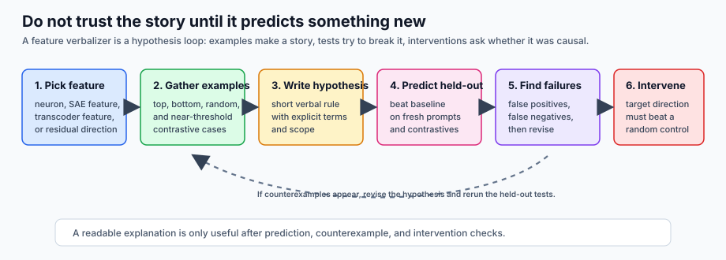
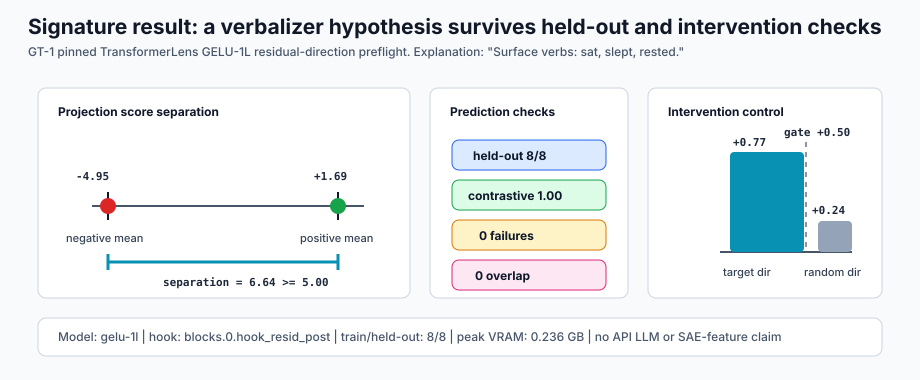

# [7.2] Feature Verbalizers

> **Local-first extension.** In this section, you will try to explain a
> residual direction from a small model using activation examples, then test
> whether your explanation survives held-out examples, contrastive near-misses,
> counterexamples, and a causal intervention.

```yaml
gt_tier: GT-1 residual-direction verbalizer preflight
exercise_id: 7_2_feature_verbalizers
expected_runtime: 60-90 minutes for CPU exercises; several minutes for CUDA gelu-1l preflight
requires_gpu: true for the TransformerLens preflight; false for the implementation exercises
```

Please send any problems / bugs on the `#errata` channel in the [Slack group](https://info-arena.github.io/ARENA_img/slack.html), and ask any questions on the dedicated channels for this chapter of material.

If you want to change to dark mode, you can do this by clicking the three horizontal lines in the top-right, then navigating to Settings -> Theme.

Links to earlier chapters: [(0) Fundamentals](https://arena-chapter0-fundamentals.streamlit.app/), [(1) Transformer Interpretability](https://arena-chapter1-transformer-interp.streamlit.app/), [(2) RL](https://arena-chapter2-rl.streamlit.app/), [(3) LLM Evaluations](https://arena-chapter3-llm-evals.streamlit.app/), [(4) Alignment Science](https://arena-chapter4-alignment-science.streamlit.app/).


# Introduction

Feature verbalizers are the natural-language cousin of SAE dashboards and
neuron descriptions. You inspect examples where a feature or direction is
active, write a short hypothesis, and ask whether that hypothesis predicts
anything you did not already look at.

This sounds simple, but it is exactly where interpretability illusions sneak
in. Top-activating examples can be vivid and misleading. A description can
sound right while failing on near-threshold examples. A keyword rule can pass
because the held-out split leaked the same words. A verbal explanation can
describe a correlation without predicting what happens when you intervene.

So the workflow in this section is deliberately skeptical:



The committed CUDA report runs the same loop on a pinned TransformerLens
`gelu-1l` residual direction. It constructs a direction from two safe anchor
prompts, scores safe train and held-out prompt sets, learns the explanation
terms only from the training positives, predicts held-out activations, checks
contrastive near-misses, records counterexamples, and verifies that adding the
target direction beats an orthogonal random-direction intervention. This is a
mechanics preflight, not an API-LLM verbalizer benchmark.


## Content & Learning Objectives

### 1. Example collection

> ##### Learning Objectives
>
> * Gather top, bottom, random, and near-threshold examples.
> * Keep activation score, label, and example kind attached to each item.
> * Explain why top examples alone are not enough evidence.

### 2. Explanation prediction

> ##### Learning Objectives
>
> * Turn a verbal hypothesis into a concrete prediction rule.
> * Compare held-out accuracy against a baseline.
> * Avoid substring and train/held-out leakage traps.

### 3. Counterexamples and revision

> ##### Learning Objectives
>
> * Treat false positives and false negatives as the main product of the loop.
> * Revise only when the revision is grounded in actual failures.
> * Keep the explanation short enough to be useful.

### 4. Intervention checks

> ##### Learning Objectives
>
> * Test whether the explanation predicts the sign of an activation intervention.
> * Compare the target direction against an orthogonal random direction.
> * State exactly what the intervention does and does not prove.


## Setup code

```python
import re
import sys
from dataclasses import dataclass
from pathlib import Path
from typing import Literal

import torch as t

chapter = "chapter7_activation_to_language"
section = "part2_feature_verbalizers"
root_dir = next(p for p in [Path.cwd(), *Path.cwd().parents] if (p / chapter).exists())
exercises_dir = root_dir / chapter / "exercises"
section_dir = exercises_dir / section

if str(root_dir) not in sys.path:
    sys.path.append(str(root_dir))
if str(exercises_dir) not in sys.path:
    sys.path.append(str(exercises_dir))

import part2_feature_verbalizers.tests as tests
import part2_feature_verbalizers.utils as utils

ExampleKind = Literal["top", "bottom", "random", "contrastive"]
TOKEN_RE = re.compile(r"[a-zA-Z]+")
DEFAULT_STOPWORDS = {
    "a", "an", "and", "at", "beside", "in", "near", "of", "on", "over", "the", "to",
}
MAIN = __name__ == "__main__"
```

```python
@dataclass(frozen=True)
class VerbalizerExample:
    text: str
    score: float
    label: bool
    kind: ExampleKind


@dataclass(frozen=True)
class VerbalizerExampleSet:
    top: tuple[VerbalizerExample, ...]
    bottom: tuple[VerbalizerExample, ...]
    random: tuple[VerbalizerExample, ...]
    contrastive: tuple[VerbalizerExample, ...]


@dataclass(frozen=True)
class ExplanationPredictionReport:
    accuracy: float
    baseline_accuracy: float
    contrastive_accuracy: float
    passes_baseline: bool
    survives_contrastive: bool


@dataclass(frozen=True)
class CounterexampleReport:
    num_counterexamples: int
    counterexamples: tuple[str, ...]


@dataclass(frozen=True)
class InterventionPredictionReport:
    predicted_direction: Literal["increase", "decrease"]
    observed_delta: float
    matches_prediction: bool


@dataclass(frozen=True)
class ExplanationBrevityReport:
    explanation_word_count: int
    examples_word_count: int
    shorter_than_examples: bool
```


# Example Collection

### Exercise - gather top, bottom, random, and contrastive examples

> ```yaml
> Difficulty: easy
> Importance: high
>
> You should spend up to 10 mins on this exercise.
> ```

The first move in a verbalizer loop is not "find the largest activations and
write a story". It is to build a small inspection set that can make the story
fail. Top examples show what the feature likes; bottom examples show what it
rejects; random examples keep you calibrated; contrastive examples live near
the decision boundary.

<details>
<summary>Expected output</summary>

Top examples should be `["alpha code", "beta def"]`, bottom examples should be
`["quiet notes", "plain story"]`, and contrastive examples should be
`["beta def", "plain story"]`.

When correct, the tests print:

```text
All tests in `test_gather_verbalizer_examples_covers_top_bottom_random_contrastive` passed!
All tests in `test_gather_verbalizer_examples_rejects_bad_shapes_and_k` passed!
```

</details>

<details>
<summary>Help - why include random and contrastive examples?</summary>

Top examples are where your hypothesis is easiest to believe. Random examples
show the base rate of the pattern, and contrastive examples ask whether the
hypothesis survives near the activation threshold. Many plausible verbalizers
die on near-misses.

</details>

Common bug: choosing random examples without a seed, which makes notebook
outputs irreproducible.

```python
def gather_verbalizer_examples(
    texts: list[str],
    scores: t.Tensor,
    labels: t.Tensor,
    *,
    k: int = 3,
    threshold: float | None = None,
    seed: int = 0,
) -> VerbalizerExampleSet:
    raise NotImplementedError()


tests.test_gather_verbalizer_examples_covers_top_bottom_random_contrastive(
    gather_verbalizer_examples,
)
tests.test_gather_verbalizer_examples_rejects_bad_shapes_and_k(gather_verbalizer_examples)
```

<details>
<summary>Solution</summary>

```python
def _make_examples(
    texts: list[str],
    scores: t.Tensor,
    labels: t.Tensor,
    indices: t.Tensor,
    kind: ExampleKind,
) -> tuple[VerbalizerExample, ...]:
    return tuple(
        VerbalizerExample(
            text=texts[int(index.item())],
            score=float(scores[int(index.item())].item()),
            label=bool(labels[int(index.item())].item()),
            kind=kind,
        )
        for index in indices
    )


def gather_verbalizer_examples(
    texts: list[str],
    scores: t.Tensor,
    labels: t.Tensor,
    *,
    k: int = 3,
    threshold: float | None = None,
    seed: int = 0,
) -> VerbalizerExampleSet:
    scores = scores.flatten().float()
    labels = labels.flatten().bool()
    if len(texts) != scores.numel() or labels.shape != scores.shape:
        raise ValueError("texts, scores, and labels must describe the same examples.")
    if k <= 0:
        raise ValueError("k must be positive.")
    k = min(k, scores.numel())
    top_indices = scores.topk(k=k).indices
    bottom_indices = (-scores).topk(k=k).indices
    generator = t.Generator().manual_seed(seed)
    random_indices = t.randperm(scores.numel(), generator=generator)[:k]
    if threshold is None:
        threshold = scores.mean().item()
    contrastive_indices = (scores - threshold).abs().argsort()[:k]
    return VerbalizerExampleSet(
        top=_make_examples(texts, scores, labels, top_indices, "top"),
        bottom=_make_examples(texts, scores, labels, bottom_indices, "bottom"),
        random=_make_examples(texts, scores, labels, random_indices, "random"),
        contrastive=_make_examples(texts, scores, labels, contrastive_indices, "contrastive"),
    )
```

</details>


# Held-Out Prediction

### Exercise - turn an explanation into predictions

> ```yaml
> Difficulty: medium
> Importance: high
>
> You should spend up to 15 mins on this exercise.
> ```

A verbalizer becomes useful when it becomes a prediction rule. Here we use a
simple keyword rule so every part of the validation loop is inspectable. The
important discipline is that keyword matching should be whole-token matching:
`cat` should not fire on `catalog`.

<details>
<summary>Expected output</summary>

Predictions should be `[True, False, True, False]`, accuracy should be `1.0`,
baseline accuracy `0.5`, and contrastive accuracy `1.0`.

When correct, the tests print:

```text
All tests in `test_keyword_predictions_and_explanation_report_use_baseline_and_contrastives` passed!
All tests in `test_keyword_predictions_reject_empty_explanation_terms` passed!
All tests in `test_keyword_predictions_do_not_match_substrings` passed!
All tests in `test_explanation_prediction_report_rejects_shape_mismatch` passed!
```

</details>

<details>
<summary>Help - what is the baseline doing?</summary>

The baseline is the easiest story the explanation must beat. In this toy case
it is an always-negative predictor. In a richer experiment, it might be a
frequency baseline, a probe without the verbal explanation, or an examples-only
lookup rule.

</details>

Common bug: evaluating on the same examples used to write the explanation. A
verbalizer should predict held-out labels, not paraphrase its training set.

```python
def keyword_explanation_predictions(
    texts: list[str],
    explanation_terms: list[str],
) -> t.Tensor:
    raise NotImplementedError()


def explanation_prediction_report(
    predictions: t.Tensor,
    labels: t.Tensor,
    baseline_predictions: t.Tensor,
    contrastive_mask: t.Tensor,
) -> ExplanationPredictionReport:
    raise NotImplementedError()


tests.test_keyword_predictions_and_explanation_report_use_baseline_and_contrastives(
    keyword_explanation_predictions,
    explanation_prediction_report,
)
tests.test_keyword_predictions_reject_empty_explanation_terms(keyword_explanation_predictions)
tests.test_keyword_predictions_do_not_match_substrings(keyword_explanation_predictions)
tests.test_explanation_prediction_report_rejects_shape_mismatch(explanation_prediction_report)
```

<details>
<summary>Solution</summary>

```python
def keyword_explanation_predictions(
    texts: list[str],
    explanation_terms: list[str],
) -> t.Tensor:
    normalized_terms = [term.strip().lower() for term in explanation_terms if term.strip()]
    if not normalized_terms:
        raise ValueError("explanation_terms must include at least one nonempty term.")
    return t.tensor(
        [
            any(term in set(TOKEN_RE.findall(text.lower())) for term in normalized_terms)
            for text in texts
        ],
        dtype=t.bool,
    )


def explanation_prediction_report(
    predictions: t.Tensor,
    labels: t.Tensor,
    baseline_predictions: t.Tensor,
    contrastive_mask: t.Tensor,
) -> ExplanationPredictionReport:
    predictions = predictions.flatten().bool()
    labels = labels.flatten().bool()
    baseline_predictions = baseline_predictions.flatten().bool()
    contrastive_mask = contrastive_mask.flatten().bool()
    matching_shapes = (
        predictions.shape == labels.shape == baseline_predictions.shape == contrastive_mask.shape
    )
    if not matching_shapes:
        raise ValueError("all prediction, label, and mask tensors must have matching shape.")
    accuracy = predictions.eq(labels).float().mean().item()
    baseline_accuracy = baseline_predictions.eq(labels).float().mean().item()
    if contrastive_mask.any():
        contrastive_accuracy = predictions[contrastive_mask].eq(labels[contrastive_mask])
        contrastive_accuracy = contrastive_accuracy.float().mean().item()
    else:
        contrastive_accuracy = float("nan")
    return ExplanationPredictionReport(
        accuracy=accuracy,
        baseline_accuracy=baseline_accuracy,
        contrastive_accuracy=contrastive_accuracy,
        passes_baseline=accuracy > baseline_accuracy,
        survives_contrastive=bool(contrastive_mask.any() and contrastive_accuracy > baseline_accuracy),
    )
```

</details>


### Exercise - learn explanation terms from the training split

> ```yaml
> Difficulty: medium
> Importance: high
>
> You should spend up to 10 mins on this exercise.
> ```

In the real preflight, the verbalizer terms are not allowed to come from
held-out examples. You will implement the small term learner used by the
report: count tokens in positive and negative training examples, ignore common
stopwords, and keep terms that appear more often in positives.

<details>
<summary>Expected output</summary>

On the toy training split, learned terms should come only from positive training
examples such as `cat`, `sat`, `dog`, and `slept`. Negative-only terms such as
`flew` and `floated` should not appear.

When correct, the tests print:

```text
All tests in `test_learned_verbalizer_terms_do_not_use_heldout_only_words` passed!
All tests in `test_learned_verbalizer_terms_reject_bad_inputs` passed!
```

</details>

<details>
<summary>Help - why is this a leakage check?</summary>

If you read the held-out split before writing the explanation, held-out accuracy
stops meaning much. Restricting learned terms to training positives is a small
but concrete way to keep the final accuracy from becoming a disguised lookup.

</details>

Common bug: sorting by raw token frequency without subtracting negative counts.
That can select common but uninformative words.

```python
def learn_verbalizer_terms(
    texts: list[str],
    labels: t.Tensor,
    *,
    top_k: int = 5,
    stopwords: set[str] | None = None,
) -> list[str]:
    raise NotImplementedError()


tests.test_learned_verbalizer_terms_do_not_use_heldout_only_words(learn_verbalizer_terms)
tests.test_learned_verbalizer_terms_reject_bad_inputs(learn_verbalizer_terms)
```

<details>
<summary>Solution</summary>

```python
def learn_verbalizer_terms(
    texts: list[str],
    labels: t.Tensor,
    *,
    top_k: int = 5,
    stopwords: set[str] | None = None,
) -> list[str]:
    labels = labels.flatten().bool()
    if len(texts) != labels.numel():
        raise ValueError("texts and labels must describe the same examples.")
    if top_k <= 0:
        raise ValueError("top_k must be positive.")
    stopwords = DEFAULT_STOPWORDS if stopwords is None else stopwords
    counts: dict[str, list[int]] = {}
    for text, label in zip(texts, labels.tolist(), strict=True):
        for token in set(TOKEN_RE.findall(text.lower())):
            if token in stopwords:
                continue
            counts.setdefault(token, [0, 0])[int(bool(label))] += 1
    scored_terms = [
        (pos - neg, pos, -neg, token)
        for token, (neg, pos) in counts.items()
        if pos > 0 and pos > neg
    ]
    scored_terms.sort(reverse=True)
    return [token for _, _, _, token in scored_terms[:top_k]]
```

</details>


# Counterexamples And Revision

### Exercise - find counterexamples and revise the explanation

> ```yaml
> Difficulty: medium
> Importance: high
>
> You should spend up to 10 mins on this exercise.
> ```

Counterexamples are not an annoyance; they are the main way a verbalizer gets
better. A revision note should name the failure it fixes, not just make the
explanation sound more polished.

<details>
<summary>Expected output</summary>

`plain story` should be the single counterexample, and the revised explanation
should append `Revision: Exclude ordinary stories.`

When correct, the tests print:

```text
All tests in `test_counterexamples_and_revision_are_grounded_in_failures` passed!
All tests in `test_counterexamples_reject_bad_inputs` passed!
```

</details>

<details>
<summary>Help - what kind of failure matters most?</summary>

False positives are especially dangerous for interpretability: they make the
feature look broader than it is. False negatives matter too, because they show
where your story missed part of the mechanism. Keep both, and revise only after
you can point to the actual failed examples.

</details>

Common bug: revising an explanation without recording which examples caused the
revision.

```python
def find_counterexamples(
    texts: list[str],
    predictions: t.Tensor,
    labels: t.Tensor,
    *,
    max_examples: int = 3,
) -> CounterexampleReport:
    raise NotImplementedError()


def revise_explanation(
    explanation: str,
    counterexamples: tuple[str, ...],
    *,
    revision_note: str,
) -> str:
    raise NotImplementedError()


tests.test_counterexamples_and_revision_are_grounded_in_failures(
    find_counterexamples,
    revise_explanation,
)
tests.test_counterexamples_reject_bad_inputs(find_counterexamples)
```

<details>
<summary>Solution</summary>

```python
def find_counterexamples(
    texts: list[str],
    predictions: t.Tensor,
    labels: t.Tensor,
    *,
    max_examples: int = 3,
) -> CounterexampleReport:
    predictions = predictions.flatten().bool()
    labels = labels.flatten().bool()
    if len(texts) != predictions.numel() or labels.shape != predictions.shape:
        raise ValueError("texts, predictions, and labels must describe the same examples.")
    if max_examples <= 0:
        raise ValueError("max_examples must be positive.")
    wrong_indices = predictions.ne(labels).nonzero(as_tuple=False).flatten()
    examples = tuple(texts[int(index.item())] for index in wrong_indices[:max_examples])
    return CounterexampleReport(int(wrong_indices.numel()), examples)


def revise_explanation(
    explanation: str,
    counterexamples: tuple[str, ...],
    *,
    revision_note: str,
) -> str:
    if not counterexamples:
        return explanation
    return f"{explanation} Revision: {revision_note}"
```

</details>


# Intervention And Brevity

### Exercise - predict intervention direction

> ```yaml
> Difficulty: medium
> Importance: high
>
> You should spend up to 10 mins on this exercise.
> ```

Held-out predictions are still correlations. The stronger check is whether the
explanation predicts the sign of an intervention. In the CUDA path, we add the
target residual direction and measure whether the positive-token-vs-negative-
token logit difference increases more than it does under an orthogonal random
direction.

<details>
<summary>Expected output</summary>

The observed delta should be `0.4`, and the report should pass for predicted
`"increase"` but fail for predicted `"decrease"`.

When correct, the tests print:

```text
All tests in `test_intervention_prediction_checks_signed_direction` passed!
All tests in `test_intervention_prediction_rejects_invalid_direction` passed!
```

</details>

<details>
<summary>Help - why keep the sign?</summary>

Absolute deltas can hide the most important fact. If your explanation predicts
that adding the direction increases a score, then a large decrease is evidence
against the explanation, not a successful intervention.

</details>

Common bug: using absolute deltas and losing whether the intervention increased
or decreased the score.

```python
def intervention_prediction_report(
    baseline_scores: t.Tensor,
    intervened_scores: t.Tensor,
    *,
    predicted_direction: Literal["increase", "decrease"],
) -> InterventionPredictionReport:
    raise NotImplementedError()


tests.test_intervention_prediction_checks_signed_direction(intervention_prediction_report)
tests.test_intervention_prediction_rejects_invalid_direction(intervention_prediction_report)
```

<details>
<summary>Solution</summary>

```python
def intervention_prediction_report(
    baseline_scores: t.Tensor,
    intervened_scores: t.Tensor,
    *,
    predicted_direction: Literal["increase", "decrease"],
) -> InterventionPredictionReport:
    baseline_mean = baseline_scores.float().mean().item()
    intervened_mean = intervened_scores.float().mean().item()
    observed_delta = intervened_mean - baseline_mean
    if predicted_direction == "increase":
        matches_prediction = observed_delta > 0
    elif predicted_direction == "decrease":
        matches_prediction = observed_delta < 0
    else:
        raise ValueError("predicted_direction must be 'increase' or 'decrease'.")
    return InterventionPredictionReport(predicted_direction, observed_delta, matches_prediction)
```

</details>


### Exercise - compare explanation length with examples-only baseline

> ```yaml
> Difficulty: easy
> Importance: medium
>
> You should spend up to 5 mins on this exercise.
> ```

Brevity is not the same as truth, but a useful verbalizer should compress the
pattern. A long paraphrase of examples is not much better than a dashboard.

<details>
<summary>Expected output</summary>

`"Activates on code snippets."` has `4` words, the two example strings have `8`
words total, and the report should pass.

When correct, the test prints:

```text
All tests in `test_explanation_brevity_compares_against_examples_only_baseline` passed!
```

</details>

<details>
<summary>Help - what does brevity not prove?</summary>

Brevity only checks that the explanation compresses the examples. It does not
prove that the explanation is correct, causal, robust, or human-interpretable.
That is why it appears after prediction and intervention checks, not before
them.

</details>

Common bug: rewarding long paraphrases of the examples rather than concise
predictive explanations.

```python
def explanation_brevity_report(
    explanation: str,
    examples: list[str] | tuple[str, ...],
) -> ExplanationBrevityReport:
    raise NotImplementedError()


tests.test_explanation_brevity_compares_against_examples_only_baseline(
    explanation_brevity_report,
)
```

<details>
<summary>Solution</summary>

```python
def explanation_brevity_report(
    explanation: str,
    examples: list[str] | tuple[str, ...],
) -> ExplanationBrevityReport:
    explanation_word_count = len(explanation.split())
    examples_word_count = sum(len(example.split()) for example in examples)
    return ExplanationBrevityReport(
        explanation_word_count=explanation_word_count,
        examples_word_count=examples_word_count,
        shorter_than_examples=explanation_word_count < examples_word_count,
    )
```

</details>


# Signature Result

The accepted 7.2 CUDA report is intentionally small. It should convince you that
the loop works on one pinned residual direction, not that feature verbalization
is solved.



| Check | Measured | Gate | Status |
|---|---:|---:|---|
| Accepted report | `true` | `true` | pass |
| Preflight passed | `true` | `true` | pass |
| Held-out prediction accuracy | `1.000` | baseline `0.500` | pass |
| Contrastive near-miss accuracy | `1.000` | `1.000` | pass |
| Score separation | `6.643` | `>= 5.000` | pass |
| Positive vs negative mean score | `1.689` vs `-4.954` | directional separation | pass |
| Target intervention delta | `+0.772` | `>= +0.500` | pass |
| Random-direction delta | `+0.240` | target beats random | pass |
| Counterexamples | `0` | `0` | pass |
| Train/held-out overlap | `0` | `0` | pass |
| Terms learned from train only | `true` | `true` | pass |
| Held-out contrastive examples | `4`, both labels represented | inspect subset | pass |
| Peak VRAM | `0.236 GB` | `<= 1.0 GB` | pass |

<details>
<summary>Interpreting the signature result</summary>

The most important line is not the perfect held-out accuracy. The important
combination is: the direction separates positive and negative examples, the
terms were learned from train positives, the held-out predictions beat the
baseline, no counterexamples were found on the tiny held-out split, and the
target intervention increases the predicted logit difference more than an
orthogonal random direction.

This is enough for a GT-1 preflight. It is not enough for a broad feature
verbalizer result.

</details>


# Full Experiment Path

A full feature-verbalizer experiment should run on a real neuron, SAE feature,
transcoder feature, or residual direction:

1. Select a feature and record source model, layer, hook, artifact, and feature id.
2. Gather top activating, bottom activating, random, and contrastive near-miss examples.
3. Generate or write a concise explanation and record whether it came from a human, local model, or API model.
4. Convert the explanation into activation predictions.
5. Score predictions on held-out positives, matched negatives, and contrastive near-misses.
6. Compare against simple baselines such as always-negative, keyword-only, or examples-only lookup.
7. Find counterexamples and revise the explanation.
8. Verify that explanation terms were learned from the training split, not smuggled in from held-out examples.
9. Test whether the revised explanation predicts intervention effects, and compare against an orthogonal random-direction intervention.
10. Save examples, explanation versions, prompts, scores, counterexamples, and validation reports.

<details>
<summary>Expected output from run_gpu_test(max_vram_gb=24.0)</summary>

```text
preflight_passed == True
score_separation >= 5.0
prediction_accuracy == 1.0
baseline_accuracy == 0.5
contrastive_accuracy == 1.0
num_counterexamples == 0
train_heldout_overlap_count == 0
learned_terms_from_train == True
intervention_delta >= 0.5
target_beats_random_intervention == True
matches_intervention_prediction == True
brevity_shorter_than_examples == True
peak_vram_gb <= 1.0
```

</details>

<details>
<summary>Help - what would invalidate this result?</summary>

Good counterexamples would include held-out positives with the same behavior
but different wording, negatives that contain the learned terms, a target
intervention that fails to beat random directions, or evidence that the
explanation terms were selected after reading the held-out split.

</details>

Common bug: accepting a verbal explanation because it is readable, without
forcing it to predict held-out labels and interventions.


# Notebook Contract

This section exposes the standard extension entry points:

```python
def run_smoke_test(cpu: bool = True) -> dict:
    ...

def run_gpu_test(max_vram_gb: float = 24.0) -> dict:
    ...

def run_full_experiment(max_vram_gb: float = 24.0) -> dict:
    ...
```

The smoke test passes only if:

```text
top, bottom, random, and contrastive examples are gathered
explanation-derived predictions beat a baseline
contrastive predictions are correct
terms are learned from train positives
counterexamples are found and used to revise the explanation
intervention direction matches the explanation
the explanation is shorter than an examples-only baseline
```


# Limitations

This section deliberately makes a narrow claim:

* It validates one pinned `gelu-1l` residual direction, not arbitrary neurons,
  SAE features, transcoders, or model families.
* It uses deterministic keyword verbalizers, not API-LLM or local-LLM
  auto-generated explanations.
* The prompt sets are small generated safe prompts: `8` train and `8` held-out
  examples.
* Labels are manual safe prompt labels plus real residual projections, not a
  natural dataset benchmark.
* The contrastive tests are near-threshold prompt controls, not broad OOD
  generalization.
* The causal evidence is limited to adding this residual direction and measuring
  one predicted token logit-difference increase against one orthogonal random
  direction.
* Brevity is only a word-count sanity check. It is not a semantic quality metric.


# Further Research

Good extensions from here:

* Try a deliberately overbroad explanation and hunt for counterexamples.
* Replace keyword rules with a local LLM explanation parser, then keep the same
  held-out and intervention tests.
* Run the loop on an SAE feature from Chapter 6 and compare dashboard examples
  against verbalizer predictions.
* Add a negative-direction intervention: subtract the direction and check that
  the predicted logit difference decreases.
* Use multiple random orthogonal directions and report a small confidence
  interval instead of one random control.

The next activation-to-language section builds mini Activation Oracles.
