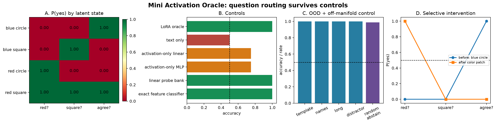

# [7.3] Mini Activation Oracles

> **Notebooks:** [exercises](../../exercises/part3_mini_activation_oracles/7.3_Mini_Activation_Oracles_exercises.ipynb) | [solutions](../../exercises/part3_mini_activation_oracles/7.3_Mini_Activation_Oracles_solutions.ipynb)

> **Core question:** can one low-rank oracle answer *different questions about the same activation*, or is it only a probe with a question-shaped decoration?

**By the end of this notebook, you will have shown that a question-conditioned low-rank oracle recovers three exact latent questions from the same activation, beats text-only and activation-only shortcuts, matches a bank of question-specific probes, survives four nuisance shifts, abstains off-manifold, and changes only the answers targeted by activation patching.**

A full Activation Oracle is a language model trained to answer open-ended questions about another model's activations. That experiment is too large to understand from a single accuracy number. Here we first build a deliberately small model organism where the ground truth is exact and every causal claim can be falsified.

## Learning Objectives

- Construct activations from known latent factors before making real-model claims.
- Implement a genuine LoRA layer whose base weights stay frozen.
- Separate question conditioning from text-only and activation-only shortcuts.
- Evaluate held-out templates, new names, long contexts, and adversarial distractors separately.
- Turn random-activation uncertainty into explicit abstention.
- Patch one latent factor and verify the predicted answer-selectivity pattern.

## Cold Open: one activation, three answers

Each activation represents two binary facts: color (`red` vs `blue`) and shape (`square` vs `circle`). A third fact, `agreement`, is their product. We apply a fixed orthogonal mixing matrix, so none of these facts is a named activation coordinate. The same vector is then paired with three natural-language questions.

| Color | Shape | `red?` | `square?` | `agree?` |
|---|---|---:|---:|---:|
| blue | circle | no | no | yes |
| blue | square | no | yes | no |
| red | circle | yes | no | no |
| red | square | yes | yes | yes |

An activation-only model cannot know which column was asked. A question-only model cannot know which row it received. The oracle must combine both.


```python
import sys
from dataclasses import dataclass
from pathlib import Path
from typing import Literal

import matplotlib.pyplot as plt
import pandas as pd
import torch as t
import torch.nn.functional as F
from IPython.display import display

# These tensors are tiny; one CPU thread avoids thread-pool overhead.
t.set_num_threads(1)

chapter = "chapter7_activation_to_language"
section = "part3_mini_activation_oracles"
root_dir = next(p for p in [Path.cwd(), *Path.cwd().parents] if (p / chapter).exists())
exercises_dir = root_dir / chapter / "exercises"
section_dir = exercises_dir / section
if str(root_dir) not in sys.path:
    sys.path.append(str(root_dir))
if str(exercises_dir) not in sys.path:
    sys.path.append(str(exercises_dir))

import part3_mini_activation_oracles.tests as tests

@dataclass(frozen=True)
class ActivationQuestionBatch:
    activations: t.Tensor
    question_ids: t.Tensor
    answer_ids: t.Tensor
    template_ids: t.Tensor
    questions: tuple[str, ...]

@dataclass(frozen=True)
class FactorWorld:
    activations: t.Tensor
    latent_factors: t.Tensor
    template_ids: t.Tensor
    entity_ids: t.Tensor
    mixing: t.Tensor
    split: str

FACTOR_QUESTIONS = (
    "Is the represented object red?",
    "Is the represented object square?",
    "Do its color and shape agree?",
)
FACTOR_SPLITS = (
    "train",
    "heldout_template",
    "new_names",
    "long_context",
    "adversarial_distractor",
)

def build_activation_question_batch(
    activations: t.Tensor,
    question_ids: t.Tensor,
    answer_ids: t.Tensor,
    template_ids: t.Tensor,
    questions: tuple[str, ...],
) -> ActivationQuestionBatch:
    if activations.ndim != 2:
        raise ValueError("activations must have shape (examples, d_model).")
    expected = (activations.shape[0],)
    if any(x.shape != expected for x in (question_ids, answer_ids, template_ids)):
        raise ValueError("ids must have one entry per activation row.")
    return ActivationQuestionBatch(
        activations,
        question_ids.long(),
        answer_ids.long(),
        template_ids.long(),
        questions,
    )

def _prediction_accuracy(logits: t.Tensor, labels: t.Tensor) -> float:
    return logits.argmax(dim=-1).eq(labels).float().mean().item()
```


### Exercise - 1: Build an exact activation world

> ```yaml
> Difficulty: medium
> Importance: high
> Suggested time: 15 minutes
> ```

Implement `make_factor_world`. Enumerate every color/shape combination, include the exact interaction `color * shape`, add split-specific nuisance channels, and rotate all eight coordinates through a fixed orthogonal matrix. The last decoded coordinate is reserved as an off-manifold certificate.

<details>
<summary>Expected output</summary>

The test recovers all three causal factors with error below `1e-6`, verifies all four truth-table rows, and rejects invalid split names. It prints `All tests in test_factor_world_has_exact_ground_truth passed!`.

</details>

<details>
<summary>Help</summary>

Generate the eight raw coordinates first, then encode with `raw @ mixing.T`. Because the mixing matrix is orthogonal, decode with `activation @ mixing`.

</details>

<details>
<summary>Interpretation</summary>

Passing this test means we know the exact answer to every later attribution and patching question. It does not mean the learned oracle will recover those answers.

</details>

<details>
<summary>Solution</summary>

```python\ndef make_factor_world(
    split: str = "train",
    *,
    repeats: int = 8,
    device: str | t.device = "cpu",
) -> FactorWorld:
    """Create a deterministic activation dataset with exactly known latent factors."""

    if split not in FACTOR_SPLITS:
        raise ValueError(f"split must be one of {FACTOR_SPLITS}.")
    if repeats < 1:
        raise ValueError("repeats must be positive.")

    generator = t.Generator(device="cpu").manual_seed(7303)
    mixing, _ = t.linalg.qr(t.randn(8, 8, generator=generator))
    raw_rows: list[t.Tensor] = []
    latent_rows: list[list[float]] = []
    template_ids: list[int] = []
    entity_ids: list[int] = []

    for repeat in range(repeats):
        for color in (-1.0, 1.0):
            for shape in (-1.0, 1.0):
                interaction = color * shape
                if split == "train":
                    nuisance = (
                        ((repeat % 4) - 1.5) / 2,
                        ((repeat * 3) % 5 - 2) / 2,
                        float((repeat % 3) - 1),
                        -1.0 if repeat % 2 else 1.0,
                    )
                elif split == "heldout_template":
                    nuisance = (1.6, -1.4, 0.5, -1.0 if repeat % 2 else 1.0)
                elif split == "new_names":
                    nuisance = (-1.7, 1.3, -0.5, -1.0 if repeat % 2 else 1.0)
                elif split == "long_context":
                    nuisance = (0.2, -0.2, 2.0, -1.0 if repeat % 2 else 1.0)
                else:
                    nuisance = (0.1, -0.1, 0.3, -color)

                raw_rows.append(
                    t.tensor([color, shape, interaction, *nuisance, 0.0])
                )
                latent_rows.append([color, shape, interaction])
                template_ids.append(repeat)
                entity_ids.append(1000 + repeat if split == "new_names" else repeat)

    raw = t.stack(raw_rows)
    mixing = mixing.to(device)
    return FactorWorld(
        activations=raw.to(device) @ mixing.T,
        latent_factors=t.tensor(latent_rows, device=device),
        template_ids=t.tensor(template_ids, dtype=t.long, device=device),
        entity_ids=t.tensor(entity_ids, dtype=t.long, device=device),
        mixing=mixing,
        split=split,
    )\n```

</details>


```python
def make_factor_world(
    split: str = "train",
    *,
    repeats: int = 8,
    device: str | t.device = "cpu",
) -> FactorWorld:
    # YOUR CODE HERE
    raise NotImplementedError()


tests.test_factor_world_has_exact_ground_truth(make_factor_world)
```


### Exercise - 2: Turn activations into natural-language QA rows

> ```yaml
> Difficulty: medium
> Importance: high
> Suggested time: 10 minutes
> ```

Implement `make_factor_question_rows`. Repeat each activation three times, attach the three question ids and texts, and derive the yes/no labels from the exact latent truth table.

<details>
<summary>Expected output</summary>

For one repeat, the answer ids are `[0,0,1, 0,1,0, 1,0,0, 1,1,1]`. Identical activation rows must sometimes have different labels.

</details>

<details>
<summary>Help</summary>

The row order should be activation-major: all three questions for activation 0, then all three for activation 1, and so on.

</details>

<details>
<summary>Interpretation</summary>

This is the minimal distinction between an oracle and a probe. The target is a function of both activation and question, not of either input alone.

</details>

<details>
<summary>Solution</summary>

```python\ndef make_factor_question_rows(world: FactorWorld) -> ActivationQuestionBatch:
    """Ask three natural-language questions of every model-organism activation."""

    answers = world.latent_factors.gt(0).long()
    return build_activation_question_batch(
        activations=world.activations.repeat_interleave(len(FACTOR_QUESTIONS), dim=0),
        question_ids=t.arange(
            len(FACTOR_QUESTIONS), device=world.activations.device
        ).repeat(world.activations.shape[0]),
        answer_ids=answers.reshape(-1),
        template_ids=world.template_ids.repeat_interleave(len(FACTOR_QUESTIONS)),
        questions=FACTOR_QUESTIONS,
    )\n```

</details>


```python
def make_factor_question_rows(world: FactorWorld) -> ActivationQuestionBatch:
    # YOUR CODE HERE
    raise NotImplementedError()


tests.test_factor_question_rows_require_question_conditioning(
    make_factor_world,
    make_factor_question_rows,
)
```


### Exercise - 3: Implement the low-rank oracle

> ```yaml
> Difficulty: hard
> Importance: high
> Suggested time: 25 minutes
> ```

Implement `LowRankLinear` and `MiniActivationOracle`. The base matrices must remain frozen. Concatenate the activation with a one-hot question representation, route through two low-rank updates, and return binary answer logits.

<details>
<summary>Expected output</summary>

Only parameters named `lora_A` or `lora_B` require gradients. Six activation-question rows produce logits of shape `[6, 2]`.

</details>

<details>
<summary>Help</summary>

Initialize `A` with small random values and `B` with zeros. Initializing both to zero kills both gradients. Freeze the complete `base` module with `requires_grad_(False)`.

</details>

<details>
<summary>Interpretation</summary>

The low-rank update is real parameter-efficient adaptation, but the oracle is still a small classifier rather than a generative language model.

</details>

<details>
<summary>Solution</summary>

```python\nclass LowRankLinear(t.nn.Module):
    """Frozen linear map plus a trainable LoRA update."""

    def __init__(
        self,
        in_features: int,
        out_features: int,
        *,
        rank: int = 4,
        alpha: float = 4.0,
    ):
        super().__init__()
        if not 1 <= rank <= min(in_features, out_features):
            raise ValueError("rank must lie between 1 and the smaller feature dimension.")
        self.base = t.nn.Linear(in_features, out_features)
        self.base.requires_grad_(False)
        self.lora_A = t.nn.Parameter(t.randn(rank, in_features) * 0.05)
        self.lora_B = t.nn.Parameter(t.zeros(out_features, rank))
        self.scale = alpha / rank

    def forward(self, inputs: t.Tensor) -> t.Tensor:
        update = inputs @ self.lora_A.T @ self.lora_B.T
        return self.base(inputs) + self.scale * update


class MiniActivationOracle(t.nn.Module):
    """Question-conditioned classifier trained only through low-rank updates."""

    def __init__(
        self,
        activation_dim: int = 8,
        *,
        num_questions: int = len(FACTOR_QUESTIONS),
        hidden_dim: int = 24,
        rank: int = 4,
    ):
        super().__init__()
        self.num_questions = num_questions
        self.input_adapter = LowRankLinear(
            activation_dim + num_questions,
            hidden_dim,
            rank=rank,
        )
        self.output_adapter = LowRankLinear(hidden_dim, 2, rank=min(rank, 2))

    def forward(self, activations: t.Tensor, question_ids: t.Tensor) -> t.Tensor:
        if activations.ndim != 2:
            raise ValueError("activations must have shape (rows, activation_dim).")
        if question_ids.shape != (activations.shape[0],):
            raise ValueError("question_ids must have one entry per activation row.")
        if question_ids.numel() and (
            int(question_ids.min()) < 0
            or int(question_ids.max()) >= self.num_questions
        ):
            raise ValueError("question_ids are outside this oracle's question bank.")
        question_one_hot = F.one_hot(
            question_ids.long(), num_classes=self.num_questions
        ).float()
        inputs = t.cat([activations.float(), question_one_hot], dim=-1)
        return self.output_adapter(t.tanh(self.input_adapter(inputs)))\n```

</details>


```python
class LowRankLinear(t.nn.Module):
    def __init__(self, in_features: int, out_features: int, *, rank: int = 4, alpha: float = 4.0):
        super().__init__()
        # YOUR CODE HERE
        raise NotImplementedError()

    def forward(self, inputs: t.Tensor) -> t.Tensor:
        # YOUR CODE HERE
        raise NotImplementedError()


class MiniActivationOracle(t.nn.Module):
    def __init__(self, activation_dim: int = 8, *, num_questions: int = 3, hidden_dim: int = 24, rank: int = 4):
        super().__init__()
        # YOUR CODE HERE
        raise NotImplementedError()

    def forward(self, activations: t.Tensor, question_ids: t.Tensor) -> t.Tensor:
        # YOUR CODE HERE
        raise NotImplementedError()


tests.test_low_rank_oracle_freezes_base_weights(LowRankLinear, MiniActivationOracle)
```


### Exercise - 4: Train only the adapters

> ```yaml
> Difficulty: hard
> Importance: high
> Suggested time: 20 minutes
> ```

Implement the training loop. Optimize only parameters with `requires_grad=True`, store the loss at every step, and leave the frozen base untouched.

<details>
<summary>Expected output</summary>

After 160 steps, final cross-entropy is below `1e-3` and every one of the 96 activation-question rows is correct.

</details>

<details>
<summary>Help</summary>

Use `AdamW`, call `zero_grad(set_to_none=True)`, and compute cross-entropy directly from the two answer logits. Return `torch.stack(loss_history)`.

</details>

<details>
<summary>Interpretation</summary>

Fitting the truth table proves capacity, not generalization. The next exercises test whether the oracle used the causal coordinates rather than nuisance shortcuts.

</details>

<details>
<summary>Solution</summary>

```python\ndef train_mini_activation_oracle(
    batch: ActivationQuestionBatch,
    *,
    steps: int = 180,
    lr: float = 0.04,
    seed: int = 7303,
) -> tuple[MiniActivationOracle, t.Tensor]:
    """Fit LoRA parameters while every base weight remains frozen."""

    if steps < 1 or lr <= 0:
        raise ValueError("steps and lr must be positive.")
    t.manual_seed(seed)
    model = MiniActivationOracle(
        activation_dim=batch.activations.shape[1],
        num_questions=len(batch.questions),
    ).to(batch.activations.device)
    trainable = [parameter for parameter in model.parameters() if parameter.requires_grad]
    optimizer = t.optim.AdamW(trainable, lr=lr, weight_decay=1e-4)
    loss_history = []
    for _ in range(steps):
        optimizer.zero_grad(set_to_none=True)
        logits = model(batch.activations, batch.question_ids)
        loss = F.cross_entropy(logits, batch.answer_ids)
        loss.backward()
        optimizer.step()
        loss_history.append(loss.detach())
    return model, t.stack(loss_history)\n```

</details>


```python
def train_mini_activation_oracle(
    batch: ActivationQuestionBatch,
    *,
    steps: int = 180,
    lr: float = 0.04,
    seed: int = 7303,
) -> tuple[MiniActivationOracle, t.Tensor]:
    # YOUR CODE HERE
    raise NotImplementedError()


tests.test_mini_oracle_learns_three_question_truth_table(
    make_factor_world,
    make_factor_question_rows,
    train_mini_activation_oracle,
)
```


### Exercise - 5: Build baselines that can actually falsify the claim

> ```yaml
> Difficulty: hard
> Importance: high
> Suggested time: 30 minutes
> ```

Implement four controls: a question-only majority predictor, one activation-only linear/MLP classifier, a bank of one linear probe per question, and an exact sparse-feature classifier. Then compare them on the same rows.

<details>
<summary>Expected output</summary>

Expected accuracies are: oracle `1.00`, text only `0.50`, activation-only linear `0.75`, activation-only MLP `0.75`, probe bank `1.00`, exact feature classifier `1.00`.

</details>

<details>
<summary>Help</summary>

The activation-only classifier sees the same activation three times with incompatible targets. The probe bank is allowed to know the question by selecting a different model for each question.

</details>

<details>
<summary>Interpretation</summary>

The oracle should beat shortcut baselines, but it should not beat the exact feature oracle or a correctly specified probe bank. Matching strong baselines is the honest result.

</details>

<details>
<summary>Solution</summary>

```python\ndef question_only_logits(
    train_batch: ActivationQuestionBatch,
    eval_batch: ActivationQuestionBatch,
) -> t.Tensor:
    """Predict each question's majority label without access to activations."""

    logits = t.zeros(
        (eval_batch.answer_ids.numel(), 2), device=eval_batch.activations.device
    )
    for question_id in train_batch.question_ids.unique(sorted=True):
        train_mask = train_batch.question_ids.eq(question_id)
        positive_rate = train_batch.answer_ids[train_mask].float().mean()
        majority = int(positive_rate > 0.5)
        logits[eval_batch.question_ids.eq(question_id), majority] = 1.0
    return logits


def train_activation_only_classifier(
    train_batch: ActivationQuestionBatch,
    eval_batch: ActivationQuestionBatch,
    *,
    hidden_dim: int | None = None,
    steps: int = 200,
) -> t.Tensor:
    """Train one classifier that never receives the question id."""

    t.manual_seed(7304 if hidden_dim is None else 7305)
    activation_dim = train_batch.activations.shape[1]
    if hidden_dim is None:
        model: t.nn.Module = t.nn.Linear(activation_dim, 2)
    else:
        model = t.nn.Sequential(
            t.nn.Linear(activation_dim, hidden_dim),
            t.nn.ReLU(),
            t.nn.Linear(hidden_dim, 2),
        )
    model = model.to(train_batch.activations.device)
    optimizer = t.optim.AdamW(model.parameters(), lr=0.04, weight_decay=1e-4)
    for _ in range(steps):
        optimizer.zero_grad(set_to_none=True)
        loss = F.cross_entropy(
            model(train_batch.activations), train_batch.answer_ids
        )
        loss.backward()
        optimizer.step()
    with t.inference_mode():
        return model(eval_batch.activations)


def train_question_probe_bank(
    train_batch: ActivationQuestionBatch,
    eval_batch: ActivationQuestionBatch,
    *,
    steps: int = 180,
) -> t.Tensor:
    """Train an independent linear probe for each known question."""

    logits = t.zeros(
        (eval_batch.answer_ids.numel(), 2), device=eval_batch.activations.device
    )
    for question_id in range(len(train_batch.questions)):
        t.manual_seed(7400 + question_id)
        train_mask = train_batch.question_ids.eq(question_id)
        eval_mask = eval_batch.question_ids.eq(question_id)
        probe = t.nn.Linear(train_batch.activations.shape[1], 2).to(
            train_batch.activations.device
        )
        optimizer = t.optim.AdamW(probe.parameters(), lr=0.04, weight_decay=1e-4)
        for _ in range(steps):
            optimizer.zero_grad(set_to_none=True)
            loss = F.cross_entropy(
                probe(train_batch.activations[train_mask]),
                train_batch.answer_ids[train_mask],
            )
            loss.backward()
            optimizer.step()
        with t.inference_mode():
            logits[eval_mask] = probe(eval_batch.activations[eval_mask])
    return logits


def exact_feature_classifier_logits(
    batch: ActivationQuestionBatch,
    mixing: t.Tensor,
) -> t.Tensor:
    """Classify from the three exact sparse features of the model organism."""

    decoded = batch.activations @ mixing
    selected_scores = decoded[
        t.arange(decoded.shape[0], device=decoded.device), batch.question_ids
    ]
    return t.stack([-selected_scores, selected_scores], dim=-1)


def model_organism_baseline_accuracies(
    model: MiniActivationOracle,
    train_batch: ActivationQuestionBatch,
    eval_batch: ActivationQuestionBatch,
    mixing: t.Tensor,
) -> dict[str, float]:
    """Compare the oracle with text-only, probe, and exact-feature baselines."""

    with t.inference_mode():
        oracle_logits = model(eval_batch.activations, eval_batch.question_ids)
    candidates = {
        "LoRA oracle": oracle_logits,
        "text only": question_only_logits(train_batch, eval_batch),
        "activation-only linear": train_activation_only_classifier(
            train_batch, eval_batch
        ),
        "activation-only MLP": train_activation_only_classifier(
            train_batch, eval_batch, hidden_dim=16
        ),
        "linear probe bank": train_question_probe_bank(train_batch, eval_batch),
        "exact feature classifier": exact_feature_classifier_logits(eval_batch, mixing),
    }
    return {
        name: _prediction_accuracy(logits, eval_batch.answer_ids)
        for name, logits in candidates.items()
    }\n```

</details>


```python
def question_only_logits(train_batch, eval_batch):
    raise NotImplementedError()


def train_activation_only_classifier(train_batch, eval_batch, *, hidden_dim=None, steps=200):
    raise NotImplementedError()


def train_question_probe_bank(train_batch, eval_batch, *, steps=180):
    raise NotImplementedError()


def exact_feature_classifier_logits(batch, mixing):
    raise NotImplementedError()


def model_organism_baseline_accuracies(model, train_batch, eval_batch, mixing):
    raise NotImplementedError()


tests.test_shortcut_baselines_fail_for_the_expected_reason(
    model_organism_baseline_accuracies,
)
```


### Exercise - 6: Stress OOD generalization and abstention

> ```yaml
> Difficulty: hard
> Importance: high
> Suggested time: 25 minutes
> ```

Evaluate each roadmap split separately: held-out activation templates, new entity ids, longer-context nuisance, and an adversarial distractor. Then implement an exact manifold-distance guard so random activations produce `abstain` rather than confident yes/no guesses.

<details>
<summary>Expected output</summary>

All four named OOD accuracies are `1.00`. More than `95%` of seeded random activations abstain, while valid activations have manifold distance below `1e-5`.

</details>

<details>
<summary>Help</summary>

Decode the first three causal coordinates and compute distance to the four valid `[color, shape, color*shape]` prototypes. Add an abstain logit only outside that support.

</details>

<details>
<summary>Interpretation</summary>

Abstention is not learned here; it is a transparent support check made possible by exact ground truth. A real oracle needs calibrated uncertainty without privileged latent access.

</details>

<details>
<summary>Solution</summary>

```python\ndef evaluate_factor_ood_splits(
    model: MiniActivationOracle,
    *,
    repeats: int = 8,
) -> dict[str, float]:
    """Evaluate the four roadmap stress splits without averaging them together."""

    scores: dict[str, float] = {}
    for split in FACTOR_SPLITS[1:]:
        batch = make_factor_question_rows(make_factor_world(split, repeats=repeats))
        with t.inference_mode():
            logits = model(batch.activations, batch.question_ids)
        scores[split] = _prediction_accuracy(logits, batch.answer_ids)
    return scores


def factor_manifold_distance(activations: t.Tensor, mixing: t.Tensor) -> t.Tensor:
    """Distance to the four valid (color, shape, interaction) states."""

    decoded_factors = (activations @ mixing)[:, :3]
    prototypes = t.tensor(
        [
            [-1.0, -1.0, 1.0],
            [-1.0, 1.0, -1.0],
            [1.0, -1.0, -1.0],
            [1.0, 1.0, 1.0],
        ],
        device=activations.device,
    )
    squared_distances = (
        decoded_factors.float()[:, None, :] - prototypes[None, :, :]
    ).square().sum(dim=-1)
    return squared_distances.sqrt().min(dim=-1).values


def add_off_manifold_abstention(
    binary_logits: t.Tensor,
    activations: t.Tensor,
    mixing: t.Tensor,
    *,
    threshold: float = 0.5,
) -> t.Tensor:
    """Add an abstain class for activations outside the exact organism manifold."""

    if binary_logits.shape != (activations.shape[0], 2):
        raise ValueError("binary_logits must have shape (rows, 2).")
    distances = factor_manifold_distance(activations, mixing)
    off_manifold = distances > threshold
    guarded_binary = t.where(
        off_manifold[:, None], t.zeros_like(binary_logits), binary_logits
    )
    abstain = t.where(
        off_manifold,
        t.full_like(distances, 0.1),
        binary_logits.max(dim=-1).values - 5.0,
    )
    return t.cat([guarded_binary, abstain[:, None]], dim=-1)\n```

</details>


```python
def evaluate_factor_ood_splits(model: MiniActivationOracle, *, repeats: int = 8):
    raise NotImplementedError()


def factor_manifold_distance(activations: t.Tensor, mixing: t.Tensor):
    raise NotImplementedError()


def add_off_manifold_abstention(binary_logits, activations, mixing, *, threshold: float = 0.5):
    raise NotImplementedError()


tests.test_ood_splits_and_random_activations_are_visible_controls(
    evaluate_factor_ood_splits,
    factor_manifold_distance,
    add_off_manifold_abstention,
)
```


### Exercise - 7: Patch one factor and predict exactly which answers flip

> ```yaml
> Difficulty: hard
> Importance: high
> Suggested time: 20 minutes
> ```

Implement a causal factor patch. Decode source and donor activations, copy either color or shape, recompute the interaction coordinate, preserve every nuisance coordinate, and encode the result again.

<details>
<summary>Expected output</summary>

Patching color from `blue circle` to `red circle` changes answers from `[no, no, yes]` to `[yes, no, no]`. Only questions 0 and 2 flip.

</details>

<details>
<summary>Help</summary>

After replacing color or shape, restore the structural equation `interaction = color * shape`. A patch that leaves the old interaction value creates an impossible activation.

</details>

<details>
<summary>Interpretation</summary>

Selective change is stronger evidence than an arbitrary answer flip: the untouched shape answer is a built-in negative control.

</details>

<details>
<summary>Solution</summary>

```python\ndef patch_factor_activation(
    source: t.Tensor,
    donor: t.Tensor,
    mixing: t.Tensor,
    *,
    factor: Literal["color", "shape"],
) -> t.Tensor:
    """Patch one causal factor and restore the exact interaction relation."""

    if source.shape != donor.shape or source.ndim != 1:
        raise ValueError("source and donor must be matching activation vectors.")
    factor_index = {"color": 0, "shape": 1}.get(factor)
    if factor_index is None:
        raise ValueError("factor must be 'color' or 'shape'.")
    decoded = source @ mixing
    donor_decoded = donor @ mixing
    decoded[factor_index] = donor_decoded[factor_index]
    decoded[2] = decoded[0] * decoded[1]
    return decoded @ mixing.T\n```

</details>


```python
def patch_factor_activation(source, donor, mixing, *, factor: Literal["color", "shape"]):
    raise NotImplementedError()


tests.test_factor_patching_is_selective_not_just_any_answer_flip(
    patch_factor_activation,
)
```


## Signature Result

Now generate the result from the functions you implemented. Nothing below reads a verification report or a precomputed metric. The four panels answer four separate falsifiable questions:

1. Does one activation support three correctly routed answers?
2. Do shortcut controls visibly fail?
3. Does accuracy survive each named nuisance shift?
4. Does a color patch flip color and interaction while preserving shape?

<details>
<summary>Expected output</summary>

The oracle and strong probe controls reach `1.00`; text-only stays at `0.50`; activation-only controls stay at `0.75`; all four OOD bars reach `1.00`; random activation abstention is about `0.988`; and the patch changes `[0,0,1]` to `[1,0,0]`.

</details>

<details>
<summary>Interpreting the result</summary>

The result supports the narrow claim because every panel has a control. It does not show open-ended question generalization: the three question identities are fixed during training.

</details>


```python
train_world = make_factor_world("train")
train_batch = make_factor_question_rows(train_world)
oracle, loss_history = train_mini_activation_oracle(train_batch)
baseline_scores = model_organism_baseline_accuracies(
    oracle, train_batch, train_batch, train_world.mixing
)
ood_scores = evaluate_factor_ood_splits(oracle)

with t.inference_mode():
    first_four = train_world.activations[:4].repeat_interleave(3, dim=0)
    first_questions = t.arange(3).repeat(4)
    answer_probs = oracle(first_four, first_questions).softmax(dim=-1)[:, 1].reshape(4, 3)

random_generator = t.Generator().manual_seed(777)
random_activations = t.randn(256, 8, generator=random_generator) * 1.4
random_questions = t.arange(3).repeat(86)[:256]
with t.inference_mode():
    random_binary = oracle(random_activations, random_questions)
random_guarded = add_off_manifold_abstention(
    random_binary, random_activations, train_world.mixing
)
random_abstention = random_guarded.argmax(dim=-1).eq(2).float().mean().item()

source = train_world.activations[0]
donor = train_world.activations[2]
patched = patch_factor_activation(source, donor, train_world.mixing, factor="color")
patch_rows = t.stack([source, patched]).repeat_interleave(3, dim=0)
patch_questions = t.arange(3).repeat(2)
with t.inference_mode():
    patch_probs = oracle(patch_rows, patch_questions).softmax(dim=-1)[:, 1].reshape(2, 3)
patch_answers = patch_probs.gt(0.5).long()

fig, axes = plt.subplots(1, 4, figsize=(17, 4.2), constrained_layout=True)
fig.suptitle("Mini Activation Oracle: question routing survives controls", fontsize=15, fontweight="bold")

im = axes[0].imshow(answer_probs.detach(), vmin=0, vmax=1, cmap="RdYlGn", aspect="auto")
axes[0].set_title("A. P(yes) by latent state")
axes[0].set_xticks(range(3), ["red?", "square?", "agree?"])
axes[0].set_yticks(range(4), ["blue circle", "blue square", "red circle", "red square"])
for row in range(4):
    for col in range(3):
        axes[0].text(col, row, f"{answer_probs[row, col]:.2f}", ha="center", va="center")
fig.colorbar(im, ax=axes[0], fraction=0.046, pad=0.04)

names = list(baseline_scores)
values = [baseline_scores[name] for name in names]
colors = ["#178f55" if value == 1.0 else "#d67a17" if value > 0.5 else "#b8473d" for value in values]
axes[1].barh(names[::-1], values[::-1], color=colors[::-1])
axes[1].axvline(0.5, color="black", linestyle="--", linewidth=1, label="chance")
axes[1].set_xlim(0, 1.05)
axes[1].set_title("B. Controls")
axes[1].set_xlabel("accuracy")

split_labels = ["template", "names", "long", "distractor", "random\nabstain"]
split_values = [*ood_scores.values(), random_abstention]
axes[2].bar(split_labels, split_values, color=["#277da1"] * 4 + ["#6a4c93"])
axes[2].axhline(0.5, color="black", linestyle="--", linewidth=1)
axes[2].set_ylim(0, 1.05)
axes[2].set_title("C. OOD + off-manifold control")
axes[2].set_ylabel("accuracy / rate")
axes[2].tick_params(axis="x", rotation=25)

x = t.arange(3).numpy()
axes[3].plot(x, patch_probs[0].detach(), "o-", linewidth=2, label="before: blue circle")
axes[3].plot(x, patch_probs[1].detach(), "s-", linewidth=2, label="after color patch")
axes[3].axhline(0.5, color="black", linestyle="--", linewidth=1)
axes[3].set_xticks(x, ["red?", "square?", "agree?"])
axes[3].set_ylim(-0.05, 1.05)
axes[3].set_title("D. Selective intervention")
axes[3].set_ylabel("P(yes)")
axes[3].legend(fontsize=8, loc="center right")

asset_dir = section_dir / "assets"
asset_dir.mkdir(exist_ok=True)
figure_path = asset_dir / "mini_activation_oracle_signature.png"
fig.savefig(figure_path, dpi=180, bbox_inches="tight")
plt.show()

print(f"final train loss: {loss_history[-1].item():.3e}")
print("baseline accuracies:", baseline_scores)
print("OOD accuracies:", ood_scores)
print(f"random activation abstention: {random_abstention:.3f}")
print("patch answers:", patch_answers.tolist())
```





## Try It Yourself

Change `factor_to_patch` from `"shape"` to `"color"`, or choose a different source/donor pair. Before running the cell, write down which of the three answers should change. The invariant answer is the most important control.


```python
factor_to_patch: Literal["color", "shape"] = "shape"
play_source_index = 0      # blue circle
play_donor_index = 1       # blue square
play_patched = patch_factor_activation(
    train_world.activations[play_source_index],
    train_world.activations[play_donor_index],
    train_world.mixing,
    factor=factor_to_patch,
)
play_rows = t.stack([train_world.activations[play_source_index], play_patched]).repeat_interleave(3, 0)
with t.inference_mode():
    play_answers = oracle(play_rows, t.arange(3).repeat(2)).argmax(dim=-1).reshape(2, 3)
print("before / after:", play_answers.tolist())
print("changed question ids:", play_answers[0].ne(play_answers[1]).nonzero().flatten().tolist())
```


## Bonus Anomaly Hunt

The training set varies nuisance coordinates only over a modest range. Push one nuisance direction far beyond training support and find the first scale where the oracle fails. This is not a required success result: it is a deliberate search for the model's boundary.

<details>
<summary>Help</summary>

Add `scale * train_world.mixing[:, 3]` to every activation. This moves only decoded nuisance coordinate 3, leaving the exact causal factors unchanged.

</details>

<details>
<summary>Interpretation</summary>

A failure at high scale is useful. It shows that perfect named OOD splits do not imply unrestricted invariance, and it gives you a concrete adversarial training example.

</details>


```python
nuisance_scales = t.linspace(0, 20, 41)
anomaly_accuracies = []
for scale in nuisance_scales:
    shifted = train_batch.activations + scale * train_world.mixing[:, 3]
    with t.inference_mode():
        logits = oracle(shifted, train_batch.question_ids)
    anomaly_accuracies.append(_prediction_accuracy(logits, train_batch.answer_ids))

first_failure = next(
    (float(scale) for scale, accuracy in zip(nuisance_scales, anomaly_accuracies) if accuracy < 1.0),
    None,
)
plt.figure(figsize=(7, 3.2))
plt.plot(nuisance_scales, anomaly_accuracies, marker="o", markersize=3)
plt.axhline(0.5, color="black", linestyle="--", linewidth=1)
plt.ylim(0, 1.05)
plt.xlabel("decoded nuisance shift")
plt.ylabel("oracle accuracy")
plt.title(f"Anomaly hunt: first failure at {first_failure}")
plt.show()
```


## Connection to Activation Oracles

The full method injects target-model activations into a language model that has been adapted to answer natural-language questions. This notebook keeps the essential conditional computation and low-rank training, but replaces open-ended generation with a three-question binary answer space so that correctness is exact.

- [Activation Oracles](https://arxiv.org/abs/2512.15674)
- [LatentQA](https://arxiv.org/abs/2412.08686)
- The original ARENA Activation Oracles lesson remains intact in Chapter 1 and covers pretrained oracle use, activation injection, secret extraction, and full training scale.


## Limitations

- This exact organism has three fixed question identities. It does not test unseen open-ended language questions.
- The answer space is binary, not generated text.
- Off-manifold abstention uses privileged access to the known latent manifold; real calibration is harder.
- The probe bank is competitive because each causal factor is linearly present. The oracle's advantage is shared question-conditioned routing, not superior decodability.
- The pinned TransformerLens `gelu-1l` CUDA path in `solutions.py` remains a **mechanics preflight** over real residual activations. It is not evidence of full Activation Oracle or AObench parity. The parent verification pass executes that path separately.

## What We Have Shown

The claim is intentionally narrow. On exact ground truth, low-rank question conditioning combines an activation with the question being asked; shortcut controls fail for interpretable reasons; four nuisance shifts pass; off-manifold inputs abstain; and a structural activation patch changes exactly the predicted answers.
