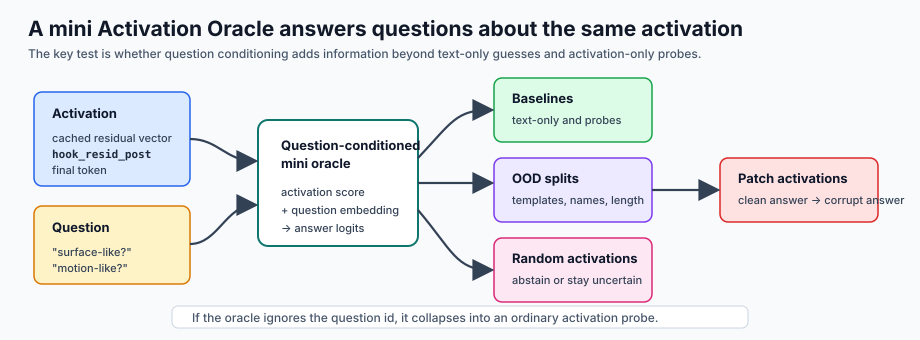

# [7.3] Mini Activation Oracles

> **Local-first extension.** You will build the smallest useful version of an
> Activation Oracle: a question-conditioned model that reads an activation,
> answers a question about it, and then has to survive text-only baselines,
> activation-only probes, OOD splits, random activations, and clean-to-corrupt
> activation substitution.

```yaml
gt_tier: GT-1 mini Activation Oracle preflight
exercise_id: 7_3_mini_activation_oracles
expected_runtime: 60-90 minutes for CPU exercises; several minutes for CUDA gelu-1l preflight
requires_gpu: true for the TransformerLens preflight; false for the implementation exercises
```

Please send any problems / bugs on the `#errata` channel in the [Slack group](https://info-arena.github.io/ARENA_img/slack.html), and ask any questions on the dedicated channels for this chapter of material.

If you want to change to dark mode, you can do this by clicking the three horizontal lines in the top-right, then navigating to Settings -> Theme.

Links to earlier chapters: [(0) Fundamentals](https://arena-chapter0-fundamentals.streamlit.app/), [(1) Transformer Interpretability](https://arena-chapter1-transformer-interp.streamlit.app/), [(2) RL](https://arena-chapter2-rl.streamlit.app/), [(3) LLM Evaluations](https://arena-chapter3-llm-evals.streamlit.app/), [(4) Alignment Science](https://arena-chapter4-alignment-science.streamlit.app/).


# Introduction

Activation Oracles ask a sharper question than "can I train a probe?". A probe
answers one fixed question about an activation. An oracle takes both an
activation and a natural-language question, then answers that question. The same
activation should be able to produce different answers for different questions.

This section builds a mini version rather than a full LoRA/API oracle. The
roadmap's full LoRA route remains the research target, but the local GT-1
substitution preserves the core learning objective: question conditioning must
beat shortcut baselines, generalize across small stress splits, abstain on
uninterpretable activations, and respond to activation substitution.



The committed CUDA report loads pinned TransformerLens `gelu-1l`, caches final
residual activations at `blocks.0.hook_resid_post`, asks two opposite questions
of each activation, trains a tiny question-conditioned oracle, compares it
against text-only and activation-only baselines, evaluates four tiny OOD splits,
checks random-activation abstention, and verifies a clean-to-corrupt activation
answer flip. This is a local mechanics preflight, not a full Activation Oracle
benchmark.


## Content & Learning Objectives

### 1. Activation-question rows

> ##### Learning Objectives
>
> * Bundle activations with question ids, answer ids, template ids, and question text.
> * Understand why the same activation can appear in two contradictory rows.
> * Reject question ids that do not index the question bank.

### 2. Question-conditioned oracle

> ##### Learning Objectives
>
> * Build a tiny neural oracle from activation score plus question embedding.
> * Train it on contradictory question rows.
> * Show that an activation-only probe cannot solve the same rows.

### 3. Baselines and OOD splits

> ##### Learning Objectives
>
> * Compare against text-only, linear probe, MLP probe, and SAE-style classifier baselines.
> * Report held-out template, new-name, long-context, and adversarial split accuracies separately.
> * Avoid hiding a failing split inside a mean.

### 4. Negative controls

> ##### Learning Objectives
>
> * Require random activations to abstain or stay low-confidence.
> * Treat activation substitution as evidence only if the answer actually changes.
> * State exactly what the patching check does and does not prove.


## Setup code

```python
import sys
from dataclasses import dataclass
from pathlib import Path
from typing import Literal

import torch as t
import torch.nn.functional as F

chapter = "chapter7_activation_to_language"
section = "part3_mini_activation_oracles"
root_dir = next(p for p in [Path.cwd(), *Path.cwd().parents] if (p / chapter).exists())
exercises_dir = root_dir / chapter / "exercises"
section_dir = exercises_dir / section

if str(root_dir) not in sys.path:
    sys.path.append(str(root_dir))
if str(exercises_dir) not in sys.path:
    sys.path.append(str(exercises_dir))

import part3_mini_activation_oracles.tests as tests
import part3_mini_activation_oracles.utils as utils

QuestionKind = Literal[
    "token",
    "code",
    "question",
    "ioi",
    "refusal",
    "truth",
    "latent_state",
]
```

```python
@dataclass(frozen=True)
class ActivationQuestionBatch:
    activations: t.Tensor
    question_ids: t.Tensor
    answer_ids: t.Tensor
    template_ids: t.Tensor
    questions: tuple[str, ...]


@dataclass(frozen=True)
class OracleComparisonReport:
    oracle_accuracy: float
    text_only_accuracy: float
    linear_probe_accuracy: float
    mlp_probe_accuracy: float
    sae_classifier_accuracy: float
    beats_text_only: bool
    beats_or_matches_probe: bool


@dataclass(frozen=True)
class OODGeneralizationReport:
    heldout_template_accuracy: float
    new_name_accuracy: float
    long_context_accuracy: float
    adversarial_accuracy: float
    passes_ood: bool


@dataclass(frozen=True)
class RandomActivationOracleReport:
    mean_confidence: float
    abstention_rate: float
    passes_graceful_failure: bool


@dataclass(frozen=True)
class ActivationPatchingOracleReport:
    original_answer: int
    patched_answer: int
    changed: bool
```


# Activation-Question Rows

### Exercise - build activation-question batches

> ```yaml
> Difficulty: medium
> Importance: high
>
> You should spend 10 mins on this exercise.
> ```

The oracle does not only see an activation. It also sees a question. Your first
job is to keep those pieces aligned.

<details>
<summary>Expected output</summary>

The batch should preserve activation shape `[3, 3]`, convert ids to integer
class-index tensors, keep the seven default questions, reject rank-1
activations, and reject question ids outside the question bank.

When correct, the tests print:

```text
All tests in `test_build_activation_question_batch_validates_shapes_and_questions` passed!
All tests in `test_build_activation_question_batch_rejects_out_of_range_question_ids` passed!
```

</details>

<details>
<summary>Help - why carry template ids?</summary>

Template ids let you ask whether the oracle learned the task or just one
phrasing. Without them, a high aggregate accuracy can hide a failure on the
held-out template.

</details>

Common bug: accepting a question id larger than the question bank. That creates
rows which no question-conditioned model can interpret consistently.

```python
def default_activation_questions() -> tuple[str, ...]:
    raise NotImplementedError()


def build_activation_question_batch(
    activations: t.Tensor,
    question_ids: t.Tensor,
    answer_ids: t.Tensor,
    template_ids: t.Tensor,
    questions: tuple[str, ...] | None = None,
) -> ActivationQuestionBatch:
    raise NotImplementedError()


tests.test_build_activation_question_batch_validates_shapes_and_questions(
    build_activation_question_batch,
    default_activation_questions,
)
tests.test_build_activation_question_batch_rejects_out_of_range_question_ids(
    build_activation_question_batch,
)
```

<details>
<summary>Solution</summary>

```python
def default_activation_questions() -> tuple[str, ...]:
    return (
        "What token is represented?",
        "Is this activation from code?",
        "Is the prompt asking a question?",
        "Which of two names is the indirect object?",
        "Is the model about to refuse?",
        "Is this a truthful or false factual completion?",
        "Which synthetic latent variable is active?",
    )


def build_activation_question_batch(
    activations: t.Tensor,
    question_ids: t.Tensor,
    answer_ids: t.Tensor,
    template_ids: t.Tensor,
    questions: tuple[str, ...] | None = None,
) -> ActivationQuestionBatch:
    if activations.ndim != 2:
        raise ValueError("activations must have shape (examples, d_model).")
    expected_shape = (activations.shape[0],)
    if question_ids.shape != expected_shape:
        raise ValueError("question_ids must have shape (examples,).")
    if answer_ids.shape != expected_shape:
        raise ValueError("answer_ids must have shape (examples,).")
    if template_ids.shape != expected_shape:
        raise ValueError("template_ids must have shape (examples,).")
    if questions is None:
        questions = default_activation_questions()
    if len(questions) == 0:
        raise ValueError("questions must include at least one question.")
    question_ids = question_ids.long()
    answer_ids = answer_ids.long()
    template_ids = template_ids.long()
    if question_ids.numel() and (
        int(question_ids.min().item()) < 0
        or int(question_ids.max().item()) >= len(questions)
    ):
        raise ValueError("question_ids must index into the questions tuple.")
    return ActivationQuestionBatch(
        activations=activations,
        question_ids=question_ids,
        answer_ids=answer_ids,
        template_ids=template_ids,
        questions=questions,
    )
```

</details>


# Question-Conditioned Mini Oracle

### Exercise - train an oracle that can answer opposite questions

> ```yaml
> Difficulty: hard
> Importance: high
>
> You should spend 20 mins on this exercise.
> ```

This is the central idea. We duplicate each activation into two rows. One row
asks whether the activation is surface/resting-like; the other asks whether it
is motion/airborne-like. The answer flips even though the activation is the
same. An activation-only probe should struggle because it cannot see the
question id.

<details>
<summary>Expected output</summary>

The tiny oracle should fit the fixture with loss below `0.05`, give different
answers for opposite questions about the same activation, and not simply copy
activation-only probe logits.

When correct, the test prints:

```text
All tests in `test_question_conditioned_oracle_uses_question_ids_not_copied_probe_logits` passed!
```

</details>

<details>
<summary>Help - why an activation-only probe fails here</summary>

The same activation appears in two rows with opposite labels. A classifier that
only sees the activation cannot know which question was asked. The question
embedding is not cosmetic; it is the difference between an oracle and a probe.

</details>

Common bug: training the baseline by copying the oracle logits. The baseline has
to be independently trained without question ids.

```python
class TinyQuestionConditionedOracle(t.nn.Module):
    def __init__(self, num_questions: int = 2, hidden_dim: int = 16):
        raise NotImplementedError()

    def forward(self, scores: t.Tensor, question_ids: t.Tensor) -> t.Tensor:
        raise NotImplementedError()


def make_question_conditioned_rows(
    residuals: t.Tensor,
    labels: t.Tensor,
    *,
    template_offset: int = 0,
) -> ActivationQuestionBatch:
    raise NotImplementedError()


def train_question_conditioned_oracle(
    batch: ActivationQuestionBatch,
    direction: t.Tensor,
    *,
    steps: int = 400,
    lr: float = 0.05,
) -> tuple[TinyQuestionConditionedOracle, t.Tensor, t.Tensor, float]:
    raise NotImplementedError()


def oracle_logits_for_batch(
    model: TinyQuestionConditionedOracle,
    batch: ActivationQuestionBatch,
    direction: t.Tensor,
    score_mean: t.Tensor,
    score_std: t.Tensor,
) -> t.Tensor:
    raise NotImplementedError()


tests.test_question_conditioned_oracle_uses_question_ids_not_copied_probe_logits(
    make_question_conditioned_rows,
    train_question_conditioned_oracle,
    oracle_logits_for_batch,
)
```

<details>
<summary>Solution sketch</summary>

Project each activation onto the target direction, standardize the scores, add
a learned question embedding to a learned score projection, and train with
cross-entropy. The full reference solution also trains the activation-only
baseline separately, because copied probe logits would make the comparison
meaningless.

</details>


# Baselines

### Exercise - compare the oracle to shortcut baselines

> ```yaml
> Difficulty: medium
> Importance: high
>
> You should spend 10 mins on this exercise.
> ```

An oracle is interesting only if it reads activation information in a
question-dependent way. Text-only baselines catch question-template leakage.
Probe baselines ask whether an ordinary activation classifier was already
enough.

<details>
<summary>Expected output</summary>

The oracle should score `1.0`, text-only should score `0.5`, and the report
should mark the oracle as beating text-only and matching or beating the best
probe.

When correct, the test prints:

```text
All tests in `test_oracle_comparison_report_beats_text_and_probe_baselines` passed!
```

</details>

<details>
<summary>Help - why "matches probe" can be enough</summary>

Some questions really are linearly decodable. The oracle does not need to beat
every probe on every task. It does need to beat text-only shortcuts and be
honest when an ordinary probe is already sufficient.

</details>

Common bug: comparing raw logits rather than answer ids from `argmax(dim=-1)`.

```python
def _prediction_accuracy(logits: t.Tensor, labels: t.Tensor) -> float:
    raise NotImplementedError()


def oracle_comparison_report(
    oracle_logits: t.Tensor,
    text_only_logits: t.Tensor,
    linear_probe_logits: t.Tensor,
    mlp_probe_logits: t.Tensor,
    sae_classifier_logits: t.Tensor,
    answer_ids: t.Tensor,
) -> OracleComparisonReport:
    raise NotImplementedError()


tests.test_oracle_comparison_report_beats_text_and_probe_baselines(
    oracle_comparison_report,
)
```

<details>
<summary>Solution</summary>

```python
def _prediction_accuracy(logits: t.Tensor, labels: t.Tensor) -> float:
    if logits.ndim < 2:
        raise ValueError("logits must have shape (..., answer_classes).")
    if logits.shape[:-1] != labels.shape:
        raise ValueError("logits prefix shape must match labels.")
    return logits.argmax(dim=-1).eq(labels).float().mean().item()


def oracle_comparison_report(
    oracle_logits: t.Tensor,
    text_only_logits: t.Tensor,
    linear_probe_logits: t.Tensor,
    mlp_probe_logits: t.Tensor,
    sae_classifier_logits: t.Tensor,
    answer_ids: t.Tensor,
) -> OracleComparisonReport:
    oracle_accuracy = _prediction_accuracy(oracle_logits, answer_ids)
    text_only_accuracy = _prediction_accuracy(text_only_logits, answer_ids)
    linear_accuracy = _prediction_accuracy(linear_probe_logits, answer_ids)
    mlp_accuracy = _prediction_accuracy(mlp_probe_logits, answer_ids)
    sae_accuracy = _prediction_accuracy(sae_classifier_logits, answer_ids)
    best_probe = max(linear_accuracy, mlp_accuracy, sae_accuracy)
    return OracleComparisonReport(
        oracle_accuracy,
        text_only_accuracy,
        linear_accuracy,
        mlp_accuracy,
        sae_accuracy,
        oracle_accuracy > text_only_accuracy,
        oracle_accuracy >= best_probe,
    )
```

</details>


# OOD Splits

### Exercise - report OOD splits separately

> ```yaml
> Difficulty: medium
> Importance: high
>
> You should spend 10 mins on this exercise.
> ```

OOD accuracy is not one scalar in this notebook. The real report keeps held-out
templates, new names, long contexts, and adversarial distractors separate.

<details>
<summary>Expected output</summary>

Template split accuracy should be `{0: 1.0, 1: 0.5}` in the toy fixture. The
OOD report should fail if any required split falls below threshold, and invalid
thresholds should be rejected.

When correct, the tests print:

```text
All tests in `test_template_split_and_ood_reports_expose_generalization_failures` passed!
All tests in `test_ood_generalization_report_rejects_invalid_threshold` passed!
```

</details>

<details>
<summary>Help - why not average OOD splits?</summary>

An average can hide the only split you care about. If adversarial distractors
fail while long contexts pass, the average might look fine. Report the split
that failed.

</details>

Common bug: passing if three of four splits work. The local contract requires
all required splits to clear the threshold.

```python
def split_accuracy_by_template(
    logits: t.Tensor,
    answer_ids: t.Tensor,
    template_ids: t.Tensor,
) -> dict[int, float]:
    raise NotImplementedError()


def ood_generalization_report(
    *,
    heldout_template_logits: t.Tensor,
    heldout_template_answers: t.Tensor,
    new_name_logits: t.Tensor,
    new_name_answers: t.Tensor,
    long_context_logits: t.Tensor,
    long_context_answers: t.Tensor,
    adversarial_logits: t.Tensor,
    adversarial_answers: t.Tensor,
    min_accuracy: float = 0.75,
) -> OODGeneralizationReport:
    raise NotImplementedError()


tests.test_template_split_and_ood_reports_expose_generalization_failures(
    split_accuracy_by_template,
    ood_generalization_report,
)
tests.test_ood_generalization_report_rejects_invalid_threshold(ood_generalization_report)
```

<details>
<summary>Solution</summary>

```python
def split_accuracy_by_template(
    logits: t.Tensor,
    answer_ids: t.Tensor,
    template_ids: t.Tensor,
) -> dict[int, float]:
    if logits.shape[:-1] != answer_ids.shape or answer_ids.shape != template_ids.shape:
        raise ValueError("logits, answer_ids, and template_ids shapes are incompatible.")
    return {
        int(template_id.item()): _prediction_accuracy(logits[template_ids.eq(template_id)], answer_ids[template_ids.eq(template_id)])
        for template_id in template_ids.unique(sorted=True)
    }


def ood_generalization_report(...):
    if not 0 <= min_accuracy <= 1:
        raise ValueError("min_accuracy must lie between 0 and 1.")
    # Compute each split separately, then require all four to pass.
```

</details>


# Negative Controls

### Exercise - random activations and activation substitution

> ```yaml
> Difficulty: medium
> Importance: high
>
> You should spend 10 mins on this exercise.
> ```

Random activations should not get confident arbitrary labels. Activation
substitution should only count as evidence when the predicted answer changes.

<details>
<summary>Expected output</summary>

Random low-margin logits should abstain with rate `1.0` and low mean confidence.
Overconfident non-abstain logits should fail. Patching should record answer
`0 -> 1` in the toy fixture, and incompatible logit shapes should be rejected.

When correct, the tests print:

```text
All tests in `test_random_activation_report_requires_abstention_or_low_confidence` passed!
All tests in `test_random_activation_report_rejects_bad_rank_and_thresholds` passed!
All tests in `test_activation_patching_report_checks_answer_change` passed!
All tests in `test_activation_patching_report_rejects_incompatible_logits` passed!
```

</details>

<details>
<summary>Help - what does patching prove here?</summary>

This is residual-vector substitution for the oracle input, not a full model
forward-pass behavioral intervention. It shows the oracle answer is sensitive
to the activation in the predicted direction.

</details>

Common bug: using raw logits as confidence. Convert to probabilities with
softmax first.

```python
def random_activation_oracle_report(
    random_logits: t.Tensor,
    *,
    abstain_answer_id: int,
    min_abstention_rate: float = 0.5,
    max_mean_confidence: float = 0.6,
) -> RandomActivationOracleReport:
    raise NotImplementedError()


def activation_patching_oracle_report(
    original_logits: t.Tensor,
    patched_logits: t.Tensor,
) -> ActivationPatchingOracleReport:
    raise NotImplementedError()


tests.test_random_activation_report_requires_abstention_or_low_confidence(
    random_activation_oracle_report,
)
tests.test_random_activation_report_rejects_bad_rank_and_thresholds(
    random_activation_oracle_report,
)
tests.test_activation_patching_report_checks_answer_change(
    activation_patching_oracle_report,
)
tests.test_activation_patching_report_rejects_incompatible_logits(
    activation_patching_oracle_report,
)
```

<details>
<summary>Solution</summary>

```python
def random_activation_oracle_report(...):
    if random_logits.ndim < 2:
        raise ValueError("random_logits must have shape (..., answer_classes).")
    if not 0 <= abstain_answer_id < random_logits.shape[-1]:
        raise ValueError("abstain_answer_id is out of range.")
    probs = F.softmax(random_logits.float(), dim=-1)
    confidence, predictions = probs.max(dim=-1)
    abstention_rate = predictions.eq(abstain_answer_id).float().mean().item()
    mean_confidence = confidence.mean().item()
    return RandomActivationOracleReport(
        mean_confidence,
        abstention_rate,
        abstention_rate >= min_abstention_rate and mean_confidence <= max_mean_confidence,
    )


def activation_patching_oracle_report(original_logits, patched_logits):
    if original_logits.ndim != 1 or patched_logits.ndim != 1:
        raise ValueError("original_logits and patched_logits must be rank-1 tensors.")
    if original_logits.shape != patched_logits.shape:
        raise ValueError("original_logits and patched_logits must have matching shape.")
    original_answer = int(original_logits.argmax().item())
    patched_answer = int(patched_logits.argmax().item())
    return ActivationPatchingOracleReport(original_answer, patched_answer, original_answer != patched_answer)
```

</details>


# Signature Result

The real-model result is small but useful: the mini oracle uses question ids to
answer two opposite questions about cached `gelu-1l` activations, while
activation-only baselines collapse.


| Check | Observed result |
|---|---:|
| Model | `gelu-1l` / `NeelNanda/GELU_1L512W_C4_Code` |
| HF revision | `bddc0e332f0ae84279e6a6a45d91b314899e1603` |
| Hook | `blocks.0.hook_resid_post` |
| Activation shape | `[16, 512]` |
| Train / eval examples | `8 / 8` |
| Question rows / questions | `16 / 2` |
| Oracle / text-only accuracy | `1.000 / 0.500` |
| Linear / MLP / SAE-style baselines | `0.500 / 0.500 / 0.500` |
| Question-id flip rate | `1.000` |
| Train loss | `1.33e-04` |
| OOD split accuracies | held-out `1.000`, new-name `1.000`, long-context `1.000`, adversarial `1.000` |
| Random activation control | abstention `1.000`, mean confidence `0.356 <= 0.4` |
| Clean-to-corrupt substitution | answer `1 -> 0` |
| Peak VRAM | `0.269 GB` |

<details>
<summary>Interpreting the signature result</summary>

The distinctive result is not just `oracle_accuracy == 1.0`. The distinctive
result is that question-conditioned rows with the same activation flip answers
when the question changes, while text-only and activation-only baselines sit at
`0.5`. That is the minimal behavior an Activation Oracle should have.

</details>


# Full Experiment Path

The validated local mini Activation Oracle experiment runs the pinned
`gelu-1l` question-conditioned preflight:

1. Load `NeelNanda/GELU_1L512W_C4_Code` through TransformerLens at revision
   `bddc0e332f0ae84279e6a6a45d91b314899e1603`.
2. Cache `blocks.0.hook_resid_post` final-token activations for safe generated
   prompts.
3. Build a residual direction from clean and corrupt anchor prompts.
4. Turn each activation into two question rows: one asks whether the residual is
   surface/resting-like, the other asks the opposite motion/airborne question.
5. Train a tiny question-conditioned oracle from activation score plus question
   embedding.
6. Compare against text-only majority guesses and independently trained
   activation-only probe/MLP/SAE-style baselines which cannot see question ids.
7. Evaluate held-out-template, new-name, long-context, and adversarial splits.
8. Test graceful failure with a low-margin abstention rule on random activations.
9. Replace a clean activation with a corrupt activation and verify the oracle
   answer changes.

<details>
<summary>Expected output from run_gpu_test(max_vram_gb=24.0)</summary>

```text
preflight_passed == True
question_conditioned_train_loss <= 0.01
oracle_accuracy == 1.0
text_only_accuracy == 0.5
linear_probe_accuracy == 0.5
mlp_probe_accuracy == 0.5
sae_classifier_accuracy == 0.5
activation_only_probe_accuracy_max <= 0.75
question_id_changes_predictions == 1.0
passes_ood == True
random_abstention_rate == 1.0
random_mean_confidence <= 0.4
patching_changed_answer == True
original_answer == 1
patched_answer == 0
peak_vram_gb <= 1.0
```

</details>

<details>
<summary>Help - what would invalidate this preflight?</summary>

The result would weaken if an activation-only probe matched the oracle on the
contradictory rows, if text-only question-majority logits solved the task, if
one OOD split failed, if random activations produced confident non-abstain
answers, or if clean-to-corrupt substitution did not change the oracle answer.

</details>


# Notebook Contract

This section exposes standard extension entry points:

```python
def run_smoke_test(cpu: bool = True) -> dict:
    ...

def run_gpu_test(max_vram_gb: float = 24.0) -> dict:
    ...

def run_full_experiment(max_vram_gb: float = 24.0) -> dict:
    ...
```

The smoke test passes only if:

```text
activation-question rows keep all ids aligned
question-conditioned rows can ask opposite questions of one activation
oracle predictions beat text-only and compare against probes
OOD splits are reported separately
random activations abstain or stay low-confidence
activation substitution changes the answer
```


# Limitations

This section deliberately makes a narrow claim:

* It is a GT-1 local mini-oracle preflight, not a full Activation Oracle benchmark.
* It uses one small public TransformerLens checkpoint, one hook, final-token
  residuals, generated safe prompts, and tiny split sizes.
* It trains a tiny question-conditioned MLP, not a LoRA oracle and not an
  API-backed natural-language oracle.
* The answer classes are controlled labels for a constructed residual-direction
  task, not open-ended human semantic answers.
* The random-activation control uses low-margin near-mean residuals plus an
  abstention wrapper; it is not a proof of arbitrary-random-activation behavior.
* The patching check is residual-vector substitution into the oracle input, not
  a full downstream model-generation intervention.


# Further Research

Good extensions from here:

* Add more question families and show which ones reduce to ordinary probes.
* Run the same oracle across several layers and compare question-id flip rates.
* Replace the tiny MLP with a local LoRA oracle once the compute budget and
  evidence contract are ready.
* Add multiple random-control families: isotropic random, shuffled residuals,
  layer-mismatched residuals, and high-norm residuals.
* Report mean and variance across several oracle-training seeds.
* Build a failure case where the oracle beats probes but fails activation
  substitution, then explain why.

The next activation-to-language section builds mini Natural Language
Autoencoders.
