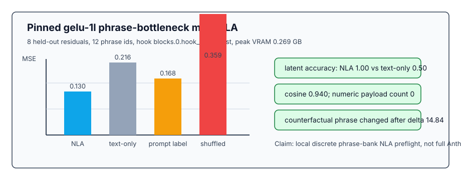

# [7.4] Mini Natural Language Autoencoders

> **Local-first extension.** A full Natural Language Autoencoder (NLA) turns
> activations into short text and then reconstructs activations from that text.
> This section builds the smallest useful evaluation harness first: aligned
> text-bottleneck batches, activation reconstruction, behavioral preservation,
> compression checks, and counterfactual controls.

```python
GT_TIER = "GT-3"
EXERCISE_ID = "7_4_mini_natural_language_autoencoders"
EXPECTED_RUNTIME = "25-45 minutes for exercises; about 1 minute for the CUDA preflight"
REQUIRES_GPU = True  # exercises are CPU; final verification uses CUDA
```

Please send any problems / bugs on the `#errata` channel in the [Slack group](https://info-arena.github.io/ARENA_img/slack.html), and ask any questions on the dedicated channels for this chapter of material.

Links to earlier chapters: [(0) Fundamentals](https://arena-chapter0-fundamentals.streamlit.app/), [(1) Transformer Interpretability](https://arena-chapter1-transformer-interp.streamlit.app/), [(2) RL](https://arena-chapter2-rl.streamlit.app/), [(3) LLM Evaluations](https://arena-chapter3-llm-evals.streamlit.app/), [(4) Alignment Science](https://arena-chapter4-alignment-science.streamlit.app/).


# Introduction

Natural Language Autoencoders ask whether an activation can be compressed into
short text and then reconstructed well enough to preserve the thing we cared
about. This is a much stricter question than "can I write a plausible
description?". A good text bottleneck should beat cheap baselines, preserve
target behavior, preserve decoded latent state, and fail when the text is
shuffled or blanked out.

This section builds a deliberately small version. The full Anthropic-style NLA
route remains a research target; the local course route is a pinned
TransformerLens `gelu-1l` preflight with a **discrete phrase-bank bottleneck**.
The encoder maps residual activations to one of twelve short phrases, the
decoder maps phrase ids back to residual space, and only phrase text is allowed
to cross the bottleneck. This is not a free-form text generator and not a claim
about arbitrary hidden thoughts.


The result to keep in mind is:

```text
residual activation -> short phrase -> reconstructed residual -> behavioral checks
```

If the phrase is doing real work, reconstruction should beat a blank/text-only
baseline, preserve the target logit-diff and latent label, and get worse when
phrases are shuffled.

## Content & Learning Objectives

### 1. Text-bottleneck records

> ##### Learning Objectives
>
> * Keep activation rows aligned with source text, latent labels, and phrase text.
> * Distinguish original prompt text from the transmitted bottleneck.
> * Reject empty or misaligned batches before they create meaningless metrics.

### 2. Phrase bottleneck and reconstruction

> ##### Learning Objectives
>
> * Train a tiny residual-to-phrase-id encoder and phrase-id-to-residual decoder.
> * Compare reconstruction against blank-text and prompt-label baselines.
> * Understand why a lower MSE is not yet a faithful explanation.

### 3. Behavior, latents, and controls

> ##### Learning Objectives
>
> * Check target positive-minus-negative logit-diff preservation.
> * Check probe accuracy and prediction agreement after reconstruction.
> * Reject prompt-copying, numeric coordinate payloads, shuffled phrases, and unchanged counterfactual explanations.

# Setup Code

```python
import sys
from dataclasses import dataclass
from pathlib import Path

import torch as t
import torch.nn.functional as F

chapter = "chapter7_activation_to_language"
section = "part4_mini_natural_language_autoencoders"
root_dir = next(p for p in [Path.cwd(), *Path.cwd().parents] if (p / chapter).exists())
exercises_dir = root_dir / chapter / "exercises"
section_dir = exercises_dir / section

if str(root_dir) not in sys.path:
    sys.path.append(str(root_dir))
if str(exercises_dir) not in sys.path:
    sys.path.append(str(exercises_dir))

import part4_mini_natural_language_autoencoders.tests as tests
import part4_mini_natural_language_autoencoders.utils as utils
```

# Text-Bottleneck Records

### Exercise - implement `build_nla_training_batch`

> Difficulty: easy
> Importance: high
>
> You should spend 5-10 minutes on this exercise.

Before training or evaluating an NLA, you need a record format that keeps every
activation aligned with the text artifacts that produced it. The generated
explanation is the bottleneck: later code will reconstruct from this text, not
from the original prompt.

```python
@dataclass(frozen=True)
class NLATrainingBatch:
    activations: t.Tensor
    original_text_spans: tuple[str, ...]
    synthetic_latent_labels: tuple[str, ...]
    generated_explanations: tuple[str, ...]


def build_nla_training_batch(
    activations: t.Tensor,
    original_text_spans: list[str],
    synthetic_latent_labels: list[str],
    generated_explanations: list[str],
) -> NLATrainingBatch:
    """
    Bundle activations with source spans, labels, and generated explanations.

    Expected:
        activations: [examples, d_model] or [examples, ...]
        every text list: length examples
    """
    raise NotImplementedError()


tests.test_build_nla_training_batch_validates_alignment(build_nla_training_batch)
```

<details>
<summary>Expected output</summary>

```text
All tests in `test_build_nla_training_batch_validates_alignment` passed!
```

</details>

<details>
<summary>Common bugs</summary>

- Accepting a rank-1 activation vector. The first dimension should index
  examples, even if the remaining activation shape is flattened later.
- Letting one text field have fewer rows than the activation tensor.
- Returning mutable lists where later audit code expects stable tuples.

</details>

<details>
<summary>Help - why not just store the original prompt?</summary>

Copying the prompt can look good on a reconstruction metric if prompts and
activations are highly correlated. It is not an autoencoder bottleneck in the
sense we care about, because the text channel is carrying the original input
rather than a compressed description of the activation. In this section, the
transmitted object is the generated phrase, not the prompt span.

</details>

<details>
<summary>Solution</summary>

```python
def build_nla_training_batch(
    activations: t.Tensor,
    original_text_spans: list[str],
    synthetic_latent_labels: list[str],
    generated_explanations: list[str],
) -> NLATrainingBatch:
    if activations.ndim < 2:
        raise ValueError("activations must have at least shape (examples, d_model).")
    expected_examples = activations.shape[0]
    lengths = {
        len(original_text_spans),
        len(synthetic_latent_labels),
        len(generated_explanations),
    }
    if lengths != {expected_examples}:
        raise ValueError("all text fields must have one entry per activation.")
    return NLATrainingBatch(
        activations=activations,
        original_text_spans=tuple(original_text_spans),
        synthetic_latent_labels=tuple(synthetic_latent_labels),
        generated_explanations=tuple(generated_explanations),
    )
```

</details>

# Reconstruction Quality

### Exercise - implement `activation_reconstruction_report`

> Difficulty: medium
> Importance: high
>
> You should spend 10-15 minutes on this exercise.

The first test is deliberately direct. If the text bottleneck is carrying
activation information, decoding it should reconstruct the original activation
better than a text-only baseline that never saw the activation.

```python
@dataclass(frozen=True)
class NLAReconstructionReport:
    activation_mse: float
    text_only_mse: float
    mean_cosine_similarity: float
    beats_text_only: bool


def activation_reconstruction_report(
    original_activations: t.Tensor,
    reconstructed_activations: t.Tensor,
    text_only_reconstructions: t.Tensor,
) -> NLAReconstructionReport:
    raise NotImplementedError()


tests.test_activation_reconstruction_report_beats_text_only_baseline(
    activation_reconstruction_report,
)
```

<details>
<summary>Expected output</summary>

```text
All tests in `test_activation_reconstruction_report_beats_text_only_baseline` passed!
```

</details>

<details>
<summary>Common bugs</summary>

- Computing cosine similarity over the whole batch instead of per example.
- Comparing the NLA reconstruction to a different target than the baseline.
- Accepting shape mismatches. Silent broadcasting can make a bad reconstruction
  look deceptively good.

</details>

<details>
<summary>Help - why MSE is not enough</summary>

An activation can be close in average squared error while moving in a direction
that matters for the next-token logits. This is why the next exercises check a
target logit difference and probe-decoded latent state. Reconstruction is the
first gate, not the final claim.

</details>

<details>
<summary>Solution</summary>

```python
def activation_reconstruction_report(
    original_activations: t.Tensor,
    reconstructed_activations: t.Tensor,
    text_only_reconstructions: t.Tensor,
) -> NLAReconstructionReport:
    matching_shapes = (
        original_activations.shape
        == reconstructed_activations.shape
        == text_only_reconstructions.shape
    )
    if not matching_shapes:
        raise ValueError("all activation tensors must have matching shape.")
    activation_mse = F.mse_loss(
        reconstructed_activations.float(),
        original_activations.float(),
    ).item()
    text_only_mse = F.mse_loss(
        text_only_reconstructions.float(),
        original_activations.float(),
    ).item()
    original_flat = original_activations.float().reshape(original_activations.shape[0], -1)
    reconstructed_flat = reconstructed_activations.float().reshape(
        reconstructed_activations.shape[0],
        -1,
    )
    cosine = F.cosine_similarity(original_flat, reconstructed_flat, dim=-1)
    return NLAReconstructionReport(
        activation_mse=activation_mse,
        text_only_mse=text_only_mse,
        mean_cosine_similarity=cosine.mean().item(),
        beats_text_only=activation_mse < text_only_mse,
    )
```

</details>

# Behavioral Preservation

### Exercise - implement `logit_diff_preservation_report`

> Difficulty: medium
> Importance: high
>
> You should spend 10 minutes on this exercise.

Low MSE is not enough. A reconstructed activation can be numerically close while
breaking the downstream behavior you care about. Here the behavior is a target
positive-minus-negative logit difference.

```python
@dataclass(frozen=True)
class LogitDiffPreservationReport:
    original_logit_diff: float
    reconstructed_logit_diff: float
    mean_abs_error: float
    preserves_target_logit_diff: bool


def batch_target_logit_diff(
    logits: t.Tensor,
    *,
    positive_token_id: int,
    negative_token_id: int,
) -> t.Tensor:
    raise NotImplementedError()


def logit_diff_preservation_report(
    original_logits: t.Tensor,
    reconstructed_logits: t.Tensor,
    *,
    positive_token_id: int,
    negative_token_id: int,
    max_mean_abs_error: float = 0.25,
) -> LogitDiffPreservationReport:
    raise NotImplementedError()


tests.test_logit_diff_preservation_report_checks_actual_logit_diff(
    logit_diff_preservation_report,
)
```

<details>
<summary>Expected output</summary>

```text
All tests in `test_logit_diff_preservation_report_checks_actual_logit_diff` passed!
```

</details>

<details>
<summary>Common bugs</summary>

- Measuring only the positive-token logit error. The target behavior is the
  positive-minus-negative **difference** on each example.
- Comparing only batch means. The error should be averaged after taking
  per-example absolute differences.
- Forgetting to reject token ids outside the logits vocabulary.

</details>

<details>
<summary>Help - interpreting the logit-diff check</summary>

The logit-diff check asks whether the reconstruction preserves one chosen
behavioral readout: the positive token minus the negative token. It is stronger
than a raw MSE check, but it is still not a full downstream generation replay.
A good report should say exactly which readout was preserved.

</details>

<details>
<summary>Solution</summary>

```python
def batch_target_logit_diff(
    logits: t.Tensor,
    *,
    positive_token_id: int,
    negative_token_id: int,
) -> t.Tensor:
    vocab_size = logits.shape[-1]
    if not 0 <= positive_token_id < vocab_size:
        raise ValueError("positive_token_id is out of range.")
    if not 0 <= negative_token_id < vocab_size:
        raise ValueError("negative_token_id is out of range.")
    return logits[..., positive_token_id] - logits[..., negative_token_id]


def logit_diff_preservation_report(
    original_logits: t.Tensor,
    reconstructed_logits: t.Tensor,
    *,
    positive_token_id: int,
    negative_token_id: int,
    max_mean_abs_error: float = 0.25,
) -> LogitDiffPreservationReport:
    if original_logits.shape != reconstructed_logits.shape:
        raise ValueError("original_logits and reconstructed_logits must match.")
    original_diff = batch_target_logit_diff(
        original_logits.float(),
        positive_token_id=positive_token_id,
        negative_token_id=negative_token_id,
    )
    reconstructed_diff = batch_target_logit_diff(
        reconstructed_logits.float(),
        positive_token_id=positive_token_id,
        negative_token_id=negative_token_id,
    )
    mean_abs_error = (original_diff - reconstructed_diff).abs().mean().item()
    return LogitDiffPreservationReport(
        original_logit_diff=original_diff.mean().item(),
        reconstructed_logit_diff=reconstructed_diff.mean().item(),
        mean_abs_error=mean_abs_error,
        preserves_target_logit_diff=mean_abs_error <= max_mean_abs_error,
    )
```

</details>

### Exercise - implement `latent_preservation_report`

> Difficulty: medium
> Importance: high
>
> You should spend 10 minutes on this exercise.

NLAs are useful only if interpretable latent state survives the bottleneck. This
exercise checks both reconstructed probe accuracy and agreement with the probe
predictions on the original activations.

```python
@dataclass(frozen=True)
class LatentPreservationReport:
    original_probe_accuracy: float
    reconstructed_probe_accuracy: float
    prediction_agreement: float
    preserves_latents: bool


def _prediction_accuracy(logits: t.Tensor, labels: t.Tensor) -> float:
    raise NotImplementedError()


def latent_preservation_report(
    original_probe_logits: t.Tensor,
    reconstructed_probe_logits: t.Tensor,
    latent_ids: t.Tensor,
    *,
    min_accuracy: float = 0.75,
    min_agreement: float = 0.75,
) -> LatentPreservationReport:
    raise NotImplementedError()


tests.test_latent_preservation_report_requires_accuracy_and_agreement(
    latent_preservation_report,
)
```

<details>
<summary>Expected output</summary>

```text
All tests in `test_latent_preservation_report_requires_accuracy_and_agreement` passed!
```

</details>

<details>
<summary>Common bugs</summary>

- Checking only agreement and forgetting that both original and reconstructed
  predictions could be wrong.
- Comparing logits with exact equality instead of comparing argmax predictions.
- Accepting label tensors whose shape does not match the logits prefix.

</details>

<details>
<summary>Help - why accuracy and agreement are both needed</summary>

Agreement alone can be misleading. If the original probe was wrong and the
reconstructed probe repeats the same wrong answer, agreement is high but the
latent claim is not supported. The reconstruction should both recover the
ground-truth latent labels and agree with the original activation readout.

</details>

<details>
<summary>Solution</summary>

```python
def _prediction_accuracy(logits: t.Tensor, labels: t.Tensor) -> float:
    if logits.ndim < 2:
        raise ValueError("logits must have shape (..., classes).")
    if logits.shape[:-1] != labels.shape:
        raise ValueError("logits prefix shape must match labels.")
    return logits.argmax(dim=-1).eq(labels).float().mean().item()


def latent_preservation_report(
    original_probe_logits: t.Tensor,
    reconstructed_probe_logits: t.Tensor,
    latent_ids: t.Tensor,
    *,
    min_accuracy: float = 0.75,
    min_agreement: float = 0.75,
) -> LatentPreservationReport:
    if original_probe_logits.shape != reconstructed_probe_logits.shape:
        raise ValueError("probe logits must have matching shape.")
    original_accuracy = _prediction_accuracy(original_probe_logits, latent_ids)
    reconstructed_accuracy = _prediction_accuracy(reconstructed_probe_logits, latent_ids)
    original_predictions = original_probe_logits.argmax(dim=-1)
    reconstructed_predictions = reconstructed_probe_logits.argmax(dim=-1)
    agreement = original_predictions.eq(reconstructed_predictions).float().mean().item()
    return LatentPreservationReport(
        original_probe_accuracy=original_accuracy,
        reconstructed_probe_accuracy=reconstructed_accuracy,
        prediction_agreement=agreement,
        preserves_latents=(
            reconstructed_accuracy >= min_accuracy and agreement >= min_agreement
        ),
    )
```

</details>

# Compression And Counterfactuals

### Exercise - implement `generated_text_brevity_report` and `counterfactual_explanation_report`

> Difficulty: medium
> Importance: high
>
> You should spend 10-15 minutes on this exercise.

A text bottleneck that copies the prompt is not a meaningful bottleneck. A text
generator that ignores activation changes is not explaining activations. These
two simple controls catch both failures.

```python
@dataclass(frozen=True)
class GeneratedTextBrevityReport:
    generated_word_count: int
    original_word_count: int
    compression_ratio: float
    shorter_than_original: bool


@dataclass(frozen=True)
class CounterfactualExplanationReport:
    original_explanation: str
    counterfactual_explanation: str
    activation_delta: float
    explanation_changed: bool


def generated_text_brevity_report(
    generated_explanations: list[str],
    original_prompts: list[str],
) -> GeneratedTextBrevityReport:
    raise NotImplementedError()


def counterfactual_explanation_report(
    original_activation: t.Tensor,
    counterfactual_activation: t.Tensor,
    original_explanation: str,
    counterfactual_explanation: str,
    *,
    min_activation_delta: float = 0.0,
) -> CounterfactualExplanationReport:
    raise NotImplementedError()


tests.test_brevity_and_counterfactual_reports_reject_prompt_copying(
    generated_text_brevity_report,
    counterfactual_explanation_report,
)
```

<details>
<summary>Expected output</summary>

```text
All tests in `test_brevity_and_counterfactual_reports_reject_prompt_copying` passed!
```

</details>

<details>
<summary>Common bugs</summary>

- Treating equal-length generated text as compressed. The bottleneck must be
  strictly shorter than the original prompt text.
- Counting punctuation-sensitive tokens. For this exercise, simple whitespace
  words are enough.
- Counting case-only or whitespace-only explanation changes as counterfactual
  evidence.
- Ignoring `min_activation_delta` and accepting tiny perturbations.

</details>

<details>
<summary>Help - what this counterfactual proves</summary>

The counterfactual check is intentionally small: a large activation change
should change the selected phrase. It does not prove semantic faithfulness by
itself, because arbitrary phrase swaps can also change text. The shuffled-text,
blank-text, and numeric-payload controls are there to make the bottleneck claim
harder to fake.

</details>

<details>
<summary>Solution</summary>

```python
def generated_text_brevity_report(
    generated_explanations: list[str],
    original_prompts: list[str],
) -> GeneratedTextBrevityReport:
    if len(generated_explanations) != len(original_prompts):
        raise ValueError("generated_explanations and original_prompts must align.")
    generated_word_count = sum(len(text.split()) for text in generated_explanations)
    original_word_count = sum(len(text.split()) for text in original_prompts)
    if original_word_count == 0:
        raise ValueError("original_prompts must contain at least one word.")
    compression_ratio = generated_word_count / original_word_count
    return GeneratedTextBrevityReport(
        generated_word_count=generated_word_count,
        original_word_count=original_word_count,
        compression_ratio=compression_ratio,
        shorter_than_original=generated_word_count < original_word_count,
    )


def counterfactual_explanation_report(
    original_activation: t.Tensor,
    counterfactual_activation: t.Tensor,
    original_explanation: str,
    counterfactual_explanation: str,
    *,
    min_activation_delta: float = 0.0,
) -> CounterfactualExplanationReport:
    if original_activation.shape != counterfactual_activation.shape:
        raise ValueError("activation tensors must have matching shape.")
    activation_delta = (
        counterfactual_activation.float() - original_activation.float()
    ).norm().item()
    explanation_changed = (
        original_explanation.strip().lower()
        != counterfactual_explanation.strip().lower()
    )
    return CounterfactualExplanationReport(
        original_explanation=original_explanation,
        counterfactual_explanation=counterfactual_explanation,
        activation_delta=activation_delta,
        explanation_changed=explanation_changed and activation_delta > min_activation_delta,
    )
```

</details>

# Trainable Phrase Bottleneck

### Exercise - implement `train_discrete_nla_bottleneck`

> Difficulty: hard
> Importance: high
>
> You should spend 20-25 minutes on this exercise.

Now you build the miniature NLA itself. The encoder is a linear classifier from
activation vectors to phrase ids. The decoder is a trainable phrase-id table
back into activation space. The transmitted bottleneck is a short phrase id,
not a numeric residual-coordinate payload.

```python
@dataclass(frozen=True)
class TrainableNLABottleneckReport:
    encoder_final_loss: float
    decoder_final_mse: float
    encoder_train_accuracy: float
    eval_phrase_accuracy: float
    reconstruction_mse: float
    blank_text_mse: float
    beats_blank_text: bool
    generated_explanations: tuple[str, ...]
    phrase_count: int
    training_steps: int
    seed: int


def train_discrete_nla_bottleneck(
    train_activations: t.Tensor,
    train_phrase_ids: t.Tensor,
    eval_activations: t.Tensor,
    eval_phrase_ids: t.Tensor,
    phrase_texts: tuple[str, ...],
    *,
    steps: int = 300,
    lr: float = 0.05,
    seed: int = 0,
) -> tuple[t.Tensor, t.Tensor, t.Tensor, t.Tensor, t.Tensor, TrainableNLABottleneckReport]:
    raise NotImplementedError()


tests.test_trainable_discrete_bottleneck_learns_phrase_ids(
    train_discrete_nla_bottleneck,
)
```

<details>
<summary>Expected output</summary>

The toy fixture has two phrase ids, held-out examples on both sides of the
direction, and a blank-text baseline. A correct implementation should print:

```text
All tests in `test_trainable_discrete_bottleneck_learns_phrase_ids` passed!
```

The report should have `encoder_train_accuracy = 1.0`,
`eval_phrase_accuracy = 1.0`, `encoder_final_loss < 0.05`, and
`reconstruction_mse < blank_text_mse`.

</details>

<details>
<summary>Help - how should the tiny model be trained?</summary>

Use two losses. First, train a linear classifier on normalized centered
activations to predict phrase ids. Second, train a decoder table so that the
phrase id reconstructs the activation. The phrase id is the only bottleneck;
the decoder is allowed to know a prototype residual for each phrase.

</details>

<details>
<summary>Common bugs</summary>

- Letting the decoder see the original eval activation instead of the predicted
  phrase id.
- Passing empty train or eval splits, which can silently produce NaNs.
- Treating the phrase text as a numeric coordinate string. The report later
  checks that generated phrases contain no numeric payloads.

</details>

<details>
<summary>Solution</summary>

```python
def train_discrete_nla_bottleneck(
    train_activations: t.Tensor,
    train_phrase_ids: t.Tensor,
    eval_activations: t.Tensor,
    eval_phrase_ids: t.Tensor,
    phrase_texts: tuple[str, ...],
    *,
    steps: int = 300,
    lr: float = 0.05,
    seed: int = 0,
) -> tuple[t.Tensor, t.Tensor, t.Tensor, t.Tensor, t.Tensor, TrainableNLABottleneckReport]:
    if train_activations.ndim != 2 or eval_activations.ndim != 2:
        raise ValueError("activations must have shape (examples, d_model).")
    if train_activations.shape[0] == 0 or eval_activations.shape[0] == 0:
        raise ValueError("train and eval activations must be nonempty.")
    if train_activations.shape[1] != eval_activations.shape[1]:
        raise ValueError("train and eval activations must share d_model.")
    if train_phrase_ids.shape != (train_activations.shape[0],):
        raise ValueError("train_phrase_ids must have shape (train_examples,).")
    if eval_phrase_ids.shape != (eval_activations.shape[0],):
        raise ValueError("eval_phrase_ids must have shape (eval_examples,).")
    if not phrase_texts:
        raise ValueError("phrase_texts must be nonempty.")
    if steps <= 0:
        raise ValueError("steps must be positive.")
    if lr <= 0:
        raise ValueError("lr must be positive.")

    n_phrases = len(phrase_texts)
    train_phrase_ids = train_phrase_ids.long()
    eval_phrase_ids = eval_phrase_ids.long()
    all_ids = t.cat([train_phrase_ids, eval_phrase_ids])
    if int(all_ids.min().item()) < 0 or int(all_ids.max().item()) >= n_phrases:
        raise ValueError("phrase ids must be in [0, len(phrase_texts)).")

    t.manual_seed(seed)
    train_x = train_activations.float()
    eval_x = eval_activations.float()
    mean = train_x.mean(dim=0, keepdim=True)
    train_features = F.normalize(train_x - mean, dim=-1)
    eval_features = F.normalize(eval_x - mean, dim=-1)

    d_model = train_x.shape[1]
    encoder_weight = (0.01 * t.randn(d_model, n_phrases)).requires_grad_()
    encoder_bias = t.zeros(n_phrases, requires_grad=True)
    global_mean = train_x.mean(dim=0)
    decoder_init = []
    for phrase_id in range(n_phrases):
        mask = train_phrase_ids == phrase_id
        decoder_init.append(train_x[mask].mean(dim=0) if bool(mask.any()) else global_mean)
    decoder_table = t.stack(decoder_init).detach().clone().requires_grad_()

    optimizer = t.optim.Adam([encoder_weight, encoder_bias, decoder_table], lr=lr)
    for _step in range(steps):
        optimizer.zero_grad(set_to_none=True)
        logits = train_features @ encoder_weight + encoder_bias
        encoder_loss = F.cross_entropy(logits, train_phrase_ids)
        decoder_loss = F.mse_loss(decoder_table[train_phrase_ids], train_x)
        (encoder_loss + decoder_loss).backward()
        optimizer.step()

    with t.no_grad():
        train_logits = train_features @ encoder_weight + encoder_bias
        eval_logits = eval_features @ encoder_weight + encoder_bias
        eval_predictions = eval_logits.argmax(dim=-1)
        reconstructed_eval = decoder_table[eval_predictions].detach()
        blank_text = train_x.mean(dim=0, keepdim=True).expand_as(eval_x)
        report = TrainableNLABottleneckReport(
            encoder_final_loss=float(encoder_loss.detach().item()),
            decoder_final_mse=float(decoder_loss.detach().item()),
            encoder_train_accuracy=_prediction_accuracy(train_logits, train_phrase_ids),
            eval_phrase_accuracy=eval_predictions.eq(eval_phrase_ids).float().mean().item(),
            reconstruction_mse=F.mse_loss(reconstructed_eval, eval_x).item(),
            blank_text_mse=F.mse_loss(blank_text, eval_x).item(),
            beats_blank_text=F.mse_loss(reconstructed_eval, eval_x).item()
            < F.mse_loss(blank_text, eval_x).item(),
            generated_explanations=tuple(phrase_texts[int(index)] for index in eval_predictions.tolist()),
            phrase_count=n_phrases,
            training_steps=steps,
            seed=seed,
        )
    return (
        encoder_weight.detach(),
        encoder_bias.detach(),
        decoder_table.detach(),
        eval_predictions.detach(),
        reconstructed_eval.detach(),
        report,
    )
```

</details>

# Notebook Contract

The exercises above should also compose into one CPU-only contract that a
student can run before touching CUDA.

```python
def run_smoke_test(cpu: bool = True) -> dict:
    _ = cpu
    activations = t.eye(3)
    batch = build_nla_training_batch(
        activations,
        ["Alice gave Bob the book.", "def add(x, y):", "The answer is Paris."],
        ["ioi", "code", "fact"],
        ["indirect object is Bob", "python function", "stored capital fact"],
    )
    original = t.tensor([[1.0, 0.0], [0.0, 1.0]])
    reconstructed = t.tensor([[0.9, 0.1], [0.1, 0.9]])
    text_only = t.zeros_like(original)
    original_logits = t.tensor([[3.0, 1.0, 0.0], [2.0, 0.0, 1.0]])
    reconstructed_logits = t.tensor([[2.9, 1.1, 0.0], [2.1, 0.0, 1.1]])
    latent_ids = t.tensor([0, 1, 2])
    original_probe_logits = t.tensor(
        [[4.0, 0.0, 0.0], [0.0, 4.0, 0.0], [0.0, 0.0, 4.0]]
    )
    reconstructed_probe_logits = t.tensor(
        [[3.0, 0.0, 0.0], [0.0, 3.0, 0.0], [0.0, 0.5, 2.0]]
    )
    return {
        "batch": {
            "activation_shape": list(batch.activations.shape),
            "latent_labels": list(batch.synthetic_latent_labels),
            "generated_explanations": list(batch.generated_explanations),
        },
        "reconstruction": activation_reconstruction_report(
            original,
            reconstructed,
            text_only,
        ).__dict__,
        "logit_diff": logit_diff_preservation_report(
            original_logits,
            reconstructed_logits,
            positive_token_id=0,
            negative_token_id=1,
            max_mean_abs_error=0.25,
        ).__dict__,
        "latent_preservation": latent_preservation_report(
            original_probe_logits,
            reconstructed_probe_logits,
            latent_ids,
            min_accuracy=0.75,
            min_agreement=0.75,
        ).__dict__,
        "brevity": generated_text_brevity_report(
            ["ioi target Bob", "python function"],
            [
                "Alice walked to the hall and gave Bob the book",
                "Please write a python function that adds two numbers",
            ],
        ).__dict__,
        "counterfactual": counterfactual_explanation_report(
            t.tensor([1.0, 0.0]),
            t.tensor([0.0, 1.0]),
            "indirect object is Bob",
            "indirect object is Alice",
            min_activation_delta=0.5,
        ).__dict__,
    }


tests.test_notebook_contract(run_smoke_test)
```

<details>
<summary>Expected output</summary>

```text
All tests in `test_notebook_contract` passed!
```

</details>

<details>
<summary>Common bugs</summary>

- Passing individual helpers while returning a different report shape from
  `run_smoke_test`.
- Reusing the old positive-logit-only error instead of the corrected
  per-example logit-diff error.
- Omitting the counterfactual or brevity controls from the combined report.

</details>

<details>
<summary>Help - reading the combined contract</summary>

The combined report should make it easy to audit the whole story in one place:
aligned rows, reconstruction above baseline, target logit-diff preservation,
latent preservation, compression, counterfactual change, and a learned phrase
bottleneck. If one row is missing, the final claim is weaker even if the earlier
unit tests passed.

</details>

<details>
<summary>Solution</summary>

Use the exact helper implementations above. The combined contract should report
`activation_mse = 0.01`, `text_only_mse = 0.5`, `mean_abs_error` close to
`0.15`, `preserves_latents = True`, `shorter_than_original = True`, and
`explanation_changed = True`.

</details>

# Signature Result

The committed CUDA report is the result students should be able to explain at
the end of the notebook.



| Check | Observed |
| --- | --- |
| Model and hook | `NeelNanda/GELU_1L512W_C4_Code`, `blocks.0.hook_resid_post` |
| Bottleneck | 12 discrete natural-language phrase ids |
| Held-out activation shape | `[8, 512]` |
| NLA reconstruction MSE | `0.1296` |
| Text-only / prompt-label MSE | `0.2158 / 0.1676` |
| Mean cosine similarity | `0.9398` |
| Probe/logit preservation | `preserves_target_logit_diff = true`, probe agreement `1.000` |
| NLA vs text-only latent accuracy | `1.000 / 0.500` |
| Shuffled / blank controls worse | `true / true` |
| Numeric payload count | `0` |
| Counterfactual explanation changed | `true`, activation delta `14.842` |
| Peak VRAM | `0.265 GB` |

<details>
<summary>Interpreting the signature result</summary>

The NLA phrase bottleneck beats two cheap reconstructions and keeps the target
latent readout intact. The controls matter just as much as the headline metric:
blank text and shuffled phrase text are worse, and generated phrases contain no
numeric coordinates. This supports a local mini-NLA phrase-bottleneck claim. It
does not establish that a language model can freely explain arbitrary residual
states.

</details>

# Full CUDA Path

The local graded experiment replaces the toy tensors with a pinned real-model
run:

1. Load `NeelNanda/GELU_1L512W_C4_Code` through TransformerLens at the pinned
   revision.
2. Cache `blocks.0.hook_resid_post` final-token residuals for safe generated
   prompts.
3. Build a residual direction from clean and corrupt anchor prompts.
4. Fit a small phrase bank on train activations, then encode held-out residuals
   into short natural-language phrases such as `blanket lying on support`.
5. Decode phrase text through a learned phrase-to-residual prototype map.
6. Verify reconstruction, approximate logit-diff preservation, latent
   preservation, long-context OOD examples, brevity, no numeric payloads,
   shuffled-text and blank-text controls, and counterfactual explanation changes.

Expected output from the committed CUDA report includes:

```text
preflight_passed: true
activation_mse < text_only_mse
activation_mse < prompt_label_baseline_mse
mean_cosine_similarity >= 0.93
text_bottleneck: discrete_natural_language_phrase_bottleneck
numeric_literal_count: 0
probe_logit_mean_abs_error <= 2.0
preserves_target_logit_diff: true
preserves_latents: true
text_only_prediction_accuracy: 0.5
nla_prediction_accuracy: 1.0
counterfactual_explanation_changed: true
shuffled_control_worse: true
blank_text_control_worse: true
within_vram_budget: true
```

<details>
<summary>Common bugs</summary>

- Treating this as proof of full-scale NLA training. It is a pinned
  phrase-bottleneck preflight.
- Letting explanations smuggle activation-derived numeric coefficients.
- Reporting reconstruction metrics without the behavioral preservation and
  counterfactual controls.

</details>

# Limitations

- This is a GT-3 mini preflight on one pinned `gelu-1l` checkpoint and one
  residual hook. It is not Anthropic-scale NLA training.
- The text channel is a discrete phrase bank, not a free-form learned language
  generator.
- The phrase labels are course-safe fixtures, not discovered semantic labels
  for arbitrary activations.
- Target logit-diff preservation is a selected residual-direction readout, not
  a full downstream activation-injection replay.
- Brevity and counterfactual phrase changes are controls, not proof of semantic
  faithfulness by themselves.
- The OOD split is small: 12 train prompts and 8 held-out long-context prompts.

# Further Research

Try paraphrase-robust phrase banks, multiple residual layers, stronger nonsense
short-label controls, more seeds, a learned local text decoder, and downstream
generation patching. A full-scale NLA replication should stay out of the
course-ready claim until it has its own baselines, controls, and local GPU
budget evidence.
