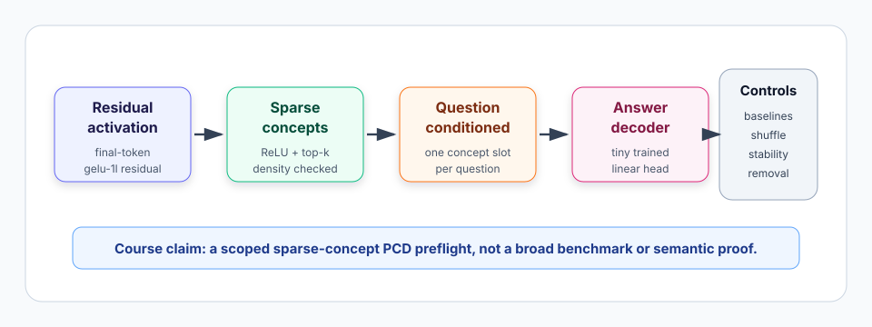
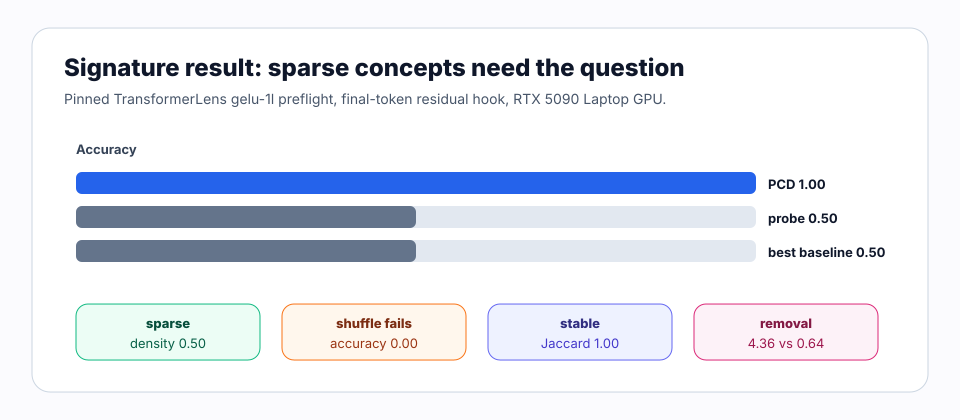

# [7.5] Predictive Concept Decoders

> **Local-first extension.** Predictive Concept Decoders (PCDs) answer
> behavioral questions through a sparse concept bottleneck. This section builds
> the small testable version first: question-labeled activation batches, sparse
> concept encoders, question-conditioned decoders, baseline comparisons,
> stability checks, and top-vs-low-margin active concept removal controls.

```python
GT_TIER = "GT-3"
EXERCISE_ID = "7_5_predictive_concept_decoders"
EXPECTED_RUNTIME = "25-45 minutes for exercises; about 1 minute for the CUDA preflight"
REQUIRES_GPU = True  # exercises are CPU; final verification uses CUDA
```

Please send any problems / bugs on the `#errata` channel in the [Slack group](https://info-arena.github.io/ARENA_img/slack.html), and ask any questions on the dedicated channels for this chapter of material.

Links to earlier chapters: [(0) Fundamentals](https://arena-chapter0-fundamentals.streamlit.app/), [(1) Transformer Interpretability](https://arena-chapter1-transformer-interp.streamlit.app/), [(2) RL](https://arena-chapter2-rl.streamlit.app/), [(3) LLM Evaluations](https://arena-chapter3-llm-evals.streamlit.app/), [(4) Alignment Science](https://arena-chapter4-alignment-science.streamlit.app/).


# Introduction

Predictive Concept Decoders ask a sharper question than an ordinary probe:
can a sparse concept bottleneck answer **different behavioral questions** about
the same activation? A question-agnostic probe sees the hidden state and must
make one prediction. A PCD sees sparse concepts plus a question, so the same
concept row can support answers like "is this a surface state?" and "is this a
motion state?" without changing the underlying activation.

This section builds the smallest version that is still hard to fake. You will
make question-labeled activation batches, project activations into sparse
concepts, expand those concepts into question-specific slots, train a tiny
question-conditioned decoder, and compare it against question-agnostic
baselines. Then you will audit the concepts with seed stability and a
top-vs-low-margin active removal control.

The notebook does **not** claim a broad PCD benchmark, full Activation Oracle
replication, or proof that concept names are semantic ground truth. The accepted
graded path is a pinned TransformerLens `gelu-1l` sparse-concept preflight over
safe surface-vs-motion residuals, with explicit baseline, shuffle, stability,
and decoder-level removal controls.



The result to keep in mind is:

```text
residual activation -> sparse concepts -> question-conditioned slots -> answer logits
```

If the question is doing real work, a trained PCD should beat a
question-agnostic probe, fail when questions are shuffled, keep top concepts
stable across seeds, and change its answer when the top active concept is
removed more than when a low-margin active control concept is removed.

## Content & Learning Objectives

### 1. Behavioral question batches

> ##### Learning Objectives
>
> * Keep activations, question ids, answer ids, and question text aligned.
> * Reject empty or out-of-range question batches before they produce meaningless metrics.
> * Distinguish the toy four-question bank from the real `gelu-1l` surface-vs-motion bank.

### 2. Sparse concept bottleneck

> ##### Learning Objectives
>
> * Project activations into nonnegative sparse concept vectors.
> * Use thresholding and top-k controls without preserving negative scores.
> * Report density and mean active concept count as bottleneck checks.

### 3. Question-conditioned decoding

> ##### Learning Objectives
>
> * Allocate one concept slot per question.
> * Train a tiny linear decoder on concept-question interaction features.
> * Compare against question-agnostic sparse probes, single-concept baselines, and non-interaction activation+question baselines.

### 4. Audits and controls

> ##### Learning Objectives
>
> * Measure top-concept stability across random seeds.
> * Interpret top-vs-low-margin active removal as decoder-level evidence, not downstream model proof.
> * Treat concept names as inspection aids rather than semantic guarantees.

# Setup Code

```python
import sys
from dataclasses import dataclass
from pathlib import Path

import torch as t
import torch.nn.functional as F

chapter = "chapter7_activation_to_language"
section = "part5_predictive_concept_decoders"
root_dir = next(p for p in [Path.cwd(), *Path.cwd().parents] if (p / chapter).exists())
exercises_dir = root_dir / chapter / "exercises"
section_dir = exercises_dir / section

if str(root_dir) not in sys.path:
    sys.path.append(str(root_dir))
if str(exercises_dir) not in sys.path:
    sys.path.append(str(exercises_dir))

import part5_predictive_concept_decoders.tests as tests
import part5_predictive_concept_decoders.utils as utils
```

# Behavioral Question Batches

### Exercise - implement `default_pcd_questions` and `build_pcd_question_batch`

> Difficulty: easy
> Importance: high
>
> You should spend 5-10 minutes on this exercise.

A PCD is not just a probe over activations. It answers a behavioral question
using a concept bottleneck. Keep the question id, answer id, and readable
question text aligned with each activation row.

```python
@dataclass(frozen=True)
class PCDQuestionBatch:
    activations: t.Tensor
    question_ids: t.Tensor
    answer_ids: t.Tensor
    question_texts: tuple[str, ...]


def default_pcd_questions() -> tuple[str, ...]:
    raise NotImplementedError()


def build_pcd_question_batch(
    activations: t.Tensor,
    question_ids: t.Tensor,
    answer_ids: t.Tensor,
    question_texts: tuple[str, ...] | None = None,
) -> PCDQuestionBatch:
    """
    Expected:
        activations: [examples, d_model]
        question_ids: [examples]
        answer_ids: [examples]
    """
    raise NotImplementedError()


tests.test_build_pcd_question_batch_validates_shapes_and_questions(
    build_pcd_question_batch,
    default_pcd_questions,
)
```

<details>
<summary>Expected output</summary>

```text
All tests in `test_build_pcd_question_batch_validates_shapes_and_questions` passed!
```

</details>

<details>
<summary>Common bugs</summary>

- Accepting rank-1 activations. Later code assumes `[examples, d_model]`.
- Accepting empty batches. Reductions over empty question ids produce confusing
  downstream failures.
- Forgetting to convert ids to `long` tensors.
- Forgetting to check that question ids actually index the question bank.
- Returning a custom question bank with different wording from the default
  contract, which makes report comparisons unstable.

</details>

<details>
<summary>Help - why store the question text?</summary>

The question id is enough for training, but not enough for an audit. The report
should let you inspect which behavioral question each row answered. This is why
the batch carries stable text even though the decoder only receives ids or
embeddings.

</details>

<details>
<summary>Solution</summary>

```python
def default_pcd_questions() -> tuple[str, ...]:
    return (
        "Will the model answer Paris?",
        "Will the model refuse?",
        "Will the next token be a number?",
        "Is the hidden variable even?",
    )


def build_pcd_question_batch(
    activations: t.Tensor,
    question_ids: t.Tensor,
    answer_ids: t.Tensor,
    question_texts: tuple[str, ...] | None = None,
) -> PCDQuestionBatch:
    if activations.ndim != 2:
        raise ValueError("activations must have shape (examples, d_model).")
    if activations.shape[0] == 0:
        raise ValueError("activations must contain at least one example.")
    expected_shape = (activations.shape[0],)
    if question_ids.shape != expected_shape:
        raise ValueError("question_ids must have shape (examples,).")
    if answer_ids.shape != expected_shape:
        raise ValueError("answer_ids must have shape (examples,).")
    if question_texts is None:
        question_texts = default_pcd_questions()
    if not question_texts:
        raise ValueError("question_texts must be nonempty.")
    if int(question_ids.min().item()) < 0 or int(question_ids.max().item()) >= len(question_texts):
        raise ValueError("question_ids must index question_texts.")
    return PCDQuestionBatch(
        activations=activations,
        question_ids=question_ids.long(),
        answer_ids=answer_ids.long(),
        question_texts=question_texts,
    )
```

</details>

# Sparse Concept Encoding

### Exercise - implement `sparse_concept_encode` and `concept_sparsity_report`

> Difficulty: medium
> Importance: high
>
> You should spend 10-15 minutes on this exercise.

Concepts are the audit surface. In this toy contract, activations project onto
concept directions, negative scores are discarded, optional thresholds remove
weak features, and optional top-k keeps only the strongest concepts per example.

```python
@dataclass(frozen=True)
class ConceptSparsityReport:
    mean_l0: float
    density: float
    passes_sparsity: bool


def sparse_concept_encode(
    activations: t.Tensor,
    concept_directions: t.Tensor,
    *,
    bias: t.Tensor | None = None,
    top_k: int | None = None,
    threshold: float = 0.0,
) -> t.Tensor:
    raise NotImplementedError()


def concept_sparsity_report(
    concepts: t.Tensor,
    *,
    active_threshold: float = 0.0,
    max_density: float = 0.3,
) -> ConceptSparsityReport:
    raise NotImplementedError()


tests.test_sparse_concept_encode_and_sparsity_controls(
    sparse_concept_encode,
    concept_sparsity_report,
)
```

<details>
<summary>Expected output</summary>

```text
All tests in `test_sparse_concept_encode_and_sparsity_controls` passed!
```

</details>

<details>
<summary>Common bugs</summary>

- Multiplying by `concept_directions.T`. In this section directions are columns:
  `[d_model, n_concepts]`.
- Applying top-k before ReLU and thresholding, which can preserve negative
  features.
- Reporting density over only active rows instead of all entries.
- Treating `max_density` as a count rather than a fraction in `[0, 1]`.

</details>

<details>
<summary>Help - why top-k after thresholding?</summary>

Top-k is a sparsity control, not a sign correction. First discard negative and
weak scores, then keep the largest remaining concepts. If you select top-k
before ReLU or thresholding, an inactive negative direction can survive as one
of the "top" concepts in a low-signal row.

</details>

<details>
<summary>Solution</summary>

```python
def sparse_concept_encode(
    activations: t.Tensor,
    concept_directions: t.Tensor,
    *,
    bias: t.Tensor | None = None,
    top_k: int | None = None,
    threshold: float = 0.0,
) -> t.Tensor:
    if activations.ndim != 2 or concept_directions.ndim != 2:
        raise ValueError("activations and concept_directions must be rank-2 tensors.")
    if activations.shape[0] == 0 or concept_directions.shape[1] == 0:
        raise ValueError("activations and concept_directions must be nonempty.")
    if activations.shape[-1] != concept_directions.shape[0]:
        raise ValueError("activation dimension must match concept directions.")
    if threshold < 0:
        raise ValueError("threshold must be non-negative.")
    raw_scores = activations.float() @ concept_directions.float()
    if bias is not None:
        if bias.shape != (concept_directions.shape[1],):
            raise ValueError("bias must have shape (n_concepts,).")
        raw_scores = raw_scores + bias.to(raw_scores.device)
    concepts = F.relu(raw_scores)
    if threshold > 0:
        concepts = concepts.where(concepts >= threshold, t.zeros_like(concepts))
    if top_k is not None:
        if top_k <= 0:
            raise ValueError("top_k must be positive.")
        top_k = min(top_k, concepts.shape[-1])
        values, indices = concepts.topk(k=top_k, dim=-1)
        concepts = t.zeros_like(concepts).scatter(dim=-1, index=indices, src=values)
    return concepts


def concept_sparsity_report(
    concepts: t.Tensor,
    *,
    active_threshold: float = 0.0,
    max_density: float = 0.3,
) -> ConceptSparsityReport:
    if concepts.ndim != 2:
        raise ValueError("concepts must have shape (examples, n_concepts).")
    if concepts.shape[0] == 0 or concepts.shape[1] == 0:
        raise ValueError("concepts must be nonempty.")
    if active_threshold < 0:
        raise ValueError("active_threshold must be non-negative.")
    if not 0.0 <= max_density <= 1.0:
        raise ValueError("max_density must be between 0 and 1.")
    active = concepts.abs() > active_threshold
    mean_l0 = active.sum(dim=-1).float().mean().item()
    density = active.float().mean().item()
    return ConceptSparsityReport(
        mean_l0=mean_l0,
        density=density,
        passes_sparsity=density <= max_density,
    )
```

</details>

# Question-Conditioned Decoding

### Exercise - implement `question_conditioned_concept_features` and `question_conditioned_decoder_logits`

> Difficulty: medium
> Importance: high
>
> You should spend 10 minutes on this exercise.

The same sparse concept vector can answer different questions. First expand the
concepts into question-specific slots, then concatenate those slots with a
question embedding before applying the decoder matrix. The slot expansion is the
part that lets concept 0 mean "surface evidence for question 0" in one row and
"surface evidence for question 2" in another.

```python
def question_conditioned_concept_features(
    concepts: t.Tensor,
    question_ids: t.Tensor,
    question_count: int,
) -> t.Tensor:
    raise NotImplementedError()


def question_conditioned_decoder_logits(
    concepts: t.Tensor,
    question_embeddings: t.Tensor,
    decoder_weight: t.Tensor,
    *,
    decoder_bias: t.Tensor | None = None,
) -> t.Tensor:
    raise NotImplementedError()


tests.test_question_conditioned_decoder_uses_question_information(
    question_conditioned_decoder_logits,
)
```

<details>
<summary>Expected output</summary>

```text
All tests in `test_question_conditioned_decoder_uses_question_information` passed!
```

You should also be able to inspect the slot expansion directly:

```python
concepts = t.tensor([[2.0, 0.0], [0.0, 2.0]])
question_ids = t.tensor([0, 1])
question_conditioned_concept_features(concepts, question_ids, question_count=2)
```

```text
tensor([[2., 0., 0., 0.],
        [0., 0., 0., 2.]])
```

</details>

<details>
<summary>Common bugs</summary>

- Repeating question embeddings but never allocating question-specific concept
  slots. That can leave the model with only additive question effects.
- Ignoring the question embedding and accidentally building a question-agnostic
  probe.
- Concatenating along the batch dimension instead of the feature dimension.
- Letting decoder weights have a width that does not match the concatenated
  input.

</details>

<details>
<summary>Help - what should the feature shape be?</summary>

If there are `n_concepts` concepts and `question_count` questions, the expanded
concept feature width should be `question_count * n_concepts`. Only the slot for
the current question is filled on each row. The decoder can then learn separate
weights for the same concept under different behavioral questions.

</details>

<details>
<summary>Solution</summary>

```python
def question_conditioned_concept_features(
    concepts: t.Tensor,
    question_ids: t.Tensor,
    question_count: int,
) -> t.Tensor:
    if concepts.ndim != 2:
        raise ValueError("concepts must have shape (examples, n_concepts).")
    if concepts.shape[0] == 0 or concepts.shape[1] == 0:
        raise ValueError("concepts must be nonempty.")
    if question_ids.shape != (concepts.shape[0],):
        raise ValueError("question_ids must have shape (examples,).")
    if question_count <= 0:
        raise ValueError("question_count must be positive.")
    if int(question_ids.min().item()) < 0 or int(question_ids.max().item()) >= question_count:
        raise ValueError("question_ids must be in [0, question_count).")

    n_examples, n_concepts = concepts.shape
    features = concepts.new_zeros(n_examples, question_count * n_concepts)
    offsets = question_ids.long() * n_concepts
    concept_offsets = t.arange(n_concepts, device=concepts.device)
    feature_indices = offsets[:, None] + concept_offsets[None, :]
    return features.scatter(dim=1, index=feature_indices, src=concepts.float())


def question_conditioned_decoder_logits(
    concepts: t.Tensor,
    question_embeddings: t.Tensor,
    decoder_weight: t.Tensor,
    *,
    decoder_bias: t.Tensor | None = None,
) -> t.Tensor:
    if concepts.ndim != 2 or question_embeddings.ndim != 2:
        raise ValueError("concepts and question_embeddings must be rank-2 tensors.")
    if concepts.shape[0] != question_embeddings.shape[0]:
        raise ValueError("concept and question batches must have the same size.")
    if decoder_weight.ndim != 2:
        raise ValueError("decoder_weight must be rank-2.")
    decoder_input = t.cat([concepts.float(), question_embeddings.float()], dim=-1)
    if decoder_input.shape[-1] != decoder_weight.shape[0]:
        raise ValueError("decoder_weight rows must match concatenated input width.")
    logits = decoder_input @ decoder_weight.float()
    if decoder_bias is not None:
        if decoder_bias.shape != (decoder_weight.shape[1],):
            raise ValueError("decoder_bias must have shape (n_answers,).")
        logits = logits + decoder_bias.to(logits.device)
    return logits
```

</details>

### Exercise - implement `train_question_conditioned_decoder`

> Difficulty: hard
> Importance: high
>
> You should spend 15-20 minutes on this exercise.

Now train the decoder instead of hand-writing weights. The toy fixture is
compositional: the same two concept rows are repeated under two different
questions, and the correct answer flips with the question. A question-agnostic
probe cannot solve this without interaction features.

```python
@dataclass(frozen=True)
class DecoderTrainingReport:
    final_loss: float
    train_accuracy: float
    steps: int
    seed: int


def _prediction_accuracy(logits: t.Tensor, labels: t.Tensor) -> float:
    raise NotImplementedError()


def train_question_conditioned_decoder(
    concepts: t.Tensor,
    question_embeddings: t.Tensor,
    answer_ids: t.Tensor,
    *,
    steps: int = 400,
    lr: float = 0.08,
    seed: int = 0,
    weight_decay: float = 0.0,
) -> tuple[t.Tensor, t.Tensor, DecoderTrainingReport]:
    raise NotImplementedError()


tests.test_trained_question_conditioned_decoder_learns_concept_question_interaction(
    question_conditioned_concept_features,
    train_question_conditioned_decoder,
    question_conditioned_decoder_logits,
)
```

<details>
<summary>Expected output</summary>

```text
All tests in `test_trained_question_conditioned_decoder_learns_concept_question_interaction` passed!
```

The trained report should have `train_accuracy = 1.0`, and the logits should
predict `[1, 0, 0, 1]` on the four concept-question rows.

</details>

<details>
<summary>Common bugs</summary>

- Training on unexpanded concepts when the task requires concept-question
  interaction features.
- Returning parameters that still require gradients. Later report code treats
  them as frozen decoder weights.
- Forgetting to seed both CPU and CUDA, which makes the stability control noisy.
- Reporting only loss. The course contract needs train accuracy and steps too.

</details>

<details>
<summary>Help - why a linear decoder is enough here</summary>

The nonlinearity is in the feature construction. Once each concept has a
separate slot for each question, a linear head can learn that the same concept
supports different answers under different questions. If you train on the raw
concept vector plus a question embedding, the head can add concept and question
effects but cannot represent the same interaction as cleanly.

</details>

<details>
<summary>Solution</summary>

```python
def _prediction_accuracy(logits: t.Tensor, labels: t.Tensor) -> float:
    if logits.ndim < 2:
        raise ValueError("logits must have shape (..., classes).")
    if logits.shape[:-1] != labels.shape:
        raise ValueError("logits prefix shape must match labels.")
    return logits.argmax(dim=-1).eq(labels).float().mean().item()


def train_question_conditioned_decoder(
    concepts: t.Tensor,
    question_embeddings: t.Tensor,
    answer_ids: t.Tensor,
    *,
    steps: int = 400,
    lr: float = 0.08,
    seed: int = 0,
    weight_decay: float = 0.0,
) -> tuple[t.Tensor, t.Tensor, DecoderTrainingReport]:
    if concepts.ndim != 2 or question_embeddings.ndim != 2:
        raise ValueError("concepts and question_embeddings must be rank-2 tensors.")
    if concepts.shape[0] == 0:
        raise ValueError("training batches must be nonempty.")
    if concepts.shape[0] != question_embeddings.shape[0]:
        raise ValueError("concepts and question_embeddings must have the same batch size.")
    if answer_ids.shape != (concepts.shape[0],):
        raise ValueError("answer_ids must have shape (examples,).")
    if steps <= 0:
        raise ValueError("steps must be positive.")
    if lr <= 0:
        raise ValueError("lr must be positive.")

    t.manual_seed(seed)
    if concepts.device.type == "cuda":
        t.cuda.manual_seed_all(seed)
    decoder_width = concepts.shape[1] + question_embeddings.shape[1]
    decoder_weight = (0.01 * t.randn(decoder_width, 2, device=concepts.device)).requires_grad_()
    decoder_bias = t.zeros(2, device=concepts.device, requires_grad=True)
    optimizer = t.optim.Adam(
        [decoder_weight, decoder_bias],
        lr=lr,
        weight_decay=weight_decay,
    )
    answer_ids = answer_ids.long()
    final_loss = float("nan")
    for _step in range(steps):
        optimizer.zero_grad(set_to_none=True)
        logits = question_conditioned_decoder_logits(
            concepts,
            question_embeddings,
            decoder_weight,
            decoder_bias=decoder_bias,
        )
        loss = F.cross_entropy(logits, answer_ids)
        loss.backward()
        optimizer.step()
        final_loss = float(loss.detach().item())

    with t.no_grad():
        train_logits = question_conditioned_decoder_logits(
            concepts,
            question_embeddings,
            decoder_weight,
            decoder_bias=decoder_bias,
        )
        train_accuracy = _prediction_accuracy(train_logits, answer_ids)
    report = DecoderTrainingReport(
        final_loss=final_loss,
        train_accuracy=train_accuracy,
        steps=steps,
        seed=seed,
    )
    return decoder_weight.detach(), decoder_bias.detach(), report
```

</details>

### Exercise - implement `pcd_comparison_report`

> Difficulty: medium
> Importance: high
>
> You should spend 10 minutes on this exercise.

The PCD only earns its keep if the question-conditioned concept bottleneck beats
ordinary baselines. This exercise uses a toy compositional task where a
question-agnostic probe misses half the answers.

```python
@dataclass(frozen=True)
class PCDComparisonReport:
    pcd_accuracy: float
    probe_accuracy: float
    sae_classifier_accuracy: float
    activation_oracle_accuracy: float
    best_baseline_accuracy: float
    beats_probe: bool
    beats_best_baseline: bool


def pcd_comparison_report(
    pcd_logits: t.Tensor,
    probe_logits: t.Tensor,
    sae_classifier_logits: t.Tensor,
    activation_oracle_logits: t.Tensor,
    answer_ids: t.Tensor,
) -> PCDComparisonReport:
    raise NotImplementedError()


tests.test_pcd_comparison_report_beats_baselines(pcd_comparison_report)
```

<details>
<summary>Expected output</summary>

```text
All tests in `test_pcd_comparison_report_beats_baselines` passed!
```

The toy comparison should make the gap obvious:

| model | accuracy |
|---|---:|
| question-conditioned PCD | 1.00 |
| question-agnostic probe | 0.50 |
| SAE-style classifier | 0.50 |
| oracle-style baseline fixture | 0.75 |

</details>

<details>
<summary>Common bugs</summary>

- Treating a tie with the best baseline as success. This stricter local PCD
  contract requires beating the best baseline.
- Comparing logits directly instead of `argmax(dim=-1)` predictions.
- Forgetting that the oracle-style baseline is still just a baseline here; it
  should not get special treatment.

</details>

<details>
<summary>Help - what does beating the baselines show?</summary>

It shows that the question-conditioned concept bottleneck captured the
compositional structure of this local task better than the listed baselines. It
does not show that the concepts are semantically complete, or that the same
decoder will generalize to unrelated behavioral questions. That is why the
full path also checks question shuffling, seed stability, and removal controls.

</details>

<details>
<summary>Solution</summary>

```python
def _prediction_accuracy(logits: t.Tensor, labels: t.Tensor) -> float:
    if logits.ndim < 2:
        raise ValueError("logits must have shape (..., classes).")
    if logits.shape[:-1] != labels.shape:
        raise ValueError("logits prefix shape must match labels.")
    return logits.argmax(dim=-1).eq(labels).float().mean().item()


def pcd_comparison_report(
    pcd_logits: t.Tensor,
    probe_logits: t.Tensor,
    sae_classifier_logits: t.Tensor,
    activation_oracle_logits: t.Tensor,
    answer_ids: t.Tensor,
) -> PCDComparisonReport:
    pcd_accuracy = _prediction_accuracy(pcd_logits, answer_ids)
    probe_accuracy = _prediction_accuracy(probe_logits, answer_ids)
    sae_accuracy = _prediction_accuracy(sae_classifier_logits, answer_ids)
    oracle_accuracy = _prediction_accuracy(activation_oracle_logits, answer_ids)
    best_baseline = max(probe_accuracy, sae_accuracy, oracle_accuracy)
    return PCDComparisonReport(
        pcd_accuracy=pcd_accuracy,
        probe_accuracy=probe_accuracy,
        sae_classifier_accuracy=sae_accuracy,
        activation_oracle_accuracy=oracle_accuracy,
        best_baseline_accuracy=best_baseline,
        beats_probe=pcd_accuracy > probe_accuracy,
        beats_best_baseline=pcd_accuracy > best_baseline,
    )
```

</details>

# Concept Audit Controls

### Exercise - implement stability, removal, and concept-name audit reports

> Difficulty: medium
> Importance: high
>
> You should spend 15-20 minutes on this exercise.

Auditable concepts should be stable across seeds, useful to the decoder when
removed, and named well enough that the selected cluster is legible. Names are
not proof, but nameless concepts are hard to inspect. The `random_removed_*`
fields are kept for compatibility with earlier reports; in the full CUDA path
they refer to a low-margin active control concept from the same row.

```python
@dataclass(frozen=True)
class ConceptStabilityReport:
    top_concepts_by_seed: tuple[tuple[int, ...], ...]
    mean_pairwise_jaccard: float
    stable: bool


@dataclass(frozen=True)
class ConceptRemovalReport:
    original_answer: int
    top_removed_answer: int
    random_removed_answer: int
    top_removal_changed: bool
    random_removal_changed: bool
    top_removal_delta: float
    random_removal_delta: float
    random_removal_does_less: bool


@dataclass(frozen=True)
class ConceptAuditReport:
    selected_concept_ids: tuple[int, ...]
    selected_concept_names: tuple[str, ...]
    explanation: str
    names_expected_cluster: bool


def concept_stability_report(
    concept_scores_by_seed: list[t.Tensor],
    *,
    top_k: int = 3,
    min_jaccard: float = 0.5,
) -> ConceptStabilityReport:
    raise NotImplementedError()


def concept_removal_report(
    original_logits: t.Tensor,
    top_removed_logits: t.Tensor,
    random_removed_logits: t.Tensor,
    *,
    target_answer_id: int | None = None,
) -> ConceptRemovalReport:
    raise NotImplementedError()


def concept_audit_report(
    concept_scores: t.Tensor,
    concept_names: list[str],
    expected_cluster_terms: list[str],
    *,
    top_k: int = 2,
) -> ConceptAuditReport:
    raise NotImplementedError()


tests.test_concept_stability_removal_and_audit_controls(
    concept_stability_report,
    concept_removal_report,
    concept_audit_report,
)
```

<details>
<summary>Expected output</summary>

```text
All tests in `test_concept_stability_removal_and_audit_controls` passed!
```

The toy audit should produce a stable top set `((0, 1), (0, 1), (0, 1))`, a
top-removal delta of `3.0`, a low-margin-control delta of `0.5`, and selected
names `("refusal feature", "safety refusal")`.

</details>

<details>
<summary>Common bugs</summary>

- Computing stability from score correlations rather than top-k set overlap.
- Measuring removal deltas on the new predicted answer instead of the original
  target answer.
- Forgetting the low-margin active removal comparison; top removal alone is
  weak evidence.
- Treating concept names as proof. They are an audit aid, not a causal metric.

</details>

<details>
<summary>Help - interpreting removal controls</summary>

This removal check is decoder-level evidence. It asks whether removing the
largest active concept contribution changes the decoder answer more than
removing a lower-margin active concept from the same row. It is not a claim that
ablating the same residual direction inside the original transformer would
necessarily change generation in the same way.

</details>

<details>
<summary>Solution</summary>

```python
def concept_stability_report(
    concept_scores_by_seed: list[t.Tensor],
    *,
    top_k: int = 3,
    min_jaccard: float = 0.5,
) -> ConceptStabilityReport:
    if len(concept_scores_by_seed) == 0:
        raise ValueError("concept_scores_by_seed must be nonempty.")
    if top_k <= 0:
        raise ValueError("top_k must be positive.")
    if not 0.0 <= min_jaccard <= 1.0:
        raise ValueError("min_jaccard must be between 0 and 1.")

    top_concepts: list[tuple[int, ...]] = []
    for scores in concept_scores_by_seed:
        flat_scores = scores.flatten().float()
        k = min(top_k, flat_scores.numel())
        indices = flat_scores.topk(k=k).indices.tolist()
        top_concepts.append(tuple(int(index) for index in indices))

    overlaps = []
    for i, left in enumerate(top_concepts):
        for right in top_concepts[i + 1 :]:
            left_set = set(left)
            right_set = set(right)
            overlaps.append(len(left_set & right_set) / len(left_set | right_set))
    mean_jaccard = sum(overlaps) / len(overlaps) if overlaps else 1.0
    return ConceptStabilityReport(
        top_concepts_by_seed=tuple(top_concepts),
        mean_pairwise_jaccard=mean_jaccard,
        stable=mean_jaccard >= min_jaccard,
    )


def concept_removal_report(
    original_logits: t.Tensor,
    top_removed_logits: t.Tensor,
    random_removed_logits: t.Tensor,
    *,
    target_answer_id: int | None = None,
) -> ConceptRemovalReport:
    if original_logits.ndim != 1:
        raise ValueError("original_logits must be rank-1.")
    if top_removed_logits.shape != original_logits.shape:
        raise ValueError("top_removed_logits must match original_logits.")
    if random_removed_logits.shape != original_logits.shape:
        raise ValueError("random_removed_logits must match original_logits.")
    if target_answer_id is None:
        target_answer_id = int(original_logits.argmax().item())
    if not 0 <= target_answer_id < original_logits.shape[0]:
        raise ValueError("target_answer_id is out of range.")

    original_answer = int(original_logits.argmax().item())
    top_removed_answer = int(top_removed_logits.argmax().item())
    random_removed_answer = int(random_removed_logits.argmax().item())
    top_delta = original_logits[target_answer_id] - top_removed_logits[target_answer_id]
    random_delta = original_logits[target_answer_id] - random_removed_logits[target_answer_id]
    return ConceptRemovalReport(
        original_answer=original_answer,
        top_removed_answer=top_removed_answer,
        random_removed_answer=random_removed_answer,
        top_removal_changed=original_answer != top_removed_answer,
        random_removal_changed=original_answer != random_removed_answer,
        top_removal_delta=float(top_delta.item()),
        random_removal_delta=float(random_delta.item()),
        random_removal_does_less=abs(random_delta.item()) < abs(top_delta.item()),
    )


def concept_audit_report(
    concept_scores: t.Tensor,
    concept_names: list[str],
    expected_cluster_terms: list[str],
    *,
    top_k: int = 2,
) -> ConceptAuditReport:
    if top_k <= 0:
        raise ValueError("top_k must be positive.")
    if concept_scores.numel() == 0:
        raise ValueError("concept_scores must be nonempty.")
    if concept_scores.numel() != len(concept_names):
        raise ValueError("concept_scores and concept_names must align.")
    if len(expected_cluster_terms) == 0:
        raise ValueError("expected_cluster_terms must be nonempty.")
    flat_scores = concept_scores.flatten().float()
    k = min(top_k, flat_scores.numel())
    selected_ids = tuple(int(index) for index in flat_scores.topk(k=k).indices.tolist())
    selected_names = tuple(concept_names[index] for index in selected_ids)
    normalized_terms = [term.lower() for term in expected_cluster_terms]
    matched = any(
        term in name.lower()
        for name in selected_names
        for term in normalized_terms
    )
    explanation = "Top concepts: " + ", ".join(selected_names)
    return ConceptAuditReport(
        selected_concept_ids=selected_ids,
        selected_concept_names=selected_names,
        explanation=explanation,
        names_expected_cluster=matched,
    )
```

</details>

# Notebook Contract

The exercises above should compose into one CPU-only report before running any
real-model preflight.

```python
def run_smoke_test(cpu: bool = True) -> dict:
    _ = cpu
    activations = t.eye(4)
    batch = build_pcd_question_batch(
        activations,
        t.tensor([0, 1, 2, 3]),
        t.tensor([1, 0, 1, 0]),
    )
    concepts = sparse_concept_encode(t.eye(3), t.eye(3), top_k=1)
    sparsity = concept_sparsity_report(concepts, max_density=0.34)
    decoder_logits = question_conditioned_decoder_logits(
        t.tensor([[1.0, 0.0], [0.0, 1.0]]),
        t.tensor([[0.0, 1.0], [1.0, 0.0]]),
        t.tensor([[2.0, 0.0], [0.0, 2.0], [0.0, 1.0], [1.0, 0.0]]),
    )
    base_concepts = t.tensor([[2.0, 0.0], [0.0, 2.0]])
    repeated_concepts = base_concepts.repeat_interleave(2, dim=0)
    question_ids = t.tensor([0, 1, 0, 1])
    question_embeddings = t.eye(2).repeat(2, 1)
    decoder_answer_ids = t.tensor([1, 0, 0, 1])
    conditioned = question_conditioned_concept_features(
        repeated_concepts,
        question_ids,
        question_count=2,
    )
    decoder_weight, decoder_bias, decoder_training = train_question_conditioned_decoder(
        conditioned,
        question_embeddings,
        decoder_answer_ids,
        steps=250,
        lr=0.1,
        seed=0,
    )
    trained_logits = question_conditioned_decoder_logits(
        conditioned,
        question_embeddings,
        decoder_weight,
        decoder_bias=decoder_bias,
    )
    return {
        "batch": {
            "activation_shape": list(batch.activations.shape),
            "num_questions": len(batch.question_texts),
            "answer_ids": batch.answer_ids.tolist(),
        },
        "sparse_encoding": {
            "concepts": concepts.tolist(),
            "sparsity": sparsity.__dict__,
        },
        "decoder": decoder_logits.tolist(),
        "decoder_training": {
            "conditioned_shape": list(conditioned.shape),
            "train_accuracy": decoder_training.train_accuracy,
            "final_loss": decoder_training.final_loss,
            "predictions": trained_logits.argmax(dim=-1).tolist(),
            "answer_ids": decoder_answer_ids.tolist(),
        },
        "comparison": pcd_comparison_report(
            t.tensor([[2.0, 0.0], [0.0, 2.0], [2.0, 0.0], [0.0, 2.0]]),
            t.tensor([[2.0, 0.0], [2.0, 0.0], [2.0, 0.0], [2.0, 0.0]]),
            t.tensor([[2.0, 0.0], [2.0, 0.0], [2.0, 0.0], [2.0, 0.0]]),
            t.tensor([[2.0, 0.0], [0.0, 2.0], [2.0, 0.0], [2.0, 0.0]]),
            t.tensor([0, 1, 0, 1]),
        ).__dict__,
        "stability": concept_stability_report(
            [
                t.tensor([0.9, 0.8, 0.1, 0.0]),
                t.tensor([0.8, 0.7, 0.2, 0.0]),
                t.tensor([0.95, 0.85, 0.05, 0.0]),
            ],
            top_k=2,
            min_jaccard=0.75,
        ).__dict__,
        "removal": concept_removal_report(
            t.tensor([3.0, 1.0]),
            t.tensor([0.0, 2.0]),
            t.tensor([2.5, 1.0]),
        ).__dict__,
        "audit": concept_audit_report(
            t.tensor([0.1, 0.9, 0.8]),
            ["syntax feature", "refusal feature", "safety refusal"],
            ["refusal"],
            top_k=2,
        ).__dict__,
    }


tests.test_notebook_contract(run_smoke_test)
```

<details>
<summary>Expected output</summary>

```text
All tests in `test_notebook_contract` passed!
```

</details>

<details>
<summary>Common bugs</summary>

- Passing individual helpers but returning a different report shape from
  `run_smoke_test`.
- Omitting the trained-decoder report or the low-margin active removal control
  from the combined contract.
- Reporting only PCD accuracy without the baseline accuracies.

</details>

<details>
<summary>Help - reading the combined contract</summary>

The smoke report is deliberately CPU-only, but it should contain the same kinds
of evidence as the CUDA path: sparse concepts, trained question-conditioned
decoding, baseline comparison, stability, removal, and concept-name audit. It
is not a substitute for the `gelu-1l` preflight; it is a fast check that the
student implementation can compose the pieces.

</details>

<details>
<summary>Solution</summary>

Use the helper implementations above. The combined contract should report four
default questions, sparse identity concepts with density `1/3`, decoder logits
`[[3.0, 0.0], [0.0, 3.0]]`, trained predictions `[1, 0, 0, 1]`,
`pcd_accuracy = 1.0`, `probe_accuracy = 0.5`, stable top concepts, and
top-concept removal doing more damage than the low-margin active control.

</details>

# Signature Result

The accepted result for this section is a **scoped mini PCD preflight**: a
question-conditioned sparse-concept decoder over `gelu-1l` final-token residual
activations. The PCD solves the held-out surface-vs-motion question rows, while
question-agnostic and non-interaction baselines do not.



| metric | accepted value | why it matters |
|---|---:|---|
| PCD accuracy | `1.0` | the sparse concept + question decoder solves held-out rows |
| best baseline accuracy | `0.5` | question-agnostic baselines miss the compositional split |
| question-shuffle accuracy | `0.0` | answers depend on the aligned question |
| concept density | `0.5` | the bottleneck stays sparse under the local threshold |
| seed-min PCD accuracy | `1.0` | top behavior is stable across the three training seeds |
| mean pairwise top-concept Jaccard | `1.0` | the selected top concepts are stable across seeds |
| top-removal delta | `4.3569` | removing the highest-margin active concept changes the decoder answer |
| low-margin active-control delta | `0.6363` | the comparison removal does less damage |
| peak VRAM | `< 0.35 GB` | the local preflight fits comfortably on the 24 GB machine |

The selected concept names in the accepted run are `surface_direction` and
`motion_direction`. Treat those names as an audit handle: useful for inspection,
but not proof that the concepts are complete natural-language semantics.

## Full CUDA Path

The local graded experiment replaces toy tensors with a pinned `gelu-1l`
preflight:

1. Load `NeelNanda/GELU_1L512W_C4_Code` through TransformerLens at the pinned
   revision.
2. Cache `blocks.0.hook_resid_post` final-token activations for safe generated
   prompts.
3. Build signed sparse residual concepts from a surface-vs-motion residual
   direction and orthogonal residual PCs.
4. Expand sparse concepts into explicit concept-question interaction features.
5. Train a tiny question-conditioned decoder on train prompts, then evaluate
   four behavioral questions on held-out long-context prompts.
6. Compare against trained question-agnostic sparse-concept, trained
   single-concept, and trained non-interaction activation+question baselines.
7. Check concept density, question-shuffle degradation, top-concept audit names,
   and multi-seed stability.
8. Remove the top active concept and compare against a low-margin active control
   concept from the same row. Legacy metric names call this `random_removal`,
   but the implemented control is deterministic and low-impact by construction.

Expected output from the committed CUDA report includes:

```text
preflight_passed: true
pcd_accuracy: 1.0
probe_accuracy: 0.5
best_baseline_accuracy: 0.5
pcd_decoder_train_accuracy: 1.0
question_count: 4
pcd_row_count: 32
question_shuffle_accuracy: 0.0
pcd_seed_min_accuracy: 1.0
beats_best_baseline: true
passes_sparsity: true
stable: true
top_removal_changed: true
random_removal_does_less: true
random_removed_concept_active: true
names_expected_cluster: true
within_vram_budget: true
```

<details>
<summary>Common bugs</summary>

- Treating this as a broad PCD benchmark. It is a scoped mechanics preflight.
- Letting the baseline see the concept-question interaction features.
- Reporting top-concept removal without the random-removal control.
- Calling concept names a proof of semantics. Names only make the selected
  concept cluster inspectable.

</details>

Before trusting the report, explain why a question-agnostic probe cannot solve
the compositional task, why the non-interaction activation+question baseline is
still insufficient, and why the concept-name audit is only a debugging aid
rather than semantic proof.

# Limitations

- This is not a broad PCD benchmark. It is a small, pinned `gelu-1l`
  surface-vs-motion preflight designed to exercise the mechanics.
- The CUDA task uses four surface/motion questions. The Paris/refusal/number/even
  questions remain the toy notebook contract for learning the API.
- The removal result is decoder-level evidence. It does not prove that ablating
  the same residual direction inside the original transformer will cause the
  same generation change.
- Concept names come from the construction of the signed directions and are
  audit aids, not semantic ground truth.
- The baseline named `activation_oracle_accuracy` is a legacy report field for
  a non-interaction activation+question baseline in this section. It is not a
  full Activation Oracle comparison.

# Further Research

- Replace the handcrafted surface/motion direction with learned sparse
  dictionaries or SAEs, then keep the same question-conditioned evaluation
  contract.
- Scale the question bank to refusal, arithmetic, retrieval, and calibration
  behaviors while keeping held-out prompts and question-shuffle controls.
- Run true model-level causal ablations for the selected concepts and compare
  them with the decoder-level removal result.
- Add human-readable concept-description generation only after the sparse
  concepts pass stability, baseline, and removal checks without names.
