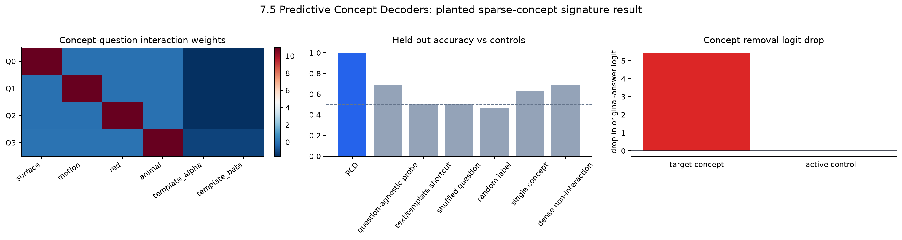

# [7.5] Predictive Concept Decoders

> **Local-first extension.** This page mirrors the exercise notebook and keeps the result learner-facing: build the exact planted sparse-concept world, make the PCD earn its name against controls, then inspect the pinned `gelu-1l` evidence without overclaiming it.

```python
GT_TIER = "GT-3"
EXERCISE_ID = "7_5_predictive_concept_decoders"
EXPECTED_RUNTIME = "45-75 minutes; CPU exercises here, parent GPU verification separately"
REQUIRES_GPU = False  # this page/notebook pass is CPU-only; live gelu-1l verification is a separate GPU gate
```

Please send any problems / bugs on the `#errata` channel in the [Slack group](https://info-arena.github.io/ARENA_img/slack.html), and ask any questions on the dedicated channels for this chapter of material.

Links to earlier chapters: [(0) Fundamentals](https://arena-chapter0-fundamentals.streamlit.app/), [(1) Transformer Interpretability](https://arena-chapter1-transformer-interp.streamlit.app/), [(2) RL](https://arena-chapter2-rl.streamlit.app/), [(3) LLM Evaluations](https://arena-chapter3-llm-evals.streamlit.app/), [(4) Alignment Science](https://arena-chapter4-alignment-science.streamlit.app/).



## How this fits ARENA

This section extends the original ARENA probe-and-patch style without modifying original ARENA. The toy world gives exact ground truth before any real-model claim. Every hard method has a local test, the signature result is visible in the notebook, and the real `gelu-1l` evidence is scoped as a mechanics preflight rather than a broad PCD benchmark.

## Core Question

Does a sparse concept bottleneck answer held-out questions through the relevant concept-question interaction, or can a simpler shortcut reproduce the result?

## Learning Objectives

By the end of this notebook, you will have shown that concept-question interaction slots answer held-out behavioral questions in an exact sparse-concept world, because they beat question-agnostic probes, text/template shortcuts, shuffled-question, random-label, single-concept, and dense non-interaction controls, and targeted concept removal beats a matched active-control removal.


By the end of this notebook, you should be able to:

- construct a planted sparse-concept world with exact hidden ground truth;
- keep activation rows, question ids, answer ids, and question text aligned;
- implement sparse concept encoding with threshold and top-k controls;
- implement concept-question interaction slots rather than an additive question embedding shortcut;
- train and evaluate a tiny question-conditioned decoder;
- reject weak PCD claims using six controls;
- make a concept-question heatmap, held-out prediction table, baseline bar chart, and removal chart;
- explain what the current `gelu-1l` evidence does and does not establish.

## Cold Open

Here is the failure mode this section is designed to catch.

Imagine a hidden state contains four planted concepts: `surface`, `motion`, `red`, and `animal`. We ask four questions, one per concept. If the same hidden state appears under all four questions, then a question-agnostic probe has contradictory labels for the same input row. A text/template baseline should also fail, because the toy prompts deliberately do not say which hidden concepts are active.

A PCD only wins if the question changes how sparse concepts are read. The signature result is a heatmap whose rows are questions and whose columns are concepts. The diagonal should light up; the nuisance/template concepts should stay dark.

```python
import json
import sys
from dataclasses import dataclass
from pathlib import Path

import matplotlib.pyplot as plt
import pandas as pd
import torch as t
import torch.nn.functional as F
from IPython.display import display

chapter = "chapter7_activation_to_language"
section = "part5_predictive_concept_decoders"
root_dir = next(p for p in [Path.cwd(), *Path.cwd().parents] if (p / chapter).exists())
exercises_dir = root_dir / chapter / "exercises"
section_dir = exercises_dir / section

if str(root_dir) not in sys.path:
    sys.path.append(str(root_dir))
if str(exercises_dir) not in sys.path:
    sys.path.append(str(exercises_dir))

import part5_predictive_concept_decoders.tests as tests

MAIN = __name__ == "__main__"
GT_TIER = "GT-3"
EXERCISE_ID = "7_5_predictive_concept_decoders"
EXPECTED_RUNTIME = "45-75 minutes; CPU exercises only in this notebook pass"
REQUIRES_GPU = False

PLANTED_PCD_QUESTIONS = (
    "Is the hidden surface concept active?",
    "Is the hidden motion concept active?",
    "Is the hidden red concept active?",
    "Is the hidden animal concept active?",
)
PLANTED_CONCEPT_NAMES = (
    "surface",
    "motion",
    "red",
    "animal",
    "template_alpha",
    "template_beta",
)
PLANTED_QUESTION_TO_CONCEPT = (0, 1, 2, 3)
```

### Exercise - build an exact planted sparse-concept world

> ```yaml
> Difficulty: medium
> Importance: high
> You should spend 10-15 minutes on this exercise.
> ```

We need a toy world where ground truth is not a vibe. Each example has hidden binary concepts. Activations are dense-looking vectors, but the planted concept directions recover those concepts exactly. The prompt text is intentionally uninformative, so text/template shortcuts cannot solve the task.

<details>
<summary>Expected output</summary>

```text
All tests in `test_make_planted_pcd_world_has_exact_sparse_ground_truth` passed!
```

The world should contain 32 train examples, 32 held-out examples, 6 concept columns, and 4 behavioral questions.

</details>

<details>
<summary>Help - how can dense activations have exact concepts?</summary>

Use an orthonormal basis. Put the sparse concept vector into the first concept directions, then add small nuisance features in orthogonal null directions. Projecting back onto the concept directions recovers the sparse concepts because the null directions are orthogonal.

</details>

<details>
<summary>Interpretation</summary>

This is the ground-truth contract. Later, when the PCD wins, you know it wins because it used the right sparse variables, not because an activation report happened to be green.

</details>

<details>
<summary>Solution</summary>

```python
def _dense_orthonormal_columns(*, d_model: int, columns: int, seed: int) -> t.Tensor:
    generator = t.Generator(device="cpu").manual_seed(seed)
    q, _ = t.linalg.qr(t.randn(d_model, d_model, generator=generator))
    return q[:, :columns].float()


def make_planted_pcd_world(*, seed: int = 0, d_model: int = 12) -> PlantedPCDWorld:
    rows = [[(index >> bit) & 1 for bit in range(4)] for index in range(16)]
    base_targets = t.tensor(rows, dtype=t.float32).repeat_interleave(2, dim=0)
    replicate_ids = t.arange(base_targets.shape[0]) % 2
    basis = _dense_orthonormal_columns(d_model=d_model, columns=8, seed=seed)
    concept_directions, null_directions = basis[:, :6], basis[:, 6:8]
    # Build train and held-out splits with templates balanced against target concepts.
```

The full reference implementation is in the solution notebook; the important invariant is `activations @ concept_directions == true_concepts` up to floating-point tolerance.

</details>

```python
@dataclass(frozen=True)
class PlantedPCDWorld:
    train_activations: t.Tensor
    heldout_activations: t.Tensor
    train_true_concepts: t.Tensor
    heldout_true_concepts: t.Tensor
    concept_directions: t.Tensor
    train_template_ids: t.Tensor
    heldout_template_ids: t.Tensor
    question_texts: tuple[str, ...]
    concept_names: tuple[str, ...]
    train_prompts: tuple[str, ...]
    heldout_prompts: tuple[str, ...]


def _dense_orthonormal_columns(
    *,
    d_model: int,
    columns: int,
    seed: int,
) -> t.Tensor:
    raise NotImplementedError()


def make_planted_pcd_world(
    *,
    seed: int = 0,
    d_model: int = 12,
) -> PlantedPCDWorld:
    raise NotImplementedError()


tests.test_make_planted_pcd_world_has_exact_sparse_ground_truth(make_planted_pcd_world)
```

### Exercise - align activations, questions, and answers

> ```yaml
> Difficulty: easy
> Importance: high
> You should spend 10 minutes on this exercise.
> ```

A PCD row is not just an activation. It is `(activation, question, answer)`. The same activation will appear four times, once for each behavioral question, and the answer changes with the question.

<details>
<summary>Expected output</summary>

```text
All tests in `test_build_pcd_question_batch_validates_shapes_and_questions` passed!
All tests in `test_build_pcd_question_batch_rejects_empty_and_bad_question_ids` passed!
All tests in `test_build_planted_question_rows_aligns_every_question` passed!
```

For 32 held-out activations and 4 questions, you should create 128 question rows.

</details>

<details>
<summary>Help - why repeat the same concept row?</summary>

Repeating the concept row under different questions creates the contradiction that defeats question-agnostic probes. A model that ignores the question sees identical inputs with different labels.

</details>

<details>
<summary>Interpretation</summary>

If this row alignment is wrong, every later metric is meaningless. This is why the tests check shape, nonempty batches, question-id range, and balanced answers.

</details>

<details>
<summary>Solution</summary>

```python
def build_planted_question_rows(concepts, question_to_concept=PLANTED_QUESTION_TO_CONCEPT):
    question_count = len(question_to_concept)
    row_concepts = concepts.repeat_interleave(question_count, dim=0).float()
    question_ids = t.arange(question_count, device=concepts.device).repeat(concepts.shape[0])
    question_embeddings = t.eye(question_count, device=concepts.device).repeat(concepts.shape[0], 1)
    answer_ids = concepts[:, list(question_to_concept)].round().long().clamp(0, 1).reshape(-1)
    return row_concepts, question_embeddings, question_ids.long(), answer_ids.long()
```

</details>

```python
@dataclass(frozen=True)
class PCDQuestionBatch:
    activations: t.Tensor
    question_ids: t.Tensor
    answer_ids: t.Tensor
    question_texts: tuple[str, ...]


def default_pcd_questions() -> tuple[str, ...]:
    raise NotImplementedError()


def build_pcd_question_batch(
    activations: t.Tensor,
    question_ids: t.Tensor,
    answer_ids: t.Tensor,
    question_texts: tuple[str, ...] | None = None,
) -> PCDQuestionBatch:
    raise NotImplementedError()


def build_planted_question_rows(
    concepts: t.Tensor,
    *,
    question_to_concept: tuple[int, ...] = PLANTED_QUESTION_TO_CONCEPT,
) -> tuple[t.Tensor, t.Tensor, t.Tensor, t.Tensor]:
    raise NotImplementedError()


tests.test_build_pcd_question_batch_validates_shapes_and_questions(
    build_pcd_question_batch,
    default_pcd_questions,
)
tests.test_build_pcd_question_batch_rejects_empty_and_bad_question_ids(build_pcd_question_batch)
tests.test_build_planted_question_rows_aligns_every_question(build_planted_question_rows)
```

### Exercise - implement the sparse concept bottleneck

> ```yaml
> Difficulty: medium
> Importance: high
> You should spend 10-15 minutes on this exercise.
> ```

The concept bottleneck is the audit surface. Project activations onto concept directions, discard negative scores, optionally threshold weak positives, and optionally keep only the top-k concepts per row.

<details>
<summary>Expected output</summary>

```text
All tests in `test_sparse_concept_encode_and_sparsity_controls` passed!
All tests in `test_sparse_concept_encode_and_sparsity_reject_bad_controls` passed!
```

On the identity fixture, top-k sparse encoding should return the identity matrix and density `1/3`.

</details>

<details>
<summary>Help - ordering matters</summary>

Apply projection, bias, ReLU, threshold, and then top-k. If top-k happens before ReLU/threshold, negative or weak concepts can survive as apparent evidence.

</details>

<details>
<summary>Interpretation</summary>

A PCD is only auditable if its bottleneck is genuinely sparse. If most concept entries are active, the decoder has become a disguised dense probe.

</details>

<details>
<summary>Solution</summary>

```python
raw_scores = activations.float() @ concept_directions.float()
if bias is not None:
    raw_scores = raw_scores + bias.to(raw_scores.device)
concepts = F.relu(raw_scores)
concepts = concepts.where(concepts >= threshold, t.zeros_like(concepts))
values, indices = concepts.topk(k=top_k, dim=-1)
concepts = t.zeros_like(concepts).scatter(dim=-1, index=indices, src=values)
```

</details>

```python
@dataclass(frozen=True)
class ConceptSparsityReport:
    mean_l0: float
    density: float
    passes_sparsity: bool


def sparse_concept_encode(
    activations: t.Tensor,
    concept_directions: t.Tensor,
    *,
    bias: t.Tensor | None = None,
    top_k: int | None = None,
    threshold: float = 0.0,
) -> t.Tensor:
    raise NotImplementedError()


def concept_sparsity_report(
    concepts: t.Tensor,
    *,
    active_threshold: float = 0.0,
    max_density: float = 0.3,
) -> ConceptSparsityReport:
    raise NotImplementedError()


tests.test_sparse_concept_encode_and_sparsity_controls(
    sparse_concept_encode,
    concept_sparsity_report,
)
tests.test_sparse_concept_encode_and_sparsity_reject_bad_controls(
    sparse_concept_encode,
    concept_sparsity_report,
)
```

### Exercise - build concept-question interaction features

> ```yaml
> Difficulty: medium
> Importance: high
> You should spend 10-15 minutes on this exercise.
> ```

This is the core PCD move. Do not merely concatenate a question embedding. Allocate one copy of the concept vector per question, and fill only the slot for the current question. Then concatenate this interaction vector with the question embedding and decode answer logits.

<details>
<summary>Expected output</summary>

```text
All tests in `test_question_conditioned_decoder_uses_question_information` passed!
All tests in `test_question_conditioned_decoder_respects_arbitrary_weight_and_bias` passed!
All tests in `test_question_conditioned_features_and_decoder_reject_bad_shapes` passed!
```

A two-concept, two-question expansion should look like:

```text
tensor([[2., 0., 0., 0.],
        [0., 0., 0., 2.]])
```

</details>

<details>
<summary>Help - what should be nonzero?</summary>

Only the current question's concept slot. If `question_id == 1` and there are six concepts, the filled columns are `6:12`.

Common bug: concatenating the concept vector with a question embedding without forming interaction slots. That additive decoder cannot ask different concept questions of the same activation in the intended way.

</details>

<details>
<summary>Interpretation</summary>

This interaction feature map is what a dense non-interaction control lacks. Without it, the decoder can add a question effect and an activation effect, but cannot cleanly ask different concept questions of the same row.

</details>

<details>
<summary>Solution</summary>

```python
features = concepts.new_zeros(n_examples, question_count * n_concepts)
offsets = question_ids.long() * n_concepts
concept_offsets = t.arange(n_concepts, device=concepts.device)
feature_indices = offsets[:, None] + concept_offsets[None, :]
features = features.scatter(dim=1, index=feature_indices, src=concepts.float())
logits = t.cat([features, question_embeddings.float()], dim=-1) @ decoder_weight.float()
```

</details>

```python
def question_conditioned_concept_features(
    concepts: t.Tensor,
    question_ids: t.Tensor,
    question_count: int,
) -> t.Tensor:
    raise NotImplementedError()


def question_conditioned_decoder_logits(
    concepts: t.Tensor,
    question_embeddings: t.Tensor,
    decoder_weight: t.Tensor,
    *,
    decoder_bias: t.Tensor | None = None,
) -> t.Tensor:
    raise NotImplementedError()


tests.test_question_conditioned_decoder_uses_question_information(
    question_conditioned_decoder_logits,
)
tests.test_question_conditioned_decoder_respects_arbitrary_weight_and_bias(
    question_conditioned_decoder_logits,
)
tests.test_question_conditioned_features_and_decoder_reject_bad_shapes(
    question_conditioned_concept_features,
    question_conditioned_decoder_logits,
)
```

### Exercise - train the tiny PCD decoder

> ```yaml
> Difficulty: hard
> Importance: high
> You should spend 15-20 minutes on this exercise.
> ```

Now train the decoder rather than hand-writing weights. The feature construction has done the nonlinear work; a linear head over interaction slots should learn the planted question mapping exactly.

<details>
<summary>Expected output</summary>

```text
All tests in `test_trained_question_conditioned_decoder_learns_concept_question_interaction` passed!
All tests in `test_train_question_conditioned_decoder_rejects_empty_and_misaligned_batches` passed!
```

The tiny fixture should reach `train_accuracy = 1.0` and predict `[1, 0, 0, 1]`.

</details>

<details>
<summary>Help - debugging optimization</summary>

Seed the parameters, train with cross-entropy, zero gradients before each step, and return detached weights/bias. If loss falls but accuracy does not, inspect whether you accidentally trained on raw concepts instead of question-expanded concepts.

</details>

<details>
<summary>Interpretation</summary>

This is still a simple decoder. The point is not architectural sophistication; it is that the decoder's input has the right interaction structure and is tested against controls.

</details>

<details>
<summary>Solution</summary>

```python
decoder_weight = (0.01 * t.randn(decoder_width, 2)).requires_grad_()
decoder_bias = t.zeros(2, requires_grad=True)
optimizer = t.optim.Adam([decoder_weight, decoder_bias], lr=lr, weight_decay=weight_decay)
for _ in range(steps):
    logits = question_conditioned_decoder_logits(concepts, question_embeddings, decoder_weight, decoder_bias=decoder_bias)
    loss = F.cross_entropy(logits, answer_ids.long())
    optimizer.zero_grad(set_to_none=True)
    loss.backward()
    optimizer.step()
```

</details>

```python
@dataclass(frozen=True)
class DecoderTrainingReport:
    final_loss: float
    train_accuracy: float
    steps: int
    seed: int


def _prediction_accuracy(logits: t.Tensor, labels: t.Tensor) -> float:
    raise NotImplementedError()


def train_question_conditioned_decoder(
    concepts: t.Tensor,
    question_embeddings: t.Tensor,
    answer_ids: t.Tensor,
    *,
    steps: int = 400,
    lr: float = 0.08,
    seed: int = 0,
    weight_decay: float = 0.0,
) -> tuple[t.Tensor, t.Tensor, DecoderTrainingReport]:
    raise NotImplementedError()


tests.test_trained_question_conditioned_decoder_learns_concept_question_interaction(
    question_conditioned_concept_features,
    train_question_conditioned_decoder,
    question_conditioned_decoder_logits,
)
tests.test_train_question_conditioned_decoder_rejects_empty_and_misaligned_batches(
    train_question_conditioned_decoder,
)
```

### Exercise - score the controls

> ```yaml
> Difficulty: medium
> Importance: high
> You should spend 10-15 minutes on this exercise.
> ```

A PCD does not win by reporting its own accuracy. It wins by beating the best serious control: question-agnostic probe, text/template shortcut, shuffled question, random-label training, single-concept bottleneck, and dense non-interaction decoder.

<details>
<summary>Expected output</summary>

```text
All tests in `test_pcd_baseline_sweep_report_scores_all_controls` passed!
```

A tie with the best control should fail `passes_controls`.

</details>

<details>
<summary>Help - what is the dense non-interaction control?</summary>

It receives dense activations and a question embedding, but not concept-question slots. This checks whether the PCD's claimed advantage comes from the interaction map rather than just more input dimensions.

</details>

<details>
<summary>Interpretation</summary>

This report is the grading rubric for the claim. If a shortcut matches the PCD, the right conclusion is not "PCD succeeded"; it is "this setting does not justify the PCD name."

</details>

<details>
<summary>Solution</summary>

```python
accuracies = {
    name: _prediction_accuracy(logits, answer_ids)
    for name, logits in control_logits.items()
}
best_control = max(v for k, v in accuracies.items() if k != "PCD")
passes_controls = accuracies["PCD"] == 1.0 and accuracies["PCD"] - best_control >= min_margin
```

</details>

```python
@dataclass(frozen=True)
class PCDBaselineSweepReport:
    pcd_accuracy: float
    question_agnostic_probe_accuracy: float
    text_template_shortcut_accuracy: float
    shuffled_question_accuracy: float
    random_label_accuracy: float
    single_concept_accuracy: float
    dense_noninteraction_accuracy: float
    best_control_accuracy: float
    pcd_margin_over_best_control: float
    passes_controls: bool


def concept_question_weight_heatmap(
    decoder_weight: t.Tensor,
    *,
    question_count: int,
    concept_count: int,
) -> t.Tensor:
    raise NotImplementedError()


def pcd_baseline_sweep_report(
    *,
    pcd_logits: t.Tensor,
    question_agnostic_probe_logits: t.Tensor,
    text_template_shortcut_logits: t.Tensor,
    shuffled_question_logits: t.Tensor,
    random_label_logits: t.Tensor,
    single_concept_logits: t.Tensor,
    dense_noninteraction_logits: t.Tensor,
    answer_ids: t.Tensor,
    min_margin: float = 0.20,
) -> PCDBaselineSweepReport:
    raise NotImplementedError()


tests.test_pcd_baseline_sweep_report_scores_all_controls(pcd_baseline_sweep_report)
```

### Exercise - targeted concept removal

> ```yaml
> Difficulty: hard
> Importance: high
> You should spend 15 minutes on this exercise.
> ```

A concept bottleneck is interpretable only if concept edits behave as predicted. For a row where both `surface` and `motion` are active, removing `surface` should change the answer to the surface question. Removing the matched active non-target concept should do less.

<details>
<summary>Expected output</summary>

```text
All tests in `test_targeted_concept_removal_report_scores_active_control` passed!
```

The direct fixture should report `target_removal_changed=True`, `active_control_changed=False`, and `active_control_does_less=True`.

</details>

<details>
<summary>Help - why an active control?</summary>

An inactive control is too easy. Removing a zero concept changes nothing by construction. The stronger control removes a different concept that is genuinely active in the same row.

</details>

<details>
<summary>Interpretation</summary>

This is decoder-level causal evidence, not a claim that the downstream language model changed. In the real `gelu-1l` preflight, the corresponding check is still a decoder bottleneck intervention.

</details>

<details>
<summary>Solution</summary>

```python
patched = row_concepts[row_index : row_index + 1].clone()
patched[0, concept_id] = 0.0
features = question_conditioned_concept_features(patched, question_ids[row_index : row_index + 1], question_count)
logits = question_conditioned_decoder_logits(features, question_embeddings[row_index : row_index + 1], decoder_weight, decoder_bias=decoder_bias)[0]
```

Compare the original-answer logit drop under target removal and active-control removal.

</details>

```python
@dataclass(frozen=True)
class TargetedConceptRemovalReport:
    row_index: int
    prompt: str
    question: str
    target_concept: str
    active_control_concept: str
    original_answer: int
    target_removed_answer: int
    active_control_removed_answer: int
    target_logit_delta: float
    active_control_logit_delta: float
    target_removal_changed: bool
    active_control_changed: bool
    active_control_does_less: bool


def targeted_concept_removal_report(
    row_concepts: t.Tensor,
    question_ids: t.Tensor,
    question_embeddings: t.Tensor,
    decoder_weight: t.Tensor,
    decoder_bias: t.Tensor,
    *,
    prompts: tuple[str, ...],
    question_texts: tuple[str, ...],
    concept_names: tuple[str, ...],
    example_index: int,
    question_id: int,
    target_concept_id: int,
    active_control_concept_id: int,
) -> TargetedConceptRemovalReport:
    raise NotImplementedError()


tests.test_targeted_concept_removal_report_scores_active_control(targeted_concept_removal_report)
```

### Exercise - compose the planted PCD experiment

> ```yaml
> Difficulty: hard
> Importance: high
> You should spend 20-25 minutes on this exercise.
> ```

Put the pieces together. Encode train and held-out activations into sparse concepts, build question rows, train the PCD, train every control, compute the heatmap, and build the held-out prediction table.

<details>
<summary>Expected output</summary>

```text
All tests in `test_planted_pcd_experiment_beats_requested_controls` passed!
All tests in `test_targeted_concept_removal_beats_active_control` passed!
```

Expected planted signature metrics:

```text
PCD accuracy: 1.0
best control: 0.6875
PCD margin: 0.3125
held-out rows: 128
```

</details>

<details>
<summary>Help - common wiring mistakes</summary>

- Train the PCD on expanded concept-question slots, not raw concept rows.
- Train the question-agnostic probe on raw concept rows with zero-width question embeddings.
- Train the dense non-interaction control on dense activations plus question embeddings, not interaction slots.
- Evaluate all controls on the same held-out answer ids.

</details>

<details>
<summary>Interpretation</summary>

The heatmap is the signature toy result. If the diagonal concepts are not the largest entries for their questions, the PCD may have found a shortcut rather than the planted mechanism.

</details>

<details>
<summary>Solution</summary>

The full solution is intentionally assembled in the solution notebook, because it uses all previous functions. The core pattern is:

```python
train_features = question_conditioned_concept_features(train_rows, train_question_ids, question_count)
heldout_features = question_conditioned_concept_features(heldout_rows, heldout_question_ids, question_count)
decoder_weight, decoder_bias, report = train_question_conditioned_decoder(train_features, train_questions, train_answers)
pcd_logits = question_conditioned_decoder_logits(heldout_features, heldout_questions, decoder_weight, decoder_bias=decoder_bias)
```

Then repeat with each control input and pass all logits into `pcd_baseline_sweep_report`.

</details>

```python
def _fit_eval_decoder(
    train_features: t.Tensor,
    train_questions: t.Tensor,
    train_answers: t.Tensor,
    heldout_features: t.Tensor,
    heldout_questions: t.Tensor,
    *,
    steps: int,
    lr: float,
    seed: int,
    weight_decay: float = 0.0,
) -> tuple[t.Tensor, t.Tensor, DecoderTrainingReport, t.Tensor]:
    raise NotImplementedError()


def _template_features(template_ids: t.Tensor, *, question_count: int) -> t.Tensor:
    raise NotImplementedError()


def planted_prediction_rows(
    world: PlantedPCDWorld,
    *,
    heldout_answers: t.Tensor,
    pcd_logits: t.Tensor,
    probe_logits: t.Tensor,
    text_template_logits: t.Tensor,
    dense_noninteraction_logits: t.Tensor,
) -> list[dict[str, object]]:
    raise NotImplementedError()


def run_planted_pcd_experiment(
    *,
    seed: int = 0,
    steps: int = 450,
    lr: float = 0.08,
) -> dict:
    raise NotImplementedError()


tests.test_planted_pcd_experiment_beats_requested_controls(run_planted_pcd_experiment)
tests.test_targeted_concept_removal_beats_active_control(run_planted_pcd_experiment)
```

## Signature Result: Heatmap, Baselines, Removal

Once your implementation passes, run the cell below. This is the toy-world result the section is built around: the heatmap should put each question on its planted concept, the PCD should beat every control, and targeted removal should damage the answer more than an active non-target removal.

<details>
<summary>Expected output</summary>

You should see three plots:

- a concept-question interaction heatmap with the diagonal concepts brightest;
- a baseline bar chart with PCD at `1.0` and best control at `0.6875`;
- a removal chart where target removal has a large positive logit drop and active-control removal is small.

</details>

<details>
<summary>Interpretation</summary>

This is the PCD-name check. The sparse bottleneck matters, the question interaction matters, and the removal intervention behaves as predicted on known ground truth.

</details>

```python
planted = run_planted_pcd_experiment(seed=0, steps=350, lr=0.08)
world = planted["world"]

fig, axes = plt.subplots(1, 3, figsize=(17, 4.2))

heatmap = planted["heatmap"].detach()
im = axes[0].imshow(heatmap, cmap="RdBu_r", aspect="auto")
axes[0].set_title("Concept-question interaction weights")
axes[0].set_xticks(range(len(world.concept_names)), world.concept_names, rotation=35, ha="right")
axes[0].set_yticks(range(len(world.question_texts)), [f"Q{i}" for i in range(len(world.question_texts))])
fig.colorbar(im, ax=axes[0], fraction=0.046, pad=0.04)

colors = ["#2563eb"] + ["#94a3b8"] * (len(planted["baseline_names"]) - 1)
axes[1].bar(planted["baseline_names"], planted["baseline_accuracies"], color=colors)
axes[1].axhline(0.5, color="#64748b", linestyle="--", linewidth=1)
axes[1].set_ylim(0, 1.05)
axes[1].set_title("Held-out accuracy vs controls")
axes[1].tick_params(axis="x", rotation=50)

removal = planted["removal_report"]
axes[2].bar(
    ["target concept", "active control"],
    [removal.target_logit_delta, removal.active_control_logit_delta],
    color=["#dc2626", "#94a3b8"],
)
axes[2].axhline(0, color="#111827", linewidth=1)
axes[2].set_title("Concept removal logit drop")
axes[2].set_ylabel("drop in original-answer logit")

for ax in axes:
    ax.spines[["top", "right"]].set_visible(False)
plt.tight_layout()
plt.show()

summary = planted["baseline_report"].__dict__
display(pd.DataFrame([summary]).T.rename(columns={0: "value"}))
display(pd.DataFrame(planted["prediction_rows"]).head(12))
```

### Exercise - inspect the real `gelu-1l` evidence honestly

> ```yaml
> Difficulty: medium
> Importance: medium
> You should spend 10 minutes on this exercise.
> ```

The real-model path uses pinned TransformerLens `gelu-1l` final-token residual activations on safe surface-vs-motion prompts. This notebook pass does not run CUDA. It reads the committed verification report and extracts row-level prompt predictions when a fresh GPU report contains them. Older reports only have aggregate metrics; in that case the helper is allowed to infer PCD row correctness only when aggregate `pcd_accuracy == 1.0`, and it marks the source as aggregate-derived.

<details>
<summary>Expected output</summary>

```text
All tests in `test_gelu1l_prompt_prediction_table_uses_direct_rows_or_honest_aggregate` passed!
```

The current report should show `gelu-1l`, `pcd_accuracy=1.0`, baseline accuracies below the PCD, question shuffle failure, stable top concepts, and top-concept removal beating the active control.

</details>

<details>
<summary>Help - why not invent missing row logits?</summary>

If a report only has aggregate metrics, you cannot reconstruct baseline logits or margins for individual rows. The helper may infer that every PCD row is correct only because `pcd_accuracy == 1.0` over the full row count; it must not invent per-row baseline predictions.

</details>

<details>
<summary>Interpretation</summary>

The real evidence is a scoped mechanics preflight. It connects the toy lesson to a trained transformer, but it is not a full PCD paper replication or a downstream model-level causal intervention.

</details>

<details>
<summary>Solution</summary>

```python
direct_rows = metrics.get("eval_prediction_rows")
if direct_rows is not None:
    return list(direct_rows)
if metrics["pcd_accuracy"] != 1.0:
    raise ValueError("cannot infer per-row PCD correctness")
# Build prompt/question rows from the pinned prompt list and mark the source as aggregate-derived.
```

</details>

```python
def gelu1l_prompt_prediction_table(report: dict) -> list[dict[str, object]]:
    raise NotImplementedError()


tests.test_gelu1l_prompt_prediction_table_uses_direct_rows_or_honest_aggregate(
    gelu1l_prompt_prediction_table,
)

# After implementing, inspect the current committed report without running GPU.
report = json.loads((section_dir / "verification_report.json").read_text())
gpu = report["metrics"]["gpu_test"]
real_rows = gelu1l_prompt_prediction_table(report)
metric_keys = [
    "model_name",
    "hook_name",
    "pcd_accuracy",
    "probe_accuracy",
    "sae_classifier_accuracy",
    "non_interaction_baseline_accuracy",
    "question_shuffle_accuracy",
    "pcd_seed_min_accuracy",
    "top_removal_changed",
    "random_removal_does_less",
    "peak_vram_gb",
]
display(pd.DataFrame({"metric": metric_keys, "value": [gpu[k] for k in metric_keys]}))
display(pd.DataFrame(real_rows).head(12))
```

## Verification Handoff

The planted signature result remains the learner-facing proof. These stable entry points read the committed supporting evidence or invoke the separate pinned CUDA verifier when explicitly called.

```python
def load_verification_evidence() -> dict:
    report = json.loads((section_dir / "verification_report.json").read_text())
    required = {"accepted", "metrics", "gt_tier", "notebook_id"}
    missing = sorted(required - report.keys())
    if missing:
        raise ValueError(f"verification report is missing required fields: {missing}")
    return report

def run_gpu_test(max_vram_gb: float = 24.0) -> dict:
    from importlib import import_module

    verification = import_module(
        "chapter7_activation_to_language.exercises.part5_predictive_concept_decoders.solutions"
    )
    return verification.run_gpu_test(max_vram_gb=max_vram_gb)

def run_full_experiment(max_vram_gb: float = 24.0) -> dict:
    return run_gpu_test(max_vram_gb=max_vram_gb)
```

## Combined CPU Contract

This final CPU check composes the learner-facing path. It should include the old helper contracts and the new planted-world signature result. It still does not run CUDA.

<details>
<summary>Expected output</summary>

```text
All tests in `test_notebook_contract` passed!
```

</details>

```python
def run_smoke_test(cpu: bool = True) -> dict:
    _ = cpu
    raise NotImplementedError()


tests.test_notebook_contract(run_smoke_test)
```

## Try It Yourself

Change `example_index`, `question_id`, or `target_concept_id`. A useful play cell should make the mechanism feel editable: you can inspect the active concepts, ask a different question, and remove a concept to see whether the answer changes.

```python
# Try changing these.
example_index = 30
question_id = 0
target_concept_id = 0
active_control_concept_id = 1

planted = run_planted_pcd_experiment(seed=0, steps=350, lr=0.08)
world = planted["world"]
row = example_index * len(world.question_texts) + question_id
print("prompt:", world.heldout_prompts[example_index])
print("question:", world.question_texts[question_id])
print("active concepts:", [name for name, value in zip(world.concept_names, planted["heldout_rows"][row]) if value.item() > 0])
print("PCD logits:", planted["pcd_logits"][row].tolist())
print("answer / prediction:", int(planted["heldout_answers"][row].item()), int(planted["pcd_logits"][row].argmax().item()))

removal = targeted_concept_removal_report(
    planted["heldout_rows"],
    planted["heldout_question_ids"],
    planted["heldout_questions"],
    planted["decoder_weight"],
    planted["decoder_bias"],
    prompts=world.heldout_prompts,
    question_texts=world.question_texts,
    concept_names=world.concept_names,
    example_index=example_index,
    question_id=question_id,
    target_concept_id=target_concept_id,
    active_control_concept_id=active_control_concept_id,
)
removal
```

## Bonus: Anomaly Hunting

Look for controls that get rows right for the wrong reason. A baseline can fail overall while still matching the PCD on easy rows. Inspect those rows and ask whether the prompt template, nuisance concepts, or class balance accidentally helped it.

```python
planted = run_planted_pcd_experiment(seed=0, steps=350, lr=0.08)
rows = pd.DataFrame(planted["prediction_rows"])
rows["pcd_correct"] = rows["pcd_pred"] == rows["answer"]
rows["probe_correct"] = rows["probe_pred"] == rows["answer"]
rows["text_correct"] = rows["text_template_pred"] == rows["answer"]
rows["dense_correct"] = rows["dense_noninteraction_pred"] == rows["answer"]
interesting = rows[rows["pcd_correct"] & (rows["probe_correct"] | rows["text_correct"] | rows["dense_correct"])]
display(interesting.head(12))
print("Control agreement rates:")
print(rows[["probe_correct", "text_correct", "dense_correct"]].mean())
```

## Limitations and Reading

The toy world is exact by construction; it proves the mechanics and rejects shortcuts under known ground truth. It does not prove that learned concept names in real models are semantic truth.

The `gelu-1l` section is a scoped preflight: final-token residual activations, safe surface-vs-motion prompts, handcrafted sparse concept directions from anchored residual differences plus principal components, a tiny question-conditioned decoder, and decoder-level removal. It does not claim a broad PCD benchmark, a full Activation Oracle comparison, or downstream model-level causal steering.

Read next:

- Predictive Concept Decoders project page and paper for the large-scale method.
- Original ARENA linear probes and activation patching sections for the surrounding methodology.
- Activation Oracles and Natural Language Autoencoders for adjacent activation-to-language approaches.
