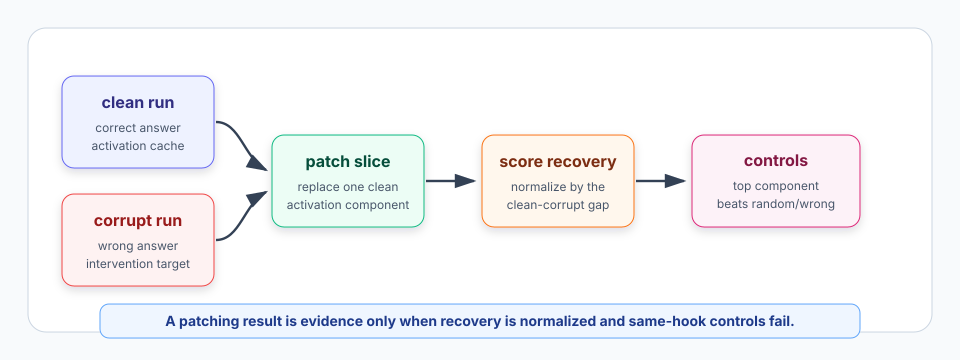
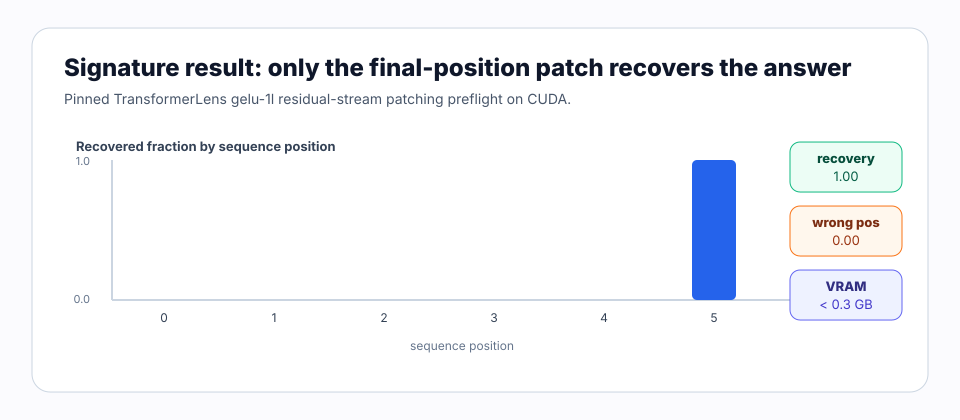

# [8.1] Activation Patching Refresher

> **Notebooks: [exercises](../../exercises/part1_activation_patching_refresher/8.1_Activation_Patching_Refresher_exercises.ipynb) | [solutions](../../exercises/part1_activation_patching_refresher/8.1_Activation_Patching_Refresher_solutions.ipynb)**

> **Local-first extension.** Activation patching is the causal baseline for
> automated circuits: run clean and corrupt prompts, patch one clean activation
> into the corrupt run, and measure how much the target behavior recovers. This
> section turns the original ARENA activation-patching rhythm into reusable
> helpers, then proves the same helpers on a real CUDA TransformerLens
> residual-stream patching sweep.

```python
GT_TIER = "GT-1"
EXERCISE_ID = "8_1_activation_patching_refresher"
EXPECTED_RUNTIME = "20-35 minutes for exercises; about 1 minute for the CUDA preflight"
REQUIRES_GPU = True  # exercises are CPU; final verification uses CUDA
```

Please send any problems / bugs on the `#errata` channel in the [Slack group](https://info-arena.github.io/ARENA_img/slack.html), and ask any questions on the dedicated channels for this chapter of material.

If you want to change to dark mode, you can do this by clicking the three horizontal lines in the top-right, then navigating to Settings -> Theme.

Links to earlier chapters: [(0) Fundamentals](https://arena-chapter0-fundamentals.streamlit.app/), [(1) Transformer Interpretability](https://arena-chapter1-transformer-interp.streamlit.app/), [(2) RL](https://arena-chapter2-rl.streamlit.app/), [(3) LLM Evaluations](https://arena-chapter3-llm-evals.streamlit.app/), [(4) Alignment Science](https://arena-chapter4-alignment-science.streamlit.app/).


# Introduction

In the original ARENA IOI material, activation patching starts from a concrete
question: if a clean run has the right behavior and a corrupted run has the
wrong behavior, which activation from the clean run is sufficient to restore
the clean behavior? The same idea is the first brick under automated circuit
discovery, attribution patching, ACDC, EAP, and feature-level circuit graphs.

This section keeps that rhythm but strips the model problem down to the
smallest reliable preflight. The CUDA path uses a pinned TransformerLens
`gelu-1l` checkpoint with:

```text
clean prompt:   "The cat sat on the"
corrupt prompt: "The bird flew over the"
hook:           blocks.0.hook_resid_post
target token:   " floor"
distractor:     " top"
```

We patch clean residual-stream positions into the corrupt run, then measure the
final-token logit-diff recovery. In the accepted run, only the final residual
position recovers the clean behavior. All non-final wrong-position controls
stay at zero.



The result to keep in mind is:

```text
clean metric = 1, corrupt metric = 0, patched metric asks "how much recovered?"
```

For denoising, `0` means "the patch did no better than the corrupt run" and
`1` means "the patch recovered the clean run". Values above `1` or below `0`
can happen, but they should make you inspect the metric and controls before
making a causal claim.

This is **not** an IOI-scale circuit discovery section. It proves the
activation-patching mechanics and control contract used by later Chapter 8
sections.

## Content & Learning Objectives

### 1. Logit-diff readouts

> ##### Learning Objectives
>
> * Compute a scalar positive-minus-negative answer logit difference.
> * Reject degenerate readouts: empty vocabularies, same-token comparisons, and non-finite logits.
> * Keep the answer pair fixed across clean, corrupt, and patched runs.

### 2. Clean-into-corrupt patching

> ##### Learning Objectives
>
> * Patch exactly one clean activation slice into a corrupt tensor.
> * Preserve the input shapes and avoid mutating either input.
> * Treat component axes abstractly, so the helper can patch positions, heads, layers, or features.

### 3. Recovered fractions and sweeps

> ##### Learning Objectives
>
> * Normalize patched metrics by the signed clean-corrupt gap.
> * Interpret recovered fraction with `0 = corrupt` and `1 = clean`.
> * Convert per-component patched metrics into a ranked patching sweep.

### 4. Localization and controls

> ##### Learning Objectives
>
> * Check whether top patching scores recover known target components.
> * Compare top patches against same-size wrong-position controls.
> * Require the best patch to beat both the average and maximum wrong-control score.

# Setup Code

```python
import sys
from dataclasses import dataclass
from pathlib import Path

import torch as t

chapter = "chapter8_automated_circuits"
section = "part1_activation_patching_refresher"
root_dir = next(p for p in [Path.cwd(), *Path.cwd().parents] if (p / chapter).exists())
exercises_dir = root_dir / chapter / "exercises"
section_dir = exercises_dir / section

if str(root_dir) not in sys.path:
    sys.path.append(str(root_dir))
if str(exercises_dir) not in sys.path:
    sys.path.append(str(exercises_dir))

import part1_activation_patching_refresher.tests as tests
import part1_activation_patching_refresher.utils as utils
```

# Clean, Corrupt, And The Readout

### Exercise - implement `answer_logit_diff`

> Difficulty: easy
> Importance: high
>
> You should spend 5 minutes on this exercise.

Most patching experiments reduce a model behavior to one scalar. Here the
metric is the mean positive-minus-negative answer logit difference. Later, the
positive token will be `" floor"` and the negative token will be `" top"`.

```python
def answer_logit_diff(
    logits: t.Tensor,
    *,
    positive_token_id: int,
    negative_token_id: int,
) -> float:
    raise NotImplementedError()


tests.test_answer_logit_diff_validates_token_ids(answer_logit_diff)
tests.test_answer_logit_diff_rejects_degenerate_metrics(answer_logit_diff)
```

<details>
<summary>Expected output</summary>

```text
All tests in `test_answer_logit_diff_validates_token_ids` passed!
All tests in `test_answer_logit_diff_rejects_degenerate_metrics` passed!
```

</details>

<details>
<summary>Help - why logit diff?</summary>

A patching metric should point in the direction of the behavior you care about.
For IOI this is usually correct-name logit minus incorrect-name logit. In this
preflight it is clean top token minus corrupt distractor token. The exact
tokens are less important than using the same signed metric for clean, corrupt,
and every patched run.

</details>

<details>
<summary>Common bugs</summary>

- Returning a vector of per-example differences instead of the mean scalar.
- Swapping positive and negative token ids, which flips the sign of recovery.
- Forgetting that a same-token comparison has no behavioral direction.
- Letting NaN or infinite logits produce a meaningless scalar.

</details>

<details>
<summary>Solution</summary>

```python
def answer_logit_diff(
    logits: t.Tensor,
    *,
    positive_token_id: int,
    negative_token_id: int,
) -> float:
    if logits.ndim < 1:
        raise ValueError("logits must have a vocabulary dimension.")
    vocab_size = logits.shape[-1]
    if vocab_size == 0:
        raise ValueError("logits vocabulary dimension must be nonempty.")
    if positive_token_id == negative_token_id:
        raise ValueError("positive_token_id and negative_token_id must differ.")
    if not 0 <= positive_token_id < vocab_size:
        raise ValueError("positive_token_id is out of range.")
    if not 0 <= negative_token_id < vocab_size:
        raise ValueError("negative_token_id is out of range.")
    if not t.isfinite(logits).all():
        raise ValueError("logits must be finite.")

    diff = logits[..., positive_token_id] - logits[..., negative_token_id]
    return diff.float().mean().item()
```

</details>

# Clean-Into-Corrupt Patches

### Exercise - implement `patch_activation_slice`

> Difficulty: easy
> Importance: high
>
> You should spend 5-10 minutes on this exercise.

Activation patching is a controlled edit to an activation tensor. For
denoising, we run the corrupt prompt, then replace one corrupt activation slice
with the corresponding clean activation slice. If the behavior recovers, that
slice was sufficient under this intervention.

```python
def patch_activation_slice(
    clean_activations: t.Tensor,
    corrupt_activations: t.Tensor,
    *,
    component_index: int,
    component_dim: int = 0,
) -> t.Tensor:
    raise NotImplementedError()


tests.test_patch_activation_slice_replaces_one_component_without_mutating_inputs(
    patch_activation_slice,
)
```

<details>
<summary>Expected output</summary>

```text
All tests in `test_patch_activation_slice_replaces_one_component_without_mutating_inputs` passed!
```

</details>

<details>
<summary>Help - noising vs denoising</summary>

Denoising patches clean activations into a corrupt run and asks whether clean
behavior returns. Noising patches corrupt activations into a clean run and asks
whether clean behavior is destroyed. Both are useful, but this section uses the
denoising convention because later automated-circuit methods usually rank
components by recovered behavior.

</details>

<details>
<summary>Common bugs</summary>

- Mutating the corrupt tensor in-place. Return a patched clone instead.
- Hard-coding the component axis as dimension 0.
- Accidentally patching a whole batch, layer, or hidden dimension when you meant one component.

</details>

<details>
<summary>Solution</summary>

```python
def patch_activation_slice(
    clean_activations: t.Tensor,
    corrupt_activations: t.Tensor,
    *,
    component_index: int,
    component_dim: int = 0,
) -> t.Tensor:
    if clean_activations.shape != corrupt_activations.shape:
        raise ValueError("clean and corrupt activations must have matching shape.")
    if not 0 <= component_dim < clean_activations.ndim:
        raise ValueError("component_dim is out of range.")
    if not 0 <= component_index < clean_activations.shape[component_dim]:
        raise ValueError("component_index is out of range.")

    patched = corrupt_activations.clone()
    slices = [slice(None)] * clean_activations.ndim
    slices[component_dim] = component_index
    patched[tuple(slices)] = clean_activations[tuple(slices)]
    return patched
```

</details>

# Recovered Fractions

### Exercise - implement recovery reports and patching sweeps

> Difficulty: medium
> Importance: high
>
> You should spend 10-15 minutes on this exercise.

Raw patched metrics are hard to compare across prompts. Recovered fraction
normalizes by the clean-corrupt gap:

```text
recovered = (patched_metric - corrupt_metric) / (clean_metric - corrupt_metric)
```

This makes the usual denoising interpretation visible: `0` is corrupt, `1` is
clean, and the score is signed by the metric direction.

```python
@dataclass(frozen=True)
class PatchingRecoveryReport:
    clean_metric: float
    corrupt_metric: float
    patched_metric: float
    recovered_fraction: float
    passes_recovery: bool


@dataclass(frozen=True)
class ActivationPatchingSweep:
    patch_scores: t.Tensor
    best_index: int
    best_score: float


def recovery_fraction(
    *,
    clean_metric: float,
    corrupt_metric: float,
    patched_metric: float,
) -> float:
    raise NotImplementedError()


def patching_recovery_report(
    clean_logits: t.Tensor,
    corrupt_logits: t.Tensor,
    patched_logits: t.Tensor,
    *,
    positive_token_id: int,
    negative_token_id: int,
    min_recovered_fraction: float = 0.5,
) -> PatchingRecoveryReport:
    raise NotImplementedError()


def activation_patching_sweep(
    *,
    clean_metric: float,
    corrupt_metric: float,
    patched_metrics: t.Tensor,
) -> ActivationPatchingSweep:
    raise NotImplementedError()


tests.test_patching_recovery_report_and_sweep_normalize_by_clean_corrupt_gap(
    patching_recovery_report,
    activation_patching_sweep,
    recovery_fraction,
)
tests.test_recovery_and_sweep_reject_degenerate_inputs(
    patching_recovery_report,
    activation_patching_sweep,
)
```

<details>
<summary>Expected output</summary>

```text
All tests in `test_patching_recovery_report_and_sweep_normalize_by_clean_corrupt_gap` passed!
All tests in `test_recovery_and_sweep_reject_degenerate_inputs` passed!
```

</details>

<details>
<summary>Help - interpreting recovery</summary>

If clean logit diff is `3`, corrupt logit diff is `-2`, and patched logit diff
is `2`, then the patch recovered `(2 - -2) / (3 - -2) = 0.8` of the clean
behavior. Do not take the absolute value of the denominator: the sign is part
of the task definition.

</details>

<details>
<summary>Common bugs</summary>

- Dividing by `abs(clean - corrupt)` and losing direction.
- Recomputing clean/corrupt metrics with a different answer pair from patched.
- Accepting zero clean-corrupt gaps, which makes recovered fraction undefined.
- Accepting rank-2 patch scores when a sweep should have one score per component.

</details>

<details>
<summary>Solution</summary>

```python
def recovery_fraction(
    *,
    clean_metric: float,
    corrupt_metric: float,
    patched_metric: float,
) -> float:
    if not all(
        t.isfinite(t.tensor(value)).item()
        for value in (clean_metric, corrupt_metric, patched_metric)
    ):
        raise ValueError("clean, corrupt, and patched metrics must be finite.")
    denominator = clean_metric - corrupt_metric
    if denominator == 0:
        raise ValueError("clean_metric and corrupt_metric must differ.")
    return (patched_metric - corrupt_metric) / denominator


def patching_recovery_report(
    clean_logits: t.Tensor,
    corrupt_logits: t.Tensor,
    patched_logits: t.Tensor,
    *,
    positive_token_id: int,
    negative_token_id: int,
    min_recovered_fraction: float = 0.5,
) -> PatchingRecoveryReport:
    if not 0.0 <= min_recovered_fraction <= 1.0:
        raise ValueError("min_recovered_fraction must be between 0 and 1.")
    clean_metric = answer_logit_diff(
        clean_logits,
        positive_token_id=positive_token_id,
        negative_token_id=negative_token_id,
    )
    corrupt_metric = answer_logit_diff(
        corrupt_logits,
        positive_token_id=positive_token_id,
        negative_token_id=negative_token_id,
    )
    patched_metric = answer_logit_diff(
        patched_logits,
        positive_token_id=positive_token_id,
        negative_token_id=negative_token_id,
    )
    recovered = recovery_fraction(
        clean_metric=clean_metric,
        corrupt_metric=corrupt_metric,
        patched_metric=patched_metric,
    )
    return PatchingRecoveryReport(
        clean_metric=clean_metric,
        corrupt_metric=corrupt_metric,
        patched_metric=patched_metric,
        recovered_fraction=recovered,
        passes_recovery=recovered >= min_recovered_fraction,
    )


def activation_patching_sweep(
    *,
    clean_metric: float,
    corrupt_metric: float,
    patched_metrics: t.Tensor,
) -> ActivationPatchingSweep:
    if patched_metrics.ndim != 1:
        raise ValueError("patched_metrics must be rank-1.")
    if patched_metrics.numel() == 0:
        raise ValueError("patched_metrics must be nonempty.")
    if not t.isfinite(patched_metrics).all():
        raise ValueError("patched_metrics must be finite.")
    patch_scores = (patched_metrics.float() - corrupt_metric) / (clean_metric - corrupt_metric)
    best_index = int(patch_scores.argmax().item())
    return ActivationPatchingSweep(
        patch_scores=patch_scores,
        best_index=best_index,
        best_score=float(patch_scores[best_index].item()),
    )
```

</details>

# Localization And Controls

### Exercise - implement localization and wrong-position controls

> Difficulty: medium
> Importance: high
>
> You should spend 10-15 minutes on this exercise.

Patching only supports a causal localization claim if the top-scoring
components recover the intended target and beat same-size controls. Averaging
the wrong controls is not enough: a single high wrong-position patch is exactly
the thing a control should catch.

```python
@dataclass(frozen=True)
class PatchingLocalizationReport:
    top_indices: tuple[int, ...]
    target_indices: tuple[int, ...]
    topk_overlap: float
    localizes_target: bool


@dataclass(frozen=True)
class RandomPatchControlReport:
    top_patch_score: float
    random_patch_score: float
    max_random_patch_score: float
    top_beats_random: bool
    top_beats_max_random: bool


def patching_localization_report(
    patch_scores: t.Tensor,
    target_indices: list[int],
    *,
    top_k: int = 2,
    min_overlap: float = 0.5,
) -> PatchingLocalizationReport:
    raise NotImplementedError()


def random_patch_control_report(
    patch_scores: t.Tensor,
    random_indices: list[int],
    *,
    top_k: int = 2,
) -> RandomPatchControlReport:
    raise NotImplementedError()


tests.test_localization_and_random_controls_require_top_components_to_win(
    patching_localization_report,
    random_patch_control_report,
)
tests.test_localization_and_random_controls_reject_bad_indices(
    patching_localization_report,
    random_patch_control_report,
)
```

<details>
<summary>Expected output</summary>

```text
All tests in `test_localization_and_random_controls_require_top_components_to_win` passed!
All tests in `test_localization_and_random_controls_reject_bad_indices` passed!
```

</details>

<details>
<summary>Help - what control is doing here?</summary>

In the CUDA run, the hypothesized target is the final residual position. The
wrong-position control set is every non-final residual position. The accepted
claim requires the final-position patch to beat the wrong-position mean and
the largest individual wrong-position score, while the wrong-position scores
themselves stay near zero.

</details>

<details>
<summary>Common bugs</summary>

- Using all target components as the denominator when `top_k` is smaller than the target set.
- Treating top equal to random as success. The top set must strictly beat the control.
- Letting random indices silently wrap around or go out of range.
- Hiding a bad wrong-position patch by averaging it with many easy controls.

</details>

<details>
<summary>Solution</summary>

```python
def patching_localization_report(
    patch_scores: t.Tensor,
    target_indices: list[int],
    *,
    top_k: int = 2,
    min_overlap: float = 0.5,
) -> PatchingLocalizationReport:
    if patch_scores.ndim != 1 or patch_scores.numel() == 0:
        raise ValueError("patch_scores must be a nonempty rank-1 tensor.")
    if not t.isfinite(patch_scores).all():
        raise ValueError("patch_scores must be finite.")
    if top_k <= 0:
        raise ValueError("top_k must be positive.")
    if not 0.0 <= min_overlap <= 1.0:
        raise ValueError("min_overlap must be between 0 and 1.")
    if len(target_indices) == 0:
        raise ValueError("target_indices must be nonempty.")

    target_tensor = t.tensor(target_indices, dtype=t.long, device=patch_scores.device)
    if target_tensor.min().item() < 0 or target_tensor.max().item() >= patch_scores.numel():
        raise ValueError("target index is out of range.")

    k = min(top_k, patch_scores.numel())
    top_indices = tuple(int(index) for index in patch_scores.topk(k=k).indices.tolist())
    target_tuple = tuple(int(index) for index in target_indices)
    overlap = len(set(top_indices) & set(target_tuple)) / min(k, len(set(target_tuple)))
    return PatchingLocalizationReport(
        top_indices=top_indices,
        target_indices=target_tuple,
        topk_overlap=overlap,
        localizes_target=overlap >= min_overlap,
    )


def random_patch_control_report(
    patch_scores: t.Tensor,
    random_indices: list[int],
    *,
    top_k: int = 2,
) -> RandomPatchControlReport:
    if patch_scores.ndim != 1 or patch_scores.numel() == 0:
        raise ValueError("patch_scores must be a nonempty rank-1 tensor.")
    if not t.isfinite(patch_scores).all():
        raise ValueError("patch_scores must be finite.")
    if top_k <= 0:
        raise ValueError("top_k must be positive.")
    if len(random_indices) == 0:
        raise ValueError("random_indices must be nonempty.")

    k = min(top_k, patch_scores.numel())
    top_patch_score = patch_scores.topk(k=k).values.mean().item()
    random_tensor = t.tensor(random_indices, dtype=t.long, device=patch_scores.device)
    if random_tensor.min().item() < 0 or random_tensor.max().item() >= patch_scores.numel():
        raise ValueError("random index is out of range.")

    random_scores = patch_scores[random_tensor].float()
    random_patch_score = random_scores.mean().item()
    max_random_patch_score = random_scores.max().item()
    return RandomPatchControlReport(
        top_patch_score=top_patch_score,
        random_patch_score=random_patch_score,
        max_random_patch_score=max_random_patch_score,
        top_beats_random=top_patch_score > random_patch_score,
        top_beats_max_random=top_patch_score > max_random_patch_score,
    )
```

</details>

# Notebook Contract

The local helpers should compose into one CPU-only smoke contract before the
real TransformerLens run.

```python
def run_smoke_test(cpu: bool = True) -> dict:
    _ = cpu
    clean_logits = t.tensor([4.0, 1.0])
    corrupt_logits = t.tensor([1.0, 3.0])
    patched_logits = t.tensor([3.0, 1.0])
    sweep = activation_patching_sweep(
        clean_metric=3.0,
        corrupt_metric=-2.0,
        patched_metrics=t.tensor([-1.0, 2.0, 0.0]),
    )
    return {
        "logit_diff": answer_logit_diff(
            t.tensor([[4.0, 1.0], [3.0, 2.0]]),
            positive_token_id=0,
            negative_token_id=1,
        ),
        "patch_slice": patch_activation_slice(
            t.tensor([[10.0, 20.0], [30.0, 40.0]]),
            t.zeros(2, 2),
            component_index=1,
            component_dim=0,
        ).tolist(),
        "recovery": patching_recovery_report(
            clean_logits,
            corrupt_logits,
            patched_logits,
            positive_token_id=0,
            negative_token_id=1,
            min_recovered_fraction=0.75,
        ).__dict__,
        "sweep": {
            "patch_scores": [round(score, 6) for score in sweep.patch_scores.tolist()],
            "best_index": sweep.best_index,
            "best_score": sweep.best_score,
        },
        "localization": patching_localization_report(
            t.tensor([0.2, 0.9, 0.8, 0.1]),
            target_indices=[1, 2],
            top_k=2,
            min_overlap=1.0,
        ).__dict__,
        "random_control": random_patch_control_report(
            t.tensor([0.2, 0.9, 0.8, 0.1]),
            random_indices=[0, 3],
            top_k=2,
        ).__dict__,
    }


tests.test_notebook_contract(run_smoke_test)
```

<details>
<summary>Expected output</summary>

```text
All tests in `test_notebook_contract` passed!
```

The report should include `logit_diff = 2.0`, patched slice
`[[0.0, 0.0], [30.0, 40.0]]`, recovered fraction `0.8`, sweep scores
`[0.2, 0.8, 0.4]`, target localization passing, and top patches beating the
wrong-control mean and maximum.

</details>

<details>
<summary>Help - reading the combined contract</summary>

The smoke report is deliberately CPU-only, but it should contain the same
objects as the CUDA path: logit-diff metric, clean-into-corrupt patching,
normalized recovery, localization, and a wrong-position control. Passing this
contract does not prove a model result; it proves your implementation can be
used by the model result.

</details>

<details>
<summary>Common bugs</summary>

- Returning raw dataclass objects from the combined report instead of JSON-like dictionaries.
- Omitting either localization or wrong-position control evidence.
- Ranking by raw patched metrics instead of normalized recovery scores.

</details>

# Signature Result

The accepted result for this section is a **scoped residual-stream activation
patching preflight**. A pinned `gelu-1l` model is loaded on CUDA, the clean
`blocks.0.hook_resid_post` residual stream is cached, and each clean sequence
position is patched into the corrupt run.



| metric | accepted value | why it matters |
|---|---:|---|
| clean logit diff | `2.5676` | clean prompt favors `" floor"` over `" top"` |
| corrupt logit diff | `-3.7095` | corrupt prompt favors the distractor direction |
| clean-corrupt gap | `6.2771` | the behavior has a real signed margin |
| patch scores by position | `[0, 0, 0, 0, 0, 1]` | only the final residual position recovers |
| target recovered fraction | `1.0` | final-position patch exactly recovers clean behavior |
| wrong-position mean/max | `0.0 / 0.0` | non-final patches do not explain the recovery |
| max final-patch logit error | `0.0` | final residual replacement reproduces clean final logits |
| peak VRAM | `< 0.30 GB` | the local preflight fits comfortably on the 24 GB machine |

<details>
<summary>Interpretation</summary>

For this small `gelu-1l` prompt pair, the final residual stream already
contains the next-token information needed by the unembedding. Replacing the
corrupt final residual slice with the clean final residual slice exactly
restores the clean final-token logits. That is a useful mechanics check, but
not a claim that we discovered an IOI circuit or a general causal graph.

</details>

## Full CUDA Path

The local graded experiment replaces toy tensors with a pinned real-model
preflight:

1. Load `NeelNanda/GELU_1L512W_C4_Code` through TransformerLens at revision
   `bddc0e332f0ae84279e6a6a45d91b314899e1603`.
2. Load tokenizer `NeelNanda/gpt-neox-tokenizer-digits` at revision
   `0f6671571a20be9756b9991d978047c03b75e749`.
3. Run clean prompt `The cat sat on the` and corrupt prompt `The bird flew over the`.
4. Cache clean `blocks.0.hook_resid_post`.
5. Patch each clean sequence position into the corrupt run.
6. Measure final-token answer logit-diff recovery for every patch.
7. Require the final-position patch to recover the clean behavior.
8. Require non-final wrong-position controls to stay near zero, both on average and at their maximum.

Expected output from the committed CUDA report includes:

```text
preflight_passed: true
sequence_length: 6
target_position: 5
best_position: 5
target_recovered_fraction: 1.0
wrong_position_control_fraction: 0.0
max_wrong_position_control_fraction: 0.0
top_beats_max_wrong_position_control: true
max_abs_final_patch_logit_error: 0.0
within_vram_budget: true
```

The report lives at
`chapter8_automated_circuits/exercises/part1_activation_patching_refresher/verification_report.json`.
After running the local CUDA path, inspect it directly:

```python
import json

report_path = section_dir / "verification_report.json"
report = json.loads(report_path.read_text())
gpu = report["metrics"]["gpu_test"]
{
    "accepted": report["accepted"],
    "torch": gpu["torch_version"],
    "cuda": gpu["cuda_version"],
    "patch_scores_by_position": gpu["patch_scores_by_position"],
    "top_beats_max_wrong_position_control": gpu["top_beats_max_wrong_position_control"],
}
```

<details>
<summary>Expected output</summary>

```text
{
    "accepted": True,
    "torch": "2.12.1+cu132",
    "cuda": "13.2",
    "patch_scores_by_position": [0.0, 0.0, 0.0, 0.0, 0.0, 1.0],
    "top_beats_max_wrong_position_control": True,
}
```

</details>

<details>
<summary>Question - why is this not a circuit discovery?</summary>

Because a final residual-stream patch asks a coarse sufficiency question. It
does not identify which layer, head, MLP, attention pattern, feature, or edge
produced the information. The original ARENA IOI progression moves from
residual stream patching to block, head, Q/K/V, and pattern patching before
building a mechanistic story. This section deliberately stops at the reusable
activation-patching contract.

</details>

# Limitations

- The real-model result is a single safe prompt pair on a small public
  TransformerLens checkpoint.
- The target is a final residual-stream position, not a head, feature, edge, or
  learned circuit.
- The wrong-position control is strong for this preflight, but it is not a
  substitute for OOD prompt templates or dataset-level circuit validation.
- Exact final-logit recovery is expected when you replace the final residual
  stream immediately before the unembedding. It validates mechanics, not model
  universality.

# Further Research

- Repeat the sweep across multiple clean/corrupt prompt templates and require
  the same localization pattern.
- Extend the component axis from sequence position to layer, head, MLP output,
  attention pattern, and SAE feature.
- Compare denoising and noising patching on the same task to separate
  sufficiency from necessity.
- Use this contract as the baseline before attribution patching, ACDC, EAP,
  and sparse feature circuit tracing in the following sections.

## Further Reading

- Original ARENA IOI activation patching and path patching in Chapter 1.
- TransformerLens activation patching utilities and hook semantics.
- Causal Scrubbing, ACDC, Edge Attribution Patching, and attribution-graph work
  for more structured circuit discovery.

# Consolidating Understanding

Activation patching has four moving parts:

1. A signed behavior metric, such as answer logit diff.
2. A clean/corrupt prompt pair that creates a real behavioral gap.
3. A clean-into-corrupt intervention that changes exactly one component.
4. A recovery score plus controls that prevent overclaiming.

If those parts are working, the CUDA preflight should produce a simple visible
shape: every wrong position stays at `0`, and the final residual position
recovers to `1`. Later automated-circuit methods are more sophisticated, but
they inherit this same discipline.
