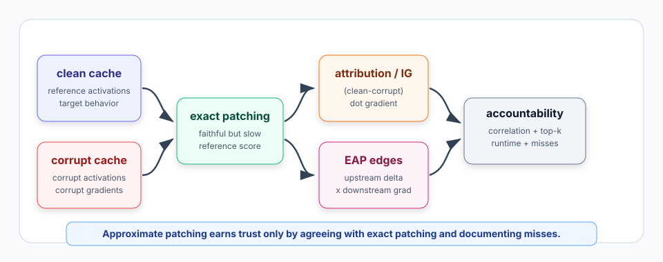
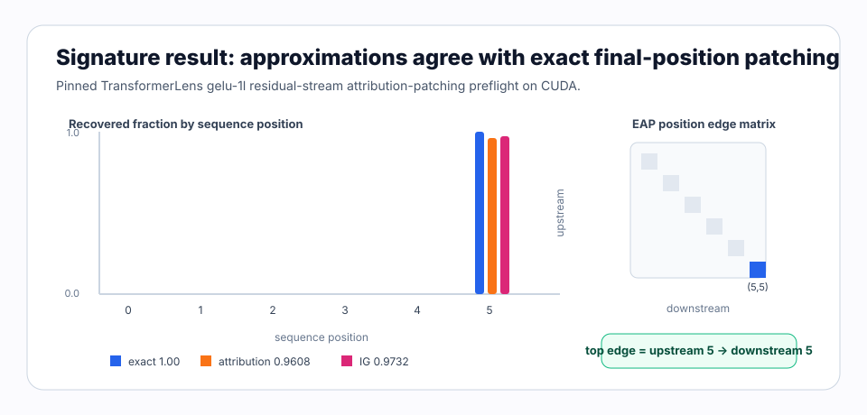

# [8.2] Attribution Patching and EAP

> **Notebooks: [exercises](../../exercises/part2_attribution_patching_eap/8.2_Attribution_Patching_and_EAP_exercises.ipynb) | [solutions](../../exercises/part2_attribution_patching_eap/8.2_Attribution_Patching_and_EAP_solutions.ipynb)**

> **Local-first extension.** Exact activation patching is the reference
> experiment, but it is slow when the component set grows. Attribution patching
> and Edge Attribution Patching (EAP) ask whether gradients can cheaply predict
> which patches are worth running. This section builds the approximation
> contracts with toy tensors, then compares exact patching, attribution
> patching, integrated gradients, and an EAP-style edge matrix on a pinned
> TransformerLens `gelu-1l` CUDA preflight.

```python
GT_TIER = "GT-1"
EXERCISE_ID = "8_2_attribution_patching_and_eap"
EXPECTED_RUNTIME = "25-45 minutes for exercises; about 1-2 minutes for the CUDA preflight"
REQUIRES_GPU = True  # CPU exercises; CUDA release verification is required
```

Please send any problems / bugs on the `#errata` channel in the [Slack group](https://info-arena.github.io/ARENA_img/slack.html), and ask any questions on the dedicated channels for this chapter of material.

If you want to change to dark mode, you can do this by clicking the three horizontal lines in the top-right, then navigating to Settings -> Theme.

Links to earlier chapters: [(0) Fundamentals](https://arena-chapter0-fundamentals.streamlit.app/), [(1) Transformer Interpretability](https://arena-chapter1-transformer-interp.streamlit.app/), [(2) RL](https://arena-chapter2-rl.streamlit.app/), [(3) LLM Evaluations](https://arena-chapter3-llm-evals.streamlit.app/), [(4) Alignment Science](https://arena-chapter4-alignment-science.streamlit.app/).


# Introduction

In Section 8.1, exact activation patching answered a clean causal question:
patch each clean residual-stream position into a corrupt run, then measure how
much the clean answer logit-diff returns. That experiment is faithful, but it
scales poorly. If you have thousands of heads, neurons, features, or edges,
running one forward pass per component becomes the bottleneck.

Attribution patching makes a first-order bet:

```text
exact patch effect ~= (clean activation - corrupt activation) dot corrupt gradient
```

The bet is useful only if it is held accountable against exact patching. This
section therefore keeps exact patching as the reference object. You will compute
gradient attribution scores, integrated-gradient scores, and EAP-style
upstream-by-downstream edge scores, then compare them with exact patch scores
using correlation, top-k overlap, runtime speedup, and false-negative
documentation.

The CUDA preflight reuses the safe 8.1 prompt pair:

```text
clean prompt:   "The cat sat on the"
corrupt prompt: "The bird flew over the"
hook:           blocks.0.hook_resid_post
target token:   " floor"
distractor:     " top"
```



The result to keep in mind is:

```text
exact patching tells you what happened;
attribution and EAP tell you what to inspect first.
```

This is **not** an IOI-scale EAP replication, a discovered circuit, or a
general proof of attribution-patching faithfulness. It is a mechanics preflight
which proves that the local approximation contracts can recover the same final
residual position as exact patching on one pinned real-model task.

## Content & Learning Objectives

### 1. First-order attribution patching

> ##### Learning Objectives
>
> * Compute `(clean - corrupt) * gradient` contributions.
> * Preserve the component axis while summing over all non-component axes.
> * Reject shape, axis, and non-finite tensor failures before they produce fake scores.

### 2. Integrated-gradient patching

> ##### Learning Objectives
>
> * Average gradients along a clean-corrupt interpolation path.
> * Distinguish integrated-gradient scores from exact patching.
> * Treat the path length as an approximation knob, not a correctness proof.

### 3. EAP-style edge scores

> ##### Learning Objectives
>
> * Build an upstream-by-downstream edge matrix from activation deltas and gradients.
> * Relate node patching to edge attribution and path-patching intuition.
> * Interpret a top edge as a candidate inspection target, not a complete causal graph.

### 4. Exact-vs-approx accountability

> ##### Learning Objectives
>
> * Compare approximate scores to exact scores with Pearson correlation and top-k overlap.
> * Report measured speedup separately from correctness.
> * Document exact-important false negatives instead of hiding them behind a high average metric.

# Setup Code

```python
import sys
from dataclasses import dataclass
from pathlib import Path

import torch as t

chapter = "chapter8_automated_circuits"
section = "part2_attribution_patching_eap"
root_dir = next(p for p in [Path.cwd(), *Path.cwd().parents] if (p / chapter).exists())
exercises_dir = root_dir / chapter / "exercises"
section_dir = exercises_dir / section

if str(root_dir) not in sys.path:
    sys.path.append(str(root_dir))
if str(exercises_dir) not in sys.path:
    sys.path.append(str(exercises_dir))

import part2_attribution_patching_eap.tests as tests
import part2_attribution_patching_eap.utils as utils
```

# Attribution Patching

### Exercise - implement `attribution_patch_scores`

> Difficulty: medium
> Importance: high
>
> You should spend 10 minutes on this exercise.

Attribution patching approximates the effect of swapping clean activations into
a corrupt run:

```text
patch effect ~= (clean activation - corrupt activation) dot corrupt gradient
```

The result should keep the component axis. For a tensor shaped
`[position, d_model]`, return one score per position. For a tensor shaped
`[batch, position, d_model]` with `component_dim=1`, return one score per
position after summing over batch and hidden dimensions.

```python
def attribution_patch_scores(
    clean_activations: t.Tensor,
    corrupt_activations: t.Tensor,
    corrupt_gradients: t.Tensor,
    *,
    component_dim: int = 0,
) -> t.Tensor:
    raise NotImplementedError()


tests.test_attribution_patch_scores_sums_non_component_dims(
    attribution_patch_scores,
)
tests.test_attribution_patch_scores_rejects_degenerate_inputs(
    attribution_patch_scores,
)
```

<details>
<summary>Expected output</summary>

```text
All tests in `test_attribution_patch_scores_sums_non_component_dims` passed!
All tests in `test_attribution_patch_scores_rejects_degenerate_inputs` passed!
```

The toy clean/corrupt/gradient tensors should produce attribution scores
`[1.0, 3.0]`.

</details>

<details>
<summary>Help - where does the formula come from?</summary>

Think of the corrupt activation as the point where you know the gradient of the
metric. The clean-corrupt activation delta is the direction you want to move.
Their dot product is the first-order Taylor estimate of how much the metric
would change if you moved from corrupt toward clean.

</details>

<details>
<summary>Common bugs</summary>

- Summing over the component dimension and returning a scalar.
- Using corrupt-minus-clean instead of clean-minus-corrupt.
- Letting gradients have a different shape from activations.
- Accepting NaNs or infinities as if they were interpretable scores.

</details>

<details>
<summary>Solution</summary>

```python
def attribution_patch_scores(
    clean_activations: t.Tensor,
    corrupt_activations: t.Tensor,
    corrupt_gradients: t.Tensor,
    *,
    component_dim: int = 0,
) -> t.Tensor:
    if clean_activations.shape != corrupt_activations.shape:
        raise ValueError("clean and corrupt activations must have matching shape.")
    if clean_activations.shape != corrupt_gradients.shape:
        raise ValueError("gradients must match activation shape.")
    if not 0 <= component_dim < clean_activations.ndim:
        raise ValueError("component_dim is out of range.")
    for name, tensor in {
        "clean_activations": clean_activations,
        "corrupt_activations": corrupt_activations,
        "corrupt_gradients": corrupt_gradients,
    }.items():
        if not t.isfinite(tensor).all():
            raise ValueError(f"{name} must be finite.")

    contribution = (clean_activations.float() - corrupt_activations.float())
    contribution = contribution * corrupt_gradients.float()
    reduce_dims = tuple(dim for dim in range(contribution.ndim) if dim != component_dim)
    return contribution.sum(dim=reduce_dims)
```

</details>

# Integrated Gradients

### Exercise - implement `integrated_gradient_patch_scores`

> Difficulty: medium
> Importance: high
>
> You should spend 10 minutes on this exercise.

Attribution patching uses the gradient at the corrupt point. Integrated-gradient
patching averages gradients along a path from corrupt activations to clean
activations. It is still an approximation, but it can be less brittle when the
metric is nonlinear along the path.

```python
def integrated_gradient_patch_scores(
    clean_activations: t.Tensor,
    corrupt_activations: t.Tensor,
    path_gradients: t.Tensor,
    *,
    component_dim: int = 0,
) -> t.Tensor:
    raise NotImplementedError()


tests.test_integrated_gradient_patch_scores_average_path_gradients(
    integrated_gradient_patch_scores,
)
tests.test_integrated_gradient_patch_scores_rejects_empty_or_nonfinite_paths(
    integrated_gradient_patch_scores,
)
```

<details>
<summary>Expected output</summary>

```text
All tests in `test_integrated_gradient_patch_scores_average_path_gradients` passed!
All tests in `test_integrated_gradient_patch_scores_rejects_empty_or_nonfinite_paths` passed!
```

The toy path gradients should also produce scores `[1.0, 3.0]`, because their
mean gradient equals the corrupt-run gradient in the fixture.

</details>

<details>
<summary>Help - what does the leading step dimension mean?</summary>

`path_gradients` has shape `[steps, *activation_shape]`. Each step is a
gradient evaluated at one interpolation point between corrupt and clean
activations. Average over `steps`, then use the same attribution-patching
formula.

</details>

<details>
<summary>Common bugs</summary>

- Forgetting that `path_gradients` has a leading step dimension.
- Summing path gradients instead of averaging them.
- Treating integrated gradients as exact patching.
- Allowing an empty path and getting all-NaN means.

</details>

<details>
<summary>Solution</summary>

```python
def integrated_gradient_patch_scores(
    clean_activations: t.Tensor,
    corrupt_activations: t.Tensor,
    path_gradients: t.Tensor,
    *,
    component_dim: int = 0,
) -> t.Tensor:
    if path_gradients.ndim != clean_activations.ndim + 1:
        raise ValueError("path_gradients must have shape (steps, *activation_shape).")
    if path_gradients.shape[0] == 0:
        raise ValueError("path_gradients must contain at least one step.")
    if path_gradients.shape[1:] != clean_activations.shape:
        raise ValueError("path gradient activation dimensions must match activations.")
    if not t.isfinite(path_gradients).all():
        raise ValueError("path_gradients must be finite.")
    mean_gradient = path_gradients.float().mean(dim=0)
    return attribution_patch_scores(
        clean_activations,
        corrupt_activations,
        mean_gradient,
        component_dim=component_dim,
    )
```

</details>

# Edge Attribution Patching

### Exercise - implement `edge_attribution_scores`

> Difficulty: medium
> Importance: high
>
> You should spend 10 minutes on this exercise.

Original ARENA path patching asks edge questions: which sender-to-receiver
paths carry the important information? EAP is a gradient approximation to that
edge question. With `(components, d_model)` matrices, pair each upstream
activation delta with each downstream gradient.

```python
def edge_attribution_scores(
    upstream_activation_delta: t.Tensor,
    downstream_gradients: t.Tensor,
) -> t.Tensor:
    raise NotImplementedError()


tests.test_edge_attribution_scores_forms_upstream_downstream_matrix(
    edge_attribution_scores,
)
tests.test_edge_attribution_scores_rejects_empty_or_nonfinite_inputs(
    edge_attribution_scores,
)
```

<details>
<summary>Expected output</summary>

```text
All tests in `test_edge_attribution_scores_forms_upstream_downstream_matrix` passed!
All tests in `test_edge_attribution_scores_rejects_empty_or_nonfinite_inputs` passed!
```

The toy upstream/downstream matrices should produce:

```text
[[3.0, 0.0],
 [0.0, 8.0]]
```

</details>

<details>
<summary>Help - node scores vs edge scores</summary>

Attribution patching gives one score per component. EAP gives one score per
ordered pair of components: upstream sender and downstream receiver. This is
closer to path patching, but it is still a gradient approximation rather than
an intervention.

</details>

<details>
<summary>Common bugs</summary>

- Elementwise multiplying only matching component ids, which loses cross edges.
- Forgetting the transpose on downstream gradients.
- Accepting mismatched or empty hidden dimensions.

</details>

<details>
<summary>Solution</summary>

```python
def edge_attribution_scores(
    upstream_activation_delta: t.Tensor,
    downstream_gradients: t.Tensor,
) -> t.Tensor:
    if upstream_activation_delta.ndim != 2 or downstream_gradients.ndim != 2:
        raise ValueError("inputs must have shape (components, d_model).")
    if upstream_activation_delta.shape[0] == 0 or downstream_gradients.shape[0] == 0:
        raise ValueError("inputs must contain at least one component.")
    if upstream_activation_delta.shape[-1] == 0:
        raise ValueError("hidden dimension must be nonempty.")
    if upstream_activation_delta.shape[-1] != downstream_gradients.shape[-1]:
        raise ValueError("upstream and downstream hidden dimensions must match.")
    if not t.isfinite(upstream_activation_delta).all():
        raise ValueError("upstream_activation_delta must be finite.")
    if not t.isfinite(downstream_gradients).all():
        raise ValueError("downstream_gradients must be finite.")
    return upstream_activation_delta.float() @ downstream_gradients.float().T
```

</details>

# Comparing Exact And Approximate Scores

### Exercise - implement correlation and top-k overlap reports

> Difficulty: medium
> Importance: high
>
> You should spend 10-15 minutes on this exercise.

Correlation checks global agreement with exact patching. Top-k overlap checks
whether the approximate method points you to inspect the same most important
components. You need both: a method can have high average agreement while still
missing the one component you cared about.

```python
@dataclass(frozen=True)
class ScoreCorrelationReport:
    correlation: float
    passes_threshold: bool


@dataclass(frozen=True)
class TopKOverlapReport:
    exact_top_indices: tuple[int, ...]
    approx_top_indices: tuple[int, ...]
    topk_overlap: float
    passes_threshold: bool


def score_correlation_report(
    exact_scores: t.Tensor,
    approx_scores: t.Tensor,
    *,
    min_correlation: float = 0.8,
) -> ScoreCorrelationReport:
    raise NotImplementedError()


def topk_overlap_report(
    exact_scores: t.Tensor,
    approx_scores: t.Tensor,
    *,
    top_k: int = 3,
    min_overlap: float = 0.5,
) -> TopKOverlapReport:
    raise NotImplementedError()


tests.test_exact_vs_approx_reports_measure_correlation_and_topk_overlap(
    score_correlation_report,
    topk_overlap_report,
)
tests.test_exact_vs_approx_reports_reject_bad_thresholds_and_scores(
    score_correlation_report,
    topk_overlap_report,
)
```

<details>
<summary>Expected output</summary>

```text
All tests in `test_exact_vs_approx_reports_measure_correlation_and_topk_overlap` passed!
All tests in `test_exact_vs_approx_reports_reject_bad_thresholds_and_scores` passed!
```

For exact scores `[0.1, 0.9, 0.8, 0.0]` and approximate scores
`[0.2, 0.85, 0.7, 0.1]`, correlation should be about `0.9966` and top-2
overlap should be `1.0`.

</details>

<details>
<summary>Help - why not just use correlation?</summary>

Correlation is useful for a broad sanity check, but circuit work often depends
on the top few components. Top-k overlap makes the "what would I inspect next?"
question explicit.

</details>

<details>
<summary>Common bugs</summary>

- Computing cosine similarity instead of Pearson correlation.
- Forgetting to flatten score tensors before comparison.
- Reporting top-k overlap without exposing the exact and approximate top-k
  indices.
- Allowing impossible thresholds like `min_overlap = 1.2`.

</details>

<details>
<summary>Solution</summary>

```python
def score_correlation_report(
    exact_scores: t.Tensor,
    approx_scores: t.Tensor,
    *,
    min_correlation: float = 0.8,
) -> ScoreCorrelationReport:
    exact = exact_scores.flatten().float()
    approx = approx_scores.flatten().float()
    if not -1.0 <= min_correlation <= 1.0:
        raise ValueError("min_correlation must be between -1 and 1.")
    if exact.shape != approx.shape:
        raise ValueError("exact_scores and approx_scores must have matching shape.")
    if exact.numel() < 2:
        raise ValueError("at least two scores are required for correlation.")
    if not t.isfinite(exact).all() or not t.isfinite(approx).all():
        raise ValueError("score tensors must be finite.")

    exact_centered = exact - exact.mean()
    approx_centered = approx - approx.mean()
    denominator = exact_centered.norm() * approx_centered.norm()
    if denominator.item() == 0:
        correlation = 0.0
    else:
        correlation = float((exact_centered @ approx_centered / denominator).item())
    return ScoreCorrelationReport(
        correlation=correlation,
        passes_threshold=correlation >= min_correlation,
    )


def topk_overlap_report(
    exact_scores: t.Tensor,
    approx_scores: t.Tensor,
    *,
    top_k: int = 3,
    min_overlap: float = 0.5,
) -> TopKOverlapReport:
    exact = exact_scores.flatten().float()
    approx = approx_scores.flatten().float()
    if exact.shape != approx.shape:
        raise ValueError("exact_scores and approx_scores must have matching shape.")
    if exact.numel() == 0:
        raise ValueError("score tensors must be nonempty.")
    if not t.isfinite(exact).all() or not t.isfinite(approx).all():
        raise ValueError("score tensors must be finite.")
    if top_k <= 0:
        raise ValueError("top_k must be positive.")
    if not 0.0 <= min_overlap <= 1.0:
        raise ValueError("min_overlap must be between 0 and 1.")

    k = min(top_k, exact.numel())
    exact_top = tuple(int(index) for index in exact.topk(k=k).indices.tolist())
    approx_top = tuple(int(index) for index in approx.topk(k=k).indices.tolist())
    overlap = len(set(exact_top) & set(approx_top)) / k
    return TopKOverlapReport(
        exact_top_indices=exact_top,
        approx_top_indices=approx_top,
        topk_overlap=overlap,
        passes_threshold=overlap >= min_overlap,
    )
```

</details>

# Runtime And False Negatives

### Exercise - implement runtime and false-negative reports

> Difficulty: medium
> Importance: high
>
> You should spend 10-15 minutes on this exercise.

Approximate patching earns its place with speed, but speed is not enough. It
must also document exact-important components that the approximation misses.
This is the part that prevents "fast and wrong" from looking like a success.

```python
@dataclass(frozen=True)
class RuntimeImprovementReport:
    exact_runtime_s: float
    approx_runtime_s: float
    speedup: float
    passes_speedup: bool


@dataclass(frozen=True)
class FalseNegativeReport:
    false_negative_indices: tuple[int, ...]
    num_false_negatives: int
    documented: bool


def runtime_improvement_report(
    *,
    exact_runtime_s: float,
    approx_runtime_s: float,
    min_speedup: float = 2.0,
) -> RuntimeImprovementReport:
    raise NotImplementedError()


def false_negative_report(
    exact_scores: t.Tensor,
    approx_scores: t.Tensor,
    *,
    exact_threshold: float,
    approx_threshold: float,
    documentation: dict[int, str] | None = None,
) -> FalseNegativeReport:
    raise NotImplementedError()


tests.test_runtime_and_false_negative_reports_enforce_accountability(
    runtime_improvement_report,
    false_negative_report,
)
tests.test_runtime_and_false_negative_reports_reject_nonfinite_inputs(
    runtime_improvement_report,
    false_negative_report,
)
```

<details>
<summary>Expected output</summary>

```text
All tests in `test_runtime_and_false_negative_reports_enforce_accountability` passed!
All tests in `test_runtime_and_false_negative_reports_reject_nonfinite_inputs` passed!
```

The toy runtime report should show `speedup = 5.0`. The toy false-negative
report should identify index `1` and mark it documented only if the note is
nonempty.

</details>

<details>
<summary>Help - false negatives are not optional bookkeeping</summary>

If exact patching says a component matters and the approximation misses it,
that is the most important line in the report. A good attribution workflow
should make misses visible so students know when to fall back to exact patching.

</details>

<details>
<summary>Common bugs</summary>

- Reporting `approx / exact` instead of `exact / approx` as the speedup.
- Accepting zero, negative, NaN, or infinite runtimes.
- Counting all low approximate scores as false negatives, instead of only
  exact-important components.
- Marking false negatives documented when a note is empty.

</details>

<details>
<summary>Solution</summary>

```python
def runtime_improvement_report(
    *,
    exact_runtime_s: float,
    approx_runtime_s: float,
    min_speedup: float = 2.0,
) -> RuntimeImprovementReport:
    for name, value in {
        "exact_runtime_s": exact_runtime_s,
        "approx_runtime_s": approx_runtime_s,
        "min_speedup": min_speedup,
    }.items():
        if not t.isfinite(t.tensor(value)).item():
            raise ValueError(f"{name} must be finite.")
    if exact_runtime_s <= 0 or approx_runtime_s <= 0:
        raise ValueError("runtimes must be positive.")
    if min_speedup <= 0:
        raise ValueError("min_speedup must be positive.")
    speedup = exact_runtime_s / approx_runtime_s
    return RuntimeImprovementReport(
        exact_runtime_s=exact_runtime_s,
        approx_runtime_s=approx_runtime_s,
        speedup=speedup,
        passes_speedup=speedup >= min_speedup,
    )


def false_negative_report(
    exact_scores: t.Tensor,
    approx_scores: t.Tensor,
    *,
    exact_threshold: float,
    approx_threshold: float,
    documentation: dict[int, str] | None = None,
) -> FalseNegativeReport:
    exact = exact_scores.flatten().float()
    approx = approx_scores.flatten().float()
    if exact.shape != approx.shape:
        raise ValueError("exact_scores and approx_scores must have matching shape.")
    if not t.isfinite(exact).all() or not t.isfinite(approx).all():
        raise ValueError("score tensors must be finite.")
    if not t.isfinite(t.tensor(exact_threshold)).item():
        raise ValueError("exact_threshold must be finite.")
    if not t.isfinite(t.tensor(approx_threshold)).item():
        raise ValueError("approx_threshold must be finite.")
    important = exact >= exact_threshold
    missed = approx < approx_threshold
    indices = tuple(int(index.item()) for index in (important & missed).nonzero().flatten())
    documentation = documentation or {}
    documented = all(bool(documentation.get(index, "").strip()) for index in indices)
    return FalseNegativeReport(
        false_negative_indices=indices,
        num_false_negatives=len(indices),
        documented=documented,
    )
```

</details>

# Notebook Contract

The local helpers should compose into one CPU-only smoke contract before the
real model run.

```python
def run_smoke_test(cpu: bool = True) -> dict:
    _ = cpu
    clean = t.tensor([[2.0, 0.0], [0.0, 3.0]])
    corrupt = t.zeros_like(clean)
    gradients = t.tensor([[0.5, 0.5], [1.0, 1.0]])
    path_gradients = t.tensor(
        [
            [[0.25, 0.25], [0.5, 0.5]],
            [[0.75, 0.75], [1.5, 1.5]],
        ]
    )
    exact = t.tensor([0.1, 0.9, 0.8, 0.0])
    approx = t.tensor([0.2, 0.85, 0.7, 0.1])
    return {
        "attribution_scores": attribution_patch_scores(clean, corrupt, gradients).tolist(),
        "integrated_gradients": integrated_gradient_patch_scores(
            clean,
            corrupt,
            path_gradients,
        ).tolist(),
        "edge_scores": edge_attribution_scores(
            t.tensor([[1.0, 0.0], [0.0, 2.0]]),
            t.tensor([[3.0, 0.0], [0.0, 4.0]]),
        ).tolist(),
        "correlation": score_correlation_report(
            exact,
            approx,
            min_correlation=0.95,
        ).__dict__,
        "topk_overlap": topk_overlap_report(
            exact,
            approx,
            top_k=2,
            min_overlap=1.0,
        ).__dict__,
        "runtime": runtime_improvement_report(
            exact_runtime_s=10.0,
            approx_runtime_s=2.0,
            min_speedup=4.0,
        ).__dict__,
        "false_negative": false_negative_report(
            t.tensor([0.1, 0.9, 0.8]),
            t.tensor([0.1, 0.2, 0.7]),
            exact_threshold=0.75,
            approx_threshold=0.5,
            documentation={1: "Approximation misses a nonlinear interaction."},
        ).__dict__,
    }


tests.test_notebook_contract(run_smoke_test)
```

<details>
<summary>Expected output</summary>

```text
All tests in `test_notebook_contract` passed!
```

The combined contract should report attribution and integrated-gradient scores
`[1.0, 3.0]`, edge scores `[[3.0, 0.0], [0.0, 8.0]]`, correlation about
`0.9966`, top-k overlap `1.0`, runtime speedup `5.0`, and one documented false
negative at index `1`.

</details>

<details>
<summary>Help - reading the combined contract</summary>

This smoke report is deliberately CPU-only. It proves that the exact-vs-approx
objects exist and compose correctly. It is not a substitute for the CUDA report,
which checks the same ideas on real activations and gradients.

</details>

<details>
<summary>Common bugs</summary>

- Returning only scores without comparison reports.
- Omitting false-negative documentation because the happy path has high
  correlation.
- Forgetting to include the EAP edge matrix in the combined report.

</details>

# Signature Result

The accepted result for this section is a **scoped exact-vs-approx patching
preflight**. Exact residual-stream patching, corrupt-run attribution patching,
integrated-gradient patching, and the EAP position-edge matrix all point to the
final residual position on the same pinned `gelu-1l` prompt pair.



| metric | accepted value | why it matters |
|---|---:|---|
| exact patch scores | `[0, 0, 0, 0, 0, 1.0]` | exact patching remains the reference |
| attribution scores | `[0, 0, 0, 0, 0, 0.9608]` | corrupt-run gradient approximation finds the same position |
| IG scores | `[0, 0, 0, 0, 0, 0.9732]` | path-gradient approximation also finds the same position |
| exact / attribution / IG best position | `5 / 5 / 5` | all methods prioritize the final residual slice |
| exact-attribution correlation | `1.0` | global score ordering agrees in this preflight |
| exact-IG correlation | `1.0000001` | IG agrees with exact patching here |
| top-1 overlap | `1.0 / 1.0` | the inspection target is the same |
| EAP top edge | `5 -> 5` | edge matrix localizes the final-position self edge |
| EAP top edge abs score | `6.0313` | the top edge has a large signed-gradient magnitude |
| non-final gradient norm max | `0.0` | wrong positions have zero gradient under this final-token metric |
| final gradient norm | `3.2388` | the final residual slice carries the gradient signal |
| peak VRAM | `< 0.50 GB` | the local preflight fits comfortably on the 24 GB machine |

<details>
<summary>Interpreting the signature result</summary>

Exact patching says only position `5` recovers the clean behavior. Attribution
patching and IG do not exactly equal `1.0`, because they are gradient
approximations, but they still rank the same final position first. The EAP
matrix also places its top edge at `(5, 5)`. This is useful mechanics evidence,
not a broad claim that EAP will always match exact patching.

</details>

## Full CUDA Path

The local graded experiment replaces toy tensors with a pinned real-model
preflight:

1. Load `NeelNanda/GELU_1L512W_C4_Code` through TransformerLens at revision
   `bddc0e332f0ae84279e6a6a45d91b314899e1603`.
2. Load tokenizer `NeelNanda/gpt-neox-tokenizer-digits` at revision
   `0f6671571a20be9756b9991d978047c03b75e749`.
3. Reuse the Section 8.1 clean/corrupt prompt pair.
4. Cache `blocks.0.hook_resid_post` on clean and corrupt runs.
5. Compute exact patch scores over sequence positions.
6. Run one corrupt forward/backward pass to collect gradients.
7. Compute attribution patch scores for every position.
8. Compute integrated-gradient scores along a clean-corrupt interpolation path.
9. Compute an EAP-style upstream-by-downstream position edge matrix.
10. Compare exact and approximate scores by correlation and top-k overlap.

Expected output from the committed CUDA report includes:

```text
preflight_passed: true
exact_best_position: 5
attribution_best_position: 5
ig_best_position: 5
exact_final_recovery: 1.0
attribution_final_recovery: 0.9608
ig_final_recovery: 0.9732
exact_attribution_top1_overlap: 1.0
exact_ig_top1_overlap: 1.0
eap_top_edge_upstream_position: 5
eap_top_edge_downstream_position: 5
within_vram_budget: true
```

The report lives at
`chapter8_automated_circuits/exercises/part2_attribution_patching_eap/verification_report.json`.
After running the local CUDA path, inspect it directly:

```python
import json

report_path = section_dir / "verification_report.json"
report = json.loads(report_path.read_text())
gpu = report["metrics"]["gpu_test"]
{
    "accepted": report["accepted"],
    "exact": gpu["exact_patch_scores_by_position"],
    "attribution": gpu["attribution_scores_by_position"],
    "ig": gpu["ig_scores_by_position"],
    "eap_top_edge": (
        gpu["eap_top_edge_upstream_position"],
        gpu["eap_top_edge_downstream_position"],
    ),
}
```

<details>
<summary>Expected output</summary>

```text
{
    "accepted": True,
    "exact": [0.0, 0.0, 0.0, 0.0, 0.0, 1.0],
    "attribution": [0.0, 0.0, 0.0, 0.0, 0.0, 0.9608...],
    "ig": [0.0, 0.0, 0.0, 0.0, 0.0, 0.9732...],
    "eap_top_edge": (5, 5),
}
```

</details>

<details>
<summary>Question - when should exact patching still win?</summary>

Use exact patching when the approximation points to an important claim, when
the task has strong nonlinear interactions, when false negatives appear, or
when you are about to publish a causal statement. Use attribution and EAP to
triage the component set and prioritize expensive interventions.

</details>

# Limitations

- The real-model result is one safe prompt pair on one small public
  TransformerLens checkpoint.
- The EAP matrix is a position-by-position residual-stream edge matrix at a
  single hook, not a layer/head/feature graph.
- The non-final gradient control is expected under this final-token metric; it
  is useful mechanics evidence but not a broad negative-control suite.
- Runtime speedup in the toy contract is illustrative; the CUDA report focuses
  on agreement and VRAM rather than benchmarking a large component set.
- Exact patching remains the causal reference whenever the approximation is
  uncertain or consequential.

# Further Research

- Repeat exact-vs-approx comparisons across multiple prompt templates and tasks.
- Move from sequence-position residual slices to blocks, heads, MLP outputs, and
  SAE features.
- Compare EAP edges against true path-patching interventions on a small circuit.
- Add false-negative case studies where high global correlation still misses an
  exact-important component.
- Use the same accountability contract before ACDC and sparse feature circuit
  tracing in later Chapter 8 sections.

# Consolidating Understanding

Exact patching is a causal intervention. Attribution patching, integrated
gradients, and EAP are prioritization tools. The practical workflow is:

1. Run exact patching on a small reference case.
2. Compute approximate scores from activation deltas and gradients.
3. Check correlation and top-k overlap against exact scores.
4. Document false negatives and fall back to exact patching when needed.
5. Only then use approximations to scale the search.

For the accepted 8.2 CUDA preflight, the approximations do what they should:
they recover the same final residual position as exact patching while making
their claim boundary explicit.
