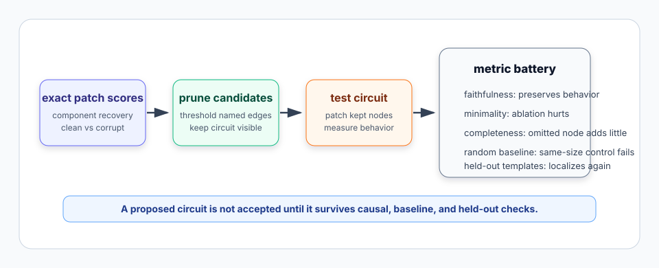
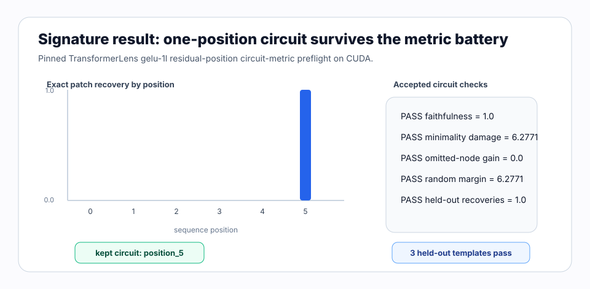

# [8.3] ACDC and Circuit Metrics

> **Notebooks: [exercises](../../exercises/part3_acdc_circuit_metrics/8.3_ACDC_and_Circuit_Metrics_exercises.ipynb) | [solutions](../../exercises/part3_acdc_circuit_metrics/8.3_ACDC_and_Circuit_Metrics_solutions.ipynb)**

> **Local-first extension.** Section 8.1 gave us exact activation patching.
> Section 8.2 asked when gradient approximations can triage exact patches.
> This section asks the next question: if an automated method proposes a
> circuit, what evidence is needed before we trust it?

```python
GT_TIER = "GT-1"
EXERCISE_ID = "8_3_acdc_and_circuit_metrics"
EXPECTED_RUNTIME = "seconds on toy contract; minutes on local real-model path"
REQUIRES_GPU = True  # CPU exercises; CUDA release verification is required
```

Please send any problems / bugs on the `#errata` channel in the [Slack group](https://info-arena.github.io/ARENA_img/slack.html), and ask any questions on the dedicated channels for this chapter of material.

If you want to change to dark mode, you can do this by clicking the three horizontal lines in the top-right, then navigating to Settings -> Theme.

Links to earlier chapters: [(0) Fundamentals](https://arena-chapter0-fundamentals.streamlit.app/), [(1) Transformer Interpretability](https://arena-chapter1-transformer-interp.streamlit.app/), [(2) RL](https://arena-chapter2-rl.streamlit.app/), [(3) LLM Evaluations](https://arena-chapter3-llm-evals.streamlit.app/), [(4) Alignment Science](https://arena-chapter4-alignment-science.streamlit.app/).


## Core Question

When an automated circuit search keeps an edge, what evidence says this is a real circuit rather than a thresholded metric artifact?

Original ARENA's IOI chapter builds a careful ladder:

```text
task metric -> exploratory attribution -> exact intervention -> path/circuit checks
```

The important move is not "draw a circuit and call it done." A circuit claim
has to survive interventions and baselines. A bloated circuit can be faithful
but not minimal. A tiny circuit can be minimal but incomplete. A method can
look good on one prompt and fail on a held-out template. A random same-size
circuit can accidentally preserve behavior if the metric is too forgiving.

ACDC-style workflows automate part of this search: start with candidate nodes
or edges, remove low-scoring candidates, then test the remaining circuit. This
notebook keeps the search object intentionally small. You will implement the
metric battery that makes automated circuit discovery falsifiable:

```text
exact patch scores -> threshold prune -> kept circuit -> faithfulness
                  -> minimality -> completeness -> random baseline -> held-out templates
```



The accepted CUDA result is deliberately scoped. It uses exact residual-stream
patch scores from a pinned TransformerLens `gelu-1l` model to prune a
position-level circuit. It is a mechanics preflight for circuit metrics, not a
full ACDC IOI replication, a greater-than circuit discovery result, or a
layer/head/feature circuit.

## Learning Objectives

### 1. Patch-recovery scores

> ##### Learning Objectives
>
> * Define a signed answer logit-diff metric.
> * Normalize patched metrics between corrupt and clean behavior.
> * Reject degenerate or non-finite metric inputs before they produce fake circuit scores.

### 2. ACDC-style pruning

> ##### Learning Objectives
>
> * Keep candidate edge names attached to their scores.
> * Use a threshold to propose a small circuit.
> * Treat pruning as a proposal step, not as proof.

### 3. Circuit metrics

> ##### Learning Objectives
>
> * Distinguish faithfulness, minimality, and completeness.
> * Compare against a same-size random circuit.
> * Track held-out template behavior by worst case, not only average.

### 4. Exact-vs-approximate circuit comparison

> ##### Learning Objectives
>
> * Use exact patching as the reference top-k circuit.
> * Compare approximate methods by top-k overlap and score correlation.
> * Report method failures instead of hiding them behind a best-method summary.

# Setup Code

```python
import json
import sys
from collections.abc import Mapping
from dataclasses import dataclass
from pathlib import Path

import torch as t

chapter = "chapter8_automated_circuits"
section = "part3_acdc_circuit_metrics"
root_dir = next(p for p in [Path.cwd(), *Path.cwd().parents] if (p / chapter).exists())
exercises_dir = root_dir / chapter / "exercises"
section_dir = exercises_dir / section

if str(root_dir) not in sys.path:
    sys.path.append(str(root_dir))
if str(exercises_dir) not in sys.path:
    sys.path.append(str(exercises_dir))

import part3_acdc_circuit_metrics.tests as tests
import part3_acdc_circuit_metrics.utils as utils
```

We will use report dataclasses instead of bare booleans, because a circuit
quality check should expose what passed and what failed.

```python
@dataclass(frozen=True)
class ActivationPatchingSweep:
    patch_scores: t.Tensor
    best_index: int
    best_score: float


@dataclass(frozen=True)
class ACDCPruningReport:
    kept_edges: tuple[str, ...]
    removed_edges: tuple[str, ...]
    threshold: float
    num_kept: int


@dataclass(frozen=True)
class CircuitFaithfulnessReport:
    full_metric: float
    corrupt_metric: float
    circuit_metric: float
    preserved_fraction: float
    passes_faithfulness: bool


@dataclass(frozen=True)
class CircuitMinimalityReport:
    circuit_metric: float
    ablated_metric: float
    metric_damage: float
    passes_minimality: bool


@dataclass(frozen=True)
class CircuitCompletenessReport:
    circuit_metric: float
    expanded_metric: float
    omitted_node_gain: float
    passes_completeness: bool


@dataclass(frozen=True)
class RandomCircuitBaselineReport:
    circuit_metric: float
    random_metric: float
    margin: float
    circuit_beats_random: bool


@dataclass(frozen=True)
class OODTemplateReport:
    per_template_accuracy: dict[int, float]
    worst_template_accuracy: float
    passes_ood: bool


@dataclass(frozen=True)
class CircuitMethodComparisonReport:
    exact_top_edges: tuple[str, ...]
    method_top_edges: dict[str, tuple[str, ...]]
    topk_overlap: dict[str, float]
    score_correlations: dict[str, float]
    circuit_sizes: dict[str, int]
    best_matching_method: str
    passes_comparison: bool
```

# Patch-Recovery Scores

### Exercise - implement patching metric helpers

> Difficulty: medium
> Importance: high
>
> You should spend 10 minutes on this exercise.

The metric defines the behavioral direction. Here we use the same style of
signed answer logit difference as original ARENA:

```text
positive answer logit - negative answer logit
```

Then we normalize patched metrics between corrupt and clean behavior:

```text
recovery = (patched_metric - corrupt_metric) / (clean_metric - corrupt_metric)
```

```python
def answer_logit_diff(
    logits: t.Tensor,
    *,
    positive_token_id: int,
    negative_token_id: int,
) -> float:
    raise NotImplementedError()


def activation_patching_sweep(
    *,
    clean_metric: float,
    corrupt_metric: float,
    patched_metrics: t.Tensor,
) -> ActivationPatchingSweep:
    raise NotImplementedError()


tests.test_position_patching_helpers_score_recovery(
    answer_logit_diff,
    activation_patching_sweep,
)
tests.test_position_patching_helpers_reject_degenerate_inputs(
    answer_logit_diff,
    activation_patching_sweep,
)
```

<details>
<summary>Expected output</summary>

```text
All tests in `test_position_patching_helpers_score_recovery` passed!
All tests in `test_position_patching_helpers_reject_degenerate_inputs` passed!
```

The toy logits should produce logit diff `4.0`; patched metrics
`[-1.0, 1.0, 3.0]` with clean metric `3.0` and corrupt metric `-1.0`
should produce recovery scores `[0.0, 0.5, 1.0]`.

</details>

<details>
<summary>Help - why normalize?</summary>

Raw logit differences vary by prompt and model. Normalized recovery makes the
question comparable: `0` means corrupt behavior, `1` means clean behavior, and
values between them show partial recovery.

</details>

<details>
<summary>Common bugs</summary>

- Returning per-example logit differences instead of one scalar mean.
- Swapping the positive and negative token ids.
- Returning raw patched metrics rather than normalized recovery.
- Accepting NaNs or infinities as valid circuit evidence.

</details>

<details>
<summary>Solution</summary>

```python
def answer_logit_diff(logits, *, positive_token_id, negative_token_id):
    if logits.ndim < 1:
        raise ValueError("logits must have a vocabulary dimension.")
    vocab_size = logits.shape[-1]
    if vocab_size == 0:
        raise ValueError("logits vocabulary dimension must be nonempty.")
    if positive_token_id == negative_token_id:
        raise ValueError("positive_token_id and negative_token_id must differ.")
    if not 0 <= positive_token_id < vocab_size:
        raise ValueError("positive_token_id is out of range.")
    if not 0 <= negative_token_id < vocab_size:
        raise ValueError("negative_token_id is out of range.")
    if not t.isfinite(logits).all():
        raise ValueError("logits must be finite.")
    return (logits[..., positive_token_id] - logits[..., negative_token_id]).float().mean().item()


def activation_patching_sweep(*, clean_metric, corrupt_metric, patched_metrics):
    if not t.isfinite(t.tensor(clean_metric)).item():
        raise ValueError("clean_metric must be finite.")
    if not t.isfinite(t.tensor(corrupt_metric)).item():
        raise ValueError("corrupt_metric must be finite.")
    if patched_metrics.ndim != 1 or patched_metrics.numel() == 0:
        raise ValueError("patched_metrics must be a nonempty rank-1 tensor.")
    if not t.isfinite(patched_metrics).all():
        raise ValueError("patched_metrics must be finite.")
    denominator = clean_metric - corrupt_metric
    if denominator == 0:
        raise ValueError("clean_metric and corrupt_metric must differ.")
    patch_scores = (patched_metrics.float() - corrupt_metric) / denominator
    best_index = int(patch_scores.argmax().item())
    return ActivationPatchingSweep(
        patch_scores=patch_scores,
        best_index=best_index,
        best_score=float(patch_scores[best_index].item()),
    )
```

</details>

# ACDC-Style Pruning

### Exercise - keep high-scoring candidate edges

> Difficulty: easy
> Importance: high
>
> You should spend 5 minutes on this exercise.

ACDC-style pruning starts with candidate edges or nodes and removes low-scoring
candidates. In this GT-1 section, the candidates are named residual positions.
The important course habit is that the report keeps names visible: a circuit
without named components is hard to inspect or falsify.

```python
def acdc_pruning_report(
    edge_scores: t.Tensor,
    edge_names: list[str],
    *,
    threshold: float,
) -> ACDCPruningReport:
    raise NotImplementedError()


tests.test_acdc_pruning_report_keeps_threshold_edges(acdc_pruning_report)
tests.test_acdc_pruning_report_rejects_bad_scores_or_names(acdc_pruning_report)
```

<details>
<summary>Expected output</summary>

```text
All tests in `test_acdc_pruning_report_keeps_threshold_edges` passed!
All tests in `test_acdc_pruning_report_rejects_bad_scores_or_names` passed!
```

For scores `[0.9, 0.5, 0.2]`, names `["name-mover", "backup", "negative"]`,
and threshold `0.5`, the kept edges should be `("name-mover", "backup")`.

</details>

<details>
<summary>Help - pruning is only a proposal</summary>

Pruning says which components to test next. It does not prove the circuit is
faithful, minimal, complete, or robust. That is why the remaining exercises are
metric checks rather than more pruning code.

</details>

<details>
<summary>Common bugs</summary>

- Treating the threshold as strict `>` instead of inclusive `>=`.
- Returning only indices and losing the component names.
- Letting score/name count mismatches silently drop candidates.

</details>

<details>
<summary>Solution</summary>

```python
def acdc_pruning_report(edge_scores, edge_names, *, threshold):
    scores = edge_scores.flatten().float()
    if scores.numel() == 0:
        raise ValueError("edge_scores must be nonempty.")
    if scores.numel() != len(edge_names):
        raise ValueError("edge_scores and edge_names must align.")
    if any(not name for name in edge_names):
        raise ValueError("edge_names must be nonempty strings.")
    if not t.isfinite(scores).all() or not t.isfinite(t.tensor(threshold)).item():
        raise ValueError("scores and threshold must be finite.")
    kept, removed = [], []
    for score, name in zip(scores.tolist(), edge_names, strict=True):
        (kept if score >= threshold else removed).append(name)
    return ACDCPruningReport(tuple(kept), tuple(removed), threshold, len(kept))
```

</details>

# Faithfulness, Minimality, And Completeness

### Exercise - separate three circuit failure modes

> Difficulty: medium
> Importance: high
>
> You should spend 15 minutes on this exercise.

Faithfulness, minimality, and completeness answer different questions:

| metric | question | failure mode |
|---|---|---|
| faithfulness | does the circuit preserve the behavior? | circuit too weak |
| minimality | does removing circuit parts hurt? | circuit too bloated |
| completeness | does adding omitted parts help little? | circuit missing something |

```python
def circuit_faithfulness_report(
    *,
    full_metric: float,
    corrupt_metric: float,
    circuit_metric: float,
    min_preserved_fraction: float = 0.75,
) -> CircuitFaithfulnessReport:
    raise NotImplementedError()


def circuit_minimality_report(
    *,
    circuit_metric: float,
    ablated_metric: float,
    min_metric_damage: float = 0.5,
) -> CircuitMinimalityReport:
    raise NotImplementedError()


def circuit_completeness_report(
    *,
    circuit_metric: float,
    expanded_metric: float,
    max_omitted_node_gain: float = 0.2,
) -> CircuitCompletenessReport:
    raise NotImplementedError()


tests.test_faithfulness_report_normalizes_clean_corrupt_gap(circuit_faithfulness_report)
tests.test_minimality_and_completeness_reports_distinguish_failure_modes(
    circuit_minimality_report,
    circuit_completeness_report,
)
tests.test_circuit_metric_reports_reject_invalid_thresholds(
    circuit_faithfulness_report,
    circuit_minimality_report,
    circuit_completeness_report,
    random_circuit_baseline_report,
)
```

<details>
<summary>Expected output</summary>

```text
All tests in `test_faithfulness_report_normalizes_clean_corrupt_gap` passed!
All tests in `test_minimality_and_completeness_reports_distinguish_failure_modes` passed!
All tests in `test_circuit_metric_reports_reject_invalid_thresholds` passed!
```

The toy faithful circuit should preserve `0.8` of the clean-corrupt gap.
The toy minimality damage should be `1.7`. The toy omitted-node gain should be
`0.15`.

</details>

<details>
<summary>Help - why keep the reports separate?</summary>

A circuit with every component in the model can be faithful but not minimal.
A one-component circuit can be minimal but incomplete. Keeping the reports
separate forces you to name the failure mode instead of hiding it behind a
single "circuit good" boolean.

</details>

<details>
<summary>Common bugs</summary>

- Dividing faithfulness by the clean metric rather than the clean-corrupt gap.
- Reversing minimality damage (`ablated - circuit`).
- Treating omitted-node gain as something to maximize.

</details>

<details>
<summary>Solution</summary>

```python
def circuit_faithfulness_report(*, full_metric, corrupt_metric, circuit_metric, min_preserved_fraction=0.75):
    denominator = full_metric - corrupt_metric
    if denominator == 0:
        raise ValueError("full_metric and corrupt_metric must differ.")
    preserved_fraction = (circuit_metric - corrupt_metric) / denominator
    return CircuitFaithfulnessReport(
        full_metric,
        corrupt_metric,
        circuit_metric,
        preserved_fraction,
        preserved_fraction >= min_preserved_fraction,
    )


def circuit_minimality_report(*, circuit_metric, ablated_metric, min_metric_damage=0.5):
    metric_damage = circuit_metric - ablated_metric
    return CircuitMinimalityReport(
        circuit_metric,
        ablated_metric,
        metric_damage,
        metric_damage >= min_metric_damage,
    )


def circuit_completeness_report(*, circuit_metric, expanded_metric, max_omitted_node_gain=0.2):
    omitted_node_gain = expanded_metric - circuit_metric
    return CircuitCompletenessReport(
        circuit_metric,
        expanded_metric,
        omitted_node_gain,
        omitted_node_gain <= max_omitted_node_gain,
    )
```

</details>

# Random And Held-Out Controls

### Exercise - test baselines and held-out templates

> Difficulty: medium
> Importance: high
>
> You should spend 15 minutes on this exercise.

A discovered circuit should beat a same-size random circuit. It should also
work on held-out prompt templates, not only the prompt that selected it.

```python
def random_circuit_baseline_report(
    *,
    circuit_metric: float,
    random_metric: float,
    min_margin: float = 0.5,
) -> RandomCircuitBaselineReport:
    raise NotImplementedError()


def ood_template_report(
    logits: t.Tensor,
    answer_ids: t.Tensor,
    template_ids: t.Tensor,
    *,
    min_accuracy: float = 0.75,
) -> OODTemplateReport:
    raise NotImplementedError()


tests.test_random_circuit_baseline_report_requires_margin(random_circuit_baseline_report)
tests.test_ood_template_report_tracks_worst_template(ood_template_report)
tests.test_ood_template_report_rejects_degenerate_inputs(ood_template_report)
```

<details>
<summary>Expected output</summary>

```text
All tests in `test_random_circuit_baseline_report_requires_margin` passed!
All tests in `test_ood_template_report_tracks_worst_template` passed!
All tests in `test_ood_template_report_rejects_degenerate_inputs` passed!
```

The toy random-baseline margin should be `1.4`. The failing toy OOD report
should expose per-template accuracy `{0: 1.0, 1: 0.5}` and fail because the
worst template is below threshold.

</details>

<details>
<summary>Help - why worst-template accuracy?</summary>

Average accuracy can hide one broken prompt family. Original circuit work often
uses prompt templates to separate a real mechanism from a brittle prompt
artifact. The worst template is the first place to look for brittleness.

</details>

<details>
<summary>Common bugs</summary>

- Comparing the discovered circuit against a random circuit of a different size.
- Reporting only mean OOD accuracy.
- Accepting answer ids that are outside the vocabulary dimension.

</details>

<details>
<summary>Solution</summary>

```python
def random_circuit_baseline_report(*, circuit_metric, random_metric, min_margin=0.5):
    margin = circuit_metric - random_metric
    return RandomCircuitBaselineReport(
        circuit_metric,
        random_metric,
        margin,
        margin >= min_margin,
    )


def ood_template_report(logits, answer_ids, template_ids, *, min_accuracy=0.75):
    if logits.shape[:-1] != answer_ids.shape:
        raise ValueError("answer_ids must match logits leading dimensions.")
    if answer_ids.shape != template_ids.shape:
        raise ValueError("answer_ids and template_ids must match.")
    predictions = logits.argmax(dim=-1)
    per_template = {}
    for template_id in template_ids.unique(sorted=True):
        mask = template_ids.eq(template_id)
        accuracy = predictions[mask].eq(answer_ids[mask]).float().mean().item()
        per_template[int(template_id.item())] = accuracy
    worst_accuracy = min(per_template.values()) if per_template else 0.0
    return OODTemplateReport(per_template, worst_accuracy, worst_accuracy >= min_accuracy)
```

</details>

# Exact-vs-Approximate Circuit Comparison

### Exercise - compare proposed circuit methods against exact patching

> Difficulty: medium
> Importance: high
>
> You should spend 10 minutes on this exercise.

ACDC, EAP, EAP-IG, and other automated discovery methods should be compared
against an exact intervention reference whenever that reference is available.
This report asks: did the approximate method pick the same top-k circuit, and
do its scores rank candidates similarly?

```python
def circuit_method_comparison_report(
    exact_scores: t.Tensor,
    method_scores: Mapping[str, t.Tensor],
    edge_names: list[str],
    *,
    top_k: int,
    min_topk_overlap: float = 0.5,
    min_score_correlation: float = 0.5,
) -> CircuitMethodComparisonReport:
    raise NotImplementedError()


tests.test_circuit_method_comparison_report_matches_exact_patching(
    circuit_method_comparison_report,
)
tests.test_circuit_method_comparison_report_rejects_bad_inputs(
    circuit_method_comparison_report,
)
```

<details>
<summary>Expected output</summary>

```text
All tests in `test_circuit_method_comparison_report_matches_exact_patching` passed!
All tests in `test_circuit_method_comparison_report_rejects_bad_inputs` passed!
```

In the toy example, `eap_ig` should recover both exact top-2 edges, while
`weak_eap` should recover none of them and make the comparison report fail.

</details>

<details>
<summary>Help - why require every method to pass?</summary>

If a report compares exact patching to several automated methods, a single bad
method should remain visible. The best method may be useful, but the report
should not let it hide a weak method's failure.

</details>

<details>
<summary>Common bugs</summary>

- Reporting only the best matching method.
- Computing overlap on indices after dropping edge names.
- Letting impossible thresholds like `min_topk_overlap = 1.2` pass.

</details>

<details>
<summary>Solution</summary>

```python
def circuit_method_comparison_report(
    exact_scores,
    method_scores,
    edge_names,
    *,
    top_k,
    min_topk_overlap=0.5,
    min_score_correlation=0.5,
):
    if top_k <= 0:
        raise ValueError("top_k must be positive.")
    if not method_scores:
        raise ValueError("method_scores must contain at least one method.")
    exact = exact_scores.flatten().float()
    exact_top_indices = exact.topk(k=min(top_k, exact.numel())).indices.tolist()
    exact_top_edges = tuple(edge_names[int(index)] for index in exact_top_indices)
    exact_top_set = set(exact_top_edges)
    method_top_edges, topk_overlap, score_correlations = {}, {}, {}
    circuit_sizes = {"exact": len(exact_top_edges)}
    for method_name, scores in method_scores.items():
        method = scores.flatten().float()
        top_indices = method.topk(k=len(exact_top_edges)).indices.tolist()
        top_edges = tuple(edge_names[int(index)] for index in top_indices)
        method_top_edges[method_name] = top_edges
        topk_overlap[method_name] = len(exact_top_set.intersection(top_edges)) / len(exact_top_edges)
        score_correlations[method_name] = _pearson_correlation(exact, method)
        circuit_sizes[method_name] = len(top_edges)
    best_matching_method = max(method_scores, key=lambda name: (topk_overlap[name], score_correlations[name]))
    passes = all(
        topk_overlap[name] >= min_topk_overlap and score_correlations[name] >= min_score_correlation
        for name in method_scores
    )
    return CircuitMethodComparisonReport(
        exact_top_edges,
        method_top_edges,
        topk_overlap,
        score_correlations,
        circuit_sizes,
        best_matching_method,
        passes,
    )
```

</details>

# Notebook Contract

The smoke contract is deliberately CPU-only. It proves that the local metrics
are wired together before the expensive CUDA path runs.

```python
def run_smoke_test(cpu: bool = True) -> dict:
    _ = cpu
    return {
        "acdc": acdc_pruning_smoke_test(),
        "faithfulness": faithfulness_smoke_test(),
        "minimality": minimality_smoke_test(),
        "completeness": completeness_smoke_test(),
        "random_baseline": random_baseline_smoke_test(),
        "ood": ood_smoke_test(),
        "method_comparison": method_comparison_smoke_test(),
    }


tests.test_notebook_contract(run_smoke_test)
```

<details>
<summary>Expected output</summary>

```text
All tests in `test_notebook_contract` passed!
```

The contract should expose two kept ACDC edges, passing faithfulness,
minimality, completeness, random-baseline, OOD, and exact-vs-approximate method
comparison reports.

</details>

<details>
<summary>Help - what this does not prove</summary>

The smoke contract proves report wiring, not real circuit discovery. The CUDA
path below is the real-model mechanics evidence, and even that path is a
position-level preflight rather than full ACDC.

</details>

# Signature Result

The accepted 8.3 result is a **scoped position-circuit metric preflight**.
Exact residual-stream patch scores on one pinned `gelu-1l` prompt pair prune to
a one-position circuit, and that circuit passes faithfulness, minimality,
completeness, a same-size wrong-position random baseline, and three held-out
safe prompt-template checks.



| metric | accepted value | why it matters |
|---|---:|---|
| exact patch scores | `[0, 0, 0, 0, 0, 1.0]` | exact patching defines the reference circuit |
| kept circuit | `["position_5"]` | threshold pruning keeps only the final residual position |
| preserved fraction | `1.0` | the kept circuit preserves clean behavior |
| minimality damage | `6.2771` | removing the kept position collapses the metric |
| top omitted position | searched among non-kept positions | completeness checks the best omitted candidate |
| omitted-node gain | `0.0` | adding the best omitted position does not help |
| random-baseline margin | `6.2771` | a same-size wrong-position circuit fails |
| held-out recoveries | `[1.0, 1.0, 1.0]` | final-position localization repeats on held-out templates |
| held-out random recoveries | `[0.0, 0.0, 0.0]` | wrong-position controls stay at corrupt behavior |
| peak VRAM | `< 0.27 GB` | the preflight fits comfortably on the 24 GB machine |

<details>
<summary>Interpreting the signature result</summary>

This is strong evidence that the circuit-metric harness works: the exact patch
score selects `position_5`, the one-position circuit preserves the target
behavior, removing it is damaging, adding the best omitted position does not
help, and same-size wrong-position controls fail. It is not evidence that we
have discovered a real IOI-like circuit inside `gelu-1l`.

</details>

## Full CUDA Verification Path

The committed verification report uses this real-model path:

1. Load `NeelNanda/GELU_1L512W_C4_Code` through TransformerLens at revision
   `bddc0e332f0ae84279e6a6a45d91b314899e1603`.
2. Load tokenizer `NeelNanda/gpt-neox-tokenizer-digits` at revision
   `0f6671571a20be9756b9991d978047c03b75e749`.
3. Run clean and corrupt prompts through `blocks.0.hook_resid_post`.
4. Exact-patch each residual-stream position.
5. Prune positions with an ACDC-style threshold.
6. Require only the final position to be kept.
7. Check faithfulness, minimality, top-omitted completeness, same-size
   wrong-position random baseline, and held-out prompt-template localization.

Expected output from the committed CUDA report includes:

```text
preflight_passed: true
model_name: gelu-1l
hook_name: blocks.0.hook_resid_post
best_position: 5
kept_edges: ["position_5"]
passes_faithfulness: true
passes_minimality: true
passes_completeness: true
circuit_beats_random: true
passes_ood: true
peak_vram_gb: < 1.0
```

The report lives at
`chapter8_automated_circuits/exercises/part3_acdc_circuit_metrics/verification_report.json`.
After running the local CUDA path, inspect it directly:

```python
report = json.loads((section_dir / "verification_report.json").read_text())
gpu = report["metrics"]["gpu_test"]
{
    "accepted": report["accepted"],
    "patch_scores": gpu["patch_scores_by_position"],
    "kept_edges": gpu["kept_edges"],
    "metric_checks": {
        "faithfulness": gpu["passes_faithfulness"],
        "minimality": gpu["passes_minimality"],
        "completeness": gpu["passes_completeness"],
        "random": gpu["circuit_beats_random"],
        "ood": gpu["passes_ood"],
    },
}
```

<details>
<summary>Expected output</summary>

```text
{
    "accepted": True,
    "patch_scores": [0.0, 0.0, 0.0, 0.0, 0.0, 1.0],
    "kept_edges": ["position_5"],
    "metric_checks": {
        "faithfulness": True,
        "minimality": True,
        "completeness": True,
        "random": True,
        "ood": True,
    },
}
```

</details>

<details>
<summary>Question - what would make this circuit claim stronger?</summary>

Move from residual positions to real nodes or edges, compare against true path
patching, sweep pruning thresholds, test many prompt templates, and include a
mechanistic narrative for why the kept components implement the behavior.

</details>

# Limitations

- The real-model result is one primary safe prompt pair plus three held-out
  safe prompt-template pairs on one small public TransformerLens checkpoint.
- The circuit is a residual-position circuit at one hook, not a layer/head/MLP,
  feature, or path-patching circuit.
- The pruning step is threshold-based and does not reproduce the full ACDC
  search procedure from IOI or greater-than circuit work.
- The completeness check expands with the best omitted position in this
  position-level candidate set; it does not establish completeness over all
  model components.
- The held-out checks show repeated final-position localization, not broad OOD
  generalization.

# Further Research

- Implement real edge-level ACDC over heads or MLP outputs on an IOI-style task.
- Compare thresholded exact-patch circuits against EAP and EAP-IG proposed
  circuits across multiple component granularities.
- Add threshold-sensitivity curves for circuit size, faithfulness, minimality,
  and completeness.
- Reproduce a small greater-than or IOI fragment with path-patching semantics.
- Use the metric battery here as the acceptance gate for 8.4 attribution graphs
  and 8.5 sparse feature circuits.

# Consolidating Understanding

Automated circuit discovery is a proposal mechanism. A proposed circuit becomes
evidence only after intervention and control checks. For this section:

1. Exact patching defines the reference scores.
2. ACDC-style thresholding proposes a named circuit.
3. Faithfulness checks whether the circuit preserves behavior.
4. Minimality checks whether removing circuit parts hurts.
5. Completeness checks whether the best omitted part adds little.
6. Random and held-out controls check whether the result is brittle or trivial.

The accepted 8.3 CUDA preflight passes that metric battery for a deliberately
small position circuit, while keeping the full-ACDC claim boundary explicit.
