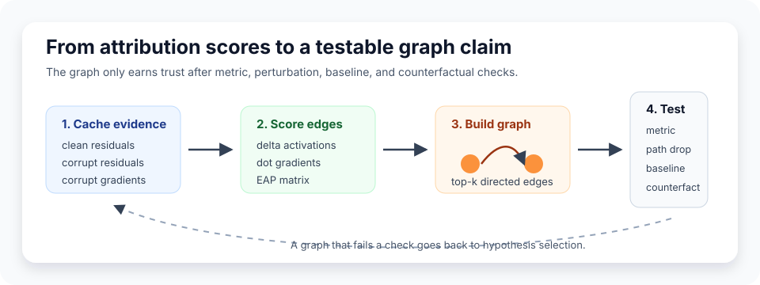

# [8.4] Circuit Tracing with Attribution Graphs

> **Notebooks: [exercises](../../exercises/part4_circuit_tracing_attribution_graphs/8.4_Circuit_Tracing_with_Attribution_Graphs_exercises.ipynb) | [solutions](../../exercises/part4_circuit_tracing_attribution_graphs/8.4_Circuit_Tracing_with_Attribution_Graphs_solutions.ipynb)**

> **Local-first extension.** Section 8.2 gave us EAP-style edge scores. Section
> 8.3 asked how to grade a proposed circuit. This section asks the next question:
> how do we turn edge scores into a graph-shaped claim that makes falsifiable
> predictions?

```python
GT_TIER = "GT-1"
EXERCISE_ID = "8_4_circuit_tracing_with_attribution_graphs"
EXPECTED_RUNTIME = "35-50 minutes for exercises; about 1-2 minutes for the CUDA preflight"
REQUIRES_GPU = True  # CPU exercises; CUDA release verification is required
```

Please send any problems / bugs on the `#errata` channel in the [Slack group](https://info-arena.github.io/ARENA_img/slack.html), and ask any questions on the dedicated channels for this chapter of material.

If you want to change to dark mode, you can do this by clicking the three horizontal lines in the top-right, then navigating to Settings -> Theme.

Links to earlier chapters: [(0) Fundamentals](https://arena-chapter0-fundamentals.streamlit.app/), [(1) Transformer Interpretability](https://arena-chapter1-transformer-interp.streamlit.app/), [(2) RL](https://arena-chapter2-rl.streamlit.app/), [(3) LLM Evaluations](https://arena-chapter3-llm-evals.streamlit.app/), [(4) Alignment Science](https://arena-chapter4-alignment-science.streamlit.app/).


# Introduction

In the original IOI material, the important transition was not from "no diagram"
to "diagram." It was from a plausible story to an intervention-tested circuit:

```text
task metric -> attribution clue -> activation/path patch -> circuit check
```

Attribution graphs live in that same space. They are a way of making an edge
score legible: this source node appears to affect that target node, this path
appears to carry the target behavior, and perturbing it should damage the metric.
But a graph is only useful if it is more than a pretty picture. It should explain
a clean-corrupt metric gap, lose the metric when its top path is perturbed, beat
a plausible alternative graph, and make a directional counterfactual prediction.

This section deliberately starts with small local graph objects before touching a
real model. That lets us separate the graph contract from TransformerLens hooks:

```text
clean/corrupt cache + corrupt gradient -> EAP edge matrix -> top-k graph
                                         -> metric, path, baseline, counterfactual checks
```



The accepted CUDA result is scoped. It loads a pinned TransformerLens `gelu-1l`
checkpoint, computes a residual-position EAP matrix at `blocks.0.hook_resid_post`,
and validates a one-edge final-position graph. This is a graph-tracing mechanics
preflight, not a full sparse-feature or transcoder circuit-tracing replication.

## Content & Learning Objectives

### 1. Edge scores

> ##### Learning Objectives
>
> * Compute directed upstream-by-downstream EAP-style scores.
> * Reject empty, mismatched, or non-finite activation/gradient tensors.
> * Keep the direction of the score matrix straight.

### 2. Local attribution graphs

> ##### Learning Objectives
>
> * Preserve node names while flattening a score matrix.
> * Build a directed top-k graph without keeping zero-score edges.
> * Recognize that top-k selection proposes a graph; it does not validate one.

### 3. Paths through the graph

> ##### Learning Objectives
>
> * Search for the strongest directed source-to-target path.
> * Use path scores to penalize weak links in a multi-hop explanation.
> * Distinguish a missing directed path from a weak but present path.

### 4. Graph validation

> ##### Learning Objectives
>
> * Measure explained fraction relative to a clean-corrupt gap.
> * Test path perturbations and same-size alternative graph baselines.
> * Require written graph summaries to predict held-out counterfactuals.

# Setup Code

```python
import json
import sys
from dataclasses import dataclass
from pathlib import Path
from typing import Literal

import torch as t

chapter = "chapter8_automated_circuits"
section = "part4_circuit_tracing_attribution_graphs"
root_dir = next(p for p in [Path.cwd(), *Path.cwd().parents] if (p / chapter).exists())
exercises_dir = root_dir / chapter / "exercises"
section_dir = exercises_dir / section

if str(root_dir) not in sys.path:
    sys.path.append(str(root_dir))
if str(exercises_dir) not in sys.path:
    sys.path.append(str(exercises_dir))

import part4_circuit_tracing_attribution_graphs.tests as tests
import part4_circuit_tracing_attribution_graphs.utils as utils

CounterfactualDirection = Literal["increase", "decrease"]
```

We will keep graph evidence in small dataclasses. This makes the tests check
both the pass/fail flag and the quantity that justified it.

```python
@dataclass(frozen=True)
class CircuitTraceEdge:
    source: str
    target: str
    score: float


@dataclass(frozen=True)
class LocalAttributionGraph:
    nodes: tuple[str, ...]
    edges: tuple[CircuitTraceEdge, ...]


@dataclass(frozen=True)
class GraphMetricReport:
    full_metric: float
    corrupt_metric: float
    graph_metric: float
    explained_fraction: float
    explains_target_metric: bool


@dataclass(frozen=True)
class PathPerturbationReport:
    original_metric: float
    perturbed_metric: float
    metric_drop: float
    top_path_survives_test: bool


@dataclass(frozen=True)
class AlternativeGraphBaselineReport:
    graph_metric: float
    alternative_metric: float
    margin: float
    alternative_baseline_fails: bool


@dataclass(frozen=True)
class GraphSummaryCounterfactualReport:
    predicted_direction: CounterfactualDirection
    observed_delta: float
    predicts_counterfactual: bool


@dataclass(frozen=True)
class AttributionPathReport:
    source: str
    target: str
    path: tuple[str, ...]
    edge_scores: tuple[float, ...]
    path_score: float
    reaches_target: bool
```

# Edge Scores

### Exercise - compute EAP-style edge scores

> Difficulty: medium
> Importance: high
>
> You should spend 10 minutes on this exercise.

An attribution graph needs directed edge scores. In this toy contract, each
upstream component has a clean-minus-corrupt activation delta and each downstream
component has a corrupt-run gradient. The source-by-target matrix is their dot
product.

```python
def edge_attribution_scores(
    upstream_activation_delta: t.Tensor,
    downstream_gradients: t.Tensor,
) -> t.Tensor:
    raise NotImplementedError()


tests.test_edge_attribution_scores_forms_position_edge_matrix(
    edge_attribution_scores,
)
tests.test_edge_attribution_scores_rejects_degenerate_inputs(
    edge_attribution_scores,
)
```

<details>
<summary>Expected output</summary>

```text
All tests in `test_edge_attribution_scores_forms_position_edge_matrix` passed!
All tests in `test_edge_attribution_scores_rejects_degenerate_inputs` passed!

For upstream_delta = [[1, 0], [0, 2]]
and downstream_gradients = [[3, 0], [0, 4]],
the edge-score matrix is [[3, 0], [0, 8]].
```

</details>

<details>
<summary>Help - why is this a directed matrix?</summary>

Rows answer "which upstream component changed between clean and corrupt?" Columns
answer "which downstream component has a gradient for the target metric?" A large
entry says that changing the source component is locally aligned with changing
the target component's contribution to the metric. Reversing the axes changes
the graph claim.

</details>

<details>
<summary>Common bugs</summary>

- Returning an elementwise product instead of a source-by-target matrix.
- Forgetting to reject empty or non-finite tensors.
- Allowing mismatched hidden dimensions.

</details>

<details>
<summary>Solution</summary>

```python
def edge_attribution_scores(
    upstream_activation_delta: t.Tensor,
    downstream_gradients: t.Tensor,
) -> t.Tensor:
    if upstream_activation_delta.ndim != 2 or downstream_gradients.ndim != 2:
        raise ValueError("inputs must have shape (components, d_model).")
    if upstream_activation_delta.numel() == 0 or downstream_gradients.numel() == 0:
        raise ValueError("inputs must be non-empty.")
    if not t.isfinite(upstream_activation_delta).all():
        raise ValueError("upstream_activation_delta must contain only finite values.")
    if not t.isfinite(downstream_gradients).all():
        raise ValueError("downstream_gradients must contain only finite values.")
    if upstream_activation_delta.shape[-1] != downstream_gradients.shape[-1]:
        raise ValueError("upstream and downstream hidden dimensions must match.")
    return upstream_activation_delta.float() @ downstream_gradients.float().T
```

</details>

# Local Attribution Graphs

### Exercise - build a directed top-k graph

> Difficulty: medium
> Importance: high
>
> You should spend 10 minutes on this exercise.

The graph below has a feature node, a transcoder node, and a target-logit node.
Keep the largest directed nonzero edges and preserve the node names.

```python
def build_local_attribution_graph(
    edge_scores: t.Tensor,
    node_names: list[str],
    *,
    top_k: int = 3,
) -> LocalAttributionGraph:
    raise NotImplementedError()


tests.test_build_local_attribution_graph_keeps_top_directed_edges(
    build_local_attribution_graph,
)
tests.test_build_local_attribution_graph_rejects_bad_nodes_or_scores(
    build_local_attribution_graph,
)
```

<details>
<summary>Expected output</summary>

```text
All tests in `test_build_local_attribution_graph_keeps_top_directed_edges` passed!
All tests in `test_build_local_attribution_graph_rejects_bad_nodes_or_scores` passed!

Top edges:
  transcoder:mlp -> logit:Paris  score 0.9
  feature:fact -> transcoder:mlp score 0.8
```

</details>

<details>
<summary>Help - what does top-k selection prove?</summary>

Almost nothing by itself. Top-k selection is a hypothesis generator: it turns a
dense edge-score matrix into a small graph you can test. You still need metric
recovery, perturbation damage, alternative baselines, and a counterfactual.

</details>

<details>
<summary>Common bugs</summary>

- Flattening the matrix but losing source and target indices.
- Keeping zero-score edges just because `top_k` is large.
- Allowing duplicate or blank node names, which makes graph interpretation ambiguous.

</details>

<details>
<summary>Solution</summary>

```python
def build_local_attribution_graph(
    edge_scores: t.Tensor,
    node_names: list[str],
    *,
    top_k: int = 3,
) -> LocalAttributionGraph:
    if edge_scores.ndim != 2 or edge_scores.shape[0] != edge_scores.shape[1]:
        raise ValueError("edge_scores must be a square matrix.")
    if edge_scores.numel() == 0 or not t.isfinite(edge_scores).all():
        raise ValueError("edge_scores must be non-empty and finite.")
    if edge_scores.shape[0] != len(node_names):
        raise ValueError("edge_scores and node_names must align.")
    if any(not name.strip() for name in node_names):
        raise ValueError("node_names must not contain blank names.")
    if len(set(node_names)) != len(node_names):
        raise ValueError("node_names must be unique.")
    if top_k <= 0:
        raise ValueError("top_k must be positive.")

    flat_scores = edge_scores.flatten().float()
    k = min(top_k, flat_scores.numel())
    top_values, top_indices = flat_scores.topk(k=k)
    edges = []
    num_nodes = edge_scores.shape[0]
    for value, flat_index in zip(top_values.tolist(), top_indices.tolist(), strict=True):
        source_index = int(flat_index // num_nodes)
        target_index = int(flat_index % num_nodes)
        if value == 0:
            continue
        edges.append(
            CircuitTraceEdge(
                source=node_names[source_index],
                target=node_names[target_index],
                score=round(float(value), 6),
            )
        )
    return LocalAttributionGraph(nodes=tuple(node_names), edges=tuple(edges))
```

</details>

# Directed Paths

### Exercise - recover the top attribution path

> Difficulty: medium
> Importance: high
>
> You should spend 15 minutes on this exercise.

A graph claim often names a path, not just one edge. Implement a search for the
highest-scoring directed path from a source node to a target node. Use the
product of absolute edge scores so a path with one weak link is penalized.

```python
def top_attribution_path(
    graph: LocalAttributionGraph,
    *,
    source: str,
    target: str,
    max_depth: int = 4,
) -> AttributionPathReport:
    raise NotImplementedError()


tests.test_top_attribution_path_recovers_multi_hop_chain(top_attribution_path)
tests.test_top_attribution_path_rejects_invalid_graphs(top_attribution_path)
```

<details>
<summary>Expected output</summary>

```text
All tests in `test_top_attribution_path_recovers_multi_hop_chain` passed!
All tests in `test_top_attribution_path_rejects_invalid_graphs` passed!

Recovered path:
  feature:subject -> transcoder:mlp -> feature:object -> logit:Paris
edge_scores: (0.8, 0.9, 0.7)
path_score: 0.504
```

</details>

<details>
<summary>Help - why use a product path score?</summary>

For a multi-hop story to be plausible, every link has to matter. A sum can make
a path look good because of one huge edge plus several weak edges. A product is
stricter: one near-zero link pushes the whole path score down.

</details>

<details>
<summary>Common bugs</summary>

- Searching as if the graph were undirected.
- Returning the best single edge instead of a path to the target.
- Not reporting missing paths explicitly.

</details>

<details>
<summary>Solution</summary>

```python
def top_attribution_path(
    graph: LocalAttributionGraph,
    *,
    source: str,
    target: str,
    max_depth: int = 4,
) -> AttributionPathReport:
    if max_depth <= 0:
        raise ValueError("max_depth must be positive.")
    if not graph.nodes:
        raise ValueError("graph must contain at least one node.")
    if len(set(graph.nodes)) != len(graph.nodes):
        raise ValueError("graph node names must be unique.")
    if source not in graph.nodes:
        raise ValueError("source must be a graph node.")
    if target not in graph.nodes:
        raise ValueError("target must be a graph node.")

    adjacency: dict[str, list[CircuitTraceEdge]] = {node: [] for node in graph.nodes}
    for edge in graph.edges:
        if edge.source not in graph.nodes or edge.target not in graph.nodes:
            raise ValueError("graph edges must connect declared graph nodes.")
        if not t.isfinite(t.tensor(float(edge.score))):
            raise ValueError("edge.score must be finite.")
        adjacency.setdefault(edge.source, []).append(edge)
    for edges in adjacency.values():
        edges.sort(key=lambda edge: abs(edge.score), reverse=True)

    best_path: tuple[str, ...] = ()
    best_scores: tuple[float, ...] = ()
    best_score = float("-inf")

    def search(current: str, path: tuple[str, ...], scores: tuple[float, ...], product: float) -> None:
        nonlocal best_path, best_scores, best_score
        if current == target and scores:
            if product > best_score:
                best_path = path
                best_scores = scores
                best_score = product
            return
        if len(scores) >= max_depth:
            return
        for edge in adjacency.get(current, []):
            if edge.target in path:
                continue
            search(
                edge.target,
                (*path, edge.target),
                (*scores, round(float(edge.score), 6)),
                product * abs(float(edge.score)),
            )

    search(source, (source,), (), 1.0)
    if not best_path:
        return AttributionPathReport(source, target, (), (), 0.0, False)
    return AttributionPathReport(
        source=source,
        target=target,
        path=best_path,
        edge_scores=best_scores,
        path_score=round(best_score, 6),
        reaches_target=True,
    )
```

</details>

# Target Metric Explanation

### Exercise - check graph metric explanation

> Difficulty: medium
> Importance: high
>
> You should spend 10 minutes on this exercise.

The graph should explain most of the clean-vs-corrupt target metric gap.

```python
def graph_metric_report(
    *,
    full_metric: float,
    corrupt_metric: float,
    graph_metric: float,
    min_explained_fraction: float = 0.75,
) -> GraphMetricReport:
    raise NotImplementedError()


tests.test_graph_metric_report_measures_explained_fraction(graph_metric_report)
tests.test_metric_reports_reject_nonfinite_or_negative_thresholds(
    graph_metric_report,
)
```

<details>
<summary>Expected output</summary>

```text
All tests in `test_graph_metric_report_measures_explained_fraction` passed!
All tests in `test_metric_reports_reject_nonfinite_or_negative_thresholds` passed!

full=3.0, corrupt=0.0, graph=2.4 -> explained_fraction=0.8
```

</details>

<details>
<summary>Help - why normalize by the clean-corrupt gap?</summary>

The clean-corrupt gap is the behavior you are trying to explain. Dividing by the
full metric alone can make a graph look strong because the baseline is already
high, or weak because the metric scale is arbitrary. The question is "how much
of the missing clean behavior did this graph recover?"

</details>

<details>
<summary>Solution</summary>

```python
def graph_metric_report(
    *,
    full_metric: float,
    corrupt_metric: float,
    graph_metric: float,
    min_explained_fraction: float = 0.75,
) -> GraphMetricReport:
    for name, value in {
        "full_metric": full_metric,
        "corrupt_metric": corrupt_metric,
        "graph_metric": graph_metric,
        "min_explained_fraction": min_explained_fraction,
    }.items():
        if not t.isfinite(t.tensor(float(value))):
            raise ValueError(f"{name} must be finite.")
    if min_explained_fraction < 0:
        raise ValueError("min_explained_fraction must be non-negative.")
    denominator = full_metric - corrupt_metric
    if denominator == 0:
        raise ValueError("full_metric and corrupt_metric must differ.")
    explained_fraction = (graph_metric - corrupt_metric) / denominator
    return GraphMetricReport(
        full_metric=full_metric,
        corrupt_metric=corrupt_metric,
        graph_metric=graph_metric,
        explained_fraction=explained_fraction,
        explains_target_metric=explained_fraction >= min_explained_fraction,
    )
```

</details>

# Perturbation And Baselines

### Exercise - perturb paths and compare alternatives

> Difficulty: medium
> Importance: high
>
> You should spend 15 minutes on this exercise.

Perturbing the top path should damage the target metric. A plausible same-size
alternative graph should perform worse than the selected graph.

```python
def path_perturbation_report(
    *,
    original_metric: float,
    perturbed_metric: float,
    min_metric_drop: float = 0.5,
) -> PathPerturbationReport:
    raise NotImplementedError()


def alternative_graph_baseline_report(
    *,
    graph_metric: float,
    alternative_metric: float,
    min_margin: float = 0.5,
) -> AlternativeGraphBaselineReport:
    raise NotImplementedError()


tests.test_path_perturbation_and_alternative_baseline_reports(
    path_perturbation_report,
    alternative_graph_baseline_report,
)
tests.test_metric_reports_reject_nonfinite_or_negative_thresholds(
    path_perturbation_report=path_perturbation_report,
    alternative_graph_baseline_report=alternative_graph_baseline_report,
)
```

<details>
<summary>Expected output</summary>

```text
All tests in `test_path_perturbation_and_alternative_baseline_reports` passed!

original=2.4, perturbed=0.7 -> metric_drop=1.7
graph=2.4, alternative=1.0 -> margin=1.4
```

</details>

<details>
<summary>Help - why is an alternative graph needed?</summary>

If a random or nearby same-size graph preserves the metric just as well, then
your selected graph may be exploiting a forgiving metric rather than capturing a
specific mechanism. The alternative does not prove the selected graph is true,
but it rules out an easy failure mode.

</details>

<details>
<summary>Common bugs</summary>

- Reversing the metric-drop sign.
- Calling a path causal when perturbing it barely changes behavior.
- Checking an alternative graph but forgetting to enforce a margin.

</details>

<details>
<summary>Solution</summary>

```python
def path_perturbation_report(
    *,
    original_metric: float,
    perturbed_metric: float,
    min_metric_drop: float = 0.5,
) -> PathPerturbationReport:
    if min_metric_drop < 0:
        raise ValueError("min_metric_drop must be non-negative.")
    metric_drop = original_metric - perturbed_metric
    return PathPerturbationReport(
        original_metric=original_metric,
        perturbed_metric=perturbed_metric,
        metric_drop=metric_drop,
        top_path_survives_test=metric_drop >= min_metric_drop,
    )


def alternative_graph_baseline_report(
    *,
    graph_metric: float,
    alternative_metric: float,
    min_margin: float = 0.5,
) -> AlternativeGraphBaselineReport:
    if min_margin < 0:
        raise ValueError("min_margin must be non-negative.")
    margin = graph_metric - alternative_metric
    return AlternativeGraphBaselineReport(
        graph_metric=graph_metric,
        alternative_metric=alternative_metric,
        margin=margin,
        alternative_baseline_fails=margin >= min_margin,
    )
```

</details>

# Written Counterfactual Summaries

### Exercise - test a summary-predicted counterfactual

> Difficulty: medium
> Importance: high
>
> You should spend 10 minutes on this exercise.

A graph summary should make a directional prediction before the intervention is
measured. Otherwise it is just a post-hoc story.

```python
def graph_summary_counterfactual_report(
    *,
    predicted_direction: CounterfactualDirection,
    baseline_metric: float,
    counterfactual_metric: float,
) -> GraphSummaryCounterfactualReport:
    raise NotImplementedError()


tests.test_counterfactual_summary_report_checks_direction(
    graph_summary_counterfactual_report,
)
```

<details>
<summary>Expected output</summary>

```text
All tests in `test_counterfactual_summary_report_checks_direction` passed!

predicted_direction="decrease", observed_delta=-1.6 -> predicts_counterfactual=True
```

</details>

<details>
<summary>Help - why test a written summary?</summary>

Interpretability claims often become slippery at the final step: the graph is
converted into prose, and the prose is never tested. A summary that says "this
edge carries positive evidence for the target" should predict the sign of an
intervention before you run it.

</details>

<details>
<summary>Solution</summary>

```python
def graph_summary_counterfactual_report(
    *,
    predicted_direction: CounterfactualDirection,
    baseline_metric: float,
    counterfactual_metric: float,
) -> GraphSummaryCounterfactualReport:
    observed_delta = counterfactual_metric - baseline_metric
    if predicted_direction == "increase":
        predicts_counterfactual = observed_delta > 0
    elif predicted_direction == "decrease":
        predicts_counterfactual = observed_delta < 0
    else:
        raise ValueError("predicted_direction must be 'increase' or 'decrease'.")
    return GraphSummaryCounterfactualReport(
        predicted_direction=predicted_direction,
        observed_delta=observed_delta,
        predicts_counterfactual=predicts_counterfactual,
    )
```

</details>

# Notebook Contract

```python
def graph_smoke_test() -> dict:
    edge_scores = t.tensor([[0.0, 0.8, 0.1], [0.0, 0.0, 0.9], [0.0, 0.0, 0.0]])
    node_names = ["feature:fact", "transcoder:mlp", "logit:Paris"]
    graph = build_local_attribution_graph(edge_scores, node_names, top_k=2)
    return {
        "nodes": list(graph.nodes),
        "edges": [(edge.source, edge.target, round(edge.score, 6)) for edge in graph.edges],
    }


def graph_metric_smoke_test() -> dict:
    return graph_metric_report(
        full_metric=3.0,
        corrupt_metric=0.0,
        graph_metric=2.4,
        min_explained_fraction=0.75,
    ).__dict__


def path_perturbation_smoke_test() -> dict:
    return path_perturbation_report(
        original_metric=2.4,
        perturbed_metric=0.7,
        min_metric_drop=1.0,
    ).__dict__


def alternative_graph_smoke_test() -> dict:
    return alternative_graph_baseline_report(
        graph_metric=2.4,
        alternative_metric=1.0,
        min_margin=1.0,
    ).__dict__


def counterfactual_smoke_test() -> dict:
    return graph_summary_counterfactual_report(
        predicted_direction="decrease",
        baseline_metric=2.4,
        counterfactual_metric=0.8,
    ).__dict__


def path_smoke_test() -> dict:
    edge_scores = t.tensor(
        [
            [0.0, 0.8, 0.2, 0.0],
            [0.0, 0.0, 0.9, 0.1],
            [0.0, 0.0, 0.0, 0.7],
            [0.0, 0.0, 0.0, 0.0],
        ]
    )
    node_names = ["feature:subject", "transcoder:mlp", "feature:object", "logit:Paris"]
    graph = build_local_attribution_graph(edge_scores, node_names, top_k=5)
    return top_attribution_path(
        graph,
        source="feature:subject",
        target="logit:Paris",
        max_depth=3,
    ).__dict__


def run_smoke_test(cpu: bool = True) -> dict:
    _ = cpu
    return {
        "graph": graph_smoke_test(),
        "metric": graph_metric_smoke_test(),
        "path_perturbation": path_perturbation_smoke_test(),
        "alternative": alternative_graph_smoke_test(),
        "counterfactual": counterfactual_smoke_test(),
        "path": path_smoke_test(),
    }


tests.test_notebook_contract(run_smoke_test)
utils.print_report("8.4 CPU graph contract", run_smoke_test())
```

<details>
<summary>Expected output</summary>

```text
All tests in `test_notebook_contract` passed!

8.4 CPU graph contract
  graph            : {'nodes': [...], 'edges': [('transcoder:mlp', 'logit:Paris', 0.9), ...]}
  metric           : {'explained_fraction': 0.8, 'explains_target_metric': True, ...}
  path_perturbation: {'metric_drop': 1.7, 'top_path_survives_test': True, ...}
  alternative      : {'margin': 1.4, 'alternative_baseline_fails': True, ...}
  counterfactual   : {'observed_delta': -1.6, 'predicts_counterfactual': True, ...}
  path             : {'path_score': 0.504, 'reaches_target': True, ...}
```

</details>

<details>
<summary>Common bugs</summary>

- Making the smoke contract depend on CUDA.
- Returning dataclass objects instead of JSON-serializable dictionaries.
- Omitting the path report; the graph is not only a set of independent edges.

</details>

# Signature Result

The accepted result is small but real: a pinned TransformerLens `gelu-1l` CUDA
run produces an EAP residual-position edge matrix whose top edge is the final
position self-edge. Patching that final position explains the clean-corrupt
logit-diff gap, perturbing it drops the metric, a same-size wrong-position graph
fails, and the graph summary correctly predicts a decrease counterfactual.


| Check | Accepted value |
|---|---:|
| model / hook | `gelu-1l` / `blocks.0.hook_resid_post` |
| clean / corrupt prompt | `"The cat sat on the"` / `"The bird flew over the"` |
| target / distractor token | `" floor"` / `" top"` |
| graph nodes / edges | `6 / 1` |
| selected edge | `position_5 -> position_5` |
| graph edge score | `6.031335` |
| explained fraction | `1.0` |
| clean-corrupt gap | `6.27708625793457` |
| path metric drop | `6.27708625793457` |
| alternative baseline margin | `6.27708625793457` |
| counterfactual | predicted `decrease`, observed `-6.27708625793457` |
| peak VRAM | `0.46653079986572266 GB` |

<details>
<summary>Help - how should you interpret this result?</summary>

This is evidence that the local graph-tracing harness is wired correctly on a
real cached model path. It is not evidence that we have discovered a rich circuit:
the graph has one edge and the nodes are residual positions. That is still a
useful stepping stone, because sparse-feature and transcoder graph tracing uses
the same discipline: score edges, select a graph, perturb it, compare baselines,
and state the unsupported claims.

</details>

# Full CUDA Verification Path

The committed verification report uses this real-model path:

1. Load pinned TransformerLens `gelu-1l` on CUDA.
2. Cache clean and corrupt activations at `blocks.0.hook_resid_post`.
3. Backpropagate the target logit-diff metric through the corrupt run.
4. Build an EAP-style residual-position edge matrix.
5. Keep the top edge as a local attribution graph.
6. Require the final-position self-edge to be the top graph edge.
7. Verify target-metric explanation, top-path perturbation, alternative baseline failure, and a predicted decrease counterfactual.

```python
def run_gpu_test(max_vram_gb: float = 24.0) -> dict:
    report = json.loads((section_dir / "verification_report.json").read_text())
    gpu = report["metrics"]["gpu_test"]
    assert report["accepted"] and report["tests_passed"]
    assert gpu["cuda_available"]
    assert gpu["preflight_passed"]
    assert gpu["graph_edge_source"] == "position_5"
    assert gpu["graph_edge_target"] == "position_5"
    assert gpu["num_graph_edges"] == 1
    assert gpu["explains_target_metric"]
    assert gpu["top_path_survives_test"]
    assert gpu["alternative_baseline_fails"]
    assert gpu["predicts_counterfactual"]
    assert gpu["peak_vram_gb"] <= max_vram_gb
    return gpu


def run_full_experiment(max_vram_gb: float = 24.0) -> dict:
    return run_gpu_test(max_vram_gb=max_vram_gb)


gpu = run_gpu_test(max_vram_gb=24.0)
utils.print_report(
    "Committed CUDA circuit-tracing report",
    {
        "torch": gpu["torch_version"],
        "cuda": gpu["cuda_version"],
        "device": gpu["device"],
        "edge": f'{gpu["graph_edge_source"]} -> {gpu["graph_edge_target"]}',
        "edge_score": round(gpu["graph_edge_score"], 4),
        "explained_fraction": gpu["explained_fraction"],
        "path_drop": round(gpu["path_metric_drop"], 4),
        "alternative_margin": round(gpu["alternative_baseline_margin"], 4),
        "counterfactual_delta": round(gpu["counterfactual_observed_delta"], 4),
        "peak_vram_gb": round(gpu["peak_vram_gb"], 4),
    },
)
```

<details>
<summary>Expected output</summary>

```text
Committed CUDA circuit-tracing report
  torch                : 2.12.1+cu132
  cuda                 : 13.2
  device               : NVIDIA GeForce RTX 5090 Laptop GPU
  edge                 : position_5 -> position_5
  edge_score           : 6.0313
  explained_fraction   : 1.0
  path_drop            : 6.2771
  alternative_margin   : 6.2771
  counterfactual_delta : -6.2771
  peak_vram_gb         : 0.4665
```

</details>

# Limitations

- The real-model result uses one safe clean/corrupt prompt pair.
- The graph nodes are residual positions, not attention heads, MLP neurons, SAE features, or transcoder features.
- The selected graph has one edge, so it is a mechanics preflight rather than a discovered multi-hop circuit.
- The top edge is a final-position self-edge; this can be a useful sanity check but is not a rich mechanistic story.
- The CUDA path validates one hook point, `blocks.0.hook_resid_post`, not a multi-layer attribution graph.
- The section does not reproduce IOI path patching, greater-than circuit tracing, or full sparse-feature circuit tracing.
- Passing these tests does not mean every graph generated by EAP is faithful; it means the graph-claim validation harness is working.

# Further Research

1. Replace residual-position nodes with attention heads or MLP features and ask whether the same metric checks still pass.
2. Run the graph contract on the GT-2 IOI path-patching evidence and compare selected heads against known name-mover and backup-head roles.
3. Add sparse-feature or transcoder nodes from Chapter 6 and measure whether feature graphs beat residual-position graphs on held-out prompts.
4. Sweep `top_k` and threshold choices, then plot faithfulness and completeness curves instead of accepting a single graph size.
5. Turn the counterfactual summary into a pre-registered table: write the prediction before running each intervention.

# Consolidating Understanding

You should now be able to explain why an attribution graph is not just a drawing.
It is a compact claim about directed causal flow, and it has to survive the same
discipline as the rest of mechanistic interpretability: precise metrics,
interventions, baselines, negative controls, honest limitations, and visible
results that a student can inspect.
