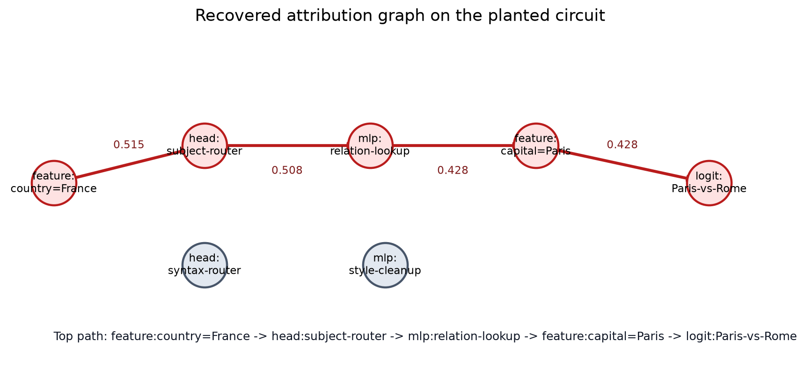

# [8.4] Circuit Tracing with Attribution Graphs

> **Notebooks: [exercises](../../exercises/part4_circuit_tracing_attribution_graphs/8.4_Circuit_Tracing_with_Attribution_Graphs_exercises.ipynb) | [solutions](../../exercises/part4_circuit_tracing_attribution_graphs/8.4_Circuit_Tracing_with_Attribution_Graphs_solutions.ipynb)**

By the end of this notebook, you will have built an attribution graph whose top path predicts and survives exact causal interventions on a meaningful component graph, while same-size random and reversed-edge graphs fail.

```python
GT_TIER = "GT-1"
EXERCISE_ID = "8_4_circuit_tracing_with_attribution_graphs"
EXPECTED_RUNTIME = "45-60 minutes for the CPU theorem; parent process runs CUDA preflight later"
REQUIRES_GPU = True  # CPU theorem is runnable now; parent runs the bounded CUDA preflight later
```

The current danger with attribution graphs is that the diagram can look more convincing than the evidence. This notebook keeps the main theorem small enough that you can know the ground truth exactly. You will build a planted circuit with named feature, head, MLP, and logit nodes, compute edge scores, threshold a graph, recover the top path, and then test the path by exact interventions.

The TransformerLens `gelu-1l` path in `solutions.py` is still present, but it is only a residual-position mechanics preflight. A one-edge `position_5 -> position_5` result is not the flagship claim for this section.

<details>
<summary>Expected signature result</summary>

The default run should recover this path:

```text
feature:country=France -> head:subject-router -> mlp:relation-lookup -> feature:capital=Paris -> logit:Paris-vs-Rome
```

The path-only graph recovers about `1.716` target-logit units from a full metric near `1.993`. Removing the path leaves only weak shortcut/distractor mass. Same-size random and reversed-edge graphs should visibly fail.

</details>

<details>
<summary>Help - what is the core question?</summary>

The core question is not "can we draw a graph?" It is: when an attribution graph says a path carries a behavior, does that path make a quantitative prediction that survives causal intervention and beats controls?

</details>

```python
import math
import random
import sys
from dataclasses import dataclass
from pathlib import Path
from typing import Literal, Sequence

import matplotlib.pyplot as plt
import numpy as np
import torch as t

chapter = "chapter8_automated_circuits"
section = "part4_circuit_tracing_attribution_graphs"
root_dir = next(p for p in [Path.cwd(), *Path.cwd().parents] if (p / chapter).exists())
exercises_dir = root_dir / chapter / "exercises"
section_dir = exercises_dir / section
assets_dir = root_dir / chapter / "instructions" / "assets"
assets_dir.mkdir(parents=True, exist_ok=True)

if str(root_dir) not in sys.path:
    sys.path.append(str(root_dir))
if str(exercises_dir) not in sys.path:
    sys.path.append(str(exercises_dir))

import part4_circuit_tracing_attribution_graphs.tests as tests
import part4_circuit_tracing_attribution_graphs.utils as utils

CounterfactualDirection = Literal["increase", "decrease"]


@dataclass(frozen=True)
class CircuitTraceEdge:
    source: str
    target: str
    score: float


@dataclass(frozen=True)
class LocalAttributionGraph:
    nodes: tuple[str, ...]
    edges: tuple[CircuitTraceEdge, ...]


@dataclass(frozen=True)
class AttributionPathReport:
    source: str
    target: str
    path: tuple[str, ...]
    edge_scores: tuple[float, ...]
    path_score: float
    reaches_target: bool


@dataclass(frozen=True)
class PlantedAttributionCircuit:
    node_names: tuple[str, ...]
    weights: t.Tensor
    clean_inputs: t.Tensor
    corrupt_inputs: t.Tensor
    source_node: str
    target_node: str
    ground_truth_path: tuple[str, ...]
    distractor_edges: tuple[tuple[str, str], ...]


@dataclass(frozen=True)
class ExactPathPatchReport:
    full_metric: float
    corrupt_metric: float
    path_only_metric: float
    path_removed_metric: float
    faithfulness: float
    completeness: float
    minimality: float
    top_path_survives_test: bool


@dataclass(frozen=True)
class GraphControlReport:
    graph_metric: float
    same_size_random_metric: float
    reversed_edge_metric: float
    random_margin: float
    reversed_margin: float
    same_size_random_fails: bool
    reversed_edges_fail: bool


def _require_finite_tensor(name: str, value: t.Tensor) -> None:
    if value.numel() == 0:
        raise ValueError(f"{name} must be non-empty.")
    if not t.isfinite(value).all():
        raise ValueError(f"{name} must contain only finite values.")


def _require_finite_scalar(name: str, value: float) -> float:
    numeric = float(value)
    if not t.isfinite(t.tensor(numeric)):
        raise ValueError(f"{name} must be finite.")
    return numeric


def _round_matrix(values: t.Tensor, digits: int = 4) -> list[list[float]]:
    return [
        [round(float(item), digits) for item in row]
        for row in values.detach().cpu().tolist()
    ]


def _node_index(circuit: PlantedAttributionCircuit, node_name: str) -> int:
    if node_name not in circuit.node_names:
        raise ValueError(f"{node_name!r} is not a circuit node.")
    return circuit.node_names.index(node_name)


def _edge_name_pairs_from_path(path: Sequence[str]) -> tuple[tuple[str, str], ...]:
    if len(path) < 2:
        raise ValueError("a path must contain at least two nodes.")
    return tuple((source, target) for source, target in zip(path[:-1], path[1:]))


def _validate_planted_circuit(circuit: PlantedAttributionCircuit) -> None:
    if not circuit.node_names:
        raise ValueError("circuit must contain named nodes.")
    if len(set(circuit.node_names)) != len(circuit.node_names):
        raise ValueError("circuit node names must be unique.")
    if circuit.weights.shape != (len(circuit.node_names), len(circuit.node_names)):
        raise ValueError("weights must be a square node-by-node matrix.")
    if circuit.clean_inputs.shape != (len(circuit.node_names),):
        raise ValueError("clean_inputs must have one value per node.")
    if circuit.corrupt_inputs.shape != (len(circuit.node_names),):
        raise ValueError("corrupt_inputs must have one value per node.")
    _require_finite_tensor("weights", circuit.weights)
    _require_finite_tensor("clean_inputs", circuit.clean_inputs)
    _require_finite_tensor("corrupt_inputs", circuit.corrupt_inputs)
    _node_index(circuit, circuit.source_node)
    _node_index(circuit, circuit.target_node)
    for source, target in _edge_name_pairs_from_path(circuit.ground_truth_path):
        source_index = _node_index(circuit, source)
        target_index = _node_index(circuit, target)
        if circuit.weights[source_index, target_index] == 0:
            raise ValueError("ground_truth_path must use nonzero circuit edges.")
```

## Learning Objectives

By the end, you should be able to:

- construct a small attributed component graph with exact ground truth;
- compute exact edge effects by ablation;
- compute integrated-gradient edge attributions over edge gates;
- threshold an attribution matrix into a directed graph;
- recover the highest-scoring source-to-target path;
- run exact path patching and path removal;
- compare the graph to same-size random and reversed-edge controls;
- explain why the real-model backend is still only a preflight unless nodes are meaningful components.

## Cold Open

Before running anything, predict which graph should pass:

```text
A. country feature -> subject head -> relation MLP -> capital feature -> Paris logit
B. same number of random non-path edges
C. the same path with every edge reversed
```

Write your guess in a sentence. You will check it against exact path interventions later.

## Validation Loop

The loop for this section is:

```text
planted graph -> exact edge effects -> IG edge scores -> thresholded graph
              -> top path -> exact path-only/path-removed intervention
              -> same-size random and reversed-edge controls
```



If the image is missing, run the solution notebook once; the plotting cells generate it locally.

## Exercise - Build the Planted Component Circuit

> Difficulty: medium
> Importance: high
> You should spend 10 minutes on this exercise.

Create the toy circuit. It is deliberately not a position graph: the nodes are named as feature, head, MLP, and logit-like components. Then implement the forward pass through the topologically ordered DAG.

The clean input activates the country feature. The corrupt input removes it. The target metric is the final `logit:Paris-vs-Rome` node.

```python
def make_planted_attribution_circuit() -> PlantedAttributionCircuit:
    raise NotImplementedError()


def planted_circuit_activations(
    circuit: PlantedAttributionCircuit,
    *,
    edge_mask: t.Tensor | None = None,
    inputs: t.Tensor | None = None,
) -> t.Tensor:
    raise NotImplementedError()


def planted_circuit_metric(
    circuit: PlantedAttributionCircuit,
    *,
    edge_mask: t.Tensor | None = None,
    inputs: t.Tensor | None = None,
) -> float | t.Tensor:
    raise NotImplementedError()


tests.test_planted_circuit_has_meaningful_component_nodes(
    make_planted_attribution_circuit,
    planted_circuit_metric,
)
```

<details>
<summary>Expected output</summary>

```text
All tests in `test_planted_circuit_has_meaningful_component_nodes` passed!
```

The clean metric should be near `1.99335`; the corrupt metric should be `0.0`.

</details>

<details>
<summary>Help - why a planted graph first?</summary>

Attribution graphs are easy to overread. Starting with exact ground truth lets you test the graph contract before making real-model claims.

</details>

<details>
<summary>Common bugs</summary>

- Updating nodes out of topological order.
- Forgetting that the clean input activates only the source feature.
- Returning the whole activation vector from `planted_circuit_metric` instead of the target node.

</details>

<details>
<summary>Solution</summary>

```python
def make_planted_attribution_circuit() -> PlantedAttributionCircuit:
    """Return the exact toy graph used as the bounded 8.4 theorem.

    The graph has one strong path from a country fact feature to a Paris-vs-Rome
    logit node, plus weaker syntax/style distractor edges. The node order is
    topological, so exact causal effects are easy to compute and inspect.
    """

    node_names = (
        "feature:country=France",
        "head:subject-router",
        "mlp:relation-lookup",
        "feature:capital=Paris",
        "head:syntax-router",
        "mlp:style-cleanup",
        "logit:Paris-vs-Rome",
    )
    weights = t.zeros(len(node_names), len(node_names), dtype=t.float32)
    edge_weights = {
        (0, 1): 1.00,
        (1, 2): 1.20,
        (2, 3): 1.10,
        (3, 6): 1.30,
        (2, 6): 0.20,
        (0, 4): 0.35,
        (4, 5): 0.25,
        (5, 6): 0.18,
        (1, 5): 0.12,
    }
    for (source, target), weight in edge_weights.items():
        weights[source, target] = weight
    clean_inputs = t.zeros(len(node_names), dtype=t.float32)
    clean_inputs[0] = 1.0
    corrupt_inputs = t.zeros(len(node_names), dtype=t.float32)
    circuit = PlantedAttributionCircuit(
        node_names=node_names,
        weights=weights,
        clean_inputs=clean_inputs,
        corrupt_inputs=corrupt_inputs,
        source_node="feature:country=France",
        target_node="logit:Paris-vs-Rome",
        ground_truth_path=(
            "feature:country=France",
            "head:subject-router",
            "mlp:relation-lookup",
            "feature:capital=Paris",
            "logit:Paris-vs-Rome",
        ),
        distractor_edges=(
            ("mlp:relation-lookup", "logit:Paris-vs-Rome"),
            ("feature:country=France", "head:syntax-router"),
            ("head:syntax-router", "mlp:style-cleanup"),
            ("mlp:style-cleanup", "logit:Paris-vs-Rome"),
            ("head:subject-router", "mlp:style-cleanup"),
        ),
    )
    _validate_planted_circuit(circuit)
    return circuit

def planted_circuit_activations(
    circuit: PlantedAttributionCircuit,
    *,
    edge_mask: t.Tensor | None = None,
    inputs: t.Tensor | None = None,
) -> t.Tensor:
    """Run the planted DAG once and return every node activation."""

    _validate_planted_circuit(circuit)
    if edge_mask is None:
        edge_mask = (circuit.weights != 0).to(dtype=circuit.weights.dtype)
    if edge_mask.shape != circuit.weights.shape:
        raise ValueError("edge_mask must have the same shape as circuit weights.")
    _require_finite_tensor("edge_mask", edge_mask)
    if inputs is None:
        inputs = circuit.clean_inputs
    if inputs.shape != circuit.clean_inputs.shape:
        raise ValueError("inputs must have one value per circuit node.")
    _require_finite_tensor("inputs", inputs)

    activations = [inputs.float()[index] for index in range(len(circuit.node_names))]
    weights = circuit.weights.float() * edge_mask.float()
    for target_index in range(len(circuit.node_names)):
        if target_index == 0:
            continue
        incoming = sum(
            activations[source_index] * weights[source_index, target_index]
            for source_index in range(target_index)
        )
        activations[target_index] = activations[target_index] + incoming
    return t.stack(activations)

def planted_circuit_metric(
    circuit: PlantedAttributionCircuit,
    *,
    edge_mask: t.Tensor | None = None,
    inputs: t.Tensor | None = None,
) -> float | t.Tensor:
    """Return the target logit-difference node for the planted graph."""

    activations = planted_circuit_activations(circuit, edge_mask=edge_mask, inputs=inputs)
    target_index = _node_index(circuit, circuit.target_node)
    metric = activations[target_index]
    return metric if metric.requires_grad else float(metric.item())
```

</details>

## Exercise - Exact Edge Effects

> Difficulty: medium
> Importance: high
> You should spend 10 minutes on this exercise.

Compute the exact causal effect of every edge by ablating that edge and measuring the target metric drop. This is your ground-truth heatmap.

```python
def exact_edge_ablation_effects(circuit: PlantedAttributionCircuit) -> t.Tensor:
    raise NotImplementedError()


tests.test_exact_edge_ablation_effects_identify_ground_truth_path(
    make_planted_attribution_circuit,
    exact_edge_ablation_effects,
)
```

<details>
<summary>Expected output</summary>

```text
All tests in `test_exact_edge_ablation_effects_identify_ground_truth_path` passed!
```

The four path edges should each have exact effect above `1.7`. The direct `mlp:relation-lookup -> logit:Paris-vs-Rome` shortcut should be visible but much smaller.

</details>

<details>
<summary>Help - what counts as exact?</summary>

Here exact means no approximation: set one edge gate to zero, rerun the DAG, and subtract the new target metric from the full target metric.

</details>

<details>
<summary>Common bugs</summary>

- Scoring edge weights rather than metric drops.
- Forgetting to restore the edge before testing the next one.
- Filling non-edge entries with nonzero values.

</details>

<details>
<summary>Solution</summary>

```python
def exact_edge_ablation_effects(circuit: PlantedAttributionCircuit) -> t.Tensor:
    """Return exact metric drop from ablating each individual edge."""

    _validate_planted_circuit(circuit)
    full_metric = float(planted_circuit_metric(circuit))
    base_mask = (circuit.weights != 0).float()
    effects = t.zeros_like(circuit.weights)
    for source_index, target_index in zip(*t.where(base_mask != 0), strict=True):
        ablated_mask = base_mask.clone()
        ablated_mask[source_index, target_index] = 0.0
        effects[source_index, target_index] = full_metric - float(
            planted_circuit_metric(circuit, edge_mask=ablated_mask)
        )
    return effects
```

</details>

## Exercise - Integrated-Gradient Edge Attribution

> Difficulty: medium
> Importance: high
> You should spend 15 minutes on this exercise.

Now compute an attribution score without ablating each edge. Put a differentiable gate on every edge, integrate gradients as the gates move from `0` to `1`, and compare the result to exact edge effects.

```python
def integrated_edge_attribution_scores(
    circuit: PlantedAttributionCircuit,
    *,
    ig_steps: int = 16,
) -> t.Tensor:
    raise NotImplementedError()


circuit = make_planted_attribution_circuit()
exact_scores = exact_edge_ablation_effects(circuit)
ig_scores = integrated_edge_attribution_scores(circuit, ig_steps=16)
print("largest exact score:", float(exact_scores.max()))
print("largest IG score:", float(ig_scores.max()))
```

<details>
<summary>Expected output</summary>

The largest exact score should be near `1.98`; the largest IG score should be near `0.52`. The scales differ, but the high-scoring edges should be the planted path.

</details>

<details>
<summary>Help - why can exact and IG have different scales?</summary>

Exact ablation asks how much the metric drops when one edge disappears from the full graph. Integrated gradients allocate path contribution across edge gates along the interpolation path. The ranking and path recovery matter more here than equal raw units.

</details>

<details>
<summary>Common bugs</summary>

- Mutating activations in-place so autograd cannot compute gradients.
- Calling `.item()` before `torch.autograd.grad`.
- Integrating over node activations instead of edge gates.

</details>

<details>
<summary>Solution</summary>

```python
def integrated_edge_attribution_scores(
    circuit: PlantedAttributionCircuit,
    *,
    ig_steps: int = 16,
) -> t.Tensor:
    """Approximate edge attributions by integrated gradients over edge gates."""

    _validate_planted_circuit(circuit)
    if ig_steps <= 0:
        raise ValueError("ig_steps must be positive.")
    active_edges = (circuit.weights != 0).float()
    scores = t.zeros_like(circuit.weights)
    for step in range(ig_steps):
        alpha = (step + 0.5) / ig_steps
        edge_mask = (active_edges * alpha).detach().clone().requires_grad_(True)
        metric = planted_circuit_metric(circuit, edge_mask=edge_mask)
        (gradient,) = t.autograd.grad(metric, edge_mask)
        scores = scores + gradient.detach() * active_edges
    return scores / ig_steps
```

</details>

## Exercise - Threshold the Graph and Recover the Top Path

> Difficulty: medium
> Importance: high
> You should spend 15 minutes on this exercise.

Turn the dense edge-score matrix into a directed graph. Then search for the highest-scoring path from the country feature to the Paris logit.

```python
def threshold_attribution_graph(
    edge_scores: t.Tensor,
    node_names: Sequence[str],
    *,
    min_abs_score: float,
    max_edges: int | None = None,
) -> LocalAttributionGraph:
    raise NotImplementedError()


def top_attribution_path(
    graph: LocalAttributionGraph,
    *,
    source: str,
    target: str,
    max_depth: int = 4,
) -> AttributionPathReport:
    raise NotImplementedError()


tests.test_integrated_edge_scores_recover_top_path_edges(
    make_planted_attribution_circuit,
    integrated_edge_attribution_scores,
    threshold_attribution_graph,
    top_attribution_path,
)
```

<details>
<summary>Expected output</summary>

```text
All tests in `test_integrated_edge_scores_recover_top_path_edges` passed!
```

The recovered path should be the planted country -> subject head -> relation MLP -> capital feature -> logit path.

</details>

<details>
<summary>Help - what does thresholding prove?</summary>

Thresholding proposes a graph. It does not validate it. The next exercises test whether the proposed path actually controls the metric.

</details>

<details>
<summary>Common bugs</summary>

- Sorting by signed score rather than absolute magnitude.
- Accidentally treating the graph as undirected.
- Letting a direct shortcut beat a stronger multi-hop path.

</details>

<details>
<summary>Solution</summary>

```python
def threshold_attribution_graph(
    edge_scores: t.Tensor,
    node_names: Sequence[str],
    *,
    min_abs_score: float,
    max_edges: int | None = None,
) -> LocalAttributionGraph:
    """Build a directed graph from all edges whose absolute score clears a threshold."""

    if edge_scores.ndim != 2 or edge_scores.shape[0] != edge_scores.shape[1]:
        raise ValueError("edge_scores must be a square matrix.")
    _require_finite_tensor("edge_scores", edge_scores)
    if edge_scores.shape[0] != len(node_names):
        raise ValueError("edge_scores and node_names must align.")
    if min_abs_score <= 0:
        raise ValueError("min_abs_score must be positive.")
    if max_edges is not None and max_edges <= 0:
        raise ValueError("max_edges must be positive when provided.")
    if any(not name.strip() for name in node_names):
        raise ValueError("node_names must not contain blank names.")
    if len(set(node_names)) != len(node_names):
        raise ValueError("node_names must be unique.")

    candidates: list[tuple[float, int, int, float]] = []
    for source_index in range(edge_scores.shape[0]):
        for target_index in range(edge_scores.shape[1]):
            score = float(edge_scores[source_index, target_index].item())
            magnitude = abs(score)
            if magnitude >= min_abs_score:
                candidates.append((magnitude, source_index, target_index, score))
    candidates.sort(key=lambda item: (-item[0], item[1], item[2]))
    if max_edges is not None:
        candidates = candidates[:max_edges]
    edges = tuple(
        CircuitTraceEdge(
            source=str(node_names[source_index]),
            target=str(node_names[target_index]),
            score=round(score, 6),
        )
        for _, source_index, target_index, score in candidates
        if score != 0.0
    )
    return LocalAttributionGraph(nodes=tuple(str(name) for name in node_names), edges=edges)

def top_attribution_path(
    graph: LocalAttributionGraph,
    *,
    source: str,
    target: str,
    max_depth: int = 4,
) -> AttributionPathReport:
    """Find the highest-scoring directed path from source to target.

    Path score is the product of absolute edge scores, which favors paths whose
    whole chain has strong attribution rather than one isolated large edge.
    """

    if max_depth <= 0:
        raise ValueError("max_depth must be positive.")
    if not graph.nodes:
        raise ValueError("graph must contain at least one node.")
    if any(not node.strip() for node in graph.nodes):
        raise ValueError("graph node names must not be blank.")
    if len(set(graph.nodes)) != len(graph.nodes):
        raise ValueError("graph node names must be unique.")
    if source not in graph.nodes:
        raise ValueError("source must be a graph node.")
    if target not in graph.nodes:
        raise ValueError("target must be a graph node.")

    adjacency: dict[str, list[CircuitTraceEdge]] = {node: [] for node in graph.nodes}
    for edge in graph.edges:
        if edge.source not in graph.nodes or edge.target not in graph.nodes:
            raise ValueError("graph edges must connect declared graph nodes.")
        _require_finite_scalar("edge.score", edge.score)
        adjacency.setdefault(edge.source, []).append(edge)
    for edges in adjacency.values():
        edges.sort(key=lambda edge: abs(edge.score), reverse=True)

    best_path: tuple[str, ...] = ()
    best_scores: tuple[float, ...] = ()
    best_score = float("-inf")

    def search(
        current: str,
        path: tuple[str, ...],
        scores: tuple[float, ...],
        score_product: float,
    ) -> None:
        nonlocal best_path, best_scores, best_score
        if current == target and scores:
            if score_product > best_score:
                best_path = path
                best_scores = scores
                best_score = score_product
            return
        if len(scores) >= max_depth:
            return
        for edge in adjacency.get(current, []):
            if edge.target in path:
                continue
            search(
                edge.target,
                (*path, edge.target),
                (*scores, round(float(edge.score), 6)),
                score_product * abs(float(edge.score)),
            )

    search(source, (source,), (), 1.0)
    if not best_path:
        return AttributionPathReport(
            source=source,
            target=target,
            path=(),
            edge_scores=(),
            path_score=0.0,
            reaches_target=False,
        )
    return AttributionPathReport(
        source=source,
        target=target,
        path=best_path,
        edge_scores=best_scores,
        path_score=round(best_score, 6),
        reaches_target=True,
    )
```

</details>

## Exercise - Exact Path Patch

> Difficulty: medium
> Importance: high
> You should spend 15 minutes on this exercise.

A path claim needs an intervention. Measure the metric when only the path edges are active, and when the path edges are removed from the full graph.

Use these quantities:

```text
faithfulness = (path_only_metric - corrupt_metric) / clean_corrupt_gap
completeness = (full_metric - path_removed_metric) / clean_corrupt_gap
minimality = min(single_path_edge_drop) / clean_corrupt_gap
```

```python
def graph_edge_mask(
    circuit: PlantedAttributionCircuit,
    graph: LocalAttributionGraph | Sequence[tuple[str, str]],
) -> t.Tensor:
    raise NotImplementedError()


def graph_metric_from_edges(
    circuit: PlantedAttributionCircuit,
    graph: LocalAttributionGraph | Sequence[tuple[str, str]],
) -> float:
    raise NotImplementedError()


def exact_path_patch_report(
    circuit: PlantedAttributionCircuit,
    path: Sequence[str],
    *,
    min_fraction: float = 0.8,
) -> ExactPathPatchReport:
    raise NotImplementedError()


tests.test_exact_path_patch_report_measures_causal_survival(
    make_planted_attribution_circuit,
    exact_path_patch_report,
)
```

<details>
<summary>Expected output</summary>

```text
All tests in `test_exact_path_patch_report_measures_causal_survival` passed!
```

The path-only graph should recover more than `85%` of the clean-corrupt gap, and removing the path should leave less than `0.3` target-logit units.

</details>

<details>
<summary>Help - faithfulness vs completeness</summary>

Faithfulness asks whether the selected path is sufficient. Completeness asks whether the full graph depends on that path. You need both: a path can be sufficient but not necessary, or necessary but not sufficient.

</details>

<details>
<summary>Common bugs</summary>

- Computing path-only and path-removed with the same mask.
- Normalizing by `full_metric` instead of the clean-corrupt gap.
- Forgetting to check each single edge for minimality.

</details>

<details>
<summary>Solution</summary>

```python
def graph_edge_mask(
    circuit: PlantedAttributionCircuit,
    graph: LocalAttributionGraph | Sequence[tuple[str, str]],
) -> t.Tensor:
    """Return an edge mask for a graph or explicit list of named edges."""

    _validate_planted_circuit(circuit)
    mask = t.zeros_like(circuit.weights)
    if isinstance(graph, LocalAttributionGraph):
        edge_pairs = tuple((edge.source, edge.target) for edge in graph.edges)
    else:
        edge_pairs = tuple(graph)
    for source, target in edge_pairs:
        source_index = _node_index(circuit, source)
        target_index = _node_index(circuit, target)
        mask[source_index, target_index] = 1.0
    return mask

def graph_metric_from_edges(
    circuit: PlantedAttributionCircuit,
    graph: LocalAttributionGraph | Sequence[tuple[str, str]],
) -> float:
    """Run the planted graph with exactly the provided edges switched on."""

    return float(planted_circuit_metric(circuit, edge_mask=graph_edge_mask(circuit, graph)))

def exact_path_patch_report(
    circuit: PlantedAttributionCircuit,
    path: Sequence[str],
    *,
    min_fraction: float = 0.8,
) -> ExactPathPatchReport:
    """Check whether an exact top-path patch recovers and controls the metric."""

    _validate_planted_circuit(circuit)
    min_fraction = _require_finite_scalar("min_fraction", min_fraction)
    if min_fraction < 0:
        raise ValueError("min_fraction must be non-negative.")
    path_edges = _edge_name_pairs_from_path(path)
    full_metric = float(planted_circuit_metric(circuit))
    corrupt_metric = float(planted_circuit_metric(circuit, inputs=circuit.corrupt_inputs))
    denominator = full_metric - corrupt_metric
    if denominator == 0:
        raise ValueError("full and corrupt metrics must differ.")
    path_mask = graph_edge_mask(circuit, path_edges)
    path_only_metric = float(planted_circuit_metric(circuit, edge_mask=path_mask))
    removed_mask = (circuit.weights != 0).float()
    for source, target in path_edges:
        removed_mask[_node_index(circuit, source), _node_index(circuit, target)] = 0.0
    path_removed_metric = float(planted_circuit_metric(circuit, edge_mask=removed_mask))
    exact_effects = exact_edge_ablation_effects(circuit)
    path_drops = [
        float(exact_effects[_node_index(circuit, source), _node_index(circuit, target)].item())
        for source, target in path_edges
    ]
    faithfulness = (path_only_metric - corrupt_metric) / denominator
    completeness = (full_metric - path_removed_metric) / denominator
    minimality = min(path_drops) / denominator
    return ExactPathPatchReport(
        full_metric=full_metric,
        corrupt_metric=corrupt_metric,
        path_only_metric=path_only_metric,
        path_removed_metric=path_removed_metric,
        faithfulness=faithfulness,
        completeness=completeness,
        minimality=minimality,
        top_path_survives_test=(
            faithfulness >= min_fraction
            and completeness >= min_fraction
            and minimality >= min_fraction
        ),
    )
```

</details>

## Exercise - Same-Size Random and Reversed-Edge Controls

> Difficulty: medium
> Importance: high
> You should spend 10 minutes on this exercise.

A convincing graph needs a control that has the same budget. Build a random graph with the same number of non-path edges, and build a reversed-edge graph from the selected graph. Both should fail.

```python
def same_size_random_graph(
    circuit: PlantedAttributionCircuit,
    *,
    num_edges: int,
    seed: int = 0,
    exclude_edges: Sequence[tuple[str, str]] = (),
) -> LocalAttributionGraph:
    raise NotImplementedError()


def reversed_edge_graph(graph: LocalAttributionGraph) -> LocalAttributionGraph:
    raise NotImplementedError()


def graph_control_report(
    circuit: PlantedAttributionCircuit,
    graph: LocalAttributionGraph,
    *,
    random_seed: int = 0,
    min_control_margin: float = 0.5,
) -> GraphControlReport:
    raise NotImplementedError()


tests.test_same_size_random_and_reversed_graph_controls_fail(
    make_planted_attribution_circuit,
    integrated_edge_attribution_scores,
    threshold_attribution_graph,
    graph_control_report,
)
```

<details>
<summary>Expected output</summary>

```text
All tests in `test_same_size_random_and_reversed_graph_controls_fail` passed!
```

The same-size random graph should score below `0.3`, and the reversed graph should score `0.0`.

</details>

<details>
<summary>Help - why reversed edges?</summary>

Direction is part of a graph claim. If `feature -> head -> MLP -> logit` works, `logit -> MLP -> head -> feature` should not carry the same clean information to the target metric.

</details>

<details>
<summary>Common bugs</summary>

- Sampling random edges from the selected path itself.
- Comparing against a smaller control graph.
- Reversing node order but not edge direction.

</details>

<details>
<summary>Solution</summary>

```python
def same_size_random_graph(
    circuit: PlantedAttributionCircuit,
    *,
    num_edges: int,
    seed: int = 0,
    exclude_edges: Sequence[tuple[str, str]] = (),
) -> LocalAttributionGraph:
    """Sample a same-size graph from non-excluded planted edges."""

    import random

    _validate_planted_circuit(circuit)
    if num_edges <= 0:
        raise ValueError("num_edges must be positive.")
    excluded = set(exclude_edges)
    active_pairs: list[tuple[str, str, float]] = []
    for source_index, target_index in zip(*t.where(circuit.weights != 0), strict=True):
        pair = (circuit.node_names[int(source_index)], circuit.node_names[int(target_index)])
        if pair not in excluded:
            active_pairs.append((*pair, float(circuit.weights[source_index, target_index].item())))
    if len(active_pairs) < num_edges:
        raise ValueError("not enough non-excluded edges to sample the control graph.")
    rng = random.Random(seed)
    sampled = rng.sample(active_pairs, k=num_edges)
    edges = tuple(
        CircuitTraceEdge(source=source, target=target, score=round(score, 6))
        for source, target, score in sampled
    )
    return LocalAttributionGraph(nodes=circuit.node_names, edges=edges)

def reversed_edge_graph(graph: LocalAttributionGraph) -> LocalAttributionGraph:
    """Reverse every edge in a graph while preserving its score."""

    return LocalAttributionGraph(
        nodes=graph.nodes,
        edges=tuple(
            CircuitTraceEdge(source=edge.target, target=edge.source, score=edge.score)
            for edge in graph.edges
        ),
    )

def graph_control_report(
    circuit: PlantedAttributionCircuit,
    graph: LocalAttributionGraph,
    *,
    random_seed: int = 0,
    min_control_margin: float = 0.5,
) -> GraphControlReport:
    """Compare the selected graph against same-size random and reversed controls."""

    if not graph.edges:
        raise ValueError("graph must contain at least one edge.")
    min_control_margin = _require_finite_scalar("min_control_margin", min_control_margin)
    if min_control_margin < 0:
        raise ValueError("min_control_margin must be non-negative.")
    graph_metric = graph_metric_from_edges(circuit, graph)
    excluded_edges = tuple((edge.source, edge.target) for edge in graph.edges)
    random_graph = same_size_random_graph(
        circuit,
        num_edges=len(graph.edges),
        seed=random_seed,
        exclude_edges=excluded_edges,
    )
    random_metric = graph_metric_from_edges(circuit, random_graph)
    reversed_metric = graph_metric_from_edges(circuit, reversed_edge_graph(graph))
    random_margin = graph_metric - random_metric
    reversed_margin = graph_metric - reversed_metric
    return GraphControlReport(
        graph_metric=graph_metric,
        same_size_random_metric=random_metric,
        reversed_edge_metric=reversed_metric,
        random_margin=random_margin,
        reversed_margin=reversed_margin,
        same_size_random_fails=random_margin >= min_control_margin,
        reversed_edges_fail=reversed_margin >= min_control_margin,
    )
```

</details>

## Exercise - Signature Result

> Difficulty: medium
> Importance: high
> You should spend 10 minutes on this exercise.

Bundle the theorem into one result object that the notebook can plot: exact effects, approximate edge scores, graph edges, top path, threshold sweep, and intervention/control metrics.

```python
def run_planted_graph_signature_result(
    *,
    threshold: float = 0.25,
    ig_steps: int = 16,
    random_seed: int = 0,
) -> dict[str, object]:
    raise NotImplementedError()


def run_smoke_test(cpu: bool = True) -> dict:
    _ = cpu
    signature = run_planted_graph_signature_result()
    return {
        "claim": signature["claim"],
        "accepted": signature["accepted"],
        "top_path": signature["top_path"],
        "graph_edges": signature["graph_edges"],
        "metrics": signature["metrics"],
        "threshold_sweep": signature["threshold_sweep"],
    }


tests.test_planted_graph_signature_result_is_visible_and_bounded(run_planted_graph_signature_result)
tests.test_notebook_contract(run_smoke_test)
tests.test_notebook_learner_surface_contract()
utils.print_report("8.4 CPU signature metrics", run_smoke_test()["metrics"])
```

<details>
<summary>Expected output</summary>

```text
All tests in `test_planted_graph_signature_result_is_visible_and_bounded` passed!
All tests in `test_notebook_contract` passed!
```

The report should include `top_path_survives_test=True`, `same_size_random_fails=True`, and `reversed_edges_fail=True`.

</details>

<details>
<summary>Help - what makes this the signature result?</summary>

It combines a graph you can see, an exact-vs-approximation heatmap, and causal intervention metrics. A report dictionary alone is not enough; the next cells plot the evidence.

</details>

<details>
<summary>Common bugs</summary>

- Returning only metrics without the matrices needed for plots.
- Hiding the old `position_5 -> position_5` preflight as the flagship path.
- Forgetting to include the threshold sweep for the play cell.

</details>

<details>
<summary>Solution</summary>

```python
def run_planted_graph_signature_result(
    *,
    threshold: float = 0.25,
    ig_steps: int = 16,
    random_seed: int = 0,
) -> dict[str, object]:
    """Return the CPU signature result for the 8.4 learner notebook."""

    circuit = make_planted_attribution_circuit()
    exact_scores = exact_edge_ablation_effects(circuit)
    attribution_scores = integrated_edge_attribution_scores(circuit, ig_steps=ig_steps)
    graph = threshold_attribution_graph(
        attribution_scores,
        circuit.node_names,
        min_abs_score=threshold,
    )
    path = top_attribution_path(
        graph,
        source=circuit.source_node,
        target=circuit.target_node,
        max_depth=len(circuit.ground_truth_path) - 1,
    )
    if not path.reaches_target:
        raise RuntimeError("thresholded attribution graph does not reach the target node.")
    path_report = exact_path_patch_report(circuit, path.path)
    controls = graph_control_report(circuit, graph, random_seed=random_seed)
    thresholds = (0.05, 0.10, 0.25, 0.40, 0.55)
    threshold_sweep: list[dict[str, object]] = []
    for candidate_threshold in thresholds:
        candidate_graph = threshold_attribution_graph(
            attribution_scores,
            circuit.node_names,
            min_abs_score=candidate_threshold,
        )
        candidate_path = top_attribution_path(
            candidate_graph,
            source=circuit.source_node,
            target=circuit.target_node,
            max_depth=len(circuit.ground_truth_path) - 1,
        )
        if candidate_path.reaches_target:
            candidate_patch = exact_path_patch_report(circuit, candidate_path.path)
            path_only_metric = candidate_patch.path_only_metric
            faithfulness = candidate_patch.faithfulness
        else:
            path_only_metric = 0.0
            faithfulness = 0.0
        threshold_sweep.append(
            {
                "threshold": candidate_threshold,
                "num_edges": len(candidate_graph.edges),
                "path_reaches_target": candidate_path.reaches_target,
                "path_only_metric": round(path_only_metric, 6),
                "faithfulness": round(faithfulness, 6),
            }
        )

    return {
        "claim": (
            "The planted attribution graph's top path predicts the target metric "
            "and survives exact causal path interventions; same-size random and "
            "reversed-edge graphs fail."
        ),
        "node_names": list(circuit.node_names),
        "ground_truth_path": list(circuit.ground_truth_path),
        "graph_edges": [
            {"source": edge.source, "target": edge.target, "score": edge.score}
            for edge in graph.edges
        ],
        "top_path": list(path.path),
        "top_path_score": path.path_score,
        "exact_edge_effects": _round_matrix(exact_scores),
        "attribution_scores": _round_matrix(attribution_scores),
        "metrics": {
            "full_metric": round(path_report.full_metric, 6),
            "corrupt_metric": round(path_report.corrupt_metric, 6),
            "path_only_metric": round(path_report.path_only_metric, 6),
            "path_removed_metric": round(path_report.path_removed_metric, 6),
            "faithfulness": round(path_report.faithfulness, 6),
            "completeness": round(path_report.completeness, 6),
            "minimality": round(path_report.minimality, 6),
            "top_path_survives_test": path_report.top_path_survives_test,
            "same_size_random_metric": round(controls.same_size_random_metric, 6),
            "reversed_edge_metric": round(controls.reversed_edge_metric, 6),
            "random_margin": round(controls.random_margin, 6),
            "reversed_margin": round(controls.reversed_margin, 6),
            "same_size_random_fails": controls.same_size_random_fails,
            "reversed_edges_fail": controls.reversed_edges_fail,
        },
        "threshold_sweep": threshold_sweep,
        "ig_steps": ig_steps,
        "threshold": threshold,
        "accepted": (
            path_report.top_path_survives_test
            and controls.same_size_random_fails
            and controls.reversed_edges_fail
        ),
    }
```

</details>

## Visual Signature Result

Run these after completing the exercises. The plots are the learner-facing result: a graph, exact-vs-approx heatmap, and intervention/control metrics.

```python
def _edge_pairs(path):
    return set(zip(path[:-1], path[1:]))


def plot_planted_graph(signature):
    nodes = signature["node_names"]
    graph_edges = signature["graph_edges"]
    path_edges = _edge_pairs(signature["top_path"])
    positions = {
        "feature:country=France": (0.04, 0.52),
        "head:subject-router": (0.24, 0.63),
        "mlp:relation-lookup": (0.46, 0.63),
        "feature:capital=Paris": (0.68, 0.63),
        "head:syntax-router": (0.24, 0.28),
        "mlp:style-cleanup": (0.48, 0.28),
        "logit:Paris-vs-Rome": (0.91, 0.52),
    }
    fig, ax = plt.subplots(figsize=(12, 5.5))
    ax.set_axis_off()
    ax.set_title("Recovered attribution graph on the planted circuit", fontsize=14, pad=22)
    for edge in graph_edges:
        source = edge["source"]
        target = edge["target"]
        x0, y0 = positions[source]
        x1, y1 = positions[target]
        on_path = (source, target) in path_edges
        ax.annotate(
            "",
            xy=(x1, y1),
            xytext=(x0, y0),
            arrowprops=dict(
                arrowstyle="-|>",
                lw=2.5 if on_path else 1.4,
                color="#b91c1c" if on_path else "#64748b",
                shrinkA=12,
                shrinkB=12,
            ),
        )
        label_y = (y0 + y1) / 2
        if abs(y0 - y1) < 0.03:
            label_y -= 0.075 if y0 > 0.5 else 0.055
        else:
            label_y += 0.055 if on_path else -0.045
        ax.text((x0 + x1) / 2, label_y, f"{edge['score']:.3f}",
                ha="center", va="center", fontsize=9, color="#7f1d1d" if on_path else "#334155")
    for name in nodes:
        x, y = positions[name]
        face = "#fee2e2" if name in signature["top_path"] else "#e2e8f0"
        edge = "#b91c1c" if name in signature["top_path"] else "#475569"
        ax.scatter([x], [y], s=1450, c=face, edgecolors=edge, linewidths=1.8, zorder=3)
        label = name.replace(":", ":\n")
        ax.text(x, y, label, ha="center", va="center", fontsize=9, zorder=4)
    ax.text(0.04, 0.06, "Top path: " + " -> ".join(signature["top_path"]), fontsize=10, color="#111827")
    ax.set_xlim(-0.02, 1.02)
    ax.set_ylim(0.0, 0.92)
    fig.subplots_adjust(top=0.84, bottom=0.16)
    out = assets_dir / "circuit_tracing_attribution_graphs_signature_result.png"
    fig.savefig(out, dpi=180, bbox_inches="tight")
    plt.show()
    return out


def plot_exact_vs_approx_heatmap(signature):
    nodes = signature["node_names"]
    exact = np.array(signature["exact_edge_effects"], dtype=float)
    approx = np.array(signature["attribution_scores"], dtype=float)
    vmax = max(exact.max(), approx.max())
    short_labels = [
        "country feature",
        "subject head",
        "relation MLP",
        "capital feature",
        "syntax head",
        "cleanup MLP",
        "Paris logit",
    ]
    fig, axes = plt.subplots(1, 2, figsize=(13, 5.8), constrained_layout=True)
    for ax, matrix, title in zip(axes, [exact, approx], ["Exact edge ablation effect", "Integrated-gradient edge score"]):
        im = ax.imshow(matrix, cmap="magma", vmin=0, vmax=vmax)
        ax.set_title(title)
        ax.set_xticks(range(len(nodes)))
        ax.set_xticklabels(short_labels, rotation=45, ha="right")
        ax.set_yticks(range(len(nodes)))
        ax.set_yticklabels(short_labels)
        for i in range(matrix.shape[0]):
            for j in range(matrix.shape[1]):
                if matrix[i, j] > 0.04:
                    ax.text(j, i, f"{matrix[i, j]:.2f}", ha="center", va="center", color="white", fontsize=8)
    fig.colorbar(im, ax=axes.ravel().tolist(), shrink=0.78, label="score")
    out = assets_dir / "circuit_tracing_attribution_graphs_exact_vs_approx_heatmap.png"
    fig.savefig(out, dpi=180, bbox_inches="tight")
    plt.show()
    return out


def plot_metrics_and_controls(signature):
    metrics = signature["metrics"]
    sweep = signature["threshold_sweep"]
    fig, axes = plt.subplots(1, 2, figsize=(13, 4.8), constrained_layout=True)
    labels = ["path only", "path removed", "same-size random", "reversed edges"]
    values = [
        metrics["path_only_metric"],
        metrics["path_removed_metric"],
        metrics["same_size_random_metric"],
        metrics["reversed_edge_metric"],
    ]
    colors = ["#b91c1c", "#475569", "#64748b", "#94a3b8"]
    axes[0].bar(labels, values, color=colors)
    axes[0].axhline(metrics["full_metric"], color="#111827", linestyle="--", linewidth=1.5, label="full metric")
    axes[0].set_ylabel("target logit-diff metric")
    axes[0].set_title("Exact intervention metrics")
    axes[0].tick_params(axis="x", rotation=20)
    axes[0].legend()
    axes[1].plot([row["threshold"] for row in sweep], [row["faithfulness"] for row in sweep], marker="o", label="faithfulness")
    axes[1].bar([row["threshold"] for row in sweep], [row["num_edges"] / 5 for row in sweep], width=0.025, alpha=0.35, label="edges / 5")
    axes[1].set_xlabel("edge-score threshold")
    axes[1].set_ylim(0, 1.05)
    axes[1].set_title("Threshold sweep")
    axes[1].legend()
    out = assets_dir / "circuit_tracing_attribution_graphs_metrics_controls.png"
    fig.savefig(out, dpi=180, bbox_inches="tight")
    plt.show()
    return out

signature = run_planted_graph_signature_result(threshold=0.25, ig_steps=16, random_seed=0)
graph_path = plot_planted_graph(signature)
heatmap_path = plot_exact_vs_approx_heatmap(signature)
metrics_path = plot_metrics_and_controls(signature)
print(graph_path)
print(heatmap_path)
print(metrics_path)
```

<details>
<summary>Interpretation</summary>

The exact ablation heatmap tells you which individual edges the full metric depends on. The integrated-gradient heatmap is the attribution approximation. The thresholded graph recovers the same top path, and the intervention plot shows that this path is sufficient and nearly necessary for the clean target metric. The same-size random and reversed-edge controls fail, so the result is not just a graph-size artifact.

</details>

## Try It Yourself

Change the threshold and number of IG steps. You are looking for the point where the graph keeps the top path but starts rejecting distractors.

```python
threshold = 0.10
ig_steps = 4
random_seed = 3

play_signature = run_planted_graph_signature_result(
    threshold=threshold,
    ig_steps=ig_steps,
    random_seed=random_seed,
)
utils.print_report("play metrics", play_signature["metrics"])
print("graph edges:")
for edge in play_signature["graph_edges"]:
    print(f"  {edge['source']} -> {edge['target']}  score={edge['score']:.4f}")
print("top path:", " -> ".join(play_signature["top_path"]))
```

<details>
<summary>Interpretation</summary>

Low thresholds admit shortcuts and distractors. Very high thresholds can delete the graph entirely. The useful range is the range where the source-to-target path survives and the controls still fail.

</details>

## Bonus - Anomaly Hunt

Try to make the graph fail honestly:

- increase `threshold` until the source-to-target path disappears;
- reduce `ig_steps` and compare the approximate scores to exact ablations;
- add a stronger shortcut edge and see whether the graph still recovers the same path;
- sample several `random_seed` values and find the strongest random graph control.

A failed control is useful if you can explain what changed. Do not relabel a failed control as a success.

## Real-Model Boundary

The remaining GPU function in `solutions.py`, `run_transformerlens_attribution_graph_preflight`, loads a pinned TransformerLens `gelu-1l` model and builds a residual-position EAP graph. That route is useful as a mechanics preflight for CUDA, hooks, caches, and gradients. It is not a full attribution-graph interpretability result because its nodes are positions, not meaningful heads, MLPs, transcoders, or sparse features.

The parent process should run that GPU preflight later. This rewrite intentionally runs only CPU tests.

## Limitations

This notebook proves the graph-validation contract on an exact planted DAG. It does not claim that integrated gradients always recover real transformer circuits, that thresholding is robust across models, or that the `gelu-1l` position graph is a meaningful component graph. A real claim needs named model components, held-out prompts, and path interventions on those components.

## Reading Links

- Original ARENA IOI material: attribution clues become credible only after activation/path patching.
- Original ARENA SAE circuits material: attribution graphs need named latent/component nodes and interventions.
- Anthropic circuit-tracing work: attribution graphs are graph-shaped hypotheses, not evidence by themselves.
