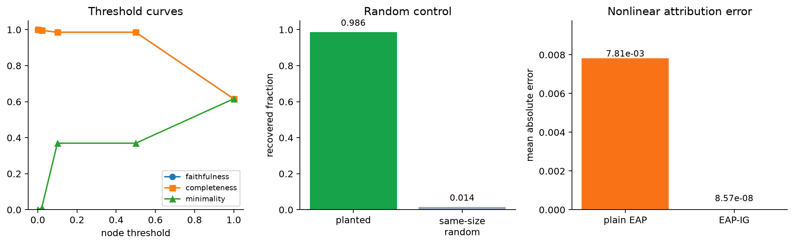

# [8.5] Sparse Feature Circuits

> **Notebooks: [exercises](../../exercises/part5_sparse_feature_circuits/8.5_Sparse_Feature_Circuits_exercises.ipynb) | [solutions](../../exercises/part5_sparse_feature_circuits/8.5_Sparse_Feature_Circuits_solutions.ipynb)**

```python
GT_TIER = "GT-0"
EXERCISE_ID = "8_5_sparse_feature_circuits"
EXPECTED_RUNTIME = "seconds on toy contract; minutes on local real-model path"
REQUIRES_GPU = True  # parent verification path, not this CPU notebook pass
```

By the end of this notebook, you will have recovered an exact planted sparse-feature circuit, because exact node patching, exact edge patching, EAP-IG, thresholded graph metrics, and same-size random controls all identify the same sparse graph.

## Core Question

Can we discover a causal graph over interpretable SAE features, rather than over opaque residual dimensions, and know when the graph is faithful enough to trust?

This notebook is intentionally local-first. The main result is a GT-0 exact planted sparse-feature graph. The released Pythia-70M / official Sparse Feature Circuits artifact evidence is discussed at the end as a separate escalation path, and this CPU pass does not download or execute those artifacts.

## Learning Objectives

- Build a tiny SAE interface and reject graph claims before reconstruction and sparsity checks pass.
- Patch exact sparse-feature nodes and exact source-to-receiver edges in a graph with known ground truth.
- Compare one-gradient attribution patching with EAP-IG on a nonlinear readout where plain EAP visibly miscalibrates.
- Threshold a feature graph and measure faithfulness, minimality, completeness, and same-size random controls.
- Run a small SHIFT-style sparse-feature edit where suppressing the spurious feature improves OOD behavior while random edits fail.
- Keep the toy theorem separate from released-artifact evidence.

## Cold Open: The Planted Circuit

We will work with two prompts in feature space. The clean prompt has a plural-subject feature active; the corrupt prompt has a singular-subject feature active. A small source-feature-to-receiver-feature edge matrix routes these into a plural-minus-singular readout.

The correct sparse graph is known in advance:

```text
plural subject feature   -> plural relay
singular subject feature -> singular relay
```

Everything else is either shared syntax, a tiny formatting effect, a deliberately dead feature, or an SAE-error-like nuisance term. That makes this a real ground-truth exercise: the tests know which graph should be recovered and which controls should fail.

<details>
<summary>Common bug - mixing source and receiver feature indices</summary>

Keep edge scores indexed as `[receiver_feature, source_feature]` throughout patching, thresholding, and plotting. Transposing that convention can preserve the same values while reversing the graph and invalidating the causal interpretation.

</details>

```python
import json
import math
import sys
from dataclasses import dataclass
from pathlib import Path

import matplotlib.pyplot as plt
import torch as t
from IPython.display import Image, display

chapter = "chapter8_automated_circuits"
section = "part5_sparse_feature_circuits"
root_dir = next(p for p in [Path.cwd(), *Path.cwd().parents] if (p / chapter).exists())
exercises_dir = root_dir / chapter / "exercises"
section_dir = exercises_dir / section
assets_dir = section_dir / "assets"
assets_dir.mkdir(exist_ok=True)

if str(root_dir) not in sys.path:
    sys.path.append(str(root_dir))
if str(exercises_dir) not in sys.path:
    sys.path.append(str(exercises_dir))

import part5_sparse_feature_circuits.tests as tests
import part5_sparse_feature_circuits.utils as utils

t.manual_seed(0)
```

```python
@dataclass(frozen=True)
class SAEReconstructionReport:
    feature_shape: tuple[int, ...]
    reconstructed_shape: tuple[int, ...]
    l0_mean: float
    density: float
    dead_feature_fraction: float
    reconstruction_mse: float
    relative_l2_error: float
    loss_recovered: float
    passes_reconstruction: bool


@dataclass(frozen=True)
class FeatureNodePatchingReport:
    selected_feature_ids: tuple[int, ...]
    full_logit_diff: float
    graph_logit_diff: float
    recovered_fraction: float
    passes_recovery: bool


@dataclass(frozen=True)
class FeatureEdgePatchingReport:
    selected_edges: tuple[tuple[int, int], ...]
    full_edge_score: float
    graph_edge_score: float
    recovered_fraction: float
    passes_recovery: bool


@dataclass(frozen=True)
class EAPIGComparisonReport:
    exact_error: float
    eap_error: float
    eap_ig_error: float
    eap_passes: bool
    eap_ig_improves: bool


@dataclass(frozen=True)
class FeatureGraphThresholdReport:
    selected_feature_ids: tuple[int, ...]
    threshold: float
    full_logit_diff: float
    graph_logit_diff: float
    recovered_fraction: float
    passes_threshold: bool


@dataclass(frozen=True)
class RandomFeatureGraphControlReport:
    target_graph_logit_diff: float
    random_graph_logit_diff: float
    target_recovered_fraction: float
    random_recovered_fraction: float
    margin: float
    random_graph_fails: bool


@dataclass(frozen=True)
class SparseFeatureEditingReport:
    target_feature_ids: tuple[int, ...]
    spurious_feature_ids: tuple[int, ...]
    random_feature_ids: tuple[int, ...]
    baseline_train_accuracy: float
    baseline_ood_accuracy: float
    edited_train_accuracy: float
    edited_ood_accuracy: float
    random_edit_ood_accuracy: float
    black_box_baseline_ood_accuracy: float
    spurious_reliance_before: float
    spurious_reliance_after: float
    target_reliance_after: float
    ood_improvement: float
    random_edit_improvement: float
    target_accuracy_drop: float
    spurious_reliance_decreases: bool
    target_task_preserved: bool
    ood_generalization_improves: bool
    random_edit_control_fails: bool
    editing_passes: bool
```

```python
def _index_tensor(indices: t.Tensor | list[int] | tuple[int, ...], *, device: t.device) -> t.Tensor:
    if isinstance(indices, t.Tensor):
        return indices.to(device=device, dtype=t.long).flatten()
    return t.tensor(list(indices), device=device, dtype=t.long)


def _require_finite_tensor(name: str, tensor: t.Tensor) -> t.Tensor:
    if tensor.numel() == 0:
        raise ValueError(f"{name} must be non-empty.")
    if not t.isfinite(tensor.float()).all():
        raise ValueError(f"{name} must contain only finite values.")
    return tensor


def _require_finite_nonnegative(name: str, value: float) -> float:
    value_float = float(value)
    if not math.isfinite(value_float):
        raise ValueError(f"{name} must be finite.")
    if value_float < 0:
        raise ValueError(f"{name} must be non-negative.")
    return value_float


def _validate_index_tensor(ids: t.Tensor, *, name: str, upper_bound: int) -> t.Tensor:
    if ids.numel() == 0:
        raise ValueError(f"at least one {name} id is required.")
    if ids.min().item() < 0 or ids.max().item() >= upper_bound:
        raise ValueError(f"{name} id is out of range.")
    if ids.unique().numel() != ids.numel():
        raise ValueError(f"{name} ids must be unique.")
    return ids


def _fraction(numerator: float, denominator: float) -> float:
    if denominator == 0:
        raise ValueError("reference score must be nonzero.")
    return numerator / denominator
```

```python
def planted_sparse_feature_circuit_fixture(device: str | t.device = "cpu") -> dict[str, object]:
    """Return an exact sparse-feature graph with known node and edge ground truth."""

    device = t.device(device)
    clean_activation = t.tensor([1.0, 1.0, 0.0, 0.3, 0.0, 0.0], device=device)
    corrupt_activation = t.tensor([1.0, 0.0, 1.0, 0.1, 0.0, 0.2], device=device)
    encoder_weight = t.eye(6, device=device)
    encoder_bias = t.zeros(6, device=device)
    decoder_weight = t.eye(6, device=device)
    decoder_bias = t.zeros(6, device=device)
    edge_weights = t.zeros(6, 6, device=device)
    edge_weights[1, 0] = 1.20
    edge_weights[2, 1] = 0.80
    edge_weights[0, 2] = 0.30
    edge_weights[3, 3] = 0.20
    edge_weights[5, 5] = 1.00
    readout_weights = t.tensor([1.0, -0.9, 0.0, 0.2, 0.0, -0.1], device=device)
    return {
        "clean_activation": clean_activation,
        "corrupt_activation": corrupt_activation,
        "encoder_weight": encoder_weight,
        "encoder_bias": encoder_bias,
        "decoder_weight": decoder_weight,
        "decoder_bias": decoder_bias,
        "edge_weights": edge_weights,
        "readout_weights": readout_weights,
        "feature_names": (
            "shared subject token",
            "plural subject feature",
            "singular subject feature",
            "format feature",
            "dead distractor feature",
            "SAE error feature",
        ),
        "receiver_names": (
            "plural relay",
            "singular relay",
            "shared syntax relay",
            "format readout",
            "dead receiver",
            "SAE error receiver",
        ),
        "ground_truth_node_ids": (0, 1),
        "ground_truth_edges": ((1, 0), (2, 1)),
        "same_size_random_node_ids": (3, 5),
        "same_size_random_edges": ((3, 3), (5, 5)),
        "node_threshold": 0.10,
        "edge_threshold": 0.10,
    }


fixture = planted_sparse_feature_circuit_fixture()
print("Feature names:")
for i, name in enumerate(fixture["feature_names"]):
    print(f"  F{i}: {name}")
print("\nGround-truth receiver nodes:", fixture["ground_truth_node_ids"])
print("Ground-truth source->receiver edges:", fixture["ground_truth_edges"])
```

```python
def planted_receiver_activations(source_features: t.Tensor, edge_weights: t.Tensor) -> t.Tensor:
    source = _require_finite_tensor("source_features", source_features.float())
    edges = _require_finite_tensor("edge_weights", edge_weights.float())
    if edges.ndim != 2:
        raise ValueError("edge_weights must have shape [source_features, receiver_features].")
    if source.shape[-1] != edges.shape[0]:
        raise ValueError("source feature dimension must match edge_weights.")
    return source @ edges


def planted_circuit_metric(receiver_features: t.Tensor, readout_weights: t.Tensor) -> float:
    receiver = _require_finite_tensor("receiver_features", receiver_features.float())
    readout = _require_finite_tensor("readout_weights", readout_weights.float())
    if receiver.shape[-1] != readout.numel():
        raise ValueError("receiver_features and readout_weights must align.")
    return float((receiver * readout).sum(dim=-1).mean().item())
```

### Exercise - implement `toy_sae_encode`

> ```yaml
> Difficulty: medium
> Importance: high
>
> You should spend 10-15 minutes on this exercise.
> ```

Implement the SAE encode/decode path and the metrics gate. Do not move on to graph attribution until reconstruction error, L0, density, and dead-feature fraction are visible.

<details>
<summary>Expected output</summary>

```text
All tests in `test_toy_sae_encode_decode_metrics_on_planted_fixture` passed!
```

</details>

<details>
<summary>Help - first things to check</summary>

Use `x @ W_enc.T + b_enc`, apply `relu`, decode with `features @ W_dec.T + b_dec`, and compute metrics over a batch dimension even for one example.

</details>

<details>
<summary>Interpretation</summary>

The planted SAE reconstructs exactly, but it is still sparse: the mean L0 is 3.5 out of 6 and one feature is dead. In a real SAE, this is where you would inspect loss recovered and feature density before trusting any circuit.

</details>

<details>
<summary>Solution</summary>

```python
def toy_sae_encode(
    activations: t.Tensor,
    encoder_weight: t.Tensor,
    encoder_bias: t.Tensor,
) -> t.Tensor:
    acts = _require_finite_tensor("activations", activations.float())
    weight = _require_finite_tensor("encoder_weight", encoder_weight.float())
    bias = _require_finite_tensor("encoder_bias", encoder_bias.float())
    if weight.ndim != 2:
        raise ValueError("encoder_weight must have shape [features, activation].")
    if bias.shape != (weight.shape[0],):
        raise ValueError("encoder_bias must have shape [features].")
    if acts.shape[-1] != weight.shape[1]:
        raise ValueError("activation dimension must match encoder_weight.")
    return t.relu(acts @ weight.T + bias)


def toy_sae_decode(
    feature_acts: t.Tensor,
    decoder_weight: t.Tensor,
    decoder_bias: t.Tensor,
) -> t.Tensor:
    features = _require_finite_tensor("feature_acts", feature_acts.float())
    weight = _require_finite_tensor("decoder_weight", decoder_weight.float())
    bias = _require_finite_tensor("decoder_bias", decoder_bias.float())
    if weight.ndim != 2:
        raise ValueError("decoder_weight must have shape [activation, features].")
    if bias.shape != (weight.shape[0],):
        raise ValueError("decoder_bias must have shape [activation].")
    if features.shape[-1] != weight.shape[1]:
        raise ValueError("feature dimension must match decoder_weight.")
    return features @ weight.T + bias


def sae_reconstruction_report(
    activations: t.Tensor,
    feature_acts: t.Tensor,
    reconstructions: t.Tensor,
    *,
    active_threshold: float = 1e-6,
    max_relative_l2_error: float = 1e-6,
) -> SAEReconstructionReport:
    active_threshold = _require_finite_nonnegative("active_threshold", active_threshold)
    max_relative_l2_error = _require_finite_nonnegative("max_relative_l2_error", max_relative_l2_error)
    acts = _require_finite_tensor("activations", activations.float())
    features = _require_finite_tensor("feature_acts", feature_acts.float())
    recon = _require_finite_tensor("reconstructions", reconstructions.float())
    if acts.shape != recon.shape:
        raise ValueError("activations and reconstructions must have matching shapes.")
    if acts.ndim == 1:
        acts_2d = acts.unsqueeze(0)
        features_2d = features.unsqueeze(0)
        recon_2d = recon.unsqueeze(0)
    elif acts.ndim == 2:
        acts_2d = acts
        features_2d = features
        recon_2d = recon
    else:
        raise ValueError("activations must be rank-1 or rank-2.")
    if features_2d.ndim != 2 or features_2d.shape[0] != acts_2d.shape[0]:
        raise ValueError("feature_acts must be rank-2 with the same batch size.")
    error = recon_2d - acts_2d
    mse = error.pow(2).mean().item()
    relative_l2_error = (error.norm(dim=-1) / acts_2d.norm(dim=-1).clamp_min(1e-12)).mean().item()
    zero_baseline_mse = acts_2d.pow(2).mean().clamp_min(1e-12).item()
    active = features_2d.abs().gt(active_threshold)
    l0_mean = active.sum(dim=-1).float().mean().item()
    density = active.float().mean().item()
    dead_feature_fraction = active.any(dim=0).logical_not().float().mean().item()
    loss_recovered = 1.0 - mse / zero_baseline_mse
    return SAEReconstructionReport(
        feature_shape=tuple(int(x) for x in features.shape),
        reconstructed_shape=tuple(int(x) for x in recon.shape),
        l0_mean=l0_mean,
        density=density,
        dead_feature_fraction=dead_feature_fraction,
        reconstruction_mse=mse,
        relative_l2_error=relative_l2_error,
        loss_recovered=loss_recovered,
        passes_reconstruction=relative_l2_error <= max_relative_l2_error,
    )


tests.test_toy_sae_encode_decode_metrics_on_planted_fixture(
    toy_sae_encode,
    toy_sae_decode,
    sae_reconstruction_report,
)
```

</details>

```python
def toy_sae_encode(
    activations: t.Tensor,
    encoder_weight: t.Tensor,
    encoder_bias: t.Tensor,
) -> t.Tensor:
    """Encode activations with a ReLU SAE."""
    raise NotImplementedError()


def toy_sae_decode(
    feature_acts: t.Tensor,
    decoder_weight: t.Tensor,
    decoder_bias: t.Tensor,
) -> t.Tensor:
    """Decode SAE features back into activation space."""
    raise NotImplementedError()


def sae_reconstruction_report(
    activations: t.Tensor,
    feature_acts: t.Tensor,
    reconstructions: t.Tensor,
    *,
    active_threshold: float = 1e-6,
    max_relative_l2_error: float = 1e-6,
) -> SAEReconstructionReport:
    """Report L0, density, dead features, and reconstruction quality."""
    raise NotImplementedError()


tests.test_toy_sae_encode_decode_metrics_on_planted_fixture(
    toy_sae_encode,
    toy_sae_decode,
    sae_reconstruction_report,
)
```

### Exercise - implement `exact_planted_node_patch_scores`

> ```yaml
> Difficulty: medium
> Importance: high
>
> You should spend 10-20 minutes on this exercise.
> ```

Implement exact receiver-node patching. The score for a receiver feature is its clean-minus-corrupt activation difference times the readout weight, and patching should replace selected corrupt receiver nodes with clean ones.

<details>
<summary>Expected output</summary>

```text
All tests in `test_exact_feature_node_patching_report_recovers_selected_features` passed!
All tests in `test_exact_planted_node_patch_scores_identify_known_nodes` passed!
```

</details>

<details>
<summary>Help - first things to check</summary>

The denominator is the full logit-difference effect across all receiver features. Reject empty, duplicate, or out-of-range node selections because they make recovered fractions meaningless.

</details>

<details>
<summary>Interpretation</summary>

The plural and singular relay nodes recover more than 98% of the full effect. Small nuisance nodes remain measurable, but they are not the circuit.

</details>

<details>
<summary>Solution</summary>

```python
def exact_feature_node_patching_report(
    feature_contributions: t.Tensor,
    feature_ids: t.Tensor | list[int] | tuple[int, ...],
    *,
    min_recovered_fraction: float = 0.75,
) -> FeatureNodePatchingReport:
    min_recovered_fraction = _require_finite_nonnegative("min_recovered_fraction", min_recovered_fraction)
    contributions = _require_finite_tensor("feature_contributions", feature_contributions.flatten().float())
    ids = _validate_index_tensor(
        _index_tensor(feature_ids, device=contributions.device),
        name="feature",
        upper_bound=contributions.numel(),
    )
    full_logit_diff = contributions.sum().item()
    graph_logit_diff = contributions[ids].sum().item()
    recovered_fraction = _fraction(graph_logit_diff, full_logit_diff)
    return FeatureNodePatchingReport(
        selected_feature_ids=tuple(int(index) for index in ids.tolist()),
        full_logit_diff=full_logit_diff,
        graph_logit_diff=graph_logit_diff,
        recovered_fraction=recovered_fraction,
        passes_recovery=recovered_fraction >= min_recovered_fraction,
    )


def exact_planted_node_patch_scores(
    clean_receiver_features: t.Tensor,
    corrupt_receiver_features: t.Tensor,
    readout_weights: t.Tensor,
) -> t.Tensor:
    clean = _require_finite_tensor("clean_receiver_features", clean_receiver_features.float())
    corrupt = _require_finite_tensor("corrupt_receiver_features", corrupt_receiver_features.float())
    readout = _require_finite_tensor("readout_weights", readout_weights.float())
    if clean.shape != corrupt.shape:
        raise ValueError("clean and corrupt receiver features must match.")
    if clean.shape[-1] != readout.numel():
        raise ValueError("receiver features and readout weights must align.")
    return (clean - corrupt) * readout


def patch_planted_nodes(
    corrupt_receiver_features: t.Tensor,
    clean_receiver_features: t.Tensor,
    readout_weights: t.Tensor,
    node_ids: t.Tensor | list[int] | tuple[int, ...],
) -> float:
    clean = _require_finite_tensor("clean_receiver_features", clean_receiver_features.float())
    corrupt = _require_finite_tensor("corrupt_receiver_features", corrupt_receiver_features.float())
    if clean.shape != corrupt.shape:
        raise ValueError("clean and corrupt receiver features must match.")
    ids = _validate_index_tensor(
        _index_tensor(node_ids, device=corrupt.device),
        name="receiver node",
        upper_bound=corrupt.numel(),
    )
    patched = corrupt.clone()
    patched[ids] = clean[ids]
    return planted_circuit_metric(patched, readout_weights)


tests.test_exact_feature_node_patching_report_recovers_selected_features(
    exact_feature_node_patching_report,
)
tests.test_exact_planted_node_patch_scores_identify_known_nodes(
    exact_planted_node_patch_scores,
    patch_planted_nodes,
)
```

</details>

```python
def exact_feature_node_patching_report(
    feature_contributions: t.Tensor,
    feature_ids: t.Tensor | list[int] | tuple[int, ...],
    *,
    min_recovered_fraction: float = 0.75,
) -> FeatureNodePatchingReport:
    """Score how much selected feature nodes recover from the full effect."""
    raise NotImplementedError()


def exact_planted_node_patch_scores(
    clean_receiver_features: t.Tensor,
    corrupt_receiver_features: t.Tensor,
    readout_weights: t.Tensor,
) -> t.Tensor:
    """Return exact receiver-feature patching effects for every node."""
    raise NotImplementedError()


def patch_planted_nodes(
    corrupt_receiver_features: t.Tensor,
    clean_receiver_features: t.Tensor,
    readout_weights: t.Tensor,
    node_ids: t.Tensor | list[int] | tuple[int, ...],
) -> float:
    """Patch selected clean receiver nodes into the corrupt graph."""
    raise NotImplementedError()


tests.test_exact_feature_node_patching_report_recovers_selected_features(
    exact_feature_node_patching_report,
)
tests.test_exact_planted_node_patch_scores_identify_known_nodes(
    exact_planted_node_patch_scores,
    patch_planted_nodes,
)
```

### Exercise - implement `exact_planted_edge_patch_scores`

> ```yaml
> Difficulty: hard
> Importance: high
>
> You should spend 15-25 minutes on this exercise.
> ```

Move from node scores to source-to-receiver edge scores. This is the Sparse Feature Circuits move: edges are no longer head-to-head or layer-to-layer, they are feature-to-feature.

<details>
<summary>Expected output</summary>

```text
All tests in `test_exact_feature_edge_patching_report_recovers_selected_edges` passed!
All tests in `test_exact_planted_edge_patch_scores_identify_known_edges` passed!
```

</details>

<details>
<summary>Help - first things to check</summary>

Each edge contribution is `(clean_source - corrupt_source) * edge_weight * readout`. Use absolute edge magnitudes when scoring how much edge mass the selected graph captures.

</details>

<details>
<summary>Interpretation</summary>

The two planted edges recover almost all of the exact edge effect. This is the visible toy analogue of an SFC graph where feature nodes and edge effects replace architecture-level nodes.

</details>

<details>
<summary>Solution</summary>

```python
def exact_feature_edge_patching_report(
    edge_scores: t.Tensor,
    selected_edges: list[tuple[int, int]] | tuple[tuple[int, int], ...],
    *,
    min_recovered_fraction: float = 0.75,
) -> FeatureEdgePatchingReport:
    min_recovered_fraction = _require_finite_nonnegative("min_recovered_fraction", min_recovered_fraction)
    if edge_scores.ndim != 2:
        raise ValueError("edge_scores must have shape (sources, features).")
    edge_scores = _require_finite_tensor("edge_scores", edge_scores.float())
    if not selected_edges:
        raise ValueError("at least one edge is required.")
    edge_magnitudes = edge_scores.abs()
    selected_score = 0.0
    normalized_edges = []
    for source_id, feature_id in selected_edges:
        if not 0 <= source_id < edge_scores.shape[0]:
            raise ValueError("source id is out of range.")
        if not 0 <= feature_id < edge_scores.shape[1]:
            raise ValueError("feature id is out of range.")
        selected_score += edge_magnitudes[source_id, feature_id].item()
        normalized_edges.append((int(source_id), int(feature_id)))
    if len(set(normalized_edges)) != len(normalized_edges):
        raise ValueError("selected edges must be unique.")
    full_score = edge_magnitudes.sum().item()
    recovered_fraction = _fraction(selected_score, full_score)
    return FeatureEdgePatchingReport(
        selected_edges=tuple(normalized_edges),
        full_edge_score=full_score,
        graph_edge_score=selected_score,
        recovered_fraction=recovered_fraction,
        passes_recovery=recovered_fraction >= min_recovered_fraction,
    )


def exact_planted_edge_patch_scores(
    clean_source_features: t.Tensor,
    corrupt_source_features: t.Tensor,
    edge_weights: t.Tensor,
    readout_weights: t.Tensor,
) -> t.Tensor:
    clean = _require_finite_tensor("clean_source_features", clean_source_features.float())
    corrupt = _require_finite_tensor("corrupt_source_features", corrupt_source_features.float())
    edges = _require_finite_tensor("edge_weights", edge_weights.float())
    readout = _require_finite_tensor("readout_weights", readout_weights.float())
    if clean.shape != corrupt.shape:
        raise ValueError("clean and corrupt source features must match.")
    if edges.ndim != 2 or edges.shape[0] != clean.numel():
        raise ValueError("edge_weights must have one row per source feature.")
    if edges.shape[1] != readout.numel():
        raise ValueError("edge_weights columns must align with readout_weights.")
    return (clean - corrupt).unsqueeze(-1) * edges * readout.unsqueeze(0)


def patch_planted_edges(
    corrupt_source_features: t.Tensor,
    clean_source_features: t.Tensor,
    edge_weights: t.Tensor,
    readout_weights: t.Tensor,
    selected_edges: list[tuple[int, int]] | tuple[tuple[int, int], ...],
) -> float:
    clean = _require_finite_tensor("clean_source_features", clean_source_features.float())
    corrupt = _require_finite_tensor("corrupt_source_features", corrupt_source_features.float())
    edges = _require_finite_tensor("edge_weights", edge_weights.float())
    if not selected_edges:
        raise ValueError("at least one edge is required.")
    if clean.shape != corrupt.shape or edges.shape[0] != clean.numel():
        raise ValueError("source features and edge rows must align.")
    normalized_edges = []
    edge_contribs = corrupt.unsqueeze(-1) * edges
    for source_id, receiver_id in selected_edges:
        if not 0 <= source_id < edges.shape[0]:
            raise ValueError("source id is out of range.")
        if not 0 <= receiver_id < edges.shape[1]:
            raise ValueError("receiver id is out of range.")
        edge_contribs[source_id, receiver_id] = clean[source_id] * edges[source_id, receiver_id]
        normalized_edges.append((int(source_id), int(receiver_id)))
    if len(set(normalized_edges)) != len(normalized_edges):
        raise ValueError("selected edges must be unique.")
    receiver = edge_contribs.sum(dim=0)
    return planted_circuit_metric(receiver, readout_weights)


tests.test_exact_feature_edge_patching_report_recovers_selected_edges(
    exact_feature_edge_patching_report,
)
tests.test_exact_planted_edge_patch_scores_identify_known_edges(
    exact_planted_edge_patch_scores,
    patch_planted_edges,
)
```

</details>

```python
def exact_feature_edge_patching_report(
    edge_scores: t.Tensor,
    selected_edges: list[tuple[int, int]] | tuple[tuple[int, int], ...],
    *,
    min_recovered_fraction: float = 0.75,
) -> FeatureEdgePatchingReport:
    """Score how much selected source->receiver edges recover."""
    raise NotImplementedError()


def exact_planted_edge_patch_scores(
    clean_source_features: t.Tensor,
    corrupt_source_features: t.Tensor,
    edge_weights: t.Tensor,
    readout_weights: t.Tensor,
) -> t.Tensor:
    """Return exact edge patching effects for every source->receiver edge."""
    raise NotImplementedError()


def patch_planted_edges(
    corrupt_source_features: t.Tensor,
    clean_source_features: t.Tensor,
    edge_weights: t.Tensor,
    readout_weights: t.Tensor,
    selected_edges: list[tuple[int, int]] | tuple[tuple[int, int], ...],
) -> float:
    """Patch selected clean edge contributions into the corrupt graph."""
    raise NotImplementedError()


tests.test_exact_feature_edge_patching_report_recovers_selected_edges(
    exact_feature_edge_patching_report,
)
tests.test_exact_planted_edge_patch_scores_identify_known_edges(
    exact_planted_edge_patch_scores,
    patch_planted_edges,
)
```

### Exercise - implement `nonlinear_eap_ig_edge_attribution_report`

> ```yaml
> Difficulty: hard
> Importance: high
>
> You should spend 20-30 minutes on this exercise.
> ```

Implement the attribution comparison. Plain EAP uses a single gradient at the corrupt point. EAP-IG averages gradients along the clean-corrupt activation path.

<details>
<summary>Expected output</summary>

```text
All tests in `test_eap_ig_comparison_report_improves_over_plain_eap` passed!
All tests in `test_nonlinear_eap_ig_beats_plain_attribution_patching` passed!
```

</details>

<details>
<summary>Help - first things to check</summary>

For the nonlinear toy readout, compute the exact total change under `tanh`, then compare one-gradient EAP to midpoint-rule integrated gradients along the path.

</details>

<details>
<summary>Interpretation</summary>

Plain EAP is fast but wrong when the readout is saturated. EAP-IG is slower but tracks the path and recovers the nonlinear total effect.

</details>

<details>
<summary>Solution</summary>

```python
def eap_ig_comparison_report(
    exact_scores: t.Tensor,
    eap_scores: t.Tensor,
    eap_ig_scores: t.Tensor,
    *,
    max_eap_ig_error: float = 0.05,
) -> EAPIGComparisonReport:
    max_eap_ig_error = _require_finite_nonnegative("max_eap_ig_error", max_eap_ig_error)
    if exact_scores.shape != eap_scores.shape or exact_scores.shape != eap_ig_scores.shape:
        raise ValueError("exact, EAP, and EAP-IG scores must have matching shapes.")
    exact = _require_finite_tensor("exact_scores", exact_scores.float())
    eap = _require_finite_tensor("eap_scores", eap_scores.float())
    eap_ig = _require_finite_tensor("eap_ig_scores", eap_ig_scores.float())
    eap_error = (exact - eap).abs().mean().item()
    eap_ig_error = (exact - eap_ig).abs().mean().item()
    return EAPIGComparisonReport(
        exact_error=0.0,
        eap_error=eap_error,
        eap_ig_error=eap_ig_error,
        eap_passes=eap_error <= max_eap_ig_error,
        eap_ig_improves=eap_ig_error < eap_error and eap_ig_error <= max_eap_ig_error,
    )


def nonlinear_eap_ig_edge_attribution_report(
    clean_source_features: t.Tensor,
    corrupt_source_features: t.Tensor,
    edge_weights: t.Tensor,
    readout_weights: t.Tensor,
    *,
    steps: int = 256,
) -> dict[str, object]:
    if steps <= 1:
        raise ValueError("steps must be greater than 1.")
    edge_delta = exact_planted_edge_patch_scores(
        clean_source_features,
        corrupt_source_features,
        edge_weights,
        readout_weights,
    )
    clean_receiver = planted_receiver_activations(clean_source_features, edge_weights)
    corrupt_receiver = planted_receiver_activations(corrupt_source_features, edge_weights)
    clean_linear = t.tensor(planted_circuit_metric(clean_receiver, readout_weights))
    corrupt_linear = t.tensor(planted_circuit_metric(corrupt_receiver, readout_weights))
    total_linear_delta = edge_delta.sum()
    if total_linear_delta.abs().item() < 1e-12:
        raise ValueError("total linear edge effect must be nonzero.")
    exact_total = t.tanh(clean_linear) - t.tanh(corrupt_linear)
    exact_path_scores = edge_delta * (exact_total / total_linear_delta)
    corrupt_grad = 1.0 - t.tanh(corrupt_linear).pow(2)
    eap_scores = edge_delta * corrupt_grad
    alphas = (t.arange(steps, dtype=edge_delta.dtype, device=edge_delta.device) + 0.5) / steps
    path_values = corrupt_linear + alphas * total_linear_delta
    path_grads = 1.0 - t.tanh(path_values).pow(2)
    eap_ig_scores = edge_delta * path_grads.mean()
    eap_error = (exact_path_scores - eap_scores).abs().mean().item()
    eap_ig_error = (exact_path_scores - eap_ig_scores).abs().mean().item()
    return {
        "exact_total_effect": float(exact_total.item()),
        "linear_total_effect": float(total_linear_delta.item()),
        "exact_path_scores": exact_path_scores,
        "eap_scores": eap_scores,
        "eap_ig_scores": eap_ig_scores,
        "eap_error": eap_error,
        "eap_ig_error": eap_ig_error,
        "eap_ig_improves": eap_ig_error < eap_error,
        "eap_total": float(eap_scores.sum().item()),
        "eap_ig_total": float(eap_ig_scores.sum().item()),
    }


tests.test_eap_ig_comparison_report_improves_over_plain_eap(eap_ig_comparison_report)
tests.test_nonlinear_eap_ig_beats_plain_attribution_patching(
    nonlinear_eap_ig_edge_attribution_report,
)
```

</details>

```python
def eap_ig_comparison_report(
    exact_scores: t.Tensor,
    eap_scores: t.Tensor,
    eap_ig_scores: t.Tensor,
    *,
    max_eap_ig_error: float = 0.05,
) -> EAPIGComparisonReport:
    """Compare EAP and EAP-IG score tensors against exact patching."""
    raise NotImplementedError()


def nonlinear_eap_ig_edge_attribution_report(
    clean_source_features: t.Tensor,
    corrupt_source_features: t.Tensor,
    edge_weights: t.Tensor,
    readout_weights: t.Tensor,
    *,
    steps: int = 256,
) -> dict[str, object]:
    """Compare one-gradient EAP to EAP-IG on a nonlinear readout."""
    raise NotImplementedError()


tests.test_eap_ig_comparison_report_improves_over_plain_eap(eap_ig_comparison_report)
tests.test_nonlinear_eap_ig_beats_plain_attribution_patching(
    nonlinear_eap_ig_edge_attribution_report,
)
```

### Exercise - implement `threshold_sparse_feature_graph`

> ```yaml
> Difficulty: medium
> Importance: high
>
> You should spend 10-15 minutes on this exercise.
> ```

Threshold node and edge scores, then check that the selected graph still recovers the metric. This is where a pretty graph becomes a quantitative claim.

<details>
<summary>Expected output</summary>

```text
All tests in `test_threshold_feature_graph_report_keeps_large_features` passed!
All tests in `test_threshold_graph_metrics_and_random_controls` passed!
```

</details>

<details>
<summary>Help - first things to check</summary>

Use `abs(score) >= threshold`. If nothing is selected, raise a clear error; an empty graph is not an explanation of a nonzero effect.

</details>

<details>
<summary>Interpretation</summary>

At the default threshold, the graph is exactly the two planted nodes and two planted edges. At a too-high threshold, it drops an important node and fails faithfulness.

</details>

<details>
<summary>Solution</summary>

```python
def threshold_feature_graph_report(
    feature_contributions: t.Tensor,
    *,
    threshold: float,
    min_recovered_fraction: float = 0.8,
) -> FeatureGraphThresholdReport:
    threshold = _require_finite_nonnegative("threshold", threshold)
    min_recovered_fraction = _require_finite_nonnegative("min_recovered_fraction", min_recovered_fraction)
    contributions = _require_finite_tensor("feature_contributions", feature_contributions.flatten().float())
    selected = contributions.abs().ge(threshold).nonzero(as_tuple=False).flatten()
    if selected.numel() == 0:
        raise ValueError("threshold selected no features.")
    node_report = exact_feature_node_patching_report(
        contributions,
        selected,
        min_recovered_fraction=min_recovered_fraction,
    )
    return FeatureGraphThresholdReport(
        selected_feature_ids=node_report.selected_feature_ids,
        threshold=threshold,
        full_logit_diff=node_report.full_logit_diff,
        graph_logit_diff=node_report.graph_logit_diff,
        recovered_fraction=node_report.recovered_fraction,
        passes_threshold=node_report.passes_recovery,
    )


def threshold_sparse_feature_graph(
    node_scores: t.Tensor,
    edge_scores: t.Tensor,
    *,
    node_threshold: float,
    edge_threshold: float,
    min_node_recovery: float = 0.9,
    min_edge_recovery: float = 0.9,
) -> dict[str, object]:
    node_threshold = _require_finite_nonnegative("node_threshold", node_threshold)
    edge_threshold = _require_finite_nonnegative("edge_threshold", edge_threshold)
    nodes = _require_finite_tensor("node_scores", node_scores.flatten().float())
    edges = _require_finite_tensor("edge_scores", edge_scores.float())
    if edges.ndim != 2:
        raise ValueError("edge_scores must have shape [source, receiver].")
    selected_nodes = nodes.abs().ge(node_threshold).nonzero(as_tuple=False).flatten()
    selected_edge_tensor = edges.abs().ge(edge_threshold).nonzero(as_tuple=False)
    if selected_nodes.numel() == 0:
        raise ValueError("node threshold selected no features.")
    if selected_edge_tensor.numel() == 0:
        raise ValueError("edge threshold selected no edges.")
    selected_edges = tuple((int(src), int(dst)) for src, dst in selected_edge_tensor.tolist())
    node_report = exact_feature_node_patching_report(
        nodes,
        selected_nodes,
        min_recovered_fraction=min_node_recovery,
    )
    edge_report = exact_feature_edge_patching_report(
        edges,
        selected_edges,
        min_recovered_fraction=min_edge_recovery,
    )
    return {
        "selected_node_ids": node_report.selected_feature_ids,
        "selected_edges": selected_edges,
        "node_recovered_fraction": node_report.recovered_fraction,
        "edge_recovered_fraction": edge_report.recovered_fraction,
        "passes_threshold": node_report.passes_recovery and edge_report.passes_recovery,
    }


tests.test_threshold_feature_graph_report_keeps_large_features(threshold_feature_graph_report)
tests.test_threshold_graph_metrics_and_random_controls(threshold_sparse_feature_graph, None)
```

</details>

```python
def threshold_feature_graph_report(
    feature_contributions: t.Tensor,
    *,
    threshold: float,
    min_recovered_fraction: float = 0.8,
) -> FeatureGraphThresholdReport:
    """Select feature nodes by absolute contribution and check recovery."""
    raise NotImplementedError()


def threshold_sparse_feature_graph(
    node_scores: t.Tensor,
    edge_scores: t.Tensor,
    *,
    node_threshold: float,
    edge_threshold: float,
    min_node_recovery: float = 0.9,
    min_edge_recovery: float = 0.9,
) -> dict[str, object]:
    """Threshold nodes and edges, then score exact recovered effect mass."""
    raise NotImplementedError()


tests.test_threshold_feature_graph_report_keeps_large_features(threshold_feature_graph_report)
tests.test_threshold_graph_metrics_and_random_controls(threshold_sparse_feature_graph, None)
```

### Exercise - implement `faithfulness_minimality_completeness_report`

> ```yaml
> Difficulty: medium
> Importance: high
>
> You should spend 15-20 minutes on this exercise.
> ```

Compute the validation curves and the same-size random graph control. Faithfulness asks how much of the full effect the graph preserves; completeness asks what is lost by omitting nodes; minimality asks whether each kept node matters.

<details>
<summary>Expected output</summary>

```text
All tests in `test_random_feature_graph_control_report_rejects_random_graph` passed!
All tests in `test_threshold_graph_metrics_and_random_controls` passed!
```

</details>

<details>
<summary>Help - first things to check</summary>

The random graph must be disjoint and the same size. If it overlaps the target graph, the baseline has leaked the answer.

</details>

<details>
<summary>Interpretation</summary>

The planted graph has high faithfulness and completeness, while the same-size random graph recovers only the nuisance effects. This is the control that keeps the graph from being decoration.

</details>

<details>
<summary>Solution</summary>

```python
def random_feature_graph_control_report(
    feature_contributions: t.Tensor,
    target_feature_ids: t.Tensor | list[int] | tuple[int, ...],
    random_feature_ids: t.Tensor | list[int] | tuple[int, ...],
    *,
    min_margin: float = 0.2,
) -> RandomFeatureGraphControlReport:
    min_margin = _require_finite_nonnegative("min_margin", min_margin)
    contributions = _require_finite_tensor("feature_contributions", feature_contributions.flatten().float())
    target_ids = _validate_index_tensor(
        _index_tensor(target_feature_ids, device=contributions.device),
        name="target feature",
        upper_bound=contributions.numel(),
    )
    random_ids = _validate_index_tensor(
        _index_tensor(random_feature_ids, device=contributions.device),
        name="random feature",
        upper_bound=contributions.numel(),
    )
    if target_ids.numel() != random_ids.numel():
        raise ValueError("target and random graphs must have the same number of features.")
    if set(target_ids.tolist()) & set(random_ids.tolist()):
        raise ValueError("random graph control must not overlap target features.")
    target = exact_feature_node_patching_report(contributions, target_ids)
    random = exact_feature_node_patching_report(contributions, random_ids)
    margin = target.recovered_fraction - random.recovered_fraction
    return RandomFeatureGraphControlReport(
        target_graph_logit_diff=target.graph_logit_diff,
        random_graph_logit_diff=random.graph_logit_diff,
        target_recovered_fraction=target.recovered_fraction,
        random_recovered_fraction=random.recovered_fraction,
        margin=margin,
        random_graph_fails=margin >= min_margin,
    )


def faithfulness_minimality_completeness_report(
    feature_contributions: t.Tensor,
    selected_feature_ids: t.Tensor | list[int] | tuple[int, ...],
    random_feature_ids: t.Tensor | list[int] | tuple[int, ...],
    *,
    min_faithfulness: float = 0.9,
    min_random_margin: float = 0.5,
) -> dict[str, object]:
    contributions = _require_finite_tensor("feature_contributions", feature_contributions.flatten().float())
    selected = _validate_index_tensor(
        _index_tensor(selected_feature_ids, device=contributions.device),
        name="selected feature",
        upper_bound=contributions.numel(),
    )
    random_ids = _validate_index_tensor(
        _index_tensor(random_feature_ids, device=contributions.device),
        name="random feature",
        upper_bound=contributions.numel(),
    )
    if selected.numel() != random_ids.numel():
        raise ValueError("selected and random graphs must have the same size.")
    if set(selected.tolist()) & set(random_ids.tolist()):
        raise ValueError("random graph must be disjoint from selected features.")
    full_score = contributions.sum().item()
    selected_score = contributions[selected].sum().item()
    random_score = contributions[random_ids].sum().item()
    if abs(full_score) < 1e-12:
        raise ValueError("full feature contribution must be nonzero.")
    faithfulness = selected_score / full_score
    completeness = 1.0 - abs(full_score - selected_score) / abs(full_score)
    minimality = (contributions[selected].abs().min() / abs(full_score)).item()
    random_fraction = random_score / full_score
    random_margin = faithfulness - random_fraction
    return {
        "selected_feature_ids": tuple(int(x) for x in selected.tolist()),
        "random_feature_ids": tuple(int(x) for x in random_ids.tolist()),
        "full_score": full_score,
        "selected_score": selected_score,
        "faithfulness": faithfulness,
        "minimality": minimality,
        "completeness": completeness,
        "random_fraction": random_fraction,
        "random_margin": random_margin,
        "passes": faithfulness >= min_faithfulness and random_margin >= min_random_margin,
    }


def threshold_sweep_rows(
    feature_contributions: t.Tensor,
    thresholds: list[float] | tuple[float, ...] = (0.0, 0.02, 0.10, 0.50, 1.00),
) -> list[dict[str, float]]:
    contributions = _require_finite_tensor("feature_contributions", feature_contributions.flatten().float())
    rows = []
    full_score = contributions.sum().item()
    if abs(full_score) < 1e-12:
        raise ValueError("full feature contribution must be nonzero.")
    for threshold in thresholds:
        threshold = _require_finite_nonnegative("threshold", threshold)
        selected = contributions.abs().ge(threshold).nonzero(as_tuple=False).flatten()
        if selected.numel() == 0:
            selected_score = 0.0
            minimality = 0.0
        else:
            selected_score = contributions[selected].sum().item()
            minimality = (contributions[selected].abs().min() / abs(full_score)).item()
        rows.append(
            {
                "threshold": float(threshold),
                "num_features": float(selected.numel()),
                "faithfulness": float(selected_score / full_score),
                "minimality": float(minimality),
                "completeness": float(1.0 - abs(full_score - selected_score) / abs(full_score)),
            }
        )
    return rows


tests.test_random_feature_graph_control_report_rejects_random_graph(random_feature_graph_control_report)
tests.test_threshold_graph_metrics_and_random_controls(None, faithfulness_minimality_completeness_report)
```

</details>

```python
def random_feature_graph_control_report(
    feature_contributions: t.Tensor,
    target_feature_ids: t.Tensor | list[int] | tuple[int, ...],
    random_feature_ids: t.Tensor | list[int] | tuple[int, ...],
    *,
    min_margin: float = 0.2,
) -> RandomFeatureGraphControlReport:
    """Check that a target graph beats a disjoint same-size random graph."""
    raise NotImplementedError()


def faithfulness_minimality_completeness_report(
    feature_contributions: t.Tensor,
    selected_feature_ids: t.Tensor | list[int] | tuple[int, ...],
    random_feature_ids: t.Tensor | list[int] | tuple[int, ...],
    *,
    min_faithfulness: float = 0.9,
    min_random_margin: float = 0.5,
) -> dict[str, object]:
    """Measure faithfulness, minimality, completeness, and a random baseline."""
    raise NotImplementedError()


def threshold_sweep_rows(
    feature_contributions: t.Tensor,
    thresholds: list[float] | tuple[float, ...] = (0.0, 0.02, 0.10, 0.50, 1.00),
) -> list[dict[str, float]]:
    """Return rows for faithfulness/completeness/minimality curves."""
    raise NotImplementedError()


tests.test_random_feature_graph_control_report_rejects_random_graph(random_feature_graph_control_report)
tests.test_threshold_graph_metrics_and_random_controls(None, faithfulness_minimality_completeness_report)
```

### Exercise - implement `shift_style_sparse_feature_editing_report`

> ```yaml
> Difficulty: hard
> Importance: medium
>
> You should spend 15-25 minutes on this exercise.
> ```

Run a safe generated-data analogue of SHIFT-style editing. A classifier has learned a target feature and a spurious feature. Suppress the spurious feature and check train accuracy, OOD accuracy, and a same-size random edit.

<details>
<summary>Expected output</summary>

```text
All tests in `test_shift_style_sparse_feature_editing_report_removes_spurious_feature` passed!
```

</details>

<details>
<summary>Help - first things to check</summary>

Do not edit the target feature. Suppress only the spurious feature weights, then compare against suppressing the same number of random non-spurious features.

</details>

<details>
<summary>Interpretation</summary>

The unedited classifier is perfect on train and fails OOD. The sparse-feature edit fixes OOD without hurting train accuracy; the random edit does not.

</details>

<details>
<summary>Solution</summary>

```python
def _binary_accuracy(logits: t.Tensor, labels: t.Tensor) -> float:
    predictions = t.where(logits >= 0, t.ones_like(labels), -t.ones_like(labels))
    return predictions.eq(labels).float().mean().item()


def toy_shift_sparse_feature_editing_fixture(device: str | t.device = "cpu") -> dict[str, t.Tensor]:
    device = t.device(device)
    labels = t.tensor([1.0, 1.0, -1.0, -1.0], device=device)
    distractor = t.tensor([1.0, -1.0, 1.0, -1.0], device=device)
    train_features = t.stack([labels, labels, distractor, t.zeros_like(labels)], dim=1)
    ood_features = t.stack([labels, -labels, distractor, t.zeros_like(labels)], dim=1)
    return {
        "train_features": train_features,
        "train_labels": labels,
        "ood_features": ood_features,
        "ood_labels": labels,
        "classifier_weights": t.tensor([0.7, 1.0, 0.05, 0.0], device=device),
    }


def shift_style_sparse_feature_editing_report(
    train_features: t.Tensor,
    train_labels: t.Tensor,
    ood_features: t.Tensor,
    ood_labels: t.Tensor,
    classifier_weights: t.Tensor,
    *,
    target_feature_ids: t.Tensor | list[int] | tuple[int, ...],
    spurious_feature_ids: t.Tensor | list[int] | tuple[int, ...],
    random_feature_ids: t.Tensor | list[int] | tuple[int, ...],
    suppression: float = 0.0,
    max_target_accuracy_drop: float = 0.05,
    min_ood_improvement: float = 0.5,
    min_random_edit_gap: float = 0.5,
) -> SparseFeatureEditingReport:
    suppression = float(suppression)
    if not math.isfinite(suppression) or suppression < 0 or suppression > 1:
        raise ValueError("suppression must be between 0 and 1.")
    max_target_accuracy_drop = _require_finite_nonnegative("max_target_accuracy_drop", max_target_accuracy_drop)
    min_ood_improvement = _require_finite_nonnegative("min_ood_improvement", min_ood_improvement)
    min_random_edit_gap = _require_finite_nonnegative("min_random_edit_gap", min_random_edit_gap)
    train = _require_finite_tensor("train_features", train_features.float())
    ood = _require_finite_tensor("ood_features", ood_features.float())
    labels_train = _require_finite_tensor("train_labels", train_labels.flatten().float())
    labels_ood = _require_finite_tensor("ood_labels", ood_labels.flatten().float())
    weights = _require_finite_tensor("classifier_weights", classifier_weights.flatten().float())
    if train.ndim != 2 or ood.ndim != 2:
        raise ValueError("train_features and ood_features must have shape [batch, features].")
    if train.shape[1] != weights.numel() or ood.shape[1] != weights.numel():
        raise ValueError("feature tensors must share classifier_weights feature dimension.")
    if train.shape[0] != labels_train.numel() or ood.shape[0] != labels_ood.numel():
        raise ValueError("labels must have one entry per feature row.")
    if not set(labels_train.tolist() + labels_ood.tolist()).issubset({-1.0, 1.0}):
        raise ValueError("labels must be encoded as -1 or +1.")
    target_ids = _validate_index_tensor(_index_tensor(target_feature_ids, device=weights.device), name="target feature", upper_bound=weights.numel())
    spurious_ids = _validate_index_tensor(_index_tensor(spurious_feature_ids, device=weights.device), name="spurious feature", upper_bound=weights.numel())
    random_ids = _validate_index_tensor(_index_tensor(random_feature_ids, device=weights.device), name="random feature", upper_bound=weights.numel())
    if spurious_ids.numel() != random_ids.numel():
        raise ValueError("random edit control must edit the same number of features.")
    if set(spurious_ids.tolist()) & set(random_ids.tolist()):
        raise ValueError("random edit control must not edit the spurious features.")
    if set(target_ids.tolist()) & set(spurious_ids.tolist()):
        raise ValueError("target and spurious features must be distinct.")

    baseline_train_accuracy = _binary_accuracy(train @ weights, labels_train)
    baseline_ood_accuracy = _binary_accuracy(ood @ weights, labels_ood)
    edited_weights = weights.clone()
    edited_weights[spurious_ids] *= suppression
    random_weights = weights.clone()
    random_weights[random_ids] *= suppression
    edited_train_accuracy = _binary_accuracy(train @ edited_weights, labels_train)
    edited_ood_accuracy = _binary_accuracy(ood @ edited_weights, labels_ood)
    random_edit_ood_accuracy = _binary_accuracy(ood @ random_weights, labels_ood)

    spurious_reliance_before = weights[spurious_ids].abs().sum().item()
    spurious_reliance_after = edited_weights[spurious_ids].abs().sum().item()
    target_reliance_after = edited_weights[target_ids].abs().sum().item()
    ood_improvement = edited_ood_accuracy - baseline_ood_accuracy
    random_edit_improvement = random_edit_ood_accuracy - baseline_ood_accuracy
    target_accuracy_drop = baseline_train_accuracy - edited_train_accuracy
    spurious_reliance_decreases = spurious_reliance_after < spurious_reliance_before
    target_task_preserved = target_accuracy_drop <= max_target_accuracy_drop
    ood_generalization_improves = ood_improvement >= min_ood_improvement
    random_edit_control_fails = edited_ood_accuracy - random_edit_ood_accuracy >= min_random_edit_gap
    return SparseFeatureEditingReport(
        target_feature_ids=tuple(int(index) for index in target_ids.tolist()),
        spurious_feature_ids=tuple(int(index) for index in spurious_ids.tolist()),
        random_feature_ids=tuple(int(index) for index in random_ids.tolist()),
        baseline_train_accuracy=baseline_train_accuracy,
        baseline_ood_accuracy=baseline_ood_accuracy,
        edited_train_accuracy=edited_train_accuracy,
        edited_ood_accuracy=edited_ood_accuracy,
        random_edit_ood_accuracy=random_edit_ood_accuracy,
        black_box_baseline_ood_accuracy=baseline_ood_accuracy,
        spurious_reliance_before=spurious_reliance_before,
        spurious_reliance_after=spurious_reliance_after,
        target_reliance_after=target_reliance_after,
        ood_improvement=ood_improvement,
        random_edit_improvement=random_edit_improvement,
        target_accuracy_drop=target_accuracy_drop,
        spurious_reliance_decreases=spurious_reliance_decreases,
        target_task_preserved=target_task_preserved,
        ood_generalization_improves=ood_generalization_improves,
        random_edit_control_fails=random_edit_control_fails,
        editing_passes=spurious_reliance_decreases and target_task_preserved and ood_generalization_improves and random_edit_control_fails,
    )


tests.test_shift_style_sparse_feature_editing_report_removes_spurious_feature(
    shift_style_sparse_feature_editing_report,
)
```

</details>

```python
def _binary_accuracy(logits: t.Tensor, labels: t.Tensor) -> float:
    predictions = t.where(logits >= 0, t.ones_like(labels), -t.ones_like(labels))
    return predictions.eq(labels).float().mean().item()


def toy_shift_sparse_feature_editing_fixture(device: str | t.device = "cpu") -> dict[str, t.Tensor]:
    device = t.device(device)
    labels = t.tensor([1.0, 1.0, -1.0, -1.0], device=device)
    distractor = t.tensor([1.0, -1.0, 1.0, -1.0], device=device)
    train_features = t.stack([labels, labels, distractor, t.zeros_like(labels)], dim=1)
    ood_features = t.stack([labels, -labels, distractor, t.zeros_like(labels)], dim=1)
    return {
        "train_features": train_features,
        "train_labels": labels,
        "ood_features": ood_features,
        "ood_labels": labels,
        "classifier_weights": t.tensor([0.7, 1.0, 0.05, 0.0], device=device),
    }


def shift_style_sparse_feature_editing_report(
    train_features: t.Tensor,
    train_labels: t.Tensor,
    ood_features: t.Tensor,
    ood_labels: t.Tensor,
    classifier_weights: t.Tensor,
    *,
    target_feature_ids: t.Tensor | list[int] | tuple[int, ...],
    spurious_feature_ids: t.Tensor | list[int] | tuple[int, ...],
    random_feature_ids: t.Tensor | list[int] | tuple[int, ...],
    suppression: float = 0.0,
    max_target_accuracy_drop: float = 0.05,
    min_ood_improvement: float = 0.5,
    min_random_edit_gap: float = 0.5,
) -> SparseFeatureEditingReport:
    """Suppress spurious sparse features and compare with a random edit."""
    raise NotImplementedError()


tests.test_shift_style_sparse_feature_editing_report_removes_spurious_feature(
    shift_style_sparse_feature_editing_report,
)
```

### Exercise - implement `run_planted_sparse_feature_signature`

> ```yaml
> Difficulty: medium
> Importance: high
>
> You should spend 10-15 minutes on this exercise.
> ```

Assemble the section result: SAE metrics, exact node and edge scores, thresholded graph, validation curves, random controls, and EAP-IG comparison.

<details>
<summary>Expected output</summary>

```text
All tests in `test_planted_sparse_feature_signature_result_is_visual_ready` passed!
```

</details>

<details>
<summary>Help - first things to check</summary>

This function should not read `verification_report.json`. It should recompute the toy theorem from the functions you wrote above.

</details>

<details>
<summary>Interpretation</summary>

The signature result is convincing because it is both visible and falsifiable: the same two feature edges win under exact patching, thresholding, EAP-IG, and random-control checks.

</details>

<details>
<summary>Solution</summary>

```python
def run_planted_sparse_feature_signature() -> dict[str, object]:
    fixture = planted_sparse_feature_circuit_fixture()
    clean = fixture["clean_activation"]
    corrupt = fixture["corrupt_activation"]
    clean_features = toy_sae_encode(clean, fixture["encoder_weight"], fixture["encoder_bias"])
    corrupt_features = toy_sae_encode(corrupt, fixture["encoder_weight"], fixture["encoder_bias"])
    feature_batch = t.stack([clean_features, corrupt_features])
    recon_batch = toy_sae_decode(feature_batch, fixture["decoder_weight"], fixture["decoder_bias"])
    sae_report = sae_reconstruction_report(t.stack([clean, corrupt]), feature_batch, recon_batch)
    clean_receiver = planted_receiver_activations(clean_features, fixture["edge_weights"])
    corrupt_receiver = planted_receiver_activations(corrupt_features, fixture["edge_weights"])
    node_scores = exact_planted_node_patch_scores(clean_receiver, corrupt_receiver, fixture["readout_weights"])
    edge_scores = exact_planted_edge_patch_scores(clean_features, corrupt_features, fixture["edge_weights"], fixture["readout_weights"])
    graph = threshold_sparse_feature_graph(
        node_scores,
        edge_scores,
        node_threshold=fixture["node_threshold"],
        edge_threshold=fixture["edge_threshold"],
        min_node_recovery=0.95,
        min_edge_recovery=0.95,
    )
    circuit_metrics = faithfulness_minimality_completeness_report(
        node_scores,
        graph["selected_node_ids"],
        fixture["same_size_random_node_ids"],
        min_faithfulness=0.95,
        min_random_margin=0.9,
    )
    eap_ig = nonlinear_eap_ig_edge_attribution_report(
        clean_features,
        corrupt_features,
        fixture["edge_weights"],
        fixture["readout_weights"],
        steps=256,
    )
    random_control = random_feature_graph_control_report(
        node_scores,
        target_feature_ids=graph["selected_node_ids"],
        random_feature_ids=fixture["same_size_random_node_ids"],
        min_margin=0.9,
    )
    return {
        "sae": sae_report.__dict__,
        "clean_metric": planted_circuit_metric(clean_receiver, fixture["readout_weights"]),
        "corrupt_metric": planted_circuit_metric(corrupt_receiver, fixture["readout_weights"]),
        "node_scores": node_scores.tolist(),
        "edge_scores": edge_scores.tolist(),
        "graph": graph,
        "circuit_metrics": circuit_metrics,
        "threshold_rows": threshold_sweep_rows(node_scores),
        "random_control": random_control.__dict__,
        "eap_ig": {key: value.tolist() if isinstance(value, t.Tensor) else value for key, value in eap_ig.items()},
        "accepted": sae_report.passes_reconstruction and graph["passes_threshold"] and circuit_metrics["passes"] and random_control.random_graph_fails and eap_ig["eap_ig_improves"],
        "claim_scope": "GT-0 exact planted sparse-feature graph; released artifacts are separate evidence.",
    }


tests.test_planted_sparse_feature_signature_result_is_visual_ready(
    run_planted_sparse_feature_signature,
)
```

</details>

```python
def run_planted_sparse_feature_signature() -> dict[str, object]:
    """Run the exact planted sparse-feature circuit signature result."""
    raise NotImplementedError()


tests.test_planted_sparse_feature_signature_result_is_visual_ready(
    run_planted_sparse_feature_signature,
)
```

## Signature Result

The two figures below are the notebook's main evidence. They are generated from your implementation, not loaded from `verification_report.json`.

- `sparse_feature_circuits_planted_graph.png` shows the exact planted sparse-feature graph, with nuisance edges left visible and downweighted.
- `sparse_feature_circuits_metric_curves.png` shows the threshold curves, random-graph failure, and plain-EAP vs EAP-IG comparison.




```python
def plot_sparse_feature_graph(signature: dict[str, object], output_path: Path) -> Path:
    fixture = planted_sparse_feature_circuit_fixture()
    edge_scores = t.tensor(signature["edge_scores"])
    selected_edges = set(signature["graph"]["selected_edges"])
    source_y = list(reversed(range(len(fixture["feature_names"]))))
    receiver_y = list(reversed(range(len(fixture["receiver_names"]))))
    fig, ax = plt.subplots(figsize=(9, 5.8))
    ax.set_title("Exact planted sparse-feature circuit")
    for i, name in enumerate(fixture["feature_names"]):
        ax.scatter(0, source_y[i], s=360, color="#eef2ff", edgecolor="#334155", zorder=3)
        ax.text(-0.04, source_y[i], f"F{i}\n{name}", ha="right", va="center", fontsize=8)
    for j, name in enumerate(fixture["receiver_names"]):
        color = "#dcfce7" if j in signature["graph"]["selected_node_ids"] else "#f8fafc"
        ax.scatter(1, receiver_y[j], s=360, color=color, edgecolor="#334155", zorder=3)
        ax.text(1.04, receiver_y[j], f"R{j}\n{name}", ha="left", va="center", fontsize=8)
    max_score = max(float(edge_scores.abs().max().item()), 1e-6)
    for src in range(edge_scores.shape[0]):
        for dst in range(edge_scores.shape[1]):
            score = float(edge_scores[src, dst].item())
            if abs(score) <= 1e-9:
                continue
            is_selected = (src, dst) in selected_edges
            color = "#16a34a" if is_selected else "#94a3b8"
            width = 1.0 + 5.0 * abs(score) / max_score
            alpha = 0.95 if is_selected else 0.45
            ax.plot([0.05, 0.95], [source_y[src], receiver_y[dst]], color=color, linewidth=width, alpha=alpha, zorder=1)
            ax.text(0.5, (source_y[src] + receiver_y[dst]) / 2, f"{score:.3f}", fontsize=8, color=color, ha="center", va="center", bbox={"facecolor": "white", "edgecolor": "none", "alpha": 0.75, "pad": 1.5})
    ax.text(0, max(source_y) + 0.7, "Source SAE features", ha="center", fontsize=10, weight="bold")
    ax.text(1, max(receiver_y) + 0.7, "Receiver SAE features", ha="center", fontsize=10, weight="bold")
    ax.set_xlim(-0.35, 1.35)
    ax.set_ylim(-0.8, len(source_y) - 0.15)
    ax.axis("off")
    fig.tight_layout()
    fig.savefig(output_path, dpi=180, bbox_inches="tight")
    plt.close(fig)
    return output_path


def plot_sparse_feature_metric_curves(signature: dict[str, object], output_path: Path) -> Path:
    rows = signature["threshold_rows"]
    thresholds = [row["threshold"] for row in rows]
    faithfulness = [row["faithfulness"] for row in rows]
    completeness = [row["completeness"] for row in rows]
    minimality = [row["minimality"] for row in rows]
    fig, axes = plt.subplots(1, 3, figsize=(12, 3.8))
    axes[0].plot(thresholds, faithfulness, marker="o", label="faithfulness")
    axes[0].plot(thresholds, completeness, marker="s", label="completeness")
    axes[0].plot(thresholds, minimality, marker="^", label="minimality")
    axes[0].set_xlabel("node threshold")
    axes[0].set_ylim(0, 1.05)
    axes[0].set_title("Threshold curves")
    axes[0].legend(fontsize=8)
    rc = signature["random_control"]
    random_bars = axes[1].bar(["planted", "same-size\nrandom"], [rc["target_recovered_fraction"], rc["random_recovered_fraction"]], color=["#16a34a", "#94a3b8"])
    axes[1].set_ylim(0, 1.05)
    axes[1].set_title("Random control")
    axes[1].set_ylabel("recovered fraction")
    for bar in random_bars:
        height = bar.get_height()
        axes[1].text(bar.get_x() + bar.get_width() / 2, height + 0.025, f"{height:.3f}", ha="center", va="bottom", fontsize=9)
    eap = signature["eap_ig"]
    eap_bars = axes[2].bar(["plain EAP", "EAP-IG"], [eap["eap_error"], eap["eap_ig_error"]], color=["#f97316", "#2563eb"])
    axes[2].set_title("Nonlinear attribution error")
    axes[2].set_ylabel("mean absolute error")
    axes[2].set_ylim(0, max(eap["eap_error"], eap["eap_ig_error"]) * 1.25)
    for bar, value in zip(eap_bars, [eap["eap_error"], eap["eap_ig_error"]]):
        y = max(value, axes[2].get_ylim()[1] * 0.035)
        axes[2].text(bar.get_x() + bar.get_width() / 2, y, f"{value:.2e}", ha="center", va="bottom", fontsize=9)
    for ax in axes:
        ax.spines[["top", "right"]].set_visible(False)
    fig.tight_layout()
    fig.savefig(output_path, dpi=180, bbox_inches="tight")
    plt.close(fig)
    return output_path


signature_result = run_planted_sparse_feature_signature()
assert signature_result["accepted"]
graph_path = plot_sparse_feature_graph(signature_result, assets_dir / "sparse_feature_circuits_planted_graph.png")
curves_path = plot_sparse_feature_metric_curves(signature_result, assets_dir / "sparse_feature_circuits_metric_curves.png")
print(json.dumps({
    "claim_scope": signature_result["claim_scope"],
    "selected_nodes": signature_result["graph"]["selected_node_ids"],
    "selected_edges": signature_result["graph"]["selected_edges"],
    "faithfulness": signature_result["circuit_metrics"]["faithfulness"],
    "random_fraction": signature_result["random_control"]["random_recovered_fraction"],
    "eap_error": signature_result["eap_ig"]["eap_error"],
    "eap_ig_error": signature_result["eap_ig"]["eap_ig_error"],
}, indent=2))
display(Image(filename=str(graph_path)))
display(Image(filename=str(curves_path)))
```

## Try It Yourself

Change the threshold and watch the graph fail. The interesting failure is `node_threshold = 1.0`: it keeps the plural relay but drops the singular relay, so the graph still looks plausible but fails the faithfulness gate.

```python
node_threshold = 0.10
edge_threshold = 0.10
fixture = planted_sparse_feature_circuit_fixture()
clean_features = toy_sae_encode(fixture["clean_activation"], fixture["encoder_weight"], fixture["encoder_bias"])
corrupt_features = toy_sae_encode(fixture["corrupt_activation"], fixture["encoder_weight"], fixture["encoder_bias"])
clean_receiver = planted_receiver_activations(clean_features, fixture["edge_weights"])
corrupt_receiver = planted_receiver_activations(corrupt_features, fixture["edge_weights"])
node_scores = exact_planted_node_patch_scores(clean_receiver, corrupt_receiver, fixture["readout_weights"])
edge_scores = exact_planted_edge_patch_scores(clean_features, corrupt_features, fixture["edge_weights"], fixture["readout_weights"])

try:
    graph = threshold_sparse_feature_graph(
        node_scores,
        edge_scores,
        node_threshold=node_threshold,
        edge_threshold=edge_threshold,
        min_node_recovery=0.95,
        min_edge_recovery=0.95,
    )
    metrics = faithfulness_minimality_completeness_report(
        node_scores,
        graph["selected_node_ids"],
        fixture["same_size_random_node_ids"],
        min_faithfulness=0.95,
        min_random_margin=0.9,
    )
    print(graph)
    print(metrics)
except ValueError as exc:
    print(f"Graph rejected: {exc}")
```

## Bonus: Hunt an Anomaly

Make the nonlinear readout more saturated by multiplying `readout_weights` by a large value before calling `nonlinear_eap_ig_edge_attribution_report`. Plain EAP will become badly calibrated. Your job is to find a setting where EAP still ranks the top edge correctly but its total attribution is unusable.

<details>
<summary>Interpretation</summary>

This mirrors a real failure mode in circuit discovery: a first-order method can find roughly the right direction while assigning the wrong magnitude. That is why the notebook treats exact patching as ground truth on the toy graph and EAP-IG as a better approximation, not as magic.

</details>

```python
scale = 3.0
fixture = planted_sparse_feature_circuit_fixture()
clean_features = toy_sae_encode(fixture["clean_activation"], fixture["encoder_weight"], fixture["encoder_bias"])
corrupt_features = toy_sae_encode(fixture["corrupt_activation"], fixture["encoder_weight"], fixture["encoder_bias"])
anomaly = nonlinear_eap_ig_edge_attribution_report(
    clean_features,
    corrupt_features,
    fixture["edge_weights"],
    fixture["readout_weights"] * scale,
    steps=256,
)
print({
    "scale": scale,
    "exact_total_effect": anomaly["exact_total_effect"],
    "plain_eap_total": anomaly["eap_total"],
    "eap_ig_total": anomaly["eap_ig_total"],
    "plain_eap_error": anomaly["eap_error"],
    "eap_ig_error": anomaly["eap_ig_error"],
})
```

## Released-artifact boundary

The exact result above is GT-0: every node, edge, and control is known. The Pythia-70M / released SAE path is GT-2 evidence and must be verified separately by the parent CUDA/external-artifact pass.

This CPU notebook does not download `saprmarks/feature-circuits`, does not download the multi-GB Pythia SAE zip, and does not claim that the student has replicated the paper. The section-local `artifacts.lock.yml` and committed verification report record the released-artifact contract: Pythia-70M subject-verb preflight, official SAE state-dict checks, one-layer SAE attribution, official saved graph artifact inspection, held-out faithfulness, and SHIFT-style editing evidence. Those are supporting evidence, not the toy theorem.

## Limitations

- The main learner result is an exact planted sparse-feature graph, not a discovered circuit in an unknown transformer.
- The SAE here is deliberately transparent and exact. Real SAEs have reconstruction error, dead features, feature splitting, and error terms that can carry important signal.
- The EAP-IG comparison uses a small nonlinear readout so the failure mode is visible. Real transformer paths have many more nonlinearities and backup paths.
- The released Sparse Feature Circuits replication path is intentionally deferred to the serialized CUDA/external-artifact verification pass for this task.

```python
def run_smoke_test(cpu: bool = True) -> dict:
    _ = cpu
    old_contributions = t.tensor([0.7, 0.2, 0.05, 0.05])
    old_edge_scores = t.tensor([[0.05, 0.8], [0.05, 0.1]])
    old_exact = t.tensor([0.7, 0.2, 0.05, 0.05])
    old_eap = t.tensor([0.5, 0.35, 0.1, 0.05])
    old_eap_ig = t.tensor([0.69, 0.21, 0.04, 0.06])
    shift_fixture = toy_shift_sparse_feature_editing_fixture()
    return {
        "planted_signature": run_planted_sparse_feature_signature(),
        "encode_decode": {
            "matches_input": sae_reconstruction_report(
                t.stack([
                    planted_sparse_feature_circuit_fixture()["clean_activation"],
                    planted_sparse_feature_circuit_fixture()["corrupt_activation"],
                ]),
                t.stack([
                    toy_sae_encode(
                        planted_sparse_feature_circuit_fixture()["clean_activation"],
                        planted_sparse_feature_circuit_fixture()["encoder_weight"],
                        planted_sparse_feature_circuit_fixture()["encoder_bias"],
                    ),
                    toy_sae_encode(
                        planted_sparse_feature_circuit_fixture()["corrupt_activation"],
                        planted_sparse_feature_circuit_fixture()["encoder_weight"],
                        planted_sparse_feature_circuit_fixture()["encoder_bias"],
                    ),
                ]),
                t.stack([
                    planted_sparse_feature_circuit_fixture()["clean_activation"],
                    planted_sparse_feature_circuit_fixture()["corrupt_activation"],
                ]),
            ).passes_reconstruction,
        },
        "exact_node_patching": exact_feature_node_patching_report(old_contributions, [0, 1], min_recovered_fraction=0.8).__dict__,
        "exact_edge_patching": exact_feature_edge_patching_report(old_edge_scores, [(0, 1)], min_recovered_fraction=0.75).__dict__,
        "eap_ig": eap_ig_comparison_report(old_exact, old_eap, old_eap_ig, max_eap_ig_error=0.02).__dict__,
        "threshold_graph": threshold_feature_graph_report(old_contributions, threshold=0.2, min_recovered_fraction=0.8).__dict__,
        "random_graph_control": random_feature_graph_control_report(old_contributions, [0, 1], [2, 3], min_margin=0.5).__dict__,
        "shift_editing": shift_style_sparse_feature_editing_report(
            shift_fixture["train_features"],
            shift_fixture["train_labels"],
            shift_fixture["ood_features"],
            shift_fixture["ood_labels"],
            shift_fixture["classifier_weights"],
            target_feature_ids=[0],
            spurious_feature_ids=[1],
            random_feature_ids=[2],
            suppression=0.0,
            max_target_accuracy_drop=0.05,
            min_ood_improvement=0.5,
            min_random_edit_gap=0.5,
        ).__dict__,
        "claim_scope": "CPU learner contract only; parent CUDA pass owns released artifacts.",
    }


smoke = run_smoke_test(cpu=True)
assert smoke["planted_signature"]["accepted"]
tests.test_notebook_contract(lambda cpu=True: smoke)
```
