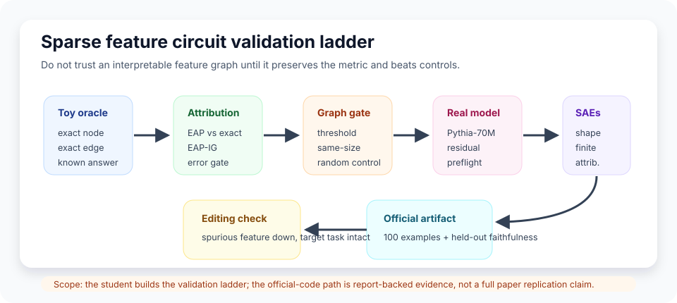
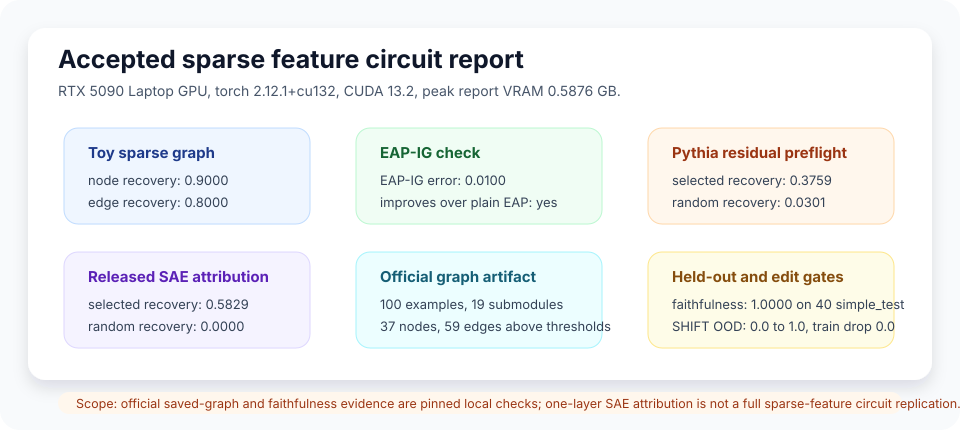

# [8.5] Sparse Feature Circuits

> **Notebooks: [exercises](../../exercises/part5_sparse_feature_circuits/8.5_Sparse_Feature_Circuits_exercises.ipynb) | [solutions](../../exercises/part5_sparse_feature_circuits/8.5_Sparse_Feature_Circuits_solutions.ipynb)**

> **Local-first extension.** Sections 8.2-8.4 built attribution scores,
> circuit metrics, and graph-shaped claims. Sparse Feature Circuits ask the
> same question one level lower: can we explain the behavior using sparse
> features rather than opaque residual or MLP coordinates?

```python
GT_TIER = "GT-0"
EXERCISE_ID = "8_5_sparse_feature_circuits"
EXPECTED_RUNTIME = "seconds on toy contract; minutes on local real-model path"
REQUIRES_GPU = True  # CPU exercises; CUDA report verification is required
```

Please send any problems / bugs on the `#errata` channel in the [Slack group](https://info-arena.github.io/ARENA_img/slack.html), and ask any questions on the dedicated channels for this chapter of material.

If you want to change to dark mode, you can do this by clicking the three horizontal lines in the top-right, then navigating to Settings -> Theme.

Links to earlier chapters: [(0) Fundamentals](https://arena-chapter0-fundamentals.streamlit.app/), [(1) Transformer Interpretability](https://arena-chapter1-transformer-interp.streamlit.app/), [(2) RL](https://arena-chapter2-rl.streamlit.app/), [(3) LLM Evaluations](https://arena-chapter3-llm-evals.streamlit.app/), [(4) Alignment Science](https://arena-chapter4-alignment-science.streamlit.app/).


# Introduction

In earlier circuit work, a node might be "head 8.6" or "the final residual
position." That is useful, but still fairly coarse. Sparse Feature Circuits
instead decompose activations through learned sparse autoencoders (SAEs), then
ask whether a small graph of SAE features carries the behavior:

```text
clean/corrupt metric -> SAE features -> feature effects -> feature graph -> intervention checks
```

This section has two jobs. First, you will implement the local contract that a
sparse-feature graph must satisfy: exact node and edge patching, attribution
approximations, thresholding, random controls, and a small editing experiment.
Second, you will inspect the CUDA-backed evidence bundle that connects this
toy ladder to real Pythia-70M residual states, released SFC SAE dictionaries,
official saved graph artifacts, and held-out faithfulness checks.



The scope is deliberately precise. The learner exercises are a GT-0 toy sparse
feature contract plus report inspection. The committed CUDA report contains a
real Pythia-70M residual-feature preflight, a released one-layer SAE attribution
smoke, a pinned 100-example official-code graph artifact, and held-out
faithfulness on `simple_test`. This is strong local evidence, but it is not a
claim that you personally rebuilt the full Sparse Feature Circuits paper
pipeline from scratch inside the notebook.

## Content & Learning Objectives

### 1. Exact sparse-feature patching

> ##### Learning Objectives
>
> * Treat feature contributions as exact node-patching scores.
> * Treat source-feature edge scores as an exact edge-patching oracle.
> * Reject empty, duplicate, out-of-range, or non-finite feature selections.

### 2. Attribution approximations

> ##### Learning Objectives
>
> * Compare plain EAP and EAP-IG against exact patching scores.
> * Use approximation error as a gate before trusting a graph.
> * Notice when an attribution method improves ranking but fails calibration.

### 3. Graph validation and controls

> ##### Learning Objectives
>
> * Threshold a feature graph and check target-metric preservation.
> * Compare against a same-size disjoint random graph.
> * Interpret a random-control failure as evidence against the claimed graph.

### 4. Sparse-feature editing

> ##### Learning Objectives
>
> * Suppress a spurious feature in a generated SHIFT-style task.
> * Preserve target-task accuracy while improving OOD accuracy.
> * Require a same-size random edit to remain a negative control.

### 5. Official artifact evidence

> ##### Learning Objectives
>
> * Smoke-test released SAE state dicts for shape, activity, and finiteness.
> * Distinguish artifact readiness from mechanistic replication.
> * Read the final CUDA report without overstating its claim scope.

# Setup Code

```python
import json
import math
import sys
from dataclasses import dataclass
from pathlib import Path

import torch as t

chapter = "chapter8_automated_circuits"
section = "part5_sparse_feature_circuits"
root_dir = next(p for p in [Path.cwd(), *Path.cwd().parents] if (p / chapter).exists())
exercises_dir = root_dir / chapter / "exercises"
section_dir = exercises_dir / section

if str(root_dir) not in sys.path:
    sys.path.append(str(root_dir))
if str(exercises_dir) not in sys.path:
    sys.path.append(str(exercises_dir))

import part5_sparse_feature_circuits.tests as tests
import part5_sparse_feature_circuits.utils as utils
```

We will use small dataclasses rather than loose dictionaries. This makes each
test check both the pass/fail flag and the quantity which justified the flag.

```python
@dataclass(frozen=True)
class FeatureNodePatchingReport:
    selected_feature_ids: tuple[int, ...]
    full_logit_diff: float
    graph_logit_diff: float
    recovered_fraction: float
    passes_recovery: bool


@dataclass(frozen=True)
class FeatureEdgePatchingReport:
    selected_edges: tuple[tuple[int, int], ...]
    full_edge_score: float
    graph_edge_score: float
    recovered_fraction: float
    passes_recovery: bool


@dataclass(frozen=True)
class EAPIGComparisonReport:
    exact_error: float
    eap_error: float
    eap_ig_error: float
    eap_passes: bool
    eap_ig_improves: bool


@dataclass(frozen=True)
class FeatureGraphThresholdReport:
    selected_feature_ids: tuple[int, ...]
    threshold: float
    full_logit_diff: float
    graph_logit_diff: float
    recovered_fraction: float
    passes_threshold: bool


@dataclass(frozen=True)
class RandomFeatureGraphControlReport:
    target_graph_logit_diff: float
    random_graph_logit_diff: float
    target_recovered_fraction: float
    random_recovered_fraction: float
    margin: float
    random_graph_fails: bool


@dataclass(frozen=True)
class SparseFeatureEditingReport:
    target_feature_ids: tuple[int, ...]
    spurious_feature_ids: tuple[int, ...]
    random_feature_ids: tuple[int, ...]
    baseline_train_accuracy: float
    baseline_ood_accuracy: float
    edited_train_accuracy: float
    edited_ood_accuracy: float
    random_edit_ood_accuracy: float
    black_box_baseline_ood_accuracy: float
    spurious_reliance_before: float
    spurious_reliance_after: float
    target_reliance_after: float
    ood_improvement: float
    random_edit_improvement: float
    target_accuracy_drop: float
    spurious_reliance_decreases: bool
    target_task_preserved: bool
    ood_generalization_improves: bool
    random_edit_control_fails: bool
    editing_passes: bool
```

The helper functions below are not the exercise. They make the exercise fail in
educational ways when the proposed sparse-feature graph is malformed.

```python
def _index_tensor(indices: t.Tensor | list[int] | tuple[int, ...], *, device: t.device) -> t.Tensor:
    if isinstance(indices, t.Tensor):
        return indices.to(device=device, dtype=t.long).flatten()
    return t.tensor(list(indices), device=device, dtype=t.long)


def _require_finite_tensor(name: str, tensor: t.Tensor) -> t.Tensor:
    if tensor.numel() == 0:
        raise ValueError(f"{name} must be non-empty.")
    if not t.isfinite(tensor.float()).all():
        raise ValueError(f"{name} must contain only finite values.")
    return tensor


def _require_finite_nonnegative(name: str, value: float) -> float:
    value_float = float(value)
    if not math.isfinite(value_float):
        raise ValueError(f"{name} must be finite.")
    if value_float < 0:
        raise ValueError(f"{name} must be non-negative.")
    return value_float


def _validate_index_tensor(ids: t.Tensor, *, name: str, upper_bound: int) -> t.Tensor:
    if ids.numel() == 0:
        raise ValueError(f"at least one {name} id is required.")
    if ids.min().item() < 0 or ids.max().item() >= upper_bound:
        raise ValueError(f"{name} id is out of range.")
    if ids.unique().numel() != ids.numel():
        raise ValueError(f"{name} ids must be unique.")
    return ids


def _fraction(numerator: float, denominator: float) -> float:
    if denominator == 0:
        raise ValueError("reference score must be nonzero.")
    return numerator / denominator
```

The toy fixture has a known answer. Features 0 and 1 explain 90% of the node
effect, and edge `(0, 1)` explains 80% of the edge mass.

```python
def toy_sparse_feature_fixture(device: str | t.device = "cpu") -> dict[str, t.Tensor]:
    device = t.device(device)
    return {
        "feature_contributions": t.tensor([0.7, 0.2, 0.05, 0.05], device=device),
        "edge_scores": t.tensor([[0.05, 0.8], [0.05, 0.1]], device=device),
        "exact_scores": t.tensor([0.7, 0.2, 0.05, 0.05], device=device),
        "eap_scores": t.tensor([0.5, 0.35, 0.1, 0.05], device=device),
        "eap_ig_scores": t.tensor([0.69, 0.21, 0.04, 0.06], device=device),
    }
```

# Exact Node Patching

### Exercise - implement a sparse-feature node oracle

> Difficulty: medium
> Importance: high
>
> You should spend 10 minutes on this exercise.

Use the feature contribution vector as the slow exact node-patching oracle.
Your report should say how much of the full logit-difference effect is
recovered by the selected feature IDs.

```python
def exact_feature_node_patching_report(
    feature_contributions: t.Tensor,
    feature_ids: t.Tensor | list[int] | tuple[int, ...],
    *,
    min_recovered_fraction: float = 0.75,
) -> FeatureNodePatchingReport:
    raise NotImplementedError()


tests.test_exact_feature_node_patching_report_recovers_selected_features(
    exact_feature_node_patching_report,
)
```

<details>
<summary>Expected output</summary>

```text
All tests in `test_exact_feature_node_patching_report_recovers_selected_features` passed!
```

</details>

<details>
<summary>Help - what should the denominator be?</summary>

Use the full contribution vector as the reference score. The selected graph
score is the sum over selected IDs only. If the full score is zero, there is no
meaningful recovered fraction, so the function should raise an error.

</details>

<details>
<summary>Common bugs</summary>

- Treating the input IDs as a Boolean mask.
- Accepting duplicate feature IDs, which double-counts one feature.
- Returning the selected score but not the recovered fraction.

</details>

<details>
<summary>Solution</summary>

```python
def exact_feature_node_patching_report(
    feature_contributions: t.Tensor,
    feature_ids: t.Tensor | list[int] | tuple[int, ...],
    *,
    min_recovered_fraction: float = 0.75,
) -> FeatureNodePatchingReport:
    min_recovered_fraction = _require_finite_nonnegative(
        "min_recovered_fraction", min_recovered_fraction
    )
    contributions = _require_finite_tensor(
        "feature_contributions", feature_contributions.flatten().float()
    )
    ids = _validate_index_tensor(
        _index_tensor(feature_ids, device=contributions.device),
        name="feature",
        upper_bound=contributions.numel(),
    )
    full_logit_diff = contributions.sum().item()
    graph_logit_diff = contributions[ids].sum().item()
    recovered_fraction = _fraction(graph_logit_diff, full_logit_diff)
    return FeatureNodePatchingReport(
        selected_feature_ids=tuple(int(index) for index in ids.tolist()),
        full_logit_diff=full_logit_diff,
        graph_logit_diff=graph_logit_diff,
        recovered_fraction=recovered_fraction,
        passes_recovery=recovered_fraction >= min_recovered_fraction,
    )
```

</details>

# Exact Edge Patching

### Exercise - implement a sparse-feature edge oracle

> Difficulty: medium
> Importance: high
>
> You should spend 10 minutes on this exercise.

Now treat `edge_scores[source, feature]` as exact edge-patching scores. The
selected graph is a list of `(source_id, feature_id)` pairs. Use absolute edge
magnitudes, because an edge can matter by pushing the metric either up or down.

```python
def exact_feature_edge_patching_report(
    edge_scores: t.Tensor,
    selected_edges: list[tuple[int, int]] | tuple[tuple[int, int], ...],
    *,
    min_recovered_fraction: float = 0.75,
) -> FeatureEdgePatchingReport:
    raise NotImplementedError()


tests.test_exact_feature_edge_patching_report_recovers_selected_edges(
    exact_feature_edge_patching_report,
)
```

<details>
<summary>Expected output</summary>

```text
All tests in `test_exact_feature_edge_patching_report_recovers_selected_edges` passed!
```

</details>

<details>
<summary>Help - why absolute values?</summary>

An edge with a large negative effect is still mechanistically important. The
edge oracle asks whether the graph captures effect mass, not whether every
captured edge pushes the same direction.

</details>

<details>
<summary>Common bugs</summary>

- Summing signed edge scores, which can cancel important edges.
- Forgetting to check the source dimension and the feature dimension separately.
- Allowing the same edge to appear twice.

</details>

<details>
<summary>Solution</summary>

```python
def exact_feature_edge_patching_report(
    edge_scores: t.Tensor,
    selected_edges: list[tuple[int, int]] | tuple[tuple[int, int], ...],
    *,
    min_recovered_fraction: float = 0.75,
) -> FeatureEdgePatchingReport:
    min_recovered_fraction = _require_finite_nonnegative(
        "min_recovered_fraction", min_recovered_fraction
    )
    if edge_scores.ndim != 2:
        raise ValueError("edge_scores must have shape (sources, features).")
    edge_scores = _require_finite_tensor("edge_scores", edge_scores.float())
    if not selected_edges:
        raise ValueError("at least one edge is required.")
    edge_magnitudes = edge_scores.abs()
    selected_score = 0.0
    normalized_edges = []
    for source_id, feature_id in selected_edges:
        if not 0 <= source_id < edge_scores.shape[0]:
            raise ValueError("source id is out of range.")
        if not 0 <= feature_id < edge_scores.shape[1]:
            raise ValueError("feature id is out of range.")
        selected_score += edge_magnitudes[source_id, feature_id].item()
        normalized_edges.append((int(source_id), int(feature_id)))
    if len(set(normalized_edges)) != len(normalized_edges):
        raise ValueError("selected edges must be unique.")
    full_score = edge_magnitudes.sum().item()
    recovered_fraction = _fraction(selected_score, full_score)
    return FeatureEdgePatchingReport(
        selected_edges=tuple(normalized_edges),
        full_edge_score=full_score,
        graph_edge_score=selected_score,
        recovered_fraction=recovered_fraction,
        passes_recovery=recovered_fraction >= min_recovered_fraction,
    )
```

</details>

# EAP and EAP-IG

### Exercise - compare attribution approximations against exact patching

> Difficulty: medium
> Importance: high
>
> You should spend 10 minutes on this exercise.

Exact patching is the ground-truth oracle in this toy setting. Plain EAP is
cheaper but can be biased by saturation. EAP-IG should move the approximate
scores closer to exact patching.

```python
def eap_ig_comparison_report(
    exact_scores: t.Tensor,
    eap_scores: t.Tensor,
    eap_ig_scores: t.Tensor,
    *,
    max_eap_ig_error: float = 0.05,
) -> EAPIGComparisonReport:
    raise NotImplementedError()


tests.test_eap_ig_comparison_report_improves_over_plain_eap(eap_ig_comparison_report)
```

<details>
<summary>Expected output</summary>

```text
All tests in `test_eap_ig_comparison_report_improves_over_plain_eap` passed!
```

</details>

<details>
<summary>Help - what counts as improvement?</summary>

Use mean absolute error against exact scores. EAP-IG should both have lower
error than plain EAP and stay below the configured maximum EAP-IG error.

</details>

<details>
<summary>Common bugs</summary>

- Comparing EAP and EAP-IG to each other instead of to exact patching.
- Ignoring mismatched tensor shapes.
- Treating a smaller but still too-large EAP-IG error as a pass.

</details>

<details>
<summary>Solution</summary>

```python
def eap_ig_comparison_report(
    exact_scores: t.Tensor,
    eap_scores: t.Tensor,
    eap_ig_scores: t.Tensor,
    *,
    max_eap_ig_error: float = 0.05,
) -> EAPIGComparisonReport:
    max_eap_ig_error = _require_finite_nonnegative("max_eap_ig_error", max_eap_ig_error)
    if exact_scores.shape != eap_scores.shape or exact_scores.shape != eap_ig_scores.shape:
        raise ValueError("exact, EAP, and EAP-IG scores must have matching shapes.")
    exact = _require_finite_tensor("exact_scores", exact_scores.float())
    eap = _require_finite_tensor("eap_scores", eap_scores.float())
    eap_ig = _require_finite_tensor("eap_ig_scores", eap_ig_scores.float())
    eap_error = (exact - eap).abs().mean().item()
    eap_ig_error = (exact - eap_ig).abs().mean().item()
    return EAPIGComparisonReport(
        exact_error=0.0,
        eap_error=eap_error,
        eap_ig_error=eap_ig_error,
        eap_passes=eap_error <= max_eap_ig_error,
        eap_ig_improves=eap_ig_error < eap_error and eap_ig_error <= max_eap_ig_error,
    )
```

</details>

# Thresholded Graphs and Random Controls

### Exercise - threshold a feature graph

> Difficulty: medium
> Importance: high
>
> You should spend 5 minutes on this exercise.

Select every feature whose absolute contribution is at least `threshold`, then
reuse your exact node-patching report to check whether the thresholded graph
preserves the target metric.

```python
def threshold_feature_graph_report(
    feature_contributions: t.Tensor,
    *,
    threshold: float,
    min_recovered_fraction: float = 0.8,
) -> FeatureGraphThresholdReport:
    raise NotImplementedError()


tests.test_threshold_feature_graph_report_keeps_large_features(threshold_feature_graph_report)
```

<details>
<summary>Expected output</summary>

```text
All tests in `test_threshold_feature_graph_report_keeps_large_features` passed!
```

</details>

<details>
<summary>Help - what should happen if nothing passes the threshold?</summary>

Raise a clear error. An empty graph cannot be a sparse-feature explanation of a
nonzero metric.

</details>

<details>
<summary>Common bugs</summary>

- Using `>` rather than `>=`, which drops features exactly at threshold.
- Applying the threshold to signed values rather than magnitudes.
- Returning feature IDs but not validating metric preservation.

</details>

<details>
<summary>Solution</summary>

```python
def threshold_feature_graph_report(
    feature_contributions: t.Tensor,
    *,
    threshold: float,
    min_recovered_fraction: float = 0.8,
) -> FeatureGraphThresholdReport:
    threshold = _require_finite_nonnegative("threshold", threshold)
    min_recovered_fraction = _require_finite_nonnegative(
        "min_recovered_fraction", min_recovered_fraction
    )
    contributions = _require_finite_tensor(
        "feature_contributions", feature_contributions.flatten().float()
    )
    selected = contributions.abs().ge(threshold).nonzero(as_tuple=False).flatten()
    if selected.numel() == 0:
        raise ValueError("threshold selected no features.")
    node_report = exact_feature_node_patching_report(
        contributions, selected, min_recovered_fraction=min_recovered_fraction
    )
    return FeatureGraphThresholdReport(
        selected_feature_ids=node_report.selected_feature_ids,
        threshold=threshold,
        full_logit_diff=node_report.full_logit_diff,
        graph_logit_diff=node_report.graph_logit_diff,
        recovered_fraction=node_report.recovered_fraction,
        passes_threshold=node_report.passes_recovery,
    )
```

</details>

### Exercise - implement the same-size random graph control

> Difficulty: medium
> Importance: high
>
> You should spend 10 minutes on this exercise.

A sparse-feature graph is more convincing if it beats a disjoint random graph
with the same number of features. This is not a complete causal proof, but it is
a useful negative control.

```python
def random_feature_graph_control_report(
    feature_contributions: t.Tensor,
    target_feature_ids: t.Tensor | list[int] | tuple[int, ...],
    random_feature_ids: t.Tensor | list[int] | tuple[int, ...],
    *,
    min_margin: float = 0.2,
) -> RandomFeatureGraphControlReport:
    raise NotImplementedError()


tests.test_random_feature_graph_control_report_rejects_random_graph(
    random_feature_graph_control_report,
)
```

<details>
<summary>Expected output</summary>

```text
All tests in `test_random_feature_graph_control_report_rejects_random_graph` passed!
```

</details>

<details>
<summary>Help - why require disjoint same-size controls?</summary>

If the random graph overlaps the target graph, it can pass by secretly using the
claimed explanation. If it has fewer features, it is too easy to beat; if it has
more features, it is too hard to beat.

</details>

<details>
<summary>Common bugs</summary>

- Letting random IDs overlap target IDs.
- Comparing raw scores instead of recovered fractions.
- Forgetting to enforce equal graph size.

</details>

<details>
<summary>Solution</summary>

```python
def random_feature_graph_control_report(
    feature_contributions: t.Tensor,
    target_feature_ids: t.Tensor | list[int] | tuple[int, ...],
    random_feature_ids: t.Tensor | list[int] | tuple[int, ...],
    *,
    min_margin: float = 0.2,
) -> RandomFeatureGraphControlReport:
    min_margin = _require_finite_nonnegative("min_margin", min_margin)
    contributions = _require_finite_tensor(
        "feature_contributions", feature_contributions.flatten().float()
    )
    target_ids = _validate_index_tensor(
        _index_tensor(target_feature_ids, device=contributions.device),
        name="target feature",
        upper_bound=contributions.numel(),
    )
    random_ids = _validate_index_tensor(
        _index_tensor(random_feature_ids, device=contributions.device),
        name="random feature",
        upper_bound=contributions.numel(),
    )
    if target_ids.numel() != random_ids.numel():
        raise ValueError("target and random graphs must have the same number of features.")
    if set(target_ids.tolist()) & set(random_ids.tolist()):
        raise ValueError("random graph control must not overlap target features.")
    target = exact_feature_node_patching_report(contributions, target_ids)
    random = exact_feature_node_patching_report(contributions, random_ids)
    margin = target.recovered_fraction - random.recovered_fraction
    return RandomFeatureGraphControlReport(
        target_graph_logit_diff=target.graph_logit_diff,
        random_graph_logit_diff=random.graph_logit_diff,
        target_recovered_fraction=target.recovered_fraction,
        random_recovered_fraction=random.recovered_fraction,
        margin=margin,
        random_graph_fails=margin >= min_margin,
    )
```

</details>

# Sparse-Feature Editing

### Exercise - suppress a spurious feature without breaking the target task

> Difficulty: hard
> Importance: medium
>
> You should spend 15 minutes on this exercise.

The generated organism has two useful features. Feature 0 is the true task
feature. Feature 1 is spuriously correlated with the training labels but
anti-correlated OOD. Your intervention should suppress the spurious feature,
preserve training accuracy, improve OOD accuracy, and beat a same-size random
edit.

```python
def shift_style_sparse_feature_editing_report(
    train_features: t.Tensor,
    train_labels: t.Tensor,
    ood_features: t.Tensor,
    ood_labels: t.Tensor,
    classifier_weights: t.Tensor,
    *,
    target_feature_ids: t.Tensor | list[int] | tuple[int, ...],
    spurious_feature_ids: t.Tensor | list[int] | tuple[int, ...],
    random_feature_ids: t.Tensor | list[int] | tuple[int, ...],
    suppression: float = 0.0,
    max_target_accuracy_drop: float = 0.05,
    min_ood_improvement: float = 0.5,
    min_random_edit_gap: float = 0.5,
) -> SparseFeatureEditingReport:
    raise NotImplementedError()


tests.test_shift_style_sparse_feature_editing_report_removes_spurious_feature(
    shift_style_sparse_feature_editing_report,
)
```

<details>
<summary>Expected output</summary>

```text
All tests in `test_shift_style_sparse_feature_editing_report_removes_spurious_feature` passed!
```

</details>

<details>
<summary>Help - what is being edited?</summary>

This exercise edits a small linear classifier over generated sparse features,
not a full Transformer. The point is to learn the safety contract for editing:
target behavior is preserved, OOD behavior improves, and a random feature edit
does not get the same result.

</details>

<details>
<summary>Common bugs</summary>

- Suppressing the target feature instead of the spurious feature.
- Reporting OOD improvement without checking training accuracy.
- Letting the random edit control edit the spurious feature.

</details>

<details>
<summary>Solution</summary>

The full reference implementation is in
`chapter8_automated_circuits/exercises/part5_sparse_feature_circuits/solutions.py`.
The essential structure is:

```python
baseline_train_accuracy = _binary_accuracy(train @ weights, labels_train)
baseline_ood_accuracy = _binary_accuracy(ood @ weights, labels_ood)

edited_weights = weights.clone()
edited_weights[spurious_ids] *= suppression
random_weights = weights.clone()
random_weights[random_ids] *= suppression

edited_train_accuracy = _binary_accuracy(train @ edited_weights, labels_train)
edited_ood_accuracy = _binary_accuracy(ood @ edited_weights, labels_ood)
random_edit_ood_accuracy = _binary_accuracy(ood @ random_weights, labels_ood)

editing_passes = (
    spurious_reliance_after < spurious_reliance_before
    and baseline_train_accuracy - edited_train_accuracy <= max_target_accuracy_drop
    and edited_ood_accuracy - baseline_ood_accuracy >= min_ood_improvement
    and edited_ood_accuracy - random_edit_ood_accuracy >= min_random_edit_gap
)
```

</details>

# SAE and Official Artifact Checks

### Exercise - smoke-test a released SAE state dict

> Difficulty: medium
> Importance: high
>
> You should spend 10 minutes on this exercise.

Before a sparse-feature graph can mean anything, the SAE tensor shapes must
match the activation dimension, the encoded features must be finite, and the
activation should produce at least one active feature. The tests use a tiny
state dict; the final CUDA report uses the released `resid_out_layer5` SFC SAE.

```python
@dataclass(frozen=True)
class SparseAutoencoderStateDictSmokeReport:
    activation_dim: int
    dict_size: int
    feature_l0: int
    feature_max: float
    reconstruction_mse: float
    relative_l2_error: float
    shapes_match: bool
    tensors_finite: bool
    passes_smoke: bool


def sparse_autoencoder_state_dict_smoke_report(
    state_dict: dict[str, t.Tensor],
    activation: t.Tensor,
) -> SparseAutoencoderStateDictSmokeReport:
    raise NotImplementedError()


tests.test_sparse_autoencoder_state_dict_smoke_report_checks_shapes(
    sparse_autoencoder_state_dict_smoke_report,
)
```

<details>
<summary>Expected output</summary>

```text
All tests in `test_sparse_autoencoder_state_dict_smoke_report_checks_shapes` passed!
```

</details>

<details>
<summary>Help - what shapes are expected?</summary>

For a dense activation vector of length `d_model` and a dictionary of size
`dict_size`, the expected shapes are:

```text
activation: [d_model]
bias: [d_model]
encoder.weight: [dict_size, d_model]
encoder.bias: [dict_size]
decoder.weight: [d_model, dict_size]
```

</details>

<details>
<summary>Common bugs</summary>

- Transposing `decoder.weight` the wrong way.
- Treating an all-zero feature vector as a successful smoke test.
- Checking shapes but not checking finite encoded and decoded tensors.

</details>

<details>
<summary>Solution</summary>

```python
features = t.relu((x - bias) @ encoder_weight.T + encoder_bias)
reconstruction = features @ decoder_weight.T + bias
error = reconstruction - x
passes_smoke = shapes_match and tensors_finite and feature_l0 > 0
```

The solution notebook contains the full validation code, including keyed errors
for missing SAE tensors and non-finite values.

</details>

### Exercise - inspect the report-backed CUDA contract

> Difficulty: medium
> Importance: high
>
> You should spend 10 minutes on this exercise.

The final exercise is to read the committed `verification_report.json` as a
scientific claim. Check the claim scope fields before looking at pass/fail flags.
Artifact readiness is not replication; one-layer SAE attribution is not the full
paper graph; held-out faithfulness is the strongest official-code graph result.

```python
def run_gpu_test(max_vram_gb: float = 24.0) -> dict:
    report = json.loads((section_dir / "verification_report.json").read_text())
    metrics = report["metrics"]["gpu_test"]
    assert report["accepted"]
    assert report["peak_vram_gb"] <= max_vram_gb
    return metrics


gpu_metrics = run_gpu_test(max_vram_gb=24.0)
tests.test_pythia_subject_verb_residual_preflight_result(
    gpu_metrics["pythia_subject_verb_preflight"],
)
tests.test_official_sae_feature_attribution_smoke_result(
    gpu_metrics["official_sae_feature_attribution"],
)
tests.test_official_sparse_feature_circuit_faithfulness_result(
    gpu_metrics["official_sparse_feature_circuit_faithfulness_report"],
)
```

<details>
<summary>Expected output</summary>

```text
All tests in `test_pythia_subject_verb_residual_preflight_result` passed!
All tests in `test_official_sae_feature_attribution_smoke_result` passed!
All tests in `test_official_sparse_feature_circuit_faithfulness_result` passed!
```

</details>

<details>
<summary>Help - how should I read the claim scopes?</summary>

Read them as guardrails. The report proves that local CUDA execution can load
the model/artifacts and reproduce the stated checks. It does not prove every
claim in the original paper, and it does not turn the generated editing toy into
real-model debiasing.

</details>

<details>
<summary>Common bugs</summary>

- Treating `official_artifact_readiness` as graph faithfulness.
- Ignoring random-control metrics when selected features look good.
- Checking only that a file exists, rather than checking the report schema and
  accepted metrics.

</details>

<details>
<summary>Solution</summary>

Use the solution notebook or run:

```python
from chapter8_automated_circuits.exercises.part5_sparse_feature_circuits import solutions

metrics = solutions.run_gpu_test(max_vram_gb=24.0)
assert metrics["pythia_subject_verb_preflight"]["random_control_fails"]
assert metrics["official_sae_feature_attribution"]["passes_smoke"]
assert metrics["official_sparse_feature_circuit_faithfulness_report"]["faithfulness"] >= 0.9
```

</details>

# Signature Result

The accepted local report gives a compact end-to-end picture of the section.



| Check | Result | Interpretation |
|---|---:|---|
| Toy node recovery | 0.9000 | selected features 0 and 1 recover most of the known effect |
| Toy edge recovery | 0.8000 | selected edge `(0, 1)` captures most edge mass |
| EAP-IG error | 0.0100 | integrated gradients improve over plain EAP |
| Pythia residual preflight | 0.3759 vs 0.0301 random | top residual dimensions beat random control |
| Official SAE attribution | 0.5829 vs 0.0000 random | one released SAE dictionary gives a real feature-attribution smoke |
| Official graph artifact | 37 nodes, 59 edges | pinned 100-example saved graph has nonzero thresholded structure |
| Held-out faithfulness | 1.0000 on 40 `simple_test` examples | official evaluator passes the local held-out gate |
| SHIFT-style edit | OOD 0.0 to 1.0, train drop 0.0 | generated spurious feature can be suppressed without damaging target accuracy |

<details>
<summary>Interpreting the result</summary>

The toy ladder tells you that the implementation contract is correct. The
Pythia residual preflight tells you that the real model/tokenizer/logit-diff
path is working. The released SAE smoke tells you that local dictionaries can
encode finite active features and produce a one-layer attribution signal. The
official saved graph and held-out faithfulness checks are the closest part to
the original SFC artifact path. The SHIFT-style edit is intentionally generated
data: it demonstrates the editing safety contract, not a real-model safety
claim.

</details>

# Full CUDA Verification Path

The report is committed so the notebook can be reviewed offline, but the
maintainer path regenerates it locally on CUDA:

```bash
BNB_CUDA_VERSION=130 uv run python scripts/run_extension_verification_reports.py --section 8.5 --max-vram-gb 24
```

Then rerun the focused section tests:

```bash
BNB_CUDA_VERSION=130 uv run python -m pytest -q \
  chapter8_automated_circuits/exercises/part5_sparse_feature_circuits/tests.py \
  tests/test_sparse_feature_circuits.py
```

The `BNB_CUDA_VERSION=130` environment variable is only for current
`bitsandbytes` wheel compatibility. The core PyTorch path uses
`torch==2.12.1+cu132`, reports `torch.version.cuda == "13.2"`, and runs the
section on the RTX 5090 Laptop GPU.

# Limitations

- The exercise implementation is GT-0: it teaches the sparse-feature graph
  contract on toy and generated organisms.
- The real-model preflight uses residual dimensions as bridge features. It is
  not an official sparse-feature graph replication.
- The one-layer SAE attribution smoke is meaningful, but it is not a full graph
  over every released dictionary.
- The official graph artifact and held-out faithfulness checks are pinned local
  evidence. They should not be described as a fresh live remote manifest unless
  the artifact-preparation script is rerun.
- The SHIFT-style editing organism is generated data. It tests an intervention
  contract, not a deployment-ready debiasing method.

# Further Research

- Replace the residual-feature preflight with a fully student-executed SAE
  feature graph on a small prompt batch.
- Add a minimal end-to-end graph-building notebook that uses a tiny local SAE
  trained inside the exercise.
- Compare graph faithfulness across thresholds, aggregation rules, and random
  control samplers.
- Port the editing exercise from generated features to a real-model SAE feature
  once the runtime and artifact size are suitable for the target machines.
- Track upstream `bitsandbytes` and `torchaudio` CUDA 13.x / CPython 3.14 wheel
  availability so the environment contract can become cleaner over time.

# Consolidating Understanding

You should now be able to distinguish three claims:

1. A feature graph preserves a metric on a toy oracle.
2. A feature graph beats same-size negative controls on real or released
   artifacts.
3. A sparse-feature circuit has been replicated at paper level.

This section establishes the first claim directly, provides pinned local
evidence for parts of the second, and avoids claiming the third.
